# 第十一章：网络协议分析工具包

本书中，我展示了几种可以用于网络协议分析的工具和库，但并未讨论我常用的许多工具。本附录描述了我在分析、调查和利用过程中发现有用的工具。每个工具根据其主要用途进行了分类，尽管有些工具可以适应多个类别。

### **被动网络协议捕获与分析工具**

如第二章中所讨论，被动网络捕获指的是在不干扰流量的情况下监听和捕获数据包。

#### ***Microsoft Message Analyzer***

**网站** *[`blogs.technet.com/b/messageanalyzer/`](http://blogs.technet.com/b/messageanalyzer/)*

**许可证** 商业版；免费

**平台** Windows

Microsoft Message Analyzer 是一个可扩展的工具，用于分析 Windows 上的网络流量。该工具包含多种协议解析器，并且可以通过自定义编程语言进行扩展。它的许多功能类似于 Wireshark，不过 Message Analyzer 还增加了对 Windows 事件的支持。

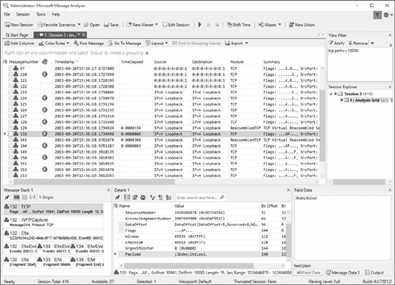

#### ***TCPDump 和 LibPCAP***

**网站** *[`www.tcpdump.org/`](http://www.tcpdump.org/)*； *[`www.winpcap.org/`](http://www.winpcap.org/)* 用于 Windows 实现（WinPcap/WinDump）

**许可证** BSD 许可证

**平台** BSD, Linux, macOS, Solaris, Windows

安装在许多操作系统上的 TCPDump 工具是网络数据包捕获工具的“祖父”。你可以使用它进行基础的网络数据分析。它的 LibPCAP 开发库允许你编写自己的工具来捕获流量并操作 PCAP 文件。

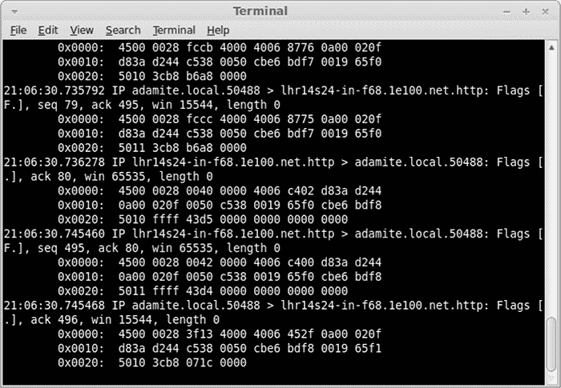

#### ***Wireshark***

**网站** *[`www.wireshark.org/`](https://www.wireshark.org/)*

**许可证** GPLv2

**平台** BSD, Linux, macOS, Solaris, Windows

Wireshark 是最受欢迎的被动数据包捕获与分析工具。它的图形用户界面（GUI）和丰富的协议分析模块库使它比 TCPDump 更强大且易于使用。Wireshark 支持几乎所有知名的捕获文件格式，因此即使你使用其他工具捕获流量，也可以用 Wireshark 进行分析。它甚至支持分析非传统协议，如 USB 或串口通信。大多数 Wireshark 发行版还包括`tshark`，它是 TCPDump 的替代工具，拥有 Wireshark 主界面中提供的大部分功能，例如协议解析器。它允许你在命令行查看更多种类的协议。

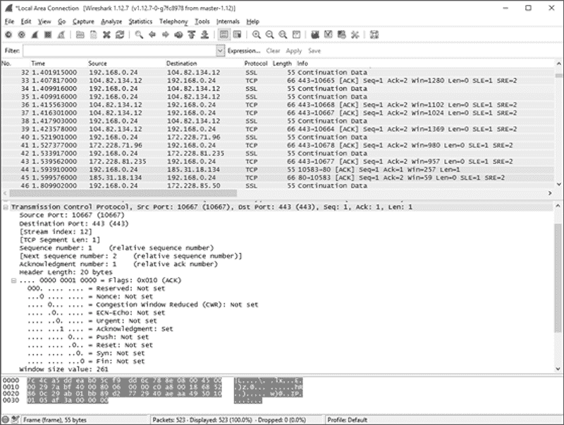

### **主动网络捕获与分析**

如第二章和第八章中所讨论，要修改、分析和利用网络流量，你需要使用主动网络捕获技术。在我分析和测试网络协议时，以下工具是我每天使用的。

#### ***Canape***

**网站** *[`github.com/ctxis/canape/`](https://github.com/ctxis/canape/)*

**许可证** GPLv3

**平台** Windows（需 .NET 4）

我开发了 Canape 工具，作为一个通用的网络协议中间人测试、分析和利用工具，具有可用的图形界面。Canape 包含一些工具，允许用户开发协议解析器、C# 和 IronPython 脚本扩展以及不同类型的中间人代理。自 1.4 版本起，它是开源的，用户可以为其开发做出贡献。

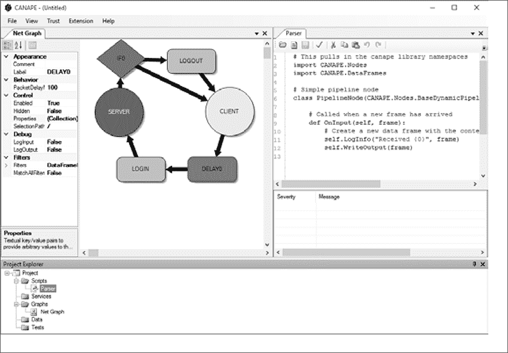

#### ***Canape Core***

**网站** *[`github.com/tyranid/CANAPE.Core/releases/`](https://github.com/tyranid/CANAPE.Core/releases/)*

**许可证** GPLv3

**平台** .NET Core 1.1 和 2.0（Linux、macOS、Windows）

Canape Core 库是原始 Canape 代码库的精简版本，设计用于命令行使用。在本书的示例中，我选择使用 Canape Core 作为首选库。它与原始的 Canape 工具功能相当，但可以在任何支持 .NET Core 的操作系统上使用，而不仅限于 Windows。

#### ***Mallory***

**网站** *[`github.com/intrepidusgroup/mallory/`](https://github.com/intrepidusgroup/mallory/)*

**许可证** Python 软件基金会许可证 v2；如果使用 GUI，则为 GPLv3

**平台** Linux

Mallory 是一个可扩展的中间人工具，充当网络网关，使得捕获、分析和修改流量的过程对正在测试的应用程序透明。你可以使用 Python 库以及图形界面调试器来配置 Mallory。你需要配置一个单独的 Linux 虚拟机来使用它。有关一些有用的说明，请访问 *[`bitbucket.org/IntrepidusGroup/mallory/wiki/Mallory_Minimal_Guide/`](https://bitbucket.org/IntrepidusGroup/mallory/wiki/Mallory_Minimal_Guide/)*。

### **网络连接和协议测试**

如果你正在尝试测试一个未知的协议或网络设备，基本的网络测试会非常有用。本节中列出的工具帮助你发现并连接到目标设备上暴露的网络服务器。

#### ***Hping***

**网站** *[`www.hping.org/`](http://www.hping.org/)*

**许可证** GPLv2

**平台** BSD、Linux、macOS、Windows

Hping 工具与传统的 `ping` 工具有些相似，但它不仅支持 ICMP 回显请求。你还可以用它来构造自定义网络数据包，发送到目标并显示任何响应。这是你工具箱中非常有用的一个工具。

#### ***Netcat***

**网站** 原始版本请见 *[`nc110.sourceforge.net/`](http://nc110.sourceforge.net/)*，GNU 版本请见 *[`netcat.sourceforge.net/`](http://netcat.sourceforge.net/)*

**许可证** GPLv2，公有领域

**平台** BSD、Linux、macOS、Windows

Netcat 是一个命令行工具，可以连接到任意的 TCP 或 UDP 端口，并允许你发送和接收数据。它支持创建发送或监听套接字，是网络测试中最简单的工具之一。Netcat 有许多变种，令人烦恼的是，它们都使用不同的命令行选项。但它们的功能基本相同。

#### ***Nmap***

**网站** *[`nmap.org/`](https://nmap.org/)*

**许可证** GPLv2

**平台** BSD、Linux、macOS、Windows

如果你需要扫描远程系统上开放的网络接口，Nmap 是最好的选择。它支持多种从 TCP 和 UDP 套接字服务器获取响应的方式，以及不同的分析脚本。在测试未知设备时，它是无价的。

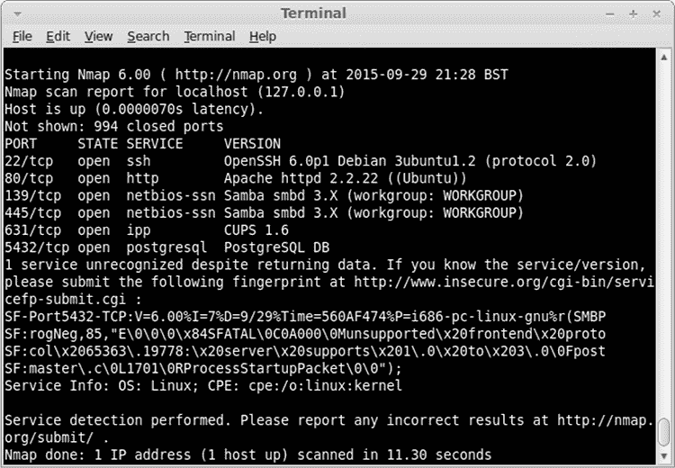

### **Web 应用测试**

虽然本书并不专注于 Web 应用测试，但这是网络协议分析中的一个重要部分。HTTP 是互联网上最广泛使用的协议之一，甚至用于代理其他协议，如 DCE/RPC，以绕过防火墙。以下是我使用并推荐的一些工具。

#### ***Burp Suite***

**网站** *[`portswigger.net/burp/`](https://portswigger.net/burp/)*

**许可证** 商业版；有有限的免费版

**平台** 支持的 Java 平台（Linux、macOS、Solaris、Windows）

Burp Suite 是商业 Web 应用测试工具的黄金标准。它使用 Java 编写，以最大化跨平台能力，提供了进行 Web 应用测试所需的所有功能，包括内置代理、SSL 解密支持和易于扩展性。免费版功能较少，如果你打算频繁使用，可以考虑购买商业版。

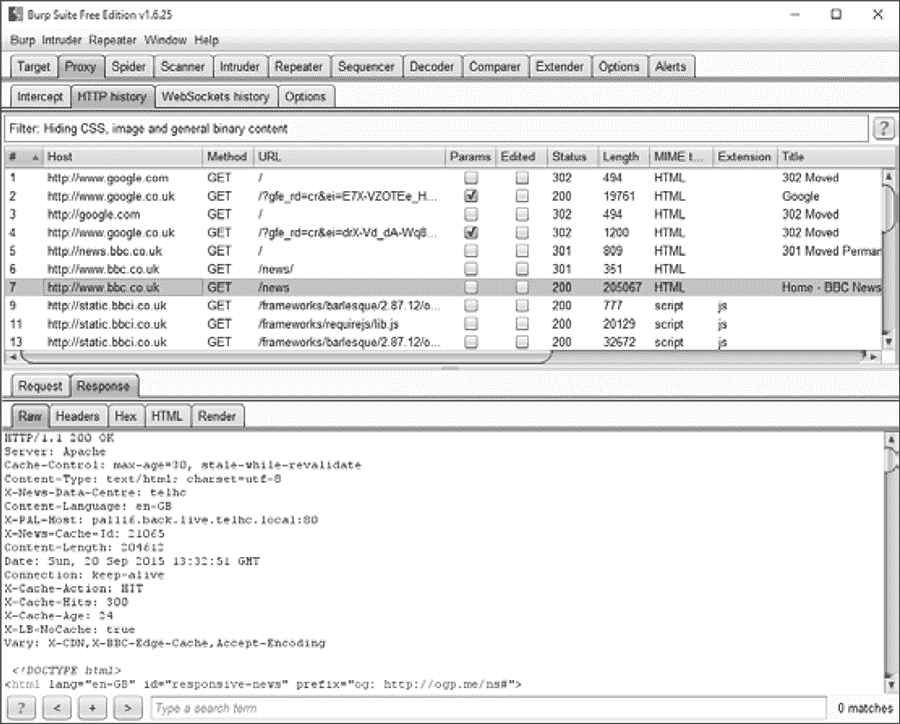

#### ***Zed Attack Proxy (ZAP)***

**网站** *[`www.owasp.org/index.php/ZAP`](https://www.owasp.org/index.php/ZAP)*

**许可证** Apache License v2

**平台** 支持的 Java 平台（Linux、macOS、Solaris、Windows）

如果 Burp Suite 的价格超出预算，ZAP 是一个很好的免费选择。ZAP 由 OWASP 开发，使用 Java 编写，可以编写脚本，并且由于其开源，容易扩展。

#### ***Mitmproxy***

**网站** *[`mitmproxy.org/`](https://mitmproxy.org/)*

**许可证** MIT

**平台** 任何支持 Python 的平台，尽管在 Windows 上该程序有些限制

Mitmproxy 是一个基于命令行的 Web 应用测试工具，使用 Python 编写。它的许多标准功能包括拦截、修改和重放请求。你还可以将它作为独立的库集成到你自己的应用程序中。

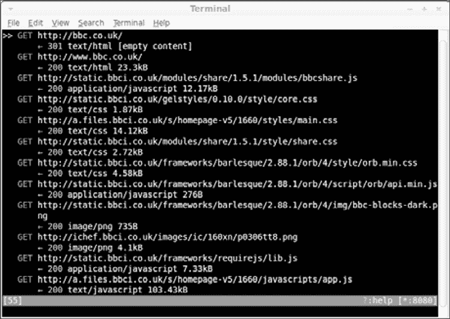

### **模糊测试、数据包生成与漏洞利用框架**

每当您为开发漏洞利用和发现新漏洞而工作时，通常需要实现许多常见功能。以下工具提供了一个框架，允许您减少需要实现的标准代码和常见功能的数量。

#### ***American Fuzzy Lop (AFL)***

**网站** *[`lcamtuf.coredump.cx/afl/`](http://lcamtuf.coredump.cx/afl/)*

**许可证** Apache License v2

**平台** Linux；某些支持其他类 Unix 平台

不要被它可爱的名字迷惑。American Fuzzy Lop (AFL)可能以一种兔子品种命名，但它是一种非常适合模糊测试的工具，特别是可以重新编译以包含特殊仪器的应用程序。它几乎可以从最小的示例中生成程序的有效输入，具有近乎神奇的能力。

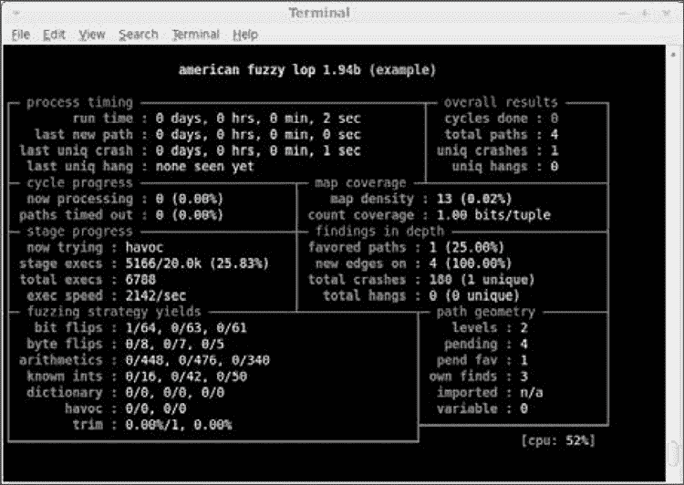

#### ***Kali Linux***

**网站** *[`www.kali.org/`](https://www.kali.org/)*

**许可证** 根据使用的软件包而定，涵盖各种开源和非免费许可证

**平台** ARM，Intel x86 和 x64

Kali 是专为渗透测试设计的 Linux 发行版。它预装了 Nmap、Wireshark、Burp Suite 和本附录中列出的各种其他工具。Kali 非常适用于测试和利用网络协议漏洞，您可以本地安装或作为 Live 发行版运行它。

#### ***Metasploit Framework***

**网站** *[`github.com/rapid7/metasploit-framework/`](https://github.com/rapid7/metasploit-framework/)*

**许可证** BSD 许可证，部分使用其他许可证

**平台** BSD，Linux，macOS，Windows

Metasploit 基本上是当您需要通用漏洞利用框架时唯一的选择，至少是如果您不想付费的话。Metasploit 是开源的，正在积极更新新的漏洞，并将运行在几乎所有平台上，这使其对于测试新设备非常有用。Metasploit 提供许多内置库来执行典型的利用任务，如生成和编码 shell 代码，生成反向 shell 和获取提升的特权，使您可以专注于开发您的利用而不必处理各种实现细节。

#### ***Scapy***

**网站** *[`www.secdev.org/projects/scapy/`](http://www.secdev.org/projects/scapy/)*

**许可证** GPLv2

**平台** 任何支持 Python 的平台，尽管在类 Unix 平台上效果最佳

Scapy 是用于 Python 的网络数据包生成和操作库。您可以使用它构建几乎任何类型的数据包，从以太网数据包到 TCP 或 HTTP 数据包。您可以重放数据包以测试网络服务器在接收它们时的行为。这种功能使其成为测试、分析或网络协议 fuzzing 的非常灵活的工具。

#### ***Sulley***

**网站** *[`github.com/OpenRCE/sulley/`](https://github.com/OpenRCE/sulley/)*

**许可证** GPLv2

**平台** 任何支持 Python 的平台

Sulley 是一个基于 Python 的模糊测试库和框架，旨在简化数据表示、传输和仪器化。你可以用它来模糊测试从文件格式到网络协议的任何内容。

### **网络欺骗和重定向**

要捕获网络流量，有时需要将流量重定向到一个监听机器。此部分列出了一些提供网络欺骗和重定向实现方式的工具，且无需大量配置。

#### ***DNSMasq***

**网站** *[`www.thekelleys.org.uk/dnsmasq/doc.html`](http://www.thekelleys.org.uk/dnsmasq/doc.html)*

**许可证** GPLv2

**平台** Linux

DNSMasq 工具旨在快速设置基本网络服务，如 DNS 和 DHCP，这样你就不必为复杂的服务配置而烦恼。尽管 DNSMasq 并非专为网络欺骗设计，但你可以将其重新利用来重定向设备的网络流量以进行捕获、分析和利用。

#### ***Ettercap***

**网站** *[`ettercap.github.io/ettercap/`](https://ettercap.github.io/ettercap/)*

**许可证** GPLv2

**平台** Linux, macOS

Ettercap（在第四章中讨论）是一种中间人工具，旨在监听两台设备之间的网络流量。它允许你伪造 DHCP 或 ARP 地址以重定向网络流量。

### **可执行文件逆向工程**

审查应用程序的源代码通常是确定网络协议如何工作的最简单方法。然而，当你无法访问源代码，或者协议复杂或专有时，基于网络流量的分析就变得困难。这时，逆向工程工具就派上用场了。通过使用这些工具，你可以将应用程序反汇编，有时还可以反编译成一种可以检查的形式。本节列出了我使用的几种逆向工程工具。（有关更多详细信息、示例和说明，请参见第六章。）

#### ***Java 反编译器 (JD)***

**网站** *[`jd.benow.ca/`](http://jd.benow.ca/)*

**许可证** GPLv3

**平台** 支持的 Java 平台（Linux, macOS, Solaris, Windows）

Java 使用包含丰富元数据的字节码格式，这使得通过使用像 Java 反编译器这样的工具，将 Java 字节码逆向工程成 Java 源代码变得相对容易。Java 反编译器提供独立的 GUI 版本以及 Eclipse IDE 插件。

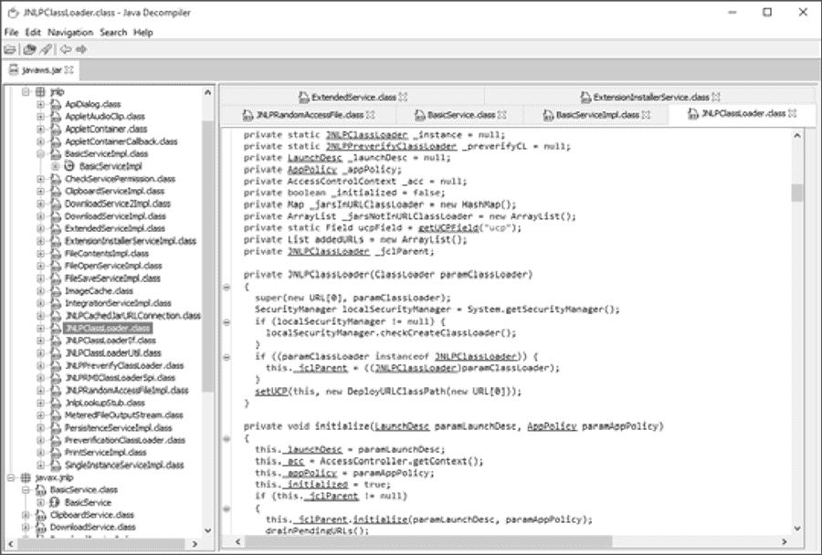

#### ***IDA Pro***

**网站** *[`www.hex-rays.com/`](https://www.hex-rays.com/)*

**许可证** 商业版；提供有限的免费版本

**平台** Linux, macOS, Windows

IDA Pro 是最著名的可执行文件逆向工程工具。它可以反汇编并反编译多种不同的处理器架构，并提供一个交互式环境来调查和分析反汇编结果。结合对自定义脚本和插件的支持，IDA Pro 是逆向工程可执行文件的最佳工具。尽管完整版的专业版非常昂贵，但对于非商业用途，提供了一个免费的版本；不过，该版本仅支持 32 位 x86 二进制文件，并有其他限制。

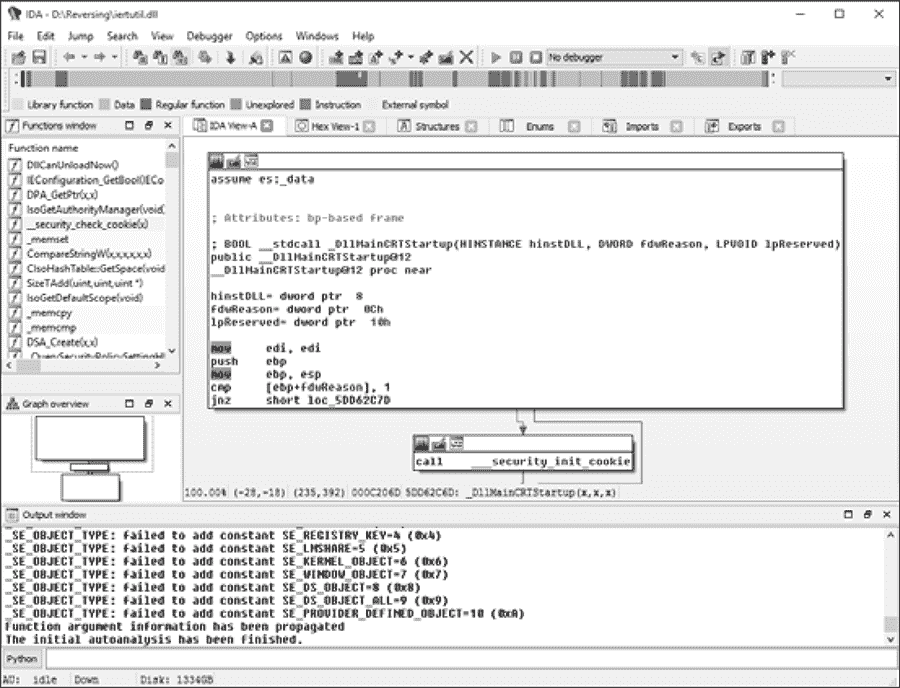

#### ***Hopper***

**网站** *[`www.hopperapp.com/`](http://www.hopperapp.com/)*

**许可证** 商业版；也提供有限的免费试用版

**平台** Linux, macOS

Hopper 是一个非常强大的反汇编器和基础反编译器，可以与 IDA Pro 的许多功能相媲美。尽管截至目前，Hopper 不支持 IDA Pro 所支持的所有处理器架构，但由于它支持 x86、x64 和 ARM 处理器，因此在大多数情况下已经足够使用。其商业版的价格远低于 IDA Pro，因此绝对值得一试。

#### ***ILSpy***

**网站** *[`ilspy.net/`](http://ilspy.net/)*

**许可证** MIT

**平台** Windows（支持 .NET4）

ILSpy 以其类似 Visual Studio 的环境，是支持最好的免费 .NET 反编译工具。

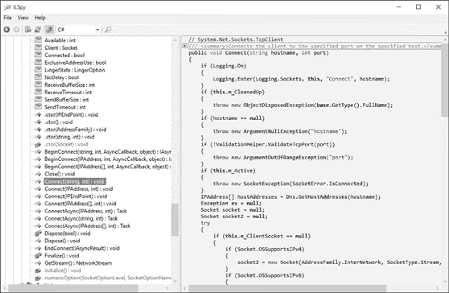

#### ***.NET Reflector***

**网站** *[`www.red-gate.com/products/dotnet-development/reflector/`](https://www.red-gate.com/products/dotnet-development/reflector/)*

**许可证** 商业版

**平台** Windows

Reflector 是最早的 .NET 反编译工具。它可以将 .NET 可执行文件或库转换为 C# 或 Visual Basic 源代码。Reflector 在生成可读的源代码和简便地浏览可执行文件方面非常有效，是你工具箱中不可或缺的好帮手。

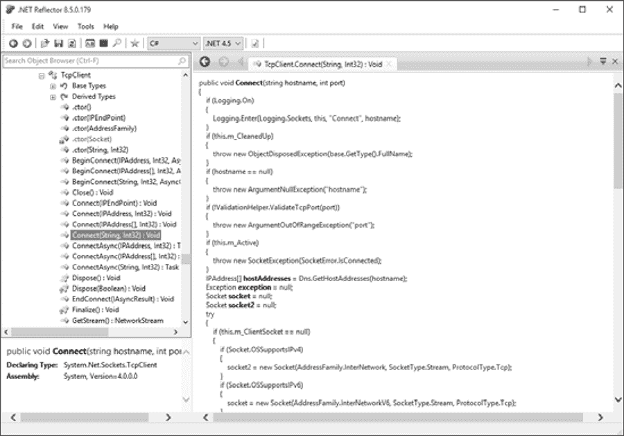
