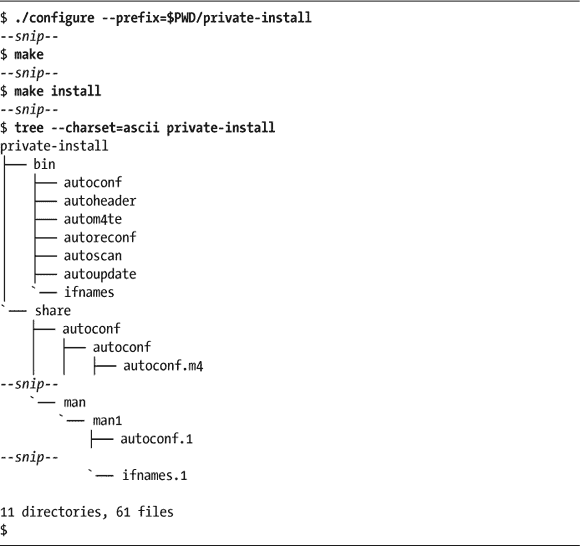

## 1

GNU Autotools 的最终用户视角

*我不害怕风暴，因为我在学习如何驾驶我的船。*

—**路易莎·梅·奥尔科特**，《小妇人》


如果你不是一名软件开发者，无论是职业上的还是兴趣上的，你可能在某些时候仍然需要或希望构建开源软件以安装在你的计算机上。也许你是一个图形艺术家，想使用最新版本的 GIMP，或者你是一个视频爱好者，需要构建一个较新的 FFmpeg 版本。因此，本章可能是你在本书中阅读的唯一一章。我希望情况不是这样，因为即使是高级用户，通过努力理解幕后发生的事情，也能获得更多的收获。不过，本章是为你设计的。在这里，我将讨论如何处理你从项目网站下载的所谓 *tarball*。我将使用 Autoconf 包来说明，并尽量提供足够的背景信息，使你能够遵循相同的流程来处理任何你从项目网站下载的包^(1)。

如果你是软件开发者，那么本章的内容很可能对你来说过于基础；因此，我建议你跳到下一章，我们将在那里深入讨论 Autotools，更侧重于开发者的内容。

### 软件源代码归档

开源软件作为单文件源代码归档进行分发，包含了在你的系统上构建软件所需的源代码和构建文件。Linux 发行版通过预构建这些源代码归档，并将已构建的二进制文件打包成以 *.rpm*（针对 Red Hat 系统）和 *.deb*（针对 Debian/Ubuntu 系统）等扩展名结尾的安装包，减轻了最终用户的痛苦。使用系统的包管理器安装软件相对容易，但有时你需要某些软件的最新功能集，而这些功能还没有为你的 Linux 版本打包。在这种情况下，你需要从项目网站的下载页面下载源代码归档文件，然后自己构建和安装它。让我们首先下载版本 2.69 的 Autoconf 包：

```
$ wget https://ftp.gnu.org/gnu/autoconf/autoconf-2.69.tar.gz
```

源代码归档文件的名称通常遵循 Autotools 支持的事实标准格式。除非项目维护者特别修改了这个格式，否则 Autotools 会自动生成一个源代码归档文件，其命名遵循以下模板：*pkgname*-*version*.*format*。这里，*pkgname* 是软件的简短名称，*version* 是软件的版本，*format* 表示归档格式或文件扩展名。*format* 部分可能包含多个点，具体取决于归档的构建方式。例如，*.tar.gz* 表示格式中有两个编码——一个 `tar` 归档，使用 `gzip` 工具进行了压缩，就像 Autoconf 源代码归档文件那样：

```
$ ls -1
autoconf-2.69.tar.gz
automake-1.16.1.tar.gz
gettext-0.19.8.1.tar.gz
libtool-2.4.6.tar.gz
pkg-config-0.29.2.tar.gz
$
```

### 解压源代码归档

按照惯例，源代码归档包含一个作为顶级条目的单一根目录。你应该放心地将源代码归档解压缩到当前目录中，只会看到一个新目录，目录名称与归档文件的名称相同，只是去掉了 *格式* 部分。使用基于 Autotools 的构建系统打包的源代码归档，从不将原始顶级目录的内容解压到当前目录中。

然而，偶尔你会下载一个归档文件并解压缩它，结果发现当前目录中出现了数十个新文件。因此，将一个来源不明的源代码归档解压缩到一个新的、空的子目录中是明智的做法。如果需要，你随时可以将其移动到上一级目录。此外，你可以使用 `tar` 工具的 `t` 选项（而不是 `x` 选项）来查看将会发生什么，这会列出归档文件的内容，而不解压缩它。`unzip` 工具也支持 `-l` 选项来达到同样的效果。

源代码归档可以有多种形式，每种形式的文件扩展名都不相同：*.zip*、*.tar*、*.tar.gz*（或 *.tgz*）、*.tar.bz2*、*.tar.xz*、*tar.Z* 等等。这些源代码归档文件中包含的是用于构建软件的源代码和构建文件。最常见的这些格式是 *.zip*、*.tar.gz*（或 *.tgz*）和 *.tar.bz2*。近年来逐渐流行的新格式包括 *.xz*（最新的 Autotools 已经原生支持）和 *.zstd*。

ZIP 文件使用的是几十年前由 Phil Katz 在 Microsoft DOS 系统上开发的压缩技术。ZIP 是一种专有的多文件压缩归档格式，后来被公开发布。此后，Windows 和 Linux 以及其他类 Unix 操作系统都为其编写了版本。在 Windows 的较新版本中，用户只需在 Windows 资源管理器中右键点击 *.zip* 文件并选择 **提取** 菜单选项，就可以解压缩该文件。Linux Gnome 桌面上的 Nautilus 文件浏览器（在 Mint 的 Cinnamon 桌面中为 Nemo）也有相同的功能。

ZIP 文件可以通过 Linux 命令行使用几乎无处不在的 `unzip` 程序解压缩，命令如下：

```
$ unzip some-package.zip
```

ZIP 文件通常是项目维护者为在 Microsoft Windows 系统上使用而创建的。Linux 平台上更常用的格式是压缩的 *.tar* 文件。*tar* 这个名称来源于 *磁带归档*。`tar` 工具最初是为了将在线存储介质（如硬盘驱动器）的内容流式传输到更具存档性的存储格式（如磁带）而设计的。由于磁带不是随机访问格式，因此它没有分层文件系统。相反，数据是以一长串比特写入磁带，归档文件是一个接一个地附加在一起。要在磁带上找到特定的文件，你必须从磁带的开头开始读取，直到找到你感兴趣的文件。因此，将较少的文件存储在磁带上是更好的选择，可以减少搜索时间。

`tar` 工具的设计目的是将一组文件从层级文件系统转换为一个这样的长位串——即归档文件。`tar` 工具的设计**并不是**为了以减少占用空间的方式压缩数据，因为已经有其他工具可以做这种事情——记住，Unix 的一个基本原则是每个工具只负责一个功能。实际上，*.tar* 文件通常比其包含的文件大小总和稍大，因为存储层次结构、文件名和文件属性所需的开销。

偶尔，你会遇到一个仅以 *.tar* 扩展名结尾的源归档文件。这意味着该文件是一个未压缩的 *.tar* 归档文件。然而，更常见的是，你会看到 *.tar.gz*、*.tgz* 和 *.tar.bz2* 等扩展名。这些是压缩过的 *.tar* 归档文件。一个归档文件是通过使用 `tar` 工具从目录树的内容创建的，然后归档文件被使用 `gzip` 或 `bzip2` 工具压缩。一个扩展名为 *.tar.gz* 或 *.tgz* 的文件是一个已经使用 `gzip` 工具压缩过的 *.tar* 归档文件。从技术上讲，你可以使用命令管道来提取 *.tar.gz* 文件的内容，首先使用 `gunzip` 解压 *.gz* 文件，然后使用 `tar` 解包剩下的 *.tar* 文件，方法如下：

```
$ gunzip -c autoconf-2.69.tar.gz | tar xf -
```

然而，`tar` 工具自用于创建磁带数据流以来已经发展了很多。如今，它被用作一个通用的归档文件管理工具。它根据文件扩展名，有时还根据归档的初始字节，知道如何执行正确的工具来解压一个压缩过的 *.tar* 归档文件，再解包文件。例如，以下命令将 *autoconf-2.69.tar.gz* 识别为一个 *.tar* 归档文件，且该文件随后使用 *gzip* 工具进行了压缩：

```
$ tar xf autoconf-2.69.tar.gz
```

该命令首先执行 `gunzip` 程序（或者带 `-d` 选项的 `gzip` 程序）来解压归档文件，然后使用内部算法将归档文件转换回其原始的多文件目录结构，且保留原始的时间戳和文件属性。

### 构建软件

解包完源归档文件后，下一步通常是检查解包后的目录树内容，试图确定如何构建和安装软件。在开源世界中，几个模式已经变得广泛流行，GNU 和 Autotools 尝试推动这些模式作为基于 Autotools 的项目的默认行为。

首先，在解包后的归档文件的根目录中查找名为 *INSTALL* 的文件。该文件通常包含如何构建和安装软件的逐步说明，或者告诉你如何找到这些说明——可能是通过项目网页上的 URL 引用。

GNU 软件包的 *INSTALL* 文件，比如 Autoconf 文件，内容相当冗长。GNU 项目通常会尽力为其他开源世界树立榜样。尽管如此，它确实详细列出了构建 Autoconf 包所需的步骤。我建议至少完整阅读一次 GNU 项目的 *INSTALL* 文件，因为它包含了大多数 GNU 项目如何构建和安装的细节。事实上，和 Autoconf 包捆绑在一起的文件其实是一个通用文件，GNU 在许多包中都会捆绑这个文件——这本身就是 Autotools 生成的构建系统一致性的证明。让我们深入了解一下它是如何指导我们构建 Autoconf 的：

```
$ tar xf autoconf-2.69.tar.gz
$ cd autoconf-2.69
$ more INSTALL
--snip--
```

说明中提到，你应该使用 `cd` 命令切换到包含项目源代码的目录，然后输入 `./configure` 来为你的系统配置该包。然而，应该很明显的是，如果你正在阅读 *INSTALL* 文件，你可能已经在包含 `configure` 的目录中了。

运行 `configure` 可能需要一段时间，特别是当软件包很大且复杂时。对于 Autoconf 包来说，只需要几秒钟，并且在过程中会输出一页文本到屏幕。让我们仔细看看在成功的 Autoconf 配置过程中会显示哪些内容：

```
$ ./configure
checking for a BSD-compatible install... /usr/bin/install -c
checking whether build environment is sane... yes
--snip--
configure: creating ./config.status
config.status: creating tests/Makefile
--snip--
config.status: creating bin/Makefile
config.status: executing tests/atconfig commands
$
```

`configure` 的输出基本上分为两部分。第一部分包含以 `checking` 开头的行（虽然中间有些行以 `configure:` 开头）。这些行表示 `configure` 被编程用来查找的功能的状态。如果某个功能未找到，后面的文字将显示 `no`。另一方面，如果功能被发现，后面的文字有时会是 `yes`，但通常会是发现的工具或功能的文件系统位置。

`configure` 因缺少工具或实用程序而失败并不罕见，尤其是在这是一个新安装的系统，或者你没有在这个系统上下载和构建很多软件时。此时，新用户通常会开始在在线论坛上发布问题，或者直接放弃。

理解这一部分的内容非常重要，因为它可以帮助你找出如何解决问题。解决失败问题通常很简单，比如使用系统的包管理器安装一个编译器。对于 Autoconf 包，大多数 Linux 系统默认会安装所需的工具。然而，也有一些例外。例如，以下是 `configure` 在一个没有安装 M4 的系统上的输出：

```
$ ./configure
checking for a BSD-compatible install... /usr/bin/install -c
checking whether build environment is sane... yes
--snip--
checking for GNU M4 that supports accurate traces... configure: error: no
    acceptable m4 could be found in $PATH.
GNU M4 1.4.6 or later is required; 1.4.16 or newer is recommended.
GNU M4 1.4.15 uses a buggy replacement strstr on some systems.
Glibc 2.9 - 2.12 and GNU M4 1.4.11 - 1.4.15 have another strstr bug.
$
```

在这里，你会注意到最后几行显示了一个错误。Autoconf 包是一个 GNU 软件工具，按照其惯例，它提供了很多信息，帮助你找出问题所在。你需要安装一个 M4 宏处理器，我们将通过包管理器来安装它。我的系统是基于 Ubuntu 的 Linux Mint 系统，因此我将使用`apt`工具。如果你使用的是基于 Red Hat 的系统，你可以使用`yum`来完成同样的操作，或者直接通过图形用户界面（GUI）使用你的系统包管理器。这里的关键是我们正在安装 m4 包：

```
$ sudo apt install m4
```

现在`configure`可以成功完成了：

```
   $ ./configure
   checking for a BSD-compatible install... /usr/bin/install -c
   checking whether build environment is sane... yes
   --snip--
➊ configure: creating ./config.status
   config.status: creating tests/Makefile
   config.status: creating tests/atlocal
   --snip--
   config.status: creating bin/Makefile
   config.status: executing tests/atconfig commands
   $
```

第二部分是一组以`config.status:`开头的行。该部分从`configure: creating ./config.status`这一行开始，位于➊处。`configure`做的最后一件事是创建另一个脚本，名为*config.status*，然后执行该脚本。以`config.status:`开头的行实际上是由*config.status*显示的。*config.status*的主要任务是根据`configure`的结果生成构建系统。该脚本输出的行仅仅是告诉你正在生成的文件的名称。

如果你愿意，也可以从其他目录运行`configure`，方法是使用相对路径来调用`configure`命令。如果项目源代码是通过 CD 或只读 NFS 挂载提供给你的，这会很有用。例如，你可以在你的主目录中创建一个构建目录，然后通过相对路径或绝对路径，从只读源目录中执行`configure`。`configure`脚本将在当前目录中为项目创建整个构建树，包括 makefile 和任何其他构建项目所需的文件。

一旦`configure`完成，就可以运行`make`了。在此之前，目录树中没有名为*Makefile*的文件。在`configure`之后运行`make`将会得到以下结果：

```
$ make
make  all-recursive
make[1]: Entering directory '/.../autotools/autoconf-2.69'
Making all in bin
make[2]: Entering directory '/.../autotools/autoconf-2.69/bin'
--snip--
make[2]: Leaving directory '/.../autotools/autoconf-2.69/man'
make[1]: Leaving directory '/.../autotools/autoconf-2.69'
$
```

`configure`的主要任务是确保`make`能够成功，因此`make`失败的可能性不大。如果它失败了，问题可能是非常特定于你的系统的，所以我无法提供任何指导，除非建议你仔细阅读`make`的输出，以确定导致失败的原因。如果你通过阅读输出无法发现问题，你可以查阅 Autoconf 邮件列表档案，直接在邮件列表上询问，最后在 Autoconf 项目网站上提交一个 bug 报告。

### 测试构建

一旦我们使用`make`构建了软件，运行项目维护者可能已添加到构建系统中的任何测试会很有意义，这些测试能够提供某种程度的保证，确保软件能够在我们的系统上正确运行。

当我们构建软件时，我们运行了没有任何命令行参数的 `make`。这使得 `make` 假设我们想要构建*默认目标*，根据约定，这个目标是 `all` 目标。因此，运行 `make all` 就等同于运行没有任何参数的 `make`。然而，Autotools 构建系统有许多目标，可以直接在 `make` 命令行中指定。我们此时关注的目标是 `check` 目标。

在源代码目录中运行 `make check` 会构建并执行项目维护者所包含的任何测试程序（对于 Autoconf 来说，这需要几分钟才能完成）：

```
$ make check
if test -d ./.git; then \
  cd . && \
  git submodule --quiet foreach test '$(git rev-parse $sha1)' \
     = '$(git merge-base origin $sha1)' \
    || { echo 'maint.mk: found non-public submodule commit' >&2; \
   exit 1; }; \
else \
  : ; \
fi
make  check-recursive
make[1]: Entering directory '/home/jcalcote/Downloads/autotools/autoconf-2.69'
Making check in bin
--snip--
/bin/bash ./testsuite
## ----------------------------- ##
## GNU Autoconf 2.69 test suite. ##
## ----------------------------- ##
Executables (autoheader, autoupdate...).
  1: Syntax of the shell scripts                     skipped (tools.at:48)
  2: Syntax of the Perl scripts                      ok
--snip--
501: Libtool                                         FAILED (foreign.at:61)
502: shtool                                          ok
Autoscan.
503: autoscan                                        FAILED (autoscan.at:44)
## ------------- ##
## Test results. ##
## ------------- ##
ERROR: 460 tests were run,
6 failed (4 expected failures).
43 tests were skipped.
## -------------------------- ##
## testsuite.log was created. ##
## -------------------------- ##
Please send `tests/testsuite.log' and all information you think might help:
   To: <bug-autoconf@gnu.org>
   Subject: [GNU Autoconf 2.69] testsuite: 501 503 failed
You may investigate any problem if you feel able to do so, in which
case the test suite provides a good starting point.    Its output may
be found below `tests/testsuite.dir'.
--snip--
make: *** [check] Error 2
$
```

**注意**

*你的输出可能会与我的稍有不同。不同的 Linux 发行版和工具版本显示方式不同，因此不要太担心细微的差异。由于系统中安装的工具不同，跳过或失败的测试数量也可能因系统而异。*

如你所见，Autoconf 包提供了 503 个测试，其中 460 个被执行，43 个被故意跳过。在执行的 460 个测试中，有六个失败，但其中四个是预期的失败，所以我们只有两个问题：测试 501 和测试 503。

在 460 个测试中只有两个失败，从个人角度来看，我会称这是一个巨大的成功，但如果你想深入挖掘一下这些问题的根源，可以采取两种方法。第一种方法是访问 Autoconf 邮件列表的档案，搜索类似的问题及其答案，或者直接向列表提问；注意在前面的输出中请求将 *tests/testsuite.log* 文件发送到 *bug-autoconf@gnu.org*。

另一种选择需要稍微多一点的编程技巧。这些测试是由 Autoconf 的 *autotest* 框架运行的，它会为每个失败的测试自动创建一个目录，放在 *tests/testsuite.dir* 下。在 *testsuite.dir* 下找到的每个目录都以失败测试的编号命名。如果你查看这些目录，你会看到六个目录，其中包括四个预期失败的目录。每个编号目录中都有一个 `run` 脚本，它将重新执行失败的测试，并将输出显示到 `stdout`，而不是日志文件中。这允许你对系统进行实验（例如，可能为测试 501 安装不同版本的 Libtool），然后重新运行测试。

然而，也有一种可能性，尽管很小，那就是项目维护者已经知道这些测试失败的情况。在这种情况下，他们可能会通过电子邮件回复你类似的评论（或者快速搜索档案也可能会找到相同的答案），这时你可以简单地忽略失败的测试。

### 安装构建的软件

运行 `make` 通常会将构建好的软件产品——可执行文件、库和数据文件——散布在整个构建目录树中。放心，你快完成了。最后一步是将已构建的软件安装到系统上，这样你就可以使用它了。幸运的是，大多数构建系统，包括由 Autotools 管理的构建系统，都提供了安装已构建软件的机制。

复杂的构建系统只有在假设了许多基本的默认设置时，对非专家才有用；否则，用户就需要为即使是最简单的构建也指定数十个命令行选项。软件安装位置就是这样的一个假设；默认情况下，构建系统假设你想将已构建的软件安装到 */usr/local* 目录树中。

*/usr/local* 目录树镜像了 */usr* 目录树；它是本地构建软件的标准安装位置。而 */usr* 目录树则是 Linux 发行版包安装的位置。例如，如果你使用命令 `sudo apt-get install autoconf`（或 `sudo yum install autoconf`）安装了 Autoconf 包，那么包的二进制文件将安装到 */usr/bin* 目录。当你安装手动构建的 Autoconf 二进制文件时，它们默认会安装到 */usr/local/bin*。

大多数情况下，*/usr/local/bin* 会在你的 `PATH` 环境变量中位于 */usr/bin* 之前。这使得你本地构建和安装的程序可以覆盖由你的发行版包管理器安装的程序。

如果你希望覆盖这个默认行为，并将软件安装到不同的位置，可以在 `configure` 的命令行中使用 `--prefix` 选项，^(3) 如下所示：

```
$ ./configure --prefix=$HOME
```

这将使得 `configure` 生成构建脚本，使可执行的二进制文件被安装到你的 `$HOME`*/bin* 目录中。^(4) 如果你没有系统管理员权限，这是一个不错的折中方案，允许你安装已构建的软件而不需要向系统管理员申请额外权限。

选择不同的 `--prefix` 安装位置的另一个原因是为了让你将软件安装到一个隔离的位置。然后，你可以在安装后检查该位置，查看安装了哪些内容以及相对于 `--prefix`，它们被安装到了哪里。

让我们首先安装到一个私人安装位置，这样我们就可以看到 Autoconf 项目安装到了我们的系统上：



**注意**

*和早期的构建过程一样，系统上的文件和目录数量可能会因我们的工具可用性差异而略有不同。如果你安装了额外的文档工具，例如，你可能会看到比我更多的目录，因为如果工具可用，Autoconf 会构建更多的文档。*

请注意，我在`configure`的命令行上指定了安装位置，并使用了完整路径——`PWD`环境变量包含当前目录在 shell 中的绝对路径。在`--prefix`中始终使用完整路径是很重要的。在很多情况下，使用相对路径会导致安装失败，因为在安装过程中`--prefix`参数会从不同的目录引用。^(5)

我在*private-install*目录上使用了`tree`命令，以便获得 Autoconf 安装内容的可视化图像。^(6) 共安装了 61 个文件，分布在*private-install*中的 11 个目录里。

现在，让我们将 Autoconf 安装到默认位置*/usr/local/bin*：

```
$ ./configure
--snip--
$ make
--snip--
$ sudo make install
--snip--
$
```

需要注意的是，在此命令行中使用了`sudo`，以便以 root 权限运行`make install`。当你在主目录之外安装软件时，你需要更高的权限。如果你将`--prefix`目录设置为主目录内的某个位置，那么你可以省略在命令中使用`sudo`。

### 摘要

此时，你应该已经理解了什么是源代码归档，并且知道如何下载、解压、构建、测试和安装它。我也希望我能激发你进一步探索并了解更多关于开源构建系统的知识。由 Autotools 生成的系统严格遵循常见的模式，因此它们是相当可预测的。关于你可以做的事情的提示，试着运行`./configure --help`。

还有其他构建系统。它们大多数遵循一套合理的模式，但偶尔你会遇到一个与其他所有系统明显不同的系统。所有开源构建系统都倾向于遵循一些非常基本的高层次概念——例如，先进行配置过程，然后是构建步骤，这是其中之一。然而，配置过程的性质以及用来构建软件的命令，可能与我们在这里讨论的有所不同。Autotools 的一个好处是它们生成的构建系统具有一致性。

如果你想了解所有这些魔法是如何运作的，请继续阅读。
