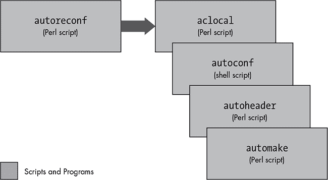
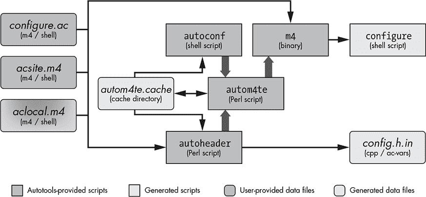
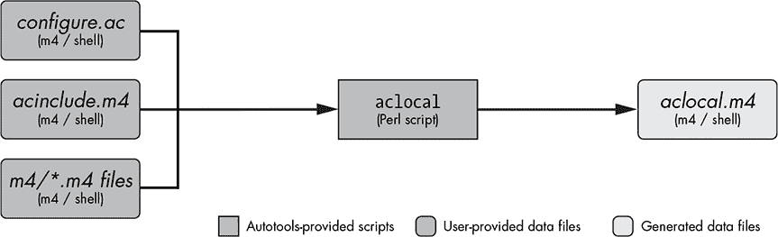
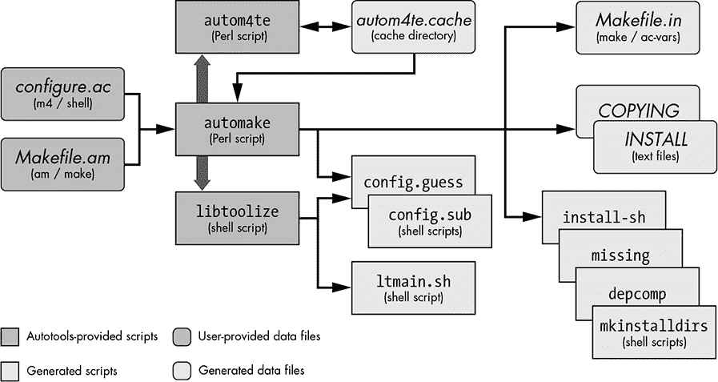
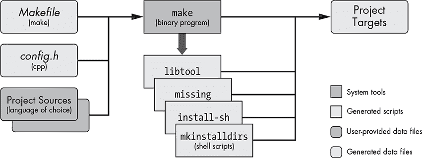

## 2

GNU Autotools 简要介绍

*我们将不会停止探索，所有探索的终点将是回到我们开始的地方，并第一次认识这个地方。  

——T.S. 艾略特，《四重奏第 4 号：小吉丁》*


正如本书前言中所述，GNU Autotools 的目的是为了简化最终用户的工作，而非维护者的工作。然而，长期使用 Autotools 将使你作为项目维护者的工作变得更加轻松，尽管这可能不是你所预期的原因。鉴于其提供的功能，Autotools 框架尽可能简化。Autotools 的真正目的是双重的：它满足用户的需求，并且使你的项目变得极其可移植——即使是在你从未测试、安装或构建过代码的系统上。

在本书中，我将经常使用*Autotools*这一术语，尽管你在 GNU 档案中找不到这个标签的包。我使用这个术语来指代以下三个 GNU 项目，这些项目被社区认为是 GNU 构建系统的一部分：

+   Autoconf，用于为项目生成配置脚本

+   Automake，用于简化创建一致且功能完整的 makefile 的过程

+   Libtool，用于提供便捷的跨平台共享库创建抽象

其他构建工具，如开源项目 CMake 和 SCons，试图提供与 Autotools 相同的功能，但以更用户友好的方式实现。然而，由于这些工具试图通过图形界面和脚本生成器隐藏大部分复杂性，它们实际上变得功能更少，且更难以管理，因为构建系统不再那么透明。归根结底，这种透明性正是 Autotools 使其既易于使用又易于理解的原因。因此，最初对 Autotools 的挫败感并非来自其复杂性——因为它们实际上非常简单——而是来自于它们广泛使用了一些不太为人所熟知的工具和子系统，比如 Linux 命令行（Bash）、`make`工具以及 M4 宏处理器和随附的宏库。实际上，Automake 提供的元语言是如此简单，以至于只需几个小时的手册阅读，就能完全消化和理解（尽管这种元语言的深层含义可能需要更多的时间来彻底内化）。

### 谁应该使用 Autotools？

如果你正在编写面向 Unix 或 Linux 系统的开源软件，你绝对应该使用 GNU Autotools，即使你编写的是针对 Unix 或 Linux 系统的专有软件，使用 Autotools 仍然会带来显著的好处。Autotools 为你提供了一个构建环境，使你的项目能够在未来版本或发行版中成功构建，而几乎无需修改构建脚本。即使你只打算针对单一的 Linux 发行版，这也是有用的，因为——说实话——你真的*无法*预知你的公司是否希望你的软件将来能在其他平台上运行。

### 什么时候不应该使用 Autotools？

唯一不使用 Autotools 的合理情况是当你编写的软件*只*会在非 Unix 平台上运行，比如 Microsoft Windows。

Windows 上的 Autotools 支持需要一个 Msys^(1)环境才能正常工作，因为 Autoconf 生成的配置脚本是 Bourne shell 脚本，而 Windows 不提供原生的 Bourne shell。^(2) Unix 和 Microsoft 工具在命令行选项和运行时特性上有些微差异，因此通常更简单的方法是使用 GNU 工具的 Windows 移植版本，如 Cygwin、Msys2 或 MinGW，通过 Autotools 构建 Windows 程序。

基于这些原因，我将主要集中在 POSIX 兼容平台上使用 Autotools。然而，如果你有兴趣在 Windows 上尝试 Autotools，可以参考第十七章获取详细概述。

**注意**

*我不是典型的 Unix 偏执者。虽然我热爱 Unix（尤其是 Linux），但我也欣赏 Windows 在其擅长的领域中的表现。^(3) 对于 Windows 开发，我强烈推荐使用 Microsoft 工具。使用 GNU 工具开发 Windows 程序的初衷现在更像是学术上的讨论，因为 Microsoft 已经免费提供了大部分工具。有关下载信息，请参阅 Visual Studio Community：[`visualstudio.microsoft.com/vs/express/`](https://visualstudio.microsoft.com/vs/express/)。*

### 苹果平台和 Mac OS X

Macintosh 操作系统自 2007 年发布的 macOS 10 版本“Leopard”以来，一直是 POSIX 兼容的。OS X 源自 NeXTSTEP/OpenStep，基于 Mach 内核，并部分采用 FreeBSD 和 NetBSD。作为一个 POSIX 兼容的操作系统，OS X 提供了 Autotools 所需的所有基础设施。你在 OS X 上遇到的问题很可能涉及 Apple 的图形用户界面和软件包管理系统，这些是特定于 Mac 的。

用户界面呈现了与在其他 Unix 平台上使用 X Window 系统时相遇的相同问题，甚至更多。主要区别在于，X Window 系统大多只用于 Unix 系统，而 macOS 则有自己的图形用户界面，称为 *Cocoa*。虽然 X Window 系统可以在 Mac 上使用（苹果提供了一种窗口管理器，使得 X 应用程序看起来像原生的 Cocoa 应用程序），但 Mac 程序员有时希望充分利用操作系统提供的本地用户界面功能。

Autotools 通过简单地忽略 Unix 平台之间的包管理差异来回避这个问题。相反，它们创建的包只是使用 `tar` 和 `gzip` 工具压缩的源代码归档，并通过 `make` 命令行安装和卸载产品。macOS 的包管理系统是安装应用程序时的一个重要部分，像 Fink (*[`www.finkproject.org/`](http://www.finkproject.org/))* 和 MacPorts (*[`www.macports.org/`](http://www.macports.org/))* 等项目通过提供简化的机制将 Autotools 包转换为可安装的 Mac 包，帮助使现有的开源包在 Mac 上可用。

结论是，只要记住这些注意事项，Autotools 在运行 OS X 或更高版本的 Apple Macintosh 系统上可以非常有效地使用。

### 语言选择

选择编程语言是决定是否使用 Autotools 时需要考虑的另一个重要因素。请记住，Autotools 是由 GNU 团队为管理 GNU 项目而设计的。在 GNU 社区中，有两个因素决定计算机编程语言的重要性：

+   是否有任何 GNU 软件包是用该语言编写的？

+   GNU 编译器工具集是否支持该语言？

Autoconf 根据这两个标准提供对以下语言的本地支持（*本地支持*意味着 Autoconf 可以在这些语言中编译、链接并运行源代码级特性检查）：

+   C

+   C++

+   Objective C

+   Objective C++

+   Fortran

+   Fortran 77

+   Erlang

+   Go

因此，如果你想构建一个 Java 包，可以配置 Automake 来执行此操作（正如你将在第十四章和第十五章中看到的那样），但你不能要求 Autoconf 来编译、链接或运行基于 Java 的检查^(4)，因为 Autoconf 本身不支持 Java。然而，你可以找到 Autoconf 宏（我将在后续章节中详细介绍），这些宏增强了 Autoconf 管理 Java 项目配置过程的能力。

一般的观点认为，Java 自带许多运行良好的构建环境和工具（例如 Maven）；因此，增加对 Java 的完全支持似乎是一种浪费。尤其是在 Java 及其构建工具本身具有很高的可移植性——甚至可以运行在 Windows 等非 Unix/Linux 平台上。

Automake 确实提供了对 Java 编译器和 JVM 的基础支持。我自己在项目中使用过这些功能，它们运行得很好，只要你不试图将它们推得太远。

如果你对 Smalltalk、ADA、Modula、Lisp、Forth 或其他非主流语言感兴趣，你可能并不太想将你的代码移植到数十个平台和 CPU 上。然而，如果你*确实*使用非主流语言并且关心构建系统的可移植性，考虑自己为 Autotools 添加对你语言的支持。这并不像你想象的那样令人畏惧，我保证当你完成后，你将成为 Autotools 专家。^(5)

### 生成你的软件包构建系统

GNU Autotools 框架包括三个主要的软件包：Autoconf、Automake 和 Libtool。这些软件包中的工具可能依赖于 gettext、M4、sed、make 和 Perl 等包的实用程序和功能；然而，这些软件包生成的构建系统仅依赖于 Bourne shell 和`make`工具。

在 Autotools 方面，重要的是区分*维护者*的系统和*最终用户*的系统。Autotools 的设计目标规定，Autotools 生成的构建系统应该只依赖于最终用户机器上现成可用并已预安装的工具（假设最终用户的系统具有从源代码构建程序的基础支持）。例如，维护者用来创建发行版的机器需要一个 Perl 解释器，但最终用户用来从发布版源代码归档构建产品的机器不应需要 Perl（除非该项目的源代码是用 Perl 编写的）。

一个推论是，最终用户的机器不需要安装 Autotools——最终用户的系统只需要一个合理符合 POSIX 的`make`版本和一个可以执行生成的配置脚本的 Bourne shell 变种。当然，任何软件包也会要求编译器、链接器以及将源文件转换为可执行二进制程序、帮助文件和其他运行时资源所需的工具。

### 配置

大多数开发者都理解`make`工具的用途，但`configure`有什么用呢？尽管 Unix 系统已经遵循事实上的标准 Unix 内核接口几十年了，大多数软件仍然需要超越这些边界。

最初，配置脚本是手工编写的 shell 脚本，旨在根据平台特定的特征设置环境变量。它们还允许用户在运行 `make` 之前配置软件包选项。这种方法在几十年里效果良好，但随着 Linux 发行版和类 Unix 系统的数量增加，特性、安装和配置选项的多样性也爆炸性增长，因此编写一个体面的便携式配置脚本变得非常困难。事实上，编写一个便携式配置脚本比编写新项目的 makefile 还要困难。因此，大多数人只是通过复制和修改类似项目的脚本来为自己的项目创建配置脚本。

在 1990 年代初期，许多开源软件开发者明显意识到，如果不采取措施简化编写庞大复杂的 shell 脚本来管理配置选项的负担，项目配置将变得异常困难。GNU 项目包的数量已经增长到数百个，而保持这些独立构建系统的一致性比维护这些项目的代码本身更为费时。这些问题必须得到解决。

### Autoconf

Autoconf ^(6) 几乎一夜之间改变了这种局面。David MacKenzie 于 1991 年启动了 Autoconf 项目，但通过查看 Savannah Autoconf 项目^(7) 仓库中的 *AUTHORS* 文件，你可以大致了解有多少人参与了这款工具的开发。尽管配置脚本长且复杂，但用户在执行时只需指定少数几个变量。这些变量大多数仅仅是关于组件、特性和选项的选择，比如 *构建系统在哪里可以找到库文件和头文件？我想把成品安装到哪里？我想将哪些可选组件编译到我的产品中？*

开发者现在不需要修改和调试成百上千行本应便携的 shell 脚本，而是可以使用一种简洁的、基于宏的语言编写一个简短的元脚本文件，Autoconf 会生成一个完美的配置脚本，该脚本比手工编写的更加便携、准确和易于维护。此外，Autoconf 经常能够捕捉到语义或逻辑错误，这些错误如果不加以调试，可能需要几天的时间才能发现。Autoconf 的另一个优点是，它生成的 shell 代码在大多数 Bourne shell 的变体之间是便携的。在 shell 之间的便携性问题是非常常见的，且不幸的是，这些错误是最难以发现的，因为没有任何开发者能访问到所有 Bourne-like 的 shell。

**注意**

*尽管像 Perl 和 Python 这样的便携式脚本语言现在比 Bourne shell 更为普及，但在最初构思 Autoconf 时并非如此。*

Autoconf 生成的配置脚本提供了一组通用选项，这些选项对于所有在 POSIX 系统上运行的可移植软件项目都很重要。这些选项包括修改标准位置的选项（这是我将在第三章中详细介绍的概念），以及在 *configure.ac* 文件中定义的项目特定选项（我将在第五章中讨论）。

autoconf 包提供了多个程序，包括以下内容：

+   `autoconf`

+   `autoreconf`

+   `autoheader`

+   `autoscan`

+   `autoupdate`

+   `ifnames`

+   `autom4te`

`autoconf` 程序是一个简单的 Bourne shell 脚本。它的主要任务是确保当前的 shell 包含执行 `m4` 宏处理器所需的功能。（我将在第四章中详细讨论 Autoconf 如何使用 M4。）脚本的其余部分解析命令行参数并执行 `autom4te`。

#### *autoreconf*

`autoreconf` 工具会根据项目的需要执行 autoconf、automake 和 libtool 包中的配置工具。该工具最小化了由于时间戳、特性和项目状态变化而需要重新生成的内容。它的编写旨在整合现有的维护者编写的脚本工具，这些工具会按照正确的顺序运行所有必需的 Autotools。你可以将 `autoreconf` 看作是一种智能的 Autotools 启动工具。如果你只有一个 *configure.ac* 文件，可以运行 `autoreconf` 来执行所有必需的工具，并确保 `configure` 文件能够正确生成。图 2-1 展示了 `autoreconf` 如何与 Autotools 套件中的其他工具交互。



*图 2-1：`autoreconf` 工具的数据流图*

然而，有时项目需要的不仅仅是启动 Autotools 来让开发人员在新检出的代码库工作区上快速开始。在这种情况下，一个运行 `autoreconf` 和任何非 Autotools 相关进程的小型 shell 脚本是合适的。许多项目将这样的脚本命名为 `autogen.sh`，但由于有一个 GNU Autogen 项目，这常常会让开发人员感到困惑。一个更好的命名应该是像 `bootstrap.sh` 这样的名称。

此外，当与 `-i` 选项一起使用时，`autoreconf` 会通过添加 GNU 推荐或要求的缺失文件，将项目启动到可分发状态。这些文件包括适当的 *ChangeLog* 文件、模板 *INSTALL*、*README* 和 *AUTHORS* 文件等。

#### *autoheader*

`autoheader`工具从*configure.ac*中的各种结构生成一个 C/C++兼容的头文件模板。这个文件通常被称为*config.h.in*。当最终用户执行`configure`时，配置脚本会从*config.h.in*生成*config.h*。作为维护者，你将使用`autoheader`来生成你将在发布包中包含的模板文件。（我们将在第四章中更详细地探讨`autoheader`。）

#### *autoscan*

`autoscan`程序为一个新项目生成默认的*configure.ac*文件；它还可以检查现有的 Autotools 项目中的缺陷和改进机会。（我们将在第四章和第十四章中更详细地讨论`autoscan`。）`autoscan`是为使用非 Autotools 构建系统的项目提供的一个很好的起点，但它也可以为增强现有 Autotools 项目提供建议。

#### *自动更新*

`autoupdate`工具用于更新*configure.ac*或模板（*.in*）文件，以匹配当前版本的 Autotools 所支持的语法。

#### *ifnames*

`ifnames`程序是一个小型且通常未充分使用的工具，它接受命令行上的源文件名列表，并显示 C 预处理器定义的列表。这个工具旨在帮助维护者确定应该将哪些内容放入*configure.ac*和*Makefile.am*文件中，以使其具有可移植性。如果你的项目在一定程度上考虑了可移植性，`ifnames`可以帮助你确定这些可移植性的尝试在源代码树中的位置，并为你提供潜在的可移植性定义名称。

#### *autom4te*

`autom4te`工具是一个基于 Perl 的智能缓存包装器，用于`m4`，它被大多数其他 Autotools 工具使用。`autom4te`缓存通过减少后续工具访问*configure.ac*构造的时间，最多可以提高 30%的效率。

我不会花太多时间讲解`autom4te`（发音为*自动化*），因为它主要由 Autotools 内部使用。它工作的唯一迹象是在你运行`autoconf`或`autoreconf`后，在你的顶层项目目录中出现的*autom4te.cache*目录。

#### *协作工作*

在之前列出的工具中，`autoconf`和`autoheader`是项目维护者在生成`configure`脚本时唯一会使用的工具，而`autoreconf`是开发者需要直接执行的唯一工具。图 2-2 展示了输入文件与`autoconf`和`autoheader`之间的交互，它们生成相应的产品文件。



*图 2-2：`autoconf`和`autoheader`的数据流图*

**注意**

*我在本书中使用的数据流图格式如 图 2-2 所示。深色框代表由用户或 Autotools 包提供的对象。浅色框代表生成的对象。方角框是脚本和程序，圆角框是数据文件。大部分标签的含义应该是显而易见的，但至少有一个需要解释：术语 ac-vars 指的是 Autoconf 特定的替换文本。我会稍后解释 aclocal.m4 框的渐变阴影效果。*

这套工具的主要任务是生成一个配置脚本，该脚本可用于为目标平台（不一定是本地主机）配置项目构建目录。这个脚本不依赖于 Autotools 本身；事实上，`autoconf` 旨在生成可以在所有类 Unix 平台和大多数 Bourne shell 变种中运行的配置脚本。这意味着，你可以使用 `autoconf` 生成配置脚本，然后在没有安装 Autotools 的机器上成功执行该脚本。

`autoconf` 和 `autoheader` 程序要么由你直接执行，要么由 `autoreconf` 间接执行。它们从你的项目的 *configur**e**.ac* 文件和各种 Autoconf 风格的 M4 宏定义文件（按照惯例，这些文件扩展名为 *.m4*）中获取输入，并使用 `autom4te` 来维护缓存信息。`autoconf` 程序生成一个配置脚本，名为 `configure`，它是一个非常便携的 Bourne shell 脚本，使你的项目能够提供许多有用的配置功能。程序 `autoheader` 根据 *configure.ac* 中的某些宏定义生成 *config.h.in* 模板。

### Automake

一旦你做了几次，写一个新项目的基本 makefile 就相对简单了。但当你试图做的不仅仅是基础操作时，可能会出现问题。让我们面对现实——哪个项目维护者会满足于一个基本的 makefile 呢？

细节决定一个开源项目的成功。用户很容易对一个项目失去兴趣——尤其是当他们期望的功能缺失或编写不当时。例如，资深用户已经习惯了 makefile 支持某些标准目标或目标，这些目标在 `make` 命令行中指定，如下所示：

```
$ make install
```

常见的 `make` 目标包括 `all`、`clean` 和 `install`。在这个例子中，`install` 是目标。但你应该意识到，这些都不是 *真实的* 目标：*真实目标* 是构建系统生成的文件系统对象——通常是一个文件（但有时是目录或链接）。例如，当构建名为 `doofabble` 的可执行文件时，你会期望能够输入：

```
$ make doofabble
```

对于这个项目，`doofabble`是一个真实的目标，并且该命令适用于 doofabble 项目。然而，要求用户在`make`命令行上输入真实目标要求比较高，因为每个项目的构建方式不同——`make doofabble`、`make foodabble`、`make abfooble`，等等。标准化的`make`目标允许所有项目通过使用像`make all`和`make clean`这样的常见命令以相同的方式构建。但*常见的*并不意味着*自动化的*，编写和维护支持这些目标的 makefile 既繁琐又容易出错。

Automake 的任务是将您项目构建过程的简化规范转换为可以始终正确工作的模板 makefile 语法，并且*提供所有预期的标准功能*。Automake 创建的项目支持在*GNU 编码标准*中定义的准则（在第三章中讨论）。

就像`autoconf`生成的`configure`脚本可以移植到多种类型的 Bourne shell 中，`automake`生成的`make`脚本也可以移植到多种类型的`make`中。

automake 包提供了以下形式为 Perl 脚本的工具：

+   `automake`

+   `aclocal`

#### *automake*

`automake`程序从高级构建规范文件（命名为*Makefile.am*）生成标准 makefile 模板（命名为*Makefile.in*）。这些*Makefile.am*输入文件本质上只是常规的 makefile。如果你只在*Makefile.am*文件中放入几个必需的 Automake 定义，你将得到一个包含数百行参数化`make`脚本的*Makefile.in*文件。

如果你向*Makefile.am*文件中添加额外的`make`语法，Automake 会将这段代码移动到结果*Makefile.in*文件中功能最正确的位置。事实上，你可以编写*Makefile.am*文件，让它们只包含普通的`make`脚本，而生成的 makefile 也能正常工作。这种通行特性使你能够扩展 Automake 的功能，以适应项目的特定需求。^(8)

#### *aclocal*

在*GNU Automake 手册*中，`aclocal`工具被描述为针对 Autoconf 某些灵活性不足的临时解决方法。Automake 通过添加大量宏来增强 Autoconf，但 Autoconf 并不是为了这种程度的增强而设计的。

添加用户定义的宏到 Autoconf 项目的最初文档方法是创建一个名为*aclocal.m4*的文件，将用户定义的宏放入该文件，并将文件放置在与*configure.ac*相同的目录中。Autoconf 在处理*configure.ac*时会自动包含这一组宏。Automake 的设计者发现这一扩展机制非常有用，因此无法放弃；然而，用户需要在可能不必要的*aclocal.m4*文件中添加`m4_include`语句，以包含 Automake 宏。由于用户定义的宏和 M4 的使用都被认为是高级概念，这一要求被认为过于苛刻。

`aclocal`脚本旨在解决这个问题。这个工具为一个项目生成一个*aclocal.m4*文件，包含用户定义的宏和所有必需的 Automake 宏。^(9) 项目维护者现在应将用户定义的宏添加到一个新文件中，称为*acinclude.m4*，而不是直接将其添加到*aclocal.m4*中。

为了让读者清楚地知道 Autoconf 并不依赖于 Automake（也许出于一些固执的原因），*GNU Autoconf 手册*并没有过多提到`aclocal`工具。*GNU Automake 手册*最初建议，在将 Automake 添加到现有 Autoconf 项目时，应该将*aclocal.m4*重命名为*acinclude.m4*，这一方法仍然被广泛使用。`aclocal`的数据流如图 2-3 所示。



*图 2-3：`aclocal`的数据流图*

然而，最新的 Autoconf 和 Automake 文档建议，整个范式现在已过时。开发者现在应指定一个包含 M4 宏文件集的目录。目前的推荐做法是，在项目的根目录中创建一个名为*m4*的目录，并将宏作为单独的*.m4*文件添加到其中。该目录中的所有文件将在 Autoconf 处理*configure.ac*之前被收集到*aclocal.m4*中。^(10)

现在可能更容易理解为什么图 2-2 中的*aclocal.m4*框无法决定应该使用哪种颜色。当你在没有 Automake 和 Libtool 的情况下使用它时，你需要手动编写*aclocal.m4*。然而，当你与 Automake 一起使用时，该文件是由`aclocal`工具生成的，你需要将项目特定的宏提供给*acinclude.m4*或*m4*目录中。

### Libtool

如何在不同的 Unix 平台上构建共享库，而不需要向构建系统和源代码中添加大量非常特定于平台的条件代码？这是 Libtool 项目试图解决的问题。

类 Unix 平台之间有大量的共通功能。然而，有一个非常显著的区别与共享库的构建、命名和管理方式有关。一些平台将它们的库命名为 *lib*name*.so*，而另一些则使用 *lib*name*.a*，甚至 *lib*name*.sl*。Windows 的 Cygwin 系统将 Cygwin 生成的共享库命名为 *cyg*name*.dll*。还有一些平台甚至不提供本地共享库。有些平台提供 *libdl.so*，以允许软件在运行时动态加载并访问库的功能，而其他平台则提供不同的机制，甚至有些平台根本不提供此功能。

Libtool 的开发者仔细考虑了所有这些差异。Libtool 支持数十个平台，不仅提供一组可以在 makefile 中隐藏库命名差异的 Autoconf 宏，还提供了一个可选的动态加载器功能库，可以添加到程序中。这些功能使得维护者能够使其运行时的动态共享对象管理代码更具可移植性，并更容易维护。

libtool 包提供以下程序、库和头文件：

+   `libtool`（程序）

+   `libtoolize`（程序）

+   *ltdl*（静态和共享库）

+   *ltdl.h*（头文件）

#### *libtool*

随 libtool 包一起发布的 `libtool` shell 脚本是一个通用版本，用于生成 `libtoolize` 为项目生成的自定义脚本。

#### *libtoolize*

`libtoolize` shell 脚本为你的项目准备使用 Libtool。它会生成一个自定义版本的通用 `libtool` 脚本，并将其添加到你的项目目录中。这个自定义脚本与项目一起发布，并与 Automake 生成的 makefile 一起，在用户系统上的适当时刻执行该脚本。

#### *ltdl，Libtool 的 C API*

libtool 包还提供了 *ltdl* 库及相关的头文件，提供跨平台的一致性运行时共享对象管理器。*ltdl* 库可以静态或动态链接到你的程序中，从而为不同平台之间提供一致的运行时共享库访问接口。

图 2-4 展示了 `automake` 和 `libtool` 脚本之间的互动，以及用于创建配置和构建项目的输入文件。

Automake 和 Libtool 都是标准的可插拔选项，可以通过简单的宏调用添加到 *configure.ac* 中。



*图 2-4：`automake` 和 `libtool` 的数据流图*

### 构建你的包

作为维护者，你可能经常构建你的软件包，而且你也可能非常熟悉你项目的组件、架构和构建系统。然而，你应该确保你的用户的构建体验比你自己的更加简化。一种方法是为用户提供一个简单易懂的构建模式，以便他们在构建你的软件包时能够轻松跟随。在接下来的部分中，我将展示 Autotools 支持的构建模式。

#### *运行 configure*

在运行完 Autotools 后，你会得到一个名为`configure`的 shell 脚本和一个或多个*Makefile.in*文件。这些文件是作为项目发布包的一部分进行分发的。^(11) 你的用户将下载这些包，解压后，从顶层项目目录输入`./configure && make`。`configure`脚本将根据`automake`生成的*Makefile.in*模板和由`autoheader`生成的*config.h.in*模板，生成 makefile（称为*Makefile*）和*config.h*头文件。

Automake 生成*Makefile.in*模板，而不是 makefile，因为没有 makefile，用户就无法运行`make`；你不希望他们在运行`configure`之前就运行`make`，而这种功能正是防止他们这样做的原因。*Makefile.in*模板与你手动编写的 makefile 几乎相同，除了你不需要亲自编写它们。它们还做了许多大多数人不愿意手动编写的事情。不提供直接运行的 makefile 的另一个原因是，这样可以让`configure`有机会将平台特性和用户指定的可选功能直接插入到 makefile 中。这使得 makefile 更加适合其目标平台和最终用户的构建偏好。最后，makefile 还可以在源代码树之外生成，这意味着你可以为同一源代码目录树在不同的目录中创建自定义构建系统。我将在第 28 页的“构建源代码目录之外”部分详细讨论这个话题。

图 2-5 展示了`configure`与在配置过程中执行的脚本之间的交互，以便生成 makefile 和*config.h*头文件。


*图 2-5：`configure`的数据流图*

`configure`脚本与另一个名为`config.status`的脚本有双向关系。你可能认为你的`configure`脚本生成了 makefile。但实际上，`configure`生成的唯一文件（除了日志文件）是`config.status`。

`configure` 脚本的设计目的是确定用户系统上可用的平台特性和功能，这些内容在维护者编写的 *configure.ac* 文件中有说明。一旦获得这些信息，它就会生成 `config.status`，该文件包含所有的检查结果，然后执行该脚本。`config.status` 脚本反过来使用其中嵌入的检查信息来生成平台特定的 *config.h* 和 Makefile 文件，以及 *configure.ac* 中指定的任何其他基于模板的输出文件。

**注意**

*如图 2-5 中的双头粗箭头所示，*`config.status`* 也可以调用 *`configure`*。当与 *`--recheck`* 选项一起使用时，*`config.status`* 将使用生成 *`config.status`* 时使用的相同命令行选项来调用 *`configure`*。*

`configure` 脚本还会生成一个名为 *config.log* 的日志文件，如果 `configure` 在用户的系统上执行失败，该日志文件将包含非常有用的信息。作为维护者，你可以利用这些信息进行调试。*config.log* 文件还记录了 `configure` 的执行方式。（你可以运行 `config.status --version` 来发现生成 `config.status` 时使用的命令行选项。）当用户，比如说，度假归来并且不记得他们最初生成项目构建目录时使用了哪些选项时，这个功能尤其有用。

**注意**

*要重新生成 Makefile 和 config.h 头文件，只需在项目构建目录中输入* *`./config.status`* *。输出文件将使用最初用于生成* *`config.status`* 的相同选项生成。*

*config.site* 文件可用于根据传递给它的 `--prefix` 选项自定义 `configure` 的工作方式。*config.site* 文件是一个脚本，但它并不打算直接执行。相反，`configure` 会查找 *$(prefix)/share/config**.**site* 并将其“源”作为自己脚本的一部分，之后才会执行它自己的代码。这是指定许多软件包的相同选项的便捷方式，所有这些软件包都将按相同的方式构建并安装。由于 `configure` 只是一个 shell 脚本，*config.site* 应该只包含 shell 代码。

*config.cache* 文件是当使用 `-C` 或 `--config-cache` 选项时，由 `configure` 生成的。配置测试的结果会缓存到此文件中，供子目录中的 `configure` 脚本或未来的 `configure` 执行使用。默认情况下，*config.cache* 是禁用的，因为它可能会成为配置错误的潜在来源。如果你对配置过程很有信心，*config.cache* 可以显著加快每次执行 `configure` 时的配置速度。

##### 在源目录之外构建

Autotools 构建环境的一个鲜为人知的特点是，它们不需要在项目源代码树内生成。也就是说，如果用户从源代码目录以外的目录执行 `configure`，他们仍然可以在一个独立的构建目录中生成完整的构建环境。

在以下示例中，用户下载 *doofabble-3.0.tar.gz*，解压缩后创建两个兄弟目录，分别命名为 *doofabble-3.0.debug* 和 *doofabble-3.0.release*。他们切换到 *doofabble-3.0.debug* 目录；使用相对路径执行 doofabble 的 `configure` 脚本，并使用专为 doofabble 定制的 `debug` 选项；然后在同一目录内运行 `make`。接着，他们切换到 *doofabble-3.0.release* 目录，执行相同的操作，这次运行 `configure` 时不使用 `debug` 选项：

```
$ gzip -dc doofabble-3.0.tar.gz | tar xf -
$ mkdir doofabble-3.0.debug
$ mkdir doofabble-3.0.release
$ cd doofabble-3.0.debug
$ ../doofabble-3.0/configure --enable-debug
--snip--
$ make
--snip--
$ cd ../doofabble-3.0.release
$ ../doofabble-3.0/configure
--snip--
$ make
--snip--
```

用户通常不关心远程构建功能，因为他们通常只希望在自己的平台上配置、构建和安装代码。而维护者则认为远程构建功能非常有用，因为它不仅可以保持一个相对干净的源代码树，还可以为他们的项目维护多个构建环境，每个环境都可以有不同的复杂配置选项。维护者无需重新配置单个构建环境，只需切换到另一个已配置不同选项的构建目录即可。

然而，有一种情况，用户可能希望使用远程构建。假设用户获取了一个项目的完整解压源代码（例如通过 CD 或只读 NFS 挂载方式）。在源代码树外构建的能力可以使用户在不需要将项目复制到可写介质的情况下进行构建。

#### *运行 make*

最后，运行普通的 `make`。Autotools 的设计者们花费了*大量*的精力，确保你不需要任何特殊版本或品牌的 `make`。图 2-6 展示了 `make` 与在构建过程中生成的 makefile 之间的交互。

**注意**

*近几年，关于只支持 GNU *`make`* 的讨论出现在 Autotools 邮件列表中，因为现代的 GNU *`make`* 比其他 *`make`* 工具要功能强大得多。几乎所有类 Unix 平台（甚至包括微软 Windows）今天都有 GNU *`make`* 版本，因此继续支持其他品牌的 *`make`* 已不再像以前那样重要。*

如你所见，`make` 会运行几个生成的脚本，但这些脚本实际上都是 `make` 过程的辅助部分。生成的 makefile 包含在适当条件下执行这些脚本的命令。这些脚本是 Autotools 的一部分，通常随你的软件包一起提供，或者由配置脚本生成。



*图 2-6：`make` 的数据流图*

### 安装最新版本的 Autotools

如果你正在运行某个 Linux 变种，并且已经选择安装用于开发 C 语言软件的编译器和工具，你可能已经在系统上安装了某个版本的 Autotools。要确定你正在使用的 Autoconf、Automake 和 Libtool 的版本，只需打开一个终端窗口并输入以下命令（如果你的系统没有`which`工具，可以尝试输入`type -p`代替）：

```
$ which autoconf
/usr/local/bin/autoconf
$
$ autoconf --version
autoconf (GNU Autoconf) 2.69
Copyright (C) 2012 Free Software Foundation, Inc.
License GPLv3+/Autoconf: GNU GPL version 3 or later
<http://gnu.org/licenses/gpl.html>, <http://gnu.org/licenses/exceptions.html>
This is free software: you are free to change and redistribute it.
There is NO WARRANTY, to the extent permitted by law.

Written by David J. MacKenzie and Akim Demaille.
$
$ which automake
/usr/local/bin/automake
$
$ automake --version
automake (GNU automake) 1.15
Copyright (C) 2014 Free Software Foundation, Inc.
License GPLv2+: GNU GPL version 2 or later <http://gnu.org/licenses/gpl-2.0.html>
This is free software: you are free to change and redistribute it.
There is NO WARRANTY, to the extent permitted by law.

Written by Tom Tromey <tromey@redhat.com>
       and Alexandre Duret-Lutz <adl@gnu.org>.
$
$ which libtool
/usr/local/bin/libtool
$
$ libtool --version

libtool (GNU libtool) 2.4.6
Written by Gordon Matzigkeit, 1996

Copyright (C) 2014 Free Software Foundation, Inc.
This is free software; see the source for copying conditions.  There is NO
warranty; not even for MERCHANTABILITY or FITNESS FOR A PARTICULAR PURPOSE.
$
```

**注意**

*如果你已经在系统中安装了这些 Autotools 包的 Linux 发行版版本，执行文件可能会出现在* /usr/bin *而不是* /usr/local/bin*中，*正如你可以从此处的*`which`*命令输出看到的那样。*

如果你选择从 GNU 网站下载、构建并安装任何这些包的最新发布版本，则必须对它们全部执行相同的操作，因为 Automake 和 Libtool 包会将宏安装到 Autoconf 宏目录中。如果你尚未安装 Autotools，可以通过系统包管理器（例如`yum`或`apt`）或通过源代码安装，使用它们的 GNU 发行版源档案来安装。后者可以通过以下命令完成（确保根据需要更改版本号）：

```
$ mkdir autotools && cd autotools
$ wget -q https://ftp.gnu.org/gnu/autoconf/autoconf-2.69.tar.gz
$ wget -q https://ftp.gnu.org/gnu/autoconf/autoconf-2.69.tar.gz.sig
$ gpg autoconf-2.69.tar.gz.sig
gpg: assuming signed data in `autoconf-2.69.tar.gz'
gpg: Signature made Tue 24 Apr 2012 09:17:04 PM MDT using RSA key ID 2527436A
gpg: Can't check signature: public key not found
$
$ gpg --keyserver keys.gnupg.net --recv-key 2527436A
gpg: requesting key 2527436A from hkp server keys.gnupg.net
gpg: key 2527436A: public key "Eric Blake <eblake@redhat.com>" imported
gpg: key 2527436A: public key "Eric Blake <eblake@redhat.com>" imported
gpg: no ultimately trusted keys found
gpg: Total number processed: 2
gpg:               imported: 2    (RSA: 2)$ gpg autoconf-2.69.tar.gz.sig
gpg: assuming signed data in `autoconf-2.69.tar.gz'
gpg: Signature made Tue 24 Apr 2012 09:17:04 PM MDT using RSA key ID 2527436A
gpg: Good signature from "Eric Blake <eblake@redhat.com>"
gpg:                 aka "Eric Blake (Free Software Programmer) <ebb9@byu.net>"
gpg:                 aka "[jpeg image of size 6874]"
gpg: WARNING: This key is not certified with a trusted signature!
gpg:          There is no indication that the signature belongs to the owner.
Primary key fingerprint: 71C2 CC22 B1C4 6029 27D2    F3AA A7A1 6B4A 2527 436A
$
$ gzip -cd autoconf* | tar xf -
$ cd autoconf*/
$ ./configure && make all check
        # note – a few tests (501 and 503, for example) may fail
        # – this is fine for this release)
--snip--
$ sudo make install
--snip--
$ cd ..
$ wget -q https://ftp.gnu.org/gnu/automake/automake-1.16.1.tar.gz
$ wget -q https://ftp.gnu.org/gnu/automake/automake-1.16.1.tar.gz.sig
$ gpg automake-1.16.1.tar.gz.sig
gpg: assuming signed data in `automake-1.16.1.tar.gz'
gpg: Signature made Sun 11 Mar 2018 04:12:47 PM MDT using RSA key ID 94604D37
gpg: Can't check signature: public key not found
$
$ gpg --keyserver keys.gnupg.net --recv-key 94604D37
gpg: requesting key 94604D37 from hkp server keys.gnupg.net
gpg: key 94604D37: public key "Mathieu Lirzin <mthl@gnu.org>" imported
gpg: no ultimately trusted keys found
gpg: Total number processed: 1
gpg:               imported: 1    (RSA: 1)
$
$ gpg automake-1.16.1.tar.gz.sig
gpg: assuming signed data in `automake-1.16.1.tar.gz'
gpg: Signature made Sun 11 Mar 2018 04:12:47 PM MDT using RSA key ID 94604D37
gpg: Good signature from "Mathieu Lirzin <mthl@gnu.org>"
gpg:                 aka "Mathieu Lirzin <mthl@openmailbox.org>"
gpg:                 aka "Mathieu Lirzin <mathieu.lirzin@openmailbox.org>"
gpg: WARNING: This key is not certified with a trusted signature!
gpg:          There is no indication that the signature belongs to the owner.
Primary key fingerprint: F2A3 8D7E EB2B 6640 5761    070D 0ADE E100 9460 4D37
$
$ gzip -cd automake* | tar xf -
$ cd automake*/
$ ./configure && make all check
--snip--
$ sudo make install
--snip--
$ cd ..
$ wget -q https://ftp.gnu.org/gnu/libtool/libtool-2.4.6.tar.gz
$ wget -q https://ftp.gnu.org/gnu/libtool/libtool-2.4.6.tar.gz.sig
$ gpg libtool-2.4.6.tar.gz.sig
gpg: assuming signed data in `libtool-2.4.6.tar.gz'
gpg: Signature made Sun 15 Feb 2015 01:31:09 PM MST using DSA key ID 2983D606
gpg: Can't check signature: public key not found
$
$ gpg --keyserver keys.gnupg.net --recv-key 2983D606
gpg: requesting key 2983D606 from hkp server keys.gnupg.net
gpg: key 2983D606: public key "Gary Vaughan (Free Software Developer) <gary@vaughan.pe>" imported
gpg: key 2983D606: public key "Gary Vaughan (Free Software Developer) <gary@vaughan.pe>" imported
gpg: no ultimately trusted keys found
gpg: Total number processed: 2
gpg:               imported: 2    (RSA: 1)
$
$ gpg libtool-2.4.6.tar.gz.sig
gpg: assuming signed data in `libtool-2.4.6.tar.gz'
gpg: Signature made Sun 15 Feb 2015 01:31:09 PM MST using DSA key ID 2983D606
gpg: Good signature from "Gary Vaughan (Free Software Developer) <gary@vaughan.pe>"
gpg:                 aka "Gary V. Vaughan <gary@gnu.org>"
gpg:                 aka "[jpeg image of size 9845]"
gpg: WARNING: This key is not certified with a trusted signature!
gpg:          There is no indication that the signature belongs to the owner.
Primary key fingerprint: CFE2 BE70 7B53 8E8B 2675    7D84 1513 0809 2983 D606
$
$ gzip -cd libtool* | tar xf -
$ cd libtool*/
$ ./configure && make all check
--snip--
$ sudo make install
--snip--
$ cd ..
$
```

上面的示例展示了如何使用相关的*.sig*文件验证 GNU 包的签名。该示例假设你尚未在系统上配置 gpg 密钥服务器，并且没有安装任何这些包的公钥。如果你已经配置了首选的密钥服务器，可以跳过`gpg`命令行中的`--keyserver`选项。一旦你导入了这些包的公钥，以后就不需要再做一次了。

你可能还希望以不需要 root 权限通过`sudo`的方式进行安装。为此，请执行带有`--prefix`选项的`configure`，例如`--prefix=$HOME/autotools`，然后将*~/autotools/bin*添加到你的`PATH`环境变量中。

现在你应该能够成功执行前面示例中的版本检查命令。如果你仍然看到旧版本，请确保你的`PATH`环境变量中正确地包含了*/usr/local/bin*（或者你安装的任何位置），并且排在*/usr/bin*之前。

### 总结

在本章中，我提供了 Autotools 的高层次概述，以便让你了解如何将所有内容结合在一起。我还展示了在使用 Autotools 构建系统创建的分发 tarball 时，构建软件的模式。最后，我展示了如何安装 Autotools，以及如何查看已安装的版本。

在第三章中，我们将暂时离开 Autotools，开始为一个名为*Jupiter*的玩具项目创建一个手工编码的构建系统。你将了解一个合理构建系统的需求，并且熟悉 Autotools 最初设计背后的理念。通过这些背景知识，你将开始理解为什么 Autotools 会以这种方式操作。我无法过多强调这一点：*第三章是本书中最重要的章节之一，因为它将帮助你克服因误解而对 Autotools 产生的任何情感偏见*。
