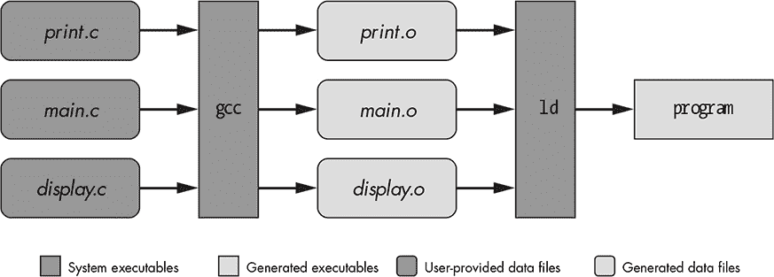

## 3

理解 GNU 编码标准

*我不知道人们怎么了：他们不是通过理解来学习，而是通过其他方式——死记硬背什么的。他们的知识是如此脆弱！*

—理查德·费曼*，《你一定是在开玩笑，费曼先生！》


在第二章中，我概述了 GNU Autotools 以及一些能够帮助减少学习曲线的资源。在这一章中，我们将稍微后退一步，探讨一些项目组织技巧，这些技巧不仅适用于使用 Autotools 的项目，也适用于任何项目。

当你读完本章后，你应该熟悉常见的`make`目标及其存在的原因。你还应该对为什么项目会按这种方式组织有一个扎实的理解。事实上，你已经走在了成为 Autotools 专家的路上。

本章提供的信息主要来自两个来源：

+   *GNU 编码标准（GCS）*^(1)

+   *文件系统层次标准（FHS）*^(2)

如果你想复习一下`make`的语法，你可能会发现*GNU Make 手册* ^(3) 非常有用。如果你特别感兴趣于便携式`make`语法，那么查看一下`make`的 POSIX 手册页^(4)吧。需要注意的是，目前在 Autotools 邮件列表中有关于将 GNU `make`作为目标标准的讨论，因为如今它已广泛可用。因此，便携式`make`脚本的重要性不再像过去那样突出。

### 创建一个新的项目目录结构

当你为一个开源软件项目设置构建系统时，你需要问自己两个问题：

+   我将针对哪些平台？

+   我的用户期望什么？

第一个问题是简单的——你可以决定目标平台，但不应过于限制。开源软件项目的好坏取决于其社区，而随意限制平台数量会减少你的社区的潜在规模。然而，你可以考虑只支持目标平台的当前版本。你可以通过与用户组和社区进行交流，确定哪些版本是相关的。

第二个问题更难回答。首先，让我们将范围缩小到一个可管理的范畴。你真正需要问的是，*我的用户对我的构建系统有什么期望？* 有经验的开源软件开发人员通过下载、解压、构建和安装数百个软件包，逐渐了解这些期望。最终，他们会直觉地知道用户对构建系统的期望是什么。但即便如此，软件包的配置、构建和安装过程差异巨大，因此很难定义一个固有的标准。

与其自己调查所有存在的构建系统，你可以查阅自由软件基金会（FSF），这是 GNU 项目的赞助商，它已经为你做了大量的工作。FSF 提供了一些关于自由开源软件的最佳权威信息来源，包括*GCS*，它涵盖了与编写、发布和分发自由开源软件相关的各种话题。即使是许多非 GNU 的开源软件项目也与*GCS*保持一致。为什么？因为 FSF 发明了自由软件的概念，而且这些理念大多数情况下是有道理的。^(5) 在设计一个管理软件打包、构建和安装的系统时，有几十个问题需要考虑，而*GCS* 已经考虑到了其中的大部分。

名字代表什么？

你可能知道，开源软件项目通常有一些奇特的名字——它们可能以某种设备、发明、拉丁术语、过去的英雄、古代神祇命名，或者它们可能以某些小型毛茸茸的动物命名，这些动物与软件有（模糊的）相似特征。也有些名字是捏造的词或缩写，既吸引人又易于发音。一个好项目名字的另一个重要特征是独特性——你的项目必须容易与其他项目区分开来。你还希望项目名字在搜索引擎中能够与其他使用该名字的结果区分开。此外，你还应该确保项目的名字在任何语言或文化中没有负面含义。

### 项目结构

我们将从一个基本的示例项目开始，并在继续探索源代码级软件分发的过程中逐步构建它。我们将项目命名为*Jupiter*，并使用以下命令创建项目目录结构：

```
$ cd projects
$ mkdir -p jupiter/src
$ cd jupiter
$ touch Makefile src/Makefile jupiter/src/main.c
$
```

现在我们有了一个名为*src*的源代码目录，一个名为*main.c*的 C 源文件，以及两个目录中的每个文件都包含一个 makefile。简洁，是的，但这是一个新的尝试，成功的开源软件项目的关键在于演化。从小做起，根据需要扩展——以及根据你的时间和兴趣。

让我们从添加支持构建和清理项目开始。稍后我们需要为构建系统添加其他重要功能，但这两个功能足以让我们开始。目前，顶级的 makefile 仅做了很少的工作；它只是将请求递归地传递给*src/Makefile*。这构成了一个相当常见的构建系统类型，称为*递归构建系统*，之所以这样命名，是因为 makefile 会递归地调用 `make` 来处理子目录的 makefile。^(6) 我们将在本章的最后花些时间思考如何将递归系统转换为非递归系统。

列表 3-1 到 3-3 显示了目前为止这三份文件的内容。

Git 标签 3.0

```
all clean jupiter:
        cd src && $(MAKE) $@

.PHONY: all clean
```

*清单 3-1：Makefile：Jupiter 顶层 makefile 的初步草稿*

```
all: jupiter

jupiter: main.c
        gcc -g -O0 -o $@ main.c
clean:
        -rm jupiter

.PHONY: all clean
```

*清单 3-2：* src/Makefile：*Jupiter 的 src 目录 makefile 的初步草稿*

```
#include <stdio.h>
#include <stdlib.h>

int main(int argc, char * argv[])
{
    printf("Hello from %s!\n", argv[0]);
    return 0;
}
```

*清单 3-3：* src/main.c：*Jupiter 项目中唯一的 C 源文件的第一个版本*

**注意**

*当你阅读这段代码时，你可能会注意到一些地方，其中的 makefile 或源代码文件包含了不是以最简单的方式编写的结构，或者可能不是你选择的编写方式。我的疯狂背后是有方法的：我试图使用许多 *`make`* 工具可以兼容的结构。*

现在让我们讨论一下 `make` 的基础。如果你已经相当熟悉它了，可以跳过下一节。否则，快速阅读一下，我们稍后会在本章的后续部分回到 Jupiter 项目。

### Makefile 基础

如果你不经常使用 `make`，通常很难记住在 makefile 中具体该放什么内容，因此这里有一些需要记住的要点。除了以井号（`#`）开头的注释外，makefile 中只有两种基本类型的实体：

+   规则定义

+   变量赋值

尽管在 makefile 中还有其他几种类型的结构（包括条件语句、指令、扩展规则、模式规则、函数变量和包含语句等），但为了我们的目的，我们只会在需要时简单提及它们，而不是详细讨论所有内容。这并不意味着它们不重要。相反，如果你要手动编写自己的复杂构建系统，它们非常有用。不过，我们的目标是为理解 GNU Autotools 打下必要的基础，因此我只会讲解你需要了解的 `make` 相关部分。

如果你想更深入了解 `make` 语法，可以参考 *GNU Make 手册*。对于严格的可移植语法，POSIX 中的 `make` 手册页是一个很好的参考。如果你想成为 `make` 专家，要准备花费相当多的时间学习这些资源——`make` 工具的功能远比最初看到的要复杂得多。

#### *规则*

规则遵循 清单 3-4 中展示的通用格式。

```
targets: [dependencies][; command-0]
[<tab>command-1
<tab>command-2
--snip--
<tab>command-N]
```

*清单 3-4：Makefile 中规则的语法*

在此语法定义中，方括号（`[` 和 `]`）表示规则的可选部分，`<tab>` 表示一个制表符（ctrl-i）字符。

除了制表符字符和换行符外，所有其他空白字符都是可选的并且会被忽略。当 makefile 中的一行以制表符字符开始时，`make`通常会将其视为命令（续行除外，后面会讨论）。事实上，对于初学者和专家来说，makefile 语法中最令人沮丧的一点就是命令必须以一个本质上不可见的字符为前缀。当遗留的 UNIX `make`工具缺少所需的制表符（或被编辑器转换为空格），或当意外的制表符被插入到可能被解释为规则的行的开头时，生成的错误消息往往模糊不清。GNU `make`在这些错误消息上做得更好。尽管如此，在 makefile 中使用制表符字符时仍然要小心——它们必须始终且仅仅出现在命令之前。^(7)

请注意，规则中的几乎所有内容都是可选的；规则中唯一必须的部分是*`targets`*部分及其冒号（`:`）字符。使用第一个命令，*`command-0`*及其前面的分号（`;`）是一种可选形式，通常 Autotools 不推荐使用，但如果你只有一个命令要执行，`make`语法是完全合法的。你甚至可以将*`command-0`*与其他命令结合使用，但这几乎从不发生。

一般来说，*目标*是需要构建的对象，而*依赖*是为目标提供源材料的对象。因此，目标被认为依赖于依赖。依赖本质上是目标的*前提条件*，因此应该首先更新它们。^(8)

列表 3-5 展示了 makefile 的一般布局。

```
var1 = val1
var2 = val2
--snip--
target1 : t1_dep1 t1_dep2 ... t1_depN
<tab>shell-command1a
<tab>shell-command1b
--snip--
target2 : t2_dep1 t2_dep2 ... t2_depN
<tab>shell-command2a
<tab>shell-command2b
--snip--
```

*列表 3-5：makefile 的一般布局*

makefile 的内容包含一种*声明性语言*，在其中你定义了一组期望的目标，`make`决定实现这些目标的最佳方式。`make`工具是一个基于规则的命令引擎，工作中的规则指示哪些命令应当执行，以及何时执行。当你在规则中定义命令时，你实际上是在告诉`make`，当前面的目标需要构建时，你希望它从 shell 中执行以下每个语句。假定这些命令实际上会创建或更新目标。规则中提到的目标和依赖项的文件存在性和时间戳指示是否应该执行命令以及执行的顺序。

当 `make` 处理 makefile 中的文本时，它会构建一个依赖关系链的网络（技术上称为*有向无环图*，或 *DAG*）。在构建特定目标时，`make` 必须从整个图中倒推回到每个“链”的起始点。在遍历链时，`make` 会执行每个规则的命令，从距离目标最远的规则开始，一直到所需目标的规则。当 `make` 发现某些目标比它们的依赖项更新较旧时，它必须执行相关的命令集来更新这些目标，然后才能处理链中的下一个规则。只要规则编写正确，这个算法确保了 `make` 会用尽可能少的操作构建一个完全最新的产品。实际上，正如我们稍后会看到的，当 makefile 中的规则编写得当时，看它在项目中的文件发生变化后运行，实际上是一种乐趣。

#### *变量*

包含等号（`=`）的 makefile 行是变量定义。在 makefile 中的变量与 Shell 或环境变量有些相似，但也有一些关键的区别。

在 Bourne Shell 语法中，你可以这样引用一个变量：`${my_var}`。同样可以使用不带花括号的形式：`$my_var`。在 makefile 中引用变量的语法几乎相同，不过你可以选择使用花括号或圆括号：`$(my_var)`。为了减少混淆，已成为一种约定，在取消引用 `make` 变量时使用圆括号而非花括号。对于单字符 `make` 变量，使用这些分隔符是可选的，但为了避免歧义，应该使用它们。例如，`$X` 在功能上等同于 `$(X)` 或 `${X}`，但是 `$(my_var)` 需要使用圆括号，以便 `make` 不会将引用解释为 `$(m)y_var`。

**注意**

*在*`make`*命令中取消引用一个 Shell 变量时，通过将美元符号加倍来转义它—例如，*`$${shell_var}`*。转义美元符号告诉*`make`*不要解释变量引用，而是将其视为命令中的字面文本。因此，变量引用将在命令执行时由 Shell 进行插值。*

默认情况下，*`make`* 在处理 makefile 之前会读取进程环境到其变量表中；这使你可以访问大多数环境变量，而无需在 makefile 中显式定义它们。然而，注意，在 makefile 中设置的变量将覆盖从环境中获得的变量。^(9) 通常，不建议在构建过程中依赖环境变量的存在，尽管可以在条件情况下使用它们。此外，`make` 定义了几个有用的变量，例如 `MAKE` 变量，其值为当前进程中调用 `make` 的命令。

你可以在 makefile 中的任何位置分配变量。然而，你需要注意的是，`make` 会对 makefile 进行两次处理。在第一次处理中，它会将变量和规则收集到表格和内部结构中。在第二次处理中，它会解析规则定义的依赖关系，根据第一次处理时收集到的文件系统时间戳调用规则，以重建依赖关系。如果规则中的依赖项比目标更新，或者目标缺失，那么 `make` 会执行该规则的命令来更新目标。某些变量引用在第一次处理规则时会立即解析，而其他的则在执行命令时，在第二次处理中解析。

#### *每个命令使用单独的 Shell*

在处理规则时，`make` 会独立执行每个命令。也就是说，规则下的每个命令都会在各自的 shell 中执行。这意味着你不能在一个命令中导出一个 shell 变量，然后在下一个命令中尝试访问它的值。

如果你想做类似的事情，你需要将命令串联在同一命令行上，使用命令分隔符（例如，Bourne shell 语法中的分号）。当你像这样写命令时，`make` 会将串联的命令作为一条命令行传递给同一个 shell。为了避免过长的命令行并增加可读性，你可以在每一行的末尾使用反斜杠将它们包裹起来——按照惯例，在分号后面。^(10) 这类命令的包装部分也可以用制表符字符来开头。POSIX 指定 `make` 在处理命令之前会移除所有前导的制表符字符（即便是那些跟在转义的换行符后的制表符），但需要注意的是，某些 `make` 实现可能会输出这些嵌入在包裹命令中的制表符字符——通常是无害的。^(11)

列表 3-6 显示了一些简单的多命令示例，这些命令将由同一个 shell 执行。

```
➊ foo: bar.c
           sources=bar.c; \
           gcc -o foo $${sources}
➋ fud: baz.c
           sources=baz.c; gcc -o fud $${sources}
➌ doo: doo.c
           TMPDIR=/var/tmp gcc -o doo doo.c
```

*列表 3-6：一个包含多个命令示例的 makefile，这些命令将由同一个 shell 执行*

在第一个例子 ➊ 中，两行命令由同一个 shell 执行，因为反斜杠将两行之间的换行符转义。`make` 工具会在将一条多命令语句传递给 shell 之前，删除所有转义的换行符。第二个例子 ➋ 与第一个例子在 `make` 的角度上是相同的。

第三个例子 ➌ 有些不同。在这种情况下，我仅为将运行 `gcc` 的子进程定义了 `TMPDIR` 变量。^(12) 注意缺少的分号；从 shell 的角度来看，这只是一个单独的命令。^(13)

**注意**

*如果你选择用一个反斜杠来换行命令，请确保反斜杠后面没有空格或其他不可见字符。反斜杠转义了换行符，因此它必须紧接在换行符之前。*

#### *变量绑定*

在命令中引用的变量可能在 makefile 中的命令之后才被定义，因为这些引用的值直到`make`将命令传递给 shell 执行之前才会被绑定——也就是说，直到整个 makefile 被读取完之后。在一般情况下，`make`会尽可能推迟将变量绑定到值。

由于命令在规则之后处理，命令中的变量引用会比规则中的变量引用晚绑定。在规则中找到的变量引用在`make`根据规则构建有向图时会被扩展。因此，在规则中引用的变量必须在 makefile 中完全定义，且在引用规则之前。 清单 3-7 展示了一个 makefile 的部分内容，说明了这两个概念。

```
   --snip--
   mytarget = foo
➊ $(mytarget): $(mytarget).c
        ➋ gcc -o $(mytarget) $(mytarget).c
   mytarget = bar
   --snip--
```

*清单 3-7：makefile 中的变量扩展*

在➊规则中，`$(mytarget)`的两个引用在第一次处理时都被扩展为`foo`，因为那时`make`正在构建变量列表和有向图。然而，结果可能并不是你预期的，因为在➋命令中的两个`$(mytarget)`引用要到稍后才会被扩展，远在`make`已经将`bar`赋值给`mytarget`，并覆盖了原本的`foo`赋值之后。

清单 3-8 展示了在变量完全扩展后，`make`如何看待相同的规则和命令。

```
--snip--
foo: foo.c
        gcc -o bar bar.c
--snip--
```

*清单 3-8：代码在清单 3-7 中的变量扩展结果*

这个故事的寓意是，你应该了解在 makefile 结构中，变量会在哪里被扩展，这样你就不会感到惊讶，当`make`处理你的 makefile 时不按预期的方式执行。良好的实践（也是避免头痛的好方法）是，在打算使用变量之前，总是先赋值给它们。有关 makefile 中变量的即时扩展和延迟扩展的更多信息，请参考*GNU Make 手册*中的“make 如何读取 makefile”一节。

#### *规则详细信息*

我在示例中使用的规则，称为*常见*的`make`规则，包含一个冒号字符（`:`）。冒号将左边的目标与右边的依赖项分开。

记住，目标是产物——即通过执行一个或多个命令（如 C 或 C++编译器、链接器，或者像 Doxygen 或 LaTeX 这样的文档生成器）可以生成的文件系统实体。而依赖关系则是源对象，或者是用来创建目标的对象。这些对象可能是计算机语言源文件、先前规则构建的中间产品，或者任何可以被命令用作资源的东西。

你可以在`make`命令行中直接指定任何在 makefile 规则中定义的目标，`make`将执行生成该目标所需的所有命令。

**注意**

*如果你没有在`make`命令行中指定任何目标，`make`将使用默认目标——即它在 makefile 中找到的第一个目标。*

例如，一个 C 编译器接受依赖项 *main.c* 作为输入并生成目标 *main.o*。然后，链接器以 *main.o* 作为输入并生成一个命名的可执行目标——在这种情况下是 `program`。

图 3-1 显示了数据流的过程，这些流程可能由 Makefile 中定义的规则指定。



*图 3-1：编译和链接过程的数据流图*

`make` 工具实现了一些相当复杂的逻辑，用来判断何时执行一个规则，依据是目标文件是否存在，以及它是否比其依赖项旧。列表 3-9 显示了一个包含规则的 Makefile，其中一些规则会执行 图 3-1 中的操作。

```
program: main.o print.o display.o
     ➊ ld main.o print.o display.o ... -o program

main.o: main.c
        gcc -c -g -O2 -o main.o main.c

print.o: print.c
        gcc -c -g -O2 -o print.o print.c

display.o: display.c
        gcc -c -g -O2 -o display.o display.c
```

*列表 3-9：使用多个 `make` 规则编译并链接程序*

这个 Makefile 中的第一个规则指出，`program` 依赖于 *main.o*、*print.o* 和 *display.o*。其余的规则则表示每个 *.o* 文件依赖于相应的 *.c* 文件。最终，`program` 依赖于这三个源文件，但由于过程分为编译和链接两个步骤，中间还需要生成结果，因此必须有对象文件作为中间依赖。在每个规则中，`make` 使用关联的命令列表根据依赖项列表构建规则的目标。

Unix 编译器设计为比链接器更高级的工具。它们内置了关于特定系统链接器要求的低级知识。在 列表 3-9 中的 Makefile，➊ 处的省略号是一个占位符，用于表示构建系统上所有程序所需的系统特定、低级对象和库的列表。编译器可以用来调用链接器，并默默地传递这些系统特定的对象和库。（这种方法非常有效且广泛使用，以至于通常很难发现如何在给定系统上手动执行链接器。）列表 3-10 显示了你如何重写 列表 3-9 中的 Makefile，使用编译器来编译源代码并在单个规则中调用链接器。

```
sources = main.c print.c display.c

program: $(sources)
        gcc -g -O2 -o program $(sources)
```

*列表 3-10：使用单个 `make` 规则将源代码编译成可执行文件*

**注意**

*在这种情况下，使用单个规则和命令来处理这两个步骤是可行的，因为这个示例非常基础。对于更大的项目，通常不建议在一个步骤中直接从源代码跳到可执行文件。然而，在任何情况下，使用编译器调用链接器可以减轻确定需要链接到应用程序的许多系统对象的负担，实际上，这个技术非常常见并被广泛使用。更复杂的示例中，每个文件会被单独编译，编译器会将每个源文件编译成对象文件，然后使用编译器调用链接器将所有文件链接成一个可执行文件。*

在这个例子中，我添加了一个 `make` 变量（`sources`），它允许我们将所有产品依赖项整合到一个位置。现在，我们有一个源文件列表，该列表在两个地方引用：在依赖列表中和命令行中。

##### 自动变量

依赖列表中可能包含其他不是 `sources` 变量中的对象，包括预编译对象和库。这些其他对象必须在规则中和命令行中分别列出。如果我们能为引用规则的整个依赖列表提供简写形式，那该有多好？

实际上，各种 *自动* 变量可以在执行命令时引用控制规则的部分。不幸的是，如果你关心 `make` 实现之间的可移植性，这些大多数都几乎无用。`$@` 变量（引用当前目标）是可移植且有用的，但其他大多数自动变量过于有限，无法发挥太大作用。^(14) 以下是 POSIX 为 `make` 定义的完整可移植自动变量列表：

+   `$@` 指当前目标的完整目标名称或库归档目标的归档文件名部分。此变量在显式和隐式规则中都有效。

+   `$%` 指归档成员，仅在当前目标是归档成员时有效——即静态库中的目标文件。此变量在显式和隐式规则中都有效。

+   `$?` 指比当前目标更新的依赖项列表。此变量在显式和隐式规则中都有效。

+   `$<` 指依赖列表中允许选择该规则的依赖项。此变量仅在隐式规则中有效。

+   `$*` 指当前目标名称，去掉其后缀部分。POSIX 保证此变量仅在隐式规则中有效。

GNU `make` 大大扩展了 POSIX 定义的列表，但由于 GNU 扩展不可移植，除 `$@` 外不建议使用这些扩展。

##### 依赖规则

假设 *print.c* 和 *display.c* 各自有一个同名的头文件，以 *.h* 结尾。每个源文件都包含自己的头文件，但 *main.c* 包含了 *print.h* 和 *display.h*。根据 Listings 3-9 和 3-10 中的 makefile，如果你执行 `make` 来构建 `program`，然后修改其中一个头文件——比如 *print.h*，再重新执行 `make`，你觉得会发生什么？什么都不会发生，因为 `make` 根本不知道这些头文件的存在。在 `make` 看来，你并没有更改任何与 `program` 相关的内容。

在列表 3-11 中，我将`sources`变量替换为`objects`变量，并用对象文件列表替换了源文件列表。这个版本的 makefile 在列表 3-10 中也通过利用标准和自动变量，消除了冗余。

```
objects = main.o print.o display.o

main.o: main.c print.h display.h
print.o: print.c print.h
display.o: display.c display.h

program: $(objects)
        gcc -g -O2 -o $@ $(objects)
```

*列表 3-11：在命令中使用自动变量*

我还添加了三个*依赖规则*，这些规则没有命令，目的是澄清编译器输出文件与依赖的源文件和头文件之间的关系。因为*print.h*和*display.h*（假定）被*main.c*包含，若这两个文件中的任何一个发生变化，*main.c*就必须重新编译；然而，`make`并不能知道这两个头文件是被*main.c*包含的。依赖规则允许开发者告知`make`这种后端关系。

##### 隐式规则

如果你试图根据列表 3-11 中的 makefile 规则，心算出`make`将构建的依赖图，你会发现网络中似乎有个漏洞。根据文件中的最后一条规则，`program`可执行文件依赖于*main.o*、*print.o*和*display.o*。此规则还提供了将这些目标链接成可执行文件的命令（这次只是调用链接器，而使用编译器）。这些目标文件通过三个依赖规则与它们对应的 C 源文件和头文件相关联。但编译*.c*文件成*.o*文件的命令在哪里？

我们可以将这些命令添加到依赖规则中，但其实没有必要，因为`make`有一个*内建*规则，知道如何从*.c*文件构建*.o*文件。`make`并没有什么神奇之处——它只知道你通过编写规则描述给它的关系。但`make`确实有一些内建规则，描述了例如*.c*文件和*.o*文件之间的关系。这个特定的内建规则提供了从具有相同基础名称的*.c*文件构建任何*.o*扩展名文件的命令。这些内建规则被称为*后缀规则*，或者更一般地说，*隐式规则*，因为依赖关系（源文件）的名称是通过目标（目标文件）的名称隐含表达的。

为了使内建隐式规则更广泛可用，它们的命令通常会使用一些知名的`make`变量。如果你设置了这些变量，覆盖了默认值，你可以对执行内建规则有一定的控制。例如，在内建隐式规则的标准 POSIX 定义中，*.o*文件转为*.c*文件的命令是：^(15)

```
$(CC) $(CPPFLAGS) $(CFLAGS) -c
```

在这里，你几乎可以通过设置`CC`（编译器）、`CPPFLAGS`（传递给 C 预处理器的选项）和`CFLAGS`（传递给 C 编译器的选项）来覆盖这个内建规则的各个方面。

如果需要，你可以自己编写隐式规则。你甚至可以用自己的版本覆盖默认的隐式规则。隐式规则是一个强大的工具，不容忽视，但在本书中，我们不会深入讨论。你可以通过阅读*GNU Make 手册*中的“使用隐式规则”部分，了解更多关于在 makefile 中编写和使用隐式规则的信息。

为了说明这种隐式功能，我创建了简单的 C 源代码和头文件，配合列表 3-11 中的示例 makefile。以下是我执行`make`命令时发生的情况：

```
➊ $ make
   cc    -c -o main.o main.c
   $
➋ $ make program
   cc    -c -o print.o print.c
   cc    -c -o display.o display.c
   gcc -g -O2 -o program main.o print.o display.o
   $
```

如你所见，`cc`通过`-c`和`-o`选项被神奇地执行，从*main.c*生成*main.o*。这是常见的命令行语法，用于让 C 语言编译器从源代码构建对象，实际上，这种功能已内建在`make`中。如果你在现代的 GNU/Linux 系统中查找`cc`，你会发现它是*/usr/bin*中的一个软链接，指向系统的 GNU C 编译器。在其他系统中，它指向系统的本地 C 编译器。几十年来，调用系统 C 编译器为*cc*已经成为事实上的标准。^(16)

在➊那行输出中，`cc`和`-c`之间的额外空格表示`CPPFLAGS`和`CFLAGS`变量之间的空格，这些变量默认被定义为空。

那么，为什么我们在➊处输入`make`时，`make`工具只构建了*main.o*呢？仅仅是因为*main.o*的依赖规则提供了 makefile 中的第一个（因此也是默认）目标。在这种情况下，要构建`program`，我们需要执行`make program`，就像我们在➋所做的那样。记住，当你在命令行输入`make`时，`make`工具会尝试构建当前目录中名为*Makefile*的文件内第一个显式定义的目标。如果我们想让`program`成为默认目标，我们可以重新排列规则，使得`program`规则成为 makefile 中列出的第一个目标。

为了查看依赖规则的实际作用，可以触摸其中一个头文件，然后重新构建`program`目标：

```
$ touch display.h
$ make program
cc -c -o main.o main.c
cc -c -o display.o display.c
gcc -g -O0 -o program main.o print.o display.o
$
```

在更新了*display.h*之后，只有*display.o*、*main.o*和`program`被重新构建。由于*print.c*不依赖于*display.h*，根据 makefile 中指定的规则，*print.o*对象不需要重新构建。

##### 虚拟目标

目标并不总是文件。它们也可以是所谓的*虚拟目标*，例如`all`和`clean`。这些目标不指代文件系统中的真实产品，而是特定的结果或操作——当你执行这些目标时，项目会被*清理*，*所有*产品会被构建，等等。

##### 多目标

正如你可以在冒号右侧列出多个依赖项一样，你也可以通过在冒号左侧列出目标，将多个目标的规则与相同的依赖项和命令结合起来，如列表 3-12 所示。

```
all clean:
        cd src && $(MAKE) $@
```

*示例 3-12：在规则中使用多个目标*

虽然这在一开始可能不太明显，但这个示例包含了两个独立的规则：一个针对 `all`，另一个针对 `clean`。因为这两个规则有相同的依赖集（在这种情况下没有依赖）和相同的命令集，我们可以利用 `make` 支持的简写符号，将它们的规则合并为一个规范。

为了帮助你理解这个概念，考虑 示例 3-12 中的 `$@` 变量。它指向哪个目标？这取决于当前执行的是哪个规则——是 `all` 还是 `clean`。由于一个规则在任何给定时刻只能执行一个目标，`$@` 只能指向一个目标，即使控制规则的定义包含多个目标。

#### *Makefile 作者的资源*

GNU `make` 比原始的 AT&T UNIX `make` 工具要强大得多，尽管只要避免使用 GNU 扩展，GNU `make` 完全向后兼容。*GNU Make 手册*^(17) 可以在线访问，而 O'Reilly 也出版了一本关于原始 AT&T UNIX `make` 工具的优秀书籍^(18)，详细讲解了它的各种细节。虽然你仍然可以找到这本书，但出版商已经将其内容合并进了一个新的版本，其中也涵盖了 GNU `make` 的扩展。^(19)

这部分结束了对 makefile 语法和 `make` 工具的基本讨论，尽管在本章接下来的内容中，我们会在遇到时继续探讨其他 makefile 结构。通过这些基本信息的学习，让我们回到 Jupiter 项目，开始添加一些更有趣的功能。

### 创建源代码分发档案

为了将 Jupiter 的源代码真正提供给用户，我们需要创建并分发一个源代码档案——一个 tarball。我们可以编写一个单独的脚本来创建这个 tarball，但既然我们可以使用虚拟目标在 makefile 中创建任意功能集，为什么不设计一个 `make` 目标来执行这项任务呢？为分发构建源代码档案通常归属于 `dist` 目标。

在设计一个新的 `make` 目标时，我们需要考虑它的功能是否应该在项目的 makefile 中分布，还是在单一位置处理。通常的经验法则是利用递归构建系统的特性，让每个目录管理自己部分的流程。我们在示例 3-1 中就是这么做的，将构建 `jupiter` 程序的控制权交给了包含源代码的 *src* 目录。然而，从目录结构中构建压缩档案并不真的是一个递归过程。^(20) 因此，我们必须在两个 makefile 中执行整个任务。

全局进程通常由项目目录结构中最高相关级别的 makefile 处理。我们将在顶级 makefile 中添加`dist`目标，如清单 3-13 所示。

Git 标签 3.1

```
➊ package = jupiter
   version = 1.0
   tarname = $(package)
   distdir = $(tarname)-$(version)

   all clean jupiter:
           cd src && $(MAKE) $@

➋ dist: $(distdir).tar.gz

➌ $(distdir).tar.gz: $(distdir)
           tar chof - $(distdir) | gzip -9 -c > $@
           rm -rf $(distdir)

➍ $(distdir):
           mkdir -p $(distdir)/src
           cp Makefile $(distdir)
           cp src/Makefile src/main.c $(distdir)/src

➎ .PHONY: all clean dist
```

*清单 3-13:* Makefile：将`dist`目标添加到顶级 makefile 中

除了在➋处添加`dist`目标外，我还做了一些其他修改。我们一个一个地来看。我已将`dist`目标添加到➎处的`.PHONY`规则中。`.PHONY`规则是一种特殊的内置规则，叫做*点规则*或*指令*。`make`工具理解几种点规则。`.PHONY`的目的是简单地告诉`make`，某些目标不会生成文件系统对象。通常，`make`通过比较目标与其依赖项的时间戳来决定运行哪些命令——但虚拟目标没有关联的文件系统对象。使用`.PHONY`可以确保`make`不会去查找这些目标所命名的不存在的产品文件。它还确保，如果一个名为*dist*的文件或目录不小心被添加到目录中，`make`仍然会将`dist`目标视为非真实目标。

向`.PHONY`规则添加一个目标还有另一个效果。由于`make`无法通过时间戳来判断目标是否是最新的（即比它的依赖项更新），`make`唯一能做的就是*始终*执行与虚拟目标关联的命令，无论这些目标是通过命令行请求的，还是出现在依赖链中。

为了提高可读性、模块化和维护性，我将`dist`目标的功能分为三个单独的规则（➋、➌和➍）。这是任何软件工程过程中一个很好的经验法则：*将大型过程构建为较小的过程，并在合理的地方重用这些小的过程*。

➋处的`dist`目标依赖于最终目标的存在——在这种情况下，是一个源级压缩归档包，*jupiter-1.0.tar.gz*。我使用了一个变量来保存版本号（这样以后更新项目版本更容易），另一个变量用于包名在➊处，这样如果我决定将这个 makefile 用于另一个项目时，改名就会更容易。我还在逻辑上将包名和 tarball 名的功能分开；默认的 tarball 名称是包名，但我们也有选择将它们设置为不同的名称。

构建 tarball 的规则在➌处指出了如何使用`gzip`和`tar`工具通过一个命令来创建该文件。但请注意，该规则有一个依赖关系——要归档的目录。目录名是从 tarball 的名称和包版本号派生的；它存储在另一个名为`distdir`的变量中。

我们不希望上次构建尝试中的目标文件和可执行文件出现在归档中，因此我们需要构建一个图像目录，包含我们想要发布的所有内容——包括构建和安装过程中所需的任何文件，以及任何额外的文档或许可文件。不幸的是，这几乎要求必须使用单独的复制（`cp`）命令。

由于 makefile 中有一条规则（在 ➍ 处）指示如何创建这个目录，并且该规则的目标是 tarball 的依赖项，`make` 会先执行该规则的命令，再执行 tarball 规则的命令。回想一下，`make` 会递归地处理规则，以从底部到顶部构建依赖关系，直到它能够执行请求的目标的命令。^(21)

#### *强制执行规则*

`$(distdir)` 目标中有一个微妙的缺陷，现在可能不太明显，但它将在最糟糕的时候露出它丑陋的面目。如果在执行 `make dist` 时归档图像目录 (*jupiter-1.0*) 已经存在，那么 `make` 就不会尝试创建它。试试这个：

```
$ mkdir jupiter-1.0
$ make dist
tar chof - jupiter-1.0 | gzip -9 -c > jupiter-1.0.tar.gz
rm -rf jupiter-1.0
$
```

请注意，`dist` 目标并没有复制任何文件——它只是从现有的 *jupiter-1.0* 目录中创建了一个归档文件，而该目录是空的。当用户解压这个 tarball 时，肯定会大吃一惊！更糟糕的是，如果之前归档尝试中的图像目录仍然存在，那么新的 tarball 将包含我们上次尝试创建发行版 tarball 时的过时源代码。

问题在于，`$(distdir)` 目标是一个没有依赖关系的实际目标，这意味着只要它在文件系统中存在，`make` 就会认为它是最新的。我们可以将 `$(distdir)` 目标添加到 `.PHONY` 规则中，以强制 `make` 每次执行 `dist` 目标时都重新构建它，但它并不是一个虚假目标——它是一个实际的文件系统对象。确保 `$(distdir)` 始终被重新构建的正确方法是确保在 `make` 尝试构建它之前，它并不存在。实现这一目标的一种方式是创建一个真正的虚假目标，使其始终执行，然后将该目标添加到 `$(distdir)` 目标的依赖列表中。此类目标的常见名称是 `FORCE`，我在 Listing 3-14 中实现了这个概念。

Git 标签 3.2

```
   --snip--
   $(distdir).tar.gz: $(distdir)
           tar chof - $(distdir) | gzip -9 -c > $@
           rm -rf $(distdir)

➊ $(distdir): FORCE
           mkdir -p $(distdir)/src
           cp Makefile $(distdir)
           cp src/Makefile $(distdir)/src
           cp src/main.c $(distdir)/src

➋ FORCE:
           -rm $(distdir).tar.gz >/dev/null 2>&1
           rm -rf $(distdir)

  .PHONY: FORCE all clean dist
```

*Listing 3-14: Makefile: 使用 `FORCE` 目标*

`FORCE` 规则的命令（在 ➋ 处）每次都会执行，因为 `FORCE` 是一个虚假目标。由于我们将 `FORCE` 作为 `$(distdir)` 目标的依赖项（在 ➊ 处），我们有机会在 `make` 开始评估是否应执行 `$(distdir)` 的命令之前，删除任何先前创建的文件和目录。

#### *领先的控制字符*

命令前缀的破折号字符（`-`）告诉`make`不关心它所执行的命令返回的状态码。通常，当`make`遇到返回非零状态码的命令时，它会停止执行并显示错误信息，但如果你使用了破折号，它会忽略错误并继续执行。我在`FORCE`规则中的第一个`rm`命令前加了破折号，因为我想删除可能存在也可能不存在的先前创建的产品文件，如果尝试删除不存在的文件，`rm`会返回错误。

通常来说，一个更好的选择是在`rm`命令行中使用`-f`标志，这样`rm`就会忽略缺失文件的错误。使用`-f`的另一个好处是，我们不再需要将错误消息重定向到*/dev/null*，因为我们其实更关心其他错误——例如权限错误。从现在开始，我们将在所有`rm`命令前去掉破折号，并确保使用`-f`。

你可能会遇到的另一个重要符号是@符号（`@`）。以@符号为前缀的命令告诉`make`不要执行其正常行为，即在执行命令时不将命令打印到`stdout`设备。通常在`echo`语句前使用@符号。你不希望`make`打印`echo`语句，因为这样你的消息就会被打印两次：一次由`make`，然后再由`echo`语句本身打印。

**注意**

*你还可以以任意顺序组合这些前导字符（*`@`*、*`-`*和*`+`*）。加号（*`+`*）字符用于强制执行一个原本不会执行的命令，例如由于`-n`命令行选项，它告诉`make`执行所谓的干运行。有些命令即使在干运行中也有意义。*

最好谨慎使用@符号。我通常将它保留用于那些我*永远*不想看到的命令，例如`echo`语句。如果你喜欢安静的构建系统，可以考虑在 makefile 中使用全局`.SILENT`指令。或者，更好的是，干脆什么都不做，让用户可以选择在其`make`命令行中添加`-s`选项，这样用户就可以选择他们想看到多少输出。

### 自动测试分发

构建归档目录的规则可能是这个 makefile 中最令人沮丧的规则，因为它包含了将单个文件复制到分发目录中的命令。每次我们更改项目中的文件结构时，我们都必须在顶层 makefile 中更新这个规则，否则我们会破坏`dist`目标。但是我们能做的也不多——我们已经将这个规则简化到极限。现在我们只需要记住正确管理这个过程。

不幸的是，如果忘记更新`distdir`规则的命令，可能会发生比破坏`dist`目标更糟糕的事情。看起来`dist`目标似乎工作正常，但实际上可能没有将所有必要的文件复制到 tarball 中。事实上，更有可能发生这种情况，而不是错误，因为添加文件到项目中比移动或删除文件更为常见。新文件将不会被复制，但`dist`规则不会注意到这个区别。

有一种方法可以对`dist`目标执行自检。我们可以创建另一个虚拟目标，叫做`distcheck`，它会做完全相同的事情：解压缩 tarball 并构建项目。我们可以让这个规则的命令在临时目录中执行这个任务。如果构建过程失败，那么`distcheck`目标会失败，告诉我们在分发包中遗漏了某些重要的内容。

清单 3-15 展示了为了实现`distcheck`目标，我们对顶级 makefile 所做的修改。

Git 标签 3.3

```
--snip--
$(distdir): FORCE
        mkdir -p $(distdir)/src
        cp Makefile $(distdir)
        cp src/Makefile src/main.c $(distdir)/src

distcheck: $(distdir).tar.gz
        gzip -cd $(distdir).tar.gz | tar xvf -
        cd $(distdir) && $(MAKE) all
        cd $(distdir) && $(MAKE) clean
        rm -rf $(distdir)
        @echo "*** Package $(distdir).tar.gz is ready for distribution."
--snip--
.PHONY: FORCE all clean dist distcheck
```

*清单 3-15: Makefile: 向顶级 makefile 添加 `distcheck` 目标*

`distcheck`目标依赖于 tarball 本身，因此首先执行构建 tarball 的规则。然后，`make` 工具执行`distcheck`命令，它解压缩刚刚构建的 tarball，然后在结果目录内递归地对`all`和`clean`目标运行`make`。如果该过程成功，`distcheck`目标将输出一条消息，表示用户在使用这个 tarball 时很可能不会遇到问题。

现在，你只需要记住在发布 tarball 供公众分发之前，执行 `make distcheck`！

### 单元测试，谁来做？

有些人坚称单元测试是邪恶的，但他们能提出的唯一不做单元测试的理由就是懒惰。适当的单元测试是艰苦的工作，但最终是值得的。做单元测试的人通常在儿童时期就学会了一个关于延迟满足价值的教训。

一个好的构建系统应该包括适当的单元测试。最常用的测试构建的目标是`check`目标，所以我们将像往常一样添加它。实际的单元测试可能应该放在*src/Makefile*中，因为这是构建`jupiter`可执行文件的地方，因此我们将从顶级 makefile 传递`check`目标。

但是，我们应该在`check`规则中放入什么命令呢？嗯，`jupiter`是一个非常简单的程序——它打印消息 *Hello from* some/path/*jupiter!*，其中 *some/path* 取决于从哪个位置执行`jupiter`。我将使用`grep`工具来测试`jupiter`是否确实输出了这样的字符串。

清单 3-16 和 3-17 分别展示了对顶级和*src*目录 makefile 所做的修改。

Git 标签 3.4

```
--snip--
all clean check jupiter:
        cd src && $(MAKE) $@
--snip--
.PHONY: FORCE all clean check dist distcheck
```

*清单 3-16:* Makefile: *将 `check` 目标传递到 src/Makefile*

```
--snip--
src/jupiter: src/main.c
        $(CC) $(CFLAGS) $(CPPFLAGS) -o $@ src/main.c

check: all
        ./jupiter | grep "Hello from .*jupiter!"
        @echo "*** ALL TESTS PASSED ***"
--snip--

.PHONY: all clean check
```

*清单 3-17:* src/Makefile: *在 `check` 目标中实现单元测试*

请注意，`check` 依赖于 `all`。除非产品是最新的，能够反映最近对源代码或构建系统所做的任何更改，否则我们无法真正测试我们的产品。如果用户想要测试产品，他们当然希望产品是存在的并且是最新的。我们可以通过将 `all` 添加到 `check` 的依赖列表中来确保它们存在并且是当前的。

我们可以对构建系统进行另一个改进：我们可以将 `check` 添加到 `distcheck` 规则中由 `make` 执行的目标列表中，放在执行 `all` 和 `clean` 之间。清单 3-18 显示了在顶级 makefile 中执行此操作的位置。

Git 标签 3.5

```
--snip--
distcheck: $(distdir).tar.gz
        gzip -cd $(distdir).tar.gz | tar xvf -
        cd $(distdir) && $(MAKE) all
        cd $(distdir) && $(MAKE) check
        cd $(distdir) && $(MAKE) clean
        rm -rf $(distdir)
        @echo "*** Package $(distdir).tar.gz is ready for distribution."
--snip--
```

*清单 3-18:* Makefile: *将 `check` 目标添加到 `$(MAKE)` 命令中*

现在，当我们运行 `make distcheck` 时，它将测试与包一起发布的整个构建系统。

### 安装产品

我们已经达到了这样的阶段，用户在构建 Jupiter 项目时应该会感到相当顺利——甚至愉快。用户只需要解压分发包，进入分发目录，然后输入 `make`。实际上，它已经简单到不能再简单了。

但我们仍然缺少一个重要的功能——安装。就 Jupiter 项目而言，这相对简单。只有一个程序，大多数用户会正确猜测，安装它时，他们应该将 `jupiter` 复制到他们的 */usr/bin* 或 */usr/local/bin* 目录中。然而，更复杂的项目可能会让用户对将用户和系统二进制文件、库、头文件和文档（包括 man 页、info 页、PDF 文件，以及通常与 GNU 项目相关联的 *README*、*AUTHORS*、*NEWS*、*INSTALL* 和 *COPYING* 文件）放在哪里感到困惑。

我们实际上并不希望用户自己搞清楚这些问题，因此我们将创建一个 `install` 目标来管理在构建完成后将文件放到合适的位置。事实上，为什么不直接把安装作为 `all` 目标的一部分呢？嗯，我们还是不要太冲动。实际上，存在一些不这样做的合理原因。

首先，构建和安装是两个独立的逻辑概念。第二个原因是文件系统权限的问题。用户有权限在自己的主目录中构建项目，但安装通常需要 *root* 权限才能将文件复制到系统目录。最后，用户可能有多个原因希望构建但不安装项目，因此将这些操作绑定在一起是不可取的。

虽然创建分发包可能不是一个本质上递归的过程，但安装过程肯定是递归的，所以我们允许项目中的每个子目录管理其组件的安装。为此，我们需要修改顶级和 *src* 级别的 makefile。修改顶级 makefile 很简单：因为顶级目录中没有需要安装的产品，我们只是按惯例将责任交给 *src/Makefile*。

添加 `install` 目标的修改在列表 3-19 和 3-20 中展示。

Git 标签 3.6

```
--snip--
all clean check install jupiter:
        cd src && $(MAKE) $@
--snip--

.PHONY: FORCE all clean check dist distcheck install
```

*列表 3-19:* Makefile: *将 `install` 目标传递给 src/Makefile*

```
--snip--
check: all
        ./src/jupiter | grep "Hello from .*jupiter!"
        @echo "*** All TESTS PASSED"

install:
        cp jupiter /usr/bin
        chown root:root /usr/bin/jupiter
        chmod +x /usr/bin/jupiter
--snip--

.PHONY: all clean check install
```

*列表 3-20:* src/Makefile: *实现 `install` 目标*

在列表 3-19 中展示的顶级 makefile 中，我将 `install` 添加到了传递给 *src/Makefile* 的目标列表中。文件的安装由列表 3-20 中展示的 *src* 级别的 makefile 处理。

安装比简单复制文件要复杂一些。如果文件被放置在 */usr/bin* 目录中，那么 *root* 应该是其所有者，这样只有 *root* 才能删除或修改该文件。此外，`jupiter` 二进制文件应该被标记为可执行文件，因此我使用了 `chmod` 命令来设置文件的权限。这可能是多余的，因为链接器确保 `jupiter` 被创建为可执行文件，但并不是所有类型的可执行产品都是由链接器生成的——例如 shell 脚本。

现在我们的用户只需要输入以下命令序列，Jupiter 项目就会在他们的平台上以正确的系统属性和所有权进行构建、测试和安装：

```
$ gzip -cd jupiter-1.0.tar.gz | tar xf -
$ cd jupiter-1.0
$ make all check
--snip--
$ sudo make install
Password: ******
--snip--
$
```

#### *安装选项*

这一切看起来都不错，但在安装位置上，可能还需要更灵活一些。有些用户可能可以接受将 `jupiter` 安装到 */usr/bin* 目录下，而另一些用户则会问为什么它不安装到 */usr/local/bin* 目录——毕竟，这是一个常见的约定。我们可以将目标目录改为 */usr/local/bin*，但这时用户可能会问，为什么他们不能选择将其安装到自己的主目录中。这正是需要一点命令行支持灵活性的理想情况。

我们当前构建系统的另一个问题是，安装文件需要做很多操作。大多数 Unix 系统提供了一个系统级的程序——有时只是一个简单的 shell 脚本——叫做 `install`，它允许用户指定安装文件的各种属性。正确使用这个工具可以简化 Jupiter 的安装过程，因此在添加位置灵活性的同时，我们也可以使用 `install` 工具。这些修改在列表 3-21 和 3-22 中有所展示。

Git 标签 3.7

```
   package = jupiter
   version = 1.0
   tarname = $(package)
   distdir = $(tarname)-$(version)

   prefix=/usr/local
➊ export prefix

   all clean check install jupiter:
           cd src && $(MAKE) $@
--snip--
```

*列表 3-21: Makefile: 添加 `prefix` 变量*

```
--snip--
install:
     ➋ install -d $(prefix)/bin
        install -m 0755 jupiter $(prefix)/bin
--snip--
```

*清单 3-22：* src/Makefile：*在 `install` 目标中使用 `prefix` 变量*

请注意，我只在顶级 makefile 中声明并赋值了 `prefix` 变量，但我在 *src/Makefile* 中引用了它。我之所以能这么做，是因为我在顶级 makefile 的 ➊ 位置使用了 `export` 修饰符——这个修饰符将变量导出到 `make` 执行时在 *src* 目录中启动的 shell 中。`make` 的这一功能使我们能够在一个明显的位置——顶级 makefile 的开头——定义所有用户变量。

**注意**

*GNU *`make`* 允许你在赋值行使用 *`export`* 关键字，但这种语法在 GNU *`make`* 和其他版本的 *`make`* 之间并不兼容。从技术上讲，POSIX 根本不支持使用 *`export`*，但大多数 *`make`* 实现都支持它。*

我现在已经声明 `prefix` 变量为 */usr/local*，这对于那些想要将 `jupiter` 安装到 */usr/local/bin* 的用户非常有用，但对于那些希望将其安装到 */usr/bin* 的用户就不太友好了。幸运的是，`make` 允许你在命令行上定义 `make` 变量，方法如下：

```
$ sudo make prefix=/usr install
--snip--
```

请记住，命令行上定义的变量会覆盖在 makefile 中定义的变量。^(22) 因此，想要将 `jupiter` 安装到 */usr/bin* 目录的用户，现在可以在 `make` 命令行中指定这一点。

有了这个系统，用户可以将 `jupiter` 安装到他们选择的任何目录下的 *bin* 目录中，包括他们的主目录中的位置（此时他们不需要额外的权限）。事实上，这就是我们在 清单 3-22 的 ➋ 位置添加 `install -d $(prefix)/bin` 命令的原因——该命令在安装目录不存在时会创建它。由于我们允许用户在 `make` 命令行上定义 `prefix`，我们实际上并不知道用户将 `jupiter` 安装在哪里；因此，我们必须为目录尚不存在的可能性做好准备。试试看吧：^(23)

```
$ make all
$ make prefix=$PWD/inst install
$
$ ls -1p
inst/
Makefile
src/
$
$ ls -1p inst
bin/
$
$ ls -1p inst/bin
jupiter
$
```

#### *卸载软件包*

如果用户在安装了我们的软件包后不喜欢它，只想从系统中删除它怎么办？对于 Jupiter 项目来说，这种情况相当可能，因为它几乎没有用，而且会占用 *bin* 目录中的宝贵空间。然而，对于你们的项目而言，更可能的是，用户希望进行一个全新安装，安装一个更新版本，或者用他们 Linux 发行版中带有的正式打包版本替换从项目网站上下载的测试版。在这种情况下，支持 `uninstall` 目标会非常有用。

清单 3-23 和 3-24 展示了我们向两个 makefile 中添加 `uninstall` 目标的过程。

Git 标签 3.8

```
--snip--
all clean check install uninstall jupiter:
        cd src && $(MAKE) $@
--snip--

.PHONY: FORCE all clean check dist distcheck install uninstall
```

*清单 3-23：* Makefile：*向顶级 makefile 中添加 `uninstall` 目标*

```
--snip--
install:
        install -d $(prefix)/bin
        install -m 0755 jupiter $(prefix)/bin

uninstall:
        rm -f $(prefix)/bin/jupiter
        -rmdir $(prefix)/bin >/dev/null 2>&1
--snip--

.PHONY: all clean check install uninstall
```

*列表 3-24：* src/Makefile: *将 `uninstall` 目标添加到 src 级别的 makefile*

与 `install` 目标一样，如果用户使用系统前缀（如 */usr* 或 */usr/local*），则该目标需要 root 权限。你应该非常小心如何编写 `uninstall` 目标；除非目录专门属于你的软件包，否则不应该假设是你创建了它。如果你这么做，可能会删除像 */usr/bin* 这样的系统目录！

另一方面，如果在 `install` 目标中目录最初缺失，我们确实创建了该目录，因此如果可能的话，我们应该将其删除。在这里，我们可以使用 `rmdir` 命令，它的作用是删除空目录。即使该目录是像 */usr/bin* 这样的系统目录，如果它为空，删除它也是无害的，但如果它不为空，`rmdir` 将失败。回想一下，命令失败会停止 `make` 进程，因此我们也会在前面加上一个短横线字符。而且我们不想看到这样的失败，所以我们会将它的输出重定向到 */dev/null*。

我们的构建系统中需要维护的事项列表已经有些失控了。当我们更改安装过程时，现在有两个地方需要更新：`install` 和 `uninstall` 目标。不幸的是，当编写自己的 makefile 时，这大概是我们能期望的最好的结果，除非我们使用相当复杂的 shell 脚本命令。但坚持下去——在第六章中，我将展示如何使用 GNU Automake 以更简单的方式重写这个 makefile。

#### *测试安装和卸载*

现在让我们在 `distcheck` 目标中添加一些代码，测试 `install` 和 `uninstall` 目标的功能。毕竟，确保这两个目标在我们的发行版 tarball 中正确运行是非常重要的，所以我们应该在声明 tarball 版本可发布之前，在 `distcheck` 中对它们进行测试。列表 3-25 展示了顶层 makefile 中所需的更改。

Git 标签 3.9

```
--snip--
distcheck: $(distdir).tar.gz
        gzip -cd $(distdir).tar.gz | tar xvf -
        cd $(distdir) && $(MAKE) all
        cd $(distdir) && $(MAKE) check
        cd $(distdir) && $(MAKE) prefix=$${PWD}/_inst install
        cd $(distdir) && $(MAKE) prefix=$${PWD}/_inst uninstall
        cd $(distdir) && $(MAKE) clean
        rm -rf $(distdir)
        @echo "*** Package $(distdir).tar.gz is ready for distribution."
--snip--
```

*列表 3-25：* Makefile: *为 `install` 和 `uninstall` 目标添加 `distcheck` 测试*

请注意，我在 `$${PWD}` 变量引用中使用了双美元符号，确保 `make` 在执行命令之前将变量引用传递给 shell，而不是在行内展开它。我希望这个变量由 shell 解引用，而不是由 `make` 工具解引用。^(24)

我们在这里做的是测试，确保 `install` 和 `uninstall` 目标不会生成错误——但这不太可能，因为它们做的就是将文件安装到构建目录中的临时目录。我们可以在 `make` `install` 命令之后立即添加一些代码，检查应该被安装的产品，但这超出了我的承受范围。到了一定的程度，做检查的代码和安装代码一样复杂——在这种情况下，检查就变得毫无意义。

但是我们可以做其他事情：我们可以编写一个或多或少通用的测试，检查我们安装的所有东西是否都被正确删除。由于安装前阶段目录是空的，卸载后它最好保持相似的状态。清单 3-26 展示了这个测试的增加。

Git 标签 3.10

```
--snip--
distcheck: $(distdir).tar.gz
        gzip -cd $(distdir).tar.gz | tar xvf -
        cd $(distdir) && $(MAKE) all
        cd $(distdir) && $(MAKE) check
        cd $(distdir) && $(MAKE) prefix=$${PWD}/_inst install
        cd $(distdir) && $(MAKE) prefix=$${PWD}/_inst uninstall
     ➊ @remaining="`find $(distdir)/_inst -type f | wc -l`"; \
        if test "$${remaining}" -ne 0; then \
        ➋ echo "*** $${remaining} file(s) remaining in stage directory!"; \
           exit 1; \
        fi
        cd $(distdir) && $(MAKE) clean
        rm -rf $(distdir)
        @echo "*** Package $(distdir).tar.gz is ready for distribution."
--snip--
```

*清单 3-26:* Makefile: *添加一个测试以检查`uninstall`完成后剩余的文件*

这个测试首先在➊生成一个数字值，存储在名为`remaining`的 shell 变量中，表示在我们使用的阶段目录中找到的常规文件数量。如果这个数字不为零，测试会在➋向控制台打印一条信息，指示有多少文件在`uninstall`命令执行后被遗留下来，然后它会带着错误退出。提前退出让阶段目录保持不变，这样我们可以检查它，找出我们忘记卸载的文件。

**注意**

*这个测试代码很好地利用了多个 shell 命令传递给一个 shell。我不得不这样做，以便*`remaining`*的值可以被*`if`*语句使用。当闭合的*`if`*没有由与开头的*`if`*相同的 shell 执行时，条件语句的工作效果不好！*

我不想通过打印嵌入的`echo`语句来吓到人们，除非它真的应该被执行，所以我在整个测试前加上了一个 at 符号（`@`），这样`make`就不会将代码打印到`stdout`。由于`make`将这五行代码视为一个命令，抑制打印`echo`语句的唯一方法是抑制打印整个命令。

现在，这个测试并不完美——远远不完美。这个代码只检查常规文件。如果你的安装过程创建了软链接，这个测试将不会注意到它们是否被遗留下来。安装过程中构建的目录结构故意保持不变，因为检查代码并不知道阶段目录中的子目录是属于系统的还是属于项目的。`uninstall`规则中的命令可以知道哪些目录是项目特定的并正确地删除它们，但我不想在`distcheck`测试中加入项目特定的知识——这又是那个收益递减的问题。

### 文件系统层次标准

你可能现在在想，我是从哪里得到这些目录名的。如果某些 Unix 系统没有使用*/usr*或*/usr/local*怎么办呢？首先，这也是提供`prefix`变量的原因之一——让用户在这些问题上有一些选择。然而，现在大多数类 Unix 系统尽可能遵循*文件系统层次标准（FHS）*。*FHS* 定义了多个标准位置，包括以下根级目录：

| */bin* | */etc* | */home* |
| --- | --- | --- |
| */opt* | */sbin* | */srv* |
| */tmp* | */usr* | */var* |

这个列表绝不是详尽无遗的。我只提到了与我们研究开源项目构建系统最相关的目录。此外，*FHS* 定义了这些根级目录下的几个标准位置。例如，*/usr* 目录应包含以下子目录：

| */usr/bin* | */usr/include* | */usr/lib* |
| --- | --- | --- |
| */usr/local* | */usr/sbin* | */usr/share* |
| */usr/src* |  |  |

*/usr/local* 目录应包含与 */usr* 目录非常相似的结构。*/usr/local* 目录为软件安装提供了一个位置，可以覆盖安装在 */usr* 目录结构中的相同软件包版本，因为系统软件更新通常会覆盖 */usr* 中的软件而不加区别。*/usr/local* 目录结构允许系统管理员决定在系统上使用哪个版本的包，因为 */usr/local/bin* 可能（且通常会）被添加到 `PATH` 中，优先于 */usr/bin*。设计 *FHS* 时经过了相当多的思考，GNU Autotools 充分利用了这一共识。

*FHS* 不仅定义了这些标准位置，还详细解释了它们的用途以及应该存放哪些类型的文件。总的来说，*FHS* 给了你作为项目维护者足够的灵活性和选择，使你的工作既有趣又不至于让你怀疑是否把文件安装到了正确的位置。^(25)

### 支持标准目标和变量

除了我已经提到的内容外，*GNU 编程标准* 列出了你应该在项目中支持的一些重要目标和变量——主要是因为用户会期待你对它们的支持。

*GCS* 文档中的一些章节应谨慎对待（除非你正在进行一个 GNU 资助的项目）。例如，你可能不会太关心 *GCS* 中 第五章 关于 C 源代码格式的建议。你的用户肯定不会在乎，因此你可以使用任何你喜欢的源代码格式样式。

这并不是说 第五章 对非 GNU 开源项目没有价值。例如，“系统类型间的可移植性”和“CPU 之间的可移植性”小节提供了有关 C 源代码可移植性的宝贵信息。此外，“国际化”小节也提供了一些使用 GNU 软件进行项目国际化的有用建议。我们将在本书的 第十一章 中更详细地讨论国际化。

虽然*GCS*的第六章讨论了 GNU 方式的文档，但第六章中的一些部分描述了项目中常见的各种顶级文本文件，如*AUTHORS*、*NEWS*、*INSTALL*、*README*和*ChangeLog*文件。这些信息都是受过良好开源软件培训的用户期待在任何声誉良好的项目中看到的内容。

*真正*有用的信息出现在*GCS*文档的第七章，“发布过程”。这一章对你作为项目维护者至关重要，因为它定义了用户对你项目构建系统的期望。第七章包含了源代码分发包中用户选项的事实标准。

#### *标准目标*

*GCS*文档第七章中的“配置应如何工作”小节定义了配置过程，我在“配置你的包”一节中简要介绍了这一过程，见第 77 页。*GCS*的“Makefile 约定”小节涵盖了所有标准目标和许多用户在开源软件包中期望看到的标准变量。*GCS*定义的标准目标包括以下内容：

| `all` | `install` | `install-html` |
| --- | --- | --- |
| `install-dvi` | `install-pdf` | `install-ps` |
| `install-strip` | `uninstall` | `clean` |
| `distclean` | `mostlyclean` | `maintainer-clean` |
| `TAGS` | `info` | `dvi` |
| `html` | `pdf` | `ps` |
| `dist` | `check` | `installcheck` |
| `installdirs` |  |  |

你不需要支持所有这些目标，但应该考虑支持那些对你的项目有意义的目标。例如，如果你构建并安装 HTML 页面，你可能需要考虑支持`html`和`install-html`目标。Autotools 项目支持这些及更多目标。有些目标对最终用户有用，而有些则仅对项目维护者有用。

#### *标准变量*

你应该根据需要支持的变量包括下表中列出的变量。为了为最终用户提供灵活性，大多数这些变量是通过其中一些变量定义的，最终归结为一个变量：`prefix`。由于没有更标准的名称，我将这些称为*前缀变量*。这些变量中的大多数可以归类为*安装目录变量*，它们指向标准位置，但也有一些例外，比如`srcdir`。

这些变量的目的是由`make`完全解析，因此它们是通过`make`变量来定义的，使用圆括号而非花括号。表 3-1 列出了这些前缀变量及其默认值。

**表 3-1：** 前缀变量及其默认值

| **变量** | **默认值** |
| --- | --- |
| `prefix` | /usr/local |
| `exec_prefix` | `$(prefix)` |
| `bindir` | `$(exec_prefix)`/bin |
| `sbindir` | `$(exec_prefix)`/sbin |
| `libexecdir` | `$(exec_prefix)`/libexec |
| `datarootdir` | `$(prefix)`/share |
| `datadir` | `$(datarootdir)` |
| `sysconfdir` | `$(prefix)`/etc |
| `sharedstatedir` | `$(prefix)`/com |
| `localstatedir` | `$(prefix)`/var |
| `includedir` | `$(prefix)/`include |
| `oldincludedir` | /usr/include |
| `docdir` | `$(datarootdir)`/doc/`$(package)` |
| `infodir` | `$(datarootdir)`/info |
| `htmldir` | `$(docdir)` |
| `dvidir` | `$(docdir)` |
| `pdfdir` | `$(docdir)` |
| `psdir` | `$(docdir)` |
| `libdir` | `$(exec_prefix)`/lib |
| `lispdir` | `$(datarootdir)`/emacs/site-lisp |
| `localedir` | `$(datarootdir)`/locale |
|  `mandir`  | `$(datarootdir)`/man |
| `man`*`N`*`dir` | `$(mandir)`/man*N* (*N* = 1..9) |
| `manext` | .1 |
| `man`*`N`*`ext` | .*N* (*N* = 1..9) |
| `srcdir` | 构建树中与当前目录对应的源代码树目录 |

基于 Autotools 的项目会自动支持这些以及其他有用的变量，根据需要；Automake 对此提供完全支持，而 Autoconf 的支持则较为有限。如果你编写自己的 makefile 和构建系统，你应该支持在构建和安装过程中使用的尽可能多的这些变量。

#### *将位置变量添加到 Jupiter*

为了支持我们在 Jupiter 项目中使用的变量，我们需要添加`bindir`变量，以及它所依赖的任何变量——在这种情况下，是`exec_prefix`变量。列表 3-27 和 3-28 展示了如何在顶级和*src*目录的 makefile 中进行此操作。

Git 标签 3.11

```
--snip--
prefix = /usr/local
exec_prefix = $(prefix)
bindir = $(exec_prefix)/bin
export prefix
export exec_prefix
export bindir
--snip--
```

*列表 3-27:* Makefile: *添加 `bindir` 变量*

```
--snip--
install:
        install -d $(bindir)
        install -m 0755 jupiter $(bindir)

uninstall:
        rm -f $(bindir)/jupiter
        -rmdir $(bindir) >/dev/null 2>&1
--snip--
```

*列表 3-28:* src/Makefile: *添加 `bindir` 变量*

即使我们只在*src/Makefile*中使用`bindir`，我们也必须导出`prefix`、`exec_prefix`和`bindir`，因为`bindir`是通过`exec_prefix`定义的，而`exec_prefix`又是通过`prefix`定义的。当`make`运行`install`命令时，它将首先将`bindir`解析为`$(exec_prefix)`*/bin*，然后为`$(prefix)`*/bin*，最后为*/usr/local/bin*。因此，*src/Makefile*在此过程中需要访问这三个变量。

这些递归变量定义如何使最终用户的生活更轻松？毕竟，用户只需输入以下命令，就可以将根安装位置从*/usr/local*更改为*/usr*：

```
$ make prefix=/usr install
--snip--
```

在多个层级更改前缀变量的能力对于 Linux 发行版打包人员（在 Linux 公司工作的员工或志愿者，负责将你的项目专业地打包成*.deb*或*.rpm*包）尤其有用，因为他们需要将包安装到非常特定的系统位置。例如，发行版打包人员可以使用以下命令将安装前缀更改为*/usr*，系统配置目录更改为*/etc*：

```
$ make prefix=/usr sysconfdir=/etc install
--snip--
```

如果没有在多个层级更改前缀变量的能力，配置文件将最终位于*/usr/etc*，因为`$(sysconfdir)`的默认值是`$(prefix)`*/etc*。

### 将你的项目加入 Linux 发行版

当一个 Linux 发行版接手你的软件包进行分发时，你的项目几乎一夜之间就从数十个用户的范围，扩展到数万个用户的范围—几乎是立竿见影。有些人甚至可能在不知情的情况下使用你的软件。由于开源软件对于开发者的一大价值是免费帮助改进软件，所以这可以看作是一件好事——社区规模的急剧增加。

通过在你的构建系统中遵循 *GCS*，你去除了许多将你的项目包含到 Linux 发行版中的障碍。如果你的 tar 包遵循所有常规约定，发行版的打包人员会立刻知道该如何处理它。这些打包人员通常会根据所需的功能以及他们对你软件包的看法，决定是否将其包含到他们的 Linux 版本中。由于他们在这个过程中拥有相当大的权力，取悦他们对你来说是有利的。

*GCS* 的第七部分包含一个小小的子节，讨论了支持 *分阶段安装* 的内容。在你的构建系统中支持这一概念很容易，但如果你忽视了它，几乎总是会给打包人员带来问题。

包装系统，如 Red Hat 包管理器（RPM），接受一个或多个 tar 包、一组补丁文件和一个规范文件。所谓的 *spec 文件* 描述了在特定系统上构建和打包项目的过程。此外，它定义了所有安装到目标安装目录结构中的产品。包管理软件使用这些信息将你的软件包安装到临时目录中，然后从中提取指定的产品，将它们存储在包安装程序（例如 `rpm`）能够理解的特殊二进制归档中。

要支持分阶段安装，你只需要一个名为 `DESTDIR` 的变量，它作为一个超级前缀作用于所有已安装的产品。为了向你展示如何实现这一点，我将给 Jupiter 项目添加分阶段安装支持。这是非常简单的，只需对 *src/Makefile* 做四处更改即可。所需的更改在 Listing 3-29 中已标出。

Git 标签 3.12

```
--snip--
install:
        install -d $(DESTDIR)$(bindir)
        install -m 0755 jupiter $(DESTDIR)$(bindir)

uninstall:
        rm -f $(DESTDIR)$(bindir)/jupiter
        -rmdir $(DESTDIR)$(bindir) >/dev/null 2>&1
--snip--
```

*Listing 3-29:* src/Makefile: *添加分阶段构建功能*

如你所见，我已经将 `$(DESTDIR)` 前缀添加到了 `install` 和 `uninstall` 目标中引用安装路径的 `$(bindir)` 变量上。你无需为 `DESTDIR` 定义默认值，因为当它未定义时，它会展开为一个空字符串，这对其前置的路径没有影响。

**注意**

*不要在*`$(DESTDIR)`* 后面加斜杠，通常它是空的。前缀变量最终解析为以斜杠开始的内容；因此，在*`$(DESTDIR)`* 后加斜杠是多余的，并且在某些情况下可能会引起意外的副作用。*

我不需要为包管理器的原因在 `uninstall` 规则的 `rm` 命令中添加 `$(DESTDIR)`，因为包管理器不关心你的包是如何卸载的。它们只会安装你的包，以便从阶段目录中复制产品。要卸载阶段目录，包管理器只需要删除它。像 `rpm` 这样的包管理程序使用它们自己的规则来从系统中删除产品，这些规则基于包管理器数据库，而不是你的 `uninstall` 目标。

然而，为了对称性，并且为了完整性，将 `$(DESTDIR)` 添加到 `uninstall` 中并不会有坏处。此外，我们需要它来完整地支持 `distcheck` 目标，我们将修改它，以便利用我们的分阶段安装功能。这个修改展示在清单 3-30 中。

Git 标签 3.13

```
--snip--
distcheck: $(distdir).tar.gz
        gzip -cd $(distdir).tar.gz | tar xvf -
        cd $(distdir) && $(MAKE) all
        cd $(distdir) && $(MAKE) check
        cd $(distdir) && $(MAKE) DESTDIR=$${PWD}/inst install
        cd $(distdir) && $(MAKE) DESTDIR=$${PWD}/inst uninstall
        @remaining="`find $(distdir)/inst -type f | wc -l`"; \
        if test "$${remaining}" -ne 0; then \
          echo "*** $${remaining} file(s) remaining in stage directory!"; \
          exit 1; \
        fi
        cd $(distdir) && $(MAKE) clean
        rm -rf $(distdir)
        @echo "*** Package $(distdir).tar.gz is ready for distribution."
--snip--
```

*清单 3-30:* Makefile: *在 `distcheck` 目标中使用 `DESTDIR`*

在 `install` 和 `uninstall` 命令中将 `prefix` 更改为 `DESTDIR` 使我们能够正确测试完整的安装目录层级，正如我们稍后将看到的那样。

此时，一个 RPM 规范文件可以提供以下文本作为 Jupiter 包的安装命令：

```
%install
make prefix=/usr DESTDIR=%BUILDROOT install
```

不要担心包管理器的文件格式。相反，只需专注于通过 `DESTDIR` 变量提供分阶段安装功能。

你可能会想，为什么 `prefix` 变量无法提供此功能。一方面，并不是系统级安装中的每个路径都是相对于 `prefix` 变量定义的。例如，系统配置目录（`sysconfdir`）通常由打包者定义为 */etc*。你可以在表 3-1 中看到，`sysconfdir` 的默认定义是 `$(prefix)`*/etc*，因此，只有显式在 `configure` 或 `make` 命令行中设置它，`sysconfdir` 才会解析为 */etc*。如果你这样配置，只有像 `DESTDIR` 这样的变量才会在分阶段安装过程中影响 `sysconfdir` 的基本位置。随着我们在本章稍后的项目配置讨论，和接下来的两章讲解，其他原因会变得更加清晰。

### 构建与安装前缀重写

此时，我想稍微离题一下，解释一下关于 `prefix` 和其他路径变量在 *GCS* 中定义的一个难以捉摸（或者至少不显而易见）的概念。在前面的例子中，我在 `make install` 命令行上使用了 `prefix` 重写，像这样：

```
$ make prefix=/usr install
--snip--
```

我想要解决的问题是：使用前缀覆盖 `make all` 和 `make install` 有什么区别？在我们的简化样本 makefile 中，我们设法避免在与安装无关的任何目标中使用前缀，所以你现在可能还不清楚前缀在构建阶段是否*有用*。然而，正如清单 3-31 所示，前缀变量在构建阶段通过在编译时替换路径到源代码中非常有用。

```
program: main.c
       gcc -DCFGDIR="\"$(sysconfdir)\"" -o $@ main.c
```

*清单 3-31：在编译时将路径替换到源代码中*

在这个例子中，我在编译器命令行中定义了一个名为 `CFGDIR` 的 C 预处理器变量，供 *main.c* 使用。假设在 *main.c* 中有类似于清单 3-32 所示的代码。

```
#ifndef CFGDIR
# define CFGDIR "/etc"
#endif
const char *cfgdir = CFGDIR;
```

*清单 3-32：在编译时替换 `CFGDIR`*

在代码中稍后，你可能会使用 C 全局变量 `cfgdir` 来访问应用程序的配置文件。

Linux 发行版打包者通常会在 RPM 规范文件中的构建和安装命令行使用不同的前缀覆盖。在构建阶段，实际的运行时目录通过类似于清单 3-33 中显示的 `./configure` 命令被硬编码到可执行文件中。

```
%build
%setup
./configure prefix=/usr sysconfdir=/etc
make
```

*清单 3-33：构建源代码树的 RPM 规范文件部分*

请注意，我们必须显式地指定 `sysconfdir` 和 `prefix`，因为正如我之前提到的，系统配置目录通常位于 `prefix` 目录结构之外。包管理器将这些可执行文件安装到一个临时目录中，然后在构建二进制安装包时再从其安装位置复制它们。相应的安装命令可能类似于清单 3-34 中显示的命令。

```
%install
make DESTDIR=%BUILDROOT% install
```

*清单 3-34：RPM 规范文件的安装部分*

在安装过程中使用 `DESTDIR` 会临时覆盖 *所有* 安装前缀变量，因此你无需记住在配置时已覆盖哪些变量。根据清单 3-33 中显示的配置命令，在清单 3-34 中显示的方式使用 `DESTDIR`，与清单 3-35 中显示的代码效果相同。

```
%install
make prefix=%BUILDROOT%/usr sysconfdir=%BUILDROOT%/etc install
```

*清单 3-35：在安装过程中覆盖默认的 `sysconfdir`*

**警告**

*这里的关键点是我之前提到过的。永远不要在 makefile 中为 `make all` 或即使是部分产品构建编写安装目标。安装功能应该仅限于复制文件，尽可能如此。否则，如果用户使用前缀覆盖，他们将无法访问你的阶段安装功能。*

限制安装功能的另一个原因是，它允许用户将一组软件包作为一个整体安装到隔离位置，然后创建指向实际文件的链接到适当的位置。有些人在测试一个软件包时喜欢这样做，并希望追踪它的所有组件。^(26)

最后一点：如果你正在安装到系统目录结构中，你需要*root*权限。人们通常会像这样运行 `make install`：

```
$ sudo make install
```

如果你的 `install` 目标依赖于构建目标，并且你之前忽略了构建它们，`make` 会在安装之前很高兴地构建你的程序——但是本地副本将全都由*root*拥有。通过让 `make install` 因缺少需要安装的内容而失败，而不是在以*root*身份运行时直接进入构建过程，你可以轻松避免这种不便。

### 用户变量

*GCS* 定义了一组对用户至关重要的变量。这些变量应该被 GNU 构建系统*引用*，但永远不应该被 GNU 构建系统*修改*。这些所谓的*用户变量*包括在 表 3-2 中列出的 C 和 C++ 程序相关的变量。

**表 3-2：** 一些用户变量及其用途

| 变量 | 目的 |
| --- | --- |
| `CC` | 系统 C 编译器的引用 |
| `CFLAGS` | 所需的 C 编译器标志 |
| `CXX` | 系统 C++ 编译器的引用 |
|  `CXXFLAGS`  | 所需的 C++ 编译器标志 |
| `LDFLAGS` | 所需的链接器标志 |
| `CPPFLAGS` | 所需的 C/C++ 预处理器标志 |
| *`--snip--`* |  |

这个列表绝不是详尽无遗的，值得注意的是，在 *GCS* 中并没有找到一个完整的列表。实际上，这些变量大多来自 `make` 工具本身的文档。这些变量用于 `make` 工具的内建规则中——它们在 `make` 中有些是硬编码的，因此它们实际上由 `make` 定义。你可以在 *GNU Make Manual* 的“隐式规则使用的变量”部分找到一个相对完整的程序名称和标志变量列表。

请注意，`make` 会根据常见的 Unix 工具名称为许多变量分配默认值。例如，`CC` 的默认值是 `cc`，在 Linux 系统上，`cc` 是指向 GCC C 编译器（`gcc`）的软链接。在其他系统上，`cc` 是指向系统自有编译器的软链接。因此，我们不需要将 `CC` 设置为 `gcc`，这很好，因为在非 Linux 平台上可能没有安装 GCC。你可能会在某些时候希望在 `make` 命令行中设置 `CC`，例如使用 `clang` 之类的替代编译器，或者在使用 `ccache` 工具缓存 `gcc` 结果以加速重新编译时。

对于我们的目的来说，表 3-2 中显示的变量已经足够，但对于一个更复杂的 makefile，你应该熟悉 *GNU Make Manual* 中列出的更大列表。

要在我们的 makefile 中使用这些变量，我们只需要将`gcc`替换为`$(CC)`。我们对`CFLAGS`和`CPPFLAGS`也做同样的处理，尽管`CPPFLAGS`默认是空的。`CFLAGS`变量也没有默认值，但这是一个添加默认值的好时机。我喜欢使用`-g`来构建带有符号的目标文件，使用`-O0`来禁用调试构建中的优化。对*src/Makefile*的更新见列表 3-36。

Git 标签 3.14

```
4CFLAGS = -g -O0
--snip--
jupiter: main.c
        $(CC) $(CPPFLAGS) $(CFLAGS) -o $@ main.c
--snip--
```

*列表 3-36:* src/Makefile: *添加适当的用户变量*

之所以有效，是因为`make`工具允许命令行选项覆盖这些变量。例如，要切换编译器并设置一些编译器命令行选项，用户只需要输入以下命令：

```
$ make CC=ccache CFLAGS='-g -O2' CPPFLAGS=-Dtest
```

在这种情况下，我们的用户决定使用`ccache`工具代替`gcc`，生成调试符号，并通过二级优化来优化他们的代码。他们还决定通过使用 C 预处理器定义来启用`test`选项。请注意，这些变量是在`make`命令行中设置的；这种看似等效的 Bourne shell 语法将无法按预期工作：

```
$ CC=ccache CFLAGS='-g -O2' CPPFLAGS=-Dtest make
```

原因在于我们仅仅是在 shell 传递给`make`工具的本地环境中设置了环境变量。记住，环境变量不会自动覆盖在 makefile 中设置的变量。为了实现我们想要的功能，我们可以在 makefile 中使用一些 GNU `make`特有的语法，如列表 3-37 所示。

```
--snip--
CFLAGS ?= -g -O0
--snip--
```

*列表 3-37：在 makefile 中使用 GNU `make`特有的查询赋值操作符（`?=`）*

`?=` 操作符是一个 GNU `make`特有的操作符，只有在变量未在其他地方设置时，才会在 makefile 中设置该变量。这意味着我们现在可以通过在环境中设置这些特定的变量来覆盖它们。但请记住，这只在 GNU `make`中有效。一般来说，最好在`make`命令行中设置`make`变量。

### 非递归构建系统

既然我们花了这么多时间为我们的项目创建了完美的构建系统，接下来让我们看看一个*更完美*的解决方案——一个非递归系统。我在本章开始时提到过递归构建有一个问题，我们将在后面讨论。

递归构建系统的根本问题在于它们人为地在`make`的有向图中引入了缺陷——`make`用来确定什么依赖什么以及何时需要重新构建的规则集。对于 Jupiter 来说，由于只有一个顶层 makefile 调用`make`并在单个子目录的 makefile 上执行，所以几乎不可能出错，但让我们考虑一个更复杂的项目，其中多个子模块以任意深度嵌套，彼此之间以更复杂的方式相互依赖。

使用一个单一的 makefile，单个的 `make` 进程可以“看到全局”。也就是说，它能够看到并理解系统中所有的相互依赖关系，并且它可以创建一个正确表示项目中所有文件系统对象之间相互依赖关系的有向无环图（DAG）。使用多个 makefile 时，父级 `make` 执行的每个子 `make` 进程只能看到依赖图的一部分。最终，这可能会导致 `make` 按顺序构建产品，导致一个依赖于不在自己视野中的前置条件的产品，在这些前置条件更新之前就被构建出来。

当你使用 *parallel* *`make`* 并在 `make` 命令行中添加 `-j` 选项时，前述问题会更加复杂。`-j` 选项告诉 `make` 检查它的 DAG，找到那些不互相依赖的部分，然后同时执行这些部分。在多处理器系统上，这可以显著加速大项目的构建过程。然而，这从两个不同的角度带来了问题。首先，由于 `make` 无法看到全局图景，它可能会对哪些任务可以并行执行做出错误的假设。其次，就顶级 `make` 来看，子 `make` 进程是完全独立的，可以并行运行，而这显然并非如此。一个不依赖于递归和非递归构建系统差异的例子是以下命令行：

```
$ make -j clean all
```

就 `make` 而言，`clean` 和 `all` 是 100% 独立的，因此 `make` 会很高兴地同时执行它们。即使是新手也能看出这个假设的问题。关键是，`make` 不理解 `clean` 和 `all` 之间的高级关系。这种关系只有 makefile 的作者才理解。类似的障碍在递归构建系统中，父级和子级 `make` 调用的边界之间人为地引入，导致 `make` 无法理解全局图景。

那么，把 Jupiter 的递归构建系统转换为非递归系统有多难呢？我们希望保持模块化，因此我们仍然希望每个目录中有一个 *Makefile* 来管理该目录的任务。这可以通过使用常见的 `make` 的另一个特性——`include` 指令来轻松实现。`include` 指令允许我们将单个的父级 makefile 拆分成特定目录规则的片段，然后将这些片段包含到顶级 makefile 中。Listing 3-38 展示了更新后的完整顶级 makefile 的样子。

Git 标签 3.15

```
   package = jupiter
   version = 1.0
   tarname = $(package)
   distdir = $(tarname)-$(version)

   prefix = /usr/local
   exec_prefix = $(prefix)
   bindir = $(exec_prefix)/bin

➊ #export prefix
   #export exec_prefix
   #export bindir

➋ all jupiter: src/jupiter

   dist: $(distdir).tar.gz

   $(distdir).tar.gz: $(distdir)
           tar chof - $(distdir) | gzip -9 -c > $@
           rm -rf $(distdir)
 $(distdir): FORCE
           mkdir -p $(distdir)/src
           cp Makefile $(distdir)
           cp src/Makefile $(distdir)/src
           cp src/main.c $(distdir)/src

   distcheck: $(distdir).tar.gz
           gzip -cd $(distdir).tar.gz | tar xvf -
           cd $(distdir) && $(MAKE) all
           cd $(distdir) && $(MAKE) check
           cd $(distdir) && $(MAKE) DESTDIR=$${PWD}/_inst install
           cd $(distdir) && $(MAKE) DESTDIR=$${PWD}/_inst uninstall
           @remaining="`find $${PWD}/$(distdir)/_inst -type f | wc -l`"; \
           if test "$${remaining}" -ne 0; then \
             echo "*** $${remaining} file(s) remaining in stage directory!"; \
             exit 1; \
           fi
           cd $(distdir) && $(MAKE) clean
           rm -rf $(distdir)
           @echo "*** Package $(distdir).tar.gz is ready for distribution."

   FORCE:
           -rm -f $(distdir).tar.gz >/dev/null 2>&1
           -rm -rf $(distdir) >/dev/null 2>&1
➌ include src/Makefile

  .PHONY: FORCE all clean check dist distcheck install uninstall
```

*Listing 3-38:* Makefile: *顶级 makefile 的非递归版本*

这里进行了三项更改，但请注意，实际上对这个 Makefile 做的唯一重大更改是在 ➋ 位置替换了递归规则，使用了一个单独的规则来处理 `all`、`clean`、`check`、`install`、`uninstall` 和一个明确的 `jupiter` 目标。即便如此，如果我们不关心新的默认目标会变成 `dist`，如果我们没有在这个位置添加 `all` 目标，替换也可以仅仅是一个删除操作。我还添加了一个明确的 `jupiter` 目标，它映射到 `src/jupiter`，以保持与旧系统的功能一致。

第二个更改是在 ➌ 位置包含了*src*级别的 Makefile。最后，我还注释掉了 ➊ 位置的 `export` 语句，因为我们不再需要将变量导出到子 `make` 进程中；它们仅作为注释保留，用于示范。

现在，让我们来看一下*src*级别 Makefile 中的变化。完整的更新版本显示在 Listing 3-39 中。

```
CFLAGS = -g -O0

src/jupiter: src/main.c
        $(CC) $(CFLAGS) $(CPPFLAGS) -o $@ src/main.c

check: all
 ./src/jupiter | grep "Hello from .*jupiter!"
        @echo "*** All TESTS PASSED"

install:
        install -d $(DESTDIR)$(bindir)
        install -m 0755 src/jupiter $(DESTDIR)$(bindir)

uninstall:
        rm -f $(DESTDIR)$(bindir)/jupiter
        -rmdir -f $(DESTDIR)$(bindir) >/dev/null 2>&1

clean:
        rm -f src/jupiter
```

*Listing 3-39:* src/Makefile: *一个非递归版本的 src 级别 Makefile*

首先，`all` 目标被移除。现在我们不再需要它，因为这个 Makefile 不是直接执行的，而是由父级 Makefile 引用。因此，我们不需要默认目标。第二，所有指向*src*目录中对象的引用现在都使用相对于父级目录的路径来表示。原因是 `make` 只在父级目录中执行一次，因此，指向*src*目录中对象的引用必须相对于 `make` 执行的地方——即父级目录。

我们还移除了底部的 `.PHONY` 指令，因为这个指令包含了父级 Makefile 中 `.PHONY` 指令的一个适当子集，因此显得冗余。简而言之，我们只是将这个 Makefile 转换为一个可以被包含在父级 Makefile 中的片段，移除了冗余，并确保所有文件系统引用现在都相对于父级目录。希望你能看到，这些更改实际上简化了我们之前的做法。直观上，它似乎更复杂，但实际上更简单。

这个 Makefile 是我们递归系统的一个更准确且更快速的版本。我说“这个 Makefile”是因为这里实际上只有一个 Makefile——包含的文件可以直接粘贴到父级 Makefile 中的引用位置（在 Listing 3-38 中的 ➋ 位置），就像在 C 语言源文件中包含头文件一样。最终，在所有包含解析完毕后，只有一个 Makefile 和一个 `make` 进程执行基于该 Makefile 中规则的命令。

非递归构建系统的一个显而易见的缺点是，你不能仅仅在*src*目录下输入`make`来构建与该目录相关的项目部分。相反，你必须切换到父目录并运行`make`，这样会构建整个项目。但这也是一个错误的顾虑，因为你一直都有能力通过在`make`命令行上准确指定目标来执行构建系统的任何部分。不同之处在于，现在构建的实际上是应该构建的内容，因为`make`理解你命令它构建的任何目标的所有依赖关系。

正如我们将在接下来的章节中看到的，Automake 完全支持非递归构建系统。我鼓励你开始以非递归方式编写下一个项目的构建系统，因为尽管如我们所见，实际上并不那么困难，但改造现有系统往往看起来是一个让人不知所措的任务。

### 配置你的软件包

*GCS*在第七部分“配置应如何工作”小节中描述了配置过程。到目前为止，我们仅使用 makefile 就能够完成几乎所有的事情，因此你可能会好奇配置到底是做什么的。*GCS*中这一小节的开头段落回答了我们的疑问：

每个 GNU 分发包应附带一个名为`configure`的 shell 脚本。这个脚本会接受描述你想为其编译程序的机器和系统类型的参数。`configure`脚本必须记录配置选项，以便它们影响编译过程。

这里的描述是 GNU 软件包中`configure`脚本接口的规范。许多软件包使用 GNU Autoconf（参见《Autoconf 简介》）和/或 GNU Automake（参见《Automake 简介》）来实现它，但你不必使用这些工具。你可以以任何你喜欢的方式实现它；例如，可以让`configure`成为一个完全不同的配置系统的封装器。

`configure`脚本操作的另一种方式是将标准名称（如*config.h*）链接到所选系统的正确配置文件。如果你使用这种技术，分发包应*不*包含名为*config.h*的文件。这样做是为了防止人们在没有先进行配置的情况下构建程序。

`configure`还能做的另一件事是编辑*Makefile*。如果这样做，分发包中应*不*包含名为*Makefile*的文件。相反，它应包含一个名为*Makefile.in*的文件，该文件包含用于编辑的输入。再一次，这是为了让人们在没有先配置的情况下无法构建程序。^(27)

那么，典型配置脚本的主要任务如下：

+   从包含替换变量的模板生成文件。

+   为项目源代码生成一个 C 语言头文件（*config.h*）以供包含。

+   为特定的`make`环境设置用户选项（调试标志等）。

+   将各种包选项设置为环境变量。

+   测试工具、库和头文件是否存在。

对于复杂的项目，配置脚本通常会从项目开发者维护的一个或多个模板生成项目的 makefile。这些模板包含易于识别（并替换）的配置变量。配置脚本将这些变量替换为在配置过程中确定的值——这些值可能来自用户指定的命令行选项，也可能来自对平台环境的详细分析。此分析包括检查某些系统或包的头文件和库是否存在，搜索各个文件系统路径以寻找所需的工具和工具，甚至运行小程序来指示 shell、C 编译器或所需库的功能集。

过去，变量替换的工具首选是`sed`流编辑器。一个简单的`sed`命令就可以在一次文件遍历中替换 makefile 模板中的所有配置变量。然而，Autoconf 2.62 及以后的版本更倾向于使用`awk`而不是`sed`来进行此操作。如今，`awk`工具几乎与`sed`一样普遍，它提供了更多的功能，允许高效地替换多个变量。对于我们 Jupiter 项目的需求，这两种工具都足够使用。

### 摘要

我们现在已经手动创建了一个完整的项目构建系统，唯一的重要例外是：我们还没有根据*GNU 编码标准*（*GNU Coding Standards*）设计一个`configure`脚本。我们可以做这件事，但即便是勉强符合这些规范的脚本，也需要再写十几页的文本。然而，*GCS*中有一些与 makefile 特别相关的关键构建特性是非常理想的。其中之一就是 vpath 构建的概念。这是一个重要的特性，只有通过实际编写符合*GCS*规范的配置脚本才能恰当地展示。

我宁愿不花时间和精力现在完成这个，而是希望直接转到讨论第四章中的 Autoconf 内容，这将使我们能够用两三行代码构建其中一个配置脚本。在这方面有了基础之后，将 vpath 构建和其他常见的 Autotools 功能添加到 Jupiter 项目中将变得非常简单。
