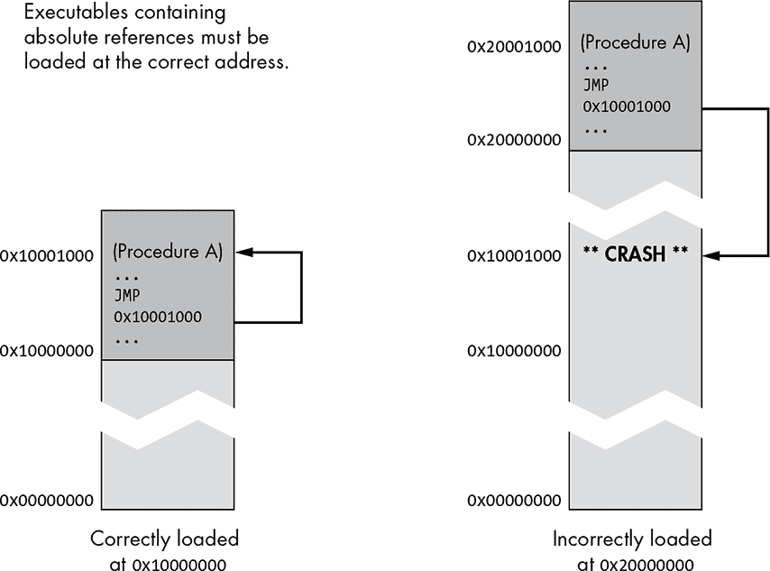
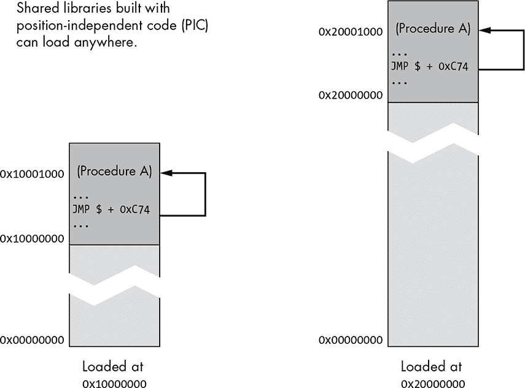

## 第七章：使用 LIBTOOL 构建库

*岁月教会了许多白日无法知道的事。*

——拉尔夫·沃尔多·爱默生，《经验》*


在没有 GNU Libtool 帮助的情况下，经历了太多在多个平台上构建共享库的糟糕经验后，我得出了两个结论。首先，应该给发明共享库概念的人加薪……并且发放奖金。其次，应该对决定将共享库管理接口和命名约定留给实现的人进行鞭打。

Libtool 的存在本身就是这句话真理的见证。Libtool 存在的唯一原因是——为那些希望以可移植方式创建和访问共享库的开发者提供一个标准化、抽象的接口。它抽象了共享库构建过程和在运行时动态加载与访问共享库所用的编程接口。

Libtool 包概念是由 Gordon Matzigkeit 在 1996 年 3 月设计并初步实现的。在此之前，没有标准的跨平台机制用于构建共享库。Autoconf 和 Automake 在构建可移植项目时表现得非常好——只要你不尝试构建共享库。然而，一旦你开始这条路，你的代码和构建系统就会充满用于共享库管理的条件构造。这是一个巨大的工程，因为，正如我们将看到的，构建共享库在某些平台上有显著不同。

Thomas Tanner 从 1998 年 11 月开始贡献了他的跨平台抽象用于共享库动态加载——*ltdl*。自那时以来，其他贡献者包括 Alexandre Oliva、Ossama Othman、Robert Boehne、Scott James Remnant、Peter O’Gorman 和 Ralf Wildenhues。目前，Libtool 包由 Gary V. Vaughn（自 1998 年以来一直在贡献）和 Bob Friesenhahn（自 1998 年以来他的优秀建议被采纳）维护。

在我开始讨论 Libtool 的正确使用之前，我会用几段话介绍共享库所提供的功能和特性，以便你理解我所涉及内容的范围。

### 共享库的好处

共享库提供了一种以方便的方式部署可重用功能块的方式。你可以通过操作系统加载器在程序加载时自动将共享库加载到进程地址空间中，或者通过应用程序本身的代码手动加载。应用程序从共享库绑定功能的时机非常灵活，开发者可以根据程序设计和最终用户需求来确定这一点。

程序可执行文件和定义为共享库的模块之间的接口必须设计得合理，因为共享库接口必须有明确的规范。这种严格的规范促进了良好的设计实践。当你使用共享库时，系统本质上迫使你成为一个更好的程序员。

共享库可能（正如名字所示）在进程之间共享。这种共享非常字面化。共享库的代码段可以一次加载到物理内存页中。这些相同的内存页可以同时映射到多个程序的进程地址空间中。当然，数据页必须对于每个进程是唯一的，但全局数据段通常比共享库的代码段要小得多。这才是真正的高效。

在程序升级过程中，更新共享库非常简单。即使基础程序在软件包的两个版本之间没有变化，只要新版本的接口没有发生变化，你就可以用新的共享库版本替换旧版本。如果接口*发生了*变化，同一个共享库的两个版本可能会共存在同一个目录中，因为共享库使用的版本控制机制（并且被 Libtool 支持）允许在不同平台上，同一库的多个版本可以在文件系统中有不同的命名，但操作系统加载器将其视为同一个库。旧程序将继续使用旧版本的库，而新程序可以自由地使用新版本。

如果一个软件包定义了一个明确的插件接口，那么共享库可以用来实现用户可配置的可加载功能。这意味着，在程序发布后，额外的功能可以变得可用，第三方开发者甚至可以为你的程序添加功能，前提是你发布了描述插件接口规范的文档（或者他们足够聪明，能够自己弄明白）。

有一些广为人知的这类系统示例。例如，Eclipse 几乎是一个纯粹的插件框架。基础可执行文件支持的功能仅仅是一个明确的插件接口。Eclipse 应用程序中的大部分功能来自于库函数。Eclipse 是用 Java 编写的，使用 Java 类库和 *.jar* 文件，但这一原理是相同的，无论语言或平台如何。

### 共享库是如何工作的

POSIX 兼容操作系统实现共享库的具体方式因平台而异，但基本思路是相同的。共享库提供了操作系统可以加载到程序地址空间并执行的可执行代码块。以下讨论适用于链接器在构建程序时解析的共享库引用以及操作系统加载器在加载程序时解析的引用。

虽然编译器生成的目标文件（*.o*）包含可执行代码，但它们不能直接从命令行执行。这是因为它们是不完整的，包含了指向外部实体（函数和全局数据项）的符号引用或*链接*，这些需要修补。这个修补过程是通过使用专门的工具来管理这些链接，以便将包含这些引用的目标文件集合起来。

#### *动态链接时加载*

在构建程序可执行映像时，链接器（正式称为*链接编辑器*）维护一个符号表——函数入口点和全局数据地址。链接器在发现每个符号时，都会将其添加到符号表中。随着符号定义的找到，链接器将符号表中的符号引用解析为代码中的地址。在链接过程结束时，所有包含引用符号定义的目标文件（或简称*目标文件*）会被链接在一起，并成为程序可执行映像的一部分。

在静态库中（也称为档案）找到的、没有引用符号定义的目标文件将被丢弃，但显式链接的目标文件会被添加到二进制映像中，即使它们没有引用符号定义。如果在分析完所有目标文件后，符号表中仍有未解决的引用，链接器将退出并显示错误信息。若成功，最终的可执行映像可以被用户加载并执行。此时，映像已经完全自包含，不再依赖任何外部二进制代码。

假设所有未定义的引用都在链接过程中解决，如果要链接的目标文件列表包含一个或多个共享库，链接器将从命令行上指定的所有*非共享*目标文件中构建可执行映像。这包括所有单独的目标文件（*.o*）和所有包含在静态库档案（*.a*）中的目标文件。然而，链接器将向二进制映像头部添加两个表。第一个是未解决的*外部引用表*——一个在链接过程中只在共享库中找到的符号定义的引用表。第二个是*共享库表*，包含在未解决的未定义引用中找到的共享库名称和版本的列表。

当操作系统加载程序时，加载器必须解析外部引用表中剩余的未解决引用，这些引用指向共享库表中列出的共享库中的符号。如果加载器无法解决所有引用，则会发生加载错误，进程将终止并显示操作系统错误信息。请注意，这些外部符号并不绑定到特定的共享库。只要它们出现在共享库表中搜索到的任何一个库中，就会被接受。

**注意**

*这个过程与 Windows 操作系统加载器解析动态链接库（DLL）中的符号的方式略有不同。在 Windows 中，链接器会在程序构建时将特定符号与特定命名的 DLL 绑定。^(1)*

使用自由浮动的外部引用有其利弊。在某些操作系统中，未绑定的符号可以由用户指定的库来满足。也就是说，用户可以通过简单地预加载一个包含相同符号的库，在运行时完全替换一个库（或库的一部分）。例如，在基于 BSD 和 Linux 的系统中，用户可以使用`LD_PRELOAD`环境变量将一个共享库注入到进程的地址空间中。由于加载器在任何其他库之前加载这些库，因此当加载器尝试解析外部引用时，会首先在预加载的库中查找符号。程序作者预期的库甚至不会被检查，因为这些库提供的符号已经被预加载的库解决。

在下面的示例中，Linux 的`df`工具在包含`LD_PRELOAD`变量的环境中执行。这个变量被设置为指向一个库的路径，这个库假定包含一个与 C 的*malloc*接口兼容的堆管理器。这个技术可以用于调试程序中的内存问题。通过预加载你自己的堆管理器，你可以在日志文件中捕获内存分配——例如调试内存块溢出问题。这种技术被像*Valgrind*工具包等广为人知的调试工具所使用。^(2)

在这里，`LD_PRELOAD`环境变量设置在与执行`df`程序相同的命令行中。此 shell 代码会使只有`df`子进程的环境包含`LD_PRELOAD`变量，并将其设置为指定的值：

```
$ LD_PRELOAD=$HOME/lib/libmymalloc.so /bin/df
--snip--
$
```

不幸的是，自由浮动符号也可能引发问题。例如，两个库可能提供相同的符号名称，而动态加载器可能不小心将可执行文件绑定到错误库中的符号上。最好的情况下，这将导致程序崩溃，当错误的参数被传递给不匹配的函数时。最坏的情况是，它可能带来安全风险，因为不匹配的函数可能会用来捕获未经怀疑的程序传递的密码和安全凭证。

C 语言符号不包含参数信息，因此符号发生冲突的可能性较大。C++符号稍微安全一些，因为整个函数签名（不包括返回类型）会被编码进符号名称中。然而，即便是 C++也不能免疫黑客故意将安全函数替换为他们自己版本的函数（当然，前提是黑客能够访问你的运行时共享库搜索路径）。

##### 运行时自动动态链接

操作系统加载器还可以使用一种非常晚期的绑定形式，通常称为*懒绑定*。在这种情况下，程序头中的外部引用表条目被初始化，使它们引用动态加载器本身中的代码。

当程序首次调用*懒惰入口*时，调用会被路由到加载器，加载器将（可能）加载正确的共享库，确定函数的实际地址，重置跳转表中的入口点，最后将处理器重定向到共享库中的函数（现在可用）。下次发生这种情况时，跳转表条目将已经正确初始化，程序将直接跳转到被调用的函数。这是非常高效的，因为修正后的跳转开销与正常的间接函数调用相当，而且初始加载和链接的成本会在整个进程生命周期中通过多次调用该函数得到摊销。^(3)

这种懒绑定机制使得程序启动非常快，因为共享库的符号直到需要时才会绑定，甚至在应用程序首次引用它们之前，这些库根本不会被加载。但请考虑一下——程序*可能永远*不会引用它们。这意味着这些库可能永远不会被加载，从而节省了时间和空间。一个很好的例子可能是一个带有同义词库功能的文字处理器，它是通过共享库实现的。你有多频繁使用同义词库？如果程序使用的是自动动态链接，通常情况下，包含同义词库代码的共享库在大多数文字处理过程中可能永远不会被加载。

尽管这个系统看起来非常好，但也可能存在一些问题。虽然使用自动运行时动态链接可以提高加载速度、提升性能并更有效地利用空间，但它也可能导致应用程序突然终止且没有任何警告。如果加载器无法找到请求的符号——可能是缺少所需的库——它除了中止进程之外别无他法。

为什么不在程序加载时确保所有符号都存在呢？因为如果加载器在加载时解决了所有符号，它也许还会在那个时候填充跳转表条目。毕竟，它必须加载所有库以确保符号确实存在，因此这将完全违背使用懒绑定的初衷。此外，即使加载器在程序首次启动时检查了所有外部引用，也没有什么能阻止某人在程序使用这些库之前删除一个或多个这些库，而程序仍在运行中。^(4)因此，甚至预检查也被打破了。

这个故事的寓意是：没有免费的午餐。如果你不想为较长的前期加载时间和更多的空间消耗支付保险费（即使你可能永远不需要它），那么你可能不得不承担在运行时缺少符号的风险，导致程序崩溃。

##### 运行时手动动态链接

解决上述问题的一个可能方法是让程序对系统加载器的一部分工作负责。这样，当事情出错时，程序对结果有更多的控制权。在词库模块的例子中，如果无法加载词库或词库没有提供正确的符号，真的有必要终止程序吗？当然没有——但是操作系统加载器无法知道这一点，只有软件程序员能做出这样的判断。

当程序在运行时手动管理动态链接时，链接器完全不参与其中，程序不会直接调用任何导出的共享库函数。相反，共享库函数通过程序在运行时填充的函数指针进行引用。

它的工作原理是这样的：一个程序调用操作系统的函数（`dlopen`）手动将共享库加载到它自己的进程地址空间中。这个函数返回一个*句柄*，即一个表示已加载库的不透明值。程序接着调用另一个加载函数（`dlsym`）从句柄所指向的库中导入一个符号。如果一切顺利，操作系统会返回所请求的函数或数据项的地址。然后，程序可以通过这个指针调用函数或访问全局数据项。

如果这个过程中出了问题——符号在库中找不到或库找不到——那么就由程序来定义结果，可能通过显示错误信息来提示程序配置不正确。在前面的文字处理器例子中，一个简单的对话框提示词库不可用就完全足够了。

这比自动动态运行时链接方式稍好一些；虽然加载器别无选择只能中止，但应用程序有更高层次的视角，可以更优雅地处理问题。当然，缺点是作为程序员的你必须在应用程序代码中管理加载库和导入符号的过程。不过，这个过程并不困难，正如我将在下一章中演示的那样。

### 使用 Libtool

关于共享库及其在各种系统中实现的细节，可以写一本完整的书。你刚刚阅读的简短入门内容已经足够满足我们的眼前需求，现在我将继续讲解如何使用 Libtool 让包维护者的工作变得更轻松。

Libtool 项目的设计初衷是扩展 Automake，但你也可以在手动编写的 Makefile 中独立使用它。截止目前，Libtool 的最新版本是 2.4.6，也是我在此示例中使用的版本。

#### *构建过程抽象*

首先，让我们来看一下 Libtool 如何在构建过程中提供帮助。Libtool 提供了一个脚本（*ltmain.sh*），`config.status` 会在 Libtool 启用项目中使用。`config.status` 脚本将 `configure` 测试结果和 `ltmain.sh` 脚本转化为一个定制版的 `libtool` 脚本，专门为你的项目量身定制。^(5) 然后，你项目的 Makefile 使用这个 `libtool` 脚本来构建任何在 Automake 产品列表变量中列出的共享库，这些变量是通过 Libtool 特定的 `LTLIBRARIES` 主项定义的。`libtool` 脚本实际上只是编译器、链接器和其他工具的一个华丽包装。你应该在发布归档中随项目一起提供 `ltmain.sh` 脚本，作为构建系统的一部分。Automake 生成的规则会确保这一过程正确执行。

`libtool` 脚本将构建系统的作者与在不同平台上构建共享库的细节隔离开来。此脚本接受一组明确定义的选项，将它们转换为目标平台和工具集上特定的、适当的平台和链接器选项。因此，维护者无需担心在每个平台上构建共享库的具体细节——他们只需了解可用的 `libtool` 脚本选项。这些选项在*GNU Libtool Manual*中有详细说明，^(6) 我将在本章和下一章中讲解其中的许多选项。

在不支持共享库的系统上，`libtool` 脚本使用适当的命令和选项来构建和链接仅静态归档库。此外，维护者在使用 Libtool 时，无需担心构建共享库和构建静态库之间的差异。你可以通过在 Libtool 启用项目的 `configure` 命令行上使用 `--disable-shared` 选项来模拟在仅静态系统上构建你的包。此选项会使 Libtool 假定目标系统无法构建共享库。

#### *运行时抽象*

你还可以使用 Libtool 抽象操作系统提供的库加载和符号导入的编程接口。如果你曾在 Linux 系统上动态加载过一个库，那么你就熟悉标准的 POSIX 共享库 API，包括 `dlopen`、`dlsym` 和 `dlclose` 函数。系统级共享库，通常简称为 *dl*，提供了这些函数。这通常会转化为一个名为 *libdl.so* 的二进制镜像文件（在使用不同库命名约定的系统中，名称可能不同）。

不幸的是，并非所有支持共享库的 Unix 系统都提供名为 *libdl.so* 的库或函数。为了解决这些差异，Libtool 提供了一个名为 *ltdl* 的共享库，它导出了一个清晰、可移植的库管理接口，类似于 POSIX *dl* 接口。使用这个库是可选的，但强烈建议使用，因为它不仅在共享库平台之间提供了一个通用的 API，还为共享库与非共享库平台之间的手动动态链接提供了一个抽象层。

*什么？！这怎么可能工作？！* 在不支持共享库的系统上，Libtool 实际上在可执行文件内部创建了符号表，包含所有原本会在共享库中找到的符号（在支持共享库的系统上）。通过在这些平台上使用这些符号表，`lt_dlopen` 和 `lt_dlsym` 函数可以让你的代码看起来像是加载了库并导入了符号，实际上，库加载函数只是返回一个指向相应内部符号表的句柄，而导入函数仅返回已静态链接到程序本身的代码地址。在这些系统上，项目的共享库代码会直接链接到通常在运行时加载它们的程序中。

### 安装 Libtool

如果你想在开发你的软件包时使用 Libtool 的最新版本，你可能会发现你需要手动下载、构建并安装它，或者寻找分发提供商提供的更新版 *libtool* 包。

下载、构建和安装 Libtool 实际上非常简单，正如你在这里看到的那样。然而，在执行这些步骤之前，你应该检查一下 GNU Libtool 网站^(7)，以确保你获得的是最新的软件包。我已经从第一章中复制了基本步骤：

```
$ wget https://ftp.gnu.org/gnu/libtool/libtool-2.4.6.tar.gz
--snip--
$ tar xzf libtool-2.4.6.tar.gz
$ cd libtool-2.4.6
$ ./configure && make
--snip--
$ sudo make install
--snip--
```

请注意，默认的安装位置（与大多数 GNU 包一样）是 */usr/local*。如果你希望将 Libtool 安装到 */usr* 目录下，你需要在 `configure` 命令行中使用 `--prefix=/usr` 选项。推荐的做法是将分发提供的软件包安装到 */usr* 目录下，将用户自行构建的软件包安装到 */usr/local* 目录下，但如果你想让手工构建的 Libtool 版本与分发提供的 Autoconf 和 Automake 版本兼容，你可能需要将 Libtool 安装到 */usr* 目录下。避免软件包相互依赖问题的最简单方法是将所有三个软件包的手工构建版本安装到 */usr/local*，或者更好的是，安装到你家目录下的某个目录，并将该目录添加到你的 `PATH` 中。

### 将共享库添加到 Jupiter

现在我已经介绍了必要的背景信息，接下来我们来看看如何将 Libtool 共享库添加到 Jupiter 项目中。首先，让我们考虑使用共享库可以为 Jupiter 添加哪些功能。也许我们想为用户提供一些库功能，供他们自己的应用程序使用。或者我们可能有一个包含多个应用程序的包，这些应用程序需要共享相同的功能。共享库对于这两种场景都是一个很好的工具，因为它可以让你重用代码并节省内存——共享代码使用的内存成本会在多个应用程序中摊销，这些应用程序可以是项目内部的，也可以是外部的。

让我们为 Jupiter 添加一个提供打印功能的共享库。我们可以通过让新的共享库调用 *libjupcommon.a* 静态库来实现这一点。记住，调用静态库中的例程与将被调用的例程的目标代码直接链接到调用程序中是一样的。被调用的例程最终会成为调用的二进制镜像（程序或共享库）的一个不可分割的部分。^(8)

此外，我们还将提供一个来自 Jupiter 项目的公共头文件，允许外部应用程序调用相同的功能。这样，其他应用程序就可以以与 `jupiter` 程序相同的方式显示内容。（如果我们在 Jupiter 中做一些更有用的事情，这样会显得更酷，但你明白我的意思。）

#### *使用 LTLIBRARIES 主体*

Automake 内置对 Libtool 的支持；提供 `LTLIBRARIES` 主体的是 Automake 包，而不是 Libtool 包。Libtool 并不完全算是一个纯粹的 Automake 扩展，它更像是 Automake 的一个附加包，Automake 为这个特定的附加包提供必要的基础设施。没有 Libtool，你无法访问 Automake 的 `LTLIBRARIES` 主体功能，因为使用这个主体会生成调用 `libtool` 脚本的 `make` 规则。

Libtool 单独发布，而不是作为 Automake 的一部分，因为你可以相当有效地独立使用 Libtool。如果你想单独尝试 Libtool，我会把你引导到*GNU Libtool 手册*；手册的开头几章描述了如何将 `libtool` 脚本作为独立产品使用。只需要修改你的 makefile 命令，使得编译器、链接器和库管理器通过 `libtool` 脚本调用，然后根据 Libtool 的要求修改一些命令行参数，就能实现这一点。

#### *公共包含目录*

名为 *include* 的项目子目录应只包含公共头文件——那些在你的项目中暴露公共接口的文件。我们现在将向 Jupiter 项目中添加这样一个头文件，所以我们将在项目根目录下创建一个名为 *include* 的目录。

如果我们有多个共享库，我们需要做出选择：是为每个库的源目录创建单独的 *include* 目录，还是添加一个单一的顶层 *include* 目录？我通常使用以下经验法则来做决定：如果这些库是作为一个组一起工作的，并且如果使用这些库的应用程序通常会一起使用它们，那么我会使用一个单一的顶层 *include* 目录。另一方面，如果这些库可以独立使用，并且它们提供的功能集相对独立，那么我会在各自的库目录中提供单独的 *include* 目录。

最终，这其实并不重要，因为这些库的头文件将安装在与你项目中存在的目录结构完全不同的目录中。事实上，你应该确保不会在项目中的两个不同库中不小心使用相同的公共头文件名——如果这样做，你将遇到安装这些文件的问题。它们通常会全部放在 `$(prefix)`*/include* 目录中，尽管你可以通过在 *Makefile.am* 文件中使用 `includedir` 变量或 `pkginclude` 前缀来覆盖这个默认设置。

`includedir` 变量允许你通过定义 Automake 的 `$(includedir)` 变量的确切值来指定你希望将头文件安装到哪里，通常该值是 `$(prefix)`*/include*。使用 `pkginclude` 前缀表示你希望将头文件放在 `$(includedir)` 目录下的一个私有的、特定于包的子目录中，目录名称为 `$(includedir)`*/*`$(PACKAGE)`。

我们还将为 Jupiter 的新共享库 *libjupiter* 添加另一个根目录（*libjup*）。这些更改要求你将新目录的引用添加到顶层 *Makefile.am* 文件的 `SUBDIRS` 变量中，然后在 *configure.ac* 文件中的 `AC_CONFIG_FILES` 宏中添加相应的 *Makefile* 引用。由于我们将对项目进行重大更改，最好在开始之前清理一下工作区。然后我们将创建目录并将新的 *Makefile.am* 文件添加到新的 *include* 目录中：

Git 标签 7.0

```
   $ make maintainer-clean
   --snip--
   $ mkdir libjup include
➊ $ echo "include_HEADERS = libjupiter.h" > include/Makefile.am
   $
```

*include* 目录下的 *Makefile.am* 文件非常简单—它仅包含一行，其中一个 Automake 的 `HEADERS` 主体引用了公共头文件 *libjupiter.h*。注意在 ➊ 处我们在这个主体前使用了 `include` 前缀。你会记得，这个前缀表示在这个主体中指定的文件将被安装到 `$(includedir)` 目录中（例如，*/usr/(local/)include*）。`HEADERS` 主体类似于 `DATA` 主体，因为它指定了一组文件，这些文件将被当作数据安装，而无需修改或预处理。唯一真正的区别在于，`HEADERS` 主体将安装位置限制在那些适合头文件的位置。

*libjup/Makefile.am* 文件比简单的单行文件更复杂，包含了四行内容。该文件显示在清单 7-1 中。

```
➊ lib_LTLIBRARIES = libjupiter.la
➋ libjupiter_la_SOURCES = jup_print.c
➌ libjupiter_la_CPPFLAGS = -I$(top_srcdir)/include -I$(top_srcdir)/common
➍ libjupiter_la_LIBADD = ../common/libjupcommon.a
```

*清单 7-1:* libjup/Makefile.am: *该文件的初始版本*

让我们逐行分析这个文件。➊行是主规格，它包含了库文件的常见前缀：`lib`。这个前缀所引用的产品将被安装到 `$(libdir)` 目录中。（我们也可以使用 `pkglib` 前缀，表示我们希望将库文件安装到 `$(libdir)`*/jupiter*。）这里，我们使用了 `LTLIBRARIES` 主体，而不是原始的 `LIBRARIES` 主体。使用 `LTLIBRARIES` 告诉 Automake 生成使用 `libtool` 脚本的规则，而不是直接调用编译器（以及可能的图书馆管理员）来生成产品。

➋行列出了用于第一个（也是唯一）产品的源文件。

➌行表示一组 C 预处理器标志，这些标志将在编译器命令行上使用，用于查找相关的共享库头文件。这些选项指示预处理器应在顶层的 *include* 和 *common* 目录中搜索源代码中引用的头文件。

最后一行（在 ➍ 处）表示此产品的链接器选项。在这种情况下，我们指定应该将 *libjupcommon.a* 静态库链接到（即，成为）*libjupiter.so* 共享库的一部分。

**注意**

*更有经验的 Autotools 库开发人员会注意到这个* Makefile.am *文件中的一个微妙缺陷。这里有个提示：它与将 Libtool 库链接到非 Libtool 库有关。这个概念对于许多新人来说是一个主要的绊脚石，所以我在编写这个文件的初始版本时有意展示了这个错误。不过不用担心—我们将在本章稍后通过合乎逻辑的方式解决这个问题时修正这个缺陷。*

有一个关于 `*_LIBADD` 变量的重要概念，你应该努力完全理解：在同一项目中作为一部分构建并被使用的库，应通过相对路径在 *build* 目录层次结构中内部引用，使用父目录引用或 `$(``top_builddir``)` 变量。外部项目的库通常不需要显式引用，因为项目的 `configure` 脚本在处理由 `AC_CHECK_LIB` 或 `AC_SEARCH_LIBS` 宏生成的代码时，应该已经将适当的 `-L` 和 `-l` 选项添加到 `$(LIBS)` 环境变量中。

接下来，我们将把这些新目录接入项目的构建系统。为此，我们需要修改顶层的 *Makefile.am* 和 *configure.ac* 文件。这些更改分别显示在清单 7-2 和 7-3 中。

```
SUBDIRS = common include libjup src
```

*清单 7-2:* Makefile.am: *将* include *和* libjup *添加到 `SUBDIRS` 变量中*

```
   #                                               -*- Autoconf -*-
   # Process this file with autoconf to produce a configure script.

   AC_PREREQ([2.69])
   AC_INIT([Jupiter],[1.0],[jupiter-bugs@example.org])
   AM_INIT_AUTOMAKE
➊ LT_PREREQ([2.4.6])
   LT_INIT([dlopen])
   AC_CONFIG_SRCDIR([src/main.c])
   AC_CONFIG_HEADERS([config.h])

   # Checks for programs.
   AC_PROG_CC
➋ AC_PROG_INSTALL

   # Checks for header files.
   AC_CHECK_HEADERS([stdlib.h])
   --snip--
   AC_CONFIG_FILES([Makefile
                    common/Makefile
                 ➌ include/Makefile
                    libjup/Makefile
                    src/Makefile])
   AC_OUTPUT
   --snip--
```

*清单 7-3:* configure.ac: *添加* include *和* libjup *目录的 makefile*

在 *configure.ac* 中做了三个不相关的更改。第一个是在 ➊ 位置添加了 Libtool 设置宏 `LT_PREREQ` 和 `LT_INIT`。`LT_PREREQ` 宏的作用类似于 Autoconf 的 `AC_PREREQ` 宏（用于前几行）。它指示能够正确处理此项目的 Libtool 最早版本。你应选择这些宏参数中的最低合理值，因为较高的值会不必要地限制你和你的共同维护者使用更新版本的 Autotools。^(9) `LT_INIT` 宏用于为该项目初始化 Libtool 系统。

第二个更改同样很有趣。我在 ➋ 位置的行之后移除了 `AC_PROG_RANLIB` 宏的调用。（而且这还是我们最初为了将它放进去而做的所有努力！）因为 Libtool 现在正在构建项目中的所有库，并且它理解库构建过程的各个方面，所以我们不再需要指示 Autoconf 确保 `ranlib` 可用。事实上，如果你保留这个宏，当你执行 `autoreconf -i` 时会收到一个警告。

最后的更改出现在 ➌ 位置的 `AC_CONFIG_FILES` 参数中，在那里我们已添加对我们在 *include* 和 *libjup* 目录中添加的两个新 *Makefile.am* 文件的引用。

#### *使用 LT_INIT 选项定制 Libtool*

你可以在传递给 `LT_INIT` 的参数列表中指定启用或禁用静态库和共享库的默认值。`LT_INIT` 宏接受一个单一的可选参数：一个由空格分隔的关键字列表。以下是此列表中允许的最重要的关键字，并附有它们正确使用的说明。

dlopen

此选项启用对`dlopen`支持的检查。《*GNU Libtool Manual*》指出，如果软件包使用了`libtool`中的`-dlopen`和`-dlpreopen`标志，则应使用此选项；否则，`libtool`将假定系统不支持*dl-opening*。使用`-dlopen`或`-dlpreopen`标志的唯一原因是：你打算在项目的源代码中动态加载和导入共享库的功能。此外，除非你打算使用*ltdl*库（而不是直接使用*dl*库）来管理运行时的动态链接，否则这两个选项几乎没有作用。因此，只有在你打算使用*ltdl*库时，才应使用此选项。

win32-dll

如果你的库已经正确移植到 Windows DLL，使用了`__declspec(dllimport)`和`__declspec(dllexport)`，则使用此选项。如果你的库正确地使用这些关键字来导入和导出 Windows DLL 的符号，而你没有使用此选项，那么 Libtool 只会在 Windows 上构建静态库。我们将在第十七章中更详细地讨论这个主题。

aix-soname=aix|svr4|both

向`configure`的命令行添加`--with-aix-soname`标志。在版本 2.4.4 之前，Libtool 总是表现得像是将`aix-soname`设置为`aix`。如果你经常在 AIX 上构建共享库，你会理解这个选项的含义。如果你想了解更多内容，请阅读《*GNU Libtool Manual*》的第 5.4.1 节。

disable-fast-install

此选项会改变`LT_INIT`的默认行为，以禁用针对需要时的快速安装优化。快速安装的概念存在是因为未安装的程序和库可能需要在构建树内执行（例如在`make check`期间）。在某些系统中，安装位置会影响最终链接的二进制文件，因此当执行`make install`时，Libtool 必须重新链接这些系统上的程序和库，或者在`make check`时重新链接程序和库。默认情况下，Libtool 选择在`make check`时重新链接，允许原始二进制文件快速安装，而无需在`make install`期间重新链接。用户可以根据平台支持通过在`configure`中指定`--enable-fast-install`来覆盖此默认行为。

shared 和 disable-shared

这两个选项会改变创建共享库的默认行为。`shared`选项的效果是在所有 Libtool 知道如何创建共享库的系统中都是默认行为。用户可以通过在`configure`命令行中指定`--disable-shared`或`--enable-shared`来覆盖默认的共享库生成行为。

static 和 disable-static

这两个选项会改变创建静态库的默认行为。`static` 选项的效果是，在禁用共享库的所有系统以及大多数启用了共享库的系统上，都是默认行为。如果启用了共享库，用户可以通过在 `configure` 命令行中指定 `--disable-static` 来覆盖此默认设置。对于没有共享库的系统，Libtool 会始终生成静态库。因此，你不能同时使用 `LT_INIT` 的 `disable-shared` 和 `disable-static` 参数，或者 `configure` 的 `--disable-shared` 和 `--disable-static` 命令行选项。（但是，请注意，你可以同时使用 `shared` 和 `static` 的 `LT_INIT` 选项，或者 `--enable-shared` 和 `--enable-static` 的命令行选项。）

pic-only 和 no-pic

这两个选项会改变创建和使用 PIC 对象代码的默认行为。用户可以通过在 `configure` 命令行中指定 `--without-pic` 或 `--with-pic` 来覆盖这些选项设置的默认值。我将在《那么，究竟什么是 PIC？》一节中讨论 PIC 对象代码的含义，参见第 200 页。

现在我们已经完成了新库的构建系统设置，可以开始讨论源代码。清单 7-4 显示了在 *libjup/Makefile.am* 第二行中引用的新的 *jup_print.c* 源文件的内容。清单 7-5 显示了新的 *include/libjupiter.h* 库头文件的内容。

```
#include "config.h"

#include "libjupiter.h"
#include "jupcommon.h"

int jupiter_print(const char * name)
{
     return print_routine(name);
}
```

*清单 7-4:* libjup/jup_print.c：*共享库源文件的初始内容*

```
#ifndef LIBJUPITER_H_INCLUDED
#define LIBJUPITER_H_INCLUDED

int jupiter_print(const char * name);

#endif /* LIBJUPITER_H_INCLUDED */
```

*清单 7-5:* include/libjupiter.h：*共享库公共头文件的初始内容*

这引出了另一个软件工程的通用原则。我听到过许多不同的说法，但我通常使用的一个是*DRY 原则*——这个缩写代表*不要重复自己*。C 函数原型非常有用，因为当正确使用时，它们能够确保公众对函数的理解与包维护者的理解一致。我常常看到一些源文件没有包含相应的头文件。很容易在函数或原型中做出小改动，而忘记在另一个位置也进行相同的修改——除非你在源文件中包含了公共头文件。只要你始终这样做，编译器就会帮你捕捉到任何不一致之处。

我们还需要包含静态库头文件（*jupcommon.h*），因为我们在公共库函数中调用了它的函数（*print_routine*）。你可能也注意到，我将*config.h*放在最前面，紧接着是公共头文件——这么做是有原因的。我在第六章中已经提到过，*config.h*应该始终排在每个源文件的最前面。通常情况下，我会说公共头文件应该排在最前面，但公共头文件应该写成这样，它们的功能不应被*config.h*修改。因此，从技术上讲，公共头文件在*config.h*之前或之后包含并不重要。例如，在公共头文件中使用像`off_t`这样的编译器模式相关类型，会导致应用程序二进制接口（ABI）不仅在不同平台之间发生变化（这不一定是坏事），还会在同一平台上根据消费代码设置的编译环境而发生变化（这就不好了）。事实上，你应该以一种方式编写公共头文件，使得无论是在*config.h*之前还是之后包含它们，都不重要；它们应该被特别设计成不依赖于*config.h*可以配置的任何内容。关于这一主题的更详细讨论，请参见第十八章，第 1 项：将私有细节从公共接口中剔除。

通过将公共头文件放在源文件的最前面（在*config.h*之后），我们可以确保该公共头文件的使用不依赖于项目中任何内部头文件中的定义。例如，假设公共头文件隐含依赖于某些在内部头文件（如*jupcommon.h*）中定义的构造（如类型定义、结构体或预处理器定义）。如果我们在包含*jupcommon.h*之后再包含公共头文件，那么当编译器开始处理公共头文件时，这个依赖就会被隐藏，因为所需的构造已经在*翻译单元*（源文件与所有已包含的头文件组合）中可用。

我想最后再谈谈清单 7-5 中的内容。预处理器条件构造通常被称为*包含保护*。它是一种机制，用于防止你的头文件在同一个翻译单元中被意外地多次包含。我在所有的头文件中都常规使用包含保护，养成这样的习惯是很好的做法。一个优秀的优化编译器（例如`gcc`，特别是它的预处理器）会识别头文件中的包含保护，并在后续的包含中完全跳过该文件，在同一个翻译单元中避免重复包含。10

由于公共头文件将被外部源代码使用，因此在这些头文件中严格使用包含保护是至关重要的。虽然你可以控制自己的代码库，但你无法控制你的库消费者编写的代码。我在这里提倡的是，你应该假设自己是最好的程序员，其他人稍微低于你的技术水平。你可以通过不向任何人提及这一点来巧妙地做到这一点，但在编写公共头文件时，你应该*表现得*像这是一条事实。

接下来，我们将修改 Jupiter 应用程序的 `main` 函数，使其调用共享库中的函数，而不是调用常见的静态库。这些更改显示在列表 7-6 中。

```
#include "config.h"

#include "libjupiter.h"

int main(int argc, char * argv[])
{
    return jupiter_print(argv[0]);
}
```

*列表 7-6:* src/main.c: *将 `main` 改为调用共享库函数*

在这里，我们将打印函数从静态库中的 `print_routine` 改为新共享库提供的 `jupiter_print`。我们还将顶部包含的头文件从 *libjupcommon.h* 改为 *libjupiter.h*。

我对公共函数和头文件的命名选择是随意的，但基于提供一个干净、合理和信息丰富的公共接口的考虑。名称 *libjupiter.h* 很清楚地表明该头文件指定了 *libjupiter.so* 的公共接口。我尽量将库接口函数命名为清晰地表明它们是接口的一部分。如何选择公共接口成员的名称——文件、函数、结构、类型定义、预处理器定义、全局数据等等——取决于你，但你应该考虑使用类似的理念。记住，目标是提供一个良好的终端用户体验。直观的命名应该是你策略的一个重要部分。例如，选择一个通用的前缀来命名程序和库符号是一种良好的通用实践。^(11)

最后，我们还必须修改 *src/Makefile.am* 文件，以便使用新的共享库，而不是 *libjupcommon.a* 静态库。这些更改显示在列表 7-7 中。

```
   bin_PROGRAMS = jupiter
   jupiter_SOURCES = main.c
➊ jupiter_CPPFLAGS = -I$(top_srcdir)/include
➋ jupiter_LDADD = ../libjup/libjupiter.la
   --snip--
```

*列表 7-7:* src/Makefile.am: *向 src 目录的 Makefile 添加共享库引用*

在这里，我们已经在 ➊ 修改了 `jupiter_CPPFLAGS` 语句，使其引用新的顶级*include*目录，而不是*common*目录。我们还在 ➋ 修改了 `jupiter_LDADD` 语句，使其引用新的 Libtool 共享库对象，而不是*libjupcommon.a*静态库。其余部分保持不变。引用 Libtool 库的语法与引用较旧的静态库的语法相同——只是库扩展名不同。Libtool 库扩展名 *.la* 代表 *libtool 存档*。

让我们退后一步，想一想。我们真的需要做这个改动吗？不，当然不需要。`jupiter`应用程序将继续像最初编写时一样正常工作。直接将静态库中的`print_routine`代码链接到应用程序中，与调用新的共享库例程（最终包含相同的代码）一样有效。事实上，调用共享库例程的开销稍微大一些，因为调用共享库跳转表时会增加一个额外的间接层。

在一个真实的项目中，你可能会选择保持原样。因为两个公共入口点，`main`和`jupiter_print`，调用的是完全相同的函数（`print_routine`），该函数位于*libjupcommon.a*中，它们的功能是相同的。为什么还要通过公共接口调用，即使有一点点额外的开销呢？其中一个原因是你可以利用共享代码。通过使用共享库函数，你不会重复代码——无论是在磁盘上还是在内存中。这正是 DRY 原则的体现。

另一个原因是锻炼你为共享库用户提供的接口。如果你的项目代码以你期望的方式使用共享库，你会更快地发现公共接口中的错误。

在这种情况下，你可能现在会考虑直接将静态库中的代码移动到共享库中，从而完全去除静态库的需求。然而，我请求你宽容地看待我的这一人为示例。在一个更复杂的项目中，我很可能需要这种配置。常见代码通常会被集中到静态便利库中，而且更多时候，这些公共代码只有一部分会在共享库中重复使用。为了教学目的，我将保持原样。

#### *重新配置并构建*

由于我们向项目构建系统中添加了 Libtool 这一重要新组件，我们将向`autoreconf`命令行添加`-i`选项，以确保所有必要的辅助文件都安装到项目根目录中：

```
   $ autoreconf -i
➊ libtoolize: putting auxiliary files in '.'.
   libtoolize: copying file './ltmain.sh'
   libtoolize: Consider adding 'AC_CONFIG_MACRO_DIRS([m4])' to configure.ac,
   libtoolize: and rerunning libtoolize and aclocal.
   libtoolize: Consider adding '-I m4' to ACLOCAL_AMFLAGS in Makefile.am.
   configure.ac:8: installing './compile'
➋ configure.ac:8: installing './config.guess'
   configure.ac:8: installing './config.sub'
   configure.ac:6: installing './install-sh'
   configure.ac:6: installing './missing'
   Makefile.am: installing './INSTALL'
   Makefile.am: installing './COPYING' using GNU General Public License v3 file
   Makefile.am:     Consider adding the COPYING file to the version control system
   Makefile.am:     for your code, to avoid questions about which license your
   project uses
   common/Makefile.am: installing './depcomp'
   parallel-tests: installing './test-driver'
   $
```

因为我们已完全移除了项目目录中的所有生成和复制的文件，所以这些通知大多数与替换我们之前讨论过的文件有关。然而，也有一些值得注意的例外。

首先，注意到来自`libtoolize`的评论，见➊。它们大多数只是建议我们转向新的 Autotools 约定，将 M4 宏文件添加到项目根目录中的*m4*目录中。我们暂时忽略这些评论，但在第十四章和第十五章中，我们将实际为一个真实项目做这件事。

如你在 ➋ 处所见，Libtool 的添加似乎导致了几个新文件被添加到我们的项目中——即*config.guess* 和 *config.sub* 文件。在 ➊ 处的部分又添加了一个新文件，名为*ltmain.sh*。`configure`脚本使用*ltmain.sh*为 Jupiter 项目构建一个项目特定的`libtool`版本。稍后我会介绍`config.guess`和`config.sub`脚本。

让我们继续执行`configure`，看看会发生什么：

```
$ ./configure
--snip--
checking for ld used by gcc... /usr/bin/ld
checking if the linker (/usr/bin/ld) is GNU ld... yes
checking for BSD- or MS-compatible name lister (nm)... /usr/bin/nm -B
checking the name lister (/usr/bin/nm -B) interface... BSD nm
checking whether ln -s works... yes
checking the maximum length of command line arguments... 1572864
--snip--
checking for shl_load... no
checking for shl_load in -ldld... no
checking for dlopen... no
checking for dlopen in -ldl... yes
checking whether a program can dlopen itself... yes
checking whether a statically linked program can dlopen itself... no
checking whether stripping libraries is possible... yes
checking if libtool supports shared libraries... yes
checking whether to build shared libraries... yes
checking whether to build static libraries... yes
--snip--
configure: creating ./config.status
--snip--
$
```

首先需要注意的是，Libtool 为配置过程添加了*显著的*开销。我这里只展示了自从添加了 Libtool 之后新增的几行输出。我们在*configure.ac*文件中所做的唯一修改是添加了对`LT_INIT`宏的引用，但我们几乎将`configure`的输出量翻了一倍。这应该能让你对创建可移植共享库所需检查的系统特性数量有一些了解。幸运的是，Libtool 为你做了大量工作。

现在，让我们运行`make`命令，看看我们会得到什么样的输出：

```
   $ make
   --snip--
   Making all in libjup
   make[2]: Entering directory '/.../jupiter/libjup'
➊ /bin/bash ../libtool    --tag=CC     --mode=compile gcc -DHAVE_CONFIG_H -I. -I..
   -I../include -I../common     -g -O2 -MT libjupiter_la-jup_print.lo -MD -MP -MF
   .deps/libjupiter_la-jup_print.Tpo -c -o libjupiter_la-jup_print.lo `test -f
   'jup_print.c' || echo './'`jup_print.c
➋ libtool: compile:    gcc -DHAVE_CONFIG_H -I. -I.. -I../include -I../common -g
   -O2 -MT libjupiter_la-jup_print.lo -MD -MP -MF .deps/libjupiter_la-jup_print.Tpo -c jup_print.c    -fPIC -DPIC -o .libs/libjupiter_la-jup_print.o
➌ libtool: compile:    gcc -DHAVE_CONFIG_H -I. -I.. -I../include -I../common -g
   -O2 -MT libjupiter_la-jup_print.lo -MD -MP -MF .deps/libjupiter_la-jup_print.
   Tpo -c jup_print.c -o libjupiter_la-jup_print.o >/dev/null 2>&1
➍ mv -f .deps/libjupiter_la-jup_print.Tpo .deps/libjupiter_la-jup_print.Plo
➎ /bin/bash ../libtool    --tag=CC     --mode=link gcc    -g -O2     -o libjupiter.la
   -rpath /usr/local/lib libjupiter_la-jup_print.lo ../common/libjupcommon.a
   -lpthread
➏ *** Warning: Linking the shared library libjupiter.la against the
   *** static library ../common/libjupcommon.a is not portable!
   libtool: link: gcc -shared    -fPIC -DPIC    .libs/libjupiter_la-jup_print.o     ../
   common/libjupcommon.a -lpthread    -g -O2     -Wl,-soname -Wl,libjupiter.so.0 -o
   .libs/libjupiter.so.0.0.0
➐ /usr/bin/ld: ../common/libjupcommon.a(print.o): relocation R_X86_64_32 against
   `.rodata.str1.1' can not be used when making a shared object; recompile with
   -fPIC
   ../common/libjupcommon.a: error adding symbols: Bad value
   collect2: error: ld returned 1 exit status
   Makefile:389: recipe for target 'libjupiter.la' failed
   make[2]: *** [libjupiter.la] Error 1
   make[2]: Leaving directory '/.../jupiter/libjup'
   Makefile:391: recipe for target 'all-recursive' failed
   make[1]: *** [all-recursive] Error 1
   make[1]: Leaving directory '/.../jupiter'
   Makefile:323: recipe for target 'all' failed
   make: *** [all] Error 2
   --snip--
   $
```

我们似乎有一些错误需要修复。第一个值得注意的问题是，在 ➊ 处执行了`libtool`，并使用了`--mode=compile`选项，这使得`libtool`充当了一个包装脚本，围绕标准`gcc`命令行的某个修改版进行操作。你可以在接下来的两行编译命令中看到这一点，分别在 ➋ 和 ➌ 处。*两个编译命令？* 没错。看起来 Libtool 正在针对我们的源文件执行两次编译。

这两行命令的仔细对比表明，第一条命令使用了两个额外的标志，`-fPIC` 和 `-DPIC`。第一行似乎还将输出文件定向到一个*.libs*子目录，而第二行则将其保存在当前目录中。最后，第二行将`stdout`和`stderr`输出流重定向到*/dev/null*。

**注意**

*有时，你可能会遇到一种情况，某个源文件在第一次编译时能够正常编译，但由于与 PIC 相关的源代码错误，在第二次编译时失败。这类问题虽然很少见，但一旦发生会让人头疼，因为*`make`* 会因错误而停止构建，却没有给出任何错误信息来解释问题！遇到这种情况时，只需在*`make`*命令行的*`CFLAGS`*变量中传递*`-no-suppress`*标志，告诉 Libtool 不要将第二次编译的输出重定向到*/dev/null*。

这个双重编译特性多年来在 Libtool 邮件列表上引起了不少焦虑。大多数原因是人们对 Libtool 尝试做的事情以及为什么它是必要的缺乏理解。通过使用 Libtool 的各种`configure`脚本命令行选项，你可以强制执行单次编译，但这样做会带来一定的功能丧失，我将在稍后解释这一点。

➍ 行将依赖文件从**.Tpo*重命名为**.Plo*。你可能还记得第三章和第六章，依赖文件包含`make`规则，这些规则声明了源文件和引用的头文件之间的依赖关系。当你使用`-MT`编译器选项时，C 预处理器会生成这些规则。但是，这里要理解的首要概念是，一个 Libtool 命令可能（并且经常）执行一组 shell 命令。

➎ 行是另一个对`libtool`脚本的调用，这次使用`--mode=link`选项。此选项生成一个调用，以在*链接模式*下执行编译器，并传递在*Makefile.am*文件中指定的所有库和链接器选项。

在 ➏，我们遇到了第一个问题——关于将共享库与静态库链接的可移植性警告。具体来说，此警告是关于将 Libtool 共享库与非 Libtool 静态库链接。请注意，这不是错误。如果不是因为我们稍后会遇到的其他错误，那么尽管有此警告，仍会构建该库。

在可移植性警告之后，`libtool`尝试将请求的对象链接到名为*libjupiter.so.0.0.0*的共享库中。但是在这里，脚本遇到了真正的问题：在 ➐，链接器错误表明从*libjupcommon.a*内部的某个地方——更具体地说，在*print.o*内部——无法执行`x86_64`对象重定位，因为原始源文件 (*print.c*) 显然没有正确编译。链接器非常友好地告诉我们解决问题需要做什么（在示例中突出显示）：我们需要使用`-fPIC`编译器选项编译源代码。

如果你现在遇到了这个错误，并且对`-fPIC`选项一无所知，明智的做法是打开`gcc`的手册页，并在随意插入编译器和链接器选项直到警告或错误消失之前仔细研究它（不幸的是，这是缺乏经验的程序员的常见做法）。软件工程师应该理解他们的构建系统中使用的工具的每个命令行选项的含义和细微差别。否则，他们并不真正知道他们的构建完成时得到了什么。它可能会按预期工作，但如果是这样，那也是靠运气而不是靠设计。优秀的工程师了解他们的工具，最好的学习方法是在继续前进之前，研究错误消息及其修复方法，直到完全理解问题为止。

#### *那么，PIC 到底是什么？*

当操作系统创建新的进程地址空间时，它们通常会将程序的可执行镜像加载到相同的内存地址。这个神奇的地址是系统特定的。编译器和链接器理解这一点，并且知道在任何给定的系统中，神奇的地址是什么。因此，当它们生成对函数调用或全局数据的内部引用时，它们可以将这些引用生成*绝对*地址。如果你以某种方式将可执行文件加载到进程虚拟地址空间的不同位置，它将无法正常工作，因为代码中的绝对地址将不正确。至少，当处理器在函数调用时跳转到错误的位置时，程序将崩溃。

请考虑一下图 7-1。假设我们有一个系统，其神奇的可执行加载地址是`0x10000000`；该图描绘了系统中的两个进程地址空间。在左边的进程中，可执行镜像正确加载到地址`0x10000000`。在代码的某个点，`jmp`指令告诉处理器将控制转移到绝对地址`0x10001000`，并在程序的另一区域继续执行指令。



*图 7-1：可执行镜像中的绝对寻址*

在右边的进程中，程序被错误地加载到地址`0x20000000`。当遇到相同的分支指令时，处理器会跳转到地址`0x10001000`，因为该地址是硬编码在程序镜像中的。当然，这会失败——通常是通过崩溃的方式，或者有时会带来更微妙且狡猾的后果。

这就是程序镜像的工作方式。然而，当为某些类型的硬件（包括 AMD64）构建*共享库*时，编译器和链接器都无法事先知道库将被加载到哪里。这是因为许多库可能会被加载到一个进程中，而它们的加载顺序取决于*可执行文件*的构建方式，而不是库本身。此外，谁能说清楚哪个库拥有位置 A，哪个库拥有位置 B 呢？事实上，库可能会被加载到进程地址空间中的*任何地方*，只要在它被加载时有足够的空间。只有操作系统加载器知道它最终会驻留在哪里——即使如此，它也只会在库被实际加载之前才知道这个位置。^(12)

因此，共享库只能由一种特殊类型的目标文件——称为 PIC 对象——构建。*PIC*是*位置无关代码*（position-independent code）的缩写，这意味着对象代码中的引用不是绝对的，而是*相对的*。当你在编译器命令行中使用`-fPIC`选项时，编译器会在分支指令中使用效率较低的相对寻址。这种位置无关的代码可以加载到任何地方。

图 7-2 展示了生成 PIC 对象时使用的相对寻址概念。使用相对寻址时，地址无论图像加载到哪里都能正确工作，因为它们始终是相对于当前指令指针进行编码的。在 图 7-2 中，图示表示共享库与 图 7-1 中的地址相同加载（即，`0x10000000` 和 `0x20000000`）。在这两种情况下，`jmp` 指令中使用的美元符号代表当前的指令指针（`IP`），因此 `$ + 0xC74` 告诉处理器，它应该跳转到当前指令指针位置前进 `0xC74` 字节处的指令。



*图 7-2：共享库图像中的相对寻址*

生成和使用位置无关代码有各种细节，你应该在使用之前熟悉它们，以便能够选择最适合你情况的选项。例如，GNU C 编译器也支持 `-fpic` 选项（小写），它使用稍微更快但功能更有限的机制生成可重定位目标代码。^(13)

#### *修复 Jupiter PIC 问题*

根据我们现在的理解，修复链接器错误的一种方法是将 `-fPIC` 选项添加到编译器命令行中，针对构成 *libjupcommon.a* 静态库的源文件。清单 7-8 展示了对 *common/Makefile.am* 文件所需的更改。

```
noinst_LIBRARIES = libjupcommon.a
libjupcommon_a_SOURCES = jupcommon.h print.c
libjupcommon_a_CFLAGS = -fPIC
```

*清单 7-8：* common/Makefile.am：*生成静态库中 PIC 对象所需的更改*

现在，让我们重新尝试构建：

```
   $ autoreconf
   $ ./configure
   --snip--
   $ make
   make    all-recursive
   make[1]: Entering directory '/.../jupiter'
   Making all in common
   make[2]: Entering directory '/.../jupiter/common'
   gcc -DHAVE_CONFIG_H -I. -I..        -fPIC -g -O2 -MT libjupcommon_a-print.o -MD
   -MP -MF .deps/libjupcommon_a-print.Tpo -c -o libjupcommon_a-print.o `test -f
   'print.c' || echo './'`print.c
   --snip--
   Making all in libjup
   make[2]: Entering directory '/.../jupiter/libjup'
   /bin/bash ../libtool    --tag=CC     --mode=link gcc    -g -O2     -o libjupiter.
   la -rpath /usr/local/lib libjupiter_la-jup_print.lo ../common/libjupcommon.a
   -lpthread

➊ *** Warning: Linking the shared library libjupiter.la against the
   *** static library ../common/libjupcommon.a is not portable!
   libtool: link: gcc -shared    -fPIC -DPIC    .libs/libjupiter_la-jup_print.o
   ../common/libjupcommon.a -lpthread    -g -O2     -Wl,-soname -Wl,libjupiter.so.0
   -o .libs/libjupiter.so.0.0.0
   libtool: link: (cd ".libs" && rm -f "libjupiter.so.0" && ln -s "libjupiter
   .so.0.0.0" "libjupiter.so.0")
   libtool: link: (cd ".libs" && rm -f "libjupiter.so" && ln -s "libjupiter
   .so.0.0.0" "libjupiter.so")
   libtool: link: ar cru .libs/libjupiter.a ../common/libjupcommon.a    libjupiter
   _la-jup_print.o
   ar: `u' modifier ignored since `D' is the default (see `U')
   libtool: link: ranlib .libs/libjupiter.a
   libtool: link: ( cd ".libs" && rm -f "libjupiter.la" && ln -s "../libjupiter
   .la" "libjupiter.la" )
   make[2]: Leaving directory
   --snip--
   $
```

现在我们已经根据系统要求，成功构建了一个正确的共享库，并且它包含了位置无关代码。然而，我们仍然在 ➊ 处看到那个关于将 Libtool 库与静态库链接的移植性问题的奇怪警告。这里的问题不在于我们做了什么，而是我们是如何做的。你看，PIC 的概念并不适用于所有硬件架构。一些 CPU 的指令集不支持任何形式的绝对寻址。因此，这些平台的本地编译器不支持 `-fPIC` 选项——对它们来说没有意义。未知选项可能会被悄悄忽略，但在大多数情况下，编译器会因为未知选项而停止，并给出错误信息。

如果我们尝试在 IBM RS/6000 系统上使用原生 IBM 编译器编译这段代码，遇到链接器命令行中的 `-fPIC` 选项时，它会出现问题。因为在一个所有代码都是生成位置无关代码的系统上，支持这种选项是没有意义的。

我们可以通过使 `-fPIC` 选项在 *Makefile.am* 中根据目标系统和所使用的工具而变化来解决这个问题。但这正是 Libtool 设计的目的！我们需要考虑所有不同的 Libtool 目标系统类型和工具集，以便处理 Libtool 已经处理的所有条件。此外，一些系统和编译器可能需要不同的命令行选项来实现相同的目标。

要解决这个可移植性问题，方法是让 Libtool 也生成静态库。Libtool 区分了作为开发者包一部分安装的静态库和仅在项目内部使用的静态库。它将这些内部静态库称为*便利*库，是否生成便利库取决于与 `LTLIBRARIES` 主命令一起使用的前缀。如果使用了 `noinst` 前缀，Libtool 会认为我们想要一个便利库，因为生成一个永远不会安装的共享库是没有意义的。因此，便利库总是作为未安装的静态归档生成，除非它们被链接到项目中的其他代码，否则没有任何价值。

区分便利库和其他形式的静态库的原因是，便利库总是构建的，而安装的静态库仅在 `configure` 命令行中指定了 `--enable-static` 选项时才会构建——或者反过来，如果没有指定 `--disable-static` 选项，并且默认库类型已经设置为 `static`。从旧的静态库转换到新的 Libtool 便利库非常简单——我们只需要在主命名中添加 `LT`，然后删除 `-fPIC` 选项和 `CFLAGS` 变量（因为在该变量中没有使用其他选项）。还要注意，我已将库扩展名从 *.a* 更改为 *.la*。别忘了将 `SOURCES` 变量中的前缀更改为反映新库名——*libjupcommon.la*。这些更改在 示例 7-9 和 7-10 中突出显示。

Git 标签 7.1

```
noinst_LTLIBRARIES = libjupcommon.la
libjupcommon_la_SOURCES = jupcommon.h print.c
```

*示例 7-9:* common/Makefile.am: *从静态库更改为 Libtool 静态库*

```
lib_LTLIBRARIES = libjupiter.la
libjupiter_la_SOURCES = jup_print.c
libjupiter_la_CPPFLAGS = -I$(top_srcdir)/include -I$(top_srcdir)/common
libjupiter_la_LIBADD = ../common/libjupcommon.la
```

*示例 7-10:* libjup/Makefile.am: *从静态库更改为 Libtool 静态库*

现在，当我们尝试构建时，得到的是：

```
   $ make
   --snip--
   Making all in libjup
   make[2]: Entering directory '/.../jupiter/libjup'
➊ /bin/bash ../libtool   --tag=CC   --mode=compile gcc -DHAVE_CONFIG_H -I. -I..
   -I../include -I../common    -g -O2 -MT libjupiter_la-jup_print.lo -MD -MP -MF
   .deps/libjupiter_la-jup_print.Tpo -c -o libjupiter_la-jup_print.lo `test -f
   'jup_print.c' || echo './'`jup_print.c
   libtool: compile:  gcc -DHAVE_CONFIG_H -I. -I.. -I../include -I../common -g
   -O2 -MT libjupiter_la-jup_print.lo -MD -MP -MF .deps/libjupiter_la-jup_print.
   Tpo -c jup_print.c  -fPIC -DPIC -o .libs/libjupiter_la-jup_print.o
   libtool: compile:  gcc -DHAVE_CONFIG_H -I. -I.. -I../include -I../common -g
   -O2 -MT libjupiter_la-jup_print.lo -MD -MP -MF .deps/libjupiter_la-jup_print.
   Tpo -c jup_print.c -o libjupiter_la-jup_print.o >/dev/null 2>&1
   mv -f .deps/libjupiter_la-jup_print.Tpo .deps/libjupiter_la-jup_print.Plo
   /bin/bash ../libtool  --tag=CC   --mode=link gcc  -g -O2   -o libjupiter.la
   -rpath /usr/local/lib libjupiter_la-jup_print.lo ../common/libjupcommon.la
   -lpthread
   libtool: link: gcc -shared  -fPIC -DPIC  .libs/libjupiter_la-jup_print.o
   -Wl,--whole-archive ../common/.libs/libjupcommon.a -Wl,--no-whole-archive
   -lpthread  -g -O2   -Wl,-soname -Wl,libjupiter.so.0 -o .libs/libjupiter.
   so.0.0.0
   libtool: link: (cd ".libs" && rm -f "libjupiter.so.0" && ln -s "libjupiter.
   so.0.0.0" "libjupiter.so.0")
   libtool: link: (cd ".libs" && rm -f "libjupiter.so" && ln -s "libjupiter.
   so.0.0.0" "libjupiter.so")
   libtool: link: (cd .libs/libjupiter.lax/libjupcommon.a && ar x "/.../jupiter/
   libjup/../common/.libs/libjupcommon.a")
➋ libtool: link: ar cru .libs/libjupiter.a  libjupiter_la-jup_print.o
   .libs/libjupiter.lax/libjupcommon.a/print.o
   ar: `u' modifier ignored since `D' is the default (see `U')
   libtool: link: ranlib .libs/libjupiter.a
   libtool: link: rm -fr .libs/libjupiter.lax
   libtool: link: ( cd ".libs" && rm -f "libjupiter.la" && ln -s "../libjupiter.
   la" "libjupiter.la" )
   make[2]: Leaving directory '/.../jupiter/libjup'
   --snip--
   $
```

你可以在➋处看到，公共库现在作为静态便利库构建，因为`ar`工具构建了*libjupcommon.a*。Libtool 似乎也在构建具有新扩展名的文件——更仔细观察会发现扩展名如*.la*和*.lo*（查看➊处的行）。如果你检查这些文件，你会发现它们实际上是包含对象和库元数据的描述性文本文件。列表 7-11 展示了*common/libjupcommon.la*的部分内容。

```
   # libjupcommon.la - a libtool library fil e
   # Generated by libtool (GNU libtool) 2.4.6 Debian-2.4.6-0.1
   #
   # Please DO NOT delete this file!
   # It is necessary for linking the library.

   # The name that we can dlopen(3).
   dlname=''

   # Names of this library.
➊ library_names=''

   # The name of the static archive.
➋ old_library='libjupcommon.a'

   # Linker flags that cannot go in dependency_libs.
   inherited_linker_flags=''

   # Libraries that this one depends upon.
➌ dependency_libs=' -lpthread'
   --snip--
```

*列表 7-11:* common/libjupcommon.la: *库归档文件中的文本元数据*（.la）*文件*

这些文件中的各个字段帮助链接器——或者更准确地说，`libtool`包装脚本——确定一些选项，否则维护者必须记住并手动传递给链接器。例如，库的共享和静态名称在这里的➊和➋处进行了记录，还有这些库所需的任何库依赖项（在➌处）。

**注意**

*这是一个便利库，所以共享库名称为空*。

在这个库中，我们可以看到*libjupcommon.a*依赖于*pthreads*库。但是，通过使用 Libtool，我们不需要在`libtool`命令行上传递`-lpthread`选项，因为`libtool`可以从这个元数据文件的内容中（特别是➌处的行）检测到链接器需要这个选项，并且会为我们传递这个选项。

使这些文件对人类可读是一项小小的天才之举，因为它们可以让我们一眼看出有关 Libtool 库的很多信息。这些文件被设计为与相关的二进制文件一起安装到最终用户的机器上，事实上，Automake 为 Libtool 库生成的`make install`规则正是这样做的。

现在大多数 Linux 发行版倾向于从库项目的官方构建中筛选出*.la*文件——也就是说，它们不会将其安装到*/usr*目录结构中，因为*.la*文件仅在包引用 Libtool 库并且位于项目目录结构中的构建过程中有用。由于发行版提供者已经为你预先构建好了所有内容，并且你自己不会构建这些包，它们只是占用了空间（尽管不多）。当你在系统中安装的库（无论是 Libtool 还是其他库）中进行链接时，实际上是使用`AC_CHECK`/`SEARCH`宏来查找库并直接链接*.a*或*.so*文件，因此在这种情况下也不会使用*.la*文件。

### 总结

在本章中，我概述了共享库的基本原理。作为练习，我们向 Jupiter 中添加了一个共享库，该共享库集成了我们之前创建的便利库中的功能。我们从一种或多或少直观的方法开始，将静态库集成到 Libtool 共享库中，在此过程中我们发现了使用 Libtool 便利库实现这一点的更具可移植性和正确性的方法。

与 Autotools 工具链中的其他软件包一样，Libtool 为你提供了丰富的功能和灵活性。但正如你可能已经注意到的，功能和灵活性的提升也带来了代价——复杂性。随着 Libtool 的加入，Jupiter 的配置脚本大小大幅增加，编译和链接我们项目所需的时间也相应增加。

在下一章，我们将继续讨论 Libtool，重点讲解库版本问题以及 Libtool 如何解决手动动态运行时库管理带来的可移植性问题。
