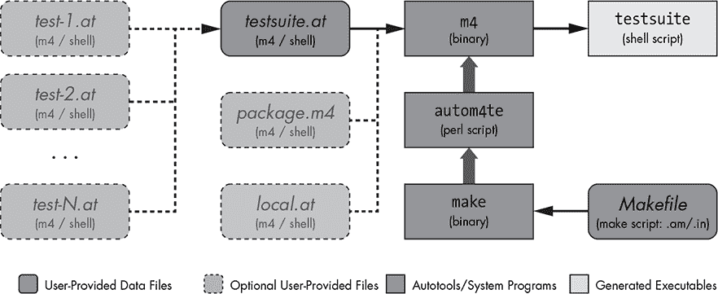
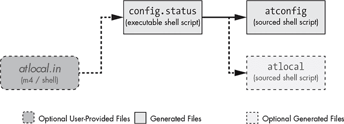
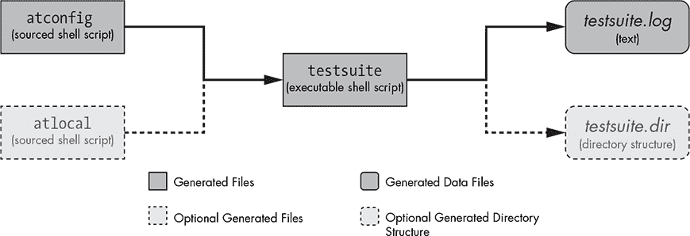

## 使用 AUTOTEST 进行单元和集成测试

*...学习不是知道；有学习者和被学者。记忆造就了前者，哲学造就了后者。*

—亚历山大·仲马，《基督山伯爵》*


测试是重要的。所有开发者都在某种程度上测试他们的软件，否则他们无法知道产品是否符合设计标准。在这个谱系的一端，作者编译并运行程序。如果程序呈现出他们设想的通用接口，他们就认为完成了。在另一端，作者编写了一套测试，尽可能地在不同条件下检验代码的各个部分，验证输出对于指定输入是正确的。努力追求这个谱系的最右端，我们会看到这样的人，他们字面上先写测试，然后迭代地添加和修改代码，直到所有测试通过。

在本章中，我不会尝试详细阐述测试的优点。我假设每个开发者都同意*某种*程度的测试是重要的，无论他们是那种编译-运行-发布类型的人，还是正统的测试驱动开发者。我还假设每个开发者对测试都有一定的反感，这种反感程度在这个谱系上有所不同。因此，我们在这里的目标是尽可能让别人做大部分的测试工作。在这种情况下，“别人”指的是 Autotools。

在第三章中，我们为 Jupiter 添加了一个手写的 makefile 测试。该测试的输出完全由我们放入*src/Makefile*中的`make`脚本控制：

```
$ make check
cd src && make check
make[1]: Entering directory '/.../jupiter/src'
cc -g -O0    -o jupiter main.c
./jupiter | grep "Hello from .*jupiter!"
Hello from ./jupiter!
*** All TESTS PASSED
make[1]: Leaving directory '/.../jupiter/src'
$
```

当我们在第四章和第五章中转向 Autoconf 时，变化不大。输出依然由我们手写的`make`脚本控制。我们只是将它移到了*src/Makefile.in*中。

然而，在第六章中，我们放弃了手写的 makefile 和模板，转而使用 Automake 更为简洁的*Makefile.am*文件。然后，我们需要弄清楚如何将我们手写的测试嵌入到 `automake` 脚本中。在这样做的过程中，我们对测试输出进行了些许升级：

```
$ make check
--snip--
PASS: greptest.sh
============================================================================
Testsuite summary for Jupiter 1.0
============================================================================
# TOTAL: 1
# PASS:    1
# SKIP:    0
# XFAIL: 0
# FAIL:    0
# XPASS: 0
# ERROR: 0
============================================================================
$
```

如果你在终端上运行这个代码，并且使用的是一个相对较新的 Automake 版本，你甚至会看到彩色的测试输出。

每个添加到`TESTS`变量中的测试都会在我们的*src/Makefile.am*模板中生成一个`PASS:`或`FAIL:`行，并且汇总值会计算所有的测试结果。这是因为 Automake 有一个很好的内置测试框架，驱动它的是`TESTS`变量。如果你需要构建`TESTS`中指定的任何文件，你只需要像我们为简单的驱动脚本（*greptest.sh*）所做的那样创建一个规则。如果你的测试程序需要从源代码构建，你可以使用`check_PROGRAM`变量。Automake 的测试框架有一个小问题，如果测试分布在多个目录中，你会在`make check`时看到多次类似的显示，这可能会有点烦人，特别是在使用`make -k`（在遇到错误时继续）时，因为你可能没有意识到需要向上滚动以查看早期可能失败的测试输出。

除了`TESTS`变量，如果你将`XFAIL_TESTS`变量设置为`TESTS`中测试的一个子集，你可能还会看到`XFAIL:`和`XPASS:`行中的一些输出。这些是预期会失败的测试。当这样的测试通过时，它们会列在`XPASS:`行中，作为*意外通过*。当它们失败时，它们会列在`XFAIL:`行中，作为*预期失败*。

返回 77 的测试会增加`SKIP:`行中的计数，而返回 99 的测试会增加`ERROR:`行中的计数。我将在本章稍后提供有关测试返回的特殊 shell 代码的更多详细信息。

正如你现在可能已经猜到的那样，Autoconf 也包含了一个测试框架，叫做*autotest*，它提供了所有所需的基础设施，让你能够简单而轻松地指定一个测试来验证你代码的某些部分。结果以一致且易于理解的方式显示，失败的测试也能在独立的环境中轻松重现，并配有内置的调试环境。几乎让你想写测试了，不是吗？事实是，一个设计良好的测试框架，就像任何其他设计良好的工具一样，是一种乐趣。

此外，autotest 是可移植的——只要你使用可移植的脚本或代码编写你的测试部分，整个测试套件就可以 100%移植到任何可以运行`configure`脚本的系统。这并不像听起来那么难。你通常需要编写的 shell 脚本只是运行一个命令，而命令背后的代码使用 Autotools 提供的可移植性功能编写，并且是通过 Autotools 提供的构建过程生成的。

几年来，autotest 一直被文档描述为“实验性”。不过，无论如何，它的基本功能在这些年中变化不大，Autoconf 使用它来测试自己，正如我们在第一章中看到的那样。因此，是时候停止担心它是否会改变，开始将它用于预定的目的：让软件开发者的测试工作变得不那么繁琐，毕竟，软件开发者真正希望做的是写代码，让别人来担心测试。

作为理性生物，我们无法否认测试的重要性。我们能做的是利用好的工具，让我们能专注于代码本身，而让像 autotest 这样的框架来处理诸如结果格式化、成功/失败语义、用户提交的 bug 报告的数据收集以及可移植性等附加问题。正如我们在本章中将看到的那样，这就是 autotest 提供的价值。

本着透明的精神，我承认，对于像 Jupiter 这样的较小的测试套件，使用 autotest 是很难证明其合理性的。Automake 中内建的测试工具已经足够满足大多数小型项目的需求。较大的项目——例如 Autoconf 本身，它有超过 500 个单元和集成测试，测试覆盖整个项目目录结构中的功能，甚至包括已安装的组件——则是完全不同的情况。

### Autotest 概述

autotest 使用和生成的文件有三个阶段。第一阶段是 *GNU Autoconf 手册* 所称的“准备分发”阶段。第二阶段发生在执行 `configure` 时，第三阶段发生在执行测试套件时。让我们逐一看看这些阶段。

第一阶段发生在构建分发档案时，实际上是生成可以在用户系统上运行的可执行测试程序的过程。可能会觉得奇怪，为什么这个过程必须在构建分发档案时进行；然而，Autoconf 必须安装在任何需要生成此程序的系统上，因此 `testsuite` 程序必须在构建分发档案时构建，以便将其包含在归档文件中供用户使用。在执行 `dist` 或 `distcheck` 目标时，`configure`（以及使用 `distcheck` 时的 `make check`）会被执行；`make check` 封装了重建测试程序的规则，使用 `autom4te` —— Autoconf 缓存的 `m4` 驱动程序。测试程序在执行 `dist` 目标时构建，这是因为它被包括在 Automake 的 `EXTRA_DIST` 变量中，我将在本章结束时讲解这个内容。

图 9-1 显示了在执行 `make dist`（或 `make distcheck`）时，从维护者编写的源文件到 `testsuite` 程序的数据流。



*图 9-1：从维护者编写的输入文件到 `testsuite` 程序的数据流*

在图的第二列顶部找到的 *testsuite.at* 文件，是由项目作者编写的主要测试文件。实际上，这是 autotest 所需的唯一维护者编写的文件。与 *configure.ac* 完全相同，这个文件包含了 shell 脚本，并掺杂了 M4 宏定义和调用。该文件通过 M4 宏处理器处理，由 `autom4te` 作为 `m4` 的驱动程序，生成位于最后一列顶部的 `testsuite` 程序，这是纯粹的 shell 脚本。这个过程发生在执行 `autom4te` 时，`make check` 读取我们编写的 *Makefile.in* 或 *Makefile.am* 文件生成的 makefile，并驱动该过程。准备发布的概念来源于 `check` 目标在 `make distcheck` 时执行（这当然会构建分发档案）；`testsuite` 程序会在这个过程中被添加到分发档案中。它是在 `make dist` 过程中构建的，`make dist` 并不会执行 `make check`，因为在所有列在 `EXTRA_DIST` 中的文件被构建之前，它们不能包含在分发档案中。

诸如此类的细节通常会被 Autotools 隐藏起来，但由于 autotest 仍被视为实验性的——意味着它尚未完全融入 Autotools 套件——因此一些额外的基础设施责任落在了我们这些维护者身上。我们将很快讨论这些细节。

Autoconf 手册建议，测试套件的作者可以将一组组相关的测试，称为*测试组*，放入单独的 *.at* 文件中。然后，*testsuite.at* 文件仅包含一系列 `m4_include` 指令，包含这些特定于组的 *.at* 文件。因此，M4 包含机制是通过它将可选的 *test-1.at* 到 *test-*`N`*.at* 文件汇集到 *testsuite.at* 中，由 M4 进行处理。

*package.m4* 和 *local.at* 文件是可选的维护者编写（或生成）的输入文件，在处理 *testsuite.at* 时，如果找到了它们，会自动由 `autom4te` 包含。前者包含有关测试套件的基本信息，这些信息会在控制台上显示，并嵌入由测试套件生成的错误报告中。后者，手册建议，是一种可选机制，我们可以选择使用，它可以帮助我们保持 *testsuite.at* 文件简洁，不包含全局定义、与组无关的测试，以及可能由实际测试使用的辅助宏定义和 shell 函数。我们将在本章后面讨论这些文件的具体内容。

当 `configure` 脚本用于 autotest 时，配置过程会生成额外的与 autotest 相关的产物。图 9-2 显示了在配置过程中，关于 autotest 的图示。



*图 9-2：在生成与测试相关的模板时，*`configure`* 过程中数据流的示意图*

回想一下第二章中的内容，`config.status` 驱动配置过程中的文件生成部分。当为 autotest 设置 *configure.ac* 文件时，`config.status` 会生成 *atconfig*——一个设计为由 `testsuite` 在执行时调用的 shell 脚本。^(1) 它包含源代码树和构建树的变量，如 `at_testdir`、`abs_builddir`、`abs_srcdir`、`at_top_srcdir` 等，以便在测试套件执行期间访问源代码和构建树中的文件及产物。

测试作者还可以选择创建一个名为 *atlocal.in* 的模板文件，允许他们根据需要将额外的 Autoconf 和项目特定的配置变量传递到测试环境中。该模板的产物是 *atlocal*——同样是一个 shell 脚本，设计为由 `testsuite` 调用（如果它存在）。如果你选择编写 *atlocal.in*，必须将其添加到 *configure.ac* 中传递给 `AC_CONFIG_FILES` 调用的标签列表中。稍后我们将在将 Jupiter 的 `async_exec` 标志导出到我们的测试套件时看到如何执行此操作。

**注意**

*不要将 atlocal 与图 9-1 中的 local.at 混淆。图 9-2 中的 atlocal 文件，由 *`testsuite`* 在运行时调用，用于将配置变量从 *`configure`* 传递到测试环境，而 local.at 文件是由项目维护者直接编写的，包含在生成 *`testsuite`* 时由 *`autom4te`* 处理的额外测试代码。*

图 9-3 展示了 `testsuite` 执行过程中的数据流。



*图 9-3：`testsuite` 脚本执行过程中的数据流*

如前所述，`testsuite` 会获取 *atconfig* 和 *atlocal*（如果存在）来访问源代码树和构建树信息以及其他与项目相关的变量，然后执行生成的测试。执行过程中，它会创建一个 *testsuite.log* 文件，包含每个测试执行的详细信息。你在屏幕上看到的每行文本代表一个测试的结果。^(2)

`testsuite` 程序会生成一个名为 *testsuite.dir* 的目录。在这个目录中，每个测试都会创建一个单独的子目录。测试套件不会删除失败测试的特定子目录；我们可以利用该目录结构的内容获取详细信息并调试问题。稍后我们将详细介绍这些目录中添加了什么内容。

`testsuite` 程序当然可以手动执行，但首先必须生成它。Autoconf 手册建议将生成 `testsuite` 程序的过程直接与 `check` 目标绑定，这样当执行 `make check` 时，`testsuite` 会被生成（如果它缺失或与其依赖关系不一致），然后再执行。

由于 `testsuite` 已被添加到分发包中，运行 `make check` 的最终用户将仅执行现有的 `testsuite` 程序，除非他们修改了 `testsuite` 依赖的某些文件，在这种情况下，`make` 会尝试重新生成 `testsuite`。如果没有安装 Autoconf，这个过程会失败。幸运的是，用户通常不需要修改分发包中 `testsuite` 的任何依赖项。

### 配置 Autotest

由于我这里的目标是教你如何使用这个框架，因此我选择的配置 Jupiter 用于 autotest 的方法是包含图 9-1 至 9-3 中所示的整个可选文件集。这使我们能够准确地探索所有内容如何一起工作。虽然对于像 Jupiter 这样规模的项目，这种方法可能不必要，但它确实能正确工作，而且以后可以随时删减。我将在本章末尾向你展示，如何删除一些内容，将 autotest 输入文件集精简到最少。

在我们编写测试之前，需要让 *configure.ac* 知道我们希望使用 autotest。这是通过在 *configure.ac* 中添加两个宏调用来实现的，如 列表 9-1 所示。

Git 标签 9.0

```
#                                               -*- Autoconf -*-
# Process this file with autoconf to produce a configure script.

AC_PREREQ([2.69])
AC_INIT([Jupiter],[1.0],[jupiter-bugs@example.org])
AM_INIT_AUTOMAKE
LT_PREREQ([2.4.6])
LT_INIT([dlopen])
AC_CONFIG_SRCDIR([src/main.c])
AC_CONFIG_HEADERS([config.h])

AC_CONFIG_TESTDIR([tests])
AC_CONFIG_FILES([tests/Makefile
                 tests/atlocal])

# Checks for programs.
AC_PROG_CC
AC_PROG_INSTALL
--snip--
```

*列表 9-1:* configure.ac: *将 autotest 集成到* configure.ac

这两个宏中的第一个，`AC_CONFIG_TESTDIR`，告诉 Autoconf 启用 autotest，并指定测试目录将命名为 *tests*。如果愿意，你可以在这里使用点（.）表示当前目录，但 *GNU Autoconf 手册* 建议使用单独的目录，以便更容易管理测试输出文件和目录。

**注意**

*将 `AC_CONFIG_TESTDIR` 添加到* configure.ac *实际上是启用 autotest 所需的唯一更改，尽管为了使其更有用和更自动化，还需要更改 makefile 和添加支持文件。有趣的是，这个重要的细节在手册中没有直接提到，尽管它是微妙地暗示的。*

第二行是标准的 Autoconf `AC_CONFIG_FILES` 实例化宏。我在这里使用了它的一个独立实例，用于从模板生成与测试相关的文件。

我们来看看这些文件中包含了什么。第一个是为*tests*目录生成的 makefile，它是从 Autoconf 的 *Makefile.in* 模板生成的，而该模板本身是从我们需要编写的 Automake *Makefile.am* 文件生成的。在这个 makefile 中，我们需要通过 `make check` 来生成并执行 `testsuite`。列表 9-2 展示了如何编写 *tests/Makefile.am*，以便 Automake 和 Autoconf 能够生成这样的 makefile。

```
➊ TESTSUITE = $(srcdir)/testsuite
➋ TESTSOURCES = $(srcdir)/local.at $(srcdir)/testsuite.at
➌ AUTOM4TE = $(SHELL) $(top_srcdir)/missing --run autom4te
➍ AUTOTEST = $(AUTOM4TE) language=autotest

➎ check-local: atconfig atlocal $(TESTSUITE)
           $(SHELL) '$(TESTSUITE)' $(TESTSUITEFLAGS)

➏ atconfig: $(top_builddir)/config.status
           cd $(top_builddir) && $(SHELL) ./config.status tests/$@

➐ $(srcdir)/package.m4: $(top_srcdir)/configure.ac
           $(AM_V_GEN) :;{ \
             echo '# Signature of the current package.' && \
             echo 'm4_define([AT_PACKAGE_NAME], [$(PACKAGE_NAME)])' && \
             echo 'm4_define([AT_PACKAGE_TARNAME], [$(PACKAGE_TARNAME)])' && \
             echo 'm4_define([AT_PACKAGE_VERSION], [$(PACKAGE_VERSION)])' && \
             echo 'm4_define([AT_PACKAGE_STRING], [$(PACKAGE_STRING)])' && \
             echo 'm4_define([AT_PACKAGE_BUGREPORT], [$(PACKAGE_BUGREPORT)])'; \
             echo 'm4_define([AT_PACKAGE_URL], [$(PACKAGE_URL)])'; \
           } >'$(srcdir)/package.m4'
➑ $(TESTSUITE): $(TESTSOURCES) $(srcdir)/package.m4
           $(AM_V_GEN) $(AUTOTEST) -I '$(srcdir)' -o $@.tmp $@.at; mv $@.tmp $@
```

*列表 9-2:* tests/Makefile.am: *使* `make check` *构建并运行* `testsuite`

在我们开始分析这个文件之前，我应该提到，这些内容取自 *GNU Autoconf 手册* 的第 19.4 节。我对它们做了一些修改，但本质上，这些行组成了将 autotest 与 Automake 结合的推荐方式的一部分。我们将在讨论 autotest 定向的 `make` 脚本的其他功能和需求时完成这个文件。

**注意**

*这种缺乏更完整集成的情况，以及 Autoconf 可以配置为使用几个不同的测试驱动程序（例如 DejaGNU）的事实，可能是导致 autotest 仍处于实验模式的原因。虽然 Libtool 逐步向与 Automake 完全集成的方向发展，但 autotest 仍需要一些调整才能正确地集成到项目构建系统中。然而，一旦理解了这些需求，正确的集成其实是相当简单的。此外，正如我们所看到的，Automake 有自己的测试框架，这使得 Automake 的维护者没有足够的动力去全面支持 autotest。*

列表 9-2 中的代码逐行来看非常简单——四个变量和四个规则。这些变量并非严格必要，但它们使命令行更短，并且减少了规则和命令中的重复。➍ 处的 `TESTSUITE` 变量让我们不必在每次使用时都加上 `$(srcdir)/` 前缀。

**注意**

*`testsuite` 程序是分发的，因此它应该在源树中构建。那些最终会进入分发归档的文件应该位于源目录结构中。此外，这些构建并分发的文件的内容应该是相同的，无论原始归档创建者或最终用户使用的配置选项有何不同。*

➋ 处的 `TESTSOURCES` 变量使我们可以轻松地将额外的测试添加到 makefile 中。每个 *.at* 文件都会成为 `testsuite` 的依赖项，因此当其中一个文件发生变化时，`testsuite` 会被重新构建。

➌ 处的 `AUTOM4TE` 变量允许我们使用 Automake 的 `missing` 脚本包装 `autom4te` 的执行，当未找到 `autom4te` 时，它会打印出更友好的错误信息。这通常发生在没有安装 Autotools 的最终用户做出需要重建 `testsuite` 的操作时——例如修改 *testsuite.at*。

**注意**

*我们不能使用 Automake 的 `maintainer-rules` 选项来避免将这些规则写入分发归档的 Makefile，因为我们必须手动编写这些规则。*

`AUTOTEST` 变量在 ➍ 处将 `--language=autotest` 选项添加到 `autom4te` 命令行中。*实际上，Autoconf 包中并没有名为* autotest 的程序。如果我们必须界定这样一个工具的定义，它将是这个 `AUTOTEST` 变量的内容。

➎ 位置的 `check-local` 规则将 `testsuite` 的执行与 Automake 的 `check` 目标关联起来。像 `check` 这样的 Automake 标准目标有一个 `-local` 对应目标，你可以用它来补充 Automake 为基本目标生成的功能。如果 Automake 在 *Makefile.am* 中看到一个目标为 `check-local` 的规则，它会生成一个命令，在生成的 *Makefile* 的 `check` 规则下运行 `$(MAKE) check-local`。这为你提供了一个钩子，允许你进入标准的 Automake 目标。我们将在 第十四章 和 第十五章 中更详细地讲解这些钩子，在那里我们将广泛使用它们，将一个真实世界的项目转换为使用基于 Autotools 的构建系统。

`check-local` 目标依赖于 *atconfig*、*atlocal* 和 `$(TESTSUITE)`。回想一下 图 9-3，*atlocal* 是由 `testsuite` 引用的脚本。它是通过我们在 清单 9-1 中添加到 *configure.ac* 的 `AC_CONFIG_FILES` 调用直接生成的，所以我们很快会讲解它的内容。这个规则的命令执行 `'$(TESTSUITE)'`，并将 `$(TESTSUITEFLAGS)` 作为命令行参数。`TESTSUITEFLAGS` 的内容由用户定义，允许最终用户运行 `make check TESTSUITEFLAGS=-v`，例如，以便在执行调用 `testsuite` 的目标时启用 `testsuite` 的详细输出。

你还可以使用 `TESTSUITEFLAGS` 通过编号（例如，`TESTSUITEFLAGS=2 testsuite`）或如果你已经使用 `AT_KEYWORDS` 宏编写了测试，通过标签名来指定特定的测试组。此外，生成的 `testsuite` 程序还提供了几个命令行选项。你可以在 *GNU Autoconf 手册* 第 19.3 节中找到 `testsuite` 选项的完整文档。

**注意**

*`$(TESTSUITE)`* 周围的单引号允许 *`TESTSUITE`* 中的路径包含空格（如果需要）。这种技术可以并且应该在所有 Makefile 中使用，以处理路径中的空格问题。在本书中，我通常忽略了路径中空格的概念，以减少列表中的噪音，但你应该意识到，Makefile 可以正确地处理所有文件名和路径中的空格——无论是在目标和依赖关系中的，还是与规则相关的命令中的。

我之前提到过，*atconfig* 脚本（同样由 `testsuite` 引用）是由 `AC_CONFIG_TESTDIR` 自动生成的。问题在于，尽管 `config.status` 理解如何构建这个文件，但 Automake 并不知道它，因为它没有直接列出在 *configure.ac* 中任何实例化宏调用的列表中，因此我们需要在 *Makefile.am* 中添加一个明确的规则来创建或更新它。这就是在 清单 9-2 中 ➏ 位置的 `atconfig` 规则的作用。`check-local` 规则依赖于它，因此当执行 `make check` 时，如果 *atconfig* 缺失或比其依赖项 `$(top_builddir)/config.status` 旧，它的命令会被执行。

生成`$(srcdir)/package.m4`的规则中的命令在➐位置（注意这里只是一个命令）仅在文件缺失或比*configure.ac*旧时将文本写入目标文件。这是一个可选的输入文件（见图 9-1），其内容实际上是 autotest 以某种形式所需的。多个 M4 宏必须在输入数据中定义，autotest 会处理这些数据以创建测试套件，包括`AT_PACKAGE_NAME`、`AT_PACKAGE_TARNAME`、`AT_PACKAGE_VERSION`、`AT_PACKAGE_STRING`、`AT_PACKAGE_BUGREPORT`和`AT_PACKAGE_URL`。这些变量可以直接在*testsuite.at*（或该文件包含的任何子文件）中定义，但从已经在*configure.ac*中找到的值生成这些信息更为合理，这样我们就不必维护两份相同的信息。这正是为什么如果在处理*testsuite.at*时找到*package.m4*，`autom4te`会自动包含它。

等等——为什么不使用`AC_CONFIG_FILES`让`configure`来生成这个文件呢？我们所做的只是生成一个包含配置变量的文本文件，这正是`AC_CONFIG_FILES`的作用。问题在于，`AC_CONFIG_FILES`和其他实例化宏总是将文件生成到构建树中，而*package.m4*必须放到源代码树中，才能被添加到分发归档中（不是因为它是用户可能启动的任何构建或执行过程的一部分，而是因为它是`testsuite`的源代码的一部分）。也许在未来的某个时刻，autotest 的完全集成将导致可以要求实例化宏将文件生成到源代码树中。在那之前，这就是我们所能使用的。

第四条也是最后一条规则，`$(TESTSUITE)`，在➑位置，使用`$(AUTOTEST)`命令生成`$(srcdir)/testsuite`。因为`$(TESTSUITE)`是`check-local`的一个依赖项，如果它不是最新的，就会被构建。`autom4te`程序在*autotest 模式*下执行时，接受`-I`选项来指定可能由*testsuite.at*或其任何包含文件包含的*.at*文件的包含路径。它还接受`-o`选项来指定输出文件`testsuite`。^(3)

**注意**

*我在清单 9-2 中添加了*`$(AM_V_GEN)`*，以便让我自定义的规则能够与 Autotools 的静默构建规则系统结合。任何以*`$(AM_V_GEN)`*为前缀的命令都会导致正常的命令输出在启用静默构建规则时被替换为*`GEN`* `target`。有关此和其他影响构建输出的变量的更多细节，请参阅 GNU Automake 手册的第 21.3 节。*

总的来说，这一切使得我们能够在命令行中运行`make check`，以构建（如果需要）并执行`$(srcdir)/testsuite`。

**注意**

*在这个* Makefile.am *文件中，我们还需要做一些工作，以完全将 autotest 功能集成到 Automake 中。稍后我们将在本章中添加一些额外的管理规则和变量。为了清晰起见，此时我将内容限制为仅包含我们需要构建和运行测试套件的部分。*

好的，我们已经创建了一个新目录并添加了一个新的 *Makefile.am*。现在，你应该自动开始思考，如果我们不将它链接到顶层 *Makefile.am* 的 `SUBDIRS` 变量中，这个 *Makefile.am* 文件将如何被调用。你完全正确——这将是我们接下来的步骤。清单 9-3 展示了对顶层 *Makefile.am* 文件的修改。

```
SUBDIRS = common include libjup src tests
```

*清单 9-3:* Makefile.am: *添加测试子目录*

**注意**

*我最后添加了测试。这几乎总是像* tests 这样的目录的模式。*为了测试系统，大多数（如果不是所有的话）其他目录必须先构建。*

清单 9-1 中的第二个文件是 *atlocal* shell 脚本，如果存在，`testsuite` 会自动调用它，这可以用来将额外的配置变量传递到 `testsuite` 的运行时环境中。我们将在 Jupiter 项目中使用这个文件，将 `async_exec` 标志传递给 `testsuite`，以便它知道它正在测试的程序是否已启用 *async-exec* 特性。清单 9-4 展示了如何在 *atlocal* 模板 *atlocal.in* 中实现这一点。

```
async_exec=@async_exec@
```

*清单 9-4:* tests/atlocal.in: *生成 atlocal 的模板*

现在，这对我们来说带来了一个小问题，因为 `configure` 尚未导出名为 `async_exec` 的替代变量。我们在第五章中写了一个 shell 脚本，使用了这个名称的 shell 变量，但请记住，我们只是用它来指示是否应该调用 `AC_DEFINE` 以将 `ASYNC_EXEC` 预处理器定义生成到 *config.h.in* 中。现在，我们需要使用 `AC_SUBST` 处理这个变量，以便生成一个同名的 Autoconf 替代变量。清单 9-5 突出了 *configure.ac* 中的单行添加，以实现这一点。

```
--snip--
  ------------------------------------------
  Unable to find pthreads on this system.
  Building a single-threaded version.
  ------------------------------------------])
       async_exec=no
   fi
fi

AC_SUBST([async_exec])
if test "x${async_exec}" = xyes; then
    AC_DEFINE([ASYNC_EXEC], 1, [async execution enabled])
fi
--snip--
```

*清单 9-5:* configure.ac: *使 autoconf 生成 `async_exec` 替代变量*

关于清单 9-1 的最后一点评论：我们本可以将这些文件简单地添加到 *configure.ac* 底部现有的 `AC_CONFIG_FILES` 调用中，但这里使用单独的调用可以将与测试相关的项目聚集在一起。它还表明，`AC_CONFIG_FILES` 确实可以在 *configure.ac* 中多次调用，并且结果是累积的。

我们现在需要创建一组源*.at*文件，供`autom4te`使用，以生成我们的测试程序。这组文件可以像单个*testsuite.at*文件一样简单，或像图 9-1 中的示意图那样复杂，包括*testsuite.at*、一组特定测试组的*.at*文件以及一个*local.at*文件。这些文件将包含自动测试宏调用，并根据测试需求混合简单或复杂的 Shell 脚本。我们将从一个包含自动测试初始化代码的单行*tests/local.at*文件开始，如清单 9-6 所示。

```
AT_INIT
```

*清单 9-6:* tests/local.at：*可以将`testsuite`的初始化代码添加到* local.at 文件中。

`AT_INIT`宏是`autom4te`所必需的，它必须出现在*testsuite.at*及其包含文件中呈现的翻译单元中的某个地方。这个单一的宏调用会展开成几百行的 Shell 脚本，定义了基本的测试框架以及与之相关的所有附加模板功能。

我们还需要在*tests*目录下创建一个空的*testsuite.at*文件。随着进展，我们会向其中添加内容：

```
$ touch tests/testsuite.at
```

我们现在已经为在 Jupiter 中生成和执行自动测试框架奠定了基础。每个使用自动测试的项目都必须按照我们目前展示的方式进行配置。对于较小的项目，一些可选的部分可以省略，这些内容将直接合并到*testsuite.at*中。我们将在完成自动测试的探索后讨论如何简化。目前，让我们先试一下：

```
$ autoreconf -i
--snip--
$ ./configure
--snip--
config.status: creating tests/Makefile
config.status: creating tests/atlocal
--snip--
config.status: executing tests/atconfig commands
-------------------------------------------------

Jupiter Version 1.0
--snip--
$ make check
--snip--
Making check in tests
make[1]: Entering directory '/.../jupiter/tests'
make    check-local
make[2]: Entering directory '/.../jupiter/tests'
:;{ \
  echo '# Signature of the current package.' && \
  echo 'm4_define([AT_PACKAGE_NAME], [Jupiter])' && \
  echo 'm4_define([AT_PACKAGE_TARNAME], [jupiter])' && \
  echo 'm4_define([AT_PACKAGE_VERSION], [1.0])' && \
  echo 'm4_define([AT_PACKAGE_STRING], [Jupiter 1.0])' && \
  echo 'm4_define([AT_PACKAGE_BUGREPORT], [jupiter-bugs@example.org])'; \
  echo 'm4_define([AT_PACKAGE_URL], [])'; \
} >'tests/package.m4'
/bin/bash ../missing --run autom4te --language=autotest \
    -I '.' -o testsuite.tmp testsuite.at
mv testsuite.tmp testsuite
/bin/bash './testsuite'
## ----------------------- ##
## Jupiter 1.0 test suite. ##
## ----------------------- ##

## ------------- ##
## Test results. ##
## ------------- ##

0 tests were successful.
--snip--
$
```

我们可以从`configure`的输出中看到，生成的文件已经按照预期创建在*tests*目录下。看起来，由`AC_CONFIG_TESTDIR`生成的代码已将*tests/atconfig*文件的生成作为*command*标签，而不是作为简单的模板文件，内部使用`AC_CONFIG_COMMANDS`。

然后我们从`make check`的输出中看到，`testsuite`已经被构建并执行。我们目前还不能将`testsuite`纳入从`dist`或`distcheck`目标生成的发行档案中，因为我们还没有将自动测试功能接入到 Automake 中。然而，当我们在本章末完成更改时，你会发现运行`make check`时，针对发行档案的内容将不会构建`testsuite`，因为它已经随档案一起发布（假设我们没有修改任何`testsuite`的依赖项）。

**注意**

*在*`make check`*输出的顶部附近，有一项有趣的内容由以*`make[1]:`*和*`make[2]:`*开头的行高亮显示，其中*`make`*表示它两次进入了 jupiter/tests 目录。这是因为我们添加了*`check-local`*钩子，*`check`*目标在相同目录中递归调用*`$(MAKE) check-local`*作为命令。*

很好，它能工作——至少在`make check`下是这样。但是目前它还什么都不做，只是在控制台上打印几行额外的文本。为了让它做一些有用的事情，我们需要添加一些测试。因此，我们的第一项任务是将最初基于 Automake 的`jupiter`执行测试从*src/Makefile.am*移入我们的 autotest 测试套件中。

### 添加测试

自动化测试将测试打包成称为*测试组*的集合。测试组的目的是允许组内的测试互相交互。例如，组内的第一个测试可能会生成一些数据文件，后续的测试会使用这些文件。

互相交互的测试更难调试，如果它们需要先运行其他测试才能复现问题，那么损坏的测试也更难复现。在追求完全覆盖时，多个测试组很难避免；理想的情况是每个测试组尽可能只包含一个测试。对于无法做到这一点的情况，测试组的存在是为了促进所需的交互。该功能的关键在于，*同一测试组内的测试会在同一个临时目录中执行*，允许初始测试生成的文件供后续测试查看和访问。

我们的单个测试不会遭遇这些问题——主要是因为我们还没有投入很多精力测试 Jupiter（如果我们实话实说，其实也没有太多代码需要测试）。目前，当你执行`make check`时，屏幕上会显示两组测试输出：

```
   $ make check
   --snip--
➊ make    check-TESTS
   make[2]: Entering directory '/.../jupiter/src'
   make[3]: Entering directory '/.../jupiter/src'
   PASS: greptest.sh
   ============================================================================
   Testsuite summary for Jupiter 1.0
   ============================================================================
   # TOTAL: 1
   # PASS:    1
   # SKIP:    0
   # XFAIL: 0
   # FAIL:    0
   # XPASS: 0
   # ERROR: 0
   --snip--
➋ Making check in tests
   make[1]: Entering directory '/.../jupiter/tests'
   make    check-local
   make[2]: Entering directory '/.../jupiter/tests'
   /bin/bash './testsuite'
   ## ----------------------- ##
   ## Jupiter 1.0 test suite. ##
   ## ----------------------- ##

   ## ------------- ##
   ## Test results. ##
   ## ------------- ##

   0 tests were successful.
   --snip--
   $
```

第一组测试（从➊开始）在* jupiter/src *目录中执行。这是我们最初基于`grep`的测试，检查`jupiter`的输出是否与模式匹配。正如你所见，Automake 中内置的基本测试框架并不差。我们希望通过 autotest 对这个框架进行改进。第二组测试（从➋开始）在* jupiter/tests *目录中执行，并涉及到 autotest。

#### 使用 AT_CHECK 定义测试

我们在*src/Makefile.am*中使用的基于`grep`的测试是一个完美的示例，可以用在 autotest 框架提供的`AT_CHECK`宏中。以下是`AT_CHECK`宏系列的原型：

```
AT_CHECK(commands, [status = '0'], [stdout], [stderr], [run-if-fail], [run-if-pass])
AT_CHECK_UNQUOTED(commands, [status = '0'], [stdout], [stderr], [run-if-fail], [run-if-pass])
```

`AT_CHECK`执行*`commands`*，将返回的状态与*`status`*进行比较，并将`stdout`和`stderr`上的输出与*`stdout`*和*`stderr`*宏参数的内容进行比较。如果省略了*`status`*，自动化测试默认假设状态码为零的成功。如果*`commands`*返回的状态码与*`status`*中指定的预期状态码不符，则测试失败。为了忽略*`commands`*的状态码，应该在*`status`*参数中使用特殊命令`ignore`。

无论如何，有一些状态码是即使是`ignore`也无法忽略的：*`commands`*返回的状态码 77（跳过）会导致自动化测试跳过当前测试组中其余的测试，而 99（硬错误）则会立即使自动化测试失败整个测试组。

像*`status`*一样，*`stdout`*和*`stderr`*参数似乎是可选的，但外表可能会欺骗你。如果你什么都不传递给这些参数，这只是告诉 Autoconf，测试的`stdout`和`stderr`输出流预计为空。其他任何内容都会导致测试失败。那么我们如何告诉 autotest 我们不想检查输出呢？与*`status`*一样，我们可以在*`stdout`*或*`stderr`*中使用特殊命令，包括表 9-1 中列出的命令：

**表 9-1：** 允许在*`stdout`*和*`stderr`*参数中使用的特殊命令。

| **命令** | **描述** |
| --- | --- |
| `ignore` | 不检查此输出流，但会将其记录到测试组的日志文件中。 |
| `ignore-no-log` | 不检查也不记录此输出流。 |
| `stdout` | 将测试的`stdout`输出记录并捕获到文件`stdout`中。 |
| `stderr` | 将测试的`stderr`输出记录并捕获到文件`stderr`中。 |
| `stdout-nolog` | 将测试的`stdout`输出捕获到文件`stdout`中，但不记录日志。 |
| `stderr-nolog` | 将测试的`stderr`输出捕获到文件`stderr`中，但不记录日志。 |
| `expout` | 将测试的`stdout`输出与先前创建的文件`expout`进行比较，记录差异。 |
| `experr` | 比较测试的`stderr`输出与先前创建的文件`experr`，并记录差异。 |

*`run-if-fail`*和*`run-if-pass`*参数允许你可选地指定应在测试失败或成功时分别执行的 shell 代码。

`AT_CHECK_UNQUOTED`的功能与`AT_CHECK`完全相同，唯一的区别是它首先对*`stdout`*和*`stderr`*进行 shell 扩展，然后再与*`commands`*的输出进行比较。由于`AT_CHECK`不会对*`stdout`*和*`stderr`*进行 shell 扩展，因此如果你在这些参数的文本中引用了任何 shell 变量，显然你需要使用`AT_CHECK_UNQUOTED`。

#### 使用 AT_SETUP 和 AT_CLEANUP 定义测试组

`AT_CHECK`宏必须在`AT_SETUP`和`AT_CLEANUP`的调用之间调用，这两个宏定义了一个测试组，从而定义了测试组中测试执行的临时目录。这些宏的原型如下所示：

```
AT_SETUP(test-group-name)
AT_CLEANUP
```

如果你有使用过*xUnit*系列单元测试框架（如 JUnit、NUnit、CPPUnit 等）的经验，你可能已经对设置（setup）和清理（cleanup）或拆解（teardown）函数的用途有了相当清晰的认识。通常，*setup*函数会在每个测试集中的每个测试之前运行一些公共代码，而*cleanup*或*teardown*函数会在测试集中的每个测试结束时执行一些公共代码。

Autotest 稍有不同——没有正式的设置或拆解功能由属于同一组的测试共享（尽管这种功能可以通过在*testsuite.at*中的测试组内，或在其包含的子文件中定义的 shell 函数进行模拟）。与*xUnit*框架一样，Autotest 将每个测试完全隔离运行，因为每个测试都在其自己的子 shell 中运行。一个测试唯一能影响后续测试的方式是通过共享同一个测试组，并且在文件系统中留下数据供后续测试检查并进行操作。

`AT_SETUP`只接受一个参数，*`test-group-name`*，这是我们要开始的测试组的名称，而且这个参数是必需的。`AT_CLEANUP`不接受任何参数。

我们将在一个新文件*tests/jupiter.at*中添加组设置和清理宏调用，并包装对`AT_CHECK`的调用，如清单 9-7 所示。

Git 标签 9.1

```
AT_SETUP([jupiter-execution])
AT_CHECK([../src/jupiter],,[Hello from ../src/.libs/lt-jupiter!])
AT_CLEANUP
```

*清单 9-7:* tests/jupiter.at: *添加我们的第一个测试组——尝试 #1*

Libtool 在*src*目录中为任何使用 Libtool 共享库的可执行文件添加了一个包装脚本。这个包装脚本允许`jupiter`找到它试图使用的未安装的 Libtool 库。如第七章所述，这是一种 Libtool 提供的便捷机制，使我们不必在程序使用 Libtool 共享库并且尚未安装之前就进行测试。

最终结果是*src/jupiter*脚本执行了真正的`jupiter`程序，来自*src/.libs/lt-jupiter*。因为`jupiter`根据其`argv[0]`的内容显示其自身位置，我们需要预期它打印出这个路径。

然后，我们需要在当前空的*testsuite.at*文件中添加一个`m4_include`语句，以便包含* jupiter.at*，如清单 9-8 所示。

```
m4_include([jupiter.at])
```

*清单 9-8:* tests/testsuite.at: *在* testsuite.at *中包含* jupiter.at

我们还需要将这个新源文件添加到*tests/Makefile.am*文件的`TESTSOURCES`变量中，使其成为`testsuite`的前提条件，如清单 9-9 所示。

```
--snip--
TESTSUITE = $(srcdir)/testsuite
TESTSOURCES = $(srcdir)/local.at $(srcdir)/testsuite.at \
   $(srcdir)/jupiter.at
AUTOM4TE = $(SHELL) $(top_srcdir)/missing --run autom4te
AUTOTEST = $(AUTOM4TE) --language=autotest
--snip--
```

*清单 9-9:* tests/Makefile.am: *将额外的源添加到`TESTSOURCES`*

对于我们添加到测试套件中的每个测试，我们都会遵循这一做法。最终，*testsuite.at*中只会包含几次对`m4_include`的调用，每个测试组对应一次调用。执行这段代码会输出以下内容：

```
$ autoreconf -i
--snip--
$ ./configure
--snip--
$ make check
--snip--
/bin/bash './testsuite'
## ----------------------- ##
## Jupiter 1.0 test suite. ##
## ----------------------- ##
  1: jupiter-execution                                FAILED (jupiter.at:2)

## ------------- ##
## Test results. ##
## ------------- ##

ERROR: 1 test was run,
1 failed unexpectedly.
## -------------------------- ##
## testsuite.log was created. ##
## -------------------------- ##

Please send `tests/testsuite.log' and all information you think might help:

   To: <jupiter-bugs@example.org>
   Subject: [Jupiter 1.0] testsuite: 1 failed

You may investigate any problem if you feel able to do so, in which
case the test suite provides a good starting point. Its output may
be found below `tests/testsuite.dir'.
--snip--
$
```

**注意**

*运行`autoreconf`和`configure`仅仅是因为我们更新了* tests/Makefile.am *文件。如果我们只是修改了一个现有的.at 文件，而这个文件是由* tests/Makefile *中的`check`目标重新构建的，那么就不需要`autoreconf`和`configure`了。*

我在这里承认，我们的单个测试失败了，因为我故意将测试编写错误，以向你展示失败的测试是什么样子的。

虽然从输出中不容易看出，但 `testsuite` 在测试失败时会创建多个 *testsuite.log* 文件。第一个是位于 *tests* 目录下的主 *testsuite.log* 文件，这个文件总是会被创建，即使所有测试都通过，并且这个文件旨在发送给项目维护者作为错误报告。另一个同名的日志文件位于 *tests/testsuite.dir* 目录中的一个单独的编号目录下，用于记录失败的测试。每个这些目录的名称是失败的测试组的编号，测试组编号可以在输出中看到。虽然你只需要主 *testsuite.log* 文件，因为它包含了所有单独测试的 *testsuite.log* 文件的全部内容，但这个文件也包含了许多关于项目和测试环境的其他信息，维护者会希望看到这些信息，但对于我们来说，这些信息会造成干扰。

要准确查看我们的测试失败原因，首先让我们检查一下 *testsuite**.log* 文件的内容，该文件位于 *tests/testsuite.dir/1* 目录下：

```
$ cat tests/testsuite.dir/1/testsuite.log
#                             -*- compilation -*-
1\. jupiter.at:1: testing jupiter-execution ...
./jupiter.at:2: ../src/jupiter ➊
--- /dev/null     2018-04-21 17:27:23.475548806 -0600 ➋
+++ /.../jupiter/tests/testsuite.dir/at-groups/1/stderr 2018-06-01 16:08:04.391926296 -0600
@@ -0,0 +1 @@
+/.../jupiter/tests/testsuite.dir/at-groups/1/test-source: line 11: ../src/jupiter: ➌
    No such file or directory
--- -     2018-06-01 16:08:04.399436755 -0600 ➍
+++ /.../jupiter/tests/testsuite.dir/at-groups/1/stdout 2018-06-01 16:08:04.395926314 -0600
@@ -1 +1 @@
-Hello from ../src/.libs/lt-jupiter!
+
./jupiter.at:2: exit code was 127, expected 0 ➎
1\. jupiter.at:1: 1\. jupiter-execution (jupiter.at:1): FAILED (jupiter.at:2)
$
```

首先注意，autotest 尽可能将相关的源代码行写入 *testsuite.log* 文件。此时这对我们来说并没有太大帮助，但如果 *testsuite.at* 或其包含的文件很长且复杂，你会发现这些信息会非常有用。

在➊处，我们可以看到传递给 `AT_CHECK` 的 *`commands`* 参数以及将该参数传递给 *jupiter.at* 宏时所在的行号。

然而，现在事情开始变得有些模糊。*`stdout`* 和 *`stderr`* 参数在 `AT_CHECK` 中的作用就是提供一些比较文本，用来显示 *`commands`* 实际发送到这些输出流的内容。根据 Unix 一般哲学中避免重复已有功能的原则，autotest 的作者选择使用 `diff` 工具来进行这些比较。从➋到➌（包括）之间的日志行显示了 `diff` 工具在比较 *原始* 文件（*/dev/null*，因为我们没有在 *`stderr`* 参数中传递任何值）和 *修改* 文件时的 *统一*^(4) 输出——这个修改文件是在尝试执行 *../src/jupiter* 时发送到 `stderr` 输出流的文本。

如果你不熟悉统一的 `diff` 输出，下面是简要说明。从➋开始的两行表示正在比较的对象。原始的，或减号（`---`）行表示比较的左侧，而修改的，或加号（`+++`）行表示比较的右侧。在这里，我们正在比较 */dev/null* 和一个名为 */.../jupiter/tests/testsuite.dir/at-groups/1/stderr* 的临时文件，该文件由 autotest 用来捕获执行 *../src/jupiter* 时的 `stderr` 流。

下一行，以 `@@` 开头和结尾，是一个 *块*标记——`diff` 用来告诉我们两个文件中不匹配的部分。`diff` 显示的输出中可能有多个块。在这种情况下，由于输出文本非常短，只需要一个块来展示差异。

块标记中的数字代表两个范围，由空格分隔。第一个范围以减号（`-`）开头，表示与*原始*文件相关的范围，第二个范围以加号（`+`）开头，表示与*修改后*文件相关的范围。这里是我们当前讨论的那一行：

```
@@ -0,0 +1 @@
```

范围由两个整数值组成，这两个值由逗号（`,`）分隔，或者是一个值，默认第二个值为 1。在这个例子中，比较的范围在原始文件中从零开始，并且长度为零行，而第二个文件中的比较范围从第 1 行开始，长度为一行。这些范围是基于 1 的，也就是说，第 1 行是文件中的第一行。因此，第一个范围说明`-0,0`是一个特殊范围，意味着文件中没有内容。

跟随范围说明的行包含这些范围的完整文本，向我们展示实际的差异。原始文件的行首先被打印，每行前面带有一个减号，然后是修改后的文件行，每行前面带有一个加号。当修改行周围有足够的内容时，还会在这些行之前和之后添加额外的无前缀行，显示一些关于更改的上下文。在这种情况下，本节的全部内容是：

```
+/.../jupiter/tests/testsuite.dir/at-groups/1/test-source: line 11: ../src/jupiter:
  No such file or directory
```

由于原始文件是空的，如块标记中的`-0,0`范围所示，因此没有任何以减号开头的行。我们只看到一行修改后的文件行，以加号开头。

很显然，这些文件并不相同——我们原本期望 `stderr` 流中没有内容，但我们却得到了错误文本。Shell 在尝试执行 *../src/jupiter* 时遇到错误——它无法找到该文件。如果你在 shell 提示符下尝试此操作，你将看到以下输出：

```
$ ../src/jupiter
bash: ../src/jupiter: No such file or directory
$
```

**注意**

*显然，你不应该从* tests *目录，或任何与* src *目录平行的目录中执行此操作，否则它实际上会找到* jupiter *(如果已构建)而不是显示此错误。*

如果你将此行放入一个名为（随意）*abc.sh*的 shell 脚本中，并在 `bash` 命令行上执行该脚本，你将看到与 *testsuite.log* 中显示的格式匹配的输出：

```
$ bash abc.sh
abc.sh: line 2: ../src/jupiter: No such file or directory
$
```

我们可以在 *testsuite.log* 的 ➎ 位置看到，shell 返回了一个 127 状态码，表示某种错误。值 127 被 shell 用来表示执行错误——文件未找到或文件不可执行。

为了完整起见，我们也来看看 ➍ 和 ➎ 之间的几行。这是通过比较`AT_CHECK`的*`stdout`*参数中指定的文本与`jupiter`（实际上是 shell，因为我们知道*../src/jupiter*没有找到）实际写入`stdout`的内容时，所看到的统一`diff`输出。在这种情况下，我们看到减号文本是我们指定的原始比较文本，而加号文本是一个换行符，因为这是 shell 发送到`stdout`的内容。完全展开后的块标记范围说明如下：

```
@@ -1,1 +1,1 @@
```

每个原始和修改后的源文件中都只有一行文本需要比较，但正如我们通过输出看到的，这些源文件中的文本完全不同。

#### *那么发生了什么？*

这个第一次尝试假设`jupiter`程序（或者更准确地说，是 Libtool 包装脚本）位于相对于*tests*目录的*../src/jupiter*。虽然这个假设是正确的，但我已经暗示过，每个测试组是在自己的临时目录中执行的，因此，这个相对路径在其他目录下无法正常工作也是完全合乎逻辑的。即使我们通过反复试验找出应该使用多少个父目录引用，它也会相当脆弱；如果我们从其他目录运行`testsuite`，它会失败，因为它过于依赖于相对于`jupiter`程序的特定位置来运行。

我们换个方式试试。我们将使用`configure`生成的变量到*atconfig*中。其中一个变量`abs_top_builddir`包含了顶层构建目录的绝对路径。因此，我们应该能够在任何地方成功地引用`jupiter`，方法是使用`${abs_top_builddir}`*/src/jupiter*。

但是现在我们遇到了另一个问题：`jupiter`打印了它自己的路径，而我们刚决定通过 shell 变量来获取这个路径，所以我们还需要更改比较文本，以使用这个变量。然而，这个更改又引发了另一个问题——如果我们希望在宏进行比较之前，`AT_CHECK`的*`stdout`*参数中的 shell 变量被展开，我们就需要将`AT_CHECK`更改为`AT_CHECK_UNQUOTED`。让我们通过修改*`jupiter.at`*，按列表 9-10 所示进行这些更改。

Git 标签 9.2

```
AT_SETUP([jupiter-execution])
AT_CHECK_UNQUOTED(["${abs_top_builddir}"/src/jupiter],,
                  [Hello from ${abs_top_builddir}/src/.libs/lt-jupiter!
])
AT_CLEANUP
```

*列表 9-10:* tests/jupiter.at: *添加我们的第一个测试组—尝试 #2*

在这里，我们切换到使用`AC_CHECK_UNQUOTED`，并且我们将第一个参数中的`jupiter`程序路径和第三个参数中的比较文本更改为使用我们从*atconfig*继承的`abs_top_builddir`变量。

**注意**

*`stdout`*参数末尾的换行符是故意的，稍后会解释。

让我们试试看：

```
$ make check
--snip--
/bin/bash './testsuite'
## ----------------------- ##
## Jupiter 1.0 test suite. ##
## ----------------------- ##
  1: jupiter-execution                               ok

## ------------- ##
## Test results. ##
## ------------- ##

1 test was successful.
--snip--
$
```

再次说明，我只需要运行`make`。尽管我们的更改很大，甚至影响了我们在测试套件中调用的宏，但请记住，整个测试套件是通过`make check`生成的。我们只需要在更改了*configure.ac*或它生成的用于`make check`的文件模板，或者更改了*Makefile.am*文件时，才需要执行`autoreconf`和`configure`。

这个尝试取得了更好的结果，但为什么我们在列表 9-10 中的比较文本末尾会有一个额外的换行符呢？嗯，记得我们从`jupiter`发送到`stdout`的是什么吗？列表 9-11 提供了提示。

```
--snip--
    printf("Hello from %s!\n", (const char *)data);
--snip--
```

*列表 9-11:* common/print.c: *`jupiter`发送到`stdout`的内容*

比较文本是我们期望在`jupiter`的`stdout`中找到的内容的精确副本，因此我们最好确保包括我们写的每一个字符；尾随的新行是数据流的一部分。

现在可能是移除*src/Makefile.am*中构建和运行 Automake 版本测试代码的好时机。按列表 9-12 所示修改*src/Makefile.am*。

```
SUBDIRS = modules/hithere

bin_PROGRAMS = jupiter
jupiter_SOURCES = main.c module.h
jupiter_CPPFLAGS = -I$(top_srcdir)/include
jupiter_LDADD = ../libjup/libjupiter.la -dlopen modules/hithere/hithere.la
```

*列表 9-12:* src/Makefile.am: *移除测试后的文件更新后的完整内容*

**注意**

*我们在这里做的只是从文件的下半部分移除与测试相关的行。*

### 单元测试与集成测试

总的来说，autotest 版本比我们在*src/Makefile.am*中由 Automake 测试框架执行时的版本要好一些。然而，添加新测试比我们在*src/Makefile.am*的`TESTS`变量中所做的要简单一些。事实上，Automake 版本变得更简单的唯一方式是如果我们实际上编写测试程序并将其构建在`check`主干中。我们可能仍然需要在`check`主干中构建测试程序，但使用 autotest 时，调用它们并验证其输出是微不足道的。

如果你觉得 autotest 似乎更适合系统和集成测试，而不是单元测试，你的想法差不多。Autotest 旨在从外部测试你的项目，但它并不限于这类测试。从 autotest 的角度来看，任何可以从命令行调用的东西都可以成为测试。实际上，autotest 为你提供的是一个生成统一测试输出的框架，无论你使用什么类型的测试。

我多年来使用的一种单元测试方法是编写测试程序，其中我的测试程序的主源模块实际上会`#include`我正在测试的*.c*文件。这给了我调用被测试模块中的静态方法的选项，并提供了对该模块中定义的内部结构的直接访问。^(5)这种方法相当偏向 C 语言，但其他语言也有自己执行相同操作的方法。其核心思想是创建一个能够访问模块私有部分的测试程序，并以小块的方式进行功能验证。当你将这些小块组合在一起时，你可以确信每个小块都按设计工作；如果有问题，可能是在你将它们组合起来的方式上。

现在，让我们通过创建一个测试模块来为 Jupiter 添加一些单元测试，该模块测试*common/print.c*模块中的函数。创建一个名为*test_print.c*的文件，并将其放在*common*目录中，文件内容参见 Listing 9-13。

Git 标签 9.3

```
#define printf mock_printf
#include "print.c"

#include <stdarg.h>
#include <string.h>

static char printf_buf[512];

int mock_printf(const char * format, ... )
{
    int rc;
    va_list ap;
    va_start(ap, format);
    rc = vsnprintf(printf_buf, sizeof printf_buf, format, ap);
    va_end(ap);
    return rc;
}

int main(void)
{
    const char *args[] = { "Hello", "test" };
    int rc = print_it(args);
    return rc != 0 || strcmp(printf_buf, "Hello from test!\n") != 0;
}
```

*Listing 9-13:* common/test_print.c: *一个针对 print.c 模块的单元测试程序*

第一行使用预处理器将所有对`printf`的调用重命名为`mock_printf`。第二行然后使用预处理器将`#include`直接引入*print.c*到*test_print.c*中。现在，*print.c*中的任何`printf`调用将重新定义为调用`mock_printf`——包括在系统头文件如*stdio.h*中定义的任何原型。^(6)

这里的想法是验证`print_it`函数是否实际打印了*Hello from* `argument`*!\n*并返回零给调用者。我们不需要任何输出——一个 Shell 返回码就足够表明`print_it`按设计工作。

我们也不需要这个模块的`main`例程接受任何命令行参数。不过，如果这里有多个测试，可能会方便一些，接受某种参数来告诉代码我们想运行哪个测试。

我们在这里做的其实很简单，就是直接调用`print_it`并传入一个短字符串，然后尝试验证`print_it`是否返回了零，并且实际将我们期望的内容传递给了`printf`。请注意，`print_it`是一个静态函数，这应该使其无法被其他模块访问，但由于我们在*test_print.c*的顶部包含了*print.c*，实际上我们将这两个源文件合并为一个翻译单元。

现在，让我们为这个测试程序编写构建代码。首先，我们需要在*common/Makefile.am*中添加一些行，以便在运行`make check`时构建`test_print`程序。按照 Listing 9-14 中所示的方式修改*common/Makefile.am*。

```
noinst_LIBRARIES = libjupcommon.la
libjupcommon_la_SOURCES = jupcommon.h print.c

check_PROGRAMS = test_print
test_print_SOURCES = test_print.c
```

*Listing 9-14:* common/Makefile.am: *将`test_print`添加为`check_PROGRAM`*

当我们执行 `check` 目标时，我们现在会在 *common* 目录中获得一个新的程序 `test_print`。现在，我们需要将此程序的调用添加到我们的测试套件中。在 *tests* 中创建一个名为 *print.at* 的新文件，如 清单 9-15 所示。

```
AT_SETUP([print])
AT_CHECK(["${abs_top_builddir}/common/test_print"])
AT_CLEANUP
```

*清单 9-15:* tests/print.at: *添加 `print` 测试*

我们还需要为此测试向 *testsuite.at* 添加一个 `m4_include` 语句，如 清单 9-16 所示。

```
m4_include([jupiter.at])
m4_include([print.at])
```

*清单 9-16:* tests/testsuite.at: *将 print.at 添加到 testsuite.at*

最后，我们需要将这个新的源文件添加到 *tests/Makefile.am* 中的 `TESTSOURCES` 变量，如 清单 9-17 所示。

```
--snip--
TESTSUITE = $(srcdir)/testsuite
TESTSOURCES = $(srcdir)/local.at $(srcdir)/testsuite.at \
  $(srcdir)/jupiter.at $(srcdir)/print.at
AUTOM4TE = $(SHELL) $(top_srcdir)/missing --run autom4te
AUTOTEST = $(AUTOM4TE) –language=autotest
--snip--
```

*清单 9-17:* tests/Makefile.am: *将 print.at 添加到 `TESTSOURCES`*

由于 `test_print` 程序仅使用 shell 状态码来指示错误，因此在 `AT_CHECK` 中使用它是最简单的。你只需要提供第一个参数——程序本身的名称。如果 `test_print` 有多个测试，你可能会接受一个命令行参数（在同一参数内），用来指示你想运行哪个测试，然后添加多个 `AC_CHECK` 调用，每个调用运行 `test_print` 并带有不同的参数。

请注意，我们已经开始了一个新的测试组——正如我之前提到的，除非测试的性质使得它们必须在同一文件数据集上共同工作，否则你应该尽量将每个测试组限制为一个测试。

让我们试试吧。请注意，为了运行新的测试，我们实际上只需要执行 `check` 目标来更新并执行 `testsuite`。然而，由于我们已经将 *print.at* 依赖项添加到了 *tests/Makefile.am* 中，我们可能还应该运行 `autoreconf` 和 `configure`。如果我们启用了维护者模式，额外的维护者模式规则会为我们处理这些：

```
$ autoreconf -i
--snip--
$ ./configure
--snip--
$ make check
--snip--
/bin/bash './testsuite'
## ----------------------- ##
## Jupiter 1.0 test suite. ##
## ----------------------- ##
  1: jupiter-execution                                                 ok
  2: print                                                             ok

## ------------- ##
## Test results. ##
## ------------- ##

All 2 tests were successful.
--snip--
$
```

### 管理细节

我在描述 *tests/Makefile.am* 内容时提到过，正如在 清单 9-2 中提到的，我们需要在该文件中添加一些额外的基础设施，以便完成与 Automake 的集成。让我们现在来处理这些细节。

我们已经看到，`make` (`all`) 和 `make check` 可以正常工作，构建我们的产品并构建和执行我们的测试套件。但我们忽略了 Automake 为我们配置的其他一些目标——具体来说，`installcheck`、`clean` 以及与分发相关的目标，如 `dist` 和 `distcheck`。这里有一个需要考虑的一般教训：每当我们向 *Makefile.am* 添加自定义规则时，我们需要考虑这些规则对 Automake 生成的标准目标的影响。

#### 分发测试文件

有几个生成的文件需要分发。这些文件并不是 Automake 固有的知道的，因此，Automake 需要显式地告知这些文件。这是通过 Automake 识别的 `EXTRA_DIST` 变量来完成的，我们将在 *tests/Makefile.am* 文件顶部添加该变量，如 清单 9-18 所示。

Git 标签 9.4

```
EXTRA_DIST = testsuite.at local.at jupiter.at print.at \
  $(TESTSUITE) atconfig package.m4

TESTSUITE = $(srcdir)/testsuite
TESTSOURCES = $(srcdir)/local.at $(srcdir)/testsuite.at \
  $(srcdir)/jupiter.at $(srcdir)/print.at
--snip--
```

*清单 9-18:* tests/Makefile.am: *确保测试文件与`EXTRA_DIST`一起分发*

在这里，我已经添加了所有测试套件源文件，包括*testsuite.at*、*local.at*、*jupiter.at*和*print.at*。我还添加了`testsuite`程序和我们通过非 Automake 机制生成的任何输入文件。这些文件包括*atconfig*，它是由`AC_CONFIG_TESTDIR`宏提供的代码生成的，以及*package.m4*，它是我们之前向此*Makefile.am*文件添加的自定义规则生成的。这里需要理解的是，向`EXTRA_DIST`添加文件会导致它们在执行`make dist`时被构建（如果需要）。

**注意**

*我本来只想在`EXTRA_DIST`中使用*`$(TESTSOURCES)`*，但是该变量中的源文件是为规则和命令格式化的。*`EXTRA_DIST`*由 Automake 解释时，旨在引用相对于源树中当前目录的文件列表。*

提醒一下，我们分发*.at*文件，因为 GNU 通用公共许可证要求我们必须分发项目的源代码，而这些文件就是`testsuite`的源代码，就像*configure.ac*是`configure`的源代码一样。然而，即使您不使用 GPL，您仍然应该考虑分发项目中所有文件的首选编辑格式；毕竟，它是一个开源项目。

#### *检查已安装的产品*

我们写了一个`check`目标；支持*GCS* `installcheck`目标可能是个好主意，Automake 也支持这个目标。这是通过在此*Makefile.am*文件中添加`installcheck-local`目标来实现的，如清单 9-19 所示。

```
--snip--
check-local: atconfig atlocal $(TESTSUITE)
        $(SHELL) '$(TESTSUITE)' $(TESTSUITEFLAGS)

installcheck-local: atconfig atlocal $(TESTSUITE)
        $(SHELL) '$(TESTSUITE)' AUTOTEST_PATH='$(DESTDIR)$(bindir)' $(TESTSUITEFLAGS)
--snip--
```

*清单 9-19:* tests/Makefile.am: *支持已安装产品的测试*

`check-local`和`installcheck-local`之间唯一的区别是向`testsuite`添加了`AUTOTEST_PATH`命令行选项，指向在`$(DESTDIR)$(bindir)`中找到的`jupiter`副本，即它被安装的位置。`AUTOTEST_PATH`在调用`AT_CHECK_UNQUOTED`中的*`commands`*之前，会被添加到 shell 的`PATH`变量中；因此，您可以编写假设`PATH`包含已安装的`jupiter`副本路径的测试代码。然而，测试旨在同时在已安装或未安装的程序上执行，因此建议在测试命令中继续派生并使用程序的完整路径。

现在我们需要做出决定。当用户输入`make check`时，他们显然是想测试构建树中的`jupiter`副本。但当他们输入`make installcheck`时，肯定是想检查已安装的程序版本，无论是默认安装位置，还是用户通过使用命令行`make`变量，如`DESTDIR`、`prefix`和`bindir`，指定的位置。

这引出了一个新问题：当我们运行未安装的`jupiter`测试时，我们依赖于 Libtool 的包装脚本来确保`jupiter`能够找到*libjupiter.so*。一旦我们开始测试已安装的`jupiter`，我们将负责告诉`jupiter`*libjupiter.so*的位置。如果`jupiter`安装在标准位置（如*/usr/lib*），系统会自然找到*libjupiter.so*。否则，我们必须设置`LD_LIBRARY_PATH`环境变量来指向它。

那么，我们如何编写测试，以确保在这两种情况中都能正确工作呢？一个有趣（但有问题）的方法见于 Listing 9-20。

```
AT_SETUP([jupiter-execution])

set -x
find_jupiter()
{
 jupiter="$(type -P jupiter)"
    LD_LIBRARY_PATH="$(dirname "${jupiter}")/../lib" export LD_LIBRARY_PATH
    compare="${jupiter}"
    if test "x${jupiter}" == x; then
      jupiter="${abs_top_builddir}/src/jupiter"
      compare="$(dirname “${jupiter}”)/.libs/lt-jupiter"
    fi
}

find_jupiter
AT_CHECK_UNQUOTED(["${jupiter}"],,
                  [Hello from ${compare}!
])
AT_CLEANUP
```

*Listing 9-20:* tests/jupiter.at：*测试已安装和未安装的*`jupiter`*执行——尝试#1*

`find_jupiter` Shell 函数通过使用 Shell 的`type`命令来尝试在`PATH`中定位`jupiter`。如果第一个结果为空，我们会回退到使用未安装版本的`jupiter`。

该函数设置了两个 Shell 变量，`jupiter`和`compare`。`jupiter`变量是`jupiter`的完整路径。`compare`变量是从`jupiter`派生出来的，包含`${jupiter}`的值或者 Libtool 未安装版本的位置和名称。我们可以在这两种情况下将`LD_LIBRARY_PATH`设置为相对于`jupiter`所在位置的*../lib*目录，因为那里很可能是它被安装的地方^7。

这种方法的问题很多。首先，它并没有很好地处理`jupiter`*应该*安装但在指定或隐含的安装路径中找不到的情况。在这种情况下，代码会悄悄地回退到测试未安装版本——这可能不是你想要的结果。另一个问题是，`find_jupiter`会在`PATH`中找到`jupiter`的任何位置，即使该实例不是你打算测试的版本。但还有一个更加隐蔽的 bug：如果你执行`make check`，本意是测试未安装版本，但`jupiter`的已安装版本恰好出现在`PATH`中，那么系统会测试已安装的版本。

很遗憾的是，当命令行中未指定`AUTOTEST_PATH`时，它默认会有一个非空值，而这本来是一个很好的方法来区分`make check`和`make installcheck`的使用。然而，`AUTOTEST_PATH`默认会是`AC_CONFIG_TESTDIR`指定目录的名称，而该目录的名称也恰好是`${at_testdir}`的值——这是由`AC_CONFIG_TESTDIR`在*atconfig*中生成的变量。我们可以利用这一点，通过比较`${AUTOTEST_PATH}`和`${at_testdir}`来区分`make check`和`make installcheck`。如 Listing 9-21 所示，修改*tests/jupiter.at*。

```
--snip--
set -x
find_jupiter()
{
  if test "x${AUTOTEST_PATH}" == "x${at_testdir}"; then
    jupiter="${abs_top_builddir}/src/jupiter"
    compare="$(dirname "${jupiter}")/.libs/lt-jupiter"
  else
    jupiter="${AUTOTEST_PATH}/jupiter"
    LD_LIBRARY_PATH="${AUTOTEST_PATH}/../lib" export LD_LIBRARY_PATH
    compare="${jupiter}"
  fi
}
jupiter=$(find_jupiter)
--snip--
```

*Listing 9-21:* tests/jupiter.at：*更好的方法使用`AUTOTEST_PATH`*

现在，当执行 `make check` 时，`jupiter` 变量将始终直接设置为构建树中的未安装版本（并且 `compare` 将设置为 *.../.libs/lt-jupiter*），但当进入 `make installcheck` 时，它将设置为 `${AUTOTEST_PATH}`*/jupiter*（`compare` 也将设置为相同的值）。此外，由于我们能够完全区分已安装和未安装的测试，因此我们只会为已安装版本的 `jupiter` 设置 `LD_LIBRARY_PATH`。

如果 `AUTOTEST_PATH` 设置不正确，可能会发生这种情况（例如，当用户在 `make` 命令行中错误地设置 `DESTDIR` 或 `prefix` 时），测试将失败，因为找不到 `${jupiter}`。

如果我需要添加额外的测试，且这些测试需要运行 `jupiter` 程序，那么这些行将是 *local.at* 的完美候选者。问题是，设计用于在测试中运行的 Shell 脚本 *必须* 在 `AT_SETUP` 和 `AT_CLEANUP` 的调用之间定义并执行；否则，它将在生成 `testsuite` 时从 `autom4te` 输出流中被省略。那么，*local.at* 到底如何对我们有用呢？嗯，你不能直接在 *local.at* 中编写 Shell 代码，但你可以定义可以在测试模块中调用的 M4 宏。让我们将 `find_jupiter` 功能移动到 *local.at* 中的宏定义，如 示例 9-22 所示。

Git 标签 9.5

```
AT_INIT

m4_define([FIND_JUPITER], [[set -x
if test "x${AUTOTEST_PATH}" == "x${at_testdir}"; then
  jupiter="${abs_top_builddir}/src/jupiter"
  compare="$(dirname ${jupiter})/.libs/lt-jupiter"
else
 LD_LIBRARY_PATH="${AUTOTEST_PATH}/../lib" export LD_LIBRARY_PATH
  jupiter="${AUTOTEST_PATH}/jupiter"
  compare="${jupiter}"
fi]])
```

*示例 9-22:* tests/local.at: *将 `find_jupiter` 移动到 M4 宏*

使用 Shell 函数可能在我们开始时是个好主意，但现在它有点多余，所以我修改了代码，直接设置了 `jupiter` 变量。注意调用 `m4_define` 的第二个 (*`value`*) 参数被原样设置为我们希望在宏被调用时生成的 Shell 脚本。

*`value`* 参数中第一行的 `set -x` 命令启用 Shell 调试输出，这样你就能看到该宏执行的内容，但前提是你在 `make` 命令行中设置了 `TESTSUITEFLAGS=-v`。这是生成到 *testsuite.log* 中输出的默认设置，因此你将能够看到宏调用实际执行的代码。

**注意**

*你可能注意到 *`m4_define`* 的第二个参数中的代码有两组方括号。这在本例中并不是严格必要的，因为嵌入的代码片段中没有特殊字符。然而，如果有的话，使用双引号会允许特殊字符——如嵌入的方括号，甚至是之前定义的 M4 宏名称——被准确地生成，而不会受到 *`m4`* 工具的干扰。*

现在按照 示例 9-23 中所示的修改 *tests/jupiter.at*。

```
AT_SETUP([jupiter-execution])
FIND_JUPITER
AT_CHECK_UNQUOTED(["${jupiter}"],,
                  [Hello from ${compare}!
])
AT_CLEANUP
```

*示例 9-23:* tests/jupiter.at: *调用 `FIND_JUPITER` 宏*

有了这个更改，所有需要运行`jupiter`程序的测试可以仅通过调用`FIND_JUPITER`宏，然后在*`commands`*参数中执行`${jupiter}`来实现。正如你所看到的，可用的选项是无穷无尽的——它们仅受你对 shell 的掌握程度的限制。由于每个测试都在一个单独的子 shell 中运行，你可以随意设置任何环境变量，而不会影响后续的测试。

让我们尝试一下。注意，我们没有更改任何内容，除了*.at*文件，因此我们只需要运行`make`来查看我们更改的效果。首先，我们将使用`DESTDIR`安装到本地目录，以便查看`make installcheck`的工作方式：

```
   $ make install DESTDIR=$PWD/inst
   --snip--
   $ make check TESTSUITEFLAGS=-v
   --snip--
   Making check in tests
   make[1]: Entering directory '/.../jupiter/tests'
   make    check-local
   make[2]: Entering directory
     '/home/jcalcote/dev/book/autotools2e/book/sandbox/tests'
   /bin/bash './testsuite' -v
   ## ----------------------- ##
   ## Jupiter 1.0 test suite. ##
   ## ----------------------- ##
   1\. jupiter.at:1: testing jupiter-execution ...
   ++ test xtests == xtests
➊ ++ jupiter=/.../jupiter/src/jupiter
   +++ dirname /.../jupiter/src/jupiter
   ++ compare=/.../jupiter/src/.libs/lt-jupiter
   ++ set +x
   ./jupiter.at:3: "${jupiter}"
   1\. jupiter.at:1:    ok
   --snip--
   $ make installcheck DESTDIR=$PWD/inst TESTSUITEFLAGS=-v
   --snip--
   Making installcheck in tests
   make[1]: Entering directory '/.../jupiter/tests'
   /bin/bash './testsuite' AUTOTEST_PATH='/.../jupiter/inst/usr/local/bin' -v
   ## ----------------------- ##
   ## Jupiter 1.0 test suite. ##
   ## ----------------------- ##
   1\. jupiter.at:1: testing jupiter-execution ...
   ++ test x/.../jupiter/inst/usr/local/bin == xtests
   ++ LD_LIBRARY_PATH=/.../jupiter/inst/usr/local/bin/../lib
   ++ export LD_LIBRARY_PATH
➋ ++ jupiter=/.../jupiter/inst/usr/local/bin/jupiter
   ++ compare=/.../jupiter/inst/usr/local/bin/jupiter
   ++ set +x
   ./jupiter.at:3: "${jupiter}"
   1\. jupiter.at:1:    ok
   --snip--
   $
```

在这里，执行`make check TESTSUITEFLAGS=-v`向我们展示了在➊处`jupiter`是从构建树中被调用的，而`compare`被设置为 Libtool 二进制文件的路径，`make installcheck DESTDIR=$PWD/inst TESTSUITEFLAGS=-v`在➋处则表明`jupiter`是从我们指定的安装路径中调用的，`compare`也设置为相同的位置。`LD_LIBRARY_PATH`也在这个代码路径中被设置。

#### *清理工作*

`testsuite`程序有一个`--clean`命令行选项，可以清理*tests*目录中的所有测试遗留文件。为了将其接入`clean`目标，我们添加了一个`clean-local`规则，如清单 9-24 所示。

Git 标签 9.6

```
installcheck-local: atconfig atlocal $(TESTSUITE)
        $(SHELL) '$(TESTSUITE)' AUTOTEST_PATH='$(bindir)' $(TESTSUITEFLAGS)

clean-local:
        test ! -f '$(TESTSUITE)' || $(SHELL) '$(TESTSUITE)' --clean
        rm -rf atconfig

atconfig: $(top_builddir)/config.status
        cd $(top_builddir) && $(SHELL) ./config.status tests/$@
```

*清单 9-24:* tests/Makefile.am: *为测试添加对`make clean`的支持*

如果`testsuite`存在，它会被要求在执行后进行清理。我还添加了一个命令来删除生成的*atconfig*脚本，因为如果在执行`clean`目标时没有删除这个文件，`make distcheck`会失败，而*atconfig*并不是由 Automake 或 Automake 监控的任何 Autoconf 代码生成的。此时，你可以尝试运行`make dist`或`make distcheck`，看看它是否按预期工作。

**注意**

*你可能认为*`clean-local`*目标是可选的，但它是必需的，这样当构建分发档案时，*`make distcheck`*不会因`distcheck`执行`make clean`后留下多余的文件而失败。*

还要注意，我们不需要，也不应该，尝试清理生成到源代码树中的文件，比如*package.m4*和`testsuite`本身。为什么不呢？就像`configure`一样，像`testsuite`这样的 autotest 产品位于我们手动编写的源文件和构建树中的产品文件之间。它们是从源代码构建的，但存储在源代码树中，并最终分发到档案中。

### 细节

我喜欢做的另一件事是，在调用`AT_INIT`之后，往我的*local.at*文件中添加一个`AT_COLOR_TESTS`的调用。用户可以始终通过向`testsuite`添加命令行参数（`--color`）来指定彩色测试输出，但使用这个宏可以让你默认启用彩色测试输出。按照清单 9-25 所示修改你的*local.at*文件。

Git 标签 9.7

```
AT_INIT
AT_COLOR_TESTS

m4_define([FIND_JUPITER], [set -x
if test "x${AUTOTEST_PATH}" == "x${at_testdir}"; then
--snip--
```

*列表 9-25:* tests/local.at: *将彩色测试输出设为默认值*

你应该注意到，每次测试成功后，`ok`文本以及总结行`All 2 tests were successful.`现在都是绿色的。如果你经历了任何失败的测试，失败的测试后会显示`FAILED (testsuite``.at:`*`N`*`)`，并且总结行将以红色显示如下：

```
ERROR: All 2 tests were run,
1 failed unexpectedly.
```

### 一种简化方法

我在开始时提到过，我们将看看如何为较小的项目简化这个系统。以下是我们可以省略的内容：

***tests/local.at*** 将此文件的内容复制到*testsuite.at*的顶部并删除该文件。

***tests/atlocal.in*** 假设你不需要将任何配置变量传递到测试环境中，请从*configure.ac*中的`AC_CONFIG_FILES`调用中移除对产品文件*atlocal*的引用，并删除此模板文件。

***tests/*.at*** **（由***testsuite.at***包含的子测试文件）** 将这些文件的内容按顺序复制到*testsuite.at*并删除这些文件；移除原本用于包含这些文件的`m4_include`宏调用。

编辑*tests/Makefile.am*，从`EXTRA_DIST`和`TESTSOURCES`变量中删除对前述文件（模板和生成的产品）的所有引用，以及`check-local`和`installcheck-local`规则中的引用。

我不会删除*package.m4*规则，尽管你可以通过将生成的`m4_define`宏调用直接复制到*testsuite.at*的顶部来做到这一点。由于`make`使用 Autoconf 定义的变量生成此文件，生成的*package.m4*实例已经包含了替换*tests/Makefile.am*中命令中变量引用的值。在我看来，不需要在两个地方编辑这些信息的价值远远超过维护文件生成规则的开销。

### 总结

我们已经涵盖了 autotest 的基本内容，但在你的*testsuite.at*文件中，你还可以使用十多个或多或少有用的`AT_*`宏。*GNU Autoconf Manual*的第 19.2 节详细记录了它们。我已经向你展示了如何将 autotest 集成到 Automake 基础设施中。如果你选择在没有 Automake 的情况下使用 autotest，那么 Automake 的*tests/Makefile.am*和 Autoconf 的*tests/Makefile.in*之间会有所不同，因为你不能再依赖 Automake 为你做某些事情了。然而，如果你正在编写自己的*Makefile.in*模板，那么这些修改很快就会变得很明显。

我还向你展示了一种在 C 语言中创建单元测试的技术，它可以让你完全访问源模块的私有实现细节。在过去的项目中，我通过这种技术实现了接近 100% 的代码覆盖率，但我现在要提醒你一个警告：在这个层级上编写单元测试会使得改变应用程序的功能变得更加困难。修复一个 bug 还好，但进行设计更改通常需要禁用或完全重写与受影响代码相关的单元测试。在决定采用这种单元测试方式之前，最好对你的设计非常有信心。有人说，编写单元测试的一个主要价值就是你可以*设置它们然后忘记它们*——也就是说，你可以一次性编写测试，将它们集成到构建系统中，然后不再关注被测试代码是否有效。嗯，这大部分是对的，但如果你以后需要修改项目中一个经过充分测试的功能，除非你对测试代码进行了良好的注释，否则你会发现自己会想，当初写这个测试代码时到底在想什么。

尽管如此，我在晚上睡得更安稳，因为我知道我刚提交到公司代码库的代码已经经过全面测试。我也在与同事讨论围绕我那些经过充分测试的代码的 bug 时，更加自信。自动化测试帮助减少了这些项目中的工作量。

随着本章的结束，我们也来到了 Jupiter 项目的终点——这其实是件好事，因为我已经把*Hello, world!*的概念*远远*推得超过了任何人应该做到的程度。从现在开始，我们将专注于更多独立的主题和实际的例子。
