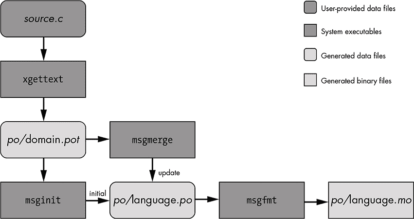

## 本地化

*当我在解决问题时，我从不考虑美观。我只考虑如何解决问题。但当我完成后，如果解决方案不美观，我知道它是错误的。*

—R. 巴克敏斯特·富勒*


一旦你完成了国际化软件的重大工作，你就可以开始考虑为其他语言和文化构建消息目录。构建特定语言的消息目录被称为*本地化*。你正在为目标区域设置本地化你的软件。我们将在本章讨论 GNU 项目如何处理这些主题，包括如何将消息目录管理集成到 Autotools 构建系统中。

### 入门

消息目录必须存放在应用程序能够找到的位置。可能已经决定，应用程序应该将其特定语言的消息目录存储在每个项目选择的某个位置，但 Linux（以及 Unix，通常也是如此）长期以来一直通过约定悄悄地指导应用程序开发者。这些约定不仅避免了开发者反复做出相同的决策，而且尽可能地最大化了重用的潜力。为此，消息目录的约定位置是将它们放在系统数据目录下的公共目录中——*GNU 编码标准*所称的`datadir`——通常定义为`$(prefix)`*/share*.^(1) 一个特殊的目录`$(datadir)`*/locale*，存放所有应用程序的消息目录，并以一种为用户提供一些好功能的格式呈现。

#### *语言选择*

我在第十一章中提到过，当前语言的应用程序选择，以及由应用程序使用的消息目录，是分两阶段完成的。我已经讨论过程序员阶段。现在让我们转向用户阶段，在这个阶段，用户可以选择所选的消息目录。与选择区域设置类似，消息目录的选择可以通过使用环境变量来指示。以下环境变量用于选择应用程序将使用的消息目录：

+   `LANGUAGE`

+   `LC_ALL`

+   `LC_`*`xxx`*

+   `LANG`

到目前为止，我们只关注了`LC_ALL`变量，但实际上，应用程序的全局区域设置是通过首先检查`LC_ALL`，然后是特定类别的变量（例如`LC_TIME`），最后是`LANG`，按照这个顺序来选择的。换句话说，如果`LC_ALL`未设置或设置为空字符串，`setlocale`将查找`LC_`*`xxx`*变量（特别是`LC_COLLATE`、`LC_CTYPE`、`LC_MESSAGES`、`LC_MONETARY`、`LC_NUMERIC`和`LC_TIME`），并使用它们的值来确定使用哪些区域设置来处理关联的库功能。最后，如果这些都没有设置，则检查`LANG`。如果`LANG`未设置，则会得到一个实现定义的默认值，这个默认值并不总是与`C`区域设置相同。

除了`setlocale`使用的这些变量外，*gettext*函数首先会查看`LANGUAGE`，如果已设置，`LANGUAGE`会覆盖所有其他变量以选择消息目录。此外，`LANGUAGE`变量中设置的*值*对选择标准有一定影响。在我们深入了解值的格式之前，先来看一下`$(datadir)`*/locale*下的目录结构。如果你自己查看这个目录，可能会看到类似这样的内容：

```
$ ls -1p /usr/share/locale
aa/
ab/
ace/
ach/
af/
all_languages
--snip--
locale.alias
--snip--
sr@ijekavian/
sr@ijekavianlatin/
sr@latin/
sr@Latn/
--snip--
zh_CN/
zh_HK/
zh_TW/
zu/
$
```

这些目录名的格式应该看起来很熟悉——它与“生成和安装语言环境”中定义的语言环境名称格式相同，见 第 303 页。在每个包含消息目录的语言环境目录下（这其实比较稀疏——应用程序本地化并不像你想象的那么普遍），你会找到一个名为*LC_MESSAGES*的目录，里面包含一个或多个*消息对象*（*.mo*）文件，这些是已编译的消息目录。例如，这里是西班牙语（西班牙）的情况：

```
$ tree --charset=ASCII /usr/share/locale/es_ES/LC_MESSAGES
/usr/share/locale/es_ES/LC_MESSAGES
`-- libmateweather.mo

0 directories, 1 file
$
```

如果你检查区域独立的西班牙语语言环境目录 */usr/share/locale/es*，你会看到更多的消息目录。大多数程序在翻译时并不会区分不同的区域语言环境：

```
$ tree --charset=ASCII /usr/share/locale/es/LC_MESSAGES
/usr/share/locale/es/LC_MESSAGES/
|-- apt.mo
|-- apturl.mo
|-- bash.mo
|-- blueberry.mo
|-- brasero.mo
--snip--
|-- xreader.mo
|-- xviewer.mo
|-- xviewer-plugins.mo
|-- yelp.mo
`-- zvbi.mo
$
```

如我之前提到的，消息对象文件的基本名称是拥有应用程序的域名。当你调用`textdomain`和`bindtextdomain`时，你指定的*`domain`*会通过名称选择一个消息对象文件。在这个目录列表中，*blueberry*是使用*blueberry.mo*消息目录的应用程序的消息目录域名。

#### *构建消息目录*

*gettext*库提供了一组工具，帮助你从已国际化的源代码中构建消息目录，以供消息目录选择。图 11-1 描述了数据通过*gettext*工具的流动，从源代码到二进制消息对象。



*图 12-1：从源文件到消息对象文件的数据流*

`xgettext`工具从编程语言源文件中提取消息，并构建一个*可移植对象模板*（*.pot*）文件。每当源文件中的消息字符串发生更改或更新时，都会执行此操作。可能是现有消息被修改或删除，或者添加了新的消息。无论如何，*.pot*文件必须更新。*.pot*文件通常以包或程序使用的消息目录域名命名。

假设我们为法语语言环境在一个项目中创建了消息目录，那么此过程将在当前目录下生成文件，但我们将遵循一种常见的约定，将所有消息文件生成到项目根目录下的一个名为*po*的目录中：

```
project/
   po/
      fr.mo
      fr.po
      project.pot
```

我示例中*po*目录的内部结构是任意的——你可以告诉*gettext*工具如何命名输出文件，并可以将其放在任何你喜欢的位置。我选择这个结构是因为我们将在本章稍后将*gettext*与 Autotools 项目集成时使用这种结构。

让我们为第 11-12 节中`gt`程序的源代码生成一个*.pot*文件，见第 328 页：

```
$ mkdir po
$ cd po
$ xgettext -k_ -c -s -o gt.pot ../gt.c
$ cat gt.pot
# SOME DESCRIPTIVE TITLE.
# Copyright (C) YEAR THE PACKAGE'S COPYRIGHT HOLDER
# This file is distributed under the same license as the PACKAGE package.
# FIRST AUTHOR <EMAIL@ADDRESS>, YEAR.
#
#, fuzzy
msgid ""
msgstr ""
"Project-Id-Version: PACKAGE VERSION\n"
"Report-Msgid-Bugs-To: \n"
"POT-Creation-Date: 2018-07-12 17:22-0600\n"
"PO-Revision-Date: YEAR-MO-DA HO:MI+ZONE\n"
"Last-Translator: FULL NAME <EMAIL@ADDRESS>\n"
"Language-Team: LANGUAGE <LL@li.org>\n"
"Language: \n"
"MIME-Version: 1.0\n"
"Content-Type: text/plain; charset=CHARSET\n"
"Content-Transfer-Encoding: 8bit\n"

#: ../gt.c:25
#, c-format
msgid "Hello, world!\n"
msgstr ""
$
```

`xgettext`工具被设计用于从许多不同编程语言的源文件中构建*.pot*文件，因此它接受`--language`或`-L`命令行选项作为提示。然而，如果没有提供此类选项，它也会根据文件扩展名猜测语言。

因为`xgettext`被设计成解析许多不同类型的源文件，它有时需要帮助来定位我们希望它提取的消息。它假定要提取的文本与 C 语言中的`gettext`函数以某种方式相关联。对于其他语言的源文件，它会查找该函数名称的适当变体。不幸的是，当我们将`gettext`替换为下划线（`_`）宏名称时，我们给过程带来了麻烦。这时，可以使用`--keyword`（`-k`）选项告诉`xgettext`在哪里查找要提取的消息文本。我们使用`-k_`使`xgettext`查找`_`而不是`gettext`。如果没有这个选项，`xgettext`将找不到任何消息来提取，因此不会生成*.pot*文件。^(2)

我还告诉它添加注释（`-c`）并在将信息添加到*.pot*文件时按顺序排序输出消息（`-s`）。如果你没有另行指定（使用`-o`选项），它会创建一个名为*messages.po*的文件。没有与命令行选项相关联的文件将被`xgettext`视为输入文件。

此时，虽然不是严格要求的，并且取决于你选择使用的工作流，你可能需要手动编辑*gt.pot*，以更新`xgettext`添加的占位符值。例如，你可能想要替换`Project-Id-Version`字段中的`PACKAGE`和`VERSION`占位符字符串，并可能向`Report-Msgid-Bugs-To`字段添加电子邮件地址。这些可以通过使用`--package-name`、`--package-version`和`--msgid-bugs-address`命令行选项在生成时添加。还有一些其他选项，你可以在手册中查找。

从这个模板中，我们现在可以为不同的语言环境生成*portable object*（*.po*）文件。`msginit`工具用于创建特定语言环境的*.po*文件的初始版本，而`msgmerge`用于更新之前通过`msginit`生成的现有*.po*文件。

让我们从我们的模板*gt.pot*创建一个法语*fr.po*文件：

```
$ msginit --no-translator --locale=fr
Created fr.po.
$ cat fr.po
# French translations for PACKAGE package.
# Copyright (C) 2019 THE PACKAGE'S COPYRIGHT HOLDER
# This file is distributed under the same license as the PACKAGE package.
# Automatically generated, 2019.
#
msgid ""
msgstr ""
"Project-Id-Version: PACKAGE VERSION\n"
"Report-Msgid-Bugs-To: \n"
"POT-Creation-Date: 2019-07-02 23:19-0600\n"
"PO-Revision-Date: 2019-07-02 23:19-0600\n"
"Last-Translator: Automatically generated\n"
"Language-Team: none\n"
"Language: fr\n"
"MIME-Version: 1.0\n"
"Content-Type: text/plain; charset=ASCII\n"
"Content-Transfer-Encoding: 8bit\n"
"Plural-Forms: nplurals=2; plural=(n > 1);\n"

#: ../gt.c:21
#, c-format
msgid "Hello, world!\n"
msgstr ""
$
```

如果你没有指定任何输入或输出文件，它会在当前目录中查找*.pot*文件，并根据你通过`--locale`（`-l`）选项指定的语言环境派生输出文件名。我还添加了`--no-translator`选项，以抑制该工具的交互式功能。如果你不加这个选项，`msginit`会尝试在本地主机上找到你的电子邮件地址并使用它。如果它搞不清楚，它会停止并询问你使用哪个地址。

除了指定或隐含的*.pot*文件，它还会检查指定源文件附近的 makefile 和其他构建文件，以查看项目可能的名称。你在输出中看到的项目名称`PROJECT`是它在找不到项目名称时使用的默认名称，但你会惊讶于`msginit`在搜索项目名称时的彻底程度。

现在，这个*.po*文件还没有任何法语内容——希望事情能那么简单！不，您仍然需要手动将字符串从英语翻译成法语。那么这个*.po*文件与其源模板文件有什么不同呢？实质上，模板中与特定语言实现相关的所有内容已经填写，包括顶部注释中的标题和版权年份，以及`PO-Revision-Date`、`Last-Translator`、`Language-Team`、`Language`和`Plural-Forms`字段。

该过程的下一步是实际翻译文件。通常，我会找一个英语水平不错的法语母语者，让他们帮我填写空白。由于`gt`的简单消息几乎不可能误用互联网翻译工具，所以我自己查找并将文件底部的`msgstr`字段设置为`"Bonjour le monde!\n"`。

翻译完成后，*.po*文件会通过`msgfmt`工具生成地区特定的*消息对象*（*.mo*）文件。让我们为*fr.po*做这个：

```
$ msgfmt -o fr.mo fr.po
$ ls -1p
fr.mo
fr.po
gt.pot
$
```

`msgfmt`有很多选项可以使用。对于我们的例子，默认的功能已经足够。尽管如此，我仍然指定了输出文件（使用`-o`），因为默认的输出文件是*messages.mo*，而我想明确说明这是法语的消息文件。

为了测试我们的法语消息目录，我们可以将*fr.mo*复制到*/usr/local/share/locale/fr/LC_MESSAGES/gt.mo*，然后以 root 身份执行`gt`，并将`LANGUAGE`变量设置为`fr`，但更简单的方法是使用我为`gt`添加的一个小技巧，这让我们可以构建一个将当前目录视为`localedir`的版本。

**注意**

*我将输出文件命名为* fr.mo，*但安装的消息文件必须根据项目或程序的消息域命名*——在此案例中是 gt——*因此，在安装时* fr.mo *应该重命名为* gt.mo。*它被安装到`localedir`的特定语言子目录中，因此通过文件系统中的位置，.mo 文件的法语特性在安装后得以保持。*

首先，让我们本地安装*fr.mo*文件，然后重新构建`gt`，使其查找当前目录而不是系统数据目录。然后，我们将以英语和法语地区设置运行`gt`，如下所示：

```
$ cd ..
$ mkdir -p fr/LC_MESSAGES
$ cp po/fr.mo fr/LC_MESSAGES/gt.mo
$ gcc -DTEST_L10N gt.c -o gt
$ ./gt
Hello, world!
$ LANGUAGE=french ./gt
Bonjour le monde!
$
```

这个控制台示例应该引发一些疑问：为什么我使用`LANGUAGE`而不是`LC_ALL`？我怎么能用`french`而不是`fr`作为`LANGUAGE`的值而不引发`gt`在寻找法语版本的*gt.mo*时的麻烦？

为了回答第一个问题，我在这里不能使用`LC_*`或`LANG`变量，因为我的系统上没有安装任何法语区域，且这些变量仅用于设置区域，剩下的`textdomain`和`bindtextdomain`则根据`localeconv`（或者更准确地说，是该结构的一个更广泛的内部形式）返回的结构来确定区域。由于我没有安装任何法语区域，`setlocale`无法根据`LANG`或`LC_*`变量的值设置区域，因此它会将当前全局区域保持为系统默认的区域——在我的主机上是英语。因此，使用的语言将继续是英语。

对第二个问题的回答将我们带回到我在《语言选择》一节中所做的一个尚未被证明的陈述，在第 332 页中，我提到用户在`LANGUAGE`变量中设置的*值*对`textdomain`和`bindtextdomain`使用的选择标准有一定的影响。*gettext*库允许用户在请求的区域在系统中不可用时选择*后备*消息目录。这是通过在`LANGUAGE`变量中比在其他变量中使用更*不具体*的值来实现的，后者是`setlocale`检查的变量。`LANGUAGE`支持的值格式可以完全复制`LC_*`和`LANG`中要求的严格格式，但它也支持带有缺失组件的区域名称和语言别名。

首先，让我们考虑一下我所说的缺失组件是什么意思。回想一下区域名称的组件：

```
language[_territory][.codeset][@modifier]
```

`bindtextdomain`函数尝试在指定的区域目录中找到与此完整格式匹配的消息目录，该格式由`LANGUAGE`变量或`localeconv`提供的当前区域字符串指定。然后它会退回，首先去掉*`codeset`*，然后是*`codeset`*的标准化形式^3，接着是*`territory`*，最后是*`modifier`*。如果所有组件都被去除，我们将只剩下区域名称的*`language`*部分（或者在`LANGUAGE`中指定的任何其他随机文本）。如果仍然找不到匹配项，`bindtextdomain`会查看*/usr/share/locale/locale.alias*文件，寻找与`LANGUAGE`中值匹配的别名（在我的系统上，`french`是`fr_FR.ISO-8859-1`的别名）。这个算法允许用户在选择消息目录时比较模糊，甚至在没有完全匹配当前区域的情况下，仍然能获取到一个相对接近其母语的消息目录。

### 将 gettext 与 Autotools 集成

到目前为止，本章中我一直在通过命令行使用`gcc`构建像`gt`这样的简单工具和程序。现在是时候将`gt`转变为一个 Autotools 项目，以便我们可以按照 GNU 项目推荐的方式添加*本地语言支持（NLS）*功能。实际上，走这条路是最好的，因为它允许那些喜欢做这类事情、并且喜欢你程序的翻译人员更轻松地为他们的语言添加消息目录。

本节中的信息大部分摘自*GNU gettext 工具手册*的第十三部分，“维护者视角”。^(4) 由于涉及 Autotools 以及*gettext*包本身，*gettext*手册的内容有些过时，但它在国际化和本地化的主题上组织得很好，且非常详细。事实上，它内容如此全面，以至于在掌握一些基础知识之前很难完全理解。我的目标是在本章中提供你需要的背景，以便你可以毫无畏惧地深入阅读*gettext*手册。实际上，本章仅轻微地涉及了手册中详细阐述的许多话题。

让我们将*gt.c*文件移动到项目的*src*目录中，并创建*configure.ac*、*Makefile.am*以及其他 GNU 要求的文本文件。假设你当前位于原始*gt.c*文件所在的目录，执行以下操作：

Git 标签 12.0

```
$ mkdir -p gettext/src
$ mv gt.c gettext/src
$ cd gettext
$ autoscan
$ mv configure.scan configure.ac
$ touch NEWS README AUTHORS ChangeLog
$
```

*Makefile.am*文件应与清单 12-1 中所示的文件相似。

```
bin_PROGRAMS = src/gt
src_gt_SOURCES = src/gt.c
src_gt_CPPFLAGS = -DLOCALE_DIR=\"$(datadir)/locale\"
```

*清单 12-1:* Makefile.am: *此 Automake 输入文件的初始内容*

我添加了特定于目标的`CPPFLAGS`，以便我可以在编译命令行中传递`LOCALE_DIR`。我们还应该编辑我们的*src/gt.c*文件，并向其中添加*config.h*头文件，这样我们就可以访问我们在其中定义的`LOCALE_DIR`变量。清单 12-2 显示了我们需要进行的更改。你还可以删除`TEST_L10N`的临时代码；我们将不再需要这个，因为我们可以通过本地安装来测试 Autotools 构建的`gt`。

```
#include "config.h"

#include <stdio.h>
#include <locale.h>
#include <libintl.h>

#ifndef LOCALE_DIR
# define LOCALE_DIR "/usr/local/share/locale"
#endif

#define _(x) gettext(x)
--snip--
```

*清单 12-2:* src/gt.c: *配置`LOCALE_DIR`所需的更改*

现在编辑新的*configure.ac*文件，并进行清单 12-3 中所示的更改。

```
#                                               -*- Autoconf -*-
# Process this file with autoconf to produce a configure script.

AC_PREREQ([2.69])
AC_INIT([gt], [1.0], [gt-bugs@example.org])
AM_INIT_AUTOMAKE([subdir-objects])
AC_CONFIG_SRCDIR([src/gt.c])
AC_CONFIG_HEADERS([config.h])
AC_CONFIG_MACRO_DIRS([m4])

# Checks for programs.
AC_PROG_CC

# Checks for libraries.

# Checks for header files.
AC_CHECK_HEADERS([locale.h])

# Checks for typedefs, structures, and compiler characteristics.

# Checks for library functions.
AC_CHECK_FUNCS([setlocale])

AC_CONFIG_FILES([Makefile])

AC_OUTPUT
```

*清单 12-3:* configure.ac: *对`autoscan`生成的*.scan*文件所需的更改*

请注意，在清单 12-3 中的`AC_CHECK_HEADERS`行中，删除了一些头文件引用。

到此为止，你应该能够执行`autoreconf -i`，然后执行`configure`和`make`来构建`gt`：

```
$ mkdir m4
$ autoreconf -i
configure.ac:12: installing './compile'
configure.ac:6: installing './install-sh'
configure.ac:6: installing './missing'
Makefile.am: installing './INSTALL'
Makefile.am: installing './COPYING' using GNU General Public License v3 file
Makefile.am:     Consider adding the COPYING file to the version control system
Makefile.am:     for your code, to avoid questions about which license your project uses
Makefile.am: installing './depcomp'
$ ./configure && make
--snip--
configure: creating ./config.status
config.status: creating Makefile
config.status: creating config.h
config.status: config.h is unchanged
config.status: executing depfiles commands
make  all-am
make[1]: Entering directory '/.../gettext'
depbase=`echo src/gt.o | sed 's|[^/]*$|.deps/&|;s|\.o$||'`;\
gcc -DHAVE_CONFIG_H -I.      -g -O2 -MT src/gt.o -MD -MP -MF $depbase.Tpo -c -o src/gt.o src/gt.c &&\
mv -f $depbase.Tpo $depbase.Po
gcc  -g -O2   -o src/gt src/gt.o
make[1]: Leaving directory '/.../gettext'
$
```

**注意**

*我在运行*`autoreconf`*之前创建了 m4 目录，因为*`autoreconf`*在找到*`AC_CONFIG_MACRO_DIRS`*时会抱怨 m4 目录不存在。*它仍然可以工作，但会警告你该目录丢失。提前创建它只是为了减少噪音。*

在增强现有的 Autotools 项目以支持 NLS 和*gettext*时，第一步是将一堆*gettext*特定的文件添加到你的项目中。这其实是一个相当繁琐的过程，因此*gettext*团队创建了一个叫做`gettextize`的小工具，它工作得相当不错。当你运行`gettextize`时，它会进行一些小的分析，将一堆文件丢到项目的*po*目录中（如果还没有的话，它会创建一个），然后在控制台显示一个六到七步的过程。为了确保你不会忽略这个输出，它会等你按回车键终止程序，并在过程中获得你承诺阅读并执行这些步骤。不幸的是，这些指示有点过时——并非所有步骤都是必需的，而且如果你使用的是完整的 Autotools 套件，有些步骤甚至不适用。像许多与 Autotools 集成的程序一样，*gettext*是为了仅使用 Autoconf 的包和使用完整 Autotools 套件的程序而编写的。我会在接下来的内容中解释哪些步骤是重要的。

让我们从在我们的 gt 项目目录中运行`gettextize`开始：

Git 标签 12.1

```
   $ gettextize
➊ Creating po/ subdirectory
   Copying file ABOUT-NLS
   Copying file config.rpath
   Not copying intl/ directory.
   Copying file po/Makefile.in.in
   Copying file po/Makevars.template
   Copying file po/Rules-quot
   Copying file po/boldquot.sed
   Copying file po/en@boldquot.header
   Copying file po/en@quot.header
   Copying file po/insert-header.sin
   Copying file po/quot.sed
   Copying file po/remove-potcdate.sin
   Creating initial po/POTFILES.in
   Creating po/ChangeLog
   Copying file m4/gettext.m4
   Copying file m4/iconv.m4
   Copying file m4/lib-ld.m4
   Copying file m4/lib-link.m4
   Copying file m4/lib-prefix.m4
   Copying file m4/nls.m4
   Copying file m4/po.m4
   Copying file m4/progtest.m4
➋ Updating Makefile.am (backup is in Makefile.am~)
   Updating configure.ac (backup is in configure.ac~)
   Adding an entry to ChangeLog (backup is in ChangeLog~)

➌ Please use AM_GNU_GETTEXT([external]) in order to cause autoconfiguration
   to look for an external libintl.

➍ Please create po/Makevars from the template in po/Makevars.template.
   You can then remove po/Makevars.template.

➎ Please fill po/POTFILES.in as described in the documentation.

➏ Please run 'aclocal' to regenerate the aclocal.m4 file.
   You need aclocal from GNU automake 1.9 (or newer) to do this.
   Then run 'autoconf' to regenerate the configure file.

➐ You will also need config.guess and config.sub, which you can get from the
   CVS of the 'config' project at http://savannah.gnu.org/. The commands to fetch
   them are
   $ wget 'http://savannah.gnu.org/cgi-bin/viewcvs/*checkout*/config/config/
   config.guess'
   $ wget 'http://savannah.gnu.org/cgi-bin/viewcvs/*checkout*/config/config/
   config.sub'

➑ You might also want to copy the convenience header file gettext.h
   from the /usr/share/gettext directory into your package.
 It is a wrapper around <libintl.h> that implements the configure --disable-nls
   option.

   Press Return to acknowledge the previous 6 paragraphs.
   [ENTER]
   $
```

`gettextize`做的第一件事是创建一个*po*子目录（在➊位置）在我们的项目根目录中，如果需要的话。这里将保存所有与 NLS 相关的文件，并由一个特定于 NLS 的 makefile 进行管理，`gettextize`也提供了这个 makefile，正如你可以从输出的前几行中看到的第三条`Copying file`消息。

在将文件从系统的*gettext*安装文件夹复制到*po*目录后，接着它会更新根目录的*Makefile.am*文件和*configure.ac*（在➋位置）。Listings 12-4 和 12-5 展示了它对这些文件所做的更改。

```
bin_PROGRAMS = src/gt
src_gt_SOURCES = src/gt.c src/gettext.h
src_gt_CPPFLAGS = -DLOCALE_DIR=\"$(localedir)\"

SUBDIRS = po

ACLOCAL_AMFLAGS = -I m4

EXTRA_DIST = config.rpath
```

*Listing 12-4:* Makefile.am: *`gettextize`对该文件的更改*

一个`SUBDIRS`变量被添加（或者如果已存在则更新）到顶级*Makefile.am*文件中，以便`make`会处理*po/Makefile*，并且添加了`AC_LOCAL_AMFLAGS`以支持*m4*目录，这是`gettextize`本应添加的，如果我们没有先这样做的话。最后，`gettextize`会添加一个`EXTRA_DIST`变量，确保*config.rpath*能够被分发。

**注意**

*添加*`AC_LOCAL_AMFLAGS = -I m4`*在 Automake 的较新版本中不再必要，因为它提供了*`AC_CONFIG_MACRO_DIRS`*宏，能够透明地处理这个包含指令用于*`aclocal`*。*

我手动将`$(datadir)`*/locale*改为 Autoconf 提供的`$(localedir)`，并更新了`src_gt_CPPFLAGS`行。

```
#                                               -*- Autoconf -*-
# Process this file with autoconf to produce a configure script.
--snip--
# Checks for library functions.
AC_CHECK_FUNCS([setlocale])

AC_CONFIG_FILES([Makefile po/Makefile.in])

AC_OUTPUT
```

*Listing 12-5:* configure.ac: *`gettextize`对该文件的更改*

`gettextize` 对 *configure.ac* 做的唯一更改是将 *po/**Makefile.in* 文件添加到 `AC_CONFIG_FILES` 文件列表中。一个敏锐的读者会注意到这个引用的末尾有一个 *.in*，可能会认为 `gettextize` 出了错。然而，回头看看该工具复制的文件列表，我们会发现复制到 *po* 目录中的文件确实叫做 *Makefile.in.in*。Autoconf 首先处理这个文件，然后 *gettext* 工具再次处理它，去掉第二个 *.in* 后缀。

回到 `gettextize` 的输出，我们看到在 ➌ 处，`gettextize` 正在要求我们在 *configure.ac* 中添加一个宏调用，`AM_GNU_GETTEXT([external])`。这可能看起来很奇怪，因为它刚刚为我们编辑了 *configure.ac*。显示的文本在这一点上并不清楚，但实际上，曾经有一个完整的 *gettext* 运行时是根据需求添加到项目中的。这一行只是告诉我们，如果我们不打算使用这种内部版本的 *gettext* 库，我们应该通过在调用此宏时使用 `external` 选项来表明这一点，这样 `configure` 就会知道去项目外部查找 *gettext* 工具和库。实际上，使用 *gettext* 库的内部版本现在一般不再推荐——主要是因为 *gettext* 现在已经集成到了 *libc* 中（至少在 Linux 系统上是这样），因此每个人都可以轻松访问外部版本的 *gettext*。如果你使用的是另一种类型的系统，并且使用 GNU 工具，你应该安装 *gettext* 包，以便使用那个外部版本。

我还注意到，当我添加这个宏时，`autoreconf` 报告我使用了 `AM_GNU_GETTEXT` 但没有使用 `AM_GETTEXT_VERSION`，它会告诉构建系统可以与此项目一起使用的 *gettext* 最低版本。我也添加了这个宏，并设置了与我系统中 `gettext --version` 输出相对应的版本值。我本可以使用一个较低的版本值，以便让我的项目能够在其他可能较旧的系统上构建，但我必须做些研究以确保我使用的所有选项在我选择的版本下都是有效的。

列表 12-6 显示了对 *configure.ac* 的这次添加。

```
--snip--
# Checks for programs.
AC_PROG_CC
AM_GNU_GETTEXT_VERSION([0.19.7])
AM_GNU_GETTEXT([external])

# Checks for libraries.
--snip--
```

*列表 12-6:* configure.ac: *添加 `AM_GNU_GETTEXT`*

下一步，在➍中，表示我们应该将 *po/Makevars.template* 复制到 *po/Makevars* 并编辑它以确保值是正确的。我说“复制”而不是“移动”，因为移除模板会导致它在下次运行 `autoreconf -i` 时被替换掉，所以对这点纠结没有意义。

列表 12-7 显示了该文件的精简版——我删除了注释，这样我们可以更容易地看到功能性内容，但注释非常详尽且非常有用，所以请一定查看完整的文件。

```
DOMAIN = $(PACKAGE)
subdir = po
top_builddir = ..
XGETTEXT_OPTIONS = --keyword=_ --keyword=N_
COPYRIGHT_HOLDER = John Calcote
PACKAGE_GNU = no
MSGID_BUGS_ADDRESS = gt-bugs@example.org
EXTRA_LOCALE_CATEGORIES =
USE_MSGCTXT = no
MSGMERGE_OPTIONS =
MSGINIT_OPTIONS =
PO_DEPENDS_ON_POT = no
DIST_DEPENDS_ON_UPDATE_PO = yes
```

*列表 12-7:* po/Makevars.template: *控制 NLS 构建的变量列表*

我已突出显示我对 gt 版本文件所做的更改。如你所见，默认设置大多数情况下是没问题的。我将版权持有者从默认的`Free Software Foundation`更改为其他名称。我还指出，gt 不是 GNU 包——这里的默认值是空白，这意味着*gettext*会尝试在运行时确定该信息。

我为`MSGID_BUGS_ADDRESS`指定了一个值，这是生成的*.pot*文件中的一个值。*po*目录的 makefile 生成的值将是你在此处指定的电子邮件地址（或网页链接）。最后，我将`PO_DEPENDS_ON_POT`设置为`no`，因为否则，每当*gt.pot*文件发生细微变化时，所有特定语言环境的*.po*文件都会重新生成，而我更倾向于仅在创建分发包时生成我的项目中的*.po*文件。这是一个基于个人偏好的任意决定；如果你愿意，也可以选择保留其默认值`yes`。

在➎处，我们看到要求向*po/POTFILES.in*添加一些文本。这是 Automake 要求在 makefile 中指定所有源文件的结果。我们被要求添加所有必须由`xgettext`处理的源文件，以提取消息。文件可以一行一行地添加，如果需要，该文件中可以使用以井号（`#`）开头的注释。Listing 12-8 突出显示了我对 gt 版本的*po/POTFILES.in*所做的更改。

```
# List of source files that contain translatable strings.
src/gt.c
```

*Listing 12-8:* po/POTFILES.in: *对该文件生成版本所做的更改*

*po/POTFILES.in*中列出的文件应该相对于项目目录根目录。

在➏和➐列出的步骤，在新版本的 Autotools 中已经不再需要。`configure`脚本在执行时会自动运行`aclocal`并在必要时重新构建自身。*config.sub*和*config.guess*文件现在会由`autoreconf`根据使用*gettext*宏来自动安装。不幸的是，`autoreconf`安装的是与 Autoconf 一起提供的这些文件版本；它们可能已经过时，因此仍然建议找到并安装最新版本。如果需要的话，可以使用提供的`wget`命令从 GNU Savannah *config*仓库中获取这些文件的最新版本。如果*gettext*在使用`autoreconf`安装的版本时遇到问题，它可能无法识别你的平台。确保在完成这些步骤后，再运行`autoreconf -i`至少一次。

在➑处要求复制和使用*gettext.h*是可选的，但在我看来是有帮助的，因为它启用了由*gettext* Autoconf 宏添加的`configure`脚本选项，允许用户在从分发档案构建时禁用 NLS 处理。我将*/usr/share/gettext/gettext.h*复制到 gt 的*src*目录，并将其添加到`gt`程序在*Makefile.am*中的源文件列表中，如 Listing 12-9 所示。

```
bin_PROGRAMS = src/gt
src_gt_SOURCES = src/gt.c src/gettext.h
--snip--
```

*Listing 12-9:* Makefile.am: *将 src/gettext.h 添加到`src_gt_SOURCES`中*

让我们在进行所有这些更改后尝试构建：

```
$ autoreconf -i
Copying file ABOUT-NLS
Copying file config.rpath
Creating directory m4
Copying file m4/codeset.m4
Copying file m4/extern-inline.m4
Copying file m4/fcntl-o.m4
--snip--
Copying file po/insert-header.sin
Copying file po/quot.sed
Copying file po/remove-potcdate.sin
configure.ac:12: installing './compile'
configure.ac:13: installing './config.guess'
configure.ac:13: installing './config.sub'
configure.ac:6: installing './install-sh'
configure.ac:6: installing './missing'
Makefile.am: installing './depcomp'
$
$ ./configure
checking for a BSD-compatible install... /usr/bin/install -c
checking whether build environment is sane... yes
checking for a thread-safe mkdir -p... /bin/mkdir -p
--snip--
checking for locale.h... yes
checking for setlocale... yes
checking that generated files are newer than configure... done
configure: creating ./config.status
config.status: creating Makefile
config.status: creating po/Makefile.in
config.status: creating config.h
config.status: executing depfiles commands
config.status: executing po-directories commands
config.status: creating po/POTFILES
config.status: creating po/Makefile
$
$ make
make    all-recursive
make[1]: Entering directory '/.../gettext'
Making all in po
make[2]: Entering directory '/.../gettext/po'
make gt.pot-update
make[3]: Entering directory '/.../gettext/po'
--snip--
case `/usr/bin/xgettext --version | sed 1q | sed -e 's,^[⁰-9]*,,'` in \
  ‘’ | 0.[0-9] | 0.[0-9].* | 0.1[0-5] | 0.1[0-5].* | 0.16 | 0.16.[0-1]*) \
    /usr/bin/xgettext --default-domain=gt --directory=.. \
      --add-comments=TRANSLATORS: --keyword=_ --keyword=N_    \
      --files-from=./POTFILES.in \
      --copyright-holder='John Calcote' \
      --msgid-bugs-address="$msgid_bugs_address" \
    ;; \
  *) \
    /usr/bin/xgettext --default-domain=gt --directory=.. \
      --add-comments=TRANSLATORS: --keyword=_ --keyword=N_    \
      --files-from=./POTFILES.in \
      --copyright-holder='John Calcote' \
      --package-name="${package_prefix}gt" \
      --package-version='1.0' \
      --msgid-bugs-address="$msgid_bugs_address" \
    ;; \
esac
--snip--
make[3]: Leaving directory '/.../gettext/po'
test ! -f ./gt.pot || \
  test -z "" || make
touch stamp-po
make[2]: Leaving directory '/.../gettext/po'
make[2]: Entering directory '/.../gettext'
gcc -DHAVE_CONFIG_H -I.  -DLOCALE_DIR=\"/usr/local/share/locale\"    -g -O2
-MT src/src_gt-gt.o -MD -MP -MF src/.deps/src_gt-gt.Tpo -c -o src/src_gt-gt.o
`test -f 'src/gt.c' || echo './'`src/gt.c
mv -f src/.deps/src_gt-gt.Tpo src/.deps/src_gt-gt.Po
gcc   -g -O2   -o src/gt src/src_gt-gt.o
make[2]: Leaving directory '/.../gettext'
make[1]: Leaving directory '/.../gettext'
$
```

**注意**

*某些极端情况可能导致由*`autoreconf`*编写的文件被视为“本地修改”，这样没有*`-f`*或*`--force`*标志就会生成错误。我建议你先尝试仅使用*`-i`*。如果你遇到像*ABOUT-NLS*之类的文件被本地修改的错误，那么重新执行时加上*`-f`*标志。只需注意，*`-f`*会覆盖你可能故意修改的某些文件。*

如你从此输出中看到的那样，`xgettext`会对我们的源代码运行——特别是我们在*po/POTFILES.in*中提到的文件——每当我们进行构建时，如果构建时缺少任何文件。如果找到文件，它不会自动重新构建，但我稍后会提到一个手动的`make`目标。

#### *什么应该提交？*

我们为 gt 项目添加了很多新文件。在第 172 页的《关于实用脚本的一些话》中，我给出了关于应提交到源仓库的内容的哲学观点：从仓库中检出你的项目的人应该愿意担任维护者或开发者的角色，而不是用户。用户从发行包中构建，但维护者和开发者使用的是一套不同的工具。因此，从仓库检出源代码的人应该愿意使用 Autotools。

现在是考虑哪些新文件应该提交到 gt 的仓库的时候了。按照我的哲学，我只会提交那些实际上是项目资产的文件。任何在 Autotools 引导过程中（`autoreconf` `-i`）可以轻松重新生成或从其他来源重新复制的文件应该被排除在外。

`gettextize`工具运行一个名为`autopoint`的程序，它对启用了 NLS 的项目的作用就像`autoreconf -i`对 Autotools 项目的作用一样，按照需要将文件复制到项目目录结构中。我们之前添加到*configure.ac*中的`AM_GETTEXT_*`宏确保了适当的*.m4*文件被添加到*m4*目录，适当的 NLS 文件被添加到*po*目录，且（如果你使用的是内部版本的*gettext*库）*gettext*源代码和构建文件被添加到*intl*目录。实际上，`autopoint`是短语*auto-po-intl-m4*的缩写。更新版本的`autoreconf`能够识别`autopoint`，并且会在你使用启用 NLS 的项目时执行它，但前提是你向`autoreconf`提供了`-i`选项，因为`autopoint`仅安装缺失的文件，而文件安装是`-i`选项的一个功能。

因为 `autopoint` 会将所有需要的非资产文件安装到你的 *po* 目录中，所以你只需要提交该目录中你修改过的文件，包括 *POTFILES.in*、*Makevars*、*ChangeLog*、^(6) 以及，当然，你的 *.po* 文件。你不需要提交你的 *.pot* 文件，因为 *po/Makefile* 会根据源代码重新生成它（如果它缺失的话）。你不需要提交 *.mo* 文件，因为这些文件会在安装时直接从 *.po* 文件生成。除非你修改了 *ABOUT-NLS* 文件，否则你不需要提交它。你不需要提交 *m4* 目录中的任何文件，除非是你自己编写并添加的宏文件。你需要提交 *src/gettext.h* 文件，因为你是手动从系统的 *gettext* 安装目录中复制的那个文件。^(7)

这时我们在 gt 的目录结构中剩下以下文件：

```
$ tree --charset=ascii
.
|-- AUTHORS
|-- ChangeLog
|-- configure.ac
|-- COPYING
|-- INSTALL
|-- Makefile.am
|-- NEWS
|-- po
|    |-- ChangeLog
|    |-- Makevars
|    `-- POTFILES.in
|-- README
`-- src
    |-- gettext.h
    `-- gt.c

2 directories, 13 files
$
```

#### *添加语言*

让我们添加我们的法语 *.po* 文件：

Git 标签 12.2

```
2$ cd po
$ msginit --locale fr_FR.utf8
--snip--
$ echo "
fr" >>LINGUAS
$
```

虽然我们运行了 `msginit`，但无需指定输入和输出文件。相反，`msginit` 会自动发现并使用当前目录中的所有 *.pot* 文件作为输入文件，并且会根据指定的语言自动命名输出的 *.po* 文件。我们唯一需要使用的选项是 `--locale` 选项，用于指定应该生成 *.po* 文件的目标语言环境。

**注意**

*这次我没有使用* `--no-translator` *选项，因为当我运行* msginit *时，我是以目标语言的翻译者身份进行操作。也就是说，运行* `msginit` *的人应该是该语言的翻译者。因此，这个人还应该愿意提供翻译联系信息，在这种方式下运行* `msginit` *时，他们可以在交互提示中输入他们的电子邮件地址。*

我们还需要将所有支持的语言添加到 *po* 目录中的名为 *LINGUAS* 的文件中（这个新文件也应该被提交）。这告诉构建系统要支持哪些语言。我们实际上可能在 *po* 目录中有比当前支持的更多语言。*LINGUAS* 文件中的语言是那些在运行 `make install` 时，将生成并安装 *.mo* 文件的语言。*LINGUAS* 的格式相当松散；你只需要在语言之间留一些空白。你也可以使用以哈希符号开头的注释，如果你需要的话。

现在你会在 *po* 目录中找到一个名为 *fr.po* 的文件。当然，这个文件仍然需要由精通两种语言的人翻译。翻译后，内容应该类似于 示例 12-10 的样子。我已经更新了我的文件，填补了所有空白，可以这么说。

```
# French translations for gt package.
# Copyright (C) 2019 John Calcote
# This file is distributed under the same license as the gt package.
# John Calcote <john.calcote@gmail.com>, 2019.
#
msgid ""
msgstr ""
"Project-Id-Version: gt 1.0\n"
"Report-Msgid-Bugs-To: gt-bugs@example.org\n"
"POT-Creation-Date: 2019-07-02 01:17-0600\n"
"PO-Revision-Date: 2019-07-02 01:35-0600\n"
"Last-Translator: John Calcote <john.calcote@gmail.com>\n"
"Language-Team: French\n"
"Language: fr\n"
"MIME-Version: 1.0\n"
"Content-Type: text/plain; charset=UTF-8\n"
"Content-Transfer-Encoding: 8bit\n"
"Plural-Forms: nplurals=2; plural=(n > 1);\n"

#: src/gt.c:21
#, c-format
msgid "Hello, world!\n"
msgstr "Bonjour le monde!\n"
```

*示例 12-10:* po/fr.po: *已翻译的法语可移植对象文件*

#### *安装语言文件*

安装语言文件并不比运行带有常规 Automake 提供的 `install` 目标的 `make` 命令更难：

```
$ sudo make install
--snip--
Making install in po
--snip--
$
```

你还可以在 `make` 命令行中使用 `DESTDIR` 变量来测试你的安装在本地临时目录中的效果，以查看哪些文件被安装。当然，在执行此操作时，你不需要使用 `sudo`，只要你在 `DESTDIR` 目录中有写权限即可。

测试并不像在 *src* 目录中执行程序那样简单，虽然也不是非常困难。问题在于整个 Linux NLS 系统是为了与已安装的语言文件一起工作而设计的。你需要将文件安装到一个本地前缀目录，例如 `$PWD`*/root*，例如：

```
$ ./configure --prefix=$PWD/root
--snip--
$ make
--snip--
$ make install
--snip--
$ cd root/bin
$ ./gt
Hello, world!
$ LANGUAGE=french ./gt
Bonjour le monde!
$
```

为什么这样有效？因为我们将基于 `prefix` 的语言目录传递给 makefile 中的 *gt.c*，并通过 `gcc` 命令行传递。因此，你使用的 `prefix` 告诉 `gt` NLS 文件将被安装到哪里。

**注意**

*不要在 *`DESTDIR`* 变量上尝试此操作。*`prefix`* 仍然会设置为 /usr/local，但 *`install`* 目标会将所有内容放入 *`$(DESTDIR)/$(prefix)`* 中。语言目录仅基于 *`prefix`*，这会欺骗已构建的软件，使其认为正在安装到 *`$(prefix)`* 中，同时允许打包者将安装过程本地化。*

#### *手动 make 目标*

*gettext* makefile 提供了一些目标，可以从 *po* 目录手动使用（实际上，它们只在 *po* 目录下有效）。如果你想手动更新某个 *.pot* 文件，可以运行 `make` *`domain`*`.update-pot`，其中 *`domain`* 是你在源代码中调用 `textdomain` 和 `bindtextdomain` 时指定的 NLS 域名。

如果你想使用 `msgmerge` 更新翻译后的语言文件，该命令会将来自 *.pot* 文件的新消息合并到特定语言的 *.po* 文件中，你可以运行 `make update-po`。这将更新所有在 *LINGUAS* 中指定的语言的 *.po* 文件。

请注意，*.mo* 文件不是在构建时创建的，而是在安装时创建的。原因是，在安装之前它们是没有用的。如果你真的需要在不安装包的情况下获取 *.mo* 文件，你可以将其安装到本地前缀目录或 `DESTDIR` 临时目录，就像之前所描述的那样。

### 总结

在本章中，我只是浅尝辄止地介绍了如何为项目添加 NLS 支持这一主题。

我跳过了什么？例如，*gettext* 工具中有很多选项可以帮助本地化人员为程序构建语言文件，从而使软件能够合理地显示消息。

另外一个例子是，在 C 语言的典型`printf`语句中，你可能会提供一个英语格式字符串，如 `"There are %d files in the '%s' directory."` 在这个例子中，`%d`和`%s`是用来替代计数和目录名的占位符，但在德语中，翻译后的字符串会变成类似于 `"Im verzeichnis '%s' befinden sich %d dateien."` 甚至一个不懂德语的程序员也能看出问题所在——格式说明符的顺序发生了变化。当然，一种解决方案是使用`printf`更新后的位置格式说明符。

还有许多其他问题你需要考虑；*GNU gettext 工具手册*是一个很好的起点。
