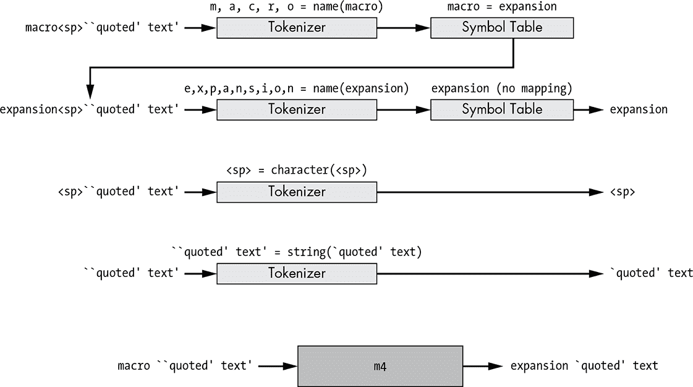

## 第十六章：使用 M4 宏处理器与 Autoconf

*当你将一个复杂的想法拆解成小步骤，甚至傻乎乎的机器都能处理时，你自己也已经对这个想法有了深入的理解。*

—*道格拉斯·亚当斯*，《 Dirk Gently 的全能侦探社》


M4 宏处理器易于使用，但难以理解。简单之处在于它只做一件事，而且做得非常好。我敢打赌，你或我只需几个小时就能用 C 程序编写 M4 的基本功能。与此同时，M4 的两个方面使得它很难立即理解。

首先，M4 在处理输入文本时引入的*特殊情况*使得很难立即掌握它的所有规则，尽管这些复杂性通过时间、耐心和实践可以轻松掌握。其次，M4 的基于栈的先序递归文本处理模型对于人类思维来说难以理解。人类倾向于广度优先处理信息，一次理解问题或数据集的完整层次，而 M4 以深度优先的方式处理文本。

本章涵盖了我认为编写 Autoconf 输入文件所需的最基本知识。我无法在本书的单章中充分介绍 M4，因此我将只讲解一些重点内容。欲了解更多细节，请阅读*GNU M4 手册*。^(1) 如果你已经有一些 M4 的经验，可以尝试手册中的例子，然后试着自己解决一些文本问题。通过少量的实验，你对 M4 的理解将会大大提升。

### M4 文本处理

像许多其他经典的 Unix 工具一样，M4 是作为标准输入/输出（`stdio`）过滤器编写的。也就是说，它接受来自标准输入（`stdin`）的输入，处理后将其发送到标准输出（`stdout`）。输入文本以字节流的形式读取，并在处理前转换为*标记*。标记包括注释、名称、引用字符串和不属于注释、名称或引用字符串的单个字符。

*默认*的引用字符是反引号（`` ` ``）和单引号（`'`）。^(2) 使用反引号开始一个引用字符串，用单引号字符结束一个引用字符串：

```
`A quoted string'
```

M4 注释类似于引用字符串，每个注释都被当作一个单独的标记处理。每个注释由一个井号（`#`）和换行符（`\n`）限定。因此，所有跟在*未引用*的井号之后的文本，直到下一个换行符为止，都被视为注释的一部分。

注释不会像在其他编程语言的预处理器中那样从输出中删除，例如 C 语言的预处理器。相反，它们会被直接传递而不进行进一步处理。

以下示例包含五个标记：一个名称标记，一个空格字符标记，另一个名称标记，第二个空格字符标记，最后是一个单独的注释标记：

```
Two names # followed by a comment
```

*名称*是由字母、数字和下划线字符组成的任何序列，且不能以数字开头。因此，下面示例的第一行包含两个数字字符令牌，后面跟着一个名称令牌，而第二行仅包含一个名称令牌：

```
88North20th_street
_88North20th_street
```

请注意，空白字符（水平和垂直制表符、换页符、回车符、空格和换行符）不是名称的一部分，因此空白字符可能（并且通常会）作为名称或其他令牌的分隔符。然而，这些空白分隔符不会像计算机语言编译器的解析器那样被 M4 丢弃。它们会被直接从输入流传递到输出流，而不做进一步修改。

#### *定义宏*

M4 提供了多种内置宏，其中许多对正确使用此工具至关重要。例如，如果 M4 不提供定义宏的方式，获取任何有用的功能将非常困难。M4 的宏定义宏叫做 `define`。

`define` 宏很简单，可以这样描述：

```
define(macro[, expansion])
```

`define` 宏至少需要一个参数，即使它是空的。如果你只提供一个参数，那么在输入文本中找到的宏名称实例将会被简单地删除：

```
   $ m4
   define(`macro')

   Hello macro world!
➊ Hello   world!
  <ctrl-d>$
```

请注意在 ➊ 处的输出文本中，`Hello` 和 `world!` 之间有两个空格。除了映射到已定义宏的名称外，所有其他令牌都会从输入流传递到输出流而不做修改，只有一个例外：每当从输入流中读取任何引用的文本（评论外），M4 会移除一层引号。

`define` 宏的另一个微妙之处是它的展开结果是空字符串。因此，前面定义的输出仅仅是输入字符串中定义后的回车符。

当然，名称是宏展开的候选项。如果在符号表中找到一个名称令牌，它将被宏展开所替代，如下例所示：

```
   $ m4
➊ define(`macro', `expansion')
➋
   macro ``quoted' macro text'
➌ expansion `quoted' macro text
   <ctrl-d>$
```

第二行输出在 ➌ 处显示，第一个令牌（名称 `macro`）被展开，围绕 ``` ``quoted' macro ``` `text'` 的外部引号被 M4 移除。宏定义后的空行 ➋ 是我在按下回车键后输入流中添加的换行符。由于这个换行符不是宏定义的一部分，M4 会直接将其传递到输出流中。当在输入文本中定义宏时，这可能会成为一个问题，因为你可能会在输出文本中得到一大堆空行，每个宏定义都会生成一个空行。幸运的是，有办法解决这个问题。例如，我可以简单地不输入那个换行符，如下所示：

```
$ m4
define(`macro', `expansion')macro
expansion
<ctrl-d>$
```

这解决了问题，但不需要天才也能看出，这可能会导致一些可读性问题。如果你不得不以这种方式定义宏，以免它们影响输出文本，那么你的输入文本中可能会有一些连贯的句子！

作为该问题的解决方案，M4 提供了另一个内置宏，称为`dnl`，^(3)，它会导致所有输入文本直到并包括下一个换行符被丢弃。通常会在*configure.ac*中看到使用`dnl`，但在 Autoconf 处理*configure.ac*文件时，在*.m4*宏定义文件中使用它更为常见。

这是`dnl`正确使用的示例：

```
$ m4
define(`macro', `expansion')dnl
macro
expansion
<ctrl-d>$
```

有几十个内置的 M4 宏，它们提供了在 M4 中无法通过其他方式获得的功能。一些宏重新定义了 M4 中的基本行为。

例如，`changequote`宏用于将默认的引号字符从反引号和单引号更改为你想要的任何字符。Autoconf 在输入流的顶部附近使用类似以下的行，将 M4 的引号更改为左方括号和右方括号字符：

```
changequote(`[',`]')dnl
```

为什么 Autoconf 的设计者要这样做呢？嗯，在 Shell 代码中，经常会遇到不匹配的单引号对。在 Shell 代码中，反引号和单引号常用于使用相同字符同时开始和结束表达式的情况。这会让 M4 感到困惑，因为 M4 需要打开和关闭的引号字符彼此区分，以便正确处理其输入流。你可能还记得在第四章中提到，Autoconf 的输入文本是 Shell 脚本，这意味着 Autoconf 在读取每个输入文件时，很可能会遇到不匹配的 M4 引号对。这可能会导致非常难以追踪的错误，因为这些错误更多与 M4 相关，而与 Autoconf 无关。而输入的 Shell 脚本包含不匹配的方括号字符的可能性要小得多。

#### *带参数的宏*

宏也可以定义为接受参数，这些参数可以通过`$1`、`$2`、`$3`等在展开的文本中引用。传递的参数数量可以通过变量`$#`找到，而`$@`可以用来将一个宏调用的所有参数传递给另一个宏。当在宏调用中使用参数时，宏名称与左括号之间不能有空格。以下是一个定义并以各种方式调用的宏示例：

```
   $ m4
   define(`with2args', `The $# arguments are $1 and $2.')dnl
➊ with2args
   The 0 arguments are  and .
   with2args()
   The 1 arguments are  and .
➋ with2args(`arg1')
   The 1 arguments are arg1 and .
   with2args(`arg1', `arg2')
   The 2 arguments are arg1 and arg2.
   with2args(`arg1', `arg2', `arg3')
   The 3 arguments are arg1 and arg2.
➌ with2args (`arg1', `arg2')
   The 0 arguments are  and . (arg1, arg2)
   <ctrl-d>$
```

在这个例子中，第一次调用位于➊处，是一个没有参数的宏调用。第二次调用是一个带有一个空参数的宏调用。这样的调用将参数视为实际上传递了空参数。^(4) 在这两种情况下，宏展开为“`这些 N 个参数是和`” （注意最后两个词之间的双空格，以及最后一个词和句号之间的空格），但第一次调用中的“N”是 0，第二次调用中的“N”是 1。因此，第二次调用中的空括号带有一个空的单一参数。接下来的三个调用，从➋开始，分别传递一个、两个和三个参数。正如你从这三次调用的输出中所看到的，展开文本中引用缺失参数的地方被视为空，而没有对应引用的传递参数则会被忽略。

最后的调用，位于➌处，有些不同。注意它在宏名称和左括号之间包含了一个空格。这个调用的初始输出类似于第一次调用的输出，但在初始输出之后，我们发现原本预期的参数列表有一些轻微变化（引号丢失了）。这是一个*没有参数*的宏调用。由于它实际上并不是宏调用的一部分，M4 将参数列表仅视为输入流中的文本。因此，它会被直接复制到输出流中，去掉一层引号。

在宏调用中传递参数时，要注意参数周围的空白符。规则很简单：未加引号的*前导*空白符会从参数中移除，而*尾随*空白符则始终保留，无论是否加引号。当然，*空白符*这里指的是回车符和换行符，以及空格和制表符。以下是一个带有前导和尾随空白符变体的宏调用示例：

```
   $ m4
   define(`with3args', `The three arguments are $1, $2, and $3.')dnl
➊ with3args(arg1,
             arg2,
             arg3)
   The three arguments are arg1, arg2, and arg3.
➋ with3args(arg1
             ,arg2
             ,arg3
             )
   The three arguments are arg1
             , arg2
             , and arg3
             .
   <ctrl-d>$
```

在这个例子中，我故意省略了➊和➋处宏调用中参数周围的引号，以减少混淆。➊处的调用只有前导空白符，包括换行符和制表符，而➋处的调用只有尾随空白符。稍后我会讲解引号规则，到时你会清楚地看到引号是如何影响宏参数中的空白符的。

### M4 的递归特性

现在我们考虑 M4 输入流的递归特性。每当宏定义扩展一个名称标记时，扩展文本会被推回到输入流中进行完全的重新处理。只要输入流中还有生成文本的宏调用，这种递归重新处理就会继续发生。

这是一个例子：

```
$ m4
define(`macro', `expansion')dnl
macro ``quoted' text'
expansion `quoted' text
<ctrl-d>$
```

在这里，我定义了一个名为*macro*的宏，然后在输入流中呈现这个宏名称，后面跟着附加的文本，其中一部分是加了引号的，一部分是加了双引号的。

M4 用于解析这个例子的过程如图 16-1 所示。



*图 16-1：M4 处理输入文本流的过程*

在图的底部，M4 正在生成一串输出文本（``扩展 `引用```'` `text`) from a stream of input text (```宏 ``引用' 文本'```).

The diagram above this line shows how M4 actually generates the output text from the input text. When the first token (`macro`) is read in the top line, M4 finds a matching symbol in the symbol table, pushes it onto the input stream on the second line, and then restarts the input stream. Thus, the very next token read is another name token (`expansion`). Since this name is not found in the symbol table, the text is sent directly to the output stream. The third line sends the next token from the input stream (a space character) directly to the output stream. Finally, in the fourth line, one level of quotes is removed from the quoted text (``` ``引用' 文本' ```), and the result (`` `quoted' text ``) is sent to the output stream.

#### *Infinite Recursion*

As you might guess, there are some potentially nasty side effects of this process. For example, you can accidentally define a macro that is infinitely recursive. The expansion of such a macro would lead to a massive amount of unwanted output, followed by a stack overflow. This is easy to do:

```

$ m4

define(`macro', `这是一个宏')dnl

宏

这是一个这是一个这是一个这是一个这是一个这是一个... <ctrl-c>

$

```

This happens because the macro name expands into text containing the macro’s own name, which is then pushed back onto the input stream for reprocessing. Consider the following scenario: *What would have been the result if I’d left the quotes off of the expansion text in the macro definition? What would have happened if I’d added another set of quotes around the expansion text?* To help you discover the answers to these questions, let’s turn next to M4 quoting rules.

#### *Quoting Rules*

Proper quoting is critical. You have probably encountered situations where your invocations of Autoconf macros didn’t work as you expected. The problem is often a case of under-quoting, which means you omitted a required level of quotes around some text.

You see, each time text passes through M4, a layer of quotes is stripped off. Quoted strings are not names and are therefore not subject to macro expansion, but if a quoted string passes through M4 twice, the second time through, it’s no longer quoted. As a result, individual words within that string are no longer part of a string but instead are parsed as name tokens, which are subject to macro expansion. To illustrate this, enter the following text at a shell prompt:

```

$ m4

define(`def', `DEF')dnl

➊ define(`abc', `def')dnl

abc

DEF

➋ define(`abc', ``def'')dnl

abc

def

➌ define(`abc', ```def''')dnl
   abc
   `def'
   <ctrl-d>$
```

在这个例子中，第一次定义`abc`（见 ➊）时，它被加了引号。随着 M4 处理宏定义，它去除了一个引号层。因此，扩展文本以没有引号的形式存储在符号表中，但它会被推送回输入流，因此由于第一次宏定义，它被转换成了`DEF`。

正如你所看到的，第二次定义`abc`（见 ➋）时，文本是双引号的，因此当定义被处理并且最外层的引号被去除时，我们期望符号表中的扩展文本至少包含一层引号，事实也是如此。那为什么我们没有看到输出文本周围的引号呢？记住，当宏被扩展时，扩展文本会被推送到输入流的前面，并按照通常的规则重新解析。因此，尽管第二次定义的文本在符号表中以引号形式存储，但当它在使用时重新处理时，第二层引号会在输入和输出流之间被去除。

在这个例子中，➊和➋的区别在于，➋的扩展文本被 M4 视为引号文本，而不是潜在的宏名称。引号在定义时被去除，但包含的文本不会再被视为进一步扩展，因为它仍然是被引号包围的。

在`abc`的第三次定义（见 ➌）中，我们终于看到了可能期待的结果：输出文本的带引号版本。扩展文本以双引号的形式进入符号表，因为最外层的引号在定义处理过程中被去除。然后，当宏被使用时，扩展文本会重新处理，并且第二层引号会被去除，最终输出文本只保留一层引号。

如果在使用 Autoconf 中的宏（包括定义和调用）时牢记这些规则，你会发现更容易理解为什么有些事情没有按照你预期的方式工作。*GNU M4 手册*提供了一个简单的经验法则，用于在宏调用中使用引号：对于宏调用中的每一层嵌套括号，都使用一层引号。

### Autoconf 和 M4

`autoconf`程序是一个相当简单的 Shell 脚本。脚本中大约 80%的 Shell 代码仅用于确保 Shell 足够功能强大，可以执行所需的任务。剩下的 20%用于解析命令行选项。脚本的最后一行执行`autom4te`程序，这是一个 Perl 脚本，它充当`m4`工具的包装器。最终，`autom4te`像这样调用`m4`：

```
/usr/bin/m4 --nesting-limit=1024 --gnu --include=/usr/share/autoconf \
--debug=aflq --fatal-warning --debugfile=autom4te.cache/traces.0t \
--trace=AC_CANONICAL_BUILD ... --trace=sinclude \
--reload-state=/usr/share/autoconf/autoconf.m4f aclocal.m4 configure.ac
```

如你所见，M4 正在处理的三个文件是 */usr/share**/autoconf**/autoconf.m4f*、*aclocal.m4* 和 *configure.ac*，按此顺序。

**注意**

*主* .m4f *扩展名的 Autoconf 宏文件表示一个* 冻结的 *M4 输入文件——一种原始* .m4 *文件的预编译版本。当一个冻结的宏文件被处理时，必须在 `--reload-state` 选项后指定，以便让 M4 知道它不是一个普通的输入文件。状态是通过 M4 在所有输入文件中逐步构建的，因此例如由 *aclocal.m4* 定义的任何宏，都可以在处理 *configure.ac* 时使用。

上面命令行中两个 `--trace` 选项之间的省略号是超过 100 个 `--trace` 选项的占位符。幸好 Shell 可以处理长命令行！

主 Autoconf 宏文件，*autoconf.m4*，只是包含了（使用`m4_include`宏）其他十几个 Autoconf 宏文件，并且按照正确的顺序排列，然后在离开 M4 处理用户输入（通过 *configure.ac*）之前做一些小的整理工作。*aclocal.m4* 文件是我们项目的宏文件，最初由 `aclocal` 工具构建，或者是为不使用 Automake 的项目手工编写的。当 *configure.ac* 被处理时，M4 环境已经配置了数百个 Autoconf 宏定义，这些宏可能在 *configure.ac* 中按需调用。这个环境不仅包括了公认的 `AC_*` 宏，还包括了一些 Autoconf 提供的低层宏，你可以用它们来编写你自己的宏。

其中一个低层宏是 *m4sugar*，^(5) 它提供了一个干净的命名空间，用于定义所有 Autoconf 宏，并对现有的 M4 宏做了若干改进和扩展。

Autoconf 以几种方式修改了 M4 环境。首先，如前所述，它将默认的引号字符从反引号和单引号字符更改为方括号字符。此外，它配置了 M4 内建宏，使得大多数宏都以 `m4_` 为前缀，从而为 M4 宏创建了一个独特的命名空间。因此，M4 的 `define` 宏变成了 `m4_define`，以此类推。^(6)

Autoconf 提供了它自己版本的 `m4_define`，叫做 `AC_DEFUN`。你应该使用 `AC_DEFUN` 而不是 `m4_define`，因为它确保在调用你的宏时，某些对 Autoconf 重要的环境约束已经到位。`AC_DEFUN` 宏支持一个先决条件框架，因此你可以指定在调用你的宏之前，哪些宏必须已经被调用。这个框架通过使用 `AC_REQUIRE` 宏来访问，用以在你的宏定义开始时指明宏的要求，示例如下：

```
# Test for option A
# -----------------
AC_DEFUN([TEST_A],
[AC_REQUIRE([TEST_B])dnl
test "$A" = "yes" && options="$options A"])
```

使用`AC_DEFUN`和前提框架编写 Autoconf 宏的规则在*GNU Autoconf Manual*的第九章中有详细介绍。在编写自己的宏之前，请先阅读该手册的第八章和第九章。

#### 编写 Autoconf 宏

为什么我们一开始要写 Autoconf 宏？其中一个原因是，项目的*configure.ac*文件可能包含多个类似的代码集合，我们需要`configure`脚本对多个目录或文件集执行相同的高级操作。通过将这个过程转换为宏，我们减少了*configure.ac*文件中的代码行数，从而减少了可能的故障点。另一个原因可能是，容易封装的*configure.ac*代码片段在其他项目或其他人那里也可能有用。

**注意**

*GNU Autoconf Archive 提供了许多相关宏集，以解决常见的 Autoconf 问题。任何人都可以通过将他们的宏通过邮件提交给项目维护者来为该归档做贡献。该项目网站上经常提供免费的 tarball 版本。*^(7)

#### *简单文本替换*

最简单的宏类型是直接替换文本而不做任何替换。一个很好的例子是 FLAIM 项目中的代码，flaim、xflaim 和 sql 项目的`configure`脚本尝试定位 ftk（FLAIM 工具包）项目库和头文件。由于我已经在第十四章中讨论了这段代码的操作，在这里我仅简要介绍它与编写 Autoconf 宏的关系，但为了方便，我提供了相关的*configure.ac*代码在清单 16-1 中。^(8)

```
--snip--
# Configure FTKLIB, FTKINC, FTK_LTLIB and FTK_INCLUDE
AC_ARG_VAR([FTKLIB], [The PATH wherein libflaimtk.la can be found.])
AC_ARG_VAR([FTKINC], [The PATH wherein flaimtk.h can be found.])

# Ensure that both or neither FTK paths were specified.
if { test -n "$FTKLIB" && test -z "$FTKINC"; } || \
   { test -z "$FTKLIB" && test -n "$FTKINC"; }; then
  AC_MSG_ERROR([Specify both FTKINC and FTKLIB, or neither.])
fi

# Not specified? Check for FTK in standard places.
if test -z "$FTKLIB"; then
  # Check for FLAIM toolkit as a sub-project.
  if test -d "$srcdir/ftk"; then
    AC_CONFIG_SUBDIRS([ftk])
    FTKINC='$(top_srcdir)/ftk/src'
    FTKLIB='$(top_builddir)/ftk/src'
  else
    # Check for FLAIM toolkit as a superproject.
 if test -d "$srcdir/../ftk"; then
      FTKINC='$(top_srcdir)/../ftk/src'
      FTKLIB='$(top_builddir)/../ftk/src'
    fi
  fi
fi

# Still empty? Check for *installed* FLAIM toolkit.
if test -z "$FTKLIB"; then
  AC_CHECK_LIB([flaimtk], [ftkFastChecksum],
    [AC_CHECK_HEADERS([flaimtk.h])
     LIBS="-lflaimtk $LIBS"],
    [AC_MSG_ERROR([No FLAIM toolkit found. Terminating.])])
fi

# AC_SUBST command line variables from FTKLIB and FTKINC.
if test -n "$FTKLIB"; then
  AC_SUBST([FTK_LTLIB], ["$FTKLIB/libflaimtk.la"])
  AC_SUBST([FTK_INCLUDE], ["-I$FTKINC"])
fi
--snip--
```

*清单 16-1：* xflaim/configure.ac: *来自 xflaim 项目的 ftk 搜索代码*

这段代码在 flaim、xflaim 和 sql 中是相同的，尽管未来可能因为某些原因做修改，所以将它嵌入到所有三个*configure.ac*文件中是多余的且容易出错。

即使我们将这段代码转换为宏，我们仍然需要将宏文件的副本放入每个项目的*m4*目录中。然而，我们可以之后只编辑其中一个宏文件，并将其从权威位置复制到其他项目的*m4*目录中，或者甚至使用 Git 中的符号链接，而不是复制，以确保*.m4*文件只有一个副本。这比将所有代码嵌入到所有三个*configure.ac*文件中要更好。

通过将这段代码转换为宏，我们可以将其保留在一个地方，这样其中的部分内容就不会与与定位 FLAIM 工具包库和头文件无关的代码混淆。在项目的*configure.ac*文件的后期维护过程中，这种情况经常发生，因为为其他目的设计的额外代码会被插入到像这样的代码块之间。

让我们尝试将这段代码转换成一个宏。我们的第一次尝试可能会像 Listing 16-2 那样。（为了简洁起见，我省略了中间与原始代码相同的大部分内容。）

```
AC_DEFUN([FLM_FTK_SEARCH],
[AC_ARG_VAR([FTKLIB], [The PATH wherein libflaimtk.la can be found.])
AC_ARG_VAR([FTKINC], [The PATH wherein flaimtk.h can be found.])
--snip--
# AC_SUBST command line variables from FTKLIB and FTKINC.
if test -n "$FTKLIB"; then
  AC_SUBST([FTK_LTLIB], ["$FTKLIB/libflaimtk.la"])
 AC_SUBST([FTK_INCLUDE], ["-I$FTKINC"])
fi])
```

*Listing 16-2:* xflaim/m4/flm_ftk_search.m4: *封装 ftk 搜索代码的初次尝试*

在这一轮中，我只是简单地将整个*configure.ac*代码序列原封不动地复制粘贴到对`AC_DEFUN`调用的`macro-body`参数中。`AC_DEFUN`宏由 Autoconf 定义，并提供了比 M4 提供的`m4_define`宏更多的功能。这些额外的功能严格来说与 Autoconf 提供的前提框架相关。

**注意**

*请注意，*`AC_DEFUN`*必须使用（而不是*`m4_define`*），才能让*`aclocal`*在外部宏定义文件中找到宏定义。如果你的宏定义在外部文件中，必须使用*`AC_DEFUN`*，但是对于在*configure.ac*文件中定义的简单宏，可以使用*`m4_define`*。

请注意在宏名称（`FLM_FTK _SEARCH`）和整个宏体周围使用了 M4 引号。为了说明在这个例子中不使用这些引号会遇到的问题，考虑一下 M4 在没有引号的情况下如何处理宏定义。如果宏名称没有加引号，通常不会造成太大问题，除非该宏已经被定义。如果宏已经定义，M4 会把宏名称当作一个没有参数的调用来处理，而在读取宏定义时，现有的定义会替换掉宏名称。（在这种情况下，由于宏名称的唯一性，几乎没有机会已经被定义，所以我可以不加引号使用宏名称，但保持一致性是一个好习惯。）

另一方面，宏体包含了相当多的文本，甚至包括 Autoconf 宏调用。如果我们不加引号地留下宏体，那么这些宏调用会在定义被读取时展开，而不是在宏后续使用时按预期展开。

由于有了引号，M4 会按提供的方式存储宏体，在读取定义时不会进行额外的处理，除了去掉最外层的引号。稍后，当宏被调用时，宏体文本会替换宏调用并插入输入流中，去除一层引号后，只有在这时嵌套的宏才会展开。

这个宏不需要任何参数，因为相同的文本在所有三个*configure.ac*文件中都是相同的。对*configure.ac*的影响是用宏名称替换掉整个代码块，如 Listing 16-3 所示。

```
   --snip--
   # Add jni.h include directories to include search path
   AX_JNI_INCLUDE_DIR
   for JNI_INCLUDE_DIR in $JNI_INCLUDE_DIRS; do
     CPPFLAGS="$CPPFLAGS -I$JNI_INCLUDE_DIR"
   done

➊ # Configure FTKLIB, FTKINC, FTK_LTLIB, and FTK_INCLUDE
   FLM_FTK_SEARCH
 # Check for Java compiler.
   --snip--
```

*Listing 16-3:* xflaim/configure.ac: *用新宏调用替换 ftk 搜索代码*

在编写来自现有代码的宏时，考虑现有代码块的输入和该代码提供的输出。输入将成为可能的宏参数，输出将成为文档化的效果。在 Listing 16-3 中，我们没有输入，因此也没有参数，但这个代码的可记录效果是什么呢？

Listing 16-3 中宏调用上方的注释提到了这些效果。`FTKLIB` 和 `FTKINC` 变量已经定义，而 `FTK_LTLIB` 和 `FTK_INCLUDE` 变量则通过 `AC_SUBST` 定义并替换。

#### *记录你的宏*

一个合适的宏定义应该提供一个头部注释，记录可能的参数、结果和宏的潜在副作用，如 Listing 16-4 中所示。

```
# FLM_FTK_SEARCH
# --------------
# Define AC_ARG_VAR (user variables), FTKLIB, and FTKINC,
# allowing the user to specify the location of the flaim toolkit
# library and header file. If not specified, check for these files:
#
#   1\. As a sub-project.
#   2\. As a super-project (sibling to the current project).
#   3\. As installed components on the system.
#
# If found, AC_SUBST FTK_LTLIB and FTK_INCLUDE variables with
# values derived from FTKLIB and FTKINC user variables.
# FTKLIB and FTKINC are file locations, whereas FTK_LTLIB and
# FTK_INCLUDE are linker and preprocessor command line options.
#
# Author:   John Calcote <john.calcote@gmail.com>
# Modified: 2009-08-30
# License:  AllPermissive
#
AC_DEFUN([FLM_FTK_SEARCH],
--snip--
```

*Listing 16-4:* xflaim/m4/flm_ftk_search.m4: *为宏定义添加文档头部*

这个头部注释记录了该宏的效果以及它的操作方式，给用户提供了清晰的概念，让他们了解调用该宏时会获得什么样的功能。*GNU Autoconf 手册* 表示，这种宏定义头部注释会从最终输出中去除；如果你在 `configure` 脚本中搜索注释头部的某些文本，你会发现它缺失了。

关于编码风格，*GNU Autoconf 手册* 建议，将宏体的闭合方括号引号和闭合括号单独放在宏定义的最后一行，并且注释中仅包含定义的宏名称，这是一种好的宏定义风格，如 Listing 16-5 中所示。

```
   --snip--
   AC_SUBST([FTK_INCLUDE], ["-I$FTKINC"])
➊ fi[]dnl
   ])# FLM_FTK_SEARCH
```

*Listing 16-5:* xflaim/m4/flm_ftk_search.m4: *建议的宏体闭合样式*

*GNU Autoconf 手册* 还建议，如果你不喜欢使用这种格式时，生成的 `configure` 脚本中多出的回车符，可以在宏体的最后一行附加 `[]dnl` 文本，如 Listing 16-5 中的 ➊ 所示。使用 `dnl` 会使尾随的回车符被忽略，而方括号则是空的 Autoconf 引号，在处理后续宏调用时会被剥离。方括号（`[]`）用于将 `fi` 和 `dnl` 分开，使 M4 能识别它们为两个独立的单词。

**注意**

*GNU Autoconf 手册* 定义了一个非常完整的宏及其包含文件的命名规范。我选择简单地为所有与项目严格相关的宏名称及其包含文件加上项目特定的前缀——在这种情况下是 *`FLM_`* (*`flm_`*)。

#### *M4 条件语句*

现在你知道如何编写基本的 M4 宏，我们将考虑让 M4 决定应该使用哪些文本来替换你的宏调用，基于调用中传递的参数。

##### 调用带有和不带参数的宏

请查看列表 16-6，这是我第一次尝试编写`FLM_PROG_TRY_DOXYGEN`宏，该宏首次在第十四章中使用。这个宏设计时有一个可选参数，但从第十四章的使用来看并不明显，因为 FLAIM 代码调用宏时没有传递参数。让我们来查看一下这个宏的定义。在这个过程中，我们将发现传递有参数和没有参数时调用它的含义。

```
   # FLM_PROG_TRY_DOXYGEN([quiet])
   # ------------------------------
   # FLM_PROG_TRY_DOXYGEN tests for an existing doxygen source
   # documentation program. It sets or uses the environment
   # variable DOXYGEN.
   #
   # If no arguments are given to this macro, and no doxygen
   # program can be found, it prints a warning message to STDOUT
   # and to the config.log file. If the quiet argument is passed,
   # then only the normal "check" line is displayed. Any other-token
   # argument is considered by autoconf to be an error at expansion
 # time.
   #
   # Makes the DOXYGEN variable precious to Autoconf. You can
   # use the DOXYGEN variable in your Makefile.in files with
   # @DOXYGEN@.
   #
   # Author: John Calcote <john.calcote@gmail.com>
   # Modified: 2009-08-30
   # License: AllPermissive
   #
   AC_DEFUN([FLM_PROG_TRY_DOXYGEN],
➊ [AC_ARG_VAR([DOXYGEN], [Doxygen source doc generation program])dnl
➋ AC_CHECK_PROGS([DOXYGEN], [doxygen])
➌ m4_ifval([$1],,
➍ [if test -z "$DOXYGEN"; then
     AC_MSG_WARN([doxygen not found - continuing without Doxygen support])
   fi])
   ])# FLM_PROG_TRY_DOXYGEN
```

*列表 16-6：* ftk/m4/flm_prog_try_doxygen.m4: *第一次尝试使用`FLM_PROG_TRY_DOXYGEN`*

首先，我们在➊处看到对`AC_ARG_VAR`宏的调用，它用于使`DOXYGEN`变量对 Autoconf 变得重要。将变量标记为“重要”会使 Autoconf 在`configure`脚本的帮助文本中显示它，作为一个有影响力的环境变量。`AC_ARG_VAR`宏还将指定的变量变为 Autoconf 替代变量。在➋处，我们来到了这个宏的核心——对`AC_CHECK_PROGS`的调用。该宏在系统搜索路径中检查`doxygen`程序，但只有在第一个参数传递的变量为空时，才会查找程序（传递给第二个参数）。如果该变量不为空，`AC_CHECK_PROGS`会假设最终用户已经在用户环境中为该变量指定了正确的程序，且不执行任何操作。在这种情况下，如果在系统搜索路径中找到`doxygen`程序，`DOXYGEN`变量将被填充为*doxygen*。无论如何，Autoconf 会将对`DOXYGEN`变量的引用替换到模板文件中。（由于我们刚刚在`DOXYGEN`上调用了`AC_ARG_VAR`，这一步是多余的，但无害。）

在➌处对`m4_ifval`的调用引出了本节的重点。这是一个在 Autoconf 的*m4sugar*层中定义的条件宏——一个设计用来简化编写更高级别 Autoconf 宏的简单宏层。M4 条件宏旨在根据条件生成一段文本，如果条件为真，则生成一段文本，如果条件为假，则生成另一段文本。`m4_ifval`的作用是根据其第一个参数是否为空来生成文本。如果第一个参数不为空，则宏会生成第二个参数中的文本。如果第一个参数为空，则宏会生成第三个参数中的文本。

`FLM_PROG_TRY_DOXYGEN`宏在有或没有参数的情况下都能工作。如果没有传递参数，`FLM_PROG_TRY_DOXYGEN`将打印一条警告消息，指出如果系统搜索路径中没有`doxygen`程序，构建将继续进行，但没有 Doxygen 支持。另一方面，如果将`quiet`选项传递给`FLM_PROG_TRY_DOXYGEN`，则如果找不到`doxygen`程序，将不会打印任何消息。

在清单 16-6 中，如果第一个参数包含文本，`m4_ifval`将不会生成文本（第二个参数为空）。第一个参数是`$1`，它指代传递给`FLM_PROG_TRY_DOXGEN`的第一个参数的内容。如果我们的宏没有传递任何参数，`$1`将为空，`m4_ifval`将生成其第三个参数中所示的文本（在➍处）。另一方面，如果我们传递`quiet`（或者任何文本）给`FLM_PROG_TRY_DOXYGEN`，`$1`将包含`quiet`，`m4_ifval`将不会生成任何内容。

第三个参数中的 Shell 代码（在➍处）检查在调用`AC_CHECK_PROGS`之后，`DOXYGEN`变量是否仍然为空。如果是，它调用`AC_MSG_WARN`来显示配置警告。

##### 增加精确度

Autoconf 提供了一个名为`m4_if`的宏，它是 M4 内建的`ifelse`宏的重命名版本。`m4_if`宏的本质与*m4sugar*的`m4_ifval`相似。清单 16-7 展示了如果没有*m4sugar*宏，我们如何使用`ifelse`来代替`m4_ifval`。

```
--snip--
ifelse ([$1],,
[if test -z "$DOXYGEN"; then
AC_MSG_WARN([Doxygen program not found - continuing without Doxygen])
fi])
--snip--
```

*清单 16-7: 使用`ifelse`代替`m4_ifval`*

这些宏看起来在功能上是相同的，但这种相似性只是表面现象；参数的使用方式是不同的。在这种情况下，如果第一个参数（`$1`）与第二个参数（空字符串）相同，则会生成第三个参数的内容（`[if test -z ...]`）。否则，会生成第四个（不存在的）参数的内容，因为省略的参数会被当作传递了空字符串来处理。因此，以下两个宏调用是等效的：

```
m4_ifval([$1],[a],[b]])
ifelse([$1],[],[b],[a])
```

`FLM_PROG_TRY_DOXYGEN`将其参数中的任何文本视为传递了`quiet`。为了便于未来对这个宏的扩展，我们应该限制该参数中允许的文本为有意义的内容；否则，用户可能会滥用这个参数，而我们将不得不支持他们为了向后兼容所传递的任何内容。`m4_if`宏可以帮助我们解决这个问题。这个宏非常强大，因为它可以接受任意数量的参数。以下是它的基本原型：

```
m4_if(comment)
m4_if(string-1, string-2, equal[, not-equal])
m4_if(string-1, string-2, equal-1, string-3, string-4, equal-2,
    ...[, not-equal])
```

如果只传递一个参数给`m4_if`，这个参数将被视为注释，因为`m4_if`对于一个参数几乎无法做任何事情。如果传递三个或四个参数，我在清单 16-7 中对`ifelse`的描述同样适用于`m4_if`。然而，如果传递五个或更多参数，则第四和第五个参数将成为第二个 else-if 条件的比较字符串。如果最后两个比较字符串不同，则在任意长度的三元组中生成最后一个参数。

我们可以使用`m4_if`来确保`quiet`是`FLM_PROG_TRY_DOXYGEN`接受的选项列表中唯一可接受的选项。清单 16-8 展示了一种可能的实现方式。

```
--snip--
m4_if([$1],,
[if test -z "$DOXYGEN"; then
    AC_MSG_WARN([doxygen not found - continuing without Doxygen support])
fi], [$1], [quiet],, [m4_fatal([Invalid option in FLM_PROG_TRY_DOXYGEN])])
--snip--
```

*清单 16-8: 限制`FLM_PROG_TRY_DOXYGEN`允许的参数选项*

在这种情况下，我们希望如果 `doxygen` 丢失，除非传入 `quiet` 选项作为宏的第一个参数，否则无论什么情况都要打印一条信息。在列表 16-8 中，我为 `FLM_PROG_TRY_DOXYGEN` 添加了一个功能，当传入的参数是除 `quiet` 或空字符串之外的任何内容时，它能够检测到这一情况并做出特定响应。列表 16-9 显示了通过展开 `FLM_PROG_TRY_DOXYGEN` 生成的伪代码。

```
if $1 == '' then
    Generate WARNING if no doxygen program is found
else if $1 == 'quiet' then
    Don't generate any messages
else
    Generate a fatal "bad parameter" error at autoconf (autoreconf) time
end
```

*列表 16-9：伪代码用于列表 16-8 的 `m4_if` 宏使用*

让我们仔细看看列表 16-8 中的内容。如果参数一（`[$1]`）和参数二（`[]`）相同，当未找到 `doxygen` 时，会生成一条警告信息。如果参数四（`[$1]`）和参数五（`[quiet]`）相同，则不会生成任何内容；否则，参数四和五不同，当执行到调用的 *configure.ac* 文件时，Autoconf 会生成一个致命错误（通过 `m4_fatal`）。一旦你了解它的工作原理，并且调试好 bug，整个过程就非常简单了——这也引出了我们的下一个话题。

### 问题诊断

人们在这一点上遇到的一个主要难题，并非缺乏对这些宏如何工作的理解，而是缺乏对细节的关注。在编写即使是一个简单的宏时，也有几个地方可能出问题。例如，你可能会遇到以下问题：

+   宏名称和左括号之间的空格

+   不平衡的括号或圆括号

+   参数个数错误

+   宏名称拼写错误

+   错误引用的宏参数

+   宏参数列表中缺少逗号

M4 对此类错误非常不宽容。更糟糕的是，它的错误信息有时比 `make` 的错误信息还要难以理解。^(9) 如果你遇到奇怪的错误，并且认为你的宏应该能正常工作，那么最好的诊断方法是仔细检查宏的定义，寻找可能存在的前置条件。这些错误很容易犯，最终大多数问题归结为这些条件的某种组合。

另一个非常有用的调试工具是 `m4_traceon` 和 `m4_traceoff` 宏对。它们的宏签名如下：

```
m4_traceon([name, ...])
m4_traceoff([name, ...])
```

所有参数都是可选的。如果提供了参数，它们应该是一个逗号分隔的宏名称列表，当这些名称出现在输入流中时，M4 会将它们打印到输出流中。如果省略参数，M4 将打印它展开的每个宏的名称。

M4 中一个典型的追踪会话看起来像这样：

```
   $ m4
   define(`abc', `def')dnl
   define(`def', `ghi')dnl
   traceon(`abc', `def')dnl
   abc
➊ m4trace: -1- abc
   m4trace: -1- def
 ghi
   traceoff(`abc', `def')dnl
➋ m4trace: -1- traceoff
   <ctrl-d>$
```

输出行中➊和➋之间的数字表示嵌套级别，通常为 1。追踪功能的价值在于，你可以轻松看到被追踪的宏在生成的输出文本中的展开位置。M4 的追踪功能也可以通过命令行启用，使用 `-t` 或 `--trace` 选项：

```
$ m4 --trace=abc
```

或者更适合本讨论的是：

```
$ autoconf --trace=FLM_PROG_TRY_DOXYGEN
```

后者的额外好处是允许你为追踪输出指定格式。要深入了解该选项格式部分的使用，尝试在命令行输入`autom4te --help`。有关 M4 追踪选项的更多信息，请参阅*GNU M4 手册*的第七章（特别是第 7.2 节）。

**注意**

*Autotools 不仅仅依赖于追踪进行调试。许多 Autotools 及其支持工具在* configure.ac *中使用追踪，以收集在配置过程其他阶段使用的信息。（回想一下*m4*命令行上 100 多个追踪选项。）有关 Autoconf 中追踪的更多信息，请参阅*GNU Autoconf 手册*的第 3.4 节，标题为“使用*`autoconf`*来创建*`configure`*。”*

### 总结

使用 M4 表面上看起来很简单，实际上却很复杂。表面上它似乎简单，但当你深入研究时，会发现有些使用方式几乎让人难以理解。然而，这些复杂性并非不可克服。随着你对 M4 的熟练掌握，你会发现你对某些问题的思考方式发生了变化。仅仅为了这个原因，掌握 M4 是值得的。这就像是在你的软件工程工具箱中加入了一件新工具。

我没有涵盖的一个强大的 M4 概念，但你应该了解的是*迭代*。通常，我们把迭代理解为循环，但 M4 没有实际的循环结构。相反，迭代是通过递归来管理的。有关详细信息，请参阅手册中关于`forloop`和`foreach`宏的讨论。

由于 Autoconf 的基础就是 M4，精通 M4 将使你对 Autoconf 有比你想象的更深入的理解。你对 M4 了解得越多，你对 Autoconf 的理解也会越清晰。
