## 在 Windows 上使用 Autotools

*“嗯，Steve，我认为有不止一种看待这个问题的方式。我觉得更像是我们都有一个富有的邻居，名叫 Xerox，我闯入了他的家偷了电视机，结果发现你已经偷走了它。”*

—比尔·盖茨，引用自*沃尔特·艾萨克森的《史蒂夫·乔布斯》*


Autoconf 生成的配置脚本包含数百行 Bourne shell 代码。如果这句话没有让你怀疑我们如何能在 Windows 上使用 Autotools，你可能需要重新读一遍，直到产生疑问。事实上，Autoconf *唯一能*使用的方法是借助真实的 Bourne shell 和一些 Unix 工具的子集，如 `grep`、`awk` 和 `sed`。因此，在我们开始之前，需要确保我们有一个合适的执行环境。

当我开始编写本书的第一版时，提供构建 Windows 软件所需环境的选项很少。而在过去的 10 年里，这个情况发生了变化。如今，开发者可以根据目标是要在 Linux 还是 Windows 上构建 Windows 应用程序，选择多种可用选项。

在过去的十年里，GNU 社区已将 Windows 视为比以前更重要的目标。最近，已经做出了大量努力，确保 GNU 源代码至少会考虑将 Windows 作为目标环境。这种态度的转变为 Cygwin 及其相关环境提供了重要的源代码级支持，从而确保将 GNU 软件包清晰地移植到 Windows 上。

### 环境选项

既然我们的目标是使用 GNU 工具，包括特别是 Autotools 来构建原生的 Windows 软件，我们自然需要考虑提供各种级别 POSIX 环境功能的系统。

在这个光谱的一端，我们有实际的 Linux 安装，可能以多种形式出现，包括裸机专用机器安装、在 KVM、Xen 或 VMware ESX 服务器上运行的虚拟机，或者在运行 Microsoft HyperV、VMware Workstation 或 Oracle 的 VirtualBox 的 Windows 机器上。也有在 Mac 上运行虚拟机的选项，macOS 本身也提供了相对符合 POSIX 标准的环境。我们也可以使用 Windows Subsystem for Linux（WSL）。

完整的 Linux 安装显然提供了最符合 POSIX 标准的环境来使用 GNU 工具构建软件。要在 Linux 系统上生成 Windows 软件，我们必须配置交叉编译。也就是说，我们必须构建那些不打算在构建系统上运行的软件。

在这个范围的另一端，我们有各种在 Windows 应用程序中运行的 POSIX 环境模拟器。这些“应用程序”几乎总是某种类型的 Bash shell，运行在某个 shell 宿主进程或终端中，但这些环境或多或少与真正的 Linux 构建环境兼容。我们今天可以选择的有 Cygwin、MinGW 和 MSys2。

一个最终的选择——我们不会花太多时间讨论——是跨平台编译 Windows 软件到其他类型的系统，包括大型主机和超级计算机。如果你想看到 Windows 程序快速编译，你应该看看它在配备 SSD 或 RAM 磁盘的 Cray XC50 上编译的过程。由于 GNU 软件几乎可以在任何具有 Bourne shell 的 Unix 系统上运行，我们可以在其上为任何平台进行交叉编译，包括 Windows。在 Linux 上完成交叉编译后，将这个过程转移到其他 POSIX 兼容平台相对简单。

### 工具链选项

一旦我们选择了环境，我们接下来需要选择一个工具链来为 Windows 构建本地软件。一般来说，你选择的环境会限制你的工具链选项。例如，如果你选择一个完整的 Linux 安装，那么你唯一的工具链选项就是安装一个 Windows 的交叉编译器——可能是*mingw-w64*。在你没有尝试之前不要轻视它——这个选项其实非常不错，因为它能够合理地构建 Windows 软件。

你会遇到的最大问题是必须将软件复制到 Windows 系统上进行测试的不便。事实上，将测试作为构建的一部分几乎是行不通的，因为你不能在你的构建机器上执行产品。^(1) 我曾见过通过在构建系统的测试阶段加入远程复制和执行步骤来进行此类交叉编译测试，但这样做往往会让构建变得脆弱，因为它需要额外的环境配置，而这些配置通常不属于正常的包构建过程的一部分。

### 开始

我将展示使用 GNU 工具构建 Windows 软件的完整选项列表。我们将首先使用 Windows 交叉编译器工具链在原生 Linux 上进行编译，然后查看 Windows 子系统 Linux，最后了解剩余的基于 Windows 的选项，按它们创建的顺序呈现。我们将首先查看 Windows 10 系统上的 Cygwin。接下来，我们将尝试 MinGW，最后结束于 MSys2。到本章结束时，你应该对这些过程非常熟悉。

对于基于 Windows 的系统，我假设你正在运行一个较新的 Windows 10 版本。我在我的 Linux Mint 系统的 Oracle VirtualBox 虚拟机中安装了 *Windows 10 Build 1803*（2018 年 4 月 30 日发布）。你可以选择这条路径，也可以选择使用“裸金属”安装（非虚拟）Windows 10。你选择运行 Windows 的方式以及选择的具体版本，实际上并不是这里的关键问题。

**注意**

*本书的主要内容集中在自由和开源软件（FOSS）的使用上。微软 Windows 当然不是自由软件。你应该为你选择使用的任何 Windows 版本——或任何其他非自由软件——付费。^(2)*

我也在我的 Windows 系统上安装了 Git for Windows^(3)，并从 第十三章 克隆了 b64 项目和从 Savannah Git 服务器克隆了 Gnulib 项目。除非必要以确保它在给定环境中正常工作，否则我们不会对 b64 项目的源代码做任何重大修改。

当你为 Windows 安装 Git 时，你可以选择下载 32 位或 64 位版本，并且可以选择两种格式之一——安装程序或便携包。安装程序格式将 Git 以常规方式安装到你的 Windows 系统中，并可以通过 Windows 的已安装程序面板卸载。便携格式无需安装，可以直接从解压后的归档文件中运行。请选择适合你 Windows 系统的安装程序或便携包选项。

如果你选择使用安装程序，在安装过程中你会被询问如何处理源文件的行结束符。我一般避免选择第一个选项，即“检出”时使用 Windows 风格的行结束符，但“提交”时使用 Unix 风格的行结束符。如果你计划使用记事本作为编辑器（不推荐），你可能想选择这个选项。我通常选择“检出”和“提交”时保持一致。Git 不应该在源文件通过时修改它们。只需将你的编辑器配置为按你喜欢的方式识别和管理行结束符。

### 在 Linux 上为 Windows 进行交叉编译

既然我们已经在使用 Linux，让我们从这里开始调查相关选项。

#### *安装 Windows 交叉工具链*

我们首先需要做的是在我们的 Linux 系统上安装 Windows 交叉编译工具链（通常简称为“交叉工具链”或“交叉工具”）。最广泛使用的工具链是适用于 Linux 的 mingw-w64，它可以构建原生的 Windows 程序和库，这些程序和库看起来非常像是由微软工具生成的。

在我的 Linux Mint 系统上，我搜索了*Linux Mint mingw-w64*；搜索的第一个结果就是我要找的目标。通常，你可以使用系统的包管理器来查找并安装这个包，因为 mingw-w64 非常流行。在 CentOS 和其他基于 Red Hat 的系统上，可以尝试`yum search mingw-w64`。对于像 Ubuntu 和 Mint 这样的基于 Debian 的系统，可以尝试`apt-cache search mingw-w64`。

当你运行这些包搜索时，请注意，你可能会返回一个很长的结果列表，其中包含几十个实际的包和一两个元包。最好选择其中一个元包，这样你就能一次性获得所有必需的实际包。我强烈建议你搜索一下你的发行版名称和*mingw-w64*，以了解使用包管理器安装哪个包。稍微做些前期研究可以为你后续省去很多麻烦。

例如，在我的基于 Debian 的系统上，我通过`apt-cache`搜索得到了这些结果：

```
$ apt-cache search mingw-w64
--snip--
g++-mingw-w64 - GNU C++ compiler for MinGW-w64
g++-mingw-w64-i686 - GNU C++ compiler for MinGW-w64 targeting Win32
g++-mingw-w64-x86-64 - GNU C++ compiler for MinGW-w64 targeting Win64
gcc-mingw-w64 - GNU C compiler for MinGW-w64
gcc-mingw-w64-base - GNU Compiler Collection for MinGW-w64 (base package)
gcc-mingw-w64-i686 - GNU C compiler for MinGW-w64 targeting Win32
gcc-mingw-w64-x86-64 - GNU C compiler for MinGW-w64 targeting Win64
--snip--
mingw-w64 - Development environment targeting 32- and 64-bit Windows
mingw-w64-common - Common files for Mingw-w64
mingw-w64-i686-dev - Development files for MinGW-w64 targeting Win32
mingw-w64-tools - Development tools for 32- and 64-bit Windows
mingw-w64-x86-64-dev - Development files for MinGW-w64 targeting Win64
--snip--
$
```

实际结果列表包含了数十个条目，但根据我快速的互联网搜索，我发现我真正需要安装的唯一包是*mingw-w64*（高亮显示）；它是一个元包，引用了实际的包，这些包安装了用于生成 32 位和 64 位 Windows 软件的 GCC C 和 C++编译器；以及一个*binutils*包，包含了库管理器、链接器和其他常见的开发工具。有些包管理系统将这些包的集合分开，允许你选择单独安装`gcc`和`g++`，或者单独安装 32 位和 64 位代码生成器。在我的系统上安装这个包时，会显示以下输出：

```
$ sudo apt-get install mingw-w64
[sudo] password for jcalcote:
Reading package lists... Done
Building dependency tree
Reading state information... Done
The following additional packages will be installed:
  binutils-mingw-w64-i686 binutils-mingw-w64-x86-64 g++-mingw-w64 g++-
mingw-w64-i686 g++-mingw-w64-x86-64 gcc-mingw-w64 gcc-mingw-w64-base
gcc-mingw-w64-i686 gcc-mingw-w64-x86-64
  mingw-w64-common mingw-w64-i686-dev mingw-w64-x86-64-dev
Suggested packages:
  gcc-7-locales wine wine64
The following NEW packages will be installed:
  binutils-mingw-w64-i686 binutils-mingw-w64-x86-64 g++-mingw-w64 g++-
mingw-w64-i686 g++-mingw-w64-x86-64 gcc-mingw-w64 gcc-mingw-w64-base
gcc-mingw-w64-i686 gcc-mingw-w64-x86-64
  mingw-w64 mingw-w64-common mingw-w64-i686-dev mingw-w64-x86-64-dev
0 upgraded, 13 newly installed, 0 to remove and 31 not upgraded.
Need to get 127 MB of archives.
After this operation, 744 MB of additional disk space will be used.
Do you want to continue? [Y/n] Y
--snip--
$
```

#### *测试构建*

一旦你找到了并安装了合适的交叉工具链，你就可以开始构建 Windows 软件了。我选择了一个简单但不琐碎的例子——来自第十三章的 b64 项目。它使用 Gnulib，因此它有一个便利库。Gnulib 的目标是可移植性，因此我们可以评估它在 Windows 可移植性方面的表现，至少是对 b64 使用的几个模块的评估。

要为另一个平台构建，你需要为交叉编译配置项目。有关使用 Autotools 进行交叉编译的完整说明，请参见第十八章中的第六部分。现在，只需知道你需要的配置选项是`--build`和`--host`。第一个选项描述了你将构建软件的系统，第二个选项描述了生成的软件将要执行的系统。为了发现我们的构建平台，我们可以运行`config.guess`脚本，这个脚本是通过`automake`（通过`autoreconf`）安装到我们项目根目录中的。为了做到这一点，我们需要为常规构建启动项目，以便`config.guess`能够被安装。^(4) 让我们在*b64*目录下执行这个操作：

```
$ cd b64
$ ./bootstrap.sh
Module list with included dependencies (indented):
    absolute-header
  base64
    extensions
    extern-inline
--snip--
configure.ac:12: installing './compile'
configure.ac:20: installing './config.guess'
configure.ac:20: installing './config.sub'
configure.ac:6: installing './install-sh'
configure.ac:6: installing './missing'
Makefile.am: installing './depcomp'
$
$ ./config.guess
x86_64-pc-linux-gnu
$
```

运行`config.guess`是`configure`确定`--build`选项默认值的方式，因此它总是正确的。确定我们应该为`--host`选项使用的值要稍微困难一点。我们需要找到交叉工具链的前缀，因为`--host`选项的值是`configure`用来找到正确工具链并设置我们的`CC`和`LD`变量的。

这可以通过几种不同的方式来完成。你可以使用系统的包管理器来确定安装 mingw-w64 元包时安装了哪些文件，或者你可以查看*/usr/bin*目录，看看编译器的名称是什么——这种方法通常有效，并且对于这个工具链来说，确实*有效*，但有时交叉工具链会安装到完全不同的目录中，所以我将使用我的包管理器。你的包管理器有类似的选项，但如果你恰好使用的是基于 Debian 的系统，你可以直接按照我的方法操作：

```
$ dpkg -l | grep mingw
ii  binutils-mingw-w64-i686 ...
ii  binutils-mingw-w64-x86-64 ...
--snip--
ii  gcc-mingw-w64-i686 ...
ii  gcc-mingw-w64-x86-64 ... GNU C compiler for MinGW-w64 targeting Win64
ii  mingw-w64 ... Development environment targeting 32- and 64-bit Windows
--snip--
$ dpkg -L gcc-mingw-w64-x86-64
--snip--
/usr/lib/gcc/x86_64-w64-mingw32
/usr/lib/gcc/x86_64-w64-mingw32/5.3-win32
/usr/lib/gcc/x86_64-w64-mingw32/5.3-win32/libgcc_s_seh-1.dll
/usr/lib/gcc/x86_64-w64-mingw32/5.3-win32/libgcov.a
--snip--
$
```

第一个命令列出了我系统上所有已安装的软件包，并通过`grep`过滤列表，查找与*mingw*相关的任何内容。在基于 Red Hat 的系统中，等效的`rpm`命令是`rpm -qa | grep mingw`。我查找的软件包将与 GCC C 编译器和`x86_64`开发相关。它在你的系统上看起来可能非常相似，甚至完全一样。

第二个命令列出了该软件包安装的文件。在这里，我要查找的是编译器、标准 C 库、头文件和其他特定于目标的文件。等效的`rpm`命令是`rpm -ql mingw64-gcc`。^(5)我搜索的标签是`x86_64-w64-mingw32`。它的结构应该与我们执行`./config.guess`时之前打印的值相似（但内容不同）。这是应该在`configure`命令行中与`--host`选项一起使用的值。`configure`用它作为`gcc`的前缀，通过仔细检查软件包管理器的输出，你会发现确实有一个名为`x86_64-w64-mingw32-gcc`的程序被安装到你的*/**usr/bin*目录中。

现在让我们利用我们收集到的信息为 Windows 构建 b64。在*b64*目录中，创建一个名为*w64*的子目录（或者你喜欢的名字），并切换到该目录；这是我们将用来构建 64 位 Windows 版本 b64 的构建目录。运行`../configure`并使用目标 Windows 的选项，如下所示（假设我们仍然在*b64*目录中）：^(6)

```
$ mkdir w64
$ cd w64
$ ../configure --build=x86_64-pc-linux-gnu --host=x86_64-w64-mingw32
checking for a BSD-compatible install... /usr/bin/install -c
checking whether build environment is sane... yes
checking for x86_64-w64-mingw32-strip... x86_64-w64-mingw32-strip
checking for a thread-safe mkdir -p... /bin/mkdir -p
checking for gawk... gawk
checking whether make sets $(MAKE)... yes
checking whether make supports nested variables... yes
checking for x86_64-w64-mingw32-gcc... x86_64-w64-mingw32-gcc
checking whether the C compiler works... yes
checking for C compiler default output file name... a.exe
checking for suffix of executables... .exe
checking whether we are cross compiling... yes
checking for suffix of object files... o
--snip--
configure: creating ./config.status
config.status: creating Makefile
config.status: creating lib/Makefile
config.status: creating config.h
config.status: executing depfiles commands
$
```

我已将一些在交叉编译时`configure`的输出中的重要行标出。如果你在命令行中输入`--host`值时犯了错误，你将看到类似于以下的输出：

```
$ ../configure --build=x86_64-pc-linux-gnu --host=x86_64-w64-oops
checking for a BSD-compatible install... /usr/bin/install -c
checking whether build environment is sane... yes
checking for x86_64-w64-oops-strip... no
checking for strip... strip
configure: WARNING: using cross tools not prefixed with host triplet
--snip--
$
```

警告信息告诉你，它无法找到一个名为`x86_64-w64-oops-strip`的`strip`程序（这并不令人惊讶）。大多数交叉工具链都附带了一个适当前缀的`strip`版本，因为这是*binutils*包中的工具之一，所以这是一个合理的测试。如果`configure`找不到带前缀的工具版本，它将回退到使用工具的基础名称，如果你的交叉工具正好是按基础名称命名并且只是存储在不同的目录（你应该已经将其添加到`PATH`中），那么这样做也许是完全可以的。

现在我们已经为交叉编译配置了构建，其他的一切都与常规的 Linux 构建完全相同。试试运行`make`：

```
$ make
make  all-recursive
make[1]: Entering directory '/.../b64/w64'
Making all in lib
make[2]: Entering directory '/.../b64/w64/lib'
--snip--
make  all-recursive
make[3]: Entering directory '/.../b64/w64/lib'
make[4]: Entering directory '/.../b64/w64/lib'
depbase=`echo base64.o | sed 's|[^/]*$|.deps/&|;s|\.o$||'`;\
x86_64-w64-mingw32-gcc -DHAVE_CONFIG_H -I. -I../../lib -I..     -g -O2 -MT
base64.o -MD -MP -MF $depbase.Tpo -c -o base64.o ../../lib/base64.c &&\
mv -f $depbase.Tpo $depbase.Po
rm -f libgnu.a
x86_64-w64-mingw32-ar cr libgnu.a base64.o
x86_64-w64-mingw32-ranlib libgnu.a
make[4]: Leaving directory '/.../b64/w64/lib'
make[3]: Leaving directory '/.../b64/w64/lib'
make[2]: Leaving directory '/.../b64/w64/lib'
make[2]: Entering directory '/.../b64/w64'
x86_64-w64-mingw32-gcc -DHAVE_CONFIG_H -I. -I..  -I./lib -I../lib   -g -O2 -MT
src/src_b64-b64.o -MD -MP -MF src/.deps/src_b64-b64.Tpo -c -o src/src_b64-
b64.o `test -f 'src/b64.c' || echo '../'`src/b64.c
mv -f src/.deps/src_b64-b64.Tpo src/.deps/src_b64-b64.Po
x86_64-w64-mingw32-gcc  -g -O2   -o src/b64.exe src/src_b64-b64.o lib/libgnu.a
make[2]: Leaving directory '/.../b64/w64'
make[1]: Leaving directory '/.../b64/w64'
$
$ ls -1p src
b64.exe
src_b64-b64.o
$
```

我已经突出显示了那些指示我们使用*mingw-w64*交叉工具链来构建 b64 的行。*src*目录的列表显示了我们的 Windows 可执行文件`b64.exe`。

为了完整起见，让我们将这个程序复制到 Windows 系统上并尝试一下。如前所述，我在我的 Linux 系统上安装了 Windows 10 的虚拟机，因此我可以直接从 Windows 映射的驱动器（在我的案例中是`Z:`）运行它：

```
Z:\...\b64\w64\src>dir /B
src_b64-b64.o
b64.exe
Z:\...\b64\w64\src>type ..\..\bootstrap.sh | b64.exe
IyEvYmluL3NoCmdudWxpYi10b29sIC0tdXBkYXRlCmF1dG9yZWNvbmYgLWkK
Z:\...\b64\w64\src>set /p="IyEvYmluL3NoCmdudWxpYi10b29sIC0tdXBkYXRlCmF1dG9yZWN
vbmYgLWkK" <nul | b64.exe -d
#!/bin/sh
gnulib-tool --update
autoreconf -i

Z:\...\b64\w64\src>
```

**注意**

*不要担心*`set /p`*命令——它只是一个巧妙的方式，通过 Windows 控制台回显文本，而不带有结尾换行符，因为*`cmd.exe`*的*`echo`*语句没有选项来抑制结尾换行符*。

我不会告诉你通过这种方式构建 Windows 软件时你永远不会遇到问题。你会遇到，但它们主要是与你的项目源代码直接调用的一些 POSIX 系统调用相关的移植问题。然而，我会说，遇到的任何问题，都会是你尝试使用 Microsoft 工具构建该软件包时所遇到问题的一个适当子集。除了你可能会发现的任何源代码移植问题（即使使用 Microsoft 工具，它们依然存在），你还需要解决手动配置的 Visual Studio 解决方案和项目文件或 Microsoft `nmake`文件中的问题。对于某些项目，能够访问 Microsoft 工具提供的额外精细调优是值得付出的额外努力。对于其他项目来说，这种调优并不那么重要；在 Linux 系统上为 Windows 构建这些项目工作得非常好。

### Windows Subsystem for Linux

在我们离开 Linux 世界之前，让我们将 Windows Subsystem for Linux（WSL）作为一个选项来构建使用 GNU 工具的 Windows 软件。

你可以通过从 Windows 商店下载你想要使用的 Linux 版本来为 WSL 获取一个 Linux 发行版。然而，在此之前，你必须启用可选的 Windows Subsystem for Linux 功能。你可以通过**Windows 功能**面板（在 Cortana 搜索栏中输入**windows features**并选择顶部的结果）或从以*管理员*身份打开的 PowerShell 命令提示符来完成此操作。

在 **Windows 特性** 面板中，向下滚动，直到找到 **Windows Subsystem for Linux** 的条目，勾选关联的复选框并点击 **确定**。或者，在 PowerShell 提示符下（作为 *管理员*），输入以下命令并按照提示操作：

```
PS C:\Windows\system32> Enable-WindowsOptionalFeature -Online -FeatureName
 Microsoft-Windows-Subsystem-Linux
```

安装 Windows Subsystem for Linux 需要重新启动系统。

现在打开 Windows Store，搜索 “Windows Subsystem for Linux”，选择 “Run Linux on Windows” 的搜索结果，并选择你想安装的 Linux 版本。在我的系统上，安装 Ubuntu 18.04 版本时，下载了大约 215MB，并在开始菜单中安装了一个“Ubuntu 18.04”图标。

在首次执行时，终端窗口显示了系统正在安装的文本：

```
Installing, this may take a few minutes...
Please create a default UNIX user account. The username does not need to match
your Windows username.
For more information visit: https://aka.ms/wslusers
Enter new UNIX username: jcalcote
Enter new UNIX password:
Retype new UNIX password:
passwd: password updated successfully
Installation successful!
To run a command as administrator (user "root"), use "sudo <command>".
See "man sudo_root" for details.

$
```

使用 `mount` 命令查看 Microsoft 如何集成 Windows 和 Linux 文件系统：

```
$ mount
rootfs on / type lxfs (rw,noatime)
sysfs on /sys type sysfs (rw,nosuid,nodev,noexec,noatime)
proc on /proc type proc (rw,nosuid,nodev,noexec,noatime)
none on /dev type tmpfs (rw,noatime,mode=755)
devpts on /dev/pts type devpts (rw,nosuid,noexec,noatime,gid=5,mode=620)
none on /run type tmpfs (rw,nosuid,noexec,noatime,mode=755)
none on /run/lock type tmpfs (rw,nosuid,nodev,noexec,noatime)
none on /run/shm type tmpfs (rw,nosuid,nodev,noatime)
none on /run/user type tmpfs (rw,nosuid,nodev,noexec,noatime,mode=755)
binfmt_misc on /proc/sys/fs/binfmt_misc type binfmt_misc (rw,noatime)
C: on /mnt/c type drvfs (rw,noatime,uid=1000,gid=1000)
$
```

这里需要特别注意的关键点（已高亮）是，你的 Windows *C:* 驱动器已在该 Linux 安装中挂载到 */mnt/c* 目录下。

另一方面，Linux 根文件系统被安装到你的 Windows 文件系统中的隐藏用户特定 *AppData* 目录下。例如，我在 *C:\Users\*你的用户名*\AppData\Local\Packages\CanonicalGroupLimited.UbuntuonWindows_79rhkp1fndgsc\LocalState\rootfs* 中找到了我的 Ubuntu 18.04 安装的根文件系统。^(7)

如果你选择了基于 Debian 的发行版，首先使用 `sudo apt-get update` 更新系统软件源缓存。然后，你可以按照所选发行版的常规方式安装开发工具，如 GCC 和 Autotools：

```
$ sudo apt-get install gcc make autoconf automake libtool libtool-bin
```

如果你对 Ubuntu 和 `apt` 有所了解，你会发现 WSL Ubuntu 18.04 上的前述命令输出与原生安装的 Ubuntu 18.04 输出没有显著区别。因为你实际上是在 Windows 上运行 Ubuntu 18.04。

与普通的 Ubuntu 18.04 安装类似，如果你在主目录中创建一个 *bin* 目录，然后打开一个新的 Ubuntu 18.04 终端窗口，你会发现你的个人 *bin* 目录会出现在 `PATH` 的最前面。现在就这样做，以便你可以创建一个符号链接，*~/bin/gnulib-tools*，指向你在 Windows 上的 Gnulib 克隆中的 `gnulib-tool`，就像我们在 Linux 上构建 b64 时做的那样：

```
$ ln -s /mnt/c/Users/.../gnulib/gnulib-tool ~/bin/gnulib-tool
```

切换到 */mnt/c/Users/.../b64* 目录并运行 `./bootstrap.sh`，接着运行 `./configure && make` 来构建 b64：

```
$ cd /mnt/c/Users/.../b64
$ ./bootstrap.sh
--snip--
$ ./configure && make
--snip--
$ cd src
$ ./b64 <../../../b64/bootstrap.sh
IyEvYmluL3NoCmdudWxpYi10b29sIC0tdXBkYXRlCmF1dG9yZWNvbmYgLWkK$
$ printf "IyEvYmluL3NoCmdudWxpYi10b29sIC0tdXBkYXRlCmF1dG9yZWNvbmYgLWkK" | ./
b64 -d
#!/bin/sh
gnulib-tool --update
autoreconf -i
$
```

太棒了！除了这是一个 Linux 程序，而不是一个 Windows 程序：

```
$ objdump -i b64
BFD header file version (GNU Binutils for Ubuntu) 2.30
elf64-x86-64
 (header little endian, data little endian)
  i386
elf32-i386
 (header little endian, data little endian)
  i386
--snip--
$
```

尝试从 Windows 命令提示符运行该程序将得到 Windows 等效的茫然无措。实际上，WSL 本质上是一个廉价的虚拟机客体，带有一些内置的文件系统集成。虽然如此，这并不意味着它没有用处。对于许多用途，将 Linux 与 Windows 紧密集成是非常便利的。

那我们该怎么办呢？我们的唯一选择是做和之前在本地 Linux 安装时做的相同的事情——安装 mingw-w64 并进行交叉编译。这个过程是相同的，因此我不会再详细重复。有关详细说明，请参阅“在 Linux 上为 Windows 进行交叉编译”部分，见第 454 页。

### Cygwin

Cygwin 项目由 Cygnus Solutions 于 1995 年成立，目的是为该公司为各种嵌入式环境提供开发工具的工作，创建基于 GNU 软件的工具链。

Cygwin 的总体哲学是，GNU 软件包应该能够在 Windows 上编译运行，而无需对源代码进行任何修改。对支持公司来说，时间就是金钱，任何不花时间修改源代码的时间都意味着存入银行的钱。他们希望他们的工程师能*使用*这些环境中的 GNU 工具，而不是花时间将它们移植过去。

那么它们是如何做到这一点的呢？实际上，大多数 GNU 软件包都是用 C 语言编写的，并使用 C 标准库来访问它们所需的大多数系统功能。C 标准库——作为一种标准化的库——天生具有可移植性。此外，GNU 项目也致力于可移植性——至少在 Unix 的不同版本之间是这样。然而，仍然有一些 POSIX 系统功能，许多 GNU 软件包会利用它们，包括 POSIX 线程（pthreads）和像`fork`、`exec`、`mmap`这样的系统调用。虽然最近的 C 和 C++标准已经包括了线程 API，但其他一些系统调用则非常特定于 Unix 和 Linux。事实上，这些系统调用在 Windows 上没有直接的对应功能，要使用它们通常需要在调用者和 Windows API 之间加上一些适配器代码。

举个简单的例子，当你回到最基本的层面时，两个内核在创建进程方面的工作原理是根本不同的。Windows 使用 Win32 的`CreateProcess`函数来创建一个新进程并在单个步骤中加载一个程序。而 Unix 则使用`fork`和`exec`系统调用，分别用来克隆现有进程并将克隆内容替换为另一个程序。

实际上，将`fork`-`exec`这对调用替换为调用`CreateProcess`是相对容易的。真正的难题出现在`fork`被独立于`exec`使用时，这种情况偶尔会发生。^(8) 事实上，无法让`CreateProcess`仅完成它的部分工作。^(9) 许多 GNU 程序不会在没有`exec`的情况下使用`fork`，但也有一些重要的程序会。将这些调用映射到 Windows API 上，即便是在最佳情况下，也是非常困难的，而在没有对源代码进行重大结构性修改的情况下，这几乎是不可能的。

因此，Cygnus 决定创建一个 POSIX 系统调用功能的 shim 库。这个库被称为 *cygwin1.dll*，通过 Cygwin 构建的程序会链接到这个库，并在运行时依赖它。更重要的是，每个标准库调用和大多数系统调用都会通过 *cygwin1.dll*，因此在没有现有工具的情况下移植到新平台是一个简单的过程。

你可以通过查看程序的依赖列表来检测一个 Windows 程序是否为 Cygwin 平台构建，只需查找 *cygwin1.dll* 即可。^(10) 但是，Cygwin 平台并不是 Cygwin 支持的唯一目标。mingw-w64 工具链已被移植到 Cygwin，并可以作为交叉编译器在 Cygwin 中使用，构建本地 Windows 软件，就像我们在 Linux 上所做的那样。

1999 年，Red Hat 收购了 Cygnus Solutions，从那时起，Cygwin 一直由多位 Red Hat 员工和外部志愿者维护。由于其成熟性，Cygwin 的软件包库非常庞大，其 Windows POSIX 环境是现有实现中最完整的之一。Cygwin 是将 GNU 和其他软件移植到 Windows 上使用最广泛的系统之一。

#### *安装 Cygwin*

要安装 Cygwin，请从 Cygwin 的官方网站下载安装程序，网址为 *[`www.cygwin.com`](https://www.cygwin.com)*。安装程序名为 `setup-x86_64.exe`。Cygwin 的安装程序不使用 Windows 安装数据库；你只需删除其安装目录即可卸载 Cygwin。

Cygwin 安装程序的一个独特且有用的特点是，它将下载的软件包缓存到你选择的文件系统位置。这个缓存可以作为独立的安装源，供以后安装时使用。

运行安装程序时会出现一个安装向导，其首页如 图 17-1 所示。

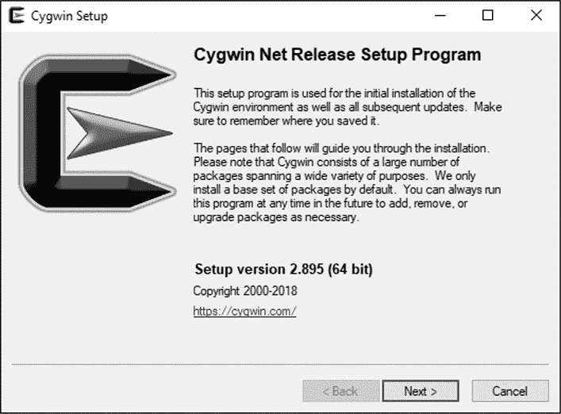

*图 17-1：Cygwin64 安装程序的初始版权屏幕*

点击 **下一步** 进入安装向导的第二页，见 图 17-2。

在此，你需要选择获取软件包的方式。你可以选择通过互联网或本地安装目录获取。你还可以选择从互联网下载文件，但不进行安装，这对于建立本地安装源、从相同的下载文件缓存中为多个系统安装软件很有用。选择 **从互联网安装**，然后点击 **下一步** 继续到下一页，见 图 17-3。

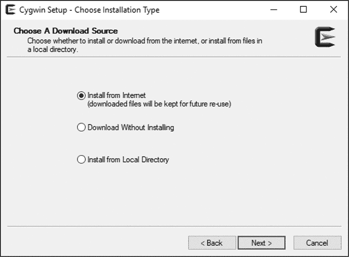

*图 17-2：Cygwin64 安装程序的安装类型屏幕*

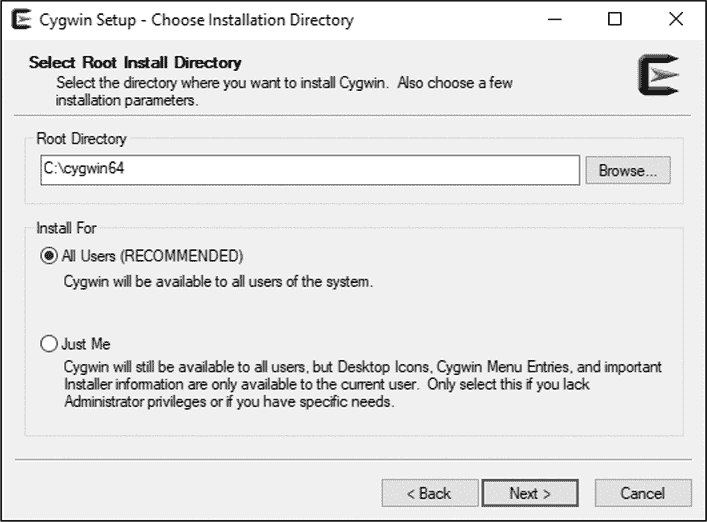

*图 17-3：Cygwin64 安装程序的安装位置屏幕*

在这里，系统会询问你希望将 Cygwin 安装到哪里。默认位置是*C:\cygwin64*，建议你保持这个默认位置，尽管如果选择安装到非默认位置，Cygwin 在管理所需的系统更改方面要比其他一些安装程序做得更好。

如果你是 Windows 的高级用户，现在很可能会有强烈的想法，想将默认位置更改为 Windows 中更合理的位置。我劝你不要这样做。问题在于，你正试图将 Cygwin 视为一个应用程序，尽管它从技术上讲是一个应用程序，但它也可以被看作是类似于完整的 Linux 虚拟机安装。它提供了一个对 Windows 来说是外部的（外国的）开发环境，这使得它与 Windows 的操作系统在某种程度上类似。从这个角度来看，也许更容易理解为什么*Cygwin64*目录值得在硬盘上与*Windows*目录并排存在。

点击**下一步**进入下一个页面，如图 17-4 所示。

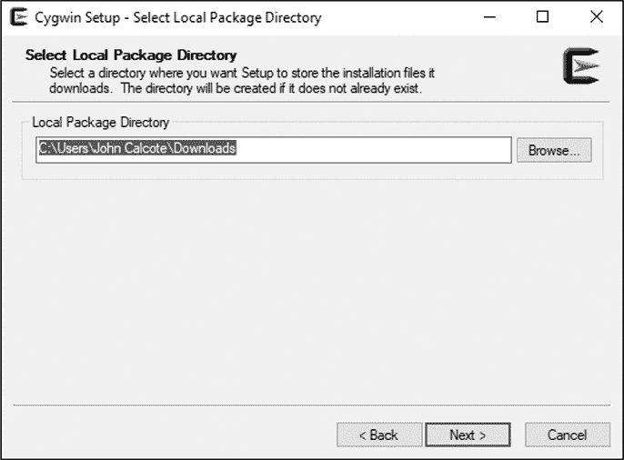

*图 17-4：Cygwin64 安装程序的本地软件包目录屏幕*

现在需要选择一个本地软件包目录。这是存储下载的软件包文件的目录。请选择您 Windows 系统上一个合理的位置——例如您的*下载*目录。在该位置将创建一个*Cygwin*目录，并包含一个子目录，用于存储从每个互联网源下载的软件包。点击**下一步**进入下一个页面，如图 17-5 所示。

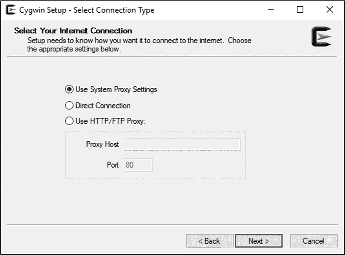

*图 17-5：Cygwin64 安装程序的代理设置屏幕*

现在，你可以选择或修改代理设置。通常，你可以使用默认的系统代理设置。那些在工作或家庭环境中使用代理的人，通常已经习惯了为互联网应用程序配置此类设置，并知道如何处理这里的选项。点击**下一步**进入下一个页面，如图 17-6 所示。

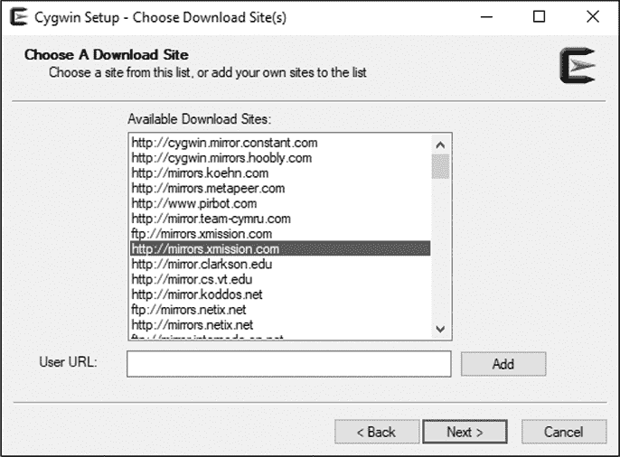

*图 17-6：Cygwin64 安装程序的软件包下载源屏幕*

选择一个软件包下载源。就像 Linux 发行版一样，你可以使用多个站点作为 Cygwin 的软件包源。选择一个地理位置接近你的站点，以确保安装速度最快，然后点击**下一步**开始下载软件包目录，如图 17-7 所示。

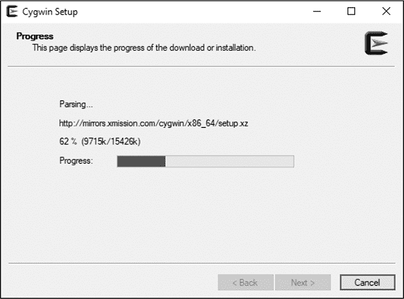

*图 17-7：Cygwin64 安装程序的软件包目录下载屏幕*

从选定的源站点下载并解析软件包目录只需几秒钟，随后将显示软件包管理器主界面，如图 17-8 所示。


*图 17-8：Cygwin64 安装程序的软件包管理器屏幕*

我已展开“所有根元素”和“开发”类别，以显示该类别中的前几个包，按字母顺序排序。在“开发”类别中，选择以下附加包，方法是点击“新建”列右侧的下拉箭头，并为每个包选择列表中可用的最高版本号（有少数例外情况）：

+   autoconf2.5 (2.69-3)

+   automake (10-1)

+   automake1.15 (1.15.1-1)

+   binutils (2.29-1)

+   gcc-core (7.4.0-1)

+   gcc-g++ (7.4.0-1 - 可选)

+   libtool (2.4.6-6)

+   make (4.2.1-2)

**注意**

*在浏览包列表时，您会注意到一些包已被预选中。请不要取消选择任何默认包。*

这个列表中的每一项都包含一个基础包名称，后跟括号中的包版本。版本管理系统类似于标准的 Linux 发行版。上游源包的版本后缀为连字符，后面跟着打包者的版本。例如，*autoconf2.5* 包的源包版本是 2.69，而打包者的版本是 3。打包者的版本特定于发行版——在本例中是 Cygwin。

Cygwin 使用滚动发布机制，这意味着 Cygwin 包会在更新的源包版本可用时，或 Cygwin 维护者使用这些包时进行独立更新。我在这里列出的版本是写作时的当前版本。您当前的版本号可能更新。请选择最新的版本，而不是我列出的版本。您可以随时使用对话框顶部的搜索框快速查找列表中的包。选择了这些附加包后，点击 **下一步** 继续到下一页，如图 17-9 所示。

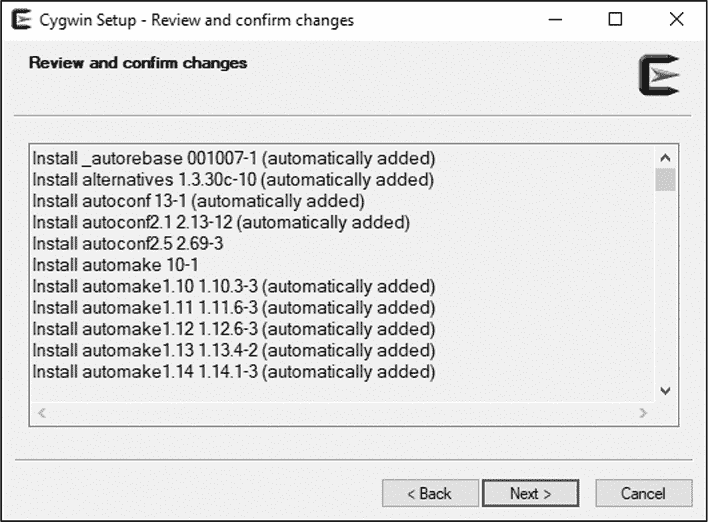

*图 17-9：Cygwin64 安装程序的下载确认界面*

审核此处的列表以确保您选择了所需的包后，点击 **下一步** 开始下载过程，如图 17-10 所示。

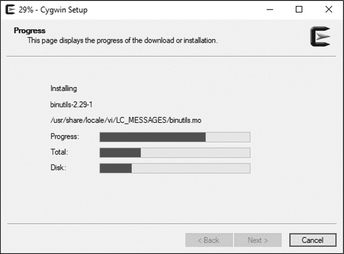

*图 17-10：Cygwin64 安装程序的包下载进度界面*

由于您选择仅安装少数几个包，因此这应该不会花费太长时间。过程完成后，点击 **下一步** 继续到下一个界面，如图 17-11 所示。

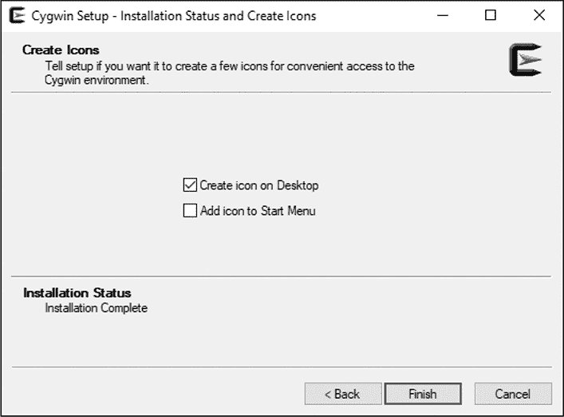

*图 17-11：Cygwin64 安装程序的图标选择界面*

选择您希望在 Windows 系统上创建图标的位置。这里有两个复选框选项：桌面和开始菜单。如果您选择不添加任何图标，仍然可以通过在资源管理器窗口或命令提示符或 PowerShell 提示符中执行 *C:\cygwin64\cygwin.bat* 来运行 Cygwin 终端程序。

点击 **完成** 以关闭包管理器。当你想通过添加或删除软件包，或者更新现有软件包到更新版本时，只需再次运行 `setup-x86_64.exe`。^(11) 你需要重新经历所有相同的初始界面，但包管理器会记住你之前的选项和当前已安装的所有软件包，允许你根据需要修改现有配置。

#### *打开 Cygwin 终端*

第一次执行 Cygwin 终端时，表示骨架 *.bashrc*、*.bash_profile*、*.inputrc* 和 *.profile* 文件已复制到 Cygwin 文件系统中的 */home/*username 目录。

理解 Cygwin 文件系统的最佳方式是通过在终端中执行`mount`命令，查看 Cygwin 如何将你的 Windows 文件系统资源映射到它自己的文件系统中：

```
$ mount
C:/cygwin64/bin on /usr/bin type ntfs (binary,auto)
C:/cygwin64/lib on /usr/lib type ntfs (binary,auto)
C:/cygwin64 on / type ntfs (binary,auto)
C: on /cygdrive/c type ntfs (binary,posix=0,user,noumount,auto)
Z: on /cygdrive/z type vboxsharedfolderfs (binary,posix=0,user,noumount,auto)
$
```

Cygwin 自动将 *C:\cygwin64*、*C:\cygwin64\bin* 和 *C:\cygwin64\lib* 分别挂载到 */*、*/usr/bin* 和 */usr/lib*。它还会将你的所有 Windows 驱动器根目录自动挂载到 */cygdrive* 目录下，目录名称对应驱动器字母。我将 Windows 操作系统安装在 *C:\* 驱动器上，并通过 VirtualBox 的共享文件夹系统将 *Z:\* 驱动器映射到我的 Linux 主机。因此，我可以从 Cygwin 的 POSIX 环境中完全访问我的 Windows 文件系统和 Linux 主机文件系统。^(12) 我也可以通过 *C:\Cygwin64* 目录从 Windows 访问 Cygwin 的整个文件系统。

#### *测试构建*

因为 Cygwin 提供了在其自己的 POSIX 环境中访问 Windows 环境的功能，所以你可以直接从 Cygwin shell 提示符运行之前安装的 Git for Windows 独立版本。一个更好的选择，但仅适用于 Cygwin 终端内的是，从其包管理器安装 Cygwin 版本的 git。为什么这个选项更好？因为 Cygwin 的 git 包比 Windows 版本更了解 Cygwin 的文件系统约定。例如，Windows 版本有时在 POSIX 环境中查看时会创建具有错误权限的文件。

与 MinGW 和 Msys2 不同，Cygwin 可以在 Cygwin 文件系统中正确管理符号链接。回想一下 第十三章，以及本章前面的内容，我们需要在 `PATH` 中的某个位置创建指向 `gnulib-tool` 工具的符号链接，以便 b64 的 `bootstrap.sh` 脚本能够找到 Gnulib。现在让我们在 Cygwin 终端中进行此操作。将以下命令中省略的部分填写为你克隆的 Gnulib 的正确路径：

```
$ ln -s /cygdrive/c/.../gnulib/gnulib-tool /usr/bin/gnulib-tool
```

此命令在 Cygwin 的 */usr/bin* 目录中创建一个符号链接，指向你克隆的 Gnulib 工作区根目录中的 `gnulib-tool` 程序。

默认情况下，Cygwin 将符号链接创建为文本文件，并标记为 Windows *系统*（S）属性，这使得它们在正常的 Windows 目录列出命令和 Windows 文件资源管理器中不可见。如果你检查 Cygwin 符号链接文件的内容，你会发现它包含一个魔术标记 `!<symlink>`，后面是以 UTF-16 格式（以小端字节顺序标记 0xFFFE 开头）表示的目标文件系统条目的路径。

你可以通过导出包含文本 `winsymlinks:nativestrict` 的 `CYGWIN` 环境变量来配置 Cygwin 创建真正的 Windows 符号链接。然而，如果你这样做，你必须以管理员身份运行 Cygwin 终端，因为默认情况下，创建 Windows 原生符号链接需要管理员权限。Windows 10 的最近版本允许在不提升权限的情况下创建原生符号链接，前提是你愿意将系统切换到所谓的“开发者模式”。

话虽如此，Cygwin 自己的符号链接管理系统运行得非常好，只要解释链接的工具是为 Cygwin 平台构建的。事实上，要查看 Cygwin 符号链接文件的内容，你必须使用非 Cygwin 工具，因为 Cygwin 工具会直接跟随符号链接文件，而不是打开文件，即使在 Windows 命令提示符下也是如此！

现在，让我们为 Windows 构建 b64。我们将首先在 Cygwin 终端中切换到你在 Windows 系统上克隆的 b64 工作区，并运行 `bootstrap.sh` 脚本，以拉取我们的 Gnulib 依赖项并运行 `autoreconf -i`：

```
$ cd /cygdrive/c/.../b64
$ ./bootstrap.sh
Module list with included dependencies (indented):
    absolute-header
  base64
--snip--
configure.ac:12: installing './compile'
configure.ac:20: installing './config.guess'
configure.ac:20: installing './config.sub'
configure.ac:6: installing './install-sh'
configure.ac:6: installing './missing'
Makefile.am: installing './depcomp'
$
```

现在，我们可以简单地运行 `configure` 和 `make`。我们将在一个子目录结构中执行此操作，这样我们以后可以重用这个工作区进行其他构建类型。注意，这里不需要指定 `--build` 或 `--host` 选项来设置交叉编译。我们正在运行“本地”Cygwin 工具，这些工具会自动构建设计用于在主机平台上运行的 Cygwin 程序：

```
$ mkdir -p cw-builds/cygwin
$ cd cw-builds/cygwin
$ ../../configure
--snip--
checking for C compiler default output file name... a.exe
checking for suffix of executables... .exe
--snip--
checking build system type... x86_64-unknown-cygwin
checking host system type... x86_64-unknown-cygwin
--snip--
configure: creating ./config.status
config.status: creating Makefile
config.status: creating lib/Makefile
config.status: creating config.h
config.status: executing depfiles commands
$
$ make
make  all-recursive
make[1]: Entering directory '/cygdrive/c/.../cw-builds/cygwin'
--snip--
make[2]: Entering directory '/cygdrive/c/.../cw-builds/cygwin'
gcc -DHAVE_CONFIG_H -I. -I../../b64  -I./lib -I../../b64/lib   -g -O2 -MT src/
src_b64-b64.o -MD -MP -MF src/.deps/src_b64-b64.Tpo -c -o src/src_b64-b64.o
`test -f 'src/b64.c' || echo '../../b64/'`src/b64.c
mv -f src/.deps/src_b64-b64.Tpo src/.deps/src_b64-b64.Po
gcc  -g -O2   -o src/b64.exe src/src_b64-b64.o lib/libgnu.a
make[2]: Leaving directory '/cygdrive/c/.../cw-builds/cygwin'
make[1]: Leaving directory '/cygdrive/c/.../cw-builds/cygwin'
$
```

最后，我们将测试我们的新 `b64.exe` 程序，看它是否能在 Windows 上运行。虽然 Cygwin 终端看起来像 Linux，但它实际上只是一种访问 Windows 的类 Linux 方式，因此你可以从 Cygwin 终端执行 Windows 程序。这一点很好，因为它允许我们在测试过程中使用 Bash 版本的 `echo`，并通过 `-n` 选项来抑制默认的换行符：

```
$ cd src
$ ./b64.exe <../../bootstrap.sh
IyEvYmluL3NoCmdudWxpYi10b29sIC0tdXBkYXRlCmF1dG9yZWNvbmYgLWkK
$
$ echo -n "IyEvYmluL3NoCmdudWxpYi10b29sIC0tdXBkYXRlCmF1dG9yZWNvbmYgLWkK" |\
  ./b64 -d
#!/bin/sh
gnulib-tool --update
autoreconf -i
$
```

**注意**

*我在此控制台列表中没有在命令上使用 .exe 扩展名来反转 base64 编码操作。我想展示的是，像 Windows 一样，Cygwin 不需要在可执行文件上使用扩展名。*

如果你运行类似 Visual Studio 的 `dumpbin.exe` 或 Cygwin 的 `cygcheck` 工具，你会发现这个版本的 `b64.exe` 很依赖于 *cygwin1.dll*，它必须与你的程序一起发布。默认情况下，Cygwin 构建的是“Cygwin”软件——即设计用于在 Cygwin 平台上运行的软件，Cygwin 平台的重要组成部分是在 Windows 上的 *cygwin1.dll*。

#### *构建真正的 Windows 原生软件*

你也可以安装 mingw-w64 工具链，并使用我们在“Linux 上交叉编译 Windows”一节中使用的相同技术进行编译。mingw-w64 工具链可以通过 Cygwin 包管理器获取，并且是我们在 Linux 上安装的同一工具链的 Cygwin 移植版本。

现在我们来做。再次运行`setup-x86_64.exe`程序，并跳过所有前置对话框，直到你到达包管理窗口。初始安装后，包管理器窗口显示的默认视图是你已安装软件包的待更新列表。根据你最初安装以来的时间长度，这个列表可能甚至是空的。从**视图**下拉框中选择**完整**选项，返回到完整的软件包列表。定位并选择（在**开发**类别下）以下要安装的软件包。你可能会看到比我列出的版本更新的选项；请选择最新的可用版本。你可以在**搜索**框中输入前缀（**mingw64-**）以缩小结果列表，找到你想要的软件包。

+   mingw64-i686-gcc-core (7.4.0-1)

+   mingw64-i686-gcc-g++ (7.4.0-1)

+   mingw64-x86_64-gcc-core (7.4.0-1)

+   mingw64-x86_64-gcc-g++ (7.4.0-1)

这两个软件包用于生成 32 位 Windows 软件，后两个用于生成 64 位 Windows 软件。点击**下一步**继续并安装这些额外的软件包。

**注意**

*你可能会注意到在总结页面上，其他你没有明确选择的软件包也在安装。这是因为这四个软件包是元包，正如前面所描述的那样。如果你从最初安装 Cygwin 以来已经有一段时间，你可能还会看到之前安装的软件包的更新。*

在*b64/cw-builds*目录下为 32 位和 64 位的 mingw-w64 构建创建其他子目录：

```
$ pwd
/cygdrive/c/.../cw-builds
$ mkdir mingw32 mingw64
$ cd mingw32
$
```

现在开始使用 mingw-w64 交叉工具集的 i686 变体，在*mingw32*目录中构建 32 位 Windows 程序：

```
$ cd mingw32
$ ../../configure --build=x86_64-unknown-cygwin --host=i686-w64-mingw32
--snip--
checking for C compiler default output file name... a.exe
checking for suffix of executables... .exe
--snip--
checking build system type... x86_64-unknown-cygwin
checking host system type... i686-w64-mingw32
--snip--
$
$ make
make  all-recursive
--snip--
i686-w64-mingw32-gcc -DHAVE_CONFIG_H -I. -I../../b64  -I./lib -I../../lib  -g
-O2 -MT src/src_b64-b64.o -MD -MP -MF src/.deps/src_b64-b64.Tpo -c -o src/
src_b64-b64.o `test -f 'src/b64.c' || echo '../../'`src/b64.c
mv -f src/.deps/src_b64-b64.Tpo src/.deps/src_b64-b64.Po
i686-w64-mingw32-gcc  -g -O2   -o src/b64.exe src/src_b64-b64.o lib/libgnu.a
make[2]: Leaving directory '/cygdrive/c/.../cw-builds/mingw32'
make[1]: Leaving directory '/cygdrive/c/.../cw-builds/mingw32'
$
```

虽然看起来可能有些奇怪，但你必须在`configure`命令行中使用`--build`和`--host`选项进行 Windows 的交叉编译。原因是 mingw-w64 工具链不是 Cygwin 的默认工具链。你实际上是在告诉`configure`在哪里找到你想使用的非默认工具。从某种角度看，这实际上是一个交叉编译，因为你在 Cygwin 平台上构建非 Cygwin 软件。

对 64 位构建做相同操作：

```
$ cd ../mingw64
$ ../../configure --build=x86_64-unknown-cygwin --host=x86_64-w64-mingw32
--snip--
checking for C compiler default output file name... a.exe
checking for suffix of executables... .exe
--snip--
checking build system type... x86_64-unknown-cygwin
checking host system type... x86_64-w64-mingw32
--snip--
$
$ make
make  all-recursive
--snip--
x86_64-w64-mingw32-gcc -DHAVE_CONFIG_H -I. -I../..  -I./lib -I../../lib   -g
-O2 -MT src/src_b64-b64.o -MD -MP -MF src/.deps/src_b64-b64.Tpo -c -o src/
src_b64-b64.o `test -f 'src/b64.c' || echo '../../'`src/b64.c
mv -f src/.deps/src_b64-b64.Tpo src/.deps/src_b64-b64.Po
x86_64-w64-mingw32-gcc  -g -O2   -o src/b64.exe src/src_b64-b64.o lib/libgnu.
amake[2]: Leaving directory '/cygdrive/c/.../cw-builds/mingw64'
make[1]: Leaving directory '/cygdrive/c/.../cw-builds/mingw64'
$
```

**注意**

*可能会觉得奇怪，64 位版本的 gcc 被称为`x86_64-w64-mingw32-gcc`。那末尾的*`32`*是怎么回事？原因在于 mingw 最初是一个 32 位的 Windows 编译器，专门叫做 mingw32。mingw32 项目最终更名为 MinGW，但一旦工具和包名称被广泛使用，它们就很难再更改了。*

#### *分析软件*

为了真正理解这些构建之间的差异，你需要获得一个工具，用来查看我们用这三套工具集生成的`b64.exe`文件。你可以运行与 Visual Studio 一起提供的`dumpbin.exe`工具，或者使用 Cygwin 的`cygcheck`工具，如果你愿意的话。我在 GitHub 上找到了一款非常不错的工具，名为*Dependencies*，由用户 lucasg 开发。^(13)

首先，让我们查看`cygcheck`工具对于这三种版本程序的输出。我们从*cw-builds*目录开始，这样我们可以轻松访问所有版本：

```
   $ pwd
   /cygdrive/c/Users/.../cw-builds
   $
➊ $ cygcheck cygwin/src/b64.exe
   C:\Users\...\cw-builds\cygwin\src\b64.exe
     C:\cygwin64\bin\cygwin1.dll
       C:\Windows\system32\KERNEL32.dll
         C:\Windows\system32\ntdll.dll
         C:\Windows\system32\KERNELBASE.dll
   $
➋ $ cygcheck mingw32/src/b64.exe
   C:\Users\...\cw-builds\mingw32\src\b64.exe
   $
➌ $ cygcheck mingw64/src/b64.exe
   C:\Users\...\cw-builds\mingw64\src\b64.exe
     C:\Windows\system32\KERNEL32.dll
       C:\Windows\system32\ntdll.dll
       C:\Windows\system32\KERNELBASE.dll
     C:\Windows\system32\msvcrt.dll
   $
```

这里所传达的概念是，一个库是直接依赖于它上方直接的库或程序，并且是链条中更高层次的祖先的间接依赖。在➊，Cygwin 版本显示了一个依赖层次结构，其中*cygwin1.dll*位于顶端，紧接着是`b64.exe`，其余的所有库都是它的直接或间接依赖。这意味着`b64.exe`所做的每个系统或库调用，实际上都是直接调用*cygwin1.dll*，然后由它代表调用其他库。

64 位的 mingw64 版本在➌显示了一个类似的层次结构，除了`b64.exe`程序直接依赖于*kernel32.dll*和*msvcrt.dll*。这显然是一个本地 Windows 程序。

我版本的`cygcheck`工具在处理 32 位本地 Windows 软件时存在一些问题。你可以在➋看到，工具只显示了程序`b64.exe`，没有显示任何库依赖。为了查看这个版本的真实细节，让我们切换到我之前提到的 Dependencies 程序。我已经将这三个版本的程序加载到一个 Dependencies 实例中，如图 17-12 所示。

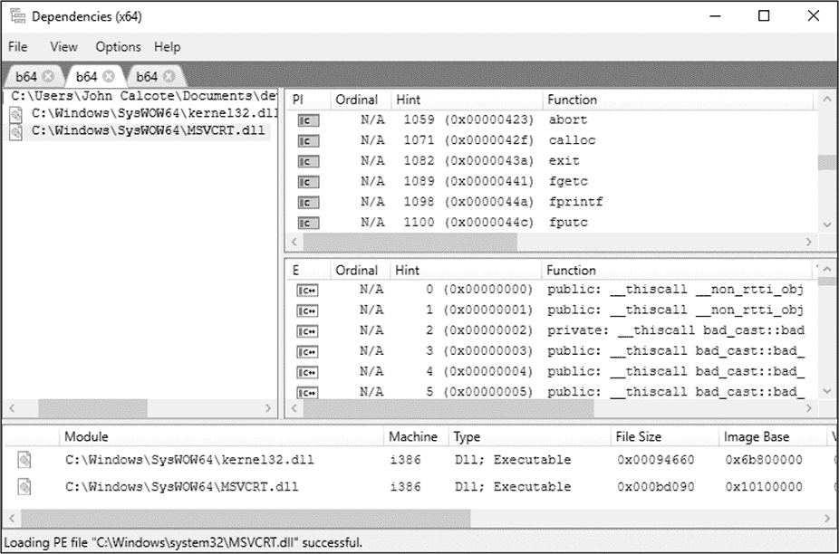

*图 17-12：作为 32 位 mingw-w64 程序构建的`b64.exe`的模块和导出*

在这里，你可以看到 32 位的 mingw-w64 版本确实有类似于 64 位 mingw-w64 版本的库依赖。32 位版本使用的是*C:\Windows\SysWOW64\msvcrt.dll*，而 64 位版本使用的是*C:\Windows\system32\msvcrt.dll*。*kernel32.dll*也是一样的。

Cygwin 版本与 mingw-w64 版本之间还有一些细微的差别。举个简单的例子，Cygwin 版本从*cygwin1.dll*中导入`getopt`。你或许还记得我们在 b64 中使用了 POSIX `getopt`函数来解析命令行选项。但是，你不会在*msvcrt.dll*中找到`getopt`，那么它是从哪里来的呢？mingw-w64 工具链提供了这样的 POSIX 功能的静态库，它最终成为了`b64.exe`的一部分。

### MinGW: 最小化 GNU 工具集（Minimalist GNU for Windows）

1998 年，Colin Peters 发布了最初版本的*mingw32*。后来，为了避免给 MinGW 只能生成 32 位软件的印象，版本号被去掉了。^(14)

MinGW 最初只提供了 GCC 的 Cygwin 移植版。不久之后，Jan-Jaap Van der Heijden 创建了 GCC 的原生 Windows 移植版，并添加了 *binutils* 包和 GNU `make`。自那时以来，MinGW 就成为了 Cygwin 的一个非常流行的替代品，主要因为它的核心目标是创建与 Microsoft 工具生成的软件非常相似的软件。对于合理可移植的 C 代码，除了 Windows 系统和 Visual Studio 运行时库（*msvcrt.dll*）之外，不需要其他任何库。请记住，mingw-w64 在 2013 年之前是不可用的，因此在超过 10 年的时间里，MinGW 是生成原生 Windows 代码的唯一可用开源选项。

这一概念是 MinGW 项目所倡导的理念的核心。MinGW 的目标是仅使用标准 C 库作为抽象层，并在必要时修改源代码，以使其他关键包能够在 MinGW 下使用。

然而，GNU 软件中有一大部分使用了 *pthreads* 库。为了适应这一主要的 GNU 软件包，MinGW 通过提供一个名为 *pthreads-win32.dll* 的库来采取务实的做法。这个库今天在软件的依赖列表中经常出现，以至于许多人并不将它与 MinGW 联系在一起。实际上，一些使用 Microsoft 工具编译的可移植软件甚至独立使用 *pthreads-win32.dll* 作为可移植的线程库，在 POSIX 和 Windows 环境中都依赖 POSIX 线程。^(15)

使用 MinGW 有一个主要的缺点，最近这个问题变得更加突出：MinGW 仍然只生成 32 位的原生 Windows 应用程序。微软和英特尔最近联合宣布，未来某个版本的 Windows 将只支持 64 位硬件。虽然 32 位软件通常可以在 64 位系统上运行，但随着时间推移，这种情况可能会发生变化。MinGW 的包库并未提供生成 64 位 Windows 目标代码的 GCC 编译器，但如果你愿意放弃 MinGW 的包管理器，第三方可以在 MinGW 平台上提供 mingw-w64。然而，这种做法是不被鼓励的，因为将第三方包添加到环境中可能会导致包管理器无法解决的依赖问题。

MinGW 社区多年来一直靠着它的名字存活，直到最近该项目才开始接受资金捐赠以帮助维护。或许额外的财务支持能激励社区推动这些重要的升级。

#### *安装 MinGW*

尽管 MinGW 仅生成 32 位 Windows 程序和库，但它仍然值得关注，因为使用它对于已经可移植的软件来说非常简单且高效。一旦你开始理解 MinGW 和 Msys 的工作原理，转向其他基于 Windows 的 POSIX 平台就变得微不足道，因为它们都基于某种类似 Msys 的环境。

我们将从安装 MinGW 开始，这个过程简单得不能再简单了。在你喜欢的浏览器中访问 *[`www.mingw.org`](http://www.mingw.org)*。点击顶部菜单栏中的 **Downloads** 标签。这条链接会带你进入 MinGW 项目的 *osdn.net*^(16) 下载页面。向下滚动一些（小心避免点击那些看起来像是合法下载按钮的巨大绿色广告链接）。在标有“Operating System: Windows”的灰色条下，点击带有 Windows 10 类似图标的小蓝色按钮。将 `mingw-get-setup.exe` 程序保存到你硬盘上的某个位置。

运行此程序时，会显示一个非常简单的基于对话框的安装程序界面，用于 MinGW 安装管理器设置工具，如 图 17-13 所示。

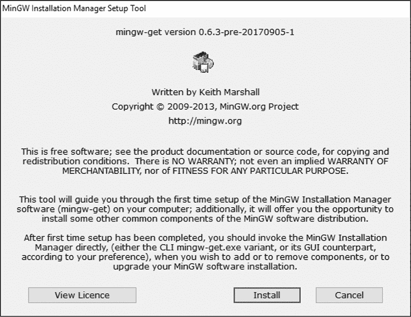

*图 17-13：MinGW 安装管理器设置工具展示的初始对话框*

这个程序实际上安装了 MinGW 安装管理器，它是一个类似于 Cygwin 包管理器的工具，可以精细地控制安装或更新的 MinGW 组件。在安装管理器出现之前，更新 MinGW 的唯一选择是卸载现有的完整安装版本，然后重新从头开始安装新的版本，或者尝试升级，这样的操作往往是运气成分多。

尽管版权日期似乎过时，但根据最新更新（截至本书撰写时），该设置程序和安装管理器本身在 2017 年 9 月最后一次更新。安装管理器会保持软件包目录的最新状态，因此你始终可以访问到最新的 MinGW 软件包。例如，包含 GCC 8.2.0 的软件包在 2018 年 8 月上传。等你阅读本文时，它可能已经更新为更高版本。

继续点击 **Install**。你将看到一个选项页面，如 图 17-14 所示。

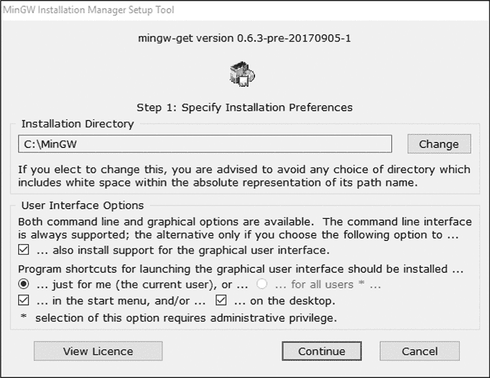

*图 17-14：MinGW 安装管理器设置工具展示的选项页面*

与 Cygwin 类似，MinGW 希望被安装在系统驱动器根目录下的路径中，同样像 Cygwin 一样，你需要把 MinGW 当作一个虚拟化的操作系统。因此，它需要在 Windows 文件系统中一个特殊的地方。

另外，与 Cygwin 类似，你会发现 MinGW 不是通过 Windows 安装数据库来安装的，因此它不会出现在 Windows 已安装程序面板中。事实上，你只需删除 *C:\MinGW* 目录，就可以完全从你的 Windows 系统中移除 MinGW。

**注意**

*如果你决定安装到其他位置，你需要仔细阅读 MinGW 网站上的初始安装说明，因为在安装后，你需要对* C:\MinGW\msys\1.0\etc *目录中的文件做额外的修改。*

保持所有选项不变，然后点击 **继续**。你将看到下一个屏幕，这是下载进度页面，显示最新的安装管理器程序正在被下载到 *C:\MinGW\libexec\mingw-get* 目录中。 图 17-15 显示了该对话框的状态，一旦目录已从下载源更新，最新版本的安装管理器就会被下载并安装。

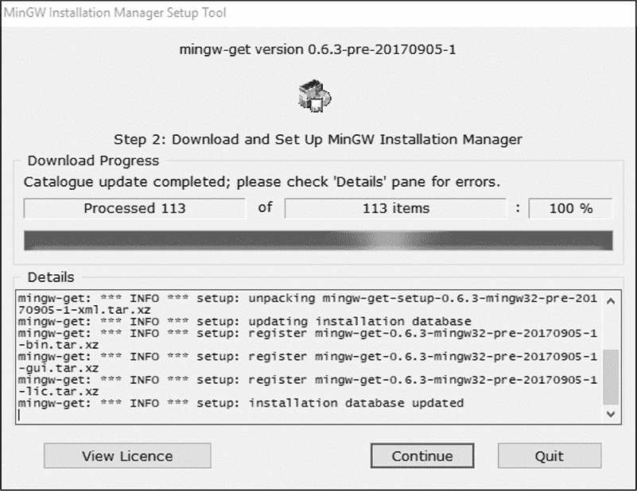

*图 17-15：MinGW 安装管理器设置工具的下载进度页面*

点击 **继续** 打开安装管理器，如 图 17-16 所示。

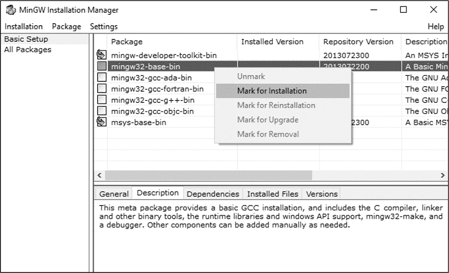

*图 17-16：安装管理器主屏幕与软件包上下文菜单*

在基本设置面板中（默认显示的），你看到的软件包实际上是元包，或者说是指向一大组实际包的包。要查看实际包，你可以选择左侧的 **所有软件包** 选项，然后滚动浏览右侧显示的列表。当你准备好继续时，返回到基本设置面板。

选择 *mingw-developer-toolkit-bin* 元包时，将自动选择 *msys-base-bin* 元包。这两个元包，再加上 *mingw32-base-bin* 元包，就是你将 C 程序编译为 32 位原生 Windows 程序所需的所有内容。选择这三个包，如 图 17-16 所示，然后点击 **应用更改** 选项，位于 **安装** 菜单中，如 图 17-17 所示。

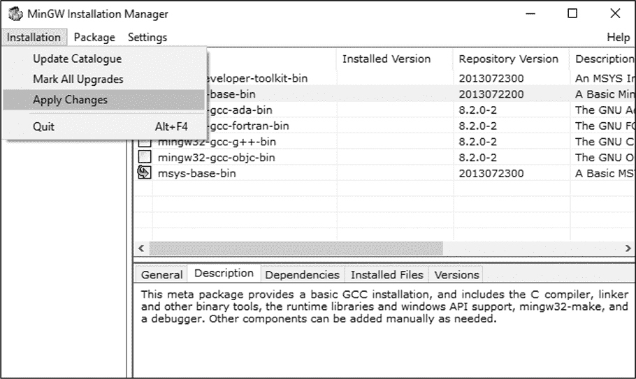

*图 17-17：在安装管理器中应用所选更改*

你将看到一个名为“待处理操作调度”的确认对话框，允许你应用已调度的更改，推迟这些更改以返回主窗口并修改当前列表，或者简单地丢弃所有更改。选择 **应用**，如 图 17-18 所示。

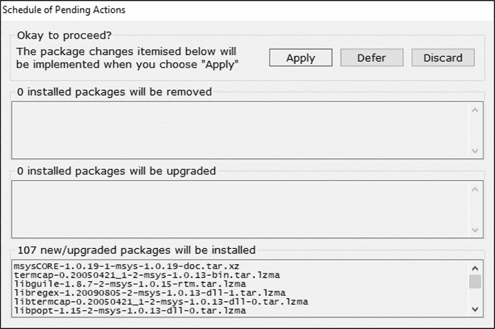

*图 17-18：安装管理器的待处理操作调度对话框*

最后，你会看到下载包对话框，如 图 17-19 所示，其中显示了你选择下载的 112 个包，并且每个包都有一个进度条。

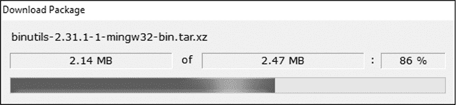

*图 17-19：安装管理器的下载包对话框*

**注意**

*由于 MinGW 下载站点在本写作后无疑会有所更新，因此你可能会看到在 图 17-18 显示的对话框底部出现不同数量的软件包待安装。*

这可能需要一些时间，具体取决于你的互联网连接速度，所以下去吃点零食吧。

**注意**

*如果你遇到任何包下载错误，只需点击 **确定** 以关闭错误对话框，等待剩余包的下载和安装成功完成，然后从 **安装** 菜单再次点击 **应用更改**，重新尝试下载和安装失败的包。只有失败的包会被重新下载。*

一旦所有包下载完毕，它们将被安装到 *C:\MinGW\msys\1.0* 目录下的标准类 Unix 目录结构中。图 17-20 显示了安装管理器的应用已安排更改对话框，表示它已安装每个先前下载的包。

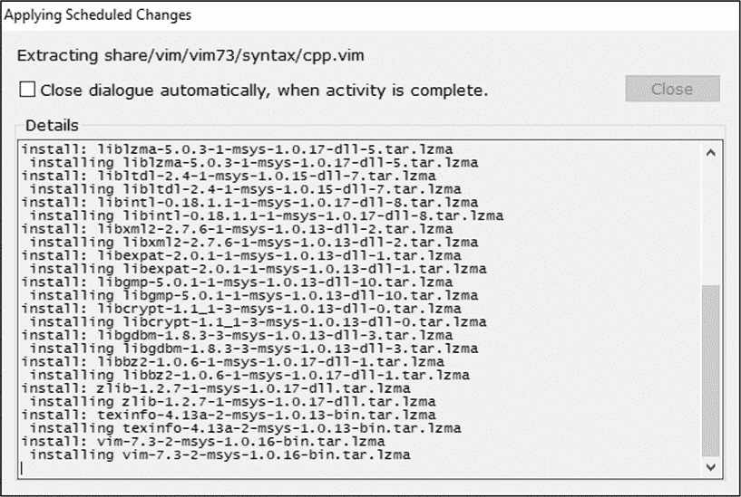

*图 17-20：安装管理器的应用已安排更改对话框*

现在你可以关闭安装管理器程序了。准备好 MinGW 安装的最后一步是为 MinGW 终端创建一个方便的桌面快捷方式，它是一个稍显过时的 Bash shell 版本，已移植到 Windows 并在 Windows Console Host (`conhost.exe`) 进程中运行。MinGW 会在 *C:\MinGW\msys\1.0\msys.bat* 安装一个 Windows 批处理文件。执行该批处理文件启动提供 POSIX 构建环境的 MinGW 终端。我喜欢在桌面上为这个文件创建一个快捷方式，并将图标更改为指向同一目录下的 *msys.ico* 文件。

双击 `msys.bat` 文件，启动 MinGW 终端。你会发现，`pwd` 显示你仍然处于 */home/**`username`* 目录，其中 *`username`* 是你的 Windows 系统用户名。

和 Cygwin 一样，理解文件系统的最佳方式是使用`mount`查看 MinGW 文件系统中的挂载点：

```
$ mount
C:\Users\...\AppData\Local\Temp on /tmp type user (binmode,noumount)
C:\MinGW\msys\1.0 on /usr type user (binmode,noumount)
C:\MinGW\msys\1.0 on / type user (binmode,noumount)
C:\MinGW on /mingw type user (binmode)
c: on /c type user (binmode,noumount)
d: on /d type user (binmode,noumount)
z: on /z type user (binmode,noumount)
$
```

这个输出看起来和 Cygwin 中的类似，但有一些区别。首先，MinGW 将你的 Windows 用户临时目录挂载为 */tmp*。其次，*/usr* 和 */* 都代表相同的 Windows 目录，*C:\MinGW\msys\1.0*。最后，*C:\MinGW* 本身被挂载到 */mingw* 下。

Windows 驱动器的管理方式也略有不同。Windows 驱动器字母会像在 Cygwin 中一样显示在 MinGW 文件系统中，但它们直接列在根目录下，而不是作为单独的顶级目录。这里还有一个细微的区别是，我的 *D:* 驱动器被列出了。它是一个虚拟光驱，没有挂载介质。MinGW 即使没有介质也会显示它，而 Cygwin 只有在挂载了介质时才显示它。

如果你 `cat` 查看 */etc/fstab* 文件的内容，你会看到前面大多数内容是硬编码的。唯一实际软配置的挂载点是 */mingw* 路径：^(17)

```
$ cat /etc/fstab
# /etc/fstab -- mount table configuration for MSYS.
# Please refer to /etc/fstab.sample for explanatory annotation.

# MSYS-Portable needs this "magic" comment:
# MSYSROOT=C:/MinGW/msys/1.0
# Win32_Path                              Mount_Point
#-------------------------------------    -----------
C:/MinGW                                  /mingw
$
```

#### *测试构建*

现在我们准备尝试构建 b64 项目。首先，我们应该清理 *b64* 目录，以便在此环境中演示 `bootstrap.sh`，所以请从 MinGW 终端进入 *b64* 目录并使用 `git` 删除所有工件。然后，为测试 MinGW 创建一个构建目录结构：

```
$ cd /c/Users/.../Documents/dev/b64
$ git clean -xfd
--snip--
$ mkdir -p mgw-builds/mingw
$
```

在这一点上，为了不让你走向必然的失败，我先声明，你很快会遇到符号链接的问题。虽然 Cygwin 在其环境中没有问题地创建和使用符号链接，但 MinGW 就不一样了。如果你尝试从 `/usr/bin/gnulib-tool` 创建一个指向 `.../gnulib/gnulib-tool` 程序的符号链接，你会发现 `ln -s` 命令似乎执行了，但当你尝试运行 `bootstrap.sh` 时，它却找不到 Gnulib。仔细检查后，你会发现你以为创建的符号链接其实只是一个复制品。嗯，复制品是行不通的，因为 `gnulib-tool` 使用它在文件系统中的实际位置作为 Gnulib 仓库的基准，而在另一个位置的 `gnulib-tool` 复制品无法做到这一点。

为了解决这个问题，我们需要调整 b64 的 `bootstrap.sh` 程序，使用相对路径来引用实际的 `gnulib-tool`。我将 gnulib 克隆到 b64 旁边，所以我只需要更改 `bootstrap.sh`，使其引用 `../gnulib/gnulib-tool`，而不再依赖系统 `PATH` 中的可访问路径。使用任何编辑器，按照清单 17-1 中的提示，在你的系统上进行类似的更改。

```
#!/bin/sh
../gnulib/gnulib-tool --update
autoreconf -i
```

*清单 17-1:* b64/bootstrap.sh: *允许 MinGW 找到 Gnulib 所需的更改*

**注意**

*在对 *`bootstrap.sh`* 做出这些更改后，你应该期待在运行 *`b64.exe`* 时看到不同的输出。*

这将解决我们在 Gnulib 上遇到的问题，但这里还有另一个潜在问题。虽然 MinGW 可能拥有最新的 GCC 工具链，但它在 Autotools 上的更新没有那么及时。我们一直在使用 Autoconf 2.69 和 Automake 1.15.1，但截至本文写作时，MinGW 只提供 Autoconf 2.68 和 Automake 1.11.1。也许等你阅读本文时，这些工具已经更新，你就不必做出文中清单 17-2 中所示的更改。请在做这些更改之前，先检查一下你的 Autoconf 和 Automake 版本。

```
#                                               -*- Autoconf -*-
# Process this file with autoconf to produce a configure script.

AC_PREREQ([2.68])
AC_INIT([b64], [1.0], [b64-bugs@example.com])
AM_INIT_AUTOMAKE([subdir-objects])
AC_CONFIG_SRCDIR([src/b64.c])
AC_CONFIG_HEADERS([config.h])
AC_CONFIG_MACRO_DIR([m4])

# Checks for programs.
AC_PROG_CC
AM_PROG_CC_C_O
--snip--
AC_OUTPUT
```

*清单 17-2:* b64/configure.ac: *与 Autoconf 2.68 配合使用所需的更改*

高亮的行显示了需要进行的更改。首先，我们需要将 `AC_PREREQ` 中支持的最低版本降低，以允许 Autoconf 2.68 处理这个 *configure.ac* 文件。然后，我们需要将 Automake 宏 `AC_CONFIG_MACRO_DIRS`（复数形式）更改为它的 Autoconf 对应宏 `AC_CONFIG_MACRO_DIR`。这两个宏的功能相同，只不过 Automake 1.15.1 版本中的宏使我们能够省略在 *Makefile.am* 文件中使用 `AC_LOCAL_AMFLAGS = -I m4`。幸运的是，我已经把这一行加到了 *Makefile.am* 中，并且一直保留在那里，所以这个更改很容易。最后，Automake 1.15.1 将 `AM_PROG_CC_C_O` 的功能合并到 `AM_INIT_AUTOMAKE` 宏中，当启用 `subdir-objects` 选项时。如果回退到 Automake 1.11.1，我们需要改回旧的格式，显式地提到 `AM_PROG_CC_C_O`，并且它必须位于 `AC_PROG_CC` 之后。

经过这些更改后，我们可以最终运行 `bootstrap.sh` 来生成我们的 `configure` 脚本：

```
$ ./bootstrap.sh
Module list with included dependencies (indented):
    absolute-header
  base64
--snip--
configure.ac:13: installing `./compile'
configure.ac:21: installing `./config.guess'
configure.ac:21: installing `./config.sub'
configure.ac:6: installing `./install-sh'
configure.ac:6: installing `./missing'
lib/Makefile.am: installing `./depcomp'
$
```

现在进入之前创建的 *mgw-builds/mingw* 目录，并使用相对路径运行 `configure` 回到 *b64*：

```
$ cd mgw-builds/mingw
$ ../../configure
--snip--
checking for C compiler default output file name... a.exe
checking for suffix of executables... .exe
checking whether we are cross compiling... no
--snip--
checking build system type... i686-pc-mingw32
checking host system type... i686-pc-mingw32
--snip--
configure: creating ./config.status
config.status: creating Makefile
config.status: creating lib/Makefile
config.status: creating config.h
config.status: executing depfiles commands

$ make
--snip--
make[2]: Entering directory `/c/Users/.../mgw-builds/mingw'
gcc -DHAVE_CONFIG_H -I. -I../..  -I./lib -I../../lib   -g -O2 -MT src/src_b64-
b64.o -MD -MP -MF src/.deps/src_b64-b64.Tpo -c -o src/src_b64-b64.o `test -f
'src/b64.c' || echo '../../'`src/b64.c
mv -f src/.deps/src_b64-b64.Tpo src/.deps/src_b64-b64.Po
gcc  -g -O2   -o src/b64.exe src/src_b64-b64.o lib/libgnu.a
make[2]: Leaving directory `/c/Users/.../mgw-builds/mingw'
make[1]: Leaving directory `/c/Users/.../mgw-builds/mingw'
$
```

在 `DependenciesGUI.exe` 中打开 `b64.exe` 会显示它是一个仅依赖 `SysWOW64\kernel32.dll` 和 `SysWOW64\MSVCRT.dll` 的 32 位 Windows 程序。

### Msys2

Msys2 由 OneVision Software 公司于 2013 年开发，采用“清洁室”技术，以便放宽 Cygwin 强加的开源许可要求，并为 Cygwin 和 MinGW 使用的过时 Msys 环境提供更现代的替代方案。

MSys2 使用的是 OneVision 64 位版本的 MinGW 工具链，称为 *mingw-w64*。然而，像 Cygwin 一样，Msys2 提供了一个名为 *msys-2.0.dll* 的 POSIX 系统级功能库。Msys2 提供了一个以这个库为基础实现的 C 标准库。你可以像检测 Cygwin 平台一样，检测一个 Windows 程序是否为 Msys2 平台构建。

因为 Msys2 在很大程度上是 Cygwin 的功能替代品，而且由于很多人已经习惯了 Cygwin 的工作方式，Msys2 在推广上遇到了一些困难，尽管它已经被一些关键用户使用，包括 Git for Windows。Msys2 被宣传为 Cygwin 的升级版，但实际上 Msys2 仅提供了与 Cygwin 相同的可移植性机制的不同实现。

区分 Msys2 和 Cygwin 的一个显著特点是，Msys2 的开源许可证比 Cygwin 更宽松。Cygwin 使用基于 GPL 的许可证，而 Msys2 仅使用标准的 3 款 BSD 许可证，这使得它成为使用 Linux 工具构建专有 Windows 软件的可行选项。

OneVision 系统中最重要的功能是 MinGW 编译器的 64 位移植版——这不仅仅是因为它运行在 64 位平台上（它确实如此），更因为它生成 64 位的 Windows 代码。可以说，当这个编译器发布时，跨编译 Windows 代码的世界得到了极大的扩展。此后，它已被移植到许多不同的平台上。

Msys2 会与 Windows 安装数据库连接，因此你可以通过 Windows 安装程序面板卸载 Msys2。

#### *什么是 Msys？*

“Msys” 这个术语多年来被错误使用。有人认为它意味着“Windows 上的 Unix”，或者至少是类似的意思。实际上，它所提供的只是潜力。最基本的 Msys 提供了一个 Unix 兼容的终端程序，一个类似 Bourne 的 shell（通常是 Bash），以及一套基础的实用程序。一些实现提供了更多的工具，而一些则提供了较少的工具。不管你使用的是哪种实现，Cygwin、MinGW 还是 Msys2，这些包中的 Msys 组件都可以让你通过安装额外的包来构建你喜欢的环境。

当 OneVision 创建 Msys2 时，公司的愿景是从小做起，让用户能够按照自己的需求构建环境。Msys2 版本的 Msys 预装的包非常少，而 Cygwin 预装了许多。Msys2 和 Cygwin 的终端窗口都基于`mintty.exe`，^(18) 而 MinGW 则基于`conhost.exe`（Windows 控制台宿主进程），你可以从外观和操作感受上判断这一点，因为 Cygwin 和 Msys2 的终端看起来非常相似，但与 MinGW 的终端有显著的不同。

#### *安装 Msys2*

Msys2 的安装过程非常简单。在你的网页浏览器中导航到 Msys2 的主页*[`www.msys2.org`](http://www.msys2.org)*，然后点击页面顶部的按钮，选择 32 位(`msys2-i686-`*`yyyymmdd`*`.exe`)或 64 位(`msys2-x86_64-`*`yyyymmdd`*`.exe`)版本的 Msys2 安装程序。^(19) 下载完成后，运行安装程序，你将看到一个对话框式的安装向导。欢迎页面如图 17-21 所示。

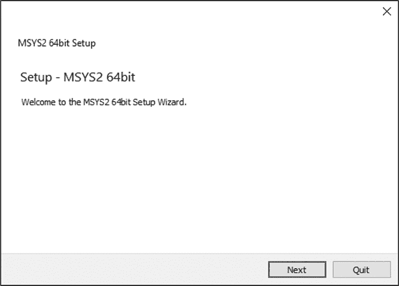

*图 17-21：Msys2 安装工具的欢迎页面*

点击**下一步**进入下一页面，如图 17-22 所示。

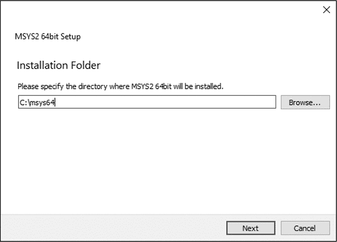

*图 17-22：Msys2 安装工具的安装文件夹页面*

选择安装位置。像 Cygwin 和 MinGW 一样，Msys2 也希望安装在系统驱动器的根目录下。我建议使用默认位置，原因和我对另外两个系统的建议相同。点击**下一步**进入下一页面，如图 17-23 所示。

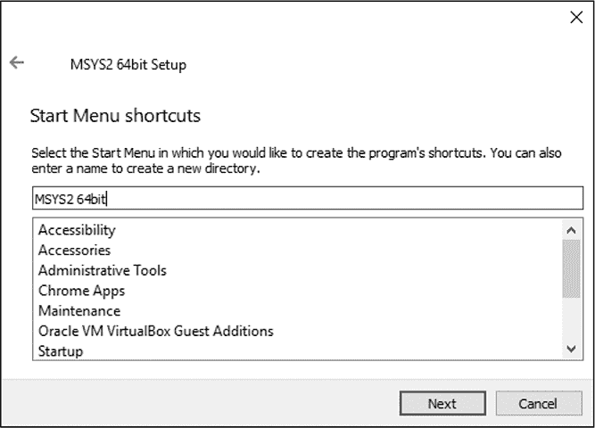

*图 17-23：Msys2 安装工具的快捷方式页面*

你可以选择 Windows 开始菜单文件夹，安装程序将在其中创建快捷方式。默认设置已经足够。点击**下一步**进入下一页面，开始安装，如图 17-24 所示。

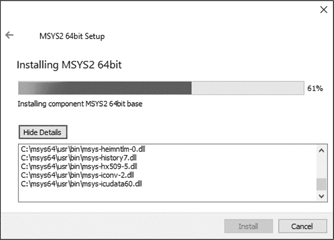

*图 17-24：Msys2 安装工具的安装进度页面（显示详细信息）*

安装完成后，点击**下一步**进入最后一页，如图 17-25 所示。

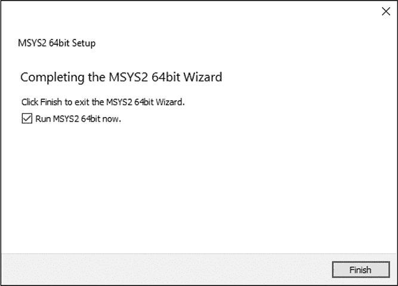

*图 17-25：Msys2 安装工具的最后一页*

在此，你可以选择在安装完成后启动 Msys2。点击**完成**退出安装程序。你可以让安装程序在退出时自动启动 Msys2，或者转到 Windows 10 开始菜单，找到**MSYS2 64bit**文件夹，然后点击**MSYS2 MSYS**条目。这两种方式都会通过执行`C:\msys64\msys2_shell.cmd`脚本并带有`-msys`命令行选项来启动 Msys2 终端窗口。

与其他系统的安装程序不同，Msys2 安装程序不会从互联网上下载包。而是像 Linux 发行版发布一样，Msys2 安装一小部分基础包，这些包会随着时间的推移变得越来越过时，直到最终，Msys2 维护者发布了一个新的安装程序。因此，首先需要做的就是更新这些已安装的基础包。

Msys2 使用 Arch Linux 包管理器 Pacman 的 Windows 移植版，提供对移植到 Msys2 的包仓库的访问。基本安装提供的包比较少，需要先用 Pacman 更新才能安装更多的包。

打开终端窗口，我们将使用命令`pacman -Syu`来更新 Msys2 系统。Pacman 命令是大写的，命令的选项是小写的。`-S`命令是远程仓库的“同步”命令。此命令的`-u`选项会从远程仓库更新现有包。`-y`选项会在检查更新前更新仓库的目录。要获取命令的帮助，请运行`pacman -h`。要获取某个命令的可用选项的帮助，请在命令行中加上`-h`和该命令。例如，要获取`-S`命令的可用选项的帮助，请运行`pacman -Sh`。

现在继续更新系统，首先下载最新的目录：

```
$ pacman -Syu
:: Synchronizing package databases...
 mingw32                                           530.8 KiB     495K/s 00:01
 mingw32.sig                                       119.0   B     116K/s 00:00
 mingw64                                           532.0 KiB     489K/s 00:01
 mingw64.sig                                       119.0   B     116K/s 00:00
 msys                                              178.2 KiB     655K/s 00:00
 msys.sig                                          119.0   B    0.00B/s 00:00
:: Starting core system upgrade...
warning: terminate other MSYS2 programs before proceeding
resolving dependencies...
looking for conflicting packages...

Packages (6) bash-4.4.023-1  filesystem-2018.12-1  mintty-1~2.9.5-1
             msys2-runtime-2.11.2-1  pacman-5.1.2-1  pacman-mirrors-20180604-2

Total Download Size:   19.04 MiB
Total Installed Size:  68.24 MiB
Net Upgrade Size:      11.96 MiB

:: Proceed with installation? [Y/n] Y
```

在提示时按 y（或直接按回车接受默认设置）继续更新 Msys2 系统。你会注意到更新的包数量很少。基础 Msys2 系统几乎什么都没有。核心系统包括 Bash，一个类似 Unix 的文件系统模拟器，位于 Windows 文件系统之上；mintty，Msys2 的 Msys 运行时；以及 Pacman 包管理器，因此 Msys2 安装程序安装过时的包并在首次使用时需要更新其实并不是问题。

Pacman 将下载并安装多个包，包括 Pacman：

```
:: Retrieving packages...
 msys2-runtime-2.11.2-1-x86_64                        2.5 MiB  1012K/s 00:03
 bash-4.4.023-1-x86_64                             1931.4 KiB  1003K/s 00:02
 filesystem-2018.12-1-x86_64                         46.3 KiB   242K/s 00:00
 mintty-1~2.9.5-1-x86_64                            296.7 KiB  1648K/s 00:00
 pacman-mirrors-20180604-2-any                       17.1 KiB  2.09M/s 00:00
 pacman-5.1.2-1-x86_64                               14.3 MiB  1010K/s 00:14
(6/6) checking keys in keyring
(6/6) checking package integrity
(6/6) loading package files
(6/6) checking for file conflicts
(6/6) checking available disk space
warning: could not get file information for opt/
:: Processing package changes...
(1/6) upgrading msys2-runtime
(2/6) upgrading bash
(3/6) upgrading filesystem
(4/6) upgrading mintty
(5/6) upgrading pacman-mirrors
(6/6) upgrading pacman
warning: terminate MSYS2 without returning to shell and check for updates again
warning: for example close your terminal window instead of calling exit
```

当你到达此步骤时，Pacman 本身需要更新，但它无法在运行时进行自我更新——这是 Windows 管理运行中可执行文件的方式所带来的一个结果。它会显示一条消息，提示你应该通过点击右上角的 X 关闭终端窗口，然后从 Windows 开始菜单重新启动 Msys2 并继续安装过程。

**注意**

*如果你看到弹出框警告有正在运行的进程，只需点击***确定***关闭窗口即可。*

再次运行`pacman -Su`（无需再次更新目录），继续更新过程，并在提示时按回车。这时，许多更多的包将会被更新。按 y（或直接按回车）继续，然后等待更新过程完成。

在继续安装其他包之前，先通过运行`mount`命令来查看文件系统：

```
$ mount
C:/msys64 on / type ntfs (binary,noacl,auto)
C:/msys64/usr/bin on /bin type ntfs (binary,noacl,auto)
C: on /c type ntfs (binary,noacl,posix=0,user,noumount,auto)
Z: on /z type vboxsharedfolderfs (binary,noacl,posix=0,user,noumount,auto)
$
```

你会注意到，Msys2 的基础安装目录*C:\msys64*已挂载在*/*下，而*C:\msys64\usr\bin*已挂载在*/bin*下。与其他系统一样，Windows 驱动器会以它们的驱动器字母挂载。Msys2 像 MinGW 一样从根目录挂载它们。（Cygwin 也可以配置成这样。）与 Cygwin 类似，Msys2 不会挂载没有媒体的光驱，所以你不会看到我的*D:*驱动器挂载在这里作为*/d*，但是如果我插入一个虚拟光盘并执行`mount`命令，它会出现在列表中。

#### *安装工具*

到此为止，Msys2 已经完全更新，并且准备好让你添加工具了。那么我们应该添加什么工具呢？我敢猜测，大多数没有明确目的的 Msys2 探索者在此时就会放弃。Msys2 Wiki 网站上有相当完整的文档，但你确实需要至少阅读引导材料，才能正确理解 Msys2。

虽然 Cygwin 和 MinGW 在每个步骤上都明确告诉你应该走哪条路，但 Msys2 只是提供了选择。你可以为 Msys2 环境构建仅限 POSIX 的软件，或者为 32 位或 64 位 Windows 应用程序构建原生应用程序。Msys2 不会通过预安装某个特定目标的软件来劝说你走某一条路。

Msys2 提供了三种不同的终端窗口快捷方式，每种快捷方式都配置了不同的命令行选项，以便为 Msys2 支持的三个目标之一构建软件：Msys2 原生应用程序、32 位 Windows 应用程序或 64 位 Windows 应用程序。这与交叉编译并没有本质区别；它只是针对特定的工具链，使用定制环境，而不是在`configure`命令行中使用选项。

显然，我们的目标并不是构建 Msys2 软件。相反，我们的目标是构建 Windows 软件，而 Msys2 完全支持这个目标。要了解实现目标需要安装哪些内容，可以阅读 Msys2 Wiki 页面上名为“创建包”的文章。^(20)根据该页面，以下是重要的 Pacman 组：

**base-devel**   所有目标所必需

**msys2-devel**   用于构建 Msys2 原生 POSIX 包

**mingw-w64-i686-toolchain**   用于构建原生 32 位 Windows 软件

**mingw-w64-x86_64-toolchain**   用于构建原生 64 位 Windows 软件

对于我们的目的来说，这些包中的第一个和最后一个就足够了。虽然这并不完全显而易见，但除非你安装了*msys2-devel*元包，否则你不会获得`gcc`和*binutils*包。像 Cygwin 一样，Msys2 把它自己的平台视为拥有原生的 Msys2 工具链，生成的应用程序完全依赖于*msys2.0.dll*。

Msys2 没有 GUI 包安装器，所以让我们从探索一些 Pacman 命令开始。像大多数包管理系统一样，Pacman 提供的包被分组为逻辑集合。`-Sg`选项可以显示包组列表：

```
$ pacman -Sg
kf5
mingw-w64-i686-toolchain
mingw-w64-i686
mingw-w64-i686-gimp-plugins
kde-applications
kdebase
mingw-w64-i686-qt4
mingw-w64-i686-qt
mingw-w64-i686-qt5
--snip--
$
```

要查看某个组包含哪些包，只需将组名添加到上一行命令的末尾：

```
$ pacman -Sg mingw-w64-i686-toolchain
mingw-w64-i686-toolchain mingw-w64-i686-binutils
mingw-w64-i686-toolchain mingw-w64-i686-crt-git
mingw-w64-i686-toolchain mingw-w64-i686-gcc
mingw-w64-i686-toolchain mingw-w64-i686-gcc-ada
mingw-w64-i686-toolchain mingw-w64-i686-gcc-fortran
mingw-w64-i686-toolchain mingw-w64-i686-gcc-libgfortran
mingw-w64-i686-toolchain mingw-w64-i686-gcc-libs
mingw-w64-i686-toolchain mingw-w64-i686-gcc-objc
mingw-w64-i686-toolchain mingw-w64-i686-gdb
--snip--
$
```

当你使用`pacman -S`安装一个包并给它一个组名时，它会显示组成员列表并询问你要安装哪些成员。如果你直接按回车，它会安装所有成员。`--needed`选项确保只下载尚未安装的包。如果没有这个选项，你将下载并安装目标组中已经安装的包：

```
$ pacman -S --needed base-devel mingw-w64-i686-toolchain \
    mingw-w64-x86_64-toolchain
:: There are 56 members in group base-devel:
:: Repository msys
   1) asciidoc  2) autoconf  3) autoconf2.13  4) autogen  ...
--snip--
Enter a selection (default=all):
warning: file-5.35-1 is up to date -- skipping
warning: flex-2.6.4-1 is up to date -- skipping
--snip--
:: There are 17 members in group mingw-w64-x86_64-toolchain:
:: Repository mingw64
   1) mingw-w64-x86_64-binutils  2) mingw-w64-x86_64-crt-git  ...
--snip--
Enter a selection (default=all):
--snip--
Total Download Size:    185.24 MiB
Total Installed Size:  1071.62 MiB

:: Proceed with installation? [Y/n] Y
```

按 y 以下载并安装你请求的包。这可能需要一些时间，所以我想现在是时候来点小吃了。

#### *测试构建*

一旦这些包安装完成，你的 Msys2 环境就可以使用了。让我们再次切换到*b64*目录，进行清理，然后为 Msys2 构建测试创建另一个构建目录。

如果你在本章中进行操作并刚刚完成 MinGW 测试，你的`bootstrap.sh`和*configure.ac*文件可能已经被修改。这些更改在当前环境下是可以正常工作的。不过，如果你决定还原，只需还原*configure.ac*的更改。`bootstrap.sh`文件应保持不变，继续使用相对路径引用`gnulib-tool`。如果你跳过了 MinGW 部分，你需要通过为`gnulib-tool`的执行添加 Gnulib 仓库工作区的相对路径来修改`bootstrap.sh`。Msys2 和 MinGW 一样，存在创建目标的副本而非工作符号链接的问题，因此在*/usr/bin*中创建`gnulib-tool`的符号链接在这里不起作用：^(21)

```
$ cd /c/Users/.../Documents/dev/b64
$ git clean -xfd
$ mkdir -p ms2-builds/mw32 ms2-builds/mw64
$ ./bootstrap.sh
Module list with included dependencies (indented):
    absolute-header
  base64
--snip--
configure.ac:12: installing './compile'
configure.ac:21: installing './config.guess'
configure.ac:21: installing './config.sub'
configure.ac:6: installing './install-sh'
configure.ac:6: installing './missing'
Makefile.am: installing './depcomp'
$
```

在我们可以构建 b64 之前，我们需要更换终端。你可能已经注意到，Msys2 在它创建的 Windows 开始菜单中的**MSYS2 64bit**文件夹里配置了三个快捷方式。到目前为止，我们一直使用**MSYS2 MSYS**快捷方式来启动 Msys2 终端。只要我们只是安装包或者要面向 Msys2 平台，这个方法是没问题的。

我们正在构建 64 位原生 Windows 软件，所以现在请打开一个 MinGW 64 位终端。然后，在该终端窗口中，切换到*b64/ms2-builds/mw64*目录并构建 b64：

```
$ cd /c/Users/.../Documents/dev/b64/ms2-builds/mw64
$ ../../configure
configure: loading site script /mingw64/etc/config.site
--snip--
checking for C compiler default output file name... a.exe
checking for suffix of executables... .exe
checking whether we are cross compiling... no
--snip--
checking build system type... x86_64-w64-mingw32
checking host system type... x86_64-w64-mingw32
--snip--
configure: creating ./config.status
config.status: creating Makefile
config.status: creating lib/Makefile
config.status: creating config.h
config.status: executing depfiles commands
$
$ make
make  all-recursive
make[1]: Entering directory '/c/Users/.../ms2-builds/mw64'
--snip--
make[2]: Entering directory '/c/Users/.../ms2-builds/mw64'
gcc -DHAVE_CONFIG_H -I. -I../../b64  -I./lib -I../../lib   -g -O2 -MT src/
b64-b64.o -MD -MP -MF src/.deps/b64-b64.Tpo -c -o src/b64-b64.o `test -f 'src/
b64.c' || echo '../../'`src/b64.c
mv -f src/.deps/b64-b64.Tpo src/.deps/b64-b64.Po
gcc  -g -O2   -o src/b64.exe src/b64-b64.o lib/libgnu.a
make[2]: Leaving directory '/c/Users/.../ms2-builds/mw64'
make[1]: Leaving directory '/c/Users/.../ms2-builds/mw64'
$
```

这些终端窗口之间的差异由以`MSYS`开头的各种环境变量的值定义。这些变量用于配置`configure`输出的第一行中引用的站点配置文件。有关如何以这种方式配置环境的详细信息，请参见 Msys2 维基。

通过`b64.exe`程序与`DependenciesGUI.exe`一起运行，我们可以看到它是一个真正的原生 64 位 Windows 程序，仅依赖于 Windows 系统和 Visual Studio 运行时库。

### 总结

经过刚才的快速巡览，你现在应该能毫不费力地使用 GNU 工具构建 Windows 软件了。就个人而言，我发现 Cygwin 和 Msys2 环境对于许多用途来说是最有用的。

Msys2 稍微现代一些，看起来更清新，但它们都可以作为 GNU 工具的良好通用平台。Msys2 还具有一个独特的优势，即在可能的情况下构建纯 Windows 软件，而 Cygwin（除非使用 mingw-w64 交叉工具）构建的应用程序虽然可以在 Windows 上运行，但依赖于 Cygwin 系统库。这对我来说不一定是一个障碍。如果还有其他因素并且 Cygwin 最终占据上风，那么我不介意额外的库，但内心的纯粹主义者倾向于希望没有不必要的第三方库。

Cygwin 的优势在于成熟度。它并不落后于 Msys2 到无法使用的程度，但它已经存在足够长的时间，拥有一些不错的功能，比如将一个有效的符号链接机制集成到其所有工具中，从而能够正确地模拟 POSIX 符号链接。它还提供了更多可供安装的包。

MinGW 稍微有些过时，确实需要支持 64 位 Windows 构建，但它简洁且小巧。凭借其新的包管理器，它与其他两个相比表现得相当不错。它真正需要进入主流的，只是拥抱*mingw-w64*包中的更新的 64 位代码生成器。将其从基于 conhost 的控制台升级为 mintty 也许会是个不错的选择。
