# 第一章：# 入门指南


欢迎来到你的 AVR 微控制器之旅的开始！在本章中，我将向你介绍本书中使用的微控制器，以及一些令人兴奋的基于 AVR 的实际项目示例，然后教你一些电子学的基础知识。

你将学习：

+   • 从哪里获取本书项目所需的零件

+   • 如何为 Windows、macOS 和 Linux 安装所需的软件

+   • 电力和电子元件的基本特性

+   • 关于电子元件的知识，包括电阻器、发光二极管（LED）、电源二极管、电容器等

+   • 如何使用无焊接面包板构建电路

+   • 如何安全地为你的实验提供电源

到本章结束时，你将准备好使用你的 AVR 工作站构建你的第一个项目。

## 可能性无穷

通过快速浏览本书，你会发现可以将 AVR 微控制器作为众多设备的核心。你将从闪烁的 LED 灯开始，到创建温控器、GPS 日志记录器等项目——但不要仅限于这里所涵盖的项目范围！在完成本书的学习后，你将为探索更高级的项目做好充分准备，就像我在本节中将描述的那些项目。

例如，计算机科学家 Vassilis Serasidis 设计了一款电子测试设备，名为*逻辑分析仪*，可以同时测量四个电流的值并显示结果。他的设计使用了一种通常见于廉价手机中的低成本 LCD 显示器，以图形形式显示信号，如图 1-1 所示。

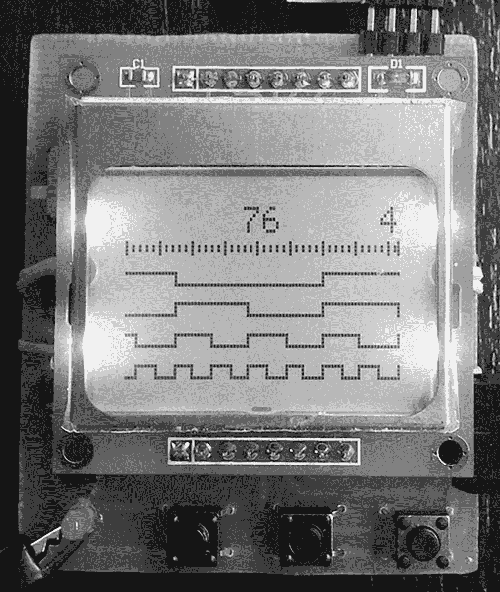

图 1-1：一款廉价的逻辑分析仪

你可以使用逻辑分析仪通过 AVR 微控制器运行多种显示方式，从像图 1-1 中展示的廉价黑白显示器到逼真的彩色显示器。有关该项目的更多信息，请访问[`www.serasidis.gr/circuits/mini_logic_analyzer/miniLogicAnalyzer.htm`](https://www.serasidis.gr/circuits/mini_logic_analyzer/miniLogicAnalyzer.htm)。

你还可以使用 AVR 来构建像穿戴式电子设备这样的迷你项目，但你需要一个非常小的开发板来实现这一点。电子爱好者 Erik Kettenburg 梦想着基于最小的 AVR 芯片制作这样的开发板。他将这个想法转化为 Digispark 开发板，如图 1-2 所示，尺寸仅为 17.5 × 19 毫米，并通过 2017 年成功的 Kickstarter 众筹活动建立了一个繁荣的业务。

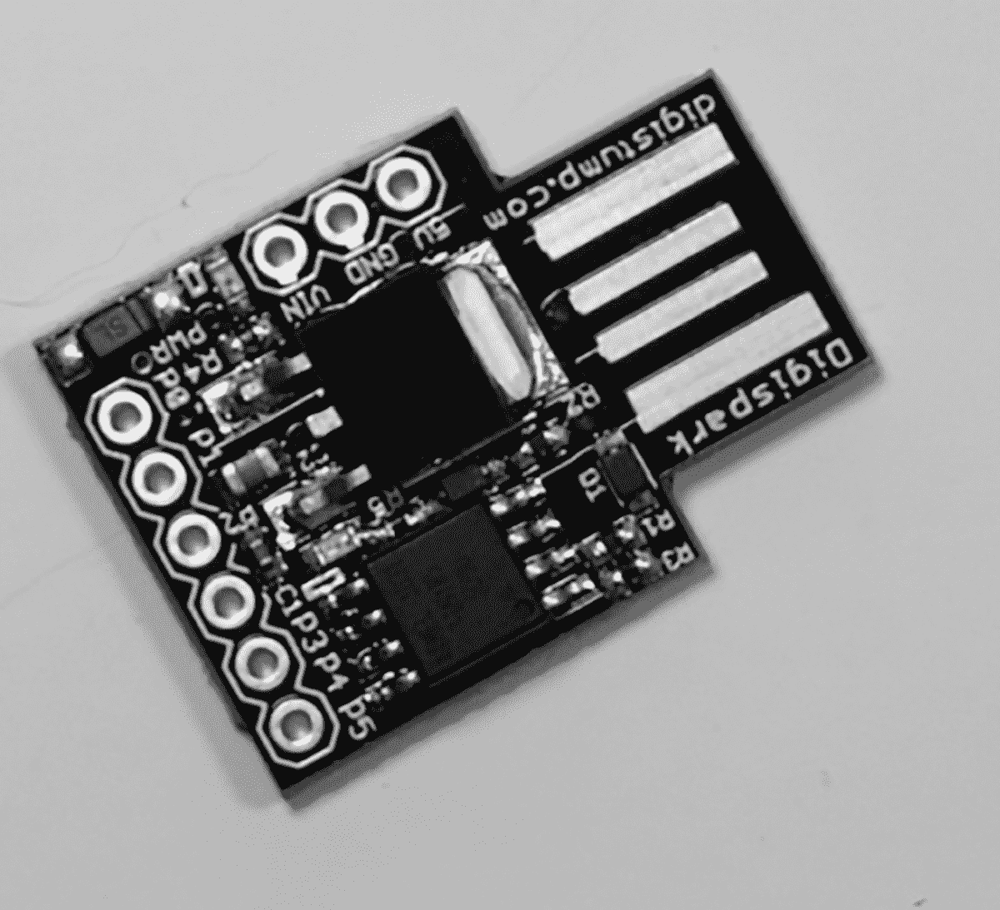

图 1-2：Digispark 开发板的示例

Digispark 开发板的尺寸意味着它所使用的 AVR 微控制器并不像一些更大的芯片那样拥有许多功能——例如，它的程序存储空间较少。然而，Digispark 允许你通过 USB 直接编程微控制器，而通常你需要购买一个单独的编程设备。欲了解更多关于 Digispark 开发板的信息，请访问[`digistump.com/`](http://digistump.com/)。

除了将 AVR 用于专业用途，许多人也纯粹为了乐趣而构建基于 AVR 的项目！一个例子是 2009 年由软件工程师 Ben Ryves 构建的 AVR 电视游戏，显示在图 1-3 中。Ben 使用了非常基础的电子元件和一个 AVR 芯片制作了一个设备，可以插入电视并玩经典游戏*贪吃蛇*和*俄罗斯方块*。

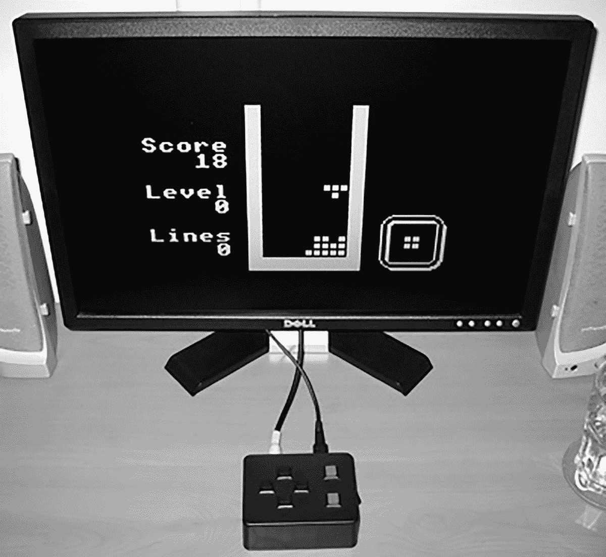

图 1-3：在 AVR 电视游戏上玩*俄罗斯方块*

AVR 可以生成视频信号与电视通信，而无需额外的硬件，并且凭借一些想象力，你可以将自己的游戏程序到微控制器中。欲了解更多信息，请访问[`benryves.com/products/avrtvgame/`](http://benryves.com/products/avrtvgame/)。

工程师 Adam Heinrich 甚至在 2017 年基于 AVR 芯片自己制造了一个手机，并配备了彩色触摸屏界面。Adam 的“AvrPhone”是便携式的，可以移动使用，显示在图 1-4 中。欲了解更多信息，请访问[`projects.adamh.cz/avrphone/`](http://projects.adamh.cz/avrphone/)。

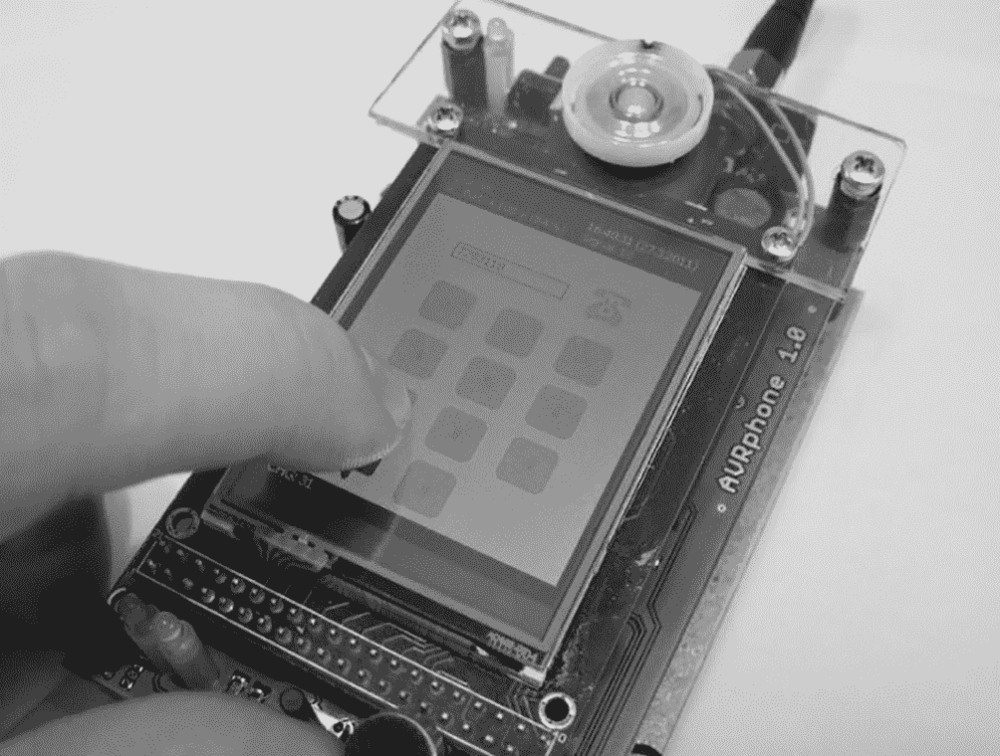

图 1-4：AvrPhone

就像这些创客一样，凭借一些努力，你也可以弥合业余爱好者的实验与完整产品开发之间的差距！但现在，让我们先详细讨论一下你将在本书中使用的各个部件。

## Microchip 的 AVR 微控制器

在本书中，你将使用图 1-5 中所示的两款微控制器，它们是 Microchip Technology 作为其 AVR 产品线的一部分生产的。较小的一款是 ATtiny85，它有 8 个*引脚*，这些引脚是黑色芯片两侧突出的金属片，允许你从微控制器向外发送和接收数据和电力。较大的 AVR 是 ATmega328P-PU，它有 28 个引脚。

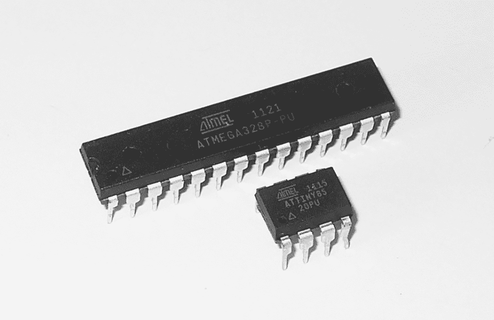

图 1-5：我们的 AVR 微控制器，ATtiny85 和 ATmega328P-PU

注意：在本书中以及购买零件时，你可能会看到微控制器标注为“Atmel”。Microchip 在 2016 年收购了 Atmel，但在写作时，一些供应商仍然有 Atmel 品牌的产品；无论哪种标签都可以。

除了大小，ATtiny85 和 ATmega328P-PU 微控制器之间还有一些重要的差异，如 表 1-1 所列。

表 1-1：ATtiny85 和 ATmega328P-PU 微控制器的规格

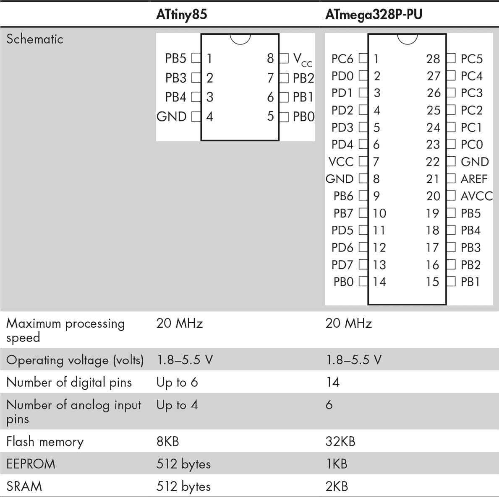

表 1-1 中的规格描述了每个芯片的物理限制，它们将帮助你确定可以与微控制器一起使用的其他电子元件。每次开始一个新项目时，你都需要仔细考虑这些信息，以下是每项规格的简要说明：

原理图 这是表示与电子元件连接的图示，例如本表中的微控制器。你将在 第二章 中了解更多关于原理图符号的内容。

最大处理速度 这一行告诉你微控制器处理数据的速度，单位是每秒周期数。注意，时钟速度并不总是等于处理速度，因为某些指令可能需要多个周期才能完成。

工作电压 这一行显示了你可以安全使用的电压范围来为微控制器供电。如果你提供的电压低于 1.8V，芯片将无法启动；但如果你尝试提供超过 5.5V 的电压，芯片可能会烧坏！

数字引脚 这一行显示了可以发送或接收数字数据的引脚数量。数字数据通过电压信号表示；数字“1”和“0”分别表示“开”或“关”的电压。这些电压信号随后被组合在一起表示各种形式的数据。所有微控制器都有可以设置为数字输入或输出的引脚，用于控制外部设备。

模拟输入引脚 这一行显示了可用来测量电压水平的物理输入引脚数量。模拟输入引脚可以让你读取像 *传感器* 这样的设备的信息，这些设备会根据其周围环境的变化输出不同的电压。

闪存 这一行显示芯片上可用的闪存容量。为了告诉你的微控制器该做什么，你需要编写程序，这些程序存储在闪存中，即使关闭电源后仍然会保留。如果程序的文件大小超过了你的 AVR 微控制器的内存容量，它将无法加载！

EEPROM 这一行告诉你芯片上有多少 *电可擦可编程只读存储器 (EEPROM)* 可用。即使微控制器关闭，EEPROM 也能保存程序生成的数据。例如，如果你希望每次启动项目时在 LCD 上显示某个图像，你可以将该图像存储在 EEPROM 中以供以后使用。

SRAM 本行告诉你芯片上可用的*静态随机存取内存（SRAM）*的大小。这是存储由你的程序创建的临时数据的内存空间。就像你台式机中的 RAM 一样，SRAM 是你的程序在运行时生成的所有信息存储的地方，直到电源关闭时这些数据被删除。这些数据可能包括传感器数据、计算结果等。

我将在后续章节中详细介绍这些和其他重要功能。现在，让我们开始设置你的 AVR 微控制器实验室。

## 所需零件和配件

你不需要购买大量昂贵的零件来开始本书中的项目；假设你已经有一台现代个人计算机，你可以以约 50 美元的预算，通过微控制器获得很多乐趣。我会在每个项目中为你提供需要的零件清单，你还可以从[`nostarch.com/avr-workshop/`](https://nostarch.com/avr-workshop/)下载本书中所有使用零件的清单。我建议你现在就订购前几章项目所需的零件，这样就不必等太长时间才能收到货。

### 电子元件

AVR 微控制器和电子元件可以从许多零售商处购买，这些零售商提供各种产品和配件。在购物时，请务必购买我列出的原装零件，而不是山寨产品，否则你有可能收到有缺陷或性能不佳的商品。不要冒险购买劣质产品，因为从长远来看，这可能会让你付出更多的代价！

在每个项目开始时，务必阅读硬件清单，并确保在开始之前购买正确的组件。以下是一些推荐的 AVR 相关部件和配件供应商。前五个供应商提供全球范围的服务，最后四个是特定国家的供应商，如下所示：

+   • DigiKey: [`www.digikey.com/`](https://www.digikey.com/)

+   • element14/Farnell: [`farnell.com/`](http://farnell.com/)

+   • PMD Way: [`pmdway.com/`](http://pmdway.com/)

+   • SparkFun 电子产品: [`www.sparkfun.com/`](https://www.sparkfun.com/)

+   • Mouser: [`www.mouser.com/`](https://www.mouser.com/)

+   • Freetronics 澳大利亚: [`www.freetronics.com/`](https://www.freetronics.com/) (仅限澳大利亚)

+   • Altronics: [`www.altronics.com.au/`](https://www.altronics.com.au/) (仅限澳大利亚)

+   • Newark: [`www.newark.com/`](https://www.newark.com/) (仅限美国)

+   • MindKits: [`www.mindkits.co.nz/`](https://www.mindkits.co.nz/) (仅限新西兰)

我可以根据个人经验为这些供应商担保，但全球还有许多其他供应商。一般来说，尽量选择提供技术支持和销售支持的公司，而不仅仅是简单的销售代理或大型零售网站上的商品列表。

### 选择 AVR 编程器

你需要将像图 1-6 所示的*编程器*从电脑连接到你的微控制器电路，以便将程序和数据加载到芯片中。找到一个好的编程器对于 AVR 世界的成功至关重要，通过快速的网络搜索“AVR programmer”你会发现很多选择。本书中的项目使用*USBasp 编程器*，这是一种连接你电脑与 AVR 项目的设备，用于将代码发送到你项目的微控制器。你可以从前一部分列出的任何商店购买，价格（打印时）不到 20 美元。

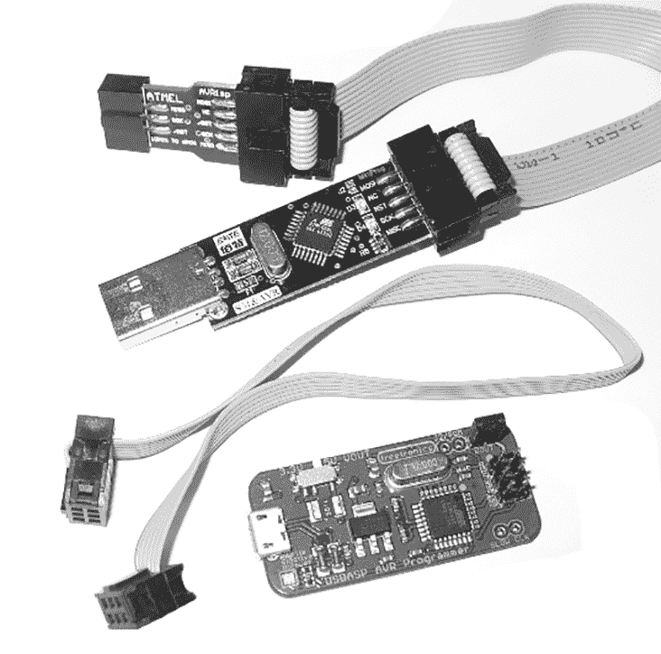

图 1-6：USBasp AVR 编程器示例

USBasp 应该与 AVR 编程所需的开源软件兼容。这是由 Thomas Fischl 创建的开源设备，只有在与基于 Windows 的 PC 一起使用时才需要 USB 驱动程序。在购买 USBasp 编程器时，确保它附带 6 针（而不是 10 针）排线，以便你可以用它进行本书中的项目。

## 所需软件

在本节中，你将设置一个*工具链*，它将让你为 AVR 微控制器编程。这个工具链由一系列软件组成，它将你输入的程序指令转换为 AVR 可以理解的形式，并将其存储到闪存中。编程过程分为三个阶段，每个阶段使用不同的软件（即“链”中的不同“工具”）：

1.  1\. 使用文本编辑器软件，你输入、编辑并保存包含指令的代码，供 AVR 使用。

1.  2\. 编译器软件将你创建的代码转换为微控制器可以理解的机器代码。

1.  3\. 接下来，编程软件将机器代码文件上传到微控制器。此时，AVR 应该开始执行你告诉它要做的事情。

你可以在任何基本文本编辑器中编写程序，例如 Windows 上的记事本或 macOS 上的 TextEdit。你还需要一个包含编译器和编程软件的包。在接下来的三部分中，我将解释如何为运行 MacOS、Ubuntu Linux 和 Windows 7 及以上版本的电脑获取并安装这些软件。

### macOS 10.6 或更高版本

要在 Mac 上安装所需的软件，请打开 macOS 的终端应用程序并输入以下命令：

```

      `/bin/bash -c "$(curl -fsSL https://raw.githubusercontent.com/Homebrew/install/HEAD/install.sh)"` 

```

这将安装允许你在 macOS 上运行 32 位程序的软件。你可能会被提示输入密码，然后软件将开始运行，如图 1-7 所示。

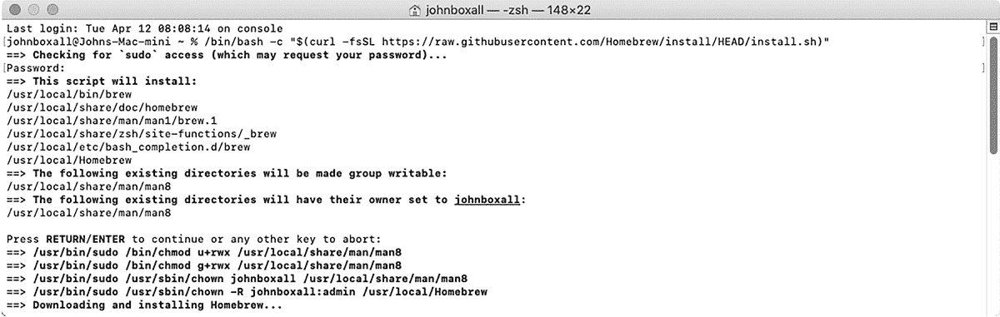

图 1-7：在 macOS 上开始安装工具链。

完成后，输入以下内容到命令行：

```

      `brew tap osx-cross/avr` 

```

完成后，输入以下命令：

```

      `brew install avr-gcc avrdude` 

```

这是最后一步，它安装所需的 AVR 软件。安装完成后，命令提示符会重新出现，如图 1-8 所示；然后你可以关闭终端应用程序。

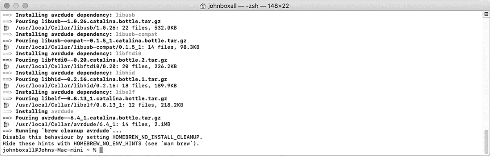

图 1-8：安装完成。

现在你已经安装了工具链软件，跳到“电流、电压与功率”章节。

### Ubuntu Linux 20.04 LTS 或更高版本

要在 Ubuntu Linux 20.04 LTS 中下载并安装 AVR 工具链，首先确保你的系统完成了所有最新的更新。接下来，打开终端窗口并输入以下命令：

```

      `sudo apt-get install gcc build-essential` 

```

如果要求，输入你的密码。然后，可能会询问你是否继续：输入`Y`并按回车。大量描述各种软件包的文字会滚动显示，然后命令提示符应该再次出现。输入以下命令：

```

      `sudo apt-get install gcc-avr binutils-avr avr-libc gdb-avr` 

```

如果安装过程需要，重新输入密码并授权继续。然后输入以下命令：

```

      `sudo apt-get install avrdude` 

```

在短时间内（取决于计算机和互联网连接的速度），所有必需的软件应该安装完成。现在你需要为 USBasp 编程器安装 USB 驱动程序。为此，输入以下命令：

```

      `sudo apt-get install libusb-dev` 

```

如果系统提示，输入你的密码并输入`Y`以继续。最后，检查驱动程序是否正常工作。将 USBasp 插入计算机的 USB 端口，然后输入以下命令：

```

      `lsusb` 

```

片刻后，连接到计算机的 USB 设备列表应该显示出来，像这样：

```

      Bus 002 Device 003: ID 045e:00cb Microsoft Corp. Basic Optical Mouse v2.0

      Bus 002 Device 004:
      `ID 16c0:05dc Van Ooijen Technische Informatica` 

      Bus 002 Device 002: ID 8087:0020 Intel Corp. Integrated Rate Matching Hub

      Bus 002 Device 001: ID 1d6b:0002 Linux Foundation 2.0 root hub

      Bus 001 Device 004: ID 04f2:b1d6 Chicony Electronics Co., Ltd CNF9055

      Toshiba Webcam

      Bus 001 Device 003: ID 0bda:0138 Realtek Semiconductor Corp. RTS5138

      Card Reader Controller

      Bus 001 Device 002: ID 8087:0020 Intel Corp. Integrated Rate Matching Hub

      Bus 001 Device 001: ID 1d6b:0002 Linux Foundation 2.0 root hub

```

在这个例子中，USBasp 是列表中的第二个项目。如果你的设备没有出现，请检查与 PC 的连接，重启计算机，然后再次尝试`lsusb`命令。

注意 由于 Linux 的开源特性，有许多不同的操作系统版本，这些版本在本书中无法涵盖或记录。如果你仍然遇到问题，或者希望了解如何在其他 Linux 版本上安装工具链的详细信息，请访问[`www.nongnu.org/avr-libc/user-manual/install_tools.html`](http://www.nongnu.org/avr-libc/user-manual/install_tools.html)。

安装完成后，继续阅读标题为“电流、电压与功率”的章节。

### Windows 7 至 11

在 Microsoft Windows 中设置工具链需要额外的步骤：你首先需要下载并安装软件，然后安装适用于你的编程器的驱动程序。

#### 安装工具链

要在 Windows 上安装所需的软件，请按照以下说明进行操作：

1.  1. 打开你的网页浏览器，访问[`sourceforge.net/projects/winavr/files/WinAVR/`](https://sourceforge.net/projects/winavr/files/WinAVR/)下载页面，如图 1-9 所示。

    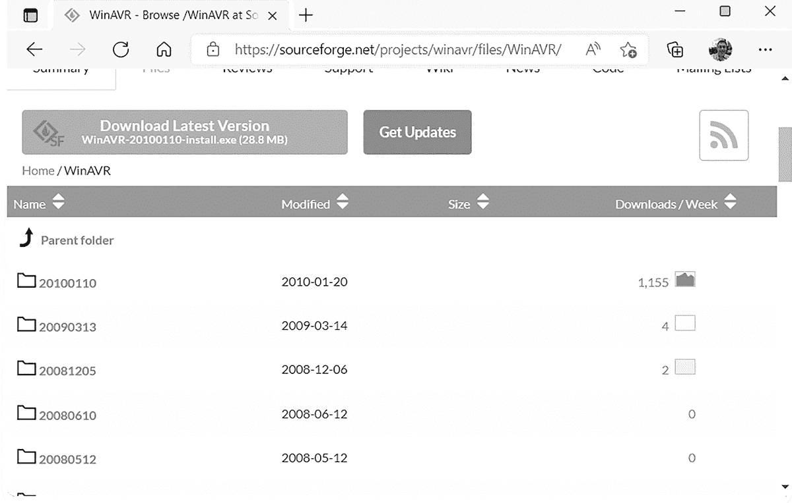

    图 1-9：Windows 的 WinAVR 下载页面

1.  2\. 点击**下载最新版本**按钮以开始软件下载。经过一段时间后，工具链安装程序应该已经下载完成。在资源管理器中打开*下载*文件夹，如图 1-10 所示，您应该能看到 WinAVR 安装文件。

    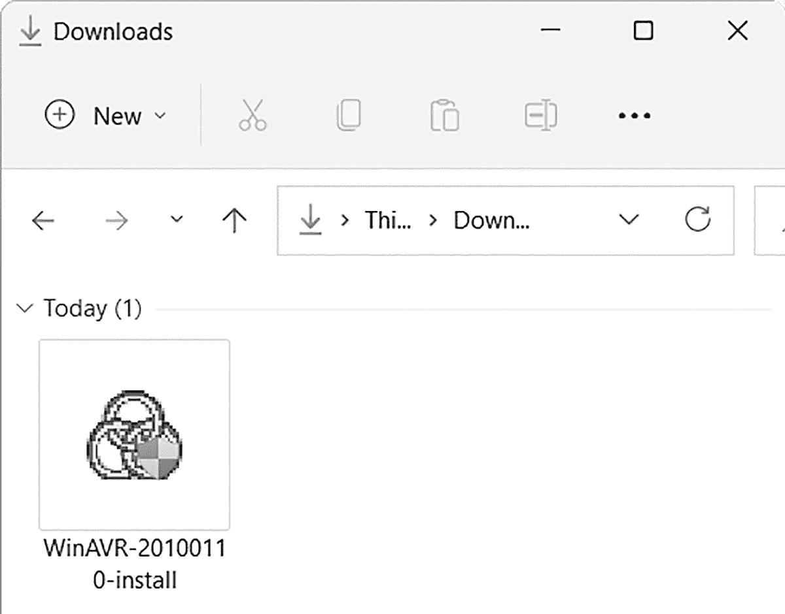

    图 1-10：WinAVR 软件包

1.  3\. 双击安装包，选择您的语言后，您将看到 WinAVR 安装向导，如图 1-11 所示。

    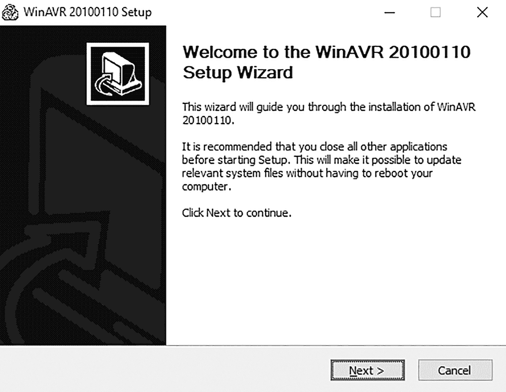

    图 1-11：WinAVR 安装向导

1.  4\. 在安装向导中点击**下一步**，当出现许可协议时点击**我同意**。

1.  5\. 接下来窗口会提示您选择安装工具链的文件夹。您可以通过点击**下一步**选择默认路径，如图 1-12 所示。

    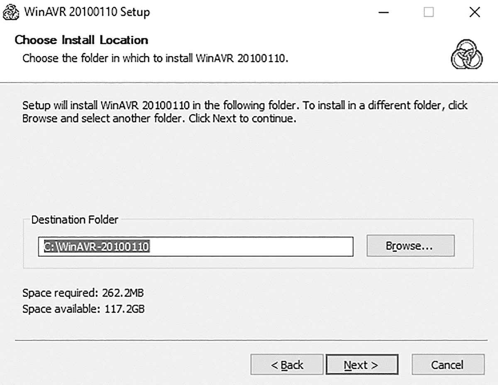

    图 1-12：选择文件位置

1.  6\. 接下来出现的窗口，如图 1-13 所示，会要求您选择安装的组件。勾选所有三个框并点击**安装**。

    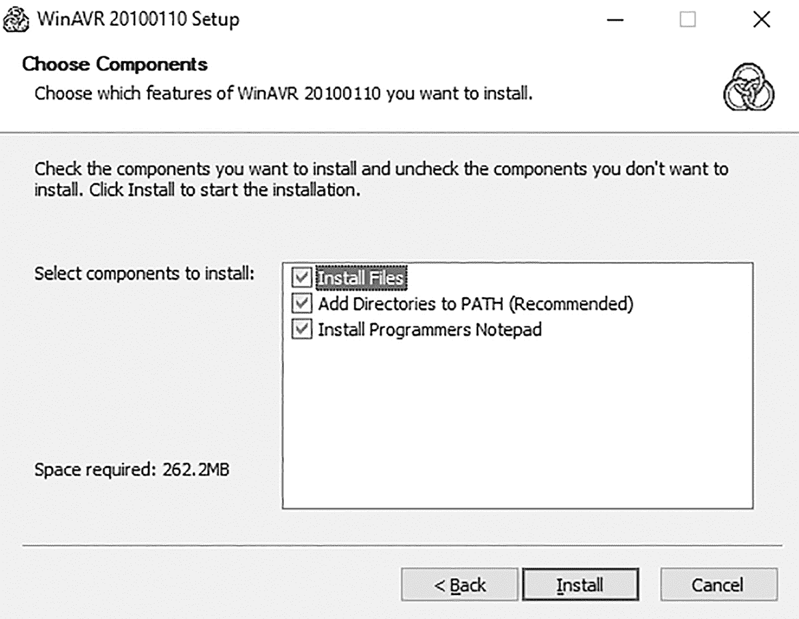

    图 1-13：选择要安装的组件

1.  7\. 安装向导将显示进度条，安装文件时会进行显示。安装完成后，点击**完成**按钮关闭向导。

1.  8\. 现在，您应该看到 WinAVR 用户手册页面，如图 1-14 所示。

    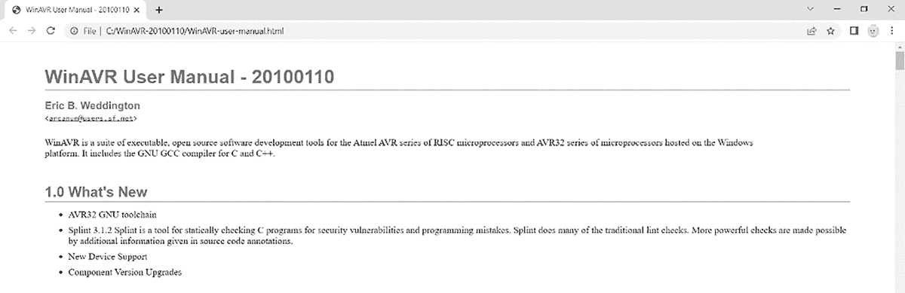

    图 1-14：WinAVR 用户手册页面

    请在您的网页浏览器中收藏此页面，稍后会用到。

#### 安装 USBasp 驱动程序

与其他操作系统不同，Windows 需要您安装驱动程序才能启用 USBasp 编程器。不同品牌的 USBasp 编程器需要不同的驱动程序，您所需的驱动程序取决于您购买的品牌。您可以在 Thomas Fischl 的官网找到通用 USBasp 的 Windows 驱动程序及安装说明：[`www.fischl.de/usbasp/`](https://www.fischl.de/usbasp/)。如果您使用的是像 Freetronics 这样的“品牌”编程器，请参考产品页面获取正确的驱动程序和安装说明。

一旦你安装了 USBasp 编程器的驱动程序，你可以通过将其插入并访问 Windows 设备管理器来快速确认安装是否成功，如图 1-15 所示。

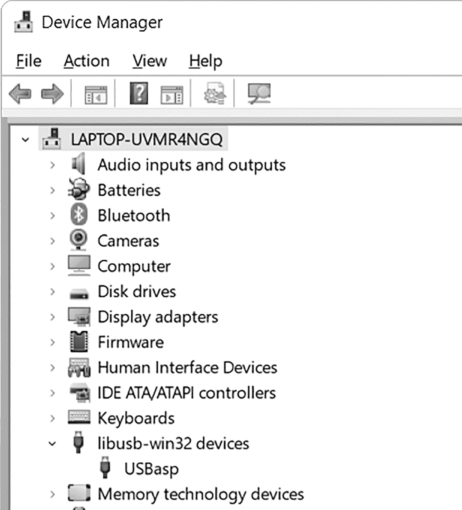

图 1-15：设备管理器中的 USBasp

你应该看到 USBasp 列在*libusb-win32 设备*类别中。现在你已经在电脑上安装了本书所需的软件，接下来是时候了解电学基础知识了！

## 电流、电压与功率

为了使用基于 AVR 的项目构建电子电路，你需要对电力的工作原理有基本的了解。简单来说，*电力*是一种能量形式，你可以利用并转化为热能、光能、运动和功率。电力有三个对我们而言重要的主要特性：电流、电压和功率。

*电流*是电能通过电路流动的过程，从电源的正极（例如电池）流向负极。在没有电池供电的电路中，负极通常被称为*地（GND）*。这种电流被称为*直流电（DC）*。（对于本书而言，你不会接触到由 110 V 或 230 V 市电提供的*交流电[AC]*。）电流的单位是安培（或安），简写为 A。小量的电流则以毫安（mA）来衡量，1,000 mA 等于 1 A。

*电压*是电路正负端之间势能差的表示，单位为*伏特（V）*。电压越大，电流在电路中的流动速度就越快。

*功率*是衡量电气设备将能量从一种形式转换为另一种形式的速率。功率的单位是*瓦特（W）*。例如，一个 100 W 的灯泡比 60 W 的灯泡亮得多，因为更高瓦数的灯泡将更多的电能转化为光。

电压、当前和功率之间存在简单的数学关系：

功率（*W*） = 电压（*V*） × 电流（*A*）

本书后续章节将详细解释此公式的应用。

## 电子元件

现在你已经了解了电学的基本概念，接下来我们来看看电力如何与电子元件和设备互动。电子*元件*是电路中的部分，它们控制电流并让你的设计成为现实。就像汽车的多个部件协同工作让我们能够驾驶一样，电子元件也会共同协作，帮助我们利用并控制电力来创造有用的设备。

本书中，我会在需要时解释一些专业元件。以下章节将介绍你在任何项目中需要的一些基本元件。

### 电阻器

一些元件，如 LED，我们稍后将讨论，工作时只需要少量电流——通常约为 10mA。当元件接收到过多电流时，它会将多余的电流转化为热量，这可能会损坏或摧毁元件。为了减少电流流动，可以在电压源和元件之间添加一个*电阻器*。电流沿电线自由流动，但当遇到电阻器时，电流流动会受到限制。电阻器将部分电流转化为少量热能，热能的大小与其电阻值成正比。

图 1-16 显示了常用电阻的两个示例。

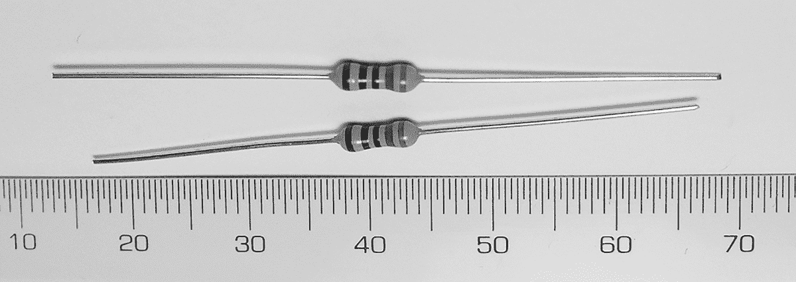

图 1-16：典型的电阻器

电流流动的限制量由电阻的大小决定，可以是固定的或可变的。电阻的单位是欧姆（Ω），范围从零到数千欧姆（千欧姆，或 kΩ）或数百万欧姆（兆欧姆，或 MΩ）。

#### 读取电阻值

电阻非常小，因此它们的阻值通常无法直接打印在元件上。一种常见的显示电阻阻值的方法是使用一系列颜色编码带，如图 1-16 所示（以灰度显示），每种颜色代表一个数值。*倍增带*决定了在前面的数字后面添加多少个零来完成该值。具有五个带的电阻比四带电阻具有更高的精度。

以下是如何从左到右读取这些带：

第一带 电阻的第一位数字

第二带 电阻的第二位数字

第三带 倍增器（对于四带电阻）或电阻的第三位数字（对于五带电阻）

第四带 倍增器（对于五带电阻）或电阻的*公差*，衡量其精度的百分比（对于四带电阻）

第五带 电阻的公差（对于五带电阻）

要确定哪一带是最左边的第一带，请检查哪一带最接近电阻的边缘。第一带通常比最后一带更接近左边缘。

表 1-2 列出了电阻上可能出现的不同颜色带及其对应的数值。

| 表 1-2：电阻带的数值，以欧姆为单位 |
| --- |
| 颜色 | 欧姆 |
| --- | --- |
| 黑色 | 0 |
| 棕色 | 1 |
| 红色 | 2 |
| 橙色 | 3 |
| 黄色 | 4 |
| 绿色 | 5 |
| 蓝色 | 6 |
| 紫色 | 7 |
| 灰色 | 8 |
| 白色 | 9 |

由于制造精确电阻器非常困难，每个电阻器都有一个误差范围，通过最右侧的色环表示。棕色色环表示 1 百分比公差，金色表示 5 百分比公差，银色表示 10 百分比公差。公差越小，电阻器的精度越高。也就是说，1 百分比电阻器的值只能在±1 百分比范围内波动，而 5 百分比电阻器的值则可以在±5 百分比范围内波动。

图 1-17 显示了一个电阻器的示意图。

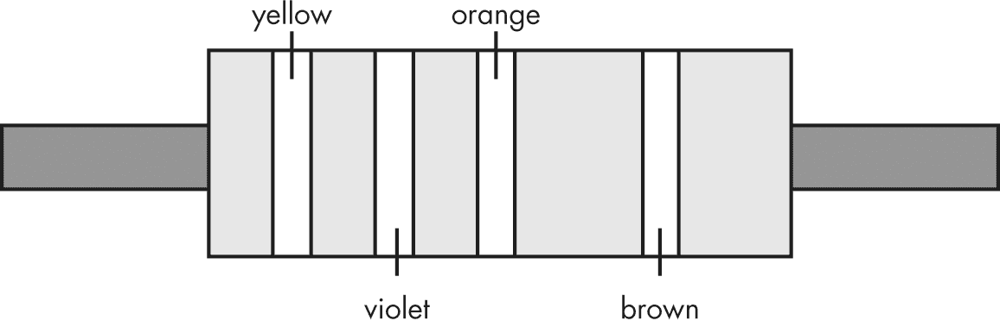

图 1-17：一个电阻器的示例图

黄色、紫色和橙色的色环分别代表 4、7 和 3，如表 1-2 中所列，棕色色环表示公差（1 百分比）。这些值转化为 47,000 Ω，更常写作 47 kΩ。通常，欧姆（Ω）会简写为 R；例如，一个 220 Ω的电阻器可能被表示为 220 R。

另一种读取电阻值的方法是使用*万用表*，这是一种非常有用且相对便宜的测试设备，可以测量电压、电阻、电流等。图 1-18 展示了一台万用表正在测量一个电阻器。

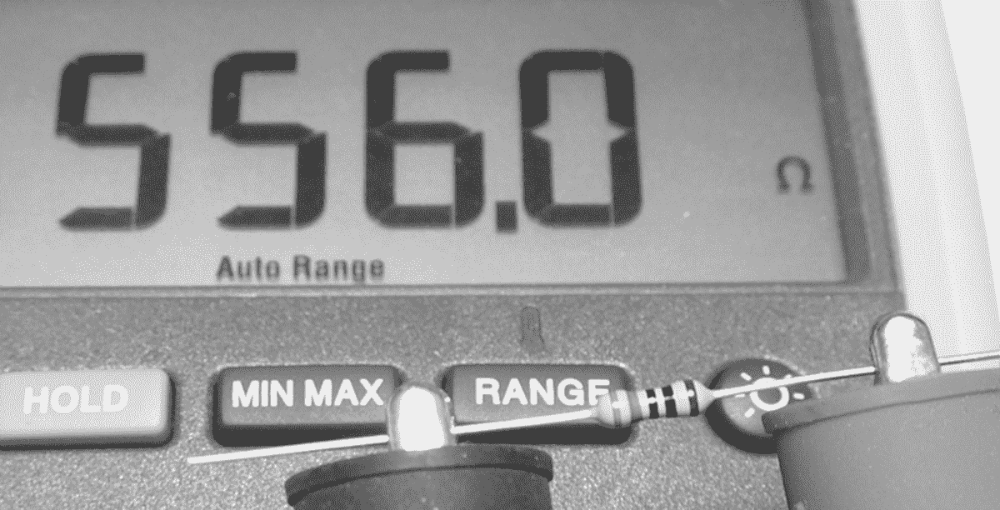

图 1-18：一台万用表正在测量一个 560 Ω 1 百分比公差的电阻器

如果你是色盲，万用表是必不可少的。即使你不是色盲，我也强烈建议购买一个：它将为你节省大量时间，并减少由于误读电阻色环而可能引发的错误。和其他好工具一样，购买万用表时，请从信誉良好的零售商处购买，而不是在网上随便寻找最便宜的。

#### 功率额定值

电阻器的*功率额定值*是它在过热或失效之前能承受的功率，单位为瓦特。在选择电阻器时，你需要考虑功率、电流和电压之间的关系。电流或电压越大，电阻器的功率额定值越大。例如，使用公式功率（*W*）= 电压（*V*）× 电流（*A*），当电压为 5 V 且电流为 20 mA 时，所需的功率处理值为 5 × 0.02 = 0.1 W。这与本书中项目中最常用的 0.25 W 电阻器（图 1-16 中的电阻器是 0.25 W 电阻器）相匹配。

如果本书中的项目需要不同的功率处理，我们将在需要时讲解并讨论最佳的电阻器选择。通常，电阻器的功率等级越大，其物理尺寸也越大。例如，图 1-19 中显示的电阻器是一个 5 W 电阻器，尺寸为长 26 毫米，宽 7.5 毫米。

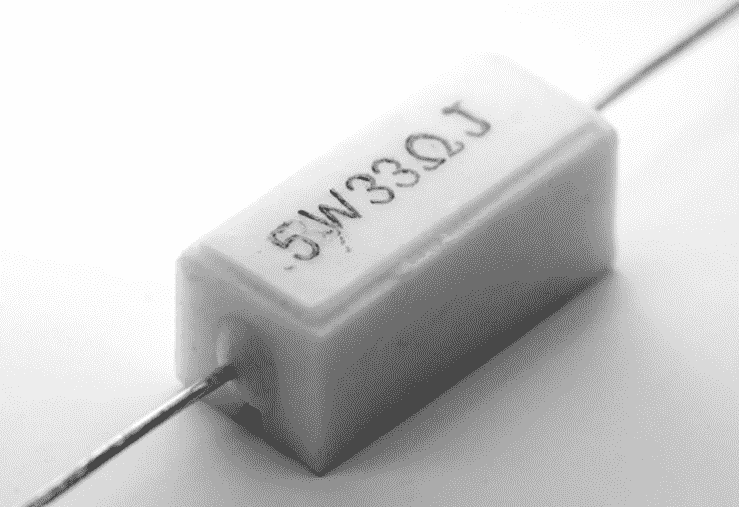

图 1-19：一只 5 W 电阻器

### 发光二极管

LED 是一种非常常见且极为有用的元件，能够将电流转换为光。LED 有各种形状、尺寸和颜色。图 1-20 显示了一种常见的 LED。

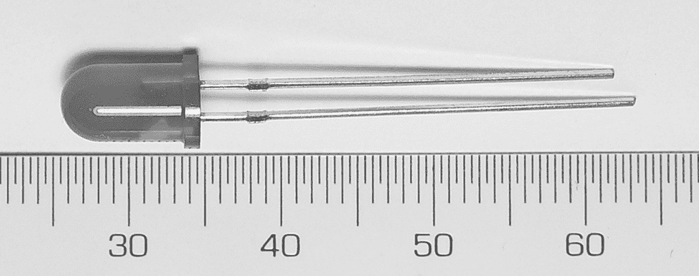

图 1-20：红色 LED，直径 5 毫米

在电路中连接 LED 时需要小心，因为它们是 *极性* 的，意味着电流只能朝一个方向流进流出 LED。电流从 *阳极*（正极）侧进入，从 *阴极*（负极）侧流出，如图 1-21 所示。任何试图使电流反向流动的操作都会损坏 LED。

幸运的是，LED 被设计成可以区分两端。阳极侧的引脚较长，阴极侧则是 LED 底部的边缘是平的，正如图 1-22 所示。

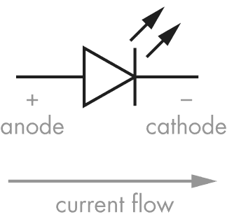

图 1-21：LED 的电流流动

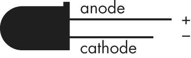

图 1-22：LED 设计显示阳极（较长的引脚）和阴极（平底）两侧。

在项目中添加 LED 时，必须考虑工作电压和电流。例如，常见的红色 LED 需要大约 1.7 V 电压和 5 到 20 毫安电流。这会带来一些小问题，因为本书中的项目所用的电源将输出 5 V 电压并且电流远高于此值。幸运的是，你可以使用 *限流电阻器* 来减小流入 LED 的电流。但该选择哪种电阻器呢？这时，欧姆定律就派上用场了。

*欧姆定律* 表示电压等于电流乘以电阻，即 *V* = *I* × *R*。因此，要计算所需的限流电阻器，你可以使用这个公式：

*R* = ( *V* [s] − *V* [f] ) / *I*

其中 *V* [s] 是供电电压（当从我们的 USBasp 编程器为电路供电时为 5V），*V* [f] 是 LED 的正向电压降（比如 1.7V），*I* 是 LED 所需的电流（10 mA）。*I* 的值必须以安培为单位，因此 10 mA 转换为 0.01 A。你可以将这些值用于你的 LED：将它们代入公式后，*R* 的值为 330 Ω。然而，当电流小于 10 mA 时，LED 仍然会亮起。为了保护敏感的电子元件，最好尽可能使用较低的电流，所以我建议使用 560 Ω，0.25W 的电阻与 LED 配合使用，这样能提供大约 6 mA 的电流。

如果有疑问，始终选择稍微高一些的电阻值，因为比起死掉的 LED，选择一个较暗的 LED 总是更好的！

欧姆定律三角形

欧姆定律指出电流、电阻和电压之间的关系如下：*V* = *I* × *R* 。一种流行的记忆欧姆定律的方法是使用三角形，如下图所示。

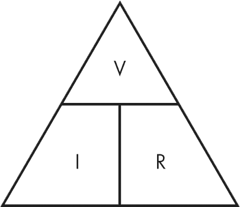

欧姆定律三角形

这个图表是一个方便的工具，可以在已知三个值中的两个时计算电压、电流或电阻。例如，如果你需要计算电阻，将手指放在 R 上，剩下的电压除以电流。要计算电压，遮住 V，剩下的是电流乘以电阻。

### 功率二极管

*功率二极管* 适合在电路中阻止电流单方向流动。功率二极管的使用方式与 LED 相同，但它们不是在电流流动时发光，而是保护电路免受反向电流的影响。二极管有很多不同的类型；我们将使用常见的 1N4004 版本，如图 1-23 所示。

图 1-24 展示了 1N4004 二极管的示意符号，参见图 1-23。

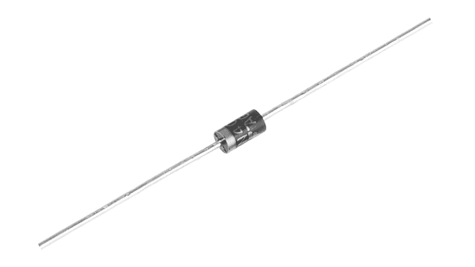

图 1-23：1N4004 功率二极管

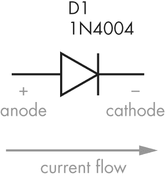

图 1-24：1N4004 示意符号

1N4004 允许最高 1A 的电流从阳极引脚流向阴极引脚。1N4004 还会导致 0.7V 的直流电压降，是在需要时降压的便捷方式。

### 电容器

*电容器*是一种可以储存电荷的设备。它由两片金属板和一个绝缘层组成，允许电荷在它们之间积累。当电流流向电容器时，电荷会积累到最大值。一旦电荷达到最大值，电流就会停止流过电容器。然而，电荷会保留在电容器中，并在电容器提供新的路径时流出，这个过程叫做*放电*。

电容器能够储存的电荷量以法拉（farad）为单位。一法拉实际上是一个非常大的量，因此你通常会看到电容器的数值为皮法拉或微法拉。一皮法拉（pF）是 0.000000000001 法拉，而一微法拉（μF）是 0.000001 法拉。电容器也有额定电压。在本书的项目中，你将只使用低电压，因此你会使用额定电压大于 10 伏左右的电容器。通常来说，在低电压电路中使用额定电压较高的电容器是可以的。电容器常见的电压额定值有 10 伏、16 伏、25 伏和 50 伏。

本书中的项目将使用两种类型的电容器，陶瓷电容器和电解电容器。

#### 陶瓷电容器

图 1-25 展示了一个*陶瓷电容器*。这些电容器非常小，因此储存的电荷量也很小。它们没有极性，可以用于电流双向流动的电路。由于陶瓷电容器的电容值较小，它们在高频电路中表现非常好，因为它们可以非常快速地充电和放电。

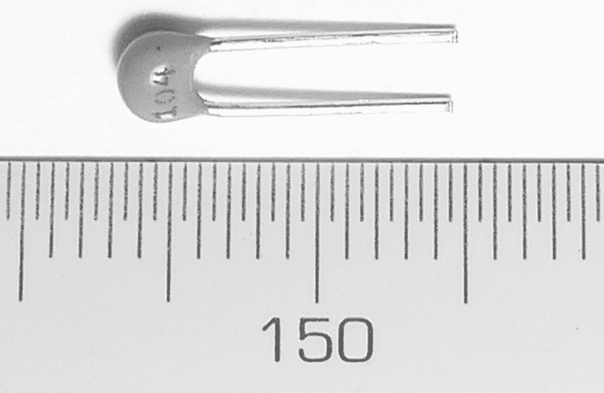

图 1-25：一个 0.1μF 的陶瓷电容器

读取陶瓷电容器的数值需要一些练习，因为它的数值是以某种代码形式打印出来的。前两位数字表示皮法拉（pF）的数值，第三位数字是十位的倍数。例如，图 1-25 中展示的电容器标记为“104”。这意味着 10 后面跟着四个零，即 100,000 皮法拉（相当于 100 纳法，或 0.1 微法）。

零售商或其他项目可能会指定需要你进行一些即时计算的电容值。为了简化这些单位之间的转换，你可以打印出在[`www.justradios.com/uFnFpF.html`](https://www.justradios.com/uFnFpF.html)网站上提供的优秀转换图表。

#### 电解电容器

*电解电容器*在体积上比陶瓷电容器大，提供更高的电容值，并且是极性电容器。外壳上的标记表示正极（+）和负极（–）两侧；例如，图 1-26 展示了标记电容器负极的条纹和小符号（–）。


图 1-26：一个电解电容器

像电阻值一样，标记的电容器值也有一定的容差。与电阻器和陶瓷电容器不同，电解电容器的值直接印在其上，无需解码或解释。图 1-26 中的电容器具有 20% 的容差，负极符号的条纹上标明了这一点，并且标有 100 μF 的电容值，该值印在标签的较暗部分。

电解电容器提供电源平滑和稳定，特别是在电流需求大的电路或部件附近。这能防止电路中出现不必要的掉电和噪声。

### 集成电路

更常见的缩写是*IC*，*集成电路*是将一组电子电路嵌入到一块硅片中，并安装在一个坚固的、通常为矩形的塑料外壳内。电流通过金属引脚或脚垫流入或流出。

IC 引脚通过数字标识，操作 IC 的第一步是弄清楚每个引脚对应的是哪个。首先，查找 IC 的引脚图；它通常可以在供应商的官网上找到。（请查看表 1-1，以查看本书中使用的微控制器引脚图。）然后，查看 IC 上有标记的那一侧，以确定哪个引脚是第一个引脚。通常，这个引脚会有一个小圆圈靠近它。如果没有看到小圆圈，将 IC 垂直放置，缺口端朝上。当 IC 水平放置在你面前时，第一个引脚位于 IC 的左下角，见图 1-27。

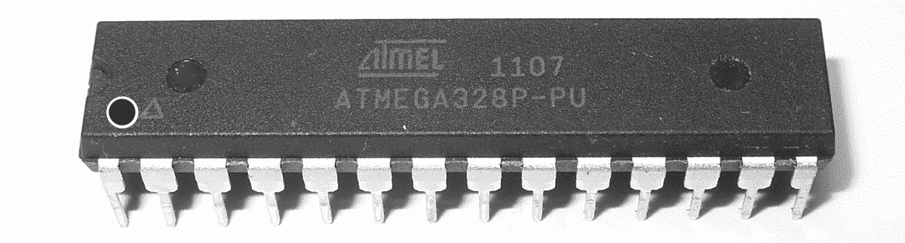

图 1-27：突出显示 IC 的第一个引脚

在从无焊面包板或其他位置插拔 IC 时，要小心不要弯曲引脚，因为它们非常脆弱，容易受到金属疲劳的影响。最好使用*IC 提取器*，这是一种简单但非常实用的爪形工具，可以同时拉动 IC 两端，就像在图 1-28 中展示的那样。

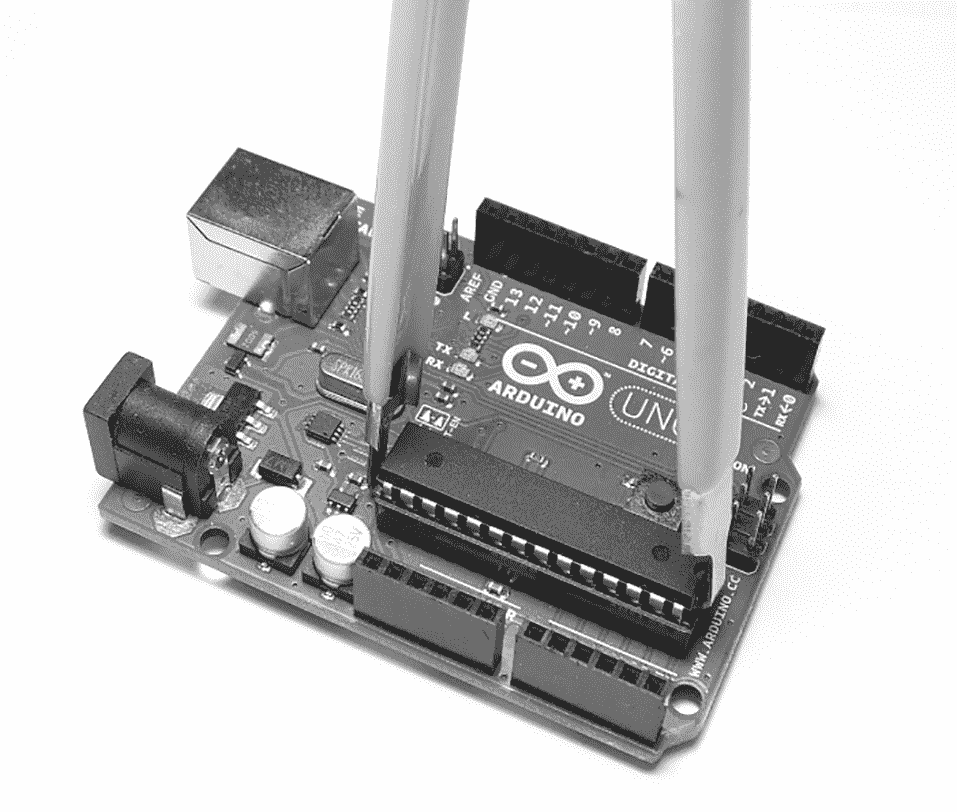

图 1-28：IC 提取器使用示例

使用此设备时，你可以交替缓慢地对每一端施加向上的压力，直到 IC 足够松动，可以慢慢地将其从 IC 插座中拉出。

### 无焊面包板

你需要一个基础平台来搭建你不断变化的电路，无焊接面包板是一个很好的工具。面包板是一个塑料基础，上面有一排排电气连接的插座。面包板有多种尺寸、形状和颜色，如图 1-29 所示。只不过不要在上面切面包。颜色从电气角度来说并不重要，它们只是帮助最终用户区分不同的面包板。

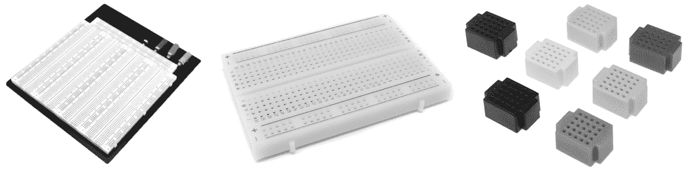

图 1-29：不同形状和大小的面包板

使用面包板的关键是理解插座是如何连接的，无论是短列还是长排，连接方式有所不同。例如，在图 1-30 中的面包板，五个孔的列是纵向连接的，但横向是孤立的。如果你把两根电线插在同一竖直列中，它们会电气连接。相同地，位于横向线条之间的长排插座是横向连接的。你通常需要将电路连接到电源电压和地，这些长的横向孔列非常适合这些连接。

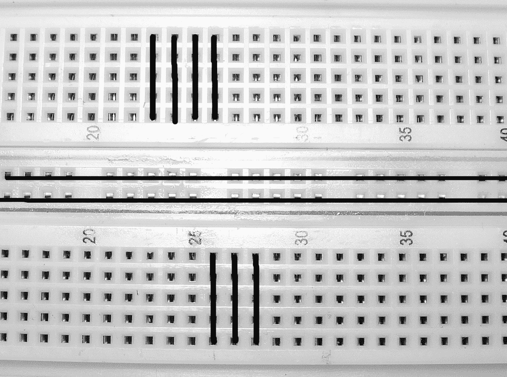

图 1-30：面包板内部连接

当你构建更复杂的电路时，面包板会变得拥挤，你不总能将组件精确放置在想要的位置。你可以通过使用短接线来解决这个问题。销售面包板的零售商通常也会出售各种长度的小盒子电线，比如图 1-31 中展示的那种。

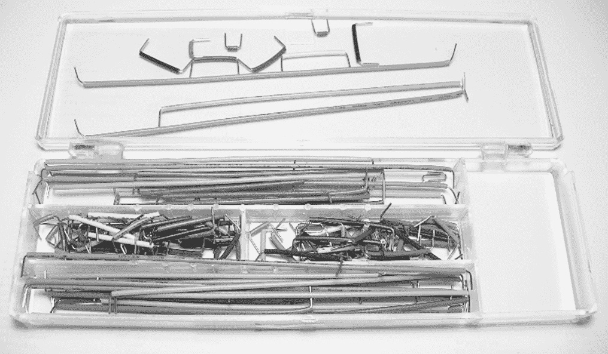

图 1-31：各种面包板接线

### 为你的项目供电

你可以使用多种方法为你的项目供电。为了保持简单和安全，我将只展示几种容易且便宜的选择。

首先，USBasp 本身可以为你的 AVR 电路提供适当的电压。它只提供有限的电流，大约 450 毫安，但对于小型项目，组件数量有限时，这已经足够。然而，这种方法只有在你的项目靠近 USB 插口时才方便使用。

另一个选择是使用带有稳定输出 5V 的*主电源插头*和*直流插孔适配器*。如图 1-32 所示，适配器可以让你将电线连接到一个插孔，插头可以连接到这个插孔。这可以避免修改或损坏插头线的端部。

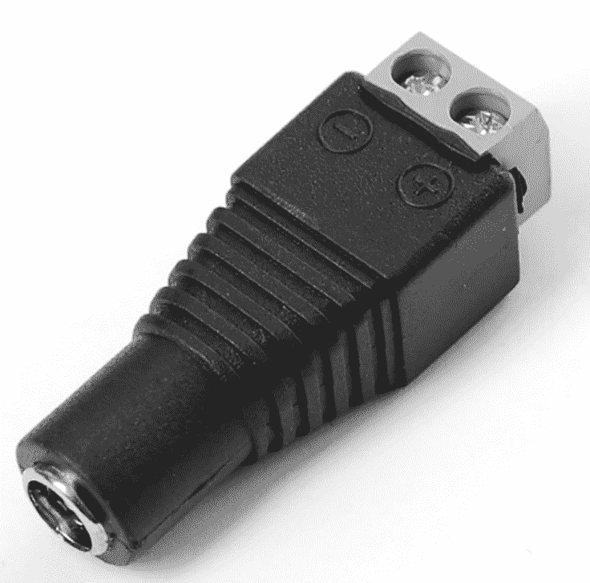

图 1-32：直流插孔适配器

另外，*面包板电源*是一个极好的选择，因为它既便宜又非常易于使用。这是一个小型电路板，插入到你的无焊接面包板的一端，如图 1-33 所示。电源随后将来自市电插头适配器的电流转换为安全的 5 V 或 3.3 V。

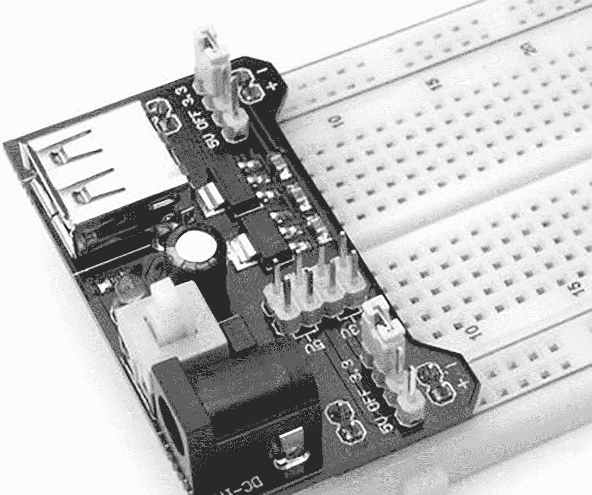

图 1-33：一个无焊接面包板电源

你的最终选择是使用四个可充电的 AA 电池放入电池盒中。当充电后，这些电池每个的电压为 1.2 V。四个电池总共提供 4.8 V，这对于几乎所有项目来说足够接近 5 V。不要使用一次性 AA 电池，因为新电池的初始电压超过 6 V，这会损坏你的项目。你可以将可充电的 AA 电池整齐地放在一个封闭容器中，例如图 1-34 所示的那种。

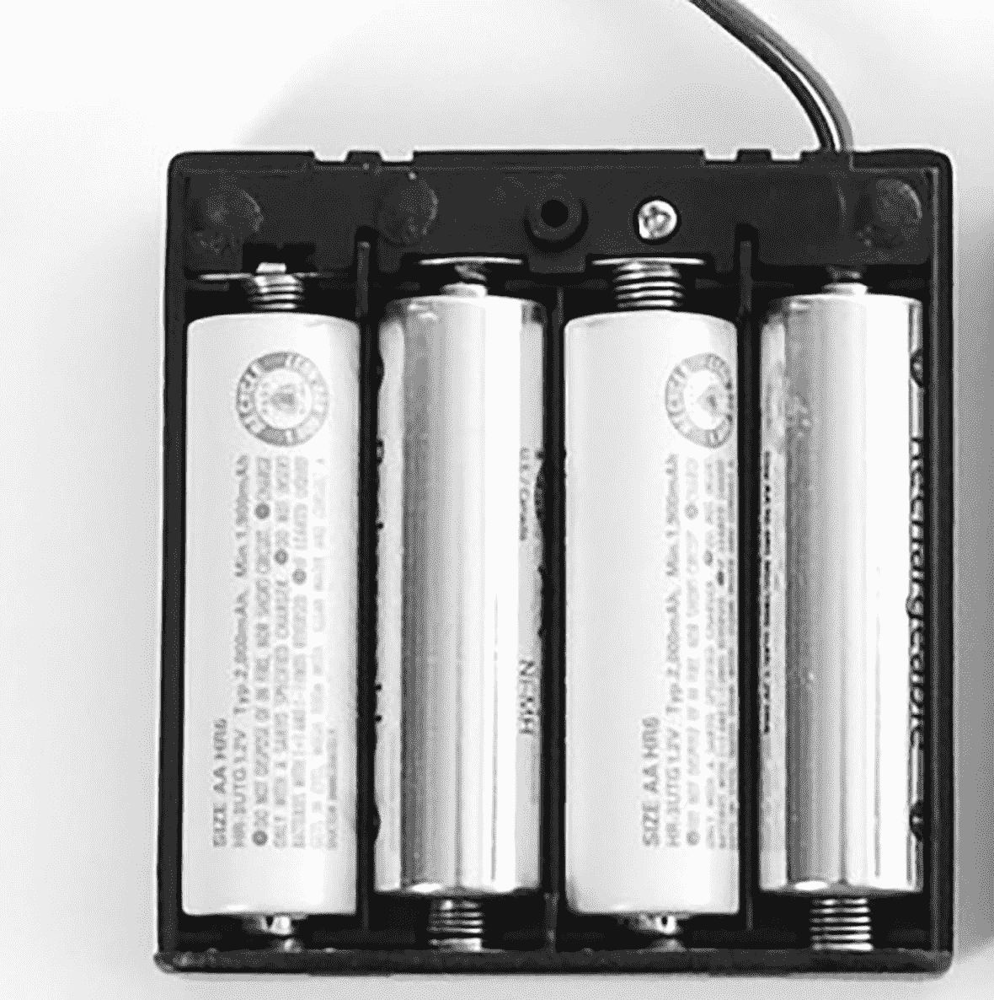

图 1-34：一个四 AA 电池电池盒

本书中的项目使用了本节中讨论的所有四种电源方法，因此你需要为每种方法准备相应的零件。有关更多详细信息，请查看[`nostarch.com/avr-workshop/`](https://nostarch.com/avr-workshop/)上的零件清单。

在本章中，你通过查看一些可能的示例、安装所需软件、学习电力基础以及了解你将使用的一些零件，为你的 AVR 学习打下了基础。现在你已准备好进入下一章，在那里你将构建基于 AVR 微控制器的第一个电子电路，上传你的第一个代码，并开始深入了解微控制器的不同操作。
