# 第二章：# 第一阶段


现在，您已经安装了所需的软件，并准备好进入 AVR 微控制器的世界，本章将通过一些基础电路和代码带您轻松进入第一个 AVR 项目。

在本章中，您将学习如何：

+   • 测试您的 AVR 项目设置。

+   • 阅读基础电路原理图。

+   • 使用 AVR 微控制器的数字输出引脚控制 LED，包括 ATtiny85 和 ATmega328P-PU。

我还将向您展示如何使用 `#define` 宏和 `for` 循环开始编写代码，以及如何使用按位算术和位移操作高效生成输出。

## 测试硬件和工具链

在此时，明智的做法是检查 USBasp 编程器和之前安装的工具链是否按预期工作。我们将通过三个阶段来检查：构建一个简单的电路，测试 USBasp，并将代码上传到微控制器。

### 构建电路

在本节中，您将构建一个简单的设备，使 LED 闪烁，这是测试硬件和工具链的一种有趣且简单的方法。要开始，您需要以下硬件：

+   • USBasp 编程器

+   • 无焊面包板

+   • ATtiny85–20PU 微控制器

+   • 一个 5 毫米红色 LED

+   • 一个 560 Ω 电阻

+   • 七根跳线

现在，让我们专注于实际步骤，将电路连接起来，以确保您的工具链正常工作，并在我们深入更复杂的项目时能够稳定运行。要连接测试电路的组件，首先将无焊面包板放置在平坦的表面上，如图 2-1 所示。

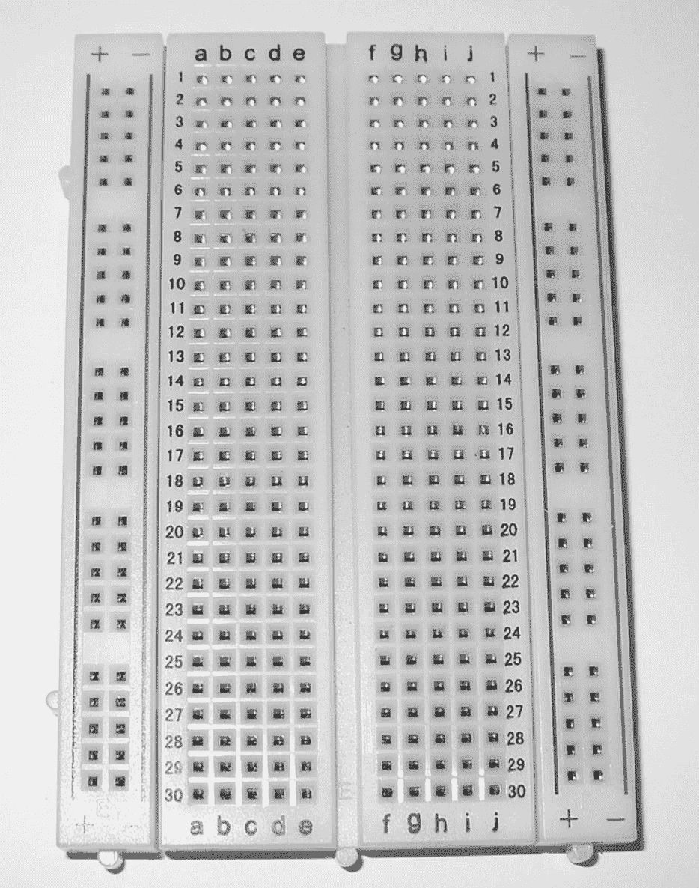

图 2-1：无焊面包板

将 ATtiny85 插入面包板，使其横跨面包板顶部四行的垂直间隙，如图 2-2 所示，确保将微控制器的引脚 1——由引脚旁的小圆圈标记，如第一章中所描述——插入面包板的 e 列，第 1 行。引脚编号是按逆时针方向排列的，因此图中的引脚 4 位于左下角，而引脚 8 位于右上角。

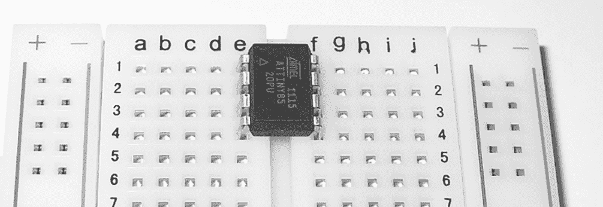

图 2-2：AVR 微控制器在面包板中的位置

现在，拿起 560 Ω 电阻，将一脚插入与 ATtiny85 引脚 2 相同的行，另一脚插入更远几行的位置。如图 2-3 所示，我将第二脚插入第 8 行。

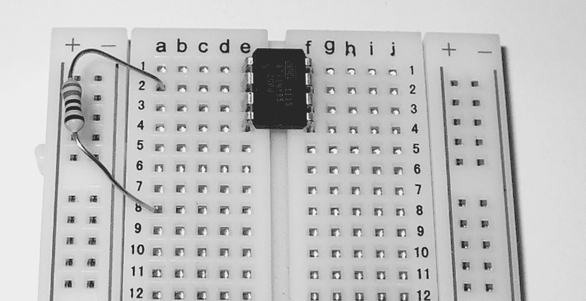

图 2-3：面包板中的电阻

接下来，看看你的 LED。注意，其中一条引脚比另一条长，如 图 2-4 所示。

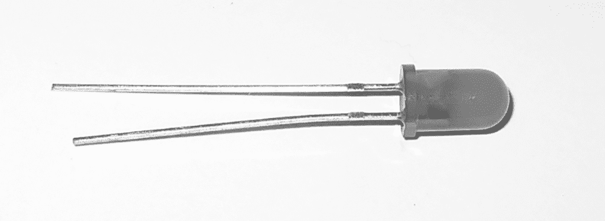

图 2-4：典型的 LED

将 LED 插入无焊接面包板中，较长的引脚与电阻的下端在同一排（在我们的例子中是第 8 排），较短的引脚则插入距其两排的地方，使用 图 2-5 作为指南。

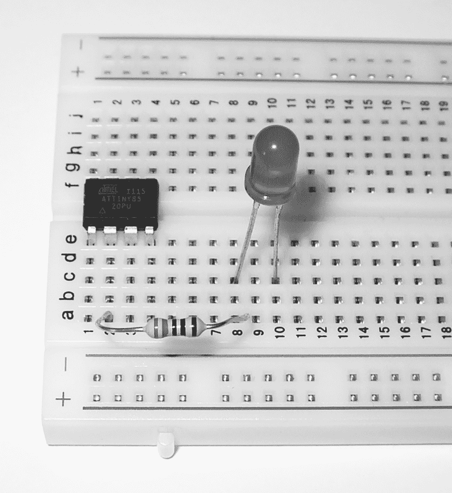

图 2-5：到目前为止的电路

拿一根跳线，将一端插入 LED 较短引脚所在的同一排，另一端插入 ATtiny85 的 4 号引脚所在的同一排，如 图 2-6 所示。

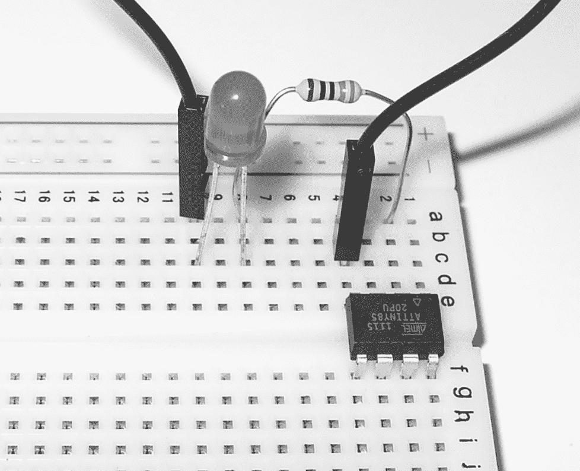

图 2-6：接线开始了！

现在你已经放置好了组件，我将向你展示如何通过 AVR 编程器将代码从电脑传输到微控制器。

### 连接并运行编程器

要将 USBasp 编程器连接到面包板，首先将六根公对母跳线连接到 USBasp 上的六个连接引脚，如 图 2-7 所示。

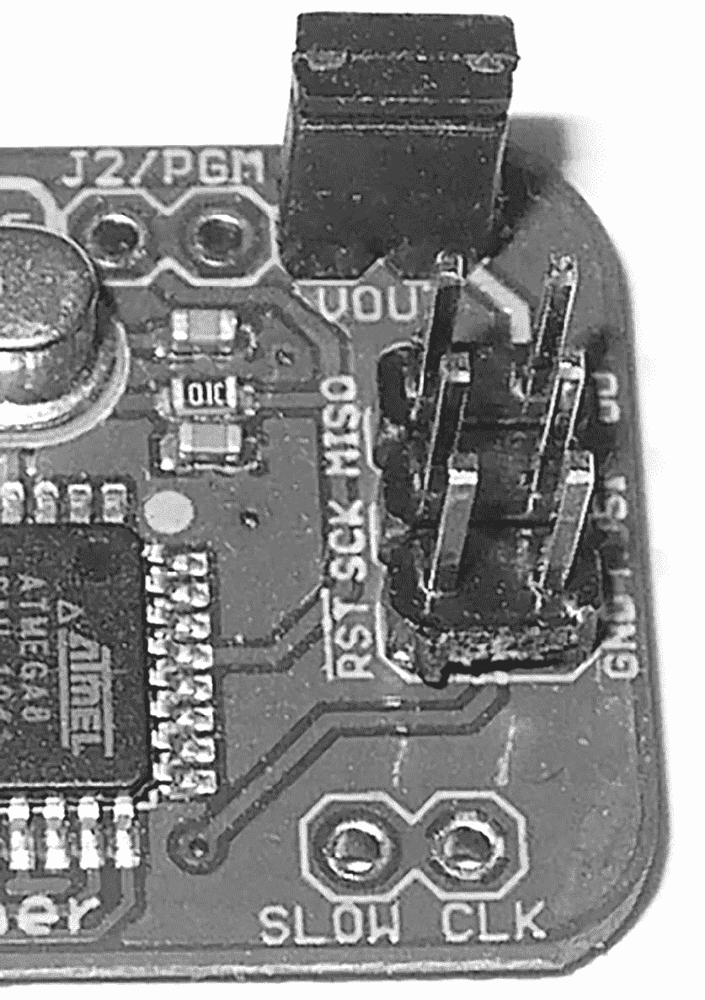

图 2-7：USBasp 连接引脚

接下来，使用 表 2-1 中的映射，将 USBasp 的六个引脚连接到 ATtiny85。每次你编程 ATtiny85 微控制器时，都需要使用这些相同的连接。现在不用担心引脚标签的含义，我将在书中逐步为你解释。

| 表 2-1：USBasp 到 ATtiny85 的连接 |
| --- |
| USBasp 引脚 | ATtiny85 引脚 |
| --- | --- |
| RST | 1 |
| GND | 4 |
| VCC | 8 |
| SCK | 7 |
| MISO | 6 |
| MOSI | 5 |

图 2-8 展示了 USBasp 和 ATtiny85 之间的连接，具体描述见 表 2-1。我已移除电路的其余部分，仅展示了连接的示例。

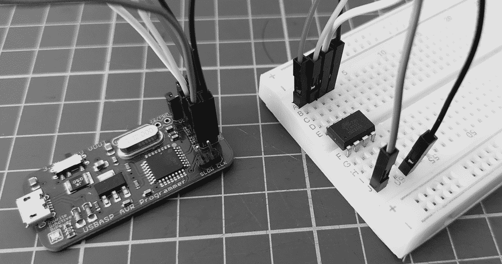

图 2-8：USBasp 连接到 ATtiny85 上的无焊接面包板

接下来，检查 USBasp 是否正常工作，将你的 USBasp 编程器连接到电脑。为此，你需要使用一个名为 AVRDUDE 的程序，它是安装工具链的一部分，用于将代码上传到 AVR 微控制器。打开终端窗口，输入命令 `avrdude -p t85 -c usbasp -B 4`。该命令包含以下选项：

+   • `-p` 选择项目中使用的微控制器类型。你刚才使用了 `t85` 代表 ATtiny85，稍后你将使用 `m328p` 代表 ATmega328P-PU。

+   • `-c` 选择正在使用的硬件编程器类型。在这种情况下，你指定了 `usbasp`，代表你的 USBasp 编程器。

+   • `-B` 设置 USBasp 编程器中微控制器的处理速度。你将该值设置为 `4`，将速度降低到 187.5 kHz。这对新微控制器是必要的，因为它们在出厂时的时钟速度为 1 MHz，低于 USBasp 的默认速度。关于速度的更多内容，我将在第十二章 中解释。

软件工具链应该与编程器和微控制器进行通信，你的终端显示应该像下面这样：

```

      C:\>
      `avrdude -p t85 -c usbasp -B 4` 

      avrdude: set SCK frequency to 187500 Hz

      avrdude: AVR device initialized and ready to accept instructions

      Reading | ################################################## | 100% 0.03s

      avrdude: Device signature = 0x1e930b

      avrdude: safemode: Fuses OK

      avrdude done.  Thank you.

      C:\>

```

通过报告*设备签名*，即 AVR 微控制器类型的唯一标识符，软件工具链表示一切正常。

AVRDUDE 文档（[`www.nongnu.org/avrdude/user-manual/avrdude_4.html`](http://www.nongnu.org/avrdude/user-manual/avrdude_4.html)）描述了除了 `avrdude` 命令中包含的选项之外的其他选项，如果你感兴趣的话。目前，如果你在输入该命令后看到正确的输出，可以跳到项目 0。你已经准备好编程你的 AVR 了！

### 如果它没有成功怎么办？

如果在运行上一步骤中的命令后，出现类似下面的错误，那么说明编程器和电路之间的硬件连接存在问题：

```

      C:\>
      `avrdude -p t85 -c usbasp -B 4` 

      avrdude: set SCK frequency to 187500 Hz

      avrdude: error: programm enable: target doesn’t answer. 1

      avrdude: initialization failed, rc=-1

      Double-check connections and try again, or use -F to override this check

      avrdude done.  Thank you.

      C:\>

```

不要像错误信息建议的那样使用 `-F` 来覆盖检查。相反，请仔细检查 USBasp 与无焊接面包板之间的连线，确保没有连接松动。然后检查电路本身，确认各个组件按“构建电路”部分的说明互相连接。特别是，检查 ATtiny85 的引脚 1 是否与面包板的左上角对齐。错误地放置芯片是最常见的电路错误之一！

如果一切看起来都正确，再次尝试运行 `avrdude` 命令。它应该可以工作，但如果不行，离开几分钟，然后再回过头来复查整个过程。

安全使用 AVR

在我们进入第一个项目之前，提醒大家注意安全：与任何爱好或手工艺一样，保护自己和周围的人是你的责任。在本书中，我讨论了使用基本手工工具、电池驱动的电器、锋利的刀具、切割工具，以及有时使用热烙铁。*在你的项目中，绝对不要直接接触交流电源*。也就是说，不要将你制作的任何东西直接连接到墙壁插座。把这部分交给经过训练的持证电工来处理。记住，直接接触交流电流可能致命。

一旦你的电路工作正常，将它们保留在一起，包括 USBasp，因为你需要所有这些东西来完成 第一个项目。

Project 0: 闪烁 LED

现在你已经有了一个工作的电路和编程器连接，是时候创建并上传你的第一个 *程序*（也称为 *代码*），这是一组指令，告诉微控制器如何完成某项特定任务。

随着本书项目的逐渐复杂，我们的程序会变得越来越长。为了避免手动输入书中每一段代码，请从 [`www.nostarch.com/avr-workshop`](http://www.nostarch.com/avr-workshop) 下载包含本书代码的 ZIP 文件。该文件包含每个项目的文件夹（按章节组织），其中包含代码和完成项目编程所需的其他内容。

注意：如果你正在阅读本书的电子版，请不要直接从书中复制粘贴代码到文本编辑器中。请使用下载的代码文件。

本书中的项目使用 C 编程语言。由于 C 语言在许多微控制器和计算机平台中都很常见，因此如果你需要帮助或想与他人分享工作，应该很容易找到相关的支持。

### 上传你的第一个 AVR 代码

下载并解压本书的代码文件后，使用文本编辑器打开 *Chapter 2* 文件夹中的 *Project 0* 子文件夹内的 *main.c* 文件。这个 C 文件包含一个小程序，编译并上传到微控制器后，它应该会让你的 LED 闪烁。但为了实现预期效果，你需要将每个项目的 C 文件与 *Makefile* 配对使用。

Makefile 包含了一组供工具链在编译并上传代码到微控制器时使用的指令，其中包括微控制器类型、微控制器所需的 CPU 速度，以及你计划使用的编程器类型。每当你开始一个新项目时，都应该为该项目创建一个新文件夹，并将 *main.c* 文件和 Makefile 放入该文件夹内。为了节省你的时间，我已经为 Project 0 和本书中所有其他项目准备好了这些文件。

如果你对 Makefile 的内容感兴趣，可以用文本编辑器打开 Project 0 目录下的 Makefile 文件查看。我会在你进行项目时，介绍书中下载包中 Makefile 的必要修改。

既然你已经熟悉了这些文件类型，现在是时候使用你在本章早些时候构建的电路来实现你的第一个项目了。如果你之前关闭了它，请像测试工具链时那样打开一个终端窗口。接下来，导航到包含项目 0 的两个文件的文件夹，并输入命令`make flash`。

稍等片刻，工具链应当编译程序文件并创建所需的数据文件，以便上传到微控制器。微控制器随后应开始运行该程序；在这种情况下，你的 LED 应该开始闪烁。在此过程中，状态应显示在终端窗口中，如下所示：

```

      C:\>
      `make flash` 

      avrdude -c USBasp  -p attiny85 -B 4 -U flash:w:main.hex:i

      avrdude: set SCK frequency to 187500 Hz

      avrdude: AVR device initialized and ready to accept instructions

      Reading | ################################################## | 100% 0.02s

      avrdude: Device signature = 0x1e930b

      avrdude: NOTE: FLASH memory has been specified, an erase cycle will be performed

      To disable this feature, specify the -D option.

      avrdude: erasing chip

      avrdude: set SCK frequency to 187500 Hz

      avrdude: reading input file "main.hex"

      avrdude: writing flash (108 bytes):

      Writing | ################################################## | 100% 0.05s

      avrdude: 108 bytes of flash written

      avrdude: verifying flash memory against main.hex:

      avrdude: load data flash data from input file main.hex:

      avrdude: input file main.hex contains 108 bytes

      avrdude: reading on-chip flash data:

      Reading | ################################################## | 100% 0.06s

      avrdude: verifying . . .

      avrdude: 108 bytes of flash verified

      avrdude: safemode: Fuses OK

      avrdude done.  Thank you.

      C:\>

```

让我们来看一下代码，看看这个程序是如何工作的：

```

      ❶ // Project 0 - Blinking an LED

      ❷ #include <avr/io.h>

      #include <util/delay.h>

      ❸ int main(void)

      {

      ❹ DDRB = 0b00001000; // Set PB3 as output

      ❺ while(1)

      {

      PORTB = 0b11111111;

      _delay_ms(1000);

      PORTB = 0b00000000;

      _delay_ms(1000);

      }

      return 0;

      }

```

*main.c*的第一行❶是一个*注释*，标明程序名称并描述其目标。当编写程序时，添加像这样的注释，解释如何使用程序或突出其他重要细节，是一个好习惯；当你回顾代码或与他人共享代码时，这些注释可能会非常有用。注释可以是任意长度的，且可以在程序的任何位置使用。要在单行中添加注释，只需输入两个正斜杠，然后写上注释，像这样：

```

      // Project 0 - Blinking an LED

```

正斜杠告诉软件工具链中的编译器，在编译程序时忽略行上的其余文本。在你自己的项目中，你可以通过在注释文本之前的行上输入`/*`字符，然后以`*/`字符结束注释，从而添加跨越两行或更多行的注释，如下所示：

```

      /*

      Project 0

      Blinking an LED

      by Mary Smith, created 20/10/2022

      */

```

返回到*main.c*，`include`语句❷告诉编译器查找像*avr/io.h*这样的库文件，以获取编译程序所需的更多信息。有许多库，每个库允许你在代码中使用不同的功能，如果需要，你甚至可以创建自己的库。你将在第十章中学习到这方面的内容。

所有运行程序的指令都出现在`int main(void)`之后的花括号内，这里是程序的主要部分开始的位置❸。在这些花括号内，程序配置了微控制器的某些*参数*——也就是一些设置，用来使各种操作发生。首先，程序告诉微控制器哪些物理引脚将作为输入或输出❹。你将 LED 连接到引脚 2，AVR 将其识别为 PB3，因此代码将该引脚设置为输出。（如果现在有些困惑，不用担心；我将在接下来的几章中详细介绍输入和输出。）

最后，`while(1)`后面花括号中的代码❺应当重复执行，通过持续切换引脚 2 是输出 1 还是 0，来让 LED 闪烁，直到微控制器失去电力或你重置它。1 为 LED 供电，这会使 LED 亮起，而 0 则使 LED 熄灭。

要实验 LED 闪烁的速度，返回到*main.c*文件，将两行`_delay_ms(1000);`中的`1000`替换为你喜欢的任何非负数值。然后保存*main.c*文件，并重新运行`make flash`命令。LED 应该会根据你使用的值闪烁得更快或更慢。

### 如果它没有工作怎么办？

如果代码中有错误，编译器会指示出包含错误的代码行，或与其非常接近的行。例如，当我在项目 0 的第 10 行代码中拼写错误时，运行`make flash`命令时会发生如下情况。编译器找到了错误，并给出了相应的输出：

```

      avr-gcc -Wall -Os -Iusbdrv -DF_CPU=1000000 -mmcu=attiny85 -c main.c -o main.o

      main.c: In function 'main':

      main.c:17: error: 'return' undeclared (first use in this function)

      main.c:17: error: (Each undeclared identifier is reported only once

      main.c:17: error: for each function it appears in.)

      main.c:17: error: expected ';' before numeric constant

      make: *** [main.o] Error 1

      C:>

```

如果发生这种情况，打开*main.c*文件，在文本编辑器中找到并修正错误，然后再尝试上传。为了在不上传程序的情况下编译程序，只需在终端窗口中单独运行`make`命令。

运行`make`命令是检查代码中错误（如拼写错误）的一种好方法，但它可能无法帮助你发现逻辑错误——即你是否正确地告诉了微控制器你希望它执行的操作。作为一般规则，记住即使程序能编译成功，如果你在编写代码前没有仔细规划给微控制器的指令，它也可能无法按预期行为运行。

## 控制数字输出

现在你已经了解了本书中将使用的电子元件，让我们再谈谈 ATtiny85 和 ATmega328P-PU 上的数字输出引脚。

总结一下，数字输出引脚是一个可以控制的电流源；它可以是开（on）或关（off）。在 ATtiny85 上最多有六个引脚可以作为输出工作，在 ATmega328P-PU 上最多有八个引脚可以作为输出工作。我说“最多”是因为有些引脚可以有多个功能，具体取决于你如何设置它们。稍后我会在本章中解释如何选择引脚功能。

每个输出引脚提供的最大电流量是有限的。在 ATtiny85 上，这个最大值是 40 mA。然而，你可以通过 IC 的总最大电流为 200 mA。过多的电流可能会引发问题，因此为了避免任何问题，假设你在 ATtiny85 和 ATmega328P-PU 的每个输出引脚上最大电流为 20 mA。在创建自己的项目时，请记住这些额定值；本书中的所有项目都设计得能避免这个问题。

### 硬件寄存器

理解数字输出的关键是学习*硬件寄存器*。我们的 AVR 微控制器都有多个寄存器，用于存储与微控制器操作的所有可能设置相关的信息。放入这些寄存器中的数值控制数字输出。

第一个需要考虑的 AVR 寄存器叫做*DDR*，即*数据方向寄存器*。这个寄存器用于告诉微控制器哪些引脚是输出，哪些是输入。有些微控制器，比如 ATtiny85，只有一个 DDR 寄存器，而一些像 ATmega328P-PU 这样的微控制器则有多个。第二个需要考虑的寄存器叫做*PORT*。你将使用这个寄存器来设置哪些引脚是打开的，哪些是关闭的。

每个寄存器的大小为 8 位，每个位可以是 0 或 1，就像二进制数一样。每个位与微控制器上的一个物理引脚相关联。在 DDR *x* 寄存器中，1 表示引脚为输出，0 表示引脚为输入。在 PORT *x* 寄存器中，1 表示引脚为开启，0 表示引脚为关闭。

你可以通过查看微控制器的数据手册来了解有多少引脚和寄存器可用（你可以从 Microchip 网站下载 ATtiny85 的数据手册，网址为[`www.microchip.com/wwwproducts/en/ATtiny85`](https://www.microchip.com/wwwproducts/en/ATtiny85)）。例如，图 2-9 中的图示显示，ATtiny85 有一个 PORT 寄存器：PORTB 寄存器，涵盖了引脚 5、6、7、3、2 和 1。

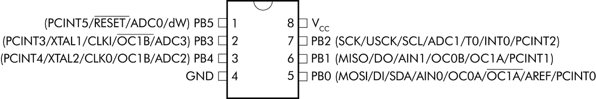

图 2-9：ATtiny85 的引脚和 PORT 寄存器

在图示和数据手册中，PORT 寄存器的名称通常会缩写；在图 2-9 中，PORTB 寄存器被称为 PB，每个引脚被标记为 PB *x*，其中*x*是引脚的编号。在代码中，你将称这个寄存器为`PORTB`。对应的 DDR 寄存器叫做 DDRB，它控制 PORTB 的数据显示方向。请注意，你只能使用 PB0 到 PB4 引脚，因为 PB5 有其他功能，我们稍后会讨论。

要将 DDRB 寄存器中的一些引脚设置为输出，只需将相应的位设置为 1。举个例子，让我们重新看一下项目 0 中的代码：

```

      // Project 0 - Blinking an LED

      #include <avr/io.h>

      #include <util/delay.h>

      int main(void)

      {

      ❶ DDRB = 0b00001000;

      for(;;)

      {

      _delay_ms(1000);

      PORTB = 0b11111111;

      _delay_ms(1000);

      PORTB = 0b00000000;

      }

      return 0;

      }

```

这段代码将物理引脚 2 设置为输出❶。要将所有 PORTB 引脚设置为输出，你可以使用：

```

      DDRB = 0b11111111;

```

让我们来看看这是如何工作的。ATtiny85 的 DDRB 寄存器的物理引脚为 1、3、2、7、6 和 5。每个引脚对应寄存器中的一个单独的位；从左到右，这些引脚分别是位 5、3、4、2、1 和 0。因此，举个例子，要将物理引脚 6（PB1）设置为输出，其他引脚设置为输入，你可以使用：

```

      // Bits: 76543210

      // Pins: 44132765

      DDRB = 0b00000010;

```

如我们在项目 0 代码中看到的，要将物理引脚 2（PB3）设置为输出，其他引脚设置为输入，你可以使用：

```

      // Bits: 76543210

      // Pins: 44132765

      DDRB = 0b00001000;

```

我们将寄存器右侧的位称为*第一位*或*最低有效位（LSB）*，而寄存器左侧的位称为*最后一位*或*最高有效位（MSB）*。刚开始可能会觉得有点不直观，但位是二进制数的等价物，其内容使用相同的方法进行引用。

因为 ATtiny85 只有六个输出，你可以在 DDRB 语句中将最后两个位（6 和 7）设置为 0 或 1。一旦你将引脚设置为输出，可以使用`PORT` `x`函数来切换输出的开关。要将所有输出打开，请使用：

```

      PORTB = 0b11111111;

```

要将它们全部关闭，请使用：

```

      PORTB = 0b00000000;

```

或者，要打开 3 号引脚（PB4）和 5 号引脚（PB0），并将其余引脚关闭，可以使用：

```

      // Bits:   76543210

      // Pins:   44132765

      PORTB = 0b00010001;

```

要实验这些功能，在下一个项目中，你将构建一个类似于项目 0 的电路，但这次将使用四颗 LED。

项目 1：实验 ATtiny85 数字输出

为了练习并增加对使用 ATtiny85 的 DDRB 和 PORTB 寄存器的理解，在这个项目中你将控制四个输出设备（LED）。尽管闪烁的 LED 看起来可能是一个相对简单的例子，但控制数字输出的能力是控制各种对象的基础。

### 硬件

你将需要以下硬件：

+   • USBasp 编程器

+   • 无焊面包板

+   • ATtiny85–20PU 微控制器

+   • 四个 LED

+   • 四个 560 Ω 电阻

+   • 跳线

该项目的电路与项目 0 中的类似，只是多了三颗 LED。请按照图 2-10 中的方式组装电路。

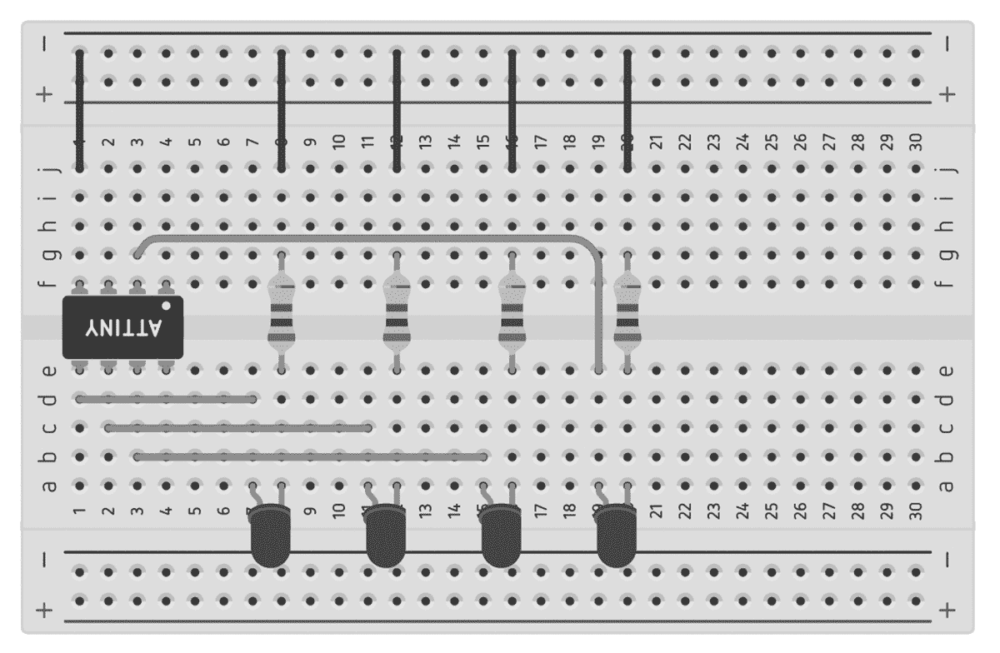

图 2-10：用于项目 1 的主电路物理布局图

一旦你组装好电路，连接 USBasp 编程器。按照表 2-1 中的连接方式进行重复连接。

如果你想尝试创建像图 2-10 中的图示一样的图表，可以使用 Autodesk Tinkercad，网址：[`www.tinkercad.com/`](https://www.tinkercad.com/)。

### 代码

打开终端窗口，导航到包含项目 1 两个文件的文件夹，并输入命令`make flash`。稍等片刻，工具链应会编译程序文件，并创建所需的数据文件上传到微控制器。然后，微控制器将运行该程序，控制数字输出的开关，从而使四个 LED 灯闪烁。

要查看这个是如何工作的，请打开位于*Chapter 2*文件夹中*Project 1*子文件夹中的*main.c*文件：

```

      // Project 1 - Experimenting with ATtiny85 Digital Outputs

      #include <avr/io.h>

      #include <util/delay.h>

      int main(void)

      {

      ❶ DDRB = 0b11111111; // Set pins as outputs

      for(;;)

      {

      ❷ _delay_ms(250);

      ❸ PORTB = 0b00011111;

      _delay_ms(250);

      ❹ PORTB = 0b00000000;

      }

      return 0;

      }

```

首先我们使用`DDRB`将所有引脚设置为输出 ❶。`_delay_ms()`函数 ❷让微控制器暂停一段时间。要使用延时，只需在括号中输入你希望程序暂停的毫秒数：`_delay_ms(250)`将延时时间设置为 250 毫秒。接下来，我们打开数字输出，使电流从引脚流出，经过电阻和 LED，再流向地面（GND），完成电路 ❸。经过另一个延时后，我们关闭数字输出，导致 LED 关闭 ❹。

到现在为止，你应该理解了如何将 ATtiny85 的引脚设置为输出、打开和关闭它们，并创建延时。通过改变哪些 LED 打开和关闭、延时的长度等，来实验延时和引脚。

## 使用原理图

项目 0 和 1 分别展示了如何使用图片和物理布局图来构建电路。像图 2-10 中的物理布局图看似是绘制电路的最简单方法，但随着组件的增多，直接的表示方式使物理图变得一团糟。因为你的电路即将变得更加复杂，从现在开始，我将使用*原理图*（也叫*电路图*）来展示它们，就像图 2-11 所示的那样。

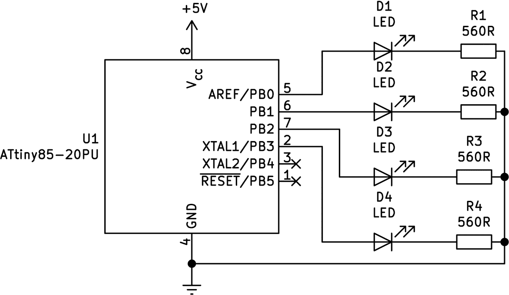

图 2-11：一个示例原理图

原理图是电流流经各个组件的路线图，组件之间的连线表示这些路径。原理图不是显示组件和电线，而是使用符号和线条。

### 原理图中的组件

一旦你知道这些符号的含义，阅读原理图就变得很容易了。首先，让我们检查一下你已经使用过的组件符号。

图 2-12 展示了 ATtiny85 微控制器的符号。引脚编号标注得很清楚；别忘了，第 1 引脚位于物理芯片的左上角。其他微控制器和集成电路（IC）使用类似的符号，但其大小取决于引脚数量。

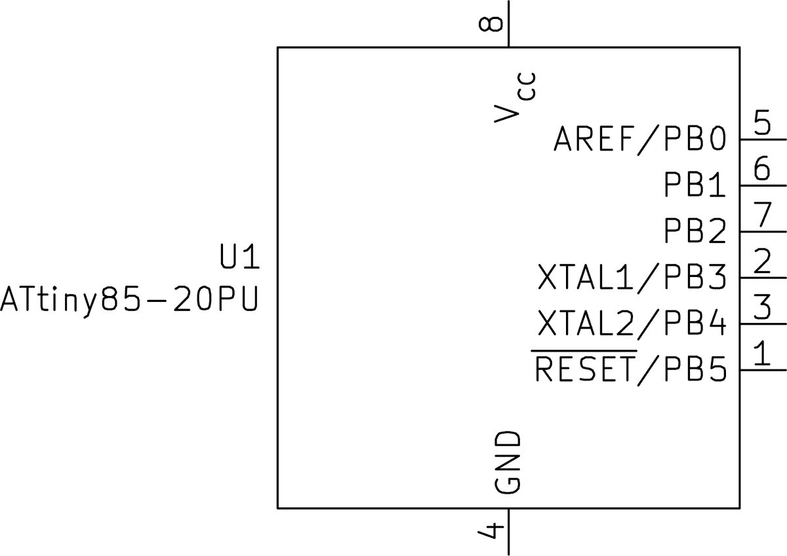

图 2-12：ATtiny85 微控制器符号

图 2-13 展示了电阻符号。通常的做法是将电阻值和部件标识符与电阻符号一起显示（此例中为 220 Ω 和 R1）。这会使所有试图理解原理图的人，包括你，轻松很多！

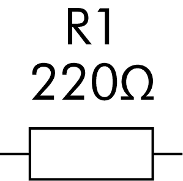

图 2-13：电阻符号

图 2-14 显示了 LED 符号。二极管家族中的所有成员共享一个常见符号——三角形和竖线，但 LED 符号会显示两个平行的箭头指向三角形的外侧，以表示发光。

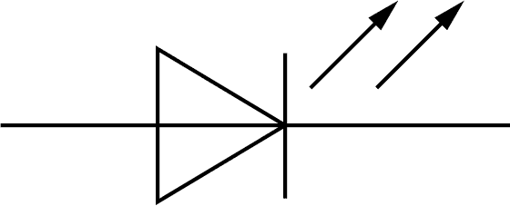

图 2-14：LED 符号

现在你已经了解了各种元件的原理图符号，接下来我将向你展示在电路原理图中，元件之间的导线连接是如何表示的。

### 原理图中的导线

当导线在原理图中交叉或连接时，它们的绘制方式如下：

交叉但不连接的导线

+   当两根导线交叉但没有连接时，可以用两种方式表示交叉，如图 2-15 所示。两种方式都是正确的，选择哪种方式仅仅是个人偏好问题。

    

    图 2-15：不连接的交叉导线

+   连接的导线

+   当导线物理连接时，会在连接点绘制一个*交点标记*，如图 2-16 所示。

    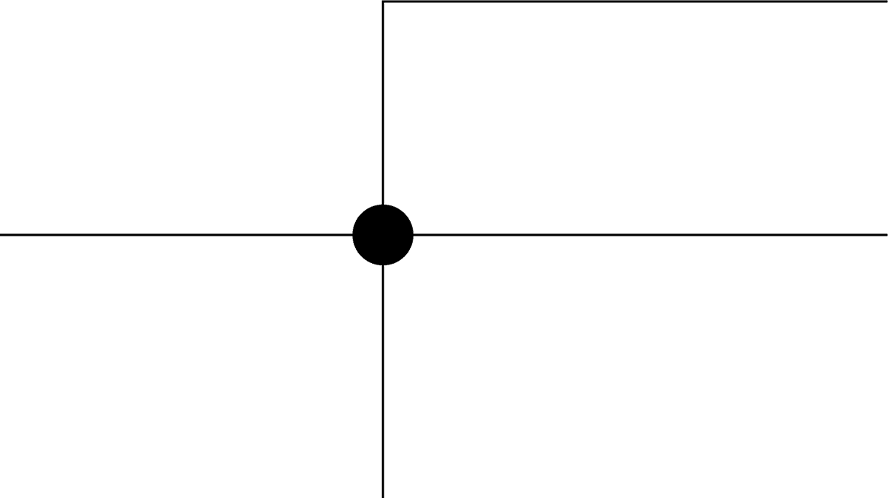

    图 2-16：连接的两根导线

+   连接到地的导线

+   图 2-17 中所示的符号表示导线与地（GND）连接。

    

    图 2-17：GND 符号

    原理图中位于一根导线末端的 GND 符号表示该导线与微控制器的 GND 引脚物理连接。对于你的电路，这也被称为*负极*。

### 分析原理图

现在你已经了解了目前为止使用的符号，让我们来分析你为项目 1 绘制的原理图。将图 2-18 中的原理图与图 2-10 中的电路实物图进行对比。


图 2-18：为项目 1 绘制的原理图

上方标有 +5V 的箭头代表面包板上的 5V 电源，ATtiny85 被标注为其芯片名称。LED 1 到 4 与 ATtiny85 相连，连接方式与 图 2-10 中所示相同，正如原始电路一样，所有四个连接到 LED 的电阻都接地（GND），接到微控制器的 4 号引脚。注意 R1、R2、R3 和 R4 连接点处的点，它们表示这些电阻都连接到相同的位置（GND）。图 2-18 中引脚 1 和 3 上的 X 表示这些引脚没有连接任何东西。

在这个原理图中，你可以追踪电流从电源流经电路到地的路径。电流从 5V 电源供应，进入微控制器。我们的代码允许电流根据需要从数字输出引脚流出。电流通过 LED（使 LED 发光）和电阻（调节电流）后，最终到达地并完成电路。

注意 如果你想自己绘制计算机绘制的原理图，可以尝试使用开源的 KiCad 软件包，免费提供或通过捐赠获取，网址：[`www.kicad.org/`](https://www.kicad.org/)。

除了首次使用 ATmega328P-PU，本 项目 还将让你运用新学的电路原理图阅读知识。

项目 2：实验 ATmega328P-PU 数字输出

你可以一眼看出，ATmega328P-PU 拥有比 ATtiny85 更多的数字输出。来自数据手册中的引脚图 图 2-19 提供了详细信息。

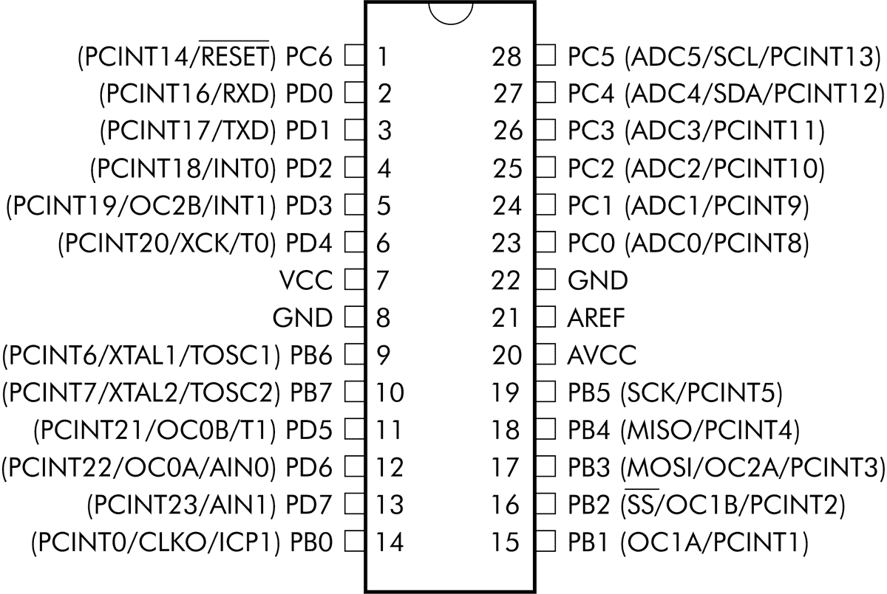

图 2-19：ATmega328P-PU 的引脚图和端口寄存器图

有两个寄存器可以用于数字输出：PORTB (PB) 和 PORTD (PD)。在本项目以及接下来的几个项目中，你将使用 PORTB 寄存器。在这个项目中，你将通过更多的 LED 来使用 ATmega328P-PU 的数字输出。

### 硬件部分

你将需要以下硬件：

+   • USBasp 编程器

+   • 无焊面包板

+   • ATmega328P-PU 微控制器

+   • 八个 LED

+   • 八个 560 Ω 电阻

+   • 跳线

我提供了物理布局图和所需电路的原理图，你可以使用它们来组装电路。 图 2-20 显示了你肉眼可见的物理连接，而 图 2-21 中的原理图则以更紧凑、易于理解的形式展示了各组件之间相同的电气连接。

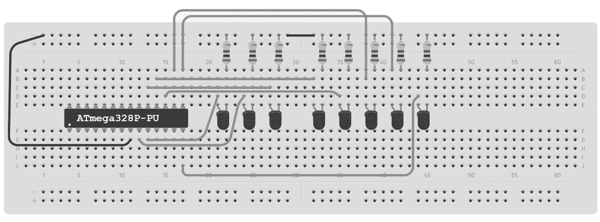

图 2-20： 项目 2 的电路图


图 2-21：项目 2 的原理图

将 USBasp 编程器连接到电路，然后使用表 2-2 中的信息连接编程器和微控制器之间的跳线。请注意这些连接，因为每次你为 ATmega328P-PU 微控制器编程时，它们都将保持一致。

| 表 2-2：USBasp 与 ATmega328P-PU 连接 |
| --- |
| USBasp 引脚 | ATmega328P-PU 引脚 |
| --- | --- |
| RST | 1 |
| GND | 8 |
| VCC | 7 |
| SCK | 19 |
| MISO | 18 |
| MOSI | 17 |

在将代码上传到微控制器之前，先测试编程器是否与 ATmega328P-PU 通信。将 USBasp 编程器连接到计算机，并打开终端窗口。输入命令`avrdude -p m328p -c usbasp -B 4`并按下回车键。软件工具链应该会与编程器和微控制器进行通信，你应该在终端中看到以下输出：

```

      C:\>
      `avrdude -p m328p -c usbasp -B 4` 

      avrdude: set SCK frequency to 187500 Hz

      avrdude: AVR device initialized and ready to accept instructions

      Reading | ################################################## | 100% 0.03s

      avrdude: Device signature = 0x1e950f

      avrdude: safemode: Fuses OK

      avrdude done.  Thank you.

      C:\>

```

这个`avrdude`命令与之前测试 ATtiny85 设置时使用的命令唯一的区别在于，我们将微控制器参数`-p`改为了`m328p`。如果在输入此命令后看到正确的输出，说明可以继续；否则，请查阅第 35 页的“如果没有工作怎么办？”部分。

### 代码

打开终端窗口，导航到包含项目 2 两个文件的文件夹，并输入命令`make flash`。稍等片刻，工具链应当编译程序文件，并创建上传到微控制器所需的数据文件。然后微控制器应该会运行该程序，导致所有八个 LED 同时闪烁。

要查看它是如何工作的，请打开位于*第二章*文件夹中*项目 2*子文件夹中的*main.c*文件。

```

      // Project 2 - Experimenting with ATmega328P-PU Digital Outputs

      #include <avr/io.h>

      #include <util/delay.h>

      int main(void)

      {

      DDRB = 0b11111111; // Set PORTB register as outputs

      for(;;)

      {

      _delay_ms(250);

      ❶ PORTB = 0b11111111;

      _delay_ms(250);

      ❷ PORTB = 0b00000000;

      }

      return 0;

      }

```

本项目中的代码与项目 1 中的代码相同。然而，由于 ATmega328P-PU 有一个完整的 PORTB 寄存器（即八个输出），你可以使用`PORTB`函数控制所有这些输出。为了练习，可以更改`PORTB`线路，尝试让 LED 闪烁。尝试通过更改❶处的线路，将一半的 LED 打开，另一半关闭：

```

      PORTB = 0b11110000;

```

和❷处的线路：

```

      PORTB = 0b00001111;

```

你还可以通过添加更多的`PORTB`线路并设置不同的开/关状态来增加效果。尽情发挥吧！完成实验后，保持这个电路连接，因为你将在本章剩余部分中继续使用它。

你很快就会看到 PORTB 寄存器的每一位是如何与微控制器的数字输出相对应的。然而，有一种更好的方法可以控制输出，从而创建复杂的模式。在下一个项目中，你将使用相同的电路，通过变量、函数、位移和位运算更高效地控制输出。

项目 3：位移数字输出

在这个项目中，你将学习更高效的方式来控制数字输出。这些技术将使你在不增加过多代码的情况下对输出进行更精细的控制，从而避免浪费微控制器的程序内存。

本项目使用与项目 2 相同的硬件，因此你应该已经设置好了。打开终端窗口，导航到包含项目 3 的两个文件的文件夹，然后输入命令 `make flash`。再次，工具链应该处理代码，很快 LED 灯应该开始按左到右、然后右到左的重复模式闪烁。

现在打开位于*第二章*文件夹中的*项目 3*子文件夹中的 *main.c* 文件，仔细看看它是如何工作的：

```

      // Project 3 - Bit-Shifting Digital Outputs

      #include <avr/io.h>

      #include <util/delay.h>

      ❶ #define TIME 100 // Delay in milliseconds

      int main(void)

      {

      ❷ uint8_t i;         // 8-bit integer variable "i"

      DDRB = 0b11111111; // Set PORTB register as outputs

      while (1)

      {

      ❸ for (i = 0; i < 8; i++)

      {

      ❹ _delay_ms(TIME);

      PORTB = 0b00000001 << i;

      }

      ❺ for (i = 1; i < 7; i++)

      {

      _delay_ms(TIME);

      PORTB = 0b10000000 >> i;

      }

      }

      return 0;

      }

```

这段代码引入了一些新概念。首先，`#define` 宏允许你将值分配给单词，这些值被称为*常量值*或简称*常量*。常量使得在代码中稍后引用值成为可能，同时也让代码更易于阅读。例如，`#define TIME 100` ❶ 告诉编译器在代码中任何使用 `TIME` 的地方都将 `TIME` 替换为 100，正如在 `__delay_ms_` 行 ❹ 中一样。要更改闪烁延迟，你只需要更改原始 `#define` 宏中的值，编译器会处理剩余的部分。每次使用 `#define` 时，你必须将其放在主 `int main(void)` 循环之前。

在主循环中，我们定义了一个*变量*，它表示数据。变量的值可以在代码执行过程中改变，而通过 `#define` 宏定义的常量的值则不能。你可以将变量看作是微控制器内存的一部分，用于存储在程序执行过程中你可以根据需要更改的数字。本书中你将使用的第一个变量类型是*整数*。在编程术语中，这种类型可以存储一个整数；也就是说，可以是正数、负数或零，且没有小数部分。

要定义一个变量，首先输入类型，然后是标签。行 `uint8_t i;` ❷ 定义了一个名为 `i` 的变量，类型为 `uint8_t`。这种类型的变量可以存储一个介于 0 和 255 之间的整数（`u` 代表*无符号*；无符号整数不能存储负数）。字母 `i` 现在表示一个整数，你可以随时更改其值。

有六种类型的整数变量可以使用：

+   • `uint8_t` 是一个 8 位无符号整数（0 到 255）。

+   • `int8_t` 是一个 8 位有符号整数（–128 到 127）。

+   • `uint16_t` 是一个 16 位无符号整数（0 到 65,535）。

+   • `int16_t` 是一个 16 位有符号整数（–32,768 到 32,767）。

+   • `uint32_t` 是一个 32 位无符号整数（0 到 4,294,967,295）。

+   • `int32_t` 是一个 32 位有符号整数（–2,147,483,648 到 2,147,483,647）。

初看之下，你可能会认为较小的整数类型是多余的，应该只使用`int32_t`来满足所有整数需求。然而，整数类型越大，微控制器处理这些数字所需的时间就越长。为了最大化效率，在选择整数类型时，请考虑项目的需求，并使用能够容纳最大可能值的最小类型。

这段代码还引入了`for` *循环*，它允许你重复某段代码而无需重新输入。重复输入代码效率低下，浪费内存；`for` 循环则可以让你设置循环体内的代码重复执行的次数。在项目 3 的代码中有两个`for`循环。让我们来看第一个 ❸：

```

      for (i = 0; i < 8; i++)

      {

      _delay_ms(TIME);

      PORTB = 0b00000001 << i;

      }

```

`for`循环会在特定条件为真时重复大括号中的代码。在这个例子中，循环会一直重复，直到变量`i`的值为 8。在循环的第一部分，我们通过`i = 0`设置`i`的初始值。循环的第二部分检查条件是否为真：在此情况下，检查`i < 8`。循环的第三部分跟踪代码循环的次数；`i++`表示“每次循环后将`i`的值加 1”。每次执行大括号内的代码时，`i`的值增加 1，并且代码会检查`i`是否小于 8。当`i`等于 8 时，循环停止，微控制器将继续执行`for`循环后的代码。

本项目引入的最终概念是*位移*，这是一种将二进制数中的位向左或向右移动的技术。它帮助你高效地使用二进制数字，在`PORT` `x`函数中控制输出引脚的开关。在❸处的`for`循环每次循环完成时将第一个位向左移一位。这比使用等效的八个`PORTB`函数更为高效：

```

      PORTB = 0b00000001;

      PORTB = 0b00000010;

      PORTB = 0b00000100;

      PORTB = 0b00001000;

      PORTB = 0b00010000;

      PORTB = 0b00100000;

      PORTB = 0b01000000;

      PORTB = 0b10000000;

```

与其浪费代码在这种函数上，不如使用`<<`将第一个位向左移动，或者使用`>>`将其向右移动，后面跟上需要移动的位数。例如，要依次开启和关闭 PORTB 中的前三个输出，可以输入：

```

      PORTB = 0b00000001;

      PORTB = 0b00000001 << 1; // equivalent to 0b00000010

      PORTB = 0b00000001 << 2; // equivalent to 0b00000100

```

❸处的`for`循环演示了如何使用`<< i`将位向左移。这里，`i`在第一次循环时值为 0，表示第一个输出被开启。当代码再次循环时，`i`的值变为 1，表示第二个输出被开启，以此类推。以相同的方式，❺处的`for`循环使用`>>`从左到右依次开启 LED 灯。

你可以通过更深入地操作 PORT *x* 寄存器，利用 *位运算* 来更有效地控制输出。这是一种通过微控制器直接支持的位操作方式，用于操作数字的各个位。不要让你过去在数学课上的经历吓到你；这非常简单。你可以用来改变寄存器中位的四种操作符是：NOT、AND、OR 和 XOR。你将在 项目 4 到 7 中看到它们的使用方法。

项目 4：实验与 NOT 运算

NOT (`~`) 运算符会反转一个数字或寄存器中的所有位。如果你在数字前加上波浪符号（`~`），它将被视为该数字的二进制反码。例如：

```

      ~0b00001111 = 0b11110000

```

你可以通过将 项目 2 中的主循环替换为以下代码，来自己尝试一下：

```

      for(;;)

      {

      PORTB = 0b00001111;    // PORTB pins 3, 2, 1, and 0 turned on

      _delay_ms(250);

      PORTB = ~0b00001111;   // PORTB pins 7, 6, 5, and 4 turned on

      _delay_ms(250);

      }

```

在 `~` 这一行之后，PORTB 上的所有引脚应该都点亮。NOT（以及所有其他位运算符）是你在规划项目时可以保留在工具箱中的有用工具。

项目 5：实验与 AND 运算

AND (`&`) 运算符比较两个二进制数，并返回一个新的二进制数。如果两个数字在相同位置上都有 1，新的数字在该位置会是 1，其他位将是 0。例如：

```

      0b00100010 &

      0b10101011

      = 0b00100010

```

AND 运算在你希望根据某个特定值来控制输出时非常有用。项目 5 通过显示从 0 到 255 的二进制数字来演示这一点。使用 项目 3 中相同的电路，并打开位于 *Chapter 2* 文件夹中的 *Project 5* 子文件夹里的 *main.c* 文件：

```

      // Project 5 - AND & Demonstration

      #include <avr/io.h>

      #include <util/delay.h>

      #define TIME 5              // Delay in milliseconds

      int main(void)

      {

      uint8_t i;                // 8-bit integer variable "i"

      DDRB = 0b11111111;        // Set PORTB register as outputs

      for(;;)

      {

      for (i = 0; i < 256; i++)

      {

      _delay_ms(TIME);

      PORTB = 0b11111111 & i; // Displays value of i in binary using LEDs

      }

      }

      return 0;

      }

```

在这段代码中，`for` 循环从 0 计数到 255。每次代码循环时，它都会对 `0b11111111` 和变量 `i` 执行与运算，并将 `PORTB` 设置为运算结果。例如，假设 `i` 的值为 9，即 `0b00001001`。`0b00001001 & 0b11111111` 的结果将是 `0b00001001`，因为一位和八位的位匹配。因此，`PORTB` 的设置将是 `0b00001001`，并且 1 和 4 号 LED 会点亮。

项目 6：实验与 OR 运算

OR (`|`) 运算符比较两个二进制数，并返回另一个二进制数，在任何一个操作数的某个位为 1 的位置，结果也为 1。例如：

```

      0b00100110 |

      0b10101011

      = 0b10101111

```

这个运算符在你希望根据两个数字中的位是否具有某个特定值来控制输出时非常有用。你可以使用 项目 3 中相同的电路，并打开位于 *Chapter 2* 文件夹中的 *Project 6* 子文件夹里的 *main.c* 文件，来试试这个方法：

```

      // Project 6 - Experimenting with OR

      #include <avr/io.h>

      #include <util/delay.h>

      #define TIME 50      // Delay in milliseconds

      int main(void)

      {

      uint8_t i;         // 8-bit integer variable "i"

      DDRB = 0b11111111; // Set PORTB register as outputs

      for(;;)

      {

      for (i = 0; i < 255; i++)

      {

      _delay_ms(TIME);

      PORTB = 0b00001111 | i;

      }

      }

      return 0;

      }

```

主循环从 0 计数到 255，如前面的示例所示。每次代码循环时，它都会对 `0b00001111` 和变量 `i` 执行 OR 运算，并将 `PORTB` 设置为运算结果。如果 `i` 的值为 0，例如 `0b00000000`，则 `0b00001111 | 0b00000000` 的结果为 `0b00001111`。因此，`PORTB` 的设置将为 `0b0001111`，右侧的四个 LED 将保持亮起。

随着 `i` 的值增加，`i` 中的位数也会增加，更多的 LED 将会亮起。例如，当 `i` 的值为 128，或 `0b10000000` 时，结果的 `PORTB` 为 `0b10001111`。将此代码加载到你的 AVR 上以查看其实际效果，然后实验代码并创建你自己的 OR 情况来练习。

项目 7：实验 XOR

最后的运算符 XOR (`^`) 比较两个数字中相同位置的位，并返回一个新的二进制数。任何两个数字在相同位置上有不同的位，新的数字将在该位置上为 1；如果两个数字在同一位置上具有相同的位，新的数字将在该位置上为 0。例如：

```

      0b00100110 ^

      0b10101011

      = 0b10001101

```

XOR 运算符在你希望当两个数字的位值不同时时打开输出时非常有用。要查看这一点，可以使用与项目 3 相同的电路，并打开位于 *Chapter 2* 文件夹下 *Project 7* 子文件夹中的 *main.c* 文件：

```

      // Project 7 - Experimenting with XOR

      #include <avr/io.h>

      #include <util/delay.h>

      #define TIME 250     // Delay in milliseconds

      int main(void)

      {

      uint8_t i;         // 8-bit integer variable "i"

      DDRB = 0b11111111; // Set PORTB register as outputs

      for(;;)

      {

      for (i = 0; i < 255; i++)

      {

      _delay_ms(TIME);

      PORTB = 0b11111111 ^ i;

      }

      }

      return 0;

      }

```

代码的主循环再次从 0 计数到 255。每次循环时，代码都会对 `0b11111111` 和变量 `i` 进行 XOR 运算，并将 `PORTB` 设置为运算结果。例如，如果 `i` 的值为 15，或 `0b00001111`，则 `0b11111111 ^ 0b00001111` 的结果为 `0b11110000`。

当你在 AVR 上运行此代码时，它应展示从 0 到 255 的二进制计数。然而，在这种情况下，LED 会以反向的方式点亮——也就是说，数字通过 LED 显示时是关闭的，而不是打开的。

本章结束时，我鼓励你实验代码示例。享受创造图案、学习位运算和使用位移的过程，利用你新获得的知识。在下一章中，你将学习如何使用微控制器的输入来创建互动设备。
