# 第三章：# 获取和显示输入


AVR 微控制器可以处理来自外部世界的输入并作出反应，这为互动项目提供了巨大的潜力——例如，能够响应周围温度的项目。在本章中，你将编程 ATtiny85 和 ATmega328P-PU，检测外部设备的输入信号并加以应用。

特别是，你将：

+   • 学习数字输入和按钮的使用。

+   • 使用`if...else`和`switch...case`语句做决策。

+   • 使用七段 LED 显示器制作数字计数器。

+   • 制作一个单节电池测试仪。

+   • 了解 TMP36 温度传感器。

+   • 制作一个数字温度计。

在这个过程中，你将学习如何使用电阻来对抗开关弹跳，并通过创建自己的函数以及使用浮点变量和模拟输入，获得更多的 C 语言编程经验。

## 数字输入

在第二章中，你学会了使用数字 I/O 引脚作为输出。你也可以使用这些引脚接收来自用户和其他组件的输入。和数字输出一样，数字输入也有两种状态：它们的状态分别是*高*和*低*，而不是*开*或*关*。使用数字 I/O 引脚作为输入与控制输出类似。在这一节中，你将设置 DDR *x*，然后监控另一个寄存器的值，称为*PINx*，它存储数字输入引脚的状态。让我们开始吧！

### 介绍按钮

最简单的数字输入形式之一是*推按钮*，如图 3-1 所示。推按钮很容易插入到无焊面包板中。当按下时，它们允许电流通过，微控制器可以通过数字输入检测到电流。

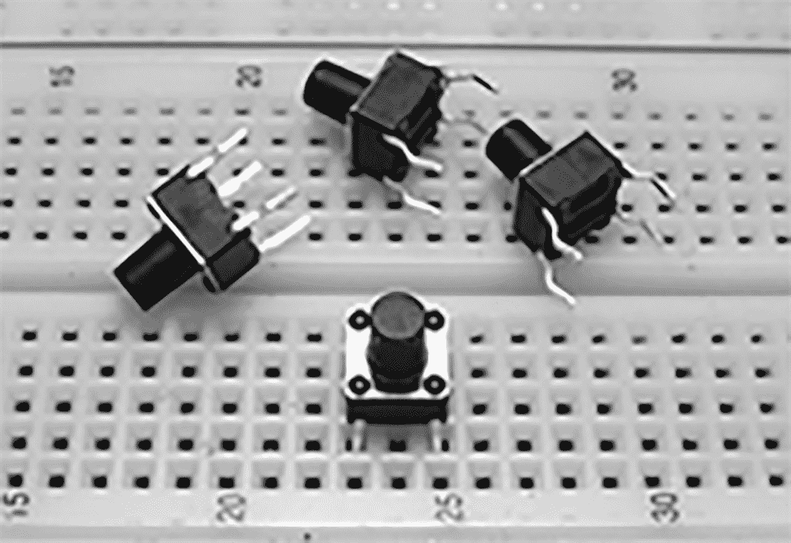

图 3-1：面包板上的简单按键

你将在下一个项目中使用推按钮，因此请注意图 3-1 底部的按钮是如何插入到面包板上的。它的引脚跨越了 23 行和 25 行，这样当你按下按钮时，会在这两行之间建立电连接。图 3-2 展示了这种类型的按键的原理图符号。

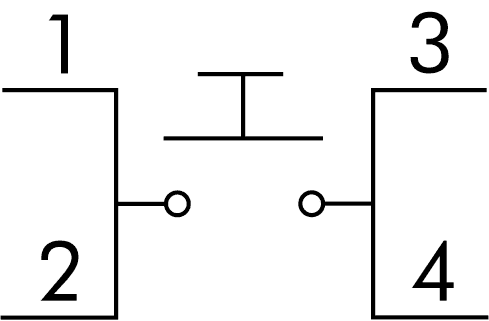

图 3-2：推按钮原理图符号

标记为 1 和 2 的线路代表按键的一侧脚，标记为 3 和 4 的线路代表另一侧的脚。当你将电路图符号与 图 3-1 中的实际按键进行比较时，标记为 1 和 2 的脚在第 23 行，标记为 3 和 4 的脚在第 25 行。虚线表示按键内部的开关。当你按下按钮时，开关闭合，允许电流流动，因此你不需要在按钮的两侧各接一根线。 

### 读取数字输入引脚的状态

一旦你通过将值赋给 `DDRB` 设置 I/O 引脚为输入，该输入引脚的状态将存储在 PIN *x* 寄存器中。像其他寄存器一样，PIN *x* 寄存器是 8 位宽的，每一位对应一个物理 I/O 引脚。

将 PIN *x* 寄存器视为一个二进制数，其中每个位代表对应物理引脚的状态。如果某位为 1，说明该引脚有电流，通过该引脚时为 *高电平*；如果某位为 0，说明该引脚没有电流，通过时为 *低电平*。例如，在所有 I/O 引脚都设置为输入的 ATtiny85 上，如果引脚 5（PB0）和 6（PB1）为高电平，那么 PINB 寄存器的值将是 `0b00000011`。

PIN *x* 寄存器的数值被赋给一个整数变量，然后与另一个数字进行比较。例如，要检查输入引脚 PB0 和 PB1 是否为高电平，你可以将 PINB 的值与 `0b00000011` 进行比较。

但够了理论——让我们来制作一些简单的电路，展示微控制器的输入和输出功能！

项目 8：按命令闪烁 LED

在这个项目中，你将通过使 LED 闪烁来实验 ATtiny85 的数字输入，就像你在 第二章 中做的那样。不过这次，只有在你按下按键时，LED 才会闪烁。

### 硬件

你将需要以下硬件：

+   • USBasp 编程器

+   • 无焊面包板

+   • ATtiny85–20PU 微控制器

+   • 一个 LED

+   • 一个 560 Ω 电阻

+   • 一个按键

+   • 一个 10 kΩ 电阻

+   • 跳线

在面包板上组装 图 3-3 中显示的电路。实验完成后，将电路保留在一起；你将在 项目 9、项目 10 和 项目 11 中继续使用这个电路。

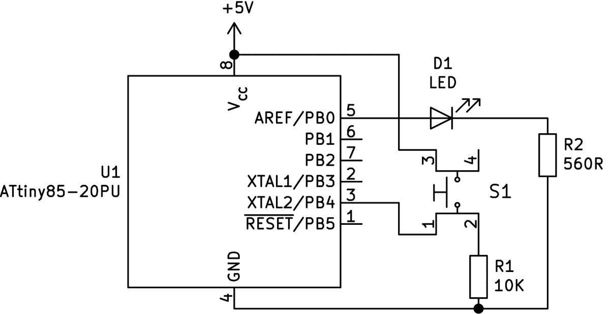

图 3-3： 项目 8 的主要电路

将电路组装好后，将 USBasp 编程器连接到 ATtiny85。按照 第 2-1 表 中的连接方式与 第二章 中的说明重复连接。

### 代码

打开一个终端窗口，导航到本书*第三章*文件夹下的*第 8 项目*子文件夹，然后输入命令`make flash`。工具链将编译程序文件，并将数据上传到微控制器。此时，电路不会执行任何操作，直到你按下按钮。当你按下时，LED 应保持亮起约一秒钟。

让我们看看这个是如何工作的。打开第 8 项目的*main.c*文件：

```

      // Project 8 - Blinking an LED on Command

      #include <avr/io.h>

      #include <util/delay.h>

      int main(void)

      {

      ❶ DDRB =  0b00001111;

      ❷ PORTB = 0b00000000;

      for (;;)

      {

      ❸ if (PINB == 0b00010000) // If PB4 is HIGH . . .

      ❹ {

      PORTB = 0b00000001;  // then turn on PB0 output

      _delay_ms(1000);     // Wait a moment

      PORTB = 0b00000000;  // Turn off PB0 output

      }

      }

      return 0;

      }

```

这段代码告诉微控制器不断检查引脚 3（PB4）是否为高电平。如果是，我们会将连接到引脚 5（PB0）的 LED 点亮约一秒钟。

首先，我们设置 DDRB 寄存器，使得 PB0 到 PB3 为输出，PB4 到 PB7 为输入❶。虽然 ATtiny85 总共有八个引脚，并且最多有六个引脚用于输入和输出，但我们仍然在`DDRB`语句中包含所有八个引脚。接下来，我们关闭内部上拉电阻❷。（稍后我会在本章中详细讲解上拉电阻。）

之后，程序将 PINB 寄存器的值与`0b00010000`进行比较❸。如果 PB4（引脚 3）上有电流，第四位将为 1，因此 PINB 寄存器将与`0b00010000`匹配。如果比较结果为相等，花括号中的代码将运行❹，使 LED 亮起一秒钟，然后熄灭。

在下一部分中，我们将详细了解像本项目中的`if`语句，这些语句用于进行比较和决策。

## 代码中的决策

有时你希望某些代码仅在条件为真或为假时才执行，比如按钮是否被按下。你可以使用`if`语句、`if...else`语句和`switch...case`语句来测试这些条件，并决定接下来要执行的代码。

### if 语句

类似于第 8 项目中的`if`语句的第一行测试一个条件。如果条件为真（在第 8 项目中，如果`PINB`的值与`0b00010000`相匹配），那么花括号中的代码将执行。如果条件为假，则花括号中的代码将被忽略。

要测试条件，你将在`if`语句中使用以下一个或多个*比较运算符*：

+   • 等于：`==`

+   • 不等于：`!=`

+   • 大于：`>`

+   • 小于：`<`

+   • 大于或等于：`>=`

+   • 小于或等于：`<=`

随着时间的推移，你将更频繁地使用比较运算符，它们会变得像第二天性一样。

警告：一个常见的错误是，在测试语句中使用单个等号（`=`），它表示“设为相等”，而不是使用双等号（`==`），它表示“测试是否相等”。你可能不会收到工具链的错误消息，但你的代码可能无法正常工作！

你还可以进行各种类型的比较，其中有两个或更多选项供你选择，这可以节省代码空间。以下各节会解释这些情况。

### if ... else 语句

你可以通过`else`为`if`语句添加另一个动作。例如，你可以将项目 8 中的代码重写如下：

```

      if (PINB == 0b00010000) // If PB4 is high . . .

      {

      PORTB = 0b00000001;  // turn on PB0 output

      } else

      {

      PORTB = 0b00000000;  // turn off PB0 output

      }

```

通过此修改，当你按下按钮时，LED 会亮起，若不按下按钮，LED 则熄灭。

### 进行两项或更多比较

你还可以在同一个`if`语句中使用两个或更多条件，通过*比较运算符*来实现。例如，要将整数变量`counter`的值与 23 和 42 之间的范围进行比较，可以使用两个条件并通过 AND 运算符`&&`将其连接起来：

```

      if (counter>=23 && counter <42) // If counter is between 23 and 42 . . .

      {

      PORTB = 0b00000001;          // turn on PB0 output

      } else

      {

      PORTB = 0b00000000;          // turn off PB0 output

      }

```

请注意，用于比较的 AND 运算符（`&&`）与在第二章中介绍的按位算术 AND 运算符（`&`）不同。

你也可以使用 OR 比较。例如，如果你需要测试`counter`变量的值是否小于 100 或大于 115，可以使用两个条件并通过`||`运算符将其连接起来：

```

      if (counter<100 || counter >115) // If counter is under 100 or over 115 . . .

      {

      PORTB = 0b00000001;           // turn on PB0 output

      } else

      {

      PORTB = 0b00000000;           // turn off PB0 output

      }

```

你将在后续项目中扩展对这些有用运算符的理解。

### switch ... case 语句

要比较两个或多个变量，使用`switch...case`语句比使用多个`if...else`语句更为简便。`switch...case`语句会在某个已定义的条件为真时执行代码。

例如，假设你希望根据整数变量`counter`的值分别执行不同的代码，如 1、2 或 3。你可以使用一个`switch...case`语句，而不是多个`if...else`语句：

```

      switch(counter)

      {

      case 1:   // Do something if the value of counter is 1

      break; // Finish and exit the switch statement

      case 2:   // Do something if the value of counter is 2

      break; // Finish and exit the switch statement

      case 3:   // Do something if the value of counter is 3

      break; // Finish and exit the switch statement

      default:  // Do something if counter isn't 1, 2, or 3

      // (the "default" section is optional)

      }

```

这段代码末尾的可选`default`部分让你在`switch...case`语句中没有任何条件为真的情况下执行代码。

## 创建你自己的函数

迟早，你会希望多次重复某些代码段或定义自己的指令集。你可以通过创建自己的函数来实现这两个目标，函数可以处理任务、接收变量并对其进行操作，或者像数学函数一样返回一个结果值。我们将在接下来的三个项目中讨论这三种类型的函数。

第一种类型的函数仅仅是重复一些代码：

```

     void
     `name()` 

     {

     // Insert your code to run here.

     }

```

在这个例子中，`name()`是一个占位符。你可以将你的函数命名为任何你喜欢的名称，但名称必须始终以`void`为前缀。此外，你不能在自己的创建中使用*保留字*，因为这些词已经在语言中被使用。例如，你不能将函数命名为`void void()`，因为`void`在 C、C++等语言中是保留字。你可以在[`en.cppreference.com/w/c/keyword`](https://en.cppreference.com/w/c/keyword)找到 C 语言的完整保留字列表。

函数的代码放在花括号内。始终将自定义函数放在`int main(void)`部分之前。

项目 9：一个简单的自定义函数

这个项目演示了创建一个执行任务的简单自定义函数。使用项目 8 的硬件，打开终端窗口，导航到本书*第三章*文件夹中的*项目 9*子文件夹，并输入命令`make flash`，按照常规上传项目 9 的代码。你应该会看到 LED 每五秒闪烁两次。

让我们来看一下代码：

```

     // Project 9 - A Simple Custom Function

     #include <avr/io.h>

     #include <util/delay.h>

     ❶ void blinkTwice()

     {

     PORTB = 0b11111111;

     _delay_ms(100);

     PORTB = 0b00000000;

     _delay_ms(100);

     PORTB = 0b11111111;

     _delay_ms(100);

     PORTB = 0b00000000;

     _delay_ms(100);

     }

     int main(void)

     {

     // Set PB3 (and all other pins on PORTB) as output

     DDRB = 0b11111111;

     for(;;)

     {

     ❷ blinkTwice();

     _delay_ms(5000);

     }

     return 0;

     }

```

自定义函数`blinkTwice()` ❶使 LED 闪烁两次，因为它会将整个 PORTB 寄存器开关两次，并且有短暂的延时。一旦你创建了这样的函数，你可以在代码的任何地方调用它 ❷。

如果你希望能够轻松地改变 LED 闪烁的次数，第二种自定义函数——可以传递值的函数——就派上用场了：

```

     `void name` 
     (
     `type variable` 
     ,
     `type variable2` 
     , . . .)

     {

     // Insert your code to run here.

     }

```

再次，你会给你的函数命名，但这次括号里会包含两个参数，它们将在函数名称后的代码中使用：`type` 和 `variable`，分别指定传递给函数的变量的类型和名称。

项目 10：带内部变量的自定义函数

这个项目演示了创建接受变量作为参数并对这些变量执行操作的自定义函数。使用项目 8 的相同硬件，打开终端窗口，导航到本书*第三章*文件夹中的*项目 10*子文件夹，并输入命令`make flash`，上传项目 10 的代码。你应该会看到 LED 闪烁 11 次。

让我们来看一下这个项目的*main.c*文件中的代码：

```

     // Project 10 - Custom Functions with Internal Variables

     #include <avr/io.h>

     #include <util/delay.h>

     void delay_ms(int ms)

     {

     uint8_t i;

     for (i = 0; i < ms; i++)

     {

     _delay_ms(1);

     }

     }

     ❶ void blinkLED(uint8_t blinks)

     {

     uint8_t i;

     for (i = 0; i < blinks; i++)

     {

     PORTB = 0b11111111;

     delay_ms(100);

     PORTB = 0b00000000;

     delay_ms(100);

     }

     }

     int main(void)

     {

     DDRB = 0b11111111; // Set PB3 as output

     for(;;)

     {

     ❷ blinkLED(10);

     _delay_ms(3000);

     }

     return 0;

     }

```

函数`blinkLED(uint8_t blinks)` ❶接受一个无符号整数，并在`for`循环中使用它来使 LED 闪烁指定的次数。现在，你可以在代码的任何地方用不同的值调用`blinkLED()`函数。例如，在这个项目的代码中，我们调用`blinkLED(10)` ❷使 LED 闪烁 11 次。

要将多个变量传递到自定义函数中，只需在函数名后的括号内，每个变量之间加上逗号。例如，这里我为`blinkLED()`函数添加了第二个参数`blinkDelay`，它允许你设置 LED 开关之间的延迟时间。这个参数接着被传递到`delay_ms()`函数中：

```

     void blinkLED(uint8_t blinks, uint8_t blinkDelay)

     {

     uint8_t i;

     for (i = 0; i < blinks; i++)

     {

     PORTB = 0b11111111;

     delay_ms(blinkDelay);

     PORTB = 0b00000000;

     delay_ms(blinkDelay);

     }

```

第 10 项工程的代码实际上定义了两个自定义函数：第一个是`delay_ms(int ms)`。有时你可能需要在代码中使用延时函数，并且希望通过变量来指定延时的长度。使用标准的`_delay_ms()`函数无法做到这一点，所以你可以创建自己的延时函数！

第 11 项工程：返回值的自定义函数

在本项目中，我将演示第三种自定义函数的创建方式：接受一个或多个变量，在数学运算中使用它们，然后返回结果。

返回操作结果的函数非常有用。可以把它们看作是数学公式的黑盒：数值从一端输入，进行运算，结果从另一端输出。你可以按如下方式创建这样的函数：

```

     `type variable` 
     (
     `type variable` 
     ,
     `type variable 2` 
     , . . .)

     {

     // Declare a variable to hold the results of the calculations.

     // Insert your code to run here.

     // Return the declared variable.

     }

```

请注意，你声明的变量必须与函数返回的类型相同。

让我们将其付诸实践。使用第 8 项工程中的相同硬件，在终端窗口中导航到本书*第三章*文件夹的*第 11 项工程*子文件夹，输入命令`make flash`来上传第 11 项工程的代码。你应该会看到 LED 每 2 秒闪烁 12 次。

要了解其工作原理，请打开本项目的*main.c*文件：

```

     // Project 11 - Custom Functions That Return Values

     #include <avr/io.h>

     #include <util/delay.h>

     void blinkLED(uint8_t blinks)

     {

     uint8_t i;

     for (i = 0; i < blinks; i++)

     {

     PORTB = 0b11111111;

     _delay_ms(100);

     PORTB = 0b00000000;

     _delay_ms(100);

     }

     }

     ❶ uint8_t timesThree(uint8_t subject)

     {

     uint8_t product;

     ❷ product = subject * 3;

     ❸ return product;

     }

     int main(void)

     {

     DDRB = 0b11111111; // Set PB3 as output

     uint8_t j;

     uint8_t k;

     for(;;)

     {

     j = 4;

     k = timesThree(j);

     blinkLED(k);

     _delay_ms(2000);

     }

     return 0;

     }

```

我们仍在闪烁 LED（这是最后一次了，我保证！），但这次我们调用`blinkLED`，并将`k`设置为`timesThree()`函数的返回值。`timesThree()`函数将一个整数乘以三。首先我们声明该函数将返回的变量类型——在此为整数(`uint8_t`) ❶。接着是函数名称`timesThree()`和一个将保存传入函数的数字的变量。在函数内部，我们声明另一个变量来保存乘法操作的结果 ❷。然后，我们调用`return`将结果传回代码 ❸。

要在程序的其他部分实际使用`timesThree()`，只需传递一个参数并将变量设置为其返回值：

```

     k = timesThree(j);

```

随着你在微控制器方面经验的积累，你会发现创建自己的函数可以节省大量时间。不过现在，让我们讨论一下使用按钮时可能出现的问题，以及如何解决这些问题，以便创建更可靠的项目。

## 开关抖动

按钮（你在第 8 项工程中首次接触到）容易出现*开关抖动*（也称为*开关弹跳*），即按钮在用户仅按下一次后，可能会多次开关。开关抖动是因为按键内部的金属接触点非常小，释放按钮后可能会发生震动，导致开关快速反复地打开和关闭，直到震动停止。

可以使用*数字存储示波器（DSO）*观察开关反弹，DSO 是一种绘制电压随时间变化的设备。图 3-4 显示了 DSO 在开关反弹期间测量的按钮电压。

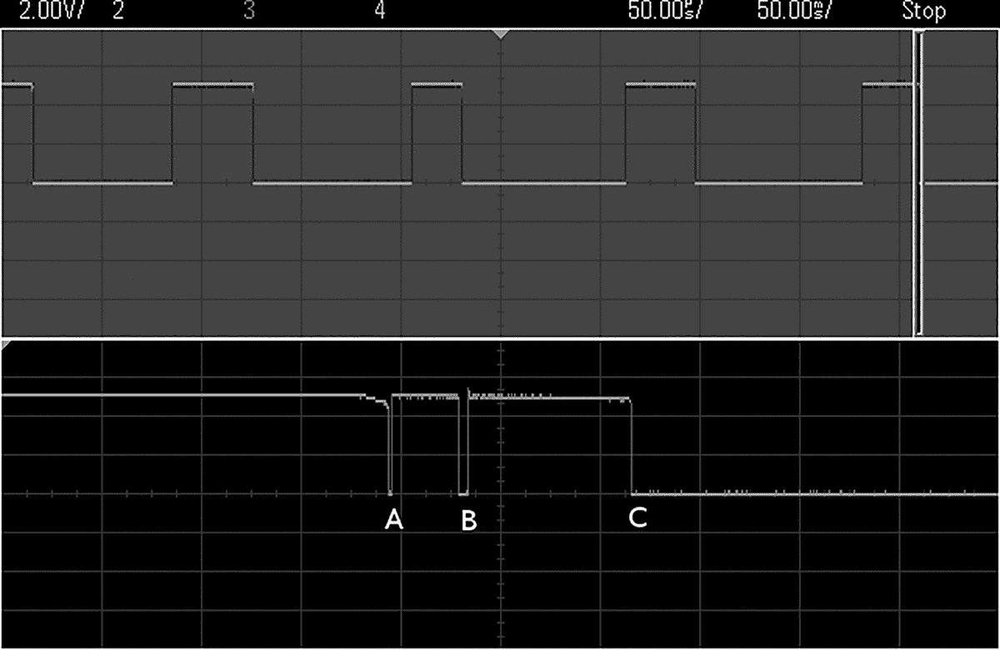

图 3-4：测量开关反弹

图 3-4 中的显示器上半部分显示了按钮按下几次后的结果。当图像下半部分的电压线位于较高的水平位置（5 V）时，按钮处于打开状态。

在右上角的"停止"字样下方，两条垂直线突出显示了一段时间。此时间段内按钮的电压被放大显示在屏幕的下半部分。在 A 处，用户释放按钮，电压线降至 0 V。然而，由于物理振动，电压立即跃升至 5 V，直到 B 处，电压发生振荡后才重新归于低电平（关闭状态）直至 C 处。实际上，我们并没有向微控制器传递一次按钮按下，而是不经意地传递了三次。

你无法阻止开关反弹，但你可以防止程序对其做出反应：只需使用`_delay_ms()`函数，在检测到按钮按下后，强制程序在执行更多代码之前等待。大约 50 毫秒应该足够长，但请用你自己的硬件测试，找到满足你需求的确切时间长度。

## 保护你的 AVR 免受电压波动影响

在理想的情况下，数字输入引脚要么接收到 5 V 的电信号（高电平），要么没有电信号（低电平）。但实际上，开关反弹和其他缺陷可能会导致输入引脚的电压在 5 V 和 0 V 之间剧烈波动。

在程序中加入延迟有助于防止因开关反弹导致的软件故障，但即使在没有使用引脚时，这些波动也可能发生，这可能会混淆或甚至损坏你的 AVR。幸运的是，你可以通过上拉或下拉电阻来保护 AVR。

### 上拉电阻

*上拉电阻*，如图 3-5 所示，可以将数字输入引脚的电压保持尽可能接近高电平。

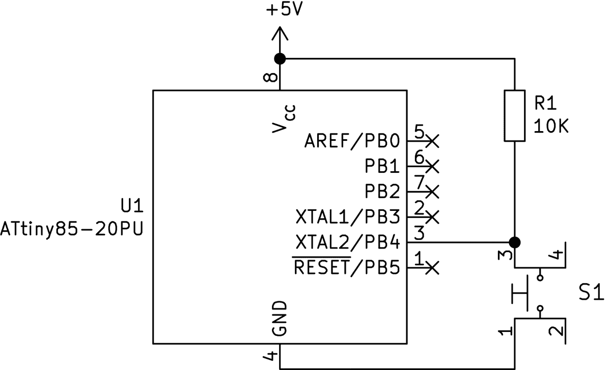

图 3-5：上拉电阻的示例应用

微控制器输入引脚 3 的电压将始终连接到高电平信号，直到按钮被按下，此时引脚 3 将直接连接到 GND 并变为低电平。电阻器防止你在按下按钮时将 5 V 短路到 GND（这可能会损坏硬件）。

AVR 微控制器有内置的上拉电阻。这是一种减少电路体积的巧妙方式，但问题是，你需要在程序中反转逻辑。例如，如果你有一个按钮连接在数字输入引脚和地（GND）之间，并且内置上拉电阻已启用，那么按下按钮时，输入信号会变为低电平（而不是高电平）。这是为方便而付出的一个小代价。要为设置为输入的引脚启用内置上拉电阻，可以将 1 写入 PORT *x*中的相应位；要关闭内置上拉电阻，可以将 0 写入这些位。

### 下拉电阻

一个*下拉*电阻，如图 3-6 所示，可以将数字输入引脚的电压保持在尽可能低的状态。

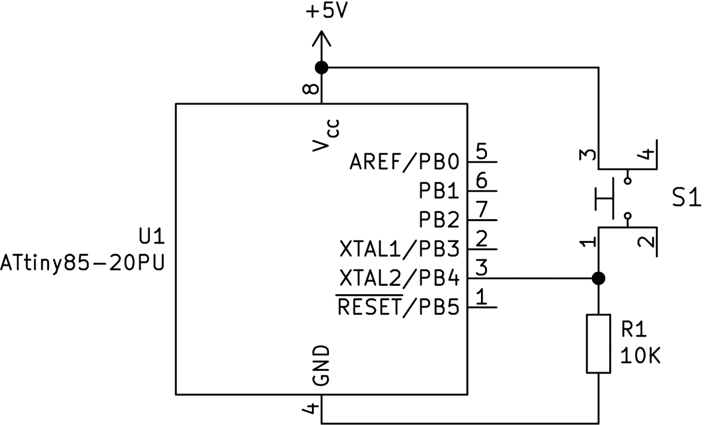

图 3-6：下拉电阻的示例使用

微控制器引脚 3 的电压在按钮未按下时保持低电平。当按钮被按下时，引脚 3 直接连接到 5V（高电平）。再次提醒，我们使用电阻来避免当按钮按下时，5V 与 GND 之间发生短路。

## 介绍七段式 LED 显示

使微控制器响应输入的一种方式是通过显示一个数字。为此，你可以向工具箱中添加一个新组件：*七段式 LED 显示器*，如图 3-7 所示。

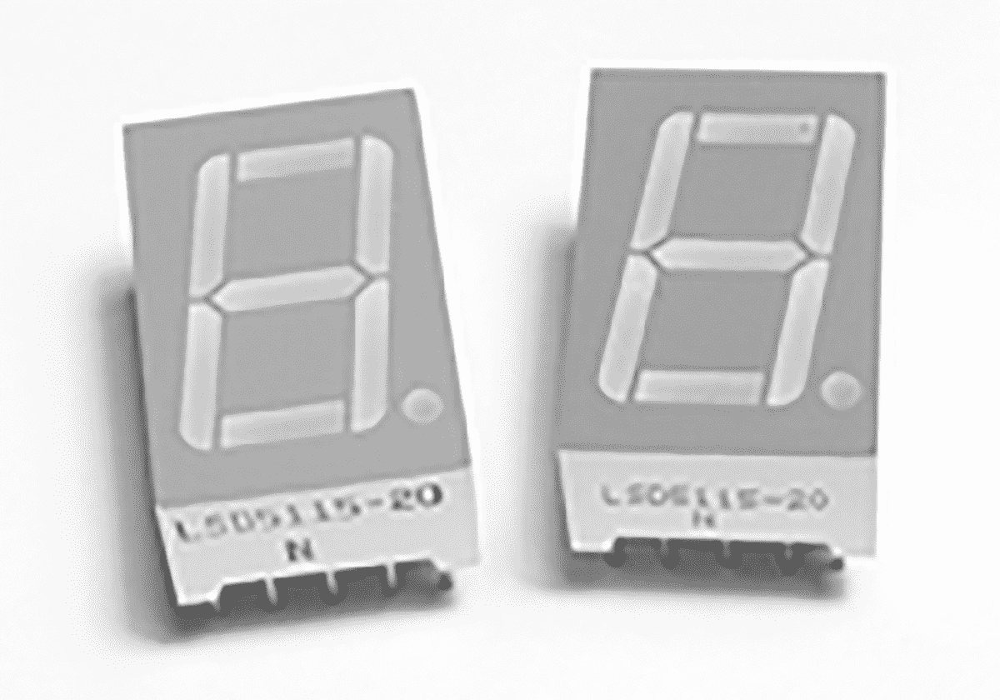

图 3-7：七段式 LED 显示模块

这些小塑料积木包含八个 LED，排列成一个熟悉的数字显示，带有小数点。你可以在各种家用电器中找到它们，它们非常适合显示数字、字母或符号。

七段显示器有多种尺寸和颜色可供选择，电气上，它们与八个独立的 LED 相同，但有一个注意点：为了减少显示器使用的引脚数，所有 LED 的阳极或阴极都被连接在一起。它们分别称为*共阳极*和*共阴极*配置。本书中所有的七段显示都使用共阴极模块。该示例显示器的原理符号如图 3-8 所示。

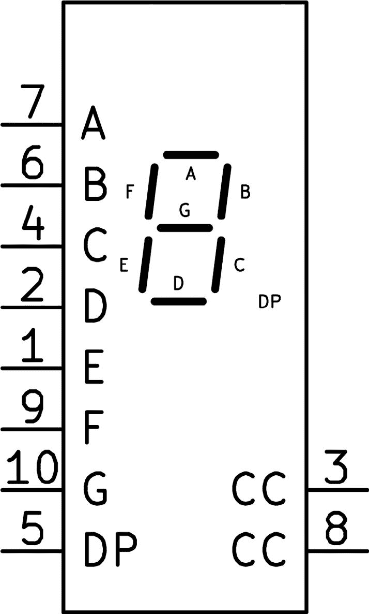

图 3-8：七段式共阴极 LED 显示模块的原理符号

每个 LED 的阴极旁边是其对应的段。显示器的 LED 从 A 到 G 以及 DP（小数点）标记，每个 LED 段有一个阳极引脚，阴极则连接到一个或两个共阴极引脚。

七段数码管的引脚布局因制造商而异，因此在购买时，请确保供应商提供数据表，显示每个段的阳极引脚和阴极引脚。如果有疑问，注意大多数常见型号的引脚 1 位于显示器的左下角，其余引脚按逆时针方向编号。记住，它们仍然是独立的 LED，并且你仍然需要为每个 LED 配置一个限流电阻。

项目 12：构建一个单数字数字计数器

让我们通过制作一个互动设备来巩固你到目前为止所学的内容，我希望它能激发你的想象力：一个单数字数字计数器。你的计数器将有两个按钮（一个用来增加计数，另一个用来将计数器重置为零）和一个七段显示器。

### 硬件

你需要以下硬件：

+   • USBasp 编程器

+   • 无焊接面包板

+   • ATmega328P-PU 微控制器

+   • 一个共阴极七段数码管显示器

+   • 七个 560 Ω电阻（R1–R7）

+   • 两个按键

+   • 两个 10 kΩ电阻（R8，R9）

+   • 跳线

按照图 3-9 中所示组装电路。

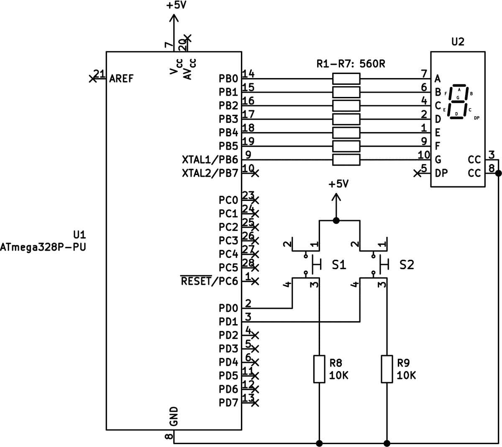

图 3-9： 项目 12 的主要电路

到现在为止，你应该已经记得在开始之前连接 USBasp 并将其接入电路，因此在这个项目之后我就不再提醒你了。

### 代码

打开一个终端窗口，导航到本书*第三章*文件夹下的*项目 12*子文件夹，并输入命令`make flash`。一旦你将代码上传到微控制器，按下连接到 PD0 的按钮以增加计数，按下另一个按钮将计数重置为零。

要查看它是如何工作的，打开项目 12 的*main.c*文件：

```

      // Project 12 - Building a Single-Digit Numerical Counter

      #include <avr/io.h>

      #include <util/delay.h>

      #define TIME 150

      ❶ void displayNumber(uint8_t value)

      // Displays numbers 0–9 on a seven-segment LED display

      {

      switch(value)

      {

      case 0 : PORTB = 0b00111111; break; // 0

      case 1 : PORTB = 0b00000110; break; // 1

      case 2 : PORTB = 0b01011011; break; // 2

      case 3 : PORTB = 0b01001111; break; // 3

      case 4 : PORTB = 0b01100110; break; // 4

      case 5 : PORTB = 0b01101101; break; // 5

      case 6 : PORTB = 0b01111101; break; // 6

      case 7 : PORTB = 0b00000111; break; // 7

      case 8 : PORTB = 0b01111111; break; // 8

      case 9 : PORTB = 0b01101111; break; // 9

      }

      }

      int main(void)

      {

      ❷ uint8_t i = 0;             // Counter value

      ❸ DDRB = 0b11111111;         // Set PORTB to outputs

      DDRD = 0b00000000;         // Set PORTD to inputs

      ❹ PORTD = 0b11111100;        // Turn off internal pullups for PD0 and PD1

      for(;;)

      {

      ❺ displayNumber(i);       // Display count

      _delay_ms(TIME);

      ❻ if (PIND == 0b11111110) // If reset button pressed . . .

      {

      i = 0;               // set counter to zero

      }

      ❼ if (PIND == 0b11111101) // If count button pressed . . .

      {

      i++;                 // increase counter

      if (i > 9)           // If counter is greater than 9 . . .

      {

      i = 0;            // set counter to zero

      }

      }

      }

      return 0;

      }

```

这段代码定义了一个新函数`displayNumber()`，该函数接收一个整数并设置 PORTB 的输出，以便打开或关闭 LED 显示器的各个段，从而显示从 0 到 9 的数字❶。通过使用`switch...case`语句，代码可以根据你想要显示的数字整洁地决定运行哪个`PORTB`命令。

变量`i`用于跟踪你想要显示的数字❷。这个变量初始化为零，这样当电源打开时，计数器就会从零开始。

接下来，我们设置 I/O 引脚，使用 PORTB 作为 LED 的输出，PORTD 作为输入，用来检测按钮是否被按下❸。由于按钮连接到 PD0 和 PD1 引脚，因此关闭这两个引脚的内部上拉电阻❹，而打开 PORTD 其余引脚的上拉电阻。这确保了 PORTD 中未使用的引脚始终为高电平。

每次代码循环时，首先显示计数的值 ❺，然后检查重置或计数按钮是否已按下。请注意，当代码将`PIND`与表示 PD0 ❻或 PD1 ❼上按钮按下的二进制值进行比较时，比较中未使用的位（或输入）为 1，而不是 0。这是因为未使用的输入已激活了内部上拉电阻，使其保持为 1。

当您按下计数按钮时，计数变量`i`应增加一。如果计数大于 9，则应将其重置为 0，因为您正在使用单位数显示器。

完成这个项目后，您将拥有一个精巧的显示器—但请记住，实践是学习的途径。尝试使用这个程序进行实验！例如，尝试将其改为倒计时器或者通过 LED 创建不同的模式而不是数字。

如果可能，请保持此项目组装完好，因为您将在项目 14 中重新使用大部分内容。

## 模拟输入

到目前为止，您的项目使用了只有两个电平的数字电信号：高电平和低电平。对于您的微控制器而言，高电平接近 5V，低电平接近 0V（或 GND）。我们使用 PORT *x*寄存器来闪烁 LED，并使用 PIN *x*寄存器来检测数字输入是高还是低。图 3-10 展示了用 DSO 测量的数字信号。

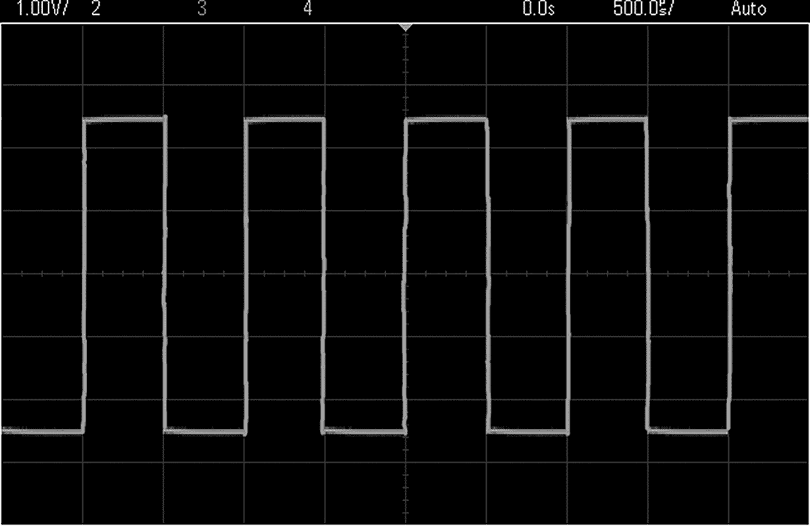

图 3-10：数字信号，高电平显示为顶部的水平线，低电平显示为底部

与数字信号不同，*模拟信号* 可以在高低之间的步骤数不定的情况下变化。例如，图 3-11 显示了一个类似正弦波的模拟电压信号。

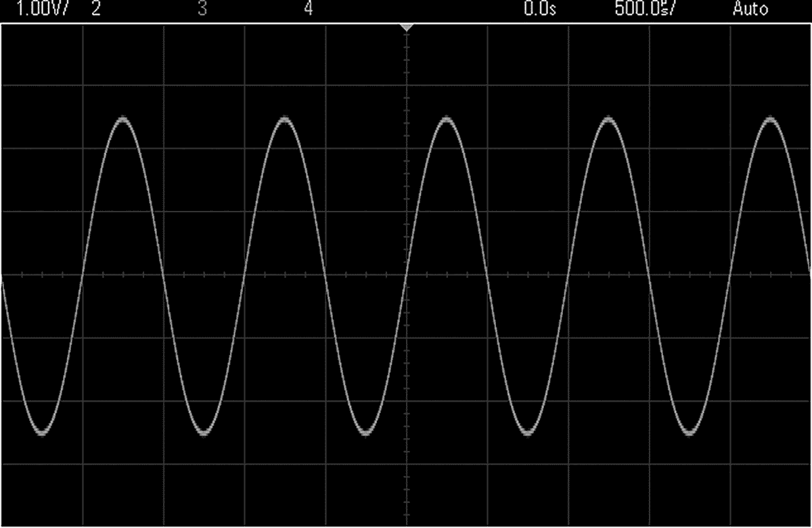

图 3-11：正弦模拟信号

注意随着时间的推移，电压在高低电平之间流动。模拟信号可以表示各种设备的各种信息，例如温度或距离传感器。要在项目中使用模拟信号，您需要使用微控制器中连接到特定 I/O 引脚的电压值来测量信号，这些引脚连接到*模拟-数字转换器（ADCs）* 。ADC 可以将电压转换为数字，然后您可以在代码中使用。参考第二章中的引脚图和端口寄存器图示；模拟输入标记为 ADC *x*代表*模拟-数字转换器 x*。

在 ATtiny85 上，您有 PB0、PB1、PB2 和 PB5（物理引脚 5–7 和 1）。在 ATmega328P-PU 上，您有一个全新的寄存器（PORTC），它具有从 PC0 到 PC5 的六个 ADC。

## 使用 ATtiny85 ADCs

要设置 ATtiny85 上的 ADC 引脚，你需要设置两个新的寄存器。（是的，又有更多的寄存器！你越用就越习惯它们。）第一个寄存器，ADMUX，选择你将连接到 ADC 的引脚。你将前六个位设置为`001000`，并使用最后两个比特来选择 ADC 的物理引脚。对于 ADC0（引脚 1）是`00`，对于 ADC1（引脚 7）是`01`，对于 ADC2（引脚 3）是`10`，对于 ADC3（引脚 2）是`11`。例如，要使用物理引脚 3 作为模拟输入，设置 ADMUX 如下：

```

     ADMUX = 0b00100010;

```

另一个需要设置的寄存器是 ADCSRA，它负责多个设置，包括 ADC 的速度。本书中的所有 ATtiny85 项目都将速度设置为 1 MHz。由于微控制器的 ADC 部分运行速度不同，你需要使用 ADCSRA 设置一个预分频值来决定 ADC 的速度。你通常会使用一个预分频器值为 8，这将 ADC 的速度降到 125 kHz（我们通过将 1 MHz 的速度除以 8 来计算）。相应的 ADCSRA 行是：

```

     ADCSRA = 0b10000011;

```

将这两个寄存器设置放入一个自定义函数中是个好主意，你可以将其命名为`startADC()`，例如。这样可以保持代码的整洁，并且在需要时可以轻松调用该函数。

使用 ADC 时，使用位操作来寻址寄存器中的位可能会很有帮助。现在我会保持简单，只给你展示它是如何工作的；我们将在第六章中更详细地回顾这个话题（以及预分频器的使用）。

要从你预设的 ADC 引脚读取值，首先使用以下代码行启动 ADC：

```

     ADCSRA |= (1 << ADSC);

```

这将 ADCSRA 寄存器中的 ADSC 位设置为 1，告诉你的 ATtiny85 读取模拟输入并将其转换为值。当 ATtiny85 完成时，ADSC 位将返回 0。你需要告诉你的代码稍等片刻，直到这个过程完成，像这样：

```

     while (ADCSRA & (1 << ADSC));

```

这会将 ADCSRA 寄存器中的 ADSC 位与 1 进行比较，如果两者都是 1，则不执行任何操作。当 ADC 过程完成时，ADSC 位会返回到 0，`while()` 函数结束，微控制器继续执行。

最终，ADC 的值存储在变量`ADCH`中。`ADCH`的值应在 0 到 255 之间。然后，你可以根据需要操作`ADCH`。

项目 13：制作一个单电池电池测试仪

在这个项目中，你将通过制作一个简单的电池测试仪来使用 ATtiny85 的 ADC。你可以用它来检查 AA、AAA、C 或 D 电池的电压。

警告：不要将电压大于 5 V 的电池（或其他电源）连接到测试仪，也不要将电池接反（请查看图 3-12 中的原理图）。这样做会损坏你的 ATtiny85。

该测试仪使用两个 LED 来指示电池是否良好（电压大于或等于 1.4 V）或电池是否坏（电压小于 1.4 V）。

### 硬件

你需要以下硬件：

+   • USBasp 编程器

+   • 无焊接面包板

+   • ATtiny85–20PU 微控制器

+   • 两个 LED

+   • 一个 560 Ω电阻

+   • 跳线

按照图 3-12 所示组装电路。请注意，标有正极（+）和负极（−）的两根电线是跳线，用于与要测试的电池接触。将+和−电线连接到电池的相应接点。


图 3-12： 项目 13 的电路图

你可能会发现，使用一些绝缘胶带帮助保持电线与被测试电池连接会有所帮助。你还可以使用红色和绿色 LED 指示灯来显示被测试电池是“坏的”还是“好的”。

### 代码

打开终端窗口，导航到本书的*第三章*文件夹下的*项目 13*子文件夹，并输入命令`make flash`。上传代码后，找一个 AA、AAA、C 或 D 型电池，将正负极引线按电路图连接到电路。如果电压大于或等于 1.4 V，LED2 应该亮起；如果小于 1.4 V，LED1 应该亮起。

要查看如何实现这一点，打开项目 13 的*main.c*文件：

```

      // Project 13 - Making a Single-Cell Battery Tester

      #include <avr/io.h>

      #include <util/delay.h>

      ❶ void startADC()

      // Set up the ADC

      {

      ADMUX = 0b00100010;               // Set ADC pin to 3

      ADCSRA = 0b10000011;              // Set prescaler speed for 1 MHz

      }

      int main(void)

      {

      DDRB = 0b00000011;                // Set pins 5 and 6 as outputs

      ❷  startADC();

      for(;;)

      {

      ❸ ADCSRA |= (1 << ADSC);         // Start ADC measurement

      while (ADCSRA & (1 << ADSC) ); // Wait until conversion completes

      _delay_ms(5);

      ❹ if (ADCH >= 71)

      {

      // If ADC input voltage is more than or equal to ~1.4 V . . .

      PORTB = 0b00000010;         // Turn on "battery OK" LED2

      ❺ } else if (ADCH < 71)

      {

      // Else, if ADC input voltage is less than ~1.4 V . . .

      PORTB = 0b00000001;         // Turn on "battery not OK" LED1

      }

      }

      return 0;

```

}函数`startADC()`将物理引脚 3 设置为使用其 ADC 功能，并设置预分频器以支持 1 MHz 操作❶。在使用 ADC 之前，我们需要调用这个函数❷。然后我们激活 ADC 进行读取，并等待其完成❸。

来自 ADC 的值——一个介于 0 到 255 之间的数字——存储在变量`ADCH`中。这个值映射到 ADC 的电压范围，范围是 0 到 5 V。你可以通过一些基本的数学计算找到 ADC 值：

(映射电压 × 256) / 电源电压 = ADC 值

对于我们的示例，我们计算 1.4 V 的匹配 ADC 值如下：

(1.4 V × 256 / 5 V) = 71.68

基于此计算，1.4 V 映射到 ADC 值为 71.4，在我们的代码中我们将其四舍五入为 71，因为在这个项目中我们使用的是整数。这个值用于`if`语句中，用来判断电池是否适合使用❹或者不适合使用❺。

到此为止，你应该已经理解如何读取外部设备中以变化电压形式呈现的模拟信号。这非常有用，因为许多传感器的值是以变化的电压形式返回的，因此可以通过微控制器的 ADC 引脚轻松读取。

接下来，让我们看看 ATmega328P-PU 上的 ADC，以及一些关于变量类型的更多信息。

## 使用 ATmega328P-PU 的 ADC

在 ATmega328P-PU 上设置 ADC 引脚与在 ATtiny85 上设置的类似。你将首先设置一些寄存器。第一个是 ADMUX，它有两个功能：指示你想使用哪个 ADC 引脚，并选择 ADC 与正在测量的模拟信号进行比较的参考电压源。

首先，你需要将 ADMUX 寄存器中的 REFS0 位设置为 1，这样就告诉微控制器使用连接到 AV [CC]（引脚 20）的电压与模拟信号进行比较。同样，你可以使用位操作来完成这个操作：

```

     ADMUX |= (1 << REFS0);

```

这是设置寄存器中单个比特的更简便且不易出错的方法，因为它让你避免一次处理所有八个比特——你只需要设置你想要更改的比特。还要记住，你只需要将比特设置为 1，因为默认情况下它们都是 0。

接下来，你需要将 MUX2 和 MUX0 位设置为 1，这样就告诉 ADC 从引脚 28 读取信号：

```

     ADMUX |= (1 << MUX2) | (1 << MUX0);

```

你将设置的第二个寄存器，ADCSRA，激活 ADC 并设置微控制器中 ADC 的速度。从这里到 第十三章 的所有 ATmega328P-PU 项目都将使用 1 MHz 的速度，对应的 ADCSRA 设置行是：

```

     ADCSRA |= (1 << ADPS1) | (1 << ADPS0);

```

最后，你需要通过将 ADEN 位设置为 1 来激活 ADC：

```

     ADCSRA |= (1 << ADEN);

```

如在 项目 12 中所示，最好将寄存器设置放入自己的自定义函数中，我将其命名为 `startADC()`。

当你想从预设的 ADC 引脚测量一个值时，首先需要按如下方式启动 ADC：

```

     ADCSRA |= (1 << ADSC);

```

这将 ADCSRA 寄存器中的 ADSC 位设置为 1，这告诉 ATmega328P-PU 读取模拟输入并将其转换为数值。这不是即时的；你的代码需要等待直到 ATmega328P-PU 完成 ADC 读取，此时 ADSC 位返回为 0。以下是一个方便的节省空间的函数，可以用来监视寄存器中位的变化：

```

     loop_until_bit_is_clear(ADCSRA, ADSC);

```

在这种情况下，它强制代码等待直到 ADSC 位返回为 0；当这种情况发生时，ADC 过程完成，代码可以继续执行。

来自 ADC 的值是一个 10 位数，工具链将其提供在一个虚拟寄存器变量中，正如你猜到的，名为 `ADC`。然而，对于那些精度要求不高的用途，你可以只使用一个 8 位值，将 ADC 寄存器的最后 2 位丢弃，如下所示：

```

     ADCvalue = ADC;

```

其中，`ADCvalue` 是一个整数变量，用于保存来自 ADC 的值。

最后，在使用相同的电源来驱动微控制器及其内部 ADC 时，最好在正负电源线之间使用一个小的平滑电容，如 以下项目 所示。

## 介绍可调电阻

可调电阻，也称为*电位器*，通常可以从 0 Ω 调节到其额定值。图 3-13 显示了它们的电路符号。

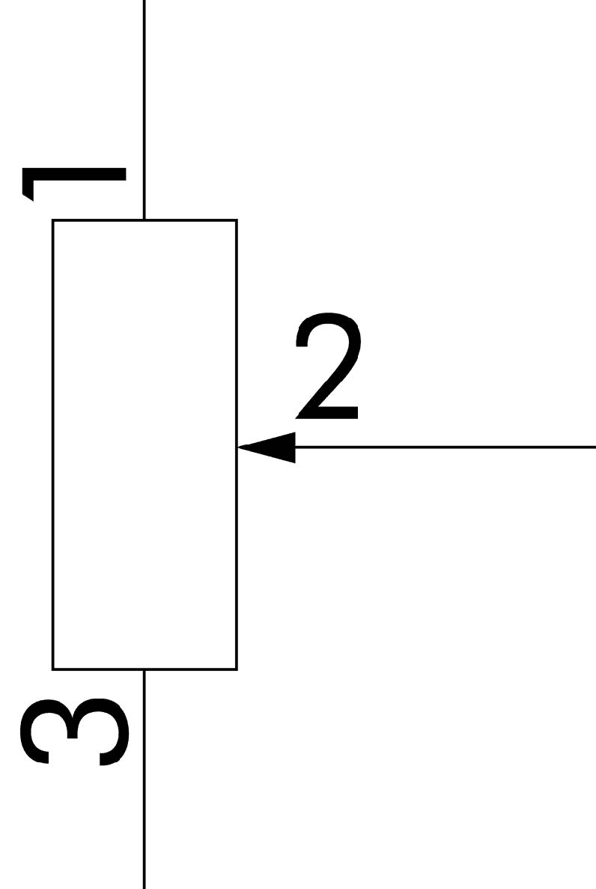

图 3-13：可调电阻（电位器）符号

可变电阻有三个电连接点，一个在中间，另两个分别在两侧。随着可变电阻轴的旋转，它会增加中间与一侧之间的电阻，同时减少中间与另一侧之间的电阻。

可变电阻可以是*线性*的或*对数*的。线性型电位器的电阻在旋转时以恒定的速率变化，而对数型电位器的电阻一开始变化缓慢，随后迅速增加。对数型电位器常用于音频放大电路中，因为它们模拟了人类的听觉反应。你通常可以通过电位器背面的标记识别它是线性型还是对数型。大多数电位器会在电阻值旁标有 A 或 B：A 表示对数型，B 表示线性型。大多数项目使用的是线性可变电阻，如图 3-14 所示。

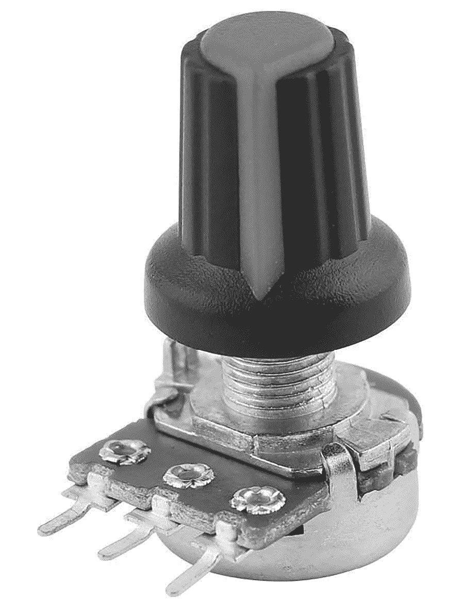

图 3-14：典型的线性可变电阻

微型可变电阻被称为*微调电位器*或*修整器*（见图 3-15）。由于其体积小，微调电位器在电路中调整时非常有用，而且它们也非常适合面包板工作，因为它们可以插入到面包板中。

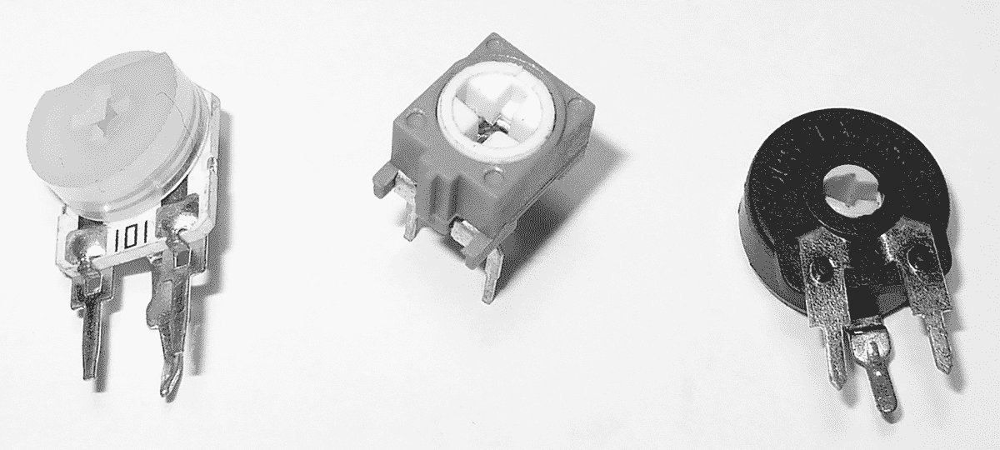

图 3-15：各种微调电位器

购买微调电位器时，请注意类型。如果可能，选择一种你手头的螺丝刀容易调节的类型。图中封闭式的微调电位器（见图 3-15）更为优选，因为它们比便宜的开式接触型更耐用。

项目 14：使用 ATmega328P-PU ADC 进行实验

在这个项目中，你将使用较大的 ATmega328P-PU 微控制器进行 ADC 实验，并练习更复杂的决策代码。这个项目测量来自微调电位器的信号，信号在 0 V 和 5 V 之间变化。该值会落入四个范围之一，并由四个 LED 中的一个显示出来。

### 硬件部分

你需要以下硬件：

+   • USBasp 编程器

+   • 无焊面包板

+   • ATtiny328P-PU 微控制器

+   • 四个 LED

+   • 四个 560 Ω 电阻

+   • 0.1 μF 陶瓷电容器

+   • 10 kΩ 面包板兼容线性微调电位器

+   • 跳线

按照图 3-16 中的方式组装电路。

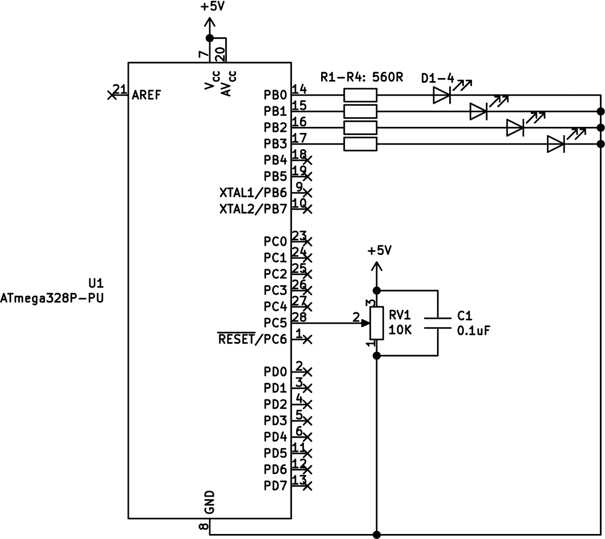

图 3-16： 项目 14 的电路图

如果你找不到适配面包板的微调电位器，可以使用全尺寸的电位器，尽管你需要将跳线焊接到电位器的三个引脚上，以便与无焊面包板接触。

### 代码部分

打开终端窗口，导航到本书 *第三章* 文件夹下的 *Project 14* 子文件夹，并输入命令 `make flash`，按常规上传 Project 14 的代码。上传代码后，开始缓慢将可调电位器调到一个极限，然后转到另一个方向，调到另一个极限。LED 应该能指示你当前转动的是可调电位器范围的哪个四分之一。

让我们看看它是如何工作的。打开 Project 14 的 *main.c* 文件，查看代码：

```

      // Project 14 - Experimenting with an ATmega328P-PU ADC

      #include <avr/io.h>

      #include <math.h>

      #include <util/delay.h>

      ❶ void startADC()

      // Set up the ADC

      {

      ADMUX |= (1 << REFS0);                 // Use AVcc pin with ADC

      ADMUX |= (1 << MUX2) | (1 << MUX0);    // Use ADC5 (pin 28)

      ADCSRA |= (1 << ADPS1) | (1 << ADPS0); // Prescaler for 1MHz (/8)

      ADCSRA |= (1 << ADEN);                 // Enable ADC

      }

      int main(void)

      {

      uint16_t ADCvalue;

      ❷ DDRB = 0b11111111;                      // Set PORTB to outputs

      DDRC = 0b00000000;                      // Set PORTC to inputs

      ❸ startADC();

      for(;;)

      {

      ❹ // Take reading from potentiometer via ADC

      ADCSRA |= (1 << ADSC);                // Start ADC measurement

      loop_until_bit_is_clear(ADCSRA, ADSC);

      // Wait for conversion to finish

      ❺ _delay_ms(10);

      ❻ // Assign ADC value to "ADCvalue"

      ADCvalue = ADC;

      ❼ if (ADCvalue>=0 && ADCvalue <256)

      {

      PORTB = 0b00000001;

      }

      else if (ADCvalue>=256 && ADCvalue<512)

      {

      PORTB = 0b00000010;

      }

      else if (ADCvalue>=512 && ADCvalue<768)

      {

      PORTB = 0b00000100;

      }

      else if (ADCvalue>=768 && ADCvalue<1023)

      {

      PORTB = 0b00001000;

      }

      // Turn off the LEDs in preparation for the next reading

      _delay_ms(100);

      PORTB = 0b00000000;

      }

      return 0;

      }

```

首先，我们指定用于输出（LED—PORTB）和 ADC 输入的引脚 ❷，然后我们调用函数 `startADC()` ❶ 来设置 ADC ❸。我们通过引脚 PC5 ❹ 测量来自可调电位器的值，并在短暂的延迟 ❺ 后将其存储到整数变量 `ADCvalue` ❻ 中，以便给 ADC 时间完成数据转换。

接下来，代码使用一系列的 `if...else` 函数 ❼ 来评估 ADC 的值。每个检查 ADC 值是否落在某个范围内，使用 `AND`（`&&`）条件运算符，然后如果测试结果为真，则激活一个 LED 进行视觉指示。

最后，在主循环结束时，LED 被关闭，并且稍作延迟，以便有时间进行指示，随后过程再次开始。

## 使用 AVR 进行算术运算

像口袋计算器一样，AVR 可以为你执行基本的计算。这在你处理模拟到数字转换时非常方便。以下是 AVR 提供的一些数学运算：

```

     432 + 956; // Addition

     100 / 20;  // Division

     5 * 200;   // Multiplication

     25 - 25;   // Subtraction

     10 % 4;    // Modulo

```

然而，C 语言处理某些类型的计算与口袋计算器有些不同。例如，在除法运算中，AVR 会直接丢弃余数，而不是四舍五入：16 除以 2 等于 8，10 除以 3 等于 3，18 除以 8 等于 2。我会在遇到其他特殊情况时解释。

当处理会或已经产生小数点的数字时（例如，将 1 除以 3），你需要使用一种新类型的变量，叫做 *float*。float 类型可以存储的值范围在 −3.39 × 10 ³⁸ 到 3.39 × 10 ³⁸ 之间。要在代码中使用浮点运算，你需要引入一个新的库：

```

     #include <math.h>

```

你将在 Project 15 中逐渐习惯这种数学运算，并与第一个模拟传感器一起使用，我会在接下来介绍它。

## 使用外部电源

到目前为止，你一直是通过 AVR 编程器直接为项目供电，这对于小型项目和实验来说是一个简洁的解决方案。然而，这种方法会使你的电路仅能获得不到 5 V 的输出电压，因为编程器的内部电路会降低电压。

如果你使用万用表测量 ATmega328P-PU 在项目 14 或之前项目中的引脚 7 和 8 之间的电压，你会发现它小于 5 V。当使用需要 5 V 电压的组件（如在下一个项目 中使用的 TMP36）时，你需要一个外部电源以确保准确性和可靠性。

添加外部 5 V 电源的一个简单方法是使用面包板电源模块，比如来自 PMD Way 的模块（零件号 20250303），如图 3-17 所示。

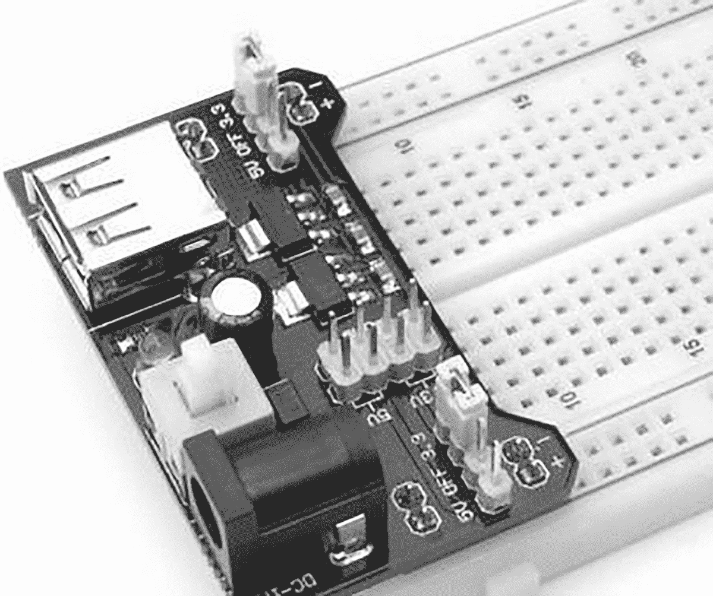

图 3-17：面包板电源模块

PMD Way 模块插入到面包板的一端，由常见的 AC 到 DC 电源适配器供电。该单元为面包板的两侧提供 5 V 或 3.3 V 电压，并带有一个方便的电源开关进行控制。它是一个小巧且非常便捷的设备。

## TMP36 温度传感器

使用 TMP36 温度传感器（如图 3-18 所示）和一些简单的数学运算，你可以将 AVR 转变为温度计。这个廉价且易于使用的模拟传感器输出随周围温度变化的电压。

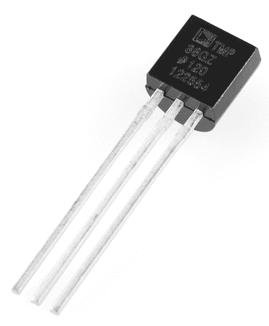

图 3-18：TMP36 温度传感器

TMP36 传感器有三个引脚。当你面朝传感器平面并看到其上有文字时，引脚的排列顺序是（从左到右）电压输入、电压输出和接地（GND）。你需要将引脚 1 连接到你项目中的 5 V 电源，引脚 2 连接到微控制器的模拟输入，引脚 3 连接到接地（GND）。图 3-19 显示了 TMP36 的原理图符号。

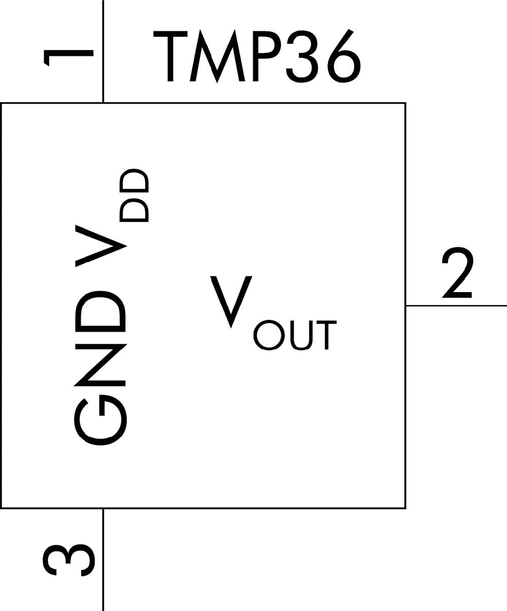

图 3-19：TMP36 原理图符号

TMP36 的电压输出表示传感器周围的温度；例如，在 25 摄氏度时，输出为 750 毫伏（即 0.75 V），每变化 1 度，电压输出会变化 10 毫伏。TMP36 可以测量从 -40 到 125 摄氏度的温度，但在下一个项目中你只需测量室温。

要从电压中确定温度，将 ADC 中的值乘以 5，再除以 1,024，得到传感器返回的实际电压。接下来，减去 0.5（0.5 V 是 TMP36 用于允许低于 0 度的温度的偏移量），然后乘以 100，得到摄氏温度。

注：如果你想使用华氏度，需将摄氏度乘以 1.8，再加上 32。

由于这是一个模拟设备，输出电压由输入电压决定。如果输入端没有 5 V 或接近 5 V 的电压，输出和温度读数将不正确。

项目 15：创建数字温度计

在这个项目中，你将运用项目 12 中学到的知识，使用 ATmega328P-PU 上的 ADC 创建一个数字温度计的数字显示。为了简化，项目将只显示从 0 摄氏度开始的温度，负温度值不包括在内。

### 硬件

要构建你的温度计，你需要通过微控制器读取 TMP36 模拟温度传感器，然后使用项目 12 中的七段 LED 显示器逐位显示温度。

你将需要以下硬件：

+   • USBasp 编程器

+   • 无焊接面包板

+   • 5 V 面包板电源

+   • ATmega328P-PU 微控制器

+   • 一个 TMP36 温度传感器

+   • 一个共阴七段 LED 显示器

+   • 七个 560 Ω电阻（R1–R7）

+   • 0.1 μF 陶瓷电容器

+   • 跳线

按照图 3-20 中的示意图组装电路。

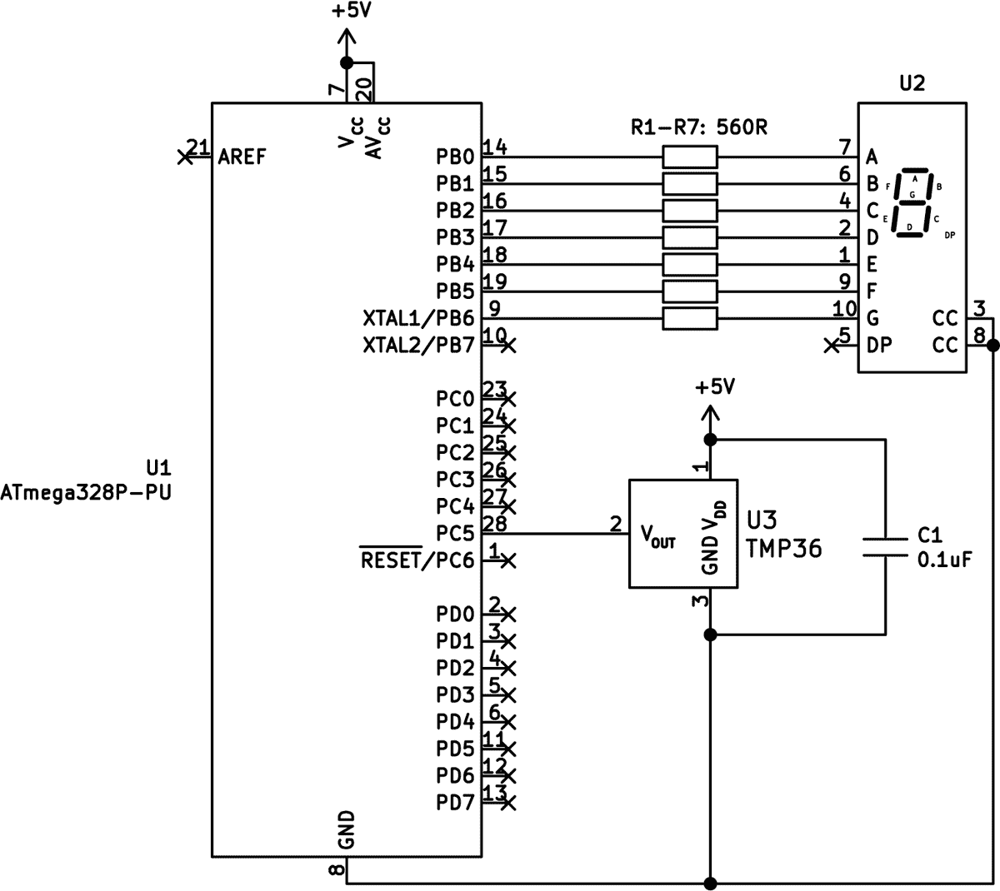

图 3-20： 项目 15 的原理图

你将使用 0.1 μF 电容器帮助保持 TMP36 温度传感器的稳定电源；它应该尽量靠近 TMP36 的 5 V 和 GND 引脚安装。

### 代码

打开一个终端窗口，进入本书*第三章*文件夹下的*项目 15*子文件夹，输入命令`make flash`上传项目 15 的代码。上传代码后，LED 模块应该会逐位显示大致的温度。例如，如果温度是 8 摄氏度，显示屏将先显示 0，短暂延迟后，再显示 8。

要了解这个工作原理，打开*main.c*文件，查看项目 15 中的代码：

```

      // Project 15 - Creating a Digital Thermometer

      ❶ #include <avr/io.h>

      #include <math.h>

      #include <util/delay.h>

      ❷ void startADC()

      // Set up the ADC

      {

      ADMUX |= (1 << REFS0);                 // Use AVcc pin with  ADC

      ADMUX |= (1 << MUX2) | (1 << MUX0);    // Use ADC5 (pin 28)

      ADCSRA |= (1 << ADPS1) | (1 << ADPS0); // Prescaler for 1MHz (/8)

      ADCSRA |= (1 << ADEN);                 // enable ADC}

      }

      ❸ void displayNumber(uint8_t value)

      // Displays a number from 0–9 on the seven-segment LED display

      {

      switch(value)

      {

      case 0 : PORTB = 0b00111111; break; // 0

      case 1 : PORTB = 0b00110000; break; // 1

      case 2 : PORTB = 0b01011011; break; // 2

      case 3 : PORTB = 0b01111001; break; // 3

      case 4 : PORTB = 0b01110100; break; // 4

      case 5 : PORTB = 0b01101101; break; // 5

      case 6 : PORTB = 0b01101111; break; // 6

      case 7 : PORTB = 0b00111000; break; // 7

      case 8 : PORTB = 0b01111111; break; // 8

      case 9 : PORTB = 0b01111101; break; // 9

      }

      }

      int main(void)

      {

      ❹ uint8_t tens = 0;  // Holds tens digit for temperature

      uint8_t ones = 0;  // Holds ones digit for temperature

      float temperature;

      float voltage;

      uint16_t ADCvalue;

      uint8_t finalTemp;

      DDRB = 0b11111111; // Set PORTB to outputs

      DDRC = 0b00000000; // Set PORTC to inputs

      startADC();

      for(;;)

      {

      ❺ // Take reading from TMP36 via ADC

      ADCSRA |= (1 << ADSC);         // Start ADC measurement

      while (ADCSRA & (1 << ADSC) ); // Wait for conversion to finish

      _delay_ms(10);

      // Get value from ADC register, store in ADCvalue

      ADCvalue = ADC;

      ❻ // Convert reading to temperature value (Celsius)

      voltage = (ADCvalue * 5);

      voltage = voltage / 1024;

      temperature = ((voltage - 0.5) * 100);

      ❼ // Display temperature on LED module

      finalTemp = (uint8_t) round(temperature);

      tens = finalTemp / 10;

      ones = finalTemp % 10;

      ❽ displayNumber(tens);  // Display tens digit

      _delay_ms(250);

      displayNumber(ones);  // Display ones digit

      _delay_ms(250);

      ❾ // Turn off the LED display in preparation for the next reading

      PORTB = 0b00000000;

      _delay_ms(1000);

      }

      return 0;

      }

```

在这段代码中，我们首先包含了必要的库（其中包括*math.h*，用于浮点数学）❶。我们添加了`startADC()`函数以启动 ADC ❷（该函数在代码的主要部分开始时调用），并且我们重用了项目 12 中的`displayNumber()`函数❸。

在代码的主要部分，我们声明所需的变量，定义输入和输出引脚，并初始化 ADC ❹。代码的主循环被分为五个步骤：

1.  1\. TMP36 的电压由 ADC 测量并存储在变量`ADCvalue` ❺中。

1.  2\. 使用“介绍 TMP36 温度传感器”中描述的公式，代码将 ADC 的值转换为电压。然后，这个电压被转换为摄氏度的温度 ❻。

1.  3\. 用于表示温度的数字从`finalTemp`中提取，然后通过`round()`函数四舍五入到最接近的整数。代码通过将温度除以 10 来确定十位数字。如果温度低于 10 度，则此值为 0。通过对温度除以 10 的余数进行取余运算，确定个位数字 ❼。

1.  `displayNumber()` 函数用于分别显示温度的十位和个位数字，数字之间有四分之一秒的延迟 ❽。

1.  5\. 最后，显示器关闭一秒钟 ❾，为显示的值和即将出现的新值之间提供视觉间隔。

这个看似复杂的项目只是将你现有的知识以新的方式组合起来，我希望这能激发你的想象力。在第四章中，我们将转向一个新主题：启用微控制器与 PC 之间的双向通信，用于数据捕获和控制。
