# 第四章：# 使用 USART 与外部世界进行通信


本章将教你如何使用*通用同步异步接收发射器（USART）*，一个专用的双向端口，用于在 AVR 和计算机之间传输信息，允许两者进行通信。USART 让你可以从计算机控制 AVR 项目，它还能帮助你调试项目，因为你可以从 AVR 向计算机发送状态报告，跟踪代码的进展。

在本章中，你将：

+   • 使用终端仿真软件将你的计算机作为输入输出设备，来支持基于 AVR 的项目。

+   • 在 AVR 和计算机之间发送串行数据。

+   • 在 AVR 和计算机之间传输数据，包括数字和字母。

+   • 熟悉 ASCII 码。

在此过程中，你将学会将温度计的读数记录到 PC 上进行后续分析，并构建一个简单的计算器。

## 介绍 USART

计算机之间有很多种通信方式，其中一种方法是使用*串行数据*，即按顺序每次发送一个比特的数据。基于 AVR 的项目通过 AVR 的 USART 来实现这一点。ATmega328P-PU 微控制器上的 USART 使用引脚 2 接收数据，使用引脚 3 发送数据。数据以*字节*的形式发送和接收，每个字节代表 8 位数据。

与直接发送 1 和 0（计算机表示字节的方式）不同，数据的值是通过改变电压电平在一定时间内表示的。高电压表示 1，低电压表示 0。每个字节从起始位开始，起始位总是 0，结束位总是 1。字节数据是从最右边的（即最不重要的）位开始发送和接收的。

我将使用数字存储示波器展示这些字节数据是什么样的，正如你在第三章中看到的，它是一种可以显示电压随时间变化的设备。例如，参见图 4-1，它显示了从 USART 发送的代表数字 10 的字节数据。

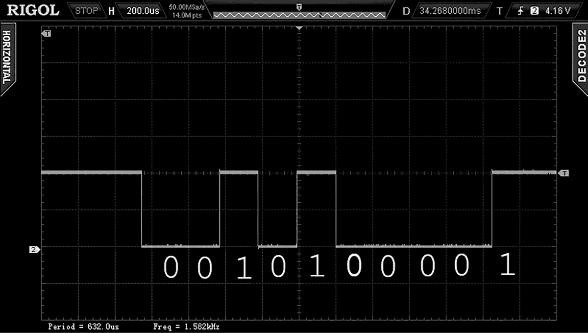

图 4-1：在数字存储示波器上表示的字节数据

让我们来看一下如何将这转换为十进制数字 10。起始位总是 0，所以电压首先是低电压，然后是低电压（0），然后是高电压（1），再是低电压，再是高电压，再是低电压，持续四个周期，最后是高电压（结束位，总是 1）。这给我们带来了二进制数字 01010000，但因为字节是从最不重要的位（LSB）开始发送和接收的，所以我们需要将它翻转过来。这就得到 00001010，这是十进制数字 10 的二进制表示。

数据以不同的速度发送和接收。在图 4-1 和本章中的所有项目中，数据传输速度是 4,800bps（每秒比特数）。

## USART 通信的硬件和软件

要准备好让你的计算机与 AVR 微控制器进行数据发送和接收，你需要两样东西：一个 USB 转串口转换器和适合的终端软件。

让我们从*USB 转串口转换器*开始，它是将你的 AVR 项目连接到计算机的最简单方式。这类转换器有许多种类型，但在本书中，我推荐使用一种内置于电缆中的转换器，方便实用。我使用的是 PL2303TA 型 USB 转串口电缆，如图 4-2 所示。CP2102 和 CP2104 型电缆也很受欢迎。按照供应商的说明安装转换器电缆的驱动程序。

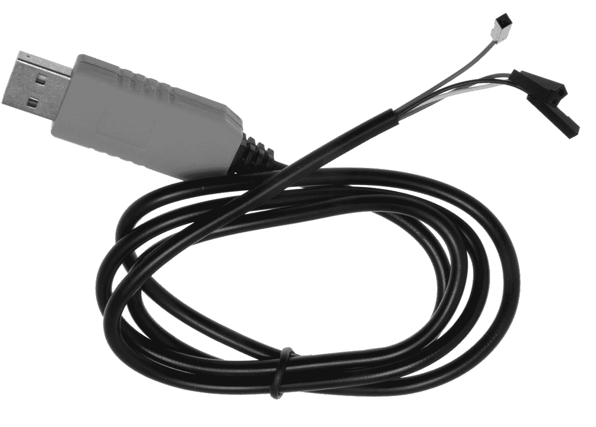

图 4-2：PL2303TA 型 USB 转串口转换器电缆

要通过你的 AVR 项目与计算机进行交互，你还需要一个*终端仿真器*，这是一个简单的程序，用来捕获并显示从 AVR 接收的数据，同时让你能够从计算机向 AVR 发送数据。CoolTerm 是 Roger Meier 开发的一个出色的终端仿真器，适用于多种平台；你可以从他的网站[`freeware.the-meiers.org/`](http://freeware.the-meiers.org/)下载。该软件是免费的，但请考虑通过网站捐赠，以支持 Meier 的工作。

一旦你下载并安装了 CoolTerm，将你的 USB 转串口转换器插入计算机，打开 CoolTerm，然后点击窗口顶部的**选项**按钮。图 4-3 中的界面应该会显示出来。

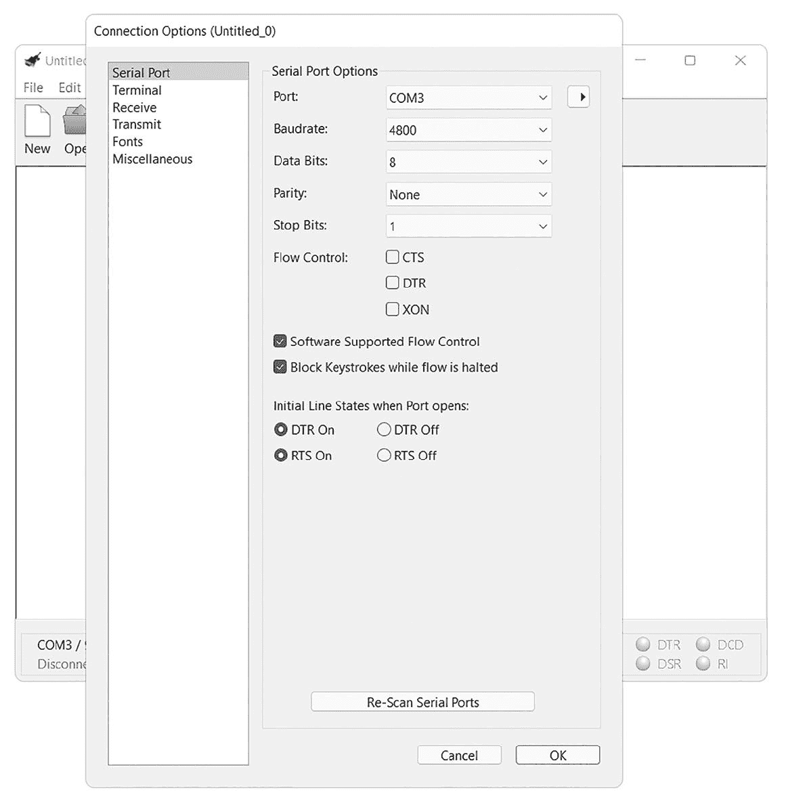

图 4-3：CoolTerm 的串口选项配置界面

我在本书中的示例中使用的是 Windows 系统，但 CoolTerm 在其他平台上运行时界面应当类似。将串口选项设置更改为与图 4-3 所示设置一致，除了端口（Port），它会根据你的计算机有所不同——将其更改为与你的 USB 转换器名称匹配。例如，对于 Windows PC，使用端口旁边的下拉菜单选择你的 USB 转串口转换器所使用的 COM 端口。

接下来，从左侧列表中选择**终端**选项，调整设置以匹配图 4-4 中所示的设置，然后点击**确定**。


图 4-4：CoolTerm 的终端选项配置屏幕

一旦 CoolTerm 正确配置，应该会出现图 4-5 中显示的窗口，表示 CoolTerm 已准备好使用。

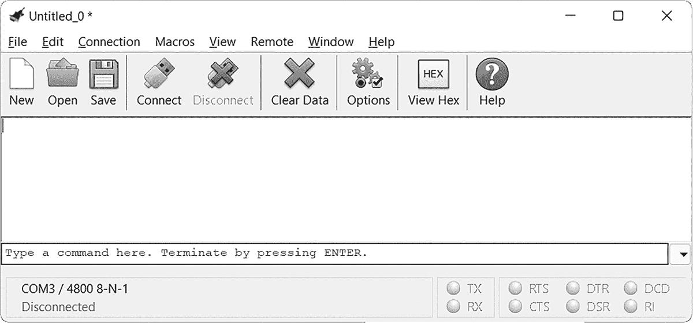

图 4-5：CoolTerm 已准备好使用

现在你已经准备好测试你的 USB 到串口转换器和终端软件了。

项目 16：测试 USART

在本项目中，你将首次使用 USART，测试你的 USB 串口连接和硬件。这将为更高级的项目做准备，在这些项目中，你将从 AVR 向计算机发送数据，以调试代码并检查其进度。

### 硬件

对于这个项目，你将需要以下硬件：

+   • USBasp 编程器

+   • 无焊接面包板

+   • ATmega328P-PU 微控制器

+   • USB 到串口转换器

+   • 跳线

如同之前的项目那样，通过无焊接面包板将 USBasp 连接到你的微控制器。接下来，找到你的 USB 串口转换器上的四个连接端：GND、TX、RX 和 V [CC]（或 5V）。按照表格 4-1 中的指示，将前面三个引脚连接到微控制器。如果你使用的是图 4-2 中展示的 PL2303TA 电缆，白色电缆是 RX，绿色电缆是 TX。如果你使用的是不同型号，请参考供应商的说明书以确定正确的电缆。

| 表 4-1：USB 到串口转换器与微控制器连接 |
| --- |
| USB 到串口转换器引脚 | ATmega328P-PU 引脚 |
| --- | --- |
| GND | 8 GND |
| TX | 2 RX |
| RX | 3 TX |

你将在本章的接下来的三个项目中使用这块硬件，因此在组装完成后，请保持它完好无损。

### 代码

打开一个终端窗口，导航到本书*第四章*文件夹中的*项目 16*子文件夹，并输入`make flash`命令。工具链应该会编译子文件夹中的程序文件，然后将数据上传到微控制器。

接下来，切换到终端软件并点击**连接**按钮。稍等片刻，CoolTerm 窗口应该会显示出永恒的消息`Hello world`，如图 4-6 所示。

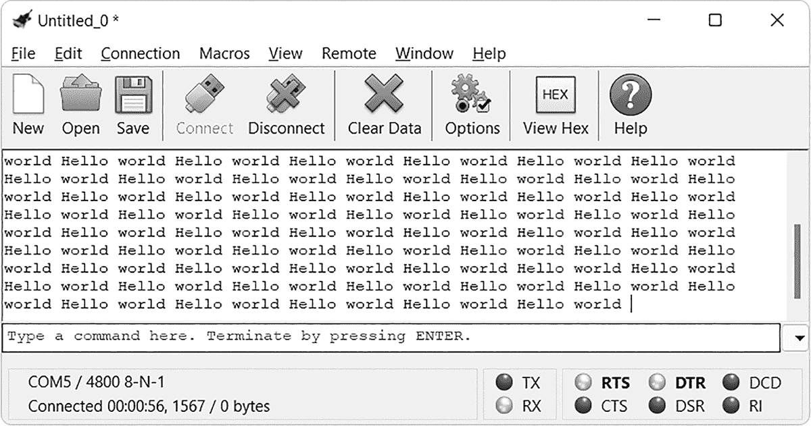

图 4-6：成功！项目 16 的代码在终端上打印“Hello world”。

要了解如何实现这一点，请打开位于*项目 16*子文件夹中的*main.c*文件，其中包含以下代码：

```

      // Project 16 - Testing the USART

      #include <avr/io.h>

      ❶ #define USART_BAUDRATE 4800

      #define UBRR_VALUE 12

      ❷ void USARTInit(void)

      {

      // Set baud rate registers

      UBRR0H = (uint8_t)(UBRR_VALUE>>8);

      UBRR0L = (uint8_t)UBRR_VALUE;

      // Set data type to 8 data bits, no parity, 1 stop bit

      UCSR0C |= (1<<UCSZ01)|(1<<UCSZ00);

      // Enable transmission and reception

      UCSR0B |= (1<<RXEN0)|(1<<TXEN0);

      }

      ❸ void USARTSendByte(uint8_t u8Data)

      {

      // Wait while previous byte sent

      while(!(UCSR0A&(1<<UDRE0))){};

      // Transmit data

      UDR0 = u8Data;

      }

      ❹ void HelloWorld(void)

      {

      USARTSendByte(72);  // H

      USARTSendByte(101); // e

      USARTSendByte(108); // l

      USARTSendByte(108); // l

      USARTSendByte(111); // o

      USARTSendByte(32);  // space

      USARTSendByte(119); // w

      USARTSendByte(111); // o

      USARTSendByte(114); // r

      USARTSendByte(108); // l

      USARTSendByte(100); // d

      USARTSendByte(32);  // space

      }

      int main(void)

      {

      // Initialize USART0

      ❺ USARTInit();

      while(1)

      {

      HelloWorld();

      }

      }

```

在使用 USART 之前，必须先进行初始化并设置数据速率（在本例中为 4800bps）❶。所有初始化代码都包含在`USARTInit()`函数中❷，该函数需要在代码的主循环中调用一次❺。

`USARTSendByte()`函数❸将一个字节的数据从 USART 发送到计算机。此函数在发送新字节数据之前会等待 USART 清除旧数据，新字节数据以 8 位整数的形式发送（数据类型为`uint8_t`）。

最后，文本“Hello world”是通过`HelloWorld()`函数❹发送的。请注意，我们不是直接发送字母，而是发送代表每个字母的数字。为了参考，我在代码中注释了每个数字对应的字母。这些数字是*ASCII 码*的一部分，最初用于电报和早期通信系统之间的消息传输。你可以在[`en.wikipedia.org/wiki/ASCII`](https://en.wikipedia.org/wiki/ASCII)找到 ASCII 控制码表的副本。

你可以通过更改发送给计算机的文本来尝试此代码；只需在`USARTSendByte()`函数调用中替换你自己的 ASCII 码。不过不要在这上面花太多时间，因为下一个项目将向你展示一种更好的传输文本的方法。

最后，当你完成监控 USART 后，始终在 CoolTerm 中点击**断开连接**。

项目 17：通过 USART 发送文本

本项目使用的硬件与项目 16 相同。打开一个终端窗口，导航到本书*第四章*文件夹中的*项目 17*子文件夹，输入`make flash`命令，像往常一样上传项目 17 的代码。

接下来，切换到终端软件并点击**连接**按钮。片刻后，屏幕应再次显示`Hello, world`—这次是单列显示，如图 4-7 所示。

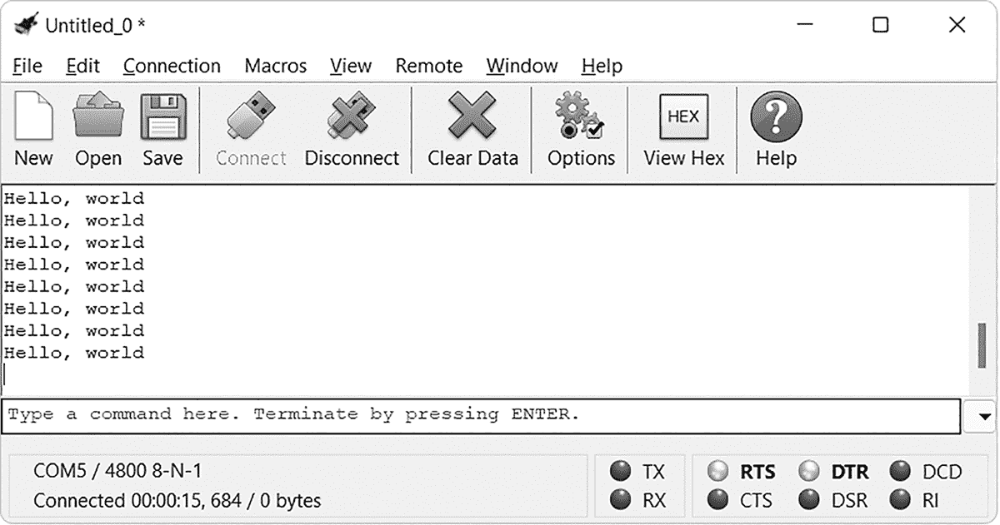

图 4-7：项目 17 的示例结果

项目 17 的代码与项目 16 相同，唯一不同的是，它使用了*字符数组*来简化发送文本的过程。这些数组存储一个或多个字符，可以是字母、数字、符号以及你键盘上能生成的任何内容。它们的定义如下：

```

      char i[
      `x` 
      ] = ""

```

其中`x`是数组中可以出现的最大字符数（通常建议包含这个值）。

要查看如何以这种方式传输文本，请打开位于*项目 17*子文件夹中的*main.c*文件，该文件包含以下代码：

```

      // Project 17 - Sending Text with the USART

      #include <avr/io.h>

      #include <util/delay.h>

      #define USART_BAUDRATE 4800

      #define UBRR_VALUE 12

      void USARTInit(void)

      {

      // Set baud rate registers

      UBRR0H = (uint8_t)(UBRR_VALUE>>8);

      UBRR0L = (uint8_t)UBRR_VALUE;

      // Set data frame format to 8 data bits, no parity, 1 stop bit

      UCSR0C |= (1<<UCSZ01)|(1<<UCSZ00);

      // Enable transmission and reception

      UCSR0B |= (1<<RXEN0)|(1<<TXEN0);

      }

      void USARTSendByte(unsigned char u8Data)

      {

      // Wait while previous byte is sent

      while(!(UCSR0A&(1<<UDRE0))){};

      // Transmit data

      UDR0 = u8Data;

      }

      ❶ void sendString(char myString[])

      {

      uint8_t a = 0;

      while (myString[a])

      {

      USARTSendByte(myString[a]);

      a++;

      }

      }

      int main(void)

      {

      ❷ char z[15] = "Hello, world\r\n"; // Make sure you use " instead of ”

      // Initialize USART

      USARTInit();

      while(1)

      {

      sendString(z);

      _delay_ms(1000);

      }

      }

```

在主循环中，我们定义了一个包含`Hello, world`消息的字符数组 ❷。该消息旁边的`\r`和`\n`是*无声控制代码*，也称为*转义序列*，它们向终端软件发送信息，但本身不会显示出来。`\r`指示软件将光标移到行首，`\n`指示将光标移到下一行的垂直位置；因此，组合`\r\n`将光标移到终端显示的下一行的开头，从而使输出以有序的列格式打印。

我们使用一个名为`sendString()`的新函数 ❶，通过从零（数组的第一个位置总是零）开始循环，逐个读取我们定义的数组中的每个字符并将它们发送到 USART，直到没有更多字符。在每次循环迭代中，AVR 将当前字节发送到 USART。

如果在输入代码后收到错误消息，如下所示：

```

      `main.c:42:2: error: stray '\342' in program` 

```

这意味着你使用了错误类型的引号来定义字符数组。确保你使用的是直引号（ `"` ）而不是弯引号（ `”` ）。你可能需要更改文本编辑器中的自动更正设置，以防止错误的引号出现。

在下一个项目中，你将学习如何将数据从 AVR 发送到计算机上的终端软件。

项目 18：使用 USART 发送数字

你通常需要在 AVR 和计算机之间发送数字。例如，你可能希望记录硬件生成的数据，发送你创建的接口的输出，或在调试项目时仅发送 AVR 的简单状态报告。在本项目中，你将学习如何发送整数和浮点数。

本项目再次使用与项目 16 相同的硬件。打开终端窗口，导航到本书*第四章*文件夹中的*项目 18*子文件夹，并输入`make flash`命令像往常一样上传代码。

接下来，切换到终端软件并点击**连接**按钮。片刻之后，终端软件应依次显示一个整数和一个浮点数，如图 4-8 所示。

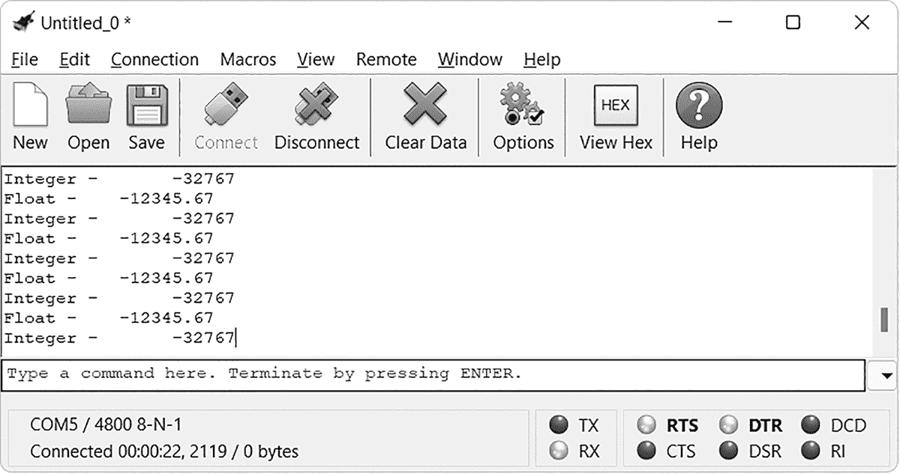

图 4-8：项目 18 的结果

现在打开位于*项目 18*子文件夹中的*main.c*文件，该文件包含以下代码：

```

      // Project 18 - Sending Numbers with the USART

      #include <avr/io.h>

      #include <stdlib.h>

      #include <stdio.h>

      #include <util/delay.h>

      #include <string.h>

      #define USART_BAUDRATE 4800

      #define UBRR_VALUE 12

      void USARTInit(void)

      {

      // Set baud rate registers

      UBRR0H = (uint8_t)(UBRR_VALUE>>8);

      UBRR0L = (uint8_t)UBRR_VALUE;

      // Set data frame format to 8 data bits, no parity, 1 stop bit

      UCSR0C |= (1<<UCSZ01)|(1<<UCSZ00);

      // Enable transmission and reception

      UCSR0B |= (1<<RXEN0)|(1<<TXEN0);

      }

      void USARTSendByte(unsigned char u8Data) // Send a byte to the USART

      {

      // Wait while previous byte is sent

      while(!(UCSR0A&(1<<UDRE0))){};

      // Transmit data

      UDR0 = u8Data;

      }

      void sendString(char myString[])

      {

      uint8_t a = 0;

      while (myString[a])

      {

      USARTSendByte(myString[a]);

      a++;

      }

      }

      int main(void)

      {

      char a[10] = "Float - ";

      char b[10] = "Integer - ";

      char t[10] = "";                      // For our dtostrf test

      char newline[4] = "\r\n";

      int16_t  i = -32767;

      float j = -12345.67;

      // Initialize USART

      USARTInit();

      while(1)

      {

      ❶ dtostrf(j,12,2,t);

      sendString(a);                     // "Float - "

      sendString(t);                     // Send float

      sendString(newline);

      _delay_ms(1000);

      ❷ dtostrf((float)i,12,0,t);

      sendString(b);                     // "Integer - "

      printf(t);                         // Send integer

      sendString(newline);

      _delay_ms(1000);

      }

      }

```

这段代码将存储在字符数组中的文本发送到计算机，就像在项目 17 中一样。然而，它包括了一些非常有用的新功能。在我们能够将浮动小数点和整数变量发送到 USART 之前，我们需要将它们转换为字符数组。我们通过`dtostrf()`函数实现这一点，该函数默认包含在 AVR C 编译器中：

```

      dtostrf(float j, w, d, char t[]);

```

这个函数将浮动小数点数`j`放入字符数组`t[]`中。变量`d`设置小数部分的位数，变量`w`设置显示数组的总字符数。我们在项目代码中使用`dtostrf()`函数，将浮动小数点变量转换为字符数组，然后将其发送到 USART ❶。要将整数转换为字符数组，我们使用相同的函数，但在整数变量前加上前缀`(float)` ❷。

在下一个项目中，你将通过将整数和浮动小数点数转换为字符数组的知识，进一步利用这些知识，将温度计数据发送到你的 PC。

项目 19：创建温度数据记录器

在这个项目中，你将把在项目 15 中使用的 TMP36 温度传感器的读数发送到计算机。终端软件将捕获这些数据并存储为文本文件，你可以在电子表格中打开该文件进行进一步分析。

### 硬件

你将需要以下硬件：

+   • USBasp 编程器

+   • 无焊面包板

+   • 5 V 面包板电源

+   • ATmega328P-PU 微控制器

+   • 一个 TMP36 温度传感器

+   • 0.1 μF 陶瓷电容

+   • 跳线

+   • USB 转串口转换器

按照图 4-9 所示组装电路，然后像往常一样连接你的 USB 转串口转换器。

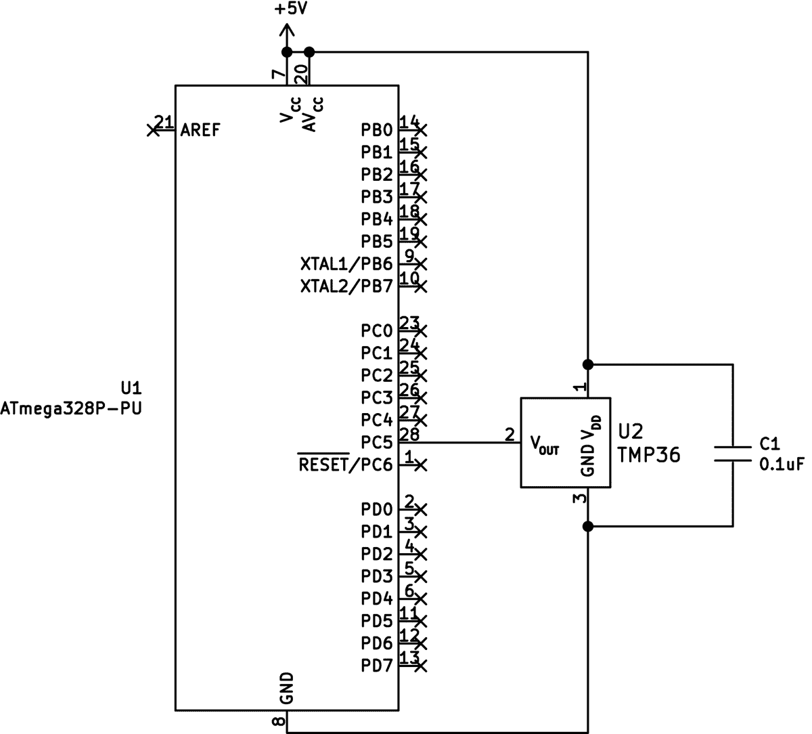

图 4-9：项目 19 的原理图

打开终端窗口，导航到本书*第四章*文件夹下的*项目 19*子文件夹，输入`make flash`命令上传项目 19 的代码。

接下来，切换到终端软件并点击**连接**按钮。片刻之后，终端软件应开始显示传感器测量的环境温度，如图 4-10 所示。

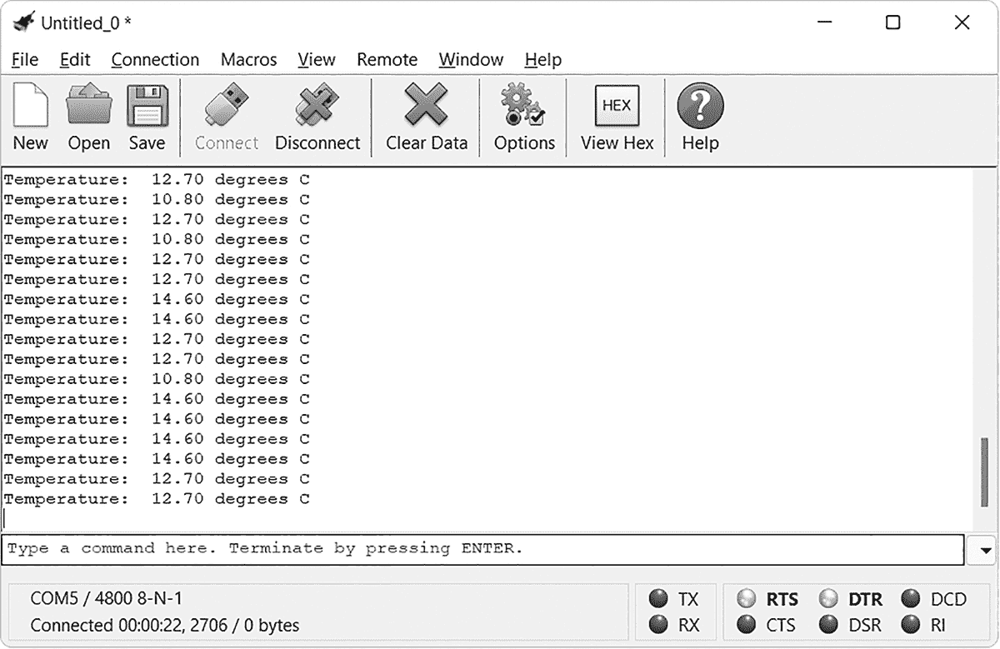

图 4-10：温度传感器在工作

如你所见，本项目结合了你现有的温度传感器知识和通过 USART 将文本和数字发送到终端软件的技能。为了展示输出示例中的一些变化，我使用了一个小风扇来改变温度传感器周围的气流。这帮助改变了测量的温度，数据每秒捕获一次。

### 代码

要查看本项目中使用的函数如何将温度转换为数组并发送出去，请打开位于*Project 19*子文件夹中的*main.c*文件，查看代码：

```

      // Project 19 - Creating a Temperature Data Logger

      #include <avr/io.h>

      #include <stdlib.h>

      #include <stdio.h>

      #include <math.h>

      #include <util/delay.h>

      #define USART_BAUDRATE 4800

      #define UBRR_VALUE 12

      ❶ void startADC()         // Set up the ADC

      {

      ADMUX =  0b01000101; // Set ADC pin to 28

      ADCSRA = 0b10000011; // Set prescaler speed for 1 MHz

      }

      void USARTInit(void)

      {

      // Set baud rate registers

      UBRR0H = (uint8_t)(UBRR_VALUE>>8);

      UBRR0L = (uint8_t)UBRR_VALUE;

      // Set data frame format to 8 data bits, no parity, 1 stop bit

      UCSR0C |= (1<<UCSZ01)|(1<<UCSZ00);

      // Enable transmission and reception

      UCSR0B |= (1<<RXEN0)|(1<<TXEN0);

      }

      void USARTSendByte(unsigned char u8Data)

      {

      // Wait while previous byte is sent

      while(!(UCSR0A&(1<<UDRE0))){};

      // Transmit data

      UDR0 = u8Data;

      }

      void sendString(char myString[])

      {

      uint8_t a = 0;

      while (myString[a])

      {

      USARTSendByte(myString[a]);

      a++;

      }

      }

      int main(void)

      {

      float temperature;

      float voltage;

      uint8_t ADCvalue;

      char t[10] = "";                  // Will hold temperature for sending via USART

      char a[14] = "Temperature: ";     // Make sure you have " instead of ”

      char b[14] = " degrees C ";       // Make sure you have " instead of ”

      char newline[4] = "\r\n";

      DDRD = 0b00000000; // Set PORTD to inputs

      startADC();

      USARTInit();

      while(1)

      {

      // Get reading from TMP36 via ADC

      ADCSRA |= (1 << ADSC);         // Start ADC measurement

      while (ADCSRA & (1 << ADSC) ); // Wait until conversion is complete

      _delay_ms(10);

      ❷ // Get value from ADC register, place in ADCvalue

      ADCvalue = ADC;

      ❸ // Convert reading to temperature value (Celsius)

      voltage = (ADC * 5);

      voltage = voltage / 1024;

      temperature = ((voltage - 0.5) * 100);

      ❹ // Send temperature to PC via USART

      sendString(a);

      dtostrf(temperature,6,2,t);

      sendString(t);

      sendString(b);

      sendString(newline);

      _delay_ms(1000);

      }

      return 0;

      }

```

在❶和❷之间的代码中，初始化了微控制器的 ADC，然后使用它们。接下来，我们将 ADC 数据转换为摄氏温度❸。最后，我们将温度转换为字符数组，并将其发送到终端仿真器，以创建一个漂亮的输出❹。这个过程每秒重复一次。

此时，终端仿真器软件可以将从微控制器接收到的数据捕获到文本文件中，你可以在文本编辑器或电子表格中打开该文件进行进一步分析。要在 CoolTerm 中启用此功能，选择**连接** ▸ **捕获到文本/二进制文件** ▸ **开始**，如图 4-11 所示。

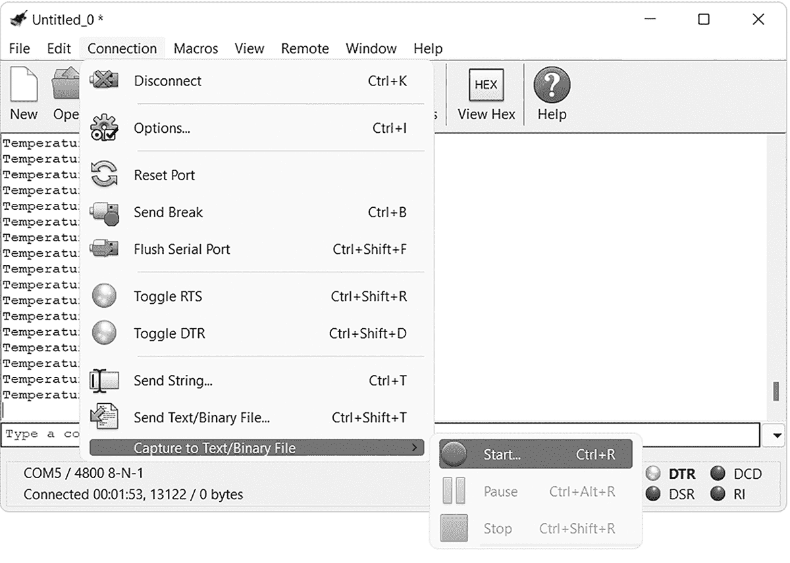

图 4-11：从终端开始录制数据。

然后，CoolTerm 会要求你选择一个位置并命名文本文件，如图 4-12 所示。完成后，点击**保存**，录制将开始。你可以使用暂停和停止选项分别暂停和结束录制。


图 4-12：选择文件名和存储文本文件的位置。

一旦你捕获到所有需要的温度数据，在终端仿真器软件中停止录制（**连接** ▸ **捕获到文本/二进制文件** ▸ **停止**），然后在电子表格软件中打开生成的文本文件。为了演示，我使用了 Excel。因为这是一个文本文件，所以系统会提示你选择一个*文本分隔符*，这是一个单字符，用于在数据值之间插入，便于其他软件整理数据。选择空格作为分隔符，如图 4-13 所示。请注意，在截图中，选中了“将连续分隔符视为一个”；如果文件中有双空格，这可以删除重复的空白列。

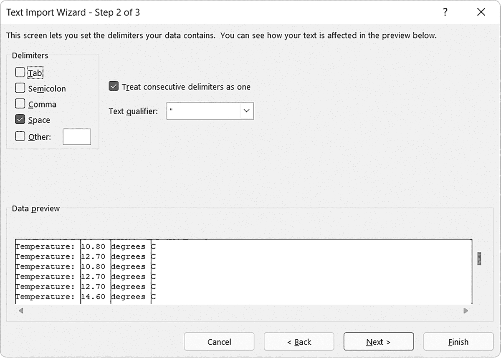

图 4-13：选择分隔符并预览数据。

点击**下一步**导入数据。这将创建一个整洁的温度数据电子表格，类似于图 4-14 中的示例，你可以随意分析这些数据。

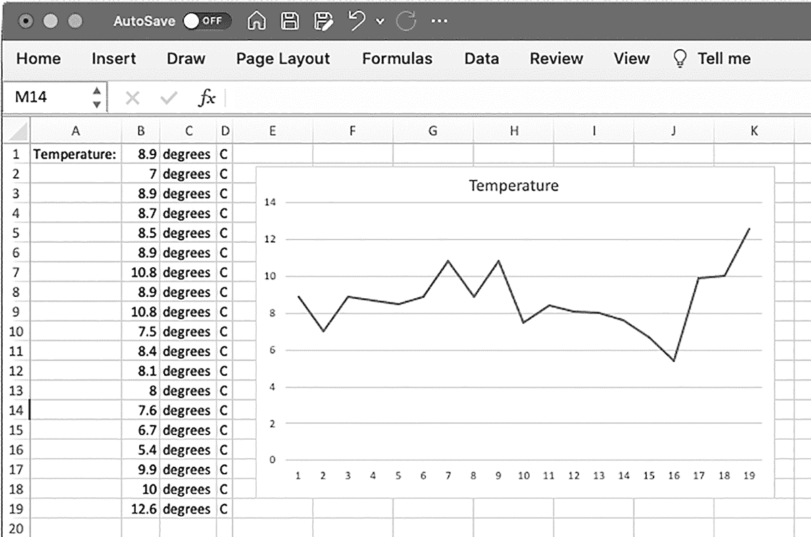

图 4-14：准备分析的温度数据

虽然本项目使用的是温度数据，但你可以使用此方法记录任何通过 AVR 的 USART 发送的数据。如果未来的实验需要记录数据，请记住这一点。现在，我们将转向我们的下一个项目：将计算机终端软件中的数据发送回 AVR。

项目 20：从计算机接收数据

在这个项目中，你将学习如何使用计算机控制基于 AVR 的项目，或通过 USART 实现计算机与微控制器之间的双向数据传输，制作自己的输入设备。

本项目使用的硬件与项目 16 相同。在复现该项目后，打开一个终端窗口，导航到本书*第四章*文件夹中的*项目 20*子文件夹，并输入`make flash`命令以上传项目 20 的代码。

接下来，切换到终端仿真软件并点击**选项**按钮，然后从窗口左侧的列表中选择**终端**。将终端模式设置为**原始模式**，如图 4-15 所示，然后点击**确定**，再点击**连接**。

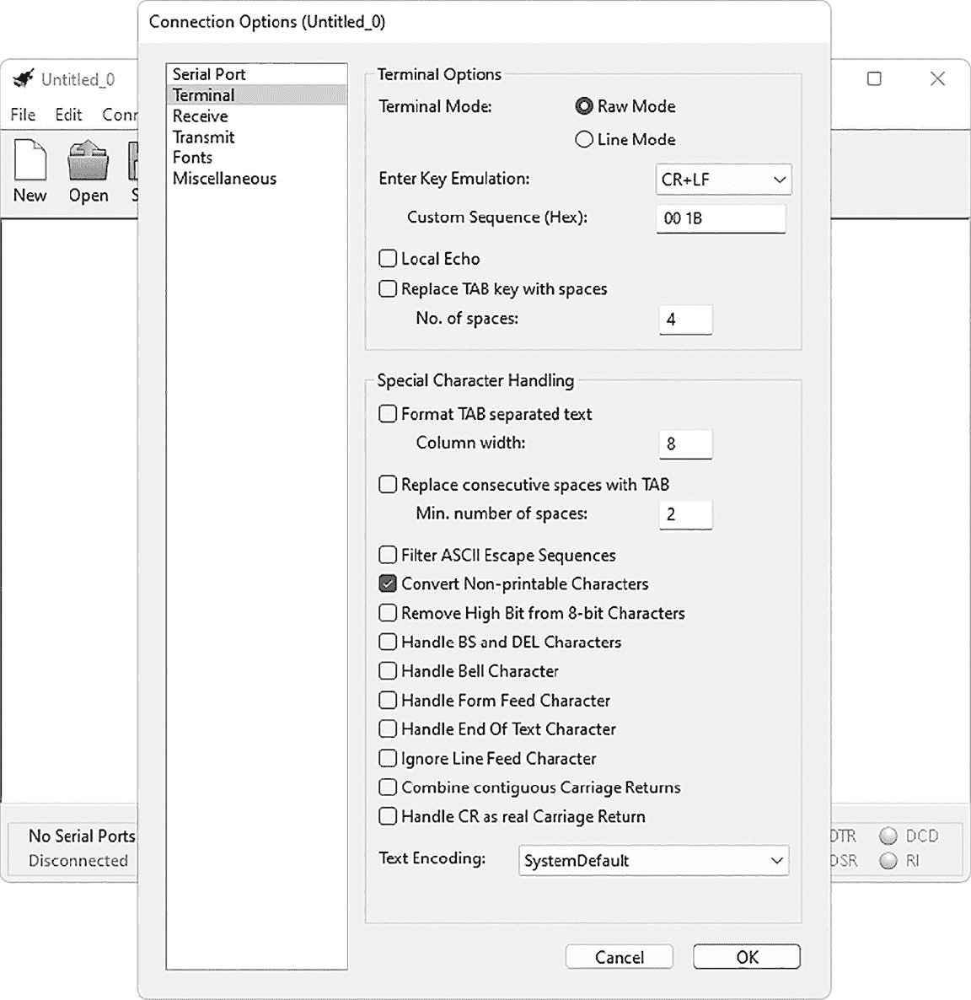

图 4-15：将终端仿真器切换回原始模式

一旦将终端仿真器设置为原始模式，开始在键盘上输入内容。你每次按下的键都会发送到 AVR，然后 AVR 将其返回并显示在终端仿真器中。你输入的任何内容都应该出现在终端窗口中，TX 和 RX 指示灯应闪烁。

要查看 USART 如何接收你的按键并将其发送回来，打开*项目 20*子文件夹中的*main.c*文件，查看代码：

```

      // Project 20 - Receiving Data from Your Computer

      #include <avr/io.h>

      #include <stdlib.h>

      #define USART_BAUDRATE 4800

      #define UBRR_VALUE 12

      void USARTInit(void)

      {

      // Set baud rate registers

      UBRR0H = (uint8_t)(UBRR_VALUE>>8);

      UBRR0L = (uint8_t)UBRR_VALUE;

      // Set data frame format to 8 data bits, no parity, 1 stop bit

      UCSR0C |= (1<<UCSZ01)|(1<<UCSZ00);

      // Enable transmission and reception

      UCSR0B |= (1<<RXEN0)|(1<<TXEN0);

      }

      void USARTSendByte(uint8_t sentByte)

      {

      // Wait while previous byte is sent

      while(!(UCSR0A&(1<<UDRE0))){};

      // Transmit data

      UDR0 = sentByte;

      }

      ❶ uint8_t USARTReceiveByte()

      // Receives a byte of data from the computer into the USART register

      {

      // Wait for byte from computer

      while(!(UCSR0A&(1<<RXC0))){};

      // Return byte

      return UDR0;

      }

      int main(void)

      {

      uint8_t tempByte;

      // Initialize USART0

      USARTInit();

      while(1)

      {

      // Receive data from PC via USART

      ❷ tempByte = USARTReceiveByte();

      // Send same data back to PC via USART

      ❸ USARTSendByte(tempByte);

      }

      }

```

这段代码你现在应该已经非常熟悉；它从常规的 USART 初始化函数开始，然后将字节发送到计算机。然而，它包含了一个新的函数`USARTReceiveByte()` ❶，该函数等待一个字节的数据到达 USART，然后将该数据存储到一个整数变量中。在这个例子中，函数将传入的字节存储到变量`tempByte` ❷中。然后，`USARTSendByte()`函数将相同的字节数据发送回终端仿真器 ❸。就是这么简单：一个字节进来，然后被发回去。

项目 21：构建四功能计算器

到现在为止，你已经学会了如何在 AVR 项目和计算机之间发送和接收数据，使得你的项目能够与外部数据和命令进行交互。在这个项目中，你将运用本章和之前章节所学的所有知识，制作一个简单的四则运算计算器。

与本章之前的项目一样，你将使用基本的 AVR 和 USB 到串行转换器。完成该设置后，打开终端窗口，导航到本书*Chapter 4*文件夹中的*Project 21*子文件夹，并输入`make flash`命令上传该项目的代码。当你将代码闪存到微控制器时，可能会收到如下警告：

```

      warning: 'answer' may be used uninitialized in this function

```

没关系，你可以继续正常操作。

接下来，打开终端模拟器，确保终端模式设置为原始模式，就像在项目 20 中那样，然后点击**连接**。片刻后，计算器界面应该出现在终端窗口中，并提示你输入命令。这个计算器可以加法、减法、乘法和除法单个数字。图 4-16 展示了一些示例；尽情尝试，输入你自己的命令，查看结果。

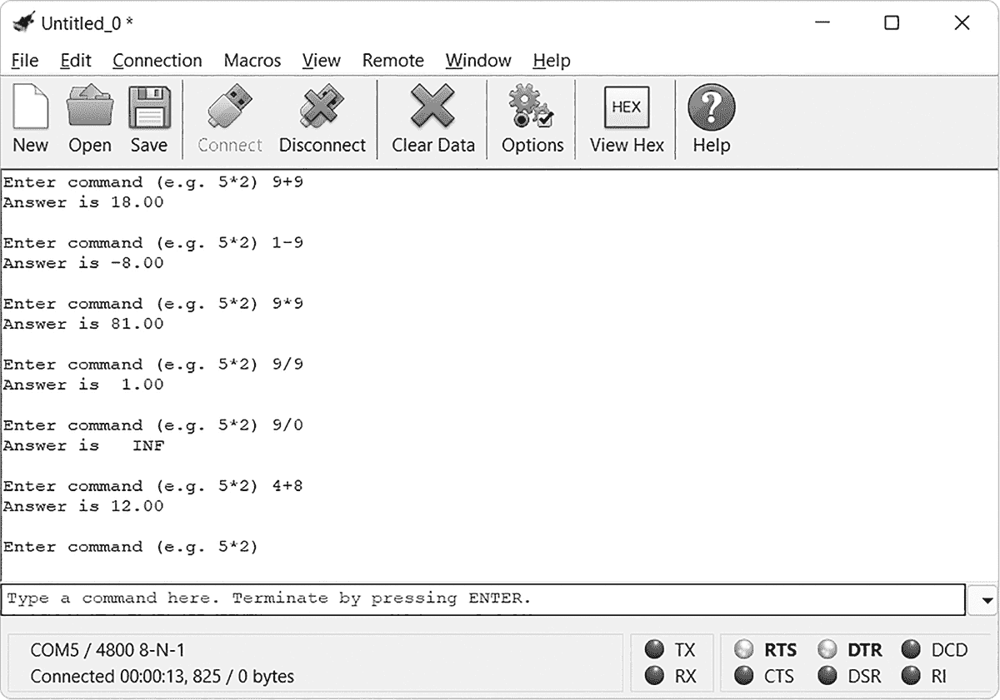

图 4-16：计算器正在工作

打开*main.c*文件，该文件位于*Project 21*子文件夹中。代码只是使用之前项目中的函数进行的一系列事件。

```

      // Project 21 - Building a Four-Function Calculator

      #include <avr/io.h>

      #include <stdlib.h>

      #include <stdio.h>

      #include <string.h>

      #include <math.h>

      #include <util/delay.h>

      #define USART_BAUDRATE 4800

      #define UBRR_VALUE 12

      void USARTInit(void)

      {

      // Set baud rate registers

      UBRR0H = (uint8_t)(UBRR_VALUE>>8);

      UBRR0L = (uint8_t)UBRR_VALUE;

      // Set data frame format to 8 data bits, no parity, 1 stop bit

      UCSR0C |= (1<<UCSZ01)|(1<<UCSZ00);

      // Enable transmission and reception

      UCSR0B |= (1<<RXEN0)|(1<<TXEN0);

      }

      void USARTSendByte(uint8_t sentByte)

      {

      // Wait while previous byte is sent

      while(!(UCSR0A&(1<<UDRE0))){};

      // Transmit data

      UDR0 = sentByte;

      }

      void sendString(char myString[])

      {

      uint8_t a = 0;

      while (myString[a])

      {

      USARTSendByte(myString[a]);

      a++;

      }

      }

      uint8_t USARTReceiveByte()

      // Receives a byte of data from the computer into the USART register

      {

      // Wait for byte from computer

      while(!(UCSR0A&(1<<RXC0))){};

      // Return byte

      return UDR0;

      }

      int main(void)

      {

      uint8_t digit1;

      uint8_t digit2;

      uint8_t operator;

      float answer=0;

      float d1=0;

      float d2=0;

      ❶ char a[26] = "Enter command (e.g. 5*2) ";

      char b[11] = "Answer is ";

      char answerString[20] = ""; // Holds answer

      char newline[4] = "\r\n";

      USARTInit();

      while(1)

      {

      sendString(newline);

      sendString(a);

      ❷ digit1 = USARTReceiveByte();

      ❸ USARTSendByte(digit1);

      ❹ switch (digit1)          // Convert ASCII code of digit1 to actual number

      {

      case 48 : digit1 = 0; break;

      case 49 : digit1 = 1; break;

      case 50 : digit1 = 2; break;

      case 51 : digit1 = 3; break;

      case 52 : digit1 = 4; break;

      case 53 : digit1 = 5; break;

      case 54 : digit1 = 6; break;

      case 55 : digit1 = 7; break;

      case 56 : digit1 = 8; break;

      case 57 : digit1 = 9; break;

      }

      ❺ operator = USARTReceiveByte();

      ❻ USARTSendByte(operator);

      ❼ digit2 = USARTReceiveByte();

      ❽ USARTSendByte(digit2);

      ❾ switch (digit2)          // Convert ASCII code of digit2 to actual number

      {

      case 48 : digit2 = 0; break;

      case 49 : digit2 = 1; break;

      case 50 : digit2 = 2; break;

      case 51 : digit2 = 3; break;

      case 52 : digit2 = 4; break;

      case 53 : digit2 = 5; break;

      case 54 : digit2 = 6; break;

      case 55 : digit2 = 7; break;

      case 56 : digit2 = 8; break;

      case 57 : digit2 = 9; break;

      }

      sendString(newline);

      // Convert entered numbers into float variables

      d1 = digit1;

      d2 = digit2;

      // Calculate result

      switch (operator)

      {

      case 43 : answer = d1 + d2; break; // Add

      case 45 : answer = d1 - d2; break; // Subtract

      case 42 : answer = d1 * d2; break; // Multiply

      case 47 : answer = d1 / d2; break; // Divide

      }

      // Send result to PC via USART

      ⓿ sendString(b);

      dtostrf(answer,6,2,answerString);

      sendString(answerString);

      sendString(newline);

      _delay_ms(1000);

      }

      return 0;

      }

```

在这段代码中，我们首先在`main()`函数中初始化变量，然后通过从❶开始的代码行初始化 USART。程序提示用户输入由 3 字节数据组成的命令：第一个数字、运算符和第二个数字。USART 接收第一个数字❷、运算符❺和第二个数字❼，并分别在❸、❻和❽处将它们发送回终端，提供视觉反馈。

当用户输入一个数字时，终端模拟器将数字的 ASCII 码而不是数字本身发送给 AVR。然后，程序将 ASCII 码转换为实际的数字❹，并将其放入一个整数变量❾中。这个将 ASCII 码转换为数字的过程也决定了输入的运算符是什么（例如，`+`、`-`、`*` 或 `/`）。

然后，程序通过代码中最后一个`switch()`函数对这两个数字执行所需的计算。最后，计算结果被转换为字符数组，并通过`sendString(b)`发送回终端模拟器，以供用户阅读⓿。计算器现在可以进行下一次计算。

本章中的项目展示了如何使用你的计算机作为终端，通过 AVR 发送和接收数据，为你准备记录和分析数据的工作。在下一章中，我将向你展示如何使用中断，这是一种巧妙的方式，让你的 AVR 能够在输入发生时立即响应，而不是在预定的时刻。
