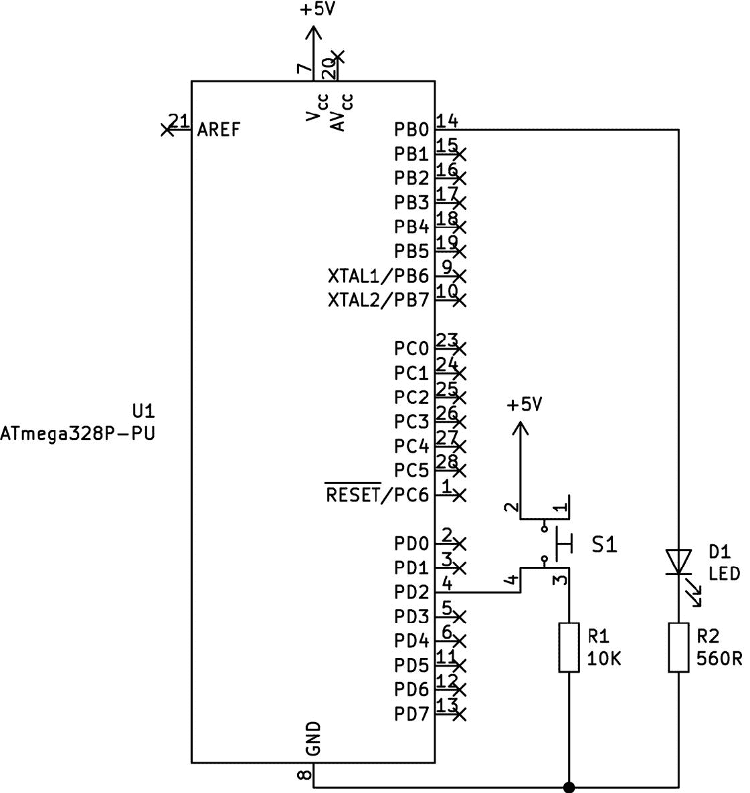
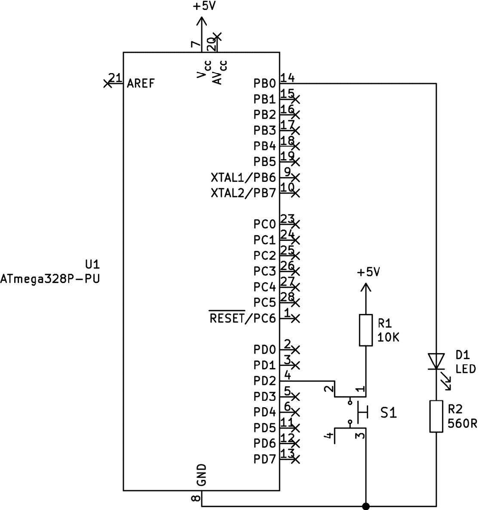
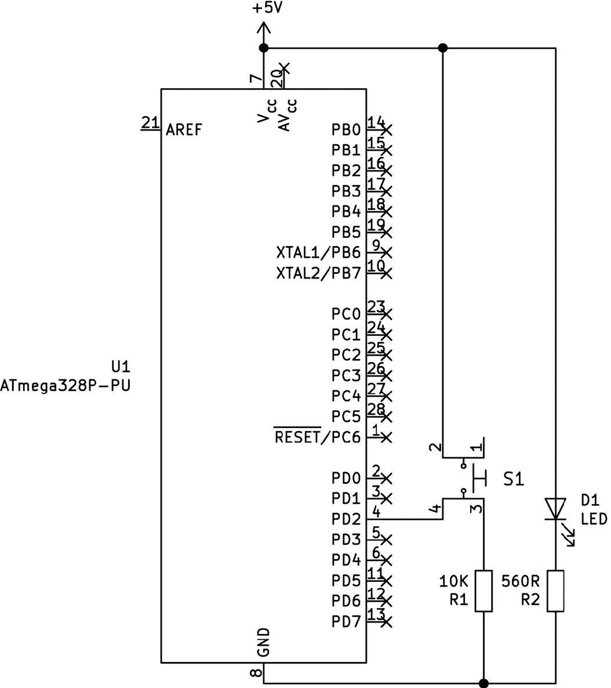
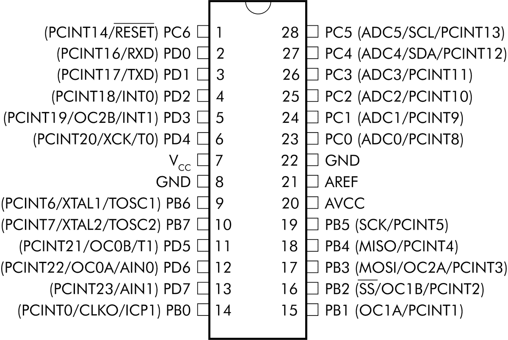
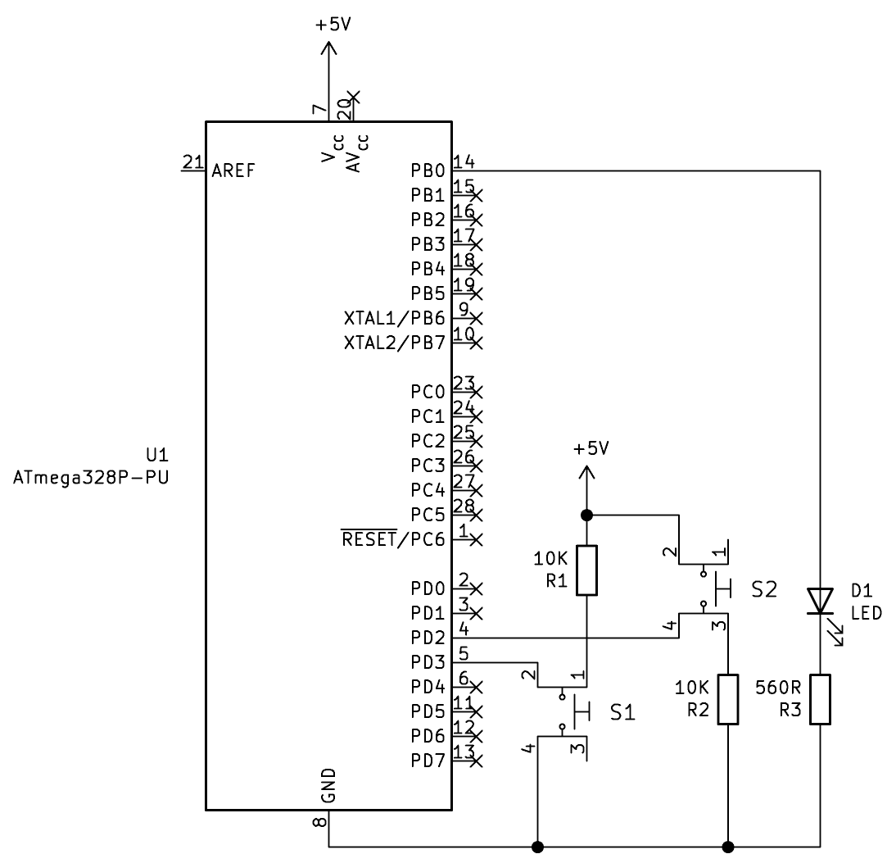
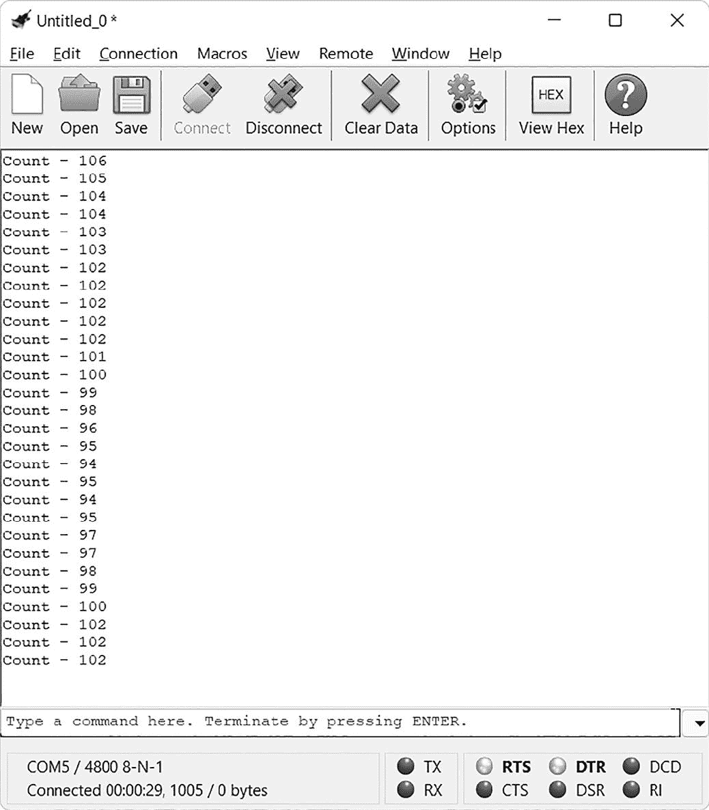

# 第五章：# 使用硬件中断进行控制


到目前为止，本书中你的项目代码都是顺序执行的。任何偏离线性模式的行为，例如检测按钮按下，都需要你监控数字输入。然而，在代码中预先规划按钮按下并不总是高效或现实的。*硬件中断*使你的程序能够更高效、动态地响应事件。

硬件中断使 AVR 微控制器能够随时响应数字输入引脚状态的变化。某种程度上，它们让你的 AVR 可以进行多任务处理：当按下按钮或在数字输入引脚接收到信号时，AVR 会暂停当前的任务并执行其他代码，这部分代码被称为*中断服务程序 (ISR)*。在 ISR 代码执行完毕后，AVR 会从中断前暂停的位置继续执行。

中断让你可以编写更有逻辑的代码，使基于 AVR 的项目更直观地运行。本章介绍了两种硬件中断：外部中断和引脚变化中断，使用的微控制器为 ATmega328P-PU。两种中断都由引脚上的状态变化触发（例如，从高电压到低电压的变化）。引脚变化中断可以发生在所有引脚上，而外部中断只能发生在两个引脚上。掌握基本知识后，你将使用中断创建一个基于 USART 显示的计数设备。

## 外部中断

本节将带你了解初始化外部中断的基础知识，你将在项目 22 中使用这些知识。ATmega328P-PU 使用引脚 4 和 5，分别称为 INT0 和 INT1，用于外部中断。这两个引脚可以检测并报告它们连接的电信号的变化。中断可以设置为响应引脚上以下四种可能的状态变化：

低电平 引脚上的电压变化为低电平状态（等同于 GND）。

任何逻辑变化 引脚上的电压以任何方式变化，无论是从高到低还是从低到高。

下降沿 电压从高变为低。

上升沿 电压从低变为高。

考虑一下哪些选项可以让你的代码响应按钮按下的动作。例如，如果你将按钮连接到 GND 并且微控制器输入端有一个上拉电阻，那么按钮按下时会将输入从高电平切换到低电平。在这种情况下，你通常会使用下降沿中断选项。相反，如果按钮连接在 5V 和微控制器输入之间，并且输入端有一个下拉电阻，那么按钮按下时会将输入从低电平切换到高电平。在这种情况下，你可以使用上升沿中断或任何逻辑变化中断。

总的来说，中断类型的选择将由连接到中断引脚的外部电路决定。在本章中，我将演示各种类型的中断，帮助你根据自己的项目需求选择合适的中断类型。

### 在代码中设置中断

要使用中断，首先按如下方式添加中断库：

```

      #include <avr/interrupt.h>

```

接下来，你需要设置一些寄存器——我们将逐一介绍。第一个是 EICRA 寄存器，用于确定引脚响应的四种状态变化中的哪一种。以下是任何 AVR 程序中设置 EICRA 寄存器的模板：

```

      EICRA = 0b0000
      `abcd` 
      ;

```

使用表 5-1 中的指南，通过`c`和`d`位设置中断 INT0（引脚 4）并通过`a`和`b`位设置中断 INT1（引脚 5）。

| 表 5-1 : EICRA 寄存器选项位 |
| --- |
| 位 a/c | 位 b/d | 中断类型 |
| --- | --- | --- |
| 0 | 0 | 低电平 |
| 0 | 1 | 任意逻辑变化 |
| 1 | 0 | 下降沿 |
| 1 | 1 | 上升沿 |

例如，你可以使用`c`和`d`位，按如下方式设置 INT0 为上升沿中断：

```

      EICRA = 0b00000011; // INT0 rising edge

```

接下来，设置 EIMSK 寄存器，该寄存器用于启用中断功能，方法如下：

```

      EIMSK = 0b000000
      `ab` 
      ;

```

在这里，位`a`是 INT1，位`b`是 INT0。将每个位设置为 1 表示开启，设置为 0 表示关闭。例如，要启用 INT0 的中断功能，使用：

```

      EIMSK = 0b00000001;

```

由于只有最后一位被设置为 1，因此只有 INT0 会被启用。

设置 EICRA 和 EIMSK 寄存器后，在代码中使用此函数调用启用中断：

```

      sei();

```

别忘了这一步——如果跳过了，即使你已正确设置寄存器，中断也不会被触发。

这是迄今为止中断所需代码的总结：

```

      #include <avr/interrupt.h> // Enable the interrupt library

      EICRA = 0b0000
      `abcd` 
      ;        // Determine which state changes the interrupt pin responds to

      EIMSK = 0b000000
      `ab` 
      ;        // Turn on the required interrupt

      sei();    // Enable interrupts in your code

```

一旦准备好让你的 AVR 响应中断，你必须定义 ISR——当中断被触发时执行的代码。ISR 是一个自定义函数，具有以下结构：

```

      ISR (INT
      `x` 
      _vect)

      {

      // Code to be executed when an interrupt is triggered

      EIFR =
      `y` 
      ;

      }

```

参数`INT` `x` `_vect`指定 ISR 响应的引脚。当你传递一个值给函数时，将`INT` `x` `_vect`中的`x`替换为`0`表示 INT0，`1`表示 INT1。函数体是当中断被触发时执行的代码。我们总是以此命令结束 ISR 代码段：

```

      EIFR =
      `y` 
      ;

```

这将外部中断标志寄存器重置为零，告诉微控制器该 ISR 的中断代码已完成，AVR 可以返回到正常操作。如果只使用一个中断，可以使用以下`y`值：`0b00000001`表示 INT0，`0b00000010`表示 INT1。若项目中使用了两个中断，如果你用整个 8 位值设置 EIFR 寄存器，将会更改两个中断。相反，你可以使用以下方法，只关闭一个中断：

```

      EIFR &= ~(1<<0); // Set interrupt flag register for INT0 to zero

      EIFR &= ~(1<<1); // Set interrupt flag register for INT1 to zero

```

这种逐个处理寄存器位的方式将在下一章中详细解释。同时，让我们在下一个项目中测试引脚变化中断。

第 22 项目：实验上升沿中断

在这个项目中，你将首先编程让微控制器快速闪烁 LED，然后添加逻辑，使得按下按钮时中断 LED 的闪烁并运行其他代码，让 LED 保持亮灯两秒钟，之后恢复闪烁模式。你将使用上升沿中断来实现这一功能。

### 硬件

对于这个项目，你将需要以下硬件：

+   • USBasp 编程器

+   • 无焊接面包板

+   • ATmega328P-PU 微控制器

+   • 跳线

+   • 一颗 LED

+   • 一颗 560 Ω电阻

+   • 一颗按钮

+   • 一颗 10 kΩ电阻

首先，组装图 5-1 所示的电路。



图 5-1：第 22 项目的主要电路

电阻器和按钮采用的是我在第三章中介绍的下拉配置。当你按下按钮时，电流将流向引脚 4，将其状态从低电平变为高电平。这个上升沿的状态变化将触发中断。

组装好电路后，像之前的项目一样，通过无焊接面包板将 USBasp 连接到微控制器。

### 代码

打开终端窗口，导航到本书*第五章*文件夹中的*第 22 项目*子文件夹，然后输入命令`make flash`。工具链应编译程序文件并将数据上传到微控制器，此时 LED 应开始快速闪烁，每 50 毫秒开关一次。快速按下按钮（不要长时间按住它，因为这会触发开关抖动），LED 应保持亮灯两秒钟，然后恢复闪烁。

打开*main.c*文件，查看第 22 项目中的代码是如何工作的：

```

      // Project 22 - Experimenting with Rising Edge Interrupts

      // Blink PORTB. If button pressed, turn on PORTB for 2 seconds.

      #include <avr/io.h>

      #include <util/delay.h>

      #include <avr/interrupt.h>

      ISR (INT0_vect)

      {                     // Code to be executed when interrupt is triggered

      PORTB = 0b11111111;

      _delay_ms(2000);

      ❶ PORTB = 0b00000000;

      ❷ EIFR = 0b00000001; // Clear external interrupt flag register

      }

      void startInt0()

      {

      // Initialize interrupt 0 (PD2/INT0/pin 4)

      // Rising edge (LOW to HIGH at pin 4)

      ❸ EICRA = 0b00000011;

      // Turn on interrupt INT0

      ❹ EIMSK = 0b00000001;

      // Turn on global interrupt enable flag in order for interrupts to be processed

      sei();

      }

      int main(void)

      {

      // Declare global variables

      // Set up GPIO pins etc.

      ❺ DDRB = 0b11111111; // Set PORTB register as outputs

      ❻ DDRD = 0b00000000; // Set PORTD pins 4 and 5 as inputs

      // Initialize interrupt

      startInt0();

      for(;;)

      ❼ {

      // Blink LED connected to PB7 (pin 10)

      PORTB = 0b00000001;

      _delay_ms(50);

      PORTB = 0b00000000;

      _delay_ms(50);

      }

      return 0;

      }

```

这段代码定义了一个`startInt0()`函数来初始化中断。在这个函数中，我们首先设置 EICRA 寄存器，使得 INT0 响应上升沿中断❸，然后设置 EIMSK 寄存器开启 INT0❹，最后调用`sei()`来启用中断。在代码的主部分，我们将 PORTB 引脚设置为输出，用来控制 LED❺，并将 PORTD 引脚设置为输入❻。PORTD 包含数字引脚 4，它将作为 INT0 中断的输入。

一旦一切初始化完成，for 循环 ❼ 会让 LED 闪烁。由于存在中断，当你按下按钮时，产生的上沿触发硬件中断 INT0。这告诉 AVR 停止闪烁 LED，并运行 ISR ❶ 中的代码。当 ISR 代码执行完毕，EIFR 寄存器被设置为 0 ❷，LED 会恢复正常的快速闪烁。

恭喜！你刚刚看到了一种最常见的中断形式的实现。较少见的情况是需要检测到电流停止流向微控制器，这可以通过下沿中断来实现。你将在 下一个项目 中尝试这个。

项目 23：实验下沿中断

本项目的结果与 项目 22 相同，但这次电路使用了在 第三章 中介绍的上拉配置。默认情况下，数字引脚 4 上会有电流。当你按下按钮时，电流应该停止流向引脚 4，导致其状态从高变低，从而触发下沿中断。

### 硬件部分

你将需要以下硬件：

+   • USBasp 编程器

+   • 无焊面包板

+   • ATmega328P-PU 微控制器

+   • 跳线

+   • 一个 LED

+   • 一个 560 Ω 电阻

+   • 一个按键

+   • 一个 10 kΩ 电阻

首先组装如 图 5-2 所示的电路。



图 5-2: 项目 23 的主电路

在组装好电路后，通过无焊面包板将 USBasp 连接到微控制器，就像在之前的项目中那样。

### 代码部分

打开终端窗口，导航到本书 *第五章* 文件夹下的 *项目 23* 子文件夹，并输入命令 `make flash` 。项目代码上传完成后，LED 应该开始快速闪烁。快速按下按钮，LED 应该保持亮起两秒钟，然后恢复闪烁。

要查看其工作原理，打开 项目 23 的 *main.c* 文件：

```

      // Project 23 - Experimenting with Falling Edge Interrupts

      // Blink PORTB. If button is pressed, turn on PORTB for 2 seconds.

      #include <avr/io.h>

      #include <util/delay.h>

      #include <avr/interrupt.h>

      ISR (INT0_vect) {     // Code to be executed when interrupt is triggered

      PORTB = 0b11111111;

      _delay_ms(2000);

      PORTB = 0b00000000;

      EIFR = 0b00000001;

      }

      void startInt0()

      {

      // Initialize interrupt 0 (PD2/INT0/pin 4)

      // Falling edge (HIGH to LOW at pin 4)

      ❶ EICRA = 0b00000010;

      // Turn on interrupt INT0

      EIMSK = 0b00000001;

      // Turn on global interrupt enable flag for interrupts to be processed

      sei();

      }

      int main(void)

      {

      // Declare global variables

      // Set up GPIO pins etc.

      DDRB = 0b11111111; // Set PORTB register as outputs

      DDRD = 0b00000000; // Set PORTD pins 4 and 5 as inputs

      // Initialize interrupt

      startInt0();

      for(;;)

      {

      PORTB = 0b00000001;

      _delay_ms(50);

      PORTB = 0b00000000;

      _delay_ms(50);

      }

      return 0;

      }

```

本项目的代码与 项目 22 完全相同，唯一的变化是：我们将 EICRA 寄存器设置为 `0b00000010`，而不是 `0b00000011` ❶。根据 表 5-1，最后两位（`10`）将 INT0 设置为下沿中断类型。EIMSK 保持不变，因为我们仍然使用 INT0 作为中断引脚，通常我们调用 `sei()` 来使能中断。

玩这些项目，熟悉上升沿和下降沿中断的使用。一旦你习惯了这两种数字输入的方式，你可以根据自己使用的电路设计来选择是用高电平还是低电平触发中断。现在这看起来可能是一个微不足道的选择，但随着你创建更多复杂的基于 AVR 的项目，它会变得非常重要。在某些情况下，你可能无法选择硬件或电路，那么你就必须通过编写代码来绕过它们的限制。

现在让我们尝试一些更有趣的东西。正如我之前提到的，ATmega328P-PU 有两个中断引脚。在下一个项目中，你将使用这两个引脚来让微控制器响应两个不同的中断。

项目 24：实验两个中断

该项目使用两个按钮，使你能够触发两个不同的中断并产生不同的响应。一个按钮触发上升沿中断，并将 LED 点亮一秒钟，另一个按钮触发下降沿中断，并将 LED 点亮两秒钟。

### 硬件

你将需要以下硬件：

+   • USBasp 编程器

+   • 无焊面包板

+   • ATmega328P-PU 微控制器

+   • 跳线

+   • 一只 LED

+   • 一个 560 Ω 电阻

+   • 两个按键开关

+   • 两个 10 kΩ 电阻

按照图 5-3 所示组装电路。



图 5-3：项目 24 的主电路

组装好电路后，将 USBasp 编程器通过无焊面包板连接到你的微控制器，和之前的项目一样。

### 代码

打开终端窗口，导航到本书*第五章*文件夹下的*项目 24*子文件夹，输入命令`make flash`。和前两个项目一样，一旦代码上传完成，LED 应该开始快速闪烁。按下连接到 INT0（数字引脚 4）的按钮，LED 应该保持亮起一秒钟。按下连接到 INT1（数字引脚 5）的按钮，LED 应该保持亮起两秒钟。

要查看代码如何处理这些中断，打开项目 24 的*main.c*文件：

```

      // Project 24 - Experimenting with Two Interrupts

      // PORTB blinks, INT0 rising interrupt, INT1 falling interrupt

      #include <avr/io.h>

      #include <util/delay.h>

      #include <avr/interrupt.h>

      ISR (INT0_vect)

      {                     // Code to be executed when interrupt INT0 is triggered

      PORTB = 0b11111111;

      _delay_ms(1000);

      PORTB = 0b00000000;

      EIFR &= ~(1<<0);   // Set interrupt flag register for INT0 to zero

      }

      ISR (INT1_vect)

      {                     // Code to be executed when interrupt INT1 is triggered

      PORTB = 0b11111111;

      _delay_ms(2000);

      PORTB = 0b00000000;

      EIFR &= ~(1<<1);   // Set interrupt flag register for INT1 to zero

      }

      void startInts()

      {

      // Initialize interrupt 0 (PD2/INT0/pin 4)

      // Rising edge (LOW to HIGH at pin 4)

      // Initialize interrupt 1 (PD3/INT1/pin 5)

      // Falling edge (HIGH to LOW at pin 5)

      ❶ EICRA = 0b00001011;

      // Turn on interrupts INT0 and INT1

      ❷ EIMSK = 0b00000011;

      // Turn on global interrupt enable flag for interrupts to be processed

      sei();

      }

      int main(void)

      {

      // Declare global variables

      // Set up GPIO pins etc.

      ❸ DDRB = 0b11111111; // Set PORTB register as outputs

      ❹ DDRD = 0b00000000; // Set PORTD pins 4 and 5 as inputs

      // Initialize interrupts

      startInts();

      for(;;)

      ❺ {

      PORTB = 0b00000001;

      _delay_ms(50);

      PORTB = 0b00000000;

      _delay_ms(50);

      }

      return 0;

      }

```

这段代码类似于项目 22 和 23 的代码，只是做了一些小修改。和往常一样，我们首先定义一个 `startInts()` 函数来初始化中断。在这个函数内部，我们将 EICRA 寄存器设置为响应每个中断 ❶。记住，这个寄存器的设置公式是 `0b0000` `abcd`，其中 `a` 和 `b` 对应引脚 5，`c` 和 `d` 对应引脚 6。在这里，我们将 EICRA 设置为使 INT0 响应上升沿中断，INT1 响应下降沿中断（`0b00001011`）。接下来，我们将 EIMSK 寄存器设置为通过将最后两位设置为 1 来打开 INT0 和 INT1 ❷，然后调用 `sei()` 来启用中断。

在代码的主要部分，我们将 PORTB 设置为输出，这样代码就可以控制 LED ❸。我们还将 PORTD 设置为输入，用于覆盖数字引脚 4 和 5，分别作为 INT0 和 INT1 的输入 ❹。一旦初始化完成，`for` 循环中的代码 ❺ 将导致 LED 闪烁开关。然而，当按下某个按钮时，相应的中断将被触发，中断的 ISR 中的代码将运行。

在规划具有多个中断的项目时，请记住一个中断不能被另一个中断调用。也就是说，如果一个中断的 ISR 代码正在运行，触发另一个中断不会影响该 ISR 的操作。你不能打断一个中断！

如果你需要使用超过两个中断引脚，或者不能使用数字引脚 4 和 5，但仍然需要你的项目响应状态变化触发器怎么办？解决方案是使用引脚变化中断。

## 引脚变化中断

虽然使用外部中断 INT0 和 INT1 简单、直接，并且提供了很多控制权，但仅使用两个中断是一个巨大的限制。使用*引脚变化中断*稍微复杂一点，但它可以提供与引脚数量一样多的中断。

引脚变化中断只能告诉你某个引脚的状态是否发生了变化——它们不能提供有关状态变化的任何细节。虽然外部中断可以检测到从低到高或从高到低的变化，但引脚变化中断只能检测到状态发生了变化。这意味着任何状态的变化都会触发中断，你需要在代码中决定是否要响应这个变化。

用于引脚变化中断的引脚被组织成三个区块：

Bank 0 包括 PCINT0 到 PCINT7。

Bank 1 包括 PCINT8 到 PCINT14。

Bank 2 包括 PCINT16 到 PCINT23。

PCINT 代表 *引脚变化中断*。每个 Bank 都有自己的 ISR 代码，给你提供了三种可以与各自引脚配合使用的电平变化类型。这为你提供了更多灵活性，但也意味着你不能假设每个 ISR 函数只对应一个引脚。实际上，每个 ISR 函数响应其对应 Bank 中任一引脚的状态变化。因此，你的代码不仅要判断状态变化是什么，还要确定它来自哪个引脚，然后才能做出相应响应。请注意，PCINT15 是不存在的。

请注意，PCINT 编号与引脚编号不同：例如，PCINT8 对应引脚 23，而不是引脚 8。请参考 图 5-4 中的引脚图来查看每个 PCINT 值对应的引脚编号，并确保在代码中不要混淆这两个编号。每个 Bank 的字节在二进制中表示了该 Bank 中引脚的顺序，从高到低排列。

你可以使用 ATmega328P-PU 的引脚图将三个 PCINT *xx* Bank 与物理引脚编号进行匹配，该引脚图如 图 5-4 所示。



图 5-4：ATmega328P-PU 引脚图

例如，Bank 0 响应于 PCINT0–PCINT7，这意味着你可以通过 图 5-4 右下角的 15–19 引脚和左下角的 9、10、14 引脚来触发它。

在代码中使用引脚变化中断类似于使用外部中断。首先，仍然需要包含中断库。

```

     #include <avr/interrupt.h>

```

接下来，设置 PCICR 寄存器来启用所需的 PCI（引脚变化中断）Bank，使用以下公式：

```

     PCICR = 0b00000
     `xyz` 
     ;

```

Bank 0 使用位 `z` 设置，Bank 1 使用位 `y` 设置，Bank 2 使用位 `x` 设置。例如，要启用 Bank 0 和 Bank 2，你可以使用：

```

     PCICR = 0b00000101;

```

记住，每个 Bank 都可以响应多个引脚，因此你需要选择每个 Bank 中哪些引脚可以用于中断，通过启用对应于你选择的每个引脚的中断功能来实现。每个 Bank 都有自己的中断功能，你可以通过 PCMSK0、PCMSK1 和 PCMSK2 寄存器来启用它们。引脚的开启或关闭通过该引脚对应位置上的 1 或 0 来控制。要使用 Bank 0 的引脚 15、Bank 1 的引脚 23 和 Bank 2 的引脚 13，你需要像这样设置 PCMSK *x* 寄存器：

```

     PCMSK0 = 0b00000010; // We'll use PCINT1 (pin 15) for bank 0 ...

     PCMSK1 = 0b00000001; // and use PCINT8 (pin 23) for bank 1 ...

     PCMSK2 = 0b10000000; // and use PCINT23 (pin 13) for bank 2

```

一旦你选择了每个 Bank 中应触发中断的引脚，使用以下代码行来启用中断：

```

     sei();

```

最后，定义你的 ISR。每个 PCI 都有自己的 ISR，结构如下：

```

     ISR (PCINT
     `x` 
     _vect)

     {

     // Code to be executed when interrupt is triggered

     EIFR &= ~(1<<
     `x` 
     ); // Set interrupt flag register to zero

     }

```

将 `PCINT` `x` `_vect` 中的 `x` 替换为 Bank 0 的 `0`、Bank 1 的 `1` 和 Bank 2 的 `2`，然后你就可以开始添加中断代码了。我们通常以以下命令结束这部分 ISR 代码：

```

     PCIFR =
     `y` 
     ;

```

这将把引脚变更中断标志寄存器重置为零，告知微控制器该特定银行的中断代码已完成，并且可以正常返回主循环中运行的代码。你可以使用以下`y`的值来设置引脚变更中断标志：`0b00000001`表示银行 0，`0b00000010`表示银行 1，`0b00000100`表示银行 2。

你将在接下来的项目中测试引脚变更中断。

项目 25：实验引脚变更中断

本项目在之前的基础上进行了扩展，使用三个按钮，并与每个 PCI 银行的一个引脚配合，演示如何使用引脚变更中断。按下每个按钮应触发不同的中断，使 LED 点亮一段时间。

### 硬件

你将需要以下硬件：

+   • USBasp 编程器

+   • 无焊接面包板

+   • ATmega328P-PU 微控制器

+   • 跳线

+   • 一个 LED

+   • 一个 560 Ω电阻

+   • 三个按键

+   • 三个 10 kΩ电阻

首先，组装图 5-5 中所示的电路。


图 5-5： 项目 25 的主要电路

组装好电路后，像之前的项目一样，将 USBasp 通过无焊接面包板连接到微控制器。

### 代码

打开终端窗口，导航到本书*第五章*文件夹中的*项目 25*子文件夹，输入命令`make flash`上传项目的代码，如往常一样。代码上传完成后，LED 应该开始快速闪烁。按下不同的按钮应该使 LED 亮起一秒、两秒或三秒，具体时间由每个引脚变更中断银行的 ISR 定义。

要查看这如何工作，打开项目 25 的*main.c*文件：

```

      // Project 25 - Experimenting with Pin-Change Interrupts

      #include <avr/io.h>

      #include <util/delay.h>

      #include <avr/interrupt.h>

      ISR (PCINT0_vect)

      {   // Code to be executed when PCI bank 0 PCINT1 pin 15 is triggered

      PORTB = 0b11111111;

      _delay_ms(1000);

      PORTB = 0b00000000;

      PCIFR = 0b00000001;

      }

      ISR (PCINT1_vect)

      {   // Code to be executed when PCI bank 1 PCINT8 pin 23 is triggered

      PORTB = 0b11111111;

      _delay_ms(2000);

      PORTB = 0b00000000;

      PCIFR = 0b00000010;

      }

      ISR (PCINT2_vect)

      {   // Code to be executed when PCI bank 2 PCINT23 pin 13 is triggered

      PORTB = 0b11111111;

      _delay_ms(3000);

      PORTB = 0b00000000;

      PCIFR = 0b00000100;

      }

      void startInts()

      {

      ❶ PCICR = 0b00000111;  // Activate all three PCIs

      PCMSK0 = 0b00000010; // We'll use PCINT1 (pin 15) for bank 0 ...

      PCMSK1 = 0b00000001; // and use PCINT8 (pin 23) for bank 1 ...

      PCMSK2 = 0b10000000; // and use PCINT23 (pin 13) for bank 2

      sei();

      }

      int main(void)

      {

      // Set up GPIO pins etc.

      ❷ DDRB = 0b11111101;  // Set up PORTB register (pin 15 input, rest outputs)

      DDRC = 0b00000000;  // Set up PORTC register (all inputs)

      DDRD = 0b01111111;  // Set up PORTD register (pin 13 input, rest outputs)

      // Initialize interrupts

      startInts();

      for(;;)

      {

      // Blink LED connected to PB7 (pin 10)

      ❸ PORTB = 0b00000001;

      _delay_ms(50);

      PORTB = 0b00000000;

      _delay_ms(50);

      }

      return 0;

      }

```

该代码的结构与外部中断项目的代码相同。首先，我们定义一个`startInts()`函数来初始化中断。在此函数内，我们设置 PCICR 寄存器以启用所有三个 PCI 银行 ❶；然后，我们设置物理引脚，作为每个银行的中断引脚，使用以下三行代码，并调用`sei()`启用中断。

在代码的主部分，我们设置 PORTB 和 PORTD，使 LED 引脚为输出，PORTC 为中断引脚的输入 ❷。初始化完成后，`for`循环 ❸中的代码将使 LED 闪烁。然而，当你按下其中一个按钮时，会触发对应 PCI 银行的中断，运行该银行匹配的 ISR。我们通过将 PCIFR 标志设置为 1 来结束每个中断的代码运行。

到目前为止，你已经学会了如何使用中断与数字输入配合，在用户需要时激活代码。为了完成本章的实验，我将向你展示如何在更实际的情况下使用中断。

项目 26：使用中断创建上下计数器

本项目结合了你在第四章的项目 18 中学到的关于中断的知识，并通过 USART 向计算机发送数据。你将构建一个计数设备，使用两个按钮来接受用户输入：一个按钮将计数值增加 1，另一个按钮将其减少。每个按钮都会触发上升沿中断，并调用一个匹配的 ISR 来增加或减少计数器的值。

### 硬件

你需要以下硬件：

+   • USBasp 程序烧录器

+   • 无焊面包板

+   • ATmega328P-PU 微控制器

+   • USB 转串口转换器

+   • 跳线

+   • 两个按钮

+   • 两个 10 kΩ 电阻

按照图 5-6 所示组装电路。



图 5-6： 项目 26 的原理图

将电路组装好后，将 USBasp 通过无焊面包板连接到你的微控制器，方式与之前的项目相同。接下来，将你的 USB 转串口转换器连接到计算机，像在第四章中一样操作。

### 代码

打开一个终端窗口，导航到本书*第五章*文件夹下的*项目 26*子文件夹，并输入命令`make flash`，像往常一样上传项目代码。接下来，像在第四章中一样运行终端软件，并点击**连接**按钮。片刻之后，终端软件应该会显示计数变量的值。

尝试按下每个按钮。每按一下按钮，计数值应该会增加或减少，输出结果应与图 5-7 中的示例类似。



图 5-7：我们计数器的实际运行情况

在这个图中，计数器并不总是看起来只增加或减少 1。这是因为计数值每秒更新一次，而你可以在一秒钟内多次按下按钮。

要查看如何实现这一点，请打开项目 26 的*main.c*文件：

```

      // Project 26 - Creating an Up/Down Counter Using Interrupts

      #include <avr/io.h>

      #include <stdlib.h>

      #include <util/delay.h>

      #include <avr/interrupt.h>

      #define USART_BAUDRATE 4800

      #define UBRR_VALUE 12

      ❶ volatile uint8_t i = 100; // Initial value for counter

      void USARTInit(void)

      {

      // Set baud rate registers

      UBRR0H = (uint8_t)(UBRR_VALUE>>8);

      UBRR0L = (uint8_t)UBRR_VALUE;

      // Set data frame format to 8 data bits, no parity, 1 stop bit

      UCSR0C |= (1<<UCSZ01)|(1<<UCSZ00);

      // Enable transmission and reception

      UCSR0B |= (1<<RXEN0)|(1<<TXEN0);

      }

      void USARTSendByte(uint8_t u8Data)

      {

      // Wait while previous byte is sent

      while(!(UCSR0A&(1<<UDRE0))){};

      // Transmit data

      UDR0 = u8Data;

      }

      void sendString(char myString[])

      {

      uint8_t a = 0;

      while (myString[a])

      {

      USARTSendByte(myString[a]);

      a++;

      }

      }

      ❷ ISR (INT0_vect)

      {                   // Code to be executed when interrupt INT0 is triggered

      i = i - 1;       // Subtract one from the counter

      EIFR &= ~(1<<0); // Set interrupt flag register for INT0 to zero

      }

      ❸ ISR (INT1_vect)

      {                   // Code to be executed when interrupt INT1 is triggered

      i = i + 1;       // Add one to the counter

      EIFR &= ~(1<<1); // Set interrupt flag register for INT1 to zero

      }

      ❹ void startInts()

      {

      // Initialize interrupt 0 (PD2/INT0/pin 4)

      // Rising edge (LOW to HIGH at pin 4)

      // Initialize interrupt 1 (PD3/INT1/pin 5)

      // Rising edge (LOW to HIGH at pin 5)

      EICRA = 0b00001111;

      // Turn on interrupts INT0 and INT1

      EIMSK = 0b00000011;

      // Turn on global interrupt enable flag

      sei();

      }

      int main(void)

      {

      char a[10] = "Count - "; // Make sure you have " instead of ”

      char s[10] = "";         // For our itoa() conversion used in the main loop

      char newline[] = "\r\n";

      // Set up pins 4 and 5 as inputs for INT0 and INT1

      DDRD = 0b00000000;

      // Initialize interrupts

      startInts();

      // Initialize USART

      USARTInit();

      for(;;)

      {

      // Send the value of our counter to the USART for display on the PC

      itoa(i, s, 10);

      sendString(a);

      sendString(s);

      sendString(newline);

      _delay_ms(1000);

      }

      return 0;

      }

```

本项目演示了如何使用中断接收用户输入，所需的代码比在主代码的每个周期中检查按钮按下要少得多。首先，我们设置了库的初始化和使用 USART 所需的函数。接着我们声明了`i`变量❶，它存储计数器的值，后面是上一个章节中用于通过 USART 将文本和数字发送到 PC 的方便函数，详见上一章。

主代码和 ISR 函数都需要能够访问`i`变量，这就是为什么它被定义在`int main(void)`部分之外的原因。将变量声明在主代码之外使其成为*全局变量*，这意味着代码的任何部分都可以访问它，而不仅仅是声明变量的特定函数中的代码。当你声明一个全局变量时，应该在其数据类型前加上`volatile`关键字，告诉编译器该变量可能随时变化，因此每次程序使用它时，微控制器需要从内存中重新加载它。

本项目使用引脚 4 和 5 作为外部上升沿中断，因此接下来我们定义了在 INT0❷和 INT1❸中断触发时执行的代码，并使用 EICRA 和 EIMSK❹初始化它们。一旦主代码开始运行，它应该每秒通过 USART 将计数器变量的值发送到 PC。由于中断的强大功能（以及连接到它们的按钮），每次触发其中一个中断时，相关的 ISR 代码应该根据按下的按钮将计数器变量加或减去 1。你可以通过快速按下和松开任一按钮来测试这一点；随着变量的变化，更新的值应显示在终端中。

## 关于中断的最终说明

使用硬件中断可以为基于 AVR 的项目提供更多的选项，以便按需完成任务，而不是在预先编程的事件序列中完成。为了简化这对中断的介绍，本章重点介绍了创建响应按钮按下的电路。然而，在实际项目中，你更常见的是编程中断来响应机械设备中的限位开关或传感器发出的信号，以帮助你的项目做出决策。

使用中断时，始终将用于触发中断的引脚声明为输入，使用`DDR` `x`函数，否则微控制器将无法检测到触发。同时，将主代码和 ISR 中使用的任何变量声明为`volatile`，并使它们成为全局变量。

下一章的项目扩展了中断的应用，向你展示了如何使用中断在预设的时间段后运行函数。
