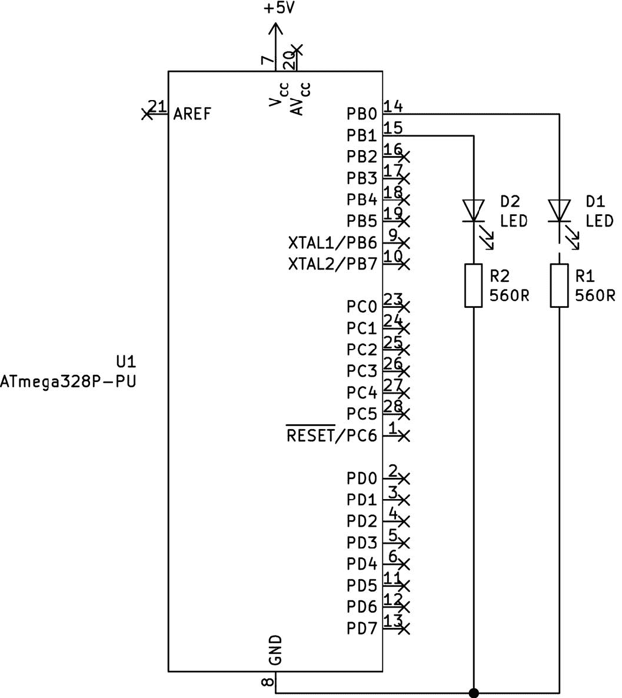
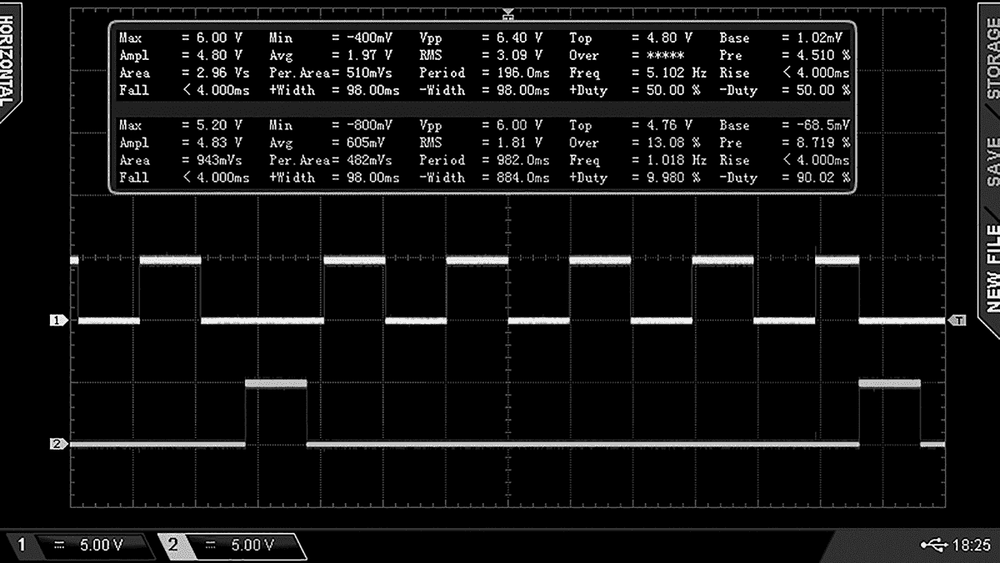
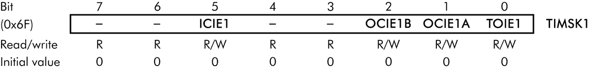

# 第六章：# 使用硬件定时器


我们使用定时器来确定在某个动作发生前需要经过多长时间，这非常有用。例如，你可以设置一个中断，当定时器达到某个值时触发。定时器在后台运行；当微控制器执行代码时，定时器在不断计数。

在本章中，你将学习：

+   • 你在 ATmega328P-PU 微控制器中的各种定时器

+   • 定时器溢出中断

+   • 比较匹配中断时清除定时器

我将向你展示如何定期运行部分代码，为重复的操作创建更长的延迟，并检查内部定时器的准确性。你还将学习一种更高效的方法，来处理寄存器内的单个位。

## 定时器简介

我们的 AVR 微控制器都有多个定时器，每个定时器包含一个递增的计数变量，其值存储在*计数寄存器* 中。一旦计数器达到最大值，寄存器中的一个位会改变，计数器会重置为零并重新开始。除了使用定时器触发中断外，你还可以利用它们通过一些巧妙的算术计算来测量经过的时间，基于递增变量的进度。

ATmega328P-PU 有三个定时器——TIMER0、TIMER1 和 TIMER2——每个定时器都有自己的计数寄存器。TIMER0 和 TIMER2 是 8 位计数器，最大值为 255。TIMER1 是 16 位计数器，最大值为 65,535。ATtiny85 也有定时器，但由于 ATmega 具有更多的 I/O 引脚，功能更强大，本章我们只讨论 ATmega。

定时器需要一个 *时钟源* 来准确计数时间周期。时钟源是一个振荡电路，其输出在精确的频率下在高低之间变化。你可以使用内部时钟源或外部时钟源。在本章中，我们将使用微控制器的内部时钟源，稍后的章节中我会向你展示如何在需要时使用外部时钟源。

到目前为止，我们的微控制器以 1 MHz 的速度运行，你可以使用它们的内部时钟源来驱动定时器。我们通过这个简单的公式来确定定时器计数器每次增量之间的时间间隔：

*T* = 1 / *f*

其中 *f* 是频率（Hz），*T* 是时间（秒）。例如，我们计算 1 MHz 时的周期为 *T* = 1 / 1,000,000，结果是百万分之一秒，也就是一微秒。

你可以通过使用 *预分频器* 来调整周期的长度，预分频器是一个数字，用来将频率除以，从而增加周期时间。当你需要测量超出定时器默认时长的时间时，可以使用预分频器。提供五种预分频器：1、8、64、256 和 1,024。

要计算通过预分频器调整的周期，我们使用以下公式：

*T* = 1 / (1,000,000 / *p* )

其中*T*是秒数，*p*是预分频器的值。然后我们可以确定在给定寄存器重置之前的时间长度。例如，为了确定 TIMER1 重置前经过的时间长度，你需要将所选预分频器的*T*值与 TIMER1 计数器的最大值（65,535）相乘。如果你的预分频器是 8，那么每个周期的时间为 0.00008 秒，因此你需要将 65,535 乘以 0.00008，得到 0.52428 秒。这意味着 TIMER1 将在 0.52428 秒后重置。

我已经为你计算了 TIMER1 计数器的值，方便你参考；它们列在表 6-1 中。

| 表 6-1：在 1 MHz 下 TCCR1B 寄存器的预分频器值及其周期时间 |
| --- |
| 预分频器类型 | 周期（秒） | 位 2 | 位 1 | 位 0 |
| --- | --- | --- | --- | --- |
| /1 (无) | 0.000001 | 0 | 0 | 0 |
| /8 | 0.000008 | 0 | 1 | 0 |
| /64 | 0.000064 | 0 | 1 | 1 |
| /256 | 0.000256 | 1 | 0 | 0 |
| /1024 | 0.001024 | 1 | 0 | 1 |

现在先不讨论更多理论。在接下来的项目中，我们将使用计时器来加深你的理解。

项目 27：实验计时器溢出和中断

在我们的第一个计时器演示中，你将学习如何在计时器计数器溢出时触发一个中断服务程序（ISR），使用的是 TIMER1。你还将通过实验使用预分频器来改变计数器重置前的时间长度。

### 硬件部分

对于这个项目，你将需要以下硬件：

+   • USBasp 编程器

+   • 无焊接面包板

+   • ATmega328P-PU 微控制器

+   • 跳线电缆

+   • 两个 LED

+   • 两个 560 Ω电阻

按照图 6-1 中的示意图组装电路。



图 6-1：项目 27 的电路图

当你组装好电路后，将 USBasp 通过无焊接面包板连接到你的微控制器，方法与之前的项目相同。完成后，保持电路连接，因为你将会在下一个项目中继续使用它。

### 代码部分

打开终端窗口，导航到本书*第六章*文件夹中的*项目 27*子文件夹，并输入命令`make flash`。工具链应编译程序文件并像往常一样将数据上传到微控制器。此时，连接到 PB0 的 LED 应该快速闪烁，连接到 PB1 的 LED 应该大约每半秒（精确来说是每 0.52428 秒）快速闪烁一次。

让我们看看这是如何工作的。打开*main.c*文件以查看项目 27：

```

      // Project 27 - Experimenting with Timer Overflows and Interrupts

      #include <avr/io.h>

      ❶ #include <avr/interrupt.h>

      #include <util/delay.h>

      ❷ ISR(TIMER1_OVF_vect)

      {

      // Code to be executed when an interrupt is triggered from TIMER1 overflow.

      // For this example, quickly blink LED on PB1.

      PORTB = 0b00000010;

      _delay_ms(5);

      PORTB = 0b00000000;

      }

      void initOVI()

      // Set up overflow interrupt and TIMER1

      {

      ❸ TCCR1B = 0b00000010; // Set CS10 and CS11 for /8 prescaler

      ❹ TIMSK1 = 0b00000001;  // Turn on TIMER1 interrupt on overflow

      ❺ sei();                // Turn on global interrupts

      }

      int main(void)

      {

      DDRB = 0b11111111;    // Set PORTB register as outputs

      initOVI();            // Set up overflow interrupt and TIMER1

      for(;;)               // Do something (such as blink LED on PB0)

      {

      PORTB = 0b00000001;

      _delay_ms(100);

      PORTB = 0b00000000;

      _delay_ms(100);

      }

      return 0;

      }

```

这段代码包含了 `initOVI()` 函数来初始化 TIMER1 以供使用。首先，我们包含中断的库 ❶ 并定义定时器操作 ❷——这是定时器重置时执行的代码。然后，我们通过设置 TCCR1B 寄存器的第二位 ❸ 将预分频器设置为 8。这会导致 TIMER1 寄存器每 0.52428 秒重置一次。接着，我们将 TIMSK1 寄存器的第 1 位设置为 1 ❹，以便每当 TIMER1 计数器溢出并重置时调用中断，从而初始化我们之前定义的定时器操作，并调用 `sei()` 启用中断 ❺。

一旦开始运行，LED 应按照 `int main(void)` 中的指示闪烁，且 TIMER1 计数器将以 125 kHz 的速度递增（记住，我们的时钟速度是 1 MHz，且我们使用了 8 的预分频器），因此每次计数增量需要 0.000008 秒。由于每次计数的时间如此短，计数从 0 到 65,535 仅需 0.52428 秒，此时 TIMER1 计数器溢出，代码会调用中断代码 ❷，短暂闪烁另一个 LED。TIMER1 会重置为零并重新开始计数。

尽管这段代码通过 TCCR1B 寄存器将预分频器设置为 8，你也可以通过设置寄存器的第 2 位、1 位和 0 位，选择其他预分频器，具体值见表 6-1。花些时间用你的项目 27 硬件更改 TCCR1B 寄存器的位，实验一下这对定时的影响。

在下一个项目中，我将向你展示如何定期、规律地运行一段代码。

项目 28：使用 CTC 定时器进行重复动作

*比较匹配清零模式（CTC）* 是一种不同的计时方法，它在定时器计数器达到某个特定值时调用 ISR，然后将定时器重置为零并重新开始计数。CTC 定时模式在你需要定期运行一段代码时非常有用。

在这个项目中，你将学习如何在计数器达到 15 秒时触发 ISR，再次使用 TIMER1。为了确定持续时间值，首先需要根据表 6-1 中的值计算每秒钟定时器经过的周期数。我们将使用 1,024 的预分频器（如果需要更长的持续时间，你可以选择适当的预分频器）。这样我们就得到 14,648 个周期（向下取整），然后加上 1 以考虑定时器重置回零所需的时间。我们的代码现在应该检查 TIMER1 的计数器值。一旦计数器达到 14,649，代码就会调用 ISR，然后将计数器重置为零。

对于这个项目，使用与项目 27 相同的硬件。电路组装好后，通过无焊接面包板以与前一个项目相同的方式将 USBasp 连接到你的微控制器。完成后，保持电路完整，以便你能在下一个项目中使用它。

打开终端窗口，导航到本书*第六章*文件夹中的*项目 28*子文件夹，然后输入命令`make flash`。一旦项目的代码上传到微控制器，连接到 PB0 的 LED 应该开始快速闪烁，连接到 PB1 的 LED 每 15 秒短暂开关一次。

让我们看看这个是如何工作的。打开项目 28 的*main.c*文件：

```

      // Project 28 - Using a CTC Timer for Repetitive Actions

      #include <avr/io.h>

      #include <avr/interrupt.h>

      #include <util/delay.h>

      ❶ ISR(TIMER1_COMPA_vect)

      {

      // Code to be executed when an interrupt is triggered from TIMER1 overflow.

      // For this example, quickly blink LED on PB1.

      ❷ TCNT1 = 0;

      PORTB = 0b00000010;

      _delay_ms(10);

      PORTB = 0b00000000;

      // Reset TIMER1 to zero, so counting can start again.

      TCNT1 = 0;

      }

      ❸ void initCTC()

      // Set up CTC interrupt and TIMER1

      {

      ❹ OCR1A = 14649;       // Number of periods to watch for: 14,649

      // Turn on CTC mode and set CS12 and CS10 for /1024 prescaler

      ❺ TCCR1B = 0b00000101;

      ❻ TIMSK1 = 0b00000010; // Turn on timer compare interrupt

      sei();               // Turn on global interrupts

      }

      int main(void)

      {

      DDRB = 0b11111111;   // Set PORTB register as outputs

      initCTC();           // Set up overflow interrupt and TIMER1

      for(;;)              // Do something (such as blink LED on PB0)

      {

      PORTB = 0b00000001;

      _delay_ms(100);

      PORTB = 0b00000000;

      _delay_ms(100);

      }

      return 0;

      }

```

这段代码包括一个`initCTC()`函数❸，我们用它来设置定时器。我们通过将 OCR1A 设置为`14649`❹，告诉代码当定时器达到 14649 时运行 ISR。然后我们将预分频器设置为 1,024❺，并打开定时器比较中断功能❻。

主代码首先运行`initCTC()`函数，然后开始愉快地闪烁连接到 PB0 的 LED。一旦 TIMER1 计数器达到 14649（即我们的 15 秒标记），ISR 代码❶将会运行。在 ISR 内部，代码首先将 TIMER1 重置为零❷，然后闪烁连接到 PB1 的 LED。

现在你应该理解如何在设定时间后执行 ISR。尝试使用不同的预分频器和数值进行练习，接着我们将继续使用 CTC 来实现更长的延迟时间。

项目 29：使用 CTC 定时器进行带有更长延迟的重复动作

有时候，你可能想要设置一个比项目 28 中更长时间的重复事件——例如，每 15 分钟而不是每 15 秒。由于 OCR1A 寄存器的大小（65,535），我们不能直接输入一个非常大的数字来计数到长时间并指望 CTC 定时器工作，所以我们需要使用一个小的变通方法。我们按照项目 28 的设置配置一个 CTC 定时器，每秒触发一次 ISR。然后我们计算这些秒数，当所需的延迟时间过去时，我们调用一个函数来执行所需的代码。

更详细地说，为了设置更长的周期以进行重复事件，我们做如下操作：

1.  1\. 使用一个全局变量来存储我们希望用于周期的目标延迟值（以秒为单位）。

1.  2\. 使用另一个全局变量来存储延迟中经过的秒数。

1.  3\. 将 CTC 定时器设置为监控 1 秒的持续时间。

1.  4\. 每秒调用一次 ISR，使其将已过秒数变量加 1，然后检查是否达到了目标延迟值——如果达到了，则执行所需的代码。

使用这种方法，你可以实现一种变体的多任务处理，如下一个项目中所示。

使用与 项目 28 相同的硬件。组装好电路后，通过无焊面包板将 USBasp 连接到微控制器，就像你在之前的项目中所做的那样。

接下来，打开一个终端窗口，导航到本书 *第六章* 文件夹下的 *项目 29* 子文件夹，并输入命令 `make flash`。工具链应编译程序文件并将数据上传到微控制器。此时，连接到 PB0 的 LED 应该快速闪烁，连接到 PB1 的 LED 每秒短暂地开关一次。

让我们看看这是如何工作的。打开 项目 29 的 *main.c* 文件：

```

      // Project 29 - Using CTC Timers for Repetitive Actions with Longer Delays

      #include <avr/io.h>

      #include <avr/interrupt.h>

      #include <util/delay.h>

      ❶ uint16_t target = 1;

      // Interval in seconds between running function "targetFunction"

      ❷ uint16_t targetCount = 0;

      // Used to track number of seconds for CTC counter resets

      ❸ void targetFunction()

      {

      // Do something once target duration has elapsed

      PORTB = 0b00000010;

      _delay_ms(100);

      PORTB = 0b00000000;

      }

      ISR(TIMER1_COMPA_vect)

      { // Code to be executed when an interrupt is triggered from CTC

      ❹ targetCount++;       // Add one to targetCount

      ❺ if (targetCount == target)

      // If required period of time has elapsed

      {

      ❻ TCNT1 = 0;        // Reset TIMER1 to zero

      ❼ targetFunction(); // Do something

      ❽ targetCount = 0;  // Reset targetCount to zero

      }

      }

      void initCTC()

      // Set up CTC interrupt and TIMER1

      {

      OCR1A = 15625;       // Number of periods to watch for - 15625 = 1 second

      // Turn on CTC mode and set CS10 and CS11 for /64 prescaler

      TCCR1B = 0b00000011;

      TIMSK1 = 0b00000010; // Turn on timer compare interrupt

      sei();               // Turn on global interrupts

      }

      int main(void)

      {

      DDRB = 0b11111111;   // Set PORTB register as outputs

      initCTC();           // Set up overflow interrupt and TIMER1

      for(;;)              // Do something (blink LED on PB0)

      {

      PORTB = 0b00000001;

      _delay_ms(100);

      PORTB = 0b00000000;

      _delay_ms(100);

      }

      return 0;

      }

```

在这一阶段，您应该已经对大部分代码非常熟悉，例如 `ISR()` 函数，但也有一些新的组件。首先，有两个新的全局变量，`uint16_t target` ❶ 和 `uint16_t targetCount` ❷。我们将 `target` 设置为运行所需代码时等待的秒数 ❸。在此示例中，`target` 设置为 1，但您可以将其设置为任何数值，最大可设置为 32,767（约 546.116 分钟），因为这是 16 位整数所能存储的最大值。

ISR 使用变量 `targetCount` 来累计经过的秒数，因为每当代码调用 ISR（每秒一次）时，它会将 `targetCount` 增加 1 ❹。当代码调用 ISR 时，它会检查 `targetCount` 是否与 `target` 相匹配 ❺。如果匹配，代码会将 TIMER1 重置为零 ❻，然后通过函数 `targetFunction()` 执行所需的代码 ❼，最后将 `targetCount` 重置为零 ❽，使得该过程可以重新开始。

虽然我们的示例每秒运行一次 `targetFunction()` 代码，但请记住，您可以通过更改 `target` 的值轻松增加时间间隔。例如，要每 5 分钟运行一次 `targetFunction()`，将 `target` 设置为 300（5 分钟 × 60 秒 = 300 秒）。

现在您已经有机会尝试 AVR 的 ATmega 定时器，我想简要讨论一下内部定时器的准确性。

## 检查内部定时器的准确性

您可能会想知道内部定时器能多准确地保持时间。您可以通过运行 项目 29 代码（每秒一次）并使用数字存储示波器测量结果，轻松验证这一点，正如 图 6-2 所示。



图 6-2：使用数字存储示波器测量 项目 29 的输出

连接在 PB0 上的闪烁 LED 连接到示波器的第 1 通道（上信号），而`targetFunction()`控制的 PB2 上的 LED 连接到第 2 通道（下信号）。你应该能看到信号随着 PB0 上的 LED 每 100 毫秒开启和关闭而上升和下降。第一个 LED 的信号保持低电平，而控制第二个 LED（在 PB1 上）的代码仍在运行，因为微控制器无法同时操作两个任务。在 1 秒钟后，连接在 PB0 上的另一个 LED 会按照`targetFunction()`的指示开启和关闭，整个过程会重复。

在这个例子中，示波器测得第二个 LED 的频率为 1.018 Hz，即每秒 1.018 次——这非常接近所需的 1 秒。考虑到我们没有在电路中使用任何外部定时硬件，这是一个不错的结果。然而，如果你希望运行更长时间的延迟，你需要考虑这种微小的变化。例如，从 1 秒的 0.018 Hz 偏差可能在 5 分钟内积累成 5.4 秒（5.4 秒的实际时间是通过将 0.018 Hz 乘以 300 秒计算出来的）。在未来的定时项目中，请记住这一点。

## 通过位运算进行寄存器寻址

从本书开始，我们一直使用二进制数字格式寻址各种寄存器。例如，使用 ATmega328P-PU 时，我们使用以下两行代码将 PB0 引脚设置为输出并打开它：

```

     DDRB = 0b11111111;  // Set PORTB to outputs

     . . .

     PORTB = 0b00000001; // Set PB0 on

```

这种方法到目前为止效果良好，但它要求我们每次寻址一个或多个位时，都必须考虑寄存器中的每一位。在本节中，我将向你展示如何使用位运算，位运算允许我们仅更改寄存器中的特定位（或多个位），而保持其他位不变。这对于书中的未来项目以及以后的项目都非常有用，因为它让你能够轻松设置单个位或多个位，而不必担心一次更改寄存器中的所有位。

### 在寄存器中寻址单个位

默认情况下，当我们重置或开启微控制器时，寄存器中的所有位都被设置为 0（低电平或关闭）。然后，我们根据需要将位设置为 1（高电平或开启）或 0，使用以下操作：

将一个位设置为高

+   使用以下代码将一个位设置为高电平（开启），方法是将其设置为 1：

    ```

             `registername` 
             |= (1 <<
             `bitname` 
             );

    ```

    例如，要打开 PORTB 的 PB7 输出，可以使用以下代码行，因为 7 是与 PB7 引脚相匹配的 PORTB 寄存器中的位号：

    ```

             PORTB |= (1 << 7);

    ```

    这使你能够在不需要关注寄存器中其他位状态的情况下打开 PB7。

+   在高电平和低电平之间切换位

+   *切换*一个位是指将其从当前状态更改为另一个状态（从关闭变为开启，或反之）。可以使用以下代码来实现：

    ```

             `registername` 
             ^= (1 <<
             `bitname` 
             ); // Toggle bit "bitname"

    ```

    例如，要切换 PORTB 的 PB3 的输出，可以使用以下代码，因为 PORTB 寄存器中与 PB3 引脚对应的位编号是 3：

    ```

             PORTB ^= (1 << 3); // Toggle bit PB3

    ```

    为了演示这一点，你可以通过在代码的`for (;;)`循环中使用以下两行代码，在 PB3 上连接的 LED 以 250 毫秒的延迟进行闪烁：

    ```

             PORTB ^= (1 << 3); // Toggle PB3

             _delay_ms(250);    // Wait 250 milliseconds

    ```

    使用位运算，你还可以节省空间，因为 LED 闪烁的示例只需要两行代码，而不是四行。

+   将位设置为低电平

+   使用以下代码将某一位设置为低电平（关闭），即将其设置为 0：

    ```

             `registername` 
             &= ~(1 <<
             `bitname` 
             ); // Set bit "bitname" to 0

    ```

    例如，要关闭 PORTB 的 PB7 输出，你可以使用以下代码，因为 7 是 PORTB 寄存器中与 PB7 引脚对应的位编号：

    ```

             PORTB &= ~(1 << 7);

    ```

以这种方式使用位运算比我们之前用来处理寄存器位的二进制数字格式更高效。不过，你还可以进一步改进这种方法，通过使用寄存器位的名称而不是数字，这样可以更容易地确定正在更改哪个位。例如，假设你要设置 TIMSK1 的位 0，以启用 TIMER1 溢出中断。你可以使用`TIMSK1 |= (1 << TOIE1)`，而不是使用`TIMSK1 = 0b00000001`。

要确定使用哪个寄存器位名来对应位编号（例如，在之前的示例中使用`TOIE1`而非`0b00000001`），请查阅你的微控制器的数据手册。如果你还没有下载，可以从 Microchip 官网以 Adobe PDF 格式下载完整的数据手册：

ATtiny85 数据手册 [`www.microchip.com/wwwproducts/en/ATtiny85/`](https://www.microchip.com/wwwproducts/en/ATtiny85/)

ATmega 数据手册 [`www.microchip.com/wwwproducts/en/ATmega328p/`](https://www.microchip.com/wwwproducts/en/ATmega328p/)

然后你可以学习位名称，以便匹配给定的寄存器，例如 TIMSK1 寄存器，它出现在 ATmega328P-PU 数据手册的 16.11.8 节中，如图 6-3 所示。



图 6-3：ATmega328P-PU TIMSK1 寄存器

现在你可以访问寄存器中的单个位，接下来我将向你展示如何在不影响其他位的情况下，访问同一寄存器中的两个或更多位。

### 在寄存器中操作多个位

你还可以同时更改一个寄存器中的多个位（同样，无需担心你没有改变的位），通过位运算来实现。不过需要注意的是，你必须对所有位执行相同的操作——例如，你可以在一行中将三个位设置为高电平，但不能在一行中将两个位设置为高电平，一个设置为低电平。如果你需要后者，请改用二进制数字方法。下面是如何操作：

将多个位设置为高电平

+   要同时打开两个位，可以使用以下代码：

    ```

             `registername` 
             |= (1 <<
             `bitname` 
             )|(1 <<
             `bitname` 
             );

    ```

    例如，要同时打开 PORTB 的 PB0 和 PB7 的输出，你可以使用：

    ```

             PORTB |= (1 << PORTB7)|(1 << PORTB0);

    ```

    你可以在同一行中添加额外的寻址。例如，你可以如下所示开启 PB0、PB3 和 PB7：

    ```

             PORTB |= (1 << PORTB7)|(1 << PORTB3)|(1 << PORTB0);

    ```

    你可以使用这种方法来寻址最多七个位。如果你想更改所有位，那么就使用常规的`PORT` `x`函数。

+   在高电平和低电平之间切换多个位

+   要同时切换多个位的高低，可以使用以下代码：

    ```

             `registername` 
             ^= (1 <<
             `bitname` 
             )|(1 <<
             `bitname` 
             );

    ```

    例如，要切换 PORTB 的 PB0 和 PB3 的输出，可以使用：

    ```

             PORTB ^= (1 << PORTB3)|(1 << PORTB0);

    ```

    同样，你可以在同一行中添加额外的寻址。例如，要切换 PB0、PB3 和 PB7，你可以使用：

    ```

             PORTB ^= (1 << PORTB7)|(1 << PORTB3)|(1 << PORTB0);

    ```

+   将多个位设为低电平

+   要一次性关闭多个位，可以使用以下代码。

    ```

             `registername` 
             &= ~(1 <<
             `bitname` 
             )&~(1 <<
             `bitname` 
             );

    ```

    在这种情况下，我们在括号操作之间使用`&~`字符，而不是管道符（`|`）字符。例如，要关闭 PORTB 的 PB7 和 PB0 的输出，可以使用：

    ```

             PORTB &= ~(1 << PORTB7)&~(1 << PORTB0);

    ```

    要同时关闭 PB0、PB3 和 PB7，你可以使用：

    ```

             PORTB &= ~(1 << PORTB7)&~(1 << PORTB3)&~(1 << PORTB0);

    ```

现在我们已经回顾了所有这些用于寻址寄存器的位操作，让我们看看如何利用它们来改进我们之前的代码。

项目 30：使用位操作实验溢出定时器

这个项目的结果与项目 27 相同，但我已经重写了代码，利用位操作来寻址寄存器。

使用与项目 27 相同的硬件。组装好电路后，将 USBasp 通过无焊接面包板连接到你的微控制器。打开一个终端窗口，进入本书*第六章*文件夹中的*项目 30*子文件夹，并输入命令`make flash`。上传代码到微控制器后，连接到 PB0 的 LED 应该开始快速闪烁，而连接到 PB1 的 LED 则会每 0.52428 秒快速闪烁一次。

要查看更新后的代码如何工作，打开项目 30 中的*main.c*文件：

```

      // Project 30 - Experimenting with Overflow Timers Using Bitwise Operations

      #include <avr/io.h>

      #include <avr/interrupt.h>

      #include <util/delay.h>

      ISR(TIMER1_OVF_vect)

      {

      // Code to be executed when an interrupt is triggered from TIMER1 overflow.

      // For this example, quickly blink LED on PB1.

      ❶ PORTB |= (1 << PORTB1);          // PB1 on

      _delay_ms(5);

      ❷ PORTB &= ~(1 << PORTB1);         // PB1 off

      }

      void initOVI()

      // Set up overflow interrupt and TIMER1

      {

      ❸ TCCR1B |= (1 << CS11);           // Set prescaler to /8

      ❹ TIMSK1 |= (1 << TOIE1);          // Enable TIMER1 overflow interrupts

      sei();                           // Turn on global interrupts

      }

      int main(void)

      {

      ❺ DDRB |= (1 << DDB0)|(1 << DDB1); // Set PORTB pins 0 and 1 as outputs

      initOVI();                       // Set up overflow interrupt and TIMER1

      for(;;)                          // Do something (blink LED on PB0)

      {

      ❻ PORTB ^=(1 << PORTB0);        // Toggle PB0

      _delay_ms(100);

      }

      return 0;

      }

```

在这段代码中，当代码调用 ISR ❶❷时，LED 会依次闪烁。当设置预分频器时，我们只需要将`CS11`设置为 1 ❸，因为`CS10`保持为 0，表示预分频器为 8，这一点可以从表 6-1 中回忆起。（记住，位的默认值是 0。）

我们通过将 TIMSK1 寄存器的`TOIE1`位设置为 1 ❹来启用 TIMER1 溢出中断，然后将 PORTB 的 PB0 和 PB1 引脚设置为输出，以控制我们的 LED ❺。最后，我们反转 PB0 的状态，以便闪烁 LED ❻。

我鼓励你花些时间熟悉到目前为止在本书中使用的寄存器——PORTB、DDRB 等，并通过之前的项目进行实验，熟悉寄存器的位操作方法。这些方法在下一章中会非常有用，因为我们将开始使用脉宽调制来实验 LED、马达等。
