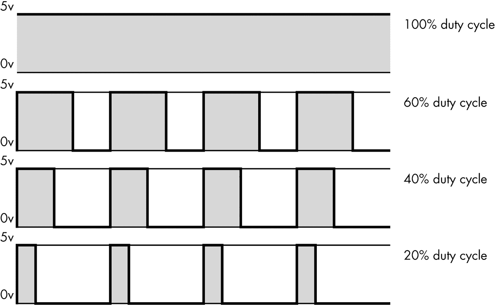
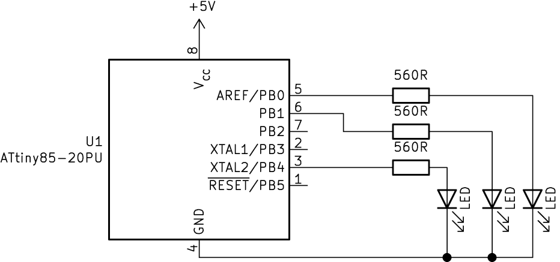
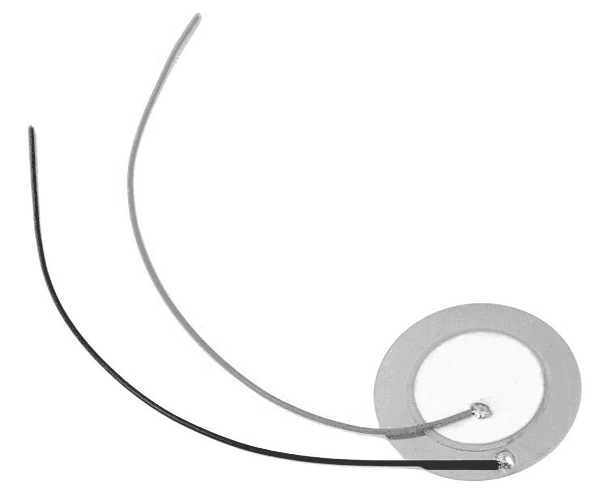
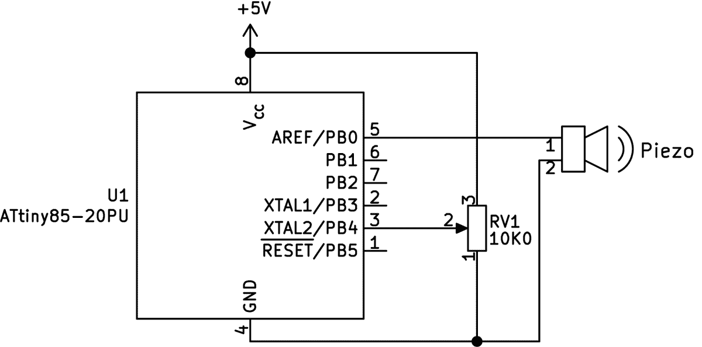
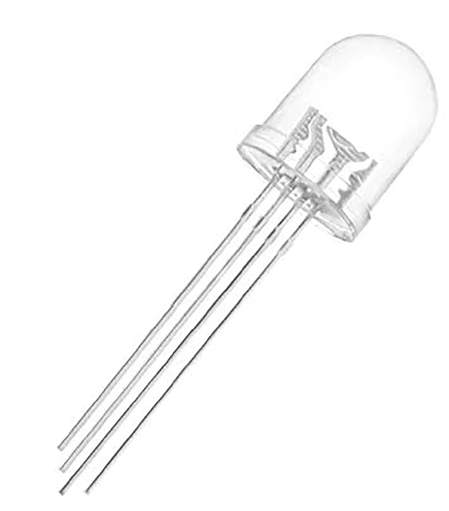
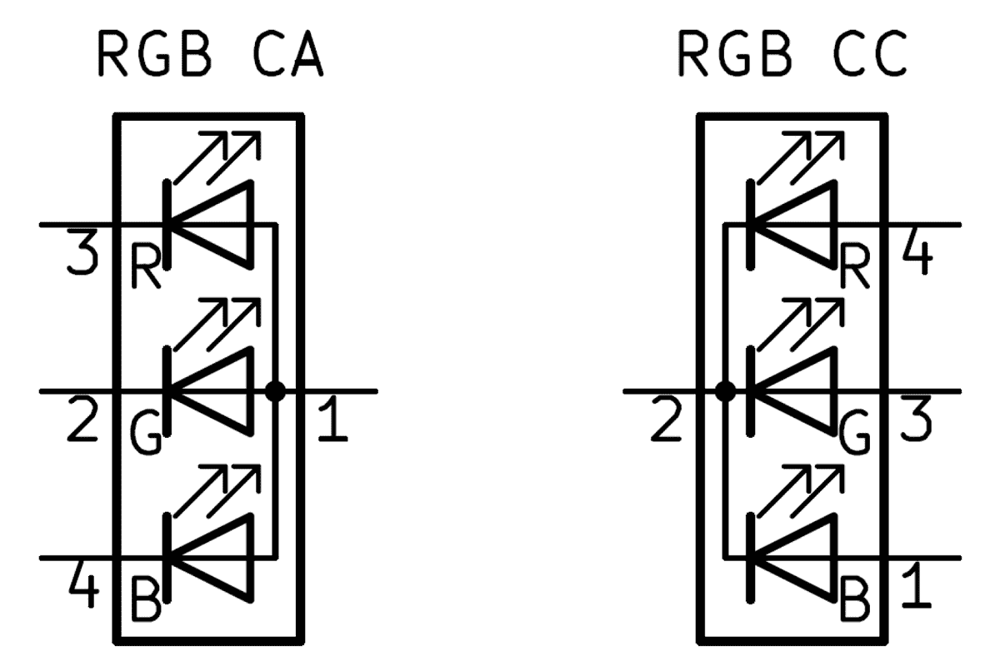
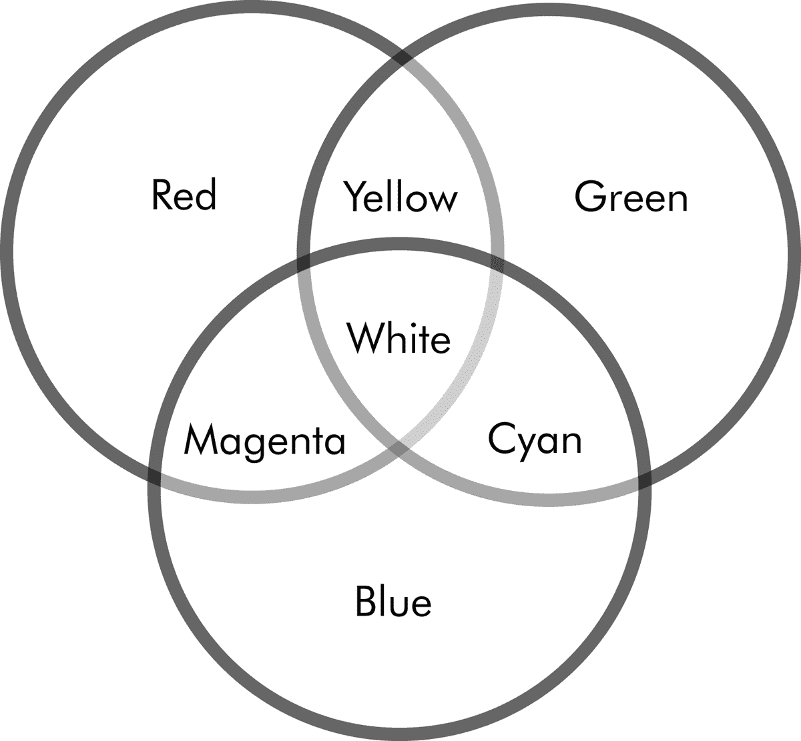
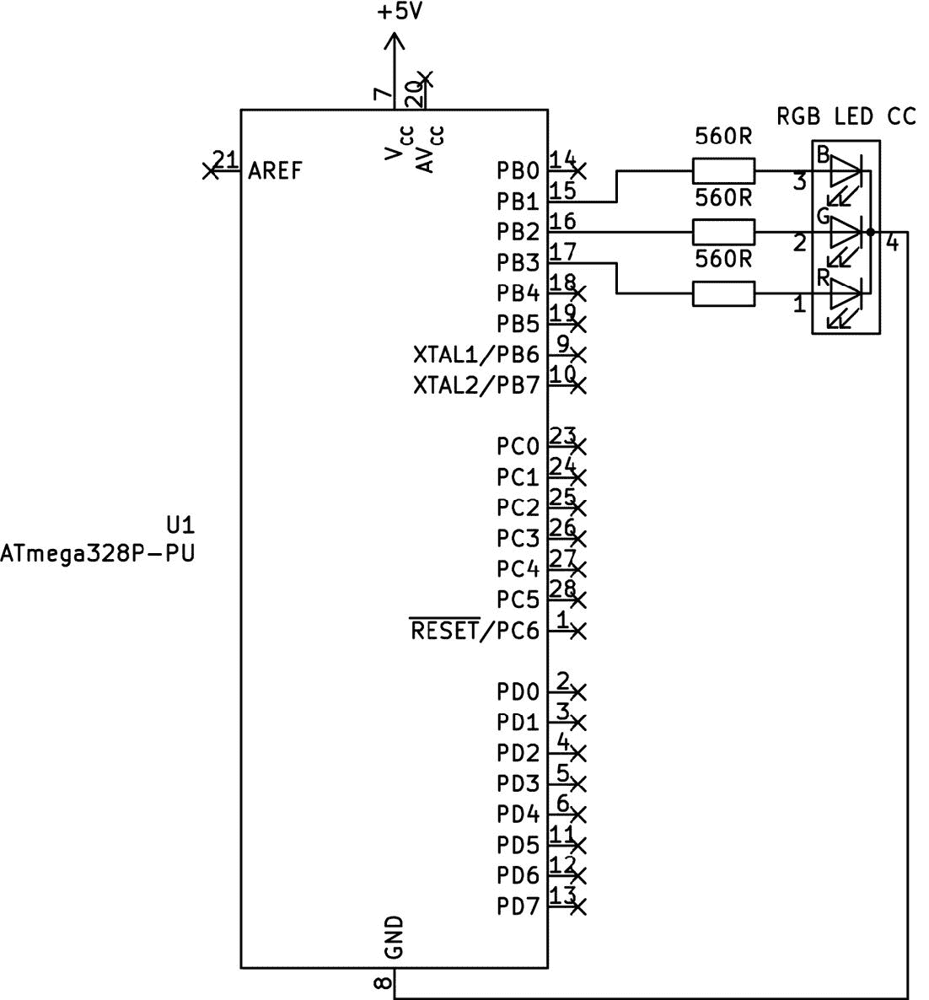

# 第七章：# 使用脉宽调制


当你需要一个数字输出模拟模拟信号时，例如让 LED 以部分亮度工作，你可以使用*脉宽调制（PWM）*来调整数字输出引脚之间高低信号的时间间隔。PWM 可以生成多种效果，例如调节 LED 亮度、控制电机转速，并通过将电能转化为振动的工具产生声音。

在本章中，你将：

+   • 学习 PWM 的工作原理以及 AVR 如何生成 PWM 信号。

+   • 使用 ATtiny85 和 ATmega328P-PU 微控制器进行 PWM。

+   • 使用 PWM 通过压电元件制作不同音调的声音。

+   • 学习如何使用 PWM 通过 RGB LED 创建多彩的效果。

## 脉宽调制与占空比

PWM 允许我们控制 LED 的感知亮度，而不是像之前章节中那样仅仅开关 LED。LED 的亮度由*占空比*决定，即 PORT *x* 引脚开启（意味着 LED 点亮）与关闭（LED 熄灭）之间的时间长度。占空比表示“开启”时间的百分比。占空比越大——即 PORT *x* 引脚在每个周期中保持开启的时间相较于关闭的时间越长——连接到该引脚的 LED 的感知亮度就越高。

此外，PWM 信号的频率越高——即信号开启和关闭的速度越快——视觉效果就越平滑。如果你在控制一个电机，更高的 PWM 频率会使电机的转速更接近实际所需的速度。

图 7-1 展示了四种可能的 PWM 占空比。填充的灰色区域表示 LED 点亮的时间；如你所见，随着占空比的增加，点亮时间也增加。



图 7-1：各种 PWM 占空比

我们只能在 AVR 微控制器上使用某些引脚来实现 PWM。对于 ATtiny85，我们使用 PB0、PB1 和 PB4；对于 ATmega328P-PU，我们使用 PB1 到 PB3 以及 PD3、PD5 和 PD6。为了生成 PWM 信号，我们需要根据所使用的微控制器设置所需的寄存器。我将在本章中展示这两款微控制器的操作。让我们从 ATtiny85 开始。

项目 31：使用 ATtiny85 演示 PWM

在这个项目中，你将学习如何触发 ATtiny85 微控制器提供的 PWM 输出。我们触发每个输出的方式略有不同，但过程总是很简单。

### 硬件

在这个项目中，你将需要以下硬件：

+   • USBasp 编程器

+   • 无焊接面包板

+   • ATtiny85 微控制器

+   • 跳线

+   • 三个 LED

+   • 三个 560 Ω电阻

按照 图 7-2 所示组装电路。



图 7-2：项目 31 的原理图

组装好电路后，像往常一样将 USBasp 连接到你的微控制器。

### 代码

打开终端窗口，导航到本书*第七章*文件夹下的*项目 31*子文件夹，然后像往常一样输入命令`make flash`。一旦项目的代码上传到微控制器，连接到 PB4、PB1 和 PB0 的 LED 应该同时开始渐变开关，重复显示亮度逐渐增高后逐渐降低的效果。

让我们看看这是如何工作的。打开 项目 31 的 *main.c* 文件。

```

      // Project 31 - Demonstrating PWM with the ATtiny85

      #include <avr/io.h>

      #include <util/delay.h>

      void initPWM(void)

      {

      // Set PB4, PB1, PB0 as outputs

      ❶ DDRB |= (1 << PORTB4)|(1 << PORTB1)|(1 << PORTB0);

      ❷ // PB0

      // Set timer mode to FAST PWM

      TCCR0A |= (1 << WGM01)|(1 << WGM00);

      // Connect PWM signal to pin (OC0A => PB0)

      TCCR0A |= (1 << COM0A1);

      // No prescaler

      TCCR0B |= (1 << CS00);

      ❸ // PB1

      // Connect PWM signal to pin (OC0B => PB0)

      TCCR0A |= (1 << COM0B1);

      ❹ // PB4

      // Connect PWM signal to pin (OCR0B => PB4)

      TCCR1 |= (1 << PWM1A)|(1 << COM1A0);

      // Toggle PB4 when timer reaches OCR1B (target)

      GTCCR |= (1 << COM1B0);

      // Clear PB4 when timer reaches OCR1C (top)

      GTCCR |= (1 << PWM1B);

      // No prescaler

      TCCR1 |= (1 << CS10);

      }

      int main(void)

      {

      uint8_t duty = 0;

      initPWM();

      while (1)

      {

      ❺ for (duty = 1; duty <100; duty++)

      {

      OCR0A = duty;                   // PB0

      OCR0B = duty;                   // PB1

      OCR1B = duty;                   // PB4

      delay_ms(10);

      }

      ❻ for (duty = 100; duty >0; --duty)

      {

      OCR0A = duty;                   // PB0

      OCR0B = duty;                   // PB1

      OCR1B = duty;                   // PB4

      _delay_ms(10);

      }

      }

      }

```

这段代码定义了函数 `initPWM()`。该函数同时操作每个引脚，但我们将逐一讲解如何初始化和操作每个引脚。

我们首先将所需的引脚 PORTB0、PORTB1 和 PORTB4 设置为输出 ❶。接下来，逐一操作所需的三个寄存器，以在 PORTB0 上启用 PWM。为了将定时器设置为快速 PWM 模式，我们将定时器信号分配给引脚 PORTB0——请注意，我们不使用预分频器，因此 PWM 可以以其最大频率运行 ❷。我们只需操作一个寄存器以允许在 PORTB1 上启用 PWM ❸，但在 PORTB4 上使用 PWM 需要一个不同的定时器，因此我们必须操作不同的寄存器 ❹。

现在是时候为 PWM 引脚分配值，以设置它们的占空比了。微控制器需要一个介于 1 和 254 之间的值，这将映射到一个从 0 到接近 100 的占空比。（如果使用 0，这就是 0 百分比占空比——也就是说，引脚将关闭。如果使用 255，这就是 100 百分比占空比，所以引脚将持续开启。）

三个寄存器存储我们三个 PWM 引脚的占空比值：

+   • OCR0A 用于 PORTB0

+   • OCR0B 用于 PORTB1

+   • OCR1B 用于 PORTB4

接下来，我们添加一个简单的循环，使占空比值逐渐增加，随着时间推移，LED 的亮度逐渐增大 ❺。然后通过另一个循环，逐渐减少 LED 的亮度 ❻。

尝试调整 `_delay_ms()` 函数中的值，以改变亮度变化的速度。你可能会注意到在较高的占空比值之间，亮度几乎没有变化。这是因为在高频 PWM 操作中（每秒 50 次周期以上），LED 的闪烁速度过快，普通人眼无法察觉其关闭状态。

## ATtiny85 的独立 PWM 引脚控制

现在你已经使用 ATtiny85 组装并测试了所有的 PWM 引脚，是时候学习如何使用每个 PWM 引脚，以便将它们应用到你自己的项目中了。

要同时激活所有 PWM 引脚，只需使用在项目 31 中使用的`initPWM()`函数。（稍后你将学习如何停用它们。）要单独激活和停用每个引脚，请按照以下列表中的说明操作：

激活 ATtiny85 引脚 PORTB0 的 PWM

+   要激活 PORTB0 上的 PWM，请使用以下代码：

    ```

            DDRB |= (1 << PORTB0);                 // Set PB0 as output

            TCCR0A |= (1 << WGM01)|(1 << WGM00);   // Set timer mode to FAST PWM

            // Connect PWM signal to pin (OC0A => PB0)

            TCCR0A |= (1 << COM0A1);

            TCCR0B |= (1 << CS00);                 // No prescaler

    ```

    然后，你可以通过将一个介于 1 和 254 之间的值分配给 OCR0A 寄存器来设置占空比。

+   激活 ATtiny85 引脚 PORTB1 的 PWM

+   要激活 PORTB1 上的 PWM，请使用以下代码：

    ```

            DDRB |= (1 << PORTB1);                 // Set PB1 as output

            TCCR0A |= (1 << WGM01)|(1 << WGM00);   // Set timer mode to FAST PWM

            // Connect PWM signal to pin (OC0B => PB1)

            TCCR0A |= (1 << COM0B1);

            TCCR0B |= (1 << CS00);                 // No prescaler

    ```

    然后，你可以通过将一个介于 1 和 254 之间的值分配给 OCR0B 寄存器来设置占空比。

+   激活 ATtiny85 引脚 PORTB4 的 PWM

+   要激活 PORTB4 上的 PWM，请使用以下代码：

    ```

            DDRB |= (1 << PORTB4);                 // Set PB4 as output

            // Connect PWM signal to pin (OCR0B => PB4)

            TCCR1 |= (1 << PWM1A)|(1 << COM1A0);

            // Toggle PB4 when timer reaches OCR1B (target)

            GTCCR |= (1 << COM1B0);

            // Clear PB4 when timer reaches OCR1C (top)

            GTCCR |= (1 << PWM1B);

            TCCR1 |= (1 << CS10);                  // No prescaler

    ```

    然后，你可以通过将一个介于 1 和 254 之间的值分配给 OCR1B 寄存器来设置占空比。

+   停用 ATtiny85 PWM

+   如果你的项目需要同时使用某个引脚进行 PWM 和开关输出操作，那么在使用 `PORT` `x` `|=` 命令之前，你必须停用 PWM 模式。你需要定义 `initPWM()` 和 `disablePWM()` 函数来在需要时开启和关闭 PWM。使用以下代码停用所有引脚的 PWM（PORTB0、PORTB1 和 PORTB4）：

    ```

            TCCR0A &= ~(1 << WGM01)&~(1 << WGM00); // Turn off fast PWM for PORTB0/1

            TCCR0A &= ~(1 << COM0A1);              // Disconnect PWM from PORTB0

            TCCR0A &= ~(1 << COM0B1);              // Disconnect PWM from PORTB1

            TCCR1 &= ~(1 << PWM1A)&~(1 << COM1A0); // Turn off PWM for PORTB4

            // Disconnect PWM from PORTB4 off timer/counter

            TCCR1 &= ~(1 << CS10);

            GTCCR &= ~(1 << PWM1B);                // Disable PWM for PORTB4

            GTCCR &= ~(1 << COM1B0);               // Disconnect PWM from PORTB4

    ```

一般来说，将设置 PWM 所需的这些代码行放在一个独立的函数中是个好主意，正如项目 31 中所示。现在我们已经回顾了在 ATtiny85 上使用 PWM 的基本方法，让我们用压电元件来玩点噪音。

项目 32：实验压电元件与 PWM

*压电元件*是一种将电荷转换为不同形式能量的设备。它可以将电能转换为物理运动，表现为振动，从而产生我们可以听到的声波。通过施加电流并使用 PWM 调节它，你可以改变压电元件的音调。对于这个项目，你可以使用一个小型的预接线压电元件，就像图 7-3 中显示的那样。



图 7-3：一个预接线的 27 毫米压电元件

图 7-4 显示了我们压电元件的电路符号。


图 7-4：压电元件的电路符号

在这个项目中，你将学习通过调整微调电位器来改变压电元件的声音音调。我们将使用一个 ADC 来读取电位器的值，然后用这个值来确定 PWM 控制压电元件的占空比。

### 硬件

对于这个项目，你需要以下硬件：

+   • USBasp 编程器

+   • 无焊接面包板

+   • ATtiny85 微控制器

+   • 跳线

+   • 预接线压电元件

+   • 10 kΩ 面包板兼容线性微调电位器

按照图 7-5 中的示意图组装电路。



图 7-5：用于 Project 32 的原理图

在组装好电路后，像以往项目一样，通过无焊接面包板将 USBasp 连接到您的微控制器。

### 代码

打开终端窗口，导航到本书*第七章*文件夹下的*Project 32*子文件夹，并输入命令`make flash`。一旦代码上传到微控制器，缓慢地转动电位器的不同方向，调整蜂鸣器的音调。

要查看此如何工作，请打开 Project 32 的*main.c*文件：

```

      // Project 32 - Experimenting with Piezo and PWM

      #include <avr/io.h>

      #include <util/delay.h>

      void startADC()

      ❶ // Set up the ADC

      {

      ADMUX |= (1 << ADLAR)|(1 << MUX1);

      ADCSRA |= (1 << ADEN)|(1 << ADPS1)|(1 << ADPS0);

      }

      ❷ void initPWM(void)

      {

      DDRB |= (1 << PORTB0);            // Set PB0 as output

      TCCR0A |= (1 << WGM01)|(1 << WGM00);

      TCCR0A |= (1 << COM0A1);

      TCCR0B |= (1 << CS00);

      }

      int main(void)

      {

      ❸ startADC();

      ❹ initPWM();

      for(;;)

      {

      ❺ ADCSRA |= (1 << ADSC);         // Start ADC measurement

      while (ADCSRA & (1 << ADSC) ); // Wait until conversion completes

      _delay_ms(5);

      ❻ OCR0A = ADCH;                  // Set PWM duty cycle with ADC value

      }

      return 0;

      }

```

这段代码回顾了 Project 31 和本章中其他 PWM 示例的内容。它实现了设置占空比的目标，因为代码将 ADC 寄存器的 8 位值放入 PWM 寄存器 OCR0A 中。

该代码初始化了 ADC，并使用引脚 PORTB4 作为输入❶。然后它初始化了 PB0 上的 PWM 输出❷，如 Project 31 所示，启动了 ADC❸，并初始化了 PWM❹。接下来，它读取模拟输入❺，最后将 ADC 值（介于 0 到 255 之间）分配给 PWM 占空比寄存器，从而驱动蜂鸣器❻。

## ATmega328P-PU 的单个 PWM 引脚控制

现在是时候介绍可用于 ATmega328P-PU 的 PWM 功能了。表 7-1 列出了六个可与 PWM 一起使用的 ATmega328P-PU 引脚。

| 表 7-1：ATmega328P-PU PWM 引脚 |
| --- |
| 端口寄存器位 | 物理引脚 | 占空比寄存器 |
| --- | --- | --- |
| PORTB1 | 15 | OCR1A |
| PORTB2 | 16 | OCR1B |
| PORTB3 | 17 | OCR2A |
| PORTD3 | 5 | OCR2B |
| PORTD5 | 11 | OCR0B |
| PORTD6 | 12 | OCR0A |

让我们来看看如何激活（和停用）这些引脚以用于 PWM。

激活 ATmega328P-PU 引脚 PORTD5/6 上的 PWM

+   要激活 PORTD5/6 上的 PWM，请使用以下方法：

    ```

            TCCR0A |= (1 << WGM01)|(1 << WGM00);

            TCCR0B |= (1 << CS01);

    ```

    然后，您可以将 PWM 输出连接到引脚 PORTD5/6，如下所示：

    ```

            TCCR0A |= (1 << COM0A1);        // PWM to OCR0A - PD6

            TCCR0A |= (1 << COM0B1);        // PWM to OCR0B - PD5

    ```

    通过为占空比寄存器分配 1 到 254 之间的值来设置占空比。如果您想直接控制引脚，使用它们作为常规输入或输出，则需要将它们从 PWM 输出中断开。您可以按如下方式进行操作：

    ```

            TCCR0A &= ~(1 << COM0A1);       // Disconnect PWM from OCR0A - PD6

            TCCR0A &= ~(1 << COM0B1);       // Disconnect PWM from OCR0B - PD5

    ```

激活 ATmega328P-PU 引脚 PORTB1/2 上的 PWM

+   要激活 PORTB1/2 上的 PWM，请使用以下方法：

    ```

            TCCR1A |= (1 << WGM10);

            TCCR1B |= (1 << WGM12);

            TCCR1B |= (1 << CS11);

    ```

    然后，您可以将 PWM 输出连接到引脚 PORTB1/2，如下所示：

    ```

            TCCR1A |= (1 << COM1A1);        // PWM to OCR1A - PB1

            TCCR1A |= (1 << COM1B1);        // PWM to OCR1B - PB2

    ```

    要断开引脚与 PWM 的连接，请使用以下方法：

    ```

            TCCR1A &= ~(1 << COM1A1);       // Disconnect PWM from OCR1A - PB1

            TCCR1A &= ~(1 << COM1B1);       // Disconnect PWM from OCR1B - PB2

    ```

激活 ATmega328P-PU 引脚 PORTB3 和 PORTD3 上的 PWM

+   要激活 PORTB3 和 PORTD3 上的 PWM，请使用以下方法：

    ```

            TCCR2A |= (1 << WGM20);

            TCCR2A |= (1 << WGM21);

            TCCR2B |= (1 << CS21);

    ```

    然后，您可以将 PWM 输出连接到引脚 PORTB3 和 PORTD3，如下所示：

    ```

            TCCR2A |= (1 << COM2A1);        // PWM to OCR2A - PB3

            TCCR2A |= (1 << COM2B1);        // PWM to OCR2B - PD3

    ```

    要断开引脚与 PWM 的连接，请使用以下方法：

    ```

            TCCR2A &= ~(1 << COM2A1);       // Disconnect PWM from OCR2A - PB3

            TCCR2A &= ~(1 << COM2B1);       // Disconnect PWM from OCR2B - PD3

    ```

请记住，只有在首先运行激活代码之后，您才能根据需要连接或断开引脚与 PWM 的连接。

你已经看过本章中使用 PWM 的几种方法，接下来我将再给你一个例子：使用 RGB LED 生成颜色。

## RGB LED

RGB LED 实际上是由三个 LED 元件组成——一个红色，一个绿色，一个蓝色——这些元件封装在同一个外壳内，如图 7-6 所示。这些 LED 非常适合节省空间，并且你还可以通过调整单独元件的亮度来创造自己的颜色。RGB LED 有多种尺寸可选；一个常见的选择是直径为 10 毫米。



图 7-6：典型 RGB LED

如你所见，RGB LED 有四根引脚。与第三章讨论的单色 LED 一样，这些 LED 有两种类型：*共阳极*和*共阴极*。在共阳极配置中，所有三个 LED 的阳极是连接在一起的，而阴极是分开的。共阴极配置则是三个独立的阳极，而三个阴极连接在一起。图 7-7 展示了两者的电路图。



图 7-7：RGB LED 的电路符号：共阳极（左）和共阴极（右）

每个 LED 的引脚配置可能不同，所以请向你的供应商确认。然而，如果你找不到相关信息，最长的引脚通常是共阳极或共阴极引脚。你可以选择透明（LED 外壳透明）或漫射（LED 外壳模糊）RGB LED。我推荐选择后者，因为漫射 LED 在混合其三个基本颜色元件时效果更好，从而产生色彩组合。

本书中的项目，从下一个开始，我们将使用共阴极 RGB LED。

项目 33：实验 RGB LED 和 PWM

这个项目允许你通过调整 PWM 造成的亮度变化，混合 RGB LED 中的两种基本颜色来生成各种颜色。图 7-8 中的图示展示了哪些颜色组合会产生特定的色调。



图 7-8：红色、绿色和蓝色按不同组合混合的结果

例如，混合红色和绿色光将产生黄色光芒。通过增加一种颜色的亮度，同时减少另一种颜色的亮度，你可以逐渐得到多种黄色的色调。这个项目仅混合了两种颜色，但如果你愿意，也可以同时混合三种颜色，创造出白色光。在这个项目中，你将使用 ATmega328P-PU 微控制器；它的引脚数量比 ATtiny85 多，所以你可以用它来操作 RGB LED，同时还可以保留引脚用于其他用途。

### 硬件

对于这个项目，你需要以下硬件：

+   • USBasp 编程器

+   • 无焊面包板

+   • ATmega328P-PU 微控制器

+   • 跳线

+   • 一颗扩散型共阴极 RGB LED

+   • 三个 560 Ω 电阻

按照 图 7-9 所示组装电路。



图 7-9： 项目 33 的电路图

打开终端窗口，导航到本书 *第七章* 文件夹中的 *Project 33* 子文件夹，并输入命令 `make flash`。上传代码到微控制器后，你的 RGB LED 应该会开始发光，并且颜色不断变化。（如果你的 LED 透明，可以通过将一些白纸覆盖在 LED 上轻松扩散输出，从而获得更好的效果。）

要查看如何实现这一点，打开 *main.c* 文件，查看 项目 33：

```

      // Project 33 - Experimenting with RGB LEDs and PWM

      #include <avr/io.h>

      #include <util/delay.h>

      ❶ #define wait 10

      ❷ void initPWM(void)

      {

      // Timers 1A and 1B

      TCCR1A |= (1 << WGM10);  // Fast PWM mode

      TCCR1B |= (1 << WGM12);  // Fast PWM mode

      TCCR1B |= (1 << CS11);

      TCCR1A |= (1 << COM1A1); // PWM to OCR1A - PB1

      TCCR1A |= (1 << COM1B1); // PWM to OCR1B - PB2

      // Timer 2

      TCCR2A |= (1 << WGM20);  // Fast PWM mode

      TCCR2A |= (1 << WGM21);  // Fast PWM mode

      TCCR2B |= (1 << CS21);

      TCCR2A |= (1 << COM2A1); // PWM to OCR2A - PB3

      }

      ❸ void PWMblue(uint8_t duty)

      // Blue LED is on PB1

      {

      OCR1A = duty;

      }

      ❹ void PWMred(uint8_t duty)

      // Red LED is on PB3

      {

      OCR2A = duty;

      }

      ❺ void PWMgreen(uint8_t duty)

      // Green LED is on PB2

      {

      OCR1B = duty;

      }

      int main(void)

      {

      // Set PORTB1, PORTB2, and PORTB3 as outputs

      ❻ DDRB |= (1 << PORTB1)|(1 << PORTB2)|(1 << PORTB3);

      initPWM();

      uint8_t a;

      while(1)

      {

      // Red to green

      ❼ for (a=1; a<255; a++)

      {

      PWMred(255-a);

      PWMgreen(a);

      _delay_ms(wait);

      }

      // Green to blue

      ❽ for (a=1; a<255; a++)

      {

      PWMgreen(255-a);

      PWMblue(a);

      _delay_ms(wait);

      }

      // Blue to red

      ❾ for (a=1; a<255; a++)

      {

      PWMblue(255-a);

      PWMred(a);

      _delay_ms(wait);

      }

      }

      }

```

我们从常规的 `initPWM()` 函数开始，它将 PORTB1、PORTB2 和 PORTB3 引脚设置为 PWM 输出❷。接着是三个简单的函数，每个 LED 一个❸❹❺，它们传递所需的占空比，这样在需要时就可以轻松控制 LED 中的每种基本颜色。

主要代码将 PORTB1、PORTB2 和 PORTB3 设置为输出引脚，然后初始化 PWM 输出❻。最后，为了混合颜色，我们使用之前定义的三个函数，通过让其中一种颜色在高亮度下启动，另一种颜色在低亮度下启动，然后逐渐增加和减少两种颜色的亮度，依次调整它们的亮度❼❽❾。你可以通过修改 `wait` 的值来调整颜色过渡的速度❶。

我希望你在使用压电元件制作声音效果和使用 RGB LED 制作光效时感到愉快。你才刚刚开始：PWM 有很多其他用途，包括控制机器人和电风扇的电机，以及学习如何使用 MOSFET 来控制更大的电流。我们将在 下一章 中探索这些内容。
