# 第八章：# 使用 MOSFET 控制电机


AVR 无法直接控制电机。为了实现这一点，我们需要使用外部元件：*金属氧化物半导体场效应晶体管（MOSFET）*，这是一种能够在电路中切换或放大电压的晶体管。

在本章中，你将学习如何：

+   • 使用 PWM 和 MOSFET 控制直流电机。

+   • 使用 MOSFET 控制较大的电流。

+   • 使用电机驱动 IC 将较大的电机与 AVR 微控制器连接。

在此过程中，你将制作一个温控风扇和一个两轮驱动的机器人车辆，基于之前的知识完成更有趣和复杂的项目。到本章结束时，你将掌握将 MOSFET 应用于你自己的项目的技能，无论是为了娱乐还是更严肃的应用，如机器人技术、自动化或玩具。

## MOSFET

当我们需要使用小信号（例如来自微控制器数字输出引脚的信号）控制较大电流和电压时，我们使用 MOSFET。MOSFET 有多种不同的尺寸，例如在图 8-1 中所示，以适应不同项目的需求。

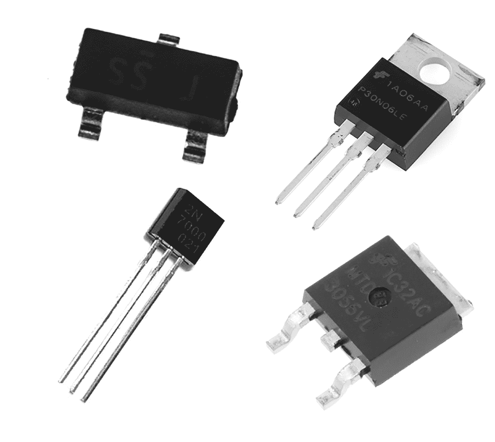

图 8-1：各种 MOSFET

我们将使用图 8-1 左下角所示的小型 2N7000 版本，它有三个引脚。当你面对 2N7000 的平面面时，从左到右分别是源极、门极和漏极引脚（我稍后会解释它们的功能）。

图 8-2 显示了 2N7000 MOSFET 的电路符号。


图 8-2：2N7000 MOSFET 的电路符号

操作 MOSFET 很容易。当你向门极引脚施加小电流时，大电流可以从漏极引脚流入并从源极引脚流出。你还可以将 PWM 信号连接到 MOSFET 的门极引脚，从而以不同方式控制灯光、电机等。这正是我们在本章中要关注的内容。

我们的 2N7000 MOSFET 可以持续承受最高 60 V DC 电压，200 mA 电流，或 500 mA 的脉冲电流。在为你的项目选择 MOSFET 时，务必检查其最大电压和电流是否适配你要切换的信号。

每次使用 MOSFET 时，我们都会在 MOSFET 的门极和源极引脚之间连接一个 10 kΩ 电阻，正如你在接下来的项目中看到的那样。这个电阻可以确保当没有电流施加到门极时，门极保持关闭状态，类似于电阻拉低按钮，如第三章所示；它可以防止 MOSFET 随机地轻微开关。

项目 34：使用 PWM 和 MOSFET 控制直流电机

本项目展示了如何使用 PWM 和 MOSFET 控制一个小型直流电机。由于微控制器本身无法为电机提供足够的电流，因此我们使用外部电源和 MOSFET 来处理电机的需求。

### 硬件

对于这个项目，你需要以下硬件：

+   • USBasp 编程器

+   • 无焊接面包板

+   • ATmega328P-PU 微控制器

+   • 跳线

+   • 小型直流电机和匹配电源

+   • 2N7000 MOSFET

+   • 10 kΩ电阻

像图 8-3 中展示的那种小型直流电机，最大支持 12V 直流电压，足以满足需求。

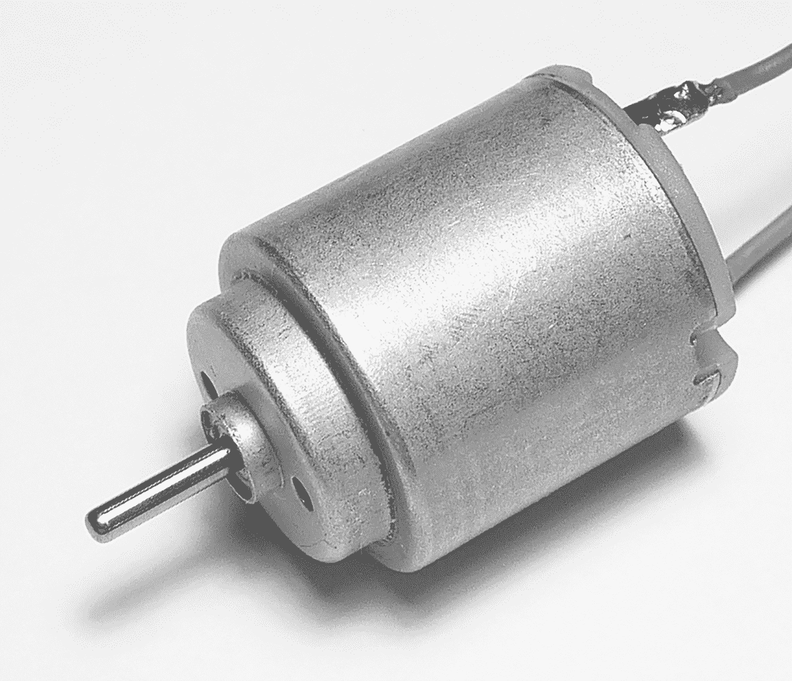

图 8-3：小型直流电机

你还需要外部电源，比如一个包含多个 AA 电池的电池组。像图 8-4 中展示的 6 个 AA 电池组，提供最多 9V 直流电压，足以顺利驱动 12V 直流电机。

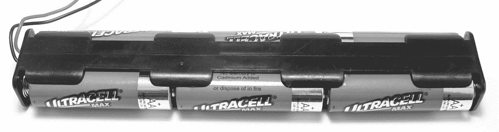

图 8-4：AA 电池组

按照图 8-5 中的示意图组装电路。注意，电池组的黑色/负极引线应连接到 GND。

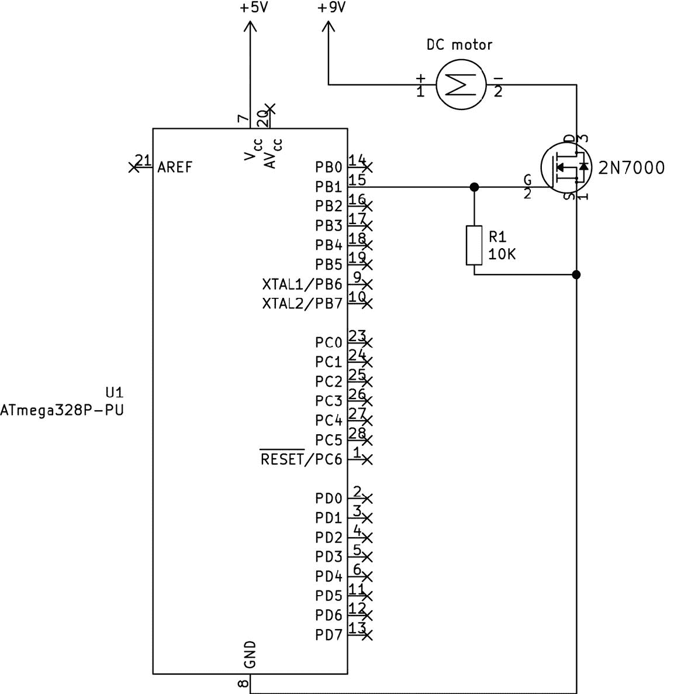

图 8-5：项目 34 的电路图

完成使用后，不要拆卸电路，因为你将在下一个项目中继续使用该电路的一部分。

### 代码

打开终端窗口，导航到本书*第八章*文件夹中的*项目 34*子文件夹，并输入命令`make flash`。直流电机应从 0 开始，逐渐加速至完全开启状态，然后降低速度至完全关闭状态，再重复这一过程。

让我们看看这个是如何工作的：

```

      // Project 34 - DC Motor Control with PWM and MOSFET

      #include <avr/io.h>

      #include <util/delay.h>

      ❶ #define wait 10

      ❷ void initPWM(void)

      {

      // Timers 1A and 1B

      TCCR1A |= (1 << WGM10);        // Fast PWM mode

      TCCR1B |= (1 << WGM12);        // Fast PWM mode

      TCCR1B |= (1 << CS11);

      }

      void motorOn(void)

      {

      ❸ TCCR1A &= ~(1 << COM1A1);      // Disconnect PWM from PB1

      PORTB |= (1 << PORTB1);        // Set PB1 on

      }

      void motorOff(void)

      {

      ❹ TCCR1A &= ~(1 << COM1A1);      // Disconnect PWM from PB1

      PORTB &= ~(1 << PORTB1);       // Set PB1 off

      }

      void motorPWM(uint8_t duty)

      {

      ❺ TCCR1A |= (1 << COM1A1);       // Connect PWM to OCR1A—PB1

      OCR1A = duty;

      }

      int main(void)

      {

      DDRB |= (1 << PORTB1);         // Set PORTB pin 1 as output

      ❷ initPWM();

      uint8_t a;

      while(1)

      {

      motorOff();                 // Motor off

      _delay_ms(3000);

      for (a = 1; a <255; a++)    // Slowly increase motor speed

      {

      motorPWM(a);

      _delay_ms(wait);

      }

      motorOn();                  // Motor full on

      _delay_ms(1000);

      for (a = 254; a > 0;—a)   // Slowly decrease motor speed

      {

      motorPWM(a);

      _delay_ms(wait);

      }

      }

      }

```

你现在应该已经熟悉本项目中使用的代码，因为你在第七章中已经学习过如何使用 PWM，但我们还是一起来回顾一下。首先，我们设置所需的寄存器来初始化 PWM 操作❷。为了简化控制，我们使用了三个函数：`motorOn()`、`motorOff()`和`motorPWM()`。`motorOn()`函数通过首先断开 PORTB1 与 PWM ❸的连接，然后将其设置为高电平，完全开启电机。这样，电机通过 MOSFET 始终获得 100%的电力。

我们使用`motorOff()`函数通过断开 PORTB1 与 PWM ❹的连接并将其设置为低电平，完全关闭电机。这样会关闭 MOSFET 的门极引脚，电机就没有电源了。同样，这也是必要的，因为你不能将 0%的占空比发送到 OCR1A 寄存器，并期望它始终保持关闭。即使占空比为 0%，每次硬件定时器重置时，输出也会在重置期间短暂开启。

最后，函数`motorPWM()`接受所需的占空比值，用于通过 PWM 设置电机速度。它将 PORTB1 连接到 PWM ❺，并将 OCR1A 寄存器加载所需的值。

我们的主代码会反复启动电机，将速度增加到 100%，然后再降低到 0%，最后将电机关闭 3 秒。我们在代码开始时关闭电机，以便用户在启动之前能提前有所准备。你可以通过更改`wait` ❶的值来调整 PWM 循环中的延迟时间。

现在你已经知道如何控制直流电机，让我们通过构建一个温控风扇系统，将这一技能应用到实际例子中。

项目 35：温控风扇

在这个项目中，你将把现有的电机控制知识与新学到的 MOSFET 技能结合起来，利用温度传感器制作一个温控风扇。

### 硬件部分

本项目需要以下硬件：

+   • USBasp 编程器

+   • 无焊接面包板

+   • ATmega328P-PU 微控制器

+   • 跳线

+   • 小型直流电机及其匹配电源

+   • 2N7000 MOSFET

+   • TMP36 温度传感器

+   • 0.1 μF 陶瓷电容

+   • 10 kΩ 电阻

你可以使用上一项目中的小型直流电机来看看这个是如何工作的，或者你可以从电气零售商那里购买一个直流电机驱动的冷却风扇，例如图 8-6 所示的 PMD Way（部件号 59119182）。一些风扇可能有四根线，但其中只有两根是必需的（电源和 GND）。再次提醒，我们需要为风扇提供外部电源。

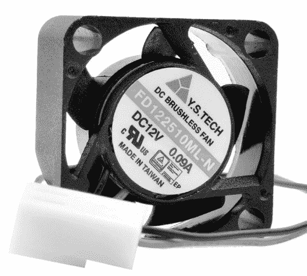

图 8-6 ：直流冷却风扇

按照图 8-7 所示组装电路。

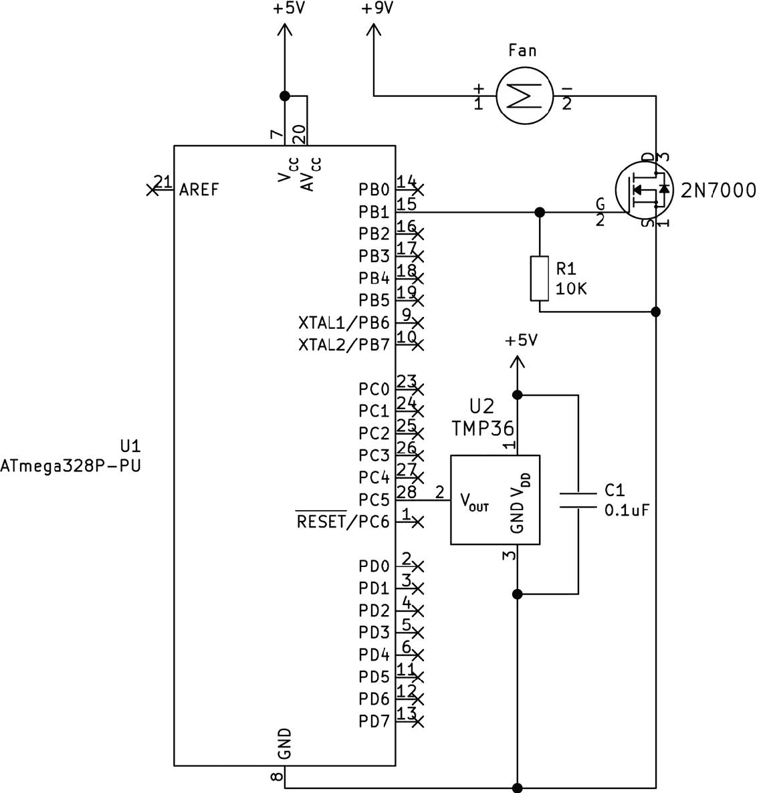

图 8-7 ：项目 35 的电路图

在组装项目时，请注意电池包或风扇电源的黑色/负极导线将连接到 GND。同时，别忘了将 AV [CC]连接到 5V。

### 代码部分

打开一个终端窗口，导航到本书*第八章*文件夹中的*项目 35*子文件夹，并输入命令`make flash`。一旦接通电源，项目应该在等待三秒钟后根据当前温度读取温度并启动风扇。

为了了解其工作原理，查看以下代码：

```

      // Project 35 - Temperature-Controlled Fan

      #include <avr/io.h>

      #include <util/delay.h>

      void startADC()

      {

      ADMUX |= (1 << REFS0);                 // Use AVcc pin with ADC

      ADMUX |= (1 << MUX2) | (1 << MUX0);    // Use ADC5 (pin 28)

      ADCSRA |= (1 << ADPS1) | (1 << ADPS0); // Prescaler for 1 MHz (/8)

      ADCSRA |= (1 << ADEN);                 // Enable ADC

      }

      void initPWM(void)

      {

      // Timers 1A and 1B

      TCCR1A |= (1 << WGM10);                // Fast PWM mode

      TCCR1B |= (1 << WGM12);                // Fast PWM mode

      TCCR1B |= (1 << CS11);

      }

      void motorOff(void)

      {

      TCCR1A &= ~(1 << COM1A1);              // Disconnect PWM from PB1

      PORTB &= ~(1 << PORTB1);               // Set PB1 off

      }

      void motorOn(void)

      {

      TCCR1A &= ~(1 << COM1A1);              // Disconnect PWM from PB1

      PORTB |= (1 << PORTB1);                // Set PB1 on

      }

      void motorPWM(uint8_t duty)

      {

      TCCR1A |= (1 << COM1A1);               // Connect PWM to OCR1A—PB1

      OCR1A = duty;

      }

      int main(void)

      {

      DDRB |= (1 << PORTB1);                 // Set PORTB pin 1 as output

      ❶ startADC();

      initPWM();

      ❷ uint8_t ADCvalue;

      float voltage;

      float temperature;

      // Delay motor action for a few moments on start

      ❸ _delay_ms(3000);

      while(1)

      {

      // Get reading from TMP36 via ADC

      ❹ ADCSRA |= (1 << ADSC);              // Start ADC measurement

      while (ADCSRA & (1 << ADSC) );      // Wait until conversion complete

      _delay_ms(10);

      // Get value from ADC register, convert to 8-bit value

      ADCvalue = ADC >> 2;

      // Convert reading to temperature value (Celsius)

      voltage = (ADCvalue * (5000 / 256));

      ❺ temperature = (voltage—500) / 10;

      // Now you have a temperature value, take action

      ❻ if (temperature<25)

      {

      // Under 25 degrees, turn motor off

      motorOff();

      }

      ❼ else if ((temperature>=25) & (temperature <35))

      {

      // At or above 25 and below 35 degrees, set motor to 50% PWM

      motorPWM(127);

      }

      ❽ else if (temperature>=35)

      {

      // 35 degrees and over, turn motor full on

      motorOn();

      }

      ❾ _delay_ms(500); // Prevent rapid motor speed changes

      }

      }

```

这段代码基于第四章中项目 19 的 ADC 和温度传感器，以及项目 34 中使用的 PWM 电机控制。首先，我们激活 ADC 来读取 TMP36 温度传感器，并激活 PWM 以实现可调速的电机控制❶（`startADC()`和`initPWM()`函数在程序开头定义）。接下来，我们引入用于计算温控器温度所需的变量❷，然后在启动时加入延迟，以防电机在重置或开机后立即启动❸。

在主循环中，我们从 ADC 获取值❹，并将其转换为摄氏度❺。此时，代码可以使用这个温度值来判断是否需要启动电机。在本项目中，如果温度低于 25 度，电机将关闭❻；如果温度在 25 到 34 度之间（含 34 度），风扇以半速运行❼；如果温度达到 35 度或更高，风扇以全速运行❽。

最后，在检查温度后，会有一个短暂的延迟❾，以避免*滞后效应*——即电路特性快速变化。例如，如果传感器处于气流或飘动的窗帘附近，温度可能会在 24.99 和 25 度之间迅速波动，导致电机持续开关。这个延迟可以帮助我们避免这种情况。

在这一点上，我希望你已经开始看到我们如何将基本的 AVR 代码和工具结合起来，解决新的问题。通过建立在先前知识的基础上，我们已经开始超越前几章的简单项目，向更复杂、更实用的应用迈进。

现在我们已经使用 MOSFET 进行了基本的电机控制实验，接下来我们将继续控制直流电机的旋转方向和速度。为此，我们将使用 L293D 电机驱动 IC。

## L293D 电机驱动 IC

为了控制一个或两个小型直流电机的速度和方向，我们将使用 STMicroelectronics 的 L293D 电机驱动 IC，如图 8-8 所示。它与微控制器的封装类型相同，因此我们可以轻松地在无焊接面包板上进行实验。

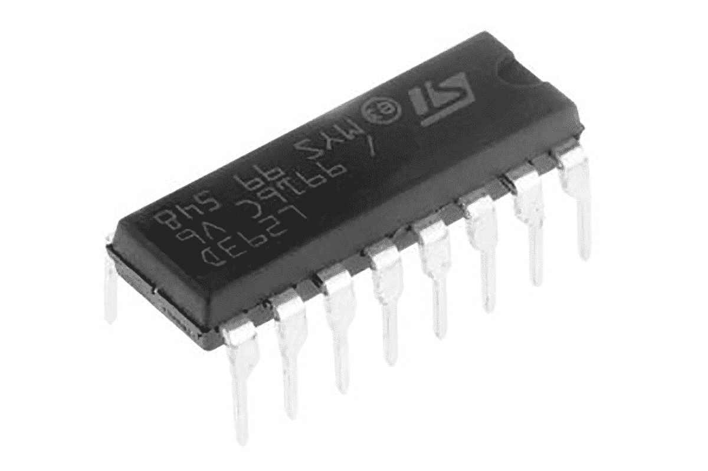

图 8-8：L293D 电机驱动 IC

你可以使用像 L293D 这样的电机驱动 IC，用于机器人或小型玩具，这些设备的工作电压范围从 4.5 到 36 V 直流电，电流最大可达 600 mA，但在热量方面有一些限制，我稍后会解释。L293D 能为你节省大量时间，因为它负责将电力分配给电机，免去了你构建外部电路的麻烦。它被称为*H 型桥 IC*，因为它内部有一组 MOSFET 和其他组件，按字母 H 的形状配置，如图 8-9 所示。


图 8-9：L293D IC 框图

幸运的是，我们不需要自己构建 L293D IC 的电路；它已经设置好并准备好了，只需要我们连接电机、控制逻辑和电源。接下来，我们只需连接电机、电源、GND 和来自微控制器的输出。要了解如何将 L293D 接线到一个直流电机，请查看图 8-10 中的引脚图。

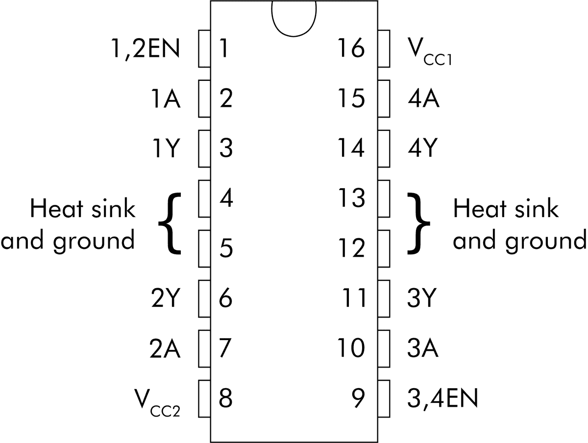

图 8-10：L293D IC 引脚图

有四个 GND 引脚：4、5、12 和 13。将它们连接到 GND。接下来，找到两个电源引脚。将第一个电源引脚——V [CC] 1（逻辑电源引脚）连接到 5V，就像我们在之前的项目中为微控制器所做的那样。然后将第二个电源引脚 V [CC] 2 连接到电机电源的正极（最高可达 36V 直流电）。最后，连接电机：一根线连接到引脚 3，另一根连接到引脚 6。

控制电机需要从我们的微控制器的数字输出引脚获取三个信号。首先，我们设置 ENABLE 引脚：要么设置为高电平，以便驱动 IC 向电机提供电力，要么设置为低电平，使电机停止。接下来两个引脚，1A 和 2A，控制电机电力的极性，从而控制电机的旋转方向。当 ENABLE 设置为高电平时，电机将在 1A 为高、2A 为低时朝一个方向旋转，在 1A 为低、2A 为高时朝另一个方向旋转。表格 8-1 总结了这些信息，方便参考。

| 表格 8-1：L293D 单电机控制 |
| --- |
| ENABLE 引脚/EN1（引脚 1） | 1A 引脚/输出 1（引脚 2） | 2A 引脚/输出 2（引脚 7） | 电机动作 |
| --- | --- | --- | --- |
| 高 | 高 | 低 | 正向 |
| 高 | 低 | 高 | 反向 |
| 低 | 高或低 | 高或低 | 停止 |

从外观上无法判断电机是正转还是反转；你需要进行测试运行来确定 1A/2A 两种组合在你的电机上分别对应哪种方向。你可以通过向 ENABLE 引脚施加 PWM 信号来改变电机的转速。

关于热量的几点说明

L293D 在接近其最大负载运行时可能会变热（甚至发烫）。在这种情况下不应在无焊接面包板上使用它，因为四个 GND 引脚也用作散热片。这意味着它们可能会融化引脚周围的塑料，导致 L293D 卡在面包板中。如果你要控制较大的电机，可以使用自己的 PCB 来构建电路，使用电机控制的扩展板，或者将电路焊接到条形板上。

现在你已经熟悉了 L293D 的理论，接下来我们在下一个项目中将它付诸实践。

项目 36：使用 L293D 控制直流电机

本项目演示了如何使用 PWM 和 L293D 电机驱动芯片控制一个小型直流电机，使电机可以在两个方向上以不同的速度运转。这将使你获得在下一个项目中构建你的第一个运动机器人所需的所有技能。

### 硬件

对于这个项目，你需要以下硬件：

+   • USBasp 编程器

+   • 无焊面包板

+   • ATmega328P-PU 微控制器

+   • 跳线

+   • 小型直流电机及匹配电源

+   • L293D 电机驱动芯片

使用与你在项目 34 中使用的相同的直流电机和匹配电源。按照图 8-11 所示组装电路。

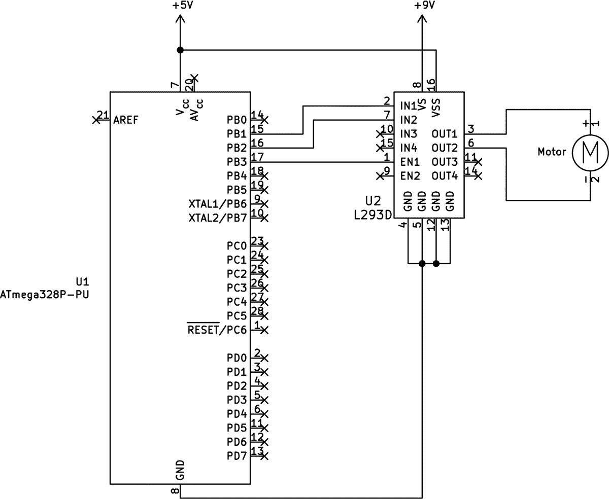

图 8-11： 项目 36 的电路图

在组装电路时，再次将电池组或外部电源的黑色/负极线连接到 GND。

### 代码

打开终端窗口，进入本书 *第八章* 文件夹中的 *项目 36* 子文件夹，输入命令 `make flash` 。一旦你接通电源，项目将等待三秒钟，然后依次以两个不同的速度正反向操作电机。

让我们看看它是如何工作的。

```

      // Project 36 - DC Motor Control with L293D

      #include <avr/io.h>

      #include <util/delay.h>

      ❶ void initPWM(void)

      {

      TCCR2A |= (1 << WGM20);     // Fast PWM mode

      TCCR2A |= (1 << WGM21);     // Fast PWM mode, part 2

      TCCR2B |= (1 << CS21);      // PWM Freq = F_CPU/8/256

      }

      ❷ void motorForward(uint8_t duty)

      {

      // Set direction

      ❸ PORTB |= (1 << PORTB1);     // PB1 HIGH

      PORTB &= ~(1 << PORTB2);    // PB2 LOW

      // Set speed

      ❹ if (duty == 255)

      {

      PORTB |= (1 << PORTB3);  // Set PORTB3 to on

      } else if (duty < 255)

      {

      ❺ TCCR2A |= (1 << COM2A1); // PWM output on OCR2A—PB3

      OCR2A = duty;            // Set PORTB3 to PWM value

      }

      }

      ❻ void motorBackward(uint8_t duty)

      {

      // Set direction

      PORTB &= ~(1 << PORTB1);    // PB1 LOW

      PORTB |= (1 << PORTB2);     // PB2 HIGH

      // Set speed

      if (duty == 255)

      {

      PORTB |= (1 << PORTB3);  // Set PORTB3 to on

      } else if (duty < 255)

      {

      TCCR2A |= (1 << COM2A1); // PWM output on OCR2A—PB3

      OCR2A = duty;            // Set PORTB3 to PWM value

      }

      }

      ❼ void motorOff(void)

      {

      // Disconnect PWM output from OCR2A—PB3

      TCCR2A &= ~(1 << COM2A1);

      // Set ENABLE to zero for brake

      PORTB &= ~(1 << PORTB3);

      }

      int main(void)

      {

      // Set PORTB3, 2, and 1 as outputs

      DDRB |= (1 << PORTB3)|(1 << PORTB2)|(1 << PORTB1);

      ❽ initPWM();

      _delay_ms(3000);            // Wait a moment before starting

      while(1)

      {

      ❾ motorForward(64);

      _delay_ms(2000);

      motorOff();

      _delay_ms(2000);

      motorForward(255);

      _delay_ms(2000);

      motorOff();

      _delay_ms(2000);

      motorBackward(64);

      _delay_ms(2000);

      motorOff();

      _delay_ms(2000);

      motorBackward(255);

      _delay_ms(2000);

      motorOff();

      _delay_ms(2000);

      }

      }

```

这段代码是本章前面电机控制项目的基础，加入了 L293D 所需的部分。我们在点 ❶ 和 ❽ 设置了 PWM。第一个电机控制函数`motorForward()` ❷使电机朝一个方向旋转，并接受一个 1 到 255 之间的占空比值。根据表 8-1，我们将输出设置为高低电平以实现电机的方向控制 ❸。然后，代码会检查所需的占空比是否为 255 ❹，如果是，则将 ENABLE 引脚设置为高电平，直接以全速运转电机，而不是使用 PWM。然而，如果占空比小于 255，则会为控制 L293D ENABLE 引脚的输出引脚启用 PWM ❺，并将所需的占空比值写入 OCR2A。

`motorForward()` 中使用的电机控制方法在函数`motorBackward()` ❻ 中得以重复，不过此时用于电机控制的输出被设置为低高电平，以实现反向旋转。最后，`motorOff()` 函数 ❼ 通过首先禁用控制 L293D ENABLE 引脚的输出引脚的 PWM，然后将其设置为低电平，从而关闭电机。完成所有这些后，你现在可以使用电机控制函数来控制电机旋转的速度和方向，如代码主循环中所示 ❾。

现在你已经知道如何控制直流电机的速度和方向，让我们使用两个电机来控制一个小型机器人。

项目 37：控制一个双轮驱动机器人

在本项目中，您将学习如何控制一辆小型的两轮驱动机器人。建议的硬件包括两个直流电动机和一个*万向轮*（一个小型旋转轮子，固定在机器人底部），使您能够轻松控制行驶速度和方向。希望这能激发您创造自己更复杂的机器人作品！

### 硬件

本项目所需的硬件如下：

+   • USBasp 编程器

+   • 无焊面包板

+   • ATmega328P-PU 微控制器

+   • 跳线

+   • 两个小型直流电动机及匹配电源

+   • 2WD 机器人底盘（例如 PMD Way 零件编号 72341119）

+   • 四节 AA 电池

+   • 1N4004 电源二极管

+   • L293D 电机驱动 IC

#### 底盘

任何机器人车辆的基础是一个坚固的底盘，包含电动机、驱动系统和电源。市场上有许多底盘模型可供选择。为了简化，本项目使用了一个便宜的机器人底盘，配备了两个约为 6 V DC 的小型直流电动机和两个匹配的车轮，如图 8-12 所示。

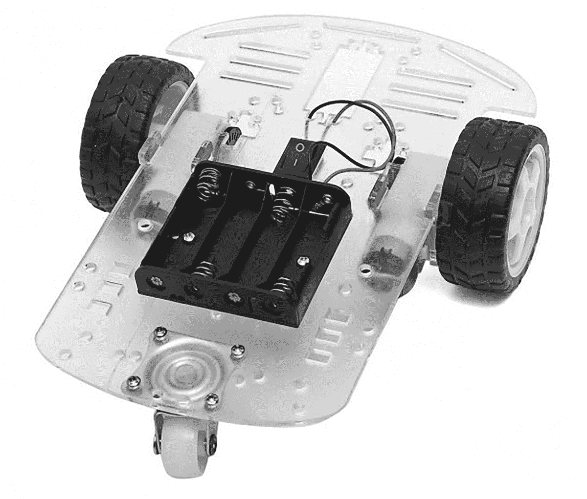

图 8-12 ：两轮驱动机器人底盘（PMD Way 零件编号 72341119）

物理组装机器人底盘的任务因模型而异，但大多数模型需要一些额外的工具，除了套件中提供的工具外，例如螺丝刀。如果您尚未确定最终设计，并希望让您的机器人在临时配置中开始移动，可以使用可重复使用的粘土胶粘剂（如 Blu-Tack）将电子元件附着到底盘上。

#### 电源

机器人底盘所包含的电动机通常在大约 6 V DC 下运行，因此我们将使用图 8-12 中示例底盘附带的四节 AA 电池托架。我们不能直接使用 6 V 来为微控制器电路供电，因此我们将在电源正极和微控制器的 5 V 引脚之间放置一个 1N4004 二极管。该二极管将导致电压下降 0.7 V，使微控制器的电源电压降至大约 5.3 V DC。随着电池使用寿命的减少，电压将再次下降。

按照图 8-13 所示组装电路。

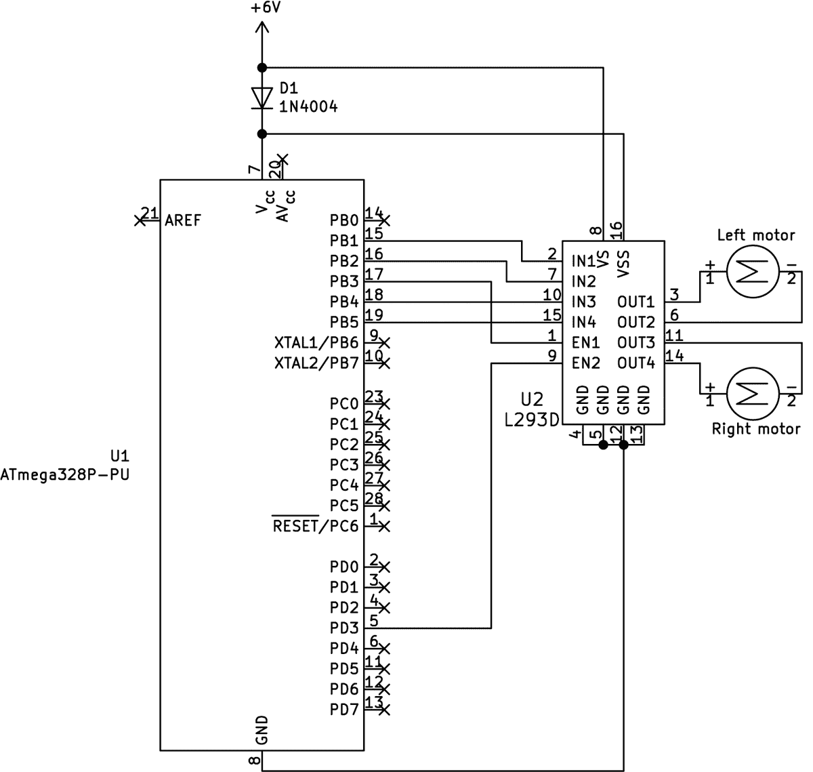

图 8-13 ：项目 37 的示意图

再次强调，电池组或外部电源的黑色/负极引线连接到 GND，红色/正极引线连接到 L293D 的 V [CC] 2 引脚和 1N4004 二极管。

### 代码

打开一个终端窗口，导航到本书 *第八章* 文件夹中的 *Project 37* 子文件夹，并输入命令 `make flash`。一旦移除 AVR 编程器并启动车辆，它应该等待三秒钟后向前移动，然后根据代码主循环中函数的顺序依次向左、向右转动，等等。

这段代码是我们使用 L293D 电机控制器 IC 和 PWM 控制直流电机的实验成果。让我们看看它是如何工作的：

```

      // Project 37 - Controlling a Two-Wheel-Drive Robot Vehicle

      #include <avr/io.h>

      #include <util/delay.h>

      void initPWM(void)

      ❶

      {

      TCCR2A |= (1 << WGM20);                 // Fast PWM mode

      TCCR2A |= (1 << WGM21); );              // Fast PWM mode, part 2

      TCCR2B |= (1 << CS21); );               // PWM Freq = F_CPU/8/256

      }

      void moveForward(uint8_t duty)

      {

      // Set direction

      PORTB |= (1 << PORTB4)|(1 << PORTB1);

      ❷ // PB4,1 HIGH

      PORTB &= ~(1 << PORTB5)&~(1 << PORTB2); // PB5,2 LOW

      // Set speed

      if (duty == 255)

      ❸

      {

      PORTB |= (1 << PORTB3);              // Set PORTB3 to on

      PORTD |= (1 << PORTD3);              // Set PORTD3 to on

      } else if (duty < 255)

      {

      TCCR2A |= (1 << COM2A1);

      ❹           // PWM output on OCR2A—PB3

      TCCR2A |= (1 << COM2B1);             // PWM to OCR2B—PD3

      OCR2A = duty;                        // Set PORTB3 to PWM value

      OCR2B = duty;                        // Set PORTD3 to PWM value

      }

      }

      void moveBackward(uint8_t duty)

      {

      // Set direction

      PORTB &= ~(1 << PORTB4)&~(1 << PORTB1); // PB4,1 LOW

      PORTB |= (1 << PORTB5)|(1 << PORTB2);   // PB5,2 HIGH

      // Set speed

      if (duty == 255)

      {

      PORTB |= (1 << PORTB3);              // Set PORTB3 to on

      PORTD |= (1 << PORTD3);              // Set PORTD3 to on

      } else if (duty < 255)

      {

      TCCR2A |= (1 << COM2A1);             // PWM output on OCR2A—PB3

      TCCR2A |= (1 << COM2B1);             // PWM to OCR2B—PD3

      OCR2A = duty;                        // Set PORTB3 to PWM value

      OCR2B = duty;                        // Set PORTD3 to PWM value

      }

      }

      void moveLeft(uint8_t duty)

      {

      // Set direction

      PORTB |= (1 << PORTB4)|(1 << PORTB2);   // PB4,2 HIGH

      PORTB &= ~(1 << PORTB5)&~(1 << PORTB1); // PB5,1 LOW

      // Set speed

      if (duty == 255)

      {

      PORTB |= (1 << PORTB3);              // Set PORTB3 to on

      PORTD |= (1 << PORTD3);              // Set PORTD3 to on

      } else if (duty < 255)

      {

      TCCR2A |= (1 << COM2A1);             // PWM output on OCR2A—PB3

      TCCR2A |= (1 << COM2B1);             // PWM to OCR2B—PD3

      OCR2A = duty;                        // Set PORTB3 to PWM value

      OCR2B = duty;                        // Set PORTD3 to PWM value

      }

      }

      void moveRight(uint8_t duty)

      {

      // Set direction

      PORTB |= (1 << PORTB5)|(1 << PORTB1);   // PB5,1 HIGH

      PORTB &= ~(1 << PORTB4)&~(1 << PORTB2); // PB4,2 LOW

      // Set speed

      if (duty == 255)

      {

      PORTB |= (1 << PORTB3);              // Set PORTB3 to on

      PORTD |= (1 << PORTD3);              // Set PORTD3 to on

      } else if (duty < 255)

      {

      TCCR2A |= (1 << COM2A1);             // PWM output on OCR2A—PB3

      TCCR2A |= (1 << COM2B1);             // PWM to OCR2B—PD3

      OCR2A = duty;                        // Set PORTB3 to PWM value

      OCR2B = duty;                        // Set PORTD3 to PWM value

      }

      }

      void motorsOff(void)

      ❺

      {

      TCCR2A &= ~(1 << COM2A1); // Disconnect PWM from OCR2A—PB3

      TCCR2A &= ~(1 << COM2B1); // Disconnect PWM from OCR2B—PD3

      PORTB &= ~(1 << PORTB3);  // Set ENABLE pins to zero for brake

      PORTD &= ~(1 << PORTD3);

      }

      int main(void)

      {

      // Set PORTB5, 4, 3, 2, and 1 as outputs

      DDRB |= (1 << PORTB5)|(1 << PORTB4)|(1 << PORTB3)|(1 << PORTB2)|(1 << PORTB1);

      ❻

      DDRD |= (1 << PORTD3);

      ❼               // Set PORTD3 as output

      initPWM();

      ❽

      _delay_ms(3000);                       // Wait a moment before starting

      while(1)

      {

      moveForward(128);

      _delay_ms(2000);

      moveLeft(128);

      _delay_ms(2000);

      moveRight(128);

      _delay_ms(2000);

      motorsOff();

      moveBackward(128);

      _delay_ms(2000);

      }

      }

```

在 ❶ 和 ❽ 处，代码为两个数字输出启动 PWM，这样就可以控制两个电机。PWM 启动后，调用 `moveForward()`，这是控制电机的五个函数中的第一个。如果电机的工作方向与代码相反，你可能需要调换每个电机上的接线。这四个函数——`moveForward()`、`moveBackward()`、`moveLeft()` 和 `moveRight()`——是完全相同的，唯一的区别在于电机旋转的顺序。它们都接受一个占空比值来控制电机的速度。`motorsOff()` 函数切断两个电机的电源。

在这种情况下，我们通过根据所需的旋转类型将数字输出设为高或低来设置电机的前进方向 ❷。有关所需输出配置，请参阅表 8-1。电机运动函数会检查用户是否需要全速（占空比为 100%，表示为 255） ❸。如果需要，它会简单地将 L293D 的 ENABLE 引脚设置为开启。但是，如果你通过电机运动函数传入较低的占空比值，程序会激活 ENABLE 引脚的 PWM 输出 ❹，并将所需的占空比填充到 PWM 寄存器 OCR2A 和 OCR2B 中。

另外三个运动函数的操作方式类似，只是电机的旋转方向设置为允许向左或向右转动或向后移动。`motorsOff()` 函数通过关闭 PWM 并将两个 L293D ENABLE 引脚设为低来停止运动 ❺。最后，程序将六个必需的引脚设置为输出，以控制 L293D ❻❼。

你可以使用代码主循环中使用的函数来改变运动方向、通过占空比来调整速度、通过延迟函数来控制持续时间，并在需要时停止电机。

我们使用了一个单独的定时器，为两个电机提供两个 PWM 输出（OCR2A 和 OCR2B），这样它们共享相同的 PWM 生成，从而实现同步。如果你为两个需要一起操作的电机使用两个不同的定时器，PWM 信号将会有所不同，两个电机的操作也会略有不同。

现在我们已经实验了直流电机，在下一章中，我们将研究 AVR 系统的另一个有用工具：内部 EEPROM。
