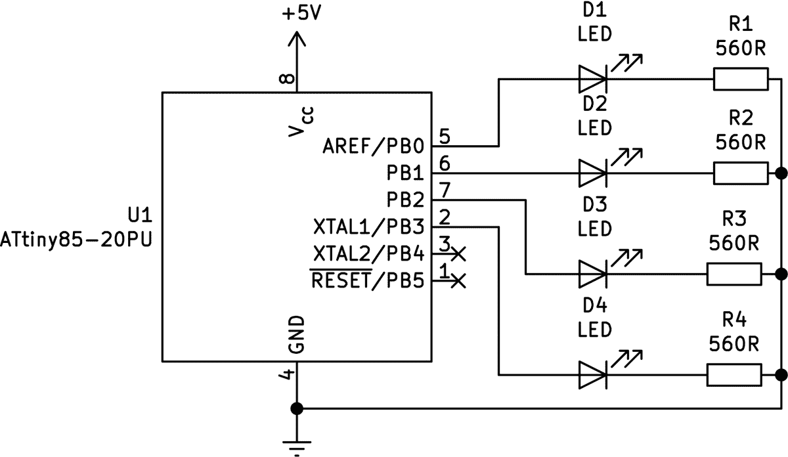
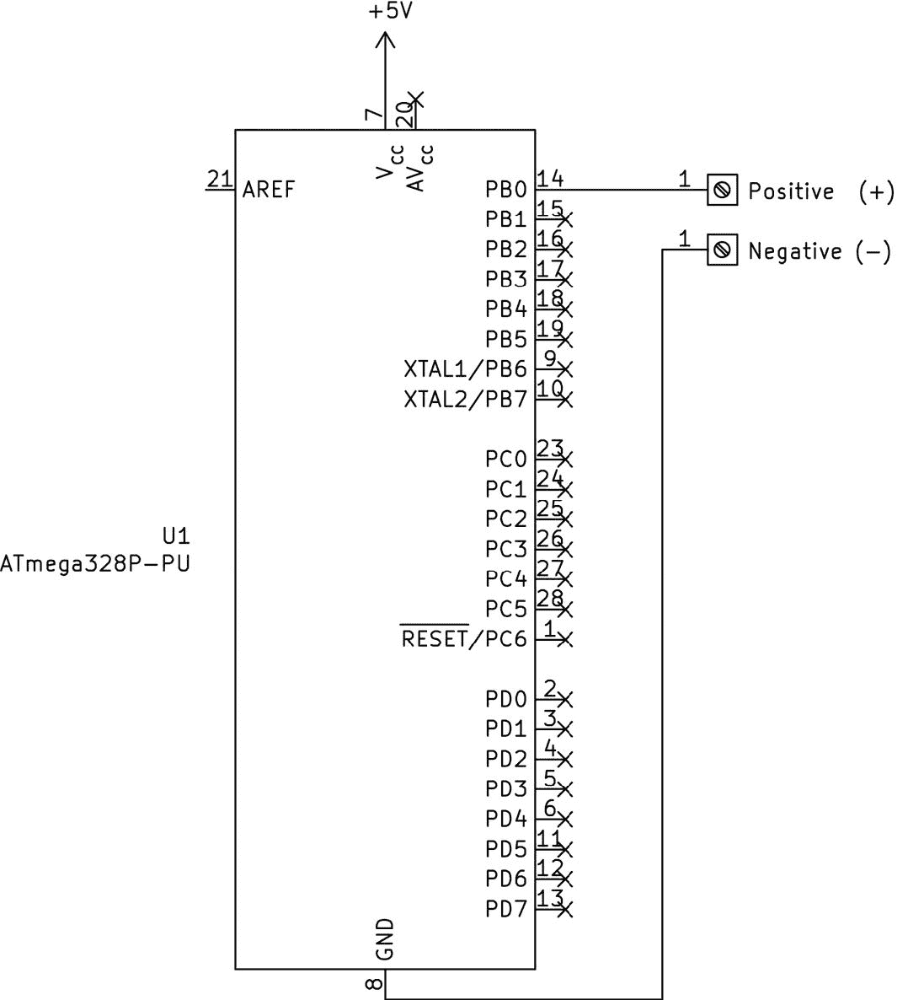
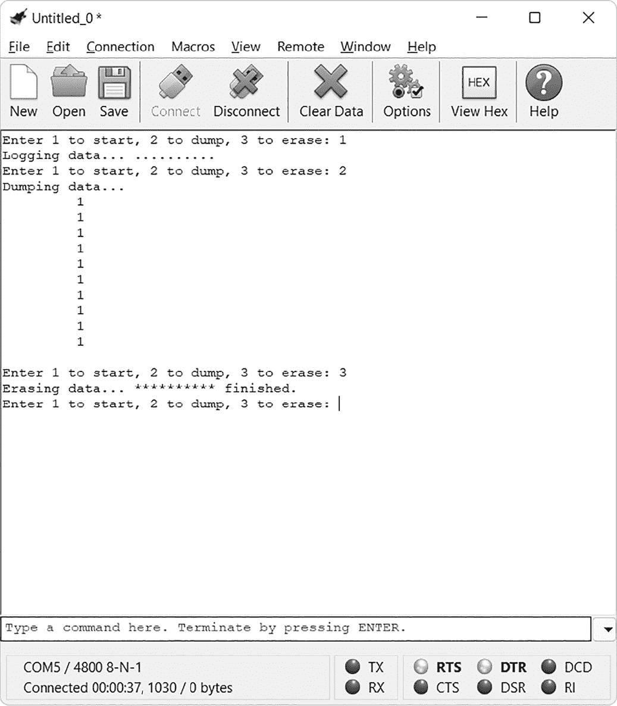
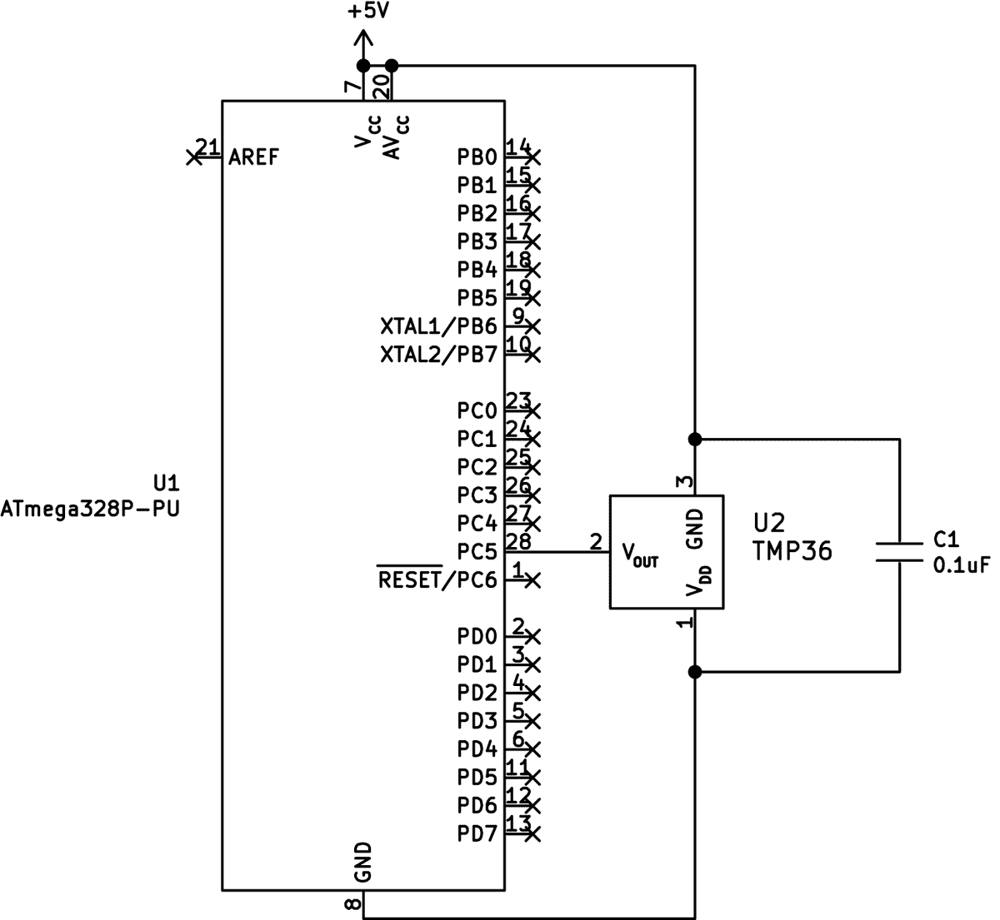
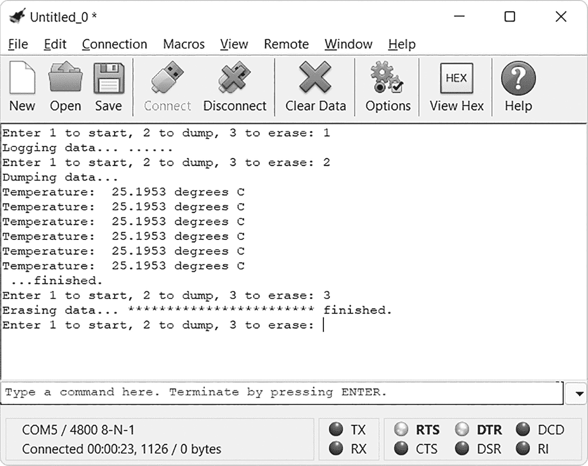

# 第九章：# 使用内部 EEPROM


当你在 AVR 代码中定义并使用一个变量时，存储的数据只会持续到硬件重置或断电。但是如果你需要保存一些值以备将来使用怎么办？这时我们转向微控制器的 *电可擦可编程只读存储器（EEPROM）*，它是一种特殊类型的存储器，即使断电也能保持信息。

在本章中，你将：

+   • 学习如何将字节、字和浮动点变量存储到微控制器的 EEPROM 中，并从中检索它们。

+   • 构建一个 ATtiny85 EEPROM 存储和检索单元，以及一个使用 ATmega328P-PU 的简单 EEPROM 数据记录器。

+   • 创建一个程序，将温度记录到 ATmega328P-PU 的 EEPROM 中，以供后续检索。

## 将字节存储到 EEPROM

EEPROM 是一种微控制器组件，无需电力即可保持其内存内容。这一概念源自只读存储器（ROM）IC，例如在游戏机卡带中找到的那些，它们的游戏代码即使在没有连接到主机时仍会保留。在这个概念的基础上，EEPROM 允许主控制器用新信息覆盖旧信息，而当电源断开时，EEPROM 仍能记住这些信息——这就是“电可擦”所指的含义。

不同的 AVR 微控制器具有不同大小的 EEPROM。例如，我们的 ATtiny85 可以存储 512 字节的数据，而 ATmega328P-PU 可以存储 1,024 字节。在本章中，我将向你展示如何在这两种微控制器的 EEPROM 中存储和检索数据，这样你就可以将其用于你自己的项目。根据数据的类型，有几种不同的方法可以将数据存储到 EEPROM 中。我们将首先讨论如何存储字节。

然而，在继续之前，你需要记住两点。首先，EEPROM 的使用寿命约为 100,000 次读写周期。测试表明它们可能会更持久，但在构建自己的项目时要注意大致的使用寿命。其次，请记住，当你上传新的代码到 AVR 时，EEPROM 中的数据会被清除。

要在我们的代码中使用 EEPROM，无论是哪个微控制器，我们首先需要包含 EEPROM 库：

```

     #include <avr/eeprom.h>

```

然后，为了写入一个字节数据（例如，0 到 255 之间的数字），我们使用以下函数：

```

     eeprom_write_byte((uint8_t*)
     `a, b` 
     );

```

其中 `a` 是 EEPROM 中的位置——对于 ATtiny85，范围是 0 到 511；对于 ATmega328P-PU，范围是 0 到 1023——`b` 是要存储的字节数据，范围是 0 到 255。我们将位置变量 `a` 前缀加上 `(uint8_t*)`，因为 EEPROM 函数要求该参数为 8 位整数。

你还可以 *更新* EEPROM 的位置，以更改其中存储的值，如下所示：

```

     eeprom_update_byte((uint8_t*)
     `a, b` 
     );

```

其中 `a` 仍然是 EEPROM 中的位置——对于 ATtiny85 来说在 0 和 511 之间，对于 ATmega328P-PU 来说在 0 和 1023 之间——而 `b` 是要存储的数据字节，范围是 0 到 255。在将一个数据字节写入位置之前，更新命令首先会检查该位置当前的值。如果要写入的值与当前值相同，则不进行写入。虽然这个检查会增加处理时间，但它避免了不必要的写入 EEPROM，从而延长其寿命。

要检索存储在位置中的字节数据，可以使用以下方法：

```

     uint8_t
     `i` 
     = eeprom_read_byte((uint8_t*)
     `a` 
     );

```

这将把存储在 EEPROM 位置 `a` 中的值分配给变量 `i`。你将在下一个项目中测试一些这些函数。

项目 38：实验 ATtiny85 的 EEPROM

该项目将演示如何从 ATtiny85 的 EEPROM 中写入和检索字节数据。它使用四个 LED 作为快速显示 0 到 15 二进制形式的数字的方式，其中二极管 D1 表示最低有效位（表示 0），而二极管 D4 表示最高有效位（表示 15）。

你将需要以下硬件：

+   • USBasp 编程器

+   • 无焊面包板

+   • ATtiny85–20PU 微控制器

+   • 四个 LED

+   • 四个 560 Ω 电阻

+   • 跳线

按照图 9-1 所示组装电路。



图 9-1： 项目 38 的电路图

打开一个终端窗口，导航到本书 *第九章* 文件夹下的 *项目 38* 子文件夹，并输入命令 `make flash`。片刻后，LED 应该会显示 0 到 15 的二进制数字，然后重复。

要查看它是如何工作的，可以查看项目 38 中的 *main.c* 文件。

```

     // Project 38 - Experimenting with the ATtiny85's EEPROM

     #include <avr/io.h>

     #include <util/delay.h>

     ❶ #include <avr/eeprom.h>

     int main(void)

     {

     DDRB = 0b00001111; // Set PORTB3–0 to output for LEDs

     int a;

     while (1)

     {

     // Write 0–15 to locations 0-15

     for (a=0; a<16; a++)

     {

     ❷ eeprom_update_byte((uint8_t*)a, a);

     }

     // Read locations 0-15, display data on LEDs

     for (a=0; a<16; a++)

     {

     ❸ PORTB = eeprom_read_byte((uint8_t*)a);

     _delay_ms(250);

     }

     // Turn off LEDs

     PORTB = 0b00000000;

     }

     }

```

如前所述，我们需要包含 EEPROM 库 ❶，以便利用其功能来更新和读取 EEPROM 中的字节。第一个 `for` 循环重复执行 16 次，更新 EEPROM 中位置 0 . . . 15 的值为 0 . . . 15 ❷。第二个循环从 EEPROM 位置 0 . . . 15 中获取数据，并将 PORTB 寄存器设置为从 EEPROM 中获取的数字 ❸。这会激活连接到 PORTB 相应引脚的 LED，从而以二进制形式显示每个值。

现在你已经知道如何将小数字存储到微控制器的 EEPROM 中，我将向你展示如何使用数据字存储更大的数字。

## 存储数据字

一个 *数据字* 使用 16 位，或 2 个字节，来表示 16 位带符号或无符号整数。正如你在第二章中学到的，这些数字的范围是带符号整数的 −32,768 到 32,767，或者无符号整数的 0 到 65,535。例如，一个数据字可以表示 12,345 或 −23,567。要写入数据字，我们再次使用来自 EEPROM 库的函数，像这样包含：

```

     #include <avr/eeprom.h>

```

要写入一个数据字，我们使用以下函数：

```

     eeprom_write_word((uint16_t*)
     `a, b` 
     );

```

其中，`a`是 EEPROM 内的位置，`b`是要存储的数据字。数据字的大小是 2 字节，而 EEPROM 位置的大小是 1 字节。这意味着，当你写入一个数据字时，它将填充两个 EEPROM 位置。因此，如果你想在 EEPROM 开头写入两个数据字，你需要将第一个数据字写入位置 0，将第二个数据字写入位置 2。

和字节一样，你也可以更新数据字。你可以使用以下函数来做到这一点：

```

     eeprom_update_word((uint16_t*)
     `a, b` 
     );

```

要检索存储在某个位置的数据字，请使用以下之一：

```

     uint16_t
     `i` 
     = eeprom_read_word((uint16_t*)
     `a` 
     );

     // For values between 0 and 65535

     int16_t
     `i` 
     = eeprom_read_word((int16_t*)
     `a` 
     );

     // For values between -32768 and 32767

```

这将把存储在 EEPROM 位置`a`中的值分配给变量`i`。请注意，`a`应为存储数据字的两个位置中的第一个，而不是第二个（因此，在我们之前的示例中是 0 或 2）。你将在下一个项目中测试这些功能。

项目 39：一个简单的 EEPROM 数据记录器

在这个项目中，你将创建一个基本的数据记录设备。它不仅展示了如何将数据字写入并从 ATmega328P-PU 的 EEPROM 中读取数据，还结合了 USART 和自定义功能。此项目不是写入任意数字到 EEPROM，而是重复读取数字输入引脚 PORTB0 的状态，将 0 或 1 写入指定的 EEPROM 位置（分别表示低电平或高电平）。我们将使用 USART 创建一个基本的基于文本的界面控制系统，用于记录、检索和擦除 EEPROM 数据。

### 硬件

你将需要以下硬件：

+   • USBasp 编程器

+   • 无焊面包板

+   • ATmega328P-PU 微控制器

+   • USB 到串行转换器

+   • 跳线

按照图 9-2 中的示意图组装电路。



图 9-2： 项目 39 的电路图

别忘了连接 USB 到串行转换器，如第四章所示。示意图中显示的正负点用于记录低高信号。你可以尝试连接正极到 5V 或 GND（负极必须始终连接到 GND）进行实验。

### 代码

打开终端窗口，进入本书*第九章*文件夹中的*项目 39*子文件夹，并输入命令`make flash`。然后打开你在第四章中安装的终端软件。片刻后，你将被提示输入“Enter 1 to start, 2 to dump, 3 to erase.”按**1**键启动数据记录功能，按**2**键让微控制器读取 EEPROM 并将数据发送回终端窗口，或按**3**键通过将所有 EEPROM 位置写回 0 来擦除数据。

图 9-3 显示了这一序列的示例。（为了节省空间，我已修改了生成此图的代码，只使用了前 10 个 EEPROM 位置。当你运行代码时，你的序列将会长得多。）



图 9-3：项目 39 的示例输出

让我们看看它是如何工作的：

```

      // Project 39 - A Simple EEPROM Datalogger

      #include <avr/io.h>

      #include <util/delay.h>

      #include <avr/eeprom.h>

      #include <math.h>

      #include <stdio.h>

      #include <stlib.h>

      #define USART_BAUDRATE 4800

      #define UBRR_VALUE 12

      ❶ #define logDelay 1000

      char newline[4] = "\r\n";

      ❷ void USARTInit(void)

      {

      // Set baud rate registers

      UBRR0H = (uint8_t)(UBRR_VALUE>>8);

      UBRR0L = (uint8_t)UBRR_VALUE;

      // Set data type to 8 data bits, no parity, 1 stop bit

      UCSR0C |= (1<<UCSZ01)|(1<<UCSZ00);

      // Enable transmission and reception

      UCSR0B |= (1<<RXEN0)|(1<<TXEN0);

      }

      ❸ void USARTSendByte(unsigned char u8Data)

      {

      // Wait while previous byte is sent

      while(!(UCSR0A&(1<<UDRE0))){};

      // Transmit data

      UDR0 = u8Data;

      }

      ❹ uint8_t USARTReceiveByte()

      // Receives a byte of data from the computer into the USART register

      {

      // Wait for byte from computer

      while(!(UCSR0A&(1<<RXC0))){};

      // Return byte

      return UDR0;

      }

      ❺ void sendString(char myString[])

      {

      uint8_t a = 0;

      while (myString[a])

      {

      USARTSendByte(myString[a]);

      a++;

      }

      }

      ❻ void logData()

      {

      uint16_t portData = 0;

      uint16_t location = 0;

      char z1[] =  "Logging data . . .";

      sendString(z1);

      for (location=0; location<1024; location++)

      {

      if (PINB == 0b0000001) // If PORTB0 is HIGH

      {

      eeprom_update_word((uint16_t*)location, 1);

      } else

      {

      eeprom_update_word((uint16_t*)location, 0);

      }

      location++;            // Skip an EEPROM location as we're using words

      USARTSendByte(‘.’);

      _delay_ms(logDelay);

      }

      sendString(newline);

      }

      ❼ void dumpData()

      {

      uint8_t portData = 0;

      uint16_t location = 0;

      char t[10] = "";         // For our dtostrf

      char z1[] = "Dumping data . . .";

      sendString(z1);

      sendString(newline);

      for (location=0; location<1024; location++)

      {

      // Retrieve data from EEPROM location

      portData=eeprom_read_word((uint16_t*)location);

      dtostrf((float)portData,12,0,t);

      sendString(t);

      sendString(newline);

      location++;        // Skip an EEPROM location as we're using words

      }

      sendString(newline);

      }

      ❽ void eraseData()

      {

      uint16_t location = 0;

      char msg2[] = "Erasing data . . .";

      char msg3[] = " finished.";

      sendString(msg2);

      for (location=0; location<1024; location++)

      {

      eeprom_write_byte((uint16_t*)location, 0); // Write 0 to EEPROM location

      USARTSendByte(‘*’);

      }

      sendString(msg3);

      sendString(newline);

      }

      int main(void)

      {

      DDRB = 0b11111111;        // Set PORTB0 as input

      char msg1[44] = "Enter 1 to start, 2 to dump, 3 to erase: ";

      uint8_t option;

      USARTInit();

      while (1)

      {

      ❾ sendString(msg1);

      option = USARTReceiveByte();

      USARTSendByte(option);

      sendString(newline);

      switch (option)

      {

      case 49 : logData(); break;

      case 50 : dumpData(); break;

      case 51 : eraseData(); break;

      }

      }

      }

```

首先，我们像往常一样导入所有必要的库，并设置 USART 的数据速度。我们还将 `logDelay` 设置为 1,000 ❶，指定每个日志事件之间的延迟时间（你可以根据自己的需要更改这个值）。

接下来，我们声明初始化 USART ❷、从 USART 向计算机发送字节 ❸、接收来自另一方向的字节 ❹ 以及向终端仿真器发送字符串 ❺ 所需的函数。当需要时，用户可以调用数据记录函数 `logData()` ❻。该函数读取 PORTB0 的值，并按顺序将 1（高电平）或 0（低电平）写入从 0 到 1,022 的 EEPROM 位置。由于每个字节需要两个位置，函数会跳过每个第二个位置。如果你想增加日志事件之间的时间，你可以通过调整 `logDelay` ❶ 的值来改变速度。

`dumpData()` 函数 ❼ 将每个 EEPROM 位置的值发送到 USART，从而发送到 PC 进行查看。与 `logData()` 函数一样，它跳过每个第二个位置，因为我们每个字需要两个位置。在运行此函数之前，你可以设置终端软件以捕获输出，便于使用电子表格进行进一步分析，正如在 第四章 的 项目 19 中所演示的那样。

`eraseData()` 函数 ❽ 在每个 EEPROM 位置写入 0，从而覆盖任何先前存储的数据。虽然在这里并非必需，但这个函数在你将来需要擦除 EEPROM 数据的项目中可能会很有用。

主代码循环提供了一种类似用户界面的方式，通过提示用户选择 ❾，然后使用 `switch...case` 语句根据显示的菜单选项调用所需的函数。

现在你可以在 EEPROM 中存储和检索字节和单词数据，我们将继续讨论最后一种数据类型：浮动点变量。

## 存储浮动点变量

一个 *浮动点变量* 表示一个浮动点数字（如 第三章 中所述），它的值范围从 −3.39 × 10 ³⁸ 到 3.39 × 10 ³⁸。这些变量需要 32 位存储，或 4 字节。要写入浮动点（float）变量，我们再次需要包含 EEPROM 库：

```

     #include <avr/eeprom.h>

```

然后，我们使用以下函数写入一个数据字（例如，0 到 65,535 之间的数字）：

```

     eeprom_write_float((float*)
     `a, b` 
     );

```

其中，`a`是 EEPROM 内部位置，`b`是要存储的浮动数据。

要更新存储在 EEPROM 中的浮动数据，我们使用这个函数：

```

     eeprom_update_float((float*)
     `a, b` 
     );

```

由于浮动数据占用 4 个字节，而 EEPROM 位置只能容纳 1 个字节，因此存储浮动数据时你需要分配四个 EEPROM 位置。例如，如果你在 EEPROM 的开始部分写入两个浮动数据，你会将第一个写入位置 0，第二个写入位置 4。

要检索存储在给定位置的浮动数据，使用以下函数：

```

     float
     `i` 
     = eeprom_read_float((float*)
     `a` 
     );

```

这将 EEPROM 位置`a`中存储的值分配给变量`i`。请记住，在使用字时，始终需要使用第一个位置。在下一个项目中，你将使用 EEPROM 存储浮动数据的能力。

项目 40：带 EEPROM 的温度记录仪

这个项目结合了你在第三章中学到的使用 TMP36 温度传感器捕获数据的知识，并通过 USART 和自定义函数将浮动变量数据写入 EEPROM 并读取。项目代码会将温度数据存储到 EEPROM 256 次，因此你可以使用终端软件检索并查看读取的温度，或者将数据捕获下来进行电子表格分析。

### 硬件

你将需要以下硬件：

+   • USBasp 编程器

+   • 无焊面包板

+   • 5V 面包板电源

+   • ATmega328P-PU 微控制器

+   • 一个 TMP36 温度传感器

+   • 0.1 μF 陶瓷电容

+   • 跳线

+   • USB 到串行转换器

按照图 9-4 所示组装电路，使用外部电源并连接 USB 到串行转换器。



图 9-4：项目 40 的原理图

打开一个终端窗口，导航到本书第九章子文件夹中的*项目 40*文件夹，并输入命令`make flash`。接下来，像上一个项目一样打开终端应用程序。片刻后，你应该会看到提示输入 1 开始、2 转储或 3 擦除。按下计算机键盘上的 1 将启动温度数据记录功能；按下 2 将告诉微控制器读取 EEPROM 并将温度数据发送回终端软件进行显示，按下 3 将擦除数据，将所有 EEPROM 位置恢复为 0。

图 9-5 显示了这个过程的一个示例。（为了节省空间，我已将代码更改为仅使用前六个 EEPROM 位置。）



图 9-5：项目 40 的示例输出

让我们看一下代码，了解它是如何工作的：

```

      // Project 40 - Temperature Logger with EEPROM

      #include <avr/io.h>

      #include <util/delay.h>

      #include <avr/eeprom.h>

      #include <math.h>

      #include <stdio.h>

      #define USART_BAUDRATE 4800

      #define UBRR_VALUE 12

      ❶ #define logDelay 1000

      char newline[4] = "\r\n";

      ❷ void startADC()

      // Set up the ADC

      {

      ADMUX |= (1 << REFS0);                 // Use AVcc pin with ADC

      ADMUX |= (1 << MUX2) | (1 << MUX0);    // Use ADC5 (pin 28)

      ADCSRA |= (1 << ADPS1) | (1 << ADPS0); // Prescaler for 1MHz (/8)

      ADCSRA |= (1 << ADEN);                 // Enable ADC

      }

      ❸ void USARTInit(void)

      {

      // Set baud rate registers

      UBRR0H = (uint8_t)(UBRR_VALUE>>8);

      UBRR0L = (uint8_t)UBRR_VALUE;

      // Set data type to 8 data bits, no parity, 1 stop bit

      UCSR0C |= (1<<UCSZ01)|(1<<UCSZ00);

      // Enable transmission and reception

      UCSR0B |= (1<<RXEN0)|(1<<TXEN0);

      }

      void USARTSendByte(unsigned char u8Data)

      {

      // Wait while previous byte is sent

      while(!(UCSR0A&(1<<UDRE0))){};

      // Transmit data

      UDR0 = u8Data;

      }

      uint8_t USARTReceiveByte()

      // Receives a byte of data from the computer into the USART register

      {

      // Wait for byte from computer

      while(!(UCSR0A&(1<<RXC0))){};

      // Return byte

      return UDR0;

      }

      void sendString(char myString[])

      {

      uint8_t a = 0;

      while (myString[a])

      {

      USARTSendByte(myString[a]);

      a++;

      }

      }

      ❹ float readTemperature()

      {

      float temperature;

      float voltage;

      uint8_t ADCvalue;

      // Get reading from TMP36 via ADC

      ADCSRA |= (1 << ADSC);         // Start ADC measurement

      while (ADCSRA & (1 << ADSC) ); // Wait until conversion is complete

      _delay_ms(10);

      // Get value from ADC register, place in ADCvalue

      ADCvalue = ADC;

      // Convert reading to temperature value (Celsius)

      voltage = (ADCvalue * 5);

      voltage = voltage / 1024;

      temperature = ((voltage - 0.5) * 100);

      return temperature;

      }

      ❺ void logData()

      {

      float portData = 0;

      uint16_t location = 0;

      char z1[] =  "Logging data . . .";

      sendString(z1);

      for (location=0; location<1021; location=location+4)

      {

      portData=readTemperature();

      eeprom_update_float((float*)location,portData);

      USARTSendByte(‘.’);

      }

      sendString(newline);

      _delay_ms(logDelay);

      }

      ❻ void dumpData()

      {

      float portData = 0;

      uint16_t location = 0;

      char t[10] = "";                 // For our dtostrf

      char msg1[14] = "Temperature: "; // Make sure you have " instead of "

      char msg2[12] = " degrees C ";

      char msg3[] = "Dumping data . . .";

      char msg4[] = ". . . finished.";

      sendString(msg3);

      sendString(newline);

      for (location=0; location<1021; location=location+4)

      {

      sendString(msg1);

      portData=eeprom_read_float((float*)location); // HERE

      dtostrf(portData,8,4,t);

      sendString(t);

      sendString(msg2);

      sendString(newline);

      }

      sendString(msg4);

      sendString(newline);

      }

      ❼ void eraseData()

      {

      int16_t location = 0;

      char msg1[] = "Erasing data . . .";

      char msg2[] = " finished.";

      sendString(msg1);

      for (location=0; location<1024; location++)

      {

      eeprom_write_byte((uint8_t*)location, 0);

      USARTSendByte(‘*’);

      }

      sendString(msg2);

      sendString(newline);

      }

      int main(void)

      {

      ❽ char msg1[44] = "Enter 1 to start, 2 to dump, 3 to erase: ";

      uint8_t option;

      DDRD = 0b00000000;               // Set PORTD to inputs

      startADC();

      USARTInit();

      while (1)

      {

      sendString(msg1);

      option = USARTReceiveByte();

      USARTSendByte(option);

      sendString(newline);

      switch (option)

      {

      case 49 : logData(); break;

      case 50 : dumpData(); break;

      case 51 : eraseData(); break;

      }

      }

      }

```

本项目再次整合了之前章节中的知识，将一个新思路付诸实践。首先，我们像往常一样导入所有必需的库，并设置 USART 的数据传输速率。我再次将每个日志记录事件之间的延迟设置为 1,000 毫秒，但你可以通过调整 `logDelay` 值 ❶ 来改变速度。接下来，我们提供初始化和操作 ADC ❷ 和 USART ❸ 所需的函数，和前一个项目一样。

`readTemperature()` 函数 ❹ 从 TMP36 读取温度数据；我们将从 `logData()` 函数 ❺ 调用它，后者将这些读数依次存储到 EEPROM 从 0 到 1020 的位置，每次跳过三个位置，因为我们需要为每个浮动变量保留四个位置。

`dumpData()` 函数 ❻ 将每个 EEPROM 位置的值发送到 USART，然后传输到 PC 供查看。与 `logData()` 类似，该函数会跳过每个第四个 EEPROM 位置，以便我们有空间存储浮动变量。在运行此函数之前，你可以设置终端软件将输出捕捉到一个文本文件中，然后在电子表格中打开；如果你需要回顾，请参见项目 19 中的第四章。

`eraseData()` 函数 ❼ 在每个 EEPROM 位置写入 0，从而擦除之前存储的数据。如项目 39 所述，你可能会在自己的项目中用到这个功能。

主要的代码循环提供了一种用户界面，提示用户选择是记录、转储还是擦除数据 ❽，然后使用 `switch...case` 语句调用所需的函数，按照显示的菜单选项进行操作。

随着学习这些 EEPROM 功能，在本章中你已经迈出了进一步的步伐，向着开发复杂项目的目标靠近，这些项目可能会在你后续的单片机旅程中激发你自己的项目灵感。在下一章，你将学习如何创建自己的库，以节省时间并编写更有用的代码。
