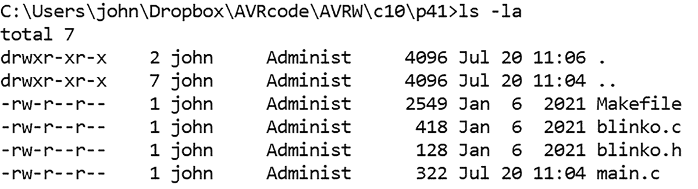
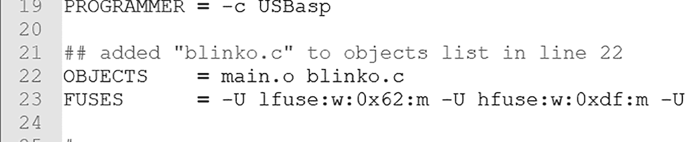
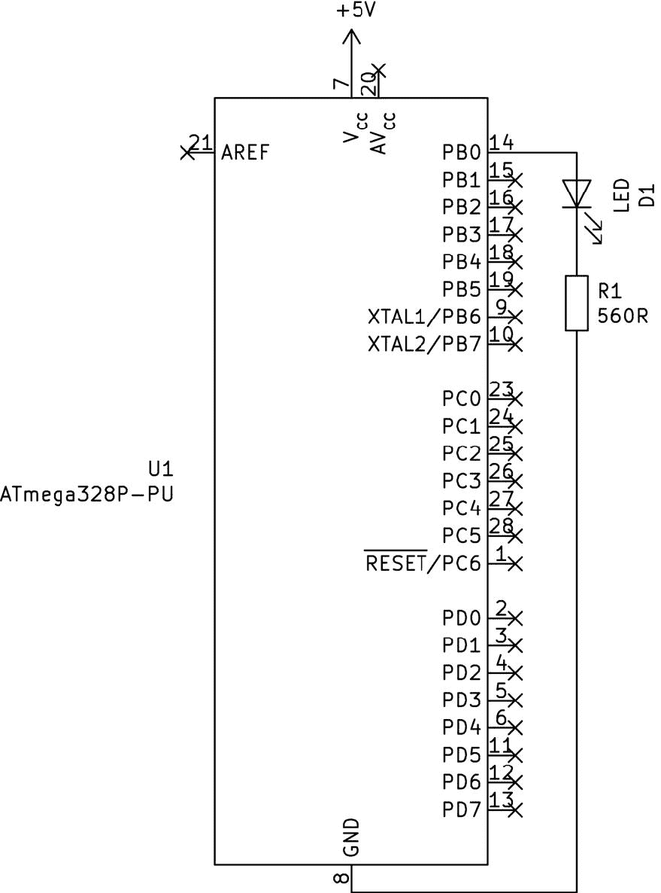
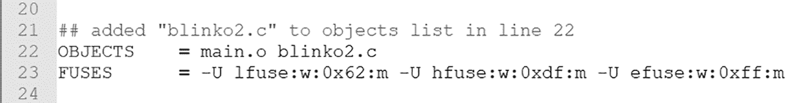
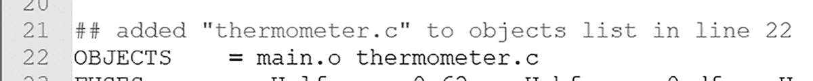
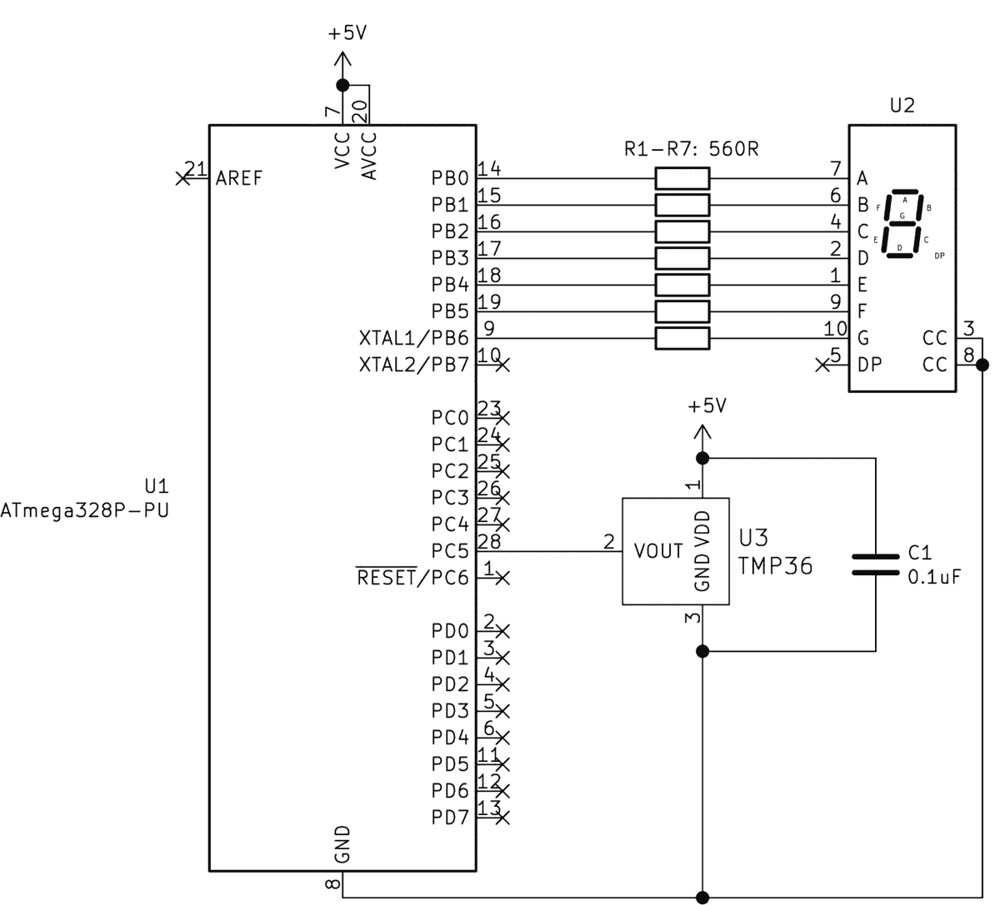

# 第十章：# 编写你自己的 AVR 库


回想一下项目 15 中的内容，它要求我们将 TMP36 温度传感器测量的电压转换为摄氏度。在完成这些计算时，我们调用了数学库，并使用了其中的函数对浮点数进行操作。使用这个库意味着我们不必自己编写数学函数或将其代码包含在项目中，从而节省了时间和精力。

在本章中，你将学习如何创建自己的库，从而在多个项目中复用已测试的函数，提高工作效率。你将构建一个用于重复任务的简单库，一个接受值以执行功能的库，以及一个处理来自传感器的数据并以易于使用的形式返回值的库。这些示例将帮助你掌握制作自定义库所需的技能。

## 创建你的第一个库

在这一节中，你将创建你的第一个库，随后你将在项目 41 中使用它。首先，考虑列表 10-1 中定义的函数，`blinkSlow()` 和 `blinkFast()`。这两个函数分别以慢速或快速的频率使 LED（通过一个电阻连接在 PORTB0 和 GND 之间）闪烁。

```

      #include <avr/io.h>

      #include <util/delay.h>

      void blinkSlow()

      {

      uint8_t i;

      for (i = 0; i < 5; i++)

      {

      PORTB |= (1 << PORTB0);

      _delay_ms(1000);

      PORTB &= ~(1 << PORTB0);

      _delay_ms(1000);

      }

      }

      void blinkFast()

      {

      uint8_t i;

      for (i = 0; i < 5; i++)

      {

      PORTB |= (1 << PORTB0);

      _delay_ms(250);

      PORTB &= ~(1 << PORTB0);

      _delay_ms(250);

      }

      }

      int main(void)

      {

      DDRB |= (1 << PORTB0); // Set PORTB0 as outputs

      while (1)

      {

      blinkSlow();

      _delay_ms(1000);

      blinkFast();

      _delay_ms(1000);

      }

      }

```

列表 10-1：示例代码，展示了两个函数，分别使 LED 以慢速和快速闪烁

用于缓慢或快速闪烁 LED 的自定义函数很方便，但每次想要使用时都将它们输入到项目代码中并不高效。然而，如果将描述这些函数的代码转移到库中，你可以在未来的项目中通过一行代码调用该库，然后根据需要使用这些函数，而无需重新编写它们。现在让我们创建一个这样的库。

### 库的构成

一个库由两个文件组成：*library.h*，头文件，和 *library.c*，源文件，其中“library”是个占位符，代表某个具体库的名称。我们将第一个示例库称为 *blinko* 库，因此我们的两个文件将是 *blinko.h* 和 *blinko.c*。

头文件包含库中函数、变量或其他组件的定义。以下是我们的头文件：

```

      // blinko.h

      void blinkSlow();

      // Blinks PORTB0 slowly, five times

      void blinkFast();

      // Blinks PORTB0 rapidly, five times

```

该文件声明了库中两个函数的名称，`void blinkSlow()` 和 `void blinkFast()`。每行后面都有一个注释，描述了函数的目的。养成在库中的自定义函数旁边加上类似注释的习惯。

我们的源文件包含了代码，当我们包含这个库时，它将提供给项目 41 中的主代码：

```

      // blinko.c

      ❶ #include <avr/io.h>

      #include <util/delay.h>

      ❷ void blinkSlow()

      {

      uint8_t i;

      for (i = 0; i < 5; i++)

      {

      PORTB |= (1 << PORTB0);

      _delay_ms(1000);

      PORTB &= ~(1 << PORTB0);

      _delay_ms(1000);

      }

      }

      ❸ void blinkFast()

      {

      uint8_t i;

      for (i = 0; i < 5; i++)

      {

      PORTB |= (1 << PORTB0);

      _delay_ms(250);

      PORTB &= ~(1 << PORTB0);

      _delay_ms(250);

      }

      }

```

*blinko.c* 文件与 清单 10-1 中的第一部分相同。我们首先在我们自己的库中包含代码所需的其他库 ❶——这使得我们能够使用 I/O 函数和 `_delay_ms()`。然后，我们添加了自定义函数 `blinkSlow()` ❷ 和 `blinkFast()` ❸，它们将包含在库中。

### 安装库

为了让库可以在 项目 41 的主代码中使用，我们需要做两件事。首先，我们将头文件和源文件复制到与 *main.c* 文件和 Makefile 位于同一项目目录中，如 图 10-1 中的目录列表所示。你可以在本书 *第十章* 文件夹的 *项目 41* 子文件夹中找到这些文件。



图 10-1：将库文件放置在与项目文件相同的目录中。

第二，我们编辑项目的 Makefile，使得工具链知道在编译代码并上传到微控制器时需要查找库。为此，我们将 `blinko.c` 添加到 Makefile 中 `OBJECTS` 行的 `main.o` 后，如 图 10-2 所示。



图 10-2：将 *blinko.c* 库添加到 项目 41 的 Makefile 中

现在我们已经安装了库，让我们通过用它来编程一个简单的电路来测试它。

项目 41：你的第一个库

你将需要以下硬件来完成这个项目：

+   • USBasp 编程器

+   • 无焊面包板

+   • ATmega328P-PU 微控制器

+   • 一个 LED

+   • 一个 560 Ω 电阻

按照 图 10-3 中的电路图，在面包板上组装电路。



图 10-3：项目 41 的原理图

保持这个电路完整，因为你将在 下一个项目 中再次使用它。

接下来，打开终端窗口，导航到本书 *第十章* 文件夹中的 *项目 41* 子文件夹，然后输入命令 `make flash`。LED 应该快速闪烁五次，然后慢慢闪烁五次，之后重复。

这个项目的代码相当简单：

```

      // Project 41 - Your First Library

      #include <avr/io.h>

      #include <util/delay.h>

      ❶ #include "blinko.h"   // Use our new library

      int main(void)

      {

      DDRB = 0b11111111; // Set PORTB as outputs

      for(;;)

      {

      ❷ blinkSlow();

      _delay_ms(1000);

      blinkFast();

      _delay_ms(1000);

      }

      return 0;

      }

```

首先，我们包含我们的新库 ❶。（注意，自定义库名称需要用引号括起来，而不是左右尖括号。）然后，我们利用库函数来让 LED 闪烁 ❷。

尽管这个项目是一个相对简洁的演示，但它展示了创建和使用自定义 AVR 库的基本过程。接下来，我们将看一些更复杂的示例。

## 创建一个接受值并执行功能的库

现在你已经知道如何创建一个基础库，接下来你可以进入下一个阶段：创建一个能够接受值并对其进行操作的库。我们将再次从一个示例函数开始，并将其转换为一个库。

考虑一下 列表 10-2 中的代码，它使用 `blinkType()` 函数来设置连接到 PORTB0 的 LED 闪烁的次数，以及开关的时间间隔。

```

      #include <avr/io.h>

      #define __DELAY_BACKWARD_COMPATIBLE__ // Required for macOS users

      #include <util/delay.h>

      void blinkType(int blinks, int duration)

      // blinks - number of times to blink the LED

      // duration - blink duration in milliseconds

      {

      uint8_t i;

      for (i = 0; i < blinks; i++)

      {

      PORTB |= (1 << PORTB0);

      _delay_ms(duration);

      PORTB &= ~(1 << PORTB0);

      _delay_ms(duration);

      }

      }

      int main(void)

      {

      DDRB |= (1 << PORTB0);             // Set PORTB0 as outputs

      while (1)

      {

      // Blink LED 10 times, with 150 ms duration

      blinkType(10, 150);

      _delay_ms(1000);

      // Blink LED 5 times, with 1 s duration

      blinkType(5, 1000);

      _delay_ms(1000);

      }

      }

```

列表 10-2：一个示例代码，展示了我们的 LED 闪烁函数，它将被转换为一个库

如你所见，`blinkType()` 接受两个值并对其进行操作。`blinks` 值是你希望开启和关闭板载 LED 的次数，而 `duration` 值是每次闪烁的延迟时间（以毫秒为单位）。让我们将其转化为一个名为 *blinko2* 的库。

首先，我们需要创建 *blinko2.h* 头文件，该文件包含库中使用的函数和变量的定义：

```

     // blinko2.h

     void blinkType(int blinks, int duration);

     // blinks - number of times to blink the LED

     // duration - blink duration in milliseconds

```

如前所述，我们在库中声明函数的名称，并随后添加注释描述其用途。在本例中，我们提供了描述函数参数的注释。

接下来，我们构建我们的 *blinko2.c* 源文件：

```

     // blinko2.c

     ❶ #include <avr/io.h>

     ❷ #define __DELAY_BACKWARD_COMPATIBLE__

     #include <util/delay.h>

     ❸ void blinkType(int blinks, int duration)

     // blinks - number of times to blink the LED

     // duration - blink duration in milliseconds

     {

     uint8_t i;

     for (i = 0; i < blinks; i++)

     {

     PORTB |= (1 << PORTB0);

     _delay_ms(duration);

     PORTB &= ~(1 << PORTB0);

     _delay_ms(duration);

     }

     }

```

源文件包括操作我们库所需的库 ❶，然后是我们库的函数 ❸，与以往一样。❷ 行是为那些使用 Apple 电脑的用户准备的，因为编译器的版本稍有不同。

下一步是编辑我们将使用此库的项目的 Makefile，你可以在本书的 *第十章* 文件夹的 *Project 42* 子文件夹中找到它。在 `OBJECTS` 行的 `main.o` 后面添加库名 `blinko2.c`，如 图 10-4 所示。



图 10-4：将 *blinko2.c* 库添加到 项目 42 的 Makefile 中

现在你已经设置好了库，让我们来测试一下。

项目 42：使用 blinko2.c 库

你可以使用你为 项目 41 组装的硬件来完成这个项目。打开终端窗口，进入本书 *第十章* 文件夹的 *Project 42* 子文件夹，并输入命令 `make flash`。LED 应该快速闪烁 10 次，然后慢速闪烁 5 次，之后重复。

让我们看看这是如何实现的：

```

     // Project 42 - Using the blinko2.c Library

     #include <avr/io.h>

     #include <util/delay.h>

     ❶ #include "blinko2.h"  // Use our new library

     int main(void)

     {

     DDRB = 0b11111111; // Set PORTB as outputs

     for(;;)

     {

     // Blink LED 10 times, with 150 ms duration

     ❷ blinkType(10, 150);

     _delay_ms(1000);

     // Blink LED 5 times, with 1 s duration

     ❸ blinkType(5, 1000);

     _delay_ms(1000);

     }

     return 0;

     }

```

与之前一样，我们包含了新的库 ❶，然后使用该库的函数，以短时间间隔快速闪烁 LED ❷，再以较长时间间隔慢速闪烁 ❸。同样，这只是一个简单的示范，给你提供了创建自己 AVR 库的框架，函数可以接受值。如果你想挑战自己，可以尝试基于第七章的示例代码，创建你自己的 PWM 库。

## 创建一个处理数据并返回值的库

在本章的最终项目中，你将学习如何创建一个可以将值返回到主代码的库。我们将创建一个“温度计”库，不仅能从模拟设备的 TMP36 温度传感器返回值，还包含一个简化在七段显示器上显示数字的函数。

我们的库源代码，你可以在本书*第十章*文件夹下的*项目 43*子文件夹中找到，包含两个函数：一个返回温度传感器中的摄氏度值作为浮动变量，另一个接受 0 到 99 之间的整数，在项目 15 的单数字 LED 显示器上显示。我们来看看*temperature.h*头文件，定义了库中使用的函数和变量：

```

     // thermometer.h

     void displayNumber(uint8_t value);

     // Displays a number between 0 and 99 on the seven-segment LED display

     float readTMP36();

     // Returns temperature from TMP36 sensor using ATmega328P-PU pin PC5

```

一如既往，我们声明了库内函数的名称，并提供了描述其用途的注释。请注意，`readTMP36()`函数的类型是`float`，而不是`void`，因为该函数会返回一个浮动的温度值给我们项目的主代码。

接下来，让我们查看一下我们的*thermometer.c*源文件：

```

     // thermometer.c

     ❶ #include <avr/io.h>

     #include <math.h>

     #include <util/delay.h>

     ❷ float readTMP36()

     // Returns temperature from TMP36 sensor using ATmega328P-PU pin PC5

     {

     float temperatureC;

     float voltage;

     uint16_t ADCvalue;

     ADCSRA |= (1 << ADSC);                 // Start ADC measurement

     while (ADCSRA & (1 << ADSC) );         // Wait for conversion to finish

     _delay_ms(10);

     // Get value from ADC (which is 10-bit) register, store in ADCvalue

     ADCvalue = ADC;

     // Convert reading to temperature value (Celsius)

     voltage = (ADCvalue * 5);

     voltage = voltage / 1024;

     temperatureC = ((voltage - 0.5) * 100);

     ❸ return temperatureC;

     }

     ❹ void displayNumber(uint8_t value)

     // Displays a number between 0 and 99 on the seven-segment LED display

     {

     uint8_t tens=0;

     uint8_t ones=0;

     uint8_t delayTime=250;

     tens = value / 10;

     ones = value % 10;

     switch(tens)

     {

     case 0 : PORTB = 0b00111111; break; // 0

     case 1 : PORTB = 0b00000110; break; // 1

     case 2 : PORTB = 0b01011011; break; // 2

     case 3 : PORTB = 0b01001111; break; // 3

     case 4 : PORTB = 0b01100110; break; // 4

     case 5 : PORTB = 0b01101101; break; // 5

     case 6 : PORTB = 0b01111101; break; // 6

     case 7 : PORTB = 0b00000111; break; // 7

     case 8 : PORTB = 0b01111111; break; // 8

     case 9 : PORTB = 0b01101111; break; // 9

     }

     _delay_ms(delayTime);

     switch(ones)

     {

     case 0 : PORTB = 0b00111111; break; // 0

     case 1 : PORTB = 0b00000110; break; // 1

     case 2 : PORTB = 0b01011011; break; // 2

     case 3 : PORTB = 0b01001111; break; // 3

     case 4 : PORTB = 0b01100110; break; // 4

     case 5 : PORTB = 0b01101101; break; // 5

     case 6 : PORTB = 0b01111101; break; // 6

     case 7 : PORTB = 0b00000111; break; // 7

     case 8 : PORTB = 0b01111111; break; // 8

     case 9 : PORTB = 0b01101111; break; // 9

     }

     _delay_ms(delayTime);

     PORTB = 0; // Turn off display

     }

```

库中的所有代码现在对你应该都很熟悉了。首先，我们包含了用于我们库的必要库 ❶。`readTMP36()`函数 ❷返回摄氏度的温度，使用`return`函数 ❸，与项目 11 中解释的自定义函数类似，位于第三章 。`displayNumber(uint8_t value)`函数则在单数字 LED 显示器上显示 0 到 99 之间的整数 ❹。

如之前所示，为了使这个库可以在项目 43 中使用，我们将其添加到 Makefile 的第 22 行，如图 10-5 所示。



图 10-5：将*thermometer.c*库添加到项目 43 的 Makefile 中

现在，你已经准备好使用这个库来构建你的数字温度计。

项目 43：使用 thermometer.c 库创建数字温度计

在这个项目中，你将使用微控制器读取模拟温度传感器（TMP36），并利用 项目 15 的七段 LED 显示器一次显示一个数字的温度。

你将需要以下硬件：

+   • USBasp 编程器

+   • 无焊接面包板

+   • 5V 面包板电源

+   • ATmega328P-PU 微控制器

+   • 一个 TMP36 温度传感器

+   • 一个共阴极七段 LED 显示器

+   • 七个 560 Ω 电阻（R1–R7）

+   • 0.1 μF 陶瓷电容

+   • 跳线

按照 图 10-6 所示组装你的电路。



图 10-6: 项目 43 的电路图

请注意，项目的电源必须尽可能接近 5V，因为 TMP36 是一个模拟传感器，其输出与电源电压和温度有关。

现在打开终端窗口，导航到 *第十章* 文件夹中的 *项目 43* 子文件夹，并像往常一样上传 项目 43 的代码。完成后，你应该能在 LED 显示器上看到摄氏度温度——先显示左侧数字，再显示右侧数字。

让我们来看一下这是如何工作的：

```

     // Project 43 - Creating a Digital Thermometer with the thermometer.c Library

     ❶ #include <avr/io.h>

     #include <util/delay.h>

     #include "thermometer.h"                  // Use our new library

     ❷ void startADC()

     // Set up the ADC

     {

     ADMUX |= (1 << REFS0);                 // Use AVcc pin with ADC

     ADMUX |= (1 << MUX2) | (1 << MUX0);    // Use ADC5 (pin 28)

     ADCSRA |= (1 << ADPS1) | (1 << ADPS0); // Prescaler for 1MHz (/8)

     ADCSRA |= (1 << ADEN);                 // Enable ADC

     }

     int main(void)

     {

     ❸ float temperature;

     uint8_t finalTemp;

     ❹ startADC();

     ❺ DDRB = 0b11111111;                     // Set PORTB as outputs

     for(;;)

     {

     ❻ temperature = readTMP36();          // Get temperature from sensor

     finalTemp = (int)temperature;

     ❼ displayNumber(finalTemp);

     _delay_ms(1000);

     }

     return 0;

     }

```

现在，我们已经将测量和计算代码放入温度计库，你可以看到主代码是多么简单。我们首先包含所需的库 ❶，并定义启动 ADC 的函数 ❷。在代码的主要部分，我们声明了两个变量 ❸，用于存储温度库中的值并传递给 `displayNumber()` 函数。我们为 TMP36 温度传感器启动 ADC ❹，然后设置 PORTB 上的引脚为 LED 显示器的输出 ❺。

最后，我们通过温度计库中的 `readTMP36()` 函数从传感器获取温度，将其转换为整数，并显示在 LED 显示器上 ❼。

作为另一个挑战，看看你能否修改 `readTMP36()`，使其能够返回摄氏度或华氏度的温度，或者自己制作一个 ADC 初始化或 PWM 库，或者简化 `displayNumber(uint8_t value)` 中的数字显示代码。不管你选择哪个，我希望你能看到将自己的自定义函数转化为便捷库是多么容易。这是你编程工具箱中的一个关键工具。

在 下一章 中，你将学习如何通过 SPI 数据总线使用更多有趣且实用的组件，包括 LED 显示驱动器、移位寄存器和模拟到数字转换器。
