# 第十一章：# AVR 和 SPI 总线


我们可以宽泛地将*总线*定义为连接两个设备的连接，允许我们将数据从一个设备发送到另一个设备。例如，有几种类型的数据总线可以将您的 AVR 微控制器连接到传感器或显示设备。本章介绍了*串行外设接口(SPI)总线*，我们用它来直接在主设备和一个或多个从设备之间发送数据字节。

在本章中，您将学习如何：

+   • 使用 AVR 微控制器实现 SPI 总线。

+   • 阅读 SPI 设备数据表以便编写匹配的代码。

+   • 向您的项目添加复位按钮。

+   • 在同一个项目中使用两个不同的基于 SPI 的设备。

在此过程中，您还将学习如何使用 74HC595 移位寄存器 IC 来增加可用的数字输出引脚数量，使用 MAX7219 LED 显示驱动器 IC 显示八位数字，以及使用 MCP3008 ADC IC 测量电压。

## 总线工作原理

SPI 总线使 AVR 微控制器与许多流行的部件和传感器之间进行通信。它的工作原理类似于我们在第四章和第九章中使用的 USART，通过一个线路从微控制器传输数据，通过另一个线路传输数据到微控制器。但是，SPI 总线还使用第三条连接：*时钟线*，它携带一个电信号，以恒定频率开关。每当时钟从高电平变为低电平或低电平变为高电平时，数据位（*开*或*关*）通过数据线从或向微控制器发送。时钟信号与数据信号同步，允许快速而准确的数据传输。

我们可以使用 DSO 演示数据和时钟线的状态变化。例如，参考图 11-1，显示了沿 SPI 总线传输的一个字节数据。

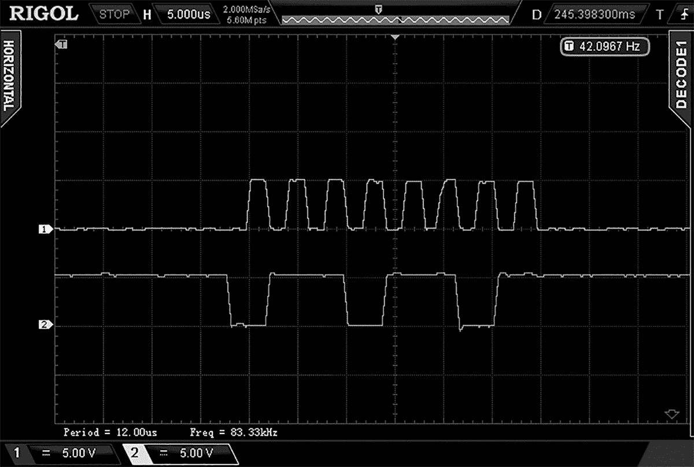

图 11-1：显示沿 SPI 总线传输的一个字节数据的 DSO

在图 11-1 中，上部波形（左边缘标有 1）是时钟信号，在使用 SPI 总线时激活。信号从 0 V 开始，上升到 5 V，然后返回 0 V，如果正在传输数据，则重复此模式。下部波形（标有 2）表示数据，其中 1 是 5 V 信号，0 是 0 V 信号。从右到左发送的数据是 10110110。

SPI 总线可以同时发送和接收数据，并且可以根据所使用的微控制器或基于 SPI 的设备以不同的速度进行通信。与 SPI 总线的通信采用*主从*配置：AVR 充当*主设备*，并确定在给定时间将与哪个设备（*从设备*）进行通信。

在本书中，我们将使用 ATmega328P-PU 微控制器进行使用 SPI 总线的项目，因为 ATtiny85 的内存或输出引脚不足以运行这些项目。

### 引脚连接和电压

每个 SPI 设备使用四个引脚与主设备进行通信：

+   • MOSI（主输出，从输入）

+   • MISO（主输入，从输出）

+   • SCK（时钟）

+   • SS（从选择，也称为“锁存”）

这些 SPI 引脚与微控制器的连接如 图 11-2 所示。

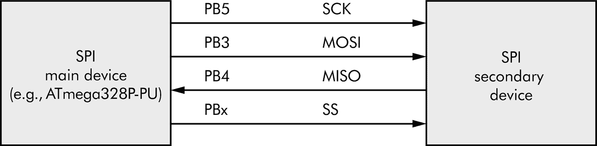

图 11-2：典型的 AVR 到 SPI 设备连接

SPI 主设备上的 SS 引脚在 图 11-2 中标记为 PBx；您可以使用任何空闲的 GPIO 引脚，但为了简便，最好使用 PORTB 上的空闲引脚，因为该连接会靠近 SPI 引脚。不同的制造商通常会使用自己独特的术语来描述 SPI 总线连接，但在快速检查后，这应该容易理解。

由于我们的 AVR 在以下项目中运行于 5 V 电压，因此您的 SPI 设备必须也能在 5 V 下运行或承受 5 V 操作，请在使用前务必向卖家或制造商确认。如果您必须使用在较低电压下工作的 SPI 设备（如 3.3 V），可以使用如 PMD Way 编号 441079 的*电平转换器*，如 图 11-3 所示。电平转换器可以将 5 V 数字信号转换为 3.3 V 信号，反之亦然。

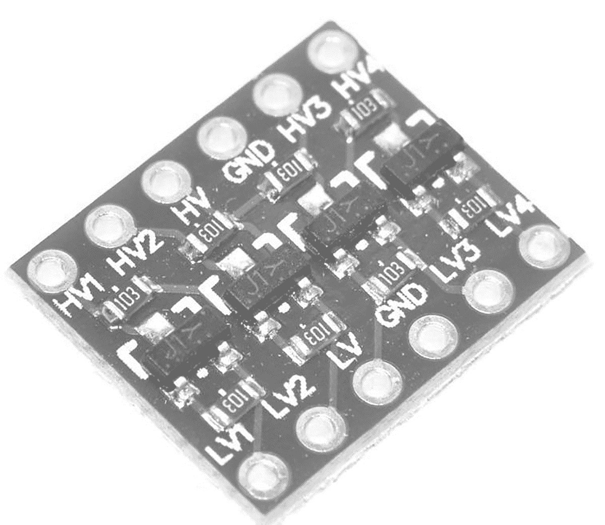

图 11-3：PMD Way 编号 441079

这是一个四通道电平转换器板，意味着它可以在同一板上转换四个独立的电气信号。使用电平转换器时，将它连接到 SPI 总线的四根线路之间：将 5 V 线路连接到 HV 引脚，将匹配的较低电压线路连接到 LV 引脚，并将两侧的 GND 引脚连接到板上。上传代码后，请记得断开您的 USBasp 编程器与项目的连接，因为编程器的引脚与 SPI 引脚共享，有时会干扰微控制器与基于 SPI 的设备之间的数据流。

### 实现 SPI 总线

接下来，让我们研究如何在代码中实现 SPI 总线，以及如何进行硬件连接。我将向你展示一个示例 SPI 部件的参数，然后展示如何调整 图 11-4 中显示的 SPI 控制寄存器（SPCR），以激活 SPI 总线并设置为我们需要的参数。在接下来的项目中，我还将向你展示如何为各种其他 SPI 部件进行相应操作。

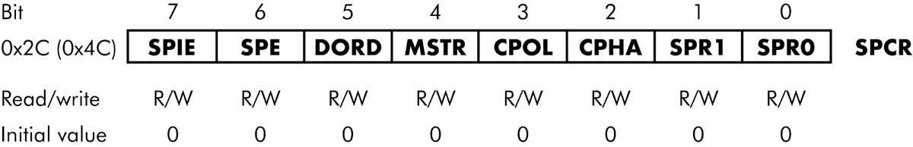

图 11-4：来自 ATmega328P-PU 数据手册的 SPCR 图

将 SPIE 保持为 0，因为我们不使用中断，并将 SPE 设置为 1 以启用 SPI 总线。接下来，考虑 DORD 位，它决定数据字节是先发送 MSB（最高有效位，字节的第 7 位）还是 LSB（最低有效位，字节的第 0 位）。你需要根据从设备的数据手册来确定方向，手册中通常会包含像 图 11-5 这样的时序图，或者提供商会提供相应的说明。

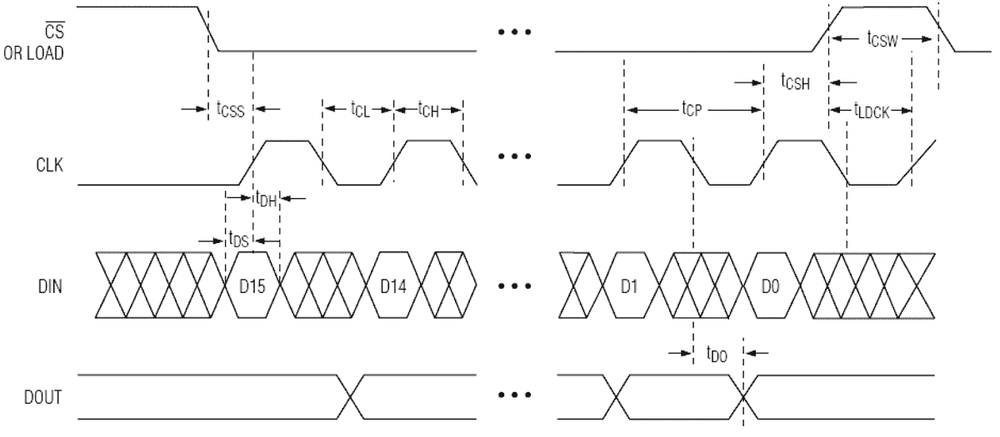

图 11-5：SPI 设备（MAX7219）的示例时序图

查看时序图中的 DIN 线。数据沿总线传输，MSB（最高有效位）先传输。如果 D0 在线的起始位置，则 LSB（最低有效位）会先传输。将 DORD 设置为 1 时表示 LSB 先传输，设置为 0 时表示 MSB 先传输。

回到 SPCR，设置 MSTR 为 1，以启用微控制器作为主设备，如果需要启用微控制器作为从设备，则设置为 0。对于我们所有的项目，我们将使用 1。接下来，设置 CPOL 以匹配 SPI 总线中时钟（SCK）信号在空闲时的极性（即在数据传输前后）：0 为低信号，1 为高信号。同样，你可以从时序图中获得此信息：在 图 11-5 中，CLK（或时钟/SCK）线在未使用时为低电平，然后在数据的第一位到达时上升，随后交替变化直到数据传输完成，再次降到低电平，因此对于此设备，你应该将其设置为 0。

CPHA，即时钟相位位，决定数据是采样在时钟位的开始还是结束。例如，查看 图 11-5 中的 CLK 和 DIN 线。数据在时钟位的开始处被采样，因为时钟信号在数据位的开始时上升。在这种情况下，你应将 CPHA 设置为 0。如果数据位在时钟位结束时开始，CPHA 应为 1。

最后，你将使用最后两个比特，SPR1 和 SPR0，结合起来设置时钟速度以及 SPI 总线上的数据匹配信号。将这两个比特设置为 0，以获得相对于微控制器的最大速度。同时，使用 `DDR` `x` 函数将连接到 SPI 设备 SS 引脚的 AVR 输出引脚设置为输出，然后使用典型的 `PORT` `x` 函数将该引脚设置为高电平。

### 发送数据

现在你已经初始化了 SPI 总线，它应该能够准备好接收和发送数据。我们将首先练习发送数据，然后在本章后面探讨接收数据。要向 SPI 设备发送一个数据字节，你需要做四件事（所有这些我们将在下一个项目中完成）：

+   • 使用`PORT` `x`命令将 SS 引脚设置为低电平。

+   • 将你希望发送的数据字节放入 SPDR 寄存器中。

+   • 使用`while(!(SPSR & (1<<SPIF)));`等待传输完成。

+   • 使用`PORT` `x`命令将 SS 引脚设置为高电平。

这可能看起来有点复杂，但通过练习和从零部件供应商获得正确的信息，实际上是很简单的。我将解释你构建 SPI 总线项目所需的所有知识，第一个项目使用了一个特别有用的移位寄存器 IC。

项目 44：使用 74HC595 移位寄存器

当你的基于 AVR 的项目没有足够的数字输出引脚时，你可以连接一个或多个*移位寄存器*，并且仍然可以为 AVR 本身提供足够的输出引脚。移位寄存器是一种集成电路，具有八个数字输出引脚，我们可以通过 SPI 总线向该 IC 发送一个数据字节来控制它。我们本章的项目将使用 74HC595 移位寄存器，如图 11-6 所示。

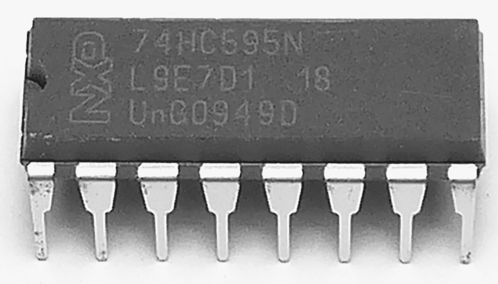

图 11-6：74HC595 移位寄存器 IC

74HC595 移位寄存器具有八个数字输出，它们的工作方式与 AVR 的数字输出相同，如图 11-7 所示。

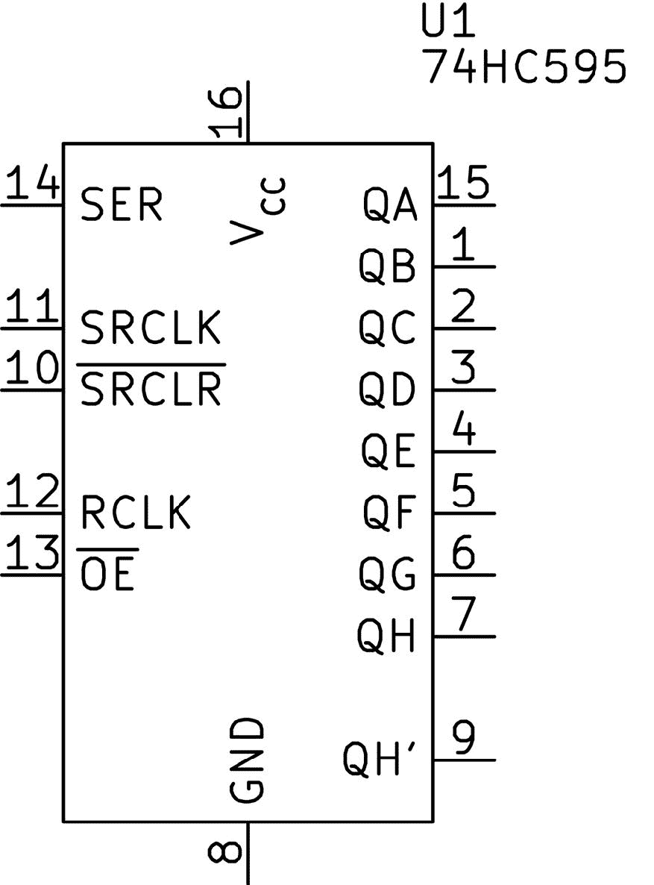

图 11-7：74HC595 电路符号

表 11-1 提供了如何将移位寄存器连接到微控制器的详细信息。

| 表 11-1：74HC595 连接 |
| --- |
| 引脚 | 连接 |
| --- | --- |
| 16 | 5 V 正电源 |
| 8 | 地（GND） |
| QA 到 QH（15, 1–7） | 数字输出 0 到 7 |
| 10 | 5 V 正电源 |
| 11 | SPI 总线时钟 |
| 12 | SPI SS |
| 13 | 地（GND） |
| 14 | SPI 数据输入 |
| 9 | SPI 数据输出 |

移位寄存器背后的原理很简单：我们向移位寄存器发送 1 个数据字节（8 位），移位寄存器根据这个字节数据将匹配的八个输出引脚打开或关闭。表示字节的位按照从最高到最低的顺序匹配输出引脚。因此，数据的 MSB（最高有效位）代表移位寄存器的输出引脚 7，而 LSB（最低有效位）代表输出引脚 0。例如，如果我们通过 SPI 总线向移位寄存器发送字节`0b10000110`，它将打开引脚 7、2 和 1，并且会关闭引脚 0 和引脚 3-6，直到移位寄存器接收到下一个数据字节，或者我们关闭电源。

一旦你向移位寄存器发送了新的数据字节，它会通过 SPI 引脚 9（数据输出引脚）将前一个数据字节发送出去。因此，你可以通过一次操作发送多个字节的数据来控制多个移位寄存器。

注意：你通常可以从输出引脚拉取最多 20 mA 的电流，整个 74HC595 所消耗的总电流不应超过 75 mA。

每连接一个移位寄存器到 SPI 总线，你就会获得额外的八个数字输出引脚。当你需要控制大量 LED 或其他设备时，移位寄存器非常方便。在这个项目中，我们将使用它来控制一个七段数码 LED 显示器。

### 硬件

为了构建你的显示电路，你需要以下硬件：

+   • USBasp 编程器

+   • 无焊面包板

+   • 5 V 面包板电源

+   • ATmega328P-PU 微控制器

+   • 一个 74HC595 移位寄存器 IC

+   • 一个共阴极七段 LED 显示屏

+   • 八个 560 Ω电阻（R1–R8）

+   • 跳线

按照图 11-8 所示组装你的电路。

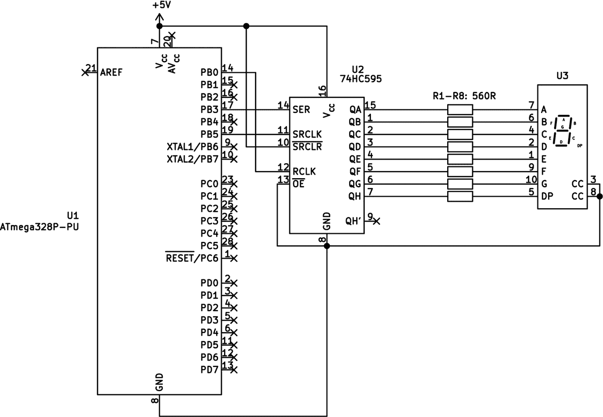

图 11-8：项目 44 的原理图

### 代码

打开终端窗口，导航到本书*第十一章*文件夹中的*项目 44*子文件夹，然后输入命令`make flash`进行编译并上传数据，和往常一样。上传到微控制器后，别忘了断开编程器。稍等片刻，LED 显示器上应该会按顺序显示从 0 到 9 的数字，然后重复。

让我们查看代码，看看它是如何工作的：

```

      // Project 44 - Using the 74HC595 Shift Register

      #include <avr/io.h>

      #include <util/delay.h>

      ❶ void setupSPI()

      {

      PORTB |= (1 << 0); // SS pin HIGH

      // Set up SPI bus

      SPCR = 0b01110000;

      }

      ❷ void dispNumSR(uint8_t value)

      // Displays a number from 0–9 on the seven-segment LED display

      {

      // SS pin LOW

      ❸ PORTB &= ~(1 << PORTB0);

      switch(value)

      // Determine which byte of data to send to the 74HC595

      {

      case 0 : SPDR = 0b11111100; break; // 0

      case 1 : SPDR = 0b01100000; break; // 1

      case 2 : SPDR = 0b11011010; break; // 2

      case 3 : SPDR = 0b11110010; break; // 3

      case 4 : SPDR = 0b01100110; break; // 4

      case 5 : SPDR = 0b10110110; break; // 5

      case 6 : SPDR = 0b10111110; break; // 6

      case 7 : SPDR = 0b11100000; break; // 7

      case 8 : SPDR = 0b11111110; break; // 8

      case 9 : SPDR = 0b11100110; break; // 9

      }

      ❹ while(!(SPSR & (1<<SPIF)));          // Wait for SPI transmission to finish

      // SS pin HIGH

      PORTB |= (1 << PORTB0);

      }

      int main(void)

      ❺ {

      uint8_t i=0;

      DDRB = 0b11111111;                   // Set PORTB as outputs

      setupSPI();

      while (1)

      {

      for (i=0; i<10; i++)

      {

      dispNumSR(i);

      _delay_ms(250);

      }

      }

      }

```

代码中包含几个自定义函数，第一个是`setupSPI()` ❶。我们使用这个函数来初始化 SPI 总线，并将 SS 引脚设置为高电平，然后按照本章前面解释的内容设置 SPCR 寄存器。我们将 SPCR 寄存器中的 DORD 位设置为 1，因为我们需要按 LSB 优先的顺序向 74HC595 发送数据。我们可以从 74HC595 的数据手册中的时序图中看到需要使用 56LSB 优先的要求，如图 11-9 所示：Q [A]（第一个输出引脚）是第一个被设置为高电平的。

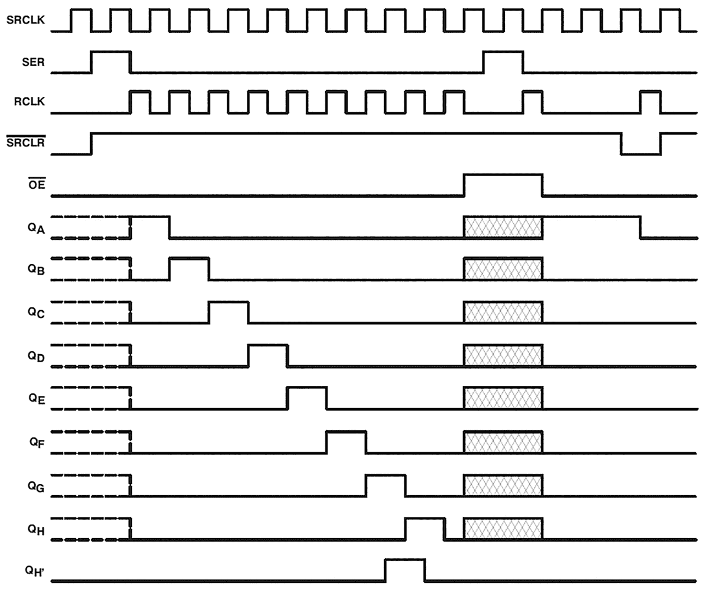

图 11-9：74HC595 的时序图

我们还需要确定 CPOL 位的值。我们将其设置为 0，因为时钟信号的极性在空闲时为低电平，或关闭。

最后需要考虑的是 CPHA，即前面提到的时钟相位位。如果你再次参考图示并比较 RCLK 时序与任何 Q 输出，你会发现它们同时从低变高。因此，数据在开始时被采样，所以我们将 CPHA 设置为 0。最后的两个位（1 和 0）我们将其设置为 0，以便将 SPI 总线设置为最大可能速度。

我们的第二个自定义函数，`dispNumSR()` ❷，接受一个介于 0 和 9 之间的整数，并在 LED 显示器上显示它。 它首先将 SS 引脚置低 ❸，然后使用 `switch...case` 语句确定要显示的数字的匹配数据字节。

微控制器将每个数据字节的最低位优先发送。 位对应于 74HC595 上的八个输出，我们将其连接到 LED 显示器段 A-G 和小数点，如 图 11-8 所示。 该数据字节然后在每个匹配的 `case` 语句中放入 SPDR 寄存器。 代码等待传输完成 ❹，然后将 SS 引脚置高以完成数据传输。

代码的主循环 ❺ 简单地将 PORTB 设置为输出，因为它包含我们需要的所有四个 SPI 总线连接引脚，然后调用 `setupSPI()` 函数设置 SPI 总线，如前所述。 然后，它向 LED 显示器发送数字 0 到 9。

我们项目中的小数点已连接，但未使用。 您可以使用发送到移位寄存器的字节的最后一位打开和关闭它。 为了挑战自己，请尝试修改 `dispNumSR()` 函数以接受第二个变量以控制小数点的开关。

现在您已经知道如何使用 SPI 总线控制单个设备，让我们尝试同时控制两个设备。

项目 45：使用两个 74HC595 移位寄存器

使用两个或更多移位寄存器是控制 AVR 的许多数字输出的廉价且简单的方法。 例如，该项目使用两个 74HC595 移位寄存器通过两个 LED 显示器显示双位数。

### 硬件

要构建您的显示电路，您将需要以下硬件：

+   • USBasp 程序员

+   • 无焊面包板

+   • 5 V 面包板电源

+   • ATmega328P-PU 微控制器

+   • 两个 74HC595 移位寄存器

+   • 两个共阴七段 LED 显示器

+   • 16 个 560 Ω 电阻（R1-R16）

+   • 跳线线

如 图 11-10 所示，组装您的电路。

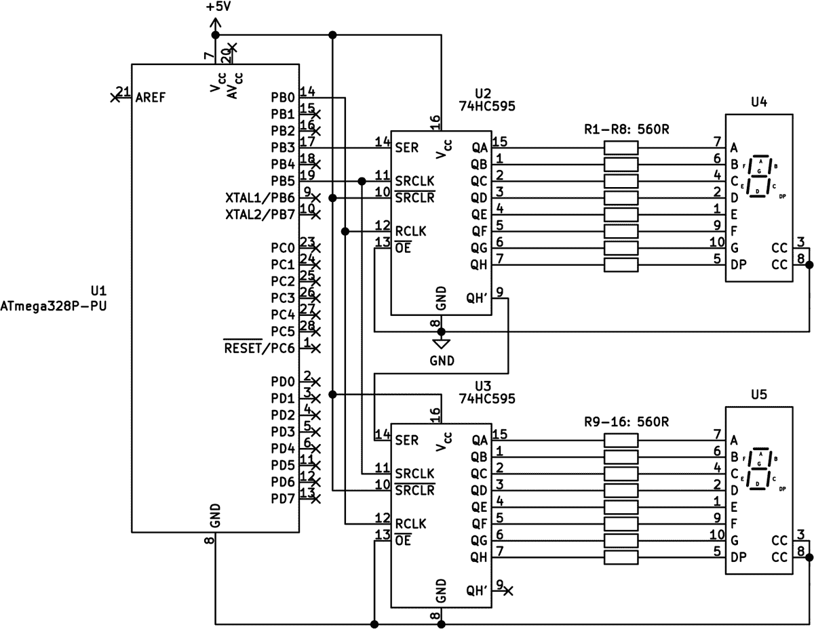

图 11-10：项目 45 的原理图

### 代码

打开终端窗口，导航到本书 *第十一章* 文件夹的 *Project 45* 子文件夹，并输入命令 `make flash` 编译和上传数据。 几秒钟后，LED 显示器上应显示从 0 到 99 的数字，然后重复。

让我们看看它是如何工作的：

```

      // Project 45 - Using Two 74HC595 Shift Registers

      #include <avr/io.h>

      #include <util/delay.h>

      void setupSPI()

      {

      PORTB |= (1 << 0);          // SS pin HIGH

      // Set up SPI bus

      SPCR = 0b01110000;

      }

      ❶ void dispNumSR(uint8_t value)

      // Displays a number from 00–99 on the seven-segment LED displays

      {

      uint8_t leftDigit;

      uint8_t rightDigit;

      ❷ uint8_t digitData[] = {0b11111100, 0b01100000, 0b11011010, 0b11110010, 0b01100110,

      0b10110110, 0b10111110, 0b11100000, 0b11111110, 0b11100110};

      ❸ leftDigit = value/10;

      rightDigit = value%10;

      ❹ PORTB &= ~(1 << PORTB0);    // SS pin LOW

      ❺ SPDR = digitData[rightDigit];

      ❻ while(!(SPSR & (1<<SPIF))); // Wait for SPI transmission to finish

      SPDR = digitData[leftDigit];

      while(!(SPSR & (1<<SPIF))); // Wait for SPI transmission to finish

      ❼ PORTB |= (1 << PORTB0);     // SS pin HIGH

      }

      int main(void)

      {

      uint8_t i=0;

      DDRB = 0b11111111;          // Set PORTB as outputs

      setupSPI();

      while (1)

      {

      for (i=0; i<100; i++)

      {

      dispNumSR(i);

      _delay_ms(250);

      }

      }

      }

```

这个双数字版本的代码与 项目 44 类似，唯一不同的是由于我们需要控制两个移位寄存器，因此它一次发送两个字节的数据。这一次，`dispNumSR()` 函数 ❶ 接受 0 到 99 之间的数字，然后通过除法和取模操作 ❸ 将数字拆分为单独的每一位，并将其存储在 `leftDigit` 和 `rightDigit` 变量中。

接下来，发送 SPI 数据的操作开始。我们将 SS 引脚设置为低电平 ❹，然后将表示数字 0 到 9 的字节（如 `digitData` 数组 ❷ 中指定）发送到移位寄存器 ❺ 中的右侧数字。等待 ❻ 字节传输完成后，我们以相同的方式发送左侧数字的字节数据。待传输完成后，代码将 SS 引脚设置为高电平 ❼，以完成数据传输。两个移位寄存器的 SS 引脚连接在一起，因此我们只需一个数字输出即可控制它们。

第二个（个位）数字的字节先被发送，因为它位于第二个移位寄存器——该字节首先放入第一个移位寄存器，然后个位字节发送后，将十位字节推入第二个移位寄存器。也就是说，第一个移位寄存器包含十位数字的数据，第二个移位寄存器包含个位数字的数据。一旦 SS 引脚被设置为高电平，移位寄存器的输出就会被激活，LED 显示屏开始显示数字。

虽然这个项目控制的是 LED 显示屏，但你现在已经具备了使用多个移位寄存器来扩展 AVR 输出端口的技能。在其他情况下，如果你需要控制更大的数字显示屏——最多可显示八位数字——下一个项目将非常适合你。

项目 46：使用 MAX7219 LED 驱动 IC

当你需要为一个项目使用两个以上的七段数字显示屏时，接线和相关控制可能会变得相当复杂。幸运的是，有一个解决方案：Maxim MAX7219 LED 驱动 IC，这是一款流行的 IC，可以同时控制多达 64 个 LED。反过来，我们可以使用这些 LED，通过 SPI 总线只需四根控制线，就能同时显示八个数字。这个项目展示了如何使用该显示模块。

### 硬件部分

MAX7219 提供两种封装类型：穿孔式（图 11-11）和表面贴装式（图 11-12）。

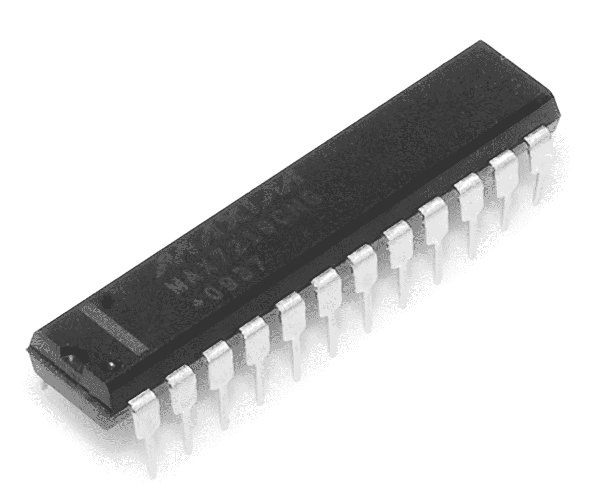

图 11-12：表面贴装类型的 MAX7219

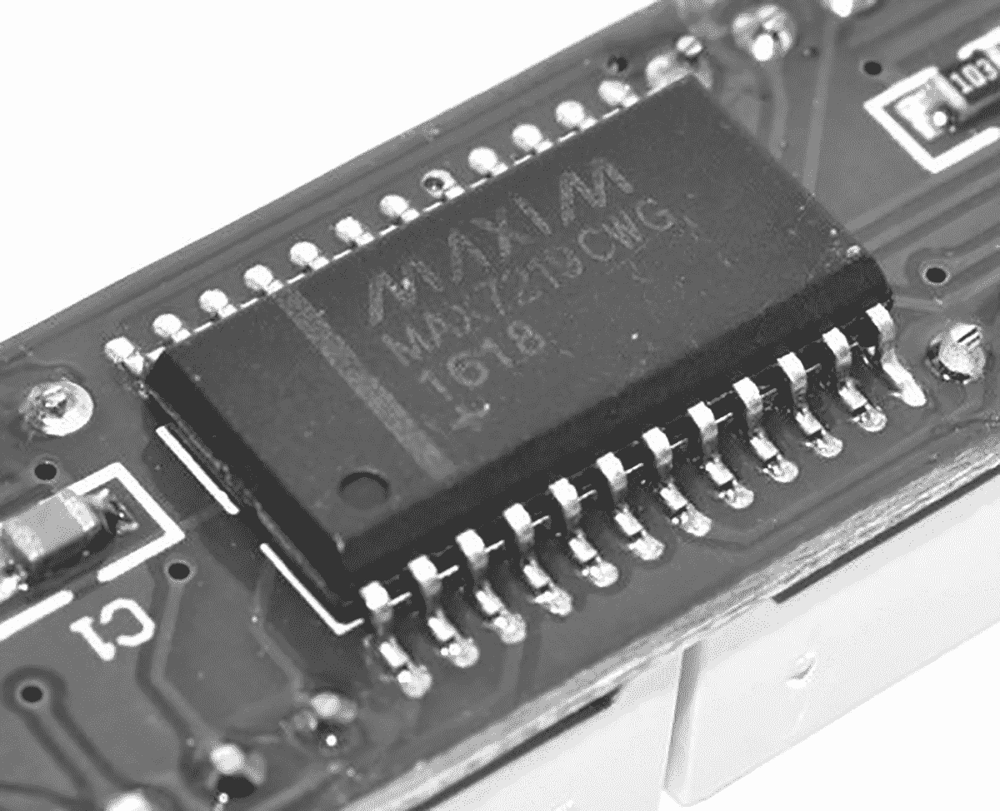

图 11-11：穿孔式类型的 MAX7219

穿孔版本在使用无焊面包板或制作自制手工焊接的印刷电路板（PCB）时最为实用。如果您难以找到 MAX7219，Allegro AS1107 是一个直接替代品。

如果您想控制大型数字显示屏，您可以轻松找到预先组装的模块，通常带有四到八个数字，且配备 MAX7219 模块。对于本项目，我们将使用一个八位模块，如图 11-13 所示。

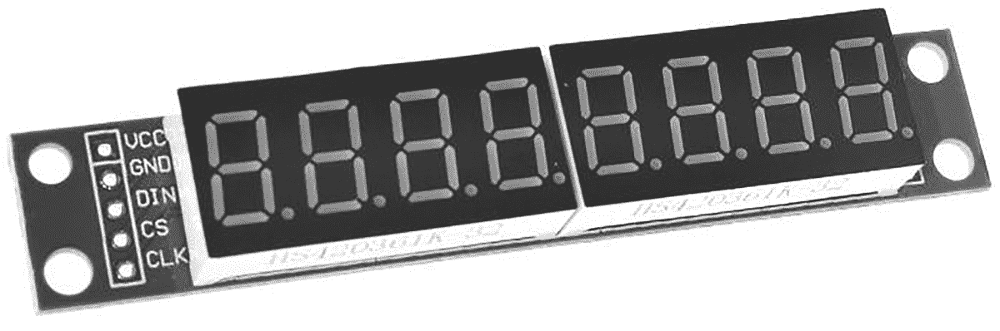

图 11-13：八位 LED 模块

这些模块使用 MAX7219 的表面贴装版本，焊接在模块 PCB 的背面。模块通常包括一些内联排针，以便连接控制线。如果您还没有做，请按照图 11-14 所示将这些排针焊接到模块上。

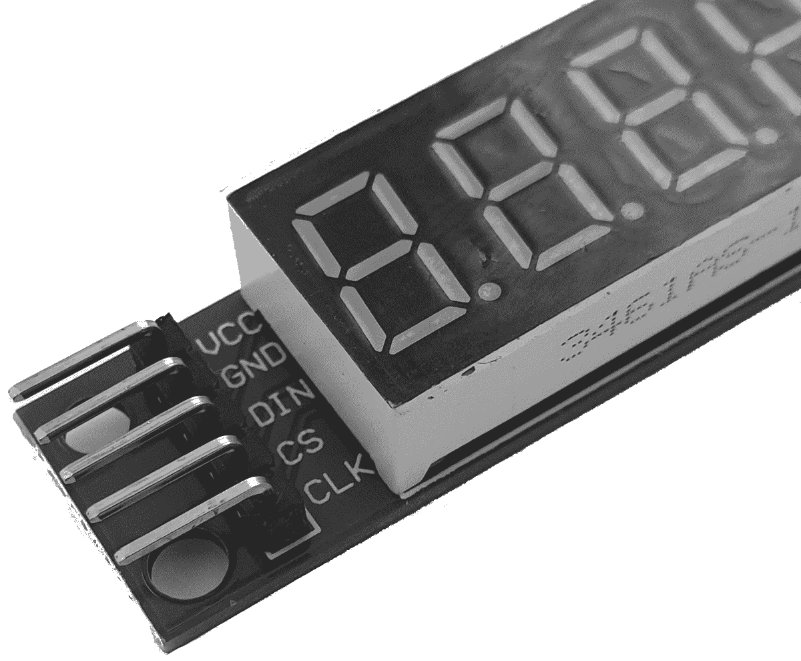

图 11-14：连接内联排针

要构建电路，您需要以下硬件：

+   • USBasp 编程器

+   • 无焊面包板

+   • 5 V 面包板电源

+   • ATmega328P-PU 微控制器

+   • MAX7219 八位模块

+   • 470 μF 16 V 电解电容器

+   • 跳线

按照图 11-15 所示，组装您的电路。

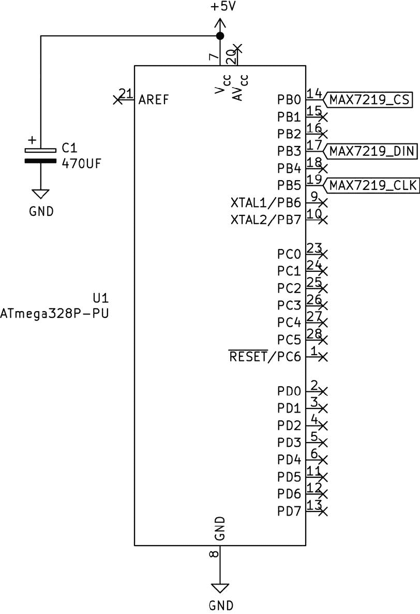

图 11-15：项目 46 的原理图

当您按照原理图构建电路时，按照表 11-2 所示连接显示模块。

| 表 11-2：ATmega328P-PU 与 MAX7219 的连接 |
| --- |
| ATmega328P-PU | MAX7219 模块 |
| --- | --- |
| 7 | V [cc] |
| 8 | GND |
| 17 | DIN |
| 14 | SS |
| 19 | CLK |

请注意，显示屏可能会快速绘制并停止绘制电流，这有时会影响电源电压。因此，我们使用一个 470 μF 的电解电容器来保持 5 V 电源平稳。您可以在第二章复习电容器的类型。

在我们深入研究代码之前，让我们考虑一下通过 SPCR 寄存器设置 SPI 所需的参数。从图 11-5 的 MAX7219 时序图中，我们可以看到，我们应该将 DORD 位设置为 0，因为 MAX7219 需要首先发送 LSB 数据。我们将 CPOL 位设置为 0，因为时钟信号在数据传输开始时为低电平，我们还将 CPHA 位设置为 0，因为时钟信号的极性在空闲时为低电平。

现在我们需要了解如何控制 MAX7219。每次我们希望 IC 执行某个操作时，都必须发送两字节数据。第一字节是控制寄存器的地址（其他 IC 也有寄存器，就像微控制器一样），第二字节是要存储在该寄存器中的值。这可能是显示亮度等设置配置，或者是表示要在某个数字上显示的数字值。

每个寄存器的可能值在 MAX7219 中使用十六进制数字（16 进制）表示，因此我们将使用这些数字以节省工作量。你可以将十六进制数字存储在 `char` 类型的变量中。为了方便你的参考和研究，你可以下载并查看 MAX7219 的数据手册，网址为 [`www.maximintegrated.com/en/products/power/display-power-control/MAX7219.html`](https://www.maximintegrated.com/en/products/power/display-power-control/MAX7219.html)。

### 代码

打开终端窗口，导航到本书的 第十一章 文件夹中的 项目 46 子文件夹，输入命令 `make flash` 来编译并上传数据，像往常一样。片刻之后，显示屏应该会显示八个零，然后向上计数，直到达到 9,999,999，然后重复。

让我们看看这是怎么做的：

```

      // Project 46 - Using the MAX7219 LED Driver IC

      #include <avr/io.h>

      #include <util/delay.h>

      ❶ void writeMAX7219(char hexdata1, char hexdata2)

      // Sends two bytes in hexadecimal to the MAX7219

      {

      PORTB &= ~(1 << PORTB0);    // SS pin LOW

      SPDR = hexdata1;            // Send value of hexdata1

      while(!(SPSR & (1<<SPIF))); // Wait for SPI transmission to finish

      SPDR = hexdata2;            // Send value of hexdata2

      while(!(SPSR & (1<<SPIF))); // Wait for SPI transmission to finish

      PORTB |= (1 << PORTB0);     // SS pin HIGH

      }

      ❷ void blankMAX7219()

      // Blanks all digits

      {

      uint8_t i;

      for (i=1; i<9; i++)         // Blank all digits

      {

      writeMAX7219(i,15);      // Send blank (15) to digit register (i)

      }

      }

      ❸ void initMAX7219()

      // Set up MAX7219 for use

      {

      PORTB |= (1 << 0);          // SS pin HIGH

      SPCR = 0b01010000;          // Set up SPI bus for MAX7219

      writeMAX7219(0x09,0xFF);    // Mode decode for digits

      writeMAX7219(0x0B,0x07);    // Set scan limit to 8 digits: 0x09 + 0xFF)

      writeMAX7219(0x0A,0x01);    // Set intensity to 8 - 0x0A + 0x08)

      writeMAX7219(0x0C,0x01);    // Mode display on

      blankMAX7219();

      }

      ❹ void dispMAX7219(uint8_t digit, uint8_t number, uint8_t dp)

      // Displays "number" in location "digit" with decimal point on/off

      // Digit: 1~8 for location 1~8

      // Number: 0~15 for 0~9, - E, H, L, P, blank

      // dp: 1 on, 0 off

      {

      ❺ if (dp==1)                  // Add decimal point

      {

      number = number + 128;

      }

      writeMAX7219(digit, number);

      }

      ❻ void numberMAX7219(uint32_t value)

      // Displays a number between 0–99999999

      uint8_t digits[9];

      uint8_t i = 1;

      for (i=1; i<9; i++)

      {

      ❼ digits[i]=15;            // Sending 15 blanks the digit

      }

      i = 1;

      while (value > 0)           // Continue until value > 0

      {

      digits[i] = value % 10;  // Determine and store last digit

      value = value / 10;      // Divide value by 10

      i++;

      }

      for (i=1; i<9; i++)

      {

      dispMAX7219(i, digits[i],0);

      }

      }

      int main(void)

      ❽ {

      uint32_t i;

      DDRB = 0b11111111;          // Set PORTB as outputs

      initMAX7219();

      while (1)

      {

      for (i = 0; i<100000000; i++)

      {

      numberMAX7219(i);

      _delay_ms(100);

      }

      }

      }

```

为了节省时间，我们使用一个自定义函数 `writeMAX7219(` `char hexdata1` `,` `char hexdata2` `)` ❶，通过 SPI 总线将两字节十六进制数据发送到 IC。此函数将 SS 引脚拉低，将第一字节数据分配给 SPDR 寄存器，等待传输完成，然后对第二字节重复相同过程，最后将 SS 引脚重新拉高。设置 SPI 总线之后，我们使用另一个自定义函数 `initMAX7219()` ❸ 将值放入四个配置寄存器来初始化 MAX7219。

在写入任何数字到显示屏之前，我们首先引入 `blankMAX7219()` 函数 ❷，确保每次写入时清空显示屏。如果没有这个函数，假设我们先写入 32,785，然后再写入 45，显示屏将会显示 32,745。

要在显示屏上显示一个数字，我们使用 `writeMAX7219()` 发送两字节数据。第一字节数据是数字的位置，从右到左（位置 0 到 7）。每个数字位置的地址恰好是位置加 1；例如，数字 5 的地址在十六进制中是 `0x06`。第二字节数据是要显示的实际数字。例如，要在我们的模块的最左边显示数字九，我们将发送 `0x08` 和 `0x09`，如下所示：

```

      writeMAX7219(0x08, 0x09);

```

如果方便的话，你也可以使用十进制数字或整数变量：

```

      writeMAX7219(8, 9);

```

你可以在 MAX7219 数据手册的表格 2 中查看数字位置的地址映射，并在表格 5 中查看可以显示的字符。

现在我们已经设置好`writeMAX7219()`函数来轻松地将数据写入 MAX7219，我们将在另一个函数中使用这个函数：`dispMAX7219(uint8_t digit, uint8_t number, uint8_t dp)` ❹。我们用它来在有无小数点的位置显示数字。将`dp`设置为 1 以显示小数点，或者设置为 0 以不显示。例如，要在模块的最右侧数字上显示没有小数点的数字 3，我们将使用：

```

      `dispMAX7219(1, 3, 0)` 

```

小数点通过向表示数字的字节添加 128（即十六进制的`0xF0`）来激活❺。

迄今为止提到的所有自定义函数都为我们最终的函数`numberMAX7219(` `uint32_t value` `)` ❻做了铺垫，该函数接受一个 0 到 99,999,999 之间的整数并在我们的显示模块上显示出来。该函数使用取模和除法将整个数字分解为单独的数字，并将它们放入数组中。然后，它遍历数组并将每个数字发送到显示器。

在函数的开始，我们用数字 15 填充数组❼。这是因为将 15 作为数字值发送给 MAX7219 会使 IC 清空被寻址的数字，从而避免显示未使用的数字的前导零。最后，代码的主循环❽设置了用于 SPI 的接口引脚为输出，并依次在 LED 显示屏上显示数字 0 到 99,999,999。

这看起来可能是一项大工程，但既然你已经掌握了轻松驱动这些较大数字显示器的工具，你可以在自己的项目中重用这些功能。如果你喜欢挑战，为什么不自己编写一个 MAX7219 库呢？与此同时，为了为后续项目做准备，我想介绍一下你 AVR 电路中的一个新组件。

项目 47：添加复位按钮

在本书的未来项目以及你自己的创作中，会有需要将项目复位的时刻，以便它能够像第一次开机时那样重新开始操作。为了实现这一点，你的项目将需要一个复位按钮，我们现在就来构建它。复位按钮节省时间，比断开电源再重新连接方便得多。

要在你的 AVR 项目中添加复位按钮，你将需要以下组件：

+   • 按钮

+   • 10 kΩ电阻

+   • 跳线

ATtiny85 的复位按钮电路见图 11-16。


图 11-16：ATtiny85 的复位按钮电路

图 11-17 显示了 ATmega328P-PU 的复位按钮电路。

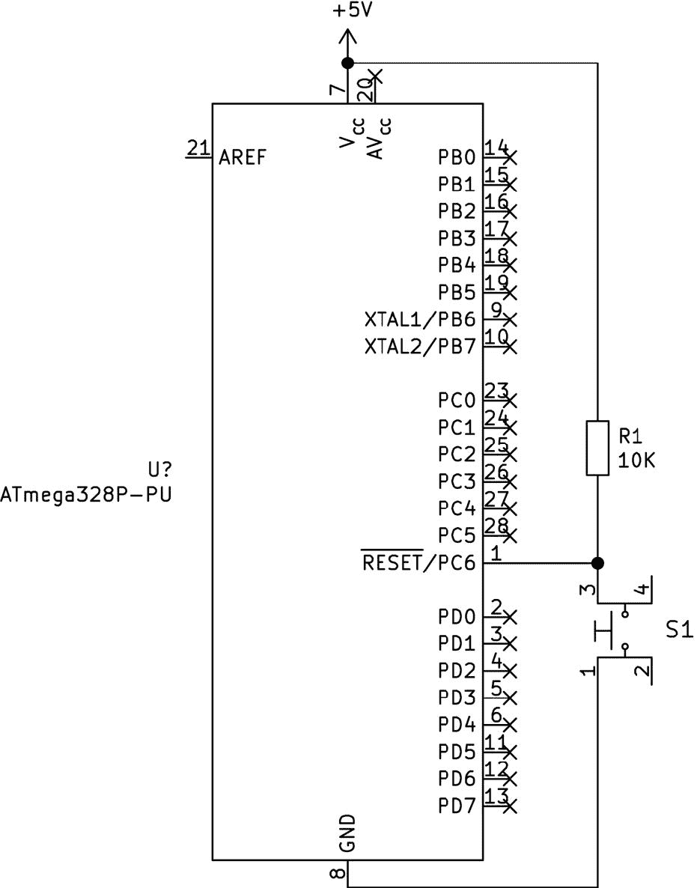

图 11-17：ATmega328P-PU 的复位按钮电路

如果你将其与第三章讨论的按钮进行对比，注意到接线上的区别。这种按钮配置，电阻连接在 5V 和 RESET 引脚之间，保持该引脚在正常操作时处于高电平状态，称为*上拉*配置。当用户按下按钮时，RESET 引脚被设置为低电平，因为按钮直接将引脚连接到 GND。

我们之所以使用这种上拉配置，是因为元件数据手册中的电路符号：RESET 引脚的标签上有一条实心条纹，而其他引脚的标签则没有。这条条纹意味着该引脚在正常操作时的默认输入为高电平，并且当该引脚被设置为低电平时，会激活该引脚所使用的功能。

你无需为项目添加任何代码来支持复位按钮——这只是一个简单的硬件添加。按钮设置好后，我们接下来将控制两个不同的 SPI 设备，并学习如何从 SPI 总线接收数据。这些部分将为我们本章的最终项目做准备，在该项目中我们将制作一个简单的数字电压表。

## 同一总线上的多个 SPI 设备

你可以在同一 SPI 总线上使用两个或更多不同的 SPI 设备，且这样做只需要为每个设备增加一个额外的数字输出引脚。只需将所有的 SCK、MOSI 和 MISO 引脚连接在一起，然后将 SS 引脚连接到 AVR 上的各自数字输出引脚。例如，图 11-18 展示了两个 SPI 设备在一条总线上，每个设备的 SS 线连接到独立的 PORTB 引脚。

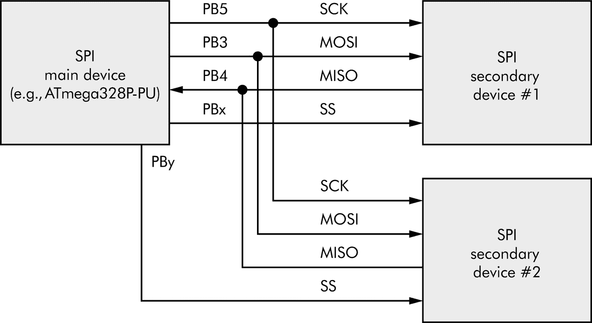

图 11-18：两个 SPI 设备连接到一个微控制器

当需要与特定的 SPI 设备通信时，只需使用适当的 SS 连接并按常规操作进行。我们将在下一个项目中进行此操作，该项目使用了来自项目 46 的 MAX7219 LED 显示器以及一个新设备。

## 从 SPI 总线接收数据

如前所述，我们通过将数据字节放入 SPDR 寄存器来从微控制器发送数据到 SPI 设备。从 SPI 设备接收数据字节需要两步操作：首先，我们正在通信的 SPI 设备发送一个数据字节，然后 AVR 将这个字节放入 SPDR 寄存器供我们使用。

因此，你可以将 SPI 总线看作是一个连续的数据循环，如图 11-19 所示。

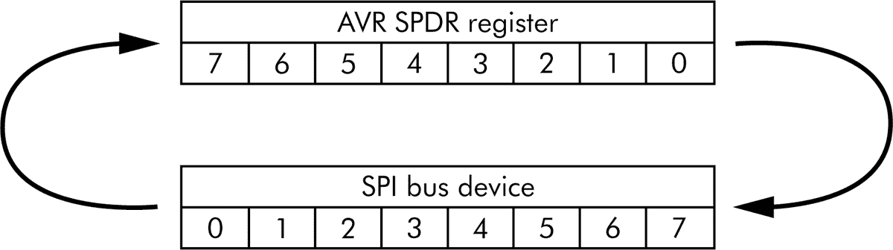

图 11-19：SPI 总线数据传输

当数据从微控制器离开并传送到 SPI 设备时，一位数据也从 SPI 设备离开并返回到 SPDR 寄存器。当你将一个完整的字节数据放入 SPDR 寄存器时，它会传送到 SPI 设备，推动数据从 SPI 设备推出并进入 SPDR 寄存器。

这意味着当你需要从 SPI 设备获取一个字节的数据时，你需要向该设备发送一个字节的数据，以“推动”数据从 SPI 设备返回到 SPDR 寄存器。你将在以下项目中看到这一过程的实现。

项目 48：使用 MCP3008 ADC 集成电路

在第三章中，你开始学习如何使用 AVR 内置的 ADC 引脚测量连接到外部设备（如电位器和温度传感器）的电压。然而，如果你想使用更多的 ADC 引脚，可能会出现 ADC 引脚和其他用途之间的冲突——也就是说，你可能已经计划将微控制器上用于 ADC 的引脚用于其他目的。一个替代方案是使用外部 ADC 集成电路，比如图 11-20 中展示的 Microchip MCP3008 8 通道 ADC 集成电路，它有八个 ADC 引脚。


图 11-20：Microchip MCP3008 8 通道 ADC 集成电路

这八个引脚中的每一个可以测量 0 V 到 5 V 的直流电压，并且每个引脚返回一个 10 位的测量值。MCP3008 易于使用，因为它连接到 SPI 总线，你无需担心其他非 SPI 总线的 AVR 寄存器进行设置或控制。请参阅图 11-21 中的原理图。

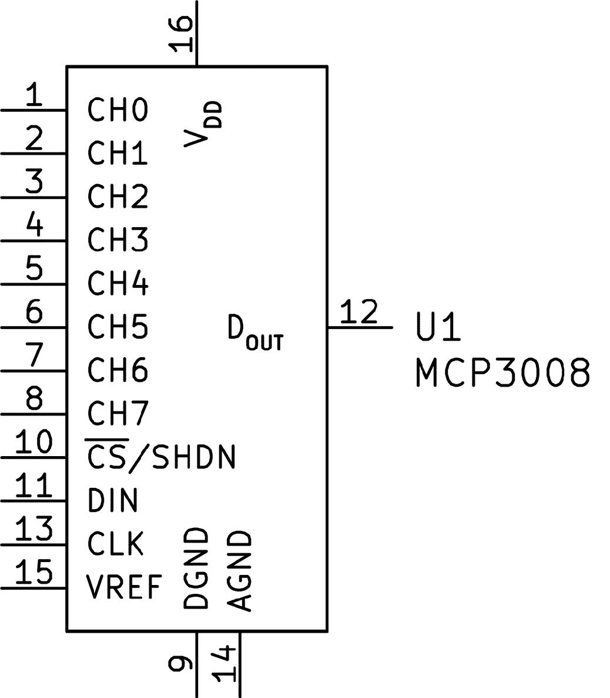

图 11-21：MCP3008 原理符号

要将 ATmega328P-PU 连接到 MCP3008，请遵循表 11-3 中的指南。

| 表 11-3：ATmega328P-PU 与 MCP3008 的连接 |
| --- |
| ATmega328P-PU | MCP3008 |
| --- | --- |
| 5 V | V [DD] |
| 5 V | V [REF] |
| GND | DGND, AGND |
| 15 | SS |
| 17 | D [IN] |
| 18 | D [OUT] |
| 19 | CLK |

还有一些 MCP3008 的额外引脚需要考虑。第一个是 V [REF]，用于电压参考。我们的 ADC 通过 10 位分辨率测量模拟信号，表示信号的数值在 0 到 1,023 之间。在我们的项目中，我们将 V [REF]引脚连接到 5 V 电源，为 ADC 提供*参考电压*——即测量信号的上限（下限为零）。

后续，你可能希望测量 0 到 3 V 直流电压之间的信号。你可以将 V [REF]引脚连接到 3 V 信号。这样，测量会更准确，因为 1,023 个可能值将覆盖 0 V 到 3 V 之间的范围，而不是分布在 0 V 到 5 V 之间。

另外八个引脚用于 ADC 通道 0 到 7，可以连接最大为 5 V DC 的信号。不要超过 5 V，否则会损坏 IC。被测信号的负极或 GND 连接到 IC 上的 AGND 引脚。

在这个项目中，你将使用 MCP3008 通过一个 ADC 来测量信号，然后通过我们的 MAX7219 模块显示值，来自 Project 48。除了让你熟悉 MCP3008 外，这个项目还可以很好地展示如何在同一个微控制器上使用两个 SPI 总线设备。

### 硬件

要构建电路，你需要以下硬件：

+   • USBasp 编程器

+   • 无焊面包板

+   • Microchip MCP3008 集成电路

+   • 5 V 面包板电源

+   • ATmega328P-PU 微控制器

+   • MAX7219 八位数字显示模块

+   • 470 μF 16 V 电解电容

+   • 跳线

按照图 11-22 所示组装电路。在遵循原理图的同时，将显示模块按照表 11-2 所示连接。

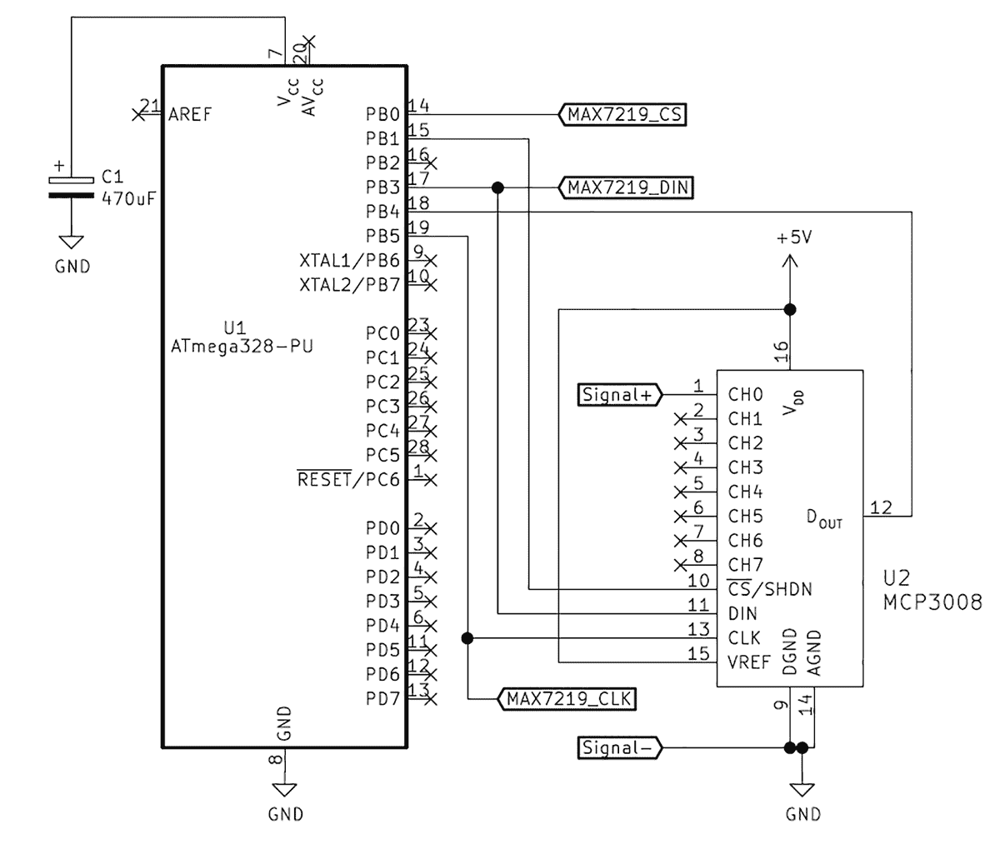

图 11-22：Project 48 的原理图

### 代码

打开终端窗口，导航到本书*第十一章*文件夹中的*Project 48*子文件夹，并输入命令`make flash`进行编译和上传数据，就像平常一样。由于当前没有连接输入，我们说 ADC 的输入是*浮动输入*。这意味着返回的值有些随机，显示屏应该会显示随机数字。

现在连接一个输出在 0 V 到 5 V DC 之间的信号，例如 AA 电池或你之前项目中的 TMP36 温度传感器，连接到 Signal+/–引脚。确保将信号或电池的正极连接到 ADC 的 Signal+引脚（引脚 1），负极连接到 GND（在原理图中也标记为 Signal–）。显示屏现在应该显示 ADC 测量的毫伏数值（1 伏等于 1000 毫伏）。如果你没有电池或传感器或任何其他可以测量的东西，可以将 ADC 输入直接连接到 5 V 或 GND 线，看看它分别接近 5 V 或 0 V。

与所有 SPI 设备一样，我们从 SPCR 寄存器中确定 SPI 总线设置的参数。图 11-23 显示了来自 MCP3008 数据手册的时序图（数据手册可在[`www.microchip.com/wwwproducts/en/MCP3008/`](https://www.microchip.com/wwwproducts/en/MCP3008/) 上找到）。

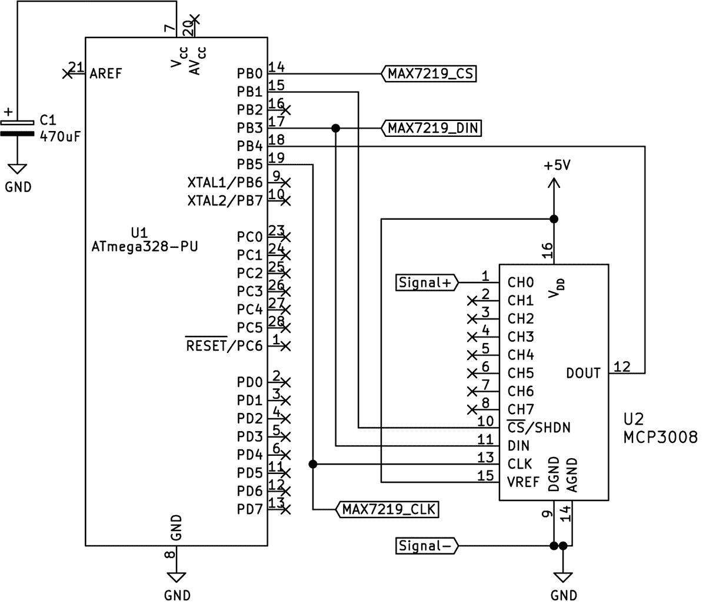

图 11-23：MCP3008 的时序图

我们可以看到，我们应该将 DORD 位设置为 0，因为 MCP3008 要求先发送最低有效位(LSB)。我们还将 CPOL 和 CPHA 位设置为 0，因为时钟信号在数据传输开始时为低电平，并且时钟信号在空闲时极性为低电平。

现在我们需要了解如何控制 MCP3008。我们将以它最简单的形式使用，即单端 ADC（因此只测量 0 V 到 V [REF]，在我们的例子中是 5 V）。每次我们想使用 MCP3008 时，我们将 SPCR 寄存器设置为 `0b01010010`。（如果你使用多个 SPI 设备，你需要在与每个设备通信之前设置 SPCR。）

接下来，我们向 MCP3008 发送三个字节的数据，以便它通过两个字节将所需的 ADC 值返回给微控制器。我们首先将 `0b00000001` 放入 SPDR 作为“起始位”，以激活 MCP3008。接下来，我们将一个配置数据字节放入 SPDR。第一个位是 1，表示使用单端 ADC，然后接下来的三个位以二进制形式表示使用哪个 ADC（0 到 7）。由于我们使用的是 ADC 0，所以将这三个位设置为 0。最后四个位未使用，因此我们保持为 0。

一旦我们将配置字节发送给 MCP3008，它将返回一个字节数据，表示 ADC 结果的最重要的两个位（字节的第 0 位和第 1 位）。如前所述，数据在 SPI 总线上循环传输，因此 MCP3008 的字节会出现在 SPDR 寄存器中。为了捕获这个字节数据，我们通过将一个整数变量放入 SPDR 来“推送”它。字节的剩余 6 位将包含随机数据，因此我们使用位运算 `&` 将它们设置为 0。

最后，我们需要 ADC 结果的最后 8 位，因此我们将一个随机字节的数据（全 0 也可以）通过 SPI 总线发送，放置 0 到 SPDR 中以接收来自 ADC 的字节。等待传输完成后，我们将另一个整数变量等于 SPDR，这时 SPDR 中就包含了剩余的 ADC 数据。

现在我们有 2 字节数据，其中一个包含最高的 2 位（MSB），另一个包含其余 8 位数据（LSB），我们需要将它们转换为一个单一的值：一个 16 位整数，我们称之为 *result*。为此，我们将 MSB 变量左移 8 位到 result 整数中，然后使用位运算 `|` 将 LSB 变量放入 result 中。最终，我们得到一个包含 ADC 10 位值的整数变量，其值在 0 到 1,023 之间。

让我们看看代码，了解这如何工作：

```

      // Project 48 - Using the MCP3008 ADC IC

      #include <avr/io.h>

      #include <util/delay.h>

      void writeMAX7219(char hexdata1, char hexdata2)

      // Sends two bytes in hexadecimal to MAX7219

      {

      SPCR = 0b01010000;             // Set up SPI bus for MAX7219

      PORTB &= ~(1 << PORTB0);       // SS pin LOW

      SPDR = hexdata1;               // Send value of hexdata1

      while(!(SPSR & (1<<SPIF)));    // Wait for SPI transmission to finish

      SPDR = hexdata2;               // Send value of hexdata2

      while(!(SPSR & (1<<SPIF)));    // Wait for SPI transmission to finish

      PORTB |= (1 << PORTB0);        // SS pin HIGH

      }

      void blankMAX7219()

      {

      uint8_t i;

      for (i=1; i<9; i++)

      {

      writeMAX7219(i,15);

      }

      }

      void initMAX7219()

      // Set up MAX7219 for use

      {

      PORTB |= (1 << 0);

      SPCR = 0b01010000;

      writeMAX7219(0x09,0xFF);

      writeMAX7219(0x0B,0x07);

      writeMAX7219(0x0A,0x01);

      writeMAX7219(0x0C,0x01);

      blankMAX7219();

      }

      void dispMAX7219(uint8_t digit, uint8_t number, uint8_t dp)

      {

      if (dp==1)                     // Add decimal point

      {

      number = number + 128;

      }

      writeMAX7219(digit, number);

      }

      void numberMAX7219(uint32_t value)

      // Displays a number between 0–99999999

      uint8_t digits[9];

      uint8_t i = 1;

      for (i=1; i<9; i++)

      {

      digits[i]=15;              // Sending 15 blanks the digit

      }

      i = 1;

      while (value > 0)             // Continue until value > 0

      {

      digits[i] = value % 10;    // Determine and store last digit

      value = value / 10;        // Divide value by 10

      i++;

      }

      for (i=1; i<9; i++)

      {

      dispMAX7219(i, digits[i],0);

      }

      }

      ❶ uint16_t readMCP3008()

      // Read channel 0 and return value

      {

      ❷ uint8_t LSB;

      uint8_t MSB;

      uint16_t ADCvalue;            // Holds data to return to main code

      SPCR = 0b01010010;            // Set up SPI bus for MCP3008

      // SS on PB1 (15)

      PORTB &= ~(1 << PORTB1);      // SS pin LOW

      ❸ SPDR = 0b00000001;            // Send start bit

      while(!(SPSR & (1<<SPIF)));   // Wait for SPI transmission to finish

      SPDR = 0b10000000;            // Select ADC0

      while(!(SPSR & (1<<SPIF)));

      // Place top 2 bits of ADC value in MSB, ignore unwanted bits

      ❹ MSB = SPDR & 0b00000011;

      ❺ SPDR = 0b00000000;            // Request next 8 bits of data

      while(!(SPSR & (1<<SPIF)));

      // Place lower 8 bits of data in LSB

      ❻ LSB = SPDR;

      ❼ PORTB |= (1 << PORTB1);       // SS pin HIGH

      ❽ ADCvalue = MSB << 8 | LSB;    // Construct final 10-bit ADC value

      return ADCvalue;

      }

      int main(void)

      {

      uint16_t ADCoutput;

      DDRB = 0b11111111;            // Set PORTB as outputs

      initMAX7219();

      while (1)

      {

      ❾ ADCoutput = readMCP3008();

      // Convert ADC value to millivolts

      ⓿ ADCoutput = ADCoutput * 4.8828;

      numberMAX7219(ADCoutput);

      _delay_ms(100);

      }

      }

```

在这段代码中，我们重用了 Project 48 中的所有 MAX7219 函数，将 ADC 值以毫伏为单位显示。我们的主代码接收 ADC 值，将其转换为毫伏，然后在 MAX7219 显示器上显示。到现在你应该已经熟悉基本结构了。

我们还声明了一个新函数 `readMCP3008()` ❶，它返回一个 16 位整数，包含 MCP3008 第一个 ADC（0）所测量的值。在函数内部，我们定义了三个变量——两个 8 位整数用于存储 ADC 返回的 MSB 和 LSB 数据，以及一个 16 位整数来返回 ADC 测量的完整值——并设置 MCP3008 的 `SPCR` 寄存器 ❷。然后我们将 SS 引脚拉低，像往常一样启动 SPI 总线。

在发送启动位以激活 MCP3008 ❸后，我们像往常一样等待 SPI 总线传输完成。接着，我们发送配置字节，告诉 MCP3008 我们希望从通道 0 获取单端 ADC 结果。完成后，MCP3008 会返回结果的 MSB。

我们将 MSB 存储在变量`MSB` ❹中，并执行按位 `&` 操作，以去除不必要的随机位。然后，我们通过发送一个随机字节（此处为全 0）❺来请求数据的 LSB，等待传输完成，并将数据存储在`LSB` ❻中。完成此操作后，我们就完成了对 MCP3008 的操作，因此通过将 SS 引脚设置为高电平❼来将其从 SPI 总线中移除。

我们现在有两个字节的数据，需要将其转换为单个整数作为此函数的返回值。我们通过将 MSB 移位到返回变量 `ADCvalue` 的高 8 位，并用 `|` 操作将 LSB 放入其中 ❽。

现在我们已经从 ADC 获取了一个值，接下来进入代码的主循环，将 ADC 读取的值赋给一个 16 位整数 ❾。然而，这个值介于 0 到 1,023 之间，所以我们需要将其转换为毫伏（mV）。我们的 V[REF] 是 5 V，即 5,000 mV。因此，我们将 5,000 除以 1,024 来确定转换这个 ADC 值为毫伏的乘数：4.8828。然后，程序将 ADC 值转换为毫伏 ⓿并将其发送到显示器上。

此时你应该理解如何实现 SPI 总线，包括如何查阅 SPI 设备的数据手册，找到与 AVR 配合使用所需的信息。你还学会了如何利用有用的移位寄存器集成电路（IC）、MAX7219 显示驱动器以及 MCP3008 ADC。这些知识应该为你使用其他基于 SPI 的部件进行自己的项目做好准备。

在下一章中，你将学习如何使用更多有趣且实用的部件，通过另一种类型的数据总线：I²C。
