# 第十二章：# AVR 和 I ² C 总线


*集成电路间总线*，或 *I* ² *C*，是另一种常见的数据总线类型。最初由飞利浦（现在是 NXP）设计，该总线旨在使一个或多个设备能够在短距离内与主设备（如微控制器）进行数据传输和接收。本章将向你展示如何设置 I ² C，并使用它与外部 IC 进行通信，通过学习所需的功能和硬件，并探索一些流行的 I ² C 设备示例。

你将学习如何提高 AVR 微控制器的工作速度，使你能够在 AVR 上实现 I ² C 数据总线。在学习如何控制 MCP23017 I ² C 16 位 I/O 扩展 IC 并从外部 I ² C EEPROM 存储和检索数据后，你将首次使用 DS3231 I ² C 实时钟 IC。

有成千上万的设备使用 I ² C 总线，从显示器和电机控制器到传感器等。完成本章内容后，你将准备好利用这些设备来实现更复杂的项目，如天气监测和显示解决方案、多舵机机器人，以及需要为微控制器添加更多 I/O 端口的项目。

## 提高 AVR 速度

到目前为止，你的 AVR 项目一直以 1 MHz 的 CPU 速度运行，使用 AVR 的内部振荡器生成所需的时钟信号，用于定时和其他操作。这种方式最小化了复杂性，并减少了电路所需的零件数量。然而，有时你可能需要使用需要更快数据总线的部件。这些部件包括那些通过 I ² C 总线与微控制器通信的部件。为了使用这个总线，你需要了解如何通过更高的 CPU 速度来运行你的项目，从而生成更快的时钟信号。

要提高 ATmega328P-PU 的 CPU 速度，你需要进行两项修改：一项是硬件修改，另一项是项目的 Makefile 修改。为了改变硬件，你需要额外的三个组件：两个 22 pF 陶瓷电容和一个 16 MHz *晶体振荡器*。这些通常被称为 *晶体*，它们能产生一个准确频率的电信号，在本例中是 16 MHz。图 12-1 显示了我们将使用的晶体。

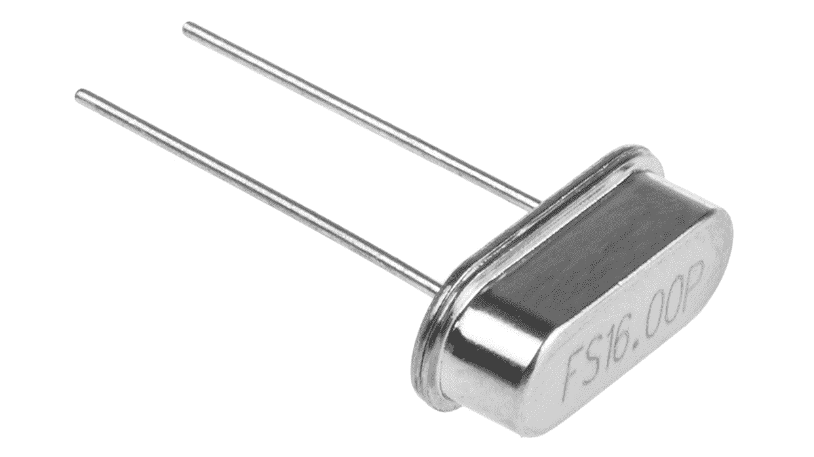

图 12-1：16 MHz 晶体振荡器

晶体是非极化的。我们的 16 MHz 晶体的原理符号如 图 12-2 所示。


图 12-2：晶体振荡器原理符号

晶体决定了微控制器的工作速度。例如，我们将组装的电路工作在 16 MHz，这意味着它每秒可以执行 1600 万条处理器指令。当然，这并不意味着它可以如此快速地执行一行代码或函数，因为执行单行代码需要许多处理器指令。

图 12-3 中的原理图展示了将晶体连接到 ATmega328P-PU 微控制器所需的附加电路。

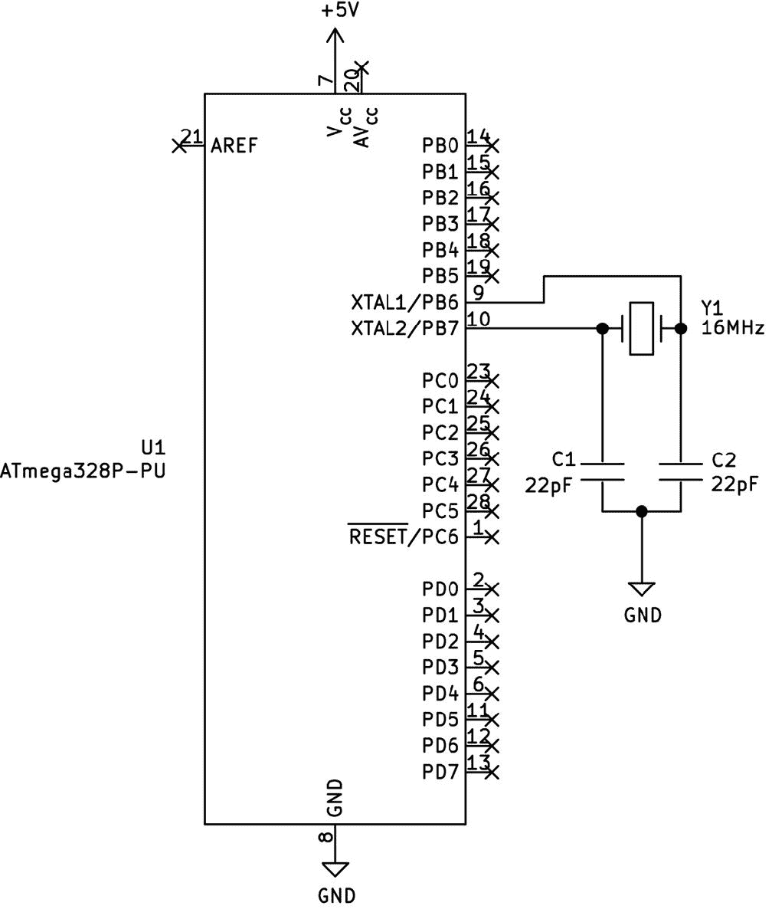

图 12-3：带外部晶体电路的 ATmega328P-PU

除了上述硬件更改外，你还需要编辑项目的 Makefile，以告诉工具链将微控制器设置为 16 MHz 运行。这对于所有使用外部晶体的项目都是必要的。要为本章的第一个项目执行此操作，打开位于本书*第十一章*文件夹中的*Project 49*子文件夹中的 Makefile。向下滚动到第 21 行，标记为`FUSES`，并将其更新为以下代码行（完成后别忘了保存文件）：

```

     FUSES      = -U lfuse:w:0xff:m -U hfuse:w:0xde:m -U efuse:w:0x05:m

```

注：将不同的 Makefile 单独存储是一个好主意，这样你可以在需要时将它们轻松复制到自己的项目文件夹中。如果你从 No Starch Press 网站下载了本书的代码，Makefile 已经为每个项目设置好了。

## 介绍 I ² C 总线

I ² C 总线的工作方式类似于 SPI 总线，即数据通过一根电缆以串行方式传输和接收，往返于微控制器（*串行数据线*，通常称为*SDA*），而另一根电缆则传输时钟信号（*串行时钟线*，通常称为*SCL*或*SCK*）。该信号与数据信号同步，以确保准确的数据传输。我们项目的时钟信号频率为 100 kHz。

注：I ² C 是一个双向总线，数据沿一根线传输或接收。由于时钟信号通过另一根线传输，因此一些供应商（如 Microchip）称 I ² C 为*双线串行接口（TWI）*。

在 I ² C 总线上，微控制器充当*主设备*，总线上的每个 IC 都是*从设备*。每个从设备都有自己的地址，这是一个 7 位数字，允许微控制器与该设备进行通信。每个设备通常有一系列可供选择的 I ² C 总线地址，详细信息请参阅制造商的数据手册。如果一个 IC 有两个或多个潜在的 I ² C 总线地址，我们通过以特定方式连接 IC 引脚来决定使用哪个地址。

图 12-4 展示了 I ² C 总线在工作中的一个示例，通过数字示波器（DSO）捕获。

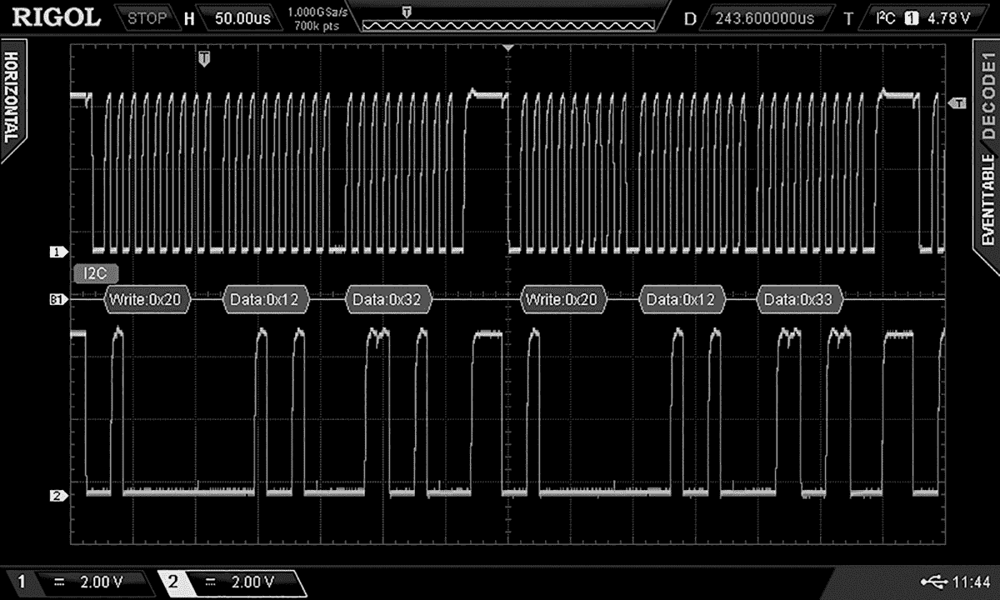

图 12-4：数据在 I ² C 总线上的传输

一旦激活，使用 I ² C 总线遵循一个简单的逻辑模式，如图 12-4 所示。总线的两条线保持在高电平；我们通过上拉电阻将它们连接到 5 V。我们通过设置数据线为低电平并在时钟线上启动时钟信号来向主设备（微控制器）发送开始信号。接下来，我们发送与我们希望通信的设备的 7 位地址，之后跟随一个 0（表示我们想写入数据）或一个 1（表示我们希望设备向我们发送数据）。

然后，从设备要么通过发送*ACK 位*（0）确认已接收到来自主设备的字节，要么如果发生错误，则发送*NACK 位*（1），表示“未确认”，并指示主设备停止发送。如果从设备已经完成向主设备发送数据，它也可能发送 NACK。

你可以在图 12-4 中看到这个操作示例，主设备启动 I ² C 总线，然后发送`0x20+0`告诉从设备它正在写数据，接着再发送两字节的数据到从设备。十六进制是与 I ² C 总线一起使用的首选进制系统，但如果使用二进制或十进制对你来说更简单或更合适，也可以使用。这看起来可能很复杂，但在查看本章中的项目后，你将能很快掌握 I ² C 技术。

### 引脚连接和电压

每个 I ² C 设备使用两个引脚——通常标记为 SCL 和 SDA，如前所述——进行通信。这些引脚连接到微控制器上的相应引脚。如果你有多个 I ² C 设备，它们都通过相同的连接回到微控制器。最后，在 5 V（供电电压）和每条 I ² C 线之间放置一个上拉电阻。图 12-5 展示了这个简化示例。

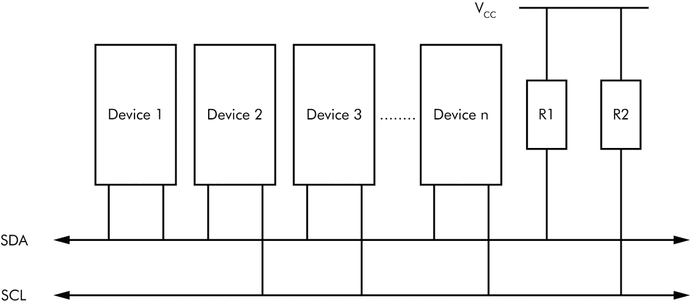

图 12-5：I ² C 总线布线的简化示例

与 SPI 总线一样，你的 I ² C 总线设备必须在 5 V 下工作或能够容忍 5 V 的工作，因为我们的项目中微控制器运行在 5 V 下。在使用之前，确保与卖家或制造商确认。如果你必须使用一个工作在低电压（如 3.3 V）的 I ² C 总线设备，可以使用像第十一章中提到的 I ² C 兼容电平转换器，PMD Way 部件号 441079。

再次使用这些电平转换器非常简单。只需使用一对通道连接 I²C 总线，将 5V 电缆连接到 HV 焊盘，并将匹配的低电压电缆连接到 LV 焊盘，同时将 GND 两侧连接到电路板。

### 写入 I²C 设备

为了向你展示如何实现 I²C 总线，我将首先解释如何向 I²C 设备写入数据，然后在本章后面介绍如何读取数据。写入数据到 I²C 总线设备需要五个在我们 AVR 工具链中不存在的函数，因此我们使用以下自定义函数来完成必要的操作。这些函数包含在本章的 I²C 总线项目中。

#### 启用 I²C 总线

`I2Cenable()`函数将两个 GPIO 引脚（ATmega328P-PU 上的 PC5 和 PC4）从常规用途转换为 I²C 总线引脚（分别为 SCL 和 SDA）：

```

       void I2Cenable()

       {

       TWBR = 72;           // 100 kHz I2C bus

       TWCR |= (1 << TWEN); // Enable I2C on PORTC4 and 5

       }

```

我们首先设置*TWBR (TWI 比特率寄存器)*，该寄存器用于根据 Microchip 提供的公式来确定 I²C 总线的时钟速度。在这里，我们使用值 72，这使得微控制器将 CPU 的速度分频到 100 kHz，作为我们的时钟。我们还将*TWEN (双线使能)*位设置为 1，这会将 GPIO 引脚转换为 I²C 总线引脚 SCL 和 SDA。

#### 等待 I²C 总线完成

总线操作不是瞬间完成的，因此我们在执行其他 I²C 总线命令后，使用`I2Cwait()`函数来等待数据传输完成，然后再执行总线上的其他操作：

```

       void I2Cwait()

       {

       while (!(TWCR & (1<<TWINT)));

       }

```

我们可以通过查看 TWCR 寄存器的*TWINT (双线中断)*位来检查总线是否繁忙。当总线空闲时，该代码将 TWINT 位设置为 1，因此当 TWINT 为 0 时，代码什么也不做。

#### 启动 I²C 总线

`I2CstartWait()`函数启动向 I²C 总线上的设备发送数据的过程。它发送二级地址以启用总线上的所需设备，并等待该设备的确认，表明它已准备好使用：

```

       void I2CstartWait(unsigned char address)

       {

       uint8_t status;

       while (1)

       {

       ❶ TWCR = (1<<TWINT) | (1<<TWSTA) | (1<<TWEN);

       ❷ I2Cwait();

       ❸ status = TWSR & 0b11111000;

       if ((status != 0b00001000) && (status != 0b00010000)) continue;

       ❹ TWDR = address;

       TWCR = (1<<TWINT) | (1<<TWEN);

       I2Cwait();

       ❺ status = TWSR & 0b11111000;

       if ((status == 0b00100000)||(status == 0b01011000))

       {

       ❻ TWCR = (1<<TWINT) | (1<<TWEN) | (1<<TWSTO);

       while(TWCR & (1<<TWSTO));

       continue;

       }

       break;

       }

       }

```

该函数首先通过将 TWCR 寄存器中的 TWINT 设置为 1，设置总线上的启动条件，然后通过设置 TWSTA（双线接口启动条件）和激活总线（TWEN❶）来启动。我们等待这些操作完成❷，然后加载 TWSR 寄存器的值❸，仅当状态位 TWS3 和 TWS4 未设置为 1 时才继续。如果设置为 1，这些位表示启动条件或重复启动条件未成功发送，因此我们无法继续。

在这一点上，公交初始化已经成功，因此我们现在发送二级地址以启用总线上的所需设备。我们通过将地址加载到 TWDR 寄存器❹中，然后通过将 TWCR 寄存器中的 TWINT 和 TWEN 设置为 1 来发送它。接下来会有一个短暂的等待时间，以便完成传输。

我们再次通过加载 TWSR 寄存器的值 ❺ 来检查 I ² C 总线的状态，只有在从设备未忙碌或未确认写入时，我们才会继续。如果设备忙碌或未确认，我们将发送 I ² C 停止命令 ❻ 并等待该指令完成。

#### 向 I ² C 总线写数据

这个函数仅通过 I ² C 总线发送一个字节的数据：

```

       void I2Cwrite(uint8_t data)

       {

       TWDR = data;

       TWCR |= (1 << TWINT)|(1 << TWEN);

       I2Cwait();

       }

```

一旦 I ² C 总线通信初始化完成并启动，我们使用此功能向被寻址的设备写入一个字节的数据。我们将数据加载到 TWDR 寄存器中，然后通过 TWCR 寄存器发送出去。接着我们等待片刻，直到该过程完成。你可以连续调用此函数两次或更多次，以发送多个字节的数据。

#### 停止 I ² C 总线

`I2Cstop()` 函数释放 GPIO 引脚的 I ² C 总线功能，并将其恢复为正常工作：

```

       void I2Cstop()

       {

       TWCR |= (1 << TWINT)|(1 << TWEN)|(1 << TWSTO);

       }

```

当你的代码完成了 I ² C 总线的操作后，使用此功能停止总线并将用于 SDA 和 SCL 的 GPIO 引脚恢复为正常工作状态。通过三个位的变化来停止总线操作：

+   • 将 TWINT 位设置为 1，表示微控制器完成了对总线的使用。

+   • 将 TWSTO 位设置为 1，向总线发送停止条件，告知总线上的设备总线正在停用。

+   • 将 TWEN 位设置为 1 禁用总线操作。

现在，让我们将理论付诸实践，使用 ATmega328P-PU 通过 I ² C 总线控制一些有趣的设备。我们的第一个设备将是 Microchip MCP23017，它为我们的微控制器添加了 16 个 I/O 引脚。

项目 49：使用 MCP23017 16 位 I/O 扩展器

当你的 AVR 基础项目没有足够的数字 GPIO 引脚时，你可以通过 Microchip MCP23017 添加 16 个额外的引脚，如图 12-6 所示。我们将在本项目中首次使用 MCP23017，并将其作为向 I ² C 总线写数据的演示。

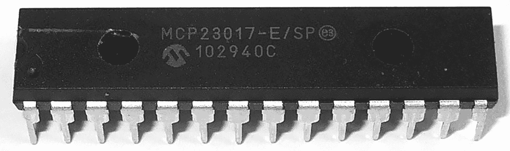

图 12-6：Microchip MCP23017 16 位 I/O 扩展器

MCP23017 有八个可能的总线地址，因此你可以在同一总线上连接最多八个设备，从而获得多达 128 个 GPIO 引脚。I/O 引脚按两组各八个排列，如图 12-7 中的电路符号所示。每个引脚最多可处理 20 mA 电流，尽管整个 MCP23017 的最大连续电流为 125 mA。

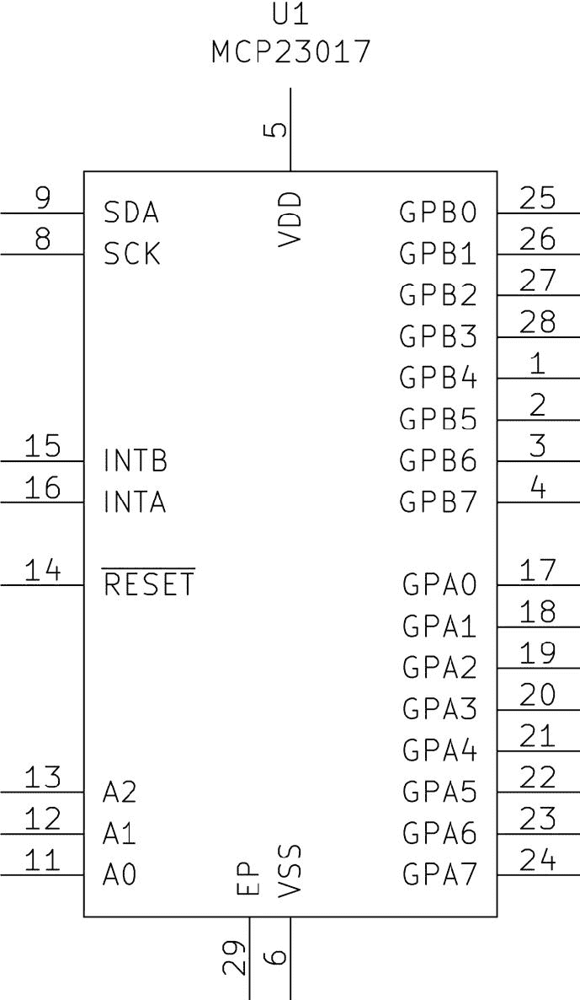

图 12-7：Microchip MCP23017 电路符号

要设置 I ² C 总线地址，你需要将标记为 A0 到 A2 的引脚连接到 5 V 或 GND 的组合。如果你只使用一个 MCP23017，你可以通过将三个引脚连接到 GND，将总线地址设置为 `0x20`。如果你使用两个或更多 MCP23017，或者需要让另一个设备使用 `0x20` 地址，请参考表 12-1 进行配置。

| 表 12-1 : MCP23017 I ² C 总线地址配置 |
| --- |
| 总线地址 | 引脚 A2 | 引脚 A1 | 引脚 A0 |
| --- | --- | --- | --- |
| `0x20` | GND | GND | GND |
| `0x21` | GND | GND | 5 V |
| `0x22` | GND | 5 V | GND |
| `0x23` | GND | 5 V | 5 V |
| `0x24` | 5 V | GND | GND |
| `0x25` | 5 V | GND | 5 V |
| `0x26` | 5 V | 5 V | GND |
| `0x27` | 5 V | 5 V | 5 V |

如前所述，总线地址是一个 7 位数字，通过在末尾添加 0 或 1 来补充为 8 位数字，以便写入或读取总线。你可以通过将 1 从右边位移来创建这个 8 位数字，使用 `<<1` 来创建写入地址，例如 `0x20<<1`，或转换地址为结果，这在本例中是 `0x40`。

控制 MCP23017 还涉及写入其配置寄存器，每个寄存器都有自己的地址。为了将引脚设置为输出，我们需要设置两个 8 引脚的 I/O 方向寄存器。它们分别称为 GPIOA 和 GPIOB 寄存器，地址为 `0x12` 和 `0x13`。

一旦我们访问了这些寄存器，就会向每个寄存器发送一个 0，以将引脚设置为输出。例如，为了将 GPIOA 寄存器设置为输出，我们会向 I ² C 总线发送以下数据序列：`0x20<<1` 或 `0x40`（这是 MCP23017 的 I ² C 总线写入地址），然后是 `0x12`（GPIOA 寄存器地址），接着是 `0x00`（0）。现在我们在项目中实现这一操作。

### 硬件

要构建电路，你将需要以下硬件：

+   • USBasp 编程器

+   • 无焊面包板

+   • 5 V 面包板电源

+   • ATmega328P-PU 微控制器

+   • MCP23017 16 位 I/O 集成电路

+   • 多达 16 个 LED（D1–D16）

+   • 多达 16 个 560 Ω 电阻（R1–R16）

+   • 两个 4.7 kΩ 电阻（R17–R18）

+   • 两个 22 pF 陶瓷电容

+   • 16 MHz 晶体振荡器

+   • 跳线

按照图 Figure 12-8 所示组装电路。

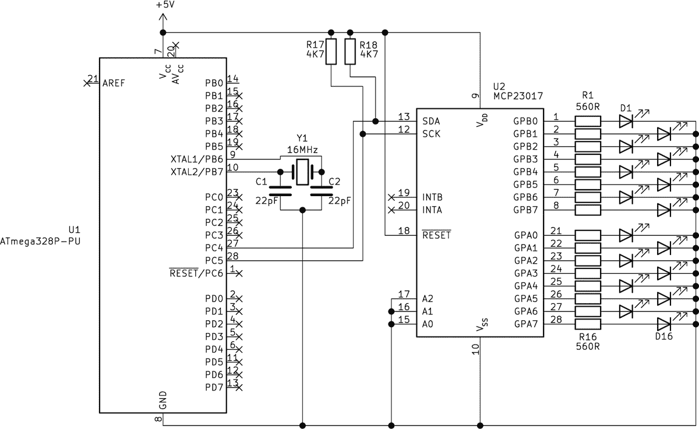

图 12-8： Project 49 原理图

### 代码

打开终端窗口，进入本书*第十二章*文件夹下的 *Project 49* 子文件夹，并输入命令 `make flash`。几秒钟后，每组 LED 应该会反复显示 0 到 255 之间的二进制计数。

让我们检查一下代码，看看是如何实现的：

```

      // Project 49 - Using the MCP23017 16-Bit I/O Expander

      #include <avr/io.h>

      #include <util/delay.h>

      void I2Cenable()

      // Enable the I2C bus

      {

      TWBR = 72;           // 100 kHz I2C bus

      TWCR |= (1 << TWEN); // Enable I2C on PORTC4 and 5

      }

      void I2Cwait()

      // Wait until I2C finishes an operation

      {

      // Wait until bit TWINT in TWCR is set to 1

      while (!(TWCR & (1<<TWINT)));

      }

      void I2CstartWait(unsigned char address)

      {

      uint8_t status;

      while (1)

      {

      // Send START condition

      TWCR = (1<<TWINT) | (1<<TWSTA) | (1<<TWEN);

      // Wait until transmission completes

      I2Cwait();

      // Check value of TWSR, and mask out status bits

      status = TWSR & 0b11111000;

      if ((status != 0b00001000) && (status != 0b00010000)) continue;

      // Send device address

      TWDR = address;

      TWCR = (1<<TWINT) | (1<<TWEN);

      // Wait until transmission completes

      I2Cwait();

      // Check value of TWSR, and mask out status bits

      status = TWSR & 0b11111000;

      if ((status == 0b00100000 )||(status == 0b01011000))

      {

      // Secondary device is busy, send stop to terminate write operation

      TWCR = (1<<TWINT) | (1<<TWEN) | (1<<TWSTO);

      // Wait until stop condition is executed and I2C bus is released

      while(TWCR & (1<<TWSTO));

      continue;

      }

      break;

      }

      }

      void I2Cstop()

      // Stop I2C bus and release GPIO pins

      {

      // Clear interrupt, enable I2C, generate stop condition

      TWCR |= (1 << TWINT)|(1 << TWEN)|(1 << TWSTO);

      }

      void I2Cwrite(uint8_t data)

      // Send ′data′ to I2C bus

      {

      TWDR = data;

      TWCR |= (1 << TWINT)|(1 << TWEN);

      I2Cwait();

      }

      ❶ void initMCP23017()

      // Configure MCP23017 ports for all outputs

      {

      I2CstartWait(0x20<<1); // 0x20 write mode

      I2Cwrite(0x00);        // IODIRA register

      I2Cwrite(0x00);        // Set all register A to outputs

      I2Cstop();

      I2CstartWait(0x20<<1); // 0x20 write mode

      I2Cwrite(0x01);        // IODIRB register

      I2Cwrite(0x00);        // Set all register B to outputs

      I2Cstop();

      }

      int main(void)

      {

      uint8_t i;

      ❷ I2Cenable();

      initMCP23017();

      while (1)

      {

      for (i = 0; i< 256; i++)

      {

      ❸ I2CstartWait(0x20<<1);

      ❹ I2Cwrite(0x12);  // Control register A 0x12

      ❺ I2Cwrite(i);     // Value to send

      ❻ I2Cstop();

      I2CstartWait(0x20<<1);

      ❼ I2Cwrite(0x13);  // Control register B 0x13

      ❽ I2Cwrite(i);     // Value to send

      ❾ I2Cstop();

      _delay_ms(100);

      }

      }

      }

```

这段代码使用了上一节中描述的五个 I ² C 函数，以简化数据传输。初始化函数 ❶ 便于使用 MCP23017。这将设置 GPIOA 和 GPIOB 寄存器，使所有 I/O 引脚为输出。

接下来，我们初始化 I ² C 总线 ❷ 并寻址每个 GPIO 扩展块以控制输出。我们启动 I ² C 总线 ❸，然后通过发送其地址 ❹ 来寻址 GPIO 寄存器。接着我们发送数据来控制寄存器 ❺ 并停止 I ² C 总线 ❻。之后，在重新启动 I ² C 总线后，代码选择 MCP23017 的第二个扩展块 ❼，发送数据 ❽，然后再次停止总线 ❾。

由于这个项目旨在演示所有可能的输出组合，因此它通过 `for` 循环发送一个生成的十进制数。然而，如果你想更直观地控制哪些输出引脚，可以使用二进制数。例如，如果你想打开第 7、4 和 0 引脚，你可以发送 `0b10010001` 而不是十进制数 `145`，这样相应的输出引脚就会被激活。注意，物理引脚编号与二进制数中的编号是匹配的。

现在你知道如何使用 MCP23017，接下来我们学习如何从 I ² C 设备读取数据。

## 从 I ² C 设备读取数据

现在你已经可以向 I ² C 设备写入数据，是时候学习如何从这些设备中读取数据了——例如传感器数据、外部存储器和其他类型的输出。读取数据时，在正常初始化 I ² C 总线后，我们使用这个函数：

```

     I2CstartWait(
     `address` 
     );

```

这次我们在 7 位总线地址的末尾加一个 1（而不是 0，用于写入）。一旦从设备接收到这个地址字节，它就知道将一个或多个字节的数据发送回总线，以供主设备接收。

为了确定从设备读取数据时应使用的正确总线地址，将设备的 I ² C 地址转换为二进制。例如，地址 `0x50` 转换为二进制是 `1010000`。在末尾加一个 1，得到 `10100001`，然后再转换回十六进制，得到 `0xA1`。

注意：如果你没有能够进行二进制、十进制和十六进制转换的计算器，一个有用的在线网站可以进行各种数学转换：[`www.rapidtables.com/convert/number/`](https://www.rapidtables.com/convert/number/)。

接下来，我们使用两个新函数之一，`I2Cread()` 或 `I2CreadACK()`。`I2Cread()` 等待从从设备返回一个字节的数据（没有确认位），并将其放入一个字节变量中：

```

     uint8_t I2Cread()

     {

     TWCR |= (1 << TWINT)|(1 << TWEN);

     I2Cwait();

     // Incoming byte is placed in TWDR register

     return TWDR;

     }

```

该函数使主设备能够接收一个字节的数据，首先通过设置 TWINT 和 TWEN 来启用总线并释放其使用权限。等待操作完成后，从从设备接收到的字节数据会存储在 TWDR 寄存器中，然后通过 `return TWDR;` 返回该字节数据。

与 `I2Cread()` 类似，`I2CreadACK()` 等待从从设备接收一个字节的数据并将其放入一个字节变量中，但它还考虑了从设备的确认位：

```

     uint8_t I2CreadACK()

     {

     TWCR |= (1 << TWINT)|(1 << TWEN)|(1 << TWEA);

     I2Cwait();

     // Incoming byte is placed in TWDR register

     return TWDR;

     }

```

这一次，除了设置 TWINT 和 TWEN，我们还将 TWCR 中的 TWEA 设置为 1。这会在主设备成功接收到数据字节时，在总线上生成 ACK（确认位）。

我们根据次要设备的参数选择使用哪个读取功能。有些设备在发送更多数据之前需要 ACK 位，而有些则不需要。

现在，我们已经拥有了完整的 I²C 总线使用功能，接下来可以将它们应用到以下项目中。

项目 50：使用外部 IC EEPROM

项目 39 在第九章中展示了如何使用 ATmega328P-PU 内部 EEPROM 存储在断电时不想删除的数据。进一步拓展这一思路，你还可以使用外部 EEPROM IC，它们提供更大的存储空间，允许你构建没有自己 EEPROM 的微控制器项目。

对于这个项目，我们将使用 Microchip 24LC512-E/P EEPROM IC，示例见图 12-9。

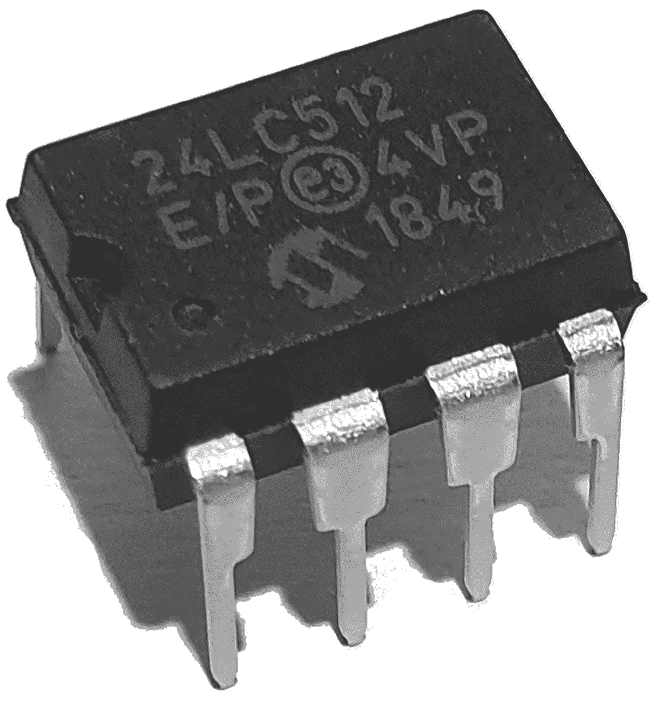

图 12-9：Microchip 24LC512-E/P 外部 EEPROM IC

图 12-10 显示了 Microchip 24LC512-E/P 的原理图符号。


图 12-10：Microchip 24LC512-E/P 原理图符号

和大多数其他 I²C 设备一样，你可以通过将 A0、A1 和 A2 引脚连接到电源或 GND 来设置该 IC 的 7 位地址。如果你只使用一个 24LC512-E/P，可以通过将这三个 A 引脚连接到 GND，将总线地址设置为 `0x50`。如果你使用两个或更多，或者需要让另一个次级设备使用 `0x50` 地址，请参考表 12-2 进行配置。

| 表 12-2：24LC512-E/P I²C 总线地址配置 |
| --- |
| 总线地址 | 引脚 A2 | 引脚 A1 | 引脚 A0 |
| --- | --- | --- | --- |
| `0x50` | GND | GND | GND |
| `0x51` | GND | GND | 5 V |
| `0x52` | GND | 5 V | GND |
| `0x53` | GND | 5 V | 5 V |
| `0x54` | 5 V | GND | GND |
| `0x55` | 5 V | GND | 5 V |
| `0x56` | 5 V | 5 V | GND |
| `0x57` | 5 V | 5 V | 5 V |

24LC512-E/P 可以存储最多 512KB 的数据（或者，除以 8，约 64,000 字节）。本项目演示了如何向 EEPROM 写入和读取数据字节，并将其集成到其他项目中。

### 硬件

要构建电路，你将需要以下硬件：

+   • USBasp 编程器

+   • 无焊面包板

+   • 5 V 面包板电源

+   • ATmega328P-PU 微控制器

+   • Microchip 24LC512-E/P EEPROM IC

+   • 两个 4.7 kΩ 电阻（R1–R2）

+   • 两个 22 pF 陶瓷电容（C1–C2）

+   • 470 μF 16 V 电解电容（C3）

+   • 16 MHz 晶体振荡器

+   • MAX7219 八位数字模块

+   • 跳线

按照图 12-11 所示组装电路。

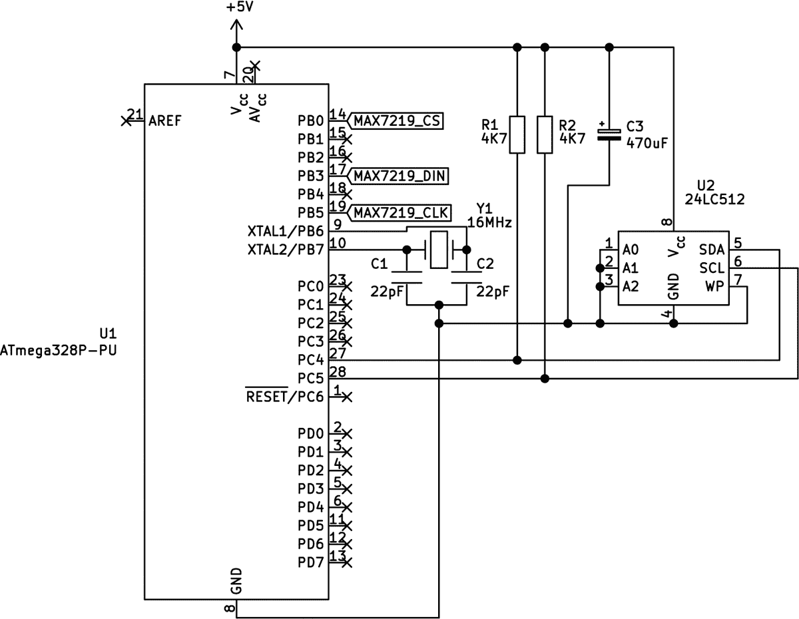

图 12-11: 项目 50 的电路图

### 代码

打开一个终端窗口，导航到本书*第十二章*文件夹下的*项目 50*子文件夹，并输入命令`make flash`。片刻之后，MAX7219 显示屏应该会快速显示 0 到 255 之间的数字，将这些值写入 EEPROM。然后，它会以较慢的速度再次显示这些数字，读取 EEPROM 中的值。

让我们看看代码，看看这是如何完成的：

```

      // Project 50 - 24LC512 I2C EEPROM

      #include <avr/io.h>

      #include <util/delay.h>

      void I2Cenable()

      // Enable I2C bus

      {

      TWBR = 72;           // 100 kHz I2C bus

      TWCR |= (1 << TWEN); // Enable I2C on PORTC4 and 5

      }

      void I2Cwait()

      // Wait until I2C finishes an operation

      {

      // Wait until bit TWINT in TWCR is set to 1

      while (!(TWCR & (1<<TWINT)));

      }

      void I2CstartWait(unsigned char address)

      {

      uint8_t status;

      while (1)

      {

      // Send START condition

      TWCR = (1<<TWINT) | (1<<TWSTA) | (1<<TWEN);

      // Wait until transmission completes

      I2Cwait();

      // Check value of TWSR, and mask out status bits

      status = TWSR & 0b11111000;

      if ((status != 0b00001000) && (status != 0b00010000)) continue;

      // Send device address

      TWDR = address;

      TWCR = (1<<TWINT) | (1<<TWEN);

      // Wait until transmission completes

      I2Cwait();

      // Check value of TWSR, and mask out status bits

      status = TWSR & 0b11111000;

      if ((status == 0b00100000 )||(status == 0b01011000))

      {   // Secondary device is busy, so send stop condition to terminate

      // write operation

      TWCR = (1<<TWINT) | (1<<TWEN) | (1<<TWSTO);

      // Wait until stop condition is executed and I2C bus released

      while(TWCR & (1<<TWSTO));

      continue;

      }

      break;

      }

      }

      void I2Cstop()

      // Stop I2C bus and release GPIO pins

      {

      // Clear interrupt, enable I2C, generate stop condition

      TWCR |= (1 << TWINT)|(1 << TWEN)|(1 << TWSTO);

      }

      void I2Cwrite(uint8_t data)

      // Send ′data′ to I2C bus

      {

      TWDR = data;

      TWCR |= (1 << TWINT)|(1 << TWEN);

      I2Cwait();

      }

      uint8_t I2Cread()

      // Read incoming byte of data from I2C bus

      {

      TWCR |= (1 << TWINT)|(1 << TWEN);

      I2Cwait();

      // Incoming byte is placed in TWDR register

      return TWDR;

      }

      uint8_t I2CreadACK()

      // Read incoming byte of data from I2C bus and ACK signal

      {

      TWCR |= (1 << TWINT)|(1 << TWEN)|(1 << TWEA);

      I2Cwait();

      // Incoming byte is placed in TWDR register

      return TWDR;

      }

      void writeMAX7219(char hexdata1, char hexdata2)

      // Sends two bytes in hexadecimal to MAX7219

      {

      PORTB &= ~(1 << PORTB0);    // SS pin LOW

      SPDR = hexdata1;            // Send value of hexdata1

      while(!(SPSR & (1<<SPIF))); // Wait for SPI transmission to finish

      SPDR = hexdata2;            // Send value of hexdata2

      while(!(SPSR & (1<<SPIF))); // Wait for SPI transmission to finish

      PORTB |= (1 << PORTB0);     // SS pin HIGH

      }

      void blankMAX7219()

      // Blanks all digits

      {

      uint8_t i;

      for (i=1; i<9; i++)         // Blank all digits

      {

      writeMAX7219(i,15);

      }

      }

      void initMAX7219()

      // Set up MAX7219 for use

      {

      PORTB |= (1 << 0);          // SS pin HIGH

      SPCR = (1<<SPE)|(1<<MSTR);  // Set up SPI bus for MAX7219

      // Mode decode for digits (table 4 page 7 - 0x09 + 0xFF)

      writeMAX7219(0x09,0xFF);

      writeMAX7219(0x0B,0x07);    // Set scan limit to 8 digits - 0x09 + 0xFF)

      writeMAX7219(0x0A,0x01);    // Set intensity to 8 - 0x0A + 0x08)

      // Mode display on (table 4 page 7 - 0x09 + 0xFF)

      writeMAX7219(0x0C,0x01);

      blankMAX7219();

      }

      void dispMAX7219(uint8_t digit, uint8_t number, uint8_t dp)

      // Displays "number" in location "digit" with decimal point on/off

      // Digit: 1~8 for location 1~8

      // Number: 0~15 for 0~9, - E, H, L, P, blank

      // dp: 1 on, 0 off

      {

      if (dp==1)                       // Add decimal point

      {

      number = number + 128;

      }

      writeMAX7219(digit, number);

      }

      void numberMAX7219(uint32_t value)

      // Displays a number between 0–99999999 on MAX7219-controlled 8-digit display

      {

      uint8_t digits[8];

      uint8_t i = 1;

      for (i=1; i<9; i++)

      {

      digits[i]=15;

      }

      i = 1;

      while (value > 0)                // Continue until value > 0

      {  // Determine and store last digit of number

      digits[i] = value % 10;

      value = value / 10;           // Divide value by 10

      i++;

      }

      for (i=1; i<9; i++)

      {

      dispMAX7219(i, digits[i],0);

      }

      }

      int main(void)

      {

      uint16_t i;

      uint16_t j;

      DDRB = 0b11111111;               // Set PORTB as outputs

      I2Cenable();

      initMAX7219();

      while (1)

      {

      dispMAX7219(0,10,0);

      for (i = 0; i<256; i++)       // Write loop

      {

      ❶ I2CstartWait(0x50<<1);     // 0x50 << 1 - 0b10100000

      ❷ I2Cwrite(i >> 8);

      ❸ I2Cwrite(i);

      ❹ I2Cwrite(i);

      I2Cstop();

      numberMAX7219(i);

      _delay_ms(1);

      }

      for (i = 0; i<256; i++)       // Read loop

      {

      ❺ I2CstartWait(0x50<<1);     // Write address

      ❻ I2Cwrite(i >> 8);

      ❼ I2Cwrite(i);

      ❽ I2CstartWait((0x50<<1)+1); // Read address - 0b10100001

      ❾ j = I2Cread();

      ⓿ I2Cstop();

      numberMAX7219(j);

      _delay_ms(5);

      }

      _delay_ms(100);

      }

      }

```

这段代码重用了之前项目中的函数，例如第十一章中的 MAX7219 函数和本章项目 49 中的 I²C 总线函数；新代码包含在主循环中。总之，它将值 0 到 255 写入并从 EEPROM 的 0 到 255 位置读取。这在代码的写入和读取循环中完成。

为了向 EEPROM 写入数据，我们首先启动总线，并在写入循环中等待确认 ❶，使用总线地址的“写入”形式。现在，EEPROM 期待接收 2 字节数据，这 2 字节表示 EEPROM 内存中的地址（或位置）（在本例中是写入）。它需要 2 字节数据，因为有超过 256 个可能的地址。因此，代码在循环中创建变量`i`，作为 16 位整数。

我们发送地址的“高字节” ❷，它详细说明了地址中大于 255 的部分，然后跟随发送“低字节”，它详细说明了地址中小于或等于 255 的部分 ❸。然后，我们将值发送到 EEPROM 进行存储 ❹，MAX7219 显示屏会显示该值供我们参考。

为了从 EEPROM 读取值，我们首先启动总线，并在读取循环中等待确认 ❺，同样使用总线地址的“写入”形式，然后像之前一样发送高 ❻ 和低 ❼ 字节的地址。

接下来，为了从 EEPROM 检索数据，我们通过使用总线地址的读取形式重新启动 I²C 总线 ❽。然后，我们使用新的`I2Cread()`函数将从 EEPROM 发送的字节取回到微控制器，并将其存储在变量`j`中 ❾。现在我们从 EEPROM 获取了数据，停止使用 I²C 总线 ⓿，并将这些值显示在 MAX7219 显示模块上供参考。

更多关于高字节和低字节的内容

我们需要将 16 位整数拆分为高字节和低字节，以便通过 I²C（或 SPI）数据总线发送它们。这涉及到将整个 16 位数字右移 8 位以确定高字节，然后通过简单地使用 16 位数字进行 8 位操作来发送低字节，因为这样做实际上会移除高字节。

例如，考虑数字 41,217。它大于 255，因此我们需要 2 个字节的数据来表示它在 AVR 操作中。如果将 41,217 转换为二进制，你会看到它使用了 16 位：

1010000100000001

我们通过将整个数字向右移 8 位来创建 8 位高字节。例如：

`10100001` 00000001 >> 8 = `10100001` // 我们的高字节

然后，我们通过简单地将它用于 8 位操作来创建低字节。例如：

I2Cwrite( `10100001` 00000001)

这与 `I2Cwrite(00000001)` 的效果相同。

本项目不仅展示了如何将字节数据读写到基于 I²C 的设备，还展示了如何在外部 EEPROM 芯片中存储数据的框架。在下一个项目中，我们将继续讨论我们最后一个 I²C 总线设备——DS3231，这是一个*实时钟（RTC）*芯片，允许你将时间和日期信息添加到你的项目中。

项目 51：使用 DS3231 实时钟

一旦设置了当前时间和日期，RTC 可以在请求时提供准确的时间和日期数据。RTC 允许你构建各种有趣的项目，从简单的时钟到数据记录设备、报警器等。在本项目中，你将创建一个时钟，使用 RTC 和 MAX7219 显示模块以 24 小时格式显示当前的日期和时间。

市面上有许多不同的 RTC 芯片，有些比其他的更精确。在本章中，我们将使用 Maxim DS3231；它除了备份电池外不需要任何外部电路，精度非常高，而且在模块形式中相当坚固。

DS3231 可作为扩展板从各种零售商处购买，包括 PMD Way 的版本（零件编号 883422），如图 12-12 所示。

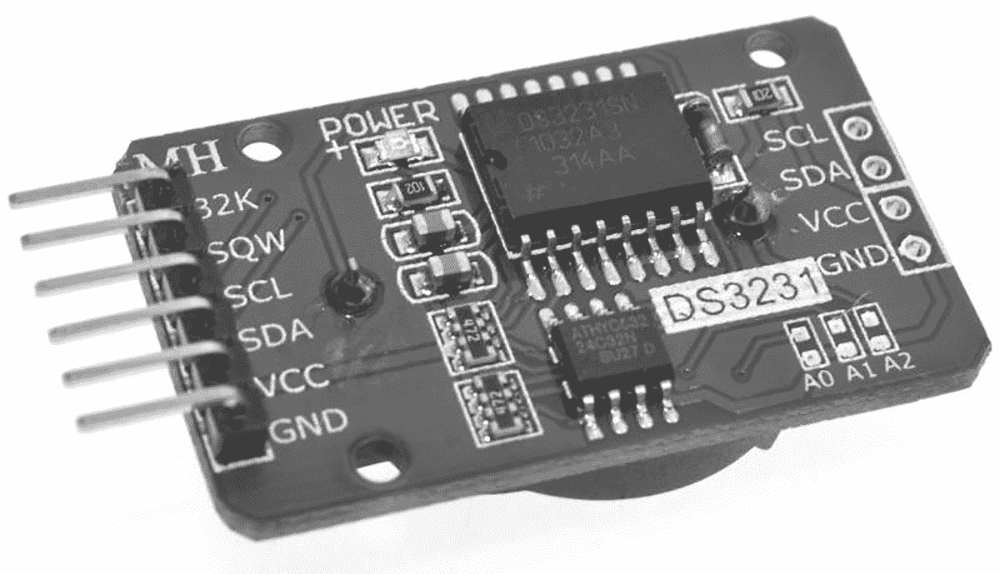

图 12-12：DS3231 实时钟 IC 模块

使用扩展板意味着你不需要担心 DS3231 的支持电路，如上拉电阻，也无需连接备份电池，因为板子会为你处理所有这些。你只需要插入一个 CR2032 的纽扣电池作为备份，并将跳线连接到你的项目上。

将扩展板连接到你的项目非常简单：只需使用 V [CC]（5V），GND，SCL 和 SDA 连接。DS3231 具有固定的 I²C 总线地址 `0x68`，转换为写地址 `0xD0` 和读地址 `0xD1`。

它有一组寄存器用于存储时间和日期信息，从`0x00`开始，依次递增，如表 12-3 所示。

| 表 12-3 ：DS3231 数据寄存器 |
| --- |
| 地址 | 功能 |
| --- | --- |
| `0x00` | 秒 |
| `0x01` | 分钟 |
| `0x02` | 小时 |
| `0x03` | 星期几（1 = 星期天，7 = 星期六） |
| `0x04` | 月日 |
| `0x05` | 月份 |
| `0x06` | 年份（两位数） |

在本项目中，我们将仅使用表 12-3 中显示的寄存器。然而，数据表中有更多内容供您查阅，您可以通过以下网址访问：[`www.maximintegrated.com/en/products/analog/real-time-clocks/DS3231.html`](https://www.maximintegrated.com/en/products/analog/real-time-clocks/DS3231.html)。

数据以 *二进制编码十进制（BCD）* 格式存储在 DS3231 寄存器中，该格式为十进制数字中的每一位分配一个四位二进制代码。因此，我们将在代码中使用简单的 BCD 到十进制转换。

为了设置时间和日期，我们将按顺序从 `0x00` 开始写入数据字节，使用我们的 I²C 总线写入函数。要获取数据，我们可以像在项目 50 中使用 EEPROM 时一样，从特定地址读取，或者从 `0x00` 开始读取并发送 ACK，这将导致 DS3231 从每个顺序寄存器按字节发送其余数据。在我们项目的代码中，我们将使用后一种方法。但首先，让我们先组装硬件。

### 硬件

要构建电路，您需要以下硬件：

+   • USBasp 编程器

+   • 无焊面包板

+   • 5 V 面包板电源

+   • ATmega328P-PU 微控制器

+   • DS3231 RTC 模块与备份电池

+   • 两个 22 pF 陶瓷电容器（C1–C2）

+   • 470 μF 16 V 电解电容器（C3）

+   • 16 MHz 晶体振荡器

+   • MAX7219 八位数码管模块

+   • 跳线

按照图 12-13 所示组装电路。不要忘记将 MAX7219 和 DS3231 板连接到 5 V 和 GND。

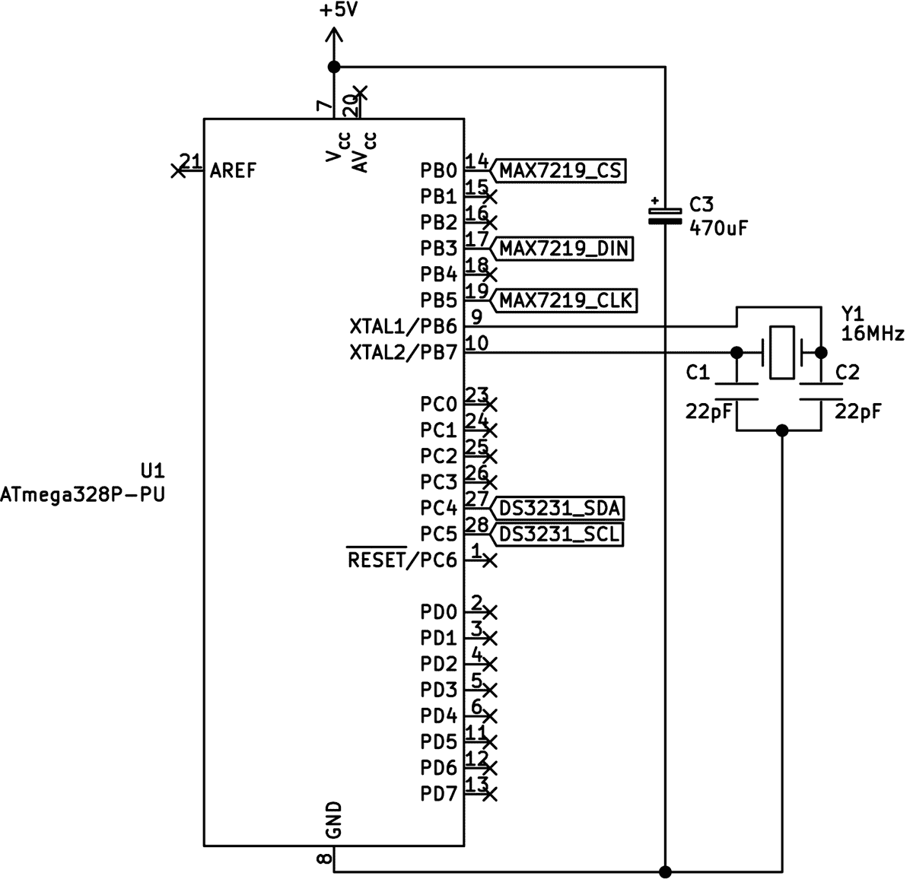

图 12-13: 项目 51 原理图

### 代码

在按常规将代码上传到微控制器之前，请在文本编辑器中打开本书*第十二章*文件夹中的*Project 51*子文件夹中的*main.c*文件，并滚动到第 309 行。去掉`setTimeDS3231()`函数前的注释符号。接下来，更新该函数中的参数以匹配您当前的日期和时间。参数按顺序为：小时（24 小时制），分钟，秒，星期几（1 至 7），日期（1 至 31），月份，年份（00 至 99）。例如，假设您认为星期日是每周的第一天——在某些地区，星期一被认为是第一天，因此星期一是 1——如果时间是 2022 年 11 月 1 日（星期二）下午 2:32（即 14:32），您应将该行更改为：

```

      setTimeDS3231(14,32,0,3,6,11,22);

```

现在保存文件，并像往常一样从终端窗口执行 `make flash` 命令。然后重新打开 *main.c* 文件，取消注释 `setTimeDS3231()` 函数前面的注释符号，保存文件并重新烧录代码。第一次烧录设置时间和日期，第二次则在每次微控制器重置或断电重启时停用设置。如果你跳过了第二次烧录，项目会在每次重置后设置相同的时间和日期。

一旦完成，你应该能在 MAX7219 模块上交替显示当前时间和日期。恭喜你——你已经制作了自己的数字时钟！

现在让我们检查一下代码，看看它是如何工作的：

```

      // Project 51 - Using the DS3231 I2C Real-Time Clock

      #include <avr/io.h>

      #include <util/delay.h>

      // Variables to store time and date

      ❶ uint8_t hours, minutes, seconds, dow, dom, mo, years;

      void I2Cenable()

      // Enable I2C bus

      {

      TWBR = 72;           // 100 kHz I2C bus

      TWCR |= (1 << TWEN); // Enable I2C on PORTC4 and 5

      }

      void I2Cwait()

      // Wait until I2C finishes an operation

      {

      // Wait until bit TWINT in TWCR is set to 1

      while (!(TWCR & (1<<TWINT)));

      }

      void I2CstartWait(unsigned char address)

      {

      uint8_t status;

      while (1)

      {

      // Send START condition

      TWCR = (1<<TWINT) | (1<<TWSTA) | (1<<TWEN);

      // Wait until transmission completes

      I2Cwait();

      // Check value of TWSR, and mask out status bits

      status = TWSR & 0b11111000;

      if ((status != 0b00001000) && (status != 0b00010000)) continue;

      // Send device address

      TWDR = address;

      TWCR = (1<<TWINT) | (1<<TWEN);

      // Wait until transmission completes

      I2Cwait();

      // Check value of TWSR, and mask out status bits

      status = TWSR & 0b11111000;

      if ((status == 0b00100000 )||(status == 0b01011000))

      {

      TWCR = (1<<TWINT) | (1<<TWEN) | (1<<TWSTO);

      // Wait until stop condition is executed and I2C bus is released

      while(TWCR & (1<<TWSTO));

      continue;

      }

      break;

      }

      }

      void I2Cstop()

      // Stop I2C bus and release GPIO pins

      {

      // Clear interrupt, enable I2C, generate stop condition

      TWCR |= (1 << TWINT)|(1 << TWEN)|(1 << TWSTO);

      }

      void I2Cwrite(uint8_t data)

      // Send 'data' to I2C bus

      {

      TWDR = data;

      TWCR |= (1 << TWINT)|(1 << TWEN);

      I2Cwait();

      }

      uint8_t I2Cread()

      // Read incoming byte of data from I2C bus

      {

      TWCR |= (1 << TWINT)|(1 << TWEN);

      I2Cwait();

      // Incoming byte is placed in TWDR register

      return TWDR;

      }

      uint8_t I2CreadACK()

      // Read incoming byte of data from I2C bus and ACK signal

      {

      TWCR |= (1 << TWINT)|(1 << TWEN)|(1 << TWEA);

      I2Cwait();

      // Incoming byte is placed in TWDR register

      return TWDR;

      }

      void writeMAX7219(char hexdata1, char hexdata2)

      // Sends two bytes in hexadecimal to MAX7219

      {

      PORTB &= ~(1 << PORTB0);      // SS pin LOW

      SPDR = hexdata1;              // Send value of hexdata1

      while(!(SPSR & (1<<SPIF)));   // Wait for SPI transmission to finish

      SPDR = hexdata2;              // Send value of hexdata2

      while(!(SPSR & (1<<SPIF)));   // Wait for SPI transmission to finish

      PORTB |= (1 << PORTB0);       // SS pin HIGH

      }

      void blankMAX7219()

      // Blanks all digits

      {

      uint8_t i;

      for (i=1; i<9; i++)           // Blank all digits

      {

      writeMAX7219(i,15);

      }

      }

      void initMAX7219()

      // Set up MAX7219 for use

      {

      PORTB |= (1 << 0);            // SS pin HIGH (SS)

      SPCR = 0b01010000;            // Set up SPI bus for MAX7219

      // Mode decode for digits (table 4 page 7 - 0x09 + 0xFF

      writeMAX7219(0x09,0xFF);

      writeMAX7219(0x0B,0x07);      // Set scan limit to 8 digits - 0x09 + 0xFF)

      writeMAX7219(0x0A,0x01);      // Set intensity to 8 - 0x0A + 0x08)

      // Mode display on (table 4 page 7 - 0x09 + 0xFF)

      writeMAX7219(0x0C,0x01);

      blankMAX7219();

      }

      void dispMAX7219(uint8_t digit, uint8_t number, uint8_t dp)

      // Displays "number" in location "digit" with decimal point on/off

      // Digit: 1~8 for location 1~8

      // Number: 0~15 for 0~9, - E, H, L, P, blank

      // dp: 1 on, 0 off

      {

      if (dp==1)                   // Add decimal point

      {

      number = number + 128;

      }

      writeMAX7219(digit, number);

      }

      void numberMAX7219(uint32_t value)

      // Displays a number between 0–99999999 on MAX7219-controlled 8-digit display

      {

      uint8_t digits[8];

      uint8_t i = 1;

      for (i=1; i<9; i++)

      {

      digits[i]=15;

      }

      i = 1;

      while (value > 0)            // Continue until value > 0

      {

      // Determine and store last digit of number

      digits[i] = value % 10;

      value = value / 10;        // Divide value by 10

      i++;

      }

      for (i=1; i<9; i++)

      {

      dispMAX7219(i, digits[i],0);

      }

      }

      ❷ uint8_t decimalToBcd(uint8_t val)

      // Convert integer to BCD

      {

      return((val/10*16)+(val%10));

      }

      uint8_t bcdToDec(uint8_t val)

      // Convert BCD to integer

      {

      return((val/16*10)+(val%16));

      }

      ❸ void setTimeDS3231(uint8_t hh, uint8_t mm, uint8_t ss, uint8_t dw,

      uint8_t dd, uint8_t mo, uint8_t yy)

      // Set the time on DS3231

      {

      I2CstartWait(0xD0);           // DS3231 write

      I2Cwrite(0x00);               // Start with seconds register

      I2Cwrite(decimalToBcd(ss));   // Seconds

      I2Cwrite(decimalToBcd(mm));   // Minutes

      I2Cwrite(decimalToBcd(hh));   // Hours

      I2Cwrite(decimalToBcd(dw));   // Day of week

      I2Cwrite(decimalToBcd(dd));   // Date

      I2Cwrite(decimalToBcd(mo));   // Month

      I2Cwrite(decimalToBcd(yy));   // Year

      I2Cstop();

      }

      ❹ void readTimeDS3231()

      // Retrieve time and date from DS3231

      {

      I2CstartWait(0xD0);           // DS3231 write

      I2Cwrite(0x00);               // Seconds register

      I2CstartWait(0xD1);           // DS3231 read

      seconds = bcdToDec(I2CreadACK());

      minutes = bcdToDec(I2CreadACK());

      hours = bcdToDec(I2CreadACK());

      dow = bcdToDec(I2CreadACK());

      dom = bcdToDec(I2CreadACK());

      mo = bcdToDec(I2CreadACK());

      years = bcdToDec(I2CreadACK());

      }

      ❺ void displayTimeMAX7219()

      // Display time then date on MAX7219 module

      {

      blankMAX7219();

      readTimeDS3231();

      // Display seconds

      if (seconds == 0)

      {  // Display '00'

      dispMAX7219(1,0,0);

      dispMAX7219(2,0,0);

      } else if (seconds >0 && seconds <10)

      {  // Display leading zero

      dispMAX7219(1,seconds,0);

      dispMAX7219(2,0,0);

      } else

      {  // Seconds > 10

      numberMAX7219(seconds);

      }

      dispMAX7219(3,10,0);          // Display a dash

      // Display minutes

      if (minutes == 0)

      {  // Display '00'

      dispMAX7219(4,0,0);

      dispMAX7219(5,0,0);

      } else if (minutes >0 && minutes <10)

      {  // Display leading zero

      dispMAX7219(4,minutes,0);

      dispMAX7219(5,0,0);

      } else

      {  // Minutes > 10

      dispMAX7219(4,(minutes % 10),0);

      dispMAX7219(5,(minutes / 10),0);

      }

      dispMAX7219(6,10,0);          // Display a dash

      // Display hours

      if (hours == 0)

      {  // Display '00'

      dispMAX7219(7,0,0);

      dispMAX7219(8,0,0);

      } else if (hours >0 && hours <10)

      {  // Display leading zero

      dispMAX7219(7,hours,0);

      dispMAX7219(8,0,0);

      } else

      {  // Hours > 10

      dispMAX7219(7,(hours % 10),0);

      dispMAX7219(8,(hours / 10),0);

      }

      _delay_ms(1000);

      // Display date

      if (dom >0 && dom <10)

      {  // Display leading zero

      dispMAX7219(7,dom,0);

      dispMAX7219(8,0,0);

      } else

      {  // Seconds > 10

      dispMAX7219(8,(dom / 10), 0);

      dispMAX7219(7,(dom % 10), 0);

      }

      dispMAX7219(6,10,0);                // Display a dash

      // Display month

      if (mo >0 && mo <10)

      {  // Display leading zero

      dispMAX7219(4,mo,0);

      dispMAX7219(5,0,0);

      } else

      {  // Seconds > 10

      dispMAX7219(5,(mo / 10), 0);

      dispMAX7219(4,(mo % 10), 0);

      }

      dispMAX7219(3,10,0);                // Display a dash

      // Display year

      if (years == 0)

      {   // Display '00'

      dispMAX7219(1,0,0);

      dispMAX7219(2,0,0);

      } else

      if (years >0 && years <10)

      {  // Display leading zero

      dispMAX7219(1,years,0);

      dispMAX7219(2,0,0);

      } else

      {  // Years > 10

      dispMAX7219(2,(years / 10), 0);

      dispMAX7219(1,(years % 10), 0);

      }

      _delay_ms(1000);

      }

      int main(void)

      {

      DDRB = 0b11111111;                  // Set PORTB as outputs

      I2Cenable();

      initMAX7219();

      // Uncomment to set time and date, then comment and reflash code

      // setTimeDS3231(9,13,0,5,29,4,21); // h,m,s,dow,dom,m,y

      while (1)

      {

      ❻ displayTimeMAX7219();

      _delay_ms(250);

      }

      }

```

再次提醒，这段代码重用了你在之前项目中看到的一些函数（即，第 46 项目 中 MAX7219 显示函数以及本章 第 49 项目 中的 I²C 总线函数）。

首先，我们声明用于处理时间和日期信息的变量 ❶。这些变量将保存写入 DS3231 和从 DS3231 接收的数据。如前所述，DS3231 使用二进制编码十进制（BCD）格式的数据，因此代码中包含了将整数转换为 BCD 以及从 BCD 转换回整数的函数 ❷。

`setTimeDS3231()` 函数接受时间、星期几和日期，并将其发送到 DS3231 ❸。它首先写入 DS3231 设置寄存器到地址（`0x00`），然后按 表格 12-3 中描述的顺序依次写入每个数据字节。请注意，每个 I²C 写入函数使用的是十进制到 BCD 的转换函数。

`readTimeDS3231()` 函数 ❹ 检索时间和日期信息。它从 DS3231 寄存器 `0x00` 请求一个数据字节，由于该函数在读取过程中使用了 ACK，DS3231 会依次发送来自各寄存器的后续数据字节。这意味着我们可以简单地使用 `I2CreadACK()` 函数调用七次来检索所有所需的数据。在检索 DS3231 数据时，我们在 I²C 读取函数中使用 BCD 到十进制的转换函数。

接下来是 `displayTimeMAX7219()` 函数 ❺，它将时间和日期数据组织成数字并显示在 MAX7219 显示屏上。它首先显示时间，然后在短暂延迟后显示日期。如果你愿意，可以删除日期显示，让时钟持续运行。

整个项目被包装在主循环中，在这里我们初始化 GPIO、I²C 和 SPI 总线，然后简单地调用显示函数 ❻，并延迟直到再次调用。作为挑战，为什么不为将来参考编写你自己的 I²C 和 DS3231 库，或者制作一个闹钟呢？

还有很多内容需要学习，包括如何在流行的字符液晶显示模块上显示数据的新信息，我们将在 下一章 中进行探讨。
