# 第十三章：# AVR 与字符液晶显示器


在前几章中，你已经使用了 LED、数字 LED 显示器和较大的 MAX7219 来显示数值。然而，一种常见的*液晶显示器（LCD）*模块可以让你的 AVR 项目显示更为多样化的输出，包括文本、数值数据以及你自己定义的字符。

在本章中，你将使用字符 LCD 模块显示所有三种类型的数据。为此，你将学习如何将整数转换为字符串变量，并在 LCD 上显示浮动小数。在这个过程中，你将制作自己的数字时钟和数字温度计，可以显示温度的最小值和最大值。

## 介绍 LCD

我们的基于 LCD 的项目将使用廉价的 LCD，它们可以显示 2 行 16 个字符。任何带有 HD44780 或 KS0066 兼容接口并配有 5V 背光的 LCD，例如图 13-1 中的那款，都应该适用于这些项目。

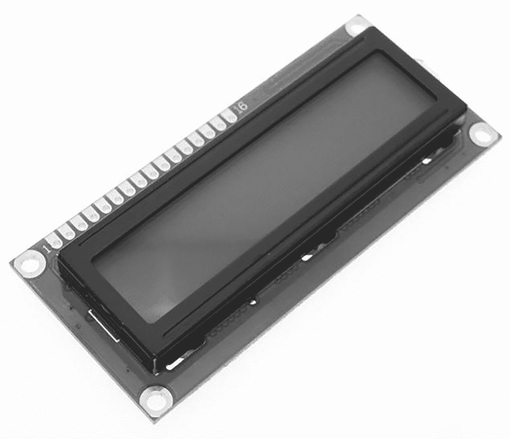

图 13-1：16×2 字符 LCD 模块

一些较为罕见的 LCD 使用 4.5V 而不是 5V 的背光。如果你的 LCD 是这种情况，可以在 5V 电源与 LCD 的 LED+或 A 引脚之间串联一个 1N4004 二极管。

像图 13-1 中的 LCD 通常没有任何接线或连接器。要在无焊面包板上使用 LCD，你需要焊接一些 0.1 英寸 / 2.54 毫米间距的直插针脚（例如 PMD Way 零件号 1242070A），就像图 13-2 中所示的那样。这些针脚通常是 40 针长的，但你可以轻松地将其裁剪为所需的 16 针长度。

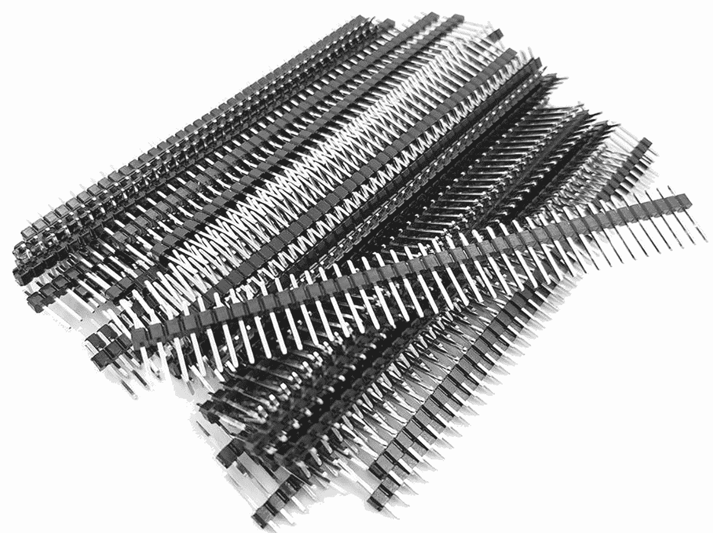

图 13-2：直插针脚

一旦组装完成，你的 LCD 将很容易安装到无焊面包板上，正如图 13-3 所示。请注意引脚 1 至 16 的标签。

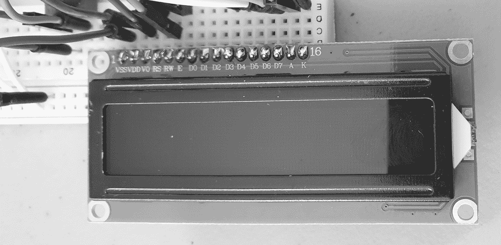

图 13-3：安装在无焊面包板上的 LCD

我们的 LCD 的原理图符号如图 13-4 所示。

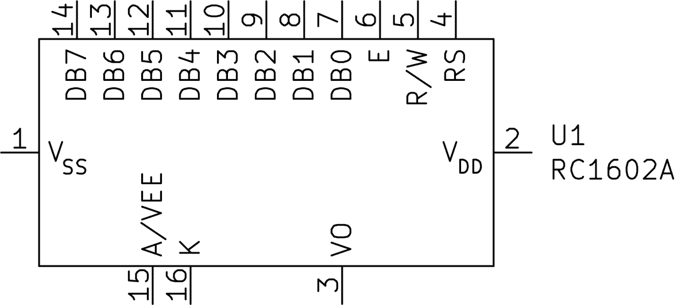

图 13-4：我们 16×2 字符 LCD 的原理图符号

引脚 DB0 至 DB7 构成 LCD 的 8 位数据接口，它与我们的 ATmega328P-PU 微控制器进行通信。如果你需要节省接线，还可以使用 LCD 的 4 位模式，这只需要 DB4 至 DB7。我们将在项目中使用这种方法。

最后，你还需要一个小的 10 kΩ可调电位器来控制显示的对比度。你可以使用不需要额外焊接的面包板兼容电位器，如图 13-5 中所示的那种。

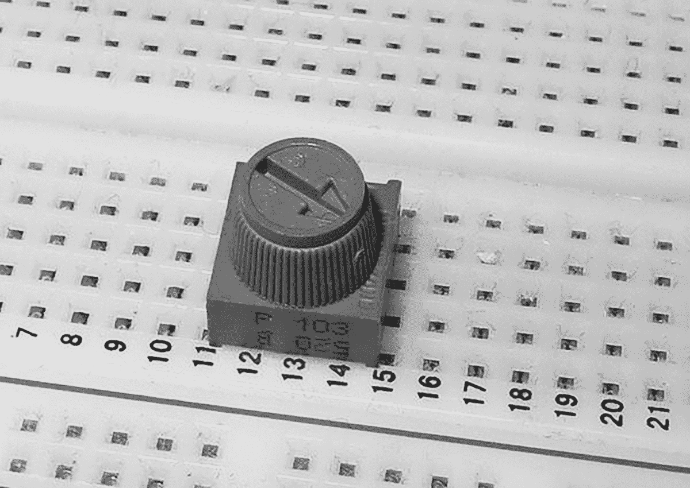

图 13-5：一个面包板电位器的示例

图 13-5 中电位器的原理图符号显示在图 13-6 中。

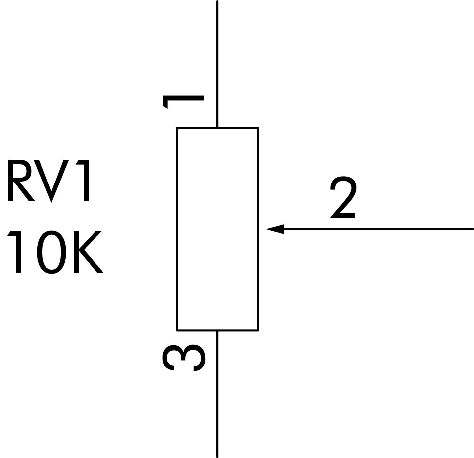

图 13-6：我们面包板电位器的原理图符号

一旦你准备好使用无焊面包板来使用 LCD，就该了解如何显示各种类型的数据了。在你的项目中使用 LCD 时，你需要完成以下任务的函数：

+   • 将指令转换为适当的控制信号，以便向 LCD 发送命令

+   • 初始化 LCD 以供使用

+   • 清除 LCD 上的所有数据

+   • 将光标移动到 LCD 上的指定位置

+   • 在 LCD 上显示文本

由于在我们的 AVR 工具链中没有完成这些任务的现成函数，我们将使用以下部分中描述的自定义函数。

你会注意到，这些函数每次都会向 LCD 发送值以实现某种效果。例如，向 LCD 发送`0x01`会清除屏幕。为了确定我们应该使用哪些值来完成特定的任务，我们参考 LCD 的指令表，这张表格是 HD44780 数据表中的第 6 表格（该表格广泛可用，并包含在本书的代码下载中，地址为[`nostarch.com/avr-workshop/`](https://nostarch.com/avr-workshop/)）。该表格显示了执行特定命令所需的 RS 和 R/_W 引脚的状态，以及该命令的二进制表示。图 13-7 显示了清除显示命令`0x01`。

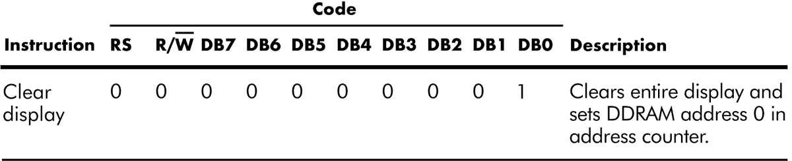

图 13-7：LCD“清屏”命令的数字描述

如图所示，为了清除显示，我们需要将 LCD 的引脚 RS 和 R/_W 设置为低电平，然后将`0b00000001`（或`0x01`）发送到 LCD。我们将通过`commandLCD()`函数来完成这一操作（该函数将在接下来的部分介绍），并通过`clearLCD()`函数（稍后在“清除 LCD”部分中描述）调用它。

在接下来的部分中，请参考 HD44780 数据表中的表格，了解我用来构建其他 LCD 命令的值。之后，你可以使用该表格创建符合你需求的命令。

### 向 LCD 发送命令

所有发送到 LCD 的信息，无论是设置命令还是显示数据，都是按字节发送的。然而，由于我们使用的是 4 位模式的 LCD 来节省硬件连接，我们需要使用以下函数将数据字节拆分成半字节（4 位），并按正确的顺序将它们发送到 LCD：

```

      void commandLCD(uint8_t _command)

      {

      ❶ PORTD = (PORTD & 0x0F)|(_command & 0xF0);

      ❷ PORTD &= ~(1<<PD0);

      ❸ PORTD |= (1<<PD1);

      _delay_us(1);

      ❹ PORTD &= ~(1<<PD1);

      _delay_us(200);

      ❺ PORTD = (PORTD & 0x0F)|(_command << 4);

      ❻ PORTD |= (1<<PD1);

      _delay_us(1);

      ❼ PORTD &= ~(1<<PD1);

      _delay_ms(2);

      }

```

为了理解这段代码的作用，回想一下一个字节的数据由 8 位组成，或者说由 2 个半字节（nibble）组成：高半字节，由第 7 位到第 4 位组成，和低半字节，由第 3 位到第 0 位组成。例如：

```

      `1111` 
      0000    // Ones are the higher nibble

      0000
      `1111` 
      // Ones are the lower nibble

```

`commandLCD()` 函数首先获取命令字节 `_command` 的高半字节 ❶，并使用位运算（参见 第二章）将 GPIO 引脚恢复为低电平。然后它确保 GPIO 引脚设置为与命令字节的高半字节匹配，即命令字节的前半部分。

接下来，它将 LCD 的 RS 引脚设置为低 ❷，这告诉 LCD 我们需要向其指令寄存器发送数据，并迅速将 LCD 的 E 引脚设置为高 ❸ 和低 ❹，这告诉 LCD 将有更多数据到来。

然后该函数使用位运算将低半字节的 4 位上移到高半字节 ❺，这将与用于向 LCD 发送数据的 GPIO 引脚相匹配。最后，它再次设置 LCD 的 E 引脚为高 ❻ 和低 ❼，以完成数据传输。我们使用 `_delay_us()`（微秒延迟，而非毫秒）函数为 LCD 提供时间来处理这些变化。

### 初始化 LCD 使用

像许多其他设备一样，LCD 在我们首次在代码中使用之前需要初始化各种参数。我们将使用 `initLCD()` 函数来完成这个操作：

```

      void initLCD()

      {

      ❶ DDRD = 0b11111111;

      _delay_ms(100);

      ❷ commandLCD(0x02);

      ❸ commandLCD(0x28);

      ❹ commandLCD(0x0C);

      ❺ commandLCD(0x06);

      ❻ commandLCD(0x01);

      _delay_ms(2);

      }

```

这个函数首先将所需的 GPIO 引脚设置为数字输出 ❶。经过短暂延迟以便给 LCD 足够时间唤醒后，它发送命令将光标位置（数据首次显示的位置）重新设置到屏幕的左上角 ❷。接下来的命令配置 LCD 控制器 IC，将其设置为 16×2 字符单元，并使用 4 位数据接口，同时选择一个默认字体，该字体由 5×8 像素的字符组成 ❸。

接下来的命令 ❹ 告诉 LCD 不使用块状光标、不闪烁光标，并开启显示。然后我们告诉 LCD 控制器，需要使光标按增量方式移动 ❺，这样如果我们希望依次显示多个字符，就不需要在每个字符后显式设置光标位置。最后，我们清除 LCD 上的所有字符 ❻，并给它一点时间处理这个变化。

### 清除 LCD

方便的 `clearLCD()` 函数会清除 LCD 上的所有数据：

```

      void clearLCD()

      {

      ❶ commandLCD(0x01);

      _delay_ms(2);

      ❷ commandLCD(0x80);

      _delay_ms(2);

      }

```

我们发送清屏命令 ❶，然后发送将光标返回到 LCD 左上角的命令 ❷。

### 设置光标

`cursorLCD()` 函数将光标设置到 LCD 上的指定位置，之后你可以从该位置开始显示数据：

```

      void cursorLCD(uint8_t column, uint8_t row)

      {

      if (row == 0 && column<16)

      {

      ❶ commandLCD((column & 0x0F)|0x80);

      }

      else if (row == 1 && column<16)

      {

      ❷ commandLCD((column & 0x0F)|0xC0);

      }

      }

```

我们的 LCD 有 2 行 16 个字符：第 0 行和第 1 行，列编号为 0 到 15。该函数根据接收到的位置数据创建所需的 LCD 命令，用于第 0 行位置 ❶ 和第 1 行位置 ❷。

### 向 LCD 打印

`printLCD()` 函数用于在 LCD 上显示数据，如文本或数字：

```

      void printLCD(char *_string)

      {

      uint8_t i;

      ❶ for (i=0; _string[i]!=0; i++)

      {

      ❷ PORTD = (PORTD & 0x0F)|(_string[i] & 0xF0);

      ❸ PORTD |= (1<<PD0);

      ❹ PORTD |= (1<<PD1);

      _delay_us(1);

      ❺ PORTD &= ~(1<<PD1);

      _delay_us(200);

      ❻ PORTD = (PORTD & 0x0F)|(_string[i] << 4);

      ❼ PORTD |= (1<<PD1);

      _delay_us(1);

      ❽ PORTD &= ~(1<<PD1);

      _delay_ms(2);

      }

      }

```

该函数可以接受带引号的文本，如下所示：

```

      printLCD("AVR Workshop!");

      printLCD("3.141592654");

```

或者字符数组，如下所示：

```

      char resultsArray[9];

      printLCD(resultsArray);

```

该函数使用其 `for` 循环 ❶ 逐个发送数组中的每个字符，将字符表示为标准 ASCII 表中的数字值（在 第四章 讨论）。市场上所有 LCD 显示器应支持值为 33 到 125，包括小写和大写字母、数字以及标准常用符号和标点符号。我们使用 `cursorLCD()` 或 `clearLCD()` 函数设置第一个（或唯一）要显示的字符位置。

`printLCD()` 函数与 `commandLCD()` 函数非常相似。它首先获取字符字节 `_string[i]` 的高位半字节 ❷，并使用位运算将 GPIO 引脚清零至低电平。然后确保 GPIO 引脚设置与高位半字节（命令字节的前半部分）匹配。

然后，它将 LCD 的 RS 引脚设置为高电平 ❸，告诉 LCD 我们需要向其指令寄存器发送数据，并迅速将 LCD 的 E 引脚打开 ❹ 和关闭 ❺，告诉 LCD 将有更多数据到来。

函数接着使用位运算将低半字节的 4 位移位至高半字节 ❻，这将与用于向 LCD 发送数据的 GPIO 引脚匹配。最后，它再次将 LCD 的 E 引脚打开 ❼ 和关闭 ❽，完成数据传输。我们使用 `_delay_us()` 函数（延时微秒）让 LCD 有时间处理这些变化。

注意：要使用 `printLCD()` 显示整数变量的内容，请先使用 `itoa(` `a` `,` `b` `,` `c` `)` 将变量 `a` 转换为字符数组 `b`，数组长度最大为 `c` 个字符。您需要在代码中包含 *stdlib.h* 库以及其他 `include` 语句，因为它包含 `itoa()` 函数。

在接下来的项目中，您将把 LCD 应用到实际中。

项目 52：使用 AVR 控制字符 LCD

在此项目中，通过构建自己的 LCD 电路并显示各种信息，您将巩固迄今为止关于控制 LCD 的信息。这将为您在自己的项目中使用 LCD 提供介绍。

### 硬件

要构建您的电路，您将需要以下硬件：

+   • USBasp 程序员

+   • 无焊面包板

+   • 5 V 面包板电源

+   • ATmega328P-PU 微控制器

+   • 16×2 字符 LCD，配有内联引脚头

+   • 10 kΩ 面包板兼容可调电阻器

+   • 两个 22 pF 陶瓷电容器（C1–C2）

+   • 470 μF 16 V 电解电容器 (C3)

+   • 16 MHz 晶体振荡器

+   • 跳线

按照图 13-8 中的示意图组装电路。

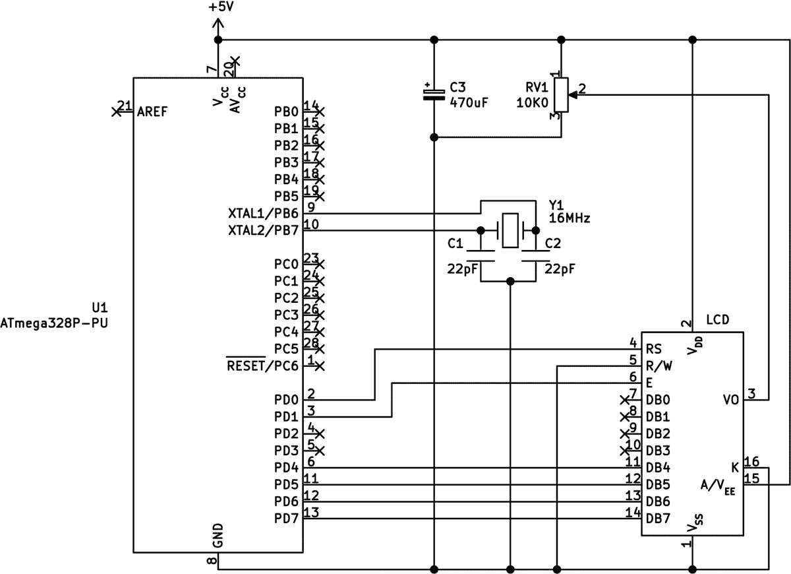

图 13-8：项目 52 的原理图

完成此电路后，请保持电路的组装状态，因为您将在项目 55 中再次使用它。

### 代码部分

打开一个终端窗口，导航到本书 *第十三章* 文件夹下的 *项目 52* 子文件夹，并像往常一样输入命令 `make flash`。几秒钟后，LCD 应该显示图 13-9 中的文本。

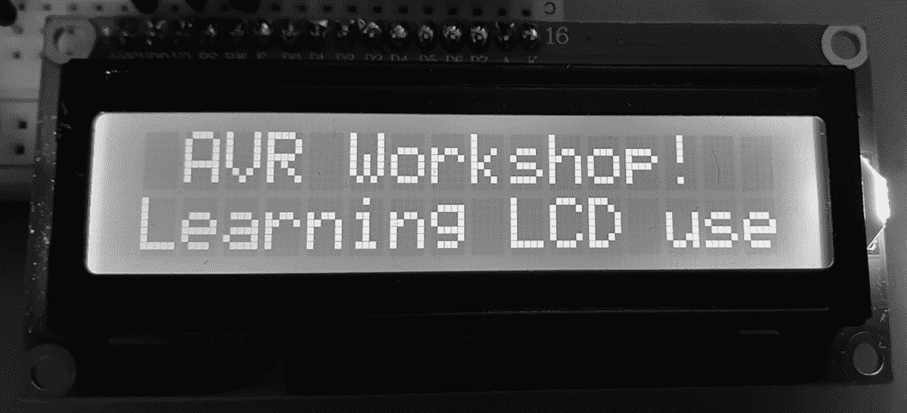

图 13-9：使用项目 52 显示的文本的第一个示例

该文本应很快被一个递增的数字替代，如图 13-10 所示。

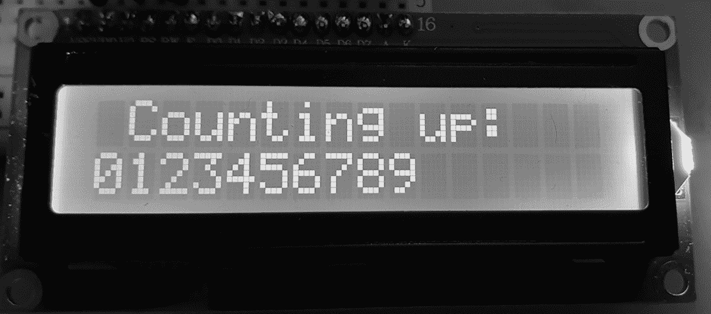

图 13-10：来自项目 52 的计数显示例程

让我们检查一下代码，并回顾使之成为可能的函数：

```

      // Project 52 - Using a Character LCD with Your AVR

      #include <avr/io.h>

      #include <util/delay.h>

      #include <stdlib.h>

      void initLCD()

      {

      DDRD = 0b11111111;

      _delay_ms(100);

      commandLCD(0x02);

      commandLCD(0x28);

      commandLCD(0x0C);

      commandLCD(0x06);

      commandLCD(0x01);

      _delay_ms(2);

      }

      void commandLCD(uint8_t _command)

      {

      PORTD = (PORTD & 0x0F) | (_command & 0xF0

      PORTD &= ~(1<<PD0);

      PORTD |= (1<<PD1);

      _delay_us(1);

      PORTD &= ~(1<<PD1)

      _delay_us(200);

      PORTD = (PORTD & 0x0F) | (_command << 4);

      PORTD |= (1<<PD1);

      _delay_us(1);

      PORTD &= ~(1<<PD1);

      _delay_ms(2);

      }

      void clearLCD()

      {

      commandLCD (0x01);

      _delay_ms(2);

      commandLCD (0x80);

      _delay_ms(2);

      }

      void printLCD(char *_string)

      {

      uint8_t i;

      for(i=0; _string[i]!=0; i++)

      {

      PORTD = (PORTD & 0x0F) | (_string[i] & 0xF0);

      PORTD |= (1<<PD0);

      PORTD |= (1<<PD1);

      _delay_us(1);

      PORTD &= ~(1<<PD1);

      _delay_us(200);

      PORTD = (PORTD & 0x0F) | (_string[i] << 4);

      PORTD |= (1<<PD1);

      _delay_us(1);

      PORTD &= ~(1<<PD1);

      _delay_ms(2);

      }

      }

      void cursorLCD(uint8_t column, uint8_t row)

      // Move cursor to desired column (0–15), row (0–1)

      {

      if (row == 0 && column<16)

      {

      commandLCD((column & 0x0F)|0x80);

      }

      else if (row == 1 && column<16)

      {

      commandLCD((column & 0x0F)|0xC0);

      }

      }

      int main()

      {

      ❶ initLCD();

      ❷ char numbers[9];

      ❸ int i;

      while(1)

      {

      ❹ cursorLCD(1,0);

      printLCD("AVR Workshop!");

      cursorLCD(0,1);

      printLCD("Learning LCD use");

      _delay_ms(1000);

      ❺ clearLCD();

      cursorLCD(1,0);

      printLCD("Counting up:");

      ❻ for (i = 0; i<10; i++)

      {

      ❼ itoa(i,numbers,10);

      cursorLCD(i,1);

      ❽ printLCD(numbers);

      _delay_ms(1000);

      }

      clearLCD();

      }

      }

```

这段代码将前面描述的 LCD 函数付诸实践。在代码的主部分，我们首先初始化 LCD ❶，然后声明一个字符数组用于显示数字 ❷，以及用于计数的必要变量 ❸。

接下来，我们设置显示操作。我们使用 `cursorLCD()` 和 `printLCD()` 函数 ❹ 来定位和显示文本，然后用 `clearLCD()` ❺ 清空显示。`for` 循环 ❻ 会在 LCD 的第二行显示从 0 到 9 的数字（如图 13-10 所示）。我们使用 `itoa()` ❼ 将整数变量 `i` 转换为字符数组，然后通过 `printLCD()` ❽ 显示该数组。

现在你已经了解了如何设置和使用字符型 LCD，让我们通过创建一个数字时钟来充分利用这个技能。

项目 53：基于 AVR 的 LCD 数字时钟制作

在这个项目中，您将结合 DS3231 实时时钟模块和 LCD，制作您自己的数字时钟。

### 硬件部分

要构建电路，您将需要以下硬件：

+   • USBasp 编程器

+   • 无焊面包板

+   • 5 V 面包板电源

+   • ATmega328P-PU 微控制器

+   • 16×2 字符 LCD，带有内联插头针

+   • 10 kΩ 面包板兼容可调电位器（可变电阻）

+   • DS3231 RTC 模块，带备份电池

+   • 两个 22 pF 陶瓷电容器 (C1–C2)

+   • 470 μF 16 V 电解电容器 (C3)

+   • 16 MHz 晶体振荡器

+   • 跳线

按照图 13-11 所示组装电路。别忘了将 DS3231 模块连接到 5V 和 GND。

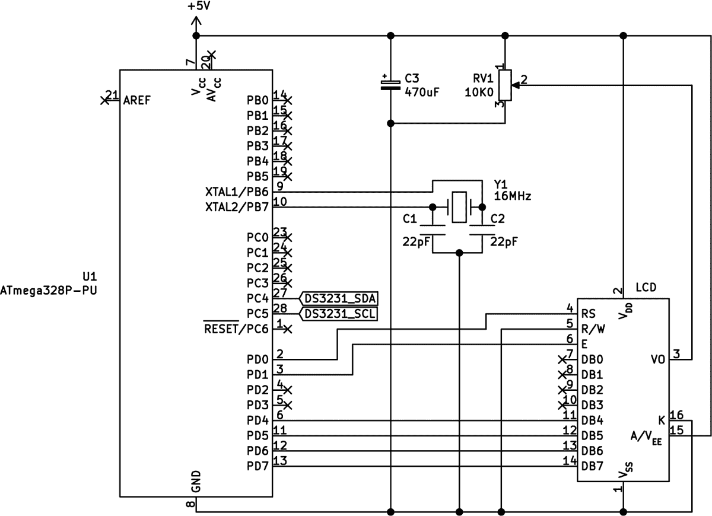

图 13-11：项目 53 的电路图

### 代码

与项目 51 在第十二章中的内容一样，你首先需要在 DS3231 模块中设置时间和日期。在文本编辑器中，打开*Chapter 13*文件夹中*Project 53*子文件夹中的*main.c*文件，并去掉`setTimeDS3231()`函数前的注释符号。更新该函数中的参数以匹配你当前的日期和时间。

现在保存文件，然后像往常一样在终端窗口中使用`make flash`命令。重新打开*main.c*文件，在相同的函数前放置注释符号，保存文件并重新烧录代码。完成后，你应该会看到当前的时间和日期显示在 LCD 模块上。如下图 13-12 所示，恭喜你——你已经制作了自己的 LCD 数字时钟！

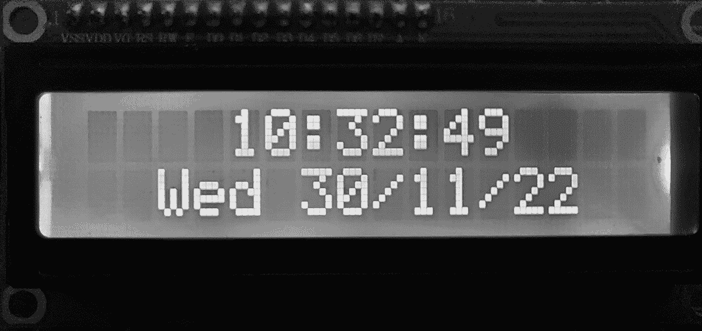

图 13-12： 项目 53 的操作示例

让我们检查一下代码，看看它是如何工作的：

```

      // Project 53 - Building an AVR-Based LCD Digital Clock

      #include <avr/io.h>

      #include <util/delay.h>

      #include <stdlib.h>

      // Variables to store time and date

      uint8_t hours, minutes, seconds, dow, dom, mo, years;

      void I2Cenable()

      // Enable I2C bus

      {

      TWBR = 72;           // 100 kHz I2C bus

      TWCR |= (1 << TWEN); // Enable I2C on PORTC4 and 5

      }

      void I2Cwait()

      // Wait until I2C finishes an operation

      {

      // Wait until bit TWINT in TWCR is set to 1

      while (!(TWCR & (1<<TWINT)));

      }

      void I2CstartWait(unsigned char address)

      {

      uint8_t status;

      while (1)

      {

      // Send START condition

      TWCR = (1<<TWINT) | (1<<TWSTA) | (1<<TWEN);

      // Wait until transmission completes

      I2Cwait();

      // Check value of TWSR, and mask out status bits

      status = TWSR & 0b11111000;

      if ((status != 0b00001000) && (status != 0b00010000)) continue;

      // Send device address

      TWDR = address;

      TWCR = (1<<TWINT) | (1<<TWEN);

      // Wait until transmission completes

      I2Cwait();

      // Check value of TWSR, and mask out status bits

      status = TWSR & 0b11111000;

      if ((status == 0b00100000 )||(status == 0b01011000))

      {

      TWCR = (1<<TWINT) | (1<<TWEN) | (1<<TWSTO);

      // Wait until stop condition is executed and I2C bus released

      while(TWCR & (1<<TWSTO));

      continue;

      }

      break;

      }

      }

      void I2Cstop()

      // Stop I2C bus and release GPIO pins

      {

      // Clear interrupt, enable I2C, generate stop condition

      TWCR |= (1 << TWINT)|(1 << TWEN)|(1 << TWSTO);

      }

      void I2Cwrite(uint8_t data)

      // Send ′data′ to I2C bus

      {

      TWDR = data;

      TWCR |= (1 << TWINT)|(1 << TWEN);

      I2Cwait();

      }

      uint8_t I2Cread()

      // Read incoming byte of data from I2C bus

      {

      TWCR |= (1 << TWINT)|(1 << TWEN);

      I2Cwait();

      // Incoming byte is placed in TWDR register

      return TWDR;

      }

      uint8_t I2CreadACK()

      // Read incoming byte of data from I2C bus and ACK signal

      {

      TWCR |= (1 << TWINT)|(1 << TWEN)|(1 << TWEA);

      I2Cwait();

      // Incoming byte is placed in TWDR register

      return TWDR;

      }

      uint8_t decimalToBcd(uint8_t val)

      // Convert integer to BCD

      {

      return((val/10*16)+(val%10));

      }

      uint8_t bcdToDec(uint8_t val)

      // Convert BCD to integer

      {

      return((val/16*10)+(val%16));

      }

      void setTimeDS3231(uint8_t hh, uint8_t mm, uint8_t ss, uint8_t dw, uint8_t dd,

      uint8_t mo, uint8_t yy)

      // Set the time on DS3231

      {

      I2CstartWait(0xD0);            // DS3231 write

      I2Cwrite(0x00);                // Start with hours register

      I2Cwrite(decimalToBcd(ss));    // Seconds

      I2Cwrite(decimalToBcd(mm));    // Minutes

      I2Cwrite(decimalToBcd(hh));    // Hours

      I2Cwrite(decimalToBcd(dw));    // Day of week

      I2Cwrite(decimalToBcd(dd));    // Date

      I2Cwrite(decimalToBcd(mo));    // Month

      I2Cwrite(decimalToBcd(yy));    // Year

      I2Cstop();

      }

      void readTimeDS3231()

      // Retrieve time and date from DS3231

      {

      I2CstartWait(0xD0);            // DS3231 write

      I2Cwrite(0x00);                // Seconds register

      I2CstartWait(0xD1);            // DS3231 read

      seconds = bcdToDec(I2CreadACK());

      minutes = bcdToDec(I2CreadACK());

      hours = bcdToDec(I2CreadACK());

      dow = bcdToDec(I2CreadACK());

      dom = bcdToDec(I2CreadACK());

      mo = bcdToDec(I2CreadACK());

      years = bcdToDec(I2CreadACK());

      }

      void commandLCD(uint8_t _command)

      {

      // Takes command byte and sends upper nibble, lower nibble to LCD

      PORTD = (PORTD & 0x0F) | (_command & 0xF0);

      PORTD &= ~(1<<PD0);

      PORTD |= (1<<PD1);

      _delay_us(1);

      PORTD &= ~(1<<PD1);

      _delay_us(200);

      PORTD = (PORTD & 0x0F) | (_command << 4);

      PORTD |= (1<<PD1);

      _delay_us(1);

      PORTD &= ~(1<<PD1);

      _delay_ms(2);

      }

      void initLCD()

      {

      DDRD = 0b11111111;

      _delay_ms(100);

      commandLCD(0x02);

      commandLCD(0x28);

      commandLCD(0x0C);

      commandLCD(0x06);

      commandLCD(0x01);

      _delay_ms(2);

      }

      void clearLCD()

      {

      commandLCD (0x01);

      _delay_ms(2);

      commandLCD (0x80);

      _delay_ms(2);

      }

      void printLCD(char *_string)

      {

      uint8_t i;

      for(i=0; _string[i]!=0; i++)

      {

      PORTD = (PORTD & 0x0F) | (_string[i] & 0xF0);

      PORTD |= (1<<PD0);

      PORTD |= (1<<PD1);

      _delay_us(1);

      PORTD &= ~(1<<PD1);

      _delay_us(200);

      PORTD = (PORTD & 0x0F) | (_string[i] << 4);

      PORTD |= (1<<PD1);

      _delay_us(1);

      PORTD &= ~(1<<PD1);

      _delay_ms(2);

      }

      }

      void cursorLCD(uint8_t column, uint8_t row)

      // Move cursor to desired column (0–15), row (0–1)

      {

      if (row == 0 && column<16)

      {

      commandLCD((column & 0x0F)|0x80);

      }

      else if (row == 1 && column<16)

      {

      commandLCD((column & 0x0F)|0xC0);

      }

      }

      int main()

      {

      initLCD();

      I2Cenable();

      char numbers[9];

      // Uncomment to set time and date, then comment and reflash code

      ❶ // setTimeDS3231(8,50,0,3,16,6,21); // h, m, s, dow, dom, m, y

      while(1)

      {

      ❷ readTimeDS3231();

      ❸ itoa(hours,numbers,10);          // Hours

      cursorLCD(4,0);

      ❹ if (hours==0)

      {

      printLCD("00");

      ❺ } else if (hours>0 && hours <10)

      {

      printLCD("0");

      printLCD(numbers);

      } else if (hours>=10)

      {

      printLCD(numbers);

      }

      cursorLCD(6,0);

      printLCD(":");

      itoa(minutes,numbers,10);        // Minutes

      cursorLCD(7,0);

      if (minutes==0)

      {

      printLCD("00");

      } else if (minutes>0 && minutes <10)

      {

      printLCD("0");

      printLCD(numbers);

      } else if (minutes>=10)

      {

      printLCD(numbers);

      }

      cursorLCD(0,9);

      printLCD(":");

      itoa(seconds,numbers,10);        // Seconds

      cursorLCD(10,0);

      if (seconds==0)

      {

      printLCD("00");

      } else if (seconds>0 && seconds <10)

      {

      printLCD("0");

      printLCD(numbers);

      } else if (seconds>=10)

      {

      printLCD(numbers);

      }

      cursorLCD(2,1);                  // Day of week

      ❻ switch(dow)

      {

      case 1 : printLCD("Mon"); break;

      case 2 : printLCD("Tue"); break;

      case 3 : printLCD("Wed"); break;

      case 4 : printLCD("Thu"); break;

      case 5 : printLCD("Fri"); break;

      case 6 : printLCD("Sat"); break;

      case 7 : printLCD("Sun"); break;

      }

      itoa(dom,numbers,10);            // Day of month

      cursorLCD(6,1);

      if (dom<10)

      {

      printLCD("0");

      }

      printLCD(numbers);

      cursorLCD(8,1);

      printLCD("/");

      itoa(mo,numbers,10);             // Month

      cursorLCD(9,1);

      if (mo<10)

      {

      printLCD("0");

      }

      printLCD(numbers);

      cursorLCD(11,1);

      printLCD("/");

      itoa(years,numbers,10);          // Year

      cursorLCD(12,1);

      printLCD(numbers);

      ❼ _delay_ms(900);

      clearLCD();                      // Refresh LCD

      }

      }

```

代码的第一部分包括所有 I²C 功能，用于与我们的 DS3231 RTC 模块读取和写入数据，正如在项目 51 中所描述的，在第十二章中，使用与 MAX7219 显示模块相同的方式处理时间和日期信息。它还包括本章之前解释的每个 LCD 函数。接下来，我们需要确保通过`setTimeDS3231()`函数❶设置时间和日期，然后获取这些信息并以良好的格式在 LCD 上显示。

代码以 24 小时制显示时间，使用两位数字表示小时、分钟和秒。它首先以与项目 51 在第十二章中相同的方式从 DS3231❷获取数据，然后使用`itoa()`❸将小时、分钟和秒信息转换，并通过`cursorLCD()`在 LCD 的正确位置显示每个部分。

为了保持正确的间距和信息显示，我们必须确保 LCD 显示单数字值时前面加上零（例如，表示每月的第六天为 06）。为此，代码会检查时间时钟的值是否为零❹或在 1 到 9 之间❺，然后在任何单数字的时间数据前写入所需的零。它会对小时、分钟、秒、日期和月份值进行此操作。

然后，`switch...case`语句 ❻ 获取星期几数据——一个值从 1 到 7，代表星期日到星期六（或者根据你的地区和偏好，星期一到星期天）——并以缩写形式显示星期几。在所有信息显示完毕后，时钟会等待 900 毫秒 ❼，然后清除显示器，并重新开始。

作为挑战，你可以将这个项目转换成一个带 AM/PM 显示的 12 小时钟，或者添加一个在每天特定时间响起压电蜂鸣器的闹钟。

## 在 LCD 上显示浮点数

我们的下一个项目需要在 LCD 上显示一个浮点数。与整数类似，浮点数首先需要从浮点数转换为字符数组。为此，我们使用`dtostrf()`函数，如第四章中所述，然后像往常一样使用`printLCD()`函数显示字符数组。始终确保为字符数组声明足够的空间，以覆盖整个数字和小数部分。

例如，要显示数字 1.2345678 和 12345.678，可以将项目 54 中的`int main()`循环替换为以下代码：

```

     int main()

     {

     ❶ float a = 1.2345678;

     float b = 12345.678;

     ❷ char displayNumber[10];

     ❸ initLCD();

     while(1)

     {

     ❹ cursorLCD(0,0);

     ❺ dtostrf(a,9,7, displayNumber);

     printLCD(displayNumber);

     cursorLCD(0,1);

     ❻ dtostrf(b,9,3, displayNumber);

     printLCD(displayNumber);

     _delay_ms(1000);

     }

     }

```

我们声明了两个变量，用于在 LCD 上显示两个示范用的数字 ❶，以及在显示过程中使用的字符数组 ❷。然后，我们像往常一样初始化 LCD ❸，并将光标移动到显示器的左上角 ❹。

代码将数字 1.2345678 转换为一个字符串，使用 10 个字符显示，其中 7 个字符位于小数点后 ❺。最后，它使用 9 个字符显示数字 12345.678，这次有 3 个字符位于小数点后 ❻。

刷新代码后，你应该看到类似图 13-13 中的显示效果。

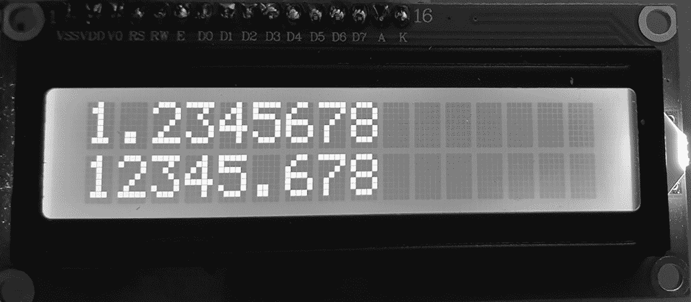

图 13-13：LCD 上的浮点数

这个示例显示了两个正数。如果你想显示负数，请记得为负号留出一个字符空间，位于第一个数字前面。例如，要显示−123.45，你需要分配七个字符空间。

你将在下一个项目中运用这一新技能。

项目 54：带最小/最大显示的 LCD 数字温度计

在这个项目中，你将制作一个数字温度计，能够显示一段时间内的最小和最大温度，以及当前和平均温度。这个项目是如何将前几章的函数结合到新的、更复杂的项目中的另一个示例。

### 硬件

要构建你的电路，你需要以下硬件：

+   • USBasp 编程器

+   • 无焊面包板

+   • 5V 面包板电源

+   • ATmega328P-PU 微控制器

+   • 16×2 字符 LCD，带有内嵌头针

+   • 10 kΩ 面包板兼容调节电位器（可变电阻）

+   • 一个 TMP36 温度传感器

+   • 两个 22 pF 陶瓷电容（C1–C2）

+   • 470 μF 16 V 电解电容（C3）

+   • 0.1 μF 陶瓷电容（C4）

+   • 16 MHz 晶体振荡器

+   • 跳线

按照图 13-14 中的示意图组装电路。别忘了将微控制器的 AV [CC]引脚连接到 5V！

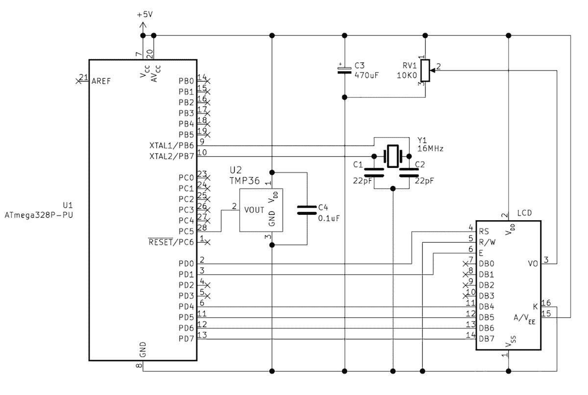

图 13-14：项目 54 原理图

### 代码

打开终端窗口，导航到本书*第十三章*文件夹下的*项目 54*子文件夹，并像往常一样输入命令`make flash`。片刻后，LCD 应交替显示最小和最大温度，如图 13-15 所示，以及当前和平均温度，如图 13-16 所示。温度读数以摄氏度为单位，涵盖了自上次重置或开启项目以来的时间段。

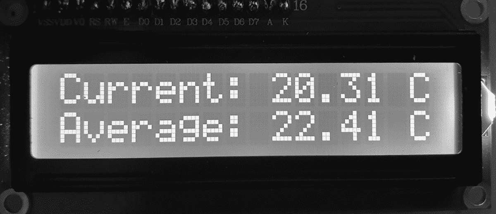

图 13-15：LCD 显示最小和最大温度

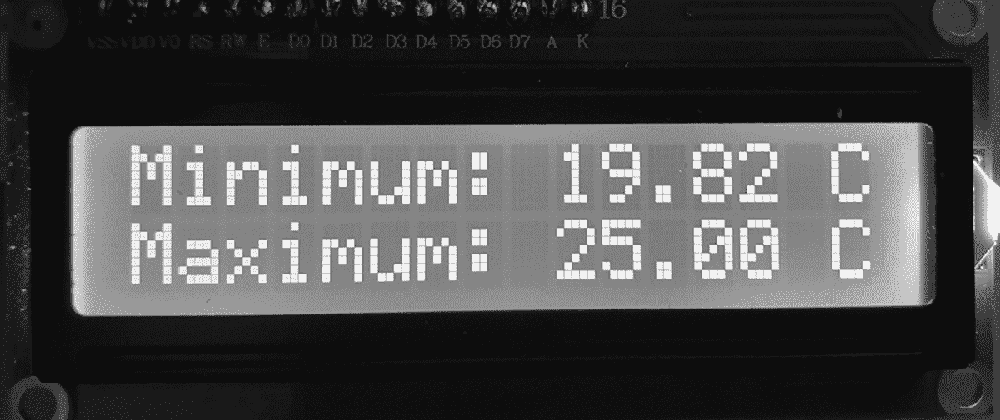

图 13-16：LCD 显示当前和平均温度

让我们来看一下代码，看看它是如何工作的：

```

      // Project 54 - LCD Digital Thermometer with Min/Max Display

      #include <avr/io.h>

      #include <util/delay.h>

      #include <stdlib.h>

      #include <math.h>

      ❶ void startADC()

      // Set up the ADC

      {

      ADMUX |= (1 << REFS0);              // Use AVcc pin with ADC

      ADMUX |= (1 << MUX2) | (1 << MUX0); // Use ADC5 (pin 28)

      // Prescaler for 16MHz (/128)

      ❷ ADCSRA |= (1 << ADPS2) |(1 << ADPS1) | (1 << ADPS0);

      ADCSRA |= (1 << ADEN);              // Enable ADC

      }

      void commandLCD(uint8_t _command)

      {

      PORTD = (PORTD & 0x0F) | (_command & 0xF0);

      PORTD &= ~(1<<PD0);

      PORTD |= (1<<PD1);

      _delay_us(1);

      PORTD &= ~(1<<PD1);

      _delay_us(200);

      PORTD = (PORTD & 0x0F) | (_command << 4);

      PORTD |= (1<<PD1);

      _delay_us(1);

      PORTD &= ~(1<<PD1);

      _delay_ms(2);

      }

      void initLCD()

      {

      DDRD = 0b11111111;

      _delay_ms(100);

      commandLCD(0x02);

      commandLCD(0x28);

      commandLCD(0x0C);

      commandLCD(0x06);

      commandLCD(0x01);

      _delay_ms(2);

      }

      void clearLCD()

      {

      commandLCD (0x01);

      _delay_ms(2);

      commandLCD (0x80);

      _delay_ms(2);

      }

      void printLCD(char *_string)

      {

      uint8_t i;

      for(i=0; _string[i]!=0; i++)

      {

      PORTD = (PORTD & 0x0F) | (_string[i] & 0xF0);

      PORTD |= (1<<PD0);

      PORTD |= (1<<PD1);

      _delay_us(1);

      PORTD &= ~(1<<PD1);

      _delay_us(200);

      PORTD = (PORTD & 0x0F) | (_string[i] << 4);

      PORTD |= (1<<PD1);

      _delay_us(1);

      PORTD &= ~(1<<PD1);

      _delay_ms(2);

      }

      }

      void cursorLCD(uint8_t column, uint8_t row)

      // Move cursor to desired column (0–15), row (0–1)

      {

      if (row == 0 && column<16)

      {

      commandLCD((column & 0x0F)|0x80);

      }

      else if (row == 1 && column<16)

      {

      commandLCD((column & 0x0F)|0xC0);

      }

      }

      int main()

      {

      DDRC = 0b00000000;                // Set PORTC as inputs

      startADC();

      initLCD();

      char numbers[9];

      float temperature;

      float voltage;

      float average;

      ❸ float minimum = -273;             // Needs an initial value

      float maximum;

      uint16_t ADCvalue;

      while(1)

      {

      ❹ // Take reading from TMP36 via ADC

      ADCSRA |= (1 << ADSC);         // Start ADC measurement

      while (ADCSRA & (1 << ADSC) ); // Wait for conversion

      _delay_ms(10);

      // Get value from ADC (which is 10-bit) register

      ADCvalue = ADC;

      // Convert reading to temperature value (Celsius)

      voltage = (ADCvalue * 5);

      voltage = voltage / 1024;

      ❺ temperature = ((voltage - 0.5) * 100);

      // Min/max and average

      ❻ if (temperature < minimum)

      {

      minimum = temperature;

      }

      if (temperature > maximum)

      {

      maximum = temperature;

      }

      ❼ average = ((minimum+maximum)/2);

      ❽ // Display information

      cursorLCD(0,0);

      printLCD("Current:");

      dtostrf(temperature,6,2,numbers);

      printLCD(numbers);

      cursorLCD(15,0);

      printLCD("C");

      cursorLCD(0,1);

      printLCD("Average:");

      dtostrf(average,6,2,numbers);

      printLCD(numbers);

      cursorLCD(15,1);

      printLCD("C");

      _delay_ms(1000);

      clearLCD();

      cursorLCD(0,0);

      printLCD("Minimum:");

      dtostrf(minimum,6,2,numbers);

      printLCD(numbers);

      cursorLCD(15,0);

      printLCD("C");

      cursorLCD(0,1);

      printLCD("Maximum:");

      dtostrf(maximum,6,2,numbers);

      printLCD(numbers);

      cursorLCD(15,1);

      printLCD("C");

      _delay_ms(1000);

      clearLCD();

      }

      }

```

本项目的代码分为两个部分：从 TMP36 传感器获取温度（如第三章所示），然后使用 LCD 显示温度值。

我们首先使用一系列函数和命令来激活 28 号引脚上的 ADC，并在主代码中调用它 ❶。`startADC()`函数与之前项目中的对应函数略有不同；由于我们现在在 16 MHz 的频率下操作微控制器，而不是 1 MHz，我们需要一个更大的分频器来操作 ADC。因此，我们将 ADCSRA 寄存器设置为使用 128 的分频器 ❷。我们通过将 16 MHz 除以 200 kHz（ADC 的理想速度）得到 80；最接近的分频器值是 128，因此我们使用它。

代码从 ADC ❹读取原始数据，并将其转换为摄氏度 ❺。然后，它会判断当前温度是最小值还是最大值 ❻，并计算自上次重置以来测得的平均温度 ❼。请注意，变量`minimum`的初始值被设置为−273 度 ❸。如果我们没有给它初始值，它将默认为 0，这样我们就无法得到真实的最小温度值（除非传感器在户外，温度从未低于冰点！）。最后，我们使用本章前面提到的 LCD 函数 ❽，在两个屏幕上显示所有这些温度数据。

你当然可以通过将温度值乘以 1.8 并加上 32 来将其转换为华氏温度。或者，如果你想挑战一下自己，为什么不将这个项目与在项目 53 中学到的内容结合起来，制作一个显示当前温度的时钟呢？

完成实验后，让我们继续创建最终的输出类型：自定义字符。

## 在 LCD 上显示自定义字符

除了使用大多数键盘上可用的标准字母、数字和符号外，你还可以在每个项目中定义最多八个自己的字符。如你所知，LCD 模块中的每个字符由八行五个像素组成，如图 13-17 所示。

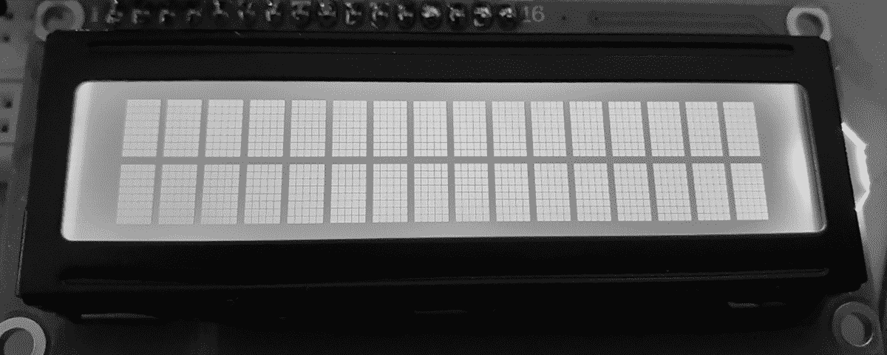

图 13-17：每个 LCD 字符由八行五个像素组成。

要显示你自己的自定义字符，你必须首先使用一个包含八个元素的数组（每个字符一行）来定义每个字符。元素的值定义了该行像素的状态。例如，要创建一个简单的“笑脸”，可以像图 13-18 中那样在网格上规划像素。

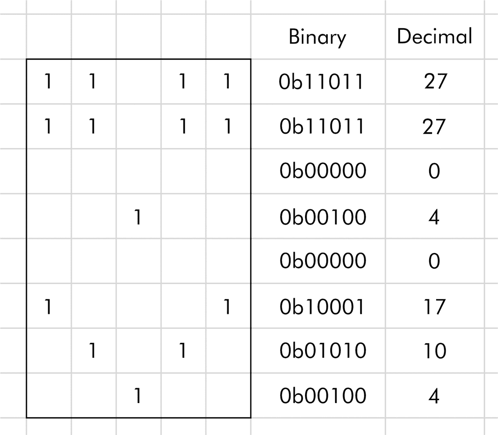

图 13-18：自定义笑脸字符的元素

通过将每一条横线从与像素开或关状态相匹配的二进制数转换为十进制数，可以将每条横线转化为一个值。然后创建一个数组，通过输入八个十进制值来定义你的自定义字符，如下图所示，参见图 13-18：

```

     uint8_t smiley[] = {27,27,0,4,0,17,10,4};

```

本章的代码包括一个电子表格，简化了这个数组创建过程。

一旦你创建了数组，你需要将其编程到 LCD 的*字符生成 RAM（CGRAM）*中。这是一种在 LCD 的控制芯片中使用的 RAM，用于存储显示字符的设计。我们的 LCD 的 CGRAM 中有八个可用位置。为了写入这个字符数据并使用自定义字符，我们将使用接下来的几个自定义函数。

### 写入数据到 CGRAM

`writeLCD()`函数将单行数据写入 LCD 的 CGRAM：

```

      void writeLCD(uint8_t _data)

      {

      PORTD |= (1<<PD0); // RS high

      PORTD = (PORTD & 0x0F) | (_data & 0xF0);

      PORTD |= (1<<PD1);

      _delay_us(1);

      PORTD &= ~(1<<PD1);

      _delay_us(200);

      PORTD = (PORTD & 0x0F) | (_data);

      PORTD |= (1<<PD1);

      _delay_us(1);

      PORTD &= ~(1<<PD1);

      _delay_ms(2);

      }

```

这个函数的工作方式与我们的`commandLCD()`函数相同，只是`writeLCD()`将 LCD 的 RS 引脚设为高，而不是低，这告诉 LCD 接收到的数据是要写入 CGRAM 的，而不是常规命令。它与以下两个函数一起使用。

### 将自定义字符数据发送到 LCD

`createCC()`函数将自定义字符数据数组（`ccdata[]`）导入指定的 CGRAM 内存位置（`slot`），范围从 0 到 7：

```

      void createCC(uint8_t ccdata[], uint8_t slot)

      {

      uint8_t x;

      ❶ commandLCD(0x40+(slot*8)); // Select character memory (0-7)

      for (x = 0; x<8; x++)

      {

      ❷ writeLCD(ccdata[x]<<4);

      }

      }

```

我们指示 LCD 准备字符数据，并将其存储在变量`slot`中的字符位置❶，然后使用`writeLCD()`函数依次将字符数组的每个元素发送到 LCD 的 CGRAM❷。

### 在 LCD 上显示自定义字符

`printCCLCD()`函数显示 LCD 的八个自定义字符中的一个，并将其存储在位置`slot`：

```

      void printCCLCD(uint8_t slot)

      {

      PORTD = (PORTD & 0x0F) | (slot & 0xF0);

      PORTD |= (1<<PD0);

      PORTD |= (1<<PD1);

      _delay_us(1);

      PORTD &= ~(1<<PD1);

      _delay_us(200);

      PORTD = (PORTD & 0x0F) | (slot << 4);

      PORTD |= (1<<PD1);

      _delay_us(1);

      PORTD &= ~(1<<PD1);

      _delay_ms(2);

      }

```

这个函数的操作方式类似于`printLCD()`，但它不需要字符串解码，直接在当前光标位置的 CGRAM 位置 0 到 7（`slot`）显示字符。

下一个项目演示了如何使用这些函数显示自定义字符。

项目 55：显示自定义 LCD 字符

在本项目中，你将重复使用项目 52 的硬件，练习在 LCD 上创建并显示自定义字符。打开一个终端窗口，导航到本书*第十三章*文件夹中的*项目 55*子文件夹，然后像往常一样输入命令`make flash`。片刻后，LCD 应显示八个自定义字符，如图 13-19 所示。

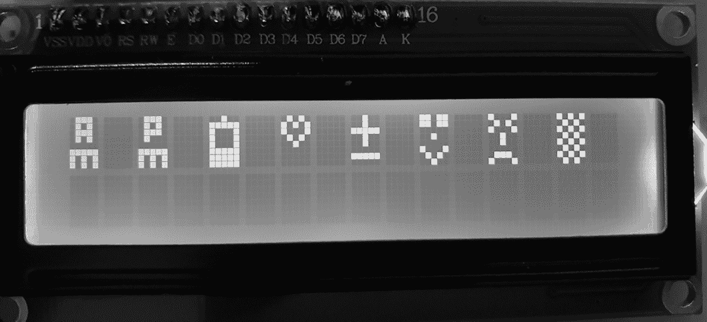

图 13-19： 项目 55 的结果

让我们看看代码，了解它是如何工作的：

```

      // Project 55 - Displaying Custom LCD Characters

      #include <avr/io.h>

      #include <util/delay.h>

      uint8_t ch0[] = {14,10,14,10,0,31,21,21};  // "AM"

      uint8_t ch1[] = {14,10,14,8,0,31,21,21};   // "PM"

      uint8_t ch2[] = {4,31,17,17,17,31,31,31};  // "Battery"

      uint8_t ch3[] = {10,21,17,10,4,0,0,0};     // "Heart"

      uint8_t ch4[] = {4,4,31,4,4,0,31,0};       // "+ -"

      uint8_t ch5[] = {27,27,0,4,0,17,10,4};     // "Happy face"

      uint8_t ch6[] = {17,10,17,4,4,0,14,17};    // "Sad face"

      uint8_t ch7[] = {21,10,21,10,21,10,21,10}; // "Pattern"

      ❶ void writeLCD(uint8_t _data)

      // Used for writing to CGRAM

      {

      PORTD |= (1<<PD0); // RS high

      PORTD = (PORTD & 0x0F) | (_data & 0xF0);

      PORTD |= (1<<PD1);

      _delay_us(1);

      PORTD &= ~(1<<PD1);

      _delay_us(200);

      PORTD = (PORTD & 0x0F) | (_data);

      PORTD |= (1<<PD1);

      _delay_us(1);

      PORTD &= ~(1<<PD1);

      _delay_ms(2);

      }

      ❷ void commandLCD(uint8_t _command)

      {

      PORTD = (PORTD & 0x0F) | (_command & 0xF0);

      PORTD &= ~(1<<PD0);                     // RS low

      PORTD |= (1<<PD1);

      _delay_us(1);

      PORTD &= ~(1<<PD1);

      _delay_us(200);

      PORTD = (PORTD & 0x0F) | (_command << 4);

      PORTD |= (1<<PD1);

      _delay_us(1);

      PORTD &= ~(1<<PD1);

      _delay_ms(2);

      }

      ❸ void createCC(uint8_t ccdata[], uint8_t slot)

      // Sends custom character data to LCD

      {

      uint8_t x;

      commandLCD(0x40+(slot*8));              // Select character memory (0–7)

      for (x = 0; x<8; x++)

      {

      writeLCD(ccdata[x]<<4);

      }

      }

      ❹ void printCCLCD(uint8_t slot)

      {

      PORTD = (PORTD & 0x0F) | (slot & 0xF0);

      PORTD |= (1<<PD0);

      PORTD |= (1<<PD1);

      _delay_us(1);

      PORTD &= ~(1<<PD1);

      _delay_us(200);

      PORTD = (PORTD & 0x0F) | (slot << 4);

      PORTD |= (1<<PD1);

      _delay_us(1);

      PORTD &= ~(1<<PD1);

      _delay_ms(2);

      }

      void initLCD()

      {

      DDRD = 0b11111111;

      _delay_ms(100);

      commandLCD(0x02);

      commandLCD(0x28);

      commandLCD(0x0C);

      commandLCD(0x06);

      commandLCD(0x01);

      _delay_ms(2);

      }

      void clearLCD()

      {

      commandLCD (0x01);

      _delay_ms(2);

      commandLCD (0x80);

      _delay_ms(2);

      }

      void printLCD(char *_string)

      {

      uint8_t i;

      for(i=0; _string[i]!=0; i++)

      {

      PORTD = (PORTD & 0x0F) | (_string[i] & 0xF0);

      PORTD |= (1<<PD0);

      PORTD |= (1<<PD1);

      _delay_us(1);

      PORTD &= ~(1<<PD1);

      _delay_us(200);

      PORTD = (PORTD & 0x0F) | (_string[i] << 4);

      PORTD |= (1<<PD1);

      _delay_us(1);

      PORTD &= ~(1<<PD1);

      _delay_ms(2);

      }

      }

      void cursorLCD(uint8_t column, uint8_t row)

      // Move cursor to desired column (0–15), row (0–1)

      {

      if (row == 0 && column<16)

      {

      commandLCD((column & 0x0F)|0x80);

      }

      else if (row == 1 && column<16)

      {

      commandLCD((column & 0x0F)|0xC0);

      }

      }

      int main()

      {

      initLCD();

      while(1)

      {

      ❺ createCC(ch0,0); // "AM"

      createCC(ch1,1); // "PM"

      createCC(ch2,2); // "Battery"

      createCC(ch3,3); // "Heart"

      createCC(ch4,4); // "+ -"

      createCC(ch5,5); // "Happy face"

      createCC(ch6,6); // "Sad face"

      createCC(ch7,7); // "Pattern"

      ❻ cursorLCD(0,0);

      printCCLCD(0);

      cursorLCD(2,0);

      printCCLCD(1);

      cursorLCD(4,0);

      printCCLCD(2);

      cursorLCD(6,0);

      printCCLCD(3);

      cursorLCD(8,0);

      printCCLCD(4);

      cursorLCD(10,0);

      printCCLCD(5);

      cursorLCD(12,0);

      printCCLCD(6);

      cursorLCD(14,0);

      printCCLCD(7);

      _delay_ms(1000);

      clearLCD();

      }

      }

```

本项目演示了使用前面描述的三个自定义函数来完成繁重工作时，创建自定义字符是多么简单：它们分别负责写入自定义字符数据❶、向 LCD 发送命令❷以及将自定义字符数据发送到 LCD❸。我们只需插入所需的字符数据❹，然后通过`createCC()`函数依次将数据输入 LCD 的 CGRAM 的每个位置❺。最后，我们通过`cursorLCD()`和`printCCLCD()`函数依次定位光标并显示每个自定义字符❻。

完成本章内容后，你将具备在廉价且流行的 LCD 模块上显示各种文本和数字数据以及你自己创建的自定义字符的技能。作为挑战，尝试创建自己的 AVR LCD 库，以便在未来的项目中更轻松地包含此代码；每次想使用 LCD 时，这个库将节省开发时间并降低复杂性。

在下一章也是最后一章，你将为你不断增长的 AVR 工具箱添加另一个工具：控制伺服电机的能力。
