# 第十四章：# 控制伺服电机


第八章中的多个项目使用了直流电机，适用于旋转设备，如机器人车轮。然而，对于更精确的电机控制选项，您可以使用*伺服电机*，即*伺服机构*的简称。伺服电机内部包含电动机，可以通过 PWM 信号旋转到特定的角度位置。

伺服电机在许多应用中都非常有用。例如，您可能会将伺服电机连接到*舵角*，它是伺服电机旋转的小臂或杆，用来控制遥控汽车的转向。您还可以将一个物理指示器连接到伺服电机，让它显示诸如温度等信息，或者使用伺服电机来升降旋转钻。

在本章中，您将：

+   • 学习如何将 ATmega328P-PU 微控制器连接到伺服电机，并使用 PWM 控制它。

+   • 学习如何独立控制两个伺服电机。

+   • 构建一个模拟温度计和一个模拟时钟。

## 设置您的伺服电机

市面上有各种类型的伺服电机，从小型单位（如数字相机中的便携式设备）到大型单位（如用于机器人制造组装设备）。在选择伺服电机时，请考虑多个参数：

速度 伺服电机旋转所需的时间，通常以每个角度度数的秒数来衡量。

旋转范围 伺服电机可以旋转的角度范围，例如 180 度（半个完整旋转）或 360 度（一个完整旋转）。

电流 伺服电机的电流消耗。当您将伺服电机与 Arduino 一起使用时，可能需要为伺服电机提供外部电源。

转矩 伺服电机旋转时所能施加的力。转矩越大，伺服电机能够控制的物体就越重。产生的转矩通常与所用电流量成正比。

本章中的示例将使用一种便宜且紧凑的伺服电机，如图 14-1 所示，通常被称为 SG90 型伺服电机。我们将把这种伺服电机与三种不同类型的舵角连接，图中也有显示。

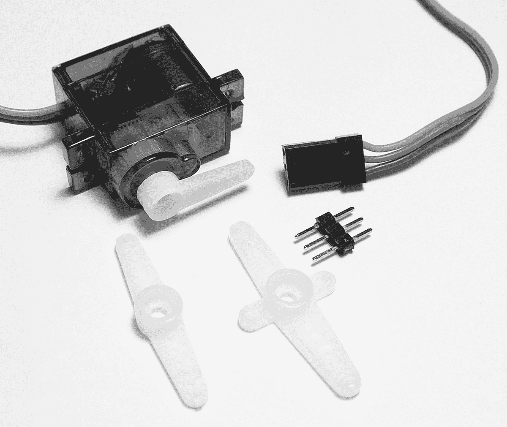

图 14-1：伺服电机与各种舵角

该伺服电机可旋转最多 180 度，如图 14-2 所示。

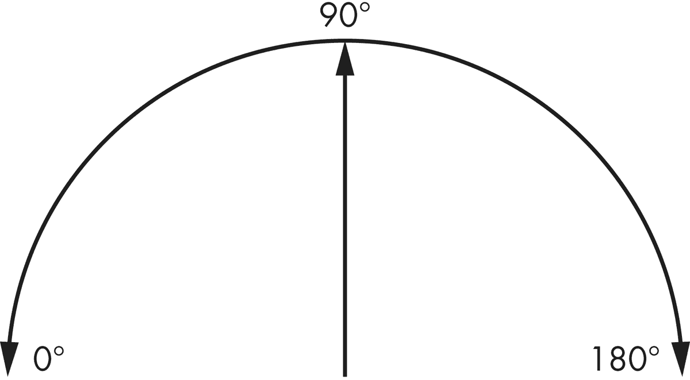

图 14-2：伺服电机旋转范围示例

伺服电机内部有一个小型直流电机，通过*减速齿轮*与舵角主轴连接，这些减速齿轮将直流电机的旋转速度降低到适合伺服电机的较慢速度。伺服电机还包含一个*反馈控制器*，它会测量直流电机轴的旋转位置，从而使伺服电机的位置更加精确。

### 连接伺服电机

你只需要三根线就能将伺服电机连接到你的微控制器。如果你使用的是 SG90，最深色的线连接到 GND，中间的线连接到 5 V，最浅色的线（*脉冲* 或 *PWM* 线）连接到一个具备 PWM 功能的数字引脚。如果你使用的是其他伺服电机，请查阅其数据手册以获得正确的接线方式。我们将使用 图 14-3 中展示的标准伺服电机电路符号。

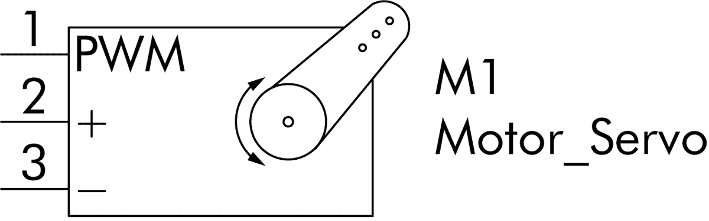

图 14-3：伺服电机的电路符号

所有你会遇到的爱好者和实验产品中的伺服电机都使用相同的电路符号。

### 控制伺服电机

我们通过改变连接到伺服电机脉冲线的 PWM 信号的占空比来设置伺服电机的旋转角度。一般来说，伺服电机需要一个频率为 50 Hz，周期为 20 毫秒的 PWM 信号。将信号的占空比设置为不同的值会导致伺服电机的内部控制器将舵机移动到一个与占空比成反比例关系的角度。

以我们的 SG90 伺服电机为例，如果我们将占空比设置为 12%（或 2.4 毫秒，占总周期 20 毫秒的 2.4 毫秒），如 图 14-4 所示，舵机将旋转到 0 度。

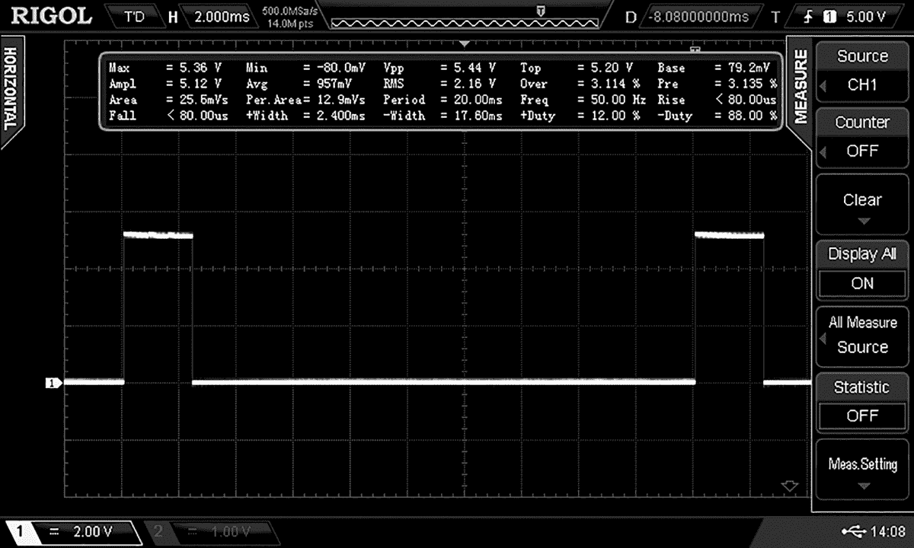

图 14-4：0 度的 PWM 信号

如果我们将占空比设置为 3%，如 图 14-5 所示，舵机将旋转到 180 度。

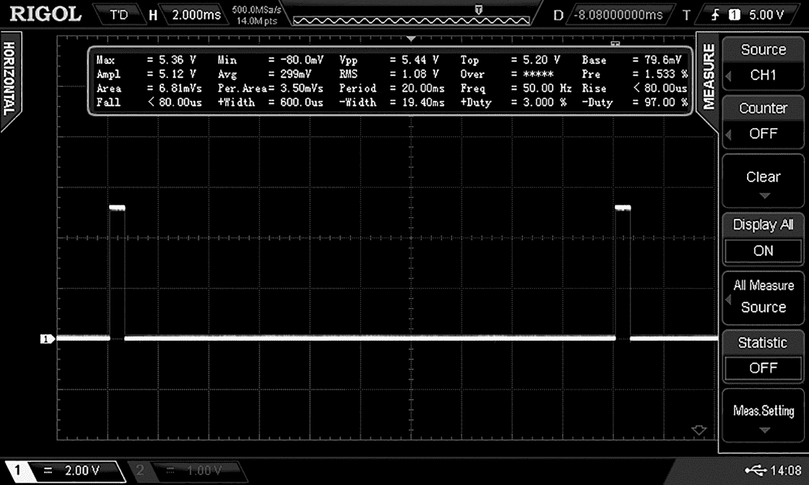

图 14-5：180 度的 PWM 信号

我们将把启用 PWM 输出所需的代码放在一个名为 `initPWM()` 的函数中：

```

      void initPWM()

      {  // Activate PWM on PB1

      ❶ TCCR1A |= (1 << WGM11);

      TCCR1B |= (1 << WGM12)|(1 << WGM13)|(1 << CS11);

      // Connect PWM to PB1

      ❷ TCCR1A |= (1 << COM1A1); // PWM to OCR1A - PB1

      ❸ ICR1=39999;

      }

```

这个函数将 TIMER1 设置为快速 PWM 模式。它将预分频器设置为 8，以获得 2 MHz 的计时器频率 ❶，并将输出发送到 PB1 ❷。（如果你需要回顾如何生成 PWM 信号，请参阅 第七章。）计时器将从 0 计数到 39,999，然后重置 ❸，每个周期的长度为 0.0000005 秒（*时间* = 1/ *频率*）。这给出了一个完整的脉冲周期为 20 毫秒。

然后我们将使用 OCR1A 来设置占空比，从而控制伺服电机的位置。我们知道，12% 的占空比会使舵机旋转到 0 度，因此我们可以通过将 40,000（记住计数器从 0 开始计数，到 39,999）乘以 0.12 来计算所需的 OCR1A 值，结果为 4,799。为了完成 180 度的旋转，我们需要将 OCR1A 设置为 1,199（40,000 × 0.12）。

如果你使用的是非 SG90 的伺服电机，确定 0 度和 180 度旋转所需的占空比值，然后使用前述段落中的计算方法来确定所需的 OCR1A 值。你应该能够从伺服电机供应商或零售商那里获得占空比信息。

现在，让我们通过以不同方式旋转伺服电机，将你刚刚学到的知识付诸实践。

项目 56：实验伺服电机

在这个项目中，你将学习伺服控制的基础知识，包括伺服运动所需的电路和指令。

### 硬件

要构建你的电路，你将需要以下硬件：

+   • USBasp 编程器

+   • 无焊面包板

+   • 5 V 面包板电源

+   • ATmega328P-PU 微控制器

+   • 两个 22 pF 陶瓷电容器（C1–C2）

+   • 470 μF 16 V 电解电容器（C3）

+   • 16 MHz 晶体振荡器

+   • SG90 伺服电机

+   • 跳线

按照 图 14-6 所示组装电路。

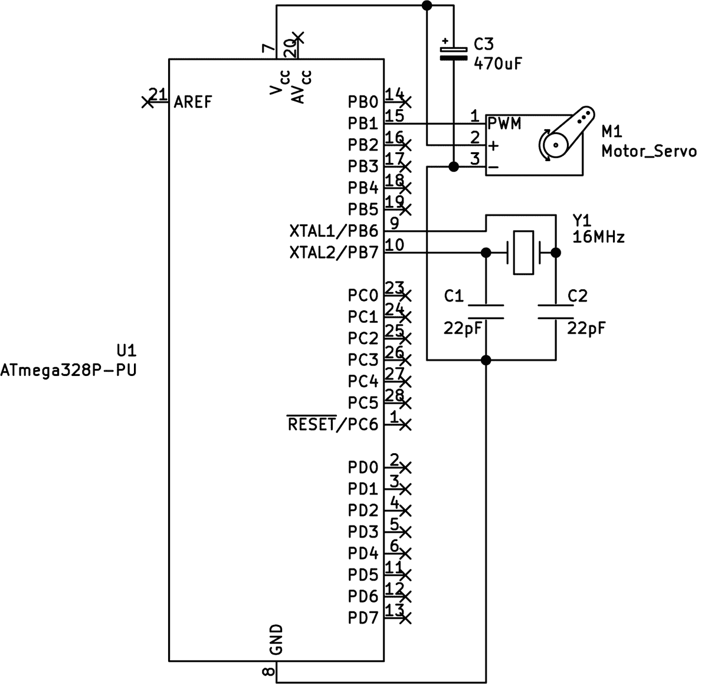

图 14-6： 项目 56 的原理图

请注意在 5 V 和 GND 线路上使用的大型电解电容器。当伺服电机工作时，由于电机的快速启停，可能会产生波动的电压，因此我们使用电容器来平滑电源，使其更加稳定，保持 5 V 电压。

### 代码

打开一个终端窗口，导航到本书 *第十四章* 文件夹中的 *项目 56* 子文件夹，并像往常一样输入命令 `make flash`。片刻之后，伺服电机应该会快速旋转，从 0 到 180 度，然后以更慢的速度再次旋转，最后再以更慢的速度回到 0 度。

让我们来看一下代码，了解它是如何工作的：

```

      // Project 56 - Experimenting with Servos

      #include <avr/io.h>

      #include <util/delay.h>

      ❶ void initPWM()

      {

      // Activate PWM on PB1

      TCCR1A |= (1 << WGM11);

      TCCR1B |= (1 << WGM12)|(1 << WGM13)|(1 << CS11);

      // Connect PWM to PB1

      TCCR1A |= (1 << COM1A1); // PWM to OCR1A - PB1

      ICR1=39999;

      }

      ❷ void servoRange()

      {

      OCR1A=4799;              // 0 degrees

      _delay_ms(1000);

      OCR1A=1199;              // 180 degrees

      _delay_ms(1000);

      }

      ❸ void servoAngle(uint8_t angle)

      {

      // Rotate servo to 'angle' position

      ❹ OCR1A = ((angle-239.95)/-0.05);

      // Convert angle to OCR1A (duty cycle) value

      }

      int main()

      {

      ❺ DDRB|=(1<<PB1);

      initPWM();

      uint8_t i;

      while(1)

      {

      ❻ servoRange();

      _delay_ms(1000);

      for (i=0; i<=180; i++)

      {

      ❼ servoAngle(i);

      _delay_ms(25);

      }

      for (i=180; i>0; --i)

      {

      ❽ servoAngle(i);

      _delay_ms(5);

      }

      }

      }

```

我们首先定义了三个函数：`initPWM()` ❶，用于处理 PWM 初始化；`servoRange()` ❷，为了演示目的，它简单地通过设置 OCR1A 和占空比值，将伺服臂在 0 到 180 度之间旋转；以及有用的自定义函数 `servoAngle(uint8_t angle)` ❸，它接受一个数字（我们期望的伺服位置的旋转角度），并将其转换为需要存储在 OCR1A ❹ 中的占空比值。这简化了控制伺服的任务，自动将我们想要的角度转换为 4,799 到 1,199 之间的正确占空比，公式为 *angle* = ( *counter* – 239.95) / −0.05。这些值通常用于大多数常见的小型伺服电机，但如果不确定，最好向供应商咨询。

在代码的主部分，我们首先将连接到伺服脉冲线的引脚设置为输出 ❺，然后调用 `initPWM()` 函数启用 PWM。我们调用 `servoRange()` ❻ 来快速地将伺服臂从 0 到 180 度旋转，然后使用 `for` 循环 ❼ 和 ❽ 以较慢的速度重复这个过程。每次移动时，伺服臂会在两个方向上各移动一个角度，并引入延迟。

注：`servoAngle()` 函数的公式是通过线性代数创建的，基于两组点：（4799,0）和（1199,180）。如果你的伺服电机需要不同的占空比值，你可以使用在线工具，如 GeoGebra（[`www.geogebra.org/m/UyfrABcN`](https://www.geogebra.org/m/UyfrABcN)），来确定你自己的公式。

现在你已经有了控制伺服电机的代码框架，我们将它与之前关于使用 TMP36 温度传感器的知识结合，来构建一个模拟温度计。

项目 57：创建一个模拟温度计

你可以通过将一个箭头附加到伺服电机的舵轮上，并制作一个带有温度范围的背板来显示温度读数。这个项目会显示 0 到 30 摄氏度之间的温度，但你可以修改它以显示不同的温度范围。

### 硬件

要构建你的电路，你需要以下硬件：

+   • USBasp 编程器

+   • 无焊接面包板

+   • 5V 面包板电源

+   • ATmega328P-PU 微控制器

+   • 一只 TMP36 温度传感器

+   • 两个 22 pF 陶瓷电容（C1–C2）

+   • 470 μF 16V 电解电容（C3）

+   • 0.1 μF 陶瓷电容（C4）

+   • 16 MHz 晶体振荡器

+   • SG90 兼容伺服电机

+   • 跳线

按照 图 14-7 中所示的方式组装你的电路。别忘了将微控制器的 AV [CC] 引脚连接到 5V。

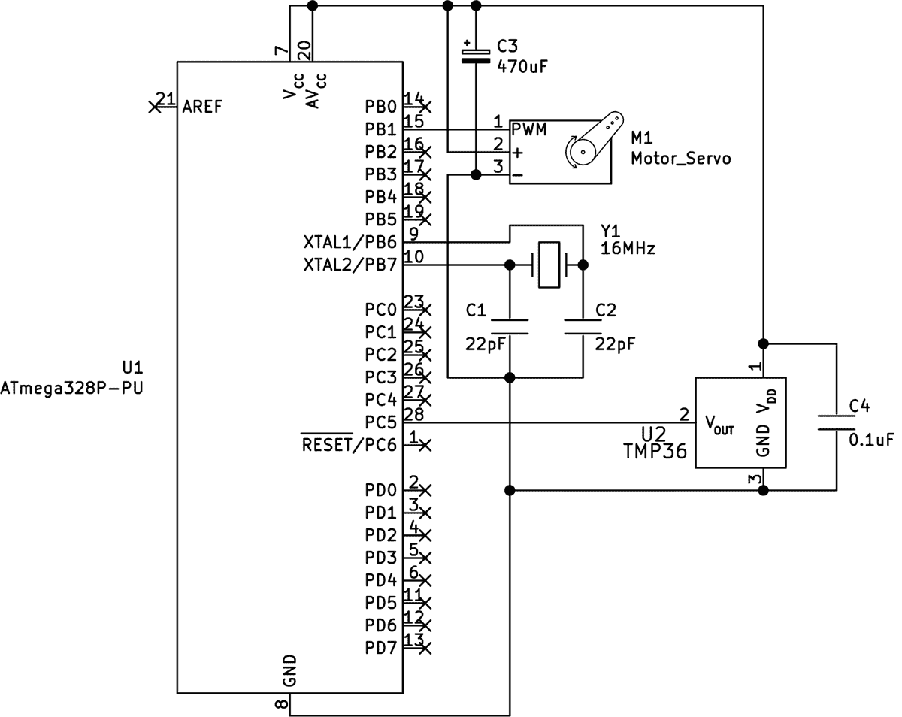

图 14-7：项目 57 的原理图

图 14-8 显示了伺服电机将要显示的温度范围背板的样子，背板上附有一个小箭头作为指示器。

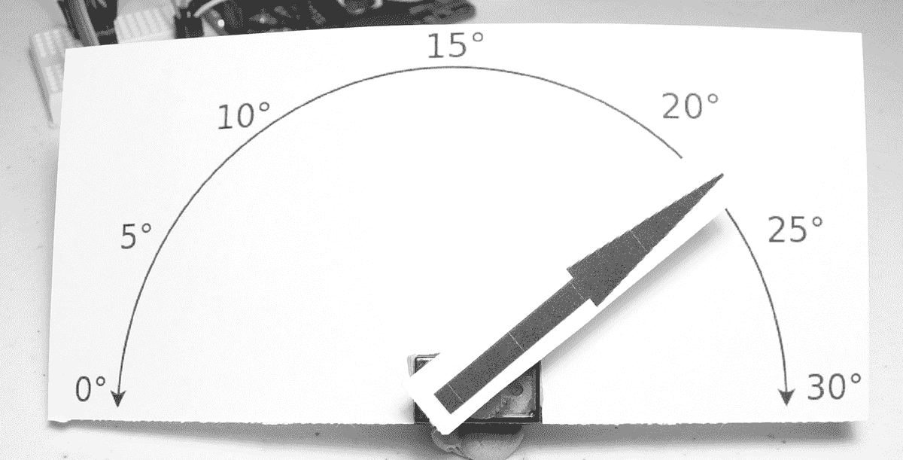

图 14-8：显示温度的背板

### 代码

打开终端窗口，进入本书 *第十四章* 文件夹下的 *项目 57* 子文件夹，然后像往常一样输入命令 `make flash`。几秒钟后，伺服电机的舵轮应该会摆动到一个代表温度的角度位置，以摄氏度为单位。

让我们来看一下代码，看看它是如何工作的：

```

      // Project 57 - Creating an Analog Thermometer

      #include <avr/io.h>

      #include <util/delay.h>

      #include <stdlib.h>

      #include <math.h>

      void startADC()

      // Set up the ADC

      {

      ADMUX |= (1 << REFS0);                 // Use AVcc pin with ADC

      ADMUX |= (1 << MUX2) | (1 << MUX0);    // Use ADC5 (pin 28)

      ADCSRA |= (1 << ADPS2) |(1 << ADPS1) | (1 << ADPS0);

      // Prescaler for 16MHz (/128)

      ADCSRA |= (1 << ADEN);                 // Enable ADC

      }

      void initPWM()

      {

      // Activate PWM on PB1

      TCCR1A |= (1 << WGM11);

      TCCR1B |= (1 << WGM12)|(1 << WGM13)|(1 << CS11);

      // Connect PWM to PB1

      TCCR1A |= (1 << COM1A1);

      // PWM to OCR1A - PB1

      ICR1=39999;

      }

      void servoAngle(uint8_t angle)

      {

      // Rotate servo to 'angle' position

      OCR1A = ((angle-239.95)/-0.05);

      // Convert angle to OCR1A (duty cycle) value

      }

      int main()

      {

      ❶ DDRB|=(1<<PB1);  // Set PORTB1 as output for servo control

      ❷ DDRC|=(0<<PC5);  // Set PORTC5 as input for TMP36 measurement

      ❸ float temperature;

      float voltage;

      uint16_t ADCvalue;

      uint8_t finalAngle;

      ❹ startADC();

      ❺ initPWM();

      while(1)

      {

      ❻ ADCSRA |= (1 << ADSC);        // Start ADC measurement

      while (ADCSRA & (1 << ADSC)); // Wait for conversion

      _delay_ms(10);

      ❼ ADCvalue = ADC;

      // Convert reading to temperature value (Celsius)

      ❽ voltage = (ADCvalue * 5);

      voltage = voltage / 1024;

      temperature = ((voltage - 0.5) * 100);

      // Display temperature using servo

      ❾ finalAngle = 6 * temperature;

      servoAngle(finalAngle);

      _delay_ms(500);

      }

      }

```

我们首先按照常规步骤设置舵机所需的引脚为输出❶，并将 TMP36 传感器设置为输入❷，然后声明存储和转换 TMP36 传感器温度数据所需的变量❸。接着，我们调用函数启动 ADC❹并初始化 PWM❺。接下来，我们通过读取 ADC❻并将其值存入`ADCvalue`❼，然后进行数学转换将温度转换为摄氏度❽。最后，我们将温度转换为舵机角度，通过将其乘以 6（因为舵机的范围是 0 到 180 度）❾，然后让舵机移动到适当的角度。

到目前为止，你可以利用本书中学到的知识，使用舵机制作各种可控的模拟显示器——例如，一个低电压表或倒计时器。但如果有比一个舵机更好的选择，那就是同时使用两个舵机；接下来你将看到如何做到这一点。

项目 58：控制两个舵机

由于 ATmega328P-PU 微控制器上有多个支持 PWM 的输出引脚，我们可以同时控制两个舵机，适用于更复杂的项目。这个项目将展示如何实现这一点。

### 硬件

要构建你的电路，你需要以下硬件：

+   • USBasp 编程器

+   • 无焊面包板

+   • 5V 面包板电源

+   • ATmega328P-PU 微控制器

+   • 一个 TMP36 温度传感器

+   • 两个 22 pF 陶瓷电容（C1–C2）

+   • 470 μF 16V 电解电容（C3）

+   • 0.1 μF 陶瓷电容（C4）

+   • 16 MHz 晶体振荡器

+   • 两个 SG90 兼容舵机

+   • 跳线

按照图 14-9 所示组装电路。

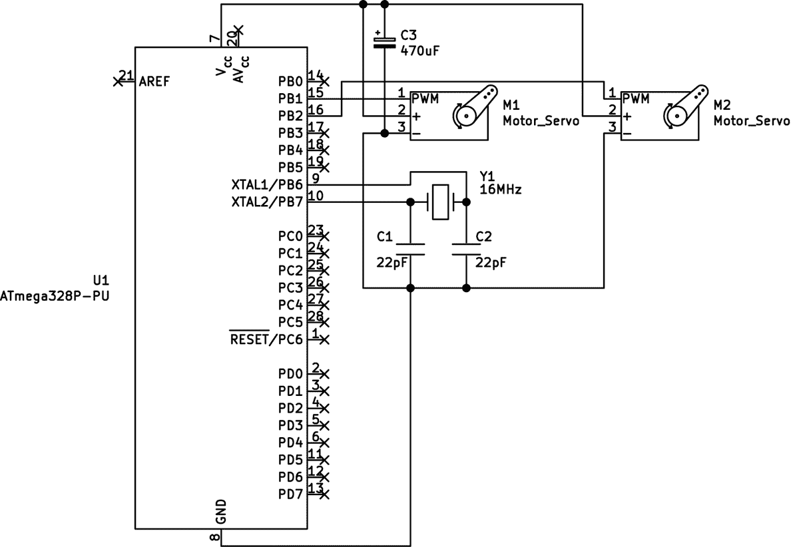

图 14-9：项目 58 的原理图

### 代码

打开终端窗口，导航到本书*第十四章*文件夹下的*项目 58*子文件夹，并像往常一样输入命令`make flash`。几秒钟后，两个舵机会模拟项目 56 中演示的动作，快速旋转整个范围从 0 到 180 度，然后以较慢的速度重复此动作，再以更慢的速度返回到 0 度。

让我们来看一下这个是如何工作的：

```

      // Project 58 - Controlling Two Servos

      #include <avr/io.h>

      #include <util/delay.h>

      ❶ void initPWM()

      {

      // Activate PWM

      TCCR1A |= (1 << WGM11);

      TCCR1B |= (1 << WGM12)|(1 << WGM13)|(1 << CS11);

      // Connect PWM to PB1 and PB2

      ❷ TCCR1A |= (1 << COM1A1)|(1 << COM1B1);

      // PWM to OCR1A - PB1 and OCR1B - PB2

      ICR1=39999;

      }

      ❸ void servoAngleA(uint8_t angle)

      {

      // Rotate servo on OCR1A to 'angle' position

      OCR1A = ((angle-239.95)/-0.05);

      // Convert angle to OCR1A (duty cycle) value

      }

      ❹ void servoAngleB(uint8_t angle)

      // Rotate servo on OCR1B to 'angle' position

      {

      OCR1B = ((angle-239.95)/-0.05);

      // Convert angle to OCR1A (duty cycle) value

      }

      ❺ void servoRange()

      {

      OCR1A=4799;               // 0 degrees

      OCR1B=4799;

      _delay_ms(1000);

      OCR1A=1199;               // 180 degrees

      OCR1B=1199;               // 180 degrees

      _delay_ms(1000);

      }

      int main()

      {

      DDRB|=(1<<PB1)|(1<<PB2);  // Set PB1 and PB2 to outputs

      initPWM();

      uint8_t i;

      while(1)

      {

      servoRange();

      _delay_ms(1000);

      for (i=0; i<=180; i++)

      {

      servoAngleA(i);

      servoAngleB(i);

      _delay_ms(25);

      }

      for (i=180; i>0; --i)

      {

      servoAngleA(i);

      servoAngleB(i);

      _delay_ms(5);

      }

      }

      }

```

在`initPWM()`函数❶中，激活 PWM 后，我们打开 TCCR1A 中的 COM1B1 位，以便为连接到 PB2 的第二个舵机启用 PWM❷。有两个`servoAngle()`类型的函数，一个用于舵机 A❸，一个用于舵机 B❹，可以通过接收所需的旋转角度来控制舵机。我已修改`servoRange()`函数❺，通过分别将所需的值赋给 OCR1A 和 OCR1B 来控制第一个和第二个舵机。

你还可以通过改变`servoAngleA/B()`函数后的延时或将计数反向（从较高值到较低值）来实验两个舵机的方向。现在你已经可以轻松使用两个舵机了，接下来是将它们应用于模拟时钟。

项目 59：用舵机指针构建模拟时钟

在这个项目中，你将使用两个舵机通过双显示模拟时钟来显示时间。一个舵机显示小时，另一个显示分钟。

### 硬件

要构建电路，你需要以下硬件：

+   • USBasp 编程器

+   • 无焊面包板

+   • 5 V 面包板电源

+   • ATmega328P-PU 微控制器

+   • 一个 TMP36 温度传感器

+   • 两个 22 pF 陶瓷电容（C1–C2）

+   • 470 μF 16 V 电解电容（C3）

+   • 0.1 μF 陶瓷电容（C4）

+   • 16 MHz 晶体振荡器

+   • DS3231 实时时钟模块，带有备用电池

+   • 两个 SG90 兼容舵机

+   • 跳线

按照图 14-10 所示组装你的电路。别忘了将 DS3231 板连接到 5 V 和 GND。

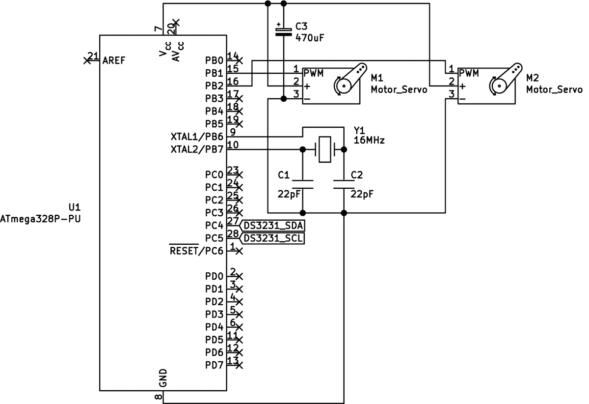

图 14-10：项目 59 原理图

在上传代码之前，别忘了像在之前使用 DS3231 的项目中一样设置时间，例如项目 51。你还可以创建一个类似于项目 57 中使用的背景显示，如图 14-11 所示——尽情发挥创意。注意，原理图中的舵机 M1 用于显示小时，M2 用于显示分钟。

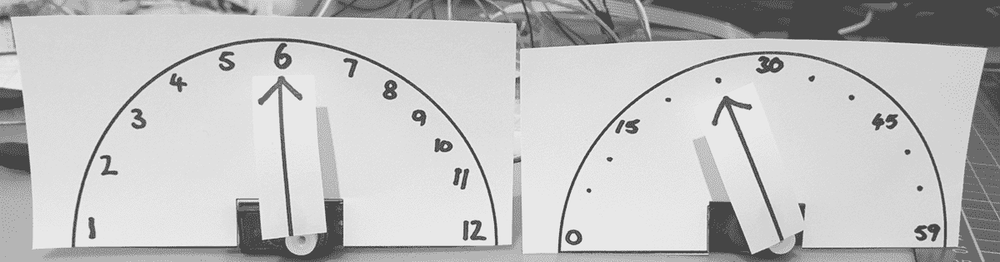

图 14-11：项目 59 时钟面盘示例

### 代码

打开一个终端窗口，导航到本书*第十四章*文件夹中的*Project 59*子文件夹，像往常一样输入命令`make flash`。一旦你烧录了代码，你应该能够通过舵机舵盘的位置看到当前时间。

让我们看看这是如何工作的：

```

      // Project 59 - Building an Analog Clock with Servo Hands

      #include <avr/io.h>

      #include <util/delay.h>

      // Variables to store time and date

      uint8_t hours, minutes, seconds, dow, dom, mo, years;

      void I2Cenable()

      // Enable I2C bus

      {

      TWBR = 72;           // 100 kHz I2C bus

      TWCR |= (1 << TWEN); // Enable I2C on PORTC4 and 5

      }

      void I2Cwait()

      // Wait until I2C finishes an operation

      {

      // Wait until bit TWINT in TWCR is set to 1

      while (!(TWCR & (1<<TWINT)));

      }

      void I2CstartWait(unsigned char address)

      {

      // Start I2C bus

      uint8_t status;

      while (1)

      {

      // Send START condition

      TWCR = (1<<TWINT) | (1<<TWSTA) | (1<<TWEN);

      // Wait until transmission completes

      I2Cwait();

      // Check value of TWSR, and mask out status bits

      status = TWSR & 0b11111000;

      if ((status != 0b00001000) && (status != 0b00010000)) continue;

      // Send device address

      TWDR = address;

      TWCR = (1<<TWINT) | (1<<TWEN);

      // Wait until transmission completes

      I2Cwait();

      // Check value of TWSR, and mask out status bits

      status = TWSR & 0b11111000;

      if ((status == 0b00100000 )||(status == 0b01011000))

      {

      TWCR = (1<<TWINT) | (1<<TWEN) | (1<<TWSTO);

      // Wait until stop condition is executed and I2C bus is released

      while(TWCR & (1<<TWSTO));

      continue;

      }

      break;

      }

      }

      void I2Cstop()

      // Stop I2C bus and release GPIO pins

      {

      // Clear interrupt, enable I2C, generate stop condition

      TWCR |= (1 << TWINT)|(1 << TWEN)|(1 << TWSTO);

      }

      void I2Cwrite(uint8_t data)

      // Send 'data' to I2C bus

      {

      TWDR = data;

      TWCR |= (1 << TWINT)|(1 << TWEN);

      I2Cwait();

      }

      uint8_t I2Cread()

      // Read incoming byte of data from I2C bus

      {

      TWCR |= (1 << TWINT)|(1 << TWEN);

      I2Cwait();

      return TWDR;

      }

      uint8_t I2CreadACK()

      // Read incoming byte of data from I2C bus and ACK signal

      {

      TWCR |= (1 << TWINT)|(1 << TWEN)|(1 << TWEA);

      I2Cwait();

      // Incoming byte is placed in TWDR register

      return TWDR;

      }

      uint8_t decimalToBcd(uint8_t val)

      // Convert integer to BCD

      {

      return((val/10*16)+(val%10));

      }

      uint8_t bcdToDec(uint8_t val)

      // Convert BCD to integer

      {

      return((val/16*10)+(val%16));

      }

      void setTimeDS3231(uint8_t hh, uint8_t mm, uint8_t ss, uint8_t dw,

      uint8_t dd, uint8_t mo, uint8_t yy)

      // Set time on DS3231

      {

      I2CstartWait(0xD0);         // DS3231 write

      I2Cwrite(0x00);             // Start with hours register

      I2Cwrite(decimalToBcd(ss)); // Seconds

      I2Cwrite(decimalToBcd(mm)); // Minutes

      I2Cwrite(decimalToBcd(hh)); // Hours

      I2Cwrite(decimalToBcd(dw)); // Day of week

      I2Cwrite(decimalToBcd(dd)); // Date

      I2Cwrite(decimalToBcd(mo)); // Month

      I2Cwrite(decimalToBcd(yy)); // Year

      I2Cstop();

      }

      void readTimeDS3231()

      // Retrieve time and date from DS3231

      {

      I2CstartWait(0xD0);         // DS3231 write

      I2Cwrite(0x00);             // Seconds register

      I2CstartWait(0xD1);         // DS3231 read

      seconds = bcdToDec(I2CreadACK());

      minutes = bcdToDec(I2CreadACK());

      hours = bcdToDec(I2CreadACK());

      dow = bcdToDec(I2CreadACK());

      dom = bcdToDec(I2CreadACK());

      mo = bcdToDec(I2CreadACK());

      years = bcdToDec(I2CreadACK());

      }

      void initPWM()

      // Activate PWM

      {

      TCCR1A |= (1 << WGM11);

      TCCR1B |= (1 << WGM12)|(1 << WGM13)|(1 << CS11);

      // Connect PWM to PB1 and PB2

      TCCR1A |= (1 << COM1A1)|(1 << COM1B1);

      ICR1=39999;

      }

      void servoAngleA(uint8_t angle)        // Hours servo

      // Rotate servo on OCR1A to 'angle' position

      {

      OCR1A = ((angle-239.95)/-0.05);

      // Convert angle to OCR1A (duty cycle) value

      }

      void servoAngleB(uint8_t angle)        // Minutes servo

      // Rotate servo on OCR1B to 'angle' position

      {

      OCR1B = ((angle-239.95)/-0.05);

      // Convert angle to OCR1A (duty cycle) value

      }

      ❶ void displayServoTime()

      {  // Displays hours on servo A, minutes on servo B

      uint8_t _hours;

      uint8_t _minutes;

      ❷ _hours = hours * 15;

      ❸ servoAngleA(_hours);

      ❹ _minutes = minutes * 3;

      ❺ servoAngleB(_minutes);

      }

      int main()

      {

      DDRB = 0b11111111;                  // Set PORTB as outputs

      I2Cenable();

      initPWM();

      // Uncomment to set time & date, then comment and reflash code

      // setTimeDS3231(9,13,0,5,29,4,21); // h,m,s,dow,dom,m,y

      while(1)

      {

      readTimeDS3231();

      displayServoTime();

      _delay_ms(1000);

      }

      }

```

审查代码后，你应该能识别出启用 I²C 总线的部分（如第十二章中所述），以及从 DS3231 RTC 模块获取和设置时间的部分（如第十三章中所述），并通过 PWM 控制舵机（如本章前面讨论的）。

本项目中的新材料在`displayServoTime()`函数❶中，该函数从 RTC 获取小时和分钟的值，并将它们转换为舵机应该移动到的合适角度。对于显示小时的舵机，我们将 180 度的舵机范围除以 12 小时。这样得到 15，所以我们将小时值乘以 15，得到所需的舵机角度❷，然后命令第一个舵机移动到该位置❸。我们使用类似的过程将分钟转换为角度：180 除以 60 得到 3，因此我们将分钟值乘以 3❹，然后命令第二个舵机移动到该位置❺。

作为最后的挑战，尝试修改代码，使得小时显示从 12 开始，11 结束，而不是从 1 到 12，或者自己制作一个舵机库。你可以用许多方式来扩展这些时钟，并且在使用舵机方面也有很多可能性：例如，你可以尝试将两个舵机用作爬行机器人前臂，或者用来控制老式机械式电灯开关。

那么接下来你应该怎么做呢？本书仅仅是你 AVR 旅程的开始。请查看以下的后记，了解下一步该怎么走。
