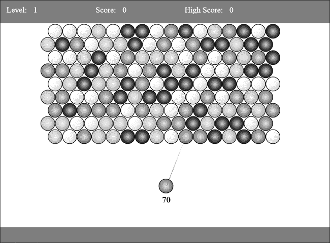
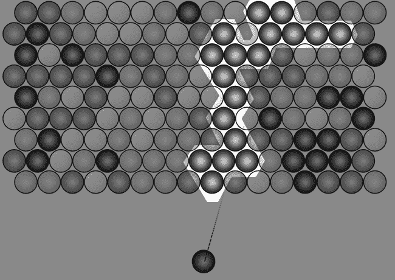
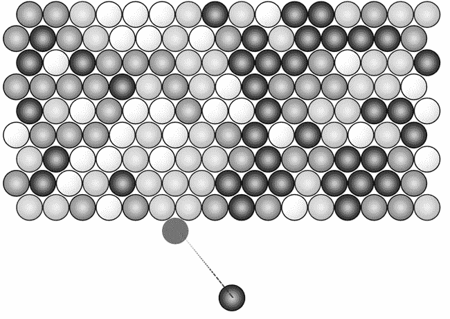
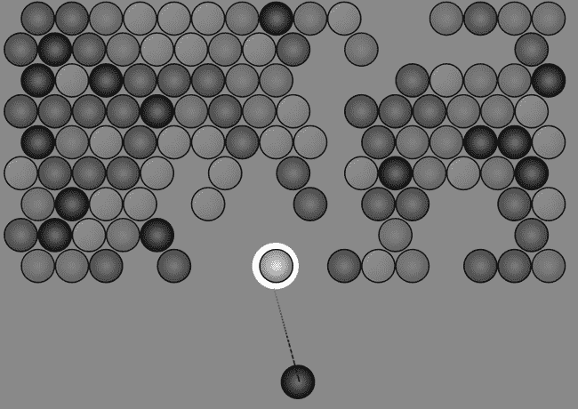
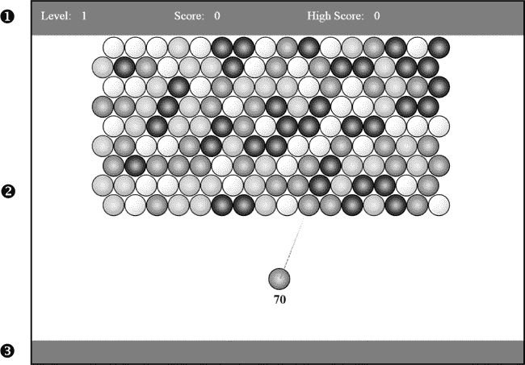

# 第一章。准备与设置

在本章中，我们将开始使用 HTML、CSS 和 JavaScript 开发一款完整的游戏。我们简单的泡泡射手游戏将展示一系列的开发技巧，但它不需要复杂的逻辑来控制游戏机制。*游戏逻辑*包括游戏元素之间的交互系统、由玩家的动作引发的事件、角色中的人工智能模拟等。开发复杂的游戏逻辑可能会很耗时，因此为了学习目的，我们将坚持使用一些基本原则，比如如何渲染图形和动画、响应用户输入以及播放声音。

我们将从用户界面和页面布局开始，然后加载脚本，最后添加一些基本的交互。在开发过程中，我们还将探索一些浏览器工具，这些工具在调试时非常有用，以及 Modernizr 和 jQuery——这两个主要的库将加速开发。我们将使用 Modernizr 来加载脚本并检测用户浏览器是否支持某个特性，而在处理 HTML 和 JavaScript 时，我们将使用 jQuery。

如果你在使用 HTML、CSS、JavaScript 和 jQuery 进行 Web 应用程序开发方面有经验，本章中的大部分代码你应该会很熟悉。我的目标是展示你如何通过相对少量的代码实现功能，以及如何轻松创建基本的交互元素。

# 游戏玩法

如果你曾经玩过*泡泡龙*、*Bust-a-Move*、*Snood*或任何其他许多移动泡泡射击游戏，你已经知道了泡泡射手的基本机制。图 1-1 展示了完成后的游戏截图。



图 1-1。完成的*泡泡射手*游戏截图

游戏的目标是清除屏幕顶部悬挂的所有泡泡。玩家通过鼠标瞄准并点击，从屏幕底部发射泡泡，射向顶部的泡泡，试图形成三颗或更多相同颜色的泡泡组合。一旦形成至少三个相同颜色的泡泡组合，组合中的所有泡泡都会爆炸，如图 1-2 所示。

如果发射的泡泡没有形成颜色匹配的组合，它将被添加到显示中，如图 1-3 所示。



图 1-2。蓝色泡泡被发射到该组，形成配对，所有高亮显示的泡泡将会爆炸。



图 1-3。这里发射的蓝色泡泡不会导致上方的绿色组爆炸。相反，它会被添加到棋盘上。

发射出的泡泡如果没有形成三个或更多的匹配组，就会卡在泡泡网格中。因为泡泡就像是都悬挂在最上排一样，如果一组泡泡在创建并移除一个匹配颜色的组后，无法找到回到顶部的连接，我们需要从屏幕上移除这些“孤立”泡泡。图 1-4 中展示了一个孤立泡泡的例子。



图 1-4。红色泡泡被孤立。我们不想让孤立的泡泡悬挂，所以我们需要一些逻辑来检测它们，并用动画把它们从屏幕上移除。

玩家只能发射有限数量的泡泡（图 1-1 显示为 70 个），他们必须在泡泡用完之前清除棋盘。每个关卡结束时，玩家根据爆破泡泡的数量得分，并进入下一关。游戏在玩家未能清除关卡时结束。

除了稍后我们将添加的几个增强功能外，这就是游戏的主要流程。

我们将使用 HTML、CSS 和 JavaScript 构建游戏机制——这些是创建许多简单游戏的核心工具，尤其是那些不需要精细像素操作的二维游戏。在*Bubble Shooter*中，我们实际上是在把一个圆形（泡泡）发射到另一个圆形的网格中（其他泡泡），然后要么像图 1-2 那样爆炸一个组，要么像图 1-3 那样把泡泡添加到棋盘上。游戏布局的要求相当简单，我们可以使用 CSS 和 JavaScript 来执行所有需要的动画。

我们将使用 HTML 和 CSS 构建用户界面，因为像大多数 HTML 游戏一样，*气泡射手*将利用浏览器擅长的任务，例如布局文本和渲染简单图形。在后续章节中，我们将探索使用`canvas`元素来显示游戏区域，但我首先会演示使用常规文档对象模型（DOM）开发所能实现的效果。

# 构建游戏

现在我们已经有了要创建的游戏概念，让我们将其分解为可管理的任务。为了创建*气泡射手*，我们需要解决一些高级挑战。具体来说，我们需要完成以下任务：

**随机生成并渲染游戏棋盘**

每个新关卡必须随机生成气泡网格并在屏幕上绘制出来。

**计算气泡的发射角度和停止点**

玩家将通过点击屏幕发射气泡。我们将计算发射气泡的角度，沿着该路径移动气泡，并在它碰到某个物体时停止，或者让它继续前进。

**解决碰撞问题**

当发射的气泡击中另一个气泡且未形成至少三个相同颜色的组合时，它将加入到棋盘上。否则，当它形成至少三个相同颜色气泡的组合时，它将炸裂所有与其接触的相同颜色气泡。如果发射的气泡确实爆炸了气泡，我们将检查是否产生了孤立的气泡，例如在图 1-4 中所示的那样。

**跟踪得分和关卡**

游戏在所有气泡被清除时结束。由于玩家只有有限数量的气泡可以发射，我们会跟踪已发射的气泡数量。我们还将添加一个得分系统，给玩家一个再次挑战的理由（例如打破高分）。

**处理游戏结束和新关卡**

如果玩家完成关卡，我们将通过某些界面元素标示出来，并给玩家一个选项继续进入下一关卡。切换关卡会清空棋盘并整理内部游戏状态，然后游戏重新开始。

# 开发和测试环境

让我们设置开发环境，确保我们拥有完成游戏所需的正确工具。要开始为 Web 开发游戏，你需要访问多个浏览器进行测试，并且需要可以编辑代码的软件。你还需要设置一个 Web 服务器以查看正在开发中的游戏。尽管你可以在本地运行*气泡射手*（只需打开其*index.html*文件），但你应该定期在尽可能模拟最终用户使用情况的环境中测试你的游戏。

### 注意

*设置服务器的过程因操作系统而异。Apache Web 服务器（可在*[`httpd.apache.org/`](http://httpd.apache.org/)*下载）提供了良好的安装包和设置说明，适用于大多数系统配置。*

## 网页浏览器测试

网络开发的一个规则是要在你预期的目标用户会使用的所有浏览器上进行测试。尽管这是发布软件时必不可少的步骤，但在开发过程中，你通常可以使用较小的浏览器子集来识别大部分潜在问题。你需要测试的浏览器列表在不断变化，但当你将游戏发布到 Web 时，接下来讨论的这些浏览器是必不可少的。

### 桌面浏览器

使用桌面 PC 或笔记本电脑的用户可能会在任何操作系统上使用不同的浏览器玩你的游戏，因此请确保至少在 Windows 和 OS X 上的最新版本的 Internet Explorer（IE）、Firefox、Chrome 和 Safari 中进行测试。根据你的目标用户群，你可能还需要测试早期版本的浏览器。

并不是每个人都会更新他们的网页浏览器，因此在为大量网页用户进行编码时，务必不要忽视可能使用早期版本的用户。一些版本的 IE 在同一操作系统中可能无法良好配合（由于 IE 与 Windows 的紧密集成），因此在进行测试时，你需要多个 Windows 安装环境，可以在不同的 PC 或虚拟机上进行。我强烈建议你安装并使用虚拟机软件，如 VMWare（*[`www.vmware.com/`](http://www.vmware.com/)*）、VirtualBox（*[`www.virtualbox.org/`](http://www.virtualbox.org/)*）或 Virtual PC（*[`www.microsoft.com/download/`](http://www.microsoft.com/download/)*；请在下载中心搜索）。虚拟机可以让你在常规操作系统内运行其他操作系统，实质上是在桌面上模拟一个完整的系统。预装了不同版本 IE 的虚拟机可以从*[`www.modern.ie/en-us/virtualization-tools/`](http://www.modern.ie/en-us/virtualization-tools/)*下载。

因为 Firefox 现在会定期更新，所以你应该能够安全地在最新版本上测试你的游戏。早期版本对 HTML5 的支持不稳定，但后续版本通常不会有大的变化。Chrome 也会自动并定期更新，因此你不必担心版本问题，只需确保你使用的是最新版本。

当然，你还应该在 Mac 上至少测试一个版本的 Safari 浏览器。也可以在 Windows 中运行 OS X 虚拟机，尽管这种设置比在 Windows 内运行 Windows 或在 OS X 中运行 Windows 稍微复杂一些。有关在虚拟机应用程序中实现此设置的教程，可以在线找到。

### 移动浏览器

如果你在移动设备或平板电脑上部署，测试范围广泛的设备（iOS、Android 和 Windows 移动设备）和多个浏览器比以往任何时候都更加重要。对于基本的移动开发，访问一台 iOS 设备和一台 Android 设备可能足够进行测试，但当你考虑到更广泛的发布时，情况变得更加复杂。苹果的 iOS 版本在行为上有所不同，而 Android 在如此多的设备上有着不同的屏幕分辨率和硬件配置，你应该能够访问多个设备（可能通过有限的 beta 测试小组）进行测试。我们不会将 *Bubble Shooter* 打包发布到 Apple App Store 或 Google Play Store，但通过使用 HTML5 和 JavaScript 编写游戏，我们将制作一个可以在移动设备上玩的应用，无需额外的编码。

最终，由于 Android 平台的碎片化，单个开发者无法在每个设备上进行测试；因此，你可能会发现使用第三方测试服务更加可行。在 iOS 设备上的测试稍微简单一些，因为 Apple 控制其操作系统和设备规格，但 iPhone 和 iPad 的价格可能较高。当你将 Windows 平板电脑纳入考虑范围，并考虑到可以运行网页浏览器的平板电脑和其他便携设备的日益增加时，你会意识到，移动测试之战是难以取胜的。

## 在网页浏览器中调试

设置好测试浏览器后，你可以使用多个开发者工具来简化调试。每个浏览器都有自己的开发工具集，但幸运的是，它们都遵循类似的工作方式，提供检查页面 HTML 元素、添加断点和日志记录 JavaScript 的方法。学习如何访问你浏览器的开发者工具，并通过实验熟悉其功能。

所有浏览器调试工具都很有用，但在开发过程中，你可能最常使用 JavaScript 控制台。你将通过控制台与代码进行两种主要的互动：

**使用 `console.log` 命令记录到控制台**

调用 **`console.log`** 函数，控制台应显示你传递给该函数的内容。例如，`console.log("Hello")` 应该显示字符串 `Hello`。更好的是，当你使用 JavaScript 对象或数组调用 `console.log` 时，你会得到该对象内容的简要列出，可以用来探索整个对象树。

**运行临时代码以检查变量状态**

你可以将 JavaScript 代码输入到控制台中立即评估。输入 **`alert(1)`** 到控制台看看它如何工作。如果你的游戏代码公开暴露了对象属性，你可以利用此功能检查属性或触发方法。你甚至可以粘贴多行代码，以创建并在页面上下文中运行整个函数。

现在我们已经准备好了一些工具，让我们开始构建游戏。我们将从设置基本代码并实现开始界面用户界面开始。

# 布局游戏屏幕

在我们编写动画和游戏玩法的有趣部分之前，首先需要布局用户界面。我们将使用 HTML 和 CSS 来放置主要的界面元素；游戏屏幕将包含三个主要区域，如图 1-5 所示。



图 1-5. 游戏屏幕的各个部分

在游戏屏幕的顶部，您可以看到状态栏 ➊，它将显示分数和关卡信息。接下来的部分（也是最大的部分）包含游戏区域 ➋，这里将包含所有气泡。游戏区域也是实际游戏玩法发生的地方。底部的页脚 ➌ 框架环绕着游戏区域。

现在，让我们布局这三个*Bubble Shooter*组件。

## 使用 HTML 和 CSS 创建面板

使用简单的 HTML 和 CSS 来布局游戏屏幕是创建这三个面板并定义游戏发生位置的最简单方法。这里使用的方法和技巧与构建常规网站或 Web 应用程序时使用的是一样的。

我们将首先为整个页面创建一个包装`div`。由于`div`标签没有语义意义，我们将其用作页面上的一个分区。首先，在您的 Web 服务器根目录下创建一个新的文件夹，用于构建游戏，并命名为*bubbleshoot*。游戏运行所需的每个文件都将存储在这个文件夹或其子目录中。接下来，创建一个名为*index.html*的新文件，并添加以下代码：

*index.html*

```
  <!DOCTYPE HTML>
  <html lang="en-US">
    <head>
      <meta charset="utf8">
      <title>Bubble Shooter</title>
    </head>
    <body>
➊    <div id="page">
      </div>
    </body>
  </html>
```

整个游戏将在这个单一的 HTML 页面中运行，`"page" div` ➊将限制游戏发生的区域。如果我们需要将游戏居中或调整它以适应不规则的屏幕纵横比，只需要改变包装元素的位置。

### 注意

*许多 HTML 标签在 HTML5 中已简化，相较于版本 3 到 4 和 XHTML 的严格性。例如，文档类型声明现在大大简化，因为许多标签都已分配默认类型。`<script>`标签实际上在 HTML5 中默认就是 JavaScript，这就是为什么我们在页面中不需要指定`type="text/javascript"`或`language="javascript"`的原因。*

接下来，我们将创建三个新的`div`元素，每个元素对应一个页面部分，并将它们放置在我们的页面`div`内：

```
<div id="page">
  **<div id="top_bar"></div>**
  **<div id="game"></div>**
  **<div id="footer_bar"></div>**
</div>
```

现在，我们需要为页面和刚才添加的三个部分分配一些 CSS。

在游戏文件夹中创建一个名为* _css *的文件夹，用于存放我们将用于游戏的所有样式表。在*_css*文件夹中，创建一个名为*main.css*的新文件，并包含以下代码：

*main.css*

```
  body
  {
    margin: 0;
  }
  #page
  {
    position: absolute;
    left: 0;
    top: 0;
    width: 1000px;
➊  height: 738px;
  }
  #top_bar
  {
    position: absolute;
    left: 0;
    top: 0;
    width: 1000px;
➋  height: 70px;
    background-color: #369;
    color: #fff;
  }
  #game
  {
    position: absolute;
    left: 0px;
    top: 70px;
    width: 1000px;
➌  height: 620px;
    background-color: #fff;
    clip: auto;
➍  overflow: hidden;
  }
  #footer_bar
  {
    position: absolute;
    left: 0;
    top: 690px;
    width: 1000px;
➎  height: 48px;
    background-color: #369;
  }
```

我们将顶部横幅的高度设置为 70 像素 ➋，底部横幅的高度设置为 48 像素 ➎。我们希望游戏适配标准显示器尺寸，因此我们将整个游戏区域的高度设置为 620 像素 ➌，使得总页面高度为 738 像素 ➊，这应该适配 1024×768 的显示分辨率，甚至还能容纳浏览器任务栏。

尺寸：流式布局 vs. 固定布局

为了保持游戏简单，我在 CSS 中使用了 1000 像素的固定宽度，这应该为大多数桌面和移动显示器提供足够的屏幕区域。通常，屏幕尺寸的情况更为复杂；尤其是移动设备的像素尺寸和长宽比有很大的差异。然而，我们希望专注于开发原则，而不是设计决策，1000 像素应该足够用于原型游戏。

这些值设置了整个可用显示区域的大小和位置。此外，请注意，`game`的`overflow:`设置为`hidden` ➍，这意味着游戏中的泡泡永远不会意外地显示在页眉或页脚上。

为了链接 CSS 文件，我们将在 HTML 头部添加*main.css*的文件链接：

*index.html*

```
<head>
  <meta charset="utf8">
  <title>Bubble Shooter</title>
  **<link href="_css/main.css" rel="stylesheet">**
</head>
```

现在我们已经使用 HTML 和 CSS 创建了*泡泡射手*的基本结构，接下来在浏览器中加载页面并保持打开状态。此时尚未有交互，因此接下来我们将添加基本的交互功能，比如*开始游戏*对话框，然后再处理游戏逻辑。第一步是设置代码结构。

## 代码结构

让我们从高层次了解一下游戏和界面的主要概念，这将指导我们如何结构化代码。由于需要实现多个重要元素，我们将以类似于你可能熟悉的 Model/View/Controller（MVC）原则的方式结构化代码。如果 MVC 对你来说是新的，这里是基本的设置：

+   **模型**由数据组成，并维护应用程序的状态。在 Web 应用程序中，这可能是用户的详细信息或购物车内容等。

+   **视图**负责渲染屏幕上的内容并拦截用户输入。对于 Web 应用程序，这通常是 HTML 输出。例如，视图可能会从*模型*中读取在线购物车的内容，并将这些项目以列表的形式显示出来。

+   **控制器**管理逻辑和处理。例如，点击*视图*中的某个项目时，会向*控制器*发送消息，要求其向购物车*模型*中添加新项目。

通过一些修改，这个 MVC 原则将适用于结构化*泡泡射手*。

### 游戏控制器

游戏控制器将跟踪游戏状态，并充当导演，响应用户操作并确定结果。

游戏控制器类似于 MVC 系统中的控制器；它将运行游戏并管理所有功能。在一个更复杂的游戏中，单一控制器会变得过于庞大和复杂，无法处理所有任务，因为代码会集中在一个地方，并且一组代码会有太多责任，导致代码更容易出现难以发现的 bug。在这种情况下，我们可能需要进一步细分任务。幸运的是，*Bubble Shooter* 游戏非常简单，使用一个控制器来管理所有任务应该是可行的。

### 用户界面代码

游戏需要为用户展示各种信息，包括得分更新、关卡结束画面等。游戏控制器不会处理这些任务，而是会指示一组用户界面函数来控制用户界面元素的显示和消失方式。

你可以将大部分 UI 代码放入游戏控制器中，但你往往会写出与游戏逻辑一样多的动画和 UI 代码，因此最好将这些代码分开以提高可读性。通常，如果你没有以某种方式改变游戏的状态，而是管理显示中的某个功能，你应该在 UI 代码中处理这些任务。

### 游戏元素作为对象

我们将把一些游戏元素编写为对象，包括气泡和游戏板。原因是我们将有一些属性——例如气泡的 *x* 和 *y* 坐标——以及需要应用的方法，例如气泡爆炸。按照面向对象编程的惯例，我们会将这些对象拆分成不同的类，以便代码结构与制作游戏所涉及的概念元素相对应。

游戏的对象将与 MVC 网络模式中的模型概念紧密对齐。对象将具有属性和状态，但它们不应该与显示界面交互或做出重要的游戏决策。

# 添加第一个脚本

我们将使用*Modernizr*，一个 JavaScript 库，来加载游戏所需的所有 JavaScript 文件，例如前面提到的游戏控制器和 UI 类。使用 Modernizr 相较于使用常规的 `<script>` 标签有一些优势，我将在本章稍后解释这些优势。Modernizr 还有其他有用的功能，但我们将首先加载所需的脚本文件。

## Modernizr 和 jQuery 库

为了在游戏开发过程中简化一些常见任务，我们将大量依赖两个库。这两个库解决了许多跨浏览器问题，并提供了一套简单且一致的高级功能。

Modernizr 会加载脚本并检测浏览器中是否支持某个特定功能。例如，我们可以写一段代码来检测是否支持 `canvas` 元素。手动编码的话，你需要在 DOM 中创建一个 `canvas` 节点，然后检查它是否支持某个特定方法。在这个例子中，我们将使用 `canvas` 元素的 `getContext` 方法，它在所有支持 `canvas` 的地方都有支持，尽管你可以尝试任何你喜欢的 `canvas` 方法：

```
var element = document.createElement("canvas");
var canvasSupported = !!element.getContext;
```

使用 Modernizr，我们不需要做太多工作。我们可以简单地写：

```
var canvasSupported = Modernizr.canvas;
```

Modernizr 对象包含一组属性，这些属性的值在加载时被设置为 `true` 或 `false`，具体取决于浏览器是否支持某个特定功能。因此，变量 `canvasSupported` 现在应该包含 `true` 或 `false`，取决于 `Modernizr.canvas` 的值。使用 Modernizr 检测功能非常有帮助，因为如果浏览器改变了某个功能的实现方式，Modernizr 很可能会比你在代码中检测并实现更快地收到新的检测例程。

jQuery 还提供了有用的简写函数，但这些主要涉及检测和响应事件，发起异步 JavaScript 和 XML (AJAX) 请求与服务器通信，或者访问并操作浏览器 DOM 中的 HTML 元素。

DOM 是浏览器对 HTML 文档的内部组织结构，我们将主要使用 jQuery 的 DOM 访问方法来简化大部分动画代码。DOM 提供了一种方法，让你能够通过将 HTML 中的每个元素暴露为 DOM 节点来操作 HTML 结构。为了操作 DOM，我们首先使用 JavaScript 选择一个节点。然后我们可以改变它的一个或多个属性，常规的 JavaScript 使得这一步骤变得简单且直观。但是，使用 jQuery 可以使代码更容易按预期工作，而无需编写代码来处理那些实现各自功能不同的浏览器。

jQuery 最简单的应用例子是选择一个具有 ID 的 DOM 节点，比如我们创建的 `game div`。在常规 JavaScript 中，我们会这样写：

```
var element = document.getElementById("game");
```

这行代码获取一个单一的 DOM 元素，它将拥有各种属性，例如 CSS 格式和允许进行查询的方法。例如，`element.getAttribute("id")` 将返回字符串 `game`。

jQuery 提供了一种方法，将这些功能及更多的功能封装在更简洁、更紧凑的语法中。为了用 jQuery 实现与前面代码相同的结果，我们使用 jQuery 选择器。*选择器*是用于选择 DOM 中节点的语法，其格式——包括点符号和使用 `#` 来选择唯一元素——借鉴了 CSS 选择器。jQuery 选择器返回的值不是 DOM 节点，而是包含对 DOM 节点引用的自定义对象，并且附带了一系列其他方法。使用 jQuery 选择器实现 `document.getElementById("game").getAttribute("id")` 的等效写法是 `$("#game").attr("id")`。

选择器是 jQuery 的核心概念，到本书结束时，你会非常熟悉如何使用它们。几乎所有的 jQuery 都是用来操作 DOM 元素的，因此 jQuery 的调用几乎总是指定要更改的元素或元素集，这就是选择器的作用。它们让你能够根据一系列因素选择 HTML 节点集，例如以下几种：

+   用于选择单个元素的唯一 ID。

+   一个 CSS 类，用于选择所有具有该类的 DOM 元素。

+   定义节点的标签（如 `div`、`img`、`span` 等），这可以让你例如选择页面上的所有图片。

+   许多其他选项，包括前面列表中项的组合、元素在列表中的位置、父子关系，或者几乎任何你能用来遍历 DOM 的方式。

调用 `$` 返回的 jQuery 对象允许你操作 DOM 对象。

因此，在 jQuery 中，`document.getElementById` 被简化为

```
var element = jQuery("#game").get(0);
```

我们需要调用 `.get(0)` 函数，从 jQuery 对象中获取 DOM 对象，尽管通常来说，操作 jQuery 对象比直接操作 DOM 对象更有用。这个调用可以进一步简化为

```
var element = $("#game").get(0);
```

值 `$` 被定义为 `jQuery` 函数的别名，根据传入的参数，它可以执行多个不同的任务。对于选择器，我们传递一个字符串值（在这个例子中是 `"#game"`）给 jQuery。像在 CSS 中一样，井号符号告诉 jQuery 我们要通过 ID 选择单个元素。值 `$("#game")` 返回包含指向 DOM 节点引用的 jQuery 对象。

你可以使用 jQuery 选择器来检索多个 DOM 节点，这些节点内部会作为一个数组存储。如果你想访问某个 DOM 节点，可以通过在 jQuery 对象上调用 `.get(n)` 来检索查询返回的第*n*个元素。由于我们只有一个 ID 为 `game` 的元素，我们需要获取第一个（零索引）元素，可以通过在 `$("#game")` 后加上 `.get(0)` 来实现。

在这个简单的例子中，我们并没有节省太多的代码，但更重要的是，我们可以使用 jQuery 从选择查询返回的对象，通过跨浏览器的方法来简化 DOM 操作的繁琐工作。

jQuery 对象让我们可以查询 DOM 节点的各种 CSS 属性，以下是一些示例：

```
var top = $("#game").css("top");
var width = $("#game").width();
var divs = $("div");
```

前两行分别查询游戏 `div` 的 `top` 位置和宽度，最后一行是一个选择器，返回一个包含页面所有 `div` 标签的 jQuery 对象。jQuery 是一个强大的库，尽管我们在游戏中会用到它的许多功能，但本书的范围并不包括详细介绍它。jQuery 的文档可以在 *[`api.jquery.com/`](http://api.jquery.com/)* 中找到，提供了对其工作原理的深入了解。

## 添加 Modernizr 库

要开始使用 Modernizr，可以从其官方网站下载（*[`modernizr.com/download/`](http://modernizr.com/download/)*）。Modernizr 允许你选择单独的功能进行下载，以避免浪费带宽下载那些你永远不会使用的代码。我们需要一些特定的功能，所以确保在下载页面选择以下选项：

+   CSS 过渡（在 CSS3 中）

+   Canvas 和 HTML5 音频（在 HTML5 下）

+   Modernizr.load（在额外功能下）

+   Modernizr.prefixed（在扩展性下）

然后，点击 **生成** 和 **下载**。

在游戏文件夹中创建一个名为 *_js* 的新文件夹，并将文件保存为 *modernizr.js*。同时，将该文件添加到 HTML 文档中，如下所示：

*index.html*

```
<head>
  <meta charset="utf8">
  <title>Bubble Shooter</title>
  <link href="_css/main.css" rel="stylesheet">
  **<script src="_js/modernizr.js"></script>**
</head>
```

现在，我们已经用 `<script>` 标签添加了 Modernizr，接下来将使用它来加载其余的 JavaScript 游戏文件。

## 使用 Modernizr 加载脚本

我们之所以不直接在文档中添加 `<script>` 标签，而是使用 Modernizr 加载脚本，主要有两个原因。首先，我们可以在脚本加载后立即触发函数运行，而不是等到整个页面（包括 HTML 和图片）加载完成后才运行。第二，Modernizr 允许我们基于条件加载脚本（例如，*如果满足这个条件，加载这个脚本*），而不需要编写大量代码。

### 注意

*Modernizr 实际上使用了另一个名为* yepnope.js *的库来实现其脚本加载功能。你可以在* [`yepnopejs.com`](http://yepnopejs.com)*/* 了解更多关于这个库的信息。

一个简单的例子是从谷歌的内容分发网络（CDN）加载 jQuery，以加速加载时间。使用第三方 CDN 的潜在缺陷在于，CDN 可能无法使用或无法访问，或者更可能的是，你自己的服务器可能无法使用。然而，依赖一个你无法控制的服务从来都不是一个好主意。幸运的是，Modernizr 允许你在加载过程中添加测试，如果该测试失败，可以调用备份功能。因此，我们可以尝试从 CDN 加载文件，如果不行，再加载本地版本。

为什么使用谷歌托管的 jQuery？

尽管依赖他人的服务器获取关键文件可能看起来有些奇怪，但使用谷歌版的 jQuery 具有一些优势，我说的不仅仅是节省费用或在创建流行游戏时使用别人带宽的问题。

一个优点是，由于该文件来自 Google 的内容分发网络，用户几乎总是从比你的服务器更接近他们的服务器下载该文件。

另一个优点是，由于该文件来自与你的游戏托管服务器不同的服务器，用户实际上可以更快地下载它。浏览器通常会限制单个服务器的连接数量，因此即使带宽充足，文件也需要排队等待下载。通过将文件托管在不同的服务器上，可以增加并行下载的文件数量，从而减少下载时间。

另一个优点是，其他网站也在使用相同的 jQuery 副本；因此，如果用户最近访问过这些网站，他们很可能已经将该文件缓存到浏览器中，根本不需要重新下载文件！

从 *[`jquery.com/download/`](http://jquery.com/download/)* 下载最新的 jQuery 版本并将其放入 *_js* 文件夹。然后，在关闭 `</head>` 标签之前，添加以下加粗的代码块。确保将 URL 中的 jQuery 版本号更改为你下载的版本。

*index.html*

```
  <head>
    <meta charset="utf8">
    <title>Bubble Shooter</title>
    <link href="_css/main.css" rel="stylesheet">
    <script src="_js/modernizr.js"></script>
    **<script>**
➊  **Modernizr.load({**
      **load: "//ajax.googleapis.com/ajax/libs/jquery/1.8.2/jquery.js",**
➋      **complete: function () {**
➌        **if(!window.jQuery){**
➍          **Modernizr.load("_js/jquery-1.8.2.min.js");**
        **}**
      **}**
    **});**
    **</script>**
  </head>
```

这个示例展示了 Modernizr 提供的紧凑型脚本加载方式。简而言之，它会尝试从 Google CDN ➊ 加载 jQuery。当加载完成后 ➋（无论文件是否成功加载或脚本加载失败），`complete` 属性的函数调用会检查 `window.jQuery` ➌ 是否存在，如果该对象不存在，则从本地文件夹加载 jQuery 库 ➍。

调用 `Modernizr.load` 时使用两种不同参数集的原因是，该文件可以接受以下几种类型的参数：一个文件（作为字符串），一个包含名称/值对的对象，或者一个包含字符串或对象集合的数组。因此，我们可以通过一次 `Modernizr.load` 调用加载多个文件。在第一次调用 ➊ 中，我们传入一个包含 `load` 和 `complete` 属性的对象。（Modernizr 网站文档中记录了其他可以使用的属性。）在第二次调用 ➍ 中，我们只传入一个字符串。此行

```
**Modernizr.load("_js/jquery-1.8.2.min.js");**
```

等同于编写

```
**Modernizr.load({load : "_js/jquery-1.8.2.min.js"});**
```

第一个版本使用文件名字符串作为便捷的简写，用于仅加载该文件，而无需其他配置选项。

我们还希望通过 Modernizr 加载游戏脚本。在 *_js* 文件夹中创建一个名为 *game.js* 的新文件。要将新文件添加到 `.load` 中，请将第一个 `Modernizr.load` 调用用数组括起来，并添加一个新条目，如下所示（加粗）：

*index.html*

```
Modernizr.load(**[**{
    load: "//ajax.googleapis.com/ajax/libs/jquery/1.8.2/jquery.js",
    complete: function () {
      if(!window.jQuery){
        Modernizr.load("_js/jquery-1.8.2.min.js");
      }
    },
  },
  **{**
    **load: "_js/game.js"**
  **}]**);
```

我们可以在任何时候继续将新文件添加到 `Modernizr.load` 调用中，作为数组中的新元素，直到加载 *game.js* 为止。

Modernizr 将加载 *game.js*，但该文件目前没有任何代码。下一步是设置主游戏控制器类，并在加载完成后运行它。

## 模块化 JavaScript

为了最小化全局变量以及潜在的变量名冲突问题，我们将采用模块化的方法来编写 JavaScript 代码。使用 *模块* 是一种将游戏的所有对象和变量封装在一个包含命名空间中的方式。这个命名空间将被命名为 *BubbleShoot*。一个名为 `Game` 的类将被包含在 `BubbleShoot.Game` 模块中，并可以在应用程序的任何地方通过写 `BubbleShoot.Game` 来访问。这个命名空间是一个保障：如果我们在开发后期添加了另一个 JavaScript 库，该库也有一个名为 `Game` 的变量，它们将能够同时存在而不会发生冲突。

我们将从游戏模块开始，它将运行游戏的大部分功能。将以下代码输入到 *game.js* 中：

*game.js*

```
➊ var BubbleShoot = window.BubbleShoot || {};
➋ BubbleShoot.Game = (function($){
➌   var Game = function(){};
➍   return Game;
➎ })(jQuery);
```

首先，我们检查对象 `BubbleShoot` 是否存在 ➊。将代码命名为 `BubbleShoot.Game` 大致相当于在 Java 或 C# 等语言中使用命名空间。所有的类都将作为 `BubbleShoot` 对象的属性。像 *Bubble Shooter* 这样的小型游戏中命名冲突的可能性不大，但在更大的项目中可能会成为问题。如果 `window.BubbleShoot` 不存在，它将被创建为空对象。我们将在每个类文件的顶部包含这行代码，这样就不需要考虑脚本加载的顺序。

下一行代码定义了 `BubbleShoot.Game` ➋。这种结构——一个括号内的函数——如果你不熟悉它，可能会觉得有些奇怪，但它是编写 JavaScript 模块时常用的一种方法。

该结构使用了 *立即执行函数表达式（IIFE）*，它是一段创建并立即运行的函数代码。通常，你会将返回的结果赋值给一个变量。它的好处是，这个函数块在 JavaScript 中创建了一个变量作用域，这意味着任何在其中创建的变量都不会污染全局作用域。

变量声明包含一个函数定义，后面跟着圆括号 ➎。函数被创建、运行并立即销毁，但在销毁之前会返回它的内容 ➍，这些内容将是第 ➌ 步创建的 `Game` 对象。用括号包裹的函数调用 ➋ 位于新作用域内。一旦这个函数执行完毕，我们可以从全局作用域访问 `Game` 类，形式为 `BubbleShoot.Game`。

现在我们有了一个类的框架，需要添加一些有用的代码来运行。我们从连接一个“新游戏”按钮开始。在 *index.html* 页面 `div` 中添加以下内容：

*index.html*

```
  <div id="page">
    <div id="top_bar"></div>
    <div id="game"></div>
    <div id="footer_bar"></div>
➊    **<div id="start_game" class="dialog">**
➋      **<div id="start_game_message">**
        **<h2>Start a new game</h2>**
      **</div>**
➌    **<div class="but_start_game button">**
        **New Game**
      **</div>**
    **</div>**
  </div>
```

新的 `div` 元素将创建一个对话框，在玩家开始游戏之前显示信息 ➊。对话框将包含一个带有消息的标题 ➋ 和一个“新游戏”按钮 ➌。我们仍然需要为它们在 *main.css* 的末尾添加一些样式，现在就来做吧。

*main.css*

```
.dialog
{
  position: absolute;
  left: 300px;
  top: 110px;
  height: 460px;
  width: 320px;
  background-color: #369;
  border-radius: 30px;
  border: 2px solid #99f;
  padding: 20px 50px;
  color: #fff;
  text-align: center;
  display: none;
}
.dialog h2
{
  font-size: 28px;
  color: #fff;
  margin: 20px 0 20px;
}
.but_start_game
{
  position: absolute;
  left: 100px;
  top: 360px;
  height: 60px;
  width: 200px;
  background-color: #f00;
  cursor: pointer;
  border-radius: 15px;
  border: 2px solid #f66;
  font-size: 28px;
  line-height: 60px;
  font-weight: bold;
  text-shadow: 0px 1px 1px #f99;
}
.but_start_game:hover
{
  background-color: #f33;
}
#start_game
{
  display: block;
}
```

在 *main.css* 中设置好样式后，重新加载页面以查看对话框。但请注意，目前玩家还无法移除它。这个功能将在 `Game` 类中实现。

接下来，我们需要在页面加载完成后运行一些代码，以便为“新游戏”按钮绑定事件处理程序。一个函数将在页面加载后初始化对象并设置游戏，另一个函数将在每次开始新游戏时执行。请对*game.js*进行以下更改：

*game.js*

```
  BubbleShoot.Game = (function($){
    var Game = function(){
➊    **this.init = function(){**
➋      **$(".but_start_game").bind("click",startGame);**
      **};**
➌    **var startGame = function(){**
      **};**
    };
    return Game;
  })(jQuery);
```

这段新代码设置了一个公共方法，叫做`init` ➊，以及一个私有方法，叫做`startGame` ➌。`init`方法是公共的，因为它作为`Game`对象的属性进行附加。在`init`内部，我们为“新游戏”按钮 ➋ 添加了一个叫做`bind`的 jQuery 事件处理程序，当按钮被点击时，它将调用`startGame`函数。

我们知道 IIFE 的生命周期很短，并且它不会作为任何对象的属性附加，然而`startGame`函数可以在这里被调用。原因在于 JavaScript 中的一个特性，叫做*闭包*。闭包意味着一个变量存在于定义它的代码块中，并且在该代码块内部持续存在。因此，`startGame`函数可以在`Game`中的其他函数内使用，包括`init`，但不能被该作用域外的任何 JavaScript 访问。

我们希望在页面加载后调用`init`，因此在*index.html*中，我们将在`Modernizr.load`中添加一个`complete`回调，当*game.js*加载完成后调用：

*index.html*

```
  Modernizr.load([{
      load: "//ajax.googleapis.com/ajax/libs/jquery/1.8.2/jquery.js",
      complete: function(){
        if(!window.jQuery){
          Modernizr.load("_js/jquery-1.8.2.min.js");
        }
      }
    },
    {
      load: "_js/game.js",
      **complete: function(){**
➊      **$(function(){**
➋        **var game = new BubbleShoot.Game();**
➋        **game.init();**
        **})**
      **}**
    }]};
```

回顾一下，`$`函数 ➊ 是`jQuery`函数的简写，它可以根据传入的内容执行多种任务。之前，我们传入了一个字符串（`#game`），jQuery 将其解释为一个选择器。在这种情况下，我们传入的是一个函数，jQuery 会将其存储，并在 DOM 准备好可以被操作时执行。

这段 jQuery 功能非常有用，特别是对于一个游戏，因为从这一点开始我们知道即使游戏的其他资源（如图像和声音）尚未加载完毕，我们也可以安全地使用 JavaScript 操作 DOM。传统上，客户端交互是通过等待`window.onload`事件触发来实现的，这表明 HTML 已经加载，DOM 已经准备好，所有的图像也已加载。然而，等待图像加载完成可能会导致用户长时间无法与页面进行交互。更好的选择是让用户在 DOM 准备好后就能与应用程序进行交互，而无需等待图像加载，这样可以提供更响应式的界面。但确定 DOM 何时准备好通常涉及每个浏览器厂商独特的代码，并且从一个浏览器版本到另一个版本可能会有所变化。jQuery 的`$`函数解决了浏览器之间的差异，让你在不必精确确定 DOM 何时准备好的情况下实现这种响应性。

回顾一下`$`函数。在它内部，我们创建了一个`Game`类的实例 ➋，然后调用了该类的公共`init`方法 ➌。根据我们对`$`函数的了解，我们在`init`中做的任何事情都应该在 jQuery 加载完毕且 DOM 准备好后执行。

现在我们有了一个`Game`的实例，将它的`startGame`函数绑定到新游戏按钮上。然而，`startGame`函数仍然什么也不做。让我们改进一下！

引入闭包

JavaScript 最强大的功能之一，*闭包*意味着在函数内定义的变量会存储在函数的作用域中。这些变量即使在函数退出后仍然存在于作用域内，只要 JavaScript 解释器认为它们仍然需要使用它们。保持在作用域中的原因可能包括事件处理程序在触发时需要某个值，或者是一个`setTimeout`调用在未来某个时刻需要访问某个变量。一个简单的例子可以帮助解释这一点，但为了更好地在自己的函数中使用闭包，值得深入了解这一概念。

以下示例展示了作用域在 JavaScript（以及许多其他语言）中的工作原理。此示例中的三个`alert`调用应该分别显示 1、2 和 1，因为函数内部的`myVar`值不会覆盖父作用域中的值。你可以从 JavaScript 控制台运行以下代码：

```
var myVar = 1;
alert(myVar);
function innerMyVar(){
  var myVar = 2;
  alert(myVar);
};
innerMyVar();
alert(myVar);
```

为了演示即使在函数执行时作用域依然保持不变，我们可以在`innerMyVar`函数内添加一个定时器：

```
var myVar = 1;
alert(myVar);
function innerMyVar(){
  var myVar = 2;
  setTimeout(function(){
    alert(myVar);
  },1000);
  myVar++;
};
innerMyVar();
alert(myVar);
```

这段代码应该显示 1、1 和 3 的警告框。`innerMyVar`的作用域保留了其中定义的`myVar`值，包括在定时器定义之后发生的增量。

你可以在 *[`developer.mozilla.org/en-US/docs/Web/JavaScript/Guide/Closures/`](https://developer.mozilla.org/en-US/docs/Web/JavaScript/Guide/Closures/)* 阅读更多关于作用域的内容。

## 用户界面和显示脚本

让我们创建一个类来处理用户界面和其他页面显示功能。在`_js`文件夹中创建一个名为*ui.js*的新文件，并添加以下代码：

*ui.js*

```
  var BubbleShoot = window.BubbleShoot || {};
  BubbleShoot.ui = (function($){
➊  var ui = {
      init : function(){
      },
➋    hideDialog : function(){
➌      $(".dialog").fadeOut(300);
      }
    };
    return ui;
  })(jQuery);
```

尽管这段代码内容不多，但请注意，UI 对象遵循与之前的`Game`类相同的模式。`hideDialog`函数 ➋ 包含一段简单的 jQuery 代码，能够使任何带有 CSS 类`dialog`的 HTML 元素渐隐 ➌。`ui`与`Game`类模式的结构性不同之处在于，`ui`并没有创建一个类，而是直接创建了一个单一对象 ➊ 并将方法附加到该对象上。这种结构类似于其他语言中使用静态类的方式。

调用`fadeOut`时需要一个参数，指定淡出对话框所需的毫秒数。我们使用 300 的值，这足够快，不会拖慢用户体验，同时也不会太快，以至于用户无法注意到。`fadeOut`方法内建于 jQuery 中，但也有其他方式可以组合选择器并操作 DOM 元素。现在，我们快速回顾一下 jQuery 在`fadeOut`调用中实际做了什么：

+   将 CSS 透明度减少一个小的固定值，并在 300 毫秒内循环执行。此时结束时，透明度应为零。

+   将元素的`display` CSS 属性设置为`none`。

我们本可以通过手动串联一些`setTimeout`调用来创建这个效果，但 jQuery 用`fadeOut`为我们处理了这个问题。使用 jQuery 在这里为我们节省了大量代码，因为像很多 CSS 属性一样，操作透明度在不同浏览器之间并不简单（例如，早期版本的 IE 使用滤镜而不是`opacity`属性）。

请注意，目前我们并没有做任何特别的 CSS3 或 HTML5 相关的事情。我们正在使用旧的 HTML 标签，并通过 JavaScript 循环操作相对较旧的 CSS 属性。书中的后续内容将教你是否应该以更现代的方式来做，但目前这些代码已经很好地完成了工作。在开发游戏时，你会意识到，很多代码在较早的浏览器中运行得和在较新的浏览器中一样好，除非你专门为 Canvas 渲染，否则 HTML5 游戏看起来和普通的 Web 应用程序类似。

现在我们需要通过将其添加到`Modernizr.load`调用中，将新创建的 UI 文件加载到*index.html*中：

*index.html*

```
  Modernizr.load([{
      load: "//ajax.googleapis.com/ajax/libs/jquery/1.8.2/jquery.js",
      complete: function(){
        if(!window.jQuery){
          Modernizr.load("_js/jquery-1.8.2.min.js");
        }
      }
    },
➊  **"_js/ui.js",**
    {
      load: "_js/game.js",
      complete: function(){
        $(function(){
          var game = new BubbleShoot.Game();
          game.init();
        })
      }
    }
  ]);
```

要将一个新的*.js*文件添加到加载调用➊中，只需将你的脚本文件的 URL 作为额外的数组项添加到*ui.js*之后，*game.js*之前。我们需要将每个新创建的脚本文件添加到*index.html*，所以记住这个过程。

要在点击“新游戏”按钮时调用`hideDialog`，请在*game.js*中添加以下**行**：

*game.js*

```
  BubbleShoot.Game = (function($){
    var Game = function(){
      this.init = function(){
➊      $(".but_start_game").bind("click",startGame);
      };
      var startGame = function(){
➋      **$(".but_start_game").unbind("click");**
➌      **BubbleShoot.ui.hideDialog();**
      };
    };
    return Game;
  })(jQuery);
```

在 jQuery 中使用`bind`方法➊是一种跨浏览器的添加事件处理程序的方式。这个方法将一个函数绑定到一个对象，当事件发生时触发。在这个游戏应用中，当用户点击“新游戏”按钮时，触发该事件，进而调用`startGame`函数。

请注意，我们在按钮点击时解绑事件➋，以防止在按钮淡出时注册双击事件，从而导致尝试启动两次游戏。如果你重新加载页面并点击“新游戏”按钮，`hideDialog`函数➌会使对话框消失。

*Bubble Shooter*游戏目前功能较少，但至少现在我们已经有了一些结构，可以在其中添加代码。

# 总结

现在我们已经有了构建游戏的基础。Modernizr 正在加载文件，我们可以轻松地在创建更多类和函数时继续添加任务。当 DOM 加载完成时，会创建`Game`类的实例，点击按钮即可开始游戏。

在下一章中，我们将为气泡对象创建第一个精灵，构成游戏的核心，并学习如何在屏幕上为精灵添加动画效果。

# 进一步练习

1.  对话框是通过 jQuery 的`fadeOut`函数隐藏的，但你可以应用其他效果将对话框从屏幕中移除。例如，可以尝试使用`slideUp`或`hide`代替`fadeOut`。或者，可以先将对话框放在屏幕外，再通过`animate`函数将其移入屏幕。

1.  对话框以及头部和脚部的颜色和样式非常简单。可以改变这些区域的颜色（甚至可以尝试使用图形），直到找到自己喜欢的组合。

1.  学会使用浏览器的调试工具。你很可能可以访问断点、监视变量和变量堆栈，因此请阅读相关内容并进行实验。现在熟悉这些工具，未来在调试时能节省很多时间。尝试在*game.js*中的`init`和`startGame`函数内添加断点，并在代码运行时进行追踪。
