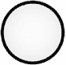
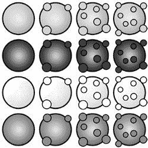
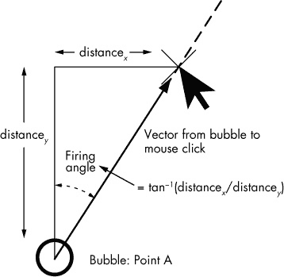

# 第二章. 使用 jQuery 和 CSS 实现精灵动画

在本章中，我们将深入探讨如何在屏幕上移动精灵。动画是游戏开发中最常见的任务之一，你将在动画一个简单游戏时学到的原理适用于大多数游戏类型。

尽管关于 HTML5 游戏的讨论大多集中在`canvas`元素上，但你完全可以使用更传统的 HTML、CSS 和 JavaScript 技术来实现许多游戏，这也是本章的重点。这些技术本身就是有用的游戏开发经验，而且当我们后面深入研究`canvas`元素时，它们也会带来好处。使用 HTML、JavaScript 和 CSS 技术开发的游戏，通常被称为*基于 DOM 的游戏*，它们具有更广泛的浏览器兼容性。一些仍在使用的旧版浏览器不支持`canvas`，也很可能不支持 CSS3 的变换和过渡效果；因此，我们将使用较旧的 CSS 特性。

*泡泡射手*游戏的核心机制当然是射击气泡，而玩家发射的每个气泡都会触发气泡爆破效果。我们将从根据用户输入（鼠标点击）来移动已发射的气泡开始。

首先，我们需要一种方法将气泡从起始点 A 移动到终点 B，并且气泡需要沿直线以恒定的速度移动。其次，我们需要准确确定点 A 和点 B 的位置。因为玩家总是从相同的位置发射气泡，起始坐标（点 A）对于每个新气泡都是相同的。点 B 则是用户在发射气泡时鼠标点击的坐标，因此我们必须获取这些坐标。首先，我们将实现从 A 到 B 的移动。

在最终的游戏中，气泡不会在到达点击坐标时停止，而是会继续移动，直到与另一个气泡发生碰撞或移出屏幕边缘。碰撞的处理将在稍后，当我们更全面地开发游戏展示时再进行。

当我们从一个点移动到另一个点时，就可以推算气泡的路径，超出用户点击的位置，并继续沿相同方向推动气泡。为了找到这条路径，我们需要根据点 A 和点 B 的相对位置计算发射角度，如图 2-1 所示。


图 2-1. 沿向量移动气泡

给定这个发射角度，我们可以将气泡发射到一个特定的方向，直到所需的距离。之后，我们可以通过确定碰撞来计算气泡需要移动多远。现在，我们暂时将*所需的距离*定义为足够远的一个点，使得气泡能够移出屏幕。

# CSS 精灵原理

*精灵*是一个二维的游戏元素，它是更大场景的一部分，但可以独立移动，而不影响背景数据。目前，点 A 的气泡是唯一的精灵。

在这种基于 DOM 的方法中，最简单的情况下，精灵是一个带有 CSS 样式的 HTML 块（通常是一组 `div` 标签）。由于浏览器渲染 HTML 的方式，移动精灵而不改变屏幕上的其他部分是非常容易的。使用 CSS 进行绝对定位的 HTML 元素会独立于周围的 HTML 元素进行渲染。浏览器将所有对象绘制到屏幕上并处理图层和重叠。如果我们移除一个对象，浏览器知道它需要显示下面的内容。这个 HTML 和 CSS 精灵操作的特性，在 `canvas` 开发中并不完全适用，但正如我们在 第六章中学习 `canvas` 元素时看到的那样，它是使 DOM 游戏开发成为理想起点并成为快速原型制作游戏的一个极好工具的功能之一。

## 创建游戏板

在 *Bubble Shooter* 游戏中，所有气泡都将是精灵，这样我们就可以将它们作为自包含的元素移动到屏幕上。我们将很快通过创建一个气泡来创建第一个精灵，这个气泡将放置在显示区域内。但首先，我们需要为游戏板创建一个容器，在所有气泡动作发生的区域内。我们将这个容器放在一个名为 `"board"` 的 `div` 中，因此在 *index.html* 中添加这个新的 `div`：

*index.html*

```
<div id="game">
  **<div id="board"></div>**
</div>
```

接下来，我们将使用 CSS 来定位游戏板。游戏板将位于固定宽度的显示区域的中央，因此我们将创建一个宽度为 760 像素的板，并将其从 `game div` 的左边缘定位 120 像素，`game div` 被定位在窗口的左侧。在 *main.css* 中添加 `#board` 的定义，位于 `#game` 的定义之后：

*main.css*

```
body
{
  margin: 0;
}
*--snip--*
#game
{
--snip--
}
**#board**
**{**
  **position: absolute;**
  **left: 120px;**
  **top: 0;**
  **width: 760px;**
  **height: 620px;**
**}**
```

我们还需要一些 CSS 来描述气泡的起始位置、宽度和高度。玩家当前的气泡将位于游戏区域的底部中央，并且会是 50 像素的正方形。我们将为玩家当前准备发射的气泡分配 CSS 类 `cur_bubble`，并在样式表中定义其定位和外观。我们会将游戏元素放在自己的 CSS 文件中，这样我们就能轻松区分它们与各种用户界面元素，如对话框和按钮。

在 *_css* 目录下创建一个新文件，命名为 *game.css*，并将以下代码放入其中：

*game.css*

```
.bubble
{
  position: absolute;
  width: 50px;
  height: 50px;
}
.cur_bubble
{
  left: 360px;
  top: 470px;
}
```

每个气泡将放置在一个 50 像素的正方形内。我们可以将整个游戏区域完全填充气泡，但诀窍是提供一个大面积的游戏板，同时又不让游戏持续时间过长。经过一些试验和错误后，我选择使用 16 个气泡，这样应该能适应游戏区域的宽度，并且仍留有一些边距。

我们还需要将 *game.css* 链接到 HTML 页头中的样式表文件，因此在链接到 *main.css* 之后，添加该链接到 *index.html* 中：

*index.html*

```
<head>
  <meta charset="UTF-8" />
  <title>Bubble Shooter</title>
  <link href="_css/main.css" rel="stylesheet" />
  **<link href="_css/game.css" rel="stylesheet" />**
```

我们想要发射的气泡尚未显示在屏幕上，因此我们需要将一张图片添加到文件系统中，然后使用一些 CSS 来显示它。

## 添加精灵

图 2-2 展示了一个气泡的外观（未上色）。气泡的外观将作为背景图像渲染在板 `div` 元素中。



图 2-2. 我们的第一个气泡精灵图

我们将使用四种不同的气泡颜色，所以让我们同时制作所有四种颜色的气泡。任何四种颜色都可以，只要它们足够显眼。和其他资源一样，通常是图像和声音文件，我们会将有颜色的气泡存储在一个带下划线的文件夹中。我们将这个文件夹命名为* _img*。

为了加快加载时间并简化文件管理，我们将把所有四种气泡类型的图像放入一个单独的 PNG 文件中。你可以在图 2-3 中看到完整的图像。



图 2-3. 包含四种气泡类型所有动画状态的单一图像文件

PNG 文件（*bubble_sprite_sheet.png*）不仅包含四种气泡的基本状态，还包含我们稍后会用到的气泡爆炸动画过程。标准的气泡图像显示在左列；三个爆炸动画阶段显示在第二列、第三列和第四列。由于我们有四种不同的气泡，我们将创建 CSS 定义，使我们通过上下移动背景图像的位置来显示我们想要的颜色。使用单一图像渲染多个精灵是我们使用 CSS 背景图像的原因，而不是直接将``标签放入 DOM 中；因此，浏览器只需要下载一个图像文件，这可以加快初始化时间。此外，爆炸的动画帧已经预加载，所以在游戏后续加载图像时，我们不应该遇到任何卡顿。

尽管我们使用了四种气泡颜色，但游戏并不需要知道具体的颜色——我们甚至可能以后改变颜色选择——但它确实需要一种方法来引用这些颜色。我们将把气泡类型编号从零到三来表示四种颜色。

我们可以使用`.bubble`的基础 CSS 类来设置所有气泡共有的属性，并在需要指定气泡类型（即设置颜色）时，向 HTML 元素添加额外的类。请按照以下方式修改*game.css*：

*game.css*

```
.bubble
{
  position: absolute;
  width: 50px;
  height: 50px;
  **background-image: url("../_img/bubble_sprite_sheet.png");**
}
.cur_bubble
{
  left: 360px;
  top: 470px;
}
**.bubble_0**
**{**
  **background-position: 0 0;**
**}**
**.bubble_1**
**{**
  **background-position: 0 -50px;**
**}**
**.bubble_2**
**{**
  **background-position: 0 -100px;**
**}**
**.bubble_3**
**{**
  **background-position: 0 -150px;**
**}**
```

现在，当我们想渲染四个气泡时，我们只需要向`div`元素添加正确的类，`background-position`属性应该会显示出适当的图像。如果我们想将最后一种类型的气泡硬编码到 DOM 中，可以添加以下内容：

```
<div class="bubble bubble_3"></div>
```

第一种类型的气泡将是

```
<div class="bubble bubble_0"></div>
```

尽管我们目前已经在 CSS 中定义了气泡，但我们没有 HTML 来将其显示在屏幕上。我们不会将气泡硬编码，而是通过 JavaScript 生成它们。但在开始为气泡添加动画之前，我们需要先创建并渲染一个气泡，这是下一部分的重点。

# 动画与气泡类

由于气泡是游戏中的主要元素之一，我们将为其创建一个单独的 JavaScript 类。我们目前还不知道该类可能需要哪些所有属性，但对于每个需要在代码中操作的气泡对象，都将有一个屏幕上的元素进行显示；因此，我们将创建一个属性来引用它。我们将其命名为`sprite`属性，它将存储我们用来操作 DOM 元素的 jQuery 对象的引用。

将以下内容放在一个单独的文件中，命名为*bubble.js*，并将新文件添加到*index.html*中的`Modernizr.load`调用中，位于*ui.js*之后：

*bubble.js*

```
  var BubbleShoot = window.BubbleShoot || {};
  BubbleShoot.Bubble = (function($){
    var Bubble = function(sprite){
      var that = this;
➊    this.getSprite = function(){ return sprite;};
    };
➋  Bubble.create = function(){
      var sprite = $(document.createElement("div"));
      sprite.addClass("bubble");
      sprite.addClass("bubble_0");
      var bubble = new Bubble(sprite);
      return bubble;
    };
    return Bubble;
  })(jQuery);
```

我们只有一个参数传递给构造函数，那就是引用将在`Bubble.create`函数 ➋调用中创建的 jQuery `sprite`对象。由于分配了`bubble_0` CSS 类，该函数目前只创建一种类型的精灵。当前，类定义中只有一个方法 ➊，它返回`sprite`对象。当我们想要创建一个气泡时，我们不会直接调用`BubbleShoot.Bubble`，而是会调用`BubbleShoot.Bubble.create`。因此，我们可以确保气泡的所有组件都正确实例化，并最小化代码重复。

现在我们可以创建`Bubble`对象，且文档元素会同时创建。然而，气泡仍然不会成为可见的 DOM 的一部分，因为它尚未插入文档。为了处理这个问题，我们将在`Game`内部创建一个函数，用于创建新气泡并将 CSS 类`cur_bubble`添加到新创建的 DOM 元素中。

在游戏中的任何时刻，屏幕上只有一个准备好供玩家发射的气泡，因此我们将在`Game`内的一个变量中保留对它的引用，命名为`curBubble`。为了完成这一步气泡创建的工作，请将加粗的行添加到*game.js*中：

*game.js*

```
  var BubbleShoot = window.BubbleShoot || {};
  BubbleShoot.Game = (function($){
    var Game = function(){
➊    **var curBubble;**
      this.init = function(){
        $(".but_start_game").bind("click",startGame);
      };
      var startGame = function(){
        $(".but_start_game").unbind("click");
        BubbleShoot.ui.hideDialog();
➋      **curBubble = getNextBubble();**
      };
➌    **var getNextBubble = function(){**
➍      **var bubble = BubbleShoot.Bubble.create();**
➎      **bubble.getSprite().addClass("cur_bubble");**
➏      **$("#board").append(bubble.getSprite());**
        **return bubble;**
      **};**
    };
    return Game;
  })(jQuery);
```

在`Game`定义的顶部，我们定义了`curBubble` ➊，它只会在`Game`对象的作用域内存在。这个空的变量在此声明，并在用户点击“新游戏”按钮时设置，该按钮会调用`startGame`。在这里，`curBubble`被设置为`getNextBubble` ➋返回的值。`getNextBubble` ➌调用`BubbleShoot.Bubble.create` ➍，该函数返回一个`Bubble`类的实例，并将 CSS 类`cur_bubble` ➎添加到 DOM 元素中。最后，DOM 元素被追加到板块`div`元素中 ➏。

重新加载页面并点击**新游戏**。在屏幕的底部中央，你应该看到一个气泡出现。这个气泡现在还不能移动，但我们将在下一部分通过添加一些简单的动画来改变这一点。

## 计算角度和方向

为了确定气泡发射的方向，我们需要找出用户点击时鼠标的位置。我们可以通过检查响应 `click` 事件的事件对象来做到这一点。`Game` 控制器需要知道发射气泡的角度以及游戏结果显示的内容。为了避免在控制器中添加界面代码，`ui` 对象将处理运动过程，步骤如下：

1.  查找鼠标点击的坐标。

1.  计算从气泡的起始点到点击点的向量。

1.  延长该向量足够的长度，将气泡移动出游戏屏幕。

1.  将气泡移动到向量的末端。

气泡轨迹的示例见于 图 2-1。

此时，运动过程假设气泡不会与任何东西碰撞，这是我们首先要解决的特性。

在 `Game` 函数定义中，创建 `clickGameScreen` 函数（紧跟在 `getNextBubble` 函数之后），并为 `startGame` 添加事件绑定，如下所示：

*game.js*

```
  var BubbleShoot = window.BubbleShoot || {};
  BubbleShoot.Game = (function($){
    var Game = function(){
      var curBubble;
      --*snip*--
      var startGame = function(){
        $(".but_start_game").unbind("click");
        BubbleShoot.ui.hideDialog();
        curBubble = getNextBubble();
        **$("#game").bind("click",clickGameScreen);**
      };
    *--snip--*
➊    **var clickGameScreen = function(e){**
        **var angle = BubbleShoot.ui.getBubbleAngle(curBubble.getSprite(),e);**
      **};**
    };
    return Game;
  })(jQuery);
```

函数 `clickGameScreen` ➊ 会响应用户点击屏幕时被调用。作为 jQuery 事件处理的一部分，它将接收一个事件对象 `e`，其中包含关于点击对象的有用数据，包括点击的坐标。此函数还会调用 `BubbleShoot.ui.getBubbleAngle`，该方法将使用事件对象的点击坐标计算气泡的发射角度。返回的值将是一个角度，单位为弧度，表示气泡相对于其垂直中心线的左侧或右侧。现在我们来编写这段代码。

在 *ui.js* 中，在 `ui` 对象的顶部添加以下常量，并在 `hideDialog` 之后添加新的方法：

*ui.js*

```
  var BubbleShoot = window.BubbleShoot || {};
  BubbleShoot.ui = (function($){
    var ui = {
➊    **BUBBLE_DIMS : 44,**
      init : function(){
      },
      hideDialog : function (){
        $(".dialog").fadeOut(300);
      },
      **getMouseCoords : function(e){**
➋      **var coords = {x : e.pageX, y : e.pageY};**
          **return coords;**
      **},**
      **getBubbleCoords : function(bubble){**
➌      **var bubbleCoords = bubble.position();**
        **bubbleCoords.left += ui.BUBBLE_DIMS/2;**
        **bubbleCoords.top += ui.BUBBLE_DIMS/2;**
        **return bubbleCoords;**
      **},**
      **getBubbleAngle : function(bubble,e){**
        **var mouseCoords = ui.getMouseCoords(e);**
        **var bubbleCoords = ui.getBubbleCoords(bubble);**
        **var gameCoords = $("#game").position();**
        **var boardLeft = 120;**
➎      **var angle = Math.atan((**➍**mouseCoords.x - bubbleCoords.left - boardLeft)**
          **/ (**➍**bubbleCoords.top + gameCoords.top - mouseCoords.y));**
➏      **if(mouseCoords.y > bubbleCoords.top + gameCoords.top){**
          **angle += Math.PI;**
        **}**
        **return angle;**
      **}**
    };
    return ui;
  })(jQuery);
```

`BUBBLE_DIMS` ➊ 是气泡精灵在 DOM 中的宽度（和高度）。这个常量使我们能够计算出元素中心的偏移量，这意味着我们可以转换为 CSS 使用的（top, left）坐标。在游戏编程中，当你改变一个物体的位置时，通常需要使用物体的中心坐标，而在渲染时，你将使用（top, left）坐标。

这段新代码通过从 jQuery 事件对象 `e` 中获取两个属性，来获取玩家鼠标点击的坐标 ➋。我们还需要起始气泡的坐标，所以接下来的方法 ➌ 将通过另一个 jQuery 方法来完成这个任务。得到这两个坐标对后，我们可以计算它们之间的相对 *x*/*y* 偏移量 ➍。接着，我们可以使用正切三角函数 ➎ 根据 *x*/*y* 偏移量来计算角度。如果点击发生在气泡的中心线下方 ➏，我们将角度加上 pi（即 180 度，但 JavaScript 的三角函数总是以弧度为单位），以便描述一个完整的圆。

为了计算角度，我们使用了一些三角函数，随着你制作游戏的过程，你会变得更加熟悉这些函数（如果你还不熟悉的话）。`Math.atan`方法检索相对于垂直方向的角度，正数表示右侧，负数表示左侧。返回的角度是一个弧度值，范围从负π到正π。

## 发射和动画化气泡

现在我们知道了发射气泡的角度，我们可以将其发射出屏幕。假设我们将气泡发射到 1000 像素远——这足以将其移出游戏区域——然后查看实际效果。

快速的三角函数复习

我们可以通过一些三角函数使用反正切函数来计算发射气泡的角度。在图 2-4 中，我们通过计算向量的 x 和 y 分量的反正切来得到角度。



图 2-4. 手动计算发射角度

将以下代码行添加到*game.js*中的`clickGameScreen`：

*game.js*

```
  var BubbleShoot = window.BubbleShoot || {};
    BubbleShoot.Game = (function($){
    var Game = function(){
      *--snip--*
      var clickGameScreen = function(e){
        var angle = BubbleShoot.ui.getBubbleAngle(curBubble.getSprite(),e);
        **var duration = 750;**
        **var distance = 1000;**
        **var distX = Math.sin(angle) * distance;**
        **var distY = Math.cos(angle) * distance;**
        **var bubbleCoords = BubbleShoot.ui.getBubbleCoords(curBubble.**
          **getSprite());**
        **var coords = {**
          **x : bubbleCoords.left + distX,**
          **y : bubbleCoords.top - distY**
        **};**
➊      **BubbleShoot.ui.fireBubble(**➋**curBubble,**➌**coords,**➍**duration);**
      };
    };
    return Game;
  })(jQuery);
```

新的代码设置了持续时间和总距离，然后计算沿着*x*轴和*y*轴的距离，从而给出距离起始点 1000 像素的坐标（`coords`），朝着鼠标点击的方向。

接下来，我们需要编写`fireBubble`函数➊，该函数接受`bubble`对象➋、一个目标坐标➌和一个持续时间➍作为参数。我们将其放入`ui`类中，因为它只处理屏幕上的运动，不会影响游戏状态。

在*ui.js*中，紧接着`getBubbleAngle`方法后添加一个新方法：

*ui.js*

```
  var BubbleShoot = window.BubbleShoot || {};
  BubbleShoot.ui = (function($){
    var ui = {
      *--snip--*
      getBubbleAngle : function(bubble,e){
        *--snip--*
      },
      **fireBubble : function(bubble,coords,duration){**
➊      **bubble.getSprite().animate({**
➋          **left : coords.x - ui.BUBBLE_DIMS/2,**
            **top : coords.y - ui.BUBBLE_DIMS/2**
          **},**
          **{**
➌          **duration : duration,**
➍          **easing : "linear"**
          **});**
      **}**
    };
    return ui;
  })(jQuery);
```

`fireBubble`方法是一个 jQuery 调用，它通过 jQuery 的`animate`方法移动气泡。传递给该函数的坐标表示气泡需要停止的中心点。为了确保气泡到达正确的(top, left)坐标，`fireBubble`首先将接收到的坐标转换为对象的左上角坐标➊，这是 CSS 定位元素的方式。

最简单的动画方式是将精灵移动到屏幕上，分为两个步骤：➊将精灵放置在一个固定位置，➋在一段短时间后将其移动到新的位置。重复第二步，直到精灵到达目标位置。使用 DOM 操作时，我们只需要在每次移动时更改元素的 top 和 left CSS 属性，浏览器会自动处理其余部分。

我们可以通过两种方式实现这个动画。我们可以使用 JavaScript 动画，这需要我们手动在路径的每一步中移动精灵，或者我们可以使用 CSS3 过渡效果，在每帧中无需我们代码的参与来移动精灵。本章我们将重点介绍 JavaScript 方法，稍后我们会展示 CSS3 的实现方式。

与我们希望在 JavaScript 和 CSS 中实现的许多效果一样，我们可以让 jQuery 为我们做大部分工作。`animate` 方法提供了一种动画化数字 CSS 属性的方法，如 left 和 top 坐标。它计算起始值和结束值之间的差距，并在若干步中将属性的值从起始值变化到结束值。

### 注意

*此方法不适用于非数字 CSS 属性，因为从起始值到结束值的转换无法轻松计算。例如，你不能使用 `animate` 来过渡背景颜色，起始值和结束值是十六进制对，因为在两种颜色之间插值并不是一个简单的计算。*

`animate` 方法接受多个参数，包括以下内容：

+   ****CSS 属性 ➋****。指定要动画化的属性。通常，这些是定位属性，如 *top* 和 *left*，但它们也可以是任何可以用像素单一整数维度定义的属性，包括 `font-size`、宽度、高度，甚至 `border-width` 或 `margin-left`。（注意，像 `margin: 0 10px 20px 10px` 这样的简写定义包含了四个不同的值，因此它不能直接与 `animate` 配合使用，需要将其拆分成 `margin-top`、`margin-right`、`margin-bottom` 和 `margin-left` 四个部分。）

+   ****持续时间 ➌****。定义动画持续时间的长度，以毫秒为单位。此处的持续时间固定为 1 秒（1000 毫秒），以每秒 1000 像素的速度进行动画。气泡的移动距离将取决于游戏状态，特别是气泡可能与什么碰撞。但是，目前的持续时间应该适合那些被发射出屏幕的气泡。

+   ****缓动 ➍****。定义物体从起始状态到结束状态的过渡方式。缓动通常用于改变沿运动路径的加速和减速。例如，对于运动，`linear` 表示从起点到终点的速度是恒定的，而 `swing` 则在开始时有加速，结束时有减速。

你也可以将其他选项传递给`animate`，并且参考 jQuery 文档可以了解该函数的全部潜力。要触发气泡，我们只需要前面的参数。

重新加载页面并点击气泡上方的某个位置，气泡应该会朝那个方向飞去。这只会发生一次。你需要刷新页面才能再次看到它，但这无疑是一个开始。

# 总结

在本章中，你已经学会了如何使用 jQuery、HTML 和 CSS 技术进行简单的动画效果。现在，我们已经具备了基本的代码，可以在鼠标点击时使气泡在屏幕上移动，是时候开始完善这个游戏了。

在 第三章，我们将专注于绘制游戏棋盘、检测碰撞和消除气泡组。

# 进一步练习

1.  如果你在游戏区域再次点击，气泡会重新出现在屏幕上。你如何禁用这个点击事件以防止它发生？

1.  在`.animate`调用中，我们指定了`easing : "linear"`。试着使用`"swing"`，并思考为什么这对*Bubble Shooter*来说可能不合适，但对于其他游戏可能是更好的动画方法。然后查看更多的 easing 设置，访问 *[`api.jqueryui.com/easings/`](http://api.jqueryui.com/easings/)*，看看你是否可以将其中的任何设置融入到代码中。
