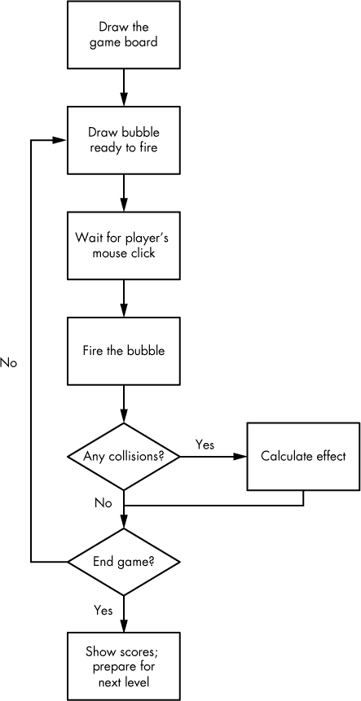
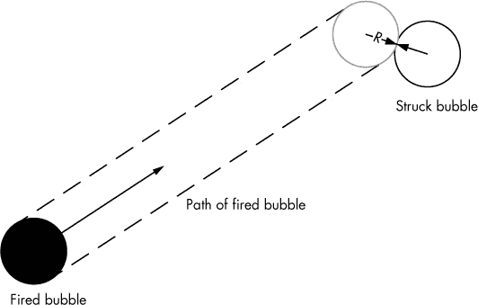
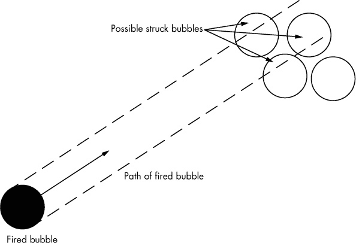
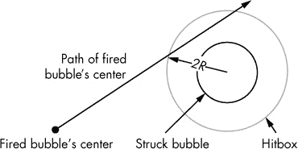

# 第三章 游戏逻辑

到这一点，我们已经创建了一个包含新游戏按钮和一个玩家可以发射的泡泡的介绍屏幕。在这一章中，我们将把*泡泡射手*变得更加完整，变成一个真正的游戏。你将学习如何绘制游戏面板并显示关卡信息给玩家，然后了解碰撞检测。

*碰撞*是许多游戏的核心，当精灵碰撞时就会发生。 一旦你能够检测到碰撞，就可以编写代码让精灵做出反应。在*泡泡射手*中，碰撞发生在发射的泡泡撞到游戏面板中的另一个泡泡时。我们将实现两种反应：如果发射的泡泡没有形成三个或更多泡泡的颜色组，它将粘附在面板上，或者它将导致一个有效的颜色组从面板上掉落。

但在我们计算碰撞之前，我们需要一个对象来与泡泡发生碰撞。本章的第一部分讨论了如何绘制初始面板和设置游戏状态。为此，我们需要遵循一个包含多个步骤的过程，如图 3-1 所示。



图 3-1。游戏循环从绘制面板开始，最后显示得分。

我们将首先绘制游戏面板，然后为发射的泡泡添加碰撞检测。在下一章中，我们将实现根据颜色匹配弹出泡泡组的机制。

让我们一步步实现这些步骤并将它们转化为代码。

# 绘制游戏面板

每一关的游戏面板结构相似，每个面板包含四种颜色的泡泡行。交替的行包含奇数或偶数个泡泡，具体取决于该行的行号是奇数还是偶数。我们将把这些状态信息存储在一个`Board`对象中，并将当前的面板作为变量存储在`Game`对象中。

你选择的对象结构应根据游戏设计的不同而有所变化，但目标应该与决定如何在 Web 应用程序中组织代码时相同：将执行相似操作的对象分组，并在抽象公共功能的程度上保持平衡。不要定义几个包含非常少代码的类，但也不要创建太少类，并将它们的代码写得很长，这样会难以阅读和理解。游戏开发者通常根据直觉、经验以及硬性规则来做出初步的结构决策。如果你认为最初的选择不再有效，始终准备重构代码。

组成棋盘的行将是一个`Bubble`对象的数组。当我们实例化`Board`对象时，会创建这个数组。稍后，我们将把棋盘元素的绘制从*ui.js*转移到 DOM 中。将大量代码放入`Game`类中很容易，但这并不是我们想要的；因此，尽可能将职责交给其他类，特别是在将对象渲染到屏幕时。

在*game.js*中，我们需要创建一个变量来存储棋盘和一个新的`Board`对象实例。当点击“新游戏”按钮时，棋盘会被生成。将以下新代码添加到*game.js*中：

*game.js*

```
var BubbleShoot = window.BubbleShoot || {};
  BubbleShoot.Game = (function($){
  var Game = function(){
    var curBubble;
    **var board;**
    *--snip--*
    var startGame = function(){
      $(".but_start_game").unbind("click");
      BubbleShoot.ui.hideDialog();
      curBubble = getNextBubble();
      **board = new BubbleShoot.Board();**
      **BubbleShoot.ui.drawBoard(board);**
      $("#game").bind("click",clickGameScreen);
    };
    *--snip--*
  };
  return Game;
})(jQuery);
```

`Board`是我们需要创建的一个新构造函数。创建一个名为*board.js*的新文件，并将其添加到`Modernizr.load`在*index.html*中的加载文件列表中。将以下代码添加到新文件中：

*board.js*

```
  var BubbleShoot = window.BubbleShoot || {};
  BubbleShoot.Board = (function($){
➊  var NUM_ROWS = 9;
➋  var NUM_COLS = 32;
    var Board = function(){
      var that = this;
➌    var rows = createLayout();
➍    this.getRows = function(){ return rows;};
      return this;
    };
    var createLayout = function(){
      var rows = [];
➎    for(var i=0;i<NUM_ROWS;i++){
        var row = [];
➏      var startCol = i%2 == 0 ? 1 : 0;
        for(var j=startCol;j<NUM_COLS;j+=2){
➐        var bubble = BubbleShoot.Bubble.create(i,j);
          row[j] = bubble;
        };
        rows.push(row);
      };
      return rows;
    };
    return Board;
  })(jQuery);
```

`NUM_ROWS` ➊ 和 `NUM_COLS` ➋ 是常量，决定了气泡棋盘网格的行数和列数。列数可能看起来很大，因为我们肯定不会在一行中放 32 个气泡。设置这么大的列数的原因是，我们将为每个气泡的半宽度创建一个网格项，因为奇数行和偶数行在棋盘上是错开的。这一设计决策使得布局更具视觉吸引力，看起来像气泡堆叠在一起。它还为玩家提供了更多有趣的角度来射击。

第一行和每个随后的奇数行上的所有气泡将具有奇数的*y*坐标，而偶数行上的气泡将具有偶数的*y*坐标。行数以整数步进增加，但我们将使用的数组从零开始索引：第一行在索引 0，第二行在索引 1，以此类推。因此，气泡坐标(*x*,*y*)，从气泡棋盘的左上角开始，标记如下图图 3-2 所示。通过这种方式指定坐标并使用半填充的网格，避免了使用半值和小数点。此外，我们可以将棋盘布局存储在由整数索引的数组中。使用整数而不是小数并不会改变我们计算碰撞时的过程，但它确实使代码更具可读性。


图 3-2. 游戏网格中气泡的坐标

在代码中，我们现在将调用`createLayout`函数 ➌，它返回一个二维的行列数组。在下一行 ➍ 中，我们提供了对这个数组的公共访问。一旦我们拥有了`Board`对象，就可以检索到任何特定行列位置的气泡。例如，要访问坐标(4,1)处的气泡，我们可以写：

```
var rows = board.getRows();
var row = rows[1];
var bubble = row[4];
```

泡泡是按行然后按列号访问的。首先，我们通过`board.getRows`获取所有行，然后将棋盘中的第一行存储为`row`。接下来，我们通过列号访问`row`中的第四个泡泡。由于`row`数组只有一半被填充，在偶数索引行中的所有奇数位置以及奇数索引行中的所有偶数位置将为 null。

`createLayout`函数包含一个循环➎。对于我们想要创建的每一行，`startCol` ➏会根据行是奇数行还是偶数行来决定是否从第 1 列或第 0 列开始。然后，另一个循环会递增到最大列数，创建一个新的`Bubble`对象➐，并将其添加到行数组中，完成后返回该数组。

为了使此函数工作，我们需要调整`Bubble`类以接受行和列的输入坐标，并且我们需要修改`Bubble.create`方法。此外，如果一个`Bubble`对象通过存储其坐标来知道自己在网格中的位置，当我们需要计算需要爆炸的泡泡群时，这些信息将非常有用。当我们知道一个泡泡的位置时，可以访问该泡泡，因为它存储在`Board`对象中。然后，给定一个泡泡，我们可以查询它的位置。每个泡泡都有一个`type`属性，对应于它的颜色，该属性在创建时确定。

当你开始编码自己的游戏想法时，关于数据存储和访问方式的决策至关重要。你的解决方案将取决于你所构建的游戏类型。在*泡泡射手*中，我们将相对较少的`Bubbles`存储在一个`Board`对象中。要获取某个特定泡泡的信息，我们可以通过从`rows`数组中提取数据来访问`Board`所存储的数据。

根据我们如何使用这些泡泡数据，这种方法可能不是最优雅的解决方案。例如，假设我们想要找到游戏中所有的红色泡泡。目前，我们必须遍历棋盘上的每个位置，检查泡泡是否为红色，然后存储结果。由于游戏网格较小，现代处理器能够快速执行这个操作。只要我们不在每秒钟内运行太多次颜色检查，当前的代码结构应该能够正常工作。

但现在想象一下屏幕上有*成千上万*个泡泡。遍历所有泡泡仅仅为了找到红色的泡泡将消耗太多处理能力。因此，我们可能想要将泡泡存储在多个数组中——一个存储所有红色泡泡，一个存储所有绿色泡泡，依此类推——以便快速访问每种颜色的所有泡泡。然而，这样做仍然存在权衡：为了检查棋盘上的某个位置是否被泡泡占据（不论颜色如何），我们必须查看多个数组。

当你只是大概知道处理器能够执行操作的速度时，最好使你的代码清晰简洁。如果你的游戏可以正常玩且运行速度足够快，你就不需要尝试不同的方式来访问数据。另一方面，如果你发现瓶颈，你就必须重构一些部分以提高速度。游戏开发是一个迭代过程；你将会像写新代码一样，反复修改已有的代码行。

你如何设计对象以及如何存储它们的数据会因游戏而异。但请记住这一点：如果`Game`对象需要使用这些数据，无论如何，你必须允许该对象访问这些数据。无论数据是直接存储在变量中，还是存储在`Game`中的数组中，或是通过`Game`可以访问的中介对象（如*Bubble Shooter*中的`Board`对象）进行访问，代码都需要访问该对象的状态，如果它需要对该对象做出决策的话。

为了支持泡泡存储其在棋盘上的位置和颜色，修改*`bubble.js`*如下：

*`bubble.js`*

```
  var BubbleShoot = window.BubbleShoot || {};
  BubbleShoot.Bubble = (function($){
    var Bubble = function(➊**row,col,type**,sprite){
      var that = this;
      **this.getType = function(){ return type;};**
      this.getSprite = function(){ return sprite;};
      **this.getCol = function(){ return col;};**
      **this.getRow = function(){ return row;};**
    };
    Bubble.create = function(➋**rowNum,colNum,type**){
➊    **if(type === undefined){**
➋      **type = Math.floor(Math.random() * 4);**
      **};**
      **var sprite = $(document.createElement("div"));**
      **sprite.addClass("bubble");**
      **sprite.addClass("bubble_" + type);**
      var bubble = new Bubble(**rowNum,colNum,type,**sprite);
      return bubble;
    };
    return Bubble;
  })(jQuery);
```

`Bubble`现在接受网格坐标和泡泡类型，以及精灵对象 ➊，其中类型对应于*game.css*中指定的颜色。`Bubble.create`方法接受相同的参数 ➋；如果没有传入类型 ➌，则随机选择四种类型（颜色）之一 ➍。

现在我们有了一个`Board`对象，许多泡泡，以及它们的类型和位置。但所有这些信息完全存储在内存中，并存储在`Board`对象的`rows`属性中。接下来，我们将使用这些信息渲染关卡，以便玩家能够看到游戏棋盘。

## 渲染关卡

绘制关卡是`ui`类的完美任务，因为`ui`表示游戏状态，但不影响该状态。

将计算对象位置的代码与渲染该对象到屏幕上的代码分开，是你在所有游戏设计中应该遵循的原则。这不仅将渲染代码与游戏逻辑分离，从而提高了可读性，还使你更容易更改对象的渲染方式。例如，如果*Bubble Shooter*的棋盘更大且无法完全显示在屏幕上，但我们希望实现缩放或平移功能，我们可以更改渲染棋盘的代码，通过偏移渲染位置或缩放大小来绘制不同大小的棋盘。当我们从基于 DOM 的精灵切换到绘制到 HTML `canvas`元素时，第六章中分离渲染与游戏逻辑的强大作用将变得显而易见。

由于创建`bubble`对象涉及创建一个 DOM 精灵元素，因此渲染过程需要将此元素放入文档中并正确定位。以下是这些简单步骤：

1.  遍历所有行和列，提取每个`bubble`对象。

1.  将泡泡的 HTML 写入 DOM。

1.  将泡泡放置在正确的位置。

你添加的下一段代码将应用这些步骤。打开 *ui.js*，在 `fireBubble` 后添加一个新方法（`drawBoard`），然后在顶部添加一个新的 `ROW_HEIGHT` 常量：

*ui.js*

```
  var BubbleShoot = window.BubbleShoot || {};
  BubbleShoot.ui = (function($){
    var ui = {
      BUBBLE_DIMS : 44,
      **ROW_HEIGHT : 40,**
      init : function(){
      },
      fireBubble : function(bubble,coords,duration){
        *--snip--*
      }**,**
      **drawBoard : function(board){**
  ➊      **var rows = board.getRows();**
        **var gameArea = $("#board");**
        **for(var i=0;i<rows.length;i++){**
          **var row = rows[i];**
➋        **for(var j=0;j<row.length;j++){**
            **var bubble = row[j];**
➌          **if(bubble){**
➍            **var sprite = bubble.getSprite();**
➎            **gameArea.append(sprite);**
              **var left = j * ui.BUBBLE_DIMS/2;**
              **var top = i * ui.ROW_HEIGHT;**
➏            **sprite.css({**
                **left : left,**
                **top : top**
              **});**
            **};**
          **};**
        **};**
      **}**
    };
    return ui;
  })(jQuery);
```

`drawBoard` 方法获取棋盘的行和列 ➊ 并对它们进行循环 ➋。如果有一个泡泡 ➌（回想一下，由于稀疏网格系统，其他 *x* 坐标位置是 `null`），`drawBoard` 会获取 `sprite` 对象 ➍，将其附加到棋盘上 ➎，并计算其坐标后设置位置 ➏。

为了确定泡泡的位置，`drawBoard` 首先计算左侧坐标，即泡泡所在列数乘以它宽度的一半。为了计算顶部坐标，我们会使用一个比 `BUBBLE_DIMS` 高度稍小的值。奇数行和偶数行是错开的，我们希望泡泡看起来像是紧密排列在一起的。为了创建堆叠效果，垂直间距会稍微小于水平间距。在 *ui.js* 的顶部，`ROW_HEIGHT` 已经设置为 40，比高度少了 4 像素。这个值是通过反复试验确定的，而不是通过几何计算得出的：调整这些数字，直到泡泡网格看起来合适为止。

重新加载并点击 **新游戏**；你应该能看到一个渲染良好的棋盘。你甚至可以向棋盘的其他地方发射泡泡；不幸的是，泡泡应该直接穿过而不碰到任何东西，并像之前一样继续飞出屏幕。

因为我们只有一个泡泡，我们需要刷新才能重新尝试这个过程。在开始处理碰撞检测之前，我们将确保可以连续发射一个泡泡接一个泡泡。

## 泡泡队列

尽管玩家只有有限数量的泡泡可以发射，但游戏需要提供持续不断的泡泡流。因此，我们需要添加一个函数，创建一个新的泡泡，将其添加到 DOM 中，并在玩家发射第一个泡泡后立即排队准备下一个泡泡。

在 *game.js* 中，添加以下变量和函数，并更改 `curBubble` 的初始化，调用一个新的 `getNextBubble` 函数：

*game.js*

```
  var BubbleShoot = window.BubbleShoot || {};
  BubbleShoot.Game = (function($){
    var Game = function(){
    var curBubble;
    var board;
➊  **var numBubbles;**
➋  **var MAX_BUBBLES = 70;**
    this.init = function(){
      $(".but_start_game").bind("click",startGame);
    };
    var startGame = function(){
      $(".but_start_game").unbind("click");
➌    **numBubbles = MAX_BUBBLES;**
      BubbleShoot.ui.hideDialog();
      curBubble = getNextBubble();
      board = new BubbleShoot.Board();
      BubbleShoot.ui.drawBoard(board);
      $("#game").bind("click",clickGameScreen);
    };
    var getNextBubble = function(){
      var bubble = BubbleShoot.Bubble.create();
      bubble.getSprite().addClass("cur_bubble");
      $("#board").append(bubble.getSprite());
➍    **BubbleShoot.ui.drawBubblesRemaining(numBubbles);**
      **numBubbles--;**
      return bubble;
    };
    var clickGameScreen = function(e){
      var angle = BubbleShoot.ui.getBubbleAngle(curBubble .getSprite(),e);
      var duration = 750;
      var distance = 1000;
      var distX = Math.sin(angle) * distance;
      var distY = Math.cos(angle) * distance;
      var bubbleCoords = BubbleShoot.ui.getBubbleCoords(curBubble .getSprite());
      var coords = {
        x : bubbleCoords.left + distX,
        y : bubbleCoords.top - distY
      };
      BubbleShoot.ui.fireBubble(curBubble,coords,duration);
➎    **curBubble = getNextBubble();**
    };
    return Game;
  })(jQuery);
```

新代码首先创建了一个变量 ➊ 来存储玩家已发射的泡泡数量。因为发射的泡泡数量是一个整数——一种基本数据类型——所以我们将它作为变量存储在 `Game` 中。例如，如果我们有一个时间限制，需要在某个时间内完成关卡，我们可能会创建一个对象来存储剩余时间和剩余泡泡，而不是继续在 `Game` 中创建多个变量。就目前来说，这个变量已经能满足我们的需求。

代码还设置了一个常量，表示玩家可以发射的最大泡泡数量 ➋。当关卡开始时，代码将剩余泡泡数设置为 `MAX_BUBBLES` 的值 ➌，并调用 *ui.js* 中的新函数以显示屏幕上剩余泡泡的数量 ➍。最后，每次发射泡泡时，代码都会调用 `getNextBubble` ➎ 准备下一个泡泡。

我们还希望显示玩家在关卡中剩余可发射的气泡数量，因此在*ui.js*中创建`drawBubblesRemaining`方法，将这个新函数添加到`ui`对象中：

*ui.js*

```
var BubbleShoot = window.BubbleShoot || {};
BubbleShoot.ui = (function($){
  var ui = {
    BUBBLE_DIMS : 44,
    ROW_HEIGHT : 40,
    *--snip--*
    drawBoard : function(board){
      *--snip--*
    }**,**
    **drawBubblesRemaining : function(numBubbles){**
      **$("#bubbles_remaining").text(numBubbles);**
    **}**
  };
  return ui;
})(jQuery);
```

此外，我们需要显示剩余气泡的数量，所以在*index.html*中添加一个新元素：

*index.html*

```
<div id="game">
  <div id="board"></div>
  **<div id="bubbles_remaining"></div>**
</div>
```

为`bubbles_remaining` div 添加一些样式到*main.css*：

*main.css*

```
#bubbles_remaining
{
  position: absolute;
  left: 479px;
  top: 520px;
  width: 50px;
  font-size: 26px;
  font-weight: bold;
  color: #000;
  text-align: center;
}
```

现在刷新游戏。你应该能够把气泡射到远处，每当第一个气泡发射后，立刻得到一个新气泡（直到你使用了 70 个气泡，或者你为`MAX_BUBBLES`设置的其他值），并能立即发射那个新气泡。

通常，你可以将游戏分解为一个重复的*回合循环*。这个循环通常由玩家操作启动，然后在操作解决后结束。在*Bubble Shooter*中，循环在玩家点击屏幕发射按钮时开始，当下一个气泡准备好发射时结束。此时我们有了基本的回合循环，但为了创建游戏，我们需要完善循环的中间部分，计算气泡停止的位置以及是否需要爆炸气泡。

# 检测碰撞

尽管现在你可以发射气泡，但它们会直接穿过板面，不会影响气泡网格。游戏设计要求它们与板面碰撞，并要么成为板面的一部分，要么导致相同颜色的气泡组爆炸。接下来的任务是计算碰撞发生的地方。

我们可以通过两种方式计算碰撞：

+   每帧将一个精灵向前移动几个像素，然后尝试检测是否与其他精灵重叠。如果发生重叠，我们就知道已经碰到另一个气泡。

+   使用几何学来计算精灵在开始移动之前可能与其他气泡发生碰撞的地方。

在快节奏的街机游戏中，只要没有发生物体穿透而未检测到碰撞的可能性，你可能会选择第一种方案。这些穿透可能发生在物体以高速移动时，而碰撞检查发生在物体自上次检查以来已经移动了多个像素之后。例如，在一个射击子弹的游戏中，如果你向一堵一英尺厚的墙开火，只有每英尺检查一次碰撞，才能确保子弹与墙碰撞。如果你每两英尺检查一次碰撞，可能会在子弹应该击中之前检查碰撞，结果发现没有墙壁。然后在再检查两英尺时，子弹已经穿过墙壁，从而导致没有碰撞。

为了绕过快速移动物体的问题，我们可以确保每一步的距离足够小，以避免物体穿透；然而，这需要更多的计算，可能在没有强大计算能力的情况下无法实现。这个问题在浏览器环境中更容易出现：因为我们无法预知最终用户计算机的规格，所以不能假设处理能力。

第二种选择是使用几何方法，如果可行的话，它更为准确。幸运的是，我们的游戏设计具有相对简单的几何特性。不幸的是，在精灵具有更复杂形状的游戏中，这种方法不可行。在这种情况下，您必须逐帧检查像素是否重叠，并进行彻底测试以确保不会出现任何副作用。对于*Bubble Shooter*（气泡射手），我们将采用几何方法，因为我们具备以下优势：

+   游戏使用规则网格。

+   所有物体（气泡）都是相同的。

+   我们只在二维空间中进行工作。

+   玩家只移动一个物体。

+   所有的物体都是简单的几何形状（圆形），因此计算边缘相交的位置非常简单。

这些条件使得碰撞的几何计算相对简单。由于游戏开发通常涉及大量的几何学，因此掌握三角学和向量是至关重要的。下一部分将讨论游戏中的几何形状，然后我们将把这些几何形状转化为代码。

## 碰撞几何

当您需要计算碰撞时，先在纸上画出几何图形，然后再编写检测代码。这样，您将能够可视化您需要计算的值，如图 3-3 所示。



图 3-3。可视化气泡碰撞背后的几何形状

当发射气泡的中心距离另一个气泡的中心小于 2*R*（其中 *R* 是气泡的半径）时，应该发生碰撞，这意味着两个气泡的圆周接触。由于交点总是与碰撞气泡的边缘以及被撞气泡的边缘成 90 度垂直，因此我们只需要检查当移动气泡的中心路径距离另一个气泡的中心小于 2*R* 时，是否发生碰撞。

为了确定碰撞发生的位置，我们需要检查棋盘上的每个其他气泡，判断发射的气泡的路径是否经过它。如果它与多个气泡重叠，就像在图 3-4 中所示，我们需要确保我们选中的撞击气泡是第一个发生碰撞的气泡，也就是发射气泡行进距离最短的那个。



图 3-4。发射的气泡可能会与多个其他气泡发生碰撞。

检测碰撞等同于检测从我们发射的气泡的中心线绘制的向量与一个半径为我们气泡两倍的圆相交的时刻。这将被称为气泡的 *碰撞框*。图 3-5 展示了我们如何重新绘制这个概念，帮助我们以一种更容易计算的方式理解它。



图 3-5. 如果发射的气泡的运动路径与一个静止气泡的圆形碰撞框相交，就会发生碰撞。

在这个图示中，填充的小圆圈标记了发射气泡的中心。它将碰撞的气泡是内圈，而气泡的碰撞框（标记为箭头指示的 2*R*点，即气泡半径的两倍）是气泡停止的地方。

将图示转化为数学公式意味着使用向量。我们不需要在展示任何代码之前先进行数学推导，而是直接进入必要的 JavaScript 代码，并附上说明性注释。

简化碰撞检测框

由于我们处理的是圆形，创建一个碰撞检测框比处理例如像平台游戏中的人物那样的角色要简单。在那种情况下，你可能不希望仅仅通过检查像素是否重叠来检测碰撞，因为可能会出现性能问题；相反，你可以简化主角的几何形状，创建一个矩形的碰撞检测框来进行检测。并非所有游戏都适合这种方法。然而，如果你能够将复杂的角色轮廓简化为简单的几何形状，你就能够比通过检查像素重叠来检测碰撞更加精确且消耗更少的计算资源。总是要寻找创造性和高效的解决方案，避免占用资源的暴力计算方法。

这个计算是一个包含特定功能的大块代码，因此我们将其放入一个单独的文件中。创建一个名为 *collision-detector.js* 的文件，并将其添加到 *index.html* 中的 `Modernizr.load` 调用中。输入以下内容：

*collision-detector.js*

```
  var BubbleShoot = window.BubbleShoot || {};
  BubbleShoot.CollisionDetector = (function($){
    var CollisionDetector = {
      findIntersection : function(curBubble,board,angle){
        var rows = board.getRows();
        var collision = null;
        var pos = curBubble.getSprite().position();
        var start = {
          left : pos.left + BubbleShoot.ui.BUBBLE_DIMS/2,
          top : pos.top + BubbleShoot.ui.BUBBLE_DIMS/2
        };
        var dx = Math.sin(angle);
        var dy = -Math.cos(angle);
        for(var i=0;i<rows.length;i++){
          var row = rows[i];
          for(var j=0;j<row.length;j++){
            var bubble = row[j];
            if(bubble){
➊            var coords = bubble.getCoords();
              var distToBubble = {
                x : start.left - coords.left,
                y : start.top - coords.top
              };
              var t = dx * distToBubble.x + dy * distToBubble.y;
              var ex = -t * dx + start.left;
              var ey = -t * dy + start.top;
              var distEC = Math.sqrt((ex - coords.left) * (ex - coords.left) +
                (ey - coords.top) * (ey - coords.top));
              if(distEC<BubbleShoot.ui.BUBBLE_DIMS * .75){
                var dt = Math.sqrt(BubbleShoot.ui.BUBBLE_DIMS * BubbleShoot.
                  ui.BUBBLE_DIMS - distEC * distEC);
                var offset1 = {
                  x : (t - dt) * dx,
                  y : -(t - dt) * dy
                };
                var offset2 = {
                  x : (t + dt) * dx,
                  y : -(t + dt) * dy
                };
                var distToCollision1 = Math.sqrt(offset1.x * offset1.x +
                  offset1.y * offset1.y);
                var distToCollision2 = Math.sqrt(offset2.x * offset2.x +
                  offset2.y * offset2.y);
                if(distToCollision1 < distToCollision2){
                  var distToCollision = distToCollision1;
                  var dest = {
                    x : offset1.x + start.left,
                    y : offset1.y + start.top
                  };
                }else{
                  var distToCollision = distToCollision2;
                  var dest = {
                    x : -offset2.x + start.left,
                    y : offset2.y + start.top
                  };
                }
                if(!collision || collision.distToCollision>distToCollision){
                  collision = {
                    bubble : bubble,
                    distToCollision : distToCollision,
                    coords : dest
                  };
                };
              };
            };
          };
        };
        return collision;
      }
    };
    return CollisionDetector;
  })(jQuery);
```

稍后我将拆解 *collision-detector.js* 中的代码。但首先，注意到在 *bubble.js* 中调用了一个名为 `getCoords` ➊ 的新方法，它根据气泡在行/列层次结构中的位置返回气泡的中心坐标（*x*, *y*）。你需要修改气泡类以添加这个新方法：

*bubble.js*

```
var BubbleShoot = window.BubbleShoot || {};
BubbleShoot.Bubble = (function($){
  var Bubble = function(row,col,type,sprite){
    var that = this;
    this.getType = function(){ return type;};
    this.getSprite = function(){ return sprite;};
    this.getCol = function(){ return col;};
    this.getRow = function(){ return row;};
    **this.getCoords = function(){**
      **var coords = {**
        **left :** ➊**that.getCol() *** ➋**BubbleShoot.ui.BUBBLE_DIMS/2 +**
          ➎**BubbleShoot.ui.BUBBLE_DIMS/2,**
        **top :** ➌**that.getRow() *** ➍**BubbleShoot.ui.ROW_HEIGHT +**
          ➎**BubbleShoot.ui.BUBBLE_DIMS/2**
      **};**
      **return coords;**
    **}**
  };
  Bubble.create = function(rowNum,colNum,type){
    --*snip*--
  };
  return Bubble;
})(jQuery);
```

气泡的游戏坐标非常简单计算：首先找到每个左上角的坐标。*x*坐标（左侧）是列号➊乘以气泡精灵宽度的一半➋。*y*坐标（顶部）是行号➌乘以行高➍，它稍微小于气泡的完整高度。要找到气泡的中心，只需将气泡的宽度和高度的一半➎分别加到*x*和*y*上。

在开发游戏逻辑时，通常更关注一个物体的中心坐标，而在渲染过程中，通常会指定左上角坐标以及宽度和高度。为物体构建一个从一种坐标系统转换为另一种坐标系统的便捷方法，可以避免每次切换时都需要手动编写数学公式。

## 碰撞检测逻辑

现在让我们逐步解析`findIntersection`函数在*CollisionDetector.js*中的实现。如果你现在不想深入数学细节，可以跳过这部分内容——它仅仅是关于检测碰撞的数学原理，并没有涉及新的 HTML5 或游戏开发概念。然而，请知道，在几乎所有你编写的游戏中，你都会将物体之间的交互复杂性分解为可以用相对简单的数学运算来操作的模型。

### 起始位置和方向向量

添加到*collision-detector.js*的第一部分是标准库的引入：

```
var BubbleShoot = window.BubbleShoot || {};
BubbleShoot.CollisionDetector = (function($){
  var CollisionDetector = {
```

我们创建了一个名为`CollisionDetector`的对象。现在让我们来看一下该对象中的第一个方法：

```
findIntersection : function(curBubble,board,angle){
```

当你调用`CollisionDetector`时，你将使用`BubbleShoot.CollisionDetector.findIntersection`。它接受`curBubble`（`Bubble`类的实例）、`board`变量（`Board`类的实例）以及气泡发射的角度作为参数，提供给函数关于初始情况的所有必要信息。

现在，检查`findIntersection`中的第一个变量：

```
var rows = board.getRows();
var collision = null;
```

我们将循环遍历每一行以检查碰撞，因此我们将把棋盘的行数存储到一个局部变量中。假设默认情况下没有碰撞发生，那么如果没有发生交集，函数将返回这个状态。结果是，如果发射的气泡没有击中其他气泡，它将继续向前移动。

`collision`的初始值是`null`而不是`false`，因为如果发生了交集，它将保存被碰撞的气泡及其相关信息，而不是一个表示是否发生碰撞的布尔值。我们需要知道碰撞是否发生（这将是一个“真”或“假”的结果），但更重要的是，我们需要返回有关发生碰撞的物体及碰撞发生位置的信息：

```
var pos = curBubble.getSprite().position();
var start = {
  left : pos.left + BubbleShoot.ui.BUBBLE_DIMS/2,
  top : pos.top + BubbleShoot.ui.BUBBLE_DIMS/2
};
```

下一对变量检索气泡的起始位置（在屏幕上的位置），并以一个具有`top`和`left`属性的对象形式表示：

```
var dx = Math.sin(angle);
var dy = -Math.cos(angle);
```

最后，`dx` 和 `dy` 定义了气泡相对于其将移动的总距离，分别向左或向右（`dx`）或向上（`dy`）移动的距离。有了这些变量定义后，我们可以遍历游戏板的行和列：

```
for(var i=0;i<rows.length;i++){
  var row = rows[i];
  for(var j=0;j<row.length;j++){
    var bubble = row[j];
    if(bubble){
```

我们从游戏板的左上角开始，逐步向下和向右移动。因为我们只会向上发射气泡，所以我们知道气泡永远不会与来自游戏板顶部的其他气泡发生碰撞。我们还知道，如果在气泡路径上有多个碰撞候选气泡，我们希望选取气泡移动距离最小的那个——也就是最先发生的碰撞。记住，因为列是稀疏分布的（每隔一项是空的），我们还需要确保在尝试对气泡进行操作之前，我们实际正在查看一个气泡——因此需要进行`if(bubble)`检查。

### 计算碰撞

接下来，我们需要使用一些几何学来检查发射的气泡的碰撞框是否与另一个气泡相撞。我们将确定由(*dx*,*dy*)定义的向量（该向量从发射气泡的中心开始）与图 3-4 中绘制的圆相交的位置。我们从圆的方程式开始：

(*x* – *c*[x])² + (*y* – *c*[y])² = *r*²

在这里，*x*和*y*是圆周上的点，*c*[x]和*c*[y]是圆心点，*r*是圆的半径。我们将需要这些点来找到与起始气泡的距离。

```
var coords = bubble.getCoords();
var distToBubble = {
  x : start.left - coords.left,
  y : start.top - coords.top
};
```

这一部分的循环包含了一个气泡，用来检查是否发生碰撞，因此我们获取*c*[x]和*c*[y]，即气泡的中心坐标（在前面的代码中是`coords`），并计算这个点与发射气泡坐标之间的距离。我们还不知道是否会发生碰撞。

发射的气泡遵循一组由以下方程式定义的坐标：

| *p*[x] = | *e*[x] + *td*[x] |
| --- | --- |
| *p*[y] = | *e*[y] + *td*[y] |

其中 *p*[x] 和 *p*[y] 是气泡中心点的轨迹上的点。*p*[x] 和 *p*[y] 的计算发生在 jQuery 的 `animate` 方法中，这是沿直线移动点的标准方程式。接下来，我们将计算* t *在与我们检查的气泡中心最近的线上点：

```
var t = dx * distToBubble.x + dy * distToBubble.y;
```

这一行告诉我们，在发射气泡的总运动中，哪一个比例它最接近候选气泡的中心。由此，我们可以计算出发生这种情况时的屏幕坐标：

```
var ex = -t * dx + start.left;
var ey = -t * dy + start.top;
```

有了这些坐标，我们可以找到*e*（发射气泡中心线到候选气泡中心的最近点）的距离：

```
var distEC = Math.sqrt((ex - coords.left) * (ex - coords.left) + (ey -
  coords.top) * (ey - coords.top));
```

如果距离`distEC`小于候选气泡半径的两倍，则发生碰撞。如果不是，发射的气泡将不会与这个候选气泡发生碰撞。

试错法与计算法

请注意，虽然`BubbleShoot.ui.BUBBLE_DIMS`给出了精灵的宽度和高度，但我们正在检查的`distEC`是与一个实际上稍小的气泡图像进行比较的。将`BUBBLE_DIMS`值乘以 0.75（通过一些反复试验得出的）得到一个适用于游戏的气泡直径。

我们可以通过测量气泡的宽度来得到一个更精确的`distEC`值，书中的图像中气泡宽度为 44 像素。将其除以 50 像素的`BUBBLE_DIMS`，结果是一个 0.88 的倍数。虽然这个较大的值可能更精确，但它要求玩家在尝试通过间隙发射气泡时更精确。因此，0.75 这个值对玩家来说感觉更好，因为它给予了玩家更多的机会来完成那些如果精确计算的话非常困难的投篮。

在游戏开发中，通常你会根据反复试验和计算做出决定。在这种情况下，通过使用一个稍小的值，你给了玩家在游戏板上通过小间隙发射气泡的机会。玩家不会注意到物理法则的松懈执行，他们会更享受游戏。

如果`distEC`小于气泡精灵宽度的四分之三，我们知道发射的气泡路径在某个点与候选气泡的碰撞框相交：

```
if(distEC < BubbleShoot.ui.BUBBLE_DIMS * .75){
```

很可能，第二个交点会出现在线条退出气泡碰撞框的地方（见图 3-5，其中显示了发射气泡的中心线在两个点穿过碰撞框），但我们只关心第一个交点。通过两个计算，我们可以确保得到正确的交点。让我们看看第一个计算：

```
var dt = Math.sqrt(BubbleShoot.ui.BUBBLE_DIMS * BubbleShoot.ui.BUBBLE_DIMS
  - distEC * distEC);
```

这里，我们计算了被撞气泡的中心与发射气泡路径上最近点之间的距离。第二个计算如下：

```
var offset1 = {
  x : (t - dt) * dx,
  y : -(t - dt) * dy
};
var offset2 = {
  x : (t + dt) * dx,
  y : -(t + dt) * dy
};
```

通过计算穿过静止气泡中心的线上的点，这些点作为从发射气泡路径上`t`点的偏移量被计算出来。

### 找到正确的碰撞点

现在我们想选择首先遇到的交点——也就是说，选择距离我们发射`curBubble`的地方最近的点——所以我们需要计算到每个潜在碰撞点的距离：

```
var distToCenter1 = Math.sqrt(offset1.x * offset1.x + offset1.y *
  offset1.y);
var distToCenter2 = Math.sqrt(offset2.x * offset2.x + offset2.y *
  offset2.y);
```

接下来，我们将选择正确的碰撞点，并通过将起始坐标重新添加到系统中来计算`curBubble`需要停止的位置。

```
if(distToCollision1 < distToCollision2){
  var distToCollision = distToCollision1;
  var dest = {
    x : offset1.x + start.left,
    y : offset1.y + start.top
  };
}else{
  var distToCollision = distToCollision2;
  var dest = {
    x : -offset2.x + start.left,
    y : offset2.y + start.top
  };
}
```

大多数时候，如果被发射的气泡的中心与另一个气泡的边缘发生碰撞，它会有两个交点：一次是进入时，另一次是退出时。在少数情况下，它只是擦过并且只会有一个碰撞点发生，我们会得到两个相同的结果，因此选择哪一个并不重要。

此时，函数将遍历显示中的每个气泡并检查碰撞；然而，我们不需要知道 *每个* 碰撞——只需要知道 *最接近的* 碰撞，并且该碰撞应该发生在 `curBubble` 的运动路径中最早的时刻。

为了存储当前最佳匹配的碰撞，我们使用 `collision` 变量，该变量在循环开始前被设置为 `null`。然后，每次我们发现一个碰撞时，我们都会检查新碰撞是否比之前的最佳碰撞更接近。如果没有发生过先前的碰撞，那么我们找到的第一个碰撞将是最佳的。`collision` 对象存储了被碰撞的静止气泡的引用、碰撞的距离以及发生碰撞的坐标：

```
         if(!collision || collision.distToCollision>distToCollision){
            collision = {
              bubble : bubble,
              distToCollision : distToCollision,
              coords : dest
            };
          };
        };
      }
    }
  };
  return collision;
};
```

现在，如果发现碰撞，`findIntersection` 函数将返回一个包含所有我们需要的数据的对象；如果没有碰撞发生，则返回 `null`。所有这些计算都在气泡开始移动之前完成。

# 反应碰撞

现在我们需要在 *game.js* 中的 `clickGameScreen` 修改版中使用我们获得的碰撞坐标，以便我们可以发射和停止气泡。我们已经编写了检测碰撞的第一步，通过解析气泡碰撞的对象（可能是 *没有碰撞*！）。现在，`Game` 需要根据这些信息来决定如何反应。

首先，我们检查是否发生了碰撞。如果发生了碰撞，我们将气泡移动到碰撞发生的位置。如果没有碰撞发生，我们将气泡发射到屏幕外。将现有的 `clickGameScreen` 函数修改为以下内容：

*game.js*

```
  var clickGameScreen = function(e){
    var angle = getBubbleAngle(e);
    var bubble = $("#bubble");
    var duration = 750;
    var distance = 1000;
    **var collision = BubbleShoot.CollisionDetector.findIntersection(curBubble,**
      **board,angle);**
    **if(collision){**
      **var coords = collision.coords;**
  ➊    **duration = Math.round(duration * collision.distToCollision / distance);**
    **}else{**
      var distX = Math.sin(angle) * distance;
      var distY = Math.cos(angle) * distance;
      var bubbleCoords = BubbleShoot.ui.getBubbleCoords(curBubble.getSprite());
      var coords = {
        x : bubbleCoords.left + distX,
        y : bubbleCoords.top - distY
      };
    **};**
    BubbleShoot.ui.fireBubble(curBubble,coords,duration);
    curBubble = getNextBubble();
  };
```

如果气泡移动的距离由于碰撞发生了变化，那么到达目标所需的时间也应该发生变化，这样所有气泡才能以相同的速度发射。我们将使用碰撞数据重新计算该持续时间 ➊。

重新加载游戏并发射一个气泡。气泡应该在碰到主组时停止。但它仍然看起来不太对。气泡停止了，但并没有整合到棋盘上。它只是停在了碰撞的位置。此外，如果你发射更多气泡，它们会堆叠在一起；新气泡不会与之前发射的气泡发生碰撞。问题在于棋盘状态没有与显示状态同步变化，因此我们将通过两个步骤来纠正这一问题：

1.  将发射的气泡添加到棋盘状态中的正确行和列。

1.  当发射的气泡停止时，将其锁定到一个整齐的网格位置。

第二步将使用第一步中的信息。

## 将气泡对象添加到棋盘

`bubble` 对象 `curBubble` 在 DOM 中，应该最终接近正确的位置，所以我们可以在知道它应该放置的位置时将其添加到棋盘的行/列数组中。

为了计算行号，我们将*y*坐标除以行的高度并向下取整。计算列号类似，只不过我们需要将列号调整为偶数行的奇数列号（包括零）或奇数行的偶数列号。最后，我们可以将气泡添加到`Board`对象的`rows`属性中，因为`Board`是我们存储所有气泡位置数据的地方。

发射气泡的函数非常简单，所以我们会把它放到*board.js*中。在 board 类的定义中，`getRows`方法之后，添加如下内容：

*board.js*

```
  var BubbleShoot = window.BubbleShoot || {};
  BubbleShoot.Board = (function($){
    var NUM_ROWS = 9;
    var NUM_COLS = 32;
    var Board = function(){
      var that = this;
      var rows = createLayout();
      this.getRows = function(){ return rows;};
      **this.addBubble = function(bubble,coords){**
        **var rowNum = Math.floor(coords.y / BubbleShoot.ui.ROW_HEIGHT);**
        **var colNum = coords.x / BubbleShoot.ui.BUBBLE_DIMS * 2;**
        **if(rowNum % 2 == 1)**
          **colNum -= 1;**
        **colNum = Math.round(colNum/2) * 2;**
        **if(rowNum % 2 == 0)**
          **colNum -= 1;**
        **if(!rows[rowNum])**
          **rows[rowNum] = [];**
➊        **rows[rowNum][colNum] = bubble;**
➋        **bubble.setRow(rowNum);**
➌        **bubble.setCol(colNum);**
      **};**
      return this;
    };
    var createLayout = function(){
      *--snip--*
    };
    return Board;
  })(jQuery);
```

请注意，在将气泡添加到`rows[][]`的正确行列位置时 ➊，我们还将计算得到的行 ➋ 和列 ➌ 数字传递给`bubble`对象，以便它了解自己相对于其他气泡的位置。我们还没有这些方法调用，所以现在让我们在*bubble.js*中为`Bubble`类定义它们：

*bubble.js*

```
var Bubble = function(row,col,type,sprite){
  var that = this;
  this.getType = function(){ return type;};
  this.getSprite = function(){ return sprite;};
  this.getCol = function(){ return col;};
  **this.setCol = function(colIn){ col = colIn;};**
  this.getRow = function(){ return row;};
  **this.setRow = function(rowIn){ row = rowIn;};**
  this.getCoords = function(){
    *--snip--*
  }
};
```

接下来，修改*game.js*，在`clickGameScreen`中调用这个新方法：

*game.js*

```
var clickGameScreen = function(e){
  var angle = BubbleShoot.ui.getBubbleAngle(curBubble.getSprite(),e);
  var duration = 750;
  var distance = 1000;
  var collision = BubbleShoot.CollisionDetector.findIntersection(curBubble,
    board,angle);
  if(collision){
    var coords = collision.coords;
    duration = Math.round(duration * collision.distToCollision / distance);
    **board.addBubble(curBubble,coords);**
  }else{
    var distX = Math.sin(angle) * distance;
    var distY = Math.cos(angle) * distance;
    var bubbleCoords = BubbleShoot.ui.getBubbleCoords(curBubble.getSprite());
    var coords = {
      x : bubbleCoords.left + distX,
      y : bubbleCoords.top - distY
    };
  };
  BubbleShoot.ui.fireBubble(curBubble,coords,duration);
  curBubble = getNextBubble();
};
```

重新加载游戏并发射一些气泡。它们应该开始堆积，尽管有些气泡可能仍然会重叠，因为它们没有完全正确地放入网格中。这是进步，但我们希望气泡在碰撞时能够排列整齐——这就是我们接下来要做的。

## 将气泡对象锁定到网格中

当发射的气泡与棋盘上的其他气泡发生碰撞时，我们希望将它们锁定在原地，而不是让它们停在任何它们碰到的地方。当前的运动效果很好，但我们需要再添加一步，当气泡到达目的地时，将它锁定在位置上。

在`board.addBubble`执行后，`bubble`对象知道它位于哪个行列位置；因此，调用它的`getCoords`方法（根据行列计算）将获取它应该位于的位置坐标，而不是它实际停止的位置坐标。为了将它调整到正确的位置，我们将添加一个`complete`函数，它可以作为 jQuery `animate`调用的一部分设置，并使用气泡已经拥有的信息。这样，我们就可以发射气泡并不再担心它，而不是创建一个过程来整理气泡的落地情况。jQuery 的`complete`回调函数是一个非常有用的地方，用于放置动画结束时需要运行的代码。例如，在一个带有爆炸效果的游戏中，动画的帧可以运行，动画结束时，构成爆炸的 DOM 元素可以从屏幕上移除。

当动画结束时，会调用`complete`属性。在*ui.js*中，修改`fireBubble`如下：

*ui.js*

```
  fireBubble : function(bubble,coords,duration){
    bubble.getSprite().animate({
        left : coords.x - ui.BUBBLE_DIMS/2,
        top : coords.y - ui.BUBBLE_DIMS/2
      },
      {
        duration : duration,
        easing : "linear"**,**
        **complete : function(){**
➊        **if(bubble.getRow() !== null){**
            **bubble.getSprite().css({**
              **left : bubble.getCoords().left - ui.BUBBLE_DIMS/2,**
              **top : bubble.getCoords().top - ui.BUBBLE_DIMS/2**
            **});**
          **};**
      **}**
    });
  },
```

重新加载后，您发射的气泡应该会落入网格系统。请注意，我们使用`getRow`来检查是否发生了碰撞 ➊，因为`getRow`应该为错过所有其他气泡并离开屏幕的气泡返回`null`。

# 总结

现在，已发射的气泡与板上的其他气泡发生碰撞，*泡泡射手* 开始更像一个游戏了。我们已经使用 jQuery 移动了精灵，令游戏响应玩家的输入，并设置了一些基本的游戏逻辑。然而，目前还没有办法爆破气泡，如果没有这个功能，游戏就不完整了。爆破逻辑和显示动画将是下一章的内容。

# 进一步练习

1.  游戏板的每一行都有偏移，形成一个错落的图案。修改 `createLayout` 中的代码，使气泡形成规则的网格。这会如何改变游戏？

1.  现在你可以让 `createLayout` 构建不同的网格图案，编写代码生成一个全新的布局。例如，你可以仅绘制每隔一列的气泡，或者构建一个更具创意的布局。

1.  *泡泡射手* 具有一个简单的对象结构，包含 `Game`、`Board` 和一组 `Bubbles`。如果你正在构建像 *愤怒的小鸟*、*宝石迷阵* 或 *糖果传奇* 这样的游戏，你会需要哪些对象？
