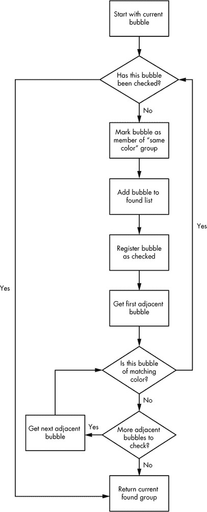
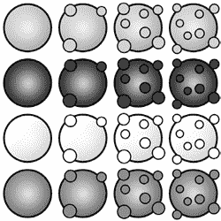
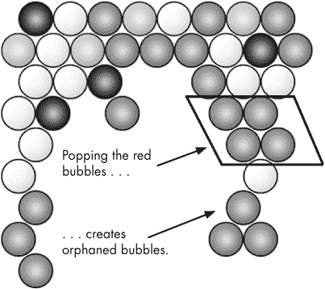
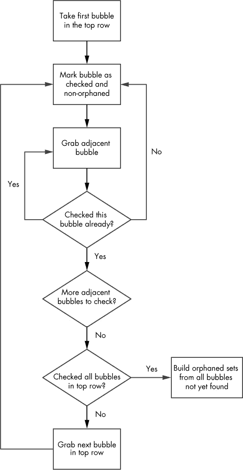

# 第四章. 将游戏状态变化翻译为显示效果

动画是一种强大的视觉提示，用于向玩家展示他们的动作如何影响游戏。每当玩家导致游戏状态发生变化时，你需要展示结果。在本章中，你将添加代码来检测并移除气泡组合，了解如何为 CSS 精灵添加动画，并在 jQuery 中实现一个漂亮的爆炸效果。

在这一点上，玩家可以向游戏板发射气泡，这些气泡将成为气泡网格的一部分。现在，我们需要在玩家发射正确颜色的气泡时，弹出匹配气泡的组合。当`curBubble`被发射到另一个气泡上，并且形成三个或更多匹配气泡的组合时，该组合中的所有气泡应该展示爆炸动画，然后从显示屏和`Board`对象中移除。

我们还需要检测并处理气泡爆炸所引发的任何连锁反应。例如，如果当我们消除另一组气泡时，某些气泡与主组合断开连接，我们应该以不同的方式销毁这些断开的气泡。

# 计算组合

`Board`对象包含网格中每个气泡的行列信息，并且将确定发射的气泡落地时是否形成三个或更多的组合。我们将在*board.js*中添加一个函数，该函数返回给定（行，列）位置周围的所有气泡。然后，我们将按颜色对这些气泡进行分组，确定哪些气泡需要被消除。

## 获取气泡

首先，我们需要从游戏板的`rows`变量中检索围绕指定坐标的气泡集合。在`addBubble`方法后，向*board.js*中添加以下方法：

*board.js*

```
  var Board = function(){
    var that = this;
    var rows = createLayout();
    this.getRows = function(){ return rows;};
    this.addBubble = function(bubble,coords){
      --*snip*--
    };
➊  **this.getBubbleAt = function(rowNum,colNum){**
      **if(!this.getRows()[rowNum])**
        **return null;**
      **return this.getRows()[rowNum][colNum];**
    **};**
➋  **this.getBubblesAround = function(curRow,curCol){**
      **var bubbles = [];**
      **for(var rowNum = curRow - 1;rowNum <= curRow+1; rowNum++){**
        **for(var colNum =** ➌**curCol-2; colNum <=** ➍**curCol+2; colNum++){**
          **var bubbleAt = that.getBubbleAt(rowNum,colNum);**
          **if(bubbleAt && !(colNum == curCol && rowNum == curRow))**
➎          **bubbles.push(bubbleAt);**
          **};**
        **};**
      **return bubbles;**
    **};**
    return this;
  }
```

`getBubbleAt`方法➊接受行列坐标作为输入，并返回该位置的气泡。如果该位置没有气泡，则返回`null`。`getBubblesAround`方法➋遍历三行相关的行——当前行、上一行和下一行——然后检查周围的列，对于每个位置调用`getBubbleAt`。请注意，由于行数组是半填充的，`getBubbleAt`会返回`null`，对于每个间隔列项都如此。因此，我们需要查看当前气泡左边的两个位置➌（`curCol-2`）和右边的两个位置➍（`curCol+2`）。无论我们是从奇数行还是偶数行开始，这个方法应该都能工作。我们还需要检查在我们检查的坐标位置上是否有气泡，并且确保不会把我们正在检查的气泡本身添加进去➎。

所有围绕发射气泡的气泡都会被推入`bubbles`数组，并由`getBubblesAround`返回。每个气泡存储自己的坐标，因此我们不需要对数组进行排序或单独存储位置信息。

## 创建匹配颜色组合

接下来，我们将编写一个更为实质性的函数，名为`getGroup`，用来返回与第一个气泡颜色相同并与其相连的气泡群。这个递归函数将接受两个参数：一个气泡对象，用于设置起始坐标和颜色（类型）定义；一个对象，用于存储属于该群的气泡。该对象将通过两个数组作为属性来存储找到的气泡：首先是一个线性数组，另外是一个按行和列索引的数组。第二个数组使我们能够轻松检查是否已将气泡添加到匹配集合中，以避免重复添加。两个数组作为对象的属性，以便在调用方法时可以返回这两个数组。下图 图 4-1 展示了该过程的概览。

我们将添加到`Board`类中的函数如下所示：

*board.js*

```
var Board = function(){
  var that = this;
  var rows = createLayout();
  this.getRows = function(){ return rows;};
  this.addBubble = function(bubble,coords){
    --*snip*--
  };
  this.getBubbleAt = function(rowNum,colNum){
    --*snip*--
  };
  this.getBubblesAround = function(curRow,curCol){
    --*snip*--
  };
  **this.getGroup = function(bubble,found){**
    **var curRow = bubble.getRow();**
    **if(!found[curRow])**
      **found[curRow] = {};**
    **if(!found.list)**
      **found.list = [];**
    **if(found[curRow][bubble.getCol()]){**
      **return found;**
    **}**
    **found[curRow][bubble.getCol()] = bubble;**
    **found.list.push(bubble);**
    **var curCol = bubble.getCol();**
    **var surrounding = that.getBubblesAround(curRow,curCol);**
    **for(var i=0;i<surrounding.length;i++){**
      **var bubbleAt = surrounding[i];**
      **if(bubbleAt.getType() == bubble.getType()){**
        **found = that.getGroup(bubbleAt,found);**
      **};**
    **};**
    **return found;**
  **};**
  return this;
};
```

让我们分解这个新函数并逐步讲解逻辑。在传入`bubble`对象和`found`对象后，`getGroup`首先检查这个气泡是否已经被找到。

```
   var curRow = bubble.getRow();
➊ if(!found[curRow])
     found[curRow] = {};
➋ if(!found.list)
     found.list = [];
➌ if(found[curRow][bubble.getCol()]){
     return found;
   }
➍ found[curRow][bubble.getCol()] = bubble;
➎ **found.list.push(bubble);**
```

如果气泡已经被找到，`getGroup`应该返回当前未改变的数据并停止。如果`found`对象中没有当前行的条目，我们需要创建一个空数组 ➊。然后，如果`list`属性不存在，它需要在函数的首次调用时创建 ➋。如果这个气泡之前已被检测到，我们返回已找到的对象，而不再重复添加该气泡 ➌。否则，我们标记已查看此位置 ➍，并将气泡存储在`found`列表中 ➎。

接下来，我们获取周围的气泡 ➏。

```
   var curCol = bubble.getCol();
➏ var surrounding = that.getBubblesAround(curRow,curCol);
```

最多应该有六个气泡，然后我们需要检查每个气泡的颜色是否匹配：

```
     for(var i=0;i<surrounding.length;i++){
       var bubbleAt = surrounding[i];
➐     if(bubbleAt.getType() == bubble.getType()){
         found = that.getGroup(bubbleAt,found);
       };
     };
➑ return found;
```

如果一个气泡与发射的气泡颜色匹配 ➐，函数会递归调用自身；`getGroup`将检查过的气泡添加到平面数组中，并标记其坐标已被检查。函数再次调用自身，传入新找到的气泡和当前的数据状态（包括`found`列表）。无论结果如何，我们都会返回`found`的最终值 ➑。



图 4-1：抓取与第一个气泡颜色相同并相连的气泡群

现在，我们需要在气泡发射时调用这个方法。在 *game.js* 中，添加到`clickGameScreen`例程中：

*game.js*

```
  var clickGameScreen = function(e){
    var angle = BubbleShoot.ui.getBubbleAngle(curBubble.getSprite(),e);
    var duration = 750;
    var distance = 1000;
    var collision = BubbleShoot.CollisionDetector.findIntersection(curBubble,
      board,angle);
    if(collision){
      var coords = {
        x : bubbleCoords.left + distX,
        y : bubbleCoords.top - distY
      };
      duration = Math.round(duration * collision.distToCollision / distance);
      board.addBubble(curBubble,coords);
➊    **var group = board.getGroup(curBubble,{});**
➋    **if(group.list.length >= 3){**
➌      **popBubbles(group.list,duration);**
      **}**
    }else{
      --*snip*--
    };
    BubbleShoot.ui.fireBubble(curBubble,coords,duration);
    curBubble = getNextBubble();
  };
```

当我们使用`board.getGroup`获取一组气泡时 ➊，我们可能得到一个包含少于三个气泡的群组。因为我们只考虑包含三个或更多气泡的群组，所以我们会跳过任何较小的群组 ➋。现在，我们只需要编写弹出气泡的例程 ➌！

# 弹出气泡

我们需要游戏判断一组气泡是否有三颗或更多气泡，如果是，则移除这些气泡。在本节中，你将实现移除气泡组合的 JavaScript 函数，并用 CSS 添加一个有趣的破裂动画。

## 使用 JavaScript 移除气泡组合

我们将首先计算当一组气泡被破裂后，棋盘应该是什么样子。当计算完成后，我们可以更新显示并将破裂的气泡从视图中移除。只要游戏状态计算正确，你就可以在此之后添加动画。更新游戏状态并编写单独的代码来显示新状态是游戏开发中一种非常有用的方法。

在 `clickGameScreen` 后添加一个名为 `popBubbles` 的新函数：

*game.js*

```
  var BubbleShoot = window.BubbleShoot || {};
  BubbleShoot.Game = (function($){
    var Game = function(){
      --*snip*--
      var clickGameScreen = function(e){
        --*snip*--
      };
      **var popBubbles = function(bubbles,delay){**
➊      **$.each(bubbles,function(){**
          **var bubble = this;**
➋        **board.popBubbleAt(this.getRow(),this.getCol());**
          **setTimeout(function(){**
            **bubble.getSprite().remove();**
          **},delay + 200);**
        **});**
      **};**
    };
    return Game;
  })(jQuery);
```

`popBubbles` 函数遍历我们传入的数组中的每个 `bubble` 对象 ➊，并通过调用 `popBubbleAt` 告诉棋盘移除该气泡 ➋（我们接下来将编写该函数）。然后，它等待 `delay + 200` 毫秒后再从 DOM 中移除气泡，以便让发射气泡的动画有时间运行。结果，用户可以在屏幕更新之前看到发生了什么。`delay` 的初始值是由发射气泡的持续时间传入的——即气泡从起点到达的时间——因此气泡总是在分组发生后的 200 毫秒后消失。

最后一段代码位于 *board.js*，我们需要定义 `popBubbleAt`。在 `getGroup` 方法结束后添加以下方法：

*board.js*

```
var Board = function(){
  --*snip*--
  this.getGroup = function(bubble,found){
    --*snip*--
  };
  **this.popBubbleAt = function(rowNum,colNum){**
    **var row = rows[rowNum];**
    **delete row[colNum];**
  **};**
  return this;
};
```

`popBubbleAt` 方法仅仅是从行/列数组中移除你传给它的项。

重新加载游戏并发射一个气泡。当你形成三颗或更多的气泡时，它们应该从视图中消失。最终，*Bubble Shooter* 开始看起来更像一个游戏了！

## 使用 CSS 的气泡破裂动画

用 CSS *移动* 屏幕上的精灵是动画的一种形式，但现在是时候用不同的方式为精灵添加动画，并改变它们的 *外观* 了。这将为玩家呈现一个视觉上令人满意的气泡破裂动画，并使用我们在书的开头创建的其他精灵帧。

为了给精灵图形添加动画，最好的方法是改变其背景图像的位置。回想一下 *bubble_sprite_sheet.png*（为了方便，图 Figure 4-2 再次展示）不仅包含了四种气泡类型，还为每种颜色提供了四种不同的状态。



图 4-2. 气泡精灵的四种状态，见于 *bubble_sprite_sheet.png*

我们可以通过连续展示四帧来显示一个气泡破裂的动画，方法是每次将背景图像向左移动 50 像素。

游戏仅在气泡组内进行爆炸，但如果一组气泡同时消失，爆炸效果将不会那么有趣。为了使效果更加有趣，我们将逐个爆炸气泡，而不是同时爆炸。这样做需要对我们刚刚添加到*game.js*中的`popBubbles`方法做一些小改动：

*game.js*

```
  var popBubbles = function(bubbles,delay){
    $.each(bubbles,function(){
      var bubble = this;
      **setTimeout(function(){**
➊      **bubble.animatePop();**
      **},delay);**
      board.popBubbleAt(bubble.getRow(),bubble.getCol());
      setTimeout(function(){
        bubble.getSprite().remove();
      },delay + 200);
➋    **delay += 60;**
    });
  };
```

在这里，我们称`animatePop` ➊为一个新方法，我们将把它添加到`Bubble`中，用于更改气泡背景图像的位置。第一个气泡的爆炸动画应该在被发射的气泡与其碰撞后立即开始。但随后的爆炸应通过增加`delay` ➋来延迟 60 毫秒。将`animatePop`添加到*bubble.js*中。

*bubble.js*

```
  var Bubble = function(row,col,type,sprite){
    --*snip*--
    this.getCoords = function(){
    --*snip*--
    };
    **this.animatePop = function(){**
➊    **var top = type * that.getSprite().height();**
➋    **this.getSprite().css(Modernizr.prefixed("transform"),"rotate(" + (Math.**
        **random() * 360) + "deg)");**
➌    **setTimeout(function(){**
        **that.getSprite().css("background-position","-50px -" + top + "px");**
      **},125);**
      **setTimeout(function(){**
        **that.getSprite().css("background-position","-100px -" + top + "px");**
      **},150);**
      **setTimeout(function(){**
        **that.getSprite().css("background-position","-150px -" + top + "px");**
      **},175);**
➍    **setTimeout(function(){**
        **that.getSprite().remove();**
      **},200);**
    **};**
  };
```

根据气泡的类型，`animatePop`计算 ➊表示气泡`background-position`属性上方部分的值。`type`值告诉我们气泡应该是什么颜色；我们将用它来选择合适的爆炸动画图像行。接下来，使用基本的 CSS 变换，我们通过将气泡精灵以随机角度旋转，给动画增加一些视觉变化 ➋，以防止所有的爆炸动画看起来一模一样。你将在第五章中看到更多关于 CSS 变换的示例。为了错开每个爆炸动画的开始时间，该函数进行了三次延迟调用 ➌，将`background-position`向左移动 50 像素。

### 注意

*通过这种方式硬编码动画并不具有很好的可扩展性，但*《泡泡射手》*只有一个精灵，且仅显示三帧。因此，我们可以避免编写一个通用函数，这也是我们选择使用一系列`setTimeout`调用的原因。当我们使用`canvas`渲染实现相同的动画时，你将看到如何编写一个更具可重用性的动画示例。*

最后，`animatePop`在动画完成时会移除精灵的 DOM 元素 ➍。从 DOM 中移除节点有助于内存管理，在一个有更多屏幕对象的游戏中，这一点尤其重要。大约每秒 20 帧的动画帧率相当低。一个专业的游戏应该具有三倍的帧率。但无论如何，通过移动背景图像来创建动画的原理是相同的。

当你重新加载页面并发射一个气泡来形成匹配组时，你应该会看到一个令人愉快的爆炸动画。然而，在爆炸了大量气泡后，你可能会看到我们需要修复的副作用：被爆炸的组可能是唯一将一组不同颜色气泡固定在主板上的元素。目前，这些气泡悬浮在空中，看起来有点奇怪。由于游戏设计要求这些气泡也被移除，我们接下来就会处理这个问题。

# 孤立的气泡组

与其他气泡断开的气泡组被称为*孤立气泡*。例如，在图 4-3 中，弹出框中的气泡组会留下四个孤立气泡悬挂在空中。孤立气泡集合也需要被触发气泡移除。但不同于与其他组一起爆裂的方式，我们会添加另一种动画效果。孤立气泡将从屏幕上掉落，看起来就像被切断支撑一样悬挂着。不仅玩家会意识到发生了不同的事情，而且我们也能尝试不同的动画类型。目前，检测孤立组不是代码的一部分；因此，在我们能进行动画之前，我们需要找到它们。



图 4-3. 弹出红色气泡会创建四个孤立气泡。

## 确定孤立气泡

我们将检查每个气泡，判断它是否属于与任何位于顶行的气泡相连的组。因为顶行被认为是永久连接的，任何无法追溯到顶行的气泡将被标识为孤立组的一部分。

跟踪这一路线可能看起来是一个我们尚未遇到的问题；然而，我们实际上可以利用已经编写的`getGroup`方法，并相当简单地找到孤立集合。图 4-4 展示了检查一个组是否属于孤立集合的过程。



图 4-4. 确定孤立气泡集合的逻辑流程

使用这个逻辑，我们可以在步骤 2 中重用`getGroup`函数。但为了做到这一点，我们需要修改气泡必须为相同颜色才能形成组的标准。

让我们修改`getGroup`，使其能够选择不匹配颜色的气泡组：

*board.js*

```
  var Board = function(){
    --*snip*--
➊  this.getGroup = function(bubble,found**,differentColor**){
      var curRow = bubble.getRow();
      if(!found[curRow])
        found[curRow] = {};
      if(!found.list)
        found.list = [];
      if(found[curRow][bubble.getCol()]){
        return found;
      }
      found[curRow][bubble.getCol()] = bubble;
      found.list.push(bubble);
      var curCol = bubble.getCol();
      var surrounding = that.getBubblesAround(curRow,curCol);
      for(var i=0;i<surrounding.length;i++){
        var bubbleAt = surrounding[i];
➋      if(bubbleAt.getType() == bubble.getType() **|| differentColor**){
          found = that.getGroup(bubbleAt,found**,differentColor**);
        };
      };
      return found;
    };
  }
```

现在，函数定义增加了一个额外的参数➊。对于递归调用`getGroup`的地方，如果值设置为`true`，它应忽略类型检查➋，并将输入参数传递通过递归链。通过这些简单的更改，调用`getGroup(bubble,{},true)`应该返回所有与传入气泡相连的气泡，无论颜色如何。调用`getGroup(bubble,{},false)`或仅仅`getGroup(bubble,{})`应与之前的操作方式相同。

`findOrphans`函数将作为`Board`类中的一个方法，检查顶行中的每个气泡，找到每个气泡连接到的气泡组。（最初，棋盘上的每个气泡都将在一个大组中，除了将要发射的气泡。）一个包含(row, column)值的数组将用`false`值填充，每次找到气泡时，该位置的(row, column)条目会被设置为`true`。在这个过程结束时，包含气泡但返回数组中该位置值为`false`的坐标将被视为孤立气泡并从游戏中移除。

在`popBubbleAt`之后，将以下代码添加到*board.js*：

*board.js*

```
var Board = function(){
  --*snip*--
  this.popBubbleAt = function(rowNum,colNum){
    --*snip*--
  };
  **this.findOrphans = function(){**
    **var connected = [];**
    **var groups = [];**
    **var rows = that.getRows();**
    **for(var i=0;i<rows.length;i++){**
      **connected[i] = [];**
    **};**
    **for(var i=0;i<rows[0].length;i++){**
      **var bubble = that.getBubbleAt(0,i);**
      **if(bubble && !connected[0][i]){**
        **var group = that.getGroup(bubble,{},true);**
        **$.each(group.list,function(){**
          **connected[this.getRow()][this.getCol()] = true;**
        **});**
      **};**
    **};**
    **var orphaned = [];**
    **for(var i=0;i<rows.length;i++){**
      **for(var j=0;j<rows[i].length;j++){**
        **var bubble = that.getBubbleAt(i,j);**
        **if(bubble && !connected[i][j]){**
          **orphaned.push(bubble);**
        **};**
      **};**
    **};**
    **return orphaned;**
  **};**
  return this;
};
```

让我们更仔细地分析`findOrphans`函数。首先，我们设置需要的数组，以便找到孤立的气泡组。

```
➊ var connected = [];
➋ var groups = [];
   var rows = that.getRows();
   for(var i=0;i<rows.length;i++){
     connected[i] = [];
   };
```

`connected`数组 ➊是一个二维的行列数组；它标记了连接气泡的位置。`groups`数组 ➋将包含所有找到的组，如果整个棋盘是连接的，则会是一个组。接下来，我们检查顶行中的每个气泡。

```
for(var i=0;i<rows[0].length;i++){
  var bubble = that.getBubbleAt(0,i);
```

在这里，因为我们只关心与顶行相连的气泡，我们只遍历顶行并获取气泡进行检查。当我们找到一个气泡时，就可以开始创建分组。

```
if(bubble && !connected[0][i]){
  var group = that.getGroup(bubble,{},true);
```

如果气泡存在且此位置尚未标记为连接的，我们就构建一个组。调用`getGroup`时，传递`true`作为第三个参数（`differentColor`），因为我们不希望通过颜色来限制连接的气泡。

```
      $.each(group.list,function(){
        connected[this.getRow()][this.getCol()] = true;
      });
  };
};
```

因为被检查的气泡通过第一行连接，整个组都是连接的；因此，我们将`connected`数组中的每个条目标记为`true`。

调用`findOrphans`之后，我们应该得到一个包含连接的行列条目的数组。孤立气泡的列表是我们最终想要的输出，因此我们需要创建另一个空数组来存储该列表。一个一维数组足够了，因为气泡存储了它们自己的坐标：

```
  var orphaned = [];
  for(var i=0;i<rows.length;i++){
    for(var j=0;j<rows[i].length;j++){
      var bubble = that.getBubbleAt(i,j);
      if(bubble && !connected[i][j]){
        orphaned.push(bubble);
      };
    };
  };
  return orphaned;
};
```

使用这个新数组，我们检查棋盘上的所有行列，查看每个位置是否有气泡。如果有气泡，但在连接网格中没有条目，则该气泡是孤立的。然后，我们通过调用`orphaned.push(bubble)`将其添加到孤立气泡列表中。最后，`findOrphans`返回孤立气泡的数组，如果没有孤立气泡，该数组应为空。

## 丢弃孤立气泡

现在我们可以找到将被孤立的气泡组，我们需要调用函数并移除所有已识别的孤立气泡。我们不希望气泡爆炸，而是希望孤立的气泡下落，使用一种在爆炸动画完成后进行的动画效果。内部的游戏状态仍然会即时更新，因为我们会在玩家发射气泡后立即计算结果。我们添加延迟不仅是为了提供更具戏剧性的效果，也让玩家能够跟随屏幕上的动作结果。如果我们一知道气泡会被孤立就立即进行下落动画，效果可能会丧失。此外，玩家可能会困惑为何不同颜色的气泡突然消失了。

在这种情况下，将游戏状态与显示状态分离的好处显而易见。我们即时更新游戏状态，玩家几乎可以立刻发射下一个气泡，无需等待动画完成，游戏感觉非常响应迅速。但是在显示状态中，我们大张旗鼓地处理这一游戏状态变化——为了效果并传达玩家的操作如何导致最终结果。动画的方式更像是游戏设计的决策，而非编码决策，但我们编写的游戏代码使得这种设计具有灵活性。

在 *game.js* 中，在调用 `popBubbles` 后添加以下内容：

*game.js*

```
  var Game = function(){
    --*snip*--
    var clickGameScreen = function(e){
      --*snip*--
      if(collision){
        --*snip*--
➊      if(group.list.length >= 3){
          popBubbles(group.list,duration);
➋        **var orphans = board.findOrphans();**
➌        **var delay = duration + 200 + 30 * group.list.length;**
➍        **dropBubbles(orphans,delay);**
        };
      }else{
        --*snip*--
      };
      BubbleShoot.ui.fireBubble(curBubble,coords,duration);
      curBubble = getNextBubble();
    };
  };
```

我们只需要在气泡被爆炸后检查新的孤立气泡➊，因为孤立的气泡组是由气泡爆炸后形成的。只有在形成三个或更多气泡的匹配组时，才会爆炸气泡，因此如果 `group.list` 大于或等于三，我们需要查找孤立气泡。我们在获取孤立气泡时➋，计算一个延迟时间➌，以确保气泡在所有爆炸完成后掉落。为了执行动画，我们需要编写 `dropBubbles` ➍。

`dropBubbles` 方法将会把气泡从屏幕上掉落。在 *game.js* 中的 `popBubbles` 函数关闭后，添加以下代码：

*game.js*

```
  var Game = function(){
    --*snip*--
    var popBubbles = function(bubbles,delay){
      --*snip*--
    };
    **var dropBubbles = function(**➊**bubbles,delay){**
      **$.each(bubbles,function(){**
        **var bubble = this;**
➋      **board.popBubbleAt(bubble.getRow(),bubble.getCol());**
        **setTimeout(function(){**
➌        **bubble.getSprite().animate({**
            **top : 1000**
          **},1000);**
        **},delay);**
      **});**
    **};**
  };
```

`dropBubbles` 函数接收需要掉落的气泡数组➊（我们将传递由 `findOrphans` 返回的气泡数组）和延迟时间。它会从屏幕上移除气泡➋，然后为气泡掉落动画➌。

刷新游戏并爆破几个气泡组。当你形成一个孤立的气泡组时，这些气泡应该掉落到屏幕上，而不是爆炸。

# 使用 jQuery 插件爆炸气泡

尽管气泡掉落是一个动画，但它的戏剧性并不足够。让我们把它做得更生动，制造更具爆炸感的效果！我们将编写一个 jQuery 插件来控制这个动画，并将其从游戏系统中抽象出来。

为了让孤立气泡的动画更加引人注目，我们将在气泡下落到屏幕之前先让它们向外爆炸。我们通过给每个气泡赋予初始动量，然后用模拟重力调整其速度来实现这一效果。

虽然将所有代码直接写进`dropBubbles`中也是可能的，但这样会开始让`Game`类充满显示逻辑。然而，这个动画非常适合作为 jQuery 插件，优点是我们可以在未来的项目中重用这段代码。

### 注意

*在这个示例中，我只介绍了编写 jQuery 插件的最基本原则。你可以在* [`learn.jquery.com/plugins/basic-plugin-creation/`](http://learn.jquery.com/plugins/basic-plugin-creation/) *深入学习插件的相关内容。*

在*_js*文件夹中创建一个名为*jquery.kaboom.js*的新文件，并将其添加到`Modernizr.load`调用中。文件命名约定使得其他人一眼就能看出该文件是一个 jQuery 插件，他们甚至不需要查看代码。

首先，我们通过使用 jQuery 的插件格式来注册该方法——我们将其命名为`kaboom`：

*jquery.kaboom.js*

```
(function(jQuery){
  jQuery.fn.kaboom = function(settings)
  {
  };
})(jQuery);
```

我们将很快补充这段代码；目前它并没有做任何事情。这个函数定义是使用 jQuery 注册新插件的标准方式。它的结构允许像`$(...).kaboom()`这样的调用，包括传递一个可选的设置参数。

`kaboom`的调用将在`dropBubbles`中，因此我们将把这个调用添加到`dropBubbles`中，并移除`animate`的调用：

*game.js*

```
var Game = function(){
  --*snip*--
  var popBubbles = function(bubbles,delay){
    --*snip*--
  };
  var dropBubbles = function(bubbles,delay){
    $.each(bubbles,function(){
      var bubble = this;
      board.popBubbleAt(bubble.getRow(),bubble.getCol());
      setTimeout(function(){
        **bubble.getSprite().kaboom();**
      },delay);
    });
    return;
  };
};
```

`kaboom`方法将为每个对象调用一次。此方法也只会作用于 jQuery 对象；作为一个 jQuery 插件，它不会了解游戏对象，只会与 DOM 元素一起工作，这使得插件在未来的游戏中可以重用。

在`jquery.fn.kaboom`中，我们将使用一个数组来存储当前正在爆炸的所有对象。每次调用`kaboom`时，我们将把调用的对象添加到这个数组中。当气泡移动完成后，它应该将自己从列表中移除。通过将所有我们想要移动的对象存储在一个数组中，我们可以运行一个单一的`setTimeout`循环，并同时更新所有下落气泡的位置。因此，我们将避免多个`setTimeout`竞争处理能力，动画也应该更加流畅。

我们还将添加两个组件：一些默认的重力参数和我们希望气泡下落的距离，在此距离下我们会认为它已经不在屏幕上，不再是功能的一部分。

*jquery.kaboom.js*

```
  (function(jQuery){
➊  **var defaults = {**
      **gravity : 1.3,**
      **maxY : 800**
    **};**
➋  **var toMove = [];**
    jQuery.fn.kaboom = function(settings){
    }
  })(jQuery);
```

默认值为`gravity`和`maxY` ➊，`toMove` ➋将保存下落的 jQuery 对象。

目前，调用`kaboom`时不会发生任何事情。完整的`jquery.kaboom`插件如下：

*jquery.kaboom.js*

```
  (function(jQuery){
    var defaults = {
      gravity : 1.3,
      maxY : 800
    };
    var toMove = [];
➊  **jQuery.fn.kaboom = function(settings){**
      **var config = $.extend({}, defaults, settings);**
      **if(toMove.length == 0){**
        **setTimeout(moveAll,40);**
      **};**
      **var dx = Math.round(Math.random() * 10) – 5;**
      **var dy = Math.round(Math.random() * 5) + 5;**
      **toMove.push({**
        **elm : this,**
        **dx : dx,**
        **dy : dy,**
        **x : this.position().left,**
        **y : this.position().top,**
        **config : config**
      **});**
    **};**
➋  **var moveAll = function(){**
      **var frameProportion = 1;**
      **var stillToMove = [];**
      **for(var i=0;i<toMove.length;i++){**
        **var obj = toMove[i];**
        **obj.x += obj.dx * frameProportion;**
        **obj.y -= obj.dy * frameProportion;**
        **obj.dy -= obj.config.gravity * frameProportion;**
        **if(obj.y < obj.config.maxY){**
          **obj.elm.css({**
            **top : Math.round(obj.y),**
            **left : Math.round(obj.x)**
          **});**
          **stillToMove.push(obj);**
        **}else if(obj.config.callback){**
          **obj.config.callback();**
     **}**
    **};**
    **toMove = stillToMove;**
    **if(toMove.length > 0)**
        **setTimeout(moveAll,40);**
    **};**
  })(jQuery);
```

这个插件中有两个主要的循环：`jQuery.fn.kaboom` ➊，用于将新元素添加到动画队列中，和`moveAll` ➋，用于处理动画。

让我们先详细看看`jQuery.fn.kaboom`：

```
  jQuery.fn.kaboom = function(settings){
➊  var config = $.extend({}, defaults, settings);
➋  if(toMove.length == 0){
      setTimeout(moveAll,40);
    };
➌  var dx = Math.round(Math.random() * 10) - 5;
    var dy = Math.round(Math.random() * 5) + 5;
➍  toMove.push({
      elm : $(this),
      dx : dx,
      dy : dy,
      x : $(this).position().left,
      y : $(this).position().top,
      config : config
    });
  };
```

这个函数启动动画过程，每个对象只会调用一次（也就是说，它不会作为动画循环的一部分运行）。然后，函数为此次`kaboom`调用设置配置选项➊。该语法创建一个对象，并在父定义中设置默认值（`defaults`变量），然后用传递的对象中的任何设置覆盖这些默认值。它还会将任何新的名称/值对添加到`kaboom`将要操作的对象中。

我们查看`toMove`数组，如果数组为空➋，就设置一个超时调用来运行动画。接着，在`dx`和`dy`中设置初始的*x*和*y*速度值➌。这些值在水平方向上介于–5 和 5 像素之间，在垂直方向上（向上）介于 5 和 10 像素之间；两者的单位为每秒像素。然后，我们向`toMove`数组中添加一个新对象➍。新对象包含 jQuery 元素、它的新创建的速度信息、当前的屏幕位置，以及在此次调用中指定的配置选项。

`jQuery.fn.kaboom`函数在每次调用`$(...).kaboom`时运行。如果至少有一个对象正在爆炸，包含`moveAll`的超时将持续运行。我们来看看`moveAll`函数的作用：

```
  var moveAll = function(){
➊  var frameProportion = 1;
➋  var stillToMove = [];
➌  for(var i=0;i<toMove.length;i++){
      var obj = toMove[i];
➍    obj.x += obj.dx * frameProportion;
      obj.y -= obj.dy * frameProportion;
➎    obj.dy -= obj.config.gravity * frameProportion;
➏    if(obj.y < obj.config.maxY){
        obj.elm.css({
          top : Math.round(obj.y),
          left : Math.round(obj.x)
        });
        stillToMove.push(obj);
➐    }else if(obj.config.callback){
        obj.config.callback();
      }
    };
➑  toMove = stillToMove;
    if(toMove.length > 0)
➒    setTimeout(moveAll,40);
  };
```

我们假设`setTimeout`每 40 毫秒确实运行一次，因为这是我们指定的值➒；因此，我们将帧率计算为每秒 25 帧➊。如果计算机性能不足（或者正在忙于使用 CPU 资源处理其他操作），并且帧之间的延迟远慢于 40 毫秒，那么这个假设可能会导致动画质量较差。稍后，你将学习如何在不受处理器性能影响的情况下保持动画速度恒定，但当前的解决方案在旧版浏览器中提供了最佳兼容性。

在设置帧率后，`moveAll`创建一个空数组➋来存储那些在动画帧结束时没有超过最大*y*值的对象。这里得到的值将成为新的`toMove`值，用于在下一个帧继续移动。

完成设置工作后，`moveAll`对`toMove`数组中的每个元素进行循环➌（即所有当前处于爆炸状态的对象；我们在`jQuery.fn.kaboom`中填充了这个数组），并获取每个元素的引用，将其存储在`obj`变量中，`obj`是一个具有以下属性的对象：

+   `obj.elm`指向 jQuery 对象

+   `dx`和`dy`速度值

+   存储当前位置信息的*x*和*y*坐标

在循环内部，我们根据物体的*x*和*y*速度的比例分别改变*x*和*y*的值 ➍。这还不会影响气泡的屏幕位置，因为我们还没有操作 DOM 元素。该函数还将配置的重力设置添加到物体的垂直速度中 ➎。水平速度应该在整个爆炸效果中保持不变，但物体会加速下落以模拟掉落。接下来，我们检查 ➏ 物体的*y*值是否超过了我们在默认设置中配置的最大值，或者在调用`kaboom`时覆盖的最大值。如果没有超过，屏幕元素的位置将设置为当前存储的位置，并将物体添加到`stillToMove`数组中。另一方面，如果物体*已经*超过了最大*y*值，并且在原始`kaboom`调用中传递了回调函数，`moveAll`会运行 ➐ 该函数。将函数传入动画并在动画完成时运行该函数非常有用。

最后，我们将`toMove` ➑的新值设置为`stillToMove`的内容（也就是所有仍在下落的物体），如果数组中至少包含一个元素，我们将设置一个超时，在 40 毫秒后再次调用相同的函数➒。

现在，当你重新加载游戏并创建一个孤立的物体组时，kaboom 插件应该会使气泡沿屏幕下落。虽然它在我们的游戏上下文中有效，但你也可以使用任何有效的 jQuery 选择器调用它，并产生类似的效果。保留这段代码，以便将来在其他游戏中复用这一效果！

# 总结

现在，*Bubble Shooter*的许多部分已经就绪。我们可以发射气泡，这些气泡要么会落入网格，要么会爆掉一组气泡，而且我们可以检测到孤立的气泡组并将其从屏幕上移除。然而，板块上可能会堆满未爆掉的气泡，这是我们仍然需要解决的问题。目前，游戏中也没有办法开始下一关或跟踪分数；这两个都是此类游戏中非常重要的元素。但在完成其他游戏功能之前，我们将深入探讨一些已经编写好的动画在 HTML5 和 CSS 中的实现。

到目前为止，我们已经使用一些相当传统的 HTML、CSS 和 JavaScript 技术实现了所需的功能。大部分情况下，这个游戏应该能在大多数计算机上顺利运行。在下一章，我们将通过将一些动画工作从 JavaScript 转移到 CSS 来提高性能。这一变化将让我们在可能的情况下利用硬件加速，并且我们还将使用一些纯 HTML5 特性来实现更流畅的动画。我们还将使用`canvas`渲染来实现整个游戏，而不是 DOM 和 CSS，从而展示使用这种方法时的优势和挑战。

# 进一步练习

1.  在 第三章的练习中，你修改了 `createLayout` 以生成不同的网格模式。现在，使用气泡弹出和气泡掉落的代码来测试你的布局。代码是否能正常工作？你的布局模式如何影响游戏的感觉？

1.  当前的气泡动画由四帧组成。创建你自己的图像版本，并尝试添加更多帧。使用 `for` 循环来生成额外的 `setTimeout` 调用，而不是复制粘贴新行。试验不同的超时延迟，调整动画的快慢，看看哪些值能产生最佳效果。

1.  kaboom jQuery 插件将气泡从屏幕底部掉落，但如果你让气泡在撞到底部时反弹，会发生什么呢？修改 *jquery.kaboom.js* 代码，使气泡反弹而不是掉出屏幕。你需要反转它们的 `dy` 值，并且在每次反弹时将它们缩小，以模拟一部分反弹能量被吸收；否则，它们会反弹回相同的高度。气泡只有在反弹到屏幕的左边或右边的边缘时才会从 DOM 中移除，因此你还需要确保 `dx` 值不接近零，否则它们永远不会消失。
