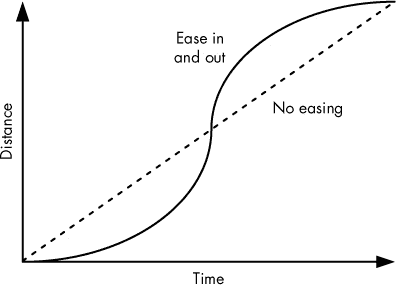
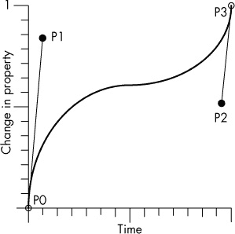

# 第五章 CSS 过渡与转换

到目前为止，我们已经使用 HTML、CSS 和 JavaScript 创建了一个简单的游戏：我们可以发射并爆破气泡，用户界面也很响应。我们通过文档对象模型（DOM）操作，并借助大量 jQuery 来实现这一点。

在本章中，我们将探讨 CSS 过渡和转换，它们可以改善游戏性能，并让你创建更广泛的效果，比如旋转和缩放元素。

# CSS 的优点

CSS 提供了一组转换和过渡属性，可以用来动画化 CSS 属性的变化，例如元素的 `left` 或 `top` 坐标。与其像之前那样使用 JavaScript 按帧处理动画，CSS 过渡是在样式表中或附加到 DOM 元素的样式中指定的。动画通过对 CSS 属性进行单一更改来启动，而不是像 JavaScript 动画那样对属性进行多次增量更改。

CSS 动画由浏览器的渲染引擎处理，而不是由 JavaScript 解释器处理，从而为运行其他 JavaScript 代码释放了 CPU 时间，并确保在设备上实现最平滑的动画效果。在具有图形处理器的系统上，效果通常完全由图形处理器处理，这意味着你运行的 JavaScript 代码负担更小，并且可以进一步减少 CPU 的负载，从而提高帧率。因此，动画将在其显示设备上以最高帧率运行。

我们将使用 CSS 为用户界面元素添加一些简单的过渡，然后将我们的 jQuery 动画替换为转换，并在此过程中保持到目前为止所实现的跨浏览器兼容性。

# 基本的 CSS 过渡

我们将关注的第一个 CSS 动画是过渡。*过渡*定义了一个对象的样式属性应如何从一个状态变化到另一个状态。例如，如果我们将 DOM 元素的 `left` 属性从 50 像素更改为 500 像素，它将立即在屏幕上改变位置。但如果我们指定了过渡，我们可以让它逐渐在屏幕上移动。CSS 过渡指定了要动画化的属性或属性集、动画应如何进行，以及动画应该持续多长时间。

过渡通常适用于任何具有数值的 CSS 属性。例如，像前面提到的那样对 `left` 属性进行动画化是可行的，因为可以计算出开始和结束之间的中间值。其他属性的变化，例如 `visibility : hidden` 和 `visibility : visible`，不是有效的过渡属性，因为无法计算中间值。然而，我们可以通过将 `opacity` 属性从 0 动画化到 1 来使元素淡入。

颜色也是有效的动画属性，因为十六进制值也是数字（每个包含三个数字对，每个数字对表示红色、绿色或蓝色），可以从一个值逐渐变化到另一个值。你可以在 *[`developer.mozilla.org/en-US/docs/Web/CSS/CSS_animated_properties/`](https://developer.mozilla.org/en-US/docs/Web/CSS/CSS_animated_properties/)* 找到所有可以使用过渡动画的属性列表。

## 如何编写过渡

要使用过渡对 `div` 进行动画，给它添加一个 CSS `transition` 属性。一个 `transition` 属性包括以下内容：

+   ****应用过渡的 CSS 属性****。这些可以是你想要动画的任何有效 CSS 属性，例如 `top`、`left`、`font-size`，或者仅使用 `all`，它会将过渡应用于所有有效的属性变化。

+   ****持续时间****。过渡所需的时间（以秒为单位）。

+   ****缓动****。指示属性在过渡持续时间内变化的速度。例如，某个元素可能会以平滑的速度从一个位置移动到另一个位置，或者它可能在开始时加速，随后在结束时减速，如图 5-1 所示。你也可以对其他你想要改变的属性应用缓动，包括颜色。

    

    图 5-1. 图表显示无缓动和有缓动的运动（动画开始时的缓动和结束时的缓动）。

+   ****开始延迟****。指定开始过渡前等待的秒数。最常见的值是 0（或为空），意味着立即开始。

我们将像编写其他 CSS 规则一样编写过渡定义，当我们希望过渡发生时，我们将修改要进行动画的 CSS 属性。为了让 `div` 或其他 HTML 元素在屏幕上平滑移动，我们将 `top` 和 `left` 坐标设置为新的值：

```
transition: top 1s, left 2s (etc)
```

作为示例，我们将使“新游戏”按钮向下移动。将以下内容添加到 *main.css*：

*main.css*

```
  .button
  {
    transition: ➊all ➋.8s ➌ease-in-out ➍1s;
➎  -moz-transition: all .8s ease-in-out 1s;
    -webkit-transition: all .8s ease-in-out 1s;
    -ms-transition: all .8s ease-in-out 1s;
  }
```

`transition` 定义的第一个值 ➊ 指定了过渡应用的属性（或属性）。使用 `all` 将过渡应用于所有属性，可以把它当作一个通配符。第二个值 ➋ 是过渡的持续时间（以秒为单位）。第三个值 ➌ 是缓动：`ease-in-out` 会产生一个平滑的过渡，开始时加速，结束时减速。最后，我们添加一个延迟 ➍，在动画开始前等待 1 秒。接下来的三行从 ➎ 开始，提供了相同的规范，但使用了供应商特定的前缀，以支持跨浏览器。这些是旧版浏览器所需的；新版浏览器在标签定义被认为稳定后，会使用无前缀版本。

为了保证你的游戏能在某个浏览器上运行，始终包括正确的厂商特定前缀。只要确保每次更改过渡的属性时，也要在每个浏览器的过渡定义中进行相应更改。

幸运的是，规则很简单：`transition`的浏览器特定版本只是常规版本的副本，并在前面加上以下前缀之一：

+   `-moz-`用于 Mozilla 浏览器，如 Firefox

+   `-webkit-`用于 Webkit 浏览器，如 Chrome 和 Safari

+   `-ms-`用于微软 Internet Explorer

重新加载页面，然后在 JavaScript 控制台中输入以下内容：

```
$(".but_start_game").css("top",100)
```

你应该能看到一个暂停，然后按钮会平滑地滑动到屏幕上方。效果或多或少与`animate`调用相同，但我们只更改了 CSS 的值。

现在删除`.button`的 CSS 定义，因为我们将应用一个更有用的效果。

## 颜色变化按钮

让我们应用过渡效果来增强用户界面！我们将不使用任何 JavaScript 代码来动画化按钮；相反，我们将使用`transition`定义和你可能熟悉的`hover`伪类来创建鼠标悬停按钮效果。

首先，我们将为“新游戏”按钮添加一个鼠标悬停状态，通过修改 CSS。现在将以下内容添加到*main.css*：

*main.css*

```
  .button
  {
    transition: ➊background-color ➋.3s ➌ease-in-out;
➍  -moz-transition: background-color .3s ease-in-out;
    -webkit-transition: background-color .3s ease-in-out;
    -ms-transition: background-color .3s ease-in-out;
  }
    .button:hover
    {
      background-color: #900;
    }
```

`transition`定义中的第一个值 ➊ 指定过渡应用于哪个属性（或哪些属性）。我们将其应用于`background-color`属性，该属性的写法与标准 CSS 规则完全相同。第二个值 ➋ 是过渡的持续时间，单位为秒。第三个值 ➌ 是缓动函数，再次设置为`ease-in-out`。

其他类型的缓动包括`ease`、`linear`，或者仅使用`ease-in`或`ease-out`。但所有这些简写实际上都是`cubic-bezier`的别名，你可以用它来表示任何你喜欢的过渡曲线。`cubic-bezier`缓动函数接受四个小数值来定义一个图形；例如，

```
transition: background-color .3s ease-in-out;
```

与...相同

```
transition: background-color .3s cubic-bezier(0.42, 0, 0.58, 1.0)
```

Bézier 曲线通过指定两点的坐标来描述，这两点分别形成曲线开始部分和结束部分的切线。这些点在图 5-2 中显示为 P1 和 P2。



图 5-2. 指定 Bézier 曲线的两点是 P1 和 P2。

在 CSS 中指定的值是 P1 和 P2 的坐标，它们始终位于 0 和 1 之间。你不会指定 P0 和 P3，因为它们始终是原点（0,0）和（1,1）。P1 和 P2 与垂直轴的夹角决定了曲线的斜率，而从 P0 到 P1 和从 P2 到 P3 的线段长度则决定了曲线的弯曲程度。

除非你需要特定的缓动效果，`ease-in-out` 或 `linear` 通常就足够了。但对于更复杂的过渡，一些在线工具可以帮助你根据可视化图表和输入值创建 `cubic-bezier` 曲线。其中一个网站是 *[`cubic-bezier.com/`](http://cubic-bezier.com/)*，它允许你调整值并观看动画，看看这些数值是如何转换为过渡动画的。

在初始过渡定义之后的三行，是厂商特定的过渡定义，我确保包括了这些定义，以便过渡在不同浏览器中正确运行。CSS 标准仍然被视为一个正在进行的工作，浏览器厂商采用了自己的前缀，以避免在标准最终确定时与实现的方式发生潜在冲突。

我目前使用的单行格式是指定过渡的最紧凑方式，但你也可以分别指定每个属性：

```
transition-property: background-color;
transition-duration: .3s;
transition-timing-function: ease-in-out;
```

我建议大多数时候坚持使用紧凑的方式。否则，你将需要所有的 CSS 标准行以及每行的三个厂商特定副本，这会很快使你的样式表变得凌乱。

重新加载页面并将鼠标悬停在“新游戏”按钮上。你应该看到按钮的颜色从浅红色渐变到深红色。这是一个不错的效果，而且你没有写任何 JavaScript！不过，使用纯 CSS，你还能做更多的效果。

# 基本的 CSS 变换

我们要看的第二个强大功能是 CSS 变换。*变换*允许你操控对象的形状。在大多数浏览器中，你可以在二维或三维空间中变换一个对象，并可以按任何可以用三维矩阵描述的方式进行倾斜、扭曲和旋转。你可以通过过渡来动画化变换，或者让变换独立存在；例如，为了展示一个按钮的倾斜角度，你可以让用户看到它旋转，或者你也可以直接渲染一个倾斜的按钮。

## 如何编写变换

一些简单的 CSS 变换包括：

+   按 (*x*, *y*) 或者甚至按 (*x*, *y*, *z*) 坐标在三维空间中进行平移

+   沿 *x*、*y* 和 *z* 轴的维度进行缩放

+   沿任意 *x*、*y* 或 *z* 轴旋转

+   沿 *x* 轴或 *y* 轴的倾斜

+   添加 3D 透视效果

你可以通过二维或甚至三维矩阵来进行变换。通过矩阵进行变换涉及一些数学计算。如果你想更深入地探讨，可以在线找到一些参考资料，比如*[`developer.mozilla.org/en-US/docs/Web/CSS/transform/`](https://developer.mozilla.org/en-US/docs/Web/CSS/transform/)*。

## 缩放按钮

在本节中，我们将通过在当前的颜色变化上添加一个放大效果，使“新游戏”按钮变得更具动态感。请在 *main.css* 中的 `.button:hover` 定义中添加以下内容：

*main.css*

```
  .button:hover
  {
    background-color: #900;
➊  **transform: scale(1.1);**
    **-moz-transform: scale(1.1);**
    **-webkit-transform: scale(1.1);**
    **-ms-transform: scale(1.1);**
  }
```

整个变换主要包含在一行 `transform` 代码中 ➊。变换定义为按 1.1 的比例进行缩放——即大小增加 10%。接下来的三行做了相同的事情，但使用了你在 `transition` 定义中使用的相同供应商特定的前缀。

我们只需要缩放“新游戏”按钮，因此重新加载页面后，再次将鼠标悬停在按钮上。缩放应该会生效，但不会像平滑动画那样进行。尽管颜色仍然会根据鼠标悬停逐渐变化，但按钮的大小会一步到位地跳变。我们将修改过渡定义，以便它同时应用于变换和背景颜色。

为了完成这个任务，我们可以简单地修改 `.button` 定义，使得 `transition` 属性影响每个 CSS 属性：

```
transition: **all** .3s ease-in-out;
```

这个定义将 `ease-in-out` 效果应用于按钮的所有可以应用过渡的 CSS 属性。现在，如果这些属性中的任何一个在 DOM 渲染后发生变化，按钮将在该属性上应用 300 毫秒的过渡动画效果。但如果你不想让所有按钮动画以相同的速度发生呢？

在这种情况下，你可以通过添加逗号分隔的定义来指定多个属性：

```
transition: background-color .2s ease-in-out**, transform 0.2s ease-in-out;**
```

这个解决方案还最小化了副作用，如果我们想要动态改变其他 CSS 属性而不让它们自动动画化时，会更加有效。

当你在 CSS 中对单个 `transform` 属性应用过渡时，仍然需要在每个 `transition` 定义中指定供应商特定的版本。因此，完整的按钮定义需要是这样的：

```
.button
{
  transition: background-color .3s ease-in-out**, transform .2s ease-in-out**;
  -moz-transition: background-color .3s ease-in-out**, -moz-transform .2s**
**ease-in-out**;
  -webkit-transition: background-color .3s ease-in-out**, -webkit-transform .2s**
**ease-in-out**;
-ms-transition: background-color .3s ease-in-out**, -ms-transform .2s ease-**
**inout**;
}
```

在 *main.css* 中进行此更改，重新加载页面，再次将鼠标悬停在按钮上。现在，背景颜色和缩放应该都会平滑过渡。

CSS 过渡和变换对于简单的动画非常有用，尤其是在用户界面元素（如按钮）上的鼠标悬停效果。然而，它们不仅仅用于给用户界面添加一些亮点：我们还可以用它们来动画化精灵，包括游戏中发射的气泡。

# 用 CSS 过渡替代 jQuery 动画

现在，当玩家发射气泡时，气泡会离开发射点，并沿直线朝目标移动。任何发射的气泡都会遵循一种简单到足以让 CSS 过渡轻松处理的路径，切换到这种方式将减轻一些 JavaScript 的负担。

我们为按钮悬停效果使用的硬编码 CSS 过渡，过渡定义在样式表中，但在气泡移动时不会生效，因为过渡的持续时间需要根据气泡的移动距离来改变。目前，气泡以每秒 1000 像素的速度移动。因此，例如，如果我们希望气泡移动 200 像素，则持续时间需要设置为 200 毫秒。为了处理这个可变的持续时间，我们不会在样式表中指定 CSS 过渡，而是在运行时通过 JavaScript 来应用它们。

使用 jQuery 设置 CSS 过渡的语法与设置其他 CSS 属性相同，但我们需要为属性名添加浏览器前缀。幸运的是，在这个任务中我们不必为每个浏览器编写四个版本的过渡。Modernizr 可以为我们处理这些前缀，这实际上使得在 JavaScript 中创建 CSS 过渡比在样式表中更容易！

然而，并非所有较旧的浏览器都支持过渡，因此在*ui.js*中，我们首先会检查是否支持 CSS 动画，如果不支持，则回退到 jQuery 动画。除非你确定所有目标浏览器都支持 CSS 过渡，否则最好构建一个回退选项。

这个 CSS 动画的代码包括三个步骤：

1.  将过渡 CSS 属性添加到元素中，告诉它以多快的速度移动以及应用过渡的属性。

1.  将`top`和`left`属性更改为我们希望气泡停止的位置坐标。

1.  一旦气泡到达目标位置，移除 CSS 过渡定义。

按照以下方式修改*ui.js*中的`fireBubble`：

*ui.js*

```
  var BubbleShoot = window.BubbleShoot || {};
  BubbleShoot.ui = (function($){
    var ui = {
      --*snip*--
      fireBubble : function(bubble,coords,duration){
➊      **var complete = function(){**
➋        **if(bubble.getRow() !== null){**
➌          **bubble.getSprite().css(Modernizr.prefixed("transition"),"");**
            **bubble.getSprite().css({**
              **left : bubble.getCoords().left - ui.BUBBLE_DIMS/2,**
              **top : bubble.getCoords().top - ui.BUBBLE_DIMS/2**
            **});**
          **};**
        **};**
➍      **if(Modernizr.csstransitions){**
➎        **bubble.getSprite().css(Modernizr.prefixed("transition"),"all " +**
            **(duration/1000) + "s linear");**
          **bubble.getSprite().css({**
            **left : coords.x - ui.BUBBLE_DIMS/2,**
            **top : coords.y - ui.BUBBLE_DIMS/2**
          **});**
➏        **setTimeout(complete,duration);**
➐      **}else{**
          bubble.getSprite().animate({
              left : coords.x - ui.BUBBLE_DIMS/2,
              top : coords.y - ui.BUBBLE_DIMS/2
            },
            {
              duration : duration,
              easing : "linear",
              complete : **complete**
            });
        **}**
      },
      --*snip*--
    };
    return ui;
  } )(jQuery);
```

我们将动画后的函数——也就是我们希望 jQuery 在`animate`调用完成后执行的那个——移到了它自己的命名定义中 ➊，并将其赋值给一个变量。这个函数确保如果气泡还没有从屏幕上消失，它最终会被定位到棋盘网格内。这个函数与之前的版本相同，首先我们检查气泡是否有行定义 ➋。如果行定义为空，说明气泡错过了棋盘或者触发了弹出事件。否则，气泡需要成为主棋盘的一部分。在这种情况下，我们还会移除 ➌ 过渡定义，并将气泡移动到最终位置。因此，如果将来我们对气泡应用任何 CSS 更改，就不会应用不必要的过渡。

当调用`fireBubble`时，我们使用 Modernizr ➍检查是否支持 CSS 过渡。如果支持，我们可以将过渡 CSS 添加到气泡元素 ➎。过渡定义将采取以下形式：

```
transform: all [duration]s linear
```

`Modernizr.prefixed("transition")`会添加任何必要的浏览器前缀。我们将过渡时长设置为传入时长的相同值，但将其除以 1000 以将毫秒转换为秒 ➎。

最后，如果我们确实添加了过渡，我们会设置一个超时 ➏，在过渡结束时调用`complete`。如果浏览器不支持 CSS，我们不需要`setTimeout`调用，因为在这种情况下，我们将使用 jQuery 的`animate`函数，它接受一个回调函数，在动画完成后执行。我们需要将`complete`函数作为参数传递给该`animate`调用 ➐，但本质上，jQuery 版本的动画与之前的相同。

刷新页面，触发一个事件，大多数情况下你会发现游戏没有变化。 但这只是意味着你的设备可能已经以足够高的帧率显示了我们之前要求它显示的 jQuery 动画，以至于它与 CSS 版本无法区分。在幕后，这个动画现在被交给了图形处理器（如果你的设备有的话），这样 JavaScript 就不需要处理计算负载。在有许多移动元素的游戏中，你刚刚做的更改可能会带来明显的性能提升。

# CSS 过渡的缺点

如果 JavaScript 必须逐帧地处理动画，为什么不尽可能使用 CSS 过渡呢？虽然 CSS 过渡提供了许多好处，特别是在平滑动画方面，但它们在游戏中的有用性通常受到控制能力不足的限制。

随着向单个元素添加更多动画，CSS 过渡变得更加繁琐。例如，如果你想让一个元素在 1 秒内移动 100 像素，同时在 2 秒内调整它的大小 10 像素，你需要为每个 CSS 属性指定不同的过渡。更重要的是，在移动过渡结束时，你需要保留 CSS 定义，以便调整大小动画能够继续，如果你需要再次移动该元素，这将特别困难。

过渡的第二个缺点是，尽管缓动可以改变动画的呈现方式，但运动必须是直线的。例如，在角色跳跃越过某物的动画中，运动沿曲线进行，可能是通过对许多小的直线段进行动画处理来实现的。但在这种情况下，你不如使用 JavaScript 来处理整个动画。

一旦启动，CSS 过渡就无法进行查询和更改。浏览器会处理过渡，并在你设置 CSS 值后立即更新元素的位置。元素可能会在过渡过程中呈现到达目标的一半位置，但 DOM 会报告它已经完成了移动。因此，在动画结束之前，无法查询元素的当前位置。如果你想要应用方向的改变，你需要进行新的计算并重写你的 CSS 过渡。

例如，如果你告诉一个元素将其左侧位置从 50 像素变化到 250 像素，持续时间为 2 秒，但在 1 秒后你需要将其移到屏幕的不同位置，你首先需要计算它在 1 秒后在屏幕上的位置。DOM 会报告它的左侧位置是 250 像素，但我们知道它正处于动画的中间点，这在*大多数*情况下意味着它应该是 150 像素。但如果你指定了沿着三次 Bézier 曲线的缓动效果，元素可能并不处于中点，实际上可能离中点相当远。你需要编写一个方程式来计算当前的左侧坐标。这个例子比大多数简单，因为我们让元素停在了动画的中间，但在任何应用了缓动效果并且位于动画路径的其他位置时，计算元素可能在屏幕上的绘制位置都不是一件简单的任务。

将这个例子与 jQuery 动画进行对比，你只需在 1000 毫秒后调用 `.stop` 方法即可让元素停下。使用 jQuery，你甚至可以应用一个新的 `animate` 方法，将一个精灵设置到全新的路径上，而无需等待之前的动画完成。CSS 转换和过渡对于用户界面操作或相对简单的直线运动非常有效，但它们并不提供我们在许多游戏动作中所需的灵活性。

# 总结

你已经了解了 CSS 过渡的简便和强大，但也意识到它们在游戏中的应用可能会受到限制。你还简要地了解了 CSS 转换，它可以与过渡结合使用，为按钮或其他 HTML 元素添加特效。

CSS 过渡相比于 JavaScript 动画的主要优势之一是渲染速度，但不幸的是，除非是最简单的动画，否则它们并不容易使用。在下一章中，我们将研究 `canvas` 元素，看看如何以比基于 DOM 的开发更快且更有控制力的方式为游戏添加动画。

# 进一步练习

1.  使用我们为“新游戏”按钮制作的 CSS 过渡动画示例，尝试一些 Bézier 曲线的缓动效果。考虑一下不同的值在游戏动画中可能的应用。

1.  创建一个转换矩阵，将元素从左翻转到右，使其看起来像镜像。

1.  常见的 2D CSS 转换包括平移、旋转、缩放和倾斜。你可以用矩阵变换来重现其中哪些效果，哪些不能重现？
