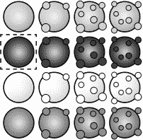
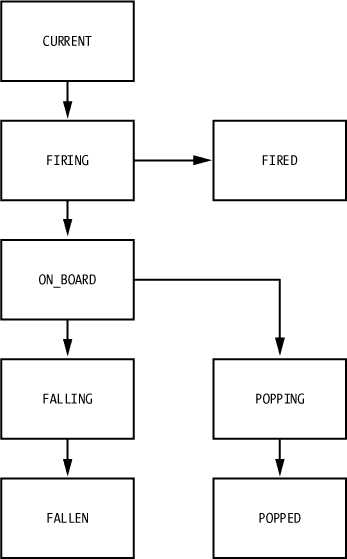

# 第六章 渲染 Canvas 精灵

直到现在，我们一直使用基于 DOM 的方法构建 *Bubble Shooter*，通过使用 HTML 元素作为游戏对象，这些对象通过 CSS 进行样式化和定位，并由 JavaScript 进行操作。在这一章中，我们将重新构建 *Bubble Shooter*，使大部分游戏区域渲染到 Canvas 上，而不是使用 DOM。我们的游戏对话框将继续使用 HTML 和 CSS。

Canvas 渲染允许我们实现一些通常在基于 DOM 的开发中无法实现的图形效果，而且它通常能提供更快的渲染速度。为了在 *Bubble Shooter* 中使用 Canvas 渲染，我们需要学习如何将整个场景渲染到 Canvas 上，保持状态，并执行逐帧动画。

对于不支持 `canvas` 元素的设备，我们将保留现有的 DOM 渲染代码，并为更现代的浏览器提供 Canvas 渲染的渐进增强。我们这么做是为了演示如何为 Canvas 和基于 DOM 的动画编码的原则，并突出这两种方法的区别。

# 检测 Canvas 支持

Modernizr 可以帮助我们检测 Canvas 特性，这样我们就不必记住多个跨浏览器的情况。我们只需要为 Canvas 版本加载几个额外的 JavaScript 文件，并且不会删除任何文件。为了检测 Canvas 并加载正确的文件，我们需要在 *index.html* 中的 `Modernizr.load` 里增加一个额外的节点，这将检查 Canvas 支持情况，如果支持，将从数组中加载 JavaScript 文件。在加载 *game.js* 之前，添加以下内容：

*index.html*

```
},
**{**
  **test: Modernizr.canvas,**
  **yep: ["_js/renderer.js","_js/sprite.js"]**
**},**
{
  load: "_js/game.js",
  complete: function(){
    $(function(){
      var game = new BubbleShoot.Game();
      game.init();
    })
 }
**}**]);
```

`Modernizr.canvas` 的值，即 `test` 查找的参数，将是 `true` 或 `false`。如果为 `true`，则加载 `yep` 中列出的两个文件；如果为 `false`，则不会发生任何新的操作。

在 *_js* 文件夹中为 *renderer.js* 和 *sprite.js* 创建空文件。`Renderer` 对象将在每一帧绘制游戏状态，而 `Sprite` 类将执行我们迄今为止使用 jQuery 完成的许多操作。我们希望 `Renderer` 负责将像素绘制到 Canvas 上，而不是将游戏逻辑与其混合；同样，我们将尽量将状态信息保留在相关的对象内。这样的方法让我们可以更轻松地在 Canvas 和 DOM 渲染之间切换，具体取决于我们认为最适合游戏的方式。

# 绘制到 Canvas

使用 HTML5 的 Canvas 特性，你可以构建类似 Flash 游戏甚至本地应用程序级别的游戏。你将 `canvas` 元素放入文档中的方式与其他元素（如 `<div>` 或 ``）相同，但与该元素的交互方式使其与众不同。在 Canvas 内部，你可以精确控制像素，并且可以绘制到单个像素，读取其值并对其进行操作。你可以编写 JavaScript 代码来生成街机射击游戏，甚至是 3D 游戏，而这些是基于 DOM 的方法难以复制的。

DOM 与 Canvas

HTML 主要是一种信息格式；CSS 则作为一种格式化信息的方式引入。使用这两种技术创建游戏实际上是一种误用，像 *泡泡射手* 这样的游戏之所以可行，很大程度上是因为浏览器厂商致力于提高性能。许多在排版文档时非常有用的过程，例如确保文本区域不重叠或文本绕过图像，都是我们在排版游戏时不需要的。作为游戏开发者，我们要负责确保屏幕布局良好，但不幸的是，浏览器仍然会在后台执行所有这些检查。

例如，在 DOM 中添加或删除元素可能是一项相对昂贵的操作，涉及到处理性能的问题。原因在于，如果我们添加或删除某些内容，浏览器需要检查这些更改，以确保它们不会对文档的其他部分产生连锁反应。如果我们在网站上工作，比如一个扩展菜单，我们可能希望浏览器在我们添加更多元素时将导航区域推下去。然而，在游戏中，我们更可能使用 `position: absolute`，而我们肯定不希望新增或删除元素时，周围的所有内容都被重新定位。

相反，当浏览器看到 `canvas` 元素时，它只看到了一个图像。如果我们更改 canvas 的内容，只有内容会发生变化。浏览器不需要考虑这一变化是否会对文档的其他部分产生连锁效应。

与 CSS 和 HTML 不同，canvas 让你无法依赖浏览器跟踪屏幕上物体的位置。没有任何自动处理图层或背景渲染的机制，因为 canvas 输出的是一个平面图像供浏览器显示。如果使用 CSS 进行精灵动画和移动像是在布告墙上移动纸张，那么 canvas 动画就更像是使用白板：如果你想改变或移动某个东西，你必须擦除一个区域然后重新绘制它。

Canvas 渲染与 CSS 布局的另一个不同之处在于，元素的定位不能由浏览器处理。例如，在现有的基于 DOM 的系统中，我们可以使用 CSS 过渡来将气泡从它的发射位置平滑地移动到我们希望它出现在板面布局的任何位置。做到这一点只需要几行代码。

另一方面，Canvas 渲染要求我们逐帧动画，方式类似于 jQuery 的内部工作原理。我们必须计算气泡在路径上的位置，并在每次帧更新时在该位置绘制它。

单独来说，使用 JavaScript 在画布上进行动画制作不会比在没有 jQuery 或 CSS 过渡的情况下使用 DOM 进行 JavaScript 动画更为困难，但这个过程变得更加复杂，因为如果我们想要更改画布的内容，我们需要删除像素并重新绘制它们。虽然有一些优化重绘过程的方法，但基本的方法是为每个动画帧重新绘制整个画布。这意味着，如果我们想要在画布上移动一个物体，我们不仅要渲染我们想要移动的物体，还可能需要渲染场景中的每个物体。

我们将使用画布绘制游戏板和当前的气泡，但某些组件，如对话框，作为 DOM 元素会更好。用户界面组件通常作为 DOM 元素更新更为方便，而且浏览器通常使用 HTML 渲染文本时比在 `canvas` 元素中渲染文本更为精确。

现在我们决定使用画布系统来渲染游戏，接下来让我们看看这将涉及哪些内容。关键任务是渲染图像并维护每个气泡的状态，以便我们知道哪些气泡是静止的，哪些在移动，哪些处于爆破的不同阶段。

# 图像渲染

任何你想绘制到画布上的图像都必须预加载，这样它才能在绘制时可用；否则，什么也不会显示。为此，我们将在 JavaScript 中创建一个内存中的 `Image` 对象，设置图像源为精灵图，并附加一个 `onload` 事件处理程序，以便在图像加载完成时知道。目前，只要在 *game.js* 中运行 `init` 函数，并且点击“新游戏”按钮时触发 `startGame` 函数，游戏就可以进行：

```
$(".but_start_game").bind("click",startGame);
```

我们仍然希望这样做，但我们不希望在精灵图像加载完成之前发生。这将是我们要处理的第一个任务。

## canvas 元素

接下来，我们需要了解如何将图像绘制到画布上。`canvas` 元素是一个 HTML 元素，就像其他任何元素一样：它可以插入到 DOM 中，可以应用 CSS 样式，行为也与图像类似。例如，要创建一个 `canvas` 元素，我们需要在 *index.html* 中添加以下内容：

```
<canvas id="game_canvas " width="1000" height="620"></canvas>
```

这将创建一个 `canvas` 元素，宽度为 1000 像素，高度为 620 像素。这些尺寸很重要，因为它们确定了构成画布的像素数量。然而，我们还应该在 CSS 中设置这些尺寸，以确定画布在页面上显示的大小：

```
#game_canvas
{
  width: 1000px;
  height: 620px;
}
```

就像图像可以按比例渲染一样，`canvas`元素也可以缩放。通过将 CSS 尺寸设置为与 HTML 属性相同的值，我们确保画布以 1:1 的比例绘制。如果我们省略了 CSS，画布将按照属性中指定的宽度和高度渲染，但最好在样式表中指定布局尺寸。这样不仅有助于代码的可读性，还能确保如果画布的内部尺寸发生变化，页面布局不会被打破。

要使用 JavaScript 将图像绘制到画布上，首先需要获取一个*上下文*，这是你用来操作画布内容的对象，通过`getContext`方法获得。上下文告诉浏览器我们是在处理二维空间还是三维空间。你可以写类似下面的代码来指示你要在二维空间中工作，而不是三维空间：

```
document.getElementById("game_canvas").getContext("2d");
```

或者使用 jQuery 来编写如下：

```
$("#game_canvas").get(0).getContext("2d");
```

请注意，上下文是 DOM 节点的属性，而不是 jQuery 对象的属性，因为我们通过`get(0)`调用从 jQuery 集合中获取第一个对象。我们需要 DOM 节点，因为基本的 jQuery 库不包含任何处理`canvas`元素的特殊函数。

现在，为了将图像绘制到画布上，我们使用上下文对象的`drawImage`方法：

```
document.getElementById("game_canvas").getContext("2d").
drawImage(imageObject,x,y);
```

或者再使用 jQuery 来编写如下：

```
$("#game_canvas").get(0).getContext("2d").drawImage(imageObject,x,y);
```

传递给`drawImage`的参数是`Image`对象，然后是绘制图像的*x*和*y*坐标。这些是相对于画布上下文原点的像素。默认情况下，(0,0)是画布的左上角。

我们还可以使用`clearRect`方法清除画布上的像素：

```
$("#game_canvas").get(0).getContext("2d").clearRect(0, 0, 1000, 620);
```

`clearRect`命令会清除从左上角（前两个参数）到右下角（后两个参数）的所有画布像素。虽然你可以只清除你想改变的画布区域，但通常更容易清空整个画布并在每一帧重新绘制它。再次强调，坐标是相对于上下文原点的。

上下文维护了有关画布的多个状态属性，例如当前的线条粗细、线条颜色和字体属性。对于绘制精灵来说最重要的是，它还维护着上下文原点的坐标和旋转角度。事实上，你可以通过两种方式在画布的固定位置绘制图像：

+   将*x*和*y*坐标传入`drawImage`函数。

+   移动上下文原点并在原点处绘制图像。

在实践中，使用任何一种方法都会得到相同的结果，但通常最好将上下文的原点**移动**或*平移*。如果你想以角度将图像绘制到画布上，并不是图像本身旋转，而是画布上下文在绘制图像之前先旋转。

## 旋转画布

画布始终围绕其原点旋转。如果你想围绕图像的中心旋转图像，首先将画布原点平移到图像中心的新原点。然后按你希望旋转图像的角度旋转画布*但方向与你想应用于对象的旋转相反*。接着像往常一样绘制图像，旋转画布回到新原点的零度角度，最后将画布平移回初始原点。图 6-1 展示了这一过程是如何工作的。

例如，要绘制一个宽度为 100 像素的图像，位于坐标（100,100），并围绕其中心旋转 30 度，你可以写出以下代码：

```
➊ var canvas = $("#game_canvas").get(0);
➋ var context = canvas.getContext("2d");
➌ context.clearRect(0, 0, canvas.width, canvas.height);
➍ context.translate(150, 150);
➎ context.rotate(Math.PI/6);
➏ context.drawImage(imageObject, -50, -50);
➐ context.rotate(-Math.PI/6);
➑ context.translate(-150, -150);
```


图 6-1. 将旋转后的图像绘制到画布上

这段代码获取画布➊和上下文➋，然后清空画布，准备绘制➌。接下来，我们将原点平移到我们想要绘制图像的坐标位置➍，但我们还需要将图像的宽度和高度的一半添加到平移值中，因为我们将把图像的中心绘制到新的原点。

下一步是添加旋转➎，但请记住我们旋转的是*上下文*，而不是图像。角度是以弧度而不是度数来指定的。图像被绘制在（-50,-50）➏，这意味着图像的中心绘制在上下文原点，然后上下文被旋转回去➐，再进行平移➑。最后两步很重要，因为上下文会保持状态，因此接下来的任何操作都将基于旋转后的坐标进行。通过反转旋转和平移，我们让画布保持在与最初相同的状态。

如果你不想记得旋转和翻译画布回到其原点，可以通过在改变图像之前保存上下文并在之后重置上下文来简化整个过程：

```
   var canvas = $("#game_canvas").get(0);
   var context = canvas.getContext("2d");
   context.clearRect(0, 0, canvas.width, canvas.height);
➊ context.save();
   context.translate(150, 150);
   context.rotate(Math.PI/6);
   context.drawImage(imageObject, -50, -50);
➋ context.restore();
```

调用`context.save`➊保存当前的上下文状态，但需要注意，它并不会保存画布内的像素数据。然后`context.restore`➋会将上下文状态恢复为之前保存的状态。

这些原则是我们绘制完整图像到画布上并再将其移除所需的全部内容，但如果要绘制气泡，我们每次只需要绘制精灵图中的一小部分。

画布的宽度和高度

画布有自己的宽度和高度设置，在创建`canvas`元素时指定这些设置非常重要。你可以使用 CSS 来决定画布在屏幕上显示的尺寸，但它们可能与画布内部实际渲染的像素数不匹配。在我们的例子中，我们会将这两个设置保持一致，这样在画布上绘制一个像素就会显示一个像素。

如果我们将 `canvas` 元素的宽度和高度设置为当前的两倍，DOM 元素仍然会占用页面上的相同空间，因为我们的 CSS 定义如此。画布与 CSS 的交互方式与图像相同：宽度和高度在样式表中指定，但画布（或图像）可能更大或更小。结果是，我们绘制的图像仅占画布的四分之一，并且看起来是原始大小的四分之一。这是因为画布像素在渲染时被缩放到屏幕像素。尝试将 *index.html* 中的 `canvas` 定义更改为以下内容，看看会发生什么：

```
<canvas id="game_canvas" width="2000" height="1240"></canvas>
```

`canvas` 元素不会因为 CSS 规则而在屏幕上显得更大。相反，CSS 定义的每个像素将在画布上表示为 4 个像素。在大多数桌面浏览器中，1 个 CSS 像素与 1 个屏幕像素是相同的，所以将画布尺寸设置为比 CSS 中定义的更大的值没有太大意义。然而，现代设备，特别是移动设备，已经在渲染方面变得非常精密，具备了所谓的更高像素密度。这使得设备能够渲染更高分辨率的图像。你可以在 *[`www.html5rocks.com/en/tutorials/canvas/hidpi/`](http://www.html5rocks.com/en/tutorials/canvas/hidpi/)* 阅读更多关于像素密度的内容。

当你在使用画布和 CSS 一起工作时，你需要记住你正在使用的缩放比例。如果你在画布内工作，那么重要的是画布的尺寸，正如其 HTML 属性所指定的那样。当你在画布周围（或可能甚至在画布上方）使用 CSS 元素时，你将使用 CSS 像素尺寸。例如，要在宽度为 2000 像素、高度为 1240 像素的画布右下角绘制图像，你可以使用类似这样的代码：

```
$("#game_canvas").get(0).getContext("2d").drawImage(imageObject,2000,1240);
```

但是，要将 DOM 元素放置在右下角，你将使用坐标 (1000, 620)，如下所示的 CSS：

```
{
  left: 1000px;
  top: 620px;
}
```

如果可能的话，通常最好保持屏幕显示画布的大小（在 CSS 中设置）与画布的宽度和高度定义相同，这样画布渲染器就不需要尝试缩放像素。但是，如果你目标设备的像素密度较高（例如苹果的 Retina 显示器），你可以通过尝试增加画布中像素的数量来提高图形的质量。

# 精灵渲染

我们不能像在基于 DOM 的系统中那样使用背景图片和位置偏移来渲染气泡精灵。相反，我们需要将气泡精灵作为图片绘制到画布上。记住，精灵图像文件包含了四种气泡颜色，在静止和弹出的状态下都有。例如，在图 6-2 中显示的精灵图像中，如果我们想将一个蓝色气泡绘制到画布上，我们只关心图像中被虚线框住的部分。为了只选择这部分图像，我们将使用可以传递给画布上下文的 `drawImage` 方法的剪裁参数。



图 6-2. 绘制蓝色气泡到画布上所需的剪裁边界

如果我们想绘制气泡在被弹出的第一阶段，我们将把剪裁区域向右移动。这与我们在 DOM 版本中显示气泡的方式类似，不同之处在于，我们不会让 `div` 元素的边界定义剪裁边界，而是直接在 JavaScript 中指定这些边界。

要将剪裁后的图像绘制到画布上，只需向 `drawImage` 方法添加几个参数。之前，我们只用三个参数（`Image` 对象和 *x*、*y* 坐标）调用 `drawImage`，但现在可以传递更多参数来剪裁图像。`drawImage` 接受的完整参数集如下：

```
context.drawImage(img,sx,sy,swidth,sheight,x,y,width,height);
```

参数如下：

+   ****`img`****。`Image` 对象。

+   ****`sx` 和 `sy`****。剪裁图像相对于图像原点的 *x* 和 *y* 坐标。对于静止状态下的蓝色气泡，这些值分别为 0 和 50。

+   ****`swidth` 和 `sheight`****。剪裁区域的宽度和高度。对于我们的气泡精灵图，两个值都将为 50。

+   ****`x` 和 `y`****。绘制图像在画布上的坐标，相对于画布上下文原点。

+   ****`width` 和 `height`****。要绘制的图像的宽度和高度。我们可以使用这些参数来缩放图像，或者如果希望图像按 1:1 的比例绘制，则可以省略它们。

例如，要在画布的坐标 (200,150) 上绘制图 6-2 中突出显示的蓝色气泡，我们将使用以下代码：

```
$("#canvas").get(0).getContext("2d").drawImage(spriteSheet,0,50,50,50,200,150,
50,50);
```

这行代码假设精灵 `Image` 对象命名为 `spriteSheet`，且精灵的宽度和高度均为 50 像素。

# 定义和维护状态

在基于 DOM 的游戏代码版本中，我们不需要考虑气泡的状态；我们只需使用超时队列事件和动画/回调链。一旦气泡被绘制到屏幕上的固定位置，我们就保持它的状态，除非需要进行修改。气泡会一直在同一位置绘制，直到我们告诉浏览器做其他事情。

但是，当我们切换到画布渲染时，我们需要在每一帧重绘时为每个气泡渲染正确的精灵。我们的代码必须追踪屏幕上所有气泡的状态，无论它们是移动、爆炸、下落还是静止。每个 `bubble` 对象将追踪其当前状态以及在该状态中停留的时间。我们需要这个持续时间来绘制爆炸动画的帧。`Board` 对象目前跟踪主要布局中的气泡，我们需要对其进行扩展，以便也能追踪那些正在爆炸、下落或发射的气泡。

## 准备状态机

为了保持气泡的状态，我们首先会创建一组常量，用来表示气泡的状态。这就叫做使用 *状态机*，随着游戏复杂度的增加，你可能会发现它越来越有用。使用状态机的基本原则，在本游戏中的应用如下：

+   一个气泡可以处于多种状态，例如移动、爆炸或下落。

+   气泡在游戏中的反应将取决于它所处的状态。例如，我们不希望发射的气泡与正在爆炸的气泡发生碰撞。

+   气泡的显示方式可能取决于其状态，特别是在它正在爆炸时。

+   一个气泡一次只能处于一种状态；它不能同时处于爆炸状态和被爆炸状态，或者同时处于爆炸状态和下落状态。

一旦设置好状态机，我们就能知道在任何给定情况下该如何处理气泡。一些状态的变化是由用户操作引起的，例如当他们发射气泡时，但我们也会记录气泡进入某个状态时的时间戳。因此，我们可以自动判断气泡何时应该从一个状态转移到另一个状态，例如在碰撞后，我们正处于爆炸过程中。

### 注意

*一般来说，即使你认为你的游戏相对简单，使用状态机来管理你可能还没想到的复杂性是值得的。*

将以下内容添加到 *bubble.js*：

*bubble.js*

```
  var BubbleShoot = window.BubbleShoot || {};
  BubbleShoot.Bubble = (function($){
➊  **BubbleShoot.BubbleState = {**
      **CURRENT : 1,**
      **ON_BOARD : 2,**
      **FIRING : 3,**
      **POPPING : 4,**
      **FALLING : 5,**
      **POPPED : 6,**
      **FIRED : 7,**
      **FALLEN : 8**
    **}**;
    var Bubble = function(row,col,type,sprite){
      var that = this;
➋    **var state;**
      **var stateStart = Date.now();**
      **this.getState = function(){ return state;};**
➌    **this.setState = function(stateIn){**
        **state = stateIn;**
➍      **stateStart = Date.now();**
      **};**
➎    **this.getTimeInState = function(){**
        **return Date.now() - stateStart;**
      **};**
      --*snip*--
    };
    Bubble.create = function(rowNum,colNum,type){
      --*snip*--
    };
    return Bubble;
  })(jQuery);
```

这些新增内容使我们能够存储和检索气泡的当前状态 ➋，该状态将是类顶部的八个状态之一 ➊。每当我们更改气泡的状态 ➌时，我们还会记录它进入该状态时的时间戳 ➍。一旦我们确定气泡在当前状态中停留的时间 ➎，我们就可以确定需要绘制的内容。例如，气泡在 `爆炸` 状态中停留的时间决定了显示哪个爆炸序列的帧。

## 实现状态

每个气泡可以有以下状态之一，我们需要实现这些状态：

| **`CURRENT`** | 等待发射。 |
| --- | --- |
| **`ON_BOARD`** | 已经是棋盘显示的一部分。 |
| **`FIRING`** | 向棋盘或屏幕外移动。 |
| **`POPPING`** | 正在爆裂。这将显示爆裂动画的一个帧。 |
| **`FALLING`** | 一个孤立的气泡正在从屏幕上掉落。 |
| **`POPPED`** | 完成`POPPING`。被爆裂的气泡不需要渲染。 |
| **`FIRED`** | 在`FIRING`后错过了棋盘显示。一个发射的气泡不需要被渲染。 |
| **`FALLEN`** | 完成`FALLING`并掉出屏幕。一个掉落的气泡不需要渲染。 |

游戏开始时棋盘上显示的气泡最初处于`ON_BOARD`状态，但所有其他气泡将从`CURRENT`状态开始，并转移到其他状态，如图 6-3 所示。

我们将在`Game`中添加几个数组来跟踪这些状态。在类的顶部，添加：

*game.js*

```
  var BubbleShoot = window.BubbleShoot || {};
  BubbleShoot.Game = (function($){
    var Game = function(){
      var curBubble;
      var board;
      var numBubbles;
➊    **var bubbles = [];**
      var MAX_BUBBLES = 70;
      this.init = function(){
        --*snip*--
      };
      var startGame = function(){
        $(".but_start_game").unbind("click");
          numBubbles = MAX_BUBBLES
          BubbleShoot.ui.hideDialog();
          board = new BubbleShoot.Board();
➋        **bubbles = board.getBubbles();**
          curBubble = getNextBubble();
        BubbleShoot.ui.drawBoard(board);
        $("#game").bind("click",clickGameScreen);
      };
      var getNextBubble = function(){
        var bubble = BubbleShoot.Bubble.create();
➌      **bubbles.push(bubble);**
➍      **bubble.setState(BubbleShoot.BubbleState.CURRENT);**
        bubble.getSprite().addClass("cur_bubble");
        $("#board").append(bubble.getSprite());
        BubbleShoot.ui.drawBubblesRemaining(numBubbles);
        numBubbles--;
        return bubble;
      };
      --*snip*--
    };
    return Game;
  })(jQuery);
```

这个新数组 ➊ 将包含游戏中所有的气泡，包括在棋盘上的和不在棋盘上的。最初，每个气泡都是棋盘的一部分，因此可以使用棋盘内容来填充数组 ➋。每次调用`getNextBubble`时，准备发射的气泡需要被添加 ➌，并将其状态设置为`CURRENT` ➍。



图 6-3. 显示气泡状态的流程图

`board.getBubbles`是一个新方法，它将返回棋盘上所有行和列中的气泡，作为一个单一的平面数组，因此请将其添加到*board.js*中：

*board.js*

```
var BubbleShoot = window.BubbleShoot || {};
BubbleShoot.Board = (function($){
  var NUM_ROWS = 9;
  var NUM_COLS = 32;
  var Board = function(){
    var that = this;
    --*snip*--
    **this.getBubbles = function(){**
      **var bubbles = [];**
      **var rows = this.getRows();**
      **for(var i=0;i<rows.length;i++){**
        **var row = rows[i];**
        **for(var j=0;j<row.length;j++){**
          **var bubble = row[j];**
          **if(bubble){**
            **bubbles.push(bubble);**
          **};**
        **};**
      **};**
      **return bubbles;**
    **};**
    return this;
  };
  --*snip*--
  return Board;
})(jQuery);
```

我们还需要将棋盘上气泡的状态设置为`ON_BOARD`，因此请在同一文件中的`createLayout`函数中进行此更改：

```
var BubbleShoot = window.BubbleShoot || {};
BubbleShoot.Board = (function($){
  var NUM_ROWS = 9;
  var NUM_COLS = 32;
  var Board = function(){
    --*snip*-
  };
  var createLayout = function(){
    var rows = [];
    for(var i=0;i<NUM_ROWS;i++){
      var row = [];
      var startCol = i%2 == 0 ? 1 : 0;
      for(var j=startCol;j<NUM_COLS;j+=2){
        var bubble = BubbleShoot.Bubble.create(i,j);
        **bubble.setState(BubbleShoot.BubbleState.ON_BOARD);**
        row[j] = bubble;
      };
      rows.push(row);
    };
    return rows;
  };
  return Board;
})(jQuery);
```

`bubble.setState`处理设置，其中包括`CURRENT`和`ON_BOARD`的状态，但我们还需要能够改变气泡的状态。

`FIRING`和`FIRED`这两个状态将在*ui.js*中的`fireBubble`内设置。请按如下方式修改该函数：

*ui.js*

```
  var BubbleShoot = window.BubbleShoot || {};
  BubbleShoot.ui = (function($){
    var ui = {
      --*snip*--
      fireBubble : function(bubble,coords,duration){
➊      **bubble.setState(BubbleShoot.BubbleState.FIRING);**
        var complete = function(){
          if(typeof(bubble.getRow()) !== undefined){
            bubble.getSprite().css(Modernizr.prefixed("transition"),"");
            bubble.getSprite().css({
              left : bubble.getCoords().left - ui.BUBBLE_DIMS/2,
              top : bubble.getCoords().top - ui.BUBBLE_DIMS/2
            });
➋          **bubble.setState(BubbleShoot.BubbleState.ON_BOARD);**
          **}else{**
➌          **bubble.setState(BubbleShoot.BubbleState.FIRED);**
          **};**
        --*snip*--
      },
      --*snip*--
    };
    return ui;
  } )(jQuery);
```

当气泡最初被发射时，我们将其状态设置为`FIRING` ➊。如果气泡到达棋盘，我们将其状态设置为`ON_BOARD` ➋，但如果它还没有稳定在某一行和列上，那么它就错过了棋盘，此时它的状态变为`FIRED` ➌。

其他状态将在*game.js*中设置：

*game.js*

```
  var Game = function(){
    --*snip*--
    var popBubbles = function(bubbles,delay){
      $.each(bubbles,function(){
        var bubble = this;
        setTimeout(function(){
➊        **bubble.setState(BubbleShoot.BubbleState.POPPING);**
          bubble.animatePop();
➋        **setTimeout(function(){**
            **bubble.setState(BubbleShoot.BubbleState.POPPED);**
          **},200);**
        },delay);
        board.popBubbleAt(bubble.getRow(),bubble.getCol());
        delay += 60;
      });
    };
    var dropBubbles = function(bubbles,delay){
      $.each(bubbles,function(){
        var bubble = this;
        board.popBubbleAt(bubble.getRow(),bubble.getCol());
        setTimeout(function(){
➌        **bubble.setState(BubbleShoot.BubbleState.FALLING);**
          bubble.getSprite().kaboom({
            callback : function(){
              bubble.getSprite().remove();
➍            **bubble.setState(BubbleShoot.BubbleState.FALLEN);**
            }
          })
        },delay);
      });
    };
  };
```

在`popBubbles`中，我们将每个气泡的状态设置为`POPPING` ➊，然后在 200 毫秒后，当爆裂动画完成时，我们将其状态设置为`POPPED` ➋。在`dropBubbles`中，我们将其状态设置为`FALLING` ➌，然后在`kaboom`过程结束时，当它们完成下落后，它们变为`FALLEN` ➍。

现在，气泡知道它们在游戏中的任何时刻处于哪种状态，我们可以开始将它们渲染到画布上。

# 精灵图和画布

我们可以使用游戏的 CSS 版本中现有的精灵图 PNG (*bubble_sprite_sheet.png*) 来绘制 canvas，尽管我们需要以不同的方式处理它。我们不会像处理背景图像那样移动精灵图，而是绘制图像的一部分，显示正确的气泡及其正确的动画状态。我们的加载顺序也会改变，因为我们需要确保精灵图在游戏开始前已被加载。

我们将创建一个新的对象`Renderer`来处理渲染到 canvas 的操作，并为它定义一个`init`方法，该方法将预加载精灵图，并在`game.init`中调用该方法。

将*game.js*中的`init`方法更改为如下内容：

*game.js*

```
  var BubbleShoot = window.BubbleShoot || {};
  BubbleShoot.Game = (function($){
    var Game = function(){
      --*snip*--
      this.init = function(){
➊    **if(BubbleShoot.Renderer){**
➋      **BubbleShoot.Renderer.init(function(){**
➌          **$(".but_start_game").click("click",startGame);**
        **});**
      **}else{**
          $(".but_start_game").click("click",startGame);
      **};**
      --*snip*--
    };
    return Game;
  })(jQuery);
```

首先，我们检查`BubbleShoot.Renderer`是否存在 ➊。 如果加载脚本时`Modernizr.canvas`测试通过，那么该对象将存在；如果不支持 canvas，该对象则不存在。

然后，我们调用`Renderer.init`方法，并将一个函数作为唯一参数传入 ➋。这个函数将`startGame`附加到“新游戏”按钮 ➌。

现在我们需要编写`Renderer`对象。在空白的*renderer.js*文件中，添加以下代码：

*renderer.js*

```
  var BubbleShoot = window.BubbleShoot || {};
  BubbleShoot.Renderer = (function($){
➊  var canvas;
    var context;
    var Renderer = {
➋    init : function(callback){
➌      canvas = document.createElement("canvas");
        $(canvas).addClass("game_canvas");
➍      $("#game").prepend(canvas);
➎      $(canvas).attr("width",$(canvas).width());
        $(canvas).attr("height",$(canvas).height());
        context = canvas.getContext("2d");
        callback();
      }
    };
    return Renderer;
  })(jQuery);
```

我们首先创建变量来保存用于渲染游戏区域的 canvas ➊，以及它的渲染上下文引用，这样我们就不需要不断调用`canvas.getContext("2d")`。

在`init`方法中，我们将回调函数作为参数 ➋，创建`canvas` DOM 元素 ➌，然后将其添加到游戏的`div`中 ➍。我们还显式地设置`canvas`的宽度和高度属性 ➎。请记住，这些属性定义了 canvas 内部的像素数量和边界，因此为了简化起见，我们将它们设置为与渲染到屏幕上的尺寸相同。

这将为我们创建`canvas`元素，并准备好一个可以绘制的上下文。我们需要设置`game_canvas`的宽度和高度，因此请将以下内容添加到*main.css*中：

*main.css*

```
.game_canvas
{
  width: 1000px;
  height: 620px;
}
```

DOM 渲染版本使用 jQuery 来在屏幕上移动对象，但在 canvas 内我们没有 DOM 元素可以操作，因此没有任何内容可以供 jQuery 处理。因此，我们必须通过新的代码来跟踪每个气泡在屏幕上的位置。大部分工作将在我们创建的新*sprite.js*文件中完成。

多种渲染方法：两种方案

如果你需要支持不同的渲染方法，就像我们这里所做的，你可以采用两种方案。首先，你可以为每种渲染方法创建一个类，并提供相同的方法和属性集，以便它们可以互换使用。这正是我们在*Bubble Shooter*中所做的。

第二，你可以为两种渲染方法创建一个类，然后在该类内部根据支持的渲染方法编写分支代码。这个新类可能只是为每种方法包装不同的类。例如，对于*Bubble Shooter*，我们可以创建如下的伪代码：

```
  BubbleShoot.SpriteWrapper = (function($){
➊  var SpriteWrapper = function(id){
      var wrappedObject;
➋    if(BubbleShoot.Renderer){
➌      wrappedObject = getSpriteObject(id);
      }else{
➍      wrappedObject = getJQueryObject(id);
      }
➎    this.position = function(){
        return wrappedObject.position();
      };
    };
    return SpriteWrapper;
  })(jQuery);
```

在这里，我们会将某种标识符传递给对象构造函数 ➊，然后根据我们将如何渲染游戏来分支代码 ➋。我们将需要新的函数来返回一个 `Sprite` ➌ 或一个 `jQuery` ➍ 对象，这些对象将存储在类中的 `wrappedObject` 内。

从那时起，如果我们想要查找对象的位置，我们会调用 `position` 方法 ➎，并且可以知道无论对象是在 DOM 中还是在画布上渲染，都会得到正确的数据。

我们不采用这种方法的主要原因是，*Bubble Shooter* 中只有一种类型的精灵——屏幕上的气泡。这些精灵由 `Bubble` 类很好地表示，它本身就充当了一个包装器。然而，如果我们处理的是多种不同类型的精灵，我们可能会希望更明确地拆分结构。

我们将编写 *sprite.js*，使得画布精灵可以使用与 jQuery 精灵相同的方法进行调用。我们一直在调用的主要方法有 `position`、`width`、`height` 和 `css`，如果我们在 *sprite.js* 中创建这些方法的实现，`Sprite` 类看起来就像一个 jQuery 对象，对我们其余代码的影响是一样的。

将以下内容添加到 *sprite.js* 中：

*sprite.js*

```
  var BubbleShoot = window.BubbleShoot || {};
  BubbleShoot.Sprite = (function($){
    var Sprite = function(){
      var that = this;
➊    var left;
      var top;
➋    this.position = function(){
        return {
          left : left,
          top : top
        };
      };
➌    this.setPosition = function(args){
        if(arguments.length > 1){
          return;
        };
        if(args.left !== null)
          left = args.left;
        if(args.top !== null)
          top = args.top;
      };
➍    this.css = this.setPosition;
      return this;
    };
➎  Sprite.prototype.width = function(){
      return BubbleShoot.ui.BUBBLE_DIMS;
    };
➏  Sprite.prototype.height = function(){
      return BubbleShoot.ui.BUBBLE_DIMS;
    };
➐  Sprite.prototype.removeClass = function(){};
    Sprite.prototype.addClass = function(){};
    Sprite.prototype.remove = function(){};
    Sprite.prototype.kaboom = function(){
      jQuery.fn.kaboom.apply(this);
    };
    return Sprite;
  })(jQuery);
```

在这里，我们创建了一个对象，实现了我们访问 jQuery 对象时使用的许多方法。我们有左坐标和上坐标 ➊ 以及一个返回这些坐标的 `position` 方法 ➋，这个方法的返回方式与调用 jQuery 的 `position` 方法相同。`setPosition` 方法可以设置上坐标和左坐标 ➌，如果传入其他值则不做任何操作。

在我们基于 DOM 的游戏版本中，我们调用 `css` 方法来设置对象的屏幕坐标。`setPosition` 已经构建成接受与 `css` 方法相同的参数，为了避免在调用 `css` 方法的地方重写代码，并且在画布版本中使用 `setPosition`，我们可以为 Sprite 创建一个 `css` 方法并将其别名为 `setPosition` ➍。

`width` ➎ 和 `height` ➏ 方法返回在 *ui.js* 中为气泡的尺寸定义的值。最后，我们为 `removeClass`、`addClass` 和 `remove` 定义了空方法，这些方法与我们现有的很多代码保持兼容性 ➐。调用这些方法的地方不会影响显示，但也不会抛出错误。

当一个气泡被创建时，我们需要决定是创建一个 jQuery 对象还是一个 `Sprite` 实例，这取决于我们是使用 DOM 还是画布进行渲染。我们将在 *bubble.js* 中的气泡创建过程中执行此操作：

*bubble.js*

```
  var BubbleShoot = window.BubbleShoot || {};
  BubbleShoot.Bubble = (function($){
    --*snip*--
    var Bubble = function(row,col,type,sprite){
      --*snip*--
    };
    Bubble.create = function(rowNum,colNum,type){
      if(!type){
        type = Math.floor(Math.random() * 4);
      };
➊    **if(!BubbleShoot.Renderer){**
        var sprite = $(document.createElement("div"));
        sprite.addClass("bubble");
        sprite.addClass("bubble_" + type);
      **}else{**
➋      **var sprite = new BubbleShoot.Sprite();**
      **}**
      var bubble = new Bubble(rowNum,colNum,type,sprite);
      return bubble;
    };
    return Bubble;
  })(jQuery);
```

这段代码再次检查 `Renderer` 对象是否已加载 ➊（如果启用了画布的话会发生这种情况），如果没有，它将继续执行基于 DOM 的路径。否则，我们会创建一个新的 `Sprite` 对象 ➋。有了这个，调用 `curBubble.getSprite` 时，无论我们是使用 jQuery 和 CSS 还是纯画布方式，都能返回一个有效的对象。

初始化`Sprite`对象的最后一步是确保它们具有正确的屏幕坐标。在游戏的 DOM 版本中，我们通过 CSS 设置这些坐标，但在画布中，我们必须通过 JavaScript 代码来设置这些坐标。这些坐标将会在*board.js*中的`createLayout`函数中设置：

*board.js*

```
  var BubbleShoot = window.BubbleShoot || {};
  BubbleShoot.Board = (function($){
    var NUM_ROWS = 9;
    var NUM_COLS = 32;
    var Board = function(){
      --*snip*--
      return this;
    };
    var createLayout = function(){
      var rows = [];
      for(var i=0;i<NUM_ROWS;i++){
        var row = [];
        var startCol = i%2 == 0 ? 1 : 0;
        for(var j=startCol;j<NUM_COLS;j+=2){
          var bubble = BubbleShoot.Bubble.create(i,j);
          bubble.setState(BubbleShoot.BubbleState.ON_BOARD);
➊        **if(BubbleShoot.Renderer){**
➋          **var left = j * BubbleShoot.ui.BUBBLE_DIMS/2;**
            **var top = i * BubbleShoot.ui.ROW_HEIGHT;**
➌          **bubble.getSprite().setPosition({**
              **left : left,**
              **top : top**
            **});**
          **};**
          row[j] = bubble;
        };
        rows.push(row);
      };
      return rows;
    };
    return Board;
  })(jQuery);
```

如果渲染器存在 ➊，我们计算气泡应显示的左上角坐标 ➋，然后将精灵的属性设置为这些值 ➌。

当前气泡也需要设置其位置，因此这将在*game.js*中的`getNextBubble`函数内进行：

*game.js*

```
var BubbleShoot = window.BubbleShoot || {};
  BubbleShoot.Game = (function($){
  var Game = function(){
    --*snip*--
    var getNextBubble = function(){
      var bubble = BubbleShoot.Bubble.create();
      bubbles.push(bubble);
      bubble.setState(BubbleShoot.BubbleState.CURRENT);
      bubble.getSprite().addClass("cur_bubble");
      **var top = 470;**
      **var left = ($("#board").width() - BubbleShoot.ui.BUBBLE_DIMS)/2;**
      **bubble.getSprite().css({**
        **top : top,**
        **left : left**
      **});**
      $("#board").append(bubble.getSprite());
      BubbleShoot.ui.drawBubblesRemaining(numBubbles);
      numBubbles--;
      return bubble;
    };
    --*snip*-
  };
  return Game;
})(jQuery);
```

现在我们已经追踪了所有气泡的位置，并且随时了解它们的状态。我们还可以操作精灵表示，但目前屏幕上什么都不会出现。在下一部分，我们将把精灵渲染到画布上。

# 画布渲染器

要在画布上动画化任何东西，我们需要在每次重新绘制之前清除像素。为了渲染游戏，我们将使用`setTimeout`和计时器，以逐帧的方式重新绘制每个气泡的位置和状态。这个过程几乎适用于任何你构建的游戏，尤其是那些需要不断更新显示的游戏。从理论上讲，我们只需在屏幕上的信息发生变化时重新绘制画布；但实际上，弄清楚何时有新信息需要显示可能会很困难。幸运的是，画布渲染速度非常快，所以通常没有理由不尽可能频繁地更新显示。

我们将存储`setTimeout`返回的超时 ID 值，这样就能知道帧计数器是否正在运行。这将在*game.js*的顶部通过一个名为`requestAnimationID`的新变量进行存储，同时我们还会存储上次动画发生的时间戳：

*game.js*

```
var BubbleShoot = window.BubbleShoot || {};
    var Game = function(){
      var curBubble;
      var board;
      var numBubbles;
      var bubbles = [];
      var MAX_BUBBLES = 70;
➊    **var requestAnimationID;**
      this.init = function(){
      };
      --*snip*--
        var startGame = function(){
        $(".but_start_game").unbind("click");
        $("#board .bubble").remove();
        numBubbles = MAX_BUBBLES;
        BubbleShoot.ui.hideDialog();
        board = new BubbleShoot.Board();
        bubbles = board.getBubbles();
➋      **if(BubbleShoot.Renderer)**
        **{**
          **if(!requestAnimationID)**
➌          **requestAnimationID = setTimeout(renderFrame,40);**
        **}else{**
          BubbleShoot.ui.drawBoard(board);
        **};**
        curBubble = getNextBubble(board);
        $("#game").bind("click",clickGameScreen);
      };
    };
    return Game;
  })(jQuery);
```

我们添加了两个变量 ➊，如果`Renderer`对象存在 ➋，我们开始启动超时计时器，绘制第一个动画帧 ➌。

我们还没有编写`renderFrame`，但在此之前，我们将在*renderer.js*中编写一个方法来绘制所有气泡。这个方法将接受一个`bubble`对象的数组作为输入。

首先，我们需要将气泡图像加载到*renderer.js*中：

*renderer.js*

```
  var BubbleShoot = window.BubbleShoot || {};
  BubbleShoot.Renderer = (function($){ var canvas;
    var context;
➊  **var spriteSheet;**
➋  **var BUBBLE_IMAGE_DIM = 50;**
    var Renderer = {
      init : function(callback){
        canvas = document.createElement("canvas");
        $(canvas).addClass("game_canvas");
        $("#game").prepend(canvas);
        $(canvas).attr("width",$(canvas).width());
        $(canvas).attr("height",$(canvas).height());
        context = canvas.getContext("2d");
        **spriteSheet = new Image();**
➌      **spriteSheet.src = "_img/bubble_sprite_sheet.png";**
➍      **spriteSheet.onload = function() {**
          callback();
        **};**
      }
    };
    return Renderer;
  })(jQuery);
```

我们创建一个变量来存储图像数据 ➊，并定义另一个变量来表示每个气泡图像的宽度和高度 ➋。这些尺寸将告诉我们如何在精灵图集中裁剪每张图像。然后我们加载图像文件 ➌，在图像加载完成后传入`init`的回调函数会被触发 ➍。

接下来，我们将创建一个函数，将精灵绘制到画布上。

*renderer.js*

```
  var BubbleShoot = window.BubbleShoot || {};
  BubbleShoot.Renderer = (function($){
    --*snip*--
    var Renderer = {
      init : function(callback){
        --*snip*--
      },
➊    **render : function(bubbles){**
        **context.clearRect(0,0,canvas.width,canvas.height);**
        **context.translate(120,0);**
➋      **$.each(bubbles,function(){**
          **var bubble = this;**
➌        **var clip = {**
            **top : bubble.getType() * BUBBLE_IMAGE_DIM,**
            **left : 0**
          **};**
➍        **Renderer.drawSprite(bubble.getSprite(),clip);**
        **});**
        **context.translate(-120,0);**
      **},**
      **drawSprite : function(sprite,clip){**
➎      **context.translate(sprite.position().left + sprite.width()/2,sprite.**
          **position().top + sprite.height()/2);**
➏      **context.drawImage(spriteSheet,clip.left,clip.top,BUBBLE_IMAGE_DIM,**
          **BUBBLE_IMAGE_DIM,-sprite.width()/2,-sprite.height()/2,BUBBLE_IMAGE_**
          **DIM,BUBBLE_IMAGE_DIM);**
➐      **context.translate(-sprite.position().left - sprite.width()/2,**
          **-sprite.position().top - sprite.height()/2);**
      **}**
    };
    return Renderer;
  })(jQuery);
```

首先，我们创建一个渲染方法，它接受一个 `Bubble` 对象的数组 ➊。然后，我们清除画布并将上下文偏移 120 像素，以便棋盘显示在屏幕的中央。接着，代码会循环遍历数组中的每个气泡 ➋，并定义一个 (*x*,*y*) 坐标，从中提取气泡的精灵图像 ➌。*x* 坐标始终从零开始，直到我们为弹出动画添加帧，而 *y* 坐标则是气泡类型（0 到 3）乘以气泡图像的高度（50 像素）。我们将这些信息以及气泡的 `Sprite` 对象传递给另一个新方法 `drawSprite` ➍，然后重置上下文位置。

在 `drawSprite` 中，我们通过精灵的坐标 ➎ 来平移上下文，并记得将（top,left）坐标偏移图像的一半（width,height），以便将图像的中心放在原点上，然后绘制图像 ➏。一般来说，最好将画布上下文平移，使其原点位于任何绘制图像的中心，因为上下文的 `rotate` 方法是围绕上下文的原点进行旋转的。这意味着，如果我们想围绕图像的中心旋转图像，那么上下文已经设置好了，能够正确地执行旋转。

最后，在调用 `drawImage` 后，我们将上下文平移回原点 ➐。为了看到棋盘被渲染到画布上，我们只需要在 *game.js* 中加入 `renderFrame`：

*game.js*

```
var BubbleShoot = window.BubbleShoot || {};
  var Game = function(){
    --*snip*--
    **var renderFrame = function(){**
      **BubbleShoot.Renderer.render(bubbles);**
      **requestAnimationID = setTimeout(renderFrame,40);**
    **};**
  };
  return Game;
})(jQuery);
```

在浏览器中重新加载页面以重新开始游戏。点击“新游戏”后，你应该会看到棋盘在初始状态下渲染出来。然而，发射气泡时没有动画效果，弹出、下落或其他任何动作也都没有动画效果。在下一部分，我们将重新实现气泡发射的动画，并且为气泡弹出的动画添加动画效果。如果你在不支持画布的浏览器中打开游戏，游戏仍然会像以前一样运行，因为我们保留了 DOM 版本。接下来，我们将为画布版本添加动画效果。

# 在画布上移动精灵

在游戏的 CSS 版本中，我们使用 jQuery 通过调用 `animate` 方法来移动屏幕上的物体。对于画布动画，我们需要手动计算并更新物体的移动。

在画布上动画的过程与 jQuery 内部的过程相同，我们将给 `Sprite` 添加一个 `animate` 方法，以便继续使用现有的代码。`animate` 方法将执行以下操作：

1.  接受气泡的目标坐标和移动的持续时间。

1.  根据自上次帧以来经过的时间按比例将物体移动到目标坐标的一个小距离。

1.  重复步骤 2，直到气泡到达目标位置。

这个过程与我们使用 jQuery 的 `animate` 方法时的过程完全相同，并且是你每次想要移动屏幕上的物体时都会使用的方法。

`renderFrame` 方法已经在每一帧时被调用，它将运行整个动画过程。气泡精灵计算出自己的坐标后，`renderFrame` 将触发绘制过程。我们会在 `Sprite` 对象中添加一个 `animate` 方法，这样我们现有的游戏逻辑就可以正常工作，而无需重写代码。记住，当我们在 *ui.js* 中调用 `animate` 时，我们传入了两个参数：

+   一个指定 `left` 和 `top` 位置坐标的对象

+   一个指定 `duration`、`callback` 函数和 `easing` 的对象

通过构建 `Sprite` 的 `animate` 方法以接收相同的参数，我们可以避免对 *ui.js* 中的调用做出任何更改。将以下内容添加到 *sprite.js*：

*sprite.js*

```
  var BubbleShoot = window.BubbleShoot || {};
  BubbleShoot.Sprite = (function($){
    var Sprite = function(){
      --*snip*--
      this.css = function(args){
        --*snip*--
      };
➊    **this.animate = function(destination,config){**
➋      **var duration = config.duration;**
➌      **var animationStart = Date.now();**
➍      **var startPosition = that.position();**
➎      **that.updateFrame = function(){**
          **var elapsed = Date.now() - animationStart;**
          **var proportion = elapsed/duration;**
          **if(proportion > 1)**
            **proportion = 1;**
➏        **var posLeft = startPosition.left + (destination.left - startPosition.**
            **left) * proportion;**
          **var posTop = startPosition.top + (destination.top - startPosition.top)**
            *** proportion;**
➐        **that.css({**
            **left : posLeft,**
            **top : posTop**
          **});**
        **};**
➑      **setTimeout(function(){**
➒        **that.updateFrame = null;**
➓        **if(config.complete)**
            **config.complete();**
        **},duration);**
      **};**
      return this;
    };
    --*snip*--
    return Sprite;
  })(jQuery);
```

传递给 `animate` 的 `destination` 参数 ➊ 代表精灵的目标坐标，这些坐标包含在一个看起来像这样的对象中：

```
{top: 100,left: 100}
```

我们还传递一个配置对象，该对象将具有 `duration` 属性 ➋，并且可以有一个可选的后动画回调函数，当动画结束时运行。

接下来，我们为动画设置一个开始时间 ➌，并存储起始位置 ➍。这两个值将用于随时计算气泡的位置。

我们动态地将 `updateFrame` 方法添加到 `Sprite` 对象上 ➎，这样我们就可以在每一帧调用它重新计算气泡的位置。在 `updateFrame` 内部，我们计算动画的完成度。如果最后一个超时调用发生在动画完成之后，我们确保比例永远不会大于 1，从而避免气泡越过目标位置。新坐标的计算 ➏ 使用以下公式：

+   当前 *x* = 起始 *x* + (最终 *x* – 起始 *x*) × 经过的比例

+   当前的 *y* = 起始 *y* + (最终 *y* – 起始 *y*) × 经过的比例

一旦我们得到了新的顶部和左侧坐标，精灵的位置会通过调用它的 `css` 方法 ➐ 来更新。我们不需要在对象移动完成后继续运行 `updateFrame`，因此设置了一个超时调用 ➑ 来在 `duration` ➒ 过去时移除该方法，此时动画将完成。这也会调用任何作为 `config` 变量的 `callback` 属性传入的后动画函数 ➓。

现在我们可以计算气泡的新坐标，接下来在 *game.js* 中添加一个对`updateFrame`的调用：

*game.js*

```
  var BubbleShoot = window.BubbleShoot || {};
    var Game = function(){
      --*snip*--
      var renderFrame = function(){
➊      **$.each(bubbles,function(){**
➋        **if(this.getSprite().updateFrame)**
➌          **this.getSprite().updateFrame();**
        **});**
        BubbleShoot.Renderer.render(bubbles);
        requestAnimationID = setTimeout(renderFrame,40);
      };
    };
    return Game;
  })(jQuery);
```

每次在气泡上调用 `renderFrame` ➊ 时，如果定义了 `updateFrame` 方法 ➋，我们就调用该方法 ➌。

我们还需要在 `fireBubble` 中调用 `animate`，在 *ui.js* 里再次检查 `BubbleShoot.Renderer` 是否存在。我们知道只有在支持 canvas 的情况下，`BubbleShoot.Renderer` 才会存在，我们希望在这种情况下使用 canvas 渲染。最终的结果是，只有在支持 CSS 过渡动画并且不支持 canvas 渲染时，CSS 过渡动画才会对气泡进行动画处理。

*ui.js*

```
var BubbleShoot = window.BubbleShoot || {};
BubbleShoot.ui = (function($){
  var ui = {
    --*snip*--
    fireBubble : function(bubble,coords,duration){
      --*snip*--
      if(Modernizr.csstransitions **&& !BubbleShoot.Renderer**){
        --*snip*--
      }else{
        --*snip*--
      }
    },
    --*snip*--
  };
  return ui;
} )(jQuery);
```

重新加载游戏并开始射击！现在你应该能再次玩游戏了，但这次所有图像都会被渲染到画布上。不过现在没有爆炸动画，因为我们没有在显示中处理气泡状态的变化。游戏状态在内部是正确的，但屏幕显示不完全同步，因为我们从未看到气泡爆炸。将气泡渲染为正确的状态是下一节的重点。

# 动画画布精灵帧

目前，所有气泡都渲染为相同的视觉状态，无论它们是处于棋盘上、爆炸中、刚被发射，等等。气泡在爆炸后仍会留在屏幕上，而且我们错过了爆炸动画！这是因为气泡从未从`Game`中的`bubbles`数组中删除，因此即使它们已经从`Board`对象中删除，仍然会被渲染。

我们已经知道气泡处于哪个状态，并且已经将精灵图加载到内存中，以便访问所有动画状态。绘制正确的状态需要确保`Renderer`的`drawSprite`方法要么以正确的状态调用以显示气泡，要么完全跳过任何已经爆炸或从屏幕上消失的气泡。我们需要实现的气泡外观变化按状态列出在表 6-1 中。

表 6-1. 基于气泡状态的视觉变化

| 代码中的气泡状态 | 显示给玩家的视觉效果 |
| --- | --- |
| `CURRENT_BUBBLE` | 无变化 |
| `ON_BOARD` | 无变化 |
| `FIRING` | 无变化 |
| `POPPING` | 根据气泡已经处于`POPPING`状态的时间渲染四个气泡帧中的一个 |
| `FALLING` | 无变化 |
| `POPPED` | 跳过渲染 |
| `FALLEN` | 跳过渲染 |
| `FIRED` | 跳过渲染 |

这些更改将在`Renderer.render`内部进行。我们将遍历整个气泡数组，并根据情况跳过渲染阶段或调整坐标，以便为正确的爆炸动画阶段裁剪精灵图。请对*renderer.js*进行以下更改：

*renderer.js*

```
  var BubbleShoot = window.BubbleShoot || {};
  BubbleShoot.Renderer = (function($){
    --*snip*--
    var Renderer = {
      init : function(callback){
        --*snip*--
      },
      render : function(bubbles){
        bubbles.each(function(){
          var bubble = this;
          var clip = {
            top : bubble.getType() * BUBBLE_IMAGE_DIM,
            left : 0
          };
➊        **switch(bubble.getState()){**
            **case BubbleShoot.BubbleState.POPPING:**
➋            **var timeInState = bubble.getTimeInState();**
➌            **if(timeInState < 80){**
                **clip.left = BUBBLE_IMAGE_DIM;**
➍            **}else if(timeInState < 140){**
                **clip.left = BUBBLE_IMAGE_DIM*2;**
➎            **}else{**
                **clip.left = BUBBLE_IMAGE_DIM*3;**
              **};**
              **break;**
➏          **case BubbleShoot.BubbleState.POPPED:**
              **return;**
➐          **case BubbleShoot.BubbleState.FIRED:**
              **return;**
➑          **case BubbleShoot.BubbleState.FALLEN:**
              **return;**
          **}**
  ➒        Renderer.drawSprite(bubble.getSprite(),clip);
        });
      },
      drawSprite : function(sprite,clip){
        --*snip*--
      }
    };
    return Renderer;
  })(jQuery);
```

首先，我们需要查看气泡处于哪种状态➊。为此，我们将使用`switch`语句。状态机通常使用`switch`/`case`语句编写，而不是多个`if`/`else`语句。使用这种结构不仅使得将来添加任何新状态变得更加容易，而且还为将来阅读代码的其他人提供了一个线索，告诉他们正在查看的是一个状态机。

如果气泡正在爆炸，我们需要知道它已经处于该状态多长时间➋。这个时间决定了我们要获取哪个动画帧。前 80 毫秒使用未爆炸状态➌，接下来的 60 毫秒使用第一帧➍，从那时起直到`POPPING`状态被清除之前使用最后的爆炸帧➎。

如果气泡处于`POPPED` ➏、`FIRED` ➐ 或 `FALLEN` ➑ 状态，我们会返回并跳过渲染。否则，我们像以前一样调用 `drawSprite` ➒。

现在，如果你重新加载游戏，它应该会完全正常工作。我们没有做剧烈的修改，只是重构了整个游戏区域，根据浏览器的兼容性使用 canvas 或 DOM 渲染。你用来加载游戏的浏览器以及该浏览器支持的功能将决定*Bubble Shooter*如何呈现给你：

+   如果你的浏览器支持`canvas`元素，你将看到该版本。

+   如果你的浏览器支持 CSS 过渡效果，但*不*支持`canvas`元素，你将看到 CSS 过渡效果版本。

+   如果上述两者都不支持，你将看到使用 jQuery 动画的 DOM 版本。

# 总结

这涵盖了绘制 HTML5 游戏图形元素的大部分核心内容，无论你是使用 HTML 和 CSS，还是完全基于 canvas 的方法。但这并不意味着我们的游戏完成了！我们没有声音，只有一个关卡，另外一个得分系统会更好。接下来的章节中，我们将实现这些元素，并探索更多 HTML5 的功能，包括用于保存游戏状态的本地存储，`requestAnimationFrame` 以实现更流畅的动画，以及如何让声音可靠地工作。

# 进一步练习

1.  当气泡爆炸时，每个气泡的动画播放是相同的。试着改变时间，使一些气泡播放动画更快，另一些更慢。同时，尝试为气泡添加一些旋转效果，当它们被绘制到 canvas 上时。这应该会让爆炸动画看起来更丰富，而且几乎不需要太多努力。

1.  当孤立的气泡下降时，它们仍然保持为默认的精灵。修改*renderer.js*，使得气泡在下落时会爆炸。
