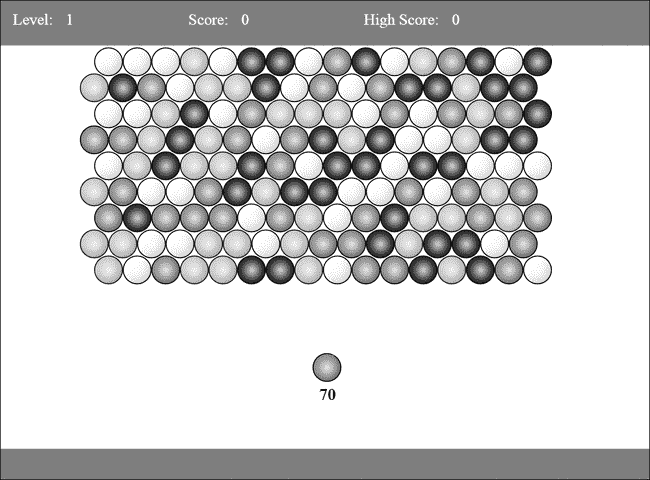
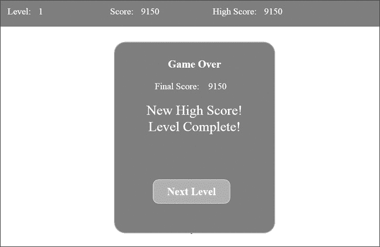
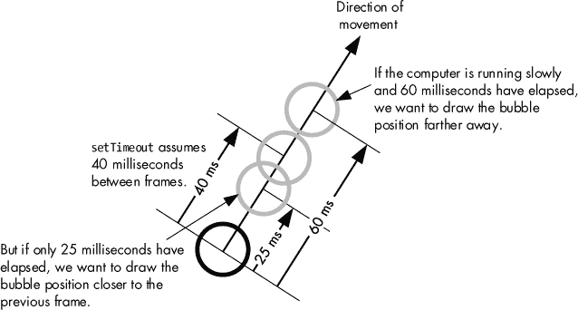

# 第七章. 关卡、声音与更多

在这一章中，我们将为*Bubble Shooter*添加一些收尾工作，并讲解 HTML5 的更多功能。现在，气泡网格可能会迅速填满整个页面，导致玩家没有空间发射气泡。为了防止这种情况发生，我们将设置当玩家向棋盘底部添加超过两行时，游戏结束。我们还将使用本地存储 API 实现多个关卡和高分，利用`requestAnimationFrame`平滑动画，并通过 HTML5 为游戏添加声音。让我们从添加多个关卡和高分开始。

# 多个关卡和高分

完成一个关卡后，理论上可以通过清除所有气泡来完成，但如果你想重新开始游戏，则必须刷新浏览器。显然，这对于一款游戏来说是不令人满意的，而且还缺少一些其他的游戏流程元素：

+   有限的气泡供应（否则，玩家可以无限发射，导致气泡计数器显示负数！）

+   一个计分系统

+   关卡结束条件

+   后续关卡

游戏将为每个爆破的气泡奖励积分，这些积分将累计到玩家的分数中。我们已经拥有限制玩家气泡供应所需的信息，因为我们在计数气泡，尽管我们的计数可能会变成负数。为了添加多个逐渐增加难度的关卡，我们将在每个关卡给予玩家更少的气泡。

## 新的游戏状态变量

我们需要采取的第一步是整合气泡计数器并创建其他游戏状态变量。我们可以创建一个新对象来存储所有的游戏状态参数，例如玩家的分数、剩余气泡数、关卡编号等。或者，我们可以将这些作为变量存储在`Game`对象内部。我选择了后者，因为我们只需要追踪三个值。如果你需要追踪更多信息，或者追踪的信息更复杂，最好将数据存储在单独的对象中，以保持*game.js*尽可能简洁和易读。

让我们在`Game`类的顶部添加一些新变量，并根据关卡编号为玩家提供不同数量的气泡来完成关卡：

*game.js*

```
  var BubbleShoot = window.BubbleShoot || {};
    BubbleShoot.Game = (function($){
    var Game = function(){
      var curBubble;
      var board;
      var numBubbles;
      var bubbles = [];
      var MAX_BUBBLES = 70;
➊    **var POINTS_PER_BUBBLE = 50;**
➋    **var level = 0;**
➌    **var score = 0;**
➍    **var highScore = 0;**
      var requestAnimationID;
      this.init = function(){
        --*snip*--
      };
      var startGame = function(){
        $(".but_start_game").unbind("click");
        BubbleShoot.ui.hideDialog();
➎      numBubbles = MAX_BUBBLES **- level * 5;**
        board = new BubbleShoot.Board();
        bubbles = board.getBubbles();
        if(BubbleShoot.Renderer)
        {
          if(!requestAnimationID)
            requestAnimationID = setTimeout(renderFrame,40);
        }else{
          BubbleShoot.ui.drawBoard(board);
        };
        curBubble = getNextBubble();
        $("#game").bind("click",clickGameScreen);
      };
      --*snip*--
    };
    return Game;
  })(jQuery);
```

我们已经创建了新的变量来记录每个气泡的奖励积分 ➊、玩家当前的关卡 ➋、他们当前的分数 ➌，以及一个高分 ➍。当游戏开始时，我们会根据玩家已完成的关卡减少 5 个气泡 ➎。在第一个关卡，玩家将获得 70 个气泡，在第二个关卡，他们有 65 个，以此类推。

### 注意

*你可能会注意到我们在计算可用气泡数量时存在一些问题。首先，完成第 14 关是不可能的，因为此时用户将得到零个气泡。其次，之前的关卡也会变得非常困难。很难想象只用 20 或 30 个气泡就能完成一个关卡，更别提只有 10 或 15 个了！我将把这个问题的解决方案留给章节最后作为练习。*

## 显示关卡和分数

我们还没有地方来显示分数，所以我们将在 *index.html* 中添加一个 DOM 元素来显示分数，以及一个显示当前关卡和最高分的地方。屏幕顶部的条形区域是一个很好的布局位置来显示这些信息。新元素如图 Figure 7-1 所示。



图 7-1. 显示关卡、分数和最高分的屏幕布局

*index.html*

```
  <!DOCTYPE HTML>
  <html lang="en-US">
  <head>
    --*snip*--
  </head>
  <body>
  <div id="page">
    <div id="top_bar">
➊    **<div id="top_level_box" class="top_bar_box">**
        **<div id="top_level_label">Level:</div>**
        **<div id="level">1</div>**
      **</div>**
➋    **<div class="top_bar_box">**
        **<div id="top_score_label">Score:</div>**
        **<div id="score">0</div>**
      **</div>**
➌    **<div class="top_bar_box">**
        **<div id="top_score_label">High Score:</div>**
        **<div id="high_score">0</div>**
      **</div>**
    </div>
    --*snip*--
  </div>
  </body>
  </html>
```

添加了三个新的 `<div>` 元素：分别用于显示关卡数字 ➊、当前游戏分数 ➋ 和最高分 ➌。每个 `<div>` 都有一个元素来显示标签，然后是一个值。

这些也需要在 *main.css* 中定义样式：

*main.css*

```
  body
  {
    margin: 0;
  }
  #page
  {
    position: absolute;
    left: 0;
    top: 0;
    width: 1000px;
    height: 738px;
  }
    #top_bar
    {
      position: absolute;
      left: 0;
      top: 0;
      width: 1000px;
      height: 70px;
      background-color: #369;
      color: #fff;
    }
➊    **.top_bar_box**
      **{**
        **font-size: 24px;**
        **line-height: 60px;**
        **float: left;**
        **margin-left:20px;**
        **width: 250px;**
      **}**
➋      **.top_bar_box div**
        **{**
          **float: left;**
          **margin-right: 20px;**
        **}**
  --*snip*--
```

我没有单独为这三个元素分别设置样式；相反，我给它们分配了一个共同的类 `top_bar_box` ➊。基础的 CSS 样式为每个元素设置了 250 像素的宽度，并将其浮动到左侧，因此这些元素会在 `top_bar` 内部排列成一行，位于屏幕顶部。每个元素显示的标签和值都放在一个 `<div>` 中，因此其样式直接应用在这个 `<div>` 上，而不需要创建新的 CSS 类 ➋。

现在让我们为玩家奖励一些分数，并显示他们的分数和关卡。当气泡被戳破或孤立时，需要奖励并显示分数，游戏开始时也应该显示分数和关卡值。首先，我们需要在 *ui.js* 中编写函数，将这些值绘制到屏幕上。我们将它们放在 *ui.js* 中，以便继续保持 *game.js* 不包含显示代码：

*ui.js*

```
  var BubbleShoot = window.BubbleShoot || {};
  BubbleShoot.ui = (function($){
    --*snip*--
    var ui = {
      --*snip*--
➊    **drawScore : function(score){**
        **$("#score").text(score);**
      **},**
➋    **drawHighScore : function(highScore){**
        **$("#high_score").text(highScore);**
      **},**
➌    **drawLevel : function(level){**
        **$("#level").text(level+1);**
      **}**
    };
    --*snip*--
    return ui;
  } )(jQuery);
```

`drawScore` ➊ 和 `drawHighScore` ➋ 接受分数值并将其绘制到屏幕上相关的 `<div>` 中。`drawLevel` 写入关卡数字，但首先会加 1，因为内部关卡状态从零开始 ➌。虽然这三个函数都只有一行代码，但最好为它们创建独立的函数，并且像这样编写 `ui.drawScore(score)`，而不是每次更新分数时都写 `$("#score").text(score)`。然后，如果你想在元素变化时添加视觉效果，可以只在一个函数中进行修改，而不必追踪每个更新分数的地方。如果你希望分数在每次增加时闪烁，那么你只需要在一个地方进行修改。

现在我们将这些函数调用添加到 *game.js* 的 `startGame` 和 `clickScreen` 中：

*game.js*

```
  var BubbleShoot = window.BubbleShoot || {};
    BubbleShoot.Game = (function($){
    var Game = function(){
      --*snip*--
      var startGame = function(){
        $(".but_start_game").unbind("click");
        BubbleShoot.ui.hideDialog();
        numBubbles = MAX_BUBBLES;
        board = new BubbleShoot.Board();
        bubbles = board.getBubbles();
        if(BubbleShoot.Renderer)
        {
          if(!requestAnimationID)
            requestAnimationID = setTimeout(renderFrame,40);
        }else{
          BubbleShoot.ui.drawBoard(board);
        };
        curBubble = getNextBubble();
        $("#game").bind("click",clickGameScreen);
➊      **BubbleShoot.ui.drawScore(score);**
        **BubbleShoot.ui.drawLevel(level);**
      };
      var clickGameScreen = function(e){
        var angle = BubbleShoot.ui.getBubbleAngle(curBubble.getSprite(),e,board.
          calculateTop());
        var duration = 750;
        var distance = 1000;
        var collision = BubbleShoot.CollisionDetector.findIntersection(curBubble,
          board,angle);
        if(collision){
          var coords = collision.coords;
          duration = Math.round(duration * collision.distToCollision / distance);
          board.addBubble(curBubble,coords);
          var group = board.getGroup(curBubble,{});
          if(group.list.length >= 3){
            popBubbles(group.list,duration);
            var orphans = board.findOrphans();
            var delay = duration + 200 + 30 * group.list.length;
            dropBubbles(orphans,delay);
➋          **var popped = [].concat(group.list,orphans);**
➌          **var points = popped.length * POINTS_PER_BUBBLE;**
➍          **score += points;**
➎          **setTimeout(function(){**
              **BubbleShoot.ui.drawScore(score);**
            **},delay);**
          };
        }else{
          --*snip*--
        };
        --*snip*--
      };
      --*snip*--
    };
    return Game;
  })(jQuery);
```

我们在游戏开始时绘制分数和关卡 ➊。当气泡被消除时，我们首先要生成一组所有被消除且孤立的气泡。这通过连接两个数组——已消除的列表和孤立的列表 ➋ 来完成，然后将 `POINTS_PER_BUBBLE` 乘以新数组的长度 ➌。接着，我们内部增加分数 ➍，但只有在气泡在 `delay` 结束时射击完成后，才会更新显示 ➎。如果你重新加载并开始游戏，你的分数应该会递增。

接下来，我们将检查游戏结束条件。两种状态可能导致游戏结束：玩家可能用尽气泡，或者玩家可能清空了棋盘上的所有气泡。如果是前者，我们希望显示玩家的最终得分，并让他们从第一关开始新游戏。如果是后者，我们希望清空棋盘，增加关卡数，并提示开始下一关。

我们知道游戏状态只会在玩家射出气泡后改变，所以我们唯一需要检查是否存在游戏结束条件的地方是碰撞结果计算之后。我们将在气泡射出后立即进行检查，这个过程发生在 `Game` 中的 `clickGameScreen` 内。如果棋盘为空或玩家已用尽气泡，我们将结束游戏；如果没有，我们将给玩家下一个要射击的气泡。请在 *game.js* 中做如下更改：

*game.js*

```
  var BubbleShoot = window.BubbleShoot || {};
    BubbleShoot.Game = (function($){
    var Game = function(){
      --*snip*--
      var clickGameScreen = function(e){
        --*snip*--
        BubbleShoot.ui.fireBubble(curBubble,coords,duration);
➊      **if(numBubbles == 0){**
          **endGame(false);**
➋      **}else if(board.isEmpty()){**
          **endGame(true);**
➌      **}else{**
          curBubble = getNextBubble(board);
        **}**
      };
      --*snip*--
    };
    return Game;
  })(jQuery);
```

我们首先检查玩家是否已经没有气泡 ➊，然后检查棋盘上是否没有气泡 ➋。如果都不成立，我们将像往常一样获取下一个气泡 ➌。一个名为 `endGame` 的新函数使用布尔值来判断玩家是赢了还是输了：`false` 表示玩家输了（因为气泡用完了），`true` 表示玩家赢了（因为清空了棋盘）。

注意调用 `board.isEmpty`，这是一个我们尚未编写的方法。现在让我们通过将以下内容添加到 *board.js* 类中来实现它：

*board.js*

```
var BubbleShoot = window.BubbleShoot || {};
BubbleShoot.Board = (function($){
  var NUM_ROWS = 9;
  var NUM_COLS = 32;
  var Board = function(){
    var that = this;
    --*snip*--
    **this.isEmpty = function(){**
      **return this.getBubbles().length == 0;**
    **};**
    return this;
  };
  --*snip*--
  return Board;
})(jQuery);
```

`isEmpty` 函数检查是否调用 `getBubbles` 方法返回任何对象。如果数组的长度为零，则说明所有气泡已被消除。

第二个可能的游戏结束条件是玩家在棋盘底部添加超过两行新行。我们已经有一个函数 `getRows` 用于返回行数组，所以我们只需要检查其长度是否大于我们允许的最大行数，即 11。

*game.js*

```
  var BubbleShoot = window.BubbleShoot || {};
    BubbleShoot.Game = (function($){
    var Game = function(){
    var curBubble;
    var board;
    var numBubbles;
    var bubbles = [];
    var MAX_BUBBLES = 70;
    var POINTS_PER_BUBBLE = 50;
➊  **var MAX_ROWS = 11;**
      --*snip*--
      var clickGameScreen = function(e){
        --*snip*--
        BubbleShoot.ui.fireBubble(curBubble,coords,duration);
➋      **if(board.getRows().length > MAX_ROWS){**
          **endGame(false);**
        **}else** if(numBubbles == 0){
          endGame(false);
        }else if(board.isEmpty()){
          endGame(true);
        }else{
          curBubble = getNextBubble(board);
        }
      };
      --*snip*--
    };
    return Game;
  })(jQuery);
```

为了使代码易于阅读，我们将允许的最大行数存储在一个名为 `MAX_ROWS` 的变量中 ➊，然后我们检查棋盘上的行数是否大于这个数字 ➋；如果是，我们将结束游戏。

我们还需要向玩家显示一些消息，指示胜利或失败、得分等。如果需要显示大量不同的消息，我们可能会编写一些 JavaScript 代码来动态创建和显示对话框。但我们只有几种变化，因此我们将它们硬编码到 HTML 中。我们将显示的对话框将与启动游戏时的对话框相同，但会有更多的信息，如图 7-2 所示。



图 7-2. 游戏结束对话框

现在让我们将结构添加到 *index.html* 文件中：

*index.html*

```
  <!DOCTYPE HTML>
  <html lang="en-US">
  <head>
    --*snip*--
  </head>
  <body>
  <div id="page">
    --*snip*--
    <div id="start_game" class="dialog">
      <div id="start_game_message">
        <h2>Start a new game</h2>
      </div>
      <div class="but_start_game button">
        New Game
      </div>
    </div>
➊  **<div id="end_game" class="dialog">**
      **<div id="end_game_message">**
        **<h2>Game Over</h2>**
➋      **<div id="final_score">**
          **<span>Final Score:</span>**
          **<span id="final_score_value"></span>**
        **</div>**
➌      **<div id="new_high_score">New High Score!</div>**
➍      **<div id="level_failed" class="level_failed">Level Failed!</div>**
➎      **<div id="level_complete" class="level_complete">Level Complete!</div>**
      **</div>**
➏    **<div class="but_start_game button">**
➐      **<span class="level_complete">Next Level</span>**
➑      **<span class="level_failed">New Game</span>**
      **</div>**
    **</div>**
  </div>
  </body>
  </html>
```

我们的游戏只会显示一个对话框 ➊，其中包含最终得分的消息 ➋，以及关卡是完成还是失败。如果玩家达到了新的高分，我们将显示该消息 ➌。Level Failed! ➍ 或 Level Complete! ➎ 消息将根据情况显示。最后，一个按钮将启用下一场游戏的开始 ➏，这将导致进入下一关 ➐ 或全新游戏 ➑。我们可以在点击按钮后确定是重新开始游戏还是继续进行，因为我们知道当前的关卡编号。

当我们显示 `end_game` 对话框时，我们将根据需要显示或隐藏 `level_complete` 或 `level_failed` 类，以显示正确的消息。注意，`level_complete` 类附加在 Level Complete! 消息 ➎ 和 Next Level 按钮 ➐ 上，而 `level_failed` 类则附加在 Level Failed! 消息 ➍ 和 New Game 按钮 ➑ 上。这使我们可以通过一次 jQuery 调用隐藏所有 `level_failed` 元素：

```
$(".level_failed").hide();
```

这是使用 HTML 和 CSS 构建用户界面的一个优点，之所以可行，是因为*泡泡射手*是一个相对简单的游戏。但是，即便你需要在对话框中展示更多的消息，仍然可以使用 jQuery 来创建 DOM 元素并利用 CSS 进行样式设置。

对话框将继承 `dialog` 类定义中的一些样式，但我们需要向 *main.css* 添加更多的定义：

*main.css*

```
#final_score
{
  margin: 26px 0;
}
  #end_game_message span
  {
    margin-right: 20px;
    font-size: 24px;
  }
  #level_complete,#level_failed,#new_high_score
  {
    font-size: 36px;
    color: #fff;
  }
```

我们现在要在 *game.js* 中创建 `endGame` 函数。这个函数将显示游戏结束的对话框，显示适当的胜利或失败消息，然后允许玩家继续玩下一关或重新开始新游戏：

*game.js*

```
  var BubbleShoot = window.BubbleShoot || {};
    BubbleShoot.Game = (function($){
    var Game = function(){
      --*snip*--
      var renderFrame = function(){
        --*snip*--
      };
      **var endGame = function(hasWon){**
➊      **if(score > highScore){**
➋       **highScore = score;**
➌       **$("#new_high_score").show();**
➍       **BubbleShoot.ui.drawHighScore(highScore);**
        **}else{**
➎        **$("#new_high_score").hide();**
        **};**
➏      **if(hasWon){**
          **level++;**
➐     **}else{**
          **score = 0;**
          **level = 0;**
        **};**
➑      **$(".but_start_game").click("click",startGame);**
➒      **$("#board .bubble").remove();**
        **BubbleShoot.ui.endGame(hasWon,score);**
      **};**
    };
    return Game;
  })(jQuery);
```

首先，我们检查玩家的分数是否高于 `highScore` 的值，`highScore` 初始值为零 ➊。如果是，`highScore` 将更新 ➋，并且我们会在游戏完成对话框中显示 `new_high_score` 元素 ➌。然后调用 `ui.drawHighScore`，这是我们在更新游戏内得分显示时创建的 ➍。如果没有新的高分，消息将被隐藏 ➎。

接下来的分支检查玩家是否获胜，如果是的话 ➏，则将 `level` 增加 1。如果玩家失败，`score` 和 `level` 会重置为零 ➐。接着，我们需要通过将 `click` 事件绑定到 `startGame` 按钮上 ➑ 来重新启用它，清除显示中的其余气泡 ➒，并调用 *ui.js* 中的一个新方法来显示游戏结束的对话框。

请注意，无论玩家是玩第一个关卡还是第五十个关卡，这都无关紧要，因为 `startGame` 只是绘制当前关卡并开始游戏；因此，我们不需要为新关卡创建一个新函数。

但是，显示并不是游戏中唯一需要响应游戏结束的部分。玩家也不应该再能发射气泡！我们还需要在 *ui.js* 中创建一个名为 `endGame` 的函数。与 *game.js* 中的 `endGame` 处理结束关卡的游戏逻辑方面不同，*ui.js* 中的代码将处理结束游戏的视觉方面，如显示对话框并填充玩家的分数：

*ui.js*

```
  var BubbleShoot = window.BubbleShoot || {};
  BubbleShoot.ui = (function($){
    --*snip*--
    var ui = {
      --*snip*--
      **endGame : function(hasWon,score){**
➊      **$("#game").unbind("click");**
➋      **BubbleShoot.ui.drawBubblesRemaining(0);**
➌      **if(hasWon){**
          **$(".level_complete").show();**
          **$(".level_failed").hide();**
        **}else{**
          **$(".level_complete").hide();**
          **$(".level_failed").show();**
        **};**
➍      **$("#end_game").fadeIn(500);**
        **$("#final_score_value").text(score);**
      **}**
    };
    --*snip*--
    return ui;
  } )(jQuery);
```

当游戏结束时，`endGame` 方法确保在游戏区域的点击 ➊ 不再触发 `clickGameScreen` 函数，因为我们不希望玩家在游戏结束后继续发射气泡。它还会将剩余气泡的显示更新为零 ➋，并在对话框内显示正确的胜负消息 ➌。然后，我们展示带有“关卡完成！”或“关卡失败！”信息的对话框 ➍。

# 高效结束关卡

目前，*Bubble Shooter* 的游戏结束可能有点乏味：玩家被迫继续发射气泡，直到它们组合成足够大的群体来爆破。如果气泡的颜色组合不正确，这也可能会成为问题。例如，如果板上的唯一气泡是蓝色的，而随机生成器只生成红色气泡，玩家可能会因无法避免的原因而失败！与其让玩家清除每个气泡，我们会在他们清除完除最上面一排剩余的五个气泡外的所有气泡时，快速结束游戏。当这种情况发生时，剩下的顶行气泡将会爆破，其他气泡会像孤立群体一样掉落（使用 `kaboom` 例程）。

预见并缓解玩家的挫败感

永远提前考虑你的游戏可能会让玩家感到挫败的地方，并提前解决这个问题。这样，你就能改善游戏体验，让玩家愿意回头继续玩。在 *Bubble Shooter* 中，某些关卡可能因为气泡没有按正确顺序出现而无法完成。这种情况是一个完美的例子，说明了在原始游戏设计中没有考虑到的可能结果——在这种情况下，剩下一个气泡在板上且无法爆破——会发生什么。游戏编程几乎总是迭代性的，你的第一个版本很少是最终版。

在我们计算出当前需要消除的泡泡集合后，每当玩家消除泡泡时，我们会检查剩余的泡泡数量。如果玩家射击泡泡后，棋盘上剩余五个或更少的泡泡，我们会免费消除这些泡泡，并直接带玩家进入游戏结束界面。

判断关卡是否接近完成的检查将会放在`clickGameScreen`函数中，位置在*game.js*文件里：

*game.js*

```
  var BubbleShoot = window.BubbleShoot || {};
    BubbleShoot.Game = (function($){
    var Game = function(){
      --*snip*--
      var clickGameScreen = function(e){
        --*snip*--
        if(collision){
          var coords = collision.coords;
          duration = Math.round(duration * collision.distToCollision /
            distance);
          board.addBubble(curBubble,coords);
          var group = board.getGroup(curBubble,{});
          if(group.list.length >= 3){
            popBubbles(group.list,duration);
➊          **var topRow = board.getRows()[0];**
➋          **var topRowBubbles = [];**
            **for(var i=0;i<topRow.length;i++){**
              **if(topRow[i])**
                **topRowBubbles.push(topRow[i]);**
            **};**
➌          **if(topRowBubbles.length <= 5){**
➍            **popBubbles(topRowBubbles,duration);**
➎            **group.list.concat(topRowBubbles);**
            **};**
            var orphans = board.findOrphans();
            var delay = duration + 200 + 30 * group.list.length;
            dropBubbles(orphans,delay);
➏          var popped = [].concat(group.list,orphans);
            var points = popped.length * POINTS_PER_BUBBLE;
            score += points;
            setTimeout(function(){
              BubbleShoot.ui.drawScore(score);
            },delay);
          };
        }else{
          --*snip*--
        };
        --*snip*--
      };
      --*snip*--
    };
    return Game;
  })(jQuery);
```

首先，我们获取最上面一行的泡泡 ➊，然后我们遍历这一行，统计泡泡的数量 ➋。如果存在五个或更少的泡泡 ➌，我们会消除这一行的所有泡泡 ➍，并将它们加入已消除泡泡的列表 ➎，这样它们就会计入玩家的得分 ➏。

现在你应该能够完成一个完整的游戏关卡，清除棋盘，并看到提示开始下一关。恭喜！你刚刚完成了第一个完整可玩的游戏。

但是在你把*泡泡射手*展示给其他玩家之前，先让我们确保高分在每次游戏会话间持久保存，而不是每次关闭浏览器窗口时都重置。毕竟，如果不能回来挑战高分，那高分还有什么意义呢？

# 使用 Web 存储保持高分

尽管*泡泡射手*没有服务器端组件来保存高分，但我们可以利用 HTML5 提供的 Web 存储系统将高分保存到本地计算机中。使用相同浏览器再次游戏的玩家将看到上次的高分，这给他们提供了一个挑战目标。

*泡泡射手*是一个休闲游戏：玩家会打开它，玩几个关卡直到失败，然后关闭浏览器标签。记住高分是个不错的主意，但我们不需要保留其他数据。无论如何，即使你要存储更多信息，使用 Web 存储来保持数据从一个游戏会话到另一个会话的持久性原理也是一样的。

## Web 存储与 Cookies

在客户端，Web 存储的行为与 Cookies 类似，但实现细节（以及优点）大不相同。Web 存储比 Cookies 更容易访问，因为数据以名称/值对的形式存储。与 Cookies 不同，Web 存储的内容不会通过 HTTP 请求传输，因此没有服务器端访问权限。存储的内容受域名限制，不同的子域名拥有不同的存储空间。我们本可以将高分存储在 Cookie 中，但没有必要这么做，存储格式以及每次请求时不必要地将数据传输到服务器的开销，使得 Cookie 比 Web 存储更不合适。尝试将大量数据（例如当前棋盘的布局）存储在 Cookie 中也可能导致性能问题，因为这些数据会随每个请求一起传输到服务器。例如，当浏览器尝试下载一个仅几 KB 的图像文件时，可能还会不得不把大量多余的数据一起发送给服务器。

而 Web 存储提供的空间比 cookies 更多，尽管在 HTML 规范中并未定义具体数量，浏览器厂商单独设定了该限制。目前，主流浏览器之间的最低共同限制是 5MB；该限制适用于一个域名下的所有数据。桌面版 Google Chrome、Firefox 和 Internet Explorer 9 提供最多 10MB 的存储，而安卓设备的浏览器仅提供 2MB。与最大 cookie 存储量（每个 cookie 4KB，最多可存储 300 个）相比，即使在最低限制下，Web 存储提供的空间也大得多。

由于浏览器限制可能会定期变化，如果你打算将大量数据存储到 Web 存储中，最好的做法是测试特定设备；然而，对于像 *Bubble Shooter* 这样的高分这种小型元素，空间限制不重要。

## 向 Web 存储中添加数据

Web 存储分为两部分：会话存储（Session Storage）和本地存储（Local Storage）。我们只看本地存储，它最适合在会话间持久化数据。存储和访问数据的原则在会话存储中大体相同，尽管持久性和安全性有所不同。顾名思义，会话存储仅在浏览器会话期间有效，用户关闭浏览器窗口时数据会消失。这种存储方式可能对多页面的 Web 应用程序有用，其中数据需要从一页传递到下一页，但显然不适合存储高分。一旦你熟悉了本地存储，你就能够在需要使用会话存储时适应它。

向`localStorage`添加数据的格式如下：

```
localStorage.setItem(key,value);
```

`key`是一个字符串，例如`"high_score"`，`value`也是一个字符串，或者是可以自动转换为字符串的数字或其他对象。需要注意的是，如果你尝试传入复杂对象，如数组，转换为字符串可能会得到对象的名称（即`Array`），而不是你想要存储的数据。因此，如果有疑问，最好自己进行转换。对于更复杂的数据，可以使用`JSON.stringify`保存对象，使用`JSON.parse`来检索它们。

要检索数据，你只需要`key`：

```
var value = localStorage.getItem(key);
```

`localStorage.getItem`总是返回字符串值，因此你需要使用`parseInt`或`parseFloat`将其转换为数字数据。

如果游戏更复杂或需要更长时间来玩，你可能希望保存更多数据，比如当前关卡以及最高分。在这种情况下，我们可以继续添加字符串：

```
localStorage.setItem("high_score",highScore);
localStorage.setItem("level",level);
```

或者我们可以创建一个对象并对其进行 JSON 编码：

```
var gameData = {high_score : highScore, level : level};
localStorage.setItem("bubbleshoot_data",JSON.stringify(gameData));
```

然后，当我们想要检索数据时，我们会使用这个：

```
var gameData = JSON.parse(localStorage.getItem("bubbleshoot_data"));
```

一般原则是，如果你能将数据转换为字符串，并且在需要检索数据时从字符串中解码它，你就可以将数据保存到本地存储中。

在*泡泡射手*游戏中，为了保存最高分，Local Storage 条目将被命名为`high_score`。在游戏初始化时，我们需要检查是否已有现有的值存储，如果有的话，就使用该值替代当前硬编码的零。当玩家创造新纪录时，我们会将 Local Storage 中的值更新为新的最高分。

在*game.js*中，我们将对`init`和`endGame`进行修改，以获取并设置最高分：

*game.js*

```
  var BubbleShoot = window.BubbleShoot || {};
    BubbleShoot.Game = (function($){
    var Game = function(){
      --*snip*--
      this.init = function(){
        if(BubbleShoot.Renderer){
          BubbleShoot.Renderer.init(function(){
            $(".but_start_game").click("click",startGame);
          });
        }else{
          $(".but_start_game").click("click",startGame);
        };
➊      **if(window.localStorage && localStorage.getItem("high_score")){**
➋        **highScore = parseInt(localStorage.getItem("high_score"));**
        **}**
➌      **BubbleShoot.ui.drawHighScore(highScore);**
      };
      --*snip*--
      var endGame = function(hasWon){
        if(score > highScore){
          highScore = score;
          $("#new_high_score").show();
          BubbleShoot.ui.drawHighScore(highScore);
➍        **if(window.localStorage){**
➎          **localStorage.setItem("high_score",highScore);**
          **}**
        }else{
          $("#new_high_score").hide();
        };
        if(hasWon){
          level++;
        }else{
          score = 0;
          level = 0;
        };
        $(".but_start_game").click("click",startGame);
        $("#board .bubble").remove();
        BubbleShoot.ui.endGame(hasWon,score);
      };
    };
    return Game;
  })(jQuery);
```

首先，我们检查浏览器是否支持`localStorage`，通过使用另一个 Modernizr 检测器，查看是否存在`high_score`的值 ➊。如果存在最高分，我们将`highScore`设置为存储中的内容 ➋。我们确保将该值用`parseInt`包装，因为存储中的值是以字符串形式返回的，而我们想要使用整数。然后，我们展示最高分 ➌。为了保存分数，我们在`endGame`中添加一行，检查是否支持`localStorage` ➍，然后将数据保存到其中 ➎。

重新加载浏览器并玩一局游戏。首先，任何你得到的分数应该都会成为新的最高分。但如果你关闭浏览器并重新加载游戏，最高分应该会显示为你之前的值。

你还可以使用 Web Storage 来保存像语言偏好、玩家档案或游戏状态进度等内容。只要注意你存储的内容，因为存储系统中的值可以被 JavaScript 控制台调用。这意味着没有什么能阻止那些技术比较熟练的玩家自己更新数据！在下一章，我们会简要讨论 HTML5 游戏中的安全问题，但目前我们可以依赖这样一个事实：实际上没有人有动力设定一个不可能的高分来挑战。

# 使用 requestAnimationFrame 平滑动画

我们在*jquery.kaboom.js*中使用`setTimeout`来计时动画，并在*泡泡射手*的画布版本中触发帧更新。`setTimeout`具有跨浏览器兼容性，且相对简单：将超时值设置为 40 毫秒，就可以达到每秒 25 帧的效果。

然而，使用`setTimeout`也有一些缺点。主要的问题是，如果浏览器正忙于其他任务，下一个迭代可能会延迟超过 40 毫秒。在某些情况下，可能需要更长时间，而用户会开始注意到这一点。

我们可以重新编码移动逻辑，使得对象的移动距离与自上次更新以来的时间成正比，从而有效地忽略 40 毫秒的时间间隔。但我们仍然需要接受这样一个事实：无论我们将超时延迟设置为多少，一些配置较差的设备可能无法跟上。在能够处理更快更新的系统上，我们可以显示更流畅的动画，但如果我们将超时值设置为 10 毫秒以应对这些情况，较慢的系统就会出现负面效果。

幸运的是，HTML5 引入了`requestAnimationFrame`，它是`setTimeout`的替代方案，更适合动画。浏览器不会让程序员去猜测可能适用的帧率，而是每当准备好绘制新更新时，调用传递给`requestAnimationFrame`的函数。更新之间的时间可能比 40 毫秒快得多（或慢得多！），但至少我们知道我们既不会让处理瓶颈变得更糟，也不会让系统空闲着，而是可以利用额外的处理周期来平滑动画。

## 关于帧更新的新视角

在切换到`requestAnimationFrame`时，我们需要以不同的方式思考帧更新。目前，*在*`setTimeout`运行之前，我们告诉浏览器等待多长时间。我们假设经过的时间就是我们预计要经过的时间。例如，在*jquery.kaboom.js*中的`moveAll`函数中，我们设置了一个 40 毫秒的超时：

```
setTimeout(moveAll,40);
```

然后，我们假设已经过去了 40 毫秒——1/25 秒——并更新气泡的位置。然而，在使用`requestAnimationFrame`时，我们并没有指定帧率。在*jquery.kaboom.js*中的`moveAll`函数中，如果`requestAnimationFrame`每 40 毫秒运行一次这个例程，我们就不需要做任何改变。但如果它每 20 毫秒运行一次，我们就不能保持相同的`dx`和`dy`值，否则我们的整个动画将运行得更快——实际上是两倍的速度，因为它会以两倍的频率增加`dx`和`dy`。

相反，我们需要找出已经过去了多少毫秒，然后调整我们的动画步长。我们甚至可以将相同的数学方法应用于`setTimeout`动画，从而在不支持`requestAnimationFrame`的旧浏览器上获得更好的效果。如图 7-3 所示，自上次绘制气泡以来经过的时间越少，我们就需要沿路径移动气泡的距离越少。



图 7-3. 不同帧率下的气泡位置

## 代码兼容性与 Polyfill

Modernizr 将帮助我们构建`setTimeout`的回退。由于`requestAnimationFrame`仍然被许多浏览器视为标准之前的技术，因此为 Webkit、Mozilla 等提供了带前缀的版本，而 Modernizr 可以为我们填充这些前缀。将以下内容添加到*game.js*：

*game.js*

```
var BubbleShoot = window.BubbleShoot || {};
  BubbleShoot.Game = (function($){
  var Game = function(){
    --*snip*--
  };
  **window.requestAnimationFrame = Modernizr.prefixed("requestAnimationFrame",**
    **window) || function(callback){**
    **window.setTimeout(function(){**
      **callback();**
    **}, 40);**
  **};**
  return Game;
})(jQuery);
```

这一行新代码表示，如果`requestAnimationFrame`（如有必要，带厂商前缀）已定义，则将`window.requestAnimationFrame`设置为`requestAnimationFrame`的内容。如果`requestAnimationFrame`没有定义，则我们创建一个新函数，接受一个函数作为参数，并在 40 毫秒后使用`setTimeout`调用该函数。

这种技术被称为 *polyfill*。Polyfill 尝试在浏览器中模拟或补充新功能，尤其是那些浏览器原生不支持的功能，让你在代码中使用新技术，而不必总是担心需要分叉代码或自行提供回退方案。这个名字来自填充物 Polyfilla，因为这种技术涉及填补浏览器支持的空白。

Polyfills 被编写来支持旧版浏览器中的各种功能。例如，为了存储玩家的最高分，我们使用了本地存储 API。这在旧版浏览器中不可用，但我们可以通过将数据存储在 cookie 中来实现相同的效果。有两种方法可以解决这个问题：一种方法是每次访问本地存储时编写 `if/else` 语句，检查是否存在本地存储，如果没有，就分支执行一些 cookie 代码。另一种方法是创建一个名为 `localStorage` 的对象，并为 `getItem` 和 `setItem` 方法添加使用 cookies 存取数据的功能。

Polyfills 很少是完美的解决方案：`setTimeout` 和 `requestAnimationFrame` 的操作方式非常相似，但有时这些差异可能是重要的。在本地存储的例子中，我们也许可以像使用本地存储一样使用 cookies，但如果我们尝试存储大量数据，就会遇到问题。Polyfills 可以增强浏览器兼容性，而无需大量代码，但了解你使用的 polyfill 的局限性也很重要。

一旦我们有了 `requestAnimationFrame` 的 polyfill，就像其他代码一样，我们可以在任何浏览器中使用 `requestAnimationFrame`。我们知道实际上 `setTimeout` 调用在幕后运行，有时动画可能不会像原生支持的 `requestAnimationFrame` 方法那样平滑运行。但是从调用它的代码角度来看，该函数的行为是一样的。

现在我们有了一个可用的 `requestAnimationFrame` polyfill，我们可以将 *game.js* 中对 `setTimeout` 的调用替换为 `startGame` 和 `renderFrame` 中对新函数的调用：

*game.js*

```
var BubbleShoot = window.BubbleShoot || {};
  BubbleShoot.Game = (function($){
  var Game = function(){
    --*snip*--
    var startGame = function(){
      --*snip*--
      if(BubbleShoot.Renderer)
      {
        if(!requestAnimationID)
          requestAnimationID = **requestAnimationFrame(renderFrame);**
      }else{
        BubbleShoot.ui.drawBoard(board);
      };
      --*snip*--
    };
    --*snip*--
  var renderFrame = function(){
    $.each(bubbles,function(){
      if(this.getSprite().updateFrame)
        this.getSprite().updateFrame();
    });
      BubbleShoot.Renderer.render(bubbles,board.calculateTop());
      requestAnimationID = **requestAnimationFrame(renderFrame);**
    };
    --*snip*--
  };
  --*snip*--
  return Game;
})(jQuery);
```

我们必须在 *jquery.kaboom.js* 中做类似的修改，使用 `requestAnimationFrame` 替代 `setTimeout`。`kaboom` 函数内部假设每帧之间的间隔是 40 毫秒，从而实现每秒 25 帧的帧率，但如我们现在所知，使用 `requestAnimationFrame` 时，间隔时间可能会有所不同。同样，我们需要计算已经过去的时间，并按比例计算运动：

*jquery.kaboom.js*

```
  (function(jQuery){
    var defaults = {
      gravity : 1.3,
      maxY : 800
    };
    var toMove = [];
➊  **var prevTime;**
    var moveAll = function(){
➋    **var newTime = Date.now();**
➌    **var elapsed = newTime - prevTime;**
➍    **var frameProportion = elapsed / 25;**
➎    **prevTime = newTime;**
      var stillToMove = [];
      for(var i=0;i<toMove.length;i++){
        var obj = toMove[i];
        obj.x += obj.dx * frameProportion;
        obj.y -= obj.dy * frameProportion;
        obj.dy -= obj.config.gravity * frameProportion;
        if(obj.y < obj.config.maxY){
          obj.elm.css({
            top : Math.round(obj.y),
            left : Math.round(obj.x)
          });
          stillToMove.push(obj);
        }else if(obj.config.callback){
          obj.config.callback();
        }
      };
      toMove = stillToMove;
      if(toMove.length > 0)
➏      **requestAnimationFrame(moveAll);**
    };
    jQuery.fn.kaboom = function(settings)
  {
    var elm = this;
    var config = $.extend({}, defaults, settings);
    if(toMove.length == 0){
      **prevTime = Date.now();**
➐    **requestAnimationFrame(moveAll);**
    };
    var dx = Math.round(Math.random() * 10) - 5;
    var dy = Math.round(Math.random() * 5) + 5;
    toMove.push({
      elm : this,
      dx : dx,
      dy : dy,
      x : this.position().left,
      y : this.position().top,
      config : config
    });
  };
})(jQuery);
```

首先，我们定义一个名为 `prevTime` 的空变量 ➊，用来存储上次渲染的帧的时间戳，初始值为 null。每次调用 `moveAll` 时，我们获取当前时间戳 ➋ 并计算自上次帧以来经过的时间 ➌。我们最初的计算基于已经经过了 40 毫秒，因此为了计算正确的位置，我们相应地缩放帧的经过比例 ➍。如果只有 8 毫秒已经过去，`frameProportion` 将是 0.2，动画会更新得更小且更频繁。如果已经过去 80 毫秒，`frameProportion` 将是 2，动画会以较大的步伐更新。最终效果是，不管帧率如何，气泡都需要相同的时间才能从屏幕上掉落。为了准备下一个帧，我们将 `prevTime` 更新为当前时间戳 ➎。

此外，`setTimeout` 在两个地方被 `requestAnimationFrame` 替代：一次是在动画开始时 ➏，一次是在每个帧循环时 ➐。

重新加载游戏并再次运行它，确保它正常工作。除非你有特别慢的浏览器设置，否则你可能不会看到性能上的差异。然而，现在你可以放心地知道，所有玩 *Bubble Shooter* 的玩家都将看到气泡以相同的速度移动和掉落，即使不同设备之间的帧更新率有所不同。

# 使用 HTML5 添加声音

没有声音，游戏就不像游戏！HTML5 提供了一些越来越强大的选项来处理和播放音频。我说 *越来越强大* 是因为浏览器的支持一直在不断提升。你可以逐字节操作波形文件、从麦克风录音、进行动态混音，并利用许多其他功能，远远超过 HTML 以前提供的可悲的音频选项。让我们看看 HTML5 音频的基本功能。

## HTML5 音频 API

历史上，HTML 实现音频的方式非常差，没有提供可靠的方式来在网页中嵌入和控制声音。HTML5 改变了这一点，你可以通过一个简单的标签将声音直接嵌入页面，如下所示：

```
<audio src="sounds.mp3" autoplay></autoplay>
```

单独来看，这对于一个我们希望以编程方式启动和停止声音的游戏帮助不大，因为声音需要响应像气泡爆炸这样的事件。幸运的是，HTML5 还提供了一种通过 JavaScript API 播放音频的方法，完全不需要使用 HTML 标签。

上述 HTML 片段的 JavaScript 等效版本，它仅嵌入并播放一个单一的文件，如下所示：

```
var sound = new Audio("sounds.mp3");
sound.play();
```

你可以使用任何 MP3 文件来试试这个示例。传递给`new Audio`调用的参数是声音文件的 URL。如果你把它放在*bubbleshoot*文件夹中，并将参数更改为文件名，你可以在 JavaScript 控制台中运行前面的命令，声音应该会播放。

当声音结束时，它会自然停止，你可以使用 `stop` 方法在播放的任何时刻停止声音：

```
sound.stop()
```

这些是我们需要的唯一命令，但可以花时间浏览音频 API 规范，了解浏览器中声音传输的更多潜力。除了影响音频基本播放的各种方法和属性（例如更改音量或跳转到文件中的特定位置）外，还有许多功能，如从输入设备录音、混音、改变立体声，甚至是 3D 声音定位，以及后期处理音效以添加回声等效果。这些功能越来越多地被主流浏览器支持，例如 Google Chrome 和 Firefox，每个新版本都会带来改进。

如果你想同时播放多个声音，必须创建多个 `Audio` 对象。例如：

```
var sound1 = new Audio("sounds.mp3");
var sound2 = new Audio("sounds.mp3");
sound1.play();
sound2.play();
```

如果只是想依次播放不同的声音，你可以通过更改 `Audio` 对象的 `src` 属性来重用该对象。但是，要同时播放多个声音，你需要为计划同时播放的每个声音创建一个 `Audio` 对象。正如你在 *Bubble Shooter* 中看到的那样，这意味着如果我们想要打破一组 20 个气泡，我们需要 20 个声音对象来同时播放这 20 个气泡破裂的声音。

## 打破气泡：配上声音

我们将使用音频 API 向 *Bubble Shooter* 添加 HTML5 音频支持，使每次气泡被打破时都会播放声音。从 *[`www.buildanhtml5game.com/`](http://www.buildanhtml5game.com/)* 下载 *pop.mp3* 文件，并将其放入游戏文件夹中的一个名为 *_mp3* 的新文件夹中。

首先，创建一个类来播放声音。我们将把 HTML5 音频功能封装在我们自己的代码中，这样可以防止在不支持 HTML5 音频的浏览器中抛出错误。在 *_js* 文件夹中创建一个名为 *sounds.js* 的新文件，然后将其添加到 *index.html* 中。声音处理（如渲染和用户界面）是一个功能模块，最好在可能的情况下将其与游戏逻辑分开。通过创建一个单独的文件来处理播放，我们可以将所有音频处理代码集中在一个地方。

我们将重用 `Audio` 对象，因此会在代码初始化时创建这些对象。然后，每当需要播放声音时，我们就从队列中取出下一个对象，将 `src` 属性更改为我们想播放的文件，然后播放它。我们将设置一个最大同时播放声音数为 10，这是一个较小的数字，但即使在极少数情况下，玩家一次打破超过 10 个气泡，也不需要播放超过 10 个声音。

*sounds.js*

```
  var BubbleShoot = window.BubbleShoot || {};
  BubbleShoot.Sounds = (function(){
➊  var soundObjects = [];
➋  for(var i=0;i<10;i++){
      soundObjects.push(new Audio());
    }
➌  var curSoundNum = 0;
➍  var Sounds = {
➎    play : function(url,volume){
        if(Modernizr.audio){
➏        var sound = soundObjects[curSoundNum];
➐        sound.src = url;
➑        sound.volume = volume;
➒        sound.play();
➓        curSoundNum++
          if(curSoundNum >= soundObjects.length){
            curSoundNum = curSoundNum % soundObjects.length;
          }
        }
      }
    };
    return Sounds;
  })();
```

一个名为 `BubbleShoot.Sounds` 的新对象包含了数组 `soundObjects` ➊，我们将用它来存储十个 `Audio` 对象。这些对象在代码加载后立即初始化 ➋。我们还通过变量 `curSoundNum` ➌ 来追踪当前使用的对象。

接下来，我们创建一个对象来播放声音 ➍，它包含一个方法来播放声音 ➎。它将接受两个参数：要播放的声音文件的 URL 和播放声音的音量值，音量值是一个在 0（静音）和 1（最大音量）之间的十进制数。

我们使用 Modernizr 来检查是否支持 HTML5 音频，如果支持，我们就从`soundObjects`数组中获取当前的`Audio`对象 ➏，将其`src`属性设置为要播放的文件的 URL ➐，设置它的音量 ➑，然后播放它 ➒。如果不支持音频，该方法将不做任何操作，但由于我们检查了`Modernizr.audio`，因此不会抛出错误。

最后，我们增加`curSoundNum`的值 ➓，这样下一次调用`play`时，我们就能从队列中获取下一个对象。然后，我们确保`curSoundNum`的值永远不会大于`soundObjects`数组中`sound`对象的数量。

如果我们想播放更多的声音，可以将更多的`Audio`对象推入`soundObjects`数组。目前，如果我们尝试一次播放超过 10 个声音，只有最后 10 个声音会被播放。

音效控制将在*game.js*中通过调用`BubbleShoot.Sounds.play`函数来完成：

*game.js*

```
  var BubbleShoot = window.BubbleShoot || {};
  BubbleShoot.Game = (function($){
    var popBubbles = function(bubbles,delay){
      $.each(bubbles,function(){
          var bubble = this;
          setTimeout(function(){
            bubble.setState(BubbleShoot.BubbleState.POPPING);
            bubble.animatePop();
            setTimeout(function(){
              bubble.setState(BubbleShoot.BubbleState.POPPED);
            },200);
➊          **BubbleShoot.Sounds.play("_mp3/pop.mp3"**➋**,Math.random()*.5 + .5**➌**);**
          },delay);
          board.popBubbleAt(bubble.getRow(),bubble.getCol());
          setTimeout(function(){
            bubble.getSprite().remove();
          },delay + 200);
          delay += 60;
        });
      };
      --*snip*--
    };
    --*snip*--
    return Game;
  })(jQuery);
```

我们希望播放与气泡数量相同的声音，并且还希望在启动动画的同时开始播放声音➊。我们将`Sounds`的播放方法传入两个参数：要播放的 MP3 文件的相对 URL ➋ 和音量值，它是一个在 0.5 到 1 之间的随机数 ➌。

增加沉浸感的多样性

为什么我们要传递一个随机的音量值？试着传入一个值为 1 并弹出一些气泡。然后将这个效果与随机值的效果进行比较。这只是一个小的变化，但音量的变化提供了足够的差异，使得每个声音听起来稍微不那么机械。我们还可以做其他事情使效果更加自然，比如使用一组声音而不是仅仅一个 MP3 文件，这样就不会每个气泡都听起来一样，或者调整爆泡的时间间隔，让它们不再是均匀间隔的。通过实验来创造最具沉浸感的体验，并以最小的努力做到这一点，是随着你开发更多游戏，你会变得更加熟练的任务。

# 总结

现在，我们已经有了一个简单的声音来增添一些气氛，你已经完成了*Bubble Shooter*的构建！这个游戏应该可以在较旧的浏览器上运行，使用 CSS 进行定位和动画，并且在支持`canvas`元素的较新浏览器上也能正常运行。我们有持久的高分和音频，并且我们已经以这样的方式开发了动画，使得无论玩家的系统速度如何，它们都应该表现良好。

在下一章中，我们将探索一些与您刚刚构建的游戏不直接相关的 HTML5 的其他部分。你将学习如何将游戏部署到 Web 和移动环境，并且你将了解 HTML5 的未来发展方向。

# 进一步练习

1.  在每个关卡结束时，玩家的棋盘上只能剩下 1、2 或 3 种颜色的气泡。如果给他们一个无法与这些颜色匹配的气泡，会导致玩家浪费一次射击，并使游戏更难完成。修改气泡生成算法，使得玩家只能获得可能形成匹配的气泡。例如，如果只剩下红色和蓝色气泡，发射的气泡应该是红色或蓝色。你需要修改 *game.js* 中的 `getNextBubble` 方法，并从 `Board` 对象中现有的气泡类型中选择一个 `type`。

1.  正如在多个关卡与高分中所提到的，游戏在经过几个关卡后会变得无法继续，因为允许的气泡数量变得过小。为了避免每个关卡减少五个气泡的设定，可以创建一个算法，使得关卡逐渐变难，但仍然可以完成。比如，玩家能完成一个关卡所需的最少气泡数为 30，我们希望他们在第 15 关达到这个难度。在这之前，从第 1 关到第 2 关的气泡减少量可能是 5 个，而从第 14 关到第 15 关的减少量可能仅为 1 个。编写一个方程或其他方法来减少允许的气泡数量，并以此方式增加难度。

1.  通过为完成度评分而不是当前的通过或失败条件来激励玩家重复关卡。你可以在玩家通关时奖励 1 星，如果他们在剩余超过 25% 气泡的情况下通关，奖励 2 星；如果他们仅用一半的气泡完成关卡，奖励 3 星。向关卡完成对话框中添加信息，显示玩家获得了多少星。

1.  一旦添加了前述的星级系统，创建一个方法来存储玩家在每个关卡中获得的星数。这样你就可以不仅显示玩家获得的星数，还可以在他们打破之前的最佳成绩时，显示一条消息。目前，我们将剩余气泡数、玩家得分和当前关卡号作为变量存储在 `Game` 中。但现在，最佳的方法可能是创建一个对象，存储每个关卡并记录星数。将这些数据保存到 Local Storage 中，以便玩家下次返回游戏时使用。

1.  编写一个 polyfill 来为旧版浏览器添加 Local Storage 支持，使用 cookies 实现。如果 `window.localStorage` 对象不存在，你需要创建它，并实现 `getItem` 和 `setItem` 方法。
