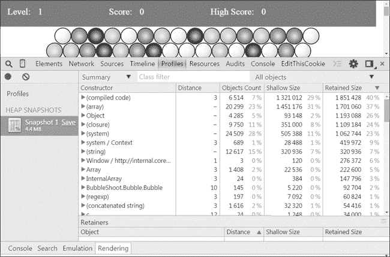
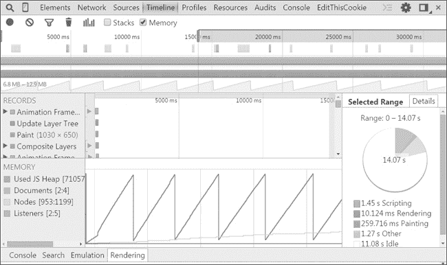
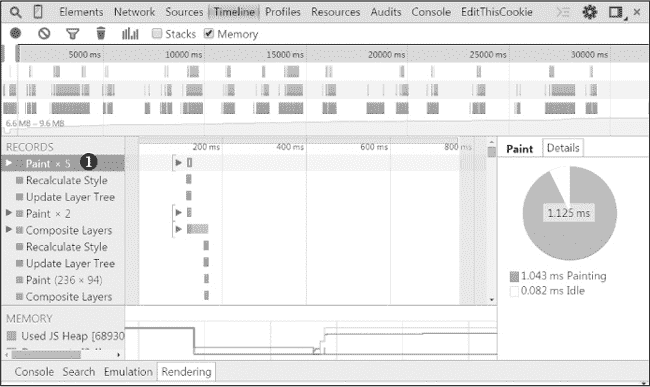

# 第八章：HTML5 的下一步

除了图形方面的进步外，HTML5 还有许多其他特性，使其成为一个强大的游戏开发环境。在本章中，我将讨论其中的一些特性，帮助你了解可用的功能，并为进一步阅读提供一些有用的资源。其中一些特性，例如 WebGL，是值得单独成书的主题，而另一些则只对某些类型的游戏有用。因此，我这里只介绍这些概念，具体的深入探索留给你自己去做。

# 保存和检索数据

人们像玩 *Bubble Shooter* 这样的游戏时，通常是在短时间内进行的，并且几乎没有或没有持久数据；实际上，我们的游戏只保存从一次会话到下一次会话的最高分。目前，最高分是存储在 Web Storage 中，因此它对游戏所在的浏览器是唯一的。为了保存一个全局的最高分并显示最高分表，我们需要编写一个服务器端组件，将分数发送到服务器并检索一个最高分列表。

更复杂状态的游戏也应该有服务器端访问。当你将状态存储在服务器上时，玩家可以从多个设备返回到相同的游戏。为了我们的目的，我们将使用两种主要方式在服务器上保存和检索数据：AJAX 和 WebSockets。

## AJAX

*AJAX（异步 JavaScript 和 XML）* 提供了一种向服务器发送请求并接收响应的技术。AJAX 不是单一的技术，而是一种将多种经过验证的浏览器功能结合起来，以进行服务器端调用和管理响应的方法。所有主流浏览器已经支持 AJAX 多年。

尽管 *X* 代表 XML，但你可以使用 AJAX 检索 HTML 数据、字符串数据和可以解析和解释的 JSON 字符串。AJAX 调用的代码有详细的文档，并且有多个库可以使用，因此你不必手动编写调用代码。例如，以下是如何使用 jQuery 中的 `$.ajax` 调用向服务器发送 AJAX 请求的方式：

```
    $.ajax({
➊    url : "save_data.php",
➋    data : "high_score =" + highScore,
➌    type : "POST",
➍    complete : function(data){
        console.log(data);
    }
  });
```

这个 `$.ajax` 调用向相对 URL *save_data.php* 发起一个 `POST` 请求，将 `highScore` 中的值以 `high_score` 为名称发送到服务器，并将服务器的响应记录到控制台。我设置了请求的目标 URL ➊，发送的数据 ➋，请求类型 ➌，以及请求完成后运行的函数 ➍，但你可以设置许多其他属性，包括在出现错误时运行的函数、超时设置等。这些属性在 jQuery 文档中的 *[`api.jquery.com/`](http://api.jquery.com/)* 有列出。

### 注意

*AJAX 中的 A 代表* 异步 *，因为在服务器处理数据并发送响应时，其他 JavaScript 操作将继续进行。这意味着你无法确定 `complete` 函数何时运行：它会在响应返回时执行，但在此过程中，用户界面仍会保持响应。虽然可以进行同步调用，但由于这样会在请求完成之前冻结整个页面，因此用户体验通常很差，所以这种做法通常被认为是不推荐的。*

## WebSockets

大多数现代浏览器也支持 WebSockets 用于客户端与服务器之间的调用。WebSockets 是一种相对较新的技术，已被纳入 HTML5 规范。如果你想了解它们如何工作，超越我在此描述的内容，可以从 Mozilla 开发者网络的文档开始，网址是 *[`developer.mozilla.org/en/docs/WebSockets/`](https://developer.mozilla.org/en/docs/WebSockets/)*。

WebSockets 类似于 AJAX，但不同的是，AJAX 在客户端和服务器之间建立了一个请求-响应的关系，而 WebSocket 在它们之间保持持久的连接。客户端处理响应时会立刻处理，并且 JavaScript 代码可以持续监听后续的响应。服务器也会在套接字连接保持打开时持续监听；因此，当客户端和服务器之间涉及大量小数据交换时，WebSockets 比 AJAX 要好得多。

持久连接在多人游戏环境中尤其有用。在 WebSockets 出现之前，更新多个客户端共享的游戏状态元素（例如玩家角色在环境中的状态）的主要方式是通过 AJAX 不断轮询服务器并检查是否有更新。这通常会被编写成每隔几秒钟执行一次，显然这对于实时游戏来说并不足够。人们尝试了各种技巧，例如 *长轮询*，它有效地欺骗客户端保持与服务器的连接，以改善这一过程，但这些方法通常在服务器资源方面效率不高。现在，你只需保持 WebSocket 连接打开，每当某个客户端更新游戏状态时，服务器就能立即更新所有其他客户端的信息，而不需要等待下一个更新周期。

主流浏览器对 WebSockets 的支持不断提升，和 AJAX 一样，我推荐使用库来消除打开连接、发送和监听数据、以及处理错误的繁琐细节。库还通常会为 WebSockets 不被支持的情况提供回退机制，回退机制可能会使用 AJAX 或其他服务器通信方法；然而，回退机制可能无法复制你最初使用 WebSockets 所希望达到的性能特性，因此要注意它们并不是万能的解决方案。

Socket.IO (*[`socket.io/`](http://socket.io/)*) 是最流行的 WebSocket 库之一。以下是如何使用它进行调用：

```
var socket = io.connect("http://localhost");
  socket.emit("new_high_score", {
    high_score : highScore
  });
});
```

这段代码使用 `io.connect` 调用库打开一个新的 WebSocket，然后 `socket.emit` 将 `highScore` 值作为名为 `new_high_score` 的事件发送。

WebSocket 和像 Socket.IO 这样的库比 AJAX 更具功能性，但使它们易于使用的库通常假设一个特定的服务器端环境。如果你打算使用 WebSocket，检查你计划使用的库是否有与你的服务器环境匹配的后端组件。大多数平台的库都可以轻松找到，无论你使用的是 Node.js、.NET 还是 Java。

除了与服务器发送和接收数据外，你可能还想在主游戏程序之外处理某些数据。这时，Web Worker 将会派上用场。

## Web Worker

浏览器中的 JavaScript 通常被认为是 *单线程* 环境，这意味着一次只能运行一个脚本。大多数时候这不会引起问题，但如果一个特别大的计算过程阻塞了处理器，导致动画无法播放、用户输入无法响应以及其他重要任务无法执行时，就可能成为问题。

比如，假设处理游戏级别数据需要浏览器花费 1 到 2 秒，每隔大约 30 秒就会发生一次。整体负载可能不高，但你不能每隔 30 秒就暂停游戏！在这种情况下，可以考虑使用 Web Worker。

Web Worker (*[`developer.mozilla.org/en/docs/Web/API/Worker/`](https://developer.mozilla.org/en/docs/Web/API/Worker/)*）允许你在独立的线程中运行代码，而不会阻塞你的主 JavaScript 操作。它们之所以被称为“Worker”，是因为你基本上可以把一个任务交给它们，让它们在完成后报告结果。浏览器将决定给它们多少 CPU 时间，以避免对其他进程造成不必要的干扰。Worker 可以是专用的或共享的，但通常你会发现专用的 Worker 更加有用，尤其是在 Web Worker 跨浏览器支持逐步完善的过程中。

Web Worker 有几个规则，使它们与常规 JavaScript 区别开来。最重要的是，它们无法访问 DOM、浏览器文档或浏览器窗口。Worker 也在自己的作用域内运行，因此你需要显式传递数据，然后在完成时获取结果。我将通过以下示例来说明它们是如何工作的。

Worker 通过将要加载的脚本名称传递给 `new Worker` 命令来初始化：

```
var worker = new Worker("work.js");
```

这将启动一个新的 Worker，Worker 将在 *work.js* 中运行脚本。

当你通过 `postMessage` 发送消息时，Worker 会开始运行：

```
worker.postMessage();
```

`postMessage` 命令可以包含一个 JavaScript 对象，也可以为空。

你可以通过向调用脚本中的 Worker 添加事件监听器来处理响应——当 Worker 完成任务时返回的值：

```
worker.addEventListener("message", function(e) {
  console.log(e.data);
}, false);
```

在这里，`e` 包含了 `worker` 返回的数据。需要监听的事件是标记为 `"message"` 的任何有效字符串。因此，`worker` 可以根据不同的情况发送不同的响应，或者它可以继续工作并发送消息。

在 worker 内部，事件监听器的模型类似，`worker` 自我指代为 `this` 或 `self`。举个例子，*work.js* 可能包含如下内容来返回消息：

```
self.addEventListener("message", function(e) {
  self.postMessage({
    message : "I'm done now"
  });
}, false);
```

这段代码监听标记为 `"message"` 的事件，并在收到事件后立即以对象的形式发布响应。

目前，并非所有主流浏览器都足够好地支持 Web Workers 以使其可靠。确实存在 Web Workers 的 Polyfills，但如果一个原本认为是非阻塞的长期运行过程突然使游戏冻结几秒钟，这些 Polyfills 往往会对用户体验产生负面影响。然而，情况正在不断改善，希望 Web Workers 很快会成为 HTML5 游戏开发者工具箱的核心部分。

更有效地管理你的数据只是让游戏更有趣的开始。外观也很重要，若要进行图形升级，你可以使用 WebGL 实现 3D，或者甚至利用它提升 2D 游戏的渲染能力。

# WebGL

对于 *Bubble Shooter* 的 canvas 版本，我们使用了 2D 渲染上下文，通过类似以下的调用方式来访问：

```
var context = canvas.getContext("2d");
```

正如我在第六章中提到的，`"2d"`的规范意味着还可以使用其他选项，有时根据浏览器支持情况，确实如此。第三维度通过 WebGL 访问，WebGL 是一个 API，提供了一组 3D 操作函数，用于创建场景、添加光照和纹理、定位相机等，利用现代显卡提供的加速功能。（访问 *[`www.khronos.org/registry/webgl/specs/1.0/`](https://www.khronos.org/registry/webgl/specs/1.0/)* 了解更多关于 WebGL 的详细信息。）要开始使用 WebGL，我们首先通过以下方式实例化一个 3D 上下文：

```
var context = canvas.getContext("webgl");
```

这有时会以 `"experimental-webgl"` 的形式返回，因此最兼容的调用是：

```
var context = canvas.getContext("webgl")
  || canvas.getContext("experimental-webgl");
```

加速的 WebGL 足够强大，可以显示完全渲染的 3D 场景，与原生游戏的场景相媲美。缺点是，工作在三维空间中，操作和创建场景需要大量的数学运算，以及大量低级代码，需要直接向图形处理器编写程序。其概念与在原生代码（如 C++）中创建 3D 游戏相同，并且需要具有 3D 建模的低级知识，以描述物体的形状；纹理来定义表面图案；以及着色器，用于描述当光线照射到表面时如何渲染它。因此，我强烈推荐使用现有的库来处理模型渲染、任何物理需求，以及基本上你能从现成工具中获得的任何功能。Babylon.js (*[`www.babylonjs.com/`](http://www.babylonjs.com/)*) 和 PlayCanvas (*[`playcanvas.com/`](https://playcanvas.com/)*) 是两个可以大大简化在浏览器中使用 WebGL 的库。

使用 WebGL 还引出了如何将对象和纹理导入 3D 场景的问题。通常，你会在建模软件中创建模型，如 3D Studio 或 Maya，然后导出为常见支持的格式。WebGL 库通常不支持这些格式，因此你通常需要使用其他工具集将原始 3D 建模文件格式转换为 JSON，例如 3DS Max 到 Babylon.js 的导出工具 (*[`github.com/BabylonJS/Babylon.js/tree/master/Exporters/3ds%20Max`](https://github.com/BabylonJS/Babylon.js/tree/master/Exporters/3ds%20Max)*)，它可以将 Autodesk 的 3D Studio 产品导出为 Babylon.js 格式。

创建和转换 3D 模型是一个庞大的任务，以至于 WebGL 游戏开发很快就成为了开发者和设计师团队的项目，而非单个开发者的任务；然而，许多非常令人印象深刻的演示是完全由单人完成的，Babylon.js 网站上有一组很棒的展示。

WebGL 上下文的一个次要优势是，你可以使用它来渲染 2D 场景，这样就能利用 GPU 加速带来的巨大速度。粒子效果和在加速的 WebGL 中渲染大量屏幕元素的表现，远远超过了 canvas 中执行相同任务的效果。

我推荐你寻找能够在 WebGL 中启用 2D 渲染的现成库。一个这样的库是 Pixi.js (*[`www.pixijs.com/`](http://www.pixijs.com/)*)，它还提供了对 canvas 的回退支持。

浏览器对 WebGL 的支持正在增长，包括最新版本的 Chrome、Firefox 和 Internet Explorer，尽管在写这篇文章时，旧版本的 Internet Explorer 不兼容。因此，WebGL 目前不被认为适合大规模市场开发，但这种情况正在持续改善。

创建一款精美的游戏固然很好，但没有玩家，游戏就没有意义。要让玩家访问，你需要将游戏部署到一个公开可访问的地方。根据部署的位置，你应该考虑做出一些改变，以提升玩家的体验。

# 部署 HTML5 游戏

在本节中，我将简要概述在桌面和移动浏览器中运行游戏的部署过程，并解释如何将 HTML5 应用程序封装为本地移动应用程序。

## 在桌面浏览器中运行全屏

部署 HTML5 游戏的一种方式是创建一个网站并上传它。事实上，只需将*泡泡射手*上传到 Web，就能让任何访问 *index.html* 文件的人都能玩这个游戏。将 HTML5 游戏部署到 Web 与部署任何其他网站没有什么不同；然而，玩家常常抱怨在浏览器中玩游戏时缺乏沉浸感，因为很容易被显示 Facebook、电子邮件、即时消息等通知的标签页所打扰。HTML5 提供了一个解决这些中断的技巧：全屏 API。

在支持的环境下，全屏 API 允许网页填满整个屏幕的宽度和高度，去除地址栏和其他浏览器框架元素。你可以通过运行以下 JavaScript 代码来实现全屏功能。出于安全原因，你需要在用户生成的事件处理程序内运行此代码；也就是说，通常你会为玩家创建一个按钮，或指定一个按键来激活全屏模式。

```
if(document.body.requestFullScreen) {
  document.body.requestFullScreen();
} else if(document.body.mozRequestFullScreen) {
  document.body.mozRequestFullScreen();
} else if(document.body.webkitRequestFullScreen) {
  document.body.webkitRequestFullScreen();
} else if(document.body.msRequestFullScreen){
  document.body.msRequestFullScreen();
}
```

请注意在实现 `requestFullScreen` API 时使用了供应商前缀（Firefox 使用 `mozRequestFullScreen`，Chrome 使用 `webkitRequestFullScreen`，等等）。当你调用 `requestFullScreen` 时，用户应该会看到浏览器弹出对话框，询问是否允许或拒绝游戏请求进入全屏。如果玩家允许全屏，按下 ESC 键应该会将他们返回到常规视图。

你还可以将全屏模式应用于 DOM 中的单个元素。如果你的网站中有运行中的游戏，并且包含导航到其他页面的功能，你可能想这样做。这样，玩家可以进入全屏模式，去除导航栏和其他页面杂物的干扰。你甚至可以将全屏模式应用于*泡泡射手*。只需添加一个新的工具栏按钮，当玩家点击该按钮时运行以下代码：

```
if(document.body.requestFullScreen) {
  $("#page").get(0).requestFullScreen();
}else if(document.body.mozRequestFullScreen) {
  $("#page").get(0).mozRequestFullScreen();
}else if(document.body.webkitRequestFullScreen) {
  $("#page").get(0).webkitRequestFullScreen();
}else if(document.body.msRequestFullScreen){
  $("#page").get(0).msRequestFullScreen();
}
```

我将把这部分留给你自己实现，并建议你将其添加到*ui.js*中，以便与其他用户界面代码一起管理。但如果你不想将其部署到你自己的网站，可以尝试使用托管服务。你可以在 Facebook 上设置一个应用程序，或者将游戏上传到专门的游戏网站，例如 Kongregate。

当然，跨平台开发和部署的承诺是 HTML5 最吸引人的特点之一，而且因为大多数桌面浏览器的功能已经移植到移动浏览器，*泡泡射手*应该能够在两者上都顺利运行。然而，不同平台之间的行为并不完全相同，接下来我将讨论这些差异。

## 在移动浏览器中运行

即使你仍然在本地或开发 Web 服务器上运行*泡泡射手*，你也应该能够在移动浏览器中加载并玩这个游戏。它的表现应该与在桌面浏览器上一样好。恭喜你，你刚刚制作了第一个移动游戏！

### 注意

*如果你还没有发布游戏，你也可以在* [`buildanhtml5game.com/bubbleshooter/`](http://buildanhtml5game.com/bubbleshooter/) *上玩它。*

在为移动设备开发游戏时，你更有可能需要做的是可用性和界面方面的调整，而不是技术上的修改，但这并不意味着你可以完全忽视实现上的变化。你将从了解这些细微的行为差异和如何优化移动用户体验中受益，所以让我们开始吧。

### 触摸事件

首先，触摸屏设备上的浏览器实现了特定的触摸事件。这些事件中有两个是`touchstart`和`touchend`，它们大致等同于`mousedown`和`mouseup`。然而，`click`事件在触摸屏环境中略有不同。移动浏览器会等待几百毫秒，以确定用户是否进行双击（即放大操作），以确保用户确实打算进行单次`click`。在*泡泡射手*中，这不会有太大区别，但在快速反应类游戏中，这几百毫秒的延迟对于玩家来说是可以察觉的。

你可以使用移动设备特有的事件，这些事件在没有触摸屏的桌面设备上会被忽略，尽管大多数情况下，使用`mousedown`将与`touchstart`效果相同，`mouseup`则等同于`touchend`。例如，在*泡泡射手*中，我们可以使用`mousedown`代替`click`来检测玩家何时想要发射泡泡，这样会将*game.js*中的这一行变成：

```
$("#game").bind("click",clickGameScreen);
```

改为以下这行代码：

```
$("#game").bind("mousedown",clickGameScreen);
```

唯一的效果是，玩家点击鼠标按钮或触摸屏幕时，泡泡会立即发射，而不是等待鼠标按钮释放或手指离开屏幕。

### 注意

*如果只使用鼠标和触摸事件，将会移除键盘的可访问性，特别是如果你的游戏本来可以用键盘控制的话。在某些游戏中，你可能仍然希望使用点击事件，以便玩家仍然可以使用键盘或其他输入设备导航菜单系统。*

如果你知道你的游戏只会在移动设备上玩，你也可以使用`touchstart`：

```
$("#game").bind("touchstart",clickGameScreen);
```

这应该与`mousedown`的效果相同。

那么你可能会想，既然 `touchstart` 和 `touchend` 与 `mousedown` 和 `mouseup` 几乎等价，那它们存在的意义是什么？答案是，在大多数情况下，你可以将它们视为概念上的等价物，但触摸事件在你需要同时检测多个触摸点时非常有用。用户通常只有一个鼠标指针，但在触摸屏上，可以在多个位置进行触碰。如果你正在构建一个需要这种输入的游戏，触摸事件是你要使用的，而你也需要找到方法在鼠标环境中使它们生效。

### 缩放

另一个交互差异出现在缩放操作上。你可能不希望玩家在游戏区域进行缩放，无论他们是否双击。幸运的是，你可以通过向 HTML 头部添加 `<meta>` 标签来限制这一点：

```
<meta name="viewport" content="user-scalable=no, initial-scale=1,
maximum-scale=1, minimum-scale=1, width=device-width, height=device-height" />
```

这个示例告诉浏览器将页面按 1:1 的比例渲染，并将视口宽度设置为设备的默认值。`<meta>` 标签的内容指定了显示的大小，并限制（或允许）缩放。这个 `<meta>` 标签最初是由 Apple 引入的，其他浏览器也以它为基础实现自己的行为。因此，Apple 自己的文档 (*[`developer.apple.com/library/ios/documentation/AppleApplications/Reference/SafariWebContent/UsingtheViewport/UsingtheViewport.html`](https://developer.apple.com/library/ios/documentation/AppleApplications/Reference/SafariWebContent/UsingtheViewport/UsingtheViewport.html)*) 是查看各种选项描述的最佳地方。然而，使用这个标签实际上就是查找任何特定移动浏览器的预期行为，然后测试它在实际中的效果。目前，CSS 正在进行视口大小的标准化工作 (*[`www.w3.org/TR/css-device-adapt/`](http://www.w3.org/TR/css-device-adapt/)*)，但目前浏览器支持有限。

在 `<meta>` 标签中，你最常用的选项是 `user-scalable=no`，它简单地防止用户进行缩放。但改变 `<meta>` 标签中的其他值也会极大地影响浏览器如何显示你的游戏。`<meta>` 标签中的设置如下：

+   ****`user-scalable`****。可以是 yes 或 no。允许或禁用缩放。

+   ****`initial-scale`****。一个小数，指定绘制视口时的缩放因子。

+   ****`maximum-scale`****。一个表示允许用户缩放到的最大缩放比例的小数。

+   ****`minimum-scale`****。一个表示允许用户缩放到的最小缩放比例的小数。

+   ****`width`****。指定为像素值，或者使用 `device-width`。

+   ****`height`****。指定为像素值，或者使用 `device-height`。

如果游戏的设计宽度为 760 像素，例如，你可以将`width`设置为 760，浏览器将保持该宽度，并去除两侧多余的空白像素。不幸的是，通过缩放视口，你几乎肯定会遇到图像缩放和纵横比的问题；尝试在 1024 像素的屏幕上绘制 760 像素意味着需要进行一些锯齿化处理。

移动设备之间的纵横比变化比桌面屏幕要大得多。例如，iPad 1 和 2 的分辨率是 1024×768，iPad 3 是 2048×1536，iPhone 6 是 750×1334，iPhone 6 Plus 是 1080×1920，而 Android 设备的分辨率几乎与设备数量一样多。不幸的是，没有简单的解决方案。确保在各种设备上不断测试，并尝试结合使用`<meta>`属性和 CSS 布局，以确保你的游戏在不同的屏幕尺寸和纵横比上都能良好显示。

当然，即使你解决了纵横比问题，如果用户仍通过手机浏览器玩你的游戏，他们可能无法在离线状态下玩游戏。要真正将 HTML5 游戏部署到设备上，你需要将代码打包成原生应用程序。当你的游戏是原生应用时，用户应该能够在线或离线玩游戏，除非你的游戏本身就需要互联网连接。接下来我们来看看如何使用封装器服务。

## 部署为原生应用程序

你有两种主要方式将 HTML5 游戏部署为原生 Web 应用程序。你可以使用 Objective-C、Java 或目标平台要求的其他语言编写封装器，或者使用现有的封装器服务。除非你对原生移动编码非常熟练，否则我强烈建议你使用封装器服务。

封装器服务，如 PhoneGap/Cordova (*[`cordova.apache.org/`](http://cordova.apache.org/)* ) 和 Ludei (*[`www.ludei.com/`](https://www.ludei.com/)* )，虽然提供的控制较少，但通常可以访问原生功能，如加速计和应用内购买。有时它们甚至提供加速的图形功能和定制的 API。它们也需要更少的时间和精力，是构建测试部署的绝佳方式，这样你可以快速看到游戏在设备上运行的效果。除非你有非常充分的理由，否则我建议使用这些服务。

使用第三方封装器通常涉及通过在线服务上传你的 HTML5 代码，并为每个设备下载编译后的版本。这些服务实际上完成了与自定义封装器相同的工作，但经过多次迭代优化，通常支持多个平台。它们还不断为更新的手机和操作系统添加支持，而这些内容如果自己跟进是非常耗时的。此外，社区通常会编写插件提供额外的功能，例如提供应用内购买或访问设备的相机。

只需记住，无论你决定如何包装你的 HTML5 应用程序，文件都会在本地环境中运行；也就是说，你的游戏不需要通过网络或服务器下载资源。因此，即使没有网络连接，你的游戏仍然可以运行。如果你正在开发一款多人游戏，它需要活跃的互联网连接，但即便如此，你的游戏也将受益于更快的启动时间，并且（如果你的游戏很受欢迎）还能节省带宽费用。像往常一样，进行持续的迭代测试，以便在问题变成重大问题之前就加以发现。

这就是我关于移动设备的部分内容，但在桌面浏览器上，*Bubble Shooter* 足够简单，除非你在非常低配的机器上玩，否则你应该不会遇到性能问题。但在某个阶段，随着你开发更复杂的游戏，你会发现某些代码比预期运行得更慢，届时你就需要优化这部分代码。

# 优化

当你在优化游戏时，主要要关注的两个方面是内存管理和速度。特别是，你应该确保游戏在运行时间越长时，不会消耗越来越多的系统资源，同时你还需要充分利用现有的硬件和编程技巧来提升速度。

无论你是否遇到明显的问题，比如动画变慢，定期检查游戏的性能都是一个好习惯。通常，只有在遇到特定问题时，你才需要进行速度优化，但无论如何，保持对内存使用情况的关注始终是一个好习惯。例如，一个游戏在你玩五分钟时可能运行得很顺利，但如果你让它在浏览器标签页中保持开着几个小时，你可能会发现回到游戏时，漂亮的动画循环因为内存泄漏已经消耗了几十或几百兆字节的内存。对于较弱的移动设备来说，这可能是一个真正的问题。

幸运的是，浏览器工具可以帮助识别和诊断问题，你也可以实现一些编码技巧来修复这些问题或尽量减少问题发生的风险。良好的内存管理尤为重要，因此在我们继续进行速度优化之前，我们先来看一下这方面的内容。

## 内存管理

你可能不会期望一个小型的 JavaScript 游戏会在能够顺利运行大型 3D 游戏的系统上遇到内存问题，但内存管理实际上是 HTML5 游戏开发者面临的一个紧迫问题。问题不在于内存用完（尽管通过一些努力，确实有可能耗尽大量内存），而在于 JavaScript 分配和释放内存的方式。浏览器不会不断地分配和释放内存，而是定期进行清理操作，这可能会导致动画卡顿、界面无响应以及游戏流程中断等问题。

以节省内存的方式编写 JavaScript 是一个庞大的话题，浏览器厂商经常发布关于如何充分利用其系统的论文。例如，查看 Mozilla 关于内存管理的文档，链接为 *[`developer.mozilla.org/en-US/docs/Web/JavaScript/Memory_Management/`](https://developer.mozilla.org/en-US/docs/Web/JavaScript/Memory_Management/)*。你还可以阅读由 Chrome 工程师 Addy Osmani 编写的关于内存高效 JavaScript 的优秀介绍，链接为 *[`www.smashingmagazine.com/2012/11/05/writing-fast-memory-efficient-javascript/`](http://www.smashingmagazine.com/2012/11/05/writing-fast-memory-efficient-javascript/)*。

处理内存问题的关键是首先识别问题。你可能怀疑自己遇到了问题，但你需要知道问题出在哪里。主要的桌面浏览器都有帮助的工具。这些工具在不断发展，所以我不会深入讨论它们。但通过浏览每个浏览器的文档，应该能找到相关的文档和教程，比如 Chrome 的文档，链接为 *[`developer.chrome.com/devtools/docs/javascript-memory-profiling/`](https://developer.chrome.com/devtools/docs/javascript-memory-profiling/)*。

以下是三大浏览器中的操作步骤：

+   在 Chrome 中，打开开发者工具并点击**Profiles**。选择**Take Heap Snapshot**，然后点击**Take Snapshot**以检查内存中的对象，包括 DOM 元素。图 8-1 展示了 *Bubble Shooter* 的内存快照。

+   在 Firefox 中，你可以使用 Firebug 和其他插件来检查内存中的对象。你也可以在地址栏输入 **`about:memory`** 来查看当前浏览器内存的快照。

+   在 Internet Explorer 11 中，打开开发者工具并选择**Memory**工具。



图 8-1. 通过 Chrome 浏览器工具显示的 *Bubble Shooter* 内存快照

另一个有用的工具是可视化垃圾回收发生的时刻。它以一条时间轴上的图形形式呈现，你可以看到你的游戏占用了多少内存。图 8-2 展示了 *Bubble Shooter* 随时间的内存使用情况。

锯齿形的线代表在创建对象时使用的内存。当对象被创建时，线条上升，而在垃圾回收发生时，线条会急剧下降。尽管我们没有创建和销毁许多对象，但如果我们看到动画运行不流畅的问题，明显的迹象是我们可以考虑使用更多的对象池。

保持快速动画的关键是进行测试和迭代。这对于移动设备开发尤其重要，因为移动设备上的调试工具通常更难访问，而且内存和处理能力通常也更有限。如果你注意到间歇性的减速和动画冻结，且这些问题难以重现，那很可能是你遇到了内存问题，需要进行排查和解决。



图 8-2. *Bubble Shooter* 的内存使用情况

## 优化速度

内存是否成为问题，取决于你游戏的需求，而内存优化有时需要使用一些与编写可读、可复用代码相冲突的编码技巧。然而，通过遵循一般的最佳实践，优化速度通常会作为副作用自然实现。

JavaScript 引擎的速度一直在不断提升，浏览器的渲染引擎也是如此（尤其是在添加了 WebGL 之后）。但是，与垃圾回收一样，你仍然需要意识到性能瓶颈。浏览器厂商不会为你解决所有的性能问题。实际上，JavaScript 解释器变得如此快速，以至于性能问题更可能出现在渲染过程中，而不是其他地方；然而，编码技巧可以使 JavaScript 与机器码之间的转换更高效，从而加速操作，例如将图像数据传递给渲染引擎。

每次你在 DOM 中添加或更改一个元素时，浏览器都需要计算出需要绘制什么内容以及绘制的位置。HTML 文档最初是作为流式的、基于文本的文档设计的，浏览器会假设你发送给它的内容应该像任何其他网页一样进行布局。

但是，导致浏览器重新绘制显示的操作，如向屏幕添加新元素或更改元素的坐标，在游戏中是非常常见的。在 *Bubble Shooter* 中，我们可以随意添加和移除元素，因为屏幕上的元素相对较少。当屏幕上的元素数量增加 10 倍或 100 倍时，你会开始看到问题。记住，垃圾回收器需要清除任何从场景中删除的元素，而 DOM 元素通常是复杂的。

相比之下，`canvas` 元素在处理图形添加时没有昂贵的绘制操作，因为 `canvas` 内部不会发生重排。浏览器将 `canvas` 元素视为图像，这些图像只是从内存到屏幕的像素流。

### 注意

*更改 `canvas` 元素的属性，例如其位置或透明度，而不是其内部的像素，与更改其他 DOM 元素的代价相同。*

你可以通过在 Chrome 桌面浏览器中加载 *Bubble Shooter*，按 F12 打开开发者工具，然后导航到时间轴标签页，来查看浏览器绘制场景所花费的时间。点击底部控制栏中的 **记录**，重新加载游戏，然后点击顶部的 **事件** 栏，查看类似图 8-3 的视图。



图 8-3. 在 Chrome 中玩 *Bubble Shooter* 时涉及的浏览器事件

所有的绘制事件 ➊，例如图 8-3 中的那些，应该在屏幕上用绿色突出显示。在游戏的画布版本中，只有在加载完关卡后才会发生几次绘制调用，而在 CSS 版本中，这些调用会不断发生。

你可以使用时间轴工具来识别绘制事件发生的时刻，并将其最小化以加速游戏的渲染。只需要记住，不同浏览器可能在不同的时间重新绘制场景。像往常一样，使用可用的工具，但也要在目标平台和设备上进行测试，将其作为性能的主要指导。

一般来说，最小化 DOM 操作是减少绘制操作的关键。查找有关最小化浏览器重排和浏览器绘制操作的文章，获取有关渲染引擎内部工作原理的更详细和最新的信息。

# 安全性

如果你的游戏有任何类型的得分或进度系统，某人就会尝试作弊。但关键是评估作弊被系统突破的后果，并决定这些后果是否严重。对于 *Bubble Shooter* 来说，这不是问题：如果有人想在他们本地的机器上设置一个高分，那是他们的事。然而，对于有在线竞争元素或购买增强道具作为收入来源的游戏，你需要确保作弊变得极其困难甚至不可能。

我们可以通过几种方式来解决 HTML5 游戏中的安全问题。

## 不信任任何人

任何在客户端运行的游戏，无论是使用 HTML5、Flash 还是原生代码构建的，其简化的安全处理方式就是不信任客户端发送给服务器的任何数据。例如，使用 AJAX 和 Web-Sockets 示例中的高分值进行 POST 请求时，很容易被伪造。分数可能是有效的，但 POST 请求可能是伪造的，或者某人甚至可能使用调试工具在游戏运行时更改高分。服务器只看到接收到的数据，无法区分真实的请求和作弊请求。

不幸的是，不信任客户端通常是正确的方法：没有办法完全保证在客户端运行的代码的安全性。确保游戏安全的唯一方法是让所有游戏逻辑都由服务器处理。为了完全保护*Bubble Shooter*，我们将鼠标点击传递给服务器，让碰撞和爆炸逻辑在服务器上运行，然后将结果传回客户端进行动画处理。这种方法开发和测试起来更为困难，并且用户需要一个持续（且快速）的互联网连接才能玩游戏。

## 混淆

当游戏包含金融交易时，服务器端方法是必不可少的，但对于许多游戏来说，混淆已经足够好。混淆的理念是使作弊变得尽可能困难，基本上是让付出的努力超过得到的回报。例如，如果一个高分被作为编码值传送到服务器，附带一个校验和，并且需要花费数小时阅读代码才能破译它是如何生成的，作弊者不太可能付出所有的努力，仅仅是为了登上高分榜的顶部。

当然，混淆通常会以牺牲可读性为代价，既对你，也对黑客来说。但有很多方法可以让代码变得难以阅读，你甚至可以在构建后处理过程中应用其中一些方法。

最简单的选项是在你将代码打包到生产环境之前，使用一个*压缩工具*来处理代码。压缩工具会缩短代码中所有长变量名并去除空白符。例如，像这样的代码：

```
var highScore = 0;
highScore += 20;
```

压缩后变成类似这样的：

```
var highScore=0;highScore+=20;
```

本质上，压缩会去除空白符并将所有内容放到一行上。压缩后的代码很快变得难以阅读。你可以轻松地将行 breaks 还原。许多压缩工具还会重命名函数内部的变量。例如，这个函数：

```
var highScore = (function(){
  var highScore = 0;
  highScore += 20;
  return highScore;
});
```

可能会变得更小：

```
var highScore=function(){var a=0;return a+=20};
```

如果你在代码中一直调用的 `highScore` 属性现在被叫做 `a`，那么它将变得更难以找到！

### 注意

*压缩代码的额外好处是生成更小的代码，因此可以更快加载，这是在 Web 环境中部署时需要考虑的一个重要因素。实际上，你应该在所有 Web 应用程序中考虑压缩你的 JavaScript 代码。*

Google 发布了一个名为 Closure Compiler 的工具，它不仅作为一个压缩器，还提供了许多其他好处。它会尝试优化代码，甚至在某些地方重写代码，并输出比原始版本更小，有时甚至更快的代码。该编译器生成 JavaScript，分析你的代码并抛出错误。在使用像 Closure Compiler 这样的压缩工具时，声明变量、跟踪作用域并保持其他良好实践会有所回报，因为代码结构越清晰简洁，编译器提供的好处就越大。

你可以在线使用 Closure Compiler，或者下载并运行来自*[`developers.google.com/closure/compiler/`](https://developers.google.com/closure/compiler/)*的 Java 应用程序。一旦你能够访问它，粘贴你想要编译的 JavaScript 代码，然后复制输出结果。建议你保留原始代码的副本，因为如果你需要进行进一步修改，编译器输出将非常难以处理。

## 使用私有变量

除了构建后处理之外，你还可以以更难让作弊者跟踪代码并即时更改它的方式进行编码。例如，私有变量使得在控制台上操纵内部值变得更加困难。以下代码使用了一个私有的`highScore`变量：

```
var Game = function(){
  var highScore = 0;
  var getHighScore = function(){ return highScore;};
  return this;
};
```

该变量被视为私有的，因为它只存在于`Game`对象的作用域内。我们本可以将该变量公开，如下所示：

```
var Game = function(){
  this.highScore = 0;
  var getHighScore = function(){ return this.highScore;};
  return this;
};
```

这样就可以通过仅更改`highScore`属性的值来改变`Game`对象中`highScore`的值。然而，在私有版本中，无法从外部访问`highScore`的值。

如果`highScore`是私有的，作弊者将很难在不使用 Firebug 等程序添加断点的情况下更改其值。如果代码被压缩和混淆，他们就会更难做到。`highScore`实际上被标记为`"a"`，而且很难找到第一次更新高分的地方。

通过几个相对简单的步骤（使一些变量私有并压缩我们的代码），我们已经将潜在的作弊者范围缩小到那些仅懂一些 JavaScript 的玩家与那些对 JavaScript 非常熟悉并愿意花时间逆向工程我们的代码的人之间。现在，让我们再看一种防止作弊的方法。

## 验证校验和

你还可以通过使用校验和来验证传递给服务器的变量，从而保护信息。最简单的技术是对值进行编码，以便至少进行某些检查，确保数字是正确的。这不会消除作弊，校验和也不需要太复杂，但它会确保任何想作弊的人都需要先阅读并理解你的 JavaScript 代码。例如，如果我们将`highScore`传递给服务器，我们可能会 POST 类似这样的内容：

```
{
  highScore : 9825,
  check : 21
}
```

数值 21 是 9,825 对 129 取模的结果（或在代码中表示为`highScore%129`），其中 129 是我选择的一个数字，足够大以创建一系列校验值，同时也小于可能的高分。这种几乎微不足道的检查实际上增加了安全性，因为现在发布虚假高分的障碍不仅是知道如何发布，还需要能够追踪代码，直到`check`值被创建。一个经验丰富的 JavaScript 程序员可能会觉得这些步骤很简单，但普通的游戏玩家可能就不那么容易了。

前面的例子可能对你来说过于简单，你可以使用任何你喜欢的过程来生成校验和。常见的方法包括使用哈希函数，如 MD5、SHA 或 CRC32，尽管这些方法的缺点是，程序员通常能很好地识别其结构，知道他们正在查看的是标准的哈希函数。

原则上，你创建的任何可以生成一系列校验值的过程都会显著减慢速度，并可能劝阻大量潜在的作弊者。

当然，不管你做什么，仍然可能会遇到一些作弊者，因为有些黑客喜欢击败程序员的挑战，胜过击败游戏的挑战。你可以尽可能地混淆代码，可能最终会得到几乎无法阅读的代码。但请记住，你永远无法保证客户端代码的安全性，也永远不要完全相信从客户端传递到服务器的信息。

# 总结

正如你从本章中可能已经了解到的那样，浏览器对 HTML5 的支持是一个不断变化的领域。好消息是，浏览器通常趋向于统一标准，而不是增加自己的功能。同时，HTML5 的支持也在不断改善。

随着变化速度的加快，保持对哪些浏览器功能已准备好进入主流使用以及未来可能出现的新功能的关注非常重要。无论是性能提升、内存管理、声音，还是 3D 功能，HTML5 游戏的能力在不断进步。

# 进一步练习

1.  在桌面浏览器中为*Bubble Shooter*添加全屏功能。为了让切换尽可能简单，添加一个按钮到顶部栏，该按钮仅在支持全屏模式时才会显示。此外，修改 CSS，使得页面在全屏显示时，游戏居中。

1.  编写一个例程，使用 jQuery 的`ajax`方法将玩家的分数发布到一个虚拟服务器地址。在每一关结束时发布分数，并编写一个校验和函数，使用你选择的方法增加基本的安全性。

1.  查找并测试一些在线的压缩和混淆服务。比较输出代码的文件大小与原始源代码的大小。
