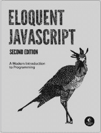
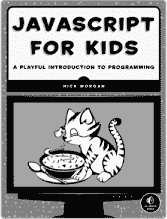
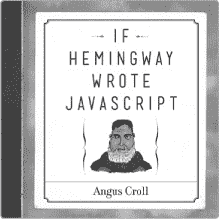
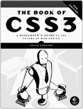
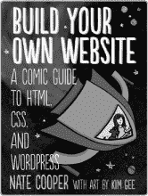

# 附录 B. 更新

访问 *[`nostarch.com/html5game/`](http://nostarch.com/html5game/)* 获取更新、勘误和其他信息。

*更多实用书籍来自*  **NO STARCH PRESS**

**Eloquent JavaScript，第 2 版**

**现代编程入门**

*由* MARIJN HAVERBEKE 编写

2014 年 12 月，472 页，$39.95

ISBN 978-1-59327-584-6

**儿童 JavaScript 教程**

**编程入门的趣味指南**

*由* NICK MORGAN 编写

2014 年 12 月，336 页，$34.95

ISBN 978-1-59327-408-5

*全彩版*

**如果海明威写 JavaScript**

*由* ANGUS CROLL 编写

2014 年 10 月，192 页，$19.95

ISBN 978-1-59327-585-3

**CSS3 手册**

**开发者的 Web 设计未来指南**

*由* PETER GASSTON 编写

2014 年 11 月，304 页，$34.95

ISBN 978-1-59327-580-8

**RAILS 快速入门**

**Rails 开发实用指南**

*由* ANTHONY LEWIS 编写

2014 年 10 月，296 页，$34.95

ISBN 978-1-59327-572-3

**构建你自己的网站**

**HTML、CSS 和 WordPress 漫画指南**

*由* NATE COOPER 编写，*插图由* KIM GEE 提供

2014 年 9 月，264 页，$19.95

ISBN 978-1-59327-522-8

**电话：**

800.420.7240 或 415.863.9900

**电子邮件：**

SALES@NOSTARCH.COM

**网站：**

[WWW.NOSTARCH.COM](http://WWW.NOSTARCH.COM)
