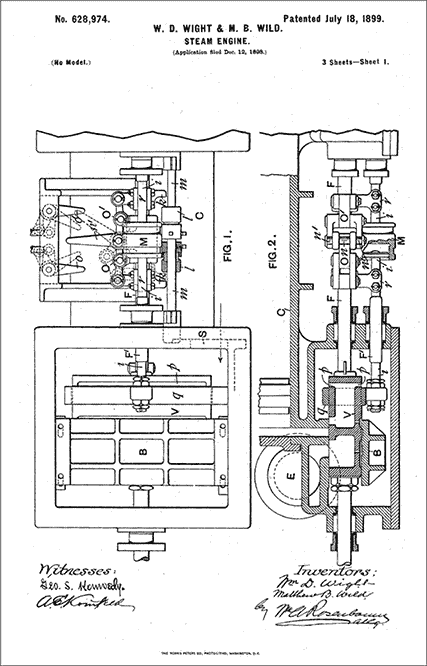
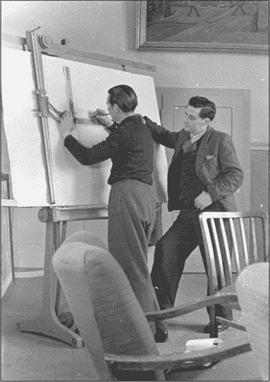
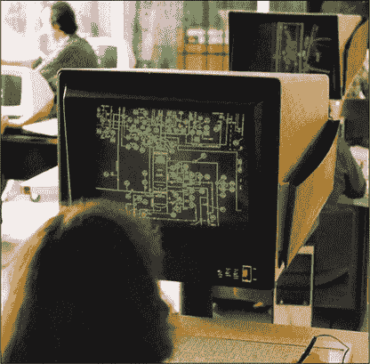
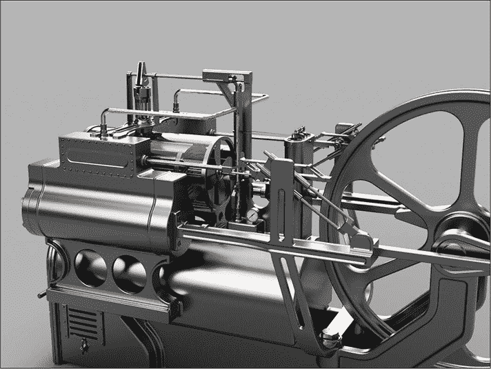

## 第一章：计算机辅助设计的简史**

人类一直在创造自己的设计，在计算机出现之前的黑暗时代，工程师们使用*技术制图*来描述三维物体。

你可能曾经做过一些基本的技术制图。也许你画过一张自己制作咖啡桌的草图，或者画过一张简单的浴室平面图，告诉承包商你想放在哪里安装新的按摩浴缸。

在这两种情况下，想法都是一样的：尽可能清晰地表现出某个物体。假设你回家发现承包商把新浴缸放在了浴室门口，因为你的图纸不够明确，那就会很麻烦。

### 制图与工业革命

由于工业革命的推动，18 世纪对技术制图技能的需求激增。机器和产品设计的复杂性成倍增长，因此需要更精确的制造零件的指示。对于制作一张桌子的木匠来说，一张粗略的草图可能就足够了，但蒸汽机和工业工具需要更为详细的图纸。

这种需求催生了正式的*制图*学科，即绘制技术图纸的实践，就像图 1-1 中显示的蒸汽机专利装配图一样。制图员（也称为*制图专家*）开始创作没有任何歧义的工程图纸。制图行业中最重要的一部分就是能够创建只能以*一种*方式解读的图纸。工厂每天生产成千上万的零件；想象一下，如果由于机械师误解了他们所使用的图纸，而必须废弃所有这些零件，情况会如何。

*图 1-1：1899 年蒸汽机的专利图纸*

当然，要确保图纸只有一种解释，需要一个共同的视觉语言。随着专利制度的发展以及制造商之间开始分享想法，这种设计语言逐渐演变并变得更加明确。最终，通过像美国机械工程师学会（ASME）、美国国家标准协会（ANSI）和国际标准化组织（ISO）等组织的工作，制图语言得到了标准化。

虽然这些标准在细节上略有不同（例如使用什么符号），但它们的目的都是一样的：为技术图纸定义一种视觉语言，当正确使用时，可以消除所有歧义。经过专门训练的人能够完全客观地解读按照该标准绘制的图纸。这些标准涵盖了技术图纸的各个方面——从尺寸使用什么字体，到不同部件特征的线条粗细和样式。直到最近，制图员仍然使用各种工具手工绘制所有这些细节，比如制图台（如图 1-2 所示）、安装的描图仪、专用的钢笔、直尺、方尺和曲线模板。

*图 1-2：一个大尺寸制图台，配有支架安装的直角尺*

到了 20 世纪下半叶，制图员的工作变得异常复杂。产品拥有数千个零部件并不罕见，尤其是在汽车和航空航天行业中。制造商需要为这些零部件中的每一个制作技术图纸；还需要图纸来说明它们的组装方式，甚至需要更多的图纸用于维护和修理等任务。

每一张图纸都消耗了制图员的时间，尽管市场需求促使设计变得越来越复杂。幸运的是，正如地球上几乎所有其他行业一样，蓬勃发展的数字时代彻底改变了制图行业。

### 替代笔和纸

在任何人构建出第一台数字计算机之前，制造商就已经意识到使用计算机进行工程设计的潜在好处。毕竟，20 世纪 40 年代和 50 年代工程任务所需的复杂计算，正是数字计算机后来能够解决的类型问题。1952 年，麻省理工学院（MIT）的研究人员成功地制造了第一台数字*数控（NC）*机床。这成为了第一台由计算机控制的铣床，并为未来的*计算机辅助设计（CAD）*系统奠定了基础。

尽管技术进步迅速，但早期的计算机在图形显示、存储能力和用户界面方面仍有限制。尽管如此，工程界已经看到了 CAD 的潜力，任何有资金的组织都争相加入这一领域。麻省理工学院和多家汽车及航空航天公司在 50 年代和 60 年代独立开发了原型 CAD 系统。例如，在麻省理工学院，伊凡·萨瑟兰开发了名为 SKETCHPAD 的软件，允许操作员在 CRT 显示器上使用光笔进行绘图。在 1963 年关于 SKETCHPAD 的演示中，萨瑟兰声称：“对于高度重复的图纸或需要精确度的图纸，SKETCHPAD 比传统方法更快，因此非常值得使用。”（你可以在[*https://www.cl.cam.ac.uk/techreports/UCAM-CL-TR-574.pdf*](https://www.cl.cam.ac.uk/techreports/UCAM-CL-TR-574.pdf)阅读这篇演示文稿。）

与此同时，像通用汽车（与 IBM 合作）、福特、雪铁龙、雷诺、洛克希德、波音和贝尔等公司也在开发商业 CAD 软件。这些早期的 CAD 系统，如图 1-3 所示，主要旨在取代手工绘图，而电子化的技术图纸创建（和修改）大大加快了绘图的速度。

*图 1-3：Computervision CADDS 的早期版本之一，CAD 软件的早期示例*

### 进入三维世界

70 年代，价格适中的个人计算机的引入，促使 CAD 在各类工程领域（包括机械、电气和土木工程）得到了广泛的应用。

随着这些设备带来新的 3D 软件包，设计过程发生了彻底的变化。工程师和设计师们现在可以创建大型机械组件的 3D 模型，并能够快速高效地测试和验证设计，而无需进行任何实物制造。当需要制造零件时，设计师可以利用 3D 模型快速生成技术图纸，甚至可以直接使用*计算机辅助制造（CAM）*软件来编程机床。

在 90 年代，开发者们优化了 3D CAD 软件，以利用计算能力的提升，直到大多数软件可以在价格适中的个人计算机上运行。这个时代的程序包括 SolidWorks、Solid Edge 和 Autodesk Inventor。

### 现代世界中的 CAD

进入 21 世纪后，CAD 继续发展。在土木工程领域，像 Autodesk Revit 这样的软件使得工程师能够建模整个建筑物，包括电气系统和暖通空调布局。电气工程师可以使用像 KiCAD 和 Autodesk Eagle 这样的软件设计印刷电路板（PCB）和原理图，这些软件包含电路仿真工具。

本书从机械工程的角度讲解 3D 实体建模，在这个领域，CAD 已经变得不可或缺。在我作为机械设计师的职业生涯中，我的大部分日常工作都在创建 3D 模型。你遇到的几乎每一个现代产品，最初都是由机械工程师、设计师和绘图员使用软件完全建模的。

如今，绘图员制作零件和组件的数字 3D 模型，然后利用这些模型创建技术图纸。绘图员可以从任何角度生成模型的视图，并且能够非常快速地添加尺寸、物料清单和其他技术信息。

### 爱好者的 CAD

直到最近，大多数爱好者无法负担高质量的 CAD 软件，这些软件主要面向专业工程团队，并且价格相应较高。大多数专业的 3D 实体建模 CAD 软件包价格高达几千美元，这使得它们对于从事爱好项目的创客和爱好者来说并不实际。

随着廉价 3D 打印机的流行，一切开始发生变化。突然间，全球的创客们对实惠的 3D CAD 软件产生了巨大需求。开源的 3D 网格建模工具已经存在，但它们只满足了部分爱好者的需求；虽然它们在艺术模型方面表现出色，但在机械任务方面则显得笨拙。

在过去的几年里，CAD 软件开发商开始回应爱好者对真正的机械化、参数化 3D 实体建模 CAD 系统的需求。他们从非常基础的软件开始，如 Autodesk 123D 和 SketchUp。尽管这些软件是向前迈出的一步（而且是免费的），但它们有着严重的局限性。用户大多只能使用原始的多边形进行工作，而高级建模要么非常困难，要么根本不可能。

幸运的是，针对全球的创客和 3D 打印爱好者，Autodesk 发布了*Fusion 360*，这是我们在本书中将要使用的工具。图 1-4 展示了使用 Fusion 360 可以实现的功能。

Fusion 360 是一款功能完备的参数化 CAD 程序，几乎拥有任何昂贵专业 CAD 软件中的所有功能。当我经营一个制造业务时，它是我所需的唯一 CAD 程序。而且最棒的是，Fusion 360 对非商业用途是免费的。

*图 1-4：Fusion 360 让创客们能够免费创建高质量的 3D 模型。*

在接下来的章节中，我们将介绍如何使用 Fusion 360 来创建您自己的专业级 CAD 模型。您将从基础的草图绘制到高级建模技巧，学习所有内容。到本书结束时，您将掌握设计复杂模型所需的所有知识，适用于 3D 打印甚至生产制造。
