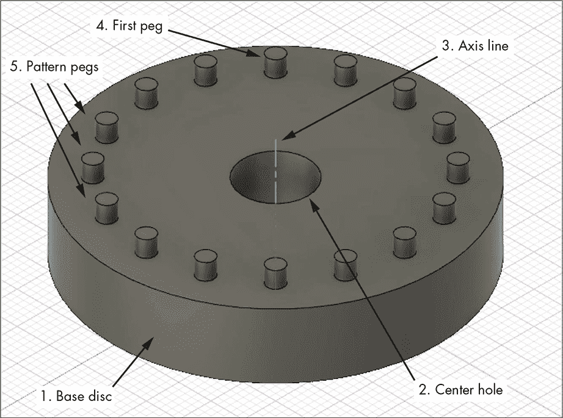
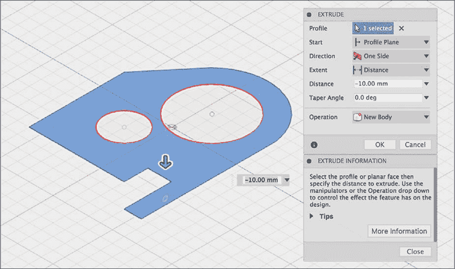
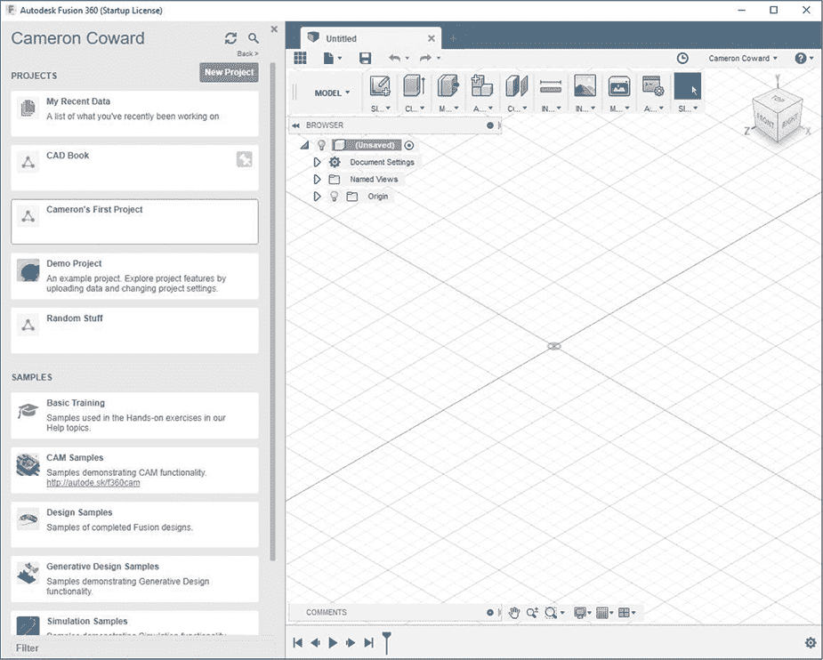
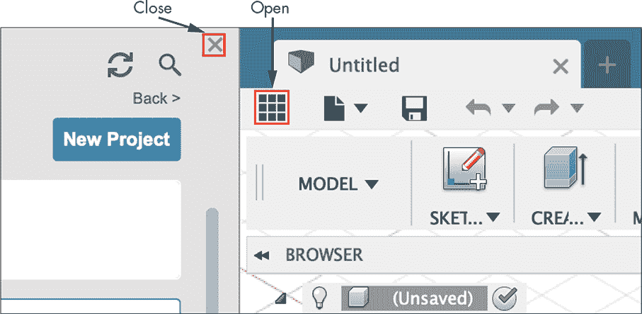
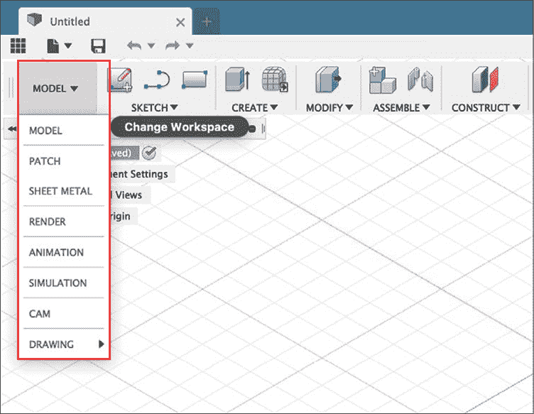
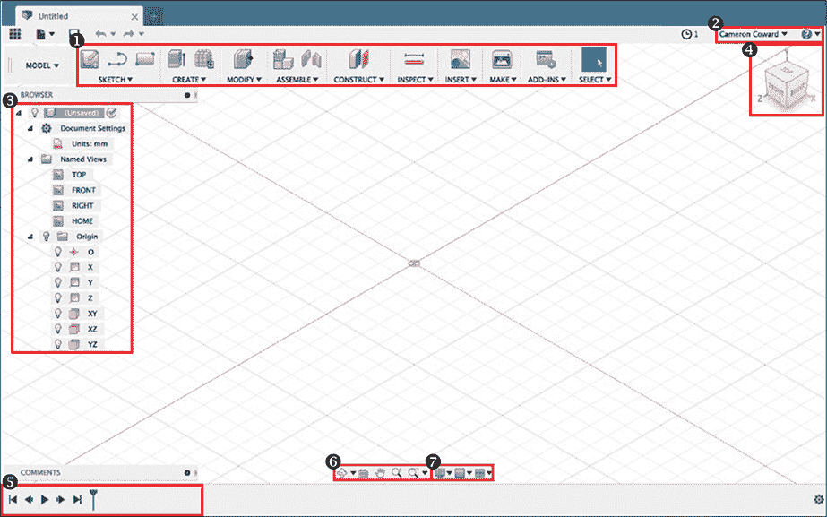
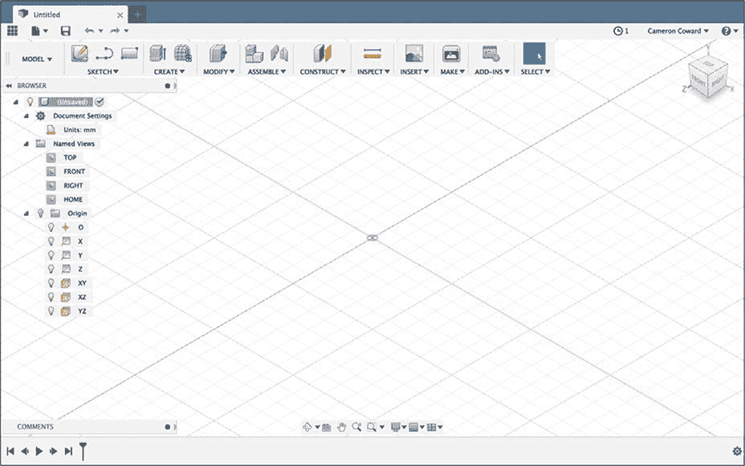
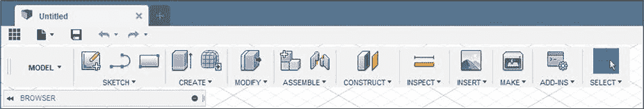

# 第二章：**参数、特征与 Fusion 360 工作空间**

理解参数化建模软件如何工作的关键就在于它的名称：在参数化建模中，你通过一组叫做参数的特征来定义每一个单独的特征。例如，一个简单的立方体是通过定义其原点、高度、宽度和深度等变量来构建的。这些维度只是软件用来描述立方体的参数。然后，你可以使用软件保存所有这些参数，并在之后进行编辑或引用。

在工程中使用基于参数的建模非常重要，原因有几个。最明显的原因是，当你为现实世界设计一个物理零件时，你需要精确地定义它的尺寸。例如，设计一个适配发动机的活塞时，你不能依赖视觉估算。相反，你需要通过明确的尺寸定义活塞的精确大小和形状——这些就是构成你模型的参数。

### 使用特征作为构建块

参数化建模的构建块叫做*特征*。单个特征通常只是基本的多边形——将这些基本形状与其他特征结合，最终得到一个复杂的零件。作为设计师，你将学习的基本技能之一就是如何将你设想的复杂零件拆解成一系列基本特征。

将一个组件（如图 2-1 所示）拆解成单独的特征是一个每个人都会以不同方式处理的任务。没有绝对正确或错误的方法。两个设计师可能会用完全不同的特征序列得到完全相同的零件。当然，关于高效建模的最佳实践是存在的。

*图 2-1：由多个特征组成的简单零件。数字表示特征添加到零件的顺序。*

如果你是参数化建模的初学者，你可能会试图使用尽可能少的特征，但这种方法通常不是理想的。单个特征会变得过于复杂，并且可能包含难以发现和修改的错误。然而，反过来也一样——创建一系列非常简单的特征可能会浪费时间并且低效。最佳的做法是找到复杂性与效率之间的平衡。

理解如何找到这个平衡点是一个优秀设计师的标志。通过实践和经验，你将学会如何将一个复杂的零件拆解成一系列遵循逻辑计划的特征。你选择哪条路径取决于你作为设计师的决定，但关键是要慢下来，做好规划。

当你小时候在搭建 LEGO 太空船时，你可能有一个大致的构想，想要让太空船看起来是什么样子的。但你实际搭建太空船的方式完全取决于你自己。现在，假设你的朋友来了，决定他也想建造一艘和你的一模一样的太空船。仅仅因为他能够做到这一点，并不意味着他是以相同的方式实现的。他可能使用了完全不同的积木，仍然能够搭建出一个尺寸和形状完全相同的太空船。

你可以把参数化建模软件中的特征看作那些单独的 LEGO 积木。积木有不同的大小、形状和风格，你可以用它们做很多事情。在参数化建模软件中，一个特征可以用来创建一个基本的立方体，而另一个可能用来在那个立方体中切一个洞。还有一个可能用来圆化边缘和角落。

你将使用的每个特征都由至少一个参数定义，例如切割的深度。大多数特征会有多个参数，你可以显式设置这些参数，或者软件会为以后的使用生成它们。在许多特征上，例如图 2-2 中所示的拉伸（Extrude），你将结合*草图*使用参数，草图是用于制作三维形状或定义位置或路径的二维图纸。

*图 2-2：与草图结合定义的拉伸（Extrude）*

你可以使用草图绘制你要切割到零件中的腔体轮廓，或者制作一条管道将要遵循的路径。并非所有特征都需要草图，但大多数特征都需要，你会发现自己大部分建模时间都在创建草图。

### Fusion 360 工作空间

既然你已经熟悉了参数化建模的基本原理，那么现在是时候了解一下 Autodesk Fusion 360 工作空间了。让业余爱好者望而却步的一个主要因素是软件的复杂性。界面充满了按钮和工具栏，乍一看似乎毫无意义，因此未接触过的人可能会感到不知所措。一旦掌握了工作空间的基础知识，CAD 变得不再那么令人生畏。

#### *下载 Fusion 360*

Autodesk Fusion 360 可在 Windows 和 macOS 上使用。你可以在[*https://www.autodesk.com/products/fusion-360/free-trial/*](https://www.autodesk.com/products/fusion-360/free-trial/)找到下载链接。Fusion 360 对于业余爱好者和爱好者是免费的；只有在你用于商业目的且年收入超过 $100,000 时，才需要支付费用。在要求输入公司名称时，你可以填写自己的名字作为公司名称。

由于 Fusion 360 是基于云的软件，你需要一个免费的 Autodesk 帐户才能访问它。按照链接下载安装程序到你的计算机。一旦软件安装完成，按照提示创建一个 Autodesk 帐户，或者如果你已经有帐户，可以直接登录。如果你是出于非商业目的使用 Fusion 360，记得选择适合爱好者的选项。

创建帐户并登录后，你会被要求选择你想要使用的单位。为了便于计算，整本书中我将使用毫米作为单位，但如果你更喜欢英寸，也可以使用英寸。你随时可以更改此设置，或者为单个文件设置不同的单位。选择好单位后，你应该能看到一个像图 2-3 一样的屏幕。

*图 2-3：Fusion 360 启动屏幕*

屏幕分为两个窗格：左侧窗格是你的项目浏览器，你可以在这里找到文件（尽管它们存储在云端），右侧窗格是你的工作空间。

#### *使用项目浏览器*

默认情况下，你会获得一个名为“[你的名字]的第一个项目”的*项目*，你的文件将保存在该项目中。你可以使用这个项目，或者如果你愿意，可以创建一个新的项目。这个项目是你保存 3D 模型、图纸和其他文件的地方，这些文件作为 Fusion 360 文档保存。

当你处理较大的项目时，你可以创建文件夹来保持项目的组织。如果你和其他用户合作，你可以与他们共享项目，让他们访问你的文件。要打开或关闭项目浏览器（以节省显示空间），使用图 2-4 中的图标。

*图 2-4：关闭和打开项目浏览器*

你只需要在创建新项目、更改项目或打开现有文件时打开项目浏览器。否则，你可以保持项目浏览器关闭，以便为工作空间窗格提供尽可能多的屏幕空间，在这里你将实际进行工作。位于项目浏览器和保存按钮之间的文件图标让你可以访问菜单选项，创建新文件、保存文件、导出模型等。

#### *切换工作空间*

在主工作空间窗格中，你应该能够看到窗口顶部的主工具栏。左侧是一个下拉菜单，默认应该设置为“模型”。这个下拉菜单允许你在不同任务的工作空间之间切换（参见图 2-5）。

*图 2-5：切换工作空间以访问菜单和工具栏*

切换工作空间应当让你能够访问其他工具栏和菜单选项。在这里，你将看到一个工作空间列表，并附有简要的总结：

**模型** 这是你可能使用最多的工作空间。它包含所有的*实体建模*工具，这意味着你建模的所有内容都有可能作为真实的物理对象存在。

**修补** 这个工作区包含了所有的*曲面建模*功能。您将在第七章中了解一些关于曲面建模的内容，但本书将主要聚焦于固体建模。

**渲染** 这个工作区包含了创建高质量 3D 模型渲染图的工具，通常用于演示目的。第九章涵盖了创建渲染图的基础知识。

**动画** 这个工作区允许您对装配体进行动画处理，以展示机器（例如）如何运作。尽管本书不涉及动画内容，但我建议您在这个工作区里玩一玩。

**仿真** 您可以使用这个工作区进行强度测试和应力分析仿真，这些内容也不在本书的范围之内。

**CAM** 计算机辅助制造（CAM）是 Autodesk Fusion 360 的主要卖点之一。它允许您创建工具路径并编程各种*计算机数控*（*CNC*）机器。CAM 是一个复杂的主题，因此本书中并未涉及。

**绘图** 在这里，您可以创建技术图纸，用于制造、申请专利或简单地展示您的模型。您将在第八章中了解更多关于此工作区和主题的内容。

#### *在模型工作区中的导航*

模型工作区是您大部分工作进行的地方。导航到该工作区并查看屏幕，屏幕应该被划分为几个关键区域，如图 2-6 所示。

*图 2-6：模型工作区*

1.  *功能区* 是主要工具栏，您将在其中找到创建固体模型所需的草图和特征工具，以及一些其他杂项工具。通常，您将从左到右工作——从草图开始，接着是创建，再到修改，依此类推。

1.  您的 Autodesk 账户选项、帮助文档以及 Fusion 360 的偏好设置和选项都可以通过下拉菜单访问。

1.  *组件浏览器* 显示您创建的视图、平面和其他构建几何图形——其中一些是默认创建的。目前，您将一次只处理一个组件，但如果有多个组件，您可以在这里选择它们。

1.  *视图立方体* 让您可以在空间中旋转您的 3D 模型，并快速将视口定向到模型的特定面。

1.  *设计历史时间线* 会随着您创建草图、特征和构建几何图形而更新。这会保持您所做的所有操作的历史，并允许您根据需要返回并进行更改。

1.  其他视图工具，用于围绕模型旋转、适应窗口、平移和缩放。

1.  各种显示设置和选项。您可以使用这个工具栏来更改工作区和模型的外观和感觉，设置视图网格并确定其行为，还可以将视图窗口划分为多个视口。

*视口* 是你实际与 3D 模型互动的地方（见图 2-7）。这是一个几乎无限的空间，模型将存在其中。因为你还没有创建模型，所以你应该看到一个覆盖在由两个轴组成的平面上的网格——在这种情况下是 x 轴和 z 轴，并且以*原点*为中心，原点是 x 轴、y 轴和 z 轴相交的点。

*图 2-7：视口是你与 3D 模型互动的地方。*

使用视图立方体围绕原点和模型旋转视口，或者使用导航工具栏中的轨道工具自由旋转或旋转模型。按住鼠标滚轮可以平移工具栏。通过窗口底部的放大镜按钮进行缩放，或通过选择视图工具栏中的手形图标来平移视口。你也可以使用鼠标滚轮或笔记本触控板上的两根手指进行平移。

#### *理解模型工作区的主工具栏*

每个工作区都有自己的主工具栏，模型工作区的工具栏包含进行实体建模所需的一切。2D 平面只能作为表面或*参考几何体*存在，这意味着它不属于实体模型的一部分。这是因为 2D 模型没有厚度，因此在现实世界中是无法制造的。使用实体模型确保你创建的部件（至少在理论上）是可以实际制造的。这与表面建模形成对比，在表面建模中，你可以创建具有零厚度的表面，这是物理上不可能实现的。

在接下来的章节中，你将学习如何使用模型工作区中的每个工具。但现在，简要概述一下主工具栏中的下拉菜单（见图 2-8）：

*图 2-8：模型工作区的主工具栏*

**草图** 创建草图以及在你创建的草图内绘图的各种工具。

**创建** 这是你可以找到用于创建实体的工具的地方。这些工具中的一些需要草图，但也有一些可以在没有草图的情况下创建基本原型的功能。

**修改** 用于修改现有实体的功能，例如添加倒角以圆滑 3D 模型的边缘。此下拉菜单还提供设置模型*材质*和*外观*的选项。设置材质可以让你计算质量等参数并进行仿真。外观仅影响模型的外观，这在创建渲染时非常有用。你还可以在这里找到自定义参数。

**组装** 用于将多个组件组合成一个整体的工具。这对于检查零件是否完全契合、测试它们的运动以及创建装配图非常有用。

**构造** 所有*构造几何体*，包括用于辅助建模的非实心平面、线条和点，这些几何体本身没有实际的三维实体。

**检查** 这里有许多工具可以用来分析你的模型。最常用的是测量工具，用于执行基本任务，比如检查从一个点到另一个点的距离，但也有用于检查重心、草图（用于模具制作）等的工具。

**插入** 用来将外部资源导入到你的模型中。例如，在创建高质量渲染时，你可能需要插入一个*贴花*——一张图像文件——比如刻度盘上的印刷面。你还可以导入外部的 DXF 和 SVG 文件（二维线图），以及 3D 网格文件，如 STL 文件，后者可用于 3D 打印。

**制作** 主要用于 3D 打印，这个下拉菜单提供了导出 STL 文件的选项。它还有一些工具可以将你的模型上传到各种付费 3D 打印服务。

**插件** Fusion 360 提供了许多第一方和第三方插件，可以为你提供专门任务的工具。你可以在这里找到它们。

**选择** 大多数情况下，默认选择选项足够使用，但一旦你的草图、模型和装配变得复杂，可能会很难实际点击到你想选择的部分。在这种情况下，这个下拉菜单为你提供了只选择草图或几何体中特定部分的选项。

### 概述

现在你对界面和工作空间有了基本了解，可以自由地尝试不同的选项和设置。如果你觉得自己不小心弄乱了设置，可以随时通过点击右上角的用户名，然后点击**首选项** ▸ **恢复默认设置**来恢复到默认设置。
