## 第三章：**3  

**设计你的第一个模型**  

  

终于到了开始建模的时候！在接下来的几章中，你将逐渐学习越来越复杂的草图工具、功能和技巧。在本书的结尾，你将成为 3D 建模的高手，并且拥有设计任何你想要的东西的能力。首先，让我们从基础开始。  

### 了解你的工具  

在本章中，你将学习如何使用 Fusion 360 中的基本草图工具和功能，这些工具是你在接下来章节中使用最多的，而不是复杂的工具。就像一个熟练的木匠可以用一把简单的工具做出惊人的事情一样，你将学会如何使用像拉伸和旋转这样简单的工具来构建模型。这些基础工具虽然不华丽，也不是为了专门的工作设计的，但它们功能强大，并且在各种任务中非常有用。  

#### *使用基本的草图工具*  

你可以在“草图”下拉菜单中找到基本工具，如图 3-1 所示。如果你看不到“草图”下拉菜单，请确保你处于“模型”工作区。  

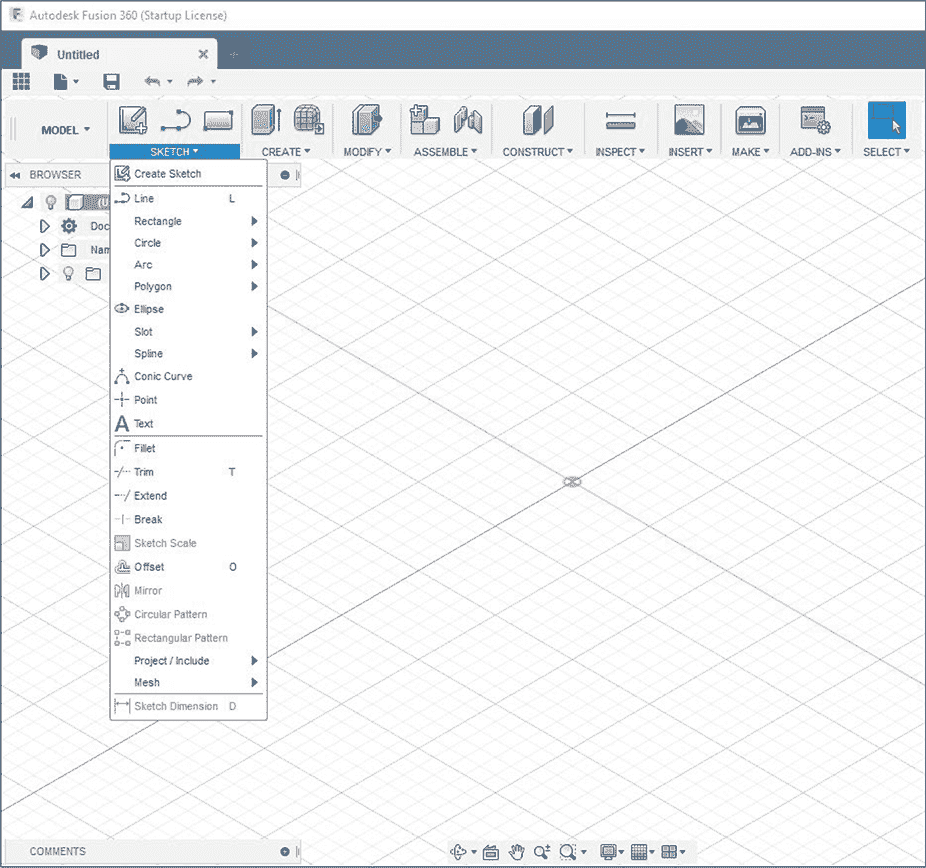  

*图 3-1：草图工具菜单*  

你应该能看到这里有很多选项，其中许多选项有附加的子菜单。在本章中，你将使用以下工具：  

**创建草图** 创建一个新的草图。使用此工具时，你必须选择草图将在何种平面上绘制。当你还没有开始建模时，你通常会选择 x-y、y-z 或 z-x 平面；如果你已经开始了建模工作，通常会选择一个平坦的面作为草图平面。你也可以通过选择一个草图工具，如“直线”工具，然后选择一个平面来开始草图。  

**直线** 绘制直线段。你可以将多个线段连接在一起，形成形状。这个工具使用频繁，所以有一个默认的快捷键：L。

**矩形** 自动创建四条线段，并使用*约束*将它们连接起来，约束是指定草图实体如何链接的规则。例如，一个约束可能会锁定两条线段的端点，使得弧形与直线相切，或使两条线平行。在这种情况下，矩形工具会自动约束四条线的端点，并使它们互相垂直。子菜单中包含了定义矩形的选项，快捷键 R 可以绘制由任意两个角定义的两点矩形。  

**圆形** 用于绘制圆形。子菜单中提供了多种选项，用于定义和定位圆形。草图中的圆形是真正的数学圆形——它们不是分成弧形或一系列线段的。C 快捷键用于创建一个由圆心和直径定义的圆形。  

**弧形** 用于绘制弧形。子菜单提供了几种选项，供你定义弧形的约束条件。由于弧形不像其他形状那样常见，弧形工具没有快捷键。  

**倒角** *倒角*（发音为“fill-it”）是一个常用的工具，用于将草图的角落圆滑化。你通过连接两条线的弧的半径来定义它。当你在草图中使用时，该工具会自动缩短两条线段，放置一个连接它们的弧，并将该弧约束为与两条线段相切。

**修剪** 当两条线相交时，此工具会将其中一条线修剪到交点位置。快捷键是 T。

**延伸** 延长一条线，直到与另一条线相交为止。如果你应用此工具时没有其他线条与之交叉，则什么也不会发生——在 Fusion 360 中，线条不能无限延伸。

**偏移** 创建一条或一系列与选定线段在定义的距离内偏移的线。快捷键是 O。

**草图尺寸** 定义草图的尺寸，比如线段的长度或两条线之间的角度。快捷键是 D。

使用这些工具创建的草图实体可能会成为你工具集的主体——你几乎可以用这些工具绘制任何东西。但你读这本书不仅仅是为了做草图——你是想创建 3D 模型！这时特征就派上用场了。

#### *使用初始特征*

你可以使用“创建”菜单中的工具（如图 3-2 所示）来制作初始特征，随后将它们组合成 3D 形状。你必须始终使用这些初始特征之一来创建你的第一个 3D 实体，因为它们不需要现有的模型几何形状（尽管可能需要草图）。这与“修改”菜单中的工具不同，后者只能处理现有几何形状。请记住，你可以在整个建模过程中使用这些工具来创建特征，而不仅仅是用来创建初始特征。

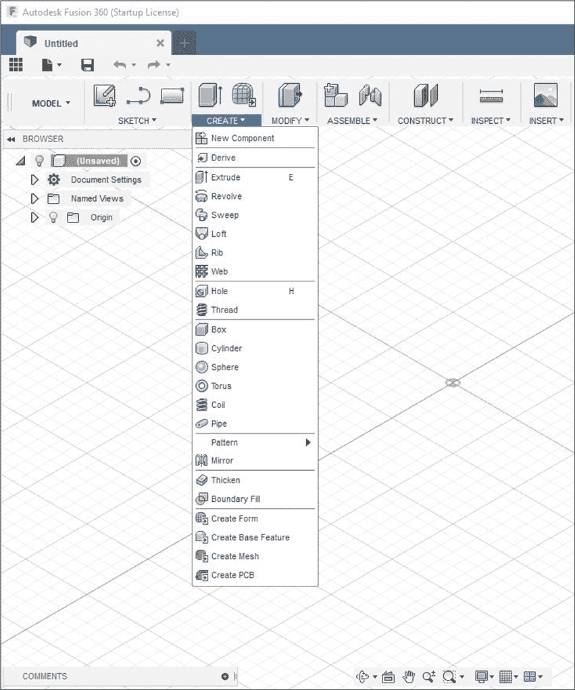

*图 3-2：初始特征位于“创建”下拉菜单中。*

这些初始特征中，有些使用频率较高。下面的列表简要描述了最常用的特征：

**拉伸** 为草图添加厚度，形成 3D 实体。相反，拉伸特征也可以用于以选定草图的形状切割现有实体。这是 3D 建模中最常用的特征，快捷键是 E。

**旋转** 类似于拉伸，这个特征通过草图在选择的中心轴上旋转指定的角度数来创建新的实体或从现有实体中切割出一个部分。例如，如果一个触及旋转轴的正方形被旋转 360 度，就会形成一个圆柱体。

**孔** 简化了在实体中打孔的过程。使用拉伸和旋转，你可以创建任何形状的孔，只要你能够画出它，但使用孔功能有时可以更快速地创建简单的孔。然而，由于使用拉伸或旋转切割孔更为常见和多功能，我通常避免使用孔功能。

**盒子、圆柱、球体、环面、螺旋和管道** 这些功能可以创建基础的原始实体。像孔功能一样，这些功能在某些情况下可以节省时间——主要作为基础的起点——但出于学习目的，你在本书中不会使用这些功能。你可以使用拉伸或旋转来创建这些每一个（可能唯一例外的是螺旋功能）。

你可能会惊讶地发现，目前你只会使用这两个初始特征（拉伸和旋转），但它们非常强大且有用。事实上，单靠拉伸和旋转，可能就会占据你 3D 建模过程中 90%以上的初始特征。

#### *修改特征*

尽管你可以在没有任何现有实体的情况下创建初始特征，但你需要有一个 3D 物体来修改特征。修改工具通常在建模过程的后期使用，以对你设计的部件进行最后的修饰，但你完全可以在更早的时候使用它们。你可以通过修改下拉菜单访问这些工具（见图 3-3）。

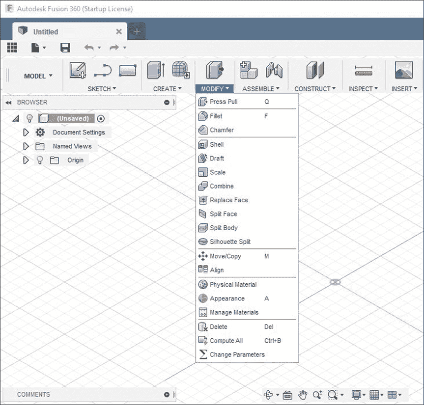

*图 3-3：你可以在修改下拉菜单中找到修改特征。*

像初始特征一样，你会比其他工具更多地使用其中一些，因此以下列表仅涵盖了 Autodesk Fusion 360 中一些可用的修改工具：

**圆角** 与圆角草图工具类似，你可以使用圆角修改工具来三维创建圆滑的边缘和角落。你可以选择内边或外边，并定义半径。快捷键是 F。

**倒角** 倒角工具的工作方式与圆角工具非常相似，唯一的区别是它将边缘削成斜面，而不是圆滑的曲线。你可以通过切割角度和距离来定义倒角，或者使用两个边缘的距离来定义。

**壳体** 这是一个令人惊讶的有用功能，壳体工具可以将实体内部挖空，并移除选定的面以形成开口。你还需要指定墙壁的厚度，以确保模型保持为实体。例如，壳体可以将一个圆柱体变成一个杯子，或将一个立方体变成一个盒子。

现在你已经了解了工具箱中的内容，让我们开始建模吧！

### 建模一个立方体

创建一个立方体就像是 3D 建模中的“Hello, World!” 虽然你可以通过使用盒子初始特征快速轻松地创建一个立方体，但你将通过草图以更复杂的方式创建一个立方体，这样你可以了解建模过程。

#### *创建草图*

要使用拉伸（Extrude）特性建模立方体，首先需要从草图开始。前往**草图**下拉菜单并选择**创建草图**选项。系统会要求你选择一个绘制草图的平面。图 3-4 展示了在 xy 平面上绘制的草图。你选择的平面完全由你决定——你随时可以在后期旋转模型，因此关键在于你如何在脑海中构思部件的形状。

一旦选择了草图平面，视口应该会旋转以面对该平面。如果你愿意，你可以旋转视图，但大多数时候你会希望在面朝草图平面时进行绘制。

因为你要建模的是立方体，所以首先绘制一个矩形。在这种情况下，你需要选择一个*中心矩形*。这意味着矩形将被约束保持在原点（0, 0, 0）处居中。约束是适用于草图实体的几何规则。例如，垂直约束会强制两条线以 90 度角相交。将模型约束到原点通常是一个好的实践，因为这将使将来使用默认参考平面和轴线变得更容易。

现在导航到**草图** ▸ **矩形** ▸ **中心矩形**。一个提供各种选项的对话框应该会弹出在屏幕上。点击平面确定中心点，所以点击原点以自动创建矩形的第一个约束。接下来的点击应该放置矩形的一个角落，所以稍微远离原点点击一点，你将得到一个矩形，如图 3-5 所示。你点击的点应该在 x 轴和 y 轴上对称——自动放置矩形的四个点。

*图 3-4：选择最适合你的平面进行草图绘制。*

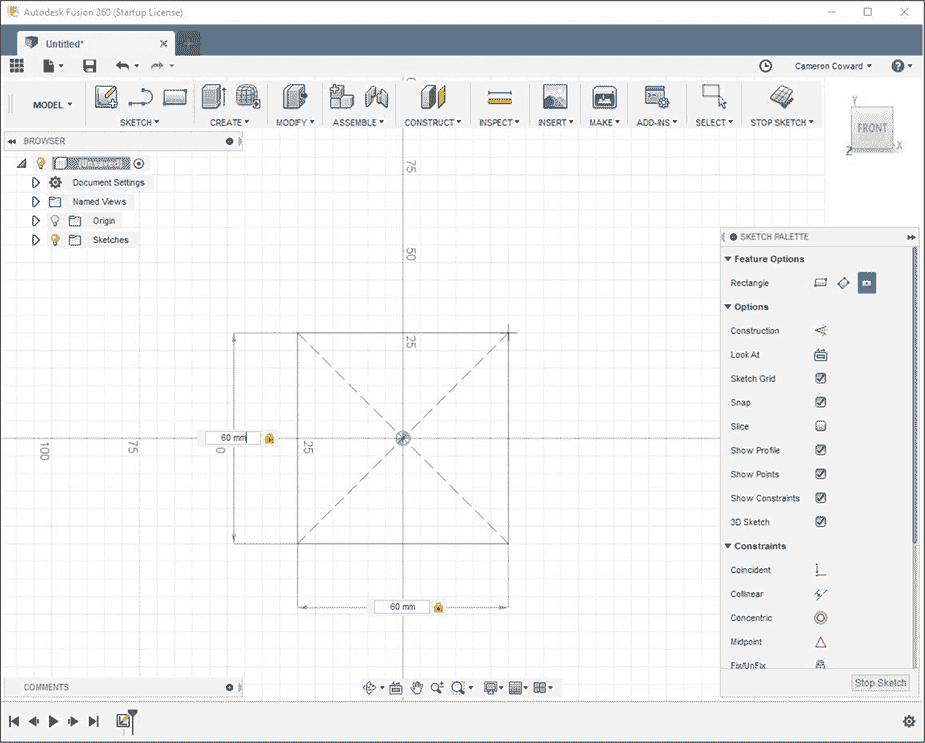

*图 3-5：在草图绘制过程中，你可以在操作过程中或操作后定义尺寸。*

你可能已经注意到，在你第二次点击设置矩形的一个角落时，矩形的宽度和高度尺寸会弹出。你本可以指定其中一个，按 TAB 键，输入另一个的尺寸，然后按 ENTER 键。这将定义矩形的尺寸并将其约束到这些尺寸。

但是，由于你没有这样做，而是直接点击了空中的一个点，Fusion 就绘制了一个没有任何相关尺寸的矩形。这意味着矩形被约束保持在原点居中，四条线的端点通过重合约束自动锁定在一起，四条线被约束为彼此垂直。但它没有任何尺寸来约束实际的大小。

#### *完全约束草图*

此时，矩形的四条线应该变成蓝色，这表示草图尚未完全约束。你不应该在草图没有完全约束几何约束或尺寸的情况下完成草图。直到草图完全约束之前，点和线可能会无意中发生位移，这会导致零件精度的模糊性；而在 CAD 中，模糊性总是有害的。

要完全约束矩形，你需要定义零件的尺寸。使用 D 快捷键创建草图尺寸，或者从草图菜单中选择，并选择一条垂直线。将光标移到该线的一侧，然后点击放置尺寸。接着输入**50**并按回车键。对其中一条水平线做同样的操作。尺寸应该如图 3-6 所示显示。

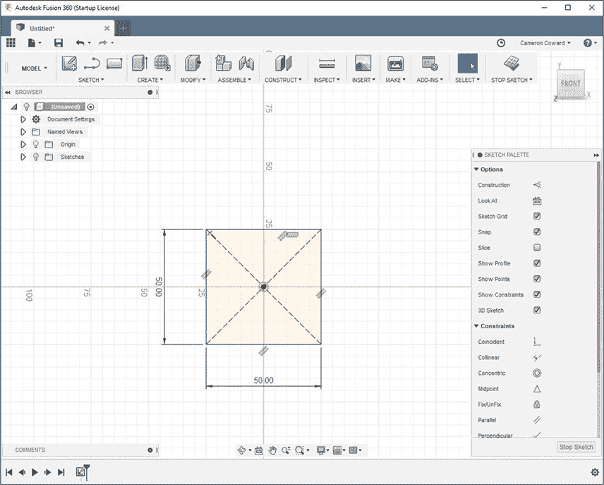

*图 3-6：草图线条在完全约束后变为黑色。*

一旦你定义了尺寸，在默认的 Photobooth 视觉环境中，所有的线条应该变成黑色（如果你更改环境，颜色可能会有所不同）。这意味着你已经完全约束了矩形，之后不会有任何意外情况发生，影响草图的精度。确保草图始终完全约束，可以避免在处理更复杂的模型时追查问题。草图部分未约束不会破坏任何东西，但如果草图或特征发生位移，可能会导致不可预测的结果。

#### *拉伸草图*

要将你完全约束的草图拉伸成一个 3D 实心体，按 E 或选择**创建** ▸ **拉伸**。视图应该会发生变化，让你更容易分辨拉伸的效果，你将被要求选择一个*轮廓*，即草图中的任何封闭曲线。在这种情况下，你的轮廓是矩形，所以点击矩形内部的某个地方。如同图 3-7 所示，选中的轮廓应该会被高亮显示。虽然这里不适用，但如果多个轮廓位于同一平面，你可以在对话框的“轮廓”字段激活时点击它们来选择多个轮廓。

与所有特征一样，Extrude 也提供了一些选项供你使用。Start 选项是你希望*零点*，即拉伸的起点所在的位置。在这种情况下，你应该保持默认设置，即从草图平面开始。

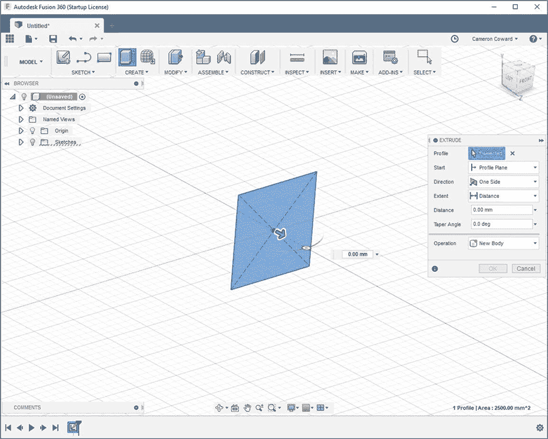

*图 3-7：拉伸对话框*

方向选项决定了拉伸是应该扩展到草图平面的一侧、两侧但距离不同，还是两侧对称扩展。你希望立方体保持在原点居中，因此选择**对称**。当你选择对称时，系统会询问维度是指总拉伸长度还是每一侧的长度。你需要选择总拉伸长度，以便所有尺寸一致。将距离选项设置为 50 毫米，锥度角度为 0 度。

最后的选项，操作，决定了特征的功能。由于模型中没有其他固体体，因此新体是唯一合理的选项，但如果你想在现有的体上切割一个孔，可以选择切割。其他选项包括交集，它只保留两个固体重叠部分的部分，以及合并，它将两个固体合并为一个。

最后，点击**确定**来创建你的第一个 3D 模型！完成的模型应该像图 3-8 中的立方体。

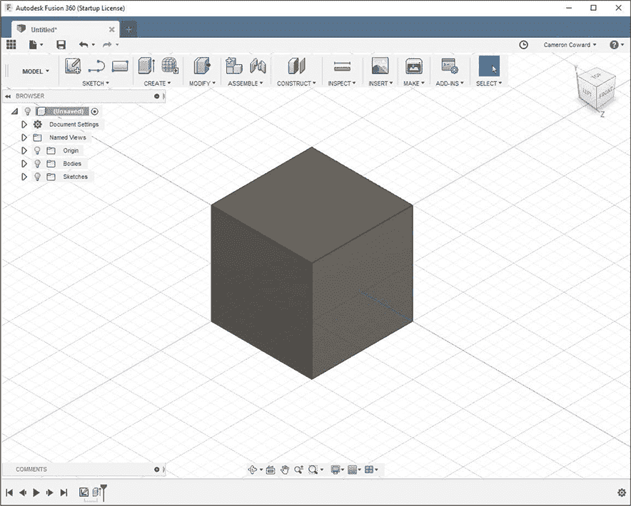

*图 3-8：立方体，你的第一个 3D 模型！*

现在你已经完成了立方体的建模，让我们通过一些修改工具为它增添更多特点。

#### *修改立方体*

在本节中，你将修整所有立方体的边缘，并在其中一侧切割一个圆形孔。修整边缘会使立方体看起来更加圆润。

由于修整是一个修改特征，你不需要草绘任何内容，只需选择你想要修整的边缘。确保旋转模型以获取背面的边缘，并选择 5 毫米的半径，如图 3-9 所示。

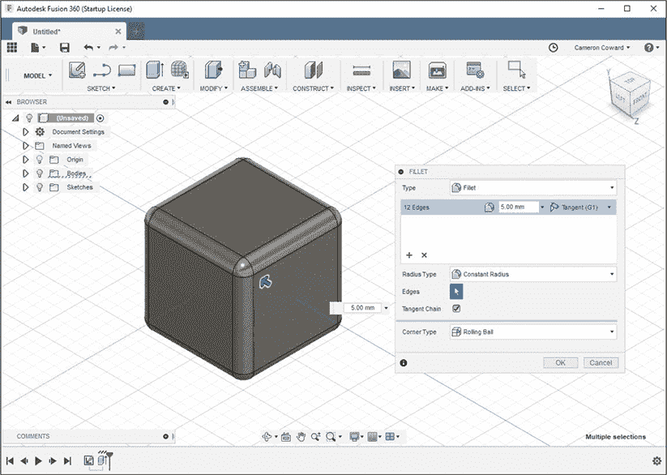

*图 3-9：选择边缘进行修整。*

为了更好地理解修整工具的工作原理，尝试调整半径的尺寸并观察其行为。

要在立方体的一侧切割一个孔，创建一个新的草图。对于草图平面，选择立方体的前面或后面平面（你很快就会明白为什么）。接下来，绘制一个**中心直径圆**，圆心位于原点，直径为 25 毫米，如图 3-10 所示。

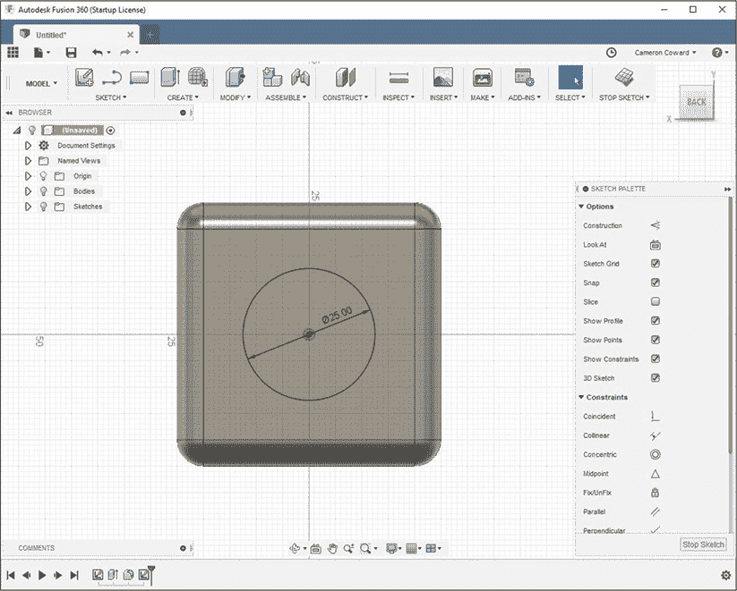

*图 3-10：在立方体的一侧画出以原点为中心的圆*

这就是为什么你花时间将矩形居中于原点，并使用对称拉伸的原因。当你选择草图平面时，原点会自动居中于你的零件，因为之前的特征是围绕原点对称建模的。现在，当你将圆形居中于原点时，你知道它也会居中于立方体的面。如果你的立方体没有居中于原点，你将不得不使用额外的约束、构造几何或尺寸来将圆形居中于面上。

绘制并完全约束圆形后，你可以将其挤出以切割孔。要执行单面挤出，将“范围”选项设置为**全部**，这样它就可以切割穿过所有现有的实体。你可能需要选择**翻转**切换按钮来改变方向，然后将操作设置为**切割**（参见图 3-11）。

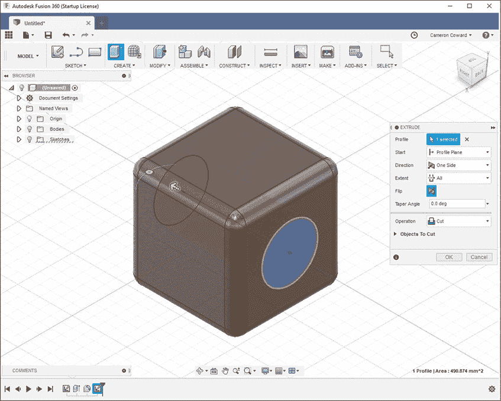

*图 3-11：使用挤出切割孔*

你的立方体现在有了一个孔——很棒！要保存你的模型，请点击**保存**图标。

### 使用设计历史时间线

你可能已经注意到，图标开始出现在设计历史时间线窗口的左下角。这些图标代表了你在创建此特定模型过程中所采取的每一步（参见图 3-12）。

你还可以使用“回退”和“前进”按钮在所有功能间跳转，查看每一步的变化。你甚至可以使用播放按钮，查看你建模过程的时间流逝效果。

能够跳过各个功能步骤很酷，但设计历史时间线的真正强大之处在于它能够修改那些旧的功能和草图。当你使用时间线对早期步骤进行更改时，时间线中所有后续项目应该更新以反映你的更改。让我们来试试吧！

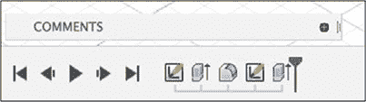

*图 3-12：设计历史时间线*

右键点击时间线中的第二个项目——第一个应该是草图，第二个应该是初始挤出。接下来，点击**编辑特征**，原始的挤出特征对话框应该会重新弹出。现在，将距离从 50 毫米更改为 100 毫米，然后点击**确定**。结果应该和图 3-13 中所示的模型一样。

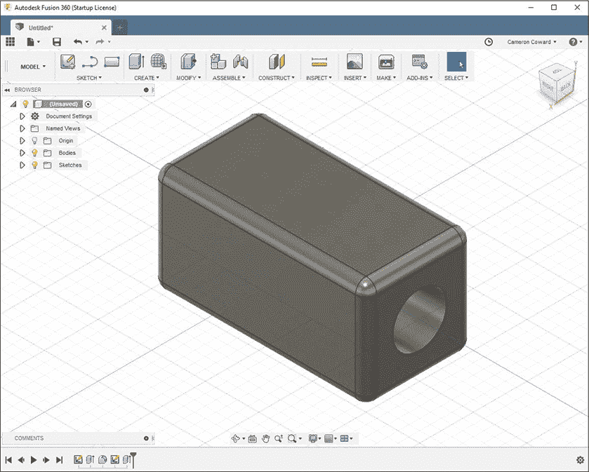

*图 3-13：所有更改后的功能都会更新以反映更改。*

注意到边缘圆角被加长了，但孔依然贯穿整个部件。得益于参数化建模的强大功能，Fusion 360 将几何体分组为变量驱动的特征，这些特征会随着更改而调整。边缘本身有圆角，所以当边缘变长时，圆角也会变长。回想一下，当你挤出孔切割时，你选择了“全部”选项，所以当挤出长度增加时，切割也随之增加。

你选择前面或后面作为该特征的原因是为了避免出现像图 3-14 所示的意外结果。

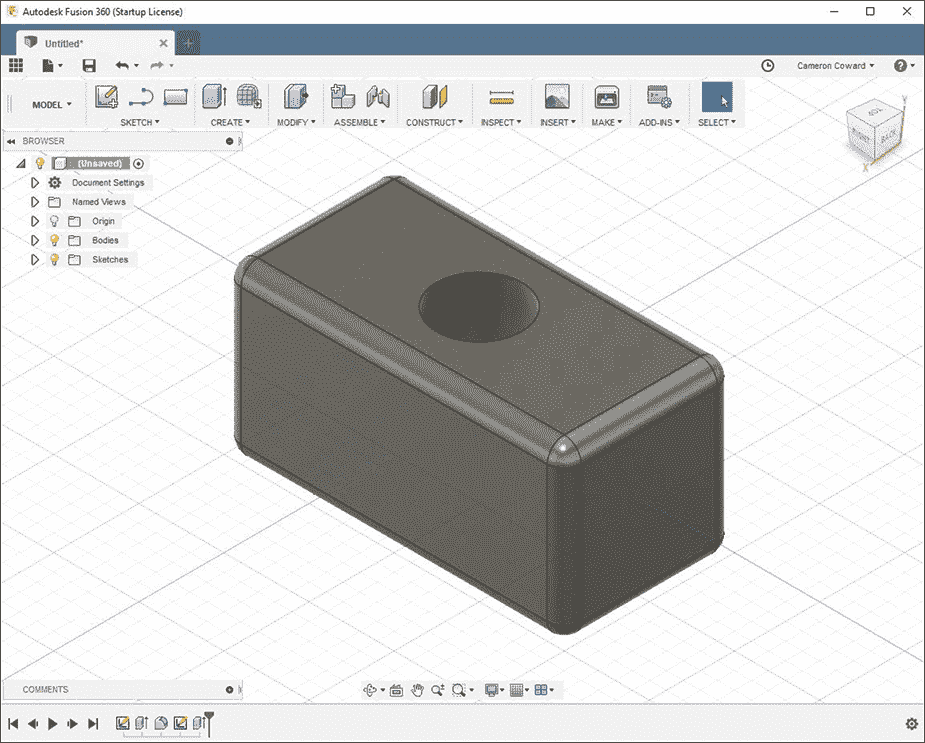

*图 3-14：孔在错误的面上！*

在这个案例中，孔是通过其中一个侧面挤出的。当模型只是一个立方体时，无论你在哪个面上绘制孔，它看起来都是一样的。但当模型被扩展时，如果你选择了左、右、上或下的面，孔可能会出现在错误的位置。你如何选择模型的朝向完全取决于你，只要你记住功能之间的位置关系。

### 练习

通过完成以下练习，自己练习本章中学到的技巧。

#### *添加槽口*

通过右键点击设计历史时间线中相应的特征并选择**删除**，可以移除块体中的孔。在此案例中，孔特征是时间线中的最后一个。但是，如果你丢失了特征的位置，可以将光标悬停在设计历史时间线的条目图标上，以高亮显示模型中的相应特征，或将标记拖回时间线，查看每个建模步骤。

现在，你将向顶部面添加一个槽口。要绘制槽口，你可以使用“草图”菜单中的槽口工具。有不同的定义方式，而你将选择使用总长度。设定其长度为 50 mm，宽度为 20 mm。完成后，它应当看起来像图 3-15 所示的模型。

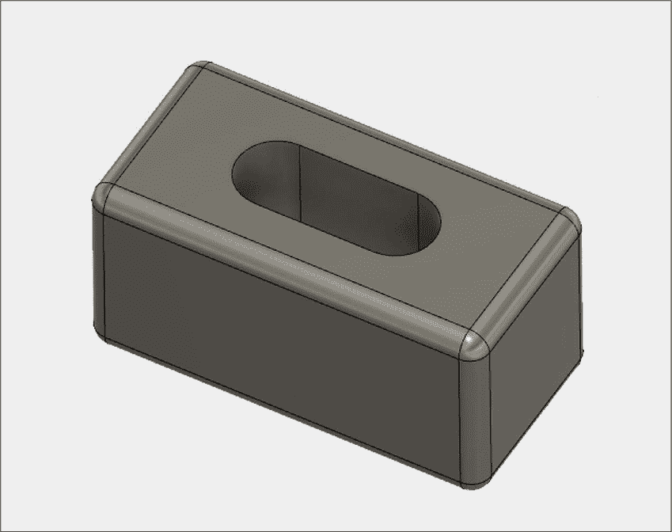

*图 3-15：在块体的顶部面添加槽口。*

#### *使槽口响应式*

正如你已经看到的，考虑模型未来如何变化非常重要。在第一个练习中，你将槽口设置为 50 mm 长——即块体本身长度的一半。假设你*始终*希望槽口的长度是块体长度的一半，无论块体的长度如何变化。

为此，编辑槽口草图。在“修改”下拉菜单中，点击**更改参数**，会弹出一个对话框，列出模型中使用的所有尺寸（你可能需要展开子菜单）。参数分为用户参数（你显式创建的）和模型参数（Fusion 360 在你建模新特征时自动生成的）。其中一个尺寸将是 100 mm 的拉伸距离。记下它的名称，在我的情况下是“d3”。

接下来，你可以修改槽口的长度尺寸，使用类似“d3 / 2”这样的表达式。现在，槽口的长度将始终被计算为拉伸距离的一半。

如果你延长块体，你的模型应该看起来像图 3-16 所示的模型。

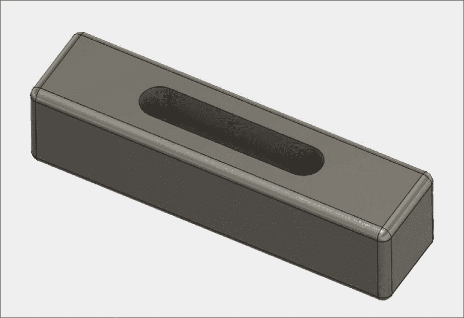

*图 3-16：使用参数使槽口长度始终为块体长度的一半。*

### 总结

通过一个简单的 CAD 建模示例，你学会了如何使用 Fusion 360 的最通用工具：拉伸。在接下来的章节中，你将深入学习越来越复杂的功能，但你将继续在本书以及所有 3D 建模项目中使用拉伸工具。
