## 第四章：**将二维草图旋转为三维物体**

生成参数化三维物体的最直接方法是通过操作二维草图。在上一章中，您通过拉伸一个正方形生成了一个立方体。在本章中，您将学习如何使用旋转特征从草图生成一个球形物体，然后通过倒角和倒圆角将特征平滑连接起来。

### 创建一个球体作为旋转特征

在本节中，您将使用旋转工具通过围绕中心轴旋转轮廓来创建一个实心体。

#### *草图圆形*

从创建一个草图开始，选择前视平面；记得点击视图立方体上的**前视**，以将视图定向到正确的平面。所有旋转操作都需要一个中心*轴*——一个围绕其旋转草图几何体的假想线——以创建一个实心体。在这种情况下，中心轴将是现有的 y 轴。

绘制一个中心直径圆，其圆心位于原点，直径为 50 毫米。然后，从圆的顶部绘制一条线到圆的底部。确保这条线是垂直的；如果是，您的光标应自动吸附到圆上。您的草图应如下所示：图 4-1。

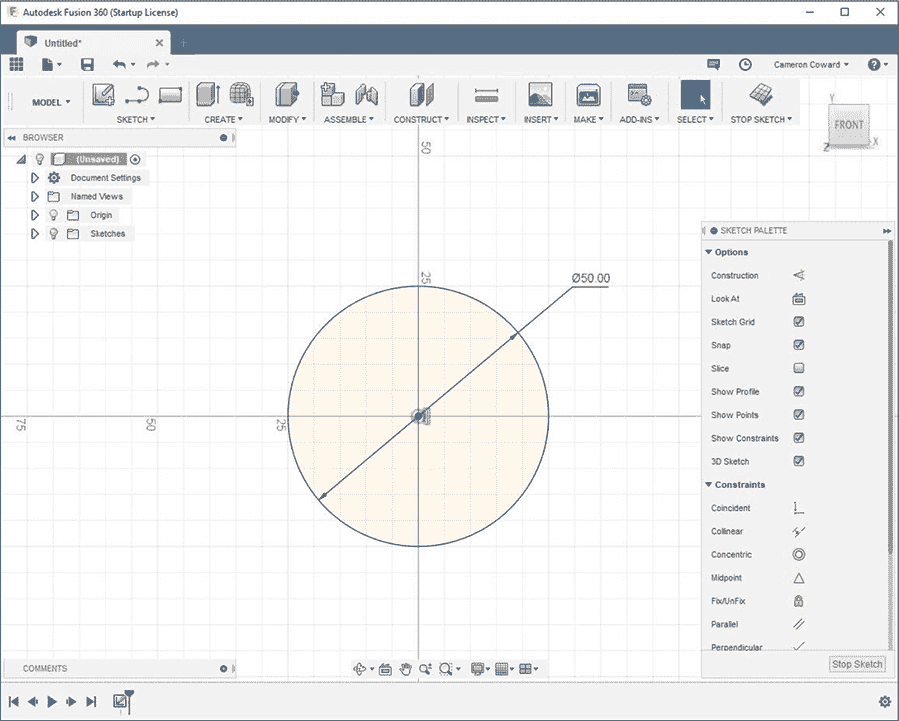

*图 4-1：一个中心直径圆，圆心位于原点，直径为 50 毫米*

注意，您刚绘制的线是蓝色的，这表示它没有完全约束。为了确保该线通过圆心，请按住 Windows 上的 CTRL 或 Mac 上的 COMMAND，同时选择该线和圆的圆心。然后，在 Fusion 360 窗口右侧的草图调色板中，向下滚动到约束并点击**共线**，如图 4-2 所示。*共线*约束会强制您的选择对齐。共线约束应将圆心锁定在该线段的路径上，但它仍然可以在该路径上自由移动。

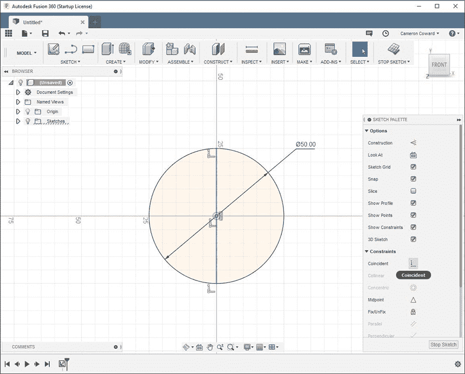

*图 4-2：添加共线约束将完全约束圆形草图。*

选定的轮廓不应与旋转轴（这里是 y 轴）相交，但可以触及该轴。目前，圆形与旋转轴相交，因此需要修剪它。您可以在功能选项中选择圆的一半，或者选择**修剪**工具并点击圆的左侧某个位置。

您删除的圆的部分应被红色突出显示。修剪工具将在其最近的交点处切断线。在本例中，最近的交点是垂直线与圆的交点。您应该剩下一个与旋转轴接触的半圆。

#### *旋转圆形*

现在你可以选择旋转工具。选择轮廓并然后选择旋转轴。为了确保你成功选择了 y 轴，点击屏幕左上角的原点按钮旁边的箭头。箭头会显示默认的参考几何体（如图 4-3 所示），其中包括自动生成的原点、坐标轴和面。你可以从那里选择**Y**轴。

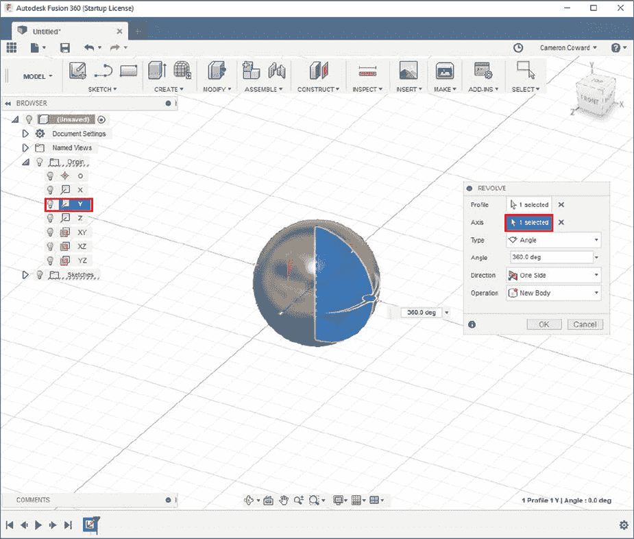

*图 4-3：手动选择 y 轴*

类型设置应该选择角度为 360 度或全圆；对于操作设置，选择**新建实体**。你现在已经拥有了一个像图 4-4 所示的崭新球体！

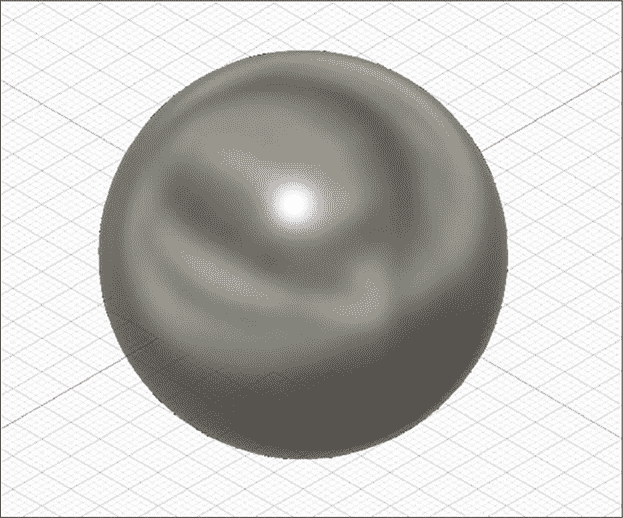

*图 4-4：一个基本的球体*

#### *修改球体*

现在你有了一个基本的球体，接下来通过添加几个特征来让它更有趣。首先，使用挤出功能在球体的中心沿垂直轴做一个孔。

由于这是一个球体，没有平面面，因此你需要在现有的顶部平面上进行草图绘制——即 x-z 平面，这是默认创建的。创建一个新草图，然后从窗口左侧的原点文件夹中选择**x-z 平面**（如图 4-5 所示）。接着在原点中心画一个直径为 15 毫米的圆，并执行*切削挤出*，将范围选项设置为**全部**。选择**双向**作为方向，这样它就会将孔贯穿整个球体。

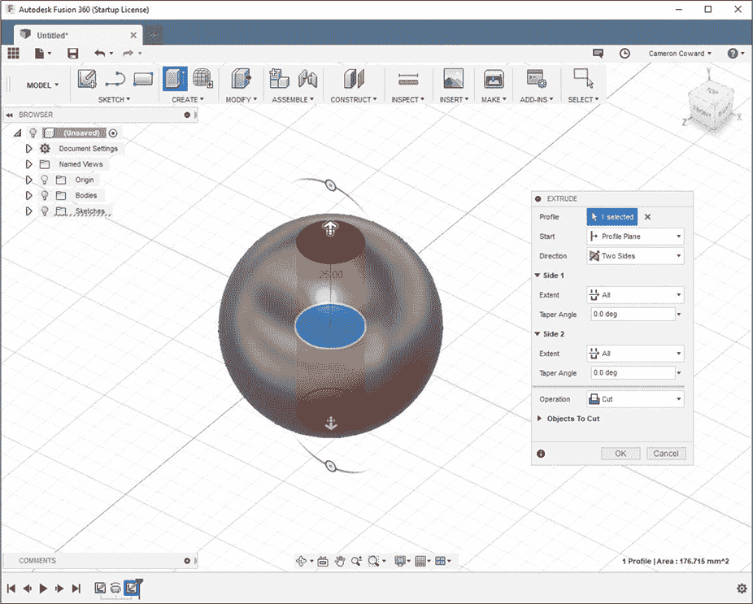

*图 4-5：沿球体的垂直轴挤出一个 15 毫米的孔*

你现在应该有一个看起来像珠子的物体；不过，边缘有些粗糙，所以请给孔的两个开口添加倒角特征。你可以在“修改”菜单下找到倒角工具，它用于将选定的边缘削平。

你通过指定从选定边缘开始切削的距离来定义倒角——可以选择两个不同的距离、两个相等的距离，或一个距离和一个角度。在这种情况下，选择两个相等的距离。输入 2 毫米的距离并完成特征，使得你的模型看起来像图 4-6 所示。

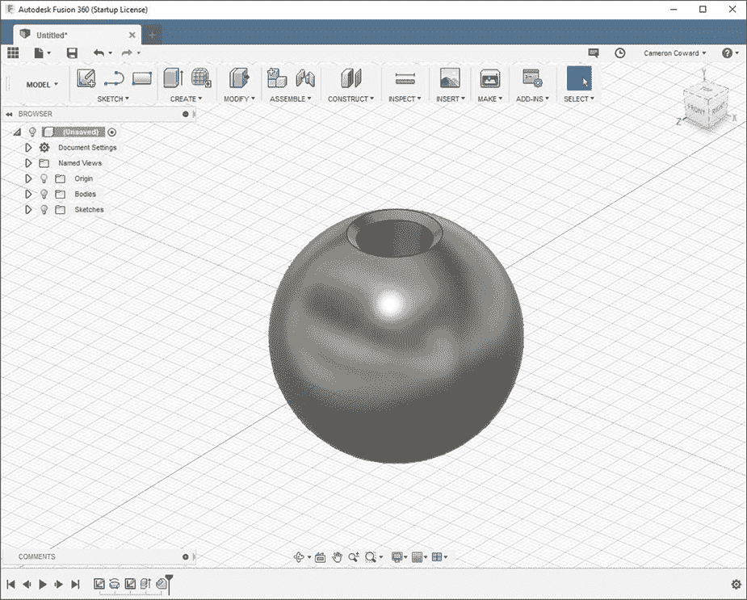

*图 4-6：孔现在有了精美的倒角边缘。*

现在你应该理解参考几何体的重要性。接下来，你将最终建模一些有用的东西！

### 建模一个装饰性铅笔盒

3D CAD 建模的乐趣最在于设计一些你真正能用到的物品。也许你打算将模型进行 3D 打印、CNC 加工，甚至外包给工厂生产。

在本节中，你将学习如何建模一个基本的装饰性铅笔盒。你将使用你已经学过的功能，并且会用到一些新的功能，比如弧形和外壳。如果你愿意，完成后你可以将此模型进行 3D 打印，并把它放在你的桌子上，让同事们羡慕你新学到的技能。

#### *创建一个简单的盒子特征*

首先，在顶部平面（x-z 平面）上绘制一个 75 mm × 75 mm 的正方形。使用中心矩形选项，将正方形居中于原点。然后，拉伸你所创建的轮廓—100 mm 向上—以创建基础特征，如图 4-7 所示。

接下来，你将创建一个 Revolve 特征。

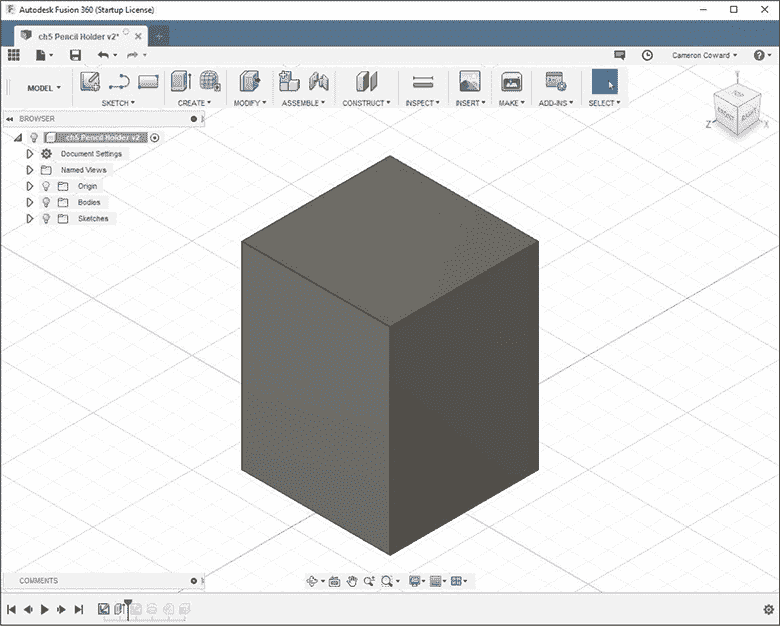

*图 4-7：基础特征是一个 75 mm × 75 mm × 100 mm 的拉伸。*

#### *绘制弧线*

在前视平面（x-y 平面）上创建 Revolve 特征，首先绘制一个草图，类似于图 4-8 所示。约束弧线，使其与从底部起始的 80 度角度线相切。一定要使用现有的 y 轴作为 Revolve 工具的旋转轴。

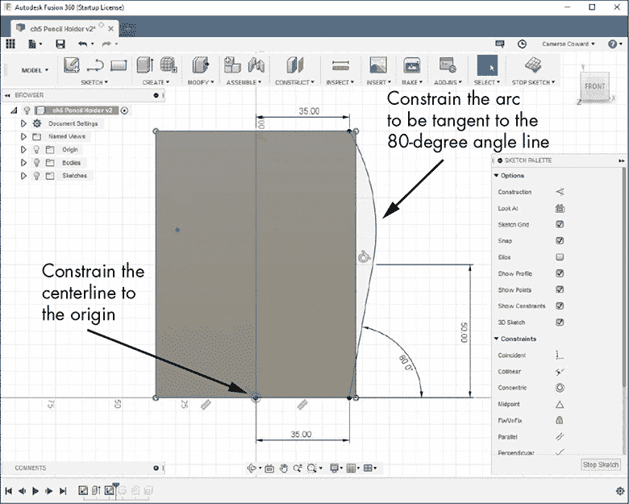

*图 4-8：按照所示绘制草图，特别注意约束条件。*

你只需要使用的新工具是弧线工具。画一条从角度线到顶部水平线的弧线；然后选择角度线和弧线，从草图面板中给它们添加一个切线约束。你可以使用三点弧线，也可以使用切线弧线，这样可以省去手动添加切线约束的第二步。

#### *围绕弧线特征进行旋转*

草图完成后，现在你可以创建 Revolve 特征了。你可以像之前那样操作——选择你刚刚绘制的草图作为轮廓，并将 y 轴作为旋转轴。不过，这次将操作类型更改为**交集**，如图 4-9 所示。

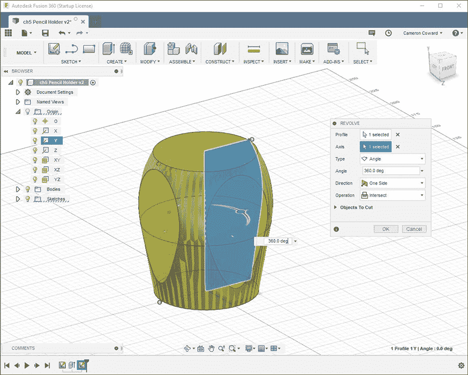

*图 4-9：使用 Revolve 特征和交集选项。*

交集类型只保留现有实体与新实体重叠部分的几何体。在这个例子中，Revolve 特征本应创建的实体并没有完全达到 Extrude 特征所创建的盒子的角落，因此交集操作去除了模型中没有重叠的部分——即角落部分。你现在应该只剩下一个看起来像图 4-10 的实体。

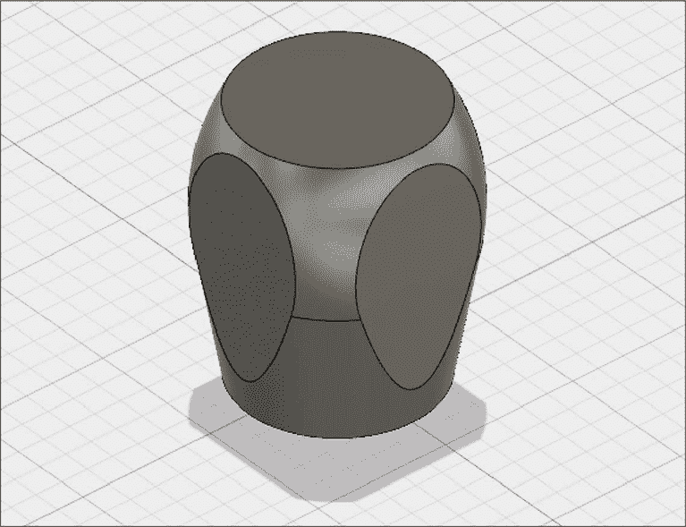

*图 4-10：Extrude 和 Revolve 特征相交的结果*

现在你有了一个有趣的形状，但这些边缘并没有很好地融合在一起——从视觉上看，有些生硬。倒角和圆角对于平滑这种突兀的边缘非常有用，而且它们能让你的模型更显精致。为了改善外观，可以在底边以及四个泪滴形状的边缘上添加 5 mm 的倒角或圆角，如图 4-11 所示。

你的铅笔架现在应该有了圆润的边缘。

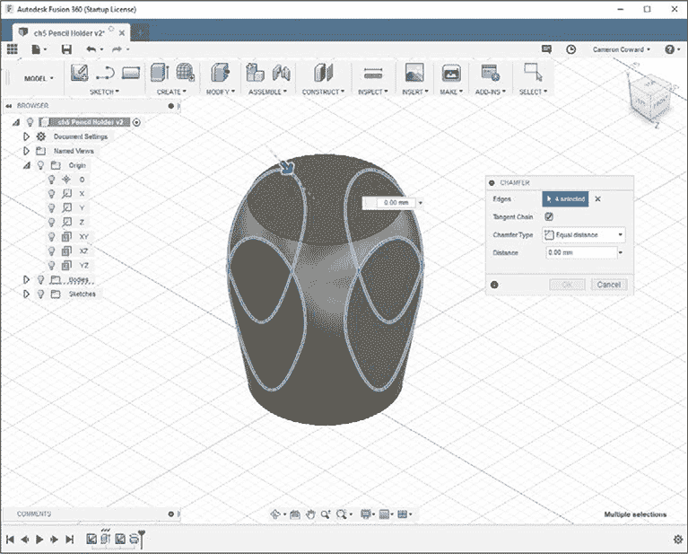

*图 4-11：倒角和圆角非常适合改善模型的表面处理效果。*

#### *使用壳体特征 hollow 处理模型*

最后，添加一个壳体特征来将模型 hollow 处理；这样，你就可以在模型内部放置铅笔了。

从修改下拉菜单中选择**壳体**，确保取消选中切线链，并选择顶部面。这告诉 Fusion 360，这是你希望保持开放的面。方向设置应选择内侧，内侧厚度设置为 5 毫米，即墙壁的厚度。

点击**确定**，完成！你的模型应该有一个开放的顶部和一个中空的内部，四周墙壁厚度为 5 毫米。尝试使用挤出、旋转和倒角功能来调整设计，以满足你的需求。

#### *打印模型*

如果你想 3D 打印你的设计，从制作下拉菜单中选择**3D 打印**。在选择选项中，通过点击你的模型来选择你想要打印的实心体。你可以通过精细化选项来设置网格的质量，这决定了构建网格时使用多少三角形。通常，唯一不使用最高设置的原因是为了保持文件大小较小。如果你只想保存 STL 文件以供后续打印，请取消选中**发送到 3D 打印工具**。如果勾选，它将自动将 STL 文件导出到你选择的切片软件。

### 练习

你应该完成以下项目，以练习到目前为止学到的技能。本书到目前为止涵盖的工具和功能足以让你完成每个项目。

记住，建模没有对错之分——虽然有最佳实践。你创建这些模型的步骤可能与别人不同；重要的是最终的结果，并且你理解自己所做的以及为什么这么做。

这些模型的实际尺寸并不重要。它们只是你练习和测试所学知识的起点。你可以随意更改设计或添加内容！

#### *钱夹夹子*

尝试建模图 4-12 中展示的简单钱夹夹子；然后尝试调整设计，使其更加个性化或更具功能性。

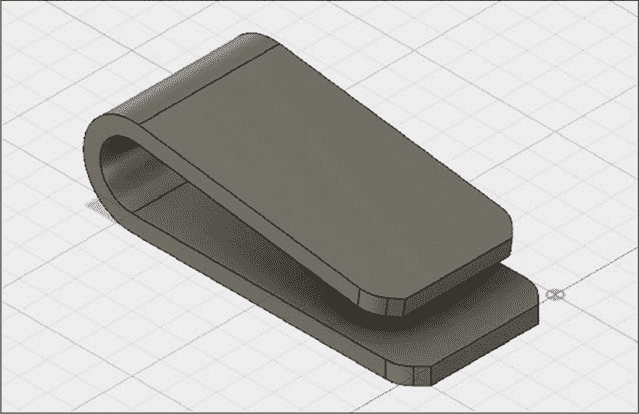

*图 4-12：一个简单的钱夹夹子！*

#### *衬衫按钮*

衬衫上的钮扣经常掉落，谁能记得把那些附带的备用钮扣放在哪里呢？现在你可以自己 3D 打印替换按钮了！图 4-13 中的模型在顶部有一个凹陷面，增加了一些难度。

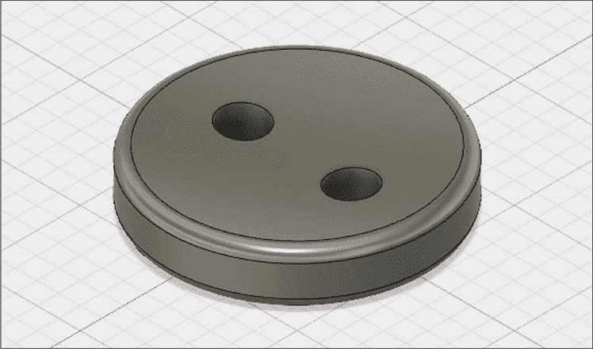

*图 4-13：一个替换的衬衫按钮*

一旦掌握了这个按钮，尝试复制你已有的衬衫上的按钮。

#### *电子元件引脚弯曲器*

你是否曾经做过电子项目，发现自己在弯曲元件引脚时很难做到长度一致且整齐？图 4-14 中展示的这个方便工具可以解决这个问题。它有槽位可以固定像电阻或 LED 这样的元件，让你可以把它们的引脚弯曲到你想要的长度。尝试根据你的面包板的间距来定制它。

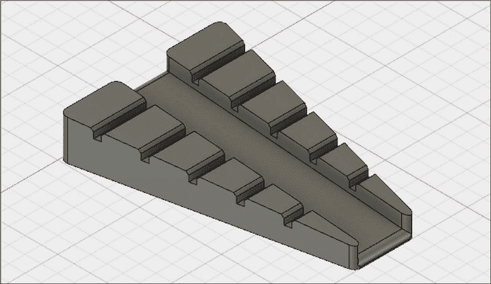

*图 4-14：使用这个工具弯曲电子元件的腿部。*

### 总结

在这一章中，你掌握了一些重要的新技能，并扩展了你的建模词汇，加入了更多的工具。在本书的其余部分，你将学习到越来越多的高级工具和技术，但你已经可以仅凭目前所学完成许多项目了。

你制作的大多数模型将由像这样的特征组成，这些特征乍一看似乎很简单，但它们非常多功能，你可以利用它们创建种类繁多的几何形状。尝试以下练习来建模一些有用的部件；然后通过在你自己的建模项目中运用这些新技能进行实验。
