# 第五章：**建模装配体**

到某个时候，你可能会对只包含单个零件的设计感到厌烦。在本章中，你将学习如何使用 Fusion 360 创建更复杂的、多部件的机制，称为*装配体*，它们可以由两个或更多的*组件*（零件）组成，甚至由多个子装配体构成。一辆车的引擎就是一个装配体的例子。

Fusion 360 提供了几种创建装配体的方法。你可以在一个 Fusion 360 文件中制作并装配多个实体体，也可以将单独的文件合并成一个装配体。在本章中，你将学习这两种方法，以及如何将它们结合使用。

你使用的方法取决于你想要完成的任务，以及从直觉上最适合你的方法。对于某些人来说，每个文件包含一个单独的实体体（一个组件）似乎是最自然的结构方式。其他人则更喜欢将所有固体体放在一个文件中—并将其转换为组件—来进行装配。使用一个文件可能更简单，但它提供的灵活性较少。除非你有充分的理由不这样做，否则最好将组件作为单独的文件保存，因为这样更容易编辑组件，并有助于组织和协作。

在本章中，你还将学习参考几何体，这是一种创建复杂模型及其内部关系的宝贵工具，对于高级建模至关重要。

### 将实体体转换为单个文件中的组件

组件允许你在构建实体的同一文件中构建装配体。传统上，大多数 CAD 软件要求用户在单独的文件中处理零件和装配体；你需要在零件文件和装配体文件之间做出选择。Fusion 360 不会明确区分文件类型，因此你可以在同一个文件中编辑零件和装配体。用户可以在组件内创建和操作实体，组件保持自己的坐标系，并且可以在同一文件或不同文件中创建。

以下是一些常见的用户界面术语：

**关节** 组件之间的物理关系。

**组件** 存储局部坐标系、实体、特征和草图。

**实体** 存储带有某种构造类型的几何体。

**特征** 设计上的一个动作及该动作的参数。

**参数** 一个命名的值。当参数被更改时，设计会重新计算。

我将首先向你展示如何在一个 Fusion 360 文件中创建并装配组件。这样做有两个主要好处。首先，由于你会将所有零件存储在一个文件中，因此它们易于跟踪。其次，通过将一个实体体拆分为两个，你可以确保组件之间的精确配合。

为了学习这项技术，你将建模一个带盖子的盒子，二者共同组成一个组件。首先，打开一个新文件，并建模一个宽 100 mm、深 75 mm、高 50 mm 的矩形棱镜。为了增加一点风格，可以将除了底部四个边以外的所有边都加上 5 mm 的倒角（见图 5-1）。

要将这个物体变成一个盒子和一个盖子，你需要将其分割成两部分。你可以使用分割体工具轻松做到这一点。不过，首先你需要一种方法来定义分割发生的位置。

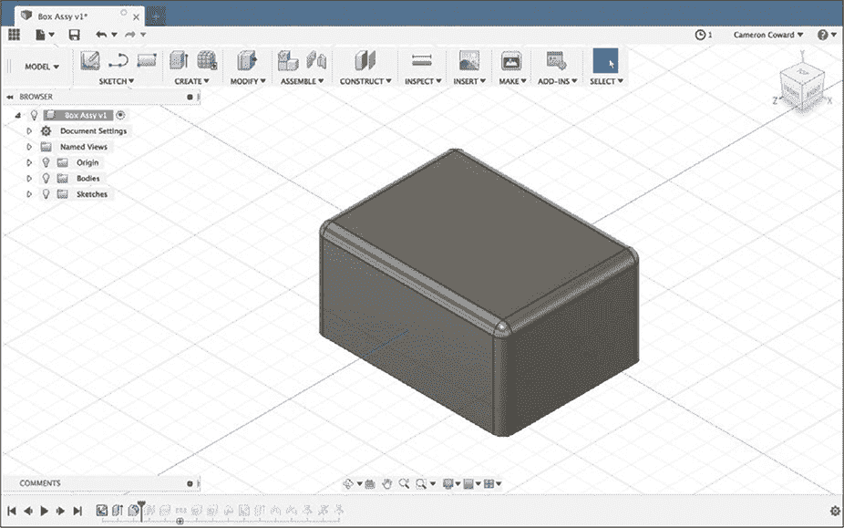

*图 5-1：首先建模一个 100 mm × 75 mm × 50 mm 的矩形棱镜。*

#### *使用构造平面分割物体*

告诉分割体工具在哪儿进行切割的一种方法是画一条简单的线穿过前面或侧面。这种方法在分割不是直线时特别有用。例如，你可以沿着一个弧形来分割模型。

因为我们只需要一个简单的直线切割，我们将使用一种更快的方法：沿着*构造平面*切割。构造平面、轴和点都是参考几何体的例子。（参考几何体在建模过程中用作引导，但它不是模型的物理部分。）你可能使用构造平面将一个特征从模型的一侧镜像到另一侧，或者你可能使用构造轴作为旋转特征的旋转轴。

在这种情况下，你将创建一个构造平面，告诉**分割体**工具在哪里划分固体体积。从构造下拉菜单中选择**偏移平面**。偏移平面工具会创建一个与所选平面平行的构造平面。在“平面”框中，选择盒子的顶面。接下来，在下拉菜单的“距离”框中，确定新平面距离原平面的距离。正值会使新平面位于原平面之上，而负值则使其位于下面。对于我们的目的，输入**–15.00 mm**，如图 5-2 所示。

现在，你已经具备了将模型分割成两个固体体所需的一切。从修改下拉菜单中选择**分割体**工具。当工具询问你要分割哪个体时，你可以点击模型的任意位置。它还会询问要使用什么作为分割工具，或者说你希望在哪里分割模型。在这种情况下，分割工具就是你刚刚创建的构造平面（但它也可以是草图或其他参考对象）。选择构造平面，然后完成分割，如图 5-3 所示。

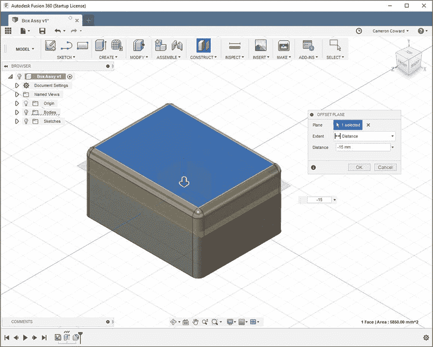

*图 5-2：使用偏移平面创建一个距离顶面 15 mm 的构造平面。*

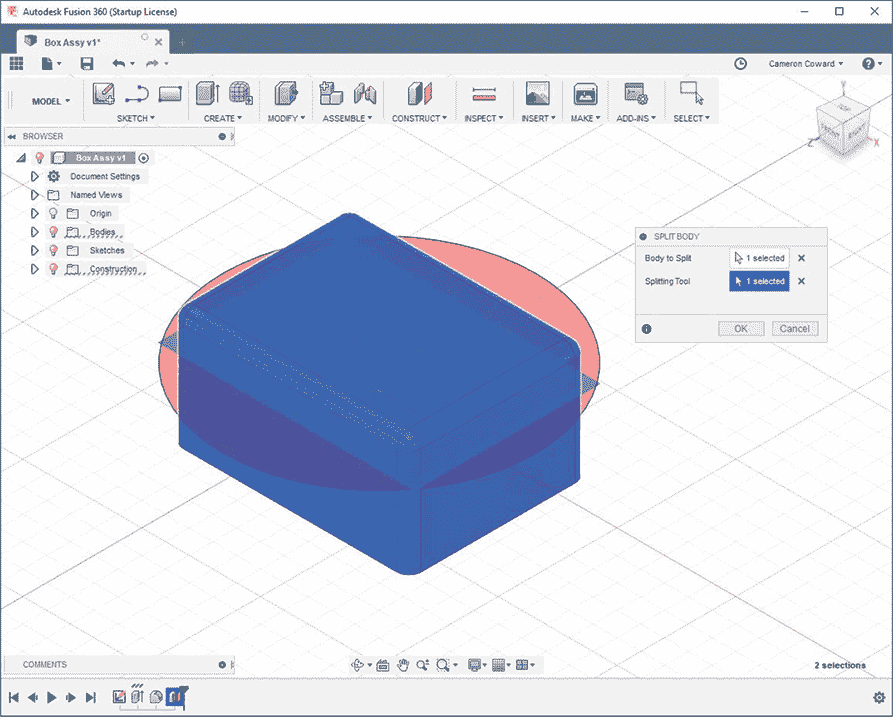

*图 5-3：分割体工具使用一个参考对象将模型分割成多个固体体。*

你的模型现在由两个独立的实心实体组成（一个是盒子，一个是盖子）。你不再需要参考平面，因此可以通过点击组件浏览器（左侧）**构造**部分对应的灯泡图标将其隐藏。然而，*不要*删除构造平面，因为拆分实体功能依赖于它。如果删除了平面，任何依赖于它的功能都会失效，包括你刚刚创建的拆分实体。

#### *创建组件*

尽管我们模型中的两个实体已经被拆分，但它们还没有被定义为组件。要一次性将所有实体转换为组件（见图 5-4），右击组件浏览器中的**实体**，然后选择**从实体创建组件**。你也可以通过右击每个实体单独进行此操作。

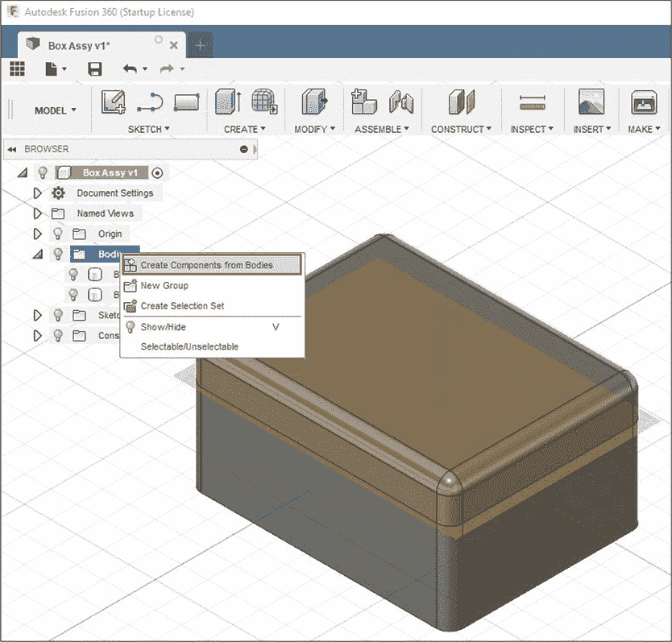

*图 5-4：所有实体可以一步完成转换为组件。*

组件浏览器现在应该列出了两个组件：盖子和盒子。如果你点击这两个组件的下拉箭头，你会看到每个组件现在都有自己的原点、平面和实体。你实际上已经将两个独立的模型放入了同一个文件中。你可以单独移动每个组件，同时保留它们各自的原始坐标。

#### *挖空盒子并创建唇边*

目前，每个组件都是实心的，但为了在盒子里存储物品，你需要将其做成空心，如图 5-5 所示。你已经知道如何使用壳体工具来实现这一点，所以将盒子壳体厚度设为 3 毫米，盖子壳体厚度设为 6 毫米。为了单独处理每个组件，在组件浏览器中将鼠标悬停在组件上并点击**激活组件**。要同时编辑两个组件，将鼠标悬停在组件浏览器的顶部级别，并选择激活组件。

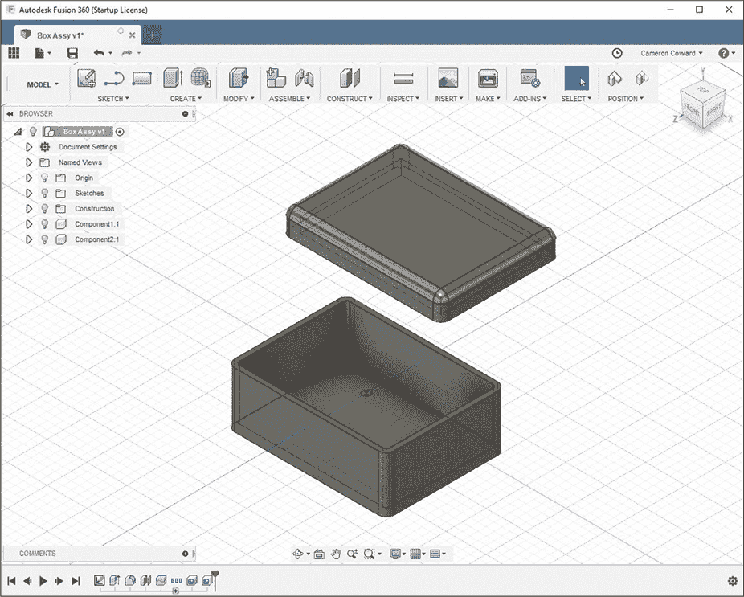

*图 5-5：将每个组件做成空心。*

盖子组件应该比盒子有更厚的壳体，因为你不希望盖子在关闭盒子时滑脱。为了防止这种情况发生，你需要给盖子加一个适合放入底部盒子的唇边。使用更厚的壳体可以提供额外的材料来制作这个唇边。激活盖子组件并旋转它，使你能看到里面，然后在底面上创建一个草图（唇边将在此处）。接下来，将外边缘偏移 3.5 毫米，并将*内部轮廓*拉伸 2.5 毫米，如图 5-6 所示。

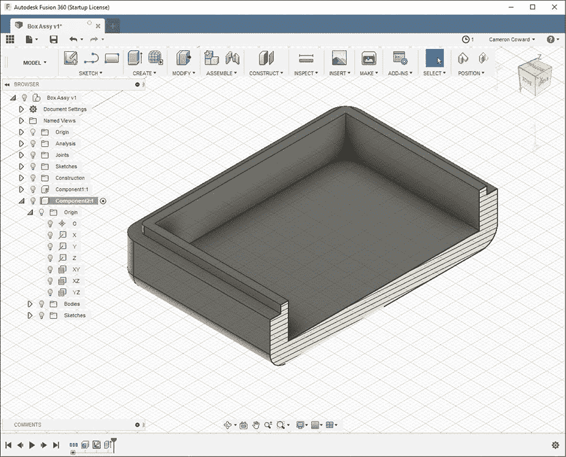

*图 5-6：展示盖子组件拉伸的唇边的截面视图*

在唇缘和盒子之间应该留有 0.5 毫米的间隙，因为当你设计配合的零件时，考虑它们在现实世界中的实际契合非常重要。如果这两个零件被建模为零间隙，那么实际物体可能会配合得太紧（或者根本无法配合）。在工程术语中，你为某些误差留出的空间叫做*tolerance*（公差）。这个 0.5 毫米的公差有助于确保即使这些零件的制造不完美，它们仍能配合在一起。

给配合零件留多少公差是一个比较棘手的问题。如果你希望零件紧密配合，可能根本不留任何公差。如果它们需要能够自由移动，你可能会给它们留很大的公差。确定准确的公差量需要经验、反复试验以及对制造技术和材料的理解。高质量的机械加工可以非常精确，因此在这种情况下通常可以使用非常严格的公差。然而，3D 打印本身就不精确（尤其是业余爱好者使用的熔融沉积成型打印），因此在这种情况下更适合使用较松的公差。

#### *定义关系*

在构建装配时，你通常需要在组件之间创建关系。例如，在建模活塞和气缸时，你需要明确指出活塞位于气缸的中心。同时，你还需要指定它的方向，以及它在气缸中可以移动的距离。

为了定义盒子与盖子之间的关系，你首先需要*固定*其中一个组件。这应该将该组件锁定在空间中，从而使其他组件相对于它移动。通常，你会将你认为是“基础”的组件固定。右键点击盒子组件，然后点击**固定**。

接下来，你将使用连接器来定义盖子相对于盒子的运动。连接器可以限制或允许某些类型的运动；例如，前面的活塞和气缸示例中，活塞会使用圆柱形连接器来允许沿中心轴线的运动，但不允许垂直于轴线的运动。

为了让我们的盒子能够开合，我们需要保持盖子在盒子上居中，同时又能让它上下移动。

从“装配”下拉菜单中，选择**连接器**（或使用**J**快捷键）。接下来，选择一个组件以及该组件上的一个参考点。通常，这个参考点是面的一部分或一个中心点。选择每个组件侧面的中心点（见图 5-7）。然后，如果需要，点击**翻转**，并选择**平面**作为**运动类型**。

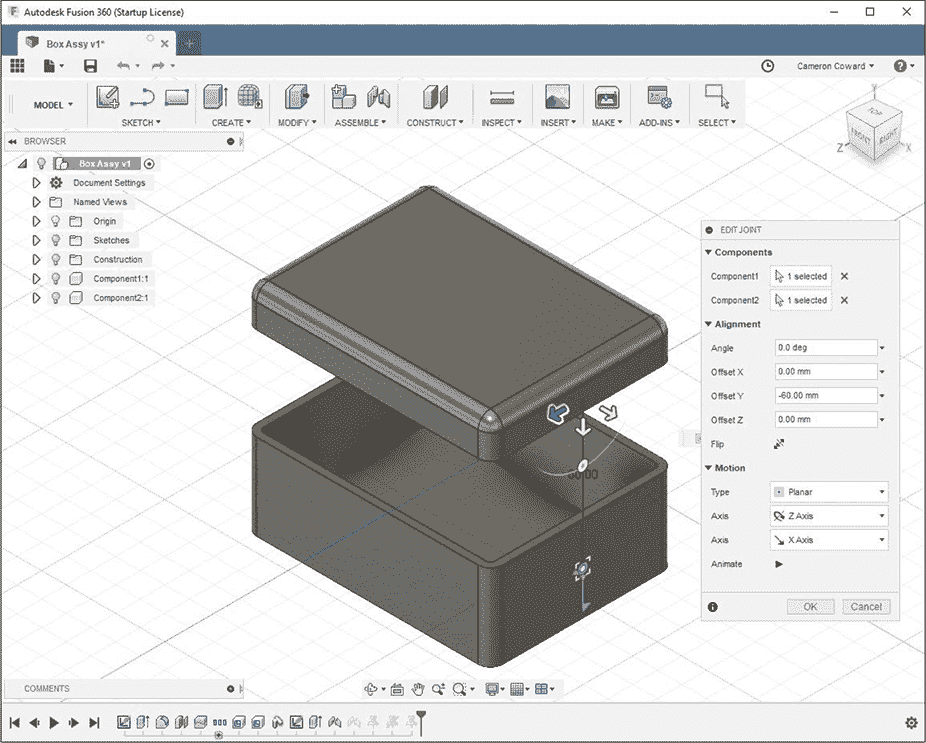

*图 5-7：将平面连接添加到组件的侧面。*

重复这个过程，为前面添加第二个平面连接。现在你应该能够自由地上下移动盖子，但不能左右或前后移动。

你的第一个装配完成了！如果你愿意，可以将每个组件导出为 STL 文件，使用这个模型 3D 打印你自己的盒子。

### 从外部文件装配组件

虽然你可以像制作盒子那样，在一个文件中建模和组装所有零件，但将组件分开存储在不同文件中也是很有用的。以下是一些原因：

+   当你处理包含多个零件的大型装配时，将零件分开管理可以使得保持组件的有序性变得更容易，并且有助于保持文件大小可管理。

+   这样可以与他人协作，工程团队的每个成员可以同时在不同组件上工作。

+   大多数装配有重复的零件。如果你在设计一辆车，你不会希望单独建模每一个 M5X100 的机器螺钉。相反，你只需要建模一个螺钉，然后根据需要将多个实例添加到最终的装配文件中。

为了学习如何从单独的文件创建装配，我们将制作一个有两个相同面的门铰链。你将创建一个单一模型，并将其两个副本导入到装配文件中，完成铰链的制作。

#### *制作铰链桶和支架*

我们从制作铰链的桶开始。这个桶应该是一个中空的圆柱体，草图在顶部平面上，进行对称拉伸。外径（OD）设为 12 毫米，内径（ID）设为 8 毫米，总长度 100 毫米，如图 5-8 所示。

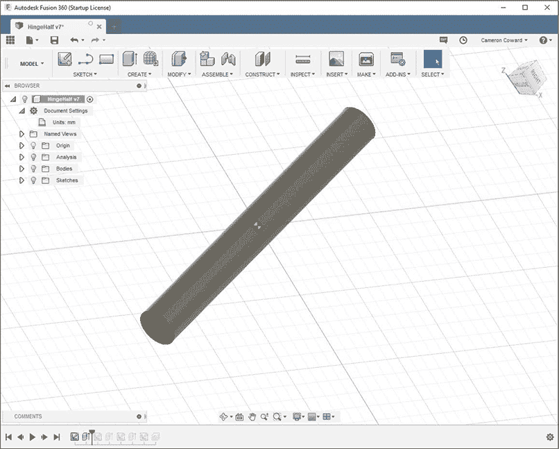

*图 5-8：拉伸一个具有以下尺寸的圆柱体：外径 12 毫米，内径 8 毫米，长度 100 毫米。*

接下来，为铰链支架创建一个平面。首先在圆柱体的一个端面上绘制草图。远离圆柱体，完成一个长 56 毫米、宽 3 毫米的矩形的三边。

不需要修剪重叠的线条——如果你像在图 5-9 中看到的那样保留它们，它们不会产生任何问题。如果我们真的在生产这个铰链，我们希望留出一些容差空间。但为了简化，你可以将一条线与桶的中心对齐。

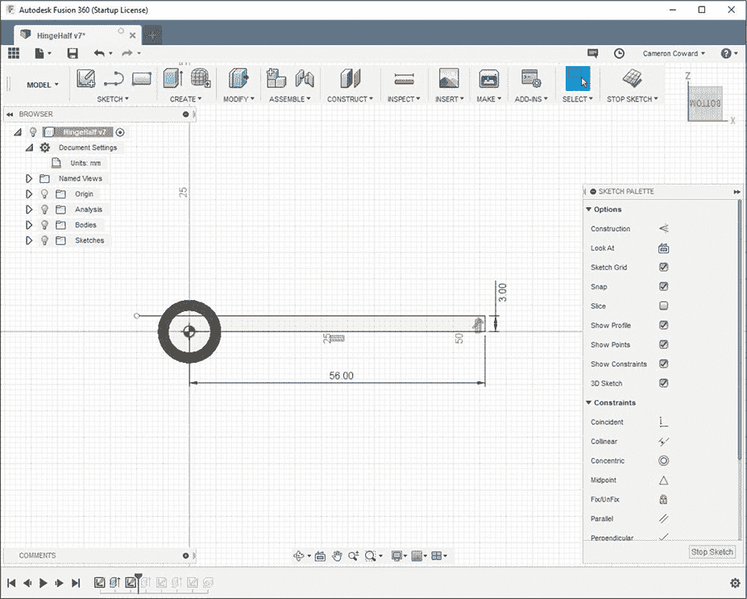

*图 5-9：绘制一个平面为铰链支架创建平面。重叠的线条没有问题；你可以直接拉伸封闭的轮廓。*

一旦你的草图看起来像图 5-9，选择矩形区域并将其拉伸到桶的另一端。此时，你的模型应该像图 5-10 一样。接下来的步骤是切割桶的部分区域。

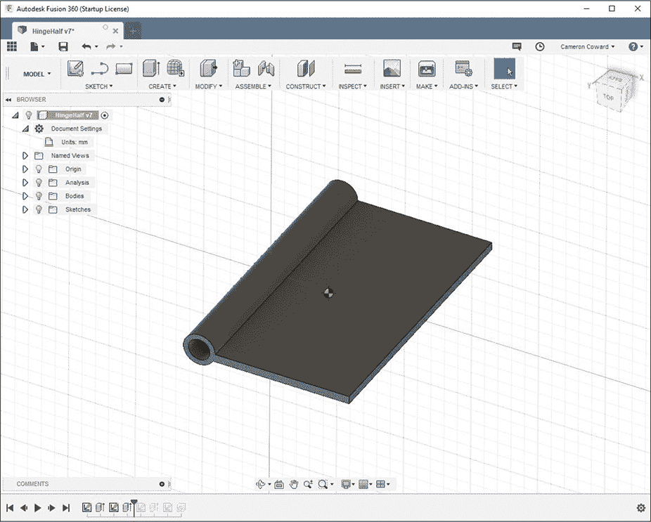

*图 5-10：拉伸铰链主体的其余部分。*

#### *切割桶并更改参数*

我们将在圆柱体上打两个缺口，这样两半将像拼图一样装配在一起。每个缺口的长度必须为 25 毫米（圆柱体的长度除以 4），宽度为 12 毫米（桶体的外径），并且距圆柱体对面的平边 50 毫米。按照这些尺寸绘制并拉伸两个矩形，将桶体分成四个相等的部分，如图 5-11 所示。

等等！如果原始尺寸发生变化，会怎样呢？例如，如果你更改了桶体的直径，那么你刚创建的部分将不再按比例缩放。这时，你可以利用参数化建模的强大功能，重用你已经指定的尺寸。

返回并编辑你刚创建的草图。然后，从修改下拉菜单中打开**更改参数**对话框。在图 5-12 所示的“模型参数”标签下，你将看到你创建的每个特征的条目。如果你展开这些条目，你将看到创建该特征所使用的所有尺寸的列表，以及这些尺寸的名称。

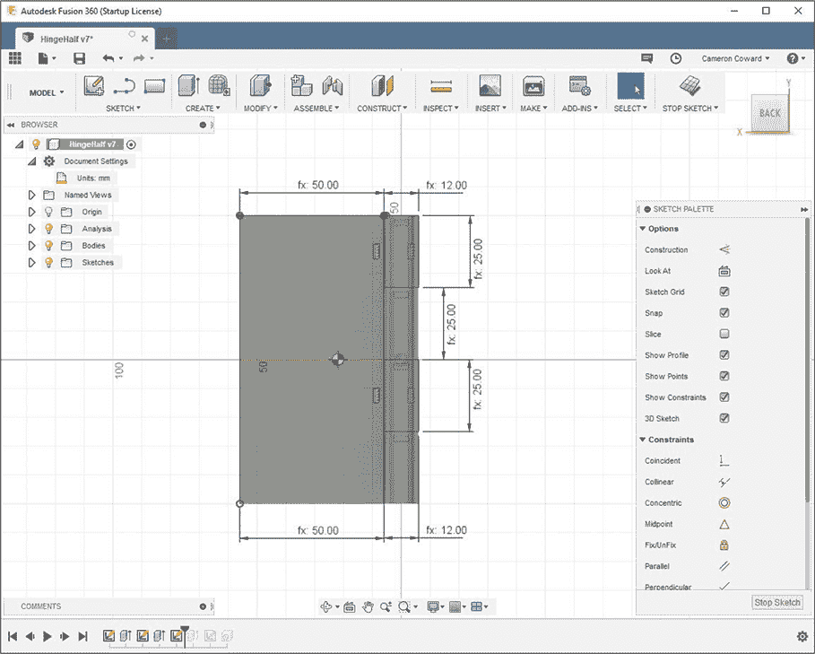

*图 5-11：将桶体分成四个 25 毫米的部分。*

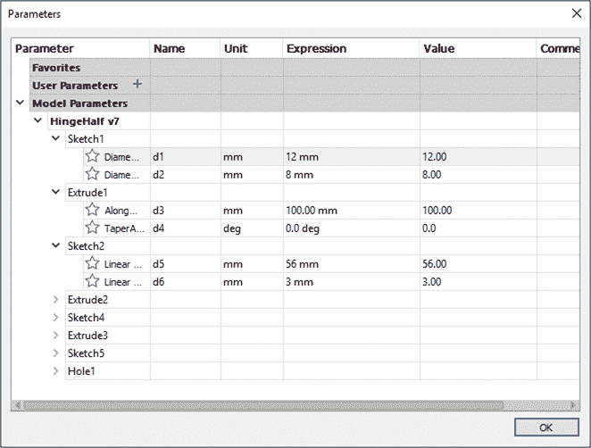

*图 5-12：参数对话框列出了你在之前的特征中使用的所有尺寸。*

现在，你可以改变某些尺寸，使它们引用之前的特征，通过将数值条目替换为依赖于其他物体尺寸的值。例如，因为桶体的长度命名为“d3”，你可以将矩形的长度表达式改为“d3 / 4”，以确保它们总是测量桶体长度的四分之一。

此时，你的铰链应当与图 5-13 中所示的样子相似。

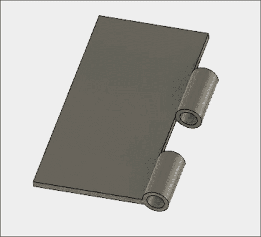

*图 5-13：你的切割拉伸后，实体应当看起来是这样的。*

现在，我们只需要创建安装孔了。

#### *使用孔工具*

建模过程的最后一步是为平板添加一些安装孔，螺钉将通过这些孔。这个步骤对于本教程并不重要，但养成添加细节的习惯是很好的。

你可以随意放置这些孔，但我建议你使用我们还未使用过的方法：*孔*工具。为了使铰链工作，螺钉头需要与平板表面平齐。这意味着你需要制作沉头孔。在铰链的*内侧*面上，添加一些你认为孔应该放置的位置。使用约束或参数引用来放置它们。这样，如果铰链尺寸发生变化，它们的位置也会随之更新。

完成草图后，从创建下拉菜单中选择孔工具。选择你刚刚绘制的每个点。将 **孔类型** 设置为 **沉头孔**，然后探索其余设置，了解它们的功能。当你觉得它看起来像铰链上的安装孔时，完成该特征（参见 图 5-14）。

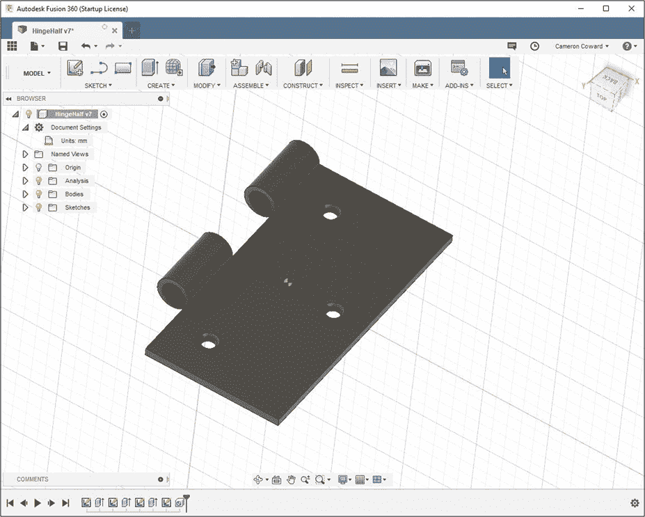

*图 5-14：最终产品应该大致如下所示。*

继续并将此文件保存为类似 *HingeHalf* 的文件名。然后打开一个新文档并将其保存为 *HingeAssembly*。

当你处于空白的 *HingeAssembly* 文件时，使用 Fusion 360 窗口左上角的 Data Panel 按钮打开项目浏览器。右键点击 *HingeHalf* 模型并选择 **插入到当前设计** 选项。点击对话框中的 **确定**，将组件放置到 *HingeAssembly* 文档空间中的任何位置。然后重复此过程插入另一个 *HingeHalf* 模型的副本。

现在你可以像本章第一部分那样组装两个半部分。选择其中一个半部分作为基础模型，使用关节将两者连接起来，如 图 5-15 所示。一个关节应该是圆柱形的，另一个则是平面的。

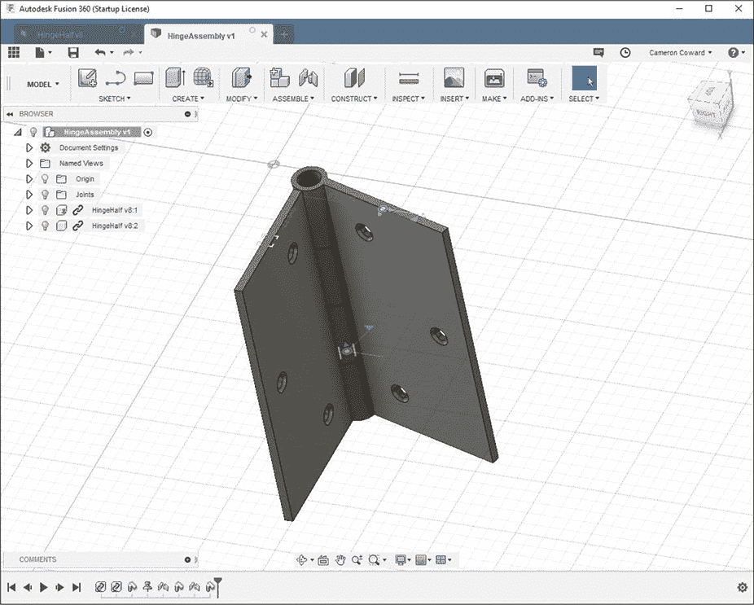

*图 5-15：为装配体添加关节，以便铰链可以开合。*

这样应该可以让你的铰链在保持连接的同时开合。

### 组合装配方法

如你所见，创建装配体的两种方式各有其优点。在单一文件中工作可以从单个基础对象中派生出多个零件，而从多个文件中创建装配体则可以节省你制作重复对象的麻烦。你还可以将这些方法结合起来，获得两者的最佳效果。现在让我们试试，通过在 *HingeAssembly* 文件中为铰链装配体添加一个销钉。

确保在组件浏览器中激活 *HingeAssembly* 的顶层，然后通过右键点击 *HingeAssembly* 创建一个新组件（参见 图 5-16）。

使用到目前为止你学到的工具来建模销钉。完成后，重新激活 *HingeAssembly* 的顶层，为销钉添加关节，使其看起来像图 5-16 中显示的模型。

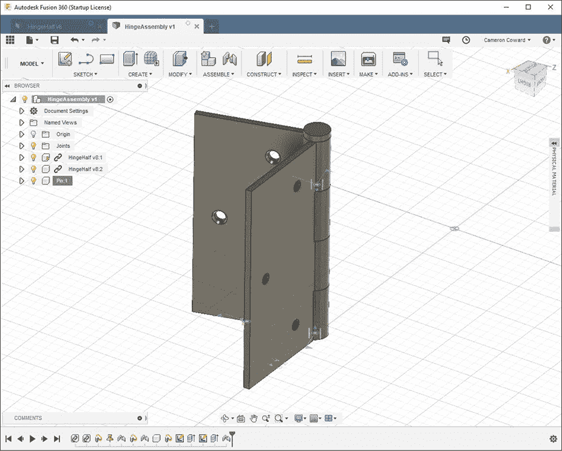

*图 5-16：在* HingeAssembly *文件中为组件添加一个销钉。*

### 总结

现在你知道如何构建装配体了，你的项目不再局限于单一零件。你可以创建包含任意多个零件的复杂模型。

在接下来的章节中，我不会告诉你使用哪种方法来构建装配体，而是让你自己选择最适合执行项目的方式。
