## 第六章：使用复杂曲线建模**

到目前为止，你已经学到了足够的知识，可以重建你在像 Thingiverse 这样的设计分享网站上找到的约 75%的机械模型，尽管具体怎么做可能并不总是显而易见。你创造复杂模型的能力更多依赖于你如何创造性地利用基本功能，而不是你知道多少高级功能。

话虽如此，你仍然会遇到需要使用不寻常工具的情况。本章我们将重点讲解扫掠和放样特性。你将使用这些特性来创建有机形状，这样你就不会局限于构建方块模型。

### 扫掠和放样

如图 6-1 所示，*扫掠*特性通过沿着路径拉伸闭合的轮廓来创建实体。与常规拉伸的路径不同，扫掠的路径可以在三维空间中弯曲和扭曲，这使得此功能非常适合创建电线、管道和手柄。

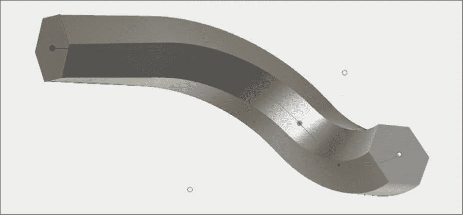

*图 6-1：扫掠特性将轮廓沿路径移动，创建类似管道的实体。*

*放样*特性通过使用两个或更多闭合的轮廓作为截面，创建一个实体，软件会将这些轮廓合并成一个完整的实体。与扫掠不同，放样不需要使用路径；它只是将一个截面变形为下一个截面，生成一个无缝的单一实体，如图 6-2 所示。

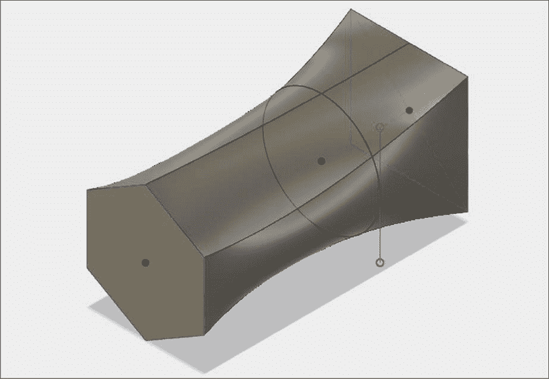

*图 6-2：这个放样将三种不同形状和大小的截面拼接在一起。*

在使用这些特性之前，你需要先熟悉切线和平面、垂直线和平面的概念。两者对于通过扫掠和放样获得你想要的实体至关重要。

表达切线概念出乎意料地困难。从数学上讲，切线是一个与曲线函数在某一点的斜率相等的线，但你很可能是凭直觉理解它为一条从曲线的某一点延续出去的线。想象一下，将一个弹珠绑在绳子的一端，然后释放绳子。弹珠飞行的轨迹线会在你释放绳子的那一刻与弹珠路径的曲线相切。

如图 6-3 所示，左侧的线与圆相切——就像释放弹珠后的路径一样。右侧的线则*不是*切线，代表弹珠因此*不能*沿着这条路径运动。好消息是，Fusion 360 理解切线，所有你需要做的就是将其作为约束添加进去。

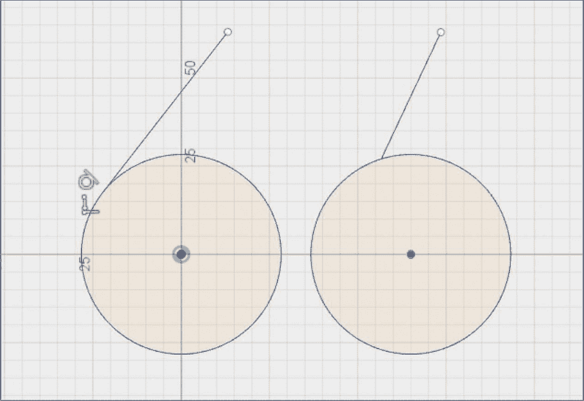

*图 6-3：只有左边的线与相应的圆相切。*

垂直线要简单得多——它们只是两条相交于 90 度角的线，一条线与平面，或两平面。

这些概念很重要，因为扫掠和拉伸功能都会考虑相对角度。扫掠功能查看路径与轮廓交汇处的角度，而拉伸功能则查看截面之间的角度。在大多数情况下，你会希望确保路径和轮廓之间是切线、垂直或平行的，以避免出现意外。此外，除了单个扫掠或拉伸的部分外，你还需要注意它们如何与其他特征相交。图 6-4 中的模型显示了一个间隙，因为扫掠的末端没有与块面垂直。

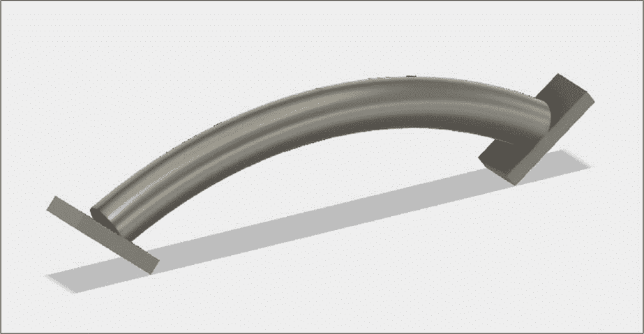

*图 6-4：这个扫掠的路径与它连接的块并不垂直。*

这个模型可以通过两种方式轻松修复。可以通过减小弧度半径或改变块的角度来使扫掠路径与块垂直。或者，如果由于某些设计限制无法更改这些项目，可以将路径延伸更远进入块中以消除间隙。

你选择如何处理类似问题将取决于你正在设计的内容，但始终注意草图、路径、轮廓和特征之间的几何关系是个好主意。这样做不仅是良好的设计实践，而且从长远来看，也能避免建模时的头痛。

### 有机形状和茶壶

是时候学习如何使用扫掠和拉伸了。你将像图 6-5 中的茶壶一样进行建模。正如你所看到的，它由弯曲的有机表面组成，而这些表面是无法通过拉伸和旋转方式创建的。

整个模型由四个主要特征组成。我们将使用一个拉伸（loft）来构建主体，使用一个扫掠（sweep）来做手柄，再用一个第二个拉伸来做壶嘴，最后用壳体（shell）把整个模型做成空心。

*图 6-5：这个茶壶由通过拉伸和扫掠建模的有机形状组成。*

#### *茶壶的主体*

我们将从使用拉伸功能创建茶壶的主体开始。我们将绘制三个独立的草图，并将它们合并成一个整体，如图 6-6 所示。

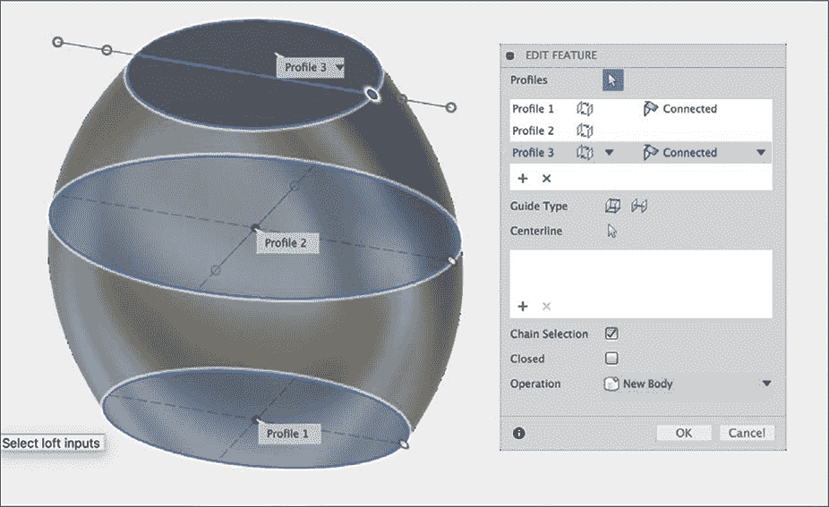

*图 6-6：第一个拉伸由三个草图组成。*

你可以自由选择自己的尺寸，但应使用椭圆作为底部草图（轮廓 1），用较大的椭圆作为中间草图（轮廓 2），并用圆形作为顶部草图（轮廓 3），这样以后建模盖子时会更加方便。所有三个草图共享相同的中心点，且应位于原点处。

你可以在现有的 x-y 平面上绘制轮廓 1 的草图。对于其他两个轮廓，你需要创建施工平面。为了创建这些平面，从“构建”下拉菜单中选择**偏移平面**（Offset Plane），并将其从轮廓 1 的草图平面偏移。当你创建了两个施工平面后，在上面绘制你的草图。

要完成 loft，参考图 6-6 中的对话框。这个 loft 不需要导轨，所以可以将该部分留空。确保勾选**链选择**框，并将操作字段设置为**新建实体**。按顺序选择将要使用的每个轮廓，然后点击**确定**。

#### *茶壶的把手*

接下来，我们将创建形成茶壶把手的扫掠体。你需要为扫掠体创建一条路径，然后创建一个定义把手横截面的轮廓。我们首先创建路径草图，这将为我们提供一个参考点，用于创建轮廓草图，并且提供一条线，可以用来确保轮廓垂直于路径。

在与茶壶底座垂直的 x-z 平面上开始绘制路径草图。我的路径，如图 6-7 所示，由两条弧线组成，但你可以根据自己的需要绘制任何形状的路径。尽管如此，你应该确保路径延伸到茶壶的主体部分。如果你将路径绘制到茶壶主体边缘停止，就会像图 6-4 中看到的那样留下一个间隙。为了更容易查看这个交互作用，你可以通过屏幕底部的显示设置菜单将视觉样式切换为线框模式。

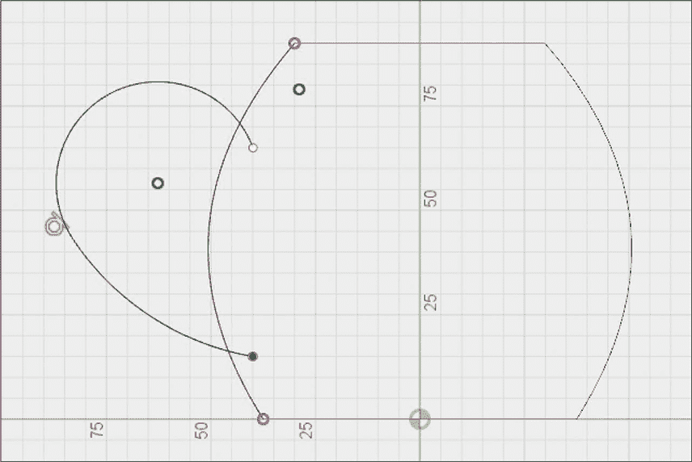

*图 6-7：绘制扫掠体路径。*

你可能注意到你没有定义尺寸。你几乎总是应该明确地定义草图的尺寸。然而，在这种情况下，实际尺寸并不重要，因为我们主要关注的是视觉效果。你仍然应该约束路径，以确保它不会意外地移动。要做到这一点，只需选择这些线条，然后在约束菜单中添加一个*固定约束*，该菜单用于将线条设置为垂直或平行。这样可以将线条锁定在当前位置，并将其变为绿色，表示它们已被固定。

既然你已经创建了路径，就可以为扫掠体创建轮廓了。为了避免在图 6-4 中看到的问题，轮廓应该在路径交点处垂直于路径。然而，这很难做到，因为两个弧的结束角度是我们没有指定的，且没有额外的工作我们也无法测量。因此，我们将创建一个与路径垂直的构造平面。

Fusion 360 实际上提供了一个专门为这种情况设计的构造工具，叫做*沿路径平面*，可以在构造下拉菜单中找到。选择它，然后选择你刚刚绘制的路径，如图 6-8 所示。

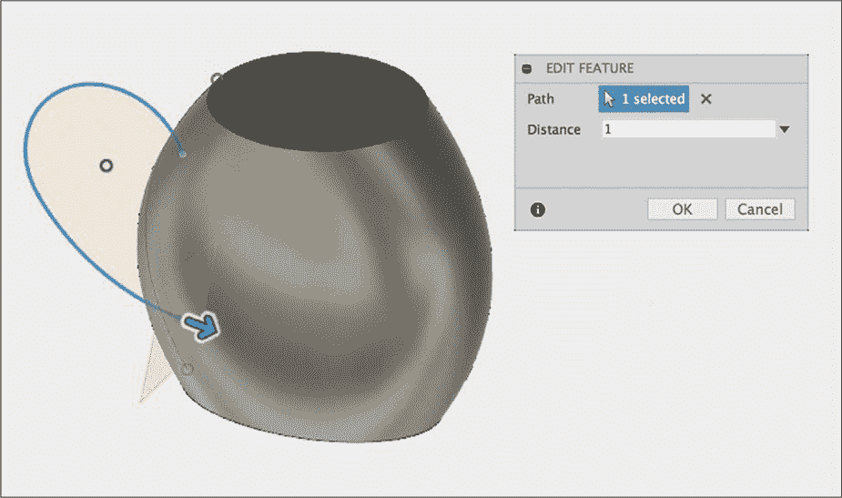

*图 6-8：使用“沿路径平面”工具，轻松创建垂直于路径的平面。*

接下来，设置距离字段，该字段决定沿路径放置构造平面的位置。它不会要求你输入毫米或英寸数，而是要求你输入路径总长度的十进制比例。因此，“0”会将平面放置在一个端点，“1”会将其放置在另一个端点，而“0.5”则将其放置在两者之间。在这种情况下，选择 0 或 1，构造平面将自动垂直于路径端点的切线。

现在你可以确保平面在路径的端点处与路径垂直。你只需要在该平面上绘制一个轮廓，用来表示把手的横截面。与 Loft 功能不同，Loft 功能会将多个轮廓拼接在一起，而 Sweep 功能只是沿路径延伸一个横截面。在图 6-9 中，你可以看到我绘制的轮廓（为了更容易查看，我隐藏了主体）。同样，你可以将其设计成任何你喜欢的形状。

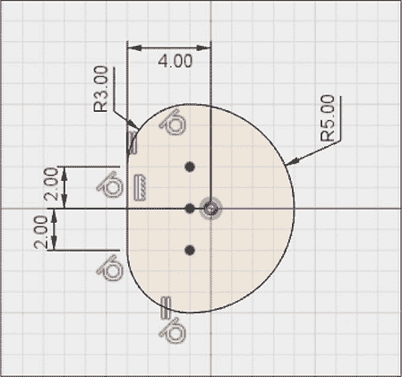

*图 6-9：Sweep 的轮廓草图*

当你创建 Sweep 特征时，该功能位于创建下拉菜单中，你需要选择你刚刚绘制的轮廓和路径。你在图 6-10 中看到的对话框中的其他选项作用不太明显。以下是它们的功能说明：

**类型** 这个选项让你可以使用导轨或表面来控制扫掠的扭曲。如果路径是三维绘制的，扫掠可能会产生不必要的扭曲，导轨可以帮助消除这种扭曲。

**距离** 类似于沿路径平面工具，距离要求你输入路径长度的十进制比例。如果你不希望扫掠覆盖整个路径长度，可以在此指定。

**锥度角度** 默认情况下，轮廓的大小会在整个扫掠过程中保持不变。如果你希望它在过程中增大或减小，可以指定锥度角度设置。

**扭曲角度** 这个选项使轮廓沿路径轴旋转。

**方向** 用此选项确定轮廓相对于路径的方向。因为我们绘制的轮廓与路径完全垂直，我们希望它保持垂直。

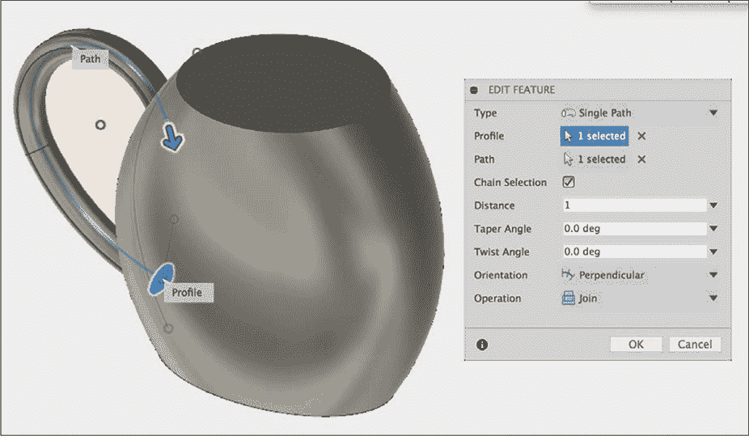

*图 6-10：Sweep 对话框选项比较复杂，通常保持默认设置。*

为了让把手顺畅地过渡到茶壶的主体，可以添加几个大圆角，这样你的模型看起来就像图 6-11 中的那样。

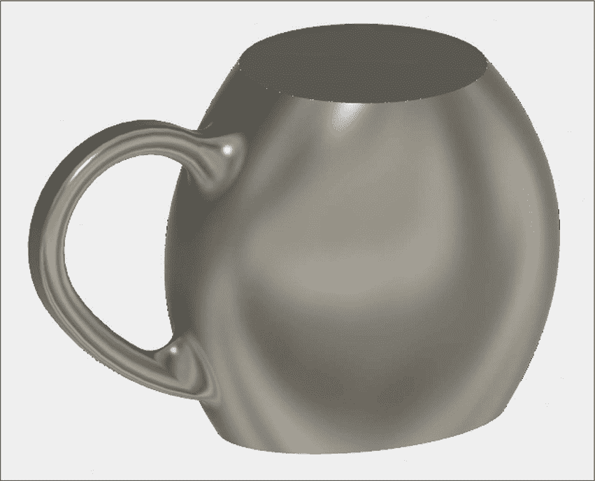

*图 6-11：圆角始终能带来平滑的过渡。*

为此，只需选择把手与主体连接的边缘，Fusion 360 会自动处理添加圆角到不规则边缘的操作。

#### *茶壶的壶嘴*

接下来的功能，壶嘴，是这个模型中最复杂的部分。它是一个 Loft，但使用了一个*导轨*，其作用类似于 Sweep 的路径。

如同我们用于手柄的 sweep 路径一样，首先绘制导轨。我在图 6-12 中展示了我的导轨。绘制完成后，使用固定约束（fix constraint）将其固定。

*图 6-12：Loft 的导轨与 Sweep 的路径类似。*

您需要在导轨的每一端放置一个轮廓，以形成壶嘴的开始和结束部分。使用“沿路径平面”（Plane Along Path）构造平面，在导轨垂直方向上绘制这些轮廓。如图 6-13 所示，我在与茶壶主体接触的地方做了一个大椭圆形的轮廓，在壶嘴的末端做了一个较小的圆形轮廓。

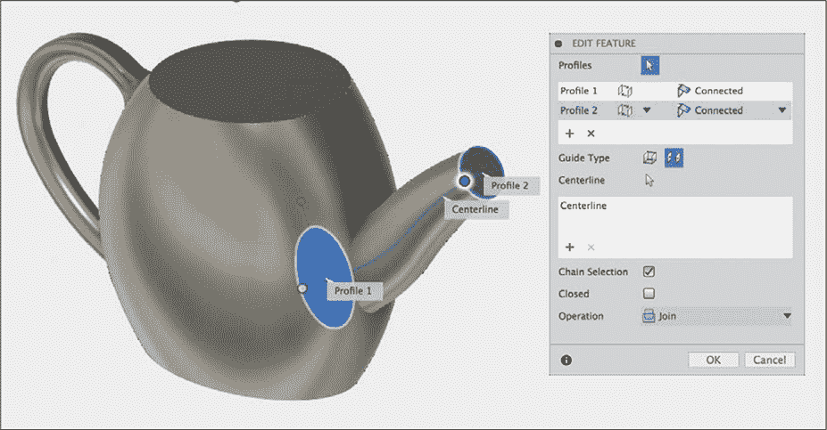

*图 6-13：在导轨的两端添加轮廓以形成壶嘴*

要创建您的 loft，从选择您刚绘制的两个轮廓开始。在对话框的“导轨类型”（Guide Type）字段中，有两个选项供您选择：导轨（Guide Rails）和中心线（Centerline）。如果您希望导轨与轮廓的边缘相交，则选择导轨选项；如果希望导轨位于轮廓内部，则选择中心线。它不必位于轮廓的正中央——对于不规则的形状，这会很棘手。只需要确保它与轮廓边缘上的导轨明显不同。选择中心线后，选择您绘制的导轨。

#### *将茶壶 hollow 化*

要完成模型，首先在壶嘴的底边添加一个倒角，然后为整个模型添加一个壳体特征，将茶壶 hollow 出来。创建壳体时，您需要选择顶部面（盖子的部分）和壶嘴尖端的面。

壳体的厚度可能会导致模型出现错误。这是因为手柄相对较窄，当 Fusion 360 无法创建带有单一开口腔体的壳体时，它会出错。例如，如果手柄最窄处为 10 毫米宽，那么 6 毫米的壁厚会导致两侧墙体相交，从而产生错误。您可能需要调整厚度，并可能需要将其更改为外部（Outside）而非内部（Inside）（或者同时使用两者）。最终，模型应该像图 6-14 所示。

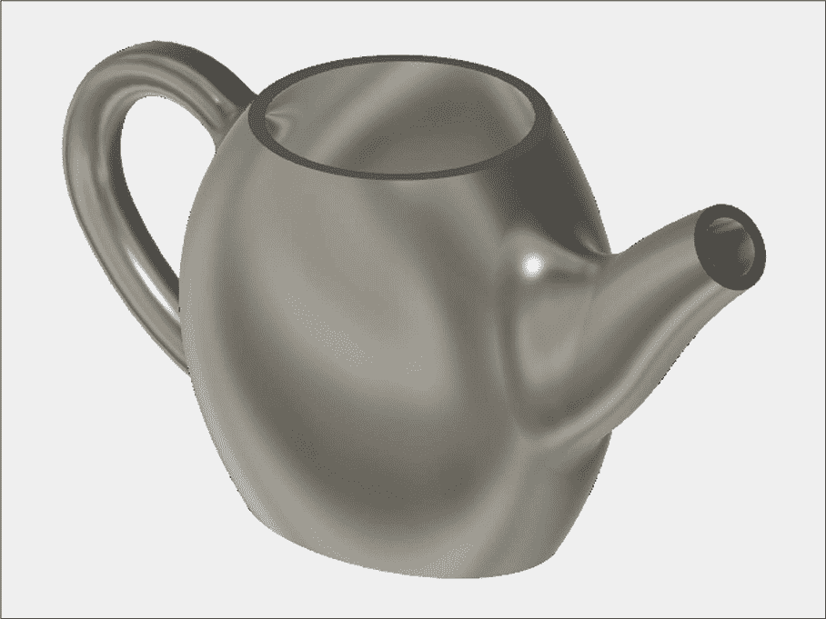

*图 6-14：茶壶，以其有机形状的光辉呈现*

### 练习

本章最后，我将让您自己使用 Sweep 和 Loft 特征来建模茶壶的盖子。它应该看起来像图 6-15 中的样子。

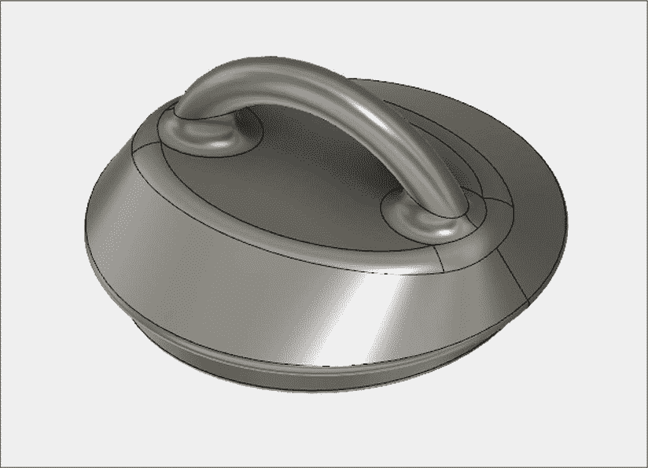

*图 6-15：尝试使用您刚学到的技巧来建模这个盖子。*

确保盖子的底部是一个能够适配茶壶顶部的圆形。然后，盖子应向上逐渐变窄，最终形成一个椭圆形。在顶部添加一个小手柄，并使用倒角来平滑过渡。您应该能够运用本章所学的技巧来建模这个盖子。

### 总结

本章中你学习如何使用的 Sweep 和 Loft 功能一开始可能看起来有些复杂，但最终它们让你能够创建之前章节工具无法实现的有机几何体。此时，你几乎可以建模任何你能想象的东西。但仍然有一些工具在特定场景下可能会有用。翻到下一章，了解关于线圈、螺纹和需要复杂构建几何体的固体的所有内容。
