# 第七章：**弹簧、螺丝及其他高级建模**

在本章中，你将学习一些建模几何复杂形状的技巧。你将学习如何使用*线圈*和*螺纹*工具，这些工具通常用于制作弹簧和螺丝。你还将学习如何使用*表面*来建模复杂几何体，这将用于设计一个 20 面的骰子。

### 建模一个线圈

线圈工具创建螺旋形或螺旋状的形态。你也可以通过在 3D 螺旋路径上使用扫掠来创建这些形状，但使用线圈工具要简单得多。要制作用于热交换线圈的空心管，你可能需要使用两个线圈——一个用于新体积，另一个用于切割。

要开始，选择**创建**下拉菜单中的**线圈**。软件会要求你选择一个平面，应该使其垂直于线圈的轴线。线圈截面的中心点将从这个平面开始。绘制一个圆圈，如图 7-1 所示，以指定线圈的中心轴线和直径。

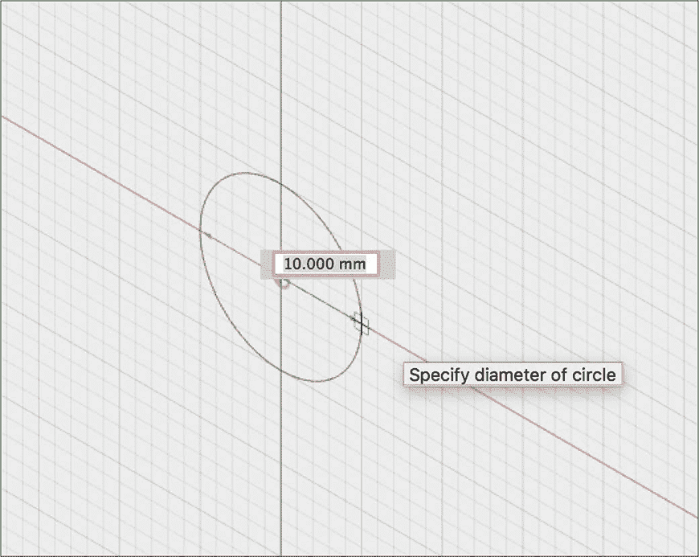

*图 7-1：选择一个点作为线圈的中心轴线，然后绘制一个圆圈来指定直径。*

在你设置了圆圈的直径后，线圈对话框应该会弹出，Fusion 360 应该会显示一个带有默认参数的模型。

确保你刚绘制的圆圈被选为轮廓。在**类型**字段中，选择你希望使用的维度来创建线圈。默认设置要求你指定线圈的旋转数和高度。软件将使用这些维度来计算线圈的*步距*，即沿轴线所需的距离，令线圈完成一整圈。如果你不关心线圈转了多少圈，而关心具体的步距，可能需要切换类型。

选择**旋转数和高度**，然后在**旋转数**字段中指定线圈应该旋转多少圈。在**高度**字段中，指定线圈的名义高度，即从最上方截面中心点到最下方截面中心点的距离。请注意，这不是要求你提供线圈的总高度。如果你的线圈需要恰好 100 毫米高，你需要从高度值中减去*截面大小*，即截面的直径。在**旋转**字段中，设置线圈顺时针或逆时针旋转。

当你绘制圆圈时已经设置了直径，但你可以在直径字段中进行更改。如果你希望直径逐渐增大或减小，可以使用角度字段让其呈现锥形。使用**截面**来设置线圈截面的形状。你可以选择将其设为圆形、方形、内向三角形或外向三角形。

默认情况下，横截面会自动与您选择的直径对准，但如果你希望你的线圈适配已经存在的部件直径，你需要将“横截面位置”字段设置为“外部”并选择该部件。如果你希望它适配一个具有该直径的圆柱体，你需要将该字段更改为“内部”。

花几分钟时间调整各种参数，看看模型如何随之变化。图 7-2 显示了我选择的尺寸。

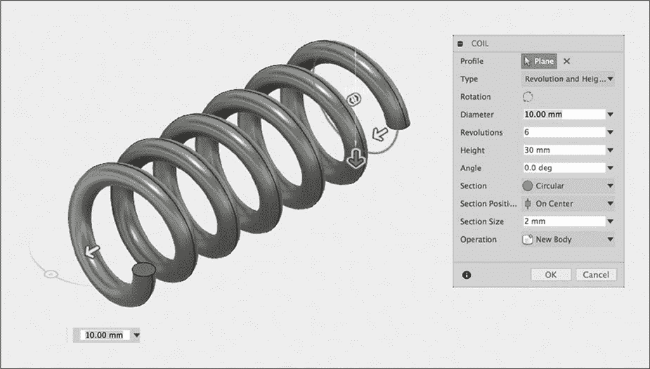

*图 7-2：调整你的线圈尺寸，感受一下参数的作用。*

就这样——你已经创建了一个线圈！Fusion 360 让这一切变得如此简单。

### 使用线程工具建模螺丝

尽管建模螺丝看起来很简单，但如果你试图使用你已知的工具来完成这项工作，你会遇到困难。这是因为螺丝外表的螺旋形状的脊线，叫做 *螺纹*，具有非常特定的尺寸，专为螺丝的用途量身定制。例如，一个正骨骨钉的螺纹与机械螺丝的螺纹完全不同。在建模螺丝时，你必须定义螺纹的外径、内径、螺距和螺纹角度，且必须确保一切都正确。

在传统的二维技术图纸中，制图员通常不会绘制螺丝的螺纹。相反，制图员会指定螺纹类型——例如 6 g M4×25 毫米——以便制造商知道使用哪种攻丝工具或螺丝。如果你打算为你的项目购买螺纹插销和螺丝，你也可能想做同样的事情。但是，如果你想用 3D 打印机打印所有零件，你就必须精确地建模出螺纹的外观。在 3D CAD 的早期，这意味着需要精确绘制每个螺纹的横截面，并用类似于 Coil 工具的螺旋特征来建模。

幸运的是，为了你的理智和耐心，Fusion 360 提供了一个工具，让你跳过所有这些步骤。线程工具包含了几乎所有当前常用的螺纹库。你需要做的只是创建一个圆柱体来放置螺纹。

为了看看它是如何工作的，你将建模一个 M4×25 毫米的螺丝。这是一个非常常见的螺丝；你使用的计算机中可能就有几个这样的螺丝来运行 Fusion 360。

#### *创建螺丝的主体*

你的螺丝模型将具有可变长度，因此首先创建一个 25 毫米的长度参数（**修改** ▸ **更改参数** ▸ **新建用户参数**）。然后像 图 7-3 中所示那样绘制一个新的草图，并将 fx: 25.00 尺寸设置为你创建的长度用户参数。尺寸中的 “fx:” 表示该值已通过用户参数计算得出。将螺丝头部长度设置为 4 毫米，宽度为 3.5 毫米。

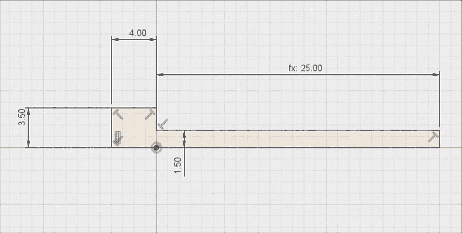

*图 7-3：使用你的长度用户参数创建类似这样的草图。*

我使用的是标准六角螺丝头的测量值，但 1.5 毫米的尺寸完全是任意的；当你添加螺纹时，软件应该会自动调整圆柱的宽度，以符合螺纹的规格。你的草图看起来像这样时，将它围绕底线旋转，创建一个新的实体。

和标准紧固件上的其他所有部分一样，这个螺丝有一个特定的插座尺寸，设计用于配合特定的螺丝刀头。我们将使用一个 3 毫米的六角插座，如图 7-4 所示。

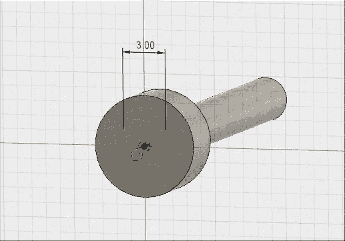

*图 7-4：为螺丝头绘制一个内接多边形。*

要进行建模，在螺丝头的顶部创建一个新的草图。在**草图**（Sketch）菜单中选择**多边形**（Polygon）选项。这样你就可以创建任何边数相等的多边形，就像图 7-4 所示的那样。对于这个六角螺丝头，你需要六个边。*外接*定义为一个假想圆的直径，该圆接触每条边的中点，而*内接*定义为一个假想圆的直径，该圆接触每个顶点。选择**外接**并将直径设置为 3 毫米。

#### *建模螺纹*

现在你可以通过选择**线程**（Thread）从**创建**（Create）菜单中创建螺纹了。你应该会看到图 7-5 所示的对话框。

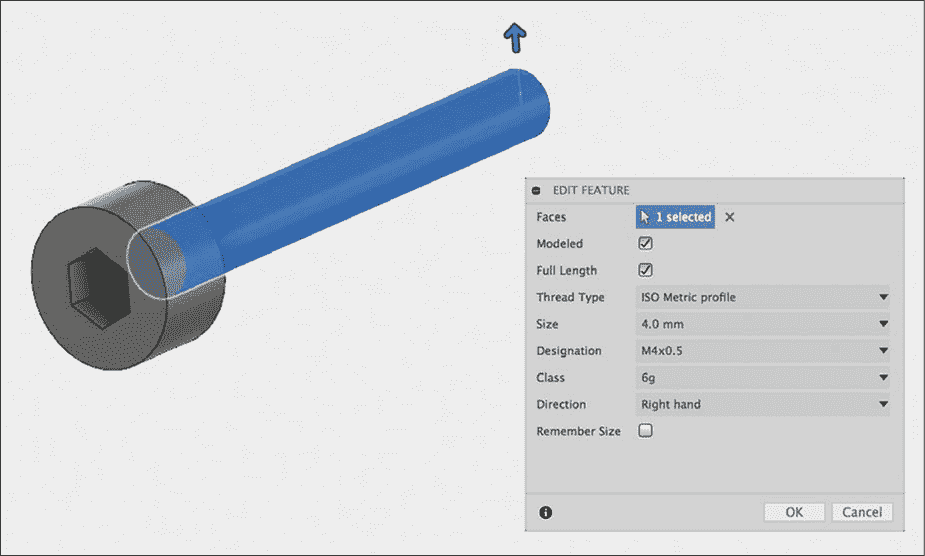

*图 7-5：根据所需的紧固件类型选择螺纹对话框选项。*

选择圆柱的面，然后勾选**已建模**（Modeled）以显示螺纹。（如果你不勾选已建模选项，Fusion 360 将仅存储螺纹信息，以供后续技术图纸使用。）因为我们希望螺纹覆盖圆柱的整个长度，所以勾选**全长**（Full Length）。

其余的选项允许你选择特定类型的螺纹。对于**螺纹类型**，选择**ISO 公制轮廓**。将**尺寸**设置为 4.0 毫米，**规格**设置为 M4×0.5。**等级**设置决定了容差的大小。我们这里使用 6g。最后，因为这是一个标准螺丝，将**方向**（Direction）设置为**右旋**（Right Hand）。几乎所有的紧固件都使用右旋螺纹，通过顺时针旋转来拧紧，但有时你可能需要使用左旋螺纹，通过逆时针旋转来拧紧。

现在你的模型应该看起来像一个真正的螺丝，带有内置的螺纹。作为最后一步，给螺丝的尖端做一个*旋转切割*，这样可以更容易插入。我给我的螺丝做了一个 45 度的切割，起始点距离中心轴 1.5 毫米，但这是紧固件中少数没有严格规格的部分，所以你可以根据自己的需求调整尺寸。最终，你的模型应该像图 7-6 所示那样。

*图 7-6：你的模型应该在末端有一个旋转切割，便于插入。*

恭喜！你已经完成了第一个螺丝的建模。

### 建模一个 20 面骰子

不幸的是，Fusion 360 无法为每个复杂的设计提供专用工具。在本节中，你将学习如何使用曲面工具以及黄金矩形的几何概念，通过分解任务为可管理的步骤来建模一个 20 面骰子。

这些骰子被称为正二十面体或口语中常叫做 d20，它们在像*龙与地下城*这样的桌面角色扮演游戏中非常受欢迎。骰子由 20 个相同的等边三角形组成，这些三角形连接起来，使得所有的顶点都触及同一个假想的球面。每个顶点处有五个面相交，如图 7-7 所示。

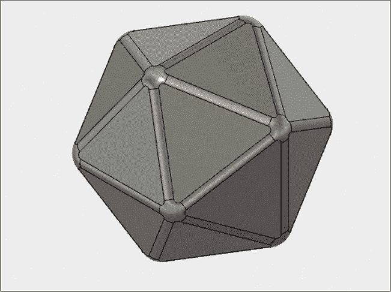

*图 7-7：你将建模这个 20 面（d20）骰子。*

从几何学角度来看，骰子的结构相当复杂；即使使用公式来计算三角形边缘的长度，对于不擅长数学的人来说也会很棘手。幸运的是，我们可以通过黄金矩形将几何形状表达得更加简单。

黄金矩形的尺寸遵循黄金比例，这意味着它们的长度大约是宽度的 1.618 倍。图 7-8 展示了三个互相交错的黄金矩形，彼此垂直放置。

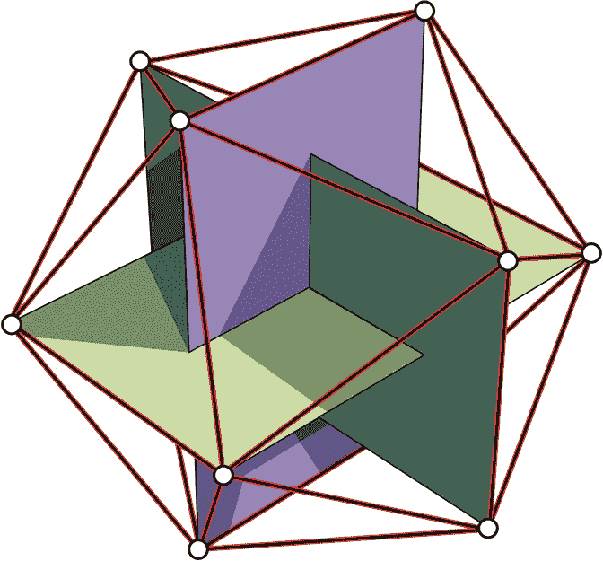

*图 7-8：由三个黄金矩形构成的 20 面骰子*

当矩形按这种方式排列时，矩形的角点形成了骰子的 12 个顶点。骰子有 20 个面，每个面有 3 个角，总共是 60 个角点。由于 5 个面共享同一个顶点，因此总共有 12 个顶点。

当你在最接近的矩形角点之间画线时，你就形成了骰子的边缘。为了建模的目的，我们可以利用这些边缘为每个 20 个面创建曲面。然后你可以将这些曲面拼接在一起，形成一个整体的实体。

要使用曲面工具，切换到**修补**工作空间，在这里你可以访问创建和修改下拉菜单中你尚未见过的工具。除此之外，这个工作空间与模型工作空间看起来是一样的。

使用你已经熟悉的草图工具，在每个现有平面上绘制三个黄金矩形。确保它们的朝向与图 7-9 中所示一致。每个矩形的高度设为 10 毫米，宽度设为 16.18 毫米。

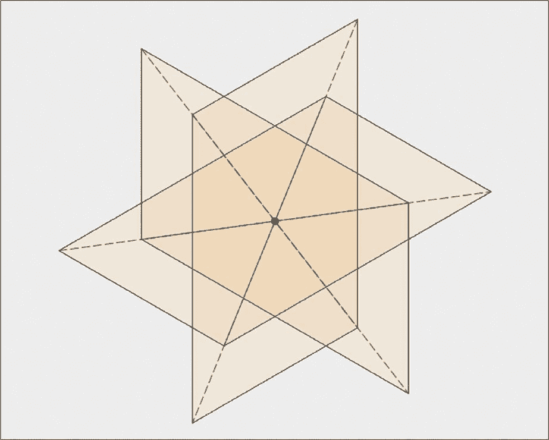

*图 7-9：画出三个垂直的黄金矩形。*

接下来，我们需要绘制连接矩形角点的线，以形成骰子面的边缘。为此，我们首先需要创建构造平面，在其上进行草图绘制。从**构造**下拉菜单中选择**三点平面**选项。选择三个点，这三个点将构成一个三角形面上的顶点，如图 7-10 所示。

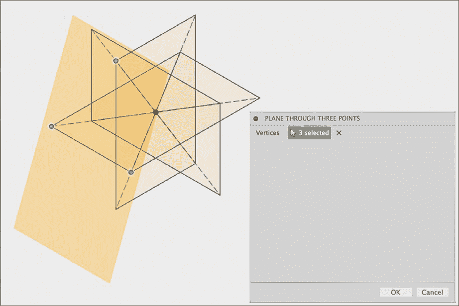

*图 7-10：创建一个触及三角形面三个顶点的构造平面。*

现在在你刚刚创建的平面上绘制一个新的草图。使用线条连接与平面本身相同的三个点。你应该会得到一个等边三角形，像图 7-11 所示。

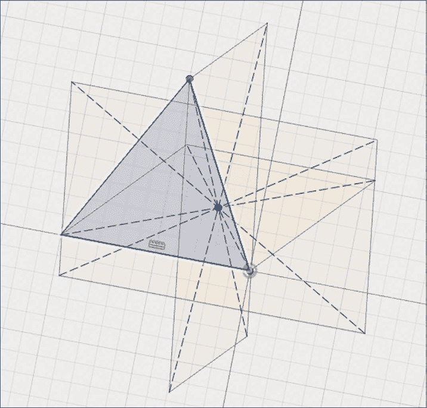

*图 7-11：绘制一个连接三点形成三角形的草图。*

现在你可以开始创建第一个表面了。表面没有厚度，因此它们不像你到目前为止在本书中使用的那些实体那样是实心的。虽然它们本身没有实际的物质，但你可以将多个表面连接在一起，创建一个实体。

要建模第一个表面，从**创建**菜单中选择**Patch**。这将打开图 7-12 所示的对话框。

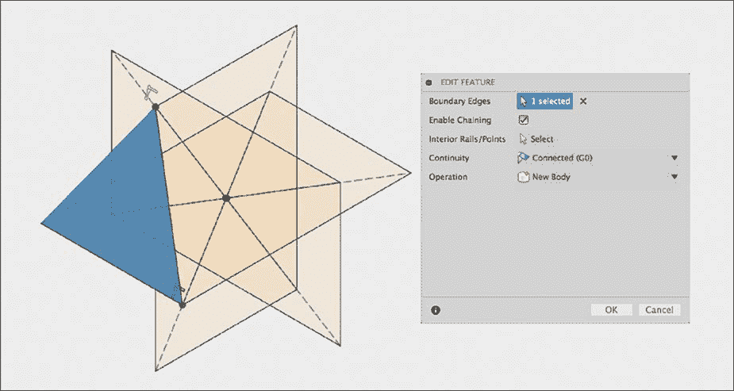

*图 7-12：使用 Patch 功能根据三角形的三条线创建一个表面。*

使用你刚刚绘制的三角形的三条线作为*边界边*。选择**启用链式连接（Enable Chaining）**。忽略“内部轨道/点（Interior Rails/Points）”选项；这个项目不需要这些。将连续性下拉菜单设置为**连接（Connected）**，将操作下拉菜单设置为**新体（New Body）**。

点击确定后，你应该会得到一个单一的三角形表面——骰子的一面。现在，重复这个过程 19 次，生成所有面。（是的，这有点繁琐。）

如果你忘记了需要连接的点，参考图 7-8。所有边应该是等长的，所以如果你得到的某条边长度不同，说明你连接错了点。最终，你应该得到一个由 20 个单独面构成的形状，如图 7-13 所示。

现在模型*看起来*像一个 d20，但它还不是真正的实体。正如所提到的，表面没有厚度。如果你尝试将其导出为 STL 文件进行 3D 打印，Fusion 360 不会允许你——因为它没有任何可以转换为网格的东西。

Fusion 360 提供了*缝合（Stitch）*功能，可以将多个表面转换为一个单一的实心体。为了使此功能生效，表面必须连接起来，形成一个密封的体。如果你只制作了 19 个面，缝合功能会失败，因为缺少了一个面。

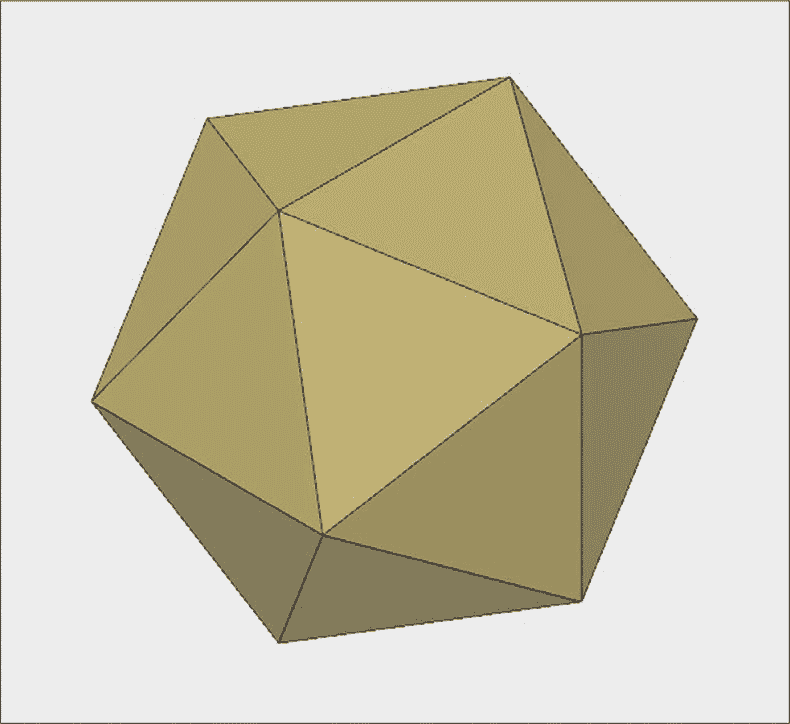

*图 7-13：继续创建三角形表面，直到你得到所有 20 个面。*

既然你已经得到了所有 20 个面，接下来从**修改**菜单中选择**缝合（Stitch）**；然后选择所有表面，如图 7-14 所示。选择完所有 20 个表面并点击确定后，Fusion 360 应该会“缝合”这些表面，并将其转化为一个实心体。

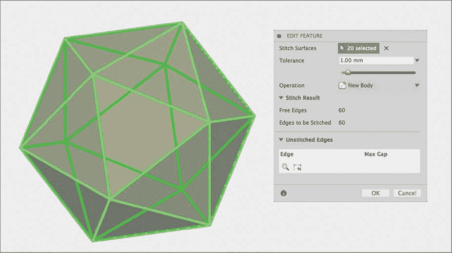

*图 7-14：使用缝合功能将你的表面转换为一个实心体。*

最后一步是给边缘添加倒角，因为没有人想要一个有尖角的 d20。为此，切换回 **模型** 工作区。然后，使用 **倒角** 工具，选择所有边缘并设置半径为 1 毫米。完成后，你的骰子应该和 图 7-15 中的样子一样。

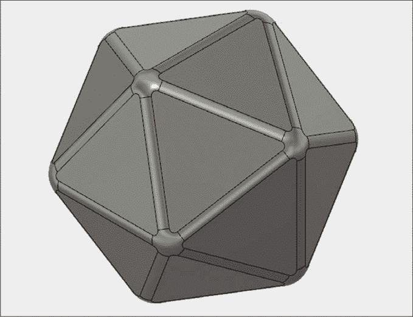

*图 7-15：你完成的 d20 应该是这个样子。*

### 练习

尝试做以下练习，借此练习 Fusion 360 提供的一些小工具。

#### *改变 d20 的大小*

当你开始建模 d20 时，我给了你黄金矩形的尺寸。我选择这些尺寸是为了简化数学计算，但你可能希望你的 d20 有不同的大小，例如两个对面之间的距离为 75 毫米。当然，你可以计算出矩形的尺寸如何与骰子的两面之间的距离相关，然后相应地调整矩形的尺寸，但直接调整最终模型的大小要简单得多。

如果你使用 **检查** 菜单中的 **测量** 工具测量对面平行面之间的距离，你会发现它大约是 15.114974 毫米。（这个值在不同的面之间会有非常小的差异，因为 1:1.618 实际上只是黄金比例的一个近似值。像 π 一样，黄金比例是一个无理数，小数点后会无限延续。对于实际应用，1:1.618 是足够准确的。）

我们希望对面之间的距离为 75 毫米，因此它大约是现在大小的 4.961967 倍。为了实现这一目标，从 **修改** 菜单中选择 **缩放** 功能并选择模型。保持 **缩放类型** 设为 **均匀**，如 图 7-16 所示，然后将 **缩放因子** 设置为 **4.961967**。

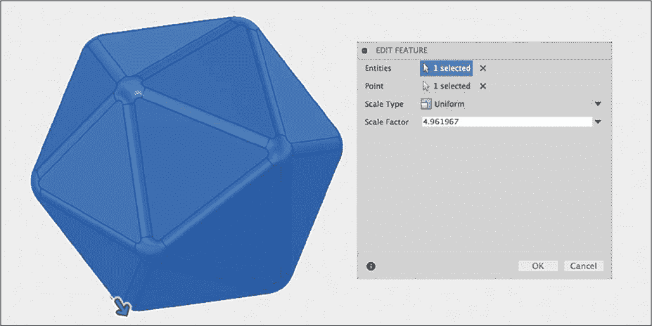

*图 7-16：缩放模型，使对面之间的距离为 75 毫米。*

点击 **确定** 来调整 d20 的大小。再次测量对面的距离，应该几乎完全是 75 毫米（在任何合理的公差范围内）。

#### *刻上数字*

如果你想实际 3D 打印你的巨型 d20 来在下次 D&D 游戏中给地下城主留下深刻印象，你需要添加数字，否则你会发现它很难使用。要添加数字，从 **草图** 菜单中选择 **文本** 选项并定位文本；然后像处理任何其他草图一样将其挤出，以轻微切割到面上。我在 图 7-17 中对“20”进行了这个操作。

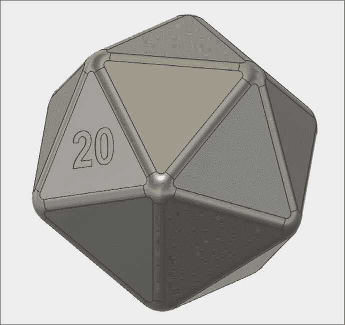

*图 7-17：通过挤出文本将数字添加到骰子的面上。*

重复该过程直到所有 20 个数字都完成。从统计学角度来看，标记面朝向并不重要——骰子的每一面都有相等的机会出现——但还是有一个约定俗成的方法来进行标记。选择一个随机的面，放置数字 1。然后，在对面放置数字 20。接着，在与 20 相邻的面上放置数字 2。然后在与 2 相对的面上放置数字 19。与 19 相邻的面放置数字 3，以此类推。最终，任何一对相对的面之和应该总是等于 21。

### 总结

本章的建模难度从简单到相当复杂不等，但希望你已经学会，即使是看起来一开始非常复杂的项目，也能分解为可管理的步骤。凭借你目前在本书中学到的技能，只要你花时间逐步思考如何着手，你应该能够创建出几乎任何你能想象的 3D 模型。

现在你已经知道如何使用所有最重要的建模工具。在第八章中，你将学习如何制作技术图纸，如果你希望你的模型被建造出来，这将非常有用。在第九章中，你将学习如何为展示目的制作漂亮的渲染图。
