## 第八章：草图制作**

在本章中，我们将介绍草图制作，这是创建技术图纸的过程。理想情况下，你可以将包含 3D 模型的文件发送给加工厂或制造商进行制作，但在现实世界中，这通常是不足够的。这其中有一些实际原因。制造商可能不会使用与你相同的 CAD 软件，这样他们甚至无法打开你的原始模型文件。也有可能他们根本不会使用 CAD。

手工加工仍然非常常见；制造商在制作你的零件时可能根本不接触计算机。即使他们使用 CAD，许多工厂还是更喜欢使用一种更适合其机床的系统重新创建 3D 模型。

但除了实际问题之外，事实是单靠 3D 模型并不能传达制造所需的所有信息。像图 8-1 中所示的模型，仅能告诉制造商零件的基本几何形状。其他细节，如公差和表面处理，也会影响零件，这正是技术图纸的作用所在。例如，如果你希望工厂在加工完成后清理零件的粗糙边缘，你可以在技术图纸上标注“去毛刺所有边缘”来指示这一点。

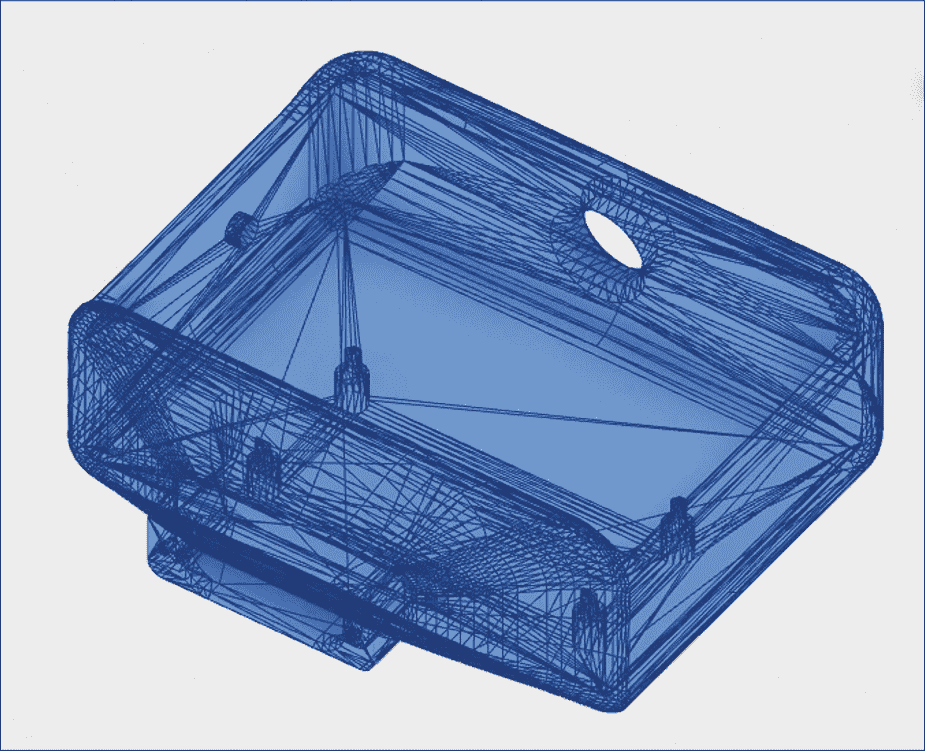

*图 8-1：像这样的 STL 文件传达了零件的几何形状，但没有提供如何制造它的信息。*

不过别灰心，草图制作其实在有了 3D 模型后变得很简单。

### 草图制作指南

正式的草图制作有数百条规则，涉及从不同线条的粗细到文字的字体类型。幸运的是，在现实世界中，绝大多数这些规则其实并不被人们过于关注。

例如，美国国家标准协会（ANSI）规则规定，技术图纸的文字高度应为 1/8 英寸。如果你记住这个规则，它是很好的，但如果你发送给制造商的图纸中文字高度为 3/16 英寸，他们也不会拒绝图纸。草图制作作为一门学科，充满了这样的例子。对于技术图纸的每个细节都有规则和指南，但归根结底，重要的是你发送给的人能够轻松并正确地解读它。

在本章中，我们将介绍影响制造商制造你模型能力的技术图纸部分。这些方面最为关键，尽管有很多细节，Fusion 360 将为你自动创建其中的大部分内容。你只需要熟悉这些内容，以便在发送图纸之前检查其质量。

#### *图纸大小*

图纸有多种特定的物理纸张尺寸，这些尺寸根据图纸所遵循的标准有所不同。在流行文化中你常见到的大型建筑蓝图，称为建筑 E 规格图纸，尺寸为 48 英寸 x 36 英寸，而标准的 8.5 x 11 英寸打印纸被称为 ASME（美国机械工程师学会）A 规格纸。

这一尺寸和 ASME B 规格纸（11 英寸 x 17 英寸）是最常见的纸张尺寸，因为它们可以通过常规打印机打印，并且比更大的纸张更容易存储和处理。我建议你使用 ASME A 规格纸，除非有充分的理由使用其他规格。

#### *比例*

比例，即图纸的大小与物体实际大小之间的关系，是技术图纸中最关键的细节之一——也是许多新手容易忽视的细节。正确设置比例很重要，因为如果有人需要获取某个部分的尺寸信息，他们应该能够通过图纸进行测量。如果你的零件长 1 英寸，且比例为 1:1，那么图纸中的零件长度应该正好是 1 英寸。如果你使用的是 2:1 的比例，那么图纸中该零件将显示为 2 英寸长。

尽管这是一个容易理解的概念，但有几个因素可能导致图纸的缩放不准确。其中最明显的一个因素是忘记标明图纸的不同部分采用了不同的比例。图纸的*标题框*位于页面的右下角，显示图纸的整体比例，适用于每个视图，除非另有说明。但有时，图纸会从多个视角显示同一物体，通常情况下，其中一个视图会使用更大的比例，以更清晰地展示某些细节。

如果单个视图的比例与整体图纸的比例不同，必须在该视图的标题中注明。Fusion 360 会在视图的属性对话框中为你跟踪这些比例，但你需要在视图的文本描述中手动输入这些比例。图纸 图 8-2 的整体比例是 1:1，但其中一个视图的比例被单独设置为 2:1。

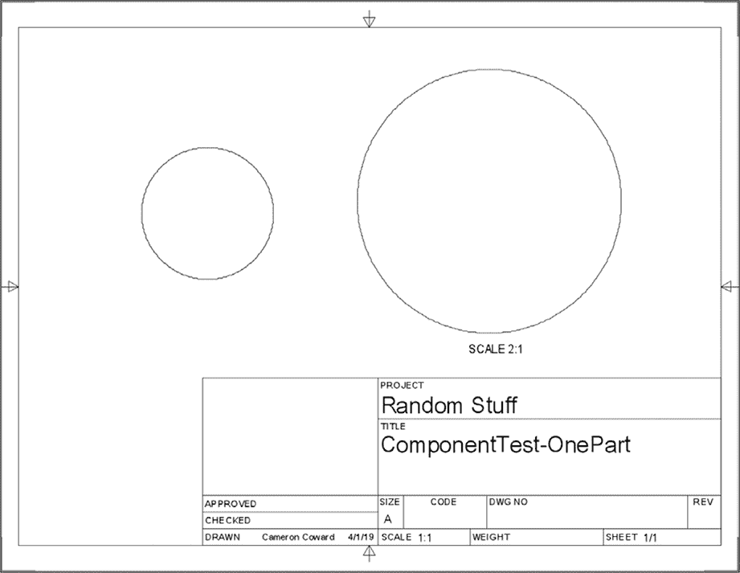

*图 8-2：右侧的视图与其他图纸的缩放比例不同。*

另一个常见的缩放错误发生在打印图纸或将其保存为 PDF 时。在大多数计算机上，打印工具通常会自动放大文档，以便填满整个页面，或者缩小其大小，使其适应一张纸。这会导致缩放错误，因此请确保软件没有进行任何缩放。你可以通过保存 PDF 文件并以“实际大小”打印来避免这种情况。

#### *投影角度*

投影是使用另一个视图作为参考绘制的视图。这种方法可以追溯到传统的笔纸绘图时代，那时绘图员会使用直尺从一个视图绘制引导线到下一个视图。它们还使得阅读图纸的人能够轻松对齐不同视图之间的特征。投影与正视图（你绘制的第一个视图）保持固定，并且必须保持相同的比例。

*投影角度*决定了你如何根据正视图布置其他视图。你可以选择两种选项：第一角投影和第三角投影。在第一角投影（参见图 8-3）中，位于正视图右侧的视图将显示零件，好像你是从*左侧*看它一样。

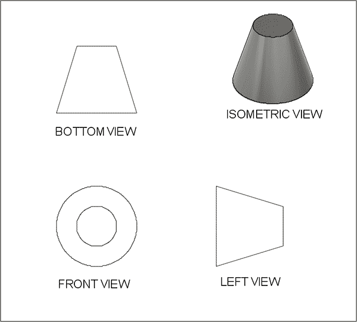

*图 8-3：第一角投影图纸*

第三角投影（参见图 8-4）将显示零件，好像你是从*右侧*看它一样。

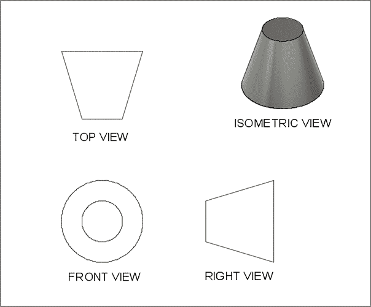

*图 8-4：第三角投影图纸*

你可能会遇到的投影类型主要取决于你所在的位置。在美国和澳大利亚，第三角投影最为常见。世界其他地方通常使用第一角投影。我在本章中使用第三角投影，因为我来自美国，并且接受过相关培训。用户偏好窗口（如图 8-5 所示）让你可以更改投影角度或选择默认设置。

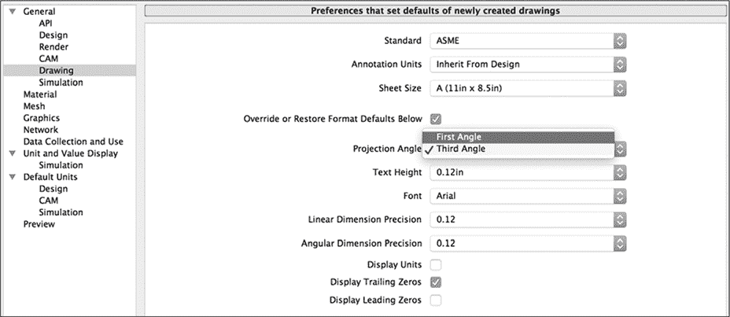

*图 8-5：在用户偏好窗口中切换投影样式。*

ISO 标准规定了第一角投影，而 ASME 标准规定了第三角投影。

#### *公差*

公差告诉制造商需要多精确地遵守图纸上显示的尺寸（即标称尺寸）。你可能已经建模了一个每一边长为 50 毫米的立方体，但也许这个物体并不需要完全符合这些测量值。即使是世界上最先进的制造技术也不完美；这就是物理物体的特性。公差让制造商知道在你接受零件的情况下，它需要多接近你的标称尺寸。

假设 50 毫米的立方体是一个独立的玩具。在这种情况下，每一面不需要精确测量 50 毫米，因此你可能会指定一个公差值为±0.1 毫米。这个“加减”符号告诉制造商，如果每一面的尺寸在 49.9 毫米到 50.1 毫米之间，你都可以接受。这种宽松的公差给制造商在加工选项上提供了更多的灵活性，并使得零件更容易通过质量控制，从而可能降低你每个零件的费用。

另一方面，假设你的立方体上有一个 25 毫米的孔，用于与第二件部件的圆柱体配合。为了确保圆柱体能够适当地放入其中而不会留太多空隙，你可能会给这个孔设定一个更小的公差，例如+0.01 毫米，如图 8-6 所示。这样，机械师就会知道他们可以把这个孔加工到 25 毫米到 25.01 毫米之间。他们会知道不能加工到小于 25 毫米，否则圆柱体就无法配合。

由于公差可能因特征而异，你可以在两个地方指定它们：在图纸说明中或在尺寸标注上。说明中的公差通常是你对整个部件所能接受的最宽松的公差。当某个特征需要更高的精度时（比如 25 毫米的孔），你可以在单独的尺寸标注中指定该公差。

*图 8-6：立方体中央的孔的公差比其他部件更严格。*

#### *线型*

最后，你需要注意图纸中使用的线型类型。再一次，Fusion 360 会为你自动创建这些线型，但你确实需要了解其中的一些，如图 8-7 所示。

*图 8-7：Fusion 360 中的线型*

*实线*表示在该视图中你可以实际看到的边缘。*常规间隔的虚线*表示在该视图中隐藏的特征的边缘，例如部件另一侧的边缘。你并不总是需要显示隐藏的线条，特别是当特征在另一视图中清晰可见时。过多的杂乱会使你的图纸难以阅读，因此最好只在隐藏线条实际上有帮助时才显示它们。

某些特殊的线条有助于说明部件的几何形状。最常见的两种是*中心线*和*中心标记*，用于圆形部件。你可以使用中心线来表示圆柱体的轴线，使用中心标记来表示孔的中心点。中心线通常是错落的虚线，而中心标记是延伸到孔边缘之外的十字准线。

### 起草单件图

技术图纸有两种类型：*零件图纸*，显示单个部件的具体尺寸，以及*装配图纸*，显示多个部件如何组合在一起。虽然可以在装配图纸上显示零件尺寸，但你应该避免这样做，因为这两种图纸有不同的用途。零件图纸告诉制造商如何制作每个部件，而装配图纸告诉制造商如何将这些部件组合起来。

通常，每个零件都应该有自己的零件图。唯一的例外是那些购买的零件，比如螺栓、垫圈和电子元件，这些是你自己不制造的。另一方面，只有在你支付制造商组装你的作品或申请专利时，才需要创建装配图，这样专利局才能看到它是如何工作的。

我们将为你在第五章中创建的铰链制作零件图。打开项目浏览器中的模型零件文件（不是装配文件）。在开始绘图之前，通过**修改**下拉菜单中的**物理材料**选项为你的模型分配一个物理材料。向下滚动到**金属**部分。将**黄铜**拖放到你的模型上，如图 8-8 所示。这告诉 Fusion 360 该零件是由黄铜制成的，它将使用这些信息来计算零件的重量。

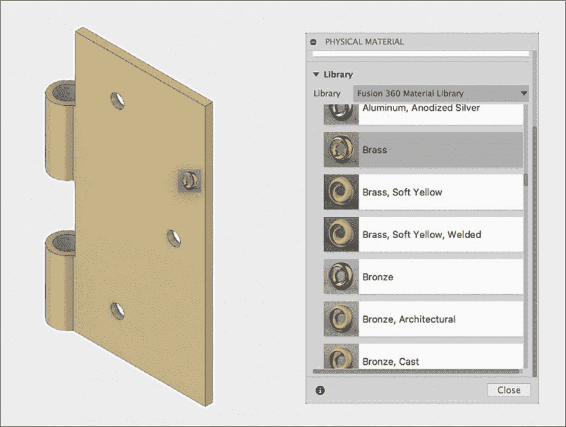

*图 8-8：从物理材料菜单中选择黄铜并将其分配给你的零件。*

现在保存文件，并将工作区切换到**绘图**，选择**从设计**选项。应该会弹出一个对话框。这给你提供了一些基本的技术绘图选项。选择图 8-9 中所示的选项。

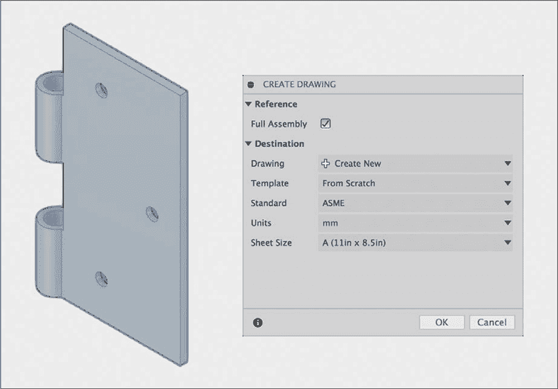

*图 8-9：你的绘图选项应该如下所示。*

保持选中**完整装配**，因为你的文件只有一个零件。在绘图字段中选择**创建新建**。你不应该有任何模板，所以将该字段保持为**从头开始**。我们将制作一个第三角投影图，所以将标准设置为**ASME**。在单位字段中选择**mm**（毫米），并将纸张大小设置为**A (11in × 8.5in)**。

#### *创建你的视图*

一旦点击“确定”，你将进入绘图工作区，Fusion 360 会要求你放置基准视图，其他视图将基于该视图进行投影。基准视图可以显示你选择的任何一侧的零件。然而，对于几乎所有的图纸，你通常会选择前视图作为基准视图，然后投影左视图或右视图，以及顶部视图或底部视图。你应该选择那些能够清楚展示零件所有特征的视图。从**方向**下拉菜单中选择**后视**，因为铰链的一侧具有安装孔倒角。否则，保持默认设置（如图 8-10 所示）。

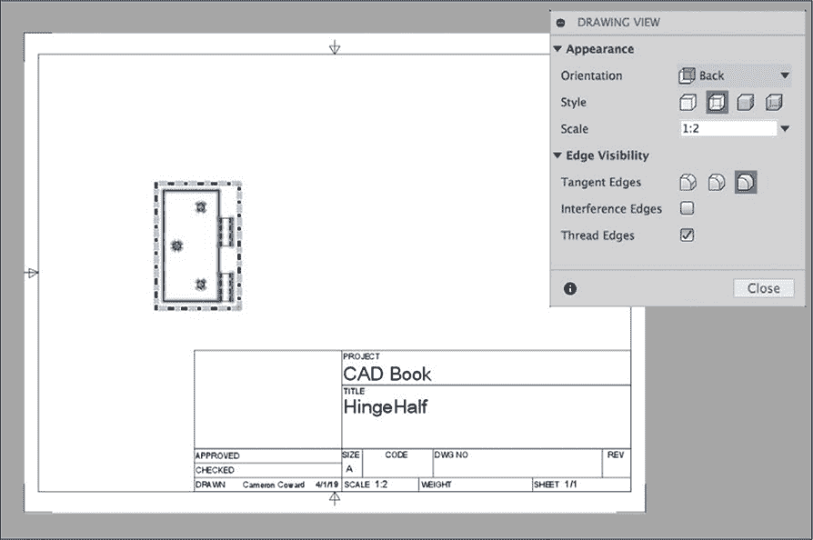

*图 8-10：基准视图应使用后视方向。*

在放置基准视图后，你可以使用工具栏上的投影视图工具来*投影*顶部视图和右视图。只需点击基准视图，再点击基准视图右侧的位置，然后第三次点击基准视图的顶部位置，按下 ENTER 键。最佳做法是将投影视图放置在大致与基准视图相同的距离上，如图 8-11 所示，因此如果需要的话，可以拖动它们。

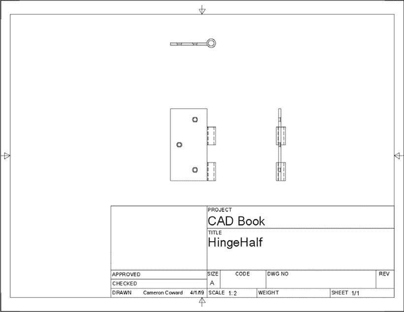

*图 8-11：将你的右视图和顶视图与正视图保持相等距离。*

在图 8-3 和 8-4 中，我标注了视图，以展示第一角投影和第三角投影之间的区别，但标准图纸中不需要这样做。如果你正确放置了视图，行业内的人士会明白这些是正视图、右视图和顶视图。

对于像这样的简单零件，也不需要使用等轴测视图（显示零件的三分之一角度视图）。通常，只有在标准的三视图不能清晰显示几何形状时，才需要这种视图。不过，如果你确实需要等轴测视图，只需再添加一个正确定向的基准视图。你还需要标注它，并小心不要与其他视图对齐，否则制造商可能会误认为它是投影视图。

#### *添加中心标记和中心线*

放置完视图后，你可以开始注释图纸。首先，放置中心标记和中心线。你可以在主工具栏的**几何**部分找到这些工具。对任何正面显示的孔添加中心标记，对任何隐藏的孔添加中心线。完成后，你的图纸应该类似于图 8-12。

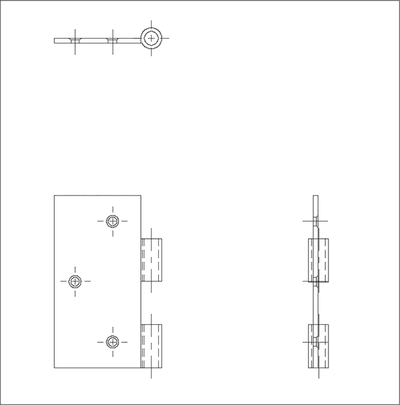

*图 8-12：在图纸中的孔上添加中心标记和中心线。*

#### *添加尺寸*

接下来，向图纸中添加尺寸。添加尺寸时，请遵循以下指南：确保添加足够的尺寸来准确定义每个特征，但避免冗余的尺寸。如果不确定，始终倾向于添加过多的尺寸，但尽量避免让图纸杂乱无章，添加不必要的信息。

标准惯例可以帮助保持简洁。如果你在模型中重复了多个特征（如孔），则无需为每个孔都指定完整的尺寸；只需在一个孔的直径旁边写“X3”。要表示孔倒角的直径和角度，在尺寸前添加倒角符号(*∨*)。当两个特征明显对齐时，你只需为其中一个添加尺寸。以图 8-13 为参考，向图纸中添加尺寸。尺寸放置后，你可以双击进行编辑。

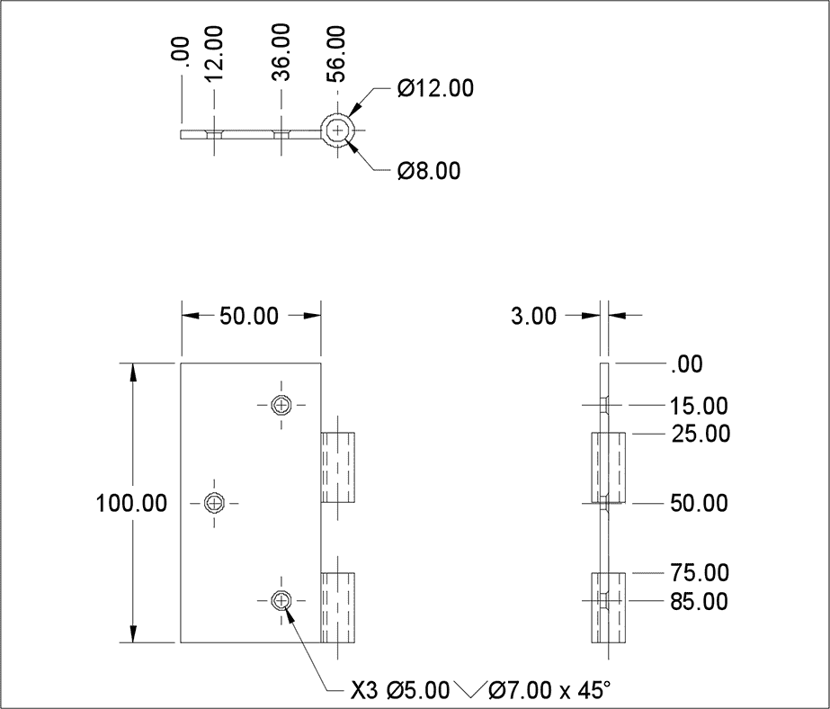

*图 8-13：添加了所有必要尺寸的图纸*

你可能会在添加某些尺寸时遇到困难，特别是“X3 Ø5.00*∨*Ø7.00 x 45°”孔的尺寸和以“.00”开头的两列尺寸。孔的尺寸要求你编辑文本本身。首先，在 Fusion 360 给出的Ø5.00 前添加“X3”。然后，通过对话框中的*插入符号*工具添加倒角尺寸。

顶视图和右视图中对齐的尺寸叫做*坐标尺寸*。“.00”表示起点，每个其他值表示该特征距离起点的距离。要添加坐标尺寸，只需从工具栏的**尺寸**部分选择该工具，选择起点，然后点击每个要添加尺寸的点。

坐标尺寸使图纸更加简洁、清晰，易于阅读。它们对于避免一种叫做*tolerance stacking*的问题也很重要。

正如我在本章之前提到的，您应该为每个尺寸指定一定的公差，以便在制造零件时为制造商提供一定的灵活性。但是当一个特征的尺寸是基于另一个特征的尺寸时，公差可能会叠加。看看图 8-14 中的孔的尺寸。现在，假设这些尺寸的公差都是 0.1 毫米。

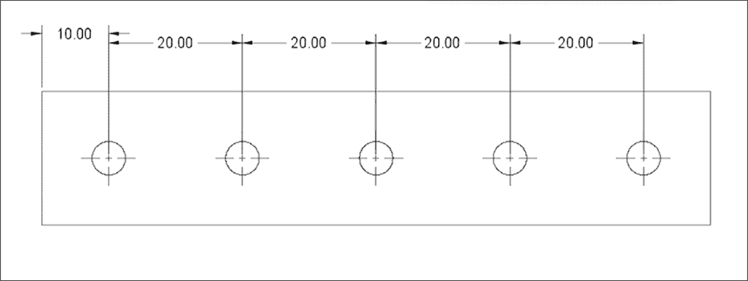

*图 8-14：公差叠加会导致最右侧的孔有很大的变化。*

如果每个距离都达到了最大公差，最右侧的孔距零件左边缘可能会有 90.5 毫米。如果每个距离都达到了最小公差，那么该孔距边缘可能只有 89.5 毫米。这就意味着总变动可能高达 1 毫米，这可能会导致零件无法使用。坐标尺寸通过使用单一的硬边作为每个特征的参考来避免公差叠加。

#### *添加文本*

现在，所有的尺寸都确定了，您可以通过添加一些注释来完善标注，如图 8-15 所示。第一个注释指示您接受哪种类型的公差。第二个注释告诉制造商在加工后去毛刺。要添加注释，请在主工具栏中选择**文本**工具。

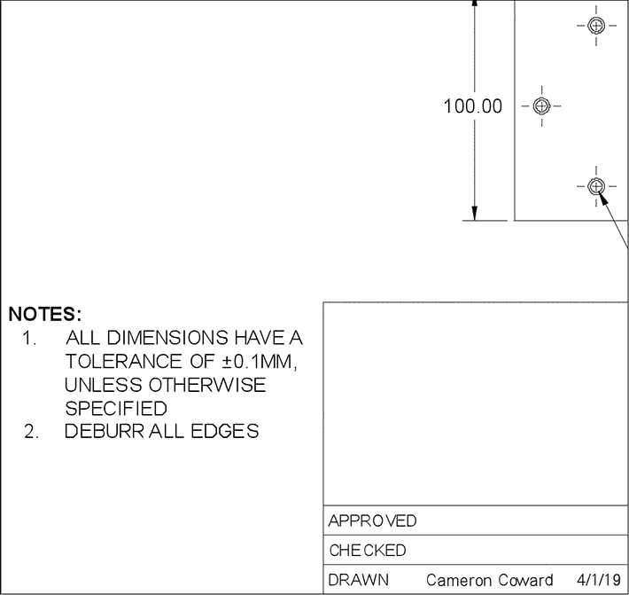

*图 8-15：在图纸上添加注释，向制造商提供重要信息。*

最后的步骤是填写标题框（如图 8-16 所示），其中包含有关零件和图纸本身的详细信息。Fusion 360 会自动填写其中一些信息，但您可以通过双击标题框来编辑它。如果您愿意，您可以在左上角框中放置一个包含徽标的图像文件。批准和检查字段是许多公司内部文档控制流程的一部分；例如，工程经理可能会用它们来批准图纸。

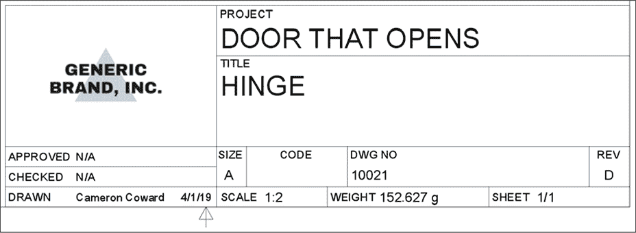

*图 8-16：典型的标题框*

在绘制（Drawn）字段中，填写创建图纸的人员（即你！）及其绘制日期。在项目（Project）字段中，通常标识零件所属的装配或子装配，但这没有硬性规定；你可以随意命名项目。在标题（Title）字段中，写下零件的名称。在尺寸（Size）字段中，写明你使用的图纸类型（在本例中为 A）。在代码（Code）字段中，你可以指定零件和图纸可能遵循的任何规范性代码。除非有特别理由坚持使用某个特定代码，否则可以将该字段留空。制造商将使用图纸编号字段（Dwg No）来在内部和与你的沟通中引用图纸。你可以使用任何数字，但每个图纸必须有唯一的编号，建议你制定一些编号规则。

在修订（Rev）字段中，填写一个字母，表示你使用的图纸版本。从 A 开始，每次修改图纸时，按字母顺序递增。如果你到达 Z，则重新开始，依次为 AA、AB，依此类推。记录修订版对于确保制造商和你使用的是相同版本的图纸至关重要。例如，如果你将图纸编号 10021 更新到 D 版，你给制造商的沟通可能会是“请参考图纸 10021-D”。

比例字段显示图纸的整体比例。Fusion 360 会自动将其设置为你在初始基准视图中输入的比例。如果有变化，你应该在标题框中修改该比例以匹配。在重量字段中，填写你的零件重量。要获取这些信息，请回到模型中，右键点击组件浏览器的顶层，查看属性。最后，复杂的零件图纸可能有多个页面，因此使用页面字段来指示这是第几页。

一旦填写了标题框，你就完成了！然后，你可以从输出菜单中选择一个选项（通常是 PDF 格式）来保存图纸。记住，如果你要打印图纸，*必须*确保关闭缩放，以便以实际尺寸打印。

### 练习

在本章中，我带你了解了如何创建单个零件的图纸，但有时你需要创建装配图，展示多个零件如何组合在一起。现在，从完整的铰链装配中创建一个图纸。最终效果应该类似于图 8-17。

你需要创建一个*爆炸视图*，展示各个拆分的部件如何组合在一起。为此，进入**动画**工作区，从主工具栏点击**自动爆炸**，然后保存装配文件。如果需要，你可以通过右键点击视图立方体重新调整模型方向，并将其保存为新的主页视图。然后，在创建图纸时，选择**来自动画**选项来使用该爆炸视图。

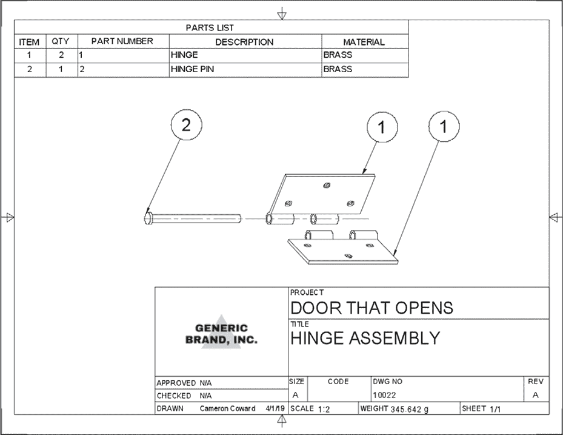

*图 8-17：你的铰链装配图应该像这样。*

你还需要添加*物料清单*（BOM），它是图纸顶部的一个表格，显示你的零件清单。要创建它，从主**图纸**工具栏中选择**表格**。一旦你放置了表格，零件会自动填充到其中。零件编号、描述和材料都由在模型工作区的组件浏览器中可访问的属性控制。然后，只需从相同的菜单中放置气球（balloons），以标记图纸中的每个零件。

### 总结

技术图纸非常复杂，作为一种职业，绘图需要多年才能掌握。幸运的是，像 Fusion 360 这样的 3D CAD 软件使得这个过程变得容易得多。运用你在本章中学到的技巧，你应该能够创建清晰且专业的技术图纸，真实的制造商可以用它们来制作你的设计。在第九章中，你将学习如何制作高质量的设计渲染图用于演示。
