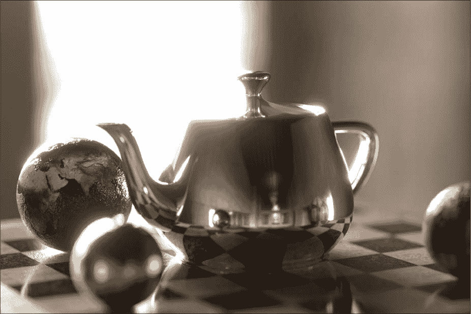
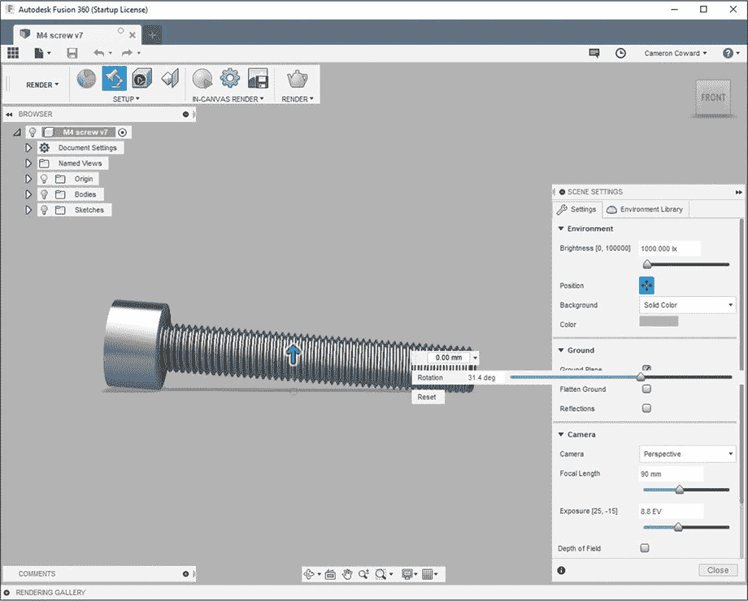
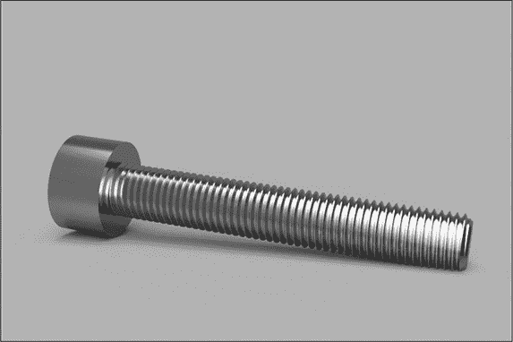
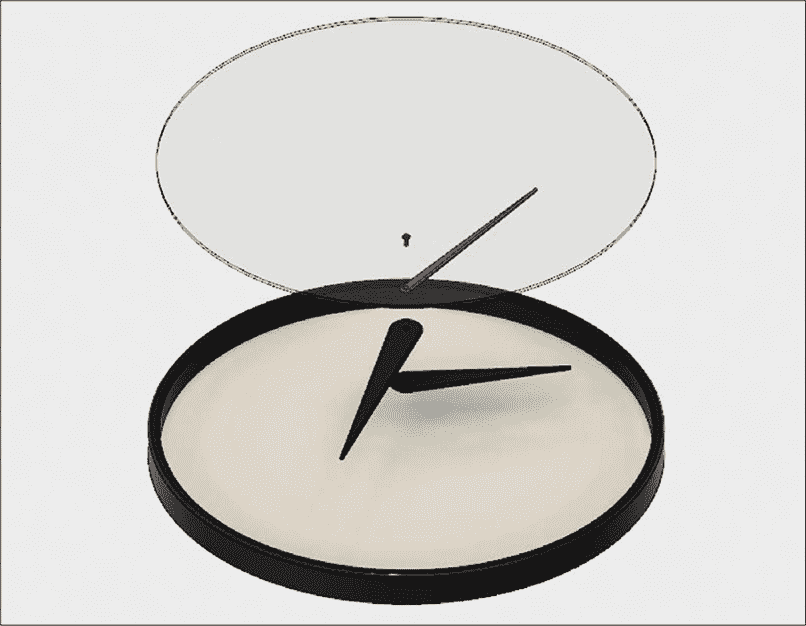
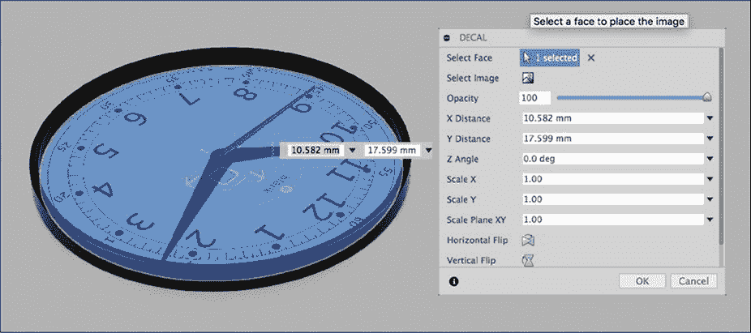
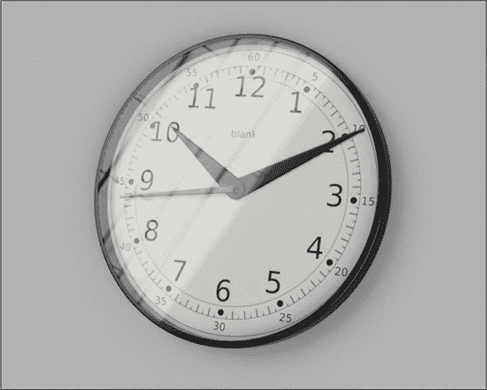
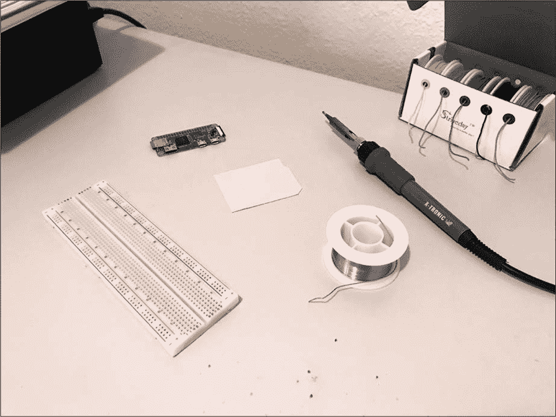
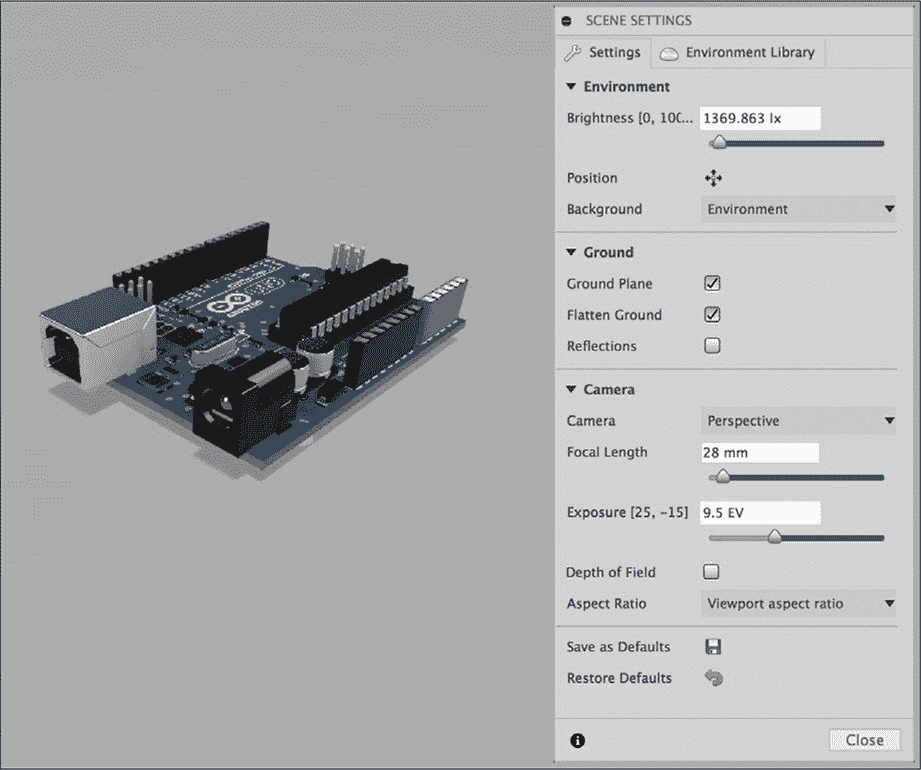
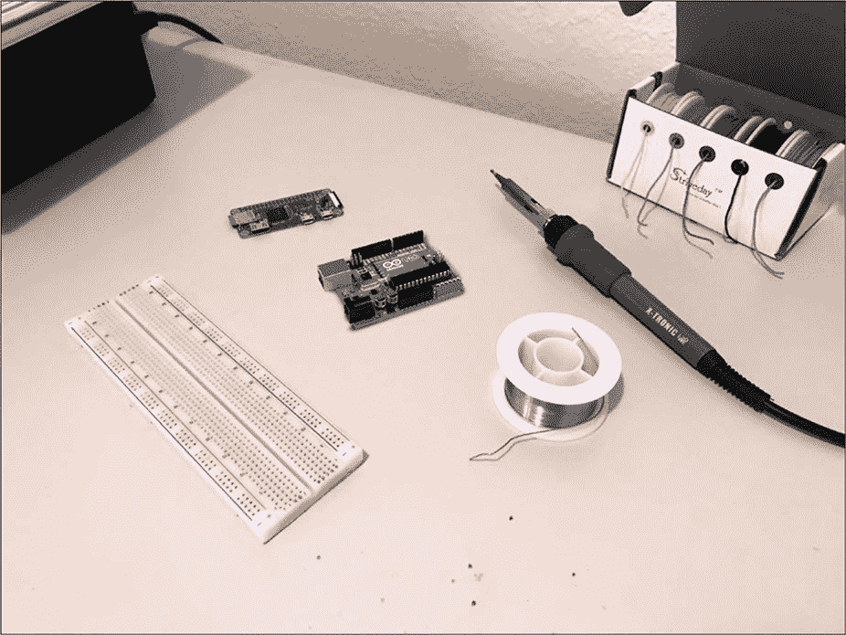

## 第九章：渲染**

*渲染*是你的计算机将 3D 模型转换为 2D 图像并显示在屏幕上的过程。从技术上讲，Fusion 360 在你工作时一直在渲染你的 3D 模型。其他类型的软件，如视频游戏中也是如此。当你玩视频游戏时，游戏主机或计算机会将屏幕上的 3D 资产渲染并每秒超过 30 次地显示出来。

但是，当 CAD 领域的人们谈论“渲染”时，他们通常指的是为展示目的专门创建的单一照片级逼真图像或动画视频，这需要大量的计算能力来生成。虽然 Fusion 360 在你工作时每秒都会渲染你的模型很多次，但它并不是在生成高质量的图像。计算机的处理能力是有限的，为了让 Fusion 360 以可用的帧率显示你的模型，它必须限制每帧的渲染时间。这意味着它创建的是低质量的渲染图——对于设计阶段足够了，但不适合用于展示。

你给 Fusion 360 更多时间处理单帧，它生成的图像就越好。只要有足够的时间，它就能生成接近照片级逼真效果的图像。这个过程需要多长时间取决于你的计算机、你希望图像的质量以及图像的分辨率。一个快速且粗略的渲染可能只需要几秒钟，而一个复杂的高质量渲染则可能需要超过一个小时。

尽管如此，Fusion 360 的渲染能力还是有限的。它当然能够生成非常漂亮的渲染图，足以满足像 Kickstarter 这样的平台需求，但它缺少一些专门为渲染设计的软件所具备的工具。如果你需要在复杂场景中获取真正的照片级逼真渲染图，你可以随时将模型导出为 STL 文件，并在更先进的渲染软件中打开。图 9-1 展示了一个使用 3D 建模和专业渲染软件创建的照片级逼真场景，该软件主要用于创建视觉效果（而非机械设计）。

*图 9-1：使用专业渲染软件创建的照片级逼真渲染图*

本书的重点是 Fusion 360，因此我们将利用该程序内建的渲染功能，创建一个关于我们在第七章建模的螺钉的漂亮图像。

### 渲染你的螺钉

现在，打开螺钉模型。此时，它应该是一个简单的平灰色，这就是默认的外观。

改变模型外观有两种方法。第一种是设置**物理材质**选项，正如你在第八章中使用黄铜铰链时所做的那样。第二种是明确分配**外观**设置，它会覆盖物理材质的外观。通过设置物理材质创建的外观将应用于整个模型，但你也可以将外观分配给整个模型或单个面。例如，你可能想给一个实心模型做一个双色涂装。

在这种情况下，模型是由单一原材料制成的普通老式螺丝，因此将其**物理材质**选项设置为**不锈钢，抛光**。现在，模型应该看起来更漂亮了；颜色和反射应该像抛光不锈钢一样。但这仍然是一个低质量的渲染，因为 Fusion 360 需要保持高帧率，以便你可以继续与模型进行操作。如果软件试图持续生成高质量的渲染，每次你移动模型、旋转它或修改它时，可能需要几秒钟甚至几分钟才能刷新。

为了显著改善模型的外观，切换到渲染工作区。你会立刻注意到，模型比在模型工作区时看起来更逼真。在我们创建渲染之前，需要确保螺丝在地面上真实地放置，然后准备一个环境来执行渲染。

#### *让螺丝稳稳地放在地面平面上*

你可能已经注意到，地面平面上的阴影看起来完全不对。螺丝似乎悬浮在空中，而真实的螺丝通常不会这样。为了将螺丝放置到地面上，打开主工具栏中的**场景设置**对话框。点击**位置**按钮，查看图 9-2 中显示的选项。调整距离设置，该设置控制地面平面与模型之间的距离，直到地面平面刚好触及螺丝。

尽管螺丝头现在已经触及地面平面，但螺丝看起来仍然不对，因为螺纹端仍然悬空，使得螺丝看起来像是平衡在螺丝头上。这是因为 Fusion 360 将地面平面定位为与视图立方体底部平行。

为了解决这个问题，我们需要重新调整螺丝与视图立方体的关系。点击屏幕右上方视图立方体上的**前视**，以正对螺丝头。然后使用视口底部显示菜单中的**自由轨道**选项，将螺丝的螺纹端旋转到下方。此时，地面平面会随着螺丝一起旋转，但当你旋转完螺丝后，可以通过右键点击**视图立方体**，将鼠标悬停在**设定当前视图为**上，选择**前视**来固定视图（如图 9-3 所示）。

*图 9-2：将地面平面放置到刚好触及螺丝的位置。*

*图 9-3：旋转螺钉至休息位置并将视图设置为前视图。*

设置好前视图后，地面平面将旋转，使其与新的底部视图平行。你的螺钉可能又会浮在空中，但如果需要，你可以调整它与地面平面的距离。完成后，螺钉应该看起来像是安放在一个真实的物理表面上。

#### *设置环境*

接下来，你需要设置环境。更改环境会做几件事：它定位光源，提供背景和地面平面，并确定在模型表面上显示哪些反射。

如果你再次打开场景设置，你将看到一系列控制外观的选项。切换到对话框顶部的**环境库**标签。在那里，你会找到内置的环境，还有一些可以从 Autodesk 下载的环境。

一些提供的户外场景使模型看起来像是置身于真实的地方，但大多数环境在渲染图像中不会显示模型背后的背景。相反，大多数环境，如冷光和摄影棚，旨在为模型提供逼真的光照、阴影和反射。

本章稍后你将学习如何将模型放入一个逼真的场景中，但现在，我们将重点放在使模型本身看起来更好。选择**摄影棚**环境，然后切换回**设置**标签页。第一个选项是亮度（以 Lux 为单位）。调整这个值将增加或减少场景中光线的亮度。

我们已经讨论过的位置设置更改了地面平面的高度和旋转。背景下拉菜单让你选择使用环境背景或纯色背景。对于此渲染，使用**纯色**选项并选择默认的灰色。下面，你可以选择打开或关闭地面平面和反射。平坦地面选项仅在使用环境背景时生效，在这种情况下，它将使背景看起来不那么球形。

#### *设置相机*

场景设置中的其他选项都与虚拟相机的设置有关。相机几乎总是应该设置为透视模式，因为这种模式看起来最真实。你可以将其设置为正投影模式，这可以去除所有镜头畸变，但这并不是人类实际的视觉方式，因此我建议避免使用此设置。焦距的效果与实际相机相同：较长的焦距具有较少的畸变并使图像变得平坦，而较短的焦距则会使图像看起来高度失真（就像鱼眼镜头一样）。

同样，像真实相机一样，你可以调整曝光设置来改变虚拟相机的快门打开时间。这将增加或减少渲染图像的整体亮度，而不是仅仅通过亮度设置改变光源。如果你愿意，你可以开启景深效果，让图像随着距离焦点中心越来越远而失焦。

默认设置在这里都没问题，但如果渲染图像太暗或太亮，你总是可以调整它们。为了准备图像，关闭场景设置，然后点击主工具栏中的**渲染**按钮，并将分辨率设置为你想要的渲染图像大小。

#### *执行渲染操作*

完成后，将**渲染方式**切换为**本地渲染器**，它会在你的电脑上处理计算，而不是使用基于云的 Autodesk 服务。Autodesk 提供了云渲染器，但那需要消耗积分。将**渲染质量**设置为**最终**，然后点击**渲染**。Fusion 360 会开始渲染过程，并且在屏幕底部的渲染库中会出现一个缩略图。进度条会大致显示渲染过程需要的时间（在我的情况下，大约是 30 秒）。渲染完成后，你可以双击缩略图打开最终渲染效果（见图 9-4）。然后你可以保存或分享它。

*图 9-4：你的最终渲染效果应该像这样。*

这个螺丝看起来不错，但它由一个单独的部件组成。你大部分的模型将是由多个部件组成的组件，模型越详细，最终的渲染效果就会越好。例如，如果螺丝的头部边缘有微小的倒角，它看起来会更逼真。

接下来，让我们看看如何让渲染效果看起来更逼真。

### 渲染带有贴花表盘的时钟

让模型看起来真实的最佳方式之一是添加贴花或 2D 图像。几乎每一个你可以购买的物品上都会印刷一些东西，无论是标志、警告图标还是按钮标签。

为了说明这个概念，我们将建模并渲染一个带有时钟面贴花数字的模拟时钟。

#### *创建时钟部件*

首先，建模出时钟的物理部件，使其看起来像图 9-5 中的样子。时钟应该包含六个组件：表框、时针、分针、秒针、指针固定销和透明塑料罩。你可以根据自己的想法来创建这些部件。

*图 9-5：建模一个由六个独立部件组成的时钟。*

接下来，为每个部分分配物理材质。框架部分将有两种外观：外框为黑色塑料，表盘为白色塑料。在分配材质和外观后，使用接头将它们锁定在一起。时针、分针和秒针应该有圆柱形接头，以便你稍后可以将它们旋转到特定的时间设置。

#### *创建贴花*

一旦你建模完成，前往 Google 找到一张时钟面的图片。任何图片都可以，但分辨率越高越好。这张图片将作为你放置在时钟面上的贴花，而低分辨率图片的像素化会显得不真实。理想情况下，你应该找到一张带有透明背景的图片，这样它看起来像是图形直接打印在塑料表面上。

找到合适的图片后，进入渲染工作区将其作为贴花放置。隐藏透明塑料盖并点击时钟面。接着，从主工具栏中选择**贴花**工具。对于**选择面**，选择时钟的面，对于**选择图像**，选择你找到的图片。关闭**链面**，以免贴花包裹到黑色塑料框架上。然后调整贴花的大小和位置，如图 9-6 所示。

*图 9-6：选择面和图像，然后定位贴花。*

现在你已经把贴花放到时钟面上，可以开始设置其余的渲染。移动时针、分针和秒针，使它们显示你想要的时间；然后展示透明塑料盖。设置**网格光源**作为环境，因为强烈的光照将使塑料盖产生一些真实的光反射。

你的场景设置应该勾选**地面平面**、**平坦地面**和**反射**。你可以将相机设置保持在默认值：90 mm 焦距和 9.5 EV 曝光。然后，按照你想要的方式定位模型并创建最终渲染。结果应该类似于图 9-7。

*图 9-7：最终的时钟渲染效果应该非常不错！*

正如你所看到的，添加贴花可以增加 3D 模型渲染的细节真实感，就像时钟的透明塑料盖上的反射一样。但是时钟仍然只是摆放在一个简单的背景上——这显然表明你正在看一个渲染图。

### 将渲染图放入实际照片中

要真正展示渲染的现实感，最好的方法是将其放置在一张实际的照片中。理想情况下，你应该选择一张可能会出现你的模型的场景照片。

为了说明这个概念，你将学习如何将渲染出的 Arduino Uno 微控制器开发板放入一张真实的桌面照片中。我从 Autodesk 的在线画廊下载了 Arduino Uno 的 3D 模型。这个模型是 Kevin Schneider 制作的，细节非常丰富，甚至电容器上都有标签。这些细节对创建逼真的渲染效果至关重要。

#### *设置你的背景*

首先，你需要拍一张照片。安排一个你将放置模型的桌面场景。你可能会用到一个真实的 Arduino Uno 和其他电子设备，因此在我的背景中，我放置了一个电烙铁、面包板和其他类似的物品（如图 9-8 所示）。在拍照之前，将一些占位符放在桌面上，以帮助你稍后定位 3D 渲染。我使用了一张纸，大小比真实的 Arduino Uno 略小。

*图 9-8：设置你的场景并为 Arduino Uno 添加占位符。*

拍完照片后，将你制作的 3D Uno 模型导入渲染工作区。如果你下载了与我相同的模型，所有细节（包括贴花）应该已经存在了。选择一个与拍照时房间内光线相似的环境光照设置。然后使用位置旋转角度来确保光源与照片中的角度一致，仿佛它真实地出现在照片中。

#### *定位你的模型*

在你之前创建的渲染中，相机设置并不是那么重要。然而在这种情况下，我们要确保渲染中的镜头畸变与拍摄的照片一致。最关键的参数是焦距。你可以在照片的元数据中找到相关信息，或者如果焦距不可调，可以从相机的规格中查找该信息。在我的案例中，我是用 iPhone 7 拍的照片，焦距为 28 毫米，等效焦距为 35 毫米。你可以在图 9-9 中看到我的场景设置。

*图 9-9：调整相机设置，以匹配你实际相机的设置。*

现在将模型定向，确保它与照片中的位置匹配。确保模型与相机之间的距离与拍照时的距离相同。你需要在垂直和水平方向上都匹配这个距离，以确保渲染的畸变与照片的畸变一致。

一旦你将模型移动到正确的位置，旋转它以确保它处于正确的角度。这时你放在照片中的占位符就派上用场了，它能帮助你调整模型的方向。

精确调整距离和角度可能需要多次尝试，因此在下一步中，你可能想使用低质量的渲染图，直到你调整好方向。你可能需要创建多个渲染图，因此降低质量能节省时间。当你创建这些渲染图时，确保选择**透明背景**选项。

#### *合并你的图像*

下一步是将你的渲染图与拍摄的照片合并。为此，我使用了 GIMP（GNU 图像处理程序），它是一个免费的开源替代品，可以替代 Adobe Photoshop。使用 GIMP 的具体操作超出了本书的范围，但你将在接下来的内容中了解基本流程。（在其他照片编辑器中也应该差不多。）

打开你拍摄的原始照片和刚刚创建的渲染图。然后，将渲染图复制到一个新图层，并将其放置在照片图层之上。接下来，调整渲染图的位置和比例，使其位于 Arduino Uno 的占位符上。如果方向看起来不太对，调整模型并渲染一个新的图像。重复这个过程，直到渲染图完全匹配占位符的距离和倾斜度；然后切换到高质量渲染图，确保高分辨率。

你可能需要调整渲染图和原始照片的颜色，以使它们匹配，特别注意白平衡。由于渲染图具有透明背景，因此目前没有地面阴影。为了添加阴影，创建一个新图层，放置在渲染图层和照片图层之间，然后使用喷枪工具在新图层上绘制阴影。

一旦渲染的 Arduino Uno 看起来像是原始照片的一部分——包括阴影——将图像压缩并合并图层。

最后，给图像添加一些摄影噪点或颗粒感。你的原始照片几乎肯定有少量噪点，而渲染图则没有，这使得它显得与众不同。给整个图像加上一点色调、饱和度和值（HSV）噪点会让它看起来更加一致。最终效果应该类似于图 9-10。

看起来还不错，对吧？像这样的图像虽然不太能经得起照片法医鉴定，但它能比单纯在空白背景上的模型更好地让你的模型看起来像一个真实的物体。花时间将渲染图放入场景中，有助于你将模型与现实世界联系起来，并在向他人展示你的想法时大有裨益。

*图 9-10：在你的最终图像中，Arduino Uno 应该看起来真的像是在照片中。*

### 总结

当你开始读这本书时，创建一个简单的立方体可能让你感到兴奋。现在，你已经掌握了一套宝贵的技能，可以用来设计复杂的 3D 模型，制作技术图纸以便进行生产，甚至可以创建你作品的逼真渲染图。无论你是利用这些技能制作厨房电器的 3D 打印替换零件，还是设计下一代高科技机器人，我希望你能继续练习所学的知识。不过，在你离开之前，我还有一个最后的令人兴奋的项目给你，位于第十章。
