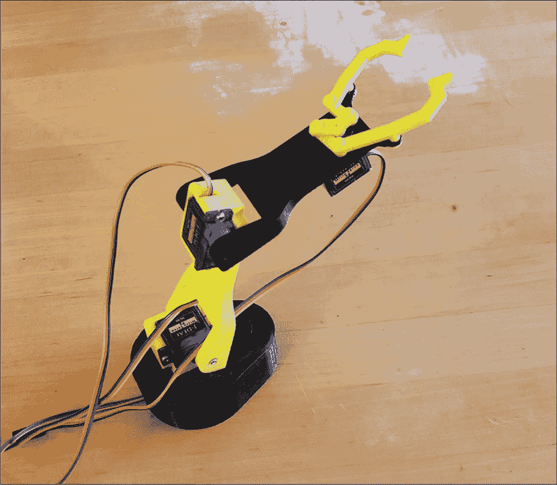
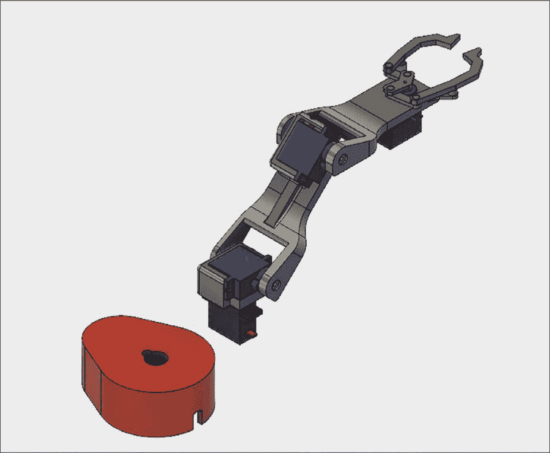
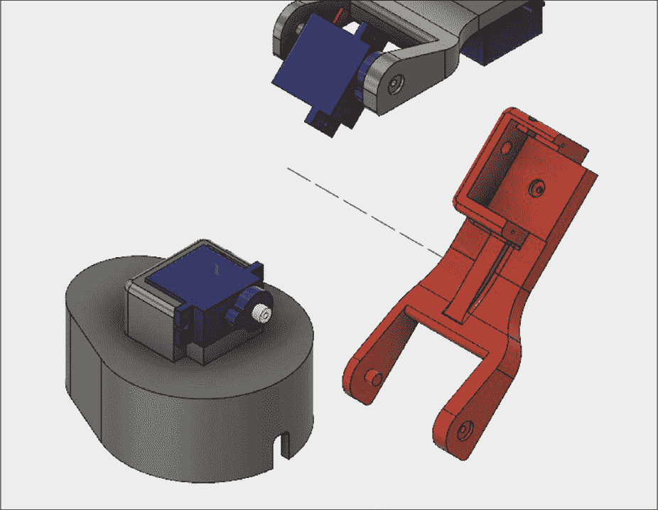
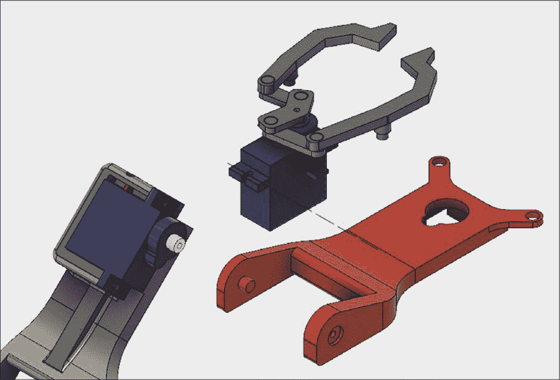
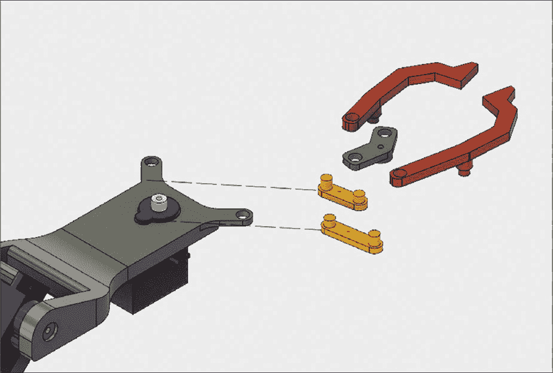

## 第十章：CAPSTONE 项目：创建机器人手臂**

在最终练习中，你将展示在本书中学到的技能，设计一个小型机器人手臂。这个手臂，如 图 10-1 所示，使用了四个小型 9G 爱好级舵机，这些舵机可以通过微控制器开发板的命令将电机旋转到特定位置。完成的机器人手臂将具有大约 7 英寸的伸展范围。它不能提起特别重的物品或进行高精度操作，但相对简单的结构是了解机器人学和多部件组装的良好入门。

本章不会指导你完成建模过程中的每一步。相反，你将学习足够的内容，自己决定如何建模各个部分。我们也不会涉及如何编程这个机器人手臂，因为那是一个独立的复杂话题。不过，如果你使用像 Arduino 这样的流行微控制器开发板，你可以在网上找到许多教程，详细说明如何控制舵机。

*图 10-1：完成的机器人手臂*

对于这个项目，你需要以下零件：

+   四个 2.5 kg·cm 停止扭矩 9G 爱好级舵机电机（任何品牌都可以）

+   Arduino 或类似的微控制器开发板

+   足够的 3D 打印机耗材来打印这些零件，重量应少于 0.1 kg

这个设计不使用任何轴承，你只需要舵机电机附带的螺丝。一点点的强力胶水可以帮助零件固定在一起，但如果你愿意，也可以设计一种其他方式来连接它们。

### 测量和建模你的舵机

虽然你需要购买这个项目中使用的舵机，但你也需要建模它们。虽然大多数 9G 爱好级舵机在大小和形状上非常相似，但不同制造商的型号之间常常会有一些小的差异。为了确保所有零件都能完美匹配，你需要精确地建模舵机的每个细节。

许多制造商提供带有舵机尺寸的图纸，因此你应该首先查看它们的官网，看是否可以找到这些信息。如果没有，你可以使用一套数字卡尺自己测量舵机。数字卡尺可以比尺子或卷尺更精确地测量特征之间的距离。你可以在网上找到价格不到 30 美元的便宜卡尺。在测量时，特别注意舵机与其他零件配合的地方，例如螺丝安装位置和电机轴。

### 建模机器人手臂的底座

有了舵机的模型，你可以开始设计手臂的 3D 打印部分。第一个部分——底座，如 图 10-2 中所示的红色部分——是一个泪珠形状，用来防止手臂在完全伸展时倾斜。

*图 10-2：底座模型，显示与其他组件分离的部分*

从创建一个直径为 60 毫米的圆形开始，然后将其拉长，形成水滴形状。底座应足够宽，以承受负载，但如果你的手臂倒下了，可以为它添加额外的稳定性元素。底座也应该是空心的。你将使用螺钉通过电机外壳上伸出的孔将第一个伺服电机固定在底座内侧，电机控制机器臂的肩部旋转。

伺服电机主体顶部，轴从其中伸出的位置，应该略高于底座的顶部表面，大约一两毫米，以提供足够的间隙。最后，在底部放置一个小的切口，以便伺服电机电缆可以通过，这样底座仍然可以平稳地放在表面上。

一旦你设计好了底座，将其与第一个伺服电机一起放入装配中。

### 肩部电机支架

接下来，你将建模第二个伺服电机的支架，如图 10-3 所示。这个部分将连接底座中的第一个伺服电机和第二个伺服电机。第一个伺服电机使整个手臂相对于底座旋转。第二个伺服电机则让手臂上下倾斜。支架应能支撑第二个伺服电机，使其侧卧放置。

*图 10-3：第二个伺服电机支架连接了伺服电机 1 和 2。*

在支架底部的中心创建一个孔，以便第一个伺服电机的轴可以穿过。这个孔的顶部还应有一个凹槽，以保持轴螺丝的头部低于表面。接下来，创建另外两个小孔，用于安装伺服电机的固定螺丝；将这些孔与伺服电机上的孔对齐。最后，创建一个通道和孔，以便伺服电机的电缆能够通过支架。注意图 10-3 中第二个伺服电机的方向，并确保你的通道和孔位于电缆出口的那一侧。

在支架的另一侧（与伺服电机输出轴相对）沿着轴的轴线创建另一个孔。你将使用这个孔来放置一个销钉，作为下一个部分的支点。这个孔必须与伺服电机的电机轴在同一轴线上，以确保运动的平稳性。一旦你完成支架建模，将其添加到你的装配中。

### 第三个电机支架和第一部分

接下来的部分，如图 10-4 所示，将同时作为手臂的第一部分和第三个伺服电机的支架。它在每一端都有平行的支点——一个用于第二个伺服电机，另一个用于第三个伺服电机。支点的一侧是销钉和孔，另一侧是伺服电机的中心轴和销孔。你可以将肩部电机支架的几何形状作为起始点进行重用，因为你将像安装第二个伺服电机一样安装第三个伺服电机。

*图 10-4：第三个伺服电机支架也是手臂的第一部分。*

第二个伺服电机铰链轴到第三个伺服电机铰链轴的距离应该约为 70 毫米。为另一侧制作 U 形，以便它能够围绕第二个伺服电机和安装支架安装。 在一侧创建一个孔，适合伺服电机轴，另一侧创建一个销钉，适合安装支架上的孔。最好为该部件添加一个肋条（部件中间的垂直条），以增加部件的刚性。将其添加到装配模型中，确保它可以自由旋转。

### 第四电机安装和第二段

与第一段模型一样，你可以通过复用一些几何图形来开始第二段模型。第二段安装到第三个伺服电机的区域与第一段安装到第二个伺服电机的区域完全相同。正如你在图 10-5 中看到的那样，必须从头开始创建的部分是另一端，即连接到夹爪机制的部分。

*图 10-5：复用第二段与第一段相同的侧面。*

在夹爪机制一侧，创建一个孔，就像在底座顶部为安装第四个伺服电机所创建的孔一样。在该侧的末端，建模两个 45 度的突出部分，孔径为 4 毫米，这将成为夹爪臂的铰链点。每个突出部分的长度大约为 12 毫米。再次将该部件添加到装配中，确保它可以自由移动。

### 夹爪机制

机器人臂的夹爪机制是整个项目中最复杂的部分。电机轴上的一个中心轴连接到两个短连杆，而这些连杆又连接到夹爪的臂。当中心轴旋转时，它推动连杆，使夹爪臂发生转动并闭合。

该机制复杂，因为伺服电机轴臂的长度、连杆以及夹爪的“手指”会影响其操作效果。如果其中一个项目设置错误，整个夹爪可能会卡住。因此，你需要在实际 3D 打印零件之前，在 CAD 中花时间实验不同的长度。首先从与图 10-6 相似的长度开始，并为它们添加关节。然后，移动机制，看看它是否完全打开和关闭。如果没有，调整长度并重新尝试。

*图 10-6：连杆的长度决定了夹爪的工作效果。*

在建模时，你需要将一个臂长做得比另一个长，以避免卡住。为了补偿这种不对称，你可以使中心轴的一侧比另一侧长。这使得夹爪能够在每一侧大致均匀地打开。

最后，在处理连接销和它们所配合的孔时要特别小心。销子需要有足够大的直径来保证强度，避免断裂，同时孔的配合要足够松动，以便自由移动。你可以在组装完成后 3D 打印小圆盘并用超级胶水将其固定在销子上，以保持连接件的位置，也可以设计带有卡扣的销子，使其卡入位置。

在你完成建模后，将这些零件添加到你的组装中，并确保它们都能完美地组合在一起。

### 打印零件并组装机器人臂

你可以在任何业余爱好者的 3D 打印机上使用 PLA 或 ABS 打印所有这些零件，包括熔融沉积建模（FFF）打印机。只有第二段在 3D 打印时需要支撑材料。你需要确保零件的密度足够高以保持强度，同时又不至于太重。25%到 50%的填充密度应当是理想的选择。

一旦你有了所有零件，组装它们就像用提供的螺钉安装伺服电机并将各个零件卡在一起那么简单。第二个和第三个伺服电机枢轴支架会紧密贴合，但稍加用力即可将其安装好。将每个零件放置到相应的伺服电机上后，使用随附的轴螺钉将它们固定牢固。然后，只需在夹爪连接销上涂一小滴超级胶水，将圆盘固定在连接销上，防止销子滑出。

组装好机械臂后，你可以将伺服电机的电缆连接到微控制器开发板上以控制机械臂。这些 9G 的业余伺服电机只使用少量电力，因此你可能不需要单独的电源；检查你的电机规格，看看它们需要多少电流以及你的微控制器开发板能提供多少电力。

### 总结

在你开始阅读本书之前，你可能不知道如何开始建模整个机器人臂。现在，只需最少的指导，你应该已经通过所学内容完成了这一目标。本章中的项目展示了你能利用本书所学的 CAD 技能完成多少工作。

无论是作为业余项目还是在你的职业生涯中，你都可以继续发展这些技能。虽然本书没有涉及 Fusion 360 的某些专用工具，但你对软件和 CAD 建模实践的工作知识应该能够帮助你理解这些工具，如果你有需要的话。到目前为止，你应该已经理解了*参数化 CAD 是如何工作的*。掌握 3D 建模不仅仅是知道如何使用工具，它需要一种特定的思维方式和前瞻性思维。现在，运用这种思维方式去应用到你的下一个项目中吧！
