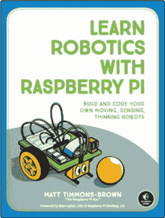
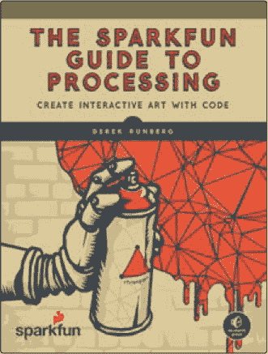
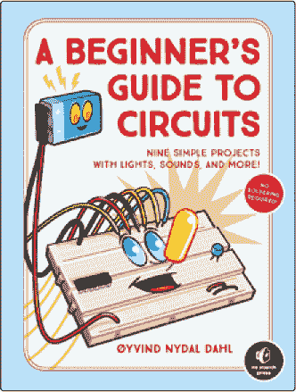
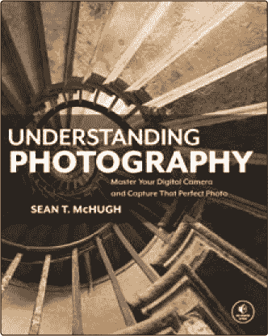

## 第十一章：索引

### 符号和数字

∨ (沉孔符号), 98

3D 打印工具, 42

### A

激活组件菜单选项, 50

动画工作区, 12, 101

美国国家标准协会 (ANSI), 3, 88

弧形工具, 19, 40

美国机械工程师学会 (ASME), 3, 92

装配体, 45

装配图, 94, 101

材料清单, 102

爆炸视图, 101

自动爆炸工具, 101

轴, 34

### B

材料清单 (BOM), 102

体, 46

边界边缘, 82

框工具, 21

### C

计算机辅助设计 (CAD), 4

计算机辅助制造 (CAM) 软件, 5

CAM 工作区, 12

中心线, 93, 97

中心标记, 93, 97

中心矩形, 22

坡口工具, 22, 37

更改参数菜单选项, 31, 55

圆形工具, 19

数控 (CNC), 12

卷绕工具, 21, 73–75

共面约束, 34

组件浏览器, 13

组件, 45, 46, 49

计算机辅助设计 (CAD), 4

计算机辅助制造 (CAM) 软件, 5

数控 (CNC), 12

约束, 18, 22, 34

构造几何体, 15

构造菜单, 49

构造平面, 47–49

沉孔选项, 57

沉孔符号 (∨), 98

从体创建组件菜单选项, 49

创建草图工具, 18, 22

切割拉伸, 28, 37

圆柱工具, 21

### D

贴花, 15

设计历史时间轴, 13, 28

尺寸标注, 97–99

尺寸, 24

显示设置菜单, 66

制图, 2–3, 87, 88–89

装配图, 94

材料清单, 102

爆炸视图, 101

标注, 97–99

线型, 93

中心线, 93, 97

中心标记, 93, 97

定间隔虚线, 93

实线, 93

部件图, 94–95

投影角度, 90–92

比例, 89–90

尺寸, 89

文本, 99–101

公差, 92–93

视图, 95–97

草图员, 2

绘图比例, 89–90

绘图大小, 89

绘图工作空间, 12, 95

### E

编辑特征, 29

爆炸视图, 101

延伸工具, 19

拉伸工具, 20, 25

### F

特征, 8–9。*另见* 工具

初始特征, 19–21

修改特征, 21–22

倒角工具, 19, 22, 26–27

第一角投影, 90, 91

固定约束, 67

Fusion 360, 6, 7

特征, 8–9

安装, 10–11

界面, 13–14

主工具栏, 14–16

项目浏览器, 11

工作空间, 9–10, 11–16

动画, 12, 101

CAM, 12

绘图, 12, 95

模型, 12。*另见* 模型工作空间

补丁, 12, 80

渲染, 12, 105

仿真, 12

### G

地面菜单选项, 52

导轨, 70

### H

孔工具, 20, 57–59

### I

插入符号工具, 98

国际标准化组织 (ISO), 3, 92

交集操作, 40

等轴视图, 97

### J

联接, 46, 52

### L

线工具, 18

线型

中心线, 93, 97

中心标记, 93, 97

定间隔虚线, 93

实线, 93

凹模工具, 62–64, 65

### M

制作菜单, 42

机械工程, 5

网格建模, xviii–xix

建模

20 面骰, 78–84

装配体, 45

线圈, 73–75

复杂曲线, 61

放样工具, 62–64, 65

扫掠工具, 62–64, 66

组件, 45, 46, 49

约束, 18, 22, 34

立方体, 22–28

设计历史时间轴, 28

尺寸, 24

铰链, 53–60

空心盒子, 46–52

接头, 46, 52

网格建模, xviii–xix

有机形状, 64

参数, xviii, 7

参数化建模, xviii–xx

铅笔盒, 38–42

参考几何, 14, 35, 47

机器人臂, 115

螺丝, 73, 75–78

实体建模工具, 12, 13. *另见* 模型工作区

球体, 34–38

弹簧, 73

茶壶, 64–71

模型参数部分, 31, 55

模型工作区, 12

组件浏览器, 13

设计历史时间轴, 13, 28

界面, 13–14

主工具栏, 14–16

原点, 14

功能区工具栏, 13

视图立方体, 13, 14

视口, 14

修改特征, 21–22

### N

导航工具栏, 14

新建体操作, 36

标称尺寸, 92

数控（NC）, 4

### O

偏移平面工具, 47, 66

偏移工具, 19

座标尺寸, 99

原点, 14, 22

输出菜单, 101

重叠, 40

### P

参数, xviii, 7

参数化建模, xviii–xx

部件图纸, 94–95

部件属性, 101

补丁工具, 82

补丁工作区, 12, 80

物理材料菜单选项, 94

管道工具, 21

螺距, 74

沿路径平面工具, 67

通过三点定义平面, 80

多边形选项

外接, 77

内接, 77

截面, 25

投影视图工具, 96

投影角度, 90–92

第一角投影, 90, 91

第三角投影, 90, 91

项目, 11

### R

矩形工具, 18

参考几何, 14, 35, 47

等间距虚线, 93

渲染, 103

恢复默认菜单选项, 16

修订, 101

旋转切割, 78

旋转工具, 20, 33–36

功能区工具栏, 13

### S

缩放工具, 84

螺丝, 73, 75–78

图纸尺寸设置, 95

壳体工具, 18–19

草图尺寸工具, 19

草图, 9

草图工具, 18–19

实线, 93

实体建模工具, 12, 13。*参见* 模型工作区

球体工具, 21

分割体工具, 47

弹簧, 73

拼接工具, 82

表面建模特征, 12

表面, 73, 78, 82

苏瑟兰, 伊万, 4

扫掠工具, 62–64, 66

### T

切线, 63

技术图纸, 1–3, 87–89。*参见* 绘图

文本工具, 85

第三角投影, 90, 91

螺纹工具, 73, 75–78

标题块, 89, 100

公差, 51, 92–93

公差堆叠, 99

工具, 17

弧, 19, 40

自动爆炸, 101

方块, 21

倒角, 22, 37

圆, 19

螺旋, 21, 73–75

创建草图, 18

圆柱, 21

延伸, 19

拉伸, 20

倒角, 19, 22, 26–27

孔, 20, 57–59

直线, 18

放样, 62–64, 65

偏移, 19

偏移平面, 47, 66

补丁, 82

管道, 21

沿路径平面, 67

投影视图, 96

矩形, 18

旋转, 20, 33–36

比例, 84

壳体, 22, 42, 50

草图尺寸, 19

草图工具, 18–19

球体, 21

分割体, 47

缝合, 82

扫描, 62–64, 66

文本, 85

线程, 73, 75–78

环形, 21

剪切, 19, 35

### U

用户参数部分, 31

### V

视图立方体, 13

视口, 14

视觉风格菜单, 66

### W

工作空间, 9–10, 11–16

动画, 12, 101

CAM, 12

绘图, 12, 95

模型, 12. *另见* 模型工作空间

补丁, 12, 80

渲染, 12, 105

仿真, 12

### Z

零点, 25

*3D 建模初学者指南* 使用了 New Baskerville, Futura, 和 Dogma 字体。

**资源**

访问 *[`www.nostarch.com/3Dmodelingformakers/`](https://www.nostarch.com/3Dmodelingformakers/)* 获取资源、勘误和更多信息。

*更多实用书籍来自*  **NO STARCH PRESS**

**学习用树莓派做机器人**

**构建和编程你的移动、感知、思考机器人**

*作者* MATT TIMMONS-BROWN

2019 年 1 月, 240 页, $24.95

ISBN 978-1-59327-920-2

*全彩*

**制作你自己的像素艺术**

**为游戏、动画等创建图形**

*作者* JENNIFER DAWE *和* MATTHEW HUMPHRIES

2019 年 3 月, 200 页, $19.95

ISBN 978-1-59327-886-1

*全彩*

**SparkFun 图解处理**

**使用代码创建互动艺术**

*作者* DEREK RUNBERG

2015 年 8 月, 312 页, $29.95

ISBN 978-1-59327-612-6

*全彩*

**电路初学者指南**

**九个简单项目：灯光、声音和更多！**

*作者* ØYVIND NYDAL DAHL

2018 年 10 月, 80 页, $17.95

ISBN 978-1-59327-904-2

*全彩*

**理解摄影**

**掌握你的数码相机并拍摄完美照片**

*作者* SEAN T. MCHUGH

2018 年 12 月, 240 页, $29.95

ISBN 978-1-59327-894-6

*全彩*

**树莓派家庭黑客**

**12 个项目让你监视家庭成员、修改 Minecraft、破解无线信号等等！**

*作者* DAN ALDRED

2019 年秋季, 136 页, $24.95

ISBN 978-1-59327-946-2

*全彩*

1.800.420.7240 或 1.415.863.9900 | SALES@NOSTARCH.COM | [WWW.NOSTARCH.COM](http://WWW.NOSTARCH.COM)

## 简单易学的 CAD 建模

*《3D 建模入门指南》*是一本基于项目、直观易懂的计算机辅助设计（CAD）入门书籍。你将学会如何使用全球最强大的免费 CAD 软件 Autodesk Fusion 360 来建模小工具、3D 打印设计，并像工程专业人士一样制作逼真的图像——不需要任何经验！

本书通过实践建模项目和逐步指南，介绍了基本的 3D 建模概念。在完成这些项目的过程中，你将掌握参数化建模的基础，学会如何创建自己的模型，从简单的形状到多部件装配。一旦掌握了基础，你将学习更高级的建模概念，如扫掠、放样、曲面和渲染，最后将所有这些知识结合起来创建一个机器人臂。

你将学到如何：

+   设计一个移动的机器人臂、门铰链、茶壶和一个 20 面骰子

+   创建用于制造和专利申请的专业技术图纸

+   建模弹簧和其他复杂曲线，创造逼真的设计

+   使用基本的 Fusion 360 工具，如拉伸、旋转和孔洞

+   掌握如线圈和螺纹等高级工具

无论你是制造者、爱好者还是艺术家，*《3D 建模入门指南》*肯定会教你如何将你的创意转化为专业模型。快去吧——把那台 3D 打印机擦一擦，输入你惊人的设计。

### 关于作者

Cameron Coward 是一位制造者，曾是机械设计师和制图员。他在医疗、汽车和家具行业中建模零件和装配件多年。目前，他专注于 3D 打印和其他爱好项目的 CAD 建模。他是*[Hackster.io](https://www.hackster.io/)*和*[Hackaday.com](http://Hackaday.com)*的常驻作者，也是*《白痴指南：3D 打印》*的作者。

*极致极客娱乐™*

[www.nostarch.com](http://www.nostarch.com)
