## 前言

本书将帮助你提高电子技能。我将教你如何解读电路图并使用面包板。然后，我将逐步演示如何在面包板上构建一个简单的电路。之后，你将自己动手：你需要依靠零件清单和电路图来构建电路。从电路图构建电路是每个对电子感兴趣的人必备的技能，从初学者到专家。

### 电路

随着你在书中的进度推进，电路变得越来越难以构建。以下是每个电路项目的简要描述：

+   **项目 1: 稳手游戏** 通过这个超简单的电路，你将创建一个类似 *手术* 风格的游戏，需要稳稳的手才能获胜。

+   **项目 2: 触摸启用的灯光** 使用触摸板，你将构建一个触摸启用的灯光开关，用你的手指打开灯光。

+   **项目 3: 饼干罐报警器** 通过这个饼干罐报警器保护你的饼干，它将通过蜂鸣声吓跑任何偷饼干的小偷。

+   **项目 4: 夜灯** 在这个项目中，你将构建一个在黑暗中自动开启的灯光，帮助你在夜间看清事物。

+   **项目 5: 闪烁的 LED** 在这个项目中，你将学习一些数字电子学的基础知识，并使用集成电路来闪烁 LED 灯。

+   **项目 6: 铁路道口灯** 使用铁路道口灯来增添你的模型火车套件，这是一种经典电路，任何人都应该在某个时候构建。

+   **项目 7: 派对灯光** 这个闪烁灯串是为即将到来的派对做准备的完美项目。

+   **项目 8: 数字钢琴** 从零开始构建你自己的乐器，并娱乐你的朋友和家人！

+   **项目 9: LED 跑马灯** 在这个最终的电路项目中，你将运用新技能创建一个令人惊叹的 LED 灯光秀。

你可以通过本书的官方网站找到电路资源，网址是 *[`nostarch.com/circuits/`](https://nostarch.com/circuits/)*。

### 所需材料

你构建本书中的电路所需的所有材料都便宜且易于找到。以下是你所需的所有电子元件列表。

**注意**

*这里显示的零件编号适用于 Jameco 电子公司* ([`www.jameco.com/`](https://www.jameco.com/))。*这些元件应该可以在任何电子供应商处找到。*

| **#** | **JAMECO 部件编号** | **数值** | **描述** |
| --- | --- | --- | --- |
| 1 | #198731 | 9 V 电池 | 标准 9 V 电池 |
| 1 | #109154 | 电池夹 | 连接电池到面包板的元件 |
| 1 | #20601 | 面包板 | 约有 400 个孔的面包板 |
| 20 | #2237044 | 跳线 | 至少包含 20 根面包板跳线的包装 |
| 1 | 包含在#2217511 中 | 100 Ω | 标准电阻器 |
| 4 | 包含在#2217511 中 | 1 kΩ | 标准电阻器 |
| 2 | 包含在 #2217511 中 | 10 kΩ | 标准电阻器 |
| 1 | 包含在 #2217511 中 | 100 kΩ | 标准电阻器 |
| 2 | 包含在 #2217511 中 | 470 Ω | 标准电阻器 |
| 2 | 包含在 #2217511 中 | 47 kΩ | 标准电阻器 |
| 1 | #151116 | 0.1 μF | 无极电容器 |
| 1 | #31000 | 4.7 μF | 极性电容器 |
| 2 | #94212 | 10 μF | 极性电容器 |
| 1 | #158394 | 100 μF | 极性电容器 |
| 2 | #254801 | BC547 | 任何通用型 NPN 晶体管都可以使用 |
| 10 | #333973 | LED | 标准发光二极管；所有二极管的正向电压（Vf）应大致相同 |
| 1 | #904085 | NE555 | 555 定时器集成电路 |
| 1 | #12749 | CD4017B | 4017 十进制计数器集成电路 |
| 1 | #44257 | 74C14 | 六输入施密特触发器反相器 |
| 4 | #119011 | 瞬时开 | 触感迷你按钮 |
| 1 | #202454 | LDR/光敏电阻 | 光依赖电阻（光敏电阻），在光线中约为 5 到 10 kΩ，在黑暗中为 200 kΩ 或更高 |
| 1 | #2239146 | 8 Ω 扬声器 | 迷你扬声器 |
| 1 | #2120452 | 蜂鸣器 | 适用于 9V 电池的有源蜂鸣器 |

准备好材料后，让我们开始吧！

### 如何在本书中构建电路

对于本书中的每个电路，我都提供了电路图和零件清单。*电路图*是显示如何连接组件以构建电子电路的图示（见图 1）。

**图 1** 该电路图展示了如何连接电池、电阻器和 LED。

零件清单告诉你应该使用的组件值——例如，470 Ω 的电阻器或 10 μF 的电容器。每个组件都有一个符号，这些符号通过线条连接，展示了如何连接组件。通过稍加练习，你将很快学会如何区分不同的符号。

#### 组件外观

在这一部分，我列出了每个组件，并附上了本书中使用的符号。你可能会在其他电子书籍或资料中看到相同组件的不同符号，但在本书中，它们将保持一致。

##### 电池

##### 电阻器

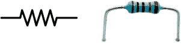

##### 无极电容器

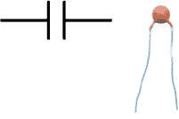

##### 极性电容器

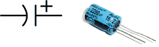

##### 发光二极管 (LED)

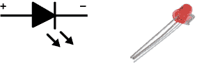

##### 光依赖电阻 (LDR)

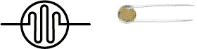

##### 晶体管

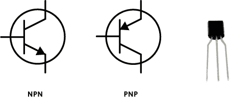

##### 按钮开关

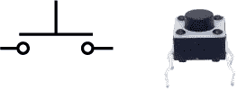

##### 扬声器

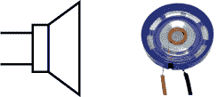

##### 蜂鸣器

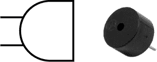

##### 集成电路

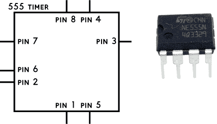

请注意，一些集成电路，如下图所示的施密特触发器反相器，使用的是表示其功能的符号，而不是方框符号。

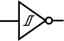

#### 在面包板上构建电路

*面包板*是一个非常简单的工具，用于构建电路。因为你不需要焊接——只需要插入组件——如果你以后想要构建其他东西，可以很容易地重复使用这些组件。

大多数面包板有两个组件区域和两个电源区域。我已经在图 2 中标注了这四个区域。每个组件区域中每行的五个孔——以数字标注——通过面包板内部的金属条连接。左侧组件区的行与右侧组件区的行没有连接。

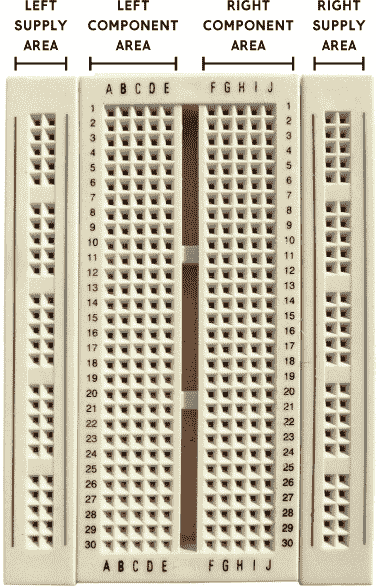

**图 2** 一个典型的面包板，标注了区域

组件的导线被称为它的*引脚*、*腿*或*引线*。要在两个组件之间建立连接，你需要将它们的引脚插入同一行的组件区域中。如果你无法在同一行连接它们，可以使用跳线将一个行连接到另一个行。

在图 3 中，电阻器的下引脚和 LED 的上引脚在第 7 行连接在一起。电阻器的上引脚和 LED 的下引脚没有与任何组件共享同一行，因此它们没有连接到任何东西。

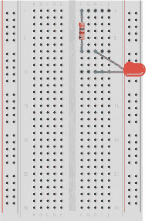

**图 3** 连接电阻器和 LED

电源区的孔是按列连接的。因此，如果你将电池的正极（或加）端连接到左侧电源区的左上角孔，从该列的顶部到底部的所有孔将连接到电池的正极端。

**注意**

*在更大的面包板上，电源区有时会分为四个区域：右上角、左上角、右下角和左下角。*
