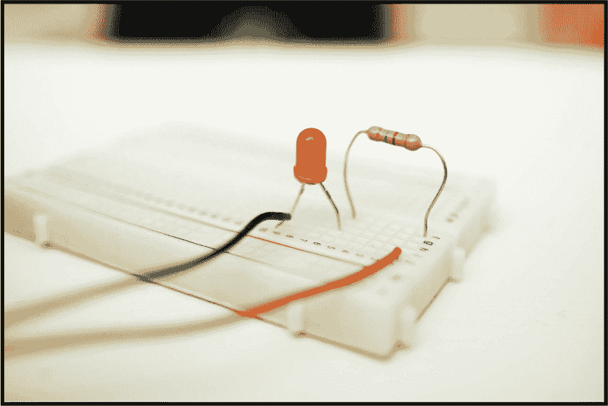
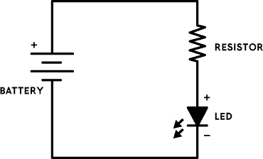
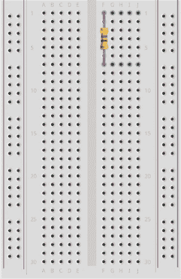
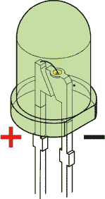
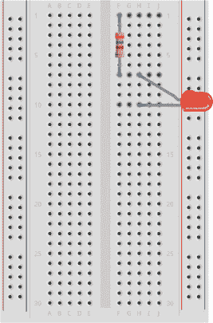
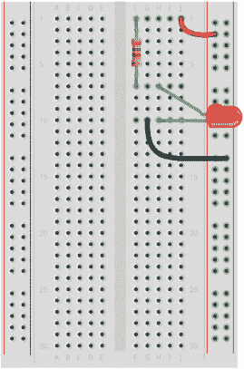
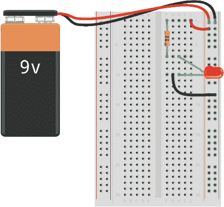

## 第一章：构建你的第一个面包板电路

这个简单的电路打开一个发光二极管（LED）。

### 电路图

### 部件清单

| **部件** | **数值** | **描述** |
| --- | --- | --- |
| 电池 | 9 V | 标准 9 V 电池 |
| 电池夹 |  | 将电池连接到面包板的组件 |
| 面包板 |  | 约有 400 个孔的塑料板 |
| 电阻器 | 470 Ω | 降低通过 LED 的电流的组件 |
| LED | 红色 | 标准输出的发光二极管 |
| 跳线 |  | 两根不同颜色的面包板跳线 |

### 构建电路

要构建这个电路，你只需要一块电池、一只电阻器和一个 LED。电阻器可以减少流过 LED 的电流。你始终需要在 LED 的串联电路中放置电阻器，但它放在 LED 前还是后都无所谓。当你在电路中串联电阻器时，整个电路中的电流会减少。如果不使用电阻器，你可能会损坏 LED。

#### 连接电阻器

对于这个电路，你需要一个 470 Ω（欧姆）的电阻器。如果仔细观察电阻器，你会注意到它上面有几条彩色的带子。这些颜色标识了电阻器的数值。要找到 470 Ω的电阻器，查找带有以下颜色带的电阻器：黄色、紫色、棕色和金色或银色（见图 1）。

**图 1** 一个 470 Ω的电阻器

将 470 Ω电阻器的一个引脚连接到 F 列的顶部行，并将另一个引脚连接到同一列的第 7 行，如图 2 所示。引脚连接的顺序无所谓；电阻器可以任意连接。

**注意**

*在《电阻器颜色编码》的第 64 页中，你将找到一个解释电阻器颜色编码的表格。*

**图 2** 连接电阻器到面包板

#### 连接 LED

现在你需要将 LED 连接到面包板。LED 有两个引脚，分别称为*阳极*和*阴极*。为了使 LED 工作，你需要将阳极连接到电池的正极（+），阴极连接到电池的负极（–）。为了简单起见，我们称它们为 LED 的正引脚和负引脚。我已经在图 3 中标注了它们。

**图 3** 带有正负引脚的 LED

有两种方法可以辨别哪个引脚是哪个。仔细查看你的 LED。如果一只引脚比另一只长，那就是正极引脚。如果两个引脚的长度相同，可以再仔细看看塑料外壳底部的圆边。外壳的一侧应该是平的，如图 3 所示；那就是负极引脚。如果你仍然难以区分两个引脚，可以将 LED 放在平面上滚动，直到找到平面的一侧。

将 LED 的正极引脚连接到 H 列第 7 行，然后将负极引脚连接到 H 列第 10 行。根据图 4 检查连接是否正确。

**图 4** 将 LED 与电阻串联连接

现在，LED 的正极引脚已连接到电阻——如电路图所示——但负极引脚就像电阻的上端引脚一样，尚未连接到任何东西。

#### 连接到电源列

接下来，你需要将来自面包板右侧电源区的导线连接到右侧元件区的相应行。

如果再次查看电路图，你会发现需要将电池的正极连接到电阻的最上端引脚——第 1 行的引脚。因此，使用跳线将第 1 行与电源区的正极列连接。通常，带有红线的列用作正极列（与电池夹的红线相匹配）。然后，将 LED 的负极引脚（第 10 行）连接到电源区的负极列。参考图 5 进行连接。

**图 5** 将元件区连接到面包板的电源区

#### 连接电池

你已经正确放置了元件，并且将它们正确连接到了电源区。现在，你只需要连接电池。

首先，将电池夹连接到电池，确保红黑线的裸露金属部分不接触。接着，将电池夹的红线连接到右侧电源区的正极列。最后，将电池夹的黑线连接到负极列。根据图 6 检查电路。

**图 6** 将电池连接到面包板的电源区

现在 LED 应该亮起了！

### 如果 LED 没有亮起怎么办？

如果 LED 没有亮起，请逐一检查面包板上的每个连接，确保一切按照前面的步骤准确连接。

如果所有连接都正确，但仍然没有反应，可能是 LED 连接反了。试着将 LED 反过来再试一次。

如果*仍然*没有反应，请使用“电阻色码表”中第 64 页上的表格检查电阻的阻值。你的电阻应该是 470Ω。

还是不行？那你的 LED 可能坏了，不幸的是，如果你直接将其连接到电池上——也就是没有与电阻串联，它很容易就会坏掉。更换你的 LED 再试试。

### 你已经准备好构建这九个电路了！

现在你已经完成了第一个面包板电路，几乎准备好进行本书中的九个电路项目了。不过，首先，我建议你稍微玩一玩你在本章中构建的电路。试着真正理解这些连接是如何使电路正常工作的。理解这一点对于构建本书中的其余电路至关重要。一个好的测试方法是，看你是否能仅凭电路图，在*左侧*的组件和电源区域重新构建电路。

对于本书中的所有电路，你需要一个面包板、一堆面包板跳线、电池和电池夹。但为了简便起见，零件清单中不会列出这些组件。

电路按照难度排序，从最简单的开始。挑战在于弄清楚如何将每个电路连接到面包板上。如果你没有电路经验，一些后面的电路可能会比较有挑战性，但诀窍是不要放弃。

你可以通过本书的网站找到所有电路的资源，网址是 *[`nostarch.com/circuits/`](https://nostarch.com/circuits/)*。
