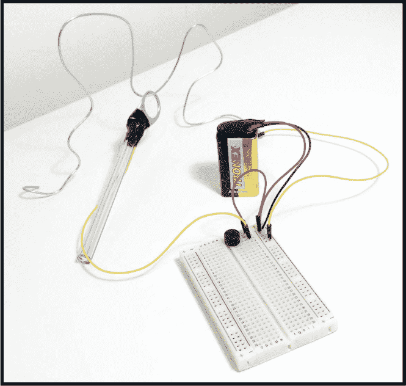
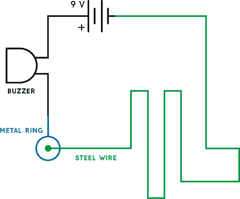
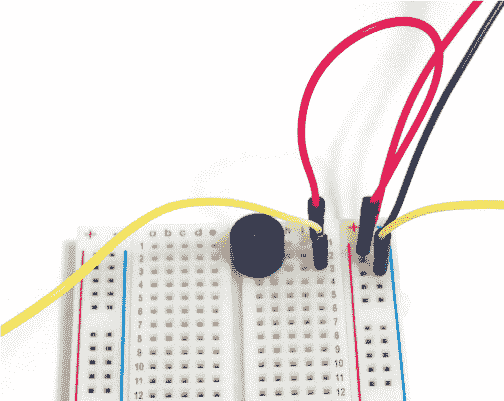
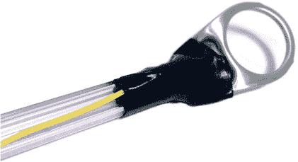

## 第二章：**稳手游戏**

如果让环接触到电线，这个电路将发出蜂鸣声。

### 电路图

### 零件清单

| **零件** | **描述** |
| --- | --- |
| 蜂鸣器 | 适用于 9 伏电池的蜂鸣器 |
| 钢丝 | 像衣架一样的裸金属钢丝 |
| 金属环 | 像可乐罐的金属环 |
| 一支旧钢笔 | 用于固定金属环的旧钢笔 |
| 胶带 | 电工胶带最好，但任何胶带都可以使用 |

### 关于电路

你可能小时候玩过一个叫*手术*的游戏，在这个游戏里，你扮演一位外科医生，使用镊子从病人身上移除各种奇怪的小病症（比如脑冻结和抽筋）。如果你不小心触碰到了错误的地方，恐怖的蜂鸣声就会响起，病人的鼻子会亮起红灯。

在这一章中，你将制作一个稳手游戏，它与*手术*游戏类似，但目标是将一个金属环沿着一根钢丝轨道移动，不能让环碰到钢丝。如果你能将环移动到另一侧而不接触电线，你就赢了。如果环接触到电线，蜂鸣器就会响起，你就输了。

这个电路的基本原理是，电子设备中必须有一个*闭合回路*——电流能够流动的从电池正极到负极的连续路径。当金属环没有接触到钢丝时，你没有闭合回路，因此不会发生任何事情。当环接触到钢丝时，就形成了闭合回路，蜂鸣器就会响起。

#### 将电池连接到蜂鸣器

电路本身很简单。你只需要将蜂鸣器和电池连接起来，在电路图中的黑色部分连接到面包板。确保蜂鸣器上的正极（+）朝向电池的正极端子。记住，电池夹的红线连接到电池的正极端子。

加入两根松动的跳线电缆——一根连接到蜂鸣器的负极（–），一根连接到电池的负极端子（如图 1-1 中的两根黄色电线）。

**图 1-1** 将电池连接到蜂鸣器

现在，你只需要创建一个游戏轨道，并将其集成到电路中。

#### 制作游戏轨道

为了制作游戏轨道，使用衣架上的钢丝，将其弯曲成你想要的形状。使用来自电池负极连接处的松动跳线电缆和一些胶带将钢丝连接到面包板，如图 1-2 所示。确保跳线电缆末端的金属部分接触钢丝，这样它们之间就有良好的电气连接。

**图 1-2** 将跳线电缆固定在游戏轨道上

任何类型的胶带都可以使用，但我推荐使用电工胶带，因为它能很好地粘附在金属上。

#### 将金属环连接到面包板

对于金属环，你可以使用像图 1-3 中展示的那种罐子的拉环。

**图 1-3** 使用罐子里的金属环环绕轨道。

将金属环和跳线的松散一端从蜂鸣器的负极处粘到旧钢笔的一端，确保跳线与金属有良好的连接（参见图 1-4）。钢笔为玩家提供了在轨道转弯时容易抓住的物体。

**图 1-4** 将金属环粘到钢笔上

就是这样！电路完成了，现在你可以测试你的手稳不稳了！

### 常见错误

如果电路无法正常工作，请仔细检查是否犯了这些常见错误：

+   没有在跳线和轨道之间建立良好的连接

+   没有在跳线和金属环之间建立良好的连接

+   将蜂鸣器连接错误（记得它有正负极）

如果你仍然在这电路上遇到困难，可以通过本书的官方网站获取更多资源，*参见[`nostarch.com/circuits/`](https://nostarch.com/circuits/)*。

### 一个安静的替代方案

如果你更喜欢一个没有噪音的游戏——这样你就可以不打扰别人——你可以修改游戏，用 LED 代替蜂鸣器。只需将电路中的蜂鸣器替换为 LED。别忘了将 LED 与电阻串联（就像你的第一个面包板电路那样）；否则，你可能会损坏 LED。
