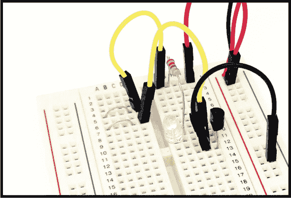
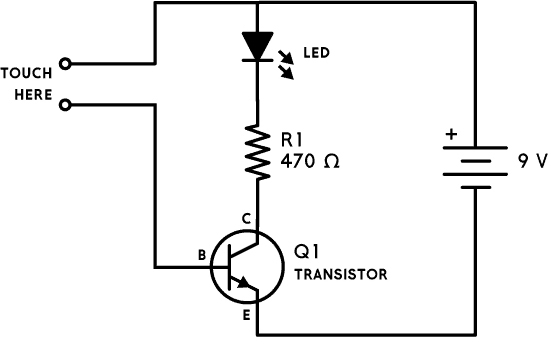
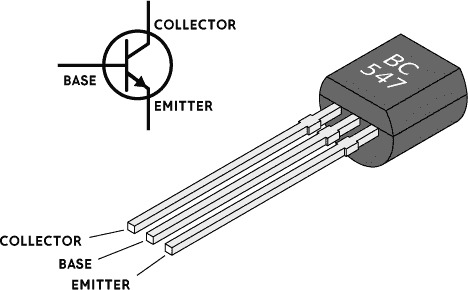
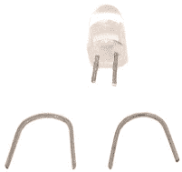

## 第三章：触摸启用的灯光

当你触摸由两根未绝缘导线组成的触摸板时，点亮 LED。

### 电路图

### 部件清单

| **部件** | **值** | **描述** |
| --- | --- | --- |
| R1 | 470 Ω | 标准电阻 |
| LED | 红色/黄色/绿色 | 标准输出发光二极管 |
| Q1 | BC547 | 通用 NPN 晶体管 |

### 介绍晶体管

在这个电路中，你将使用一个晶体管——特别是一个*NPN 晶体管*。它有三个引脚：

+   顶部引脚：集电极

+   中间引脚：基极

+   底部引脚：发射极

不用担心引脚名称的含义——只需将它们视为标签即可。

将晶体管转动，使其标签面朝向你，并将引脚与图 2-1 进行对比。然而，请注意，不同的制造商可能会以不同方式排列引脚。在使用新晶体管时，最安全的做法是查看晶体管的文档或*数据表*，确认引脚布局。

**图 2-1** 一个 NPN 晶体管及其引脚布局

### 关于电路

在这个项目中，你将通过将两根未绝缘导线做成触摸板来制作一个触摸传感器。通过使用晶体管，你可以检测到有人触摸触摸板，并点亮一盏灯。当有人触摸触摸板时，他们手指上的高电阻将晶体管的基极与电池的正极连接起来。这完成了从电池正极到负极的电流路径，并允许微小的电流从基极流向发射极。

电流非常小，因为人类皮肤是一个较差的导体，具有较高的电阻；电流太弱，无法直接点亮 LED，这就是我们需要晶体管的原因。从基极到发射极的微小电流将使晶体管“导通”，以便更大的电流可以从集电极流向发射极。只有当晶体管导通时，电流才会流过 LED 和电阻，从而使 LED 亮起。

当没有人触摸触摸板时，基极保持未连接状态，因此不会有电流流经该引脚，LED 也不会亮起。

要制作触摸板，请按图 2-2 所示剪掉 LED 的引脚一部分。然后将它们水平放置在两排上，留一个孔用于将触摸板连接到电路的其余部分。

**注意**

*不要让触摸板的两个金属垫在电池连接时发生接触。如果它们接触，很多电流将从基极流向发射极，这可能会损坏晶体管，使其无法使用。*

**图 2-2** 剪下 LED 的引脚用于制作触摸板

将剪下的引脚水平排列在两排上。确保每排都留出一个孔，以便将触摸板连接到电路的其余部分。

### 常见错误

如果电路无法工作，确保你没有犯下以下常见错误：

+   搞错了晶体管的引脚

+   通过让触摸板的两个金属垫直接接触来损坏晶体管

+   LED 连接反向

+   干燥的指尖；可以试着稍微湿润一下手指（湿润的皮肤具有较低的电阻，允许更多的电流通过）

如果你仍然在这电路上遇到困难，可以通过本书的网站找到更多资源，网址是 *[`nostarch.com/circuits/`](https://nostarch.com/circuits/)*。

### 电路如何工作

要让电流在电路中流动，你需要从电池的正极到负极有一条路径。如果没有这条路径，电流就无法流动，LED 也无法点亮。将晶体管“打开”可以使电流从其集电极流向发射极。

要打开晶体管，你需要让电流从基极流向发射极，这样就能让电流从集电极流向发射极。流经基极到发射极的电流量控制着从集电极到发射极能流过多少电流。

你可以通过晶体管的*电流增益*找到基极-发射极电流与集电极-发射极电流之间的关系。增益通常称为 h[FE] 或 β（贝塔）。对于你在这里使用的这种通用型晶体管，电流增益大约是 100。也就是说，集电极-发射极电流最大可以是基极-发射极电流的 100 倍。

在这个电路中，当没有人触摸触摸板时，从基极到发射极没有电流流动。这意味着晶体管是“关闭”的，电流不会流过电阻和 LED。

当你触摸触摸板时，你的手指充当了从电池正极到晶体管基极的电阻。微小的电流从基极流到发射极，这会导致从集电极到发射极的更大电流流动。电流还会流过你的 LED，将其点亮。
