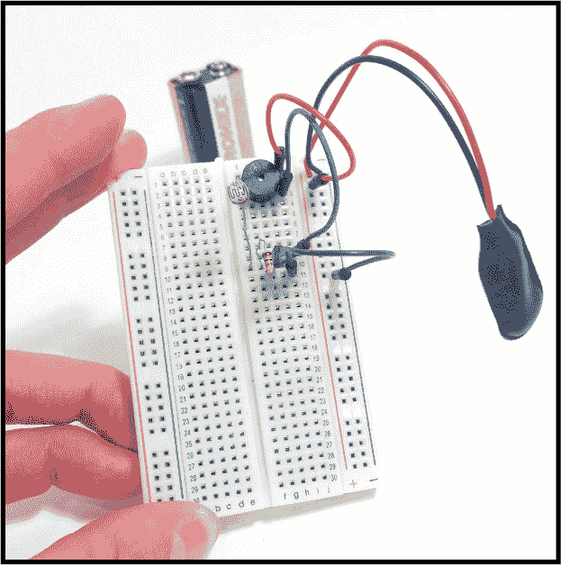
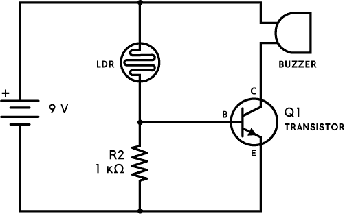
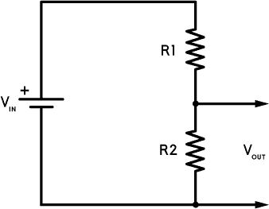
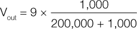
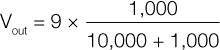

## 第四章：饼干罐报警器

当检测到光线时，这个报警器会发出声音。

### 电路图

### 元件清单

| **元件** | **数值** | **描述** |
| --- | --- | --- |
| LDR | 200 kΩ | 光敏电阻（光电阻），在光照下电阻约为 5 到 10 kΩ，在黑暗中电阻为 200 kΩ 或更高 |
| Q1 | BC547 | 任何通用的 NPN 晶体管 |
| R2 | 1 kΩ | 标准电阻器 |
| 蜂鸣器 |  | 使用 9 V 电池的有源蜂鸣器 |

### 关于电路

你想阻止人们从你的饼干罐里偷饼干吗？或者防止间谍窥探你的宝箱？那么这个电路就是为你准备的。

当电路处于黑暗环境中时，它保持安静，比如放在有盖子的饼干罐里。但是一旦盖子被拿掉，光线进入电路，电路就会发出警报，应该能把任何偷饼干的人吓跑。

电路使用 *光敏电阻（LDR）* 来检测光线。它的电阻在检测到更多或更少光线时会发生变化。LDR 检测到的光线越多，电阻越低。

LDR 和 R2 组成一个 *分压器*，它控制晶体管基极的输入电压量，根据检测到的光线强度来切换晶体管的开关。

一旦你的电路完成，你可以把它放进饼干罐或宝箱里，以保护你的珍贵物品。

### 常见错误

如果电路无法正常工作，请检查以下内容：

+   R2 的电阻值过高或过低。请参考 “电阻颜色编码” 中的内容，查看 第 64 页 来帮助你解读电阻的颜色编码。

+   你把晶体管连接错了。如果你需要复习如何连接 NPN 晶体管，请参考 项目 2。

如果你想让电路对光的敏感度更高或更低，可以用更高（更敏感）或更低（不太敏感）的电阻值替换 R2。

如果你对这个电路有疑问，可以通过书籍网站获取更多资源，网址是 *[`nostarch.com/circuits/`](https://nostarch.com/circuits/)*。

### 电路工作原理

只有当电流通过蜂鸣器时，它才会发出声音，电流只能在电池正极与负极之间有一条路径时流动。这意味着只有当晶体管“开启”时，警报才会响起，这样电流才能从电池的正极通过蜂鸣器，再从晶体管的集电极流向发射极，最后回到电池的负极。

正如你在 项目 2 中看到的那样，为了让晶体管“开启”，需要从其基极流向发射极的电流。只有当基极与发射极之间的电压约为 0.7 V 时，电流才会流动。当电压远低于 0.7 V 时，基极和发射极之间没有电流流动，晶体管处于关闭状态。

在图 3-1 中的电路图中，你可以看到基极到发射极的电压等于 R2 两端的电压。

**图 3-1** 创建电压分压器

LDR 和 R2 连接形成一个电压分压器。LDR 在这个电路图中是 R1。计算电压分压器输出电压的公式是：

如果是黑暗环境，LDR 的电阻约为 200 kΩ或更高，而 R2 始终是 1 kΩ。你使用的是 9 V 电池，所以 V[in]是 9 V。如果将这些数值代入公式，你会得到：

这样，你会得到一个约为 0.04 V 的 V[out]，这个电压太低，晶体管无法导通。

如果是光照环境，LDR 的电阻约为 10 kΩ或更低。将这个值代入电压分压器公式，你将得到：

在这种情况下，V[out]约为 0.8 V。这超过了从基极到发射极流动电流所需的 0.7 V，因此晶体管“导通”，允许电流通过蜂鸣器、集电极和发射极，从而发出警报。
