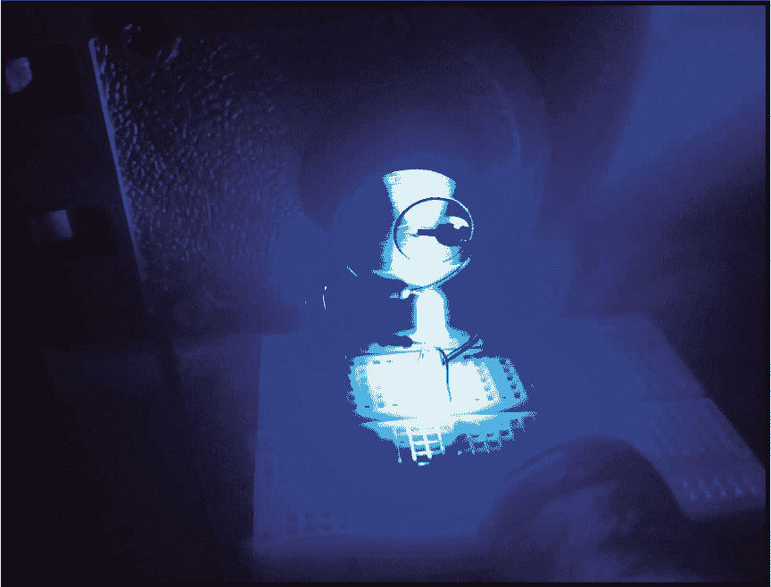
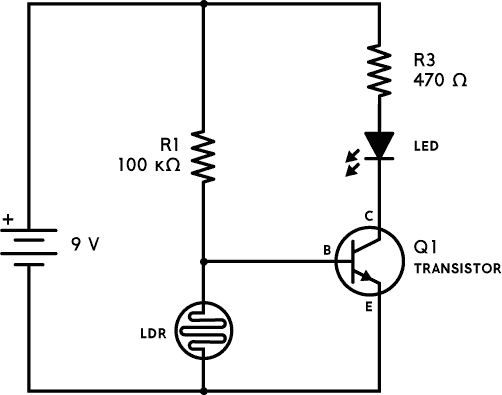
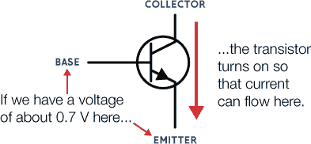
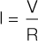

## 第五章：夜间灯

这个电路是一个在黑暗中点亮的夜间灯。

### 电路图

### 元件清单

| **元件** | **数值** | **描述** |
| --- | --- | --- |
| LDR | ~10 k 至 ~200 kΩ | 光敏电阻（光电阻），在光照下约为 5 至 10 kΩ 阻值，在黑暗中则为 200 kΩ 或更高 |
| Q1 | BC547 | 任意通用型 NPN 晶体管 |
| R1 | 100 kΩ | 标准电阻 |
| R3 | 470 Ω | 标准电阻 |
| LED |  | 标准输出发光二极管 |

### 关于电路

这个电路会在黑暗时点亮 LED。白天时，光线会使其熄灭，而在夜晚，它可以帮助你看到像前门钥匙孔或床头柜上的水杯之类的东西。

这个电路与 项目 3 中的电路类似，但在这里，晶体管控制的是一个 LED，而不是蜂鸣器。请记住，LED 必须串联一个电阻来限制电流。

此外，组成电压分压器的电阻和光敏电阻（LDR）已交换了位置，电压分压器将电压设置到晶体管的基极。

在 项目 3 中，LDR 是电压分压器的上半部分电阻。因此，当 LDR 的阻值 *低* 时——也就是当它感应到打开的曲奇罐中的光线时——晶体管会打开。在这个电路中，LDR 是电压分压器的下半部分电阻。这意味着当 LDR 的阻值 *高* 时，晶体管才会打开 LED，而这种情况发生在黑暗中。

### 常见错误

如果你的电路没有正确工作，请检查以下问题：

+   R1 的阻值太高，导致 LED 永远无法点亮。如果你更改 R1，它的阻值必须不小于 1 kΩ（见下文的“电路如何工作”部分）。

+   R1 的阻值太低，导致 LED 始终亮起。

+   你使用了错误的 R3 值——阻值太大或太小。

+   你连接了错误的晶体管极性。

+   你连接了错误的 LED 极性。

你可以通过更改 R1 的阻值来调整电路的光敏度，但如前所述，其阻值不能小于 1 kΩ（否则可能会损坏晶体管）。

如果你仍然对这个电路感到困惑，可以通过书籍的网站找到更多资源，网址是 *[`nostarch.com/circuits/`](https://nostarch.com/circuits/)*。

### 电路如何工作

就像在曲奇罐警报电路中一样，LDR 和电阻（R1）组成了该电路中的电压分压器。但由于 LDR 现在位于电压分压器的下半部分（在晶体管基极与负电池端之间），它的工作方式与曲奇罐警报电路相反。在这个电路中，当黑暗中 LDR 阻值较高时，晶体管基极的电压会足够高，从而使 LED 点亮（如 图 4-1 所示）。这意味着晶体管在黑暗时打开 LED。

**图 4-1** 从基极到发射极的电流量决定了从集电极到发射极的电流量。

我为这个项目使用的 LDR 在光照下的电阻大约是 5 到 10 kΩ。当使用 100 kΩ电阻（R1）时，当 LDR 的电阻值超过大约 10 kΩ时，LED 就会亮起。

这个电路有一个有趣的特点，那就是 R1 电阻还决定了 LED 的最大亮度。这是因为 R1 决定了流入晶体管基极的电流量，而这又决定了流入集电极的电流量。

对于像你在这个项目中使用的通用型晶体管，从集电极到发射极的电流最大可以是从基极到发射极电流的 100 倍。

这意味着，如果有 0.1 mA 的电流从基极流向发射极，则从集电极到发射极的电流最多可以达到 10 mA。如果从集电极到发射极的最大电流是 10 mA，那也就是 LED 中能够流过的最大电流。

流入晶体管基极的电流必须首先流过 R1\. 并不是所有流过 R1 的电流都会进入基极——其中一些会流经 LDR——但是当光线暗时，LDR 的电阻非常高，为了简化计算，可以认为所有电流都流入基极。

计算 R1 电流（I）其实非常简单。只需要找到电阻两端的电压（V），然后除以电阻值（R）：

这个计算基于*欧姆定律*，它描述了电压、电阻和电流之间的关系。你可以在* [`www.build-electronic-circuits.com/ohms-law/`](https://www.build-electronic-circuits.com/ohms-law/)* 了解更多关于欧姆定律的内容。

电阻上端的电压很容易计算。它是 9V，因为它连接到电池的正极，那么下端的电压呢？由于你正在寻找通过晶体管的最大电流，只有在晶体管开启时查看电流才有意义。当晶体管开启时，基极的电压大约是 0.7V。

所以你一边有 9V 电压，另一边有 0.7V 电压。这意味着电阻 R1 两端的电压是 8.3V。根据欧姆定律，你可以将 8.3V 除以 100,000Ω（=100 kΩ）得到 0.000083A（=0.083 mA），因此通过 LED 和进入晶体管集电极的最大电流是 100 倍，或者是 8.3 mA。

由于 R1 限制了流过 LED 的电流，因此在这个电路中，你实际上可以省略掉 R3 电阻，R3 的作用也是限制 LED 的电流。
